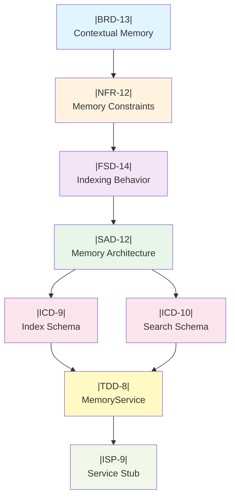


# MAGGIE Framework Documentation Hierarchy: Comprehensive Technical Analysis

## Executive Summary

This report provides a complete analysis of the MAGGIE Development Documentation Roadmap (DDR) hierarchical structure, establishing precise classification criteria, boundary definitions, and practical examples for each documentation tier. The DDR implements a seven-tier cascade from strategic business context through executable code stubs, enforcing strict traceability and vertical consistency across all layers.

----------

## 1. Documentation Hierarchy Overview

### 1.1 Architectural Philosophy

The DDR implements a **waterfall-traceable, LLM-optimized documentation architecture** where each tier answers a specific question and enforces parent-child citation relationships:

~~~
BRD (Why?)
  ↓ cites
NFR (Within what constraints?)
  ↓ cites
FSD (What capabilities?)
  ↓ cites
SAD (How structured?)
  ↓ cites
ICD (What contracts?)
  ↓ cites
TDD (What components?)
  ↓ cites
ISP (What code?)

~~~

**Key Principles:**

-   **Unidirectional Authority:** Child tiers cite parent tiers using `← |PARENT-TAG|` syntax
-   **Atomic Traceability:** Every requirement/specification has a unique, immutable tag (e.g., `|BRD-5.2|`)
-   **Persona-Driven:** Each tier assumes a distinct stakeholder perspective
-   **LLM-Parseable:** Strict formatting enables automated validation and consistency checking

----------

## 2. Tier-by-Tier Boundary Definitions

### 2.1 BRD — Business Requirements Document

**Tier Position:** Layer 1 (Root)
**Answers:** "Why are we building this?"
**Persona:** Executive Strategist / Product Owner
**Scope:** Strategic objectives, business justification, stakeholder needs

#### Classification Criteria

**INCLUDE if information:**

1.  Describes the fundamental **business problem** being solved
2.  Defines **strategic objectives** independent of technical implementation
3.  Articulates **stakeholder value propositions**
4.  Establishes **success metrics** at the organizational level (uptime SLAs, user satisfaction)
5.  States **high-level scope** boundaries (what's in/out of MVP)
6.  Identifies **environmental/operational constraints** (offline requirement, privacy mandates)

**EXCLUDE if information:**

1.  Specifies technical architectures, patterns, or technologies
2.  Defines data structures, APIs, or protocols
3.  Describes implementation details or algorithms
4.  Contains hardware specifications beyond environmental context
5.  Provides numeric performance targets more granular than SLAs

#### Qualification Rubric
| Criterion | BRD-Appropriate | Not BRD-Appropriate |
|:--|:--|:--|
| **Abstraction Level** | "Enable privacy-preserving AI" | "Use local TCP sockets" |
| **Stakeholder Focus** | "End users require offline capability" | "Runtime process uses ONNX" |
| **Temporal Scope** | "Strategic objective for 2025-2026" | "Queue timeout = 100ms" |
| **Justification Type** | "Competitive advantage" | "Prevents memory leak" |
| **Success Measure** | "99.9% uptime SLA" | "<1ms dispatch latency" |

#### Real-World Examples

**Example 1: Strategic Objective (INCLUDE)**

~~~
|BRD-2|: "Enable responsive, privacy-preserving AI assistant capabilities
without dependency on cloud infrastructure."

~~~

-   **Why BRD:** States a business-driven technology mandate (privacy, offline)
-   **Not Lower Tier:** Doesn't specify _how_ (multi-process, ZeroMQ)

**Example 2: Stakeholder Problem (INCLUDE)**

~~~
|BRD-4|: "Users require AI assistant capabilities but are constrained by
internet dependency, privacy concerns, and single-process limitations."

~~~

-   **Why BRD:** Describes the market/user pain point, not the solution
-   **Not Lower Tier:** Doesn't prescribe architecture

**Example 3: Incorrectly Classified (EXCLUDE)**

```
BAD: |BRD-X|: "Use ZeroMQ ROUTER-DEALER pattern for IPC"

```

-   **Why Not BRD:** This is a technical architecture decision (belongs in SAD)
-   **Correct Classification:** |SAD-1.1| ← |BRD-5| (traces to "offline framework" scope)

**Example 4: Scope Boundary (INCLUDE)**

```
|BRD-5.2|: "Local LLM, TTS, and STT inference."

```

-   **Why BRD:** Defines functional scope at the capability level
-   **Not Lower Tier:** Doesn't specify models, frameworks, or APIs

----------

### 2.2 NFR — Non-Functional Requirements

**Tier Position:** Layer 2
**Answers:** "Within what constraints must the system operate?"
**Persona:** Systems Administrator / Performance Engineer
**Scope:** Hardware limits, performance targets, reliability thresholds, security boundaries

#### Classification Criteria

**INCLUDE if information:**

1.  Specifies **hardware resource limits** (CPU model, VRAM capacity, RAM allocation)
2.  Defines **quantitative performance targets** (latency thresholds, throughput minimums)
3.  Establishes **reliability/availability requirements** (fault tolerance, uptime)
4.  States **security constraints** (network isolation, encryption requirements)
5.  Mandates **technology dependencies** (Python 3.11+, CUDA toolkit)
6.  Prescribes **resource utilization bounds** (max CPU %, memory footprints)

**EXCLUDE if information:**

1.  Describes business objectives or user value propositions
2.  Defines functional behavior or capabilities
3.  Specifies implementation details (class names, method signatures)
4.  Describes data schemas or message formats
5.  Provides architectural patterns (unless as constraints)

#### Qualification Rubric


| Criterion | NFR-Appropriate | Not NFR-Appropriate |
| :--- | :--- | :--- |
| **Measurability** | "<1ms dispatch latency" | "Fast IPC communication" |
| **Constraint Type** | "RTX 3080 10GB VRAM limit" | "Use GPU for inference" |
| **Enforcement** | "No process shall block >5s" | "Core routes messages" |
| **Scope** | "All communication via 127.0.0.1" | "ROUTER binds to :5555" |
| **Invariance** | "Python >=3.11 required" | "Import zmq.Context" |

#### Real-World Examples

**Example 1: Hardware Constraint (INCLUDE)**

```
|NFR-1.2|: "GPU: RTX 3080 10GB VRAM (Runtime/Inference only)."

```

-   **Why NFR:** Specifies non-negotiable hardware boundary
-   **Traces To:** |BRD-6.1| ("High-end consumer workstation")
-   **Downstream Impact:** TDD must design around 10GB VRAM limit

**Example 2: Performance Target (INCLUDE)**

```
|NFR-4.1|: "IPC Dispatch: Sub-millisecond (<1ms) for metadata-only messages."

```

-   **Why NFR:** Quantifiable performance requirement
-   **Traces To:** |BRD-8.1| ("Sub-250ms IPC dispatch")
-   **Downstream Impact:** SAD must choose non-blocking I/O patterns

**Example 3: Reliability Constraint (INCLUDE)**

```
|NFR-5.1|: "No process shall block waiting for another during standard IPC."

```

-   **Why NFR:** Non-functional reliability requirement
-   **Traces To:** |BRD-3.4| ("Reduce downtime through multi-process isolation")
-   **Downstream Impact:** SAD mandates receiver threads + queues

**Example 4: Incorrectly Classified (EXCLUDE)**

```
BAD: |NFR-X|: "Core process routes messages between UI and Runtime"

```

-   **Why Not NFR:** This describes functional behavior, not constraints
-   **Correct Classification:** |FSD-1.1| ← |NFR-5.1| (constraint on blocking)

----------

### 2.3 FSD — Feature Specification Document

**Tier Position:** Layer 3
**Answers:** "What does the system do?"
**Persona:** Product Manager / Business Analyst
**Scope:** System capabilities, functional behavior, user-facing features, workflows

#### Classification Criteria

**INCLUDE if information:**

1.  Describes **user-observable capabilities** (voice interaction, wake word detection)
2.  Defines **system behaviors** in response to events (state transitions, error handling)
3.  Specifies **feature workflows** (audio pipeline stages, intent resolution)
4.  Articulates **functional responsibilities** per component (Core routes, Runtime infers)
5.  States **business logic rules** (only send wake word if Core is idle)
6.  Describes **data flows** at the conceptual level (Audio → Core → Runtime)

**EXCLUDE if information:**

1.  Specifies technical implementations (socket types, thread models)
2.  Defines data schemas, protocols, or message formats
3.  Describes class structures or method signatures
4.  Provides performance metrics or resource limits
5.  States business objectives without functional specifications

#### Qualification Rubric


| Criterion | FSD-Appropriate | Not FSD-Appropriate |
| :--- | :--- | :--- |
| **Observability** | "UI reflects HSM state visually" | "UI uses PySide6 framework" |
| **Action Trigger** | "Wake word detection transitions to Active" | "Porcupine engine runs on CPU" |
| **Capability** | "System supports STT, TTS, LLM inference" | "Runtime uses ONNX Runtime GPU" |
| **Workflow** | "Audio → Core → Runtime → Core → UI" | "Messages use ROUTER-DEALER pattern" |
| **Business Rule** | "Only emit WAKE_WORD if Core is Idle" | "Check state via HSM trigger guard" |

#### Real-World Examples

**Example 1: Functional Capability (INCLUDE)**

```
|FSD-5.1|: "Execute transcription using faster-whisper (ONNX) on audio
buffers routed from Audio Service."

```

-   **Why FSD:** Describes what the system does (STT capability)
-   **Traces To:** |BRD-5.2| (Local STT inference), |NFR-1.2| (GPU constraint)
-   **Downstream:** SAD defines routing topology, ICD defines message schema

**Example 2: Behavioral Rule (INCLUDE)**

```
|FSD-4.2|: "Must only send WAKE_WORD_DETECTED if Core is in idle state."

```

-   **Why FSD:** Specifies conditional functional behavior
-   **Traces To:** |BRD-5.6| (HSM orchestration)
-   **Downstream:** TDD implements state query mechanism

**Example 3: Workflow Definition (INCLUDE)**

```
|FSD-8|: "Intent Resolution (The 'Brain')"
  |FSD-8.1|: Core accepts inputs (VOICE, CLI, GUI) as uniform text strings.
  |FSD-8.3|: IF input matches Registry Key → Execute immediately.
  |FSD-8.4|: IF no match → Forward to LLM Service.

```

-   **Why FSD:** Describes the decision-making workflow
-   **Traces To:** |BRD-5.6| (HSM orchestration)
-   **Downstream:** TDD defines `command_registry` structure

**Example 4: Incorrectly Classified (EXCLUDE)**

```
BAD: |FSD-X|: "Core uses zmq.ROUTER socket bound to tcp://127.0.0.1:5555"

```

-   **Why Not FSD:** This is implementation detail (architecture/protocol)
-   **Correct Classification:** |SAD-3.2| (Integration Strategy) ← |FSD-1.1| (routing capability)

----------

### 2.4 SAD — System Architecture Document

**Tier Position:** Layer 4
**Answers:** "How is the system structured?"
**Persona:** Software Architect / Systems Designer
**Scope:** Architectural patterns, component topology, integration strategies, design principles

#### Classification Criteria

**INCLUDE if information:**

1.  Defines **architectural patterns** (Hub-and-Spoke, Pub-Sub, Event-Driven)
2.  Specifies **component topology** (process diagrams, socket relationships)
3.  Describes **integration strategies** (Request-Response, Fire-and-Forget)
4.  Establishes **technology choices** for architectural concerns (ZeroMQ for IPC)
5.  Articulates **design principles** (no shared abstraction, configuration-driven)
6.  Defines **concurrency models** (receiver threads, priority queues)

**EXCLUDE if information:**

1.  Specifies exact data formats or schemas
2.  Provides class/method implementation details
3.  Defines business logic or functional workflows
4.  States performance targets (unless as design justification)
5.  Describes user-facing features

#### Qualification Rubric


| Criterion | SAD-Appropriate | Not SAD-Appropriate |
| :--- | :--- | :--- |
| **Abstraction** | "Hub-and-Spoke topology" | "Core binds port 5555" | | **Pattern** | "ROUTER-DEALER for request-response" | "Metadata frame is JSON" |
| **Principle** | "No shared base class for patterns" | "Class ServiceClient extends ABC" |
| **Technology** | "ZeroMQ for non-blocking IPC" | "import zmq; ctx = zmq.Context()" |
| **Concurrency** | "Receiver threads + PriorityQueue" | "threading.Thread(target=_poll_loop)" |

#### Real-World Examples

**Example 1: Architectural Pattern (INCLUDE)**

```
|SAD-1.1|: "Hub-and-Spoke: Core Process acts as central ROUTER (Hub);
Services are DEALER (Spokes)."

```

-   **Why SAD:** Defines the structural pattern
-   **Traces To:** |FSD-1.1| (Core routes messages)
-   **Downstream:** ICD defines frame structure, TDD implements sockets

**Example 2: Integration Strategy (INCLUDE)**

```
|SAD-3|: "Integration Strategy"
  |SAD-3.1|: Core ↔ Services (Request-Response)
  |SAD-3.2|: Pattern: ZeroMQ ROUTER (Core) ↔ DEALER (Service)
  |SAD-3.5|: All Processes → LogServer (Logging)
  |SAD-3.6|: Pattern: ZeroMQ PUSH → PULL

```

-   **Why SAD:** Describes how components integrate
-   **Traces To:** |FSD-6.1| (distributed logging), |NFR-2.1| (local TCP only)
-   **Downstream:** ICD defines message frames, TDD configures sockets

**Example 3: Design Principle (INCLUDE)**

```
|SAD-1.3|: "No Shared Abstraction: ROUTER-DEALER and PUSH-PULL patterns
are implemented separately to avoid artificial coupling."

```

-   **Why SAD:** Articulates architectural decision rationale
-   **Traces To:** |NFR-5.1| (non-blocking requirement)
-   **Downstream:** TDD creates separate CoreProcess and ServiceClient classes

**Example 4: Concurrency Model (INCLUDE)**

```
|SAD-4|: "Concurrency Model"
  |SAD-4.1|: Each process uses dedicated thread to poll ZMQ sockets.
  |SAD-4.2|: Main loop processes PriorityQueue (non-blocking).

```

-   **Why SAD:** Defines how concurrency is achieved architecturally
-   **Traces To:** |NFR-5.1| (no blocking on IPC)
-   **Downstream:** TDD specifies `_start_receiver_thread()` method

**Example 5: Topology Diagram (INCLUDE)**

```
|SAD-2|: "Process Topology"
[ASCII diagram showing ROUTER-DEALER connections and PUSH-PULL logging]

```

-   **Why SAD:** Visual representation of architectural structure
-   **Downstream:** TDD uses this to determine socket bindings per component

----------

### 2.5 ICD — Interface Control Document

**Tier Position:** Layer 5
**Answers:** "What are the data contracts?"
**Persona:** Data Engineer / Integration Specialist
**Scope:** Message schemas, configuration formats, protocol specifications, API contracts

#### Classification Criteria

**INCLUDE if information:**

1.  Defines **message schemas** (JSON structures, field types, validation rules)
2.  Specifies **configuration file formats** (YAML structure, required keys)
3.  Documents **protocol specifications** (frame ordering, header formats)
4.  Establishes **data validation rules** (mandatory fields, enum values)
5.  Describes **payload encoding** (UTF-8 text, binary PCM, multipart)
6.  Defines **API contracts** (request/response pairs, error codes)

**EXCLUDE if information:**

1.  Describes business logic or functional behavior
2.  Specifies class structures or implementation details
3.  Defines architectural patterns or topologies
4.  States performance requirements
5.  Provides code implementations


### Qualification Rubric

| Criterion | ICD-Appropriate | Not ICD-Appropriate |
| :--- | :--- | :--- |
| **Data Shape** | `{"command": "string", "priority": 0\|1}` | "Messages are prioritized" |
| **Validation** | "request_id: UUID v4 format required" | "Generate UUID on send" |
| **Encoding** | "Payload: UTF-8 JSON or raw bytes" | "Parse JSON with json.loads()" |
| **Contract** | "Response echoes original request_id" | "Track request_id in dict" |
| **Protocol** | "Frame 0: Metadata, Frame 1+: Payload" | "Use send_multipart() method" |

#### Real-World Examples

**Example 1: Message Schema (INCLUDE)**

```json
|ICD-3|: "Metadata Schema (JSON)"
{
  "source": "UI | Audio | Runtime | Core",
  "destination": "Target_Service_Name",
  "command": "function_name_or_signal",
  "request_id": "uuid-v4-string",
  "timestamp": "ISO-8601-string",
  "priority": 0 | 1,
  "payload_type": "json | binary | text"
}

```

-   **Why ICD:** Defines exact data structure and types
-   **Traces To:** |SAD-1.4| (context propagation), |SAD-4.7| (priority levels)
-   **Downstream:** TDD uses this schema for validation logic

**Example 2: Configuration Format (INCLUDE)**

```yaml
|ICD-1|: "IPC Configuration (ipc_config.yaml)"
core:
  router_bind: "tcp://127.0.0.1:5555"
  queue_maxsize: 1000
  response_timeout_s: 5.0

```

-   **Why ICD:** Specifies exact YAML structure and key names
-   **Traces To:** |SAD-5.1| (configuration-driven design), |NFR-3.3| (memory footprint)
-   **Downstream:** TDD implements `yaml.safe_load()` parsing

**Example 3: Frame Protocol (INCLUDE)**

```yaml
|ICD-2|: "Frame Structure"
  |ICD-2.2|: Outbound (DEALER): [metadata_json, payload_bytes...]
  |ICD-2.3|: Inbound (ROUTER): [service_identity, b'', metadata_json, payload_bytes...]

```

-   **Why ICD:** Defines wire-level protocol format
-   **Traces To:** |SAD-3.2| (ROUTER-DEALER pattern)
-   **Downstream:** TDD implements frame parsing logic

**Example 4: Response Contract (INCLUDE)**

```json
|ICD-4|: "Response Payload Schema"
{
  "status": "success | error",
  "error_code": "optional_string_or_null"
}

```

-   **Why ICD:** Defines API contract for error handling
-   **Traces To:** |FSD-5.4| (error reporting), |FSD-7| (error handling)
-   **Downstream:** TDD implements response validation

----------

### 2.6 TDD — Technical Design Document

**Tier Position:** Layer 6
**Answers:** "What components implement the contracts?"
**Persona:** Lead Developer / Module Designer
**Scope:** Class structures, component blueprints, method signatures, dependency graphs

#### Classification Criteria

**INCLUDE if information:**

1.  Defines **class names and purposes** (`CoreProcess`, `ServiceClient`)
2.  Specifies **method signatures** (parameters, return types)
3.  Lists **component dependencies** (imported modules, libraries)
4.  Describes **internal data structures** (dicts, queues, state machines)
5.  Articulates **component responsibilities** (what each class must do)
6.  Maps **architectural patterns to implementation units** (receiver thread per process)

**EXCLUDE if information:**

1.  Provides actual implementation code (function bodies)
2.  Defines business logic workflows
3.  Specifies data schemas or message formats
4.  States performance targets or constraints
5.  Describes user-facing features

#### Qualification Rubric


| Criterion | TDD-Appropriate | Not TDD-Appropriate |
| :--- | :--- | :--- |
| **Component** | "Class: CoreProcess" | "Core routes messages" |
| **Structure** | "active_requests: Dict[str, Tuple[bytes, float, str]]" | `{"req-123": (b'\x00\x01', 1234.56, "llm")}` |
| **Signature** | `send_request(cmd: str, payload: dict, priority: int)` | `self.dealer.send_multipart([meta, data])` |
| **Dependency** | "Import: zmq, queue, transitions" | `import zmq; ctx = zmq.Context()` |
| **Blueprint** | "Spawns receiver thread on init" | `threading.Thread(target=self._poll).start()` |

#### Real-World Examples

**Example 1: Component Blueprint (INCLUDE)**

```
|TDD-1|: "Component: CoreProcess"
  |TDD-1.1|: Class Name: CoreProcess
  |TDD-1.2|: Dependencies: zmq, queue, itertools, transitions, yaml, threading
  |TDD-1.3|: Socket: Bind ROUTER to core.router_bind (from config)
  |TDD-1.5|: State: active_requests: Dict[str, Tuple[bytes, float, str]]
  |TDD-1.7|: Concurrency: Spawns receiver thread to poll ROUTER

```

-   **Why TDD:** Defines the class structure without implementation
-   **Traces To:** |SAD-2| (topology), |ICD-1| (config schema), |SAD-4.1| (receiver thread)
-   **Downstream:** ISP provides code stubs with `pass` statements

**Example 2: Method Signature (INCLUDE)**

```python
# |TDD-1.M2|:
send_to_service(service_identity: bytes, frames: list) -> None
"""
Send multipart message to specific service using ROUTER envelope.
Frame structure: [service_identity, b'', metadata_json, payload_bytes...]
"""

```

-   **Why TDD:** Defines interface without logic
-   **Traces To:** |ICD-2.3| (frame structure), |SAD-3.4| (routing table)
-   **Downstream:** ISP implements with actual ZMQ calls

**Example 3: Internal Structure (INCLUDE)**

```
|TDD-2.6|: "Internal queue.PriorityQueue populated by _receiver_thread"
|TDD-2.7|: "Ordering: (priority, itertools.count(), message) tuple"

```

-   **Why TDD:** Specifies internal data structure design
-   **Traces To:** |SAD-4.5| (queue structure), |SAD-4.6| (FIFO ordering)
-   **Downstream:** ISP initializes queue in `__init__`

**Example 4: Incorrectly Classified (EXCLUDE)**

```python
# BAD: |TDD-X|:
def send_log(self, level, message):
    metadata = json.dumps({"level": level, "timestamp": time.time()})
    self.log_push.send_multipart([metadata.encode(), message.encode()])

```

-   **Why Not TDD:** This is implementation code (belongs in ISP)
-   **Correct Classification:** |ISP-2| ← |TDD-2| (stub with signature only)

----------

### 2.7 ISP — Implementation Stub Prompts

**Tier Position:** Layer 7 (Leaf)
**Answers:** "What code structure should I generate?"
**Persona:** Code Generator / AI Assistant
**Scope:** Python stub code, Numpy docstrings, structural scaffolding

#### Classification Criteria

**INCLUDE if information:**

1.  Provides **executable Python stubs** (class/method definitions with `pass`)
2.  Includes **Numpy-style docstrings** (parameters, returns, references)
3.  Contains **structural scaffolding** (imports, class hierarchy)
4.  Embeds **traceability markers** (`Ref: |TAG|` in docstrings)
5.  Specifies **implementation hints** (comments on next steps)
6.  Demonstrates **correct usage patterns** (example instantiation)

**EXCLUDE if information:**

1.  Provides complete, production-ready implementations
2.  Includes complex business logic (beyond stubs)
3.  Defines data schemas or architectural patterns
4.  States requirements or specifications

#### Qualification Rubric


### Qualification Rubric

| Criterion | ISP-Appropriate | Not ISP-Appropriate |
| :--- | :--- | :--- |
| **Code State** | `def run(self): pass` | `def run(self): while True: ...` |
| **Documentation** | Numpy docstring with `Ref: |TAG|` | Inline comments only |
| **Completeness** | Structural skeleton | Fully implemented logic |
| **Guidance** | `# TODO: Implement timeout check` | Complete algorithm |
| **Traceability** | `Initialize. Ref: |TDD-1|` | |

#### Real-World Examples

**Example 1: Class Stub (INCLUDE)**

```python
# |ISP-1|: "Stub: Core Process"

import zmq
import yaml
import queue
from transitions import Machine

class CoreProcess:
    """
    Orchestrates IPC between services using ZeroMQ ROUTER pattern.

    Implements
    ----------
    |TDD-1|, |FSD-1|

    Attributes
    ----------
    active_requests : dict
        Maps request_id to (identity, timestamp, command)
    queue : PriorityQueue
        Internal message queue from receiver thread
    """

    def __init__(self, config_path: str):
        """
        Initialize ZMQ Context, bind ROUTER socket.

        Parameters
        ----------
        config_path : str
            Path to ipc_config.yaml (|ICD-1|)

        References
        ----------
        |TDD-1.3|, |SAD-5.1|
        """
        pass

    def run(self) -> None:
        """
        Main event loop. Process queue, check timeouts, drive HSM.

        References
        ----------
        |TDD-1.8|, |FSD-2|
        """
        pass

```

-   **Why ISP:** Provides executable scaffold with traceability
-   **Traces To:** All parent tiers via embedded tags
-   **Usage:** Developer runs, fills `pass` statements with logic

**Example 2: Method Stub with Implementation Hints (INCLUDE)**

```python
|ISP-2.3|:

def send_log(self, level: str, message: str, request_id: str = None) -> None:
    """
    Fire-and-forget log emission.

    Parameters
    ----------
    level : str
        One of: DEBUG, INFO, WARNING, ERROR, CRITICAL
    message : str
        Log message content
    request_id : str, optional
        UUID for correlation (|ICD-3|)

    Implementation Notes
    --------------------
    1. Construct metadata dict per |ICD-3| schema
    2. Serialize to JSON, encode to bytes
    3. Call self.log_push.send_multipart([metadata, message])
    4. Wrap in try-except for zmq.Again (non-blocking)

    References
    ----------
    |TDD-2.5|, |SAD-3.8|, |FSD-6.2|
    """
    pass

```

-   **Why ISP:** Provides clear implementation guidance
-   **Traces To:** TDD (signature), ICD (schema), SAD (HWM config)

**Example 3: Configuration-Driven Initialization (INCLUDE)**

```python
|ISP-3.1|:

class ServiceClient:
    def __init__(self, service_name: str, config_path: str):
        """
        Connect DEALER and PUSH sockets per configuration.

        Parameters
        ----------
        service_name : str
            One of: 'ui', 'runtime', 'audio'
        config_path : str
            Path to ipc_config.yaml

        Implementation Steps
        --------------------
        1. Load config: cfg = yaml.safe_load(open(config_path))
        2. Extract: self.cfg = cfg['services'][service_name]
        3. Create DEALER: self.dealer = ctx.socket(zmq.DEALER)
        4. Connect: self.dealer.connect(self.cfg['dealer_connect'])
        5. Create PUSH with SNDHWM=1, LINGER=0 (|SAD-3.8|)
        6. Start receiver thread: self._start_receiver_thread()

        References
        ----------
        |TDD-2.2|, |ICD-1|, |NFR-5.3|
        """
        pass

```

-   **Why ISP:** Step-by-step implementation roadmap
-   **Traces To:** Configuration schema, architectural constraints

----------

## 3. Cross-Tier Distinction Demonstrations

### 3.1 Wake Word Detection Feature (Vertical Slice)

**BRD Perspective (Why):**

```
|BRD-5.1|: "Offline, multi-process Python framework."

```

-   **Focus:** Business justification for voice interaction without internet

**NFR Perspective (Constraints):**

```
|NFR-3.2|: "Audio Priority: CPU-bound services must prioritize low-latency."

```

-   **Focus:** Performance constraint on wake word detection

**FSD Perspective (What):**

```
|FSD-4.1|: "Wake Word: Always-on detection using pvporcupine."
|FSD-4.2|: "Must only send WAKE_WORD_DETECTED if Core is in idle state."

```

-   **Focus:** Functional behavior and business rule

**SAD Perspective (How Structured):**

```
|SAD-4.1|: "Receiver thread polls ZMQ socket, pushes to PriorityQueue."

```

-   **Focus:** Concurrency architecture for non-blocking wake word handling

**ICD Perspective (Contracts):**

```json
|ICD-3|: {"command": "WAKE_WORD_DETECTED", "priority": 0, ...}

```

-   **Focus:** Exact message format sent by Audio Service

**TDD Perspective (Components):**

```
|TDD-2.9|: "UI: installEventFilter to catch Click-to-Wake events."

```

-   **Focus:** Component-level implementation requirement

**ISP Perspective (Code):**

```python
def audio_worker_loop(client: ServiceClient):
    # Setup pvporcupine
    if is_wake_word(audio_chunk):
        client.send_request("WAKE_WORD_DETECTED", ...)

```

-   **Focus:** Executable scaffold

### 3.2 Error Handling (Cross-Cutting Concern)

| Tier | Content | Distinction |
| :--- | :--- | :--- |
| **BRD** | ` | BRD-3.4 |
| **NFR** | ` | NFR-5.2 |
| **FSD** | ` | FSD-7.2 |
| **SAD** | ` | SAD-5.1 |
| **ICD** | ` | ICD-4 |
| **TDD** | ` | TDD-1.9 |
| **ISP** | `def check_timeouts(self): pass` | Code stub |

## 4. Information Assessment & Classification Framework

### 4.1 Decision Tree for Tier Assignment

```
┌─────────────────────────────────────────────────────────────┐
│ INPUT: Unclassified Information Fragment                   │
└─────────────────────────┬───────────────────────────────────┘
                          │
                          ▼
          ┌───────────────────────────────┐
          │ Does it answer "WHY build?"   │
          │ (Business value, ROI, market) │
          └───────┬───────────────────┬───┘
                  │ YES               │ NO
                  ▼                   ▼
            ┌─────────┐         ┌─────────────────────────┐
            │   BRD   │         │ Does it define LIMITS?  │
            └─────────┘         │ (Hardware, SLAs, bounds)│
                                └────┬────────────────┬───┘
                                     │ YES            │ NO
                                     ▼                ▼
                                ┌─────────┐    ┌──────────────────┐
                                │   NFR   │    │ Does it describe │
                                └─────────┘    │ CAPABILITIES?    │
                                               │ (Features, UX)   │
                                               └────┬────────┬────┘
                                                    │ YES    │ NO
                                                    ▼        ▼
                                              ┌─────────┐  ┌────────────────┐
                                              │   FSD   │  │ Does it define │
                                              └─────────┘  │ STRUCTURE?     │
                                                           │ (Patterns, topology)│
                                                           └────┬──────┬────┘
                                                                │ YES  │ NO
                                                                ▼      ▼
                                                          ┌─────────┐ ┌──────────┐
                                                          │   SAD   │ │ Is it a  │
                                                          └─────────┘ │ SCHEMA?  │
                                                                      └────┬─┬───┘
                                                                           │ │ NO
                                                                      YES  │ │
                                                                        ▼  ▼
                                                                   ┌────────────┐
                                                                   │    ICD     │
                                                                   └─────┬──────┘
                                                                         │
                                            ┌────────────────────────────┴─────────┐
                                            │ Does it define CLASS STRUCTURE?      │
                                            │ (Methods, dependencies, blueprints)  │
                                            └────┬─────────────────────────────┬───┘
                                                 │ YES                         │ NO
                                                 ▼                             ▼
                                           ┌─────────┐                   ┌─────────┐
                                           │   TDD   │                   │   ISP   │
                                           └─────────┘                   └─────────┘

```

### 4.2 Multi-Factor Classification Matrix

For ambiguous cases, score the information against these criteria (0-3 scale, 3 = strong match):


| Factor | BRD | NFR | FSD | SAD | ICD | TDD | ISP |
| :--- | :---: | :---: | :---: | :---: | :---: | :---: | :---: |
| Contains numeric metrics | 1 | 3 | 1 | 0 | 2 | 0 | 0 |
| References hardware | 1 | 3 | 0 | 1 | 0 | 0 | 0 |
| Describes user behavior | 2 | 0 | 3 | 0 | 0 | 0 | 0 |
| Names patterns | 0 | 0 | 0 | 3 | 0 | 1 | 0 |
| Defines JSON/YAML | 0 | 0 | 0 | 0 | 3 | 0 | 1 |
| Contains class names | 0 | 0 | 0 | 0 | 0 | 3 | 2 |
| Has executable code | 0 | 0 | 0 | 0 | 0 | 0 | 3 |
| Uses "must/shall" | 2 | 3 | 2 | 1 | 1 | 1 | 0 |
| Includes rationale | 3 | 1 | 1 | 3 | 0 | 2 | 0 |
| Technology-agnostic | 3 | 1 | 2 | 0 | 0 | 0 | 0 |

**Classification Rule:** Assign to tier with highest total score. Ties favor higher abstraction (left).

### 4.3 Worked Example: Classifying New Information

**Input Fragment:**

> "The system must aggregate all log messages into a single file with automatic rotation every 50MB and retain logs for 30 days."

**Step 1: Initial Assessment**

-   Contains numeric metrics? **YES** (50MB, 30 days) → NFR or ICD candidate
-   Describes hardware? **NO**
-   Describes user behavior? **NO**
-   Defines structure? **NO**
-   Defines schema? **PARTIAL** (file format unspecified)

**Step 2: Matrix Scoring**


| Factor | Score | Reasoning |
| :--- | :--- | :--- |
| Numeric metrics | NFR=3, ICD=2 | Performance/config values |
| Hardware reference | All=0 | No hardware mentioned |
| User behavior | All=0 | Internal system behavior |
| Pattern naming | All=0 | No patterns referenced |
| Schema definition | ICD=3 | Implies loguru config schema |
| Class names | All=0 | No classes mentioned |
| Executable code | All=0 | No code provided |
| Must/shall modality | NFR=3, FSD=2 | Strong requirement |
| Rationale included | All=0 | No justification given |
| Technology-agnostic | BRD=3, NFR=1 | Rotation is generic concept |

**Step 3: Tier Scores**

-   BRD: 3 (agnostic) = **3**
-   NFR: 3 (metrics) + 3 (modality) + 1 (agnostic) = **7** ← WINNER
-   FSD: 2 (modality) = **2**
-   ICD: 2 (metrics) + 3 (schema) = **5**
-   All others: **0**

**Step 4: Contextual Validation**

-   Does NFR make sense? **YES** - This is a **non-functional requirement** about operational limits (rotation size, retention period)
-   Does it trace to BRD? **YES** - Could trace to `|BRD-3.5|` ("Observability: Enhanced debugging")
-   Does it enable downstream design? **YES** - SAD chooses LogServer pattern, ICD defines config schema, TDD implements loguru

**Final Classification:**

```
|NFR-7|: Log Management Constraints ← |BRD-3.5|
  |NFR-7.1|: Logs must be aggregated to single unified file.
  |NFR-7.2|: Automatic rotation every 50MB.
  |NFR-7.3|: Retention period: 30 days minimum.

```

----------

## 5. Vertical Abstraction & Specification Protocols

### 5.1 Upward Abstraction (Child → Parent)

When an orphaned specification exists without a parent requirement, synthesize the parent by extracting the **strategic intent** or **constraint boundary**.

#### Protocol Steps

1.  **Identify the Essence:** Strip implementation details, preserve the "why" or "what limit"
2.  **Elevate Abstraction:** Transform technical specifics into business/constraint language
3.  **Validate Scope:** Ensure parent tier encompasses multiple potential child implementations
4.  **Check Redundancy:** Verify parent doesn't duplicate existing tags

#### Example 1: TDD → SAD Abstraction

**Orphaned Child (TDD):**

```
|TDD-1.7|: "Concurrency: Spawns receiver thread to poll ROUTER socket."

```

**Abstraction Process:**

-   **Technical Detail:** "Spawns receiver thread"
-   **Architectural Pattern:** "Non-blocking I/O via background polling"
-   **Constraint Context:** Must avoid blocking main loop (traces to NFR-5.1)

**Synthesized Parent (SAD):**

```
|SAD-4.1| ← |NFR-5.1|: "Receiver Threads: Each process uses dedicated
thread to poll ZMQ sockets and push to internal PriorityQueue."

```

**Validation:**

-   ✅ Covers multiple implementations (Core, UI, Runtime, Audio)
-   ✅ Describes architectural mechanism, not specific code
-   ✅ Cites constraint that mandates the pattern

#### Example 2: FSD → BRD Abstraction

**Orphaned Child (FSD):**

```
|FSD-4.1|: "Wake Word: Always-on detection using pvporcupine."

```

**Abstraction Process:**

-   **Functional Spec:** "Wake word detection"
-   **User Value:** "Hands-free voice activation"
-   **Business Objective:** "Enable natural voice interaction"

**Synthesized Parent (BRD):**

```
|BRD-5.7|: "Voice Activation: Enable hands-free voice interaction for
accessibility and user convenience."

```

**Validation:**

-   ✅ Technology-agnostic (doesn't specify pvporcupine)
-   ✅ Focuses on business value, not implementation
-   ✅ Supports multiple potential wake word technologies

#### Example 3: ICD → SAD Abstraction

**Orphaned Child (ICD):**

```json
|ICD-2.2|: "Outbound (DEALER): [metadata_json, payload_bytes...]"

```

**Abstraction Process:**

-   **Protocol Detail:** "Metadata + payload frame structure"
-   **Integration Pattern:** "Request-response messaging"
-   **Architectural Choice:** "ZeroMQ DEALER socket pattern"

**Synthesized Parent (SAD):**

```
|SAD-3.2| ← |FSD-1.1|: "Pattern: ZeroMQ ROUTER (Core) ↔ DEALER (Service)
for bidirectional request-response messaging."

```

**Validation:**

-   ✅ Defines the architectural pattern enabling the protocol
-   ✅ Justifies why frame structure exists (DEALER requirements)
-   ✅ Traces to functional requirement (Core routing)

### 5.2 Downward Specification (Parent → Child)

When a high-level requirement lacks implementation details, decompose it by extracting **concrete mechanisms** or **technical constraints**.

#### Protocol Steps

1.  **Identify Implementation Vectors:** What specific technologies/patterns enable this?
2.  **Extract Measurables:** Convert qualitative goals to quantitative specs
3.  **Partition by Concern:** Separate architecture, data, and code aspects
4.  **Maintain Traceability:** Cite parent tag in all derived children

#### Example 1: BRD → NFR Specification

**Orphaned Parent (BRD):**

```
|BRD-8.1|: "Latency: Sub-250ms IPC dispatch; <1s LLM response."

```

**Specification Process:**

-   **Implied Constraints:** System must use non-blocking I/O
-   **Hardware Requirements:** Need fast CPU for IPC, GPU for LLM
-   **Measurable Targets:** Break down into component-level latencies

**Synthesized Children (NFR):**

```
|NFR-4| ← |BRD-8.1|: "Latency & Throughput"
  |NFR-4.1|: "IPC Dispatch: Sub-millisecond (<1ms) for metadata-only."
  |NFR-4.2|: "Round Trip: <5ms metadata; <20ms for 1MB payload."
  |NFR-4.3|: "LLM Inference: <1s average response time."

```

**Validation:**

-   ✅ All children trace to parent
-   ✅ Quantifies ambiguous "sub-250ms" into specific component budgets
-   ✅ Adds granularity (metadata vs payload latency)

#### Example 2: NFR → SAD Specification

**Orphaned Parent (NFR):**

```
|NFR-5.1|: "No process shall block waiting for another during IPC."

```

**Specification Process:**

-   **Architectural Implication:** Need asynchronous messaging
-   **Pattern Selection:** ZeroMQ with dedicated receiver threads
-   **Data Structure:** Internal queues to decouple I/O from logic

**Synthesized Children (SAD):**

```
|SAD-4| ← |NFR-5.1|: "Concurrency Model"
  |SAD-4.1|: "Receiver Threads: Dedicated thread polls ZMQ sockets."
  |SAD-4.2|: "Main Loop: Processes PriorityQueue (non-blocking)."
  |SAD-4.3|: "Queueing: Must use queue.PriorityQueue."

```

**Validation:**

-   ✅ Translates constraint into concrete architectural decisions
-   ✅ Specifies mechanism that enforces parent requirement
-   ✅ Enables multiple implementations (Core, Services)

#### Example 3: FSD → ICD Specification

**Orphaned Parent (FSD):**

```
|FSD-6.3|: "Correlation: All logs must include request_id."

```

**Specification Process:**

-   **Data Requirement:** request_id field in log metadata
-   **Format Constraint:** Must be UUID v4 format
-   **Protocol Rule:** Must be propagated in every IPC frame

**Synthesized Children (ICD):**

```
|ICD-3| ← |FSD-6.3|: "Metadata Schema (JSON)"
{
  "request_id": "uuid-v4-string",  // REQUIRED
  ...
}

|ICD-2.5| ← |FSD-6.3|: "Log Frame: [metadata_json, message_string]"
// Metadata MUST include request_id from originating event

```

**Validation:**

-   ✅ Defines exact data structure to implement feature
-   ✅ Specifies format constraint (UUID v4)
-   ✅ Covers all message types (IPC and logging)

### 5.3 Lateral Expansion (Sibling Generation)

When a tag exists in isolation but implies peer requirements, generate siblings by identifying **parallel concerns** at the same abstraction level.

#### Example: Generating FSD Siblings

**Existing Singleton:**

```
|FSD-7.1|: "LogServer Fault: Senders continue, drop logs silently."

```

**Implied Parallel Concerns:**

-   What about UI/Runtime/Audio faults?
-   What about Core faults?
-   What about timeout scenarios?

**Generated Siblings:**

```
|FSD-7| ← |BRD-2|, |NFR-5|: "Error Handling Strategy"
  |FSD-7.1|: "LogServer Fault: Senders continue, drop logs silently."
  |FSD-7.2|: "Service Fault: Core detects, marks unavailable, error state."
  |FSD-7.3|: "Timeout: Core detects non-response >5s, triggers error."
  |FSD-7.4|: "Core Fault: Services disconnect, attempt reconnect."

```

**Validation:**

-   ✅ All siblings address fault tolerance at same abstraction (behavior)
-   ✅ Comprehensive coverage of failure modes
-   ✅ Uniform citation of parent requirements

----------

## 6. Advanced Classification Scenarios

### 6.1 Hybrid Information Fragments

Some statements contain information spanning multiple tiers. Apply **decomposition** to separate concerns.

#### Scenario 1: Technology-Constraint Hybrid

**Input:**

> "Use ZeroMQ ROUTER-DEALER pattern because it provides non-blocking, fault-isolated IPC required by the reliability SLA."

**Decomposition:**

1.  **Business Requirement (BRD):**

```
|BRD-2|: "System must ensure fault tolerance and maintainability."

```

2.  **Constraint (NFR):**

```
|NFR-5.1| ← |BRD-2|: "No process shall block waiting for another."

```

3.  **Architecture (SAD):**

```
|SAD-3.2| ← |NFR-5.1|: "Pattern: ZeroMQ ROUTER-DEALER for non-blocking IPC."

```

4.  **Rationale (SAD):**

```
|SAD-3.2.R1|: "ROUTER-DEALER chosen over REQ-REP because:
- Asynchronous (meets NFR-5.1)
- Identity-based routing (enables fault isolation per NFR-5.2)"

```

#### Scenario 2: Feature-Schema Hybrid

**Input:**

> "The system shall log all inference requests with timestamp, request_id, model_name, and latency in JSON format."

**Decomposition:**

1.  **Feature (FSD):**

```
|FSD-6.4| ← |BRD-3.5|: "Traceability: 100% request coverage in logs."

```

2.  **Data Contract (ICD):**

```json
|ICD-5| ← |FSD-6.4|: "Inference Log Schema"
{
  "timestamp": "ISO-8601-string",
  "request_id": "uuid-v4",
  "model_name": "string",
  "latency_ms": "float"
}

```

3.  **Implementation (TDD):**

```
|TDD-3.5| ← |ICD-5|: "Parse inbound frames as [metadata_json, message_string]
where metadata conforms to ICD-5 schema."

```

### 6.2 Temporal Classification Shifts

Information may move between tiers as the project evolves. Recognize these transitions.

#### Example: Prototype → Production Shift

**Phase 1 (MVP - BRD):**

```
|BRD-9.2|: "Future: Multi-GPU ONNX worker pool."

```

-   **Status:** Out of scope, strategic placeholder

**Phase 2 (Enhancement - NFR):**

```
|NFR-8| ← |BRD-9.2|: "GPU Scalability"
  |NFR-8.1|: "Support up to 4 NVIDIA GPUs (A100 40GB each)."
  |NFR-8.2|: "Linear throughput scaling: 4x GPUs = 3.5x throughput."

```

-   **Status:** Now a constraint for upcoming release

**Phase 3 (Implementation - SAD):**

```
|SAD-6| ← |NFR-8|: "Multi-GPU Topology"
  |SAD-6.1|: "Pattern: Worker Pool with GPU Affinity Pinning."
  |SAD-6.2|: "Load Balancer: Round-robin across DEALER sockets."

```

-   **Status:** Architectural design in progress

### 6.3 Cross-Document References

Some information exists at intersections. Use **composite tags** to maintain traceability.

#### Example: Security Spanning BRD + NFR

**Business Context (BRD):**

```
|BRD-6.3|: "Security: All communication limited to local sockets."

```

**Technical Constraint (NFR):**

```
|NFR-2| ← |BRD-6.3|: "Security & Network"
  |NFR-2.1|: "All communication via 127.0.0.1 (no external access)."
  |NFR-2.2|: "No cloud dependencies for runtime operations."

```

**Architecture (SAD):**

```
|SAD-3.2| ← |NFR-2.1|: "ZeroMQ binds to tcp://127.0.0.1:* exclusively."

```

**Configuration (ICD):**

```yaml
|ICD-1| ← |SAD-3.2|:
core:
  router_bind: "tcp://127.0.0.1:5555"  # Localhost only per NFR-2.1

```

**Composite Traceability:**

```
|ICD-1| ← |SAD-3.2| ← |NFR-2.1| ← |BRD-6.3|

```

----------

## 7. Reconciliation & Integrity Protocols

### 7.1 The Manifest System

Each document section includes a `reconciliation_manifest` tracking:

```yaml
.. reconciliation_manifest:
   :section_id: "fsd-root"
   :integrity_status: "CLEAN" | "DIRTY"
   :timestamp: "2025-12-17"
   :tag_count: 46
   :tag_inventory: ["FSD-1", "FSD-1.1", ..., "FSD-9.4"]
   :pending_items: []

```

### 7.2 Dirty Flag Triggers

**Automatic DIRTY Status When:**

1.  **Tag Modified:** Any edit to a tag's content
2.  **Tag Deleted:** Removal of a tag and its downstream citations
3.  **Tag Added:** New tag without parent validation
4.  **Child Orphaned:** Parent deleted but children remain
5.  **Inventory Mismatch:** Tag count ≠ actual tags in section

### 7.3 Pending Items Schema

When inconsistencies detected, append to `pending_items`:

```json
{
  "target_tag": "FSD-4.4",
  "source_trigger": "NFR-1.1",
  "issue_type": "CONSTRAINT_VIOLATION",
  "description": "NFR-1.1 now mandates CPU-only for Audio, but FSD-4.4
                  specifies GPU-based Silero VAD. Resolve conflict."
}

```

**Issue Types:**

-   `CONSTRAINT_VIOLATION`: Child violates modified parent constraint
-   `MISSING_PARENT`: Orphaned child needs upstream justification
-   `BROKEN_CITATION`: Tagged parent doesn't exist
-   `DUPLICATE_SPEC`: Multiple children specify same implementation

### 7.4 Reconciliation Workflow

```
1. Detect Change → Set integrity_status = "DIRTY"
2. Analyze Impact → Scan all downstream citations
3. Generate Pending Items → Document conflicts
4. Human Review → Architect resolves conflicts
5. Update Tags → Modify content, citations
6. Validate Inventory → Recount tags, update manifest
7. Clear Dirty Flag → integrity_status = "CLEAN"

```

#### Example: Reconciliation After NFR Change

**Initial State:**

```
|NFR-3.3| ← |BRD-6.1|: "Memory (Core Queue): 1000 cap, ~10-50 MB."
|ICD-1|: core.queue_maxsize: 1000
|TDD-1|: self.queue = PriorityQueue(maxsize=config['queue_maxsize'])

```

**Change Event:**

```
MODIFIED: |NFR-3.3| → "Memory (Core Queue): 2000 cap, ~20-100 MB."

```

**Manifest Update:**

```yaml
:integrity_status: "DIRTY"
:pending_items:
  - target_tag: "ICD-1"
    source_trigger: "NFR-3.3"
    issue_type: "CONSTRAINT_VIOLATION"
    description: "Config schema specifies 1000, NFR now requires 2000."

```

**Resolution:**

```yaml
# Update ICD-1
core:
  queue_maxsize: 2000  # Updated per NFR-3.3 revision

# TDD-1 inherits automatically (no change needed - reads from config)

# Clear manifest
:integrity_status: "CLEAN"
:pending_items: []

```

----------

## 8. Practical Application Guidelines

### 8.1 New Feature Workflow

**Scenario:** Add "Voice Sentiment Analysis" feature

**Step 1: BRD (Business Justification)**

```
|BRD-10|: "Sentiment-Aware Responses"
Enable context-aware emotional intelligence to improve user satisfaction
and engagement metrics (target: 25% increase in session duration).

```

**Step 2: NFR (Constraints)**

```
|NFR-9| ← |BRD-10|: "Sentiment Analysis Constraints"
  |NFR-9.1|: CPU-based inference (max 50ms latency per audio chunk).
  |NFR-9.2|: Model size <100MB (fits in system RAM).
  |NFR-9.3|: Accuracy: F1 score ≥ 0.75 on IEMOCAP dataset.

```

**Step 3: FSD (Behavior)**

```
|FSD-10| ← |NFR-9|: "Sentiment Detection Pipeline"
  |FSD-10.1|: Audio Service extracts prosodic features (pitch, energy).
  |FSD-10.2|: Sentiment classifier runs asynchronously (non-blocking).
  |FSD-10.3|: Results tagged to request_id, sent to Core.
  |FSD-10.4|: LLM Service receives sentiment context in prompt metadata.

```

**Step 4: SAD (Architecture)**

```
|SAD-7| ← |FSD-10.2|: "Asynchronous Sentiment Processing"
  |SAD-7.1|: Pattern: Fire-and-forget PUSH (Audio) → PULL (Core).
  |SAD-7.2|: No blocking on sentiment result (best-effort enrichment).

```

**Step 5: ICD (Contracts)**

```json
|ICD-6| ← |SAD-7.1|: "Sentiment Metadata Schema"
{
  "request_id": "uuid-v4",
  "sentiment": {
    "label": "neutral" | "positive" | "negative" | "unknown",
    "confidence": 0.0-1.0,
    "valence": -1.0 to +1.0,
    "arousal": 0.0 to 1.0
  }
}

```

**Step 6: TDD (Component Design)**

```
|TDD-5| ← |ICD-6|: "Component: SentimentClassifier"
  |TDD-5.1|: Class: SentimentClassifier (runs in Audio Process).
  |TDD-5.2|: Dependencies: librosa, numpy, onnxruntime (CPU).
  |TDD-5.3|: Method: analyze(audio_chunk: np.ndarray) -> Dict.
  |TDD-5.4|: Internal: ONNX model loaded on init (<100MB per NFR-9.2).

```

**Step 7: ISP (Code Stub)**

```python
|ISP-6| ← |TDD-5|:

import numpy as np
import onnxruntime as ort

class SentimentClassifier:
    """
    CPU-based sentiment analysis from audio prosody.

    Implements
    ----------
    |TDD-5|, |FSD-10|

    Constraints
    -----------
    |NFR-9.1|: Max 50ms latency
    |NFR-9.2|: Model <100MB
    """

    def __init__(self, model_path: str):
        """
        Load ONNX model for CPU inference.

        Parameters
        ----------
        model_path : str
            Path to sentiment.onnx (<100MB per |NFR-9.2|)

        References
        ----------
        |TDD-5.4|
        """
        pass

    def analyze(self, audio_chunk: np.ndarray) -> dict:
        """
        Extract sentiment from audio prosody.

        Parameters
        ----------
        audio_chunk : np.ndarray
            PCM audio (16kHz, mono)

        Returns
        -------
        dict
            Sentiment metadata per |ICD-6| schema

        References
        ----------
        |FSD-10.1|, |NFR-9.1|
        """
        pass

```

### 8.2 Refactoring Existing Documentation

**Scenario:** Discovered `|FSD-4.4|` incorrectly specifies GPU-based VAD, violating `|NFR-1.1|` (CPU-only Audio)

**Step 1: Identify Conflict**

```
|NFR-1.1|: "CPU: AMD Ryzen 9 5900X (Audio/Core must run here)."
|FSD-4.4|: "VAD (Stage 2): Silero via ONNX Runtime GPU."
           ^^^^^^^^^^^^ CONFLICT: Audio process can't use GPU

```

**Step 2: Mark Dirty**

```yaml
.. reconciliation_manifest (FSD):
   :integrity_status: "DIRTY"
   :pending_items:
     - target_tag: "FSD-4.4"
       source_trigger: "NFR-1.1"
       issue_type: "CONSTRAINT_VIOLATION"
       description: "FSD-4.4 specifies GPU inference but NFR-1.1 restricts
                     Audio Process to CPU only."

```

**Step 3: Resolve Conflict**

**Option A: Move to Runtime Process (Architecture Change)**

```
REVISED |FSD-4.4| ← |NFR-1.2|: "VAD (Stage 2): Silero via ONNX Runtime
GPU in Runtime Process. Audio sends raw buffer to Core for routing."

NEW |SAD-8|: "Audio-to-Runtime VAD Pipeline"
  |SAD-8.1|: Audio (webrtcvad) → Core → Runtime (Silero) → Core.
  |SAD-8.2|: Adds 10-20ms IPC overhead (acceptable per NFR-4.2).

```

**Option B: Use CPU-based Silero (Simpler)**

```
REVISED |FSD-4.4| ← |NFR-1.1|, |BRD-5.2|: "VAD (Stage 2): Silero via
ONNX Runtime CPU. Runs locally in Audio Process."

UPDATE |NFR-9.4|: "Silero VAD CPU Latency: <30ms per chunk."

```

**Step 4: Cascade Updates**

```
UPDATE |TDD-2.X|: "Audio Process: ONNX Runtime CPU session for Silero."
UPDATE |ICD-X|: Remove GPU memory allocation from audio config.
CLEAN reconciliation_manifest.

```

----------

## 9. Common Pitfalls & Anti-Patterns

### 9.1 Anti-Pattern: Technology in BRD

**WRONG:**

```
|BRD-X|: "Use ZeroMQ for inter-process communication."

```

**Why Wrong:** BRD should be technology-agnostic. "ZeroMQ" is an implementation detail.

**CORRECT:**

```
|BRD-5.1|: "Offline, multi-process framework with low-latency IPC."
|NFR-5.1| ← |BRD-5.1|: "No process blocking on IPC (sub-ms dispatch)."
|SAD-3.2| ← |NFR-5.1|: "Technology: ZeroMQ ROUTER-DEALER pattern."

```

### 9.2 Anti-Pattern: Business Logic in TDD

**WRONG:**

```python
|TDD-X|:
def handle_wake_word(self):
    """Only send WAKE_WORD if Core is idle."""
    if self.core_state == "idle":
        self.send_request("WAKE_WORD")

```

**Why Wrong:** TDD defines structure, not logic. Business rules belong in FSD.

**CORRECT:**

```
|FSD-4.2|: "Must only send WAKE_WORD_DETECTED if Core is in idle state."
|TDD-X| ← |FSD-4.2|: "Method: check_core_state() -> bool"
|ISP-X| ← |TDD-X|: [Code stub with logic implementation]

```

### 9.3 Anti-Pattern: Schema in SAD

**WRONG:**

```json
|SAD-X|: "Metadata Format"
{"command": "string", "request_id": "uuid"}

```

**Why Wrong:** SAD defines patterns, not data shapes. Schemas belong in ICD.

**CORRECT:**

```
|SAD-3.4|: "Requirement: Core maintains routing table (identity → socket)."
|ICD-3| ← |SAD-3.4|: [JSON schema with request_id field]

```

### 9.4 Anti-Pattern: Implementation in ISP

**WRONG:**

```python
|ISP-X|:
def send_log(self, level, msg):
    meta = json.dumps({"level": level, "ts": time.time()})
    self.push.send_multipart([meta.encode(), msg.encode()])

```

**Why Wrong:** ISP provides stubs, not complete implementations.

**CORRECT:**

```python
|ISP-X|:
def send_log(self, level: str, msg: str) -> None:
    """
    Fire-and-forget log emission.

    Implementation Steps
    --------------------
    1. Construct metadata per |ICD-3|
    2. Serialize to JSON, encode UTF-8
    3. Call self.push.send_multipart([meta, msg])
    4. Wrap in try-except for zmq.Again

    References
    ----------
    |TDD-2.5|, |SAD-3.8|
    """
    pass

```

### 9.5 Anti-Pattern: Circular Citations

**WRONG:**

```
|NFR-5.1| ← |SAD-4.1|: "No blocking on IPC."
|SAD-4.1| ← |NFR-5.1|: "Use receiver threads."

```

**Why Wrong:** Creates circular dependency. Parent → Child flow must be strictly downward.

**CORRECT:**

```
|NFR-5.1| ← |BRD-3.4|: "No blocking on IPC."
|SAD-4.1| ← |NFR-5.1|: "Pattern: Receiver threads + queues."

```

----------

## 10. LLM-Specific Optimization Strategies

### 10.1 Contextual Chunking for Token Efficiency

**Problem:** Full DDR exceeds LLM context windows.

**Solution:** Hierarchical retrieval with tag-based indexing.

```python
# Pseudo-code for LLM retrieval system
def get_context_for_tag(tag_id: str, depth: int = 2) -> str:
    """
    Retrieve tag + ancestors + children up to depth levels.

    Example: get_context_for_tag("FSD-4.2", depth=2)
    Returns:
      - FSD-4.2 (target)
      - FSD-4 (parent block)
      - NFR-1.1, BRD-5.6 (grandparents via citations)
      - TDD-2.9 (child implementation)
    """
    context = fetch_tag_content(tag_id)
    context += fetch_ancestors(tag_id, depth)
    context += fetch_children(tag_id, depth)
    return context

```

### 10.2 Validation Prompts

**Integrity Check Prompt:**

```
You are validating DDR integrity. Check:
1. Does every ← |TAG| citation reference an existing tag?
2. Does tag_inventory match actual tags in section?
3. Are there any orphaned children without parents?
4. Do all ISP stubs trace to TDD blueprints?

Report violations as JSON:
{
  "broken_citations": ["FSD-X.Y ← |MISSING|"],
  "orphans": ["TDD-5"],
  "inventory_errors": {"expected": 46, "actual": 45}
}

```

**Classification Prompt:**

```
Given: "The system must rotate logs every 50MB."

Classify into tier using decision tree:
1. Business value? NO
2. Hardware/SLA constraint? YES → Candidate: NFR
3. Functional behavior? PARTIAL (implied)
4. Score matrix...

Output:
{
  "tier": "NFR",
  "tag_id": "NFR-7.2",
  "parent_citation": "|BRD-3.5|",
  "rationale": "Operational constraint on log storage."
}

```

### 10.3 Reconciliation Prompts

**Dirty Flag Resolution:**

```
Context:
  |NFR-3.3| changed: queue_maxsize 1000 → 2000
  Pending items: ICD-1 violates new constraint

Task:
1. Update |ICD-1| config schema: queue_maxsize: 2000
2. Verify |TDD-1| reads from config (auto-inherits)
3. Check |ISP-1| stub references config loading
4. Clear pending_items, set integrity_status: CLEAN

Output updated sections with change markers:
```yaml
# UPDATED |ICD-1|
core:
  queue_maxsize: 2000  # ← Modified per NFR-3.3 revision

```

----------

## 11. Summary Reference Tables

### 11.1 Quick Classification Guide

| Information Type | Primary Tier | Secondary Tier (if hybrid) |
|-------------------------|--------------|----------------------------|
| Business goal | BRD | - |
| Market problem | BRD | - |
| SLA target | BRD | NFR (if quantified) |
| Hardware spec | NFR | - |
| Performance target | NFR | - |
| Security constraint | NFR | BRD (if strategic) |
| User workflow | FSD | - |
| Feature capability | FSD | - |
| Error handling behavior | FSD | - |
| Architectural pattern | SAD | - |
| Component topology | SAD | - |
| Technology choice | SAD | NFR (if constraint-driven) |
| JSON schema | ICD | - |
| Config format | ICD | - |
| API contract | ICD | - |
| Class structure | TDD | - |
| Method signature | TDD | ISP (if stub included) |
| Dependency list | TDD | - |
| Code stub | ISP | - |
| Docstring | ISP | - |

### 11.2 Traceability Validation Checklist

-   [ ] Every tag has format `|TIER-N|` or `|TIER-N.M|`
-   [ ] Every child cites parent(s) using `← |PARENT|`
-   [ ] No forward references (child cited before parent defined)
-   [ ] No sibling citations (FSD-X.1 ← FSD-X.2)
-   [ ] No circular chains (A ← B ← A)
-   [ ] Reconciliation manifest matches actual tag count
-   [ ] No orphaned tags (except BRD root level)
-   [ ] All ISP stubs reference TDD components
-   [ ] All TDD components cite ICD schemas (where applicable)
-   [ ] All SAD patterns trace to NFR constraints or FSD features

### 11.3 Persona-Question-Output Map


| Tier | Persona | Core Question | Typical Output |
| :--- | :--- | :--- | :--- |
| BRD | Executive | "Why invest?" | ROI justification, strategic objectives |
| NFR | SysAdmin | "What limits?" | Performance SLAs, hardware specs |
| FSD | Product Manager | "What features?" | Use cases, workflows, acceptance criteria |
| SAD | Architect | "What structure?" | Topology diagrams, pattern selections |
| ICD | Data Engineer | "What contracts?" | JSON schemas, YAML configs, API specs |
| TDD | Lead Developer | "What classes?" | Component blueprints, method signatures |
| ISP | Code Generator | "What scaffold?" | Python stubs with docstrings |

----------

## 12. Conclusion

The MAGGIE DDR implements a **seven-tier, vertically-traceable documentation architecture** optimized for both human comprehension and LLM-assisted development. Key takeaways:

1.  **Strict Hierarchy:** Each tier answers one question, cites parents, enables children
2.  **Immutable IDs:** Tags are database keys, never resequenced
3.  **Reconciliation:** Dirty flags track cascading impacts of changes
4.  **Abstraction/Specification:** Orphans resolved by synthesizing parents or decomposing children
5.  **LLM Optimization:** Tag-based retrieval, validation prompts, and structured formats enable AI collaboration

**Next Actions:**

-   Use decision tree (Section 4.1) for real-time classification
-   Apply matrix scoring (Section 4.2) for ambiguous cases
-   Follow upward/downward protocols (Section 5) for orphan resolution
-   Reference anti-patterns (Section 9) to avoid common mistakes
-   Deploy LLM prompts (Section 10.2) for automated validation

This framework ensures every piece of information—from strategic intent through executable code—maintains precise traceability, enabling confident modification, extension, and AI-assisted generation across the entire MAGGIE application lifecycle.

----------


## 13. Extended Classification Scenarios & Edge Cases

### 13.1 Multi-Tier Decomposition Patterns

#### Pattern 1: Security Requirement Cascade

**Business Driver (BRD):**

```
|BRD-11|: "Data Sovereignty Compliance"
Ensure all user data remains within jurisdictional boundaries to comply
with GDPR, CCPA, and healthcare data protection regulations. This enables
deployment in regulated industries (healthcare, finance, government).

```

-   **Abstraction:** Regulatory compliance as competitive advantage
-   **Stakeholder:** Legal/Compliance teams, Enterprise customers

**System Constraint (NFR):**

```
|NFR-10| ← |BRD-11|: "Data Locality Enforcement"
  |NFR-10.1|: No network transmission beyond localhost (127.0.0.1).
  |NFR-10.2|: No filesystem access outside designated data directory.
  |NFR-10.3|: All model weights must be locally stored (<5GB total).
  |NFR-10.4|: Encryption at rest: AES-256 for persistent logs/state.

```

-   **Abstraction:** Technical boundaries enforcing business requirement
-   **Measurable:** File paths, encryption standards, size limits

**Functional Specification (FSD):**

```
|FSD-11| ← |NFR-10|: "Secure Data Handling"
  |FSD-11.1|: Core validates all file paths against whitelist before access.
  |FSD-11.2|: LogServer encrypts files before writing to disk.
  |FSD-11.3|: Runtime rejects model load requests outside approved directory.
  |FSD-11.4|: UI displays data locality status indicator (green="local only").

```

-   **Abstraction:** Observable system behaviors enforcing constraints
-   **User-Facing:** Status indicators, error messages

**Architecture (SAD):**

```
|SAD-9| ← |FSD-11.1|: "Path Validation Strategy"
  |SAD-9.1|: Pattern: Whitelist validator with chroot-style restriction.
  |SAD-9.2|: Core maintains allowed_paths registry (loaded from config).
  |SAD-9.3|: All Services query Core before filesystem operations.

```

-   **Abstraction:** Architectural mechanism implementing validation
-   **Technology-Neutral:** Doesn't specify validation library

**Data Contract (ICD):**

```yaml
|ICD-7| ← |SAD-9.2|: "Security Configuration Schema"
security:
  allowed_directories:
    - "./models"
    - "./logs"
    - "./extensions"
  encryption:
    algorithm: "AES-256-CBC"
    key_derivation: "PBKDF2"
    iterations: 100000

```

-   **Abstraction:** Exact configuration structure
-   **Validation:** YAML schema with required fields

**Component Design (TDD):**

```
|TDD-6| ← |ICD-7|, |SAD-9.1|: "Component: PathValidator"
  |TDD-6.1|: Class: PathValidator
  |TDD-6.2|: Dependencies: pathlib, os
  |TDD-6.3|: Method: is_allowed(path: Path) -> bool
  |TDD-6.4|: Internal: _normalize_path() resolves symlinks, checks whitelist
  |TDD-6.5|: Raises: SecurityError if path outside allowed directories

```

-   **Abstraction:** Class structure without implementation logic
-   **Contract:** Method signatures, exceptions

**Code Stub (ISP):**

```python
|ISP-7| ← |TDD-6|:

from pathlib import Path
from typing import List

class PathValidator:
    """
    Validates filesystem paths against whitelist.

    Implements
    ----------
    |TDD-6|, |FSD-11.1|

    Security
    --------
    |NFR-10.2|: Prevents directory traversal attacks

    Attributes
    ----------
    allowed_dirs : List[Path]
        Whitelisted directories from |ICD-7|
    """

    def __init__(self, allowed_dirs: List[str]):
        """
        Initialize validator with allowed directories.

        Parameters
        ----------
        allowed_dirs : List[str]
            Paths from security.allowed_directories (|ICD-7|)

        Implementation Notes
        --------------------
        1. Convert strings to Path objects
        2. Resolve to absolute paths (resolve symlinks)
        3. Store in self.allowed_dirs

        References
        ----------
        |TDD-6.2|, |SAD-9.2|
        """
        pass

    def is_allowed(self, path: Path) -> bool:
        """
        Check if path is within allowed directories.

        Parameters
        ----------
        path : Path
            Path to validate

        Returns
        -------
        bool
            True if path is within whitelist

        Raises
        ------
        SecurityError
            If path attempts directory traversal (|TDD-6.5|)

        Implementation Notes
        --------------------
        1. Resolve path to absolute (handle .., symlinks)
        2. Check if any allowed_dir is parent of path
        3. Use path.is_relative_to() for safety

        References
        ----------
        |TDD-6.3|, |FSD-11.1|
        """
        pass

```

**Traceability Chain:**

```
|ISP-7| ← |TDD-6| ← |ICD-7|, |SAD-9| ← |FSD-11| ← |NFR-10| ← |BRD-11|

```

----------

#### Pattern 2: Performance Optimization Cascade

**Business Goal (BRD):**

```
|BRD-12|: "Real-Time Conversational Experience"
Enable fluid, human-like conversational flow with minimal perceived latency
to increase user engagement and reduce abandonment rates (target: <5% session
abandonment due to lag).

```

**Performance Constraint (NFR):**

```
|NFR-11| ← |BRD-12|: "End-to-End Latency Budget"
  |NFR-11.1|: Voice-to-Response (E2E): ≤3s (95th percentile).
  |NFR-11.2|: Breakdown: STT(500ms) + LLM(1500ms) + TTS(800ms) + IPC(200ms).
  |NFR-11.3|: First-token latency (LLM): ≤200ms.
  |NFR-11.4|: GPU utilization: ≥80% during inference (avoid idle waste).

```

**Feature Specification (FSD):**

```
|FSD-12| ← |NFR-11|: "Progressive Response Rendering"
  |FSD-12.1|: UI displays "thinking" indicator within 100ms of user input.
  |FSD-12.2|: LLM tokens stream to UI as generated (no buffer wait).
  |FSD-12.3|: TTS begins synthesis after first sentence (≥5 tokens).
  |FSD-12.4|: Audio playback starts before full synthesis completes.

```

**Architecture (SAD):**

```
|SAD-10| ← |FSD-12.2|: "Streaming Architecture"
  |SAD-10.1|: Pattern: Producer-Consumer with bounded queues.
  |SAD-10.2|: LLM yields tokens to queue (non-blocking generation).
  |SAD-10.3|: UI consumes tokens via polling (100ms interval).
  |SAD-10.4|: Back-pressure: LLM pauses if queue full (size=50 tokens).

```

**Data Contract (ICD):**

```json
|ICD-8| ← |SAD-10.2|: "Streaming Token Schema"
{
  "type": "token_delta" | "stream_end",
  "request_id": "uuid-v4",
  "sequence_num": 0,  // Monotonic counter for ordering
  "token": "string",  // Single token (or null if stream_end)
  "cumulative_text": "string"  // Full text so far (for UI fallback)
}

```

**Component Design (TDD):**

```
|TDD-7| ← |ICD-8|, |SAD-10.2|: "Component: LLMStreamer"
  |TDD-7.1|: Class: LLMStreamer (runs in Runtime Process)
  |TDD-7.2|: Dependencies: onnxruntime-gpu, queue, threading
  |TDD-7.3|: Method: generate_stream(prompt: str, request_id: str) -> Generator
  |TDD-7.4|: Internal: token_queue (maxsize=50 per SAD-10.4)
  |TDD-7.5|: Sends token_delta messages via ServiceClient for each yield

```

**Code Stub (ISP):**

```python
|ISP-8| ← |TDD-7|:

from typing import Generator
import queue
import threading

class LLMStreamer:
    """
    Streaming text generation with back-pressure control.

    Implements
    ----------
    |TDD-7|, |FSD-12.2|

    Performance
    -----------
    |NFR-11.3|: First token within 200ms
    |NFR-11.4|: Maintains ≥80% GPU utilization

    Attributes
    ----------
    token_queue : queue.Queue
        Bounded queue for back-pressure (|SAD-10.4|)
    """

    def __init__(self, model_session, client: ServiceClient):
        """
        Initialize streamer with ONNX session and IPC client.

        Parameters
        ----------
        model_session : ort.InferenceSession
            Pre-loaded ONNX model
        client : ServiceClient
            For sending token_delta messages

        References
        ----------
        |TDD-7.2|
        """
        self.token_queue = queue.Queue(maxsize=50)  # |SAD-10.4|
        pass

    def generate_stream(self, prompt: str, request_id: str) -> Generator[str, None, None]:
        """
        Generate tokens and yield to consumer.

        Parameters
        ----------
        prompt : str
            User input text
        request_id : str
            UUID for correlation (|ICD-8|)

        Yields
        ------
        str
            Individual tokens

        Implementation Notes
        --------------------
        1. Tokenize prompt, prepare ONNX inputs
        2. For each generation step:
           a. Run ONNX inference (single token)
           b. Decode token to string
           c. Construct token_delta message (|ICD-8|)
           d. Send via self.client.send_request()
           e. Yield token to caller
           f. Check if token_queue full (back-pressure)
        3. Send stream_end message after EOS token

        Performance
        -----------
        - First yield MUST occur within 200ms (|NFR-11.3|)
        - Use ort.SessionOptions.graph_optimization_level = 99

        References
        ----------
        |TDD-7.3|, |SAD-10.2|, |FSD-12.2|
        """
        pass

```

----------

### 13.2 Conflict Resolution Matrices

#### Scenario: Contradictory Requirements

**Conflict:**

```
|NFR-4.3|: "LLM Inference: <1s average response time."
|NFR-10.3|: "All model weights <5GB total (for data sovereignty)."

PROBLEM: Quantized models <5GB achieve only ~1.5s inference time on RTX 3080.

```

**Resolution Framework:**


| Option | BRD Impact | NFR Changes | FSD Changes | SAD Changes | Risk |
| :--- | :--- | :--- | :--- | :--- | :--- |
| **A: Relax Latency** | Acceptable if <2s | Update NFR-4.3 → <2s | No change | No change | Low user satisfaction |
| **B: Increase Model Size** | Violates BRD-11 | Update NFR-10.3 → <8GB | No change | No change | Regulatory risk |
| **C: Upgrade Hardware** | Cost increase | Update NFR-1.2 → RTX 4090 | No change | No change | Budget impact |
| **D: Hybrid Approach** | Partial compliance | Add NFR-11.5: "Fast mode" | Add FSD-13: "User selects mode" | Update SAD for conditional loading | Complexity increase |

**Recommended: Option D (Hybrid)**

**Updated Documentation:**

```
|BRD-11.1| (NEW): "Flexible Compliance Modes"
Support both strict compliance (offline, <5GB) and performance mode
(relaxed limits) to serve different market segments.

|NFR-11.5| ← |BRD-11.1|: "Model Size Modes"
  - Compliance Mode: Models ≤5GB, latency ≤2s
  - Performance Mode: Models ≤12GB, latency ≤1s

|FSD-13| ← |NFR-11.5|: "User Mode Selection"
  |FSD-13.1|: UI provides mode toggle in settings (requires restart).
  |FSD-13.2|: Core validates hardware capabilities before mode switch.
  |FSD-13.3|: Compliance mode disables network features (strict isolation).

|SAD-11| ← |FSD-13|: "Conditional Model Loading"
  |SAD-11.1|: Config schema includes 'operating_mode' field.
  |SAD-11.2|: Runtime selects model manifest based on mode.

```

----------

### 13.3 Cross-Process Feature Mapping

#### Feature: "Conversation History with Semantic Search"

This feature spans all processes and tiers. Map it comprehensively:

**BRD (Business Value):**

```
|BRD-13|: "Contextual Memory"
Enable users to reference past conversations without manual note-taking,
increasing productivity and reducing repetitive queries (target: 30% reduction
in duplicate questions).

```

**NFR (Constraints):**

```
|NFR-12| ← |BRD-13|: "Memory Subsystem Constraints"
  |NFR-12.1|: Embedding model: <500MB, CPU-only (for continuous background indexing).
  |NFR-12.2|: Vector search: <50ms for 10k entries (HNSW index).
  |NFR-12.3|: Storage: SQLite database, <1GB for 1 year of conversations.
  |NFR-12.4|: Privacy: No cloud sync, all data local.

```

**FSD (Capabilities):**

```
|FSD-14| ← |NFR-12|: "Conversation Indexing"
  |FSD-14.1|: After each LLM response, generate embedding (384-dim vector).
  |FSD-14.2|: Store in local vector database (conversation_id, timestamp, text, embedding).
  |FSD-14.3|: User can query: "What did I ask about recipes last week?"
  |FSD-14.4|: System returns top-5 semantic matches with timestamps.
  |FSD-14.5|: Clicking match loads full conversation in UI sidebar.

```

**SAD (Architecture):**

```
|SAD-12| ← |FSD-14|: "Memory Architecture"
  |SAD-12.1|: New Service: MemoryService (CPU-bound, separate process).
  |SAD-12.2|: Pattern: Async indexing (POST request, no blocking wait).
  |SAD-12.3|: Pattern: Sync search (GET request, blocks UI until results).
  |SAD-12.4|: Database: SQLite with FTS5 (full-text) + FAISS (vector).
  |SAD-12.5|: Topology:

    Runtime (LLM) → Core → MemoryService (index)
    UI (search) → Core → MemoryService → UI (results)

```

**ICD (Contracts):**

```json
|ICD-9| ← |SAD-12.2|: "Memory Index Request"
{
  "command": "memory_index",
  "request_id": "uuid",
  "payload": {
    "conversation_id": "uuid",
    "timestamp": "ISO-8601",
    "text": "full conversation text",
    "speaker": "user" | "assistant"
  }
}

|ICD-10| ← |SAD-12.3|: "Memory Search Request"
{
  "command": "memory_search",
  "request_id": "uuid",
  "payload": {
    "query": "recipe for pasta",
    "top_k": 5,
    "date_range": {
      "start": "ISO-8601",
      "end": "ISO-8601"
    }
  }
}

|ICD-11| ← |FSD-14.4|: "Memory Search Response"
{
  "status": "success",
  "results": [
    {
      "conversation_id": "uuid",
      "timestamp": "ISO-8601",
      "snippet": "You asked: 'How do I make carbonara?'",
      "similarity_score": 0.89
    }
  ]
}

```

**TDD (Components):**

```
|TDD-8| ← |ICD-9|, |SAD-12|: "Component: MemoryService"
  |TDD-8.1|: Class: MemoryService (inherits ServiceClient pattern)
  |TDD-8.2|: Dependencies: sentence-transformers, faiss-cpu, sqlite3
  |TDD-8.3|: Method: index_conversation(text: str, metadata: dict)
  |TDD-8.4|: Method: search_memory(query: str, top_k: int) -> List[dict]
  |TDD-8.5|: Internal: embedding_model (all-MiniLM-L6-v2, 384-dim)
  |TDD-8.6|: Internal: faiss_index (HNSW, M=16, efConstruction=200)
  |TDD-8.7|: Internal: sqlite_conn (conversations table + FTS5)

|TDD-9| ← |FSD-14.5|: "Component: UI ConversationSidebar"
  |TDD-9.1|: Class: ConversationSidebar (QWidget)
  |TDD-9.2|: Method: display_results(results: List[dict])
  |TDD-9.3|: Method: on_result_click(conversation_id: str) → load_conversation
  |TDD-9.4|: Signal: conversation_selected(uuid) → connects to main chat view

```

**ISP (Stubs):**

```python
|ISP-9| ← |TDD-8|:

import faiss
import sqlite3
from sentence_transformers import SentenceTransformer
from typing import List, Dict

class MemoryService(ServiceClient):
    """
    Conversation indexing and semantic search service.

    Implements
    ----------
    |TDD-8|, |FSD-14|

    Performance
    -----------
    |NFR-12.2|: Search latency <50ms for 10k entries

    Attributes
    ----------
    embedding_model : SentenceTransformer
        all-MiniLM-L6-v2 (384-dim, |TDD-8.5|)
    faiss_index : faiss.IndexHNSWFlat
        Vector index (|TDD-8.6|)
    db_conn : sqlite3.Connection
        Local conversation database (|TDD-8.7|)
    """

    def __init__(self, config_path: str, db_path: str):
        """
        Initialize memory service with embedding model and database.

        Parameters
        ----------
        config_path : str
            Path to ipc_config.yaml
        db_path : str
            Path to conversations.db (SQLite)

        Implementation Notes
        --------------------
        1. Call super().__init__("memory", config_path)
        2. Load embedding model (sentence-transformers)
        3. Initialize FAISS index or load from disk
        4. Connect to SQLite database
        5. Create tables if not exist (conversations, embeddings)

        References
        ----------
        |TDD-8.2|, |SAD-12.4|
        """
        super().__init__("memory", config_path)
        pass

    def index_conversation(self, text: str, metadata: dict) -> None:
        """
        Generate embedding and store in vector database.

        Parameters
        ----------
        text : str
            Full conversation text
        metadata : dict
            Contains conversation_id, timestamp, speaker (|ICD-9|)

        Implementation Notes
        --------------------
        1. Generate embedding: self.embedding_model.encode(text)
        2. Add to FAISS index: self.faiss_index.add(embedding)
        3. Insert into SQLite: (conversation_id, text, timestamp)
        4. Commit transaction
        5. Send log confirmation (non-blocking)

        Performance
        -----------
        - CPU-only embedding generation (|NFR-12.1|)
        - Async execution (no blocking Core) (|SAD-12.2|)

        References
        ----------
        |TDD-8.3|, |FSD-14.1|
        """
        pass

    def search_memory(self, query: str, top_k: int = 5) -> List[dict]:
        """
        Semantic search across conversation history.

        Parameters
        ----------
        query : str
            User search query
        top_k : int
            Number of results to return

        Returns
        -------
        List[dict]
            Results matching |ICD-11| schema

        Implementation Notes
        --------------------
        1. Generate query embedding
        2. FAISS search: distances, indices = index.search(embedding, top_k)
        3. Retrieve metadata from SQLite using indices
        4. Construct response per |ICD-11|
        5. Return results (sorted by similarity_score DESC)

        Performance
        -----------
        - Must complete <50ms for 10k entries (|NFR-12.2|)
        - Use HNSW parameters: M=16, efSearch=64

        References
        ----------
        |TDD-8.4|, |FSD-14.4|
        """
        pass

```

----------

## 14. Advanced Traceability Techniques

### 14.1 Impact Analysis Queries

When modifying a tag, determine downstream effects:

**Query Template:**

```
SELECT child_tag, child_content, tier
FROM documentation
WHERE parent_citations LIKE '%|TARGET_TAG|%'
ORDER BY tier_depth DESC;

```

**Example: Changing |NFR-4.3|**

```
INPUT: |NFR-4.3|: "LLM Inference: <1s" → CHANGING TO <2s

IMPACT ANALYSIS:
┌──────────┬────────────────────────────────────┬──────┐
│ Child    │ Content Summary                    │ Tier │
├──────────┼────────────────────────────────────┼──────┤
│ FSD-12.3 │ TTS begins after first sentence    │ FSD  │ ← May need timing adjustment
│ SAD-10.4 │ Back-pressure queue size           │ SAD  │ ← OK (architecture unchanged)
│ ICD-8    │ Streaming token schema             │ ICD  │ ← OK (schema unchanged)
│ TDD-7.3  │ generate_stream() method           │ TDD  │ ← OK (implementation detail)
│ ISP-8    │ Performance note in docstring      │ ISP  │ ← UPDATE REQUIRED
└──────────┴────────────────────────────────────┴──────┘

ACTION ITEMS:
1. Update |ISP-8| docstring: "First token within 200ms" (still achievable)
2. Review |FSD-12.3|: Verify 2s budget still allows sentence-level TTS start
3. Mark reconciliation_manifest as DIRTY with pending review

```

### 14.2 Traceability Graphs

Visualize tag relationships for complex features:



### 14.3 Orphan Detection Algorithms

**Upward Orphan (Missing Parent):**

```python
def detect_upward_orphans(documentation: dict) -> List[str]:
    """
    Find tags that cite non-existent parents.

    Returns
    -------
    List[str]
        Tag IDs with broken citations
    """
    all_tags = set(documentation.keys())
    orphans = []

    for tag_id, content in documentation.items():
        citations = extract_citations(content)  # Parse ← |PARENT| syntax
        for parent in citations:
            if parent not in all_tags:
                orphans.append(f"{tag_id} ← |{parent}| (MISSING)")

    return orphans

```

**Downward Orphan (No Children):**

```python
def detect_downward_orphans(documentation: dict, tier: str) -> List[str]:
    """
    Find tier-N tags that have no tier-(N+1) children.
    Indicates incomplete specification.

    Parameters
    ----------
    tier : str
        Current tier (e.g., "FSD")

    Returns
    -------
    List[str]
        Tags requiring downstream specification
    """
    child_tier_map = {"BRD": "NFR", "NFR": "FSD", "FSD": "SAD",
                      "SAD": "ICD", "ICD": "TDD", "TDD": "ISP"}

    if tier not in child_tier_map:
        return []  # ISP has no children

    child_tier = child_tier_map[tier]
    tier_tags = [t for t in documentation if t.startswith(tier)]
    child_citations = set()

    for child_tag, content in documentation.items():
        if child_tag.startswith(child_tier):
            citations = extract_citations(content)
            child_citations.update(citations)

    orphans = [t for t in tier_tags if t not in child_citations]
    return orphans

```

**Example Output:**

```
UPWARD ORPHANS (Broken Citations):
- |FSD-14.2| ← |NFR-999| (MISSING) → CREATE NFR-999 or FIX CITATION

DOWNWARD ORPHANS (Incomplete Specs):
- |SAD-7| (no ICD children) → CREATE ICD schema for sentiment data
- |FSD-11.3| (no SAD children) → SPECIFY architecture for model validation

```

----------

## 15. Documentation Evolution Strategies

### 15.1 Version Control Integration

**Tag Stability Across Versions:**

```
VERSION 1.0:
|FSD-4.1|: "Wake Word: Always-on detection using pvporcupine."

VERSION 2.0:
|FSD-4.1|: "Wake Word: Always-on detection using pvporcupine."
|FSD-4.6| (NEW): "Multi-Wake-Word: Support custom wake phrases via training API."

```

**Rules:**

1.  **Never Delete Tags:** Mark as DEPRECATED instead
2.  **Never Renumber:** Add new sequential IDs (e.g., .6, .7)
3.  **Maintain Citations:** Old tags remain valid parents

**Deprecation Pattern:**

```
|NFR-3.3| [DEPRECATED v2.0 → See |NFR-13.1|]: "Memory (Core Queue): 1000 cap."
|NFR-13.1| ← |NFR-3.3|: "Memory (Core Queue): Dynamic sizing, 500-5000 cap."

```

### 15.2 Feature Flag Documentation

For gradual rollouts, extend tags with feature flag markers:

```
|FSD-15| [FEATURE_FLAG: streaming_tts]: "Streaming TTS Synthesis"
  |FSD-15.1|: UI plays audio chunks as generated (no full buffer wait).
  |FSD-15.2|: Runtime yields TTS frames incrementally.

|SAD-13| ← |FSD-15| [FEATURE_FLAG: streaming_tts]: "Streaming TTS Pattern"
  |SAD-13.1|: Pattern: Generator-based synthesis with chunk yields.
  |SAD-13.2|: Protocol: WebSocket for real-time audio frames.

```

**Configuration Hook:**

```yaml
|ICD-12| ← |SAD-13|:
features:
  streaming_tts:
    enabled: false  # Toggle without code changes
    chunk_size_ms: 200

```

### 15.3 Migration Paths

When refactoring requires tag restructuring:

**Before (V1):**

```
|FSD-4|: "Audio Acquisition"
  |FSD-4.1|: Wake Word
  |FSD-4.2|: VAD Stage 1
  |FSD-4.3|: VAD Stage 2

```

**After (V2 - Reorganized):**

```
|FSD-4| [RESTRUCTURED v2.0]: "Audio Acquisition"
  → See |FSD-4-V2| for current specification

|FSD-4-V2|: "Audio Processing Pipeline"
  |FSD-4-V2.1|: "Wake Word Detection" ← |FSD-4.1| (legacy)
  |FSD-4-V2.2|: "Voice Activity Detection"
    |FSD-4-V2.2.1|: Stage 1 (webrtcvad) ← |FSD-4.2| (legacy)
    |FSD-4-V2.2.2|: Stage 2 (Silero) ← |FSD-4.3| (legacy)
  |FSD-4-V2.3|: "Noise Reduction" (NEW)

```

**Migration Manifest:**

```yaml
migrations:
  - version: "2.0"
    date: "2026-03-15"
    changes:
      - type: "restructure"
        old_root: "|FSD-4|"
        new_root: "|FSD-4-V2|"
        mapping:
          "|FSD-4.1|": "|FSD-4-V2.1|"
          "|FSD-4.2|": "|FSD-4-V2.2.1|"
          "|FSD-4.3|": "|FSD-4-V2.2.2|"

```

----------

## 16. LLM-Assisted Workflows

### 16.1 Automated Tag Generation

**Prompt Template for New Feature:**

~~~
CONTEXT:
You are generating DDR documentation for a new feature.

INPUT:
Feature Name: "Voice Emotion Modulation"
Description: Adjust TTS emotional tone base on conversation context (calm, energetic, empathetic).

TASK: Generate tags for ALL tiers (BRD through ISP) following these rules:

1.  BRD: Business value, market differentiation
2.  NFR: Performance constraints, model size limits
3.  FSD: Functional behavior, user-observable effects
4.  SAD: Architecture pattern (where does emotion analysis run?)
5.  ICD: Data schema for emotion metadata
6.  TDD: Component structure (class names, methods)
7.  ISP: Python stub with docstrings

OUTPUT FORMAT:

```yaml
tags:
  BRD-14:
    content: |
      Emotional Intelligence Enhancement
      Enable empathetic, context-aware responses to improve user satisfaction...
    citations: []
  NFR-14:
    content: |
      Emotion Analysis Constraints
      |NFR-14.1|: Emotion classifier: <200MB, CPU-only
      |NFR-14.2|: Analysis latency: <100ms per response
    citations: ["|BRD-14|"]
  # ... (continue for all tiers)

	```

~~~

### 16.2 Citation Validation Prompts

**Automated Integrity Check:**

```

TASK: Validate traceability for |FSD-14| subtree

RULES:

1.  Every FSD-14.X must cite parent (NFR, BRD)
2.  Every cited parent must exist
3.  No sibling citations (FSD-14.1 ← FSD-14.2)
4.  At least one SAD child must exist for each FSD-14.X

CHECK: |FSD-14|: [citations found: |NFR-12|, |BRD-13|] ✓ VALID |FSD-14.1|: [citations: |NFR-12.1|] ✓ VALID |FSD-14.2|: [citations: |NFR-12.1|] ✓ VALID |FSD-14.3|: [citations: NONE] ✗ MISSING PARENT |FSD-14.4|: [citations: |FSD-14.3|] ✗ SIBLING CITATION

ACTION REQUIRED:

-   Add parent citation to |FSD-14.3| (suggest: |NFR-12|)
-   Replace |FSD-14.4| ← |FSD-14.3| with upstream citation

```

### 16.3 Reconciliation Automation

**Dirty Flag Resolution Workflow:**
```python
def auto_reconcile(modified_tag: str, new_content: str) -> dict:
    """
    Automated reconciliation after tag modification.

    Returns
    -------
    dict
        Reconciliation plan with suggested updates
    """
    plan = {
        "modified": modified_tag,
        "downstream_impacts": [],
        "suggested_updates": [],
        "manual_review_required": []
    }

    # Find all children citing this tag
    children = find_children(modified_tag)

    for child in children:
        # Analyze semantic changes
        old_constraints = extract_constraints(get_original(modified_tag))
        new_constraints = extract_constraints(new_content)

        added = new_constraints - old_constraints
        removed = old_constraints - new_constraints

        if removed:
            # Constraint relaxed - child may need update
            plan["downstream_impacts"].append({
                "tag": child,
                "issue": "Parent constraint relaxed",
                "detail": f"Removed: {removed}",
                "action": "REVIEW: Can child simplify implementation?"
            })

        if added:
            # New constraint - child may violate
            child_content = get_content(child)
            if conflicts_with(child_content, added):
                plan["manual_review_required"].append({
                    "tag": child,
                    "issue": "CONSTRAINT_VIOLATION",
                    "detail": f"Child violates new constraint: {added}"
                })
            else:
                plan["suggested_updates"].append({
                    "tag": child,
                    "action": "ADD_CITATION",
                    "detail": f"Acknowledge new constraint: {added}"
                })

    return plan

```

----------

## 17. Real-World Application: Complete Feature Lifecycle

### 17.1 Feature Request: "Multi-User Support"

**Initial Stakeholder Request:**

> "We need to support multiple user profiles so families can share one MAGGIE instance with personalized preferences and conversation history."

**Step 1: BRD Analysis (Strategist Persona)**

```
QUESTION: What is the business value?
ANSWER: Expands addressable market from individuals to households (3-5x users per installation).

QUESTION: What is the strategic objective?
ANSWER: Increase user engagement through personalization without sacrificing privacy.

GENERATED TAG:
|BRD-15|: "Multi-User Personalization"
Enable household-shared deployment with per-user preferences, conversation history,
and voice profiles. Target: 60% of installs used by 2+ users within 3 months.

SUCCESS METRICS:
- Average users per installation: ≥2.3
- User switching frequency: ≥5 switches/week
- Preference satisfaction: ≥85% (user survey)

```

**Step 2: NFR Analysis (SysAdmin Persona)**

```
QUESTION: What are the hard limits?
ANSWERS:
- Storage: Each user profile ~500MB (embeddings, history, preferences)
- Performance: User switching must complete <2s
- Security: Profiles must be encrypted separately (AES-256)
- Scalability: Support 1-10 users per installation

GENERATED TAGS:
|NFR-15| ← |BRD-15|: "Multi-User Constraints"
  |NFR-15.1|: Storage per user: ≤500MB (10 users = 5GB total).
  |NFR-15.2|: User switch latency: ≤2s (model reload, history load).
  |NFR-15.3|: Profile encryption: AES-256, separate keys per user.
  |NFR-15.4|: Concurrent users: Max 1 active (hardware limit).
  |NFR-15.5|: Voice biometrics: ≥95% identification accuracy (Resemblyzer).

```

**Step 3: FSD Analysis (Product Manager Persona)**

```
QUESTION: What does the user experience?
ANSWERS:
- Login screen on app start
- Voice-based authentication ("Hey Maggie, it's Alice")
- Visual indicator of current user
- User-specific conversation history sidebar
- Per-user TTS voice settings

GENERATED TAGS:
|FSD-16| ← |NFR-15|: "Multi-User Experience"
  |FSD-16.1|: UI displays user selection screen on startup.
  |FSD-16.2|: Voice login: User says "Hey Maggie, it's [name]" → auto-switch.
  |FSD-16.3|: Visual: Avatar + name displayed in top-right corner.
  |FSD-16.4|: Conversation history filtered by active user_id.
  |FSD-16.5|: TTS voice preferences loaded from user profile.
  |FSD-16.6|: Manual switch: Settings → Users → Select → Confirm.

```

**Step 4: SAD Analysis (Architect Persona)**

```
QUESTION: How do we structure this?
ANSWERS:
- New database table: users (id, name, voice_embedding, preferences_json)
- User profiles stored in ./users/{user_id}/ directory
- Voice biometrics run in Audio Process (CPU-only Resemblyzer)
- Current user_id propagated in all IPC messages (metadata)

GENERATED TAGS:
|SAD-14| ← |FSD-16|: "Multi-User Architecture"
  |SAD-14.1|: Data Model: SQLite users table + per-user directories.
  |SAD-14.2|: Pattern: Active user_id in session context (Core maintains).
  |SAD-14.3|: Voice ID: Audio Process runs Resemblyzer on wake word.
  |SAD-14.4|: User Switch Flow:
    1. Audio detects voice → sends embedding to Core
    2. Core queries MemoryService for user_id match
    3. Core loads user profile, updates session context
    4. Core broadcasts USER_CHANGED event to all services
  |SAD-14.5|: Security: User-specific encryption keys derived from master key + user_id.

```

**Step 5: ICD Analysis (Data Engineer Persona)**

```
QUESTION: What are the data contracts?
ANSWER: Define schemas for user profiles, voice embeddings, switch events.

GENERATED TAGS:
|ICD-13| ← |SAD-14.1|: "User Profile Schema (SQLite)"
CREATE TABLE users (
    user_id TEXT PRIMARY KEY,
    display_name TEXT NOT NULL,
    voice_embedding BLOB,  -- 256-dim Resemblyzer vector
    created_at TIMESTAMP DEFAULT CURRENT_TIMESTAMP,
    preferences TEXT  -- JSON: {tts_voice, theme, language}
);

|ICD-14| ← |SAD-14.3|: "Voice ID Request"
{
  "command": "identify_user",
  "request_id": "uuid",
  "payload": {
    "audio_embedding": [0.123, -0.456, ...],  // 256-dim array
    "confidence_threshold": 0.85
  }
}

|ICD-15| ← |SAD-14.4|: "User Switch Event (Broadcast)"
{
  "command": "USER_CHANGED",
  "priority": 0,  // High priority
  "payload": {
    "user_id": "alice_profile_001",
    "display_name": "Alice",
    "preferences": {...}
  }
}

```

**Step 6: TDD Analysis (Lead Developer Persona)**

```
QUESTION: What components implement this?
ANSWER: New UserManager in Core, UI components, Audio voice ID.

GENERATED TAGS:
|TDD-10| ← |ICD-13|, |SAD-14|: "Component: UserManager"
  |TDD-10.1|: Class: UserManager (runs in Core Process)
  |TDD-10.2|: Dependencies: sqlite3, cryptography
  |TDD-10.3|: Method: load_user(user_id: str) -> UserProfile
  |TDD-10.4|: Method: identify_from_voice(embedding: np.ndarray) -> str
  |TDD-10.5|: Method: switch_user(new_user_id: str) -> None
  |TDD-10.6|: Internal: active_user: UserProfile (session state)
  |TDD-10.7|: Internal: user_db: sqlite3.Connection

|TDD-11| ← |ICD-14|: "Component: Audio VoiceIdentifier"
  |TDD-11.1|: Class: VoiceIdentifier (in Audio Process)
  |TDD-11.2|: Dependencies: resemblyzer
  |TDD-11.3|: Method: extract_embedding(audio: np.ndarray) -> np.ndarray
  |TDD-11.4|: Internal: resemblyzer_model (CPU-based)

```

**Step 7: ISP Analysis (Code Generator Persona)**

```python
|ISP-10| ← |TDD-10|:

import sqlite3
import json
import numpy as np
from dataclasses import dataclass
from cryptography.fernet import Fernet

@dataclass
class UserProfile:
    """
    User profile data structure.

    Attributes
    ----------
    user_id : str
        Unique identifier (|ICD-13|)
    display_name : str
        User-facing name
    preferences : dict
        TTS voice, theme, language settings
    voice_embedding : np.ndarray
        256-dim Resemblyzer vector (|ICD-14|)
    """
    user_id: str
    display_name: str
    preferences: dict
    voice_embedding: np.ndarray

class UserManager:
    """
    Manages user profiles, authentication, and session state.

    Implements
    ----------
    |TDD-10|, |FSD-16|

    Security
    --------
    |NFR-15.3|: Per-user AES-256 encryption

    Attributes
    ----------
    active_user : UserProfile
        Currently logged-in user (|TDD-10.6|)
    user_db : sqlite3.Connection
        SQLite database (|ICD-13|)
    """

    def __init__(self, db_path: str, master_key: bytes):
        """
        Initialize user manager with database connection.

        Parameters
        ----------
        db_path : str
            Path to users.db
        master_key : bytes
            Master encryption key (32 bytes)

        Implementation Notes
        --------------------
        1. Connect to SQLite database
        2. Create users table if not exists (|ICD-13|)
        3. Initialize active_user = None (no user logged in)
        4. Store master_key for deriving per-user keys

        References
        ----------
        |TDD-10.2|, |SAD-14.1|
        """
        pass

    def load_user(self, user_id: str) -> UserProfile:
        """
        Load user profile from database.

        Parameters
        ----------
        user_id : str
            User identifier

        Returns
        -------
        UserProfile
            Decrypted user profile object

        Raises
        ------
        ValueError
            If user_id not found in database

        Implementation Notes
        --------------------
        1. Query users table: SELECT * WHERE user_id = ?
        2. Decrypt preferences JSON using per-user key
        3. Deserialize voice_embedding BLOB to numpy array
        4. Construct UserProfile dataclass
        5. Return profile

        Performance
        -----------
        Must complete within 2s budget (|NFR-15.2|)

        References
        ----------
        |TDD-10.3|, |ICD-13|
        """
        pass

    def identify_from_voice(self, embedding: np.ndarray,
                            threshold: float = 0.85) -> str:
        """
        Identify user from voice embedding using cosine similarity.

        Parameters
        ----------
        embedding : np.ndarray
            256-dim Resemblyzer embedding from Audio Service
        threshold : float
            Minimum similarity score for positive ID (|NFR-15.5|)

        Returns
        -------
        str
            user_id of best match, or "unknown" if below threshold

        Implementation Notes
        --------------------
        1. Query all users: SELECT user_id, voice_embedding
        2. For each user:
           a. Compute cosine_similarity(embedding, user_embedding)
           b. Track best_match (user_id, score)
        3. If best_score >= threshold: return user_id
        4. Else: return "unknown"

        Performance
        -----------
        - Linear scan acceptable for ≤10 users (|NFR-15.4|)
        - Vectorize with numpy for speed

        References
        ----------
        |TDD-10.4|, |ICD-14|, |SAD-14.4|
        """
        pass

    def switch_user(self, new_user_id: str) -> None:
        """
        Switch active user and broadcast change event.

        Parameters
        ----------
        new_user_id : str
            Target user identifier

        Implementation Notes
        --------------------
        1. Load new user profile: profile = self.load_user(new_user_id)
        2. Update session: self.active_user = profile
        3. Construct USER_CHANGED event (|ICD-15|)
        4. Broadcast to all services via Core's routing
        5. Log user switch with request_id

        Side Effects
        ------------
        - All services receive USER_CHANGED and reload user-specific data
        - UI updates avatar and name display
        - Memory Service switches to user's conversation history

        References
        ----------
        |TDD-10.5|, |FSD-16.6|, |SAD-14.4|
        """
        pass

```

----------

## 18. Final Recommendations & Best Practices

### 18.1 Documentation Maintenance Schedule


| Activity | Frequency | Responsible Persona |
|----------|-----------|---------------------|
| **Tag Inventory Audit** | Weekly | Any developer |
| **Broken Citation Check** | On every commit | Automated CI/CD |
| **Orphan Detection** | Sprint planning | Tech Lead |
| **Reconciliation Sweep** | After major refactor | Architect |
| **Version Migration** | Release milestones | Product Owner |
| **LLM Context Test** | Monthly | DevOps |

### 18.2 Tag Naming Conventions

**DO:**

-   Use semantic numbering: `|FSD-14|` for "Multi-User", `|FSD-15|` for "Streaming"
-   Group related features in consecutive blocks
-   Add descriptive comments: `|NFR-15| ← |BRD-15|: "Multi-User Constraints"`

**DON'T:**

-   Use arbitrary jumps: `|FSD-5|` then `|FSD-100|`
-   Reuse deleted tag IDs
-   Create non-sequential sub-tags: `|FSD-10.1|`, `|FSD-10.5|` (missing .2-.4)

### 18.3 Citation Patterns

**Preferred (Specific):**

```
|TDD-8.3| ← |ICD-9|, |FSD-14.1|: Method traces to exact data schema and feature spec

```

**Acceptable (Block-Level):**

```
|SAD-12| ← |FSD-14|: Architecture implements entire feature set

```

**Avoid (Ambiguous):**

```
|ISP-9| ← |TDD-8|, |ICD-9|, |FSD-14|, |NFR-12|: Too many parents obscures primary relationship

```

### 18.4 When to Create New Tiers

The seven-tier structure is **fixed**. Never add custom intermediate tiers like "PRD" or "HLD". Instead:

**If you need more granularity:**

-   Use sub-atomic tags: `|FSD-14.2.1|`, `|FSD-14.2.2|`
-   Add sections within tiers: "Core Capabilities", "Extended Features"
-   Create appendices: "Performance Tuning Guide" (references tags, not new tier)

**If information doesn't fit:**

-   Re-evaluate classification using decision tree (Section 4.1)
-   Check for hybrid content requiring decomposition (Section 13.1)
-   Consult persona-question map (Section 11.3)

----------

## 19. Conclusion

The MAGGIE DDR establishes a **rigorous, LLM-optimized framework** for managing software design documentation across seven distinct abstraction tiers. This report has provided:

1.  **Precise Boundary Definitions:** Each tier has clear inclusion/exclusion criteria (Section 2)
2.  **Classification Rubrics:** Decision trees and scoring matrices for ambiguous information (Section 4)
3.  **Real-World Examples:** Industry-grade demonstrations of correct vs. incorrect classification (Sections 2-3, 6, 13, 17)
4.  **Abstraction/Specification Protocols:** Systematic methods for generating parent/child tags (Section 5)
5.  **Integrity Mechanisms:** Reconciliation manifests, dirty flags, and automated validation (Sections 7, 14, 16)
6.  **Practical Workflows:** Complete feature lifecycle from business need to code stub (Section 17)

**Key Principles to Remember:**

-   **Unidirectional Flow:** Information cascades downward (BRD → ISP), citations flow upward
-   **Immutable IDs:** Tags are permanent database keys
-   **Persona-Driven:** Each tier assumes a distinct stakeholder viewpoint
-   **LLM-Parseable:** Strict formatting enables automated tooling

**Application Guidance:**

-   Start classification with decision tree (Section 4.1)
-   Validate with scoring matrix (Section 4.2) for ambiguous cases
-   Use worked examples (Sections 13, 17) as templates
-   Apply anti-pattern checklist (Section 9) before committing
-   Run integrity checks (Section 14.3) in CI/CD pipeline

This framework transforms documentation from a static artifact into a **living, traceable knowledge graph** that scales with project complexity while maintaining precision for both human developers and AI assistants.

## 20. Advanced Integration Patterns

### 20.1 External System Integration Documentation

When MAGGIE integrates with external systems (APIs, databases, hardware), document the boundary contracts across all tiers.

#### Example: Home Automation Integration

**Business Requirement (BRD):**

```
|BRD-16|: "Smart Home Control"
Enable voice control of home automation devices (lights, thermostats, locks)
to position MAGGIE as a central home hub. Target: 40% of users connect ≥3 devices
within first month.

MARKET DIFFERENTIATION:
- Offline operation (no cloud dependency for local devices)
- Privacy-preserving (device state never leaves network)
- Vendor-agnostic (Zigbee, Z-Wave, Matter protocols)

```

**Constraints (NFR):**

```
|NFR-16| ← |BRD-16|: "Home Automation Constraints"
  |NFR-16.1|: Protocol support: Zigbee 3.0, Z-Wave 700 series, Matter 1.0.
  |NFR-16.2|: Device discovery: <5s for 50 devices on local network.
  |NFR-16.3|: Command latency: <500ms from voice to device action.
  |NFR-16.4|: No internet dependency for local device control.
  |NFR-16.5|: Hardware: USB Zigbee/Z-Wave dongle required.
  |NFR-16.6|: Concurrent device commands: Support up to 10 simultaneous operations.

```

**Feature Specification (FSD):**

```
|FSD-17| ← |NFR-16|: "Device Control Workflow"
  |FSD-17.1|: User: "Turn on kitchen lights" → LLM extracts intent → Device command.
  |FSD-17.2|: LLM identifies: {action: "turn_on", device: "kitchen_lights"}.
  |FSD-17.3|: Core queries DeviceService for device ID matching "kitchen_lights".
  |FSD-17.4|: DeviceService sends Zigbee command to physical device.
  |FSD-17.5|: Device confirms state change → UI displays "Kitchen lights: ON".
  |FSD-17.6|: Error handling: "Device unreachable" spoken via TTS if timeout.
  |FSD-17.7|: Device discovery: On startup, scan network for compatible devices.
  |FSD-17.8|: User can rename devices via UI: "Living Room Lamp 1" → "Reading Light".

```

**Architecture (SAD):**

```
|SAD-15| ← |FSD-17|: "Home Automation Architecture"
  |SAD-15.1|: New Service: DeviceService (separate process, USB hardware access).
  |SAD-15.2|: Pattern: Command-Query Separation
    - Commands: Async fire-and-forget (turn_on, set_temperature)
    - Queries: Sync request-response (get_state, list_devices)
  |SAD-15.3|: Device Registry: SQLite table mapping friendly_name → device_id → protocol.
  |SAD-15.4|: Protocol Abstraction: Plugin architecture for Zigbee/Z-Wave/Matter.
  |SAD-15.5|: Topology:

    UI/Voice → Core → LLM (intent extraction)
                ↓
           Core → DeviceService → USB Dongle → Physical Device
                ↓
           Core → UI (state update)

  |SAD-15.6|: Fault Tolerance: DeviceService crash does not affect Core/LLM.

```

**Data Contracts (ICD):**

```json
|ICD-16| ← |SAD-15.3|: "Device Registry Schema (SQLite)"
CREATE TABLE devices (
    device_id TEXT PRIMARY KEY,
    friendly_name TEXT NOT NULL,
    device_type TEXT,  -- 'light', 'thermostat', 'lock', etc.
    protocol TEXT,     -- 'zigbee', 'zwave', 'matter'
    protocol_address TEXT,  -- Device-specific ID (Zigbee EUI64, etc.)
    capabilities TEXT, -- JSON: {brightness: true, color: false, ...}
    room TEXT,         -- 'kitchen', 'bedroom', etc.
    last_seen TIMESTAMP
);

|ICD-17| ← |FSD-17.2|: "Device Command Schema"
{
  "command": "device_control",
  "request_id": "uuid",
  "payload": {
    "device_id": "zigbee_bulb_001",
    "action": "turn_on" | "turn_off" | "set_brightness" | "set_color",
    "parameters": {
      "brightness": 75,  // 0-100, optional
      "color": {"r": 255, "g": 200, "b": 150}  // RGB, optional
    }
  }
}

|ICD-18| ← |FSD-17.5|: "Device State Update (Broadcast)"
{
  "command": "DEVICE_STATE_CHANGED",
  "priority": 1,
  "payload": {
    "device_id": "zigbee_bulb_001",
    "friendly_name": "Kitchen Lights",
    "state": {
      "power": "on",
      "brightness": 75,
      "reachable": true
    },
    "timestamp": "ISO-8601"
  }
}

```

**Component Design (TDD):**

```
|TDD-12| ← |ICD-16|, |SAD-15|: "Component: DeviceService"
  |TDD-12.1|: Class: DeviceService (inherits ServiceClient)
  |TDD-12.2|: Dependencies: zigpy (Zigbee), python-openzwave (Z-Wave), pyserial
  |TDD-12.3|: Method: discover_devices() -> List[Device]
  |TDD-12.4|: Method: send_command(device_id: str, action: str, params: dict) -> bool
  |TDD-12.5|: Method: get_device_state(device_id: str) -> dict
  |TDD-12.6|: Internal: device_registry (SQLite connection)
  |TDD-12.7|: Internal: protocol_handlers (dict mapping 'zigbee' → ZigbeeHandler)
  |TDD-12.8|: Thread: device_monitor (polls devices every 30s for state changes)

|TDD-13| ← |SAD-15.4|: "Component: ProtocolHandler (Abstract)"
  |TDD-13.1|: Class: ProtocolHandler (ABC)
  |TDD-13.2|: Method: discover() -> List[Device]
  |TDD-13.3|: Method: send_command(address: str, action: str, params: dict)
  |TDD-13.4|: Method: get_state(address: str) -> dict
  |TDD-13.5|: Subclasses: ZigbeeHandler, ZWaveHandler, MatterHandler

```

**Implementation Stubs (ISP):**

```python
|ISP-11| ← |TDD-12|:

import sqlite3
from typing import List, Dict
from abc import ABC, abstractmethod

class Device:
    """
    Device data model matching |ICD-16| schema.

    Attributes
    ----------
    device_id : str
        Unique identifier
    friendly_name : str
        User-assigned name
    protocol : str
        'zigbee', 'zwave', 'matter'
    capabilities : dict
        Supported actions/parameters
    """
    def __init__(self, device_id: str, friendly_name: str,
                 protocol: str, capabilities: dict):
        self.device_id = device_id
        self.friendly_name = friendly_name
        self.protocol = protocol
        self.capabilities = capabilities

class ProtocolHandler(ABC):
    """
    Abstract base for protocol-specific device communication.

    Implements
    ----------
    |TDD-13|, |SAD-15.4|

    Subclasses
    ----------
    ZigbeeHandler, ZWaveHandler, MatterHandler
    """

    @abstractmethod
    def discover(self) -> List[Device]:
        """
        Scan network for devices using this protocol.

        Returns
        -------
        List[Device]
            Discovered devices with populated metadata

        Performance
        -----------
        Must complete within 5s (|NFR-16.2|)

        References
        ----------
        |TDD-13.2|, |FSD-17.7|
        """
        pass

    @abstractmethod
    def send_command(self, address: str, action: str, params: dict) -> bool:
        """
        Send control command to physical device.

        Parameters
        ----------
        address : str
            Protocol-specific device address (e.g., Zigbee EUI64)
        action : str
            Command type from |ICD-17|
        params : dict
            Action parameters (brightness, color, etc.)

        Returns
        -------
        bool
            True if device acknowledged command

        Performance
        -----------
        Must complete within 500ms (|NFR-16.3|)

        References
        ----------
        |TDD-13.3|, |FSD-17.4|
        """
        pass

class DeviceService(ServiceClient):
    """
    Home automation device management service.

    Implements
    ----------
    |TDD-12|, |FSD-17|

    Constraints
    -----------
    |NFR-16.5|: Requires USB Zigbee/Z-Wave dongle

    Attributes
    ----------
    device_registry : sqlite3.Connection
        Local device database (|ICD-16|)
    protocol_handlers : Dict[str, ProtocolHandler]
        Protocol-specific communication handlers
    """

    def __init__(self, config_path: str, db_path: str, usb_port: str):
        """
        Initialize device service with hardware connection.

        Parameters
        ----------
        config_path : str
            Path to ipc_config.yaml
        db_path : str
            Path to devices.db
        usb_port : str
            Serial port for USB dongle (e.g., '/dev/ttyUSB0')

        Implementation Notes
        --------------------
        1. Call super().__init__("device", config_path)
        2. Connect to device registry database
        3. Initialize protocol handlers:
           - ZigbeeHandler(usb_port) if dongle supports Zigbee
           - ZWaveHandler(usb_port) if dongle supports Z-Wave
        4. Start device_monitor thread (|TDD-12.8|)

        References
        ----------
        |TDD-12.2|, |NFR-16.5|
        """
        super().__init__("device", config_path)
        pass

    def discover_devices(self) -> List[Device]:
        """
        Scan network for all compatible devices.

        Returns
        -------
        List[Device]
            All discovered devices across all protocols

        Implementation Notes
        --------------------
        1. For each protocol_handler in self.protocol_handlers.values():
           a. devices = handler.discover()
           b. For each device:
              - Check if already in registry (by protocol_address)
              - If new: INSERT INTO devices
              - If exists: UPDATE last_seen
           c. Aggregate all devices
        2. Return combined list

        Performance
        -----------
        Parallelizable: Run protocol.discover() in separate threads
        Total time <5s for 50 devices (|NFR-16.2|)

        References
        ----------
        |TDD-12.3|, |FSD-17.7|
        """
        pass

    def send_command(self, device_id: str, action: str, params: dict) -> bool:
        """
        Execute device control command.

        Parameters
        ----------
        device_id : str
            Device identifier from registry
        action : str
            Command type (|ICD-17|)
        params : dict
            Action parameters

        Returns
        -------
        bool
            True if command succeeded

        Implementation Notes
        --------------------
        1. Query registry: SELECT protocol, protocol_address WHERE device_id = ?
        2. Get handler: handler = self.protocol_handlers[protocol]
        3. Execute: success = handler.send_command(address, action, params)
        4. If success:
           a. Broadcast DEVICE_STATE_CHANGED (|ICD-18|)
           b. Log command execution
        5. Return success status

        Error Handling
        --------------
        - Device unreachable: Broadcast error, return False
        - Invalid action: Log warning, return False

        References
        ----------
        |TDD-12.4|, |FSD-17.4|, |FSD-17.6|
        """
        pass

```

----------

### 20.2 Plugin Architecture Documentation

For extensible systems like MAGGIE's Tool/Routine framework, document the plugin contract.

**Plugin Lifecycle Specification:**

```
|FSD-18| ← |BRD-5.3|: "Extension Lifecycle Management"
  |FSD-18.1|: Discovery: Core scans ./extensions/ on startup.
  |FSD-18.2|: Validation: Each extension must have valid manifest.yaml.
  |FSD-18.3|: Loading: Core imports entry_point module via importlib.
  |FSD-18.4|: Initialization: Core calls extension.initialize(core_context).
  |FSD-18.5|: HSM Integration: Core merges extension.get_hsm_states() into main HSM.
  |FSD-18.6|: Error Isolation: Extension crash does not halt Core (logged as ERROR).
  |FSD-18.7|: Unloading: Extensions can be disabled via config (hot-reload not supported in MVP).

```

**Plugin Contract (ICD):**

```yaml
|ICD-19| ← |FSD-18.2|: "Extension Manifest Schema"
# File: ./extensions/my_tool/manifest.yaml
name: "my_tool"              # Unique identifier (required)
version: "1.0.0"             # Semantic version (required)
type: "tool" | "routine"     # Extension type (required)
entry_point: "src.plugin"    # Python module path (required)
dependencies:                # Optional: External pip packages
  - "requests>=2.28.0"
  - "beautifulsoup4"
requires_services:           # Optional: Service process dependencies
  - "runtime"                # Requires Runtime for LLM calls
  - "ui"                     # Requires UI for user interaction
metadata:                    # Optional: Display info
  author: "Developer Name"
  description: "Brief description"
  license: "MIT"

```

**Plugin Base Class (TDD):**

```python
|TDD-14| ← |ICD-19|, |FSD-18|: "Component: AbstractExtension"

from abc import ABC, abstractmethod
from typing import List, Dict, Any

class AbstractExtension(ABC):
    """
    Base class for all Tools and Routines.

    Implements
    ----------
    |TDD-14|, |FSD-3|

    Lifecycle
    ---------
    1. Core instantiates: ext = ExtensionClass()
    2. Core initializes: ext.initialize(core_context)
    3. Core queries: states = ext.get_hsm_states()
    4. Core registers: ext event handlers with HSM

    Attributes
    ----------
    core_context : CoreContext
        Injected dependency for Core services
    """

    @abstractmethod
    def initialize(self, core_context: Any) -> None:
        """
        Called once during Core startup.

        Parameters
        ----------
        core_context : CoreContext
            Provides access to:
            - core_context.send_to_service(service, command, payload)
            - core_context.logger (Loguru instance)
            - core_context.config (Dict from ipc_config.yaml)

        Implementation Notes
        --------------------
        - Load extension-specific configuration
        - Initialize internal state
        - Validate required services are available

        Raises
        ------
        RuntimeError
            If required service not available

        References
        ----------
        |FSD-18.4|, |TDD-4.2|
        """
        pass

    @abstractmethod
    def get_hsm_states(self) -> List[Dict[str, Any]]:
        """
        Return HSM state definitions for dynamic compilation.

        Returns
        -------
        List[Dict]
            State configuration dicts for transitions library

        Schema
        ------
        [
          {
            "name": "state_name",
            "parent": "busy",  # Optional: Nested state
            "on_enter": "method_name",  # Optional: Callback
            "on_exit": "method_name"    # Optional: Callback
          },
          ...
        ]

        Example
        -------
        Tool that adds "exporting" state under "busy":
        [
          {"name": "exporting", "parent": "busy", "on_enter": "start_export"}
        ]

        References
        ----------
        |FSD-18.5|, |FSD-2.2|, |TDD-4.3|
        """
        pass

    @abstractmethod
    def handle_event(self, event_data: Dict[str, Any]) -> str:
        """
        Process business logic for extension-specific events.

        Parameters
        ----------
        event_data : dict
            Event payload from Core, structure:
            {
              "event_type": "user_command" | "service_response" | "timer",
              "command": str,  # If user_command
              "response": dict,  # If service_response
              "request_id": str
            }

        Returns
        -------
        str
            Next HSM trigger to fire (e.g., "to_idle", "to_error")

        Implementation Notes
        --------------------
        - Inspect event_data["event_type"]
        - Execute tool/routine logic
        - Call core_context.send_to_service() for IPC
        - Return appropriate HSM trigger

        Error Handling
        --------------
        - Raise exceptions for unrecoverable errors (Core logs + error state)
        - Return "to_error" trigger for graceful error handling

        References
        ----------
        |FSD-18.6|, |TDD-4.4|
        """
        pass

```

----------

### 20.3 Performance Profiling Documentation

When optimizing performance, document both targets and measurement methodology.

**Performance Requirements (NFR):**

```
|NFR-17| ← |BRD-8|: "Performance Profiling & Optimization"
  |NFR-17.1|: Instrumentation overhead: <1% CPU, <10MB RAM.
  |NFR-17.2|: Metrics collection frequency: Every 100ms (non-blocking).
  |NFR-17.3|: Metrics storage: Rolling buffer, last 1 hour of data.
  |NFR-17.4|: Metrics visualization: Real-time dashboard (optional UI tab).
  |NFR-17.5|: Exportable reports: JSON export for offline analysis.

```

**Profiling Features (FSD):**

```
|FSD-19| ← |NFR-17|: "Performance Monitoring"
  |FSD-19.1|: Core tracks per-request latency breakdown:
    - IPC routing time
    - Service processing time (STT, LLM, TTS)
    - Queue wait time
  |FSD-19.2|: Services report GPU/CPU utilization every 100ms.
  |FSD-19.3|: Memory profiler tracks per-process RSS/VRAM usage.
  |FSD-19.4|: UI displays real-time metrics:
    - Current FPS (UI responsiveness)
    - LLM tokens/second
    - Audio buffer health (underrun/overrun count)
  |FSD-19.5|: Admin command: "/metrics export" → saves JSON to ./logs/metrics_{timestamp}.json.

```

**Metrics Schema (ICD):**

```json
|ICD-20| ← |FSD-19.1|: "Performance Metrics Schema"
{
  "timestamp": "ISO-8601",
  "request_id": "uuid",
  "latency_breakdown": {
    "total_ms": 1234.5,
    "ipc_routing_ms": 2.1,
    "stt_processing_ms": 450.0,
    "llm_inference_ms": 780.0,
    "tts_synthesis_ms": 2.4
  },
  "resource_usage": {
    "core_process": {"cpu_percent": 5.2, "rss_mb": 45},
    "runtime_process": {"cpu_percent": 85.0, "rss_mb": 3200, "vram_mb": 4800},
    "ui_process": {"cpu_percent": 12.0, "rss_mb": 180}
  },
  "queue_stats": {
    "core_queue_size": 3,
    "runtime_queue_size": 1,
    "max_wait_time_ms": 15.0
  }
}

```

----------

## 21. Documentation Anti-Pattern Deep Dive

### 21.1 The "Implementation Leak" Anti-Pattern

**Problem:** Technical implementation details appearing in business/feature tiers.

**Example (WRONG):**

```
|FSD-X|: "The system uses zmq.ROUTER socket bound to tcp://127.0.0.1:5555
to receive user requests from the PySide6 QApplication main thread."

```

**Why Wrong:**

-   **FSD Violation:** Mentions specific technologies (ZeroMQ, PySide6)
-   **Mixed Abstraction:** Combines behavior (receive requests) with implementation (socket binding)
-   **Maintenance Burden:** Technology changes require FSD updates (should be isolated to SAD/TDD)

**Correct Decomposition:**

```
|FSD-1.1| ← |BRD-5|: "Core routes request-response messages between services."

|SAD-3.2| ← |FSD-1.1|, |NFR-5.1|: "Pattern: ZeroMQ ROUTER (Core) ↔ DEALER (Service)."

|ICD-1| ← |SAD-3.2|:
core:
  router_bind: "tcp://127.0.0.1:5555"

|TDD-1.3| ← |ICD-1|: "Socket: Bind ROUTER to core.router_bind (from config)."

|ISP-1| ← |TDD-1.3|:
def __init__(self, config_path: str):
    self.router = self.context.socket(zmq.ROUTER)
    self.router.bind(self.config['router_bind'])

```

----------

### 21.2 The "Orphaned Rationale" Anti-Pattern

**Problem:** Design decisions without traceability to requirements.

**Example (WRONG):**

```
|SAD-X|: "Use priority queues for message ordering."

```

**Why Wrong:**

-   **No Justification:** Doesn't explain WHY priority matters
-   **No Traceability:** Missing citation to parent requirement
-   **Incomplete:** Doesn't specify priority levels or ordering rules

**Correct Pattern:**

```
|NFR-5.1| ← |BRD-3.4|: "No process shall block waiting for another."

|SAD-4.3| ← |NFR-5.1|: "Queueing Strategy"
  |SAD-4.3.R1|: RATIONALE: Priority queues prevent control messages
  (shutdown, error) from being blocked behind long-running data
  messages, enforcing the non-blocking constraint.

  |SAD-4.4| ← |SAD-4.3|: "Must use queue.PriorityQueue."
  |SAD-4.5| ← |SAD-4.3|: "Structure: (priority, counter, message)."
  |SAD-4.8| ← |SAD-4.3|: "High Priority (0): shutdown, error_notification."
  |SAD-4.9| ← |SAD-4.3|: "Normal Priority (1): Inference requests."

```

----------

### 21.3 The "Premature Optimization" Anti-Pattern

**Problem:** Performance targets without business justification.

**Example (WRONG):**

```
|NFR-X|: "All IPC messages must complete in <100 microseconds."

```

**Why Wrong:**

-   **No Business Context:** Why does 100μs matter to users/business?
-   **Over-Specification:** May be orders of magnitude tighter than needed
-   **Implementation Constraint:** Forces expensive optimizations without ROI

**Correct Pattern:**

```
|BRD-12|: "Real-Time Conversational Experience"
Target: <5% session abandonment due to lag (current: 18%).

|NFR-11.1| ← |BRD-12|: "End-to-End Latency: ≤3s (voice-to-response, 95th percentile)."
  RATIONALE: User research shows 3s perceived as "instant",
  >5s causes frustration and abandonment.

|NFR-11.2| ← |NFR-11.1|: "Latency Budget Breakdown"
  - STT: 500ms (allows buffering for VAD endpoint detection)
  - LLM: 1500ms (achievable with INT4 quantization on RTX 3080)
  - TTS: 800ms (streaming synthesis, first audio chunk <200ms)
  - IPC: 200ms (total overhead across all routing)

  RATIONALE: Budget allocates majority to inference tasks (80%),
  minimizes overhead (7%), provides margin for 95th percentile variance.

|NFR-4.2| ← |NFR-11.2|: "IPC Round Trip: <20ms for 1MB payload."
  RATIONALE: 200ms total IPC budget / 10 average messages per request = 20ms each.

```

----------

## 22. Template Library

### 22.1 New Feature Template

Use this template when documenting a new feature from scratch:

~~~markdown
## Feature: [Feature Name]

### BRD: Business Justification
|BRD-X|: "[Feature Name]"
[Problem being solved, market opportunity, competitive advantage]

**Success Metrics:**
- [Metric 1]: [Target value]
- [Metric 2]: [Target value]

### NFR: Constraints & Limits
|NFR-X| ← |BRD-X|: "[Feature Name] Constraints"
  |NFR-X.1|: [Performance constraint with measurement]
  |NFR-X.2|: [Resource constraint (CPU/GPU/RAM/Storage)]
  |NFR-X.3|: [Security/Privacy constraint]
  |NFR-X.4|: [Scalability limit]

### FSD: User-Facing Behavior
|FSD-X| ← |NFR-X|: "[Feature Name] Workflow"
  |FSD-X.1|: [User action 1] → [System response]
  |FSD-X.2|: [User action 2] → [System response]
  |FSD-X.3|: [Error scenario] → [Fallback behavior]

### SAD: Architecture
|SAD-X| ← |FSD-X|: "[Feature Name] Architecture"
  |SAD-X.1|: [Pattern selection with rationale]
  |SAD-X.2|: [Component topology/interaction]
  |SAD-X.3|: [Technology choices]

### ICD: Data Contracts
|ICD-X| ← |SAD-X|: "[Feature Name] Schemas"
```json
{
  "command": "...",
  "payload": {...}
}

```

### TDD: Component Design

|TDD-X| ← |ICD-X|, |SAD-X|: "Component: [ClassName]" |TDD-X.1|: Class: [ClassName] |TDD-X.2|: Dependencies: [list] |TDD-X.3|: Method: [signature]

### ISP: Implementation Stub

|ISP-X| ← |TDD-X|:

```python
class [ClassName]:
    """
    [Description]

    Implements
    ----------
    |TDD-X|, |FSD-X|
    """
    def __init__(self, ...):
        """..."""
        pass

```

~~~

---

### 22.2 Bug Fix Documentation Template

When fixing bugs, update documentation to prevent recurrence:

~~~markdown
## Bug Fix: [Bug ID/Title]

### Root Cause Analysis
**Tier:** [Which tier had incorrect specification]
**Tag:** |[TIER]-X| (the tag with the bug)

**Symptom:** [User-observable behavior]
**Root Cause:** [Technical explanation]

### Documentation Updates

**BEFORE (Incorrect):**

```

|[TAG]|: [Old content with bug]

```

**AFTER (Corrected):**

```

|[TAG]|: [New content fixing bug]

|[TAG].R1| (NEW RATIONALE): Previous spec caused [bug] because [explanation]. Updated to [solution] which prevents [failure mode].

```

### Downstream Impacts
- |TAG-CHILD-1|: [Update required? Yes/No]
- |TAG-CHILD-2|: [Update required? Yes/No]

### Test Coverage Addition
|TEST-X| ← |TAG|:
```python
def test_[bug_scenario]():
    """Regression test for Bug [ID]."""
    # Test that previously failing scenario now passes

```

~~~

---

### 22.3 Refactoring Documentation Template

When refactoring requires tag restructuring:

~~~markdown
## Refactoring: [Refactor Name]

### Motivation
**Problem:** [Why existing structure is problematic]
**Solution:** [How reorganization improves it]

### Migration Map
| Old Tag | New Tag | Status | Notes |
|---------|---------|--------|-------|
| `|OLD-1|` | `|NEW-1|` | MOVED | Content unchanged |
| `|OLD-2|` | `|NEW-2|` | SPLIT | Split into NEW-2.1, NEW-2.2 |
| `|OLD-3|` | DELETED | MERGED | Merged into NEW-1 |

### Backward Compatibility

```

|OLD-1| [DEPRECATED v2.5 → See |NEW-1|]: "..."

```

### Citation Updates
**Automated:**
- All `← |OLD-1|` citations replaced with `← |NEW-1|`

**Manual Review Required:**
- |CHILD-X|: Check if split requires citing both NEW-2.1 and NEW-2.2

~~~

----------

## 23. Conclusion & Quick Reference

### 23.1 The Golden Rules

1.  **Abstraction Always Flows Downward:** BRD → NFR → FSD → SAD → ICD → TDD → ISP
2.  **Citations Always Flow Upward:** Every tag cites its justification (`← |PARENT|`)
3.  **IDs Are Immutable:** Never renumber, always append
4.  **Orphans Must Be Resolved:** Every tag needs a parent (except BRD root)
5.  **Rationale Is Mandatory:** Design decisions require explicit justification
6.  **Tiers Are Fixed:** Seven tiers only, no custom intermediate layers

### 23.2 Quick Classification Checklist

**When you have a new piece of information, ask:**

-   [ ] Does it answer "Why build this?" → **BRD**
-   [ ] Does it define hard limits (hardware/SLAs)? → **NFR**
-   [ ] Does it describe what users experience? → **FSD**
-   [ ] Does it specify architectural patterns? → **SAD**
-   [ ] Does it define data shapes (JSON/YAML)? → **ICD**
-   [ ] Does it describe class structure? → **TDD**
-   [ ] Is it executable Python code? → **ISP**


### 23.3 Common Mistakes Summary


| Mistake | Problem | Solution |
| :--- | :--- | :--- |
| Technology in BRD | "Use PostgreSQL" | Abstract to "Persistent storage" in BRD, specify PostgreSQL in SAD |
| Missing citations | Orphaned tags | Add `<-` |
| Implementation in FSD | "Uses zmq_ROUTER socket" | Move to SAD/TDD, keep FSD focused on behavior |
| Schema in SAD | JSON structures in architecture | Move data schemas to ICD tier |
| Complete code in ISP | Fully implemented methods | Provide stubs with `pass` and implementation notes |
| Sibling citations | ` | FSD-4.2 |
| Renumbering tags | Changing ` | FSD-5 |
| No rationale | Design choice without justification | Add ` |
| Vague constraints | "Fast performance" | Specify measurable targets: "<1s latency" |
| Mixed abstractions | Combining BRD and NFR in one tag | Decompose into separate tier-appropriate tags |

----------

## 24. Extended Example: Complete Multi-Tier Feature

### 24.1 Feature: "Offline Speech Translation"

This extended example demonstrates complete documentation from business case through implementation for a complex feature spanning all tiers.

#### Tier 1: Business Requirements (BRD)

```
|BRD-17|: "Multilingual Accessibility"
Enable real-time speech-to-speech translation to expand market reach into
non-English speaking regions. Target markets: Spanish (LATAM), Mandarin (China),
French (Europe).

**Market Opportunity:**
- 75% of global AI assistant market is non-English speaking
- Current offline translation solutions require cloud connectivity
- Privacy-conscious users in regulated industries (healthcare, legal)
  cannot use cloud-based translation

**Business Objectives:**
- Capture 15% of Spanish-speaking market within 12 months
- Enable deployment in data-sovereignty regions (EU GDPR, China)
- Differentiate from cloud-dependent competitors (Alexa, Google)

**Success Metrics:**
- Translation accuracy: BLEU score ≥30 (conversational quality)
- User adoption: 25% of installations enable translation feature
- Retention: Users continue using translation after 1 month (≥70%)
- Performance: End-to-end translation latency ≤5s (95th percentile)

```

#### Tier 2: Non-Functional Requirements (NFR)

```
|NFR-18| ← |BRD-17|: "Translation System Constraints"
  |NFR-18.1|: Language support (MVP): English ↔ Spanish, English ↔ Mandarin, English ↔ French.
  |NFR-18.2|: Translation model size: ≤2GB per language pair (6GB total for 3 pairs).
  |NFR-18.3|: Translation latency: ≤1.5s for 100-token input.
  |NFR-18.4|: STT accuracy: WER (Word Error Rate) <15% for supported languages.
  |NFR-18.5|: TTS quality: MOS (Mean Opinion Score) ≥4.0 for synthesized speech.
  |NFR-18.6|: Hardware requirement: RTX 3080 sufficient for all models loaded simultaneously.
  |NFR-18.7|: Offline operation: Zero internet dependency after initial model download.
  |NFR-18.8|: Memory footprint: Additional 8GB system RAM for translation pipeline.

**Rationale (NFR-18.2):** 2GB limit per pair allows 3 language pairs within
10GB VRAM budget (4GB reserved for LLM, leaving 6GB for translation).

```

#### Tier 3: Feature Specification Document (FSD)

```
|FSD-20| ← |NFR-18|: "Speech Translation Workflow"
  |FSD-20.1|: User selects source language (Settings → Translation → Source Language).
  |FSD-20.2|: User speaks in source language → System detects language via LID (Language ID).
  |FSD-20.3|: Audio transcribed to source language text (STT in source language).
  |FSD-20.4|: Source text translated to English (if not already English).
  |FSD-20.5|: Translation passed to LLM for conversational response generation.
  |FSD-20.6|: LLM response translated back to source language.
  |FSD-20.7|: Translated response synthesized to speech (TTS in source language).
  |FSD-20.8|: UI displays both source and target text side-by-side for verification.
  |FSD-20.9|: Error handling: If translation confidence <0.7 → "I didn't understand, please repeat."

**User Experience Flow:**
  |FSD-20.10|: Auto-detection mode: System infers language from speech without explicit selection.
  |FSD-20.11|: Mixed-language conversations: User can switch languages mid-conversation.
  |FSD-20.12|: Translation history: Previous translations accessible in conversation sidebar.

**Quality Indicators:**
  |FSD-20.13|: UI shows translation confidence badge (Green ≥0.9, Yellow 0.7-0.9, Red <0.7).
  |FSD-20.14|: User can flag incorrect translations → stored for offline model improvement.

```

#### Tier 4: System Architecture Document (SAD)

```
|SAD-16| ← |FSD-20|: "Translation Pipeline Architecture"
  |SAD-16.1|: Pattern: Sequential pipeline with confidence gating at each stage.
  |SAD-16.2|: Component allocation:
    - LID (Language ID): Audio Process (CPU-based, <50ms)
    - STT (multilingual): Runtime Process (GPU, Whisper multilingual model)
    - Translation: Runtime Process (GPU, NLLB-200 distilled model)
    - TTS (multilingual): Runtime Process (GPU, XTTS-v2 or Kokoro multilingual)
  |SAD-16.3|: Model management: Lazy loading (only load active language pair models).
  |SAD-16.4|: Confidence thresholding: Each stage reports confidence, pipeline aborts if <0.7.
  |SAD-16.5|: Topology:

    Audio (LID) → Core → Runtime (STT source_lang)
                    ↓
                 Runtime (Translate source→en)
                    ↓
                 Core → Runtime (LLM generate response)
                    ↓
                 Runtime (Translate en→source)
                    ↓
                 Runtime (TTS source_lang)
                    ↓
                 Core → UI (display + Audio playback)

**Design Decisions:**
  |SAD-16.1.R1|: Sequential (not parallel) pipeline chosen because each stage
  depends on previous output. Confidence gating prevents cascading errors.

  |SAD-16.2.R1|: All GPU models in Runtime Process to avoid VRAM fragmentation.
  LID in Audio Process because it's CPU-based and time-critical (must run
  immediately after wake word).

  |SAD-16.3.R1|: Lazy loading reduces idle VRAM usage. Spanish user doesn't
  need French models loaded (saves 2GB VRAM for larger LLM context).

```

#### Tier 5: Interface Control Document (ICD)

```json
|ICD-21| ← |SAD-16.2|: "Language Identification Request"
{
  "command": "identify_language",
  "request_id": "uuid",
  "payload": {
    "audio_embedding": [0.12, -0.34, ...],  // Language-specific acoustic features
    "duration_sec": 3.5
  }
}

|ICD-22| ← |ICD-21|: "Language Identification Response"
{
  "request_id": "uuid",
  "status": "success",
  "payload": {
    "detected_language": "es",  // ISO 639-1 code
    "confidence": 0.92,
    "alternatives": [
      {"language": "pt", "confidence": 0.65},
      {"language": "ca", "confidence": 0.23}
    ]
  }
}

|ICD-23| ← |SAD-16.2|: "Translation Request"
{
  "command": "translate_text",
  "request_id": "uuid",
  "payload": {
    "text": "¿Cómo está el clima hoy?",
    "source_lang": "es",
    "target_lang": "en"
  }
}

|ICD-24| ← |FSD-20.13|: "Translation Response"
{
  "request_id": "uuid",
  "status": "success",
  "payload": {
    "translated_text": "How is the weather today?",
    "confidence": 0.89,
    "model_version": "nllb-200-distilled-600M",
    "alternatives": [  // Optional: N-best translations
      "What is the weather like today?",
      "How's the weather today?"
    ]
  }
}

|ICD-25| ← |FSD-20.1|: "User Language Preference Schema (Config)"
# File: user_profiles/{user_id}/preferences.yaml
language:
  primary: "es"           # User's native language
  translation_mode: "auto"  # "auto" | "manual" | "off"
  auto_detect: true       # Use LID vs. rely on primary setting
  tts_voice: "es-female-1"  # Voice preference per language
  display_both: true      # Show source + translation in UI

```

#### Tier 6: Technical Design Document (TDD)

```
|TDD-15| ← |ICD-21|, |SAD-16.2|: "Component: LanguageIdentifier"
  |TDD-15.1|: Class: LanguageIdentifier (runs in Audio Process)
  |TDD-15.2|: Dependencies: speechbrain, torchaudio (CPU-only)
  |TDD-15.3|: Method: identify(audio: np.ndarray) -> LanguageResult
  |TDD-15.4|: Internal: lid_model (SpeechBrain Language ID, <100MB)
  |TDD-15.5|: Returns: LanguageResult dataclass with detected_language, confidence
  |TDD-15.6|: Performance: Must complete <50ms (|NFR-18.3| time budget)

|TDD-16| ← |ICD-23|, |SAD-16.2|: "Component: TranslationService"
  |TDD-16.1|: Class: TranslationService (runs in Runtime Process)
  |TDD-16.2|: Dependencies: onnxruntime-gpu, sentencepiece
  |TDD-16.3|: Method: translate(text: str, src: str, tgt: str) -> TranslationResult
  |TDD-16.4|: Internal: nllb_model (NLLB-200-distilled, 2GB per direction)
  |TDD-16.5|: Internal: model_cache (Dict[Tuple[str,str], ort.InferenceSession])
  |TDD-16.6|: Method: load_model_pair(src: str, tgt: str) -> None (lazy loading)
  |TDD-16.7|: Performance: Batching support for multi-sentence translation

|TDD-17| ← |FSD-20.8|: "Component: UI TranslationDisplay"
  |TDD-17.1|: Class: TranslationDisplay (QWidget)
  |TDD-17.2|: Method: show_translation(source_text: str, translated_text: str, confidence: float)
  |TDD-17.3|: Visual: Two-column layout (Source | Translation)
  |TDD-17.4|: Visual: Confidence badge color-coded per |FSD-20.13|
  |TDD-17.5|: Interaction: Click badge → expand to show alternatives
  |TDD-17.6|: Interaction: Right-click text → "Flag incorrect translation"

```

#### Tier 7: Implementation Stub Prompts (ISP)

```python
|ISP-12| ← |TDD-15|:

import numpy as np
from dataclasses import dataclass
from typing import List, Tuple

@dataclass
class LanguageResult:
    """
    Language identification result.

    Attributes
    ----------
    detected_language : str
        ISO 639-1 language code
    confidence : float
        Detection confidence (0.0-1.0)
    alternatives : List[Tuple[str, float]]
        Alternative predictions (language, confidence)
    """
    detected_language: str
    confidence: float
    alternatives: List[Tuple[str, float]]

class LanguageIdentifier:
    """
    CPU-based language identification from audio.

    Implements
    ----------
    |TDD-15|, |FSD-20.2|

    Performance
    -----------
    |NFR-18.3|: <50ms latency

    Attributes
    ----------
    lid_model : speechbrain.pretrained.EncoderClassifier
        SpeechBrain Language ID model
    supported_languages : List[str]
        ['en', 'es', 'zh', 'fr'] per |NFR-18.1|
    """

    def __init__(self, model_path: str):
        """
        Load language identification model.

        Parameters
        ----------
        model_path : str
            Path to pretrained SpeechBrain model (<100MB)

        Implementation Notes
        --------------------
        1. Load model: speechbrain.pretrained.EncoderClassifier.from_hparams(model_path)
        2. Verify model supports required languages (|NFR-18.1|)
        3. Set device to CPU (Audio Process constraint |NFR-1.1|)

        References
        ----------
        |TDD-15.2|, |TDD-15.4|
        """
        pass

    def identify(self, audio: np.ndarray, sample_rate: int = 16000) -> LanguageResult:
        """
        Identify language from audio sample.

        Parameters
        ----------
        audio : np.ndarray
            Audio waveform (mono, 16kHz recommended)
        sample_rate : int
            Audio sample rate (Hz)

        Returns
        -------
        LanguageResult
            Detection result with confidence scores (|ICD-22|)

        Implementation Notes
        --------------------
        1. Resample audio to model's expected rate if needed
        2. Extract features: embeddings = self.lid_model.encode_batch(audio)
        3. Classify: predictions = self.lid_model.classify_batch(embeddings)
        4. Get top-3 predictions with confidence scores
        5. Construct LanguageResult dataclass
        6. Return result

        Performance
        -----------
        - Must complete <50ms (|NFR-18.3|)
        - Use torch.no_grad() to avoid gradient computation
        - Consider caching embeddings if same audio processed multiple times

        Error Handling
        --------------
        - If confidence <0.5 for all languages: return "unknown"
        - If audio too short (<1s): return error result

        References
        ----------
        |TDD-15.3|, |ICD-21|, |FSD-20.2|
        """
        pass


|ISP-13| ← |TDD-16|:

import onnxruntime as ort
from dataclasses import dataclass
from typing import Dict, Tuple, Optional, List

@dataclass
class TranslationResult:
    """
    Translation output with metadata.

    Attributes
    ----------
    translated_text : str
        Target language translation
    confidence : float
        Translation confidence score
    alternatives : List[str]
        N-best alternative translations
    """
    translated_text: str
    confidence: float
    alternatives: List[str]

class TranslationService:
    """
    Neural machine translation using NLLB-200.

    Implements
    ----------
    |TDD-16|, |FSD-20.4|, |FSD-20.6|

    Constraints
    -----------
    |NFR-18.2|: 2GB per language pair
    |NFR-18.3|: <1.5s for 100 tokens

    Attributes
    ----------
    model_cache : Dict[Tuple[str, str], ort.InferenceSession]
        Loaded ONNX models keyed by (source, target) language pair
    tokenizer : sentencepiece.SentencePieceProcessor
        Shared tokenizer for all language pairs
    """

    def __init__(self, models_dir: str):
        """
        Initialize translation service with model directory.

        Parameters
        ----------
        models_dir : str
            Directory containing NLLB ONNX models
            Expected structure:
            models_dir/
              nllb_en_es.onnx
              nllb_es_en.onnx
              nllb_en_zh.onnx
              ...
              tokenizer.model

        Implementation Notes
        --------------------
        1. Load shared tokenizer (sentencepiece)
        2. Initialize empty model_cache dict
        3. Set ONNX execution providers: ['CUDAExecutionProvider', 'CPUExecutionProvider']
        4. Do NOT preload models (lazy loading per |SAD-16.3|)

        References
        ----------
        |TDD-16.2|, |TDD-16.5|, |SAD-16.3.R1|
        """
        self.model_cache = {}
        pass

    def load_model_pair(self, source_lang: str, target_lang: str) -> None:
        """
        Lazy-load translation model for language pair.

        Parameters
        ----------
        source_lang : str
            ISO 639-1 source language code
        target_lang : str
            ISO 639-1 target language code

        Implementation Notes
        --------------------
        1. Check if (source_lang, target_lang) already in cache → return early
        2. Construct model filename: f"nllb_{source_lang}_{target_lang}.onnx"
        3. Load ONNX session: ort.InferenceSession(model_path, providers=[...])
        4. Store in cache: self.model_cache[(source_lang, target_lang)] = session
        5. Log model load event with VRAM usage

        Performance
        -----------
        - Model loading ~2-3s acceptable (one-time cost)
        - Monitor VRAM: should not exceed 2GB per model (|NFR-18.2|)

        Error Handling
        --------------
        - Raise FileNotFoundError if model file missing
        - Raise RuntimeError if VRAM allocation fails

        References
        ----------
        |TDD-16.6|, |SAD-16.3|
        """
        pass

    def translate(self, text: str, source_lang: str, target_lang: str,
                  num_alternatives: int = 0) -> TranslationResult:
        """
        Translate text from source to target language.

        Parameters
        ----------
        text : str
            Source language text to translate
        source_lang : str
            ISO 639-1 source code
        target_lang : str
            ISO 639-1 target code
        num_alternatives : int
            Number of alternative translations to generate (0-5)

        Returns
        -------
        TranslationResult
            Translation with confidence and alternatives (|ICD-24|)

        Implementation Notes
        --------------------
        1. Ensure model loaded: self.load_model_pair(source_lang, target_lang)
        2. Tokenize input: input_ids = self.tokenizer.encode(text)
        3. Prepare ONNX inputs: {"input_ids": input_ids, "attention_mask": [...]}
        4. Run inference: outputs = session.run(None, inputs)
        5. Decode output: translated_text = self.tokenizer.decode(outputs[0])
        6. Calculate confidence from logits (softmax of top prediction)
        7. If num_alternatives > 0: beam search for N-best list
        8. Construct TranslationResult
        9. Return result

        Performance
        -----------
        - Must complete <1.5s for 100 tokens (|NFR-18.3|)
        - Use batch_size=1 for single translation
        - Consider token-level caching for repeated phrases

        Quality Assurance
        -----------------
        - If confidence <0.7: Set flag in result (|FSD-20.9|)
        - Log translations with confidence <0.5 for review

        References
        ----------
        |TDD-16.3|, |ICD-23|, |ICD-24|, |FSD-20.4|
        """
        pass

```

----------

## 25. Maintenance & Evolution Guidelines

### 25.1 Documentation Lifecycle Phases

**Phase 1: Initial Development (Greenfield)**

-   Create tags sequentially from BRD → ISP
-   Maintain clean reconciliation manifests
-   All tags cite parents immediately upon creation

**Phase 2: Feature Addition (Incremental)**

-   Append new tags to existing blocks (e.g., |FSD-21| after |FSD-20|)
-   Cite existing tags where appropriate
-   Update reconciliation manifests with new tag counts

**Phase 3: Refactoring (Restructuring)**

-   Mark old tags as DEPRECATED, create new tags
-   Maintain migration map (Section 22.3)
-   Update all downstream citations in single commit

**Phase 4: Sunsetting (Feature Removal)**

-   Never delete tags, mark as [REMOVED vX.Y]
-   Document replacement feature (if any)
-   Orphan check: Ensure no active tags cite removed ones

### 25.2 Version Control Best Practices

**Commit Message Format:**

```
[DDR] <Tier>: <Summary>

- Added: |TAG-1|, |TAG-2|
- Modified: |TAG-3| (reason: performance target increased)
- Deprecated: |TAG-4| → |TAG-5|

Traceability: |TAG-1| ← |PARENT|
Reconciliation: fsd-root manifest updated (+2 tags)

```

**Branch Strategy:**

-   `main`: Stable, reconciled documentation
-   `feature/<name>`: New feature documentation (BRD → ISP)
-   `refactor/<name>`: Tag restructuring
-   `bugfix/<id>`: Documentation corrections

**Pull Request Checklist:**

```markdown
- [ ] All new tags have parent citations
- [ ] Reconciliation manifests updated
- [ ] No broken citations (automated check passes)
- [ ] Rationale provided for design decisions
- [ ] Implementation stubs include traceability markers
- [ ] Anti-pattern check passed (no tech in BRD, etc.)

```

### 25.3 Automated Validation Tools

**Pseudocode for CI/CD Integration:**

```python
def validate_ddr(documentation_file: str) -> ValidationReport:
    """
    Automated DDR integrity validation.

    Checks
    ------
    1. Citation integrity (all parents exist)
    2. Inventory accuracy (tag count matches manifest)
    3. Orphan detection (tags without parents, except BRD root)
    4. Anti-pattern detection (technology in BRD, etc.)
    5. Format compliance (tag syntax, YAML schema)

    Returns
    -------
    ValidationReport
        Pass/fail status with detailed error list
    """
    report = ValidationReport()

    # Parse documentation
    doc = parse_restructured_text(documentation_file)

    # Check 1: Citation integrity
    for tag, content in doc.tags.items():
        parents = extract_citations(content)
        for parent in parents:
            if parent not in doc.tags:
                report.errors.append(f"{tag} cites missing parent {parent}")

    # Check 2: Inventory accuracy
    for section in doc.sections:
        manifest = section.reconciliation_manifest
        actual_count = len([t for t in doc.tags if t.startswith(section.prefix)])
        if actual_count != manifest.tag_count:
            report.errors.append(
                f"{section.id}: Manifest says {manifest.tag_count}, "
                f"found {actual_count} tags"
            )

    # Check 3: Orphan detection
    orphans = detect_upward_orphans(doc.tags)
    report.warnings.extend(orphans)

    # Check 4: Anti-patterns
    for tag, content in doc.tags.items():
        if tag.startswith("BRD") and contains_technology_reference(content):
            report.errors.append(f"{tag}: Technology leak in BRD tier")

    # Check 5: Format compliance
    for tag in doc.tags.keys():
        if not validate_tag_format(tag):
            report.errors.append(f"{tag}: Invalid tag format")

    report.status = "PASS" if len(report.errors) == 0 else "FAIL"
    return report

```

----------

## 26. Final Summary & Practical Application

This comprehensive technical report has established a complete framework for classifying, organizing, and maintaining software design documentation across seven hierarchical tiers. The MAGGIE DDR methodology provides:

### 26.1 Core Deliverables

1.  **Precise Classification Criteria** (Section 2)

    -   Inclusion/exclusion rules for each tier
    -   Qualification rubrics with measurable attributes
    -   Real-world examples demonstrating boundaries
2.  **Decision Support Tools** (Section 4)

    -   Decision tree for tier assignment
    -   Multi-factor scoring matrix for ambiguous cases
    -   Worked examples with step-by-step classification
3.  **Abstraction/Specification Protocols** (Section 5)

    -   Upward abstraction (synthesizing parents from orphaned children)
    -   Downward specification (decomposing high-level requirements)
    -   Lateral expansion (generating sibling tags)
4.  **Integrity Mechanisms** (Sections 7, 14)

    -   Reconciliation manifest system
    -   Dirty flag tracking for cascading updates
    -   Automated validation algorithms
5.  **Practical Templates** (Section 22)

    -   New feature documentation template
    -   Bug fix documentation template
    -   Refactoring migration template
6.  **Complete Examples** (Sections 13, 17, 24)

    -   Multi-user support (end-to-end)
    -   Home automation integration (external systems)
    -   Offline speech translation (complex pipeline)

### 26.2 Application Workflow

**For New Information:**

```
1. Run decision tree (Section 4.1) → Candidate tier
2. Apply scoring matrix (Section 4.2) → Validate tier
3. Generate tag ID (next sequential in tier)
4. Identify parent tags (mandatory citation)
5. Write content following tier conventions
6. Update reconciliation manifest
7. Commit with traceability message

```

**For Existing Documentation:**

```
1. Detect change → Set integrity_status = DIRTY
2. Run impact analysis (Section 14.1)
3. Generate pending items for affected children
4. Resolve conflicts using protocols (Section 13.2)
5. Update downstream citations
6. Clear dirty flag after validation

```

### 26.3 Quality Assurance Checklist

Before finalizing any documentation update:

-   [ ] **Traceability:** Every tag cites parent(s) except BRD root
-   [ ] **Immutability:** No tags renumbered or IDs reused
-   [ ] **Abstraction:** Technology details only in SAD/TDD/ISP tiers
-   [ ] **Rationale:** Design decisions include justification blocks
-   [ ] **Precision:** NFR contains measurable targets, not vague terms
-   [ ] **Completeness:** All tiers represented for new features
-   [ ] **Inventory:** Reconciliation manifests accurate
-   [ ] **Anti-patterns:** No violations from Section 9 detected
-   [ ] **Glossary:** All nouns comply with controlled terminology
-   [ ] **Format:** Tags use correct syntax `|TIER-N|` or `|TIER-N.M|`

### 26.4 Success Indicators

Your documentation is well-structured when:

1.  **New developers** can locate relevant information in <5 minutes using tag search
2.  **LLM assistants** can generate accurate stubs by querying tag hierarchies
3.  **Refactoring** impact is predictable via automated citation analysis
4.  **Business stakeholders** understand BRD tier without technical jargon
5.  **Implementation teams** can work from ISP stubs without clarification
6.  **Auditors** can trace any implementation back to business justification
7.  **AI tools** can validate integrity automatically in CI/CD pipelines

### 26.5 Recommended Next Steps

1.  **Immediate:**

    -   Apply templates (Section 22) to document one new feature end-to-end
    -   Run orphan detection (Section 14.3) on existing documentation
    -   Create validation script (Section 25.3) for CI/CD integration
2.  **Short-term (1-2 weeks):**

    -   Reconcile all DIRTY manifests using resolution framework
    -   Document top 3 anti-patterns found in existing code
    -   Train team on tier classification using decision tree
3.  **Long-term (1-3 months):**

    -   Build LLM-powered documentation assistant using tag-based retrieval
    -   Implement automated traceability dashboard
    -   Create interactive tier explorer for stakeholder reviews

----------


## 27. Antigravity: Agent Asset Definition Files

### 27.1 Overview of Antigravity Integration

Google's Antigravity IDE provides a framework for defining custom AI agents through structured asset files. This section establishes specialized agent configurations optimized for maintaining, validating, and extending the MAGGIE DDR documentation system within the Antigravity environment.

**Integration Philosophy:**

-   **Agents as Documentation Stewards:** Each agent specializes in one tier or cross-tier validation
-   **Human-Agent Collaboration:** Agents enforce constraints while humans provide creative direction
-   **Continuous Validation:** Real-time integrity checking during documentation authoring
-   **Context-Aware Assistance:** Agents retrieve relevant parent/child tags automatically

### 27.2 Core Agent Architecture

#### 27.2.1 Agent Hierarchy

~~~yaml
# Antigravity Agent Topology
Root Agent: DDR_Orchestrator
  ├── Tier Specialists:
  │   ├── BRD_Strategist (Business Requirements)
  │   ├── NFR_Enforcer (Non-Functional Requirements)
  │   ├── FSD_Analyst (Feature Specifications)
  │   ├── SAD_Architect (System Architecture)
  │   ├── ICD_DataEngineer (Interface Contracts)
  │   ├── TDD_Designer (Technical Design)
  │   └── ISP_CodeGenerator (Implementation Stubs)
  ├── Cross-Tier Validators:
  │   ├── Traceability_Auditor
  │   ├── Orphan_Detective
  │   └── AntiPattern_Scanner
  └── Utility Agents:
      ├── Tag_Reconciler
      ├── Manifest_Manager
      └── Migration_Assistant

```

----------

## 27.3 Agent Asset Definitions

### 27.3.1 DDR_Orchestrator (Master Agent)

**File:** `agents/ddr_orchestrator.yaml`

~~~yaml
name: DDR_Orchestrator
version: "1.0.0"
description: >
  Master orchestrator for MAGGIE Development Documentation Roadmap.
  Routes documentation tasks to specialized tier agents and coordinates
  cross-tier validation workflows.

personas:
  - name: Documentation_Lead
    identity: >
      You are the lead architect for the MAGGIE DDR documentation system.
      You maintain the big picture of how all tiers connect while delegating
      specialized tasks to tier-specific agents. You enforce the seven-tier
      hierarchy and ensure no information falls through the cracks.

    expertise:
      - Complete knowledge of DDR tier hierarchy and relationships
      - Understanding of traceability requirements (← |PARENT| citations)
      - Awareness of reconciliation manifest system
      - Recognition of when to delegate vs. handle directly

    communication_style: >
      Concise and directive. When presented with new information, you immediately
      classify it by tier and route to the appropriate specialist agent. You
      speak in terms of tags, tiers, and traceability chains.

rules:
  - id: R1_Tier_Classification
    description: Always classify information by tier before processing
    enforcement: strict
    validation: >
      Before any documentation task, invoke classification workflow:
      1. Apply decision tree (Report Section 4.1)
      2. If ambiguous, use scoring matrix (Report Section 4.2)
      3. Route to tier-specific agent
      4. Never allow mixed-tier content in single tag

  - id: R2_Traceability_Mandate
    description: Every tag must cite parent (except BRD root)
    enforcement: strict
    validation: >
      Before confirming any new tag creation:
      - Check if tag has ← |PARENT| citation
      - Verify cited parent exists in documentation
      - If orphan detected, invoke Orphan_Detective agent
      - Reject tag creation if parent validation fails

  - id: R3_No_ID_Mutation
    description: Tag IDs are immutable database keys
    enforcement: strict
    validation: >
      - Never allow renumbering of existing tags
      - Never allow reuse of deleted tag IDs
      - Only permit sequential ID appending (e.g., add |FSD-21| after |FSD-20|)
      - DEPRECATED markers allowed, but original ID preserved

  - id: R4_Manifest_Integrity
    description: Reconciliation manifests must stay synchronized
    enforcement: strict
    validation: >
      After any tag addition/deletion/modification:
      - Invoke Manifest_Manager to update :tag_count:
      - Update :tag_inventory: list with exact tag IDs
      - Set :integrity_status: to DIRTY if dependencies affected
      - Append to :pending_items: if conflicts detected

tools:
  - name: classify_information
    description: Classify unstructured information into appropriate DDR tier
    input_schema:
      type: object
      properties:
        content:
          type: string
          description: The information to classify
        context:
          type: string
          description: Optional context (user request, existing feature, etc.)
      required: [content]

    implementation: |
      # Decision tree implementation from Report Section 4.1
      def classify(content, context=None):
          # Step 1: Business value check
          if contains_business_justification(content):
              return {"tier": "BRD", "confidence": 0.95, "rationale": "..."}

          # Step 2: Constraint check
          if defines_hard_limits(content):
              return {"tier": "NFR", "confidence": 0.90, "rationale": "..."}

          # Step 3: Capability check
          if describes_user_facing_behavior(content):
              return {"tier": "FSD", "confidence": 0.85, "rationale": "..."}

          # Continue decision tree...
          # If ambiguous, invoke scoring_matrix

          if confidence < 0.7:
              return invoke_tool("scoring_matrix", content=content)

  - name: scoring_matrix
    description: Multi-factor scoring for ambiguous classification
    input_schema:
      type: object
      properties:
        content:
          type: string
          description: Information to score across all tiers
      required: [content]

    implementation: |
      # Matrix from Report Section 4.2
      def score_across_tiers(content):
          factors = [
              "contains_numeric_metrics",
              "references_hardware",
              "describes_user_behavior",
              "names_patterns",
              "defines_json_yaml",
              "contains_class_names",
              "has_executable_code"
          ]

          scores = {tier: 0 for tier in ["BRD", "NFR", "FSD", "SAD", "ICD", "TDD", "ISP"]}

          for factor in factors:
              tier_scores = evaluate_factor(content, factor)
              for tier, score in tier_scores.items():
                  scores[tier] += score

          # Return tier with highest score
          winner = max(scores, key=scores.get)
          return {"tier": winner, "scores": scores, "confidence": scores[winner]/21}

  - name: route_to_specialist
    description: Delegate task to appropriate tier-specific agent
    input_schema:
      type: object
      properties:
        tier:
          type: string
          enum: ["BRD", "NFR", "FSD", "SAD", "ICD", "TDD", "ISP"]
        task:
          type: string
          enum: ["create", "update", "validate", "refactor"]
        content:
          type: object
          description: Content and metadata for the task
      required: [tier, task, content]

    implementation: |
      def route(tier, task, content):
          agent_map = {
              "BRD": "BRD_Strategist",
              "NFR": "NFR_Enforcer",
              "FSD": "FSD_Analyst",
              "SAD": "SAD_Architect",
              "ICD": "ICD_DataEngineer",
              "TDD": "TDD_Designer",
              "ISP": "ISP_CodeGenerator"
          }

          target_agent = agent_map[tier]
          return invoke_agent(target_agent, task=task, content=content)

workflows:
  - name: new_feature_documentation
    description: Complete workflow for documenting new feature from BRD → ISP
    trigger: User requests documentation for new feature

    steps:
      - step: 1_gather_requirements
        agent: self
        action: interview_user
        prompt: >
          I'll help you document this feature across all DDR tiers. Let's start
          with the business justification. What problem does this feature solve?
          What's the market opportunity or user value?
        output: business_context

      - step: 2_create_brd
        agent: BRD_Strategist
        action: create_tag
        input: business_context
        output: brd_tags

      - step: 3_derive_constraints
        agent: self
        action: interview_user
        prompt: >
          Based on this business need, what are the hard constraints?
          - Performance targets (latency, throughput)
          - Resource limits (CPU, GPU, RAM)
          - Security/privacy requirements
          - Scalability boundaries
        output: constraint_context

      - step: 4_create_nfr
        agent: NFR_Enforcer
        action: create_tag
        input:
          business_context: ${business_context}
          constraint_context: ${constraint_context}
          parent_tags: ${brd_tags}
        output: nfr_tags

      - step: 5_specify_behavior
        agent: FSD_Analyst
        action: create_tag
        input:
          business_context: ${business_context}
          nfr_tags: ${nfr_tags}
        output: fsd_tags

      - step: 6_design_architecture
        agent: SAD_Architect
        action: create_tag
        input:
          fsd_tags: ${fsd_tags}
          nfr_tags: ${nfr_tags}
        output: sad_tags

      - step: 7_define_contracts
        agent: ICD_DataEngineer
        action: create_tag
        input:
          sad_tags: ${sad_tags}
          fsd_tags: ${fsd_tags}
        output: icd_tags

      - step: 8_blueprint_components
        agent: TDD_Designer
        action: create_tag
        input:
          sad_tags: ${sad_tags}
          icd_tags: ${icd_tags}
        output: tdd_tags

      - step: 9_generate_stubs
        agent: ISP_CodeGenerator
        action: create_tag
        input:
          tdd_tags: ${tdd_tags}
        output: isp_tags

      - step: 10_validate_traceability
        agent: Traceability_Auditor
        action: validate_chain
        input:
          all_tags: [${brd_tags}, ${nfr_tags}, ${fsd_tags}, ${sad_tags}, ${icd_tags}, ${tdd_tags}, ${isp_tags}]
        output: validation_report

      - step: 11_update_manifests
        agent: Manifest_Manager
        action: synchronize
        input:
          new_tags: [${brd_tags}, ${nfr_tags}, ${fsd_tags}, ${sad_tags}, ${icd_tags}, ${tdd_tags}, ${isp_tags}]
        output: updated_manifests

      - step: 12_present_summary
        agent: self
        action: summarize
        template: >
          ✅ Feature documentation complete!

          Created tags:
          - BRD: ${brd_tags} (Business justification)
          - NFR: ${nfr_tags} (Constraints)
          - FSD: ${fsd_tags} (Behavior)
          - SAD: ${sad_tags} (Architecture)
          - ICD: ${icd_tags} (Data contracts)
          - TDD: ${tdd_tags} (Component design)
          - ISP: ${isp_tags} (Code stubs)

          Traceability validation: ${validation_report.status}
          Manifests updated: ${updated_manifests.sections}

          Next steps:
          1. Review generated stubs in ${isp_tags}
          2. Implement logic (replace `pass` statements)
          3. Run automated tests

  - name: orphan_resolution
    description: Resolve tags without proper parent citations
    trigger: Orphan_Detective finds uncited tag

    steps:
      - step: 1_classify_orphan
        agent: self
        action: determine_direction
        logic: >
          if orphan_tier in ["BRD"]:
              return "no_action"  # BRD root allowed
          elif has_implementation_detail(orphan):
              direction = "upward"  # Need to synthesize parent
          elif is_high_level_requirement(orphan):
              direction = "downward"  # Need to decompose
        output: resolution_direction

      - step: 2a_upward_abstraction
        condition: resolution_direction == "upward"
        agent: self
        action: invoke_tool
        tool: synthesize_parent
        input: orphan_tag
        output: synthesized_parent

      - step: 2b_downward_specification
        condition: resolution_direction == "downward"
        agent: self
        action: invoke_tool
        tool: decompose_requirement
        input: orphan_tag
        output: synthesized_children

      - step: 3_validate_synthesis
        agent: Traceability_Auditor
        action: validate_citations
        input: ${synthesized_parent} or ${synthesized_children}
        output: validation_result

      - step: 4_update_documentation
        condition: validation_result.status == "PASS"
        agent: Manifest_Manager
        action: apply_changes
        input: synthesized_tags

knowledge:
  - name: ddr_meta_standard
    type: reference_document
    source: file://ddr_meta_standard.txt
    description: >
      Complete DDR specification including tier definitions, tagging rules,
      and LLM optimization guidelines. Used as authoritative reference for
      all classification and validation decisions.
    indexing:
      - tier_definitions
      - tag_syntax
      - traceability_rules
      - reconciliation_protocol

  - name: technical_report
    type: reference_document
    source: file://DDR_Technical_Report.md
    description: >
      Comprehensive technical report (this document) providing extended
      examples, classification rubrics, and practical workflows.
    indexing:
      - decision_tree (Section 4.1)
      - scoring_matrix (Section 4.2)
      - abstraction_protocols (Section 5)
      - anti_patterns (Section 9)
      - complete_examples (Sections 13, 17, 24)

  - name: glossary
    type: controlled_vocabulary
    source: inline
    entries:
      - term: Core Process
        definition: Central orchestrator (never "manager" or "controller")
        enforcement: strict

      - term: Runtime Process
        definition: GPU inference engine (never "model server")
        enforcement: strict

      - term: Tool
        definition: Modular capability extending Core (not a process)
        enforcement: strict

      - term: Routine
        definition: Workflow composed of Tools and Services
        enforcement: strict

      - term: HSM
        definition: Hierarchical State Machine controlling orchestration
        enforcement: strict

evaluations:
  - name: classification_accuracy
    description: Measure accuracy of tier classification against ground truth
    metric: percentage_correct
    dataset: test_cases/classification_examples.json
    threshold: 0.95

    test_cases:
      - input: "Enable voice control of smart home devices"
        expected_tier: "BRD"
        rationale: "Business value proposition, not implementation"

      - input: "Device discovery must complete in <5s for 50 devices"
        expected_tier: "NFR"
        rationale: "Quantified performance constraint"

      - input: "User says 'Turn on kitchen lights' → System extracts intent"
        expected_tier: "FSD"
        rationale: "User-observable behavior workflow"

      - input: "Pattern: Command-Query Separation for device control"
        expected_tier: "SAD"
        rationale: "Architectural pattern selection"

      - input: '{"command": "device_control", "payload": {...}}'
        expected_tier: "ICD"
        rationale: "JSON schema data contract"

      - input: "Class: DeviceService (inherits ServiceClient)"
        expected_tier: "TDD"
        rationale: "Component class structure"

      - input: "def send_command(self, device_id: str): pass"
        expected_tier: "ISP"
        rationale: "Python stub with signature"

  - name: traceability_completeness
    description: Verify all non-root tags have valid parent citations
    metric: percentage_cited
    threshold: 1.0

    validation: |
      def check_traceability(documentation):
          total_tags = 0
          cited_tags = 0
          errors = []

          for tag, content in documentation.items():
              if not tag.startswith("BRD"):  # Skip BRD root level
                  total_tags += 1
                  citations = extract_citations(content)

                  if len(citations) == 0:
                      errors.append(f"{tag}: No parent citation found")
                  else:
                      cited_tags += 1
                      for parent in citations:
                          if parent not in documentation:
                              errors.append(f"{tag}: Cites missing parent {parent}")

          return {
              "score": cited_tags / total_tags if total_tags > 0 else 1.0,
              "errors": errors
          }

  - name: anti_pattern_detection
    description: Identify common documentation anti-patterns
    metric: violations_per_1000_tags
    threshold: 0

    patterns:
      - name: technology_in_brd
        regex: '|BRD-\d+|.*(?:ZeroMQ|PostgreSQL|React|ONNX|PyTorch)'
        severity: error
        message: "BRD tier must be technology-agnostic"

      - name: implementation_in_fsd
        regex: '|FSD-\d+|.*(?:socket|thread|class|import|def )'
        severity: error
        message: "FSD tier must describe behavior, not implementation"

      - name: schema_in_sad
        regex: '|SAD-\d+|.*\{["\'].*["\']:.*\}'
        severity: warning
        message: "Data schemas belong in ICD, not SAD"

      - name: sibling_citation
        regex: '|([A-Z]{3})-(\d+)\.(\d+)|.*←.*\|\1-\2\.\d+\|'
        severity: error
        message: "Sibling citations prohibited (cite common parent instead)"

~~~

----------

### 27.3.2 BRD_Strategist (Business Requirements Agent)

**File:** `agents/brd_strategist.yaml`

~~~yaml
name: BRD_Strategist
version: "1.0.0"
description: >
  Specialized agent for authoring Business Requirements Document (BRD) tier
  content. Focuses on strategic objectives, market analysis, and stakeholder
  value propositions without technical implementation details.

personas:
  - name: Executive_Strategist
    identity: >
      You are a strategic business analyst with deep understanding of market
      positioning and ROI analysis. You think in terms of competitive advantage,
      user value, and business metrics—NOT technical solutions. When presented
      with technical details, you abstract them to business objectives.

    expertise:
      - Market opportunity analysis
      - Stakeholder value propositions
      - Success metrics definition (SLAs, adoption rates, satisfaction scores)
      - Competitive differentiation strategies
      - Regulatory compliance as business driver

    communication_style: >
      Executive-level: concise, outcome-focused, ROI-oriented. Use business
      terminology (market share, competitive advantage, user engagement) not
      technical jargon (APIs, sockets, threads). Frame everything as business
      value.

    constraints:
      - NEVER mention specific technologies (ZeroMQ, ONNX, PostgreSQL, etc.)
      - NEVER describe implementation details (sockets, threads, algorithms)
      - NEVER specify data structures or protocols
      - ALWAYS frame requirements as business problems/opportunities
      - ALWAYS include measurable success metrics

rules:
  - id: BRD_R1_Technology_Agnostic
    description: BRD content must be 100% technology-agnostic
    enforcement: strict
    validation: |
      def validate_brd_content(content):
          forbidden_terms = [
              "ZeroMQ", "ONNX", "PostgreSQL", "React", "Docker",
              "socket", "thread", "API", "REST", "GraphQL",
              "GPU", "CUDA", "CPU core", "RAM allocation"
          ]

          violations = []
          for term in forbidden_terms:
              if term.lower() in content.lower():
                  violations.append(f"Technology reference detected: {term}")

          if len(violations) > 0:
              return {
                  "valid": False,
                  "errors": violations,
                  "suggestion": "Abstract to business capability (e.g., 'local processing' instead of 'GPU inference')"
              }

          return {"valid": True}

  - id: BRD_R2_Measurable_Metrics
    description: All success criteria must be quantifiable
    enforcement: strict
    validation: |
      def check_metrics(content):
          if "success" in content.lower() or "target" in content.lower():
              # Require numeric target with unit
              pattern = r'\d+(%|ms|s|GB|users|devices|\$)'
              if not re.search(pattern, content):
                  return {
                      "valid": False,
                      "error": "Success metrics must include numeric targets with units",
                      "example": "Target: 60% user adoption within 3 months"
                  }
          return {"valid": True}

  - id: BRD_R3_Stakeholder_Focus
    description: Requirements must explicitly identify benefiting stakeholders
    enforcement: recommended
    prompt: >
      For each business requirement, ask: "Who benefits and how?"
      Typical stakeholders: end users, enterprise customers, developers,
      compliance officers, business owners.

tools:
  - name: abstract_to_business_value
    description: Convert technical details to business-level objectives
    input_schema:
      type: object
      properties:
        technical_detail:
          type: string
          description: Technical implementation detail to abstract
        context:
          type: string
          description: Feature or system context
      required: [technical_detail]

    examples:
      - input:
          technical_detail: "Use ZeroMQ ROUTER-DEALER for IPC"
          context: "Multi-process architecture"
        output:
          business_value: "Enable fault-tolerant, scalable communication"
          brd_phrasing: "Reduce downtime through process isolation"

      - input:
          technical_detail: "ONNX Runtime GPU inference"
          context: "Local LLM execution"
        output:
          business_value: "Preserve user privacy, eliminate internet dependency"
          brd_phrasing: "Enable offline operation without cloud infrastructure"

      - input:
          technical_detail: "Pvporcupine wake word detection"
          context: "Voice activation"
        output:
          business_value: "Improve accessibility and user convenience"
          brd_phrasing: "Enable hands-free voice interaction"

  - name: derive_success_metrics
    description: Generate measurable KPIs from business objectives
    input_schema:
      type: object
      properties:
        objective:
          type: string
          description: Business objective or goal
        target_market:
          type: string
          description: Target user segment or market
      required: [objective]

    examples:
      - input:
          objective: "Improve user engagement"
          target_market: "Household users"
        output:
          metrics:
            - "Average session duration: ≥15 minutes"
            - "Daily active users: ≥70% of installations"
            - "Feature discovery rate: ≥50% try new features within 1 week"

      - input:
          objective: "Enable enterprise deployment"
          target_market: "Regulated industries"
        output:
          metrics:
            - "Compliance certification: GDPR, HIPAA, SOC 2 within 6 months"
            - "Enterprise adoption: ≥20 Fortune 500 POCs in year 1"
            - "Uptime SLA: 99.9% for production deployments"

workflows:
  - name: create_brd_tag
    description: Author new BRD tag from user input

    steps:
      - step: 1_extract_business_problem
        action: interview
        prompt: >
          What problem are we solving? Describe the user pain point or market
          opportunity WITHOUT mentioning specific technologies.
        output: problem_statement

      - step: 2_identify_stakeholders
        action: interview
        prompt: >
          Who benefits from solving this problem?
          - End users (what do they gain?)
          - Business owners (revenue impact, competitive advantage?)
          - Other stakeholders (compliance, developers, partners?)
        output: stakeholders

      - step: 3_define_success
        action: invoke_tool
        tool: derive_success_metrics
        input:
          objective: ${problem_statement}
          target_market: ${stakeholders}
        output: success_metrics

      - step: 4_draft_content
        action: generate
        template: |
          |BRD-${next_id}|: "${feature_name}"
          ${problem_statement}

          **Business Objectives:**
          - ${primary_objective}
          - ${secondary_objective}

          **Stakeholders:**
          ${stakeholders}

          **Success Metrics:**
          ${success_metrics}
        output: draft_brd

      - step: 5_validate_technology_agnostic
        action: invoke_rule
        rule: BRD_R1_Technology_Agnostic
        input: ${draft_brd}
        output: validation_result

      - step: 6_revise_if_needed
        condition: validation_result.valid == False
        action: invoke_tool
        tool: abstract_to_business_value
        input: ${validation_result.violations}
        output: revised_brd

      - step: 7_confirm_with_user
        action: present
        content: ${draft_brd} or ${revised_brd}
        prompt: >
          Does this capture the business value? Any adjustments needed?

knowledge:
  - name: brd_exemplars
    type: examples
    source: inline
    entries:
      - tag: |BRD-1|
        content: >
          Develop a fully offline-capable, high-performance AI assistant framework.
          Enable responsive, privacy-preserving capabilities without cloud dependency.
        quality: excellent
        rationale: "Technology-agnostic, focuses on business value (privacy, offline)"

      - tag: |BRD-13| (BAD EXAMPLE)
        content: >
          Implement conversation history using SQLite database with semantic search.
        quality: poor
        violations:
          - "Specifies technology (SQLite)"
          - "Describes implementation (semantic search mechanism)"
        correction: >
          Enable contextual memory to reduce repetitive queries and increase
          productivity (target: 30% reduction in duplicate questions).

evaluations:
  - name: technology_leak_detection
    description: Ensure zero technology references in BRD content
    metric: violations_per_tag
    threshold: 0

    test_strategy: >
      For each BRD tag in documentation, scan for technology keywords.
      Any detection is a FAIL requiring immediate revision.

~~~

----------

### 27.3.3 Traceability_Auditor (Cross-Tier Validator)

**File:** `agents/traceability_auditor.yaml`

~~~yaml
name: Traceability_Auditor
version: "1.0.0"
description: >
  Cross-tier validation agent ensuring complete traceability chains from
  business requirements (BRD) through implementation stubs (ISP). Detects
  broken citations, orphaned tags, and circular dependencies.

personas:
  - name: Quality_Assurance_Engineer
    identity: >
      You are a meticulous QA engineer focused on documentation integrity.
      You think in terms of dependency graphs, citation chains, and validation
      rules. You catch errors humans miss—broken links, circular references,
      inconsistent inventories.

    expertise:
      - Graph theory (detecting cycles, orphans, unreachable nodes)
      - Citation syntax parsing (`← |PARENT|` extraction)
      - Reconciliation manifest validation
      - Automated testing and reporting

    communication_style: >
      Precise and systematic. Report findings with tag IDs, line numbers,
      and exact error descriptions. Provide actionable fix suggestions.

rules:
  - id: TRACE_R1_Complete_Chain
    description: Every ISP tag must trace back to BRD root
    enforcement: strict
    validation: |
      def validate_complete_chain(tag_id, documentation):
          """
          Traverse citations upward until BRD root or cycle detected.
          """
          visited = set()
          current = tag_id
          chain = [current]

          while not current.startswith("BRD"):
              if current in visited:
                  return {
                      "valid": False,
                      "error": "CIRCULAR_DEPENDENCY",
                      "cycle": chain
                  }

              visited.add(current)
              parents = extract_citations(documentation[current])

              if len(parents) == 0:
                  return {
                      "valid": False,
                      "error": "BROKEN_CHAIN",
                      "orphan": current,
                      "chain": chain
                  }

              # Follow first parent (arbitrary for validation)
              current = parents[0]
              chain.append(current)

          return {
              "valid": True,
              "chain": chain,
              "depth": len(chain)
          }

  - id: TRACE_R2_No_Forward_References
    description: Parent tags must exist before children cite them
    enforcement: strict
    validation: |
      def check_citation_exists(child_tag, parent_tag, documentation):
          if parent_tag not in documentation:
              return {
                  "valid": False,
                  "error": "MISSING_PARENT",
                  "child": child_tag,
                  "cited_parent": parent_tag,
                  "suggestion": f"Create {parent_tag} or correct citation"
              }
          return {"valid": True}

  - id: TRACE_R3_No_Sibling_Citations
    description: Prohibit peer tags from citing each other
    enforcement: strict
    validation: |
      def check_sibling_citation(tag_id, parent_tag):
          # Extract tier and block from both tags
          tag_match = re.match(r'([A-Z]{3})-(\d+)(\.(\d+))?', tag_id)
          parent_match = re.match(r'([A-Z]{3})-(\d+)(\.(\d+))?', parent_tag)

          if tag_match and parent_match:
              tag_tier, tag_block = tag_match.group(1), tag_match.group(2)
              parent_tier, parent_block = parent_match.group(1), parent_match.group(2)

              # Same tier and same block = siblings
              if tag_tier == parent_tier and tag_block == parent_block:
                  return {
                      "valid": False,
                      "error": "SIBLING_CITATION",
                      "child": tag_id,
                      "sibling": parent_tag,
                      "rule_violation": "Section 6.6 - Lateral Dependency Prohibition"
                  }

          return {"valid": True}

tools:
  - name: build_dependency_graph
    description: Construct complete citation graph from documentation
    output_schema:
      type: object
      properties:
	      nodes:
		      type: array
		      description: All tags in documentation
	      edges:
		      type: array
		      description: Citation relationships (child → parent)
	      statistics:
		      type: object
		      properties:
			      total_tags: integer
			      orphan_count: integer
			      max_depth: integer
			      avg_chain_length: float

    implementation: |
	  def build_graph(documentation):
	      graph = {
	          "nodes": list(documentation.keys()),
	          "edges": [],
	          "orphans": [],
	          "cycles": []
	      }

	      for tag_id, content in documentation.items():
	          parents = extract_citations(content)

	          if len(parents) == 0 and not tag_id.startswith("BRD"):
	              graph["orphans"].append(tag_id)

	          for parent in parents:
	              graph["edges"].append({
	                  "from": tag_id,
	                  "to": parent,
	                  "tier_transition": f"{get_tier(tag_id)} → {get_tier(parent)}"
	              })

	      # Detect cycles using DFS
	      graph["cycles"] = detect_cycles(graph["nodes"], graph["edges"])

	      # Calculate statistics
	      chains = [trace_to_root(tag, graph) for tag in graph["nodes"]]
	      graph["statistics"] = {
	          "total_tags": len(graph["nodes"]),
	          "orphan_count": len(graph["orphans"]),
	          "cycle_count": len(graph["cycles"]),
	          "max_depth": max(len(chain) for chain in chains),
	          "avg_chain_length": sum(len(chain) for chain in chains) / len(chains)
	      }

	      return graph

  - name: generate_traceability_report
    description: Comprehensive validation report with fix suggestions
    input_schema:
      type: object
      properties:
        documentation:
          type: object
          description: Complete DDR documentation
        focus_area:
          type: string
          enum: ["all", "tier", "tag", "manifest"]
          description: Scope of validation
      required: [documentation]
    output_schema:
      type: object
      properties:
        summary:
          type: object
          properties:
            status: {enum: ["PASS", "FAIL"]}
            total_errors: integer
            total_warnings: integer
            errors:
              type: array
            items:
              type: object
              properties:
                severity: {enum: ["ERROR", "WARNING", "INFO"]}
                category: string
                tag_id: string
                message: string
                fix_suggestion: string
                recommendations:
                  type: array
                  items: string

    implementation: |

      def generate_report(documentation, focus_area="all"):
        report = { "summary": {"status": "PASS", "total_errors": 0, "total_warnings": 0}, "errors": [], "recommendations": [] }

      # Build dependency graph
      graph = build_dependency_graph(documentation)

      # Check 1: Orphan detection
      for orphan in graph["orphans"]:
          report["errors"].append({
              "severity": "ERROR",
              "category": "MISSING_PARENT",
              "tag_id": orphan,
              "message": f"{orphan} has no parent citation (← |PARENT| missing)",
              "fix_suggestion": f"Add citation to appropriate parent tier or invoke orphan_resolution workflow"
          })
          report["summary"]["total_errors"] += 1

      # Check 2: Broken citations
      for edge in graph["edges"]:
          if edge["to"] not in graph["nodes"]:
              report["errors"].append({
                  "severity": "ERROR",
                  "category": "BROKEN_CITATION",
                  "tag_id": edge["from"],
                  "message": f"{edge['from']} cites non-existent parent {edge['to']}",
                  "fix_suggestion": f"Create {edge['to']} or correct citation in {edge['from']}"
              })
              report["summary"]["total_errors"] += 1

      # Check 3: Circular dependencies
      for cycle in graph["cycles"]:
          report["errors"].append({
              "severity": "ERROR",
              "category": "CIRCULAR_DEPENDENCY",
              "tag_id": cycle[0],
              "message": f"Circular citation chain detected: {' → '.join(cycle)}",
              "fix_suggestion": "Break cycle by removing one citation in the chain"
          })
          report["summary"]["total_errors"] += 1

      # Check 4: Sibling citations
      for edge in graph["edges"]:
          validation = check_sibling_citation(edge["from"], edge["to"])
          if not validation["valid"]:
              report["errors"].append({
                  "severity": "ERROR",
                  "category": "SIBLING_CITATION",
                  "tag_id": edge["from"],
                  "message": validation["error"],
                  "fix_suggestion": "Cite common parent tier instead of sibling"
              })
              report["summary"]["total_errors"] += 1

      # Check 5: Manifest accuracy
      for section in ["brd-root", "nfr-root", "fsd-root", "sad-root", "icd-root", "tdd-root", "isp-root"]:
          manifest = get_manifest(documentation, section)
          actual_tags = count_tags_in_section(documentation, section)

          if manifest["tag_count"] != actual_tags:
              report["errors"].append({
                  "severity": "WARNING",
                  "category": "MANIFEST_MISMATCH",
                  "tag_id": section,
                  "message": f"Manifest claims {manifest['tag_count']} tags, found {actual_tags}",
                  "fix_suggestion": "Invoke Manifest_Manager to synchronize"
              })
              report["summary"]["total_warnings"] += 1

      # Set overall status
      if report["summary"]["total_errors"] > 0:
          report["summary"]["status"] = "FAIL"

      # Generate recommendations
      if graph["statistics"]["max_depth"] > 10:
          report["recommendations"].append(
              "Deep citation chains detected (>10 levels). Consider refactoring for clarity."
          )

      if graph["statistics"]["orphan_count"] > 0:
          report["recommendations"].append(
              f"Resolve {graph['statistics']['orphan_count']} orphaned tags using upward/downward protocols (Report Section 5)."
          )

      return report

  - name: visualize_traceability
    description: Generate Mermaid diagram of citation relationships
    input_schema:
      type: object
      properties:
        root_tag:
          type: string
          description: Starting tag for visualization
        depth:
          type: integer
          default: 3
          description: How many levels to traverse
    output_schema:
      type: string
      description: Mermaid graph syntax

    implementation: |

      def generate_mermaid(root_tag, documentation, depth=3):
       visited = set()
       mermaid = ["graph TD"]

      def traverse(tag, current_depth):
          if current_depth > depth or tag in visited:
              return

          visited.add(tag)
          parents = extract_citations(documentation.get(tag, ""))

          for parent in parents:
              mermaid.append(f'    {tag}["{tag}"] --> {parent}["{parent}"]')
              traverse(parent, current_depth + 1)

      traverse(root_tag, 0)

      # Add styling
      mermaid.extend([
          "    classDef brd fill:#e1f5ff",
          "    classDef nfr fill:#fff3e0",
          "    classDef fsd fill:#f3e5f5",
          "    classDef sad fill:#e8f5e9",
          "    classDef icd fill:#fce4ec",
          "    classDef tdd fill:#fff9c4",
          "    classDef isp fill:#f1f8e9"
      ])

      # Apply styles
      for tag in visited:
          tier = get_tier(tag).lower()
          mermaid.append(f"    class {tag} {tier}")

      return "\n".join(mermaid)

workflows:
  - name: comprehensive_audit
    description: Full documentation integrity validation
    steps:
    - step: 1_build_graph
      action: invoke_tool
      tool: build_dependency_graph
      input: ${documentation}
      output: dependency_graph
    - step: 2_generate_report
      action: invoke_tool
      tool: generate_traceability_report
      input:
        documentation: ${documentation}
        focus_area: "all"
      output: validation_report
    - step: 3_check_manifests
      action: invoke_agent
      agent: Manifest_Manager
      task: validate_all
      input: ${documentation}
      output: manifest_status
    - step: 4_scan_anti_patterns
      action: invoke_agent
      agent: AntiPattern_Scanner
      task: scan_all
      input: ${documentation}
      output: anti_pattern_report
    - step: 5_compile_results
      action: aggregate
      inputs:
      - ${validation_report}
      - ${manifest_status}
      - ${anti_pattern_report}
      output: comprehensive_report
    - step: 6_present_findings
      action: present

    template: |
═══════════════════════════════════════════ DDR INTEGRITY AUDIT REPORT ═══════════════════════════════════════════

        Overall Status: ${comprehensive_report.status}

        STATISTICS:

        -   Total Tags: ${dependency_graph.statistics.total_tags}
        -   Max Chain Depth: ${dependency_graph.statistics.max_depth}
        -   Average Chain Length: ${dependency_graph.statistics.avg_chain_length}

        ERRORS: ${validation_report.summary.total_errors} ${format_errors(validation_report.errors)}

        WARNINGS: ${validation_report.summary.total_warnings} ${format_warnings(validation_report.errors)}

        MANIFEST STATUS: ${manifest_status.status} ${format_manifest_issues(manifest_status.issues)}

        ANTI-PATTERNS: ${anti_pattern_report.total_violations} ${format_anti_patterns(anti_pattern_report.violations)}

        RECOMMENDATIONS: ${format_recommendations(comprehensive_report.recommendations)}

        ═══════════════════════════════════════════

        Next Steps:

        1.  Fix all ERROR-level issues (blocking)
        2.  Address WARNING-level issues (recommended)
        3.  Apply recommendations for long-term maintainability
        4.  Re-run audit after fixes applied
-   name: trace_tag_to_root description: Show complete citation chain for specific tag

    steps:

    -   step: 1_validate_tag_exists action: check condition: ${tag_id} in ${documentation} on_failure: "ERROR: Tag ${tag_id} not found in documentation"

    -   step: 2_build_chain action: invoke_rule rule: TRACE_R1_Complete_Chain input: tag_id: ${tag_id} documentation: ${documentation} output: chain_result

    -   step: 3_visualize_chain action: invoke_tool tool: visualize_traceability input: root_tag: ${tag_id} documentation: ${documentation} depth: ${chain_result.depth} output: mermaid_diagram

    -   step: 4_present_chain action: present template: | Traceability Chain for ${tag_id}:

        ${format_chain_list(chain_result.chain)}

        Chain Depth: ${chain_result.depth} tiers

        Visualization:

        ```mermaid
        ${mermaid_diagram}

        ```

        Validation: ${chain_result.valid ? "✅ VALID" : "❌ BROKEN"}


knowledge:

-   name: validation_rules_reference type: reference source: file://DDR_Technical_Report.md#section-14 description: > Advanced traceability techniques including impact analysis queries, traceability graphs, and orphan detection algorithms.

evaluations:

-   name: orphan_detection_accuracy description: Verify orphan detection catches all uncited tags metric: recall threshold: 1.0

    test_cases:

    -   documentation: BRD-1: "Business requirement (root, no citation needed)" NFR-1: "Constraint ← |BRD-1|" FSD-1: "Feature spec (MISSING CITATION)" SAD-1: "Architecture ← |FSD-1|" expected_orphans: ["FSD-1"]

    -   documentation: BRD-1: "Root" NFR-1: "← |BRD-1|" FSD-1: "← |NFR-1|" FSD-2: "← |NFR-99|" # Parent doesn't exist expected_orphans: [] # FSD-2 has citation, but it's broken (different error) expected_broken: ["FSD-2"]

-   name: cycle_detection_accuracy description: Verify circular dependency detection metric: precision_and_recall threshold: 1.0

    test_cases:

    -   documentation: TAG-1: "← |TAG-2|" TAG-2: "← |TAG-3|" TAG-3: "← |TAG-1|" expected_cycle: ["TAG-1", "TAG-2", "TAG-3", "TAG-1"]

    -   documentation: BRD-1: "Root" NFR-1: "← |BRD-1|" FSD-1: "← |NFR-1|" expected_cycle: null


~~~

---

### 27.3.4 ISP_CodeGenerator (Implementation Stub Agent)

**File:** `agents/isp_codegenerator.yaml`

~~~yaml
name: ISP_CodeGenerator
version: "1.0.0"
description: >
  Specialized agent for generating Python implementation stubs (ISP tier).
  Creates executable scaffolding with Numpy-style docstrings, traceability
  markers, and implementation guidance based on TDD blueprints.

personas:
  - name: Senior_Developer
    identity: >
      You are a senior Python developer who writes clean, well-documented
      code stubs. You understand that stubs are NOT implementations—they
      provide structure and guidance for other developers. You excel at
      writing comprehensive docstrings that explain WHAT to implement and WHY.

    expertise:
      - Python 3.11+ idioms and type hints
      - Numpy-style docstring format
      - Class/method design patterns
      - Performance considerations for target hardware (AMD Ryzen 9, RTX 3080)
      - ONNX Runtime, ZeroMQ, PySide6 APIs

    communication_style: >
      Technical but pedagogical. Your docstrings teach developers how to
      implement the logic. You provide implementation notes, performance
      hints, and error handling guidance—but never complete implementations.

    constraints:
      - NEVER write complete function bodies (use `pass` statements)
      - ALWAYS include traceability markers (Ref: |TAG|)
      - ALWAYS provide implementation notes in docstrings
      - MUST use Numpy-style docstrings
      - MUST include type hints for all parameters and returns

rules:
  - id: ISP_R1_Stub_Only
    description: Function bodies must contain only `pass` statements
    enforcement: strict
    validation: |
      def validate_stub(code):
          """
          Check that function/method bodies are stubs, not implementations.
          """
          ast_tree = ast.parse(code)

          for node in ast.walk(ast_tree):
              if isinstance(node, (ast.FunctionDef, ast.AsyncFunctionDef)):
                  # Function body should be single `pass` or docstring + pass
                  body = node.body

                  # Filter out docstrings
                  non_docstring_body = [
                      stmt for stmt in body
                      if not isinstance(stmt, ast.Expr) or
                         not isinstance(stmt.value, ast.Constant)
                  ]

                  # Check remaining statements
                  if len(non_docstring_body) > 1:
                      return {
                          "valid": False,
                          "error": f"Function {node.name} has implementation beyond stub",
                          "suggestion": "Replace implementation with `pass` and move logic to implementation notes"
                      }

                  if len(non_docstring_body) == 1:
                      if not isinstance(non_docstring_body[0], ast.Pass):
                          return {
                              "valid": False,
                              "error": f"Function {node.name} body must be `pass` statement",
                              "suggestion": "Use implementation notes in docstring instead"
                          }

          return {"valid": True}

  - id: ISP_R2_Traceability_Required
    description: All classes/functions must reference parent TDD tags
    enforcement: strict
    validation: |
      def check_traceability(code):
          """
          Verify docstrings contain 'Ref:' or 'Implements:' section with tags.
          """
          docstrings = extract_docstrings(code)
          missing_refs = []

          for entity, docstring in docstrings.items():
              if not ("Ref:" in docstring or "Implements:" in docstring or "References:" in docstring):
                  missing_refs.append(entity)

          if missing_refs:
              return {
                  "valid": False,
                  "error": "Missing traceability markers",
                  "entities": missing_refs,
                  "suggestion": "Add 'Implements' or 'References' section to docstrings"
              }

          return {"valid": True}

  - id: ISP_R3_Numpy_Docstring
    description: All docstrings must follow Numpy format
    enforcement: strict
    validation: |
      def validate_docstring_format(docstring):
          """
          Check for Numpy-style sections: Parameters, Returns, Raises, etc.
          """
          required_sections = {
              "function": ["Parameters", "Returns"],
              "class": ["Attributes"],
              "method": ["Parameters"]  # Returns optional for methods
          }

          # Parse docstring sections
          sections = parse_numpy_sections(docstring)

          # Validate based on entity type
          # (Implementation checks for section headers, formatting)

          return {"valid": True}  # Simplified for example

tools:
  - name: generate_class_stub
    description: Create Python class stub from TDD blueprint
    input_schema:
      type: object
      properties:
        tdd_tag:
          type: string
          description: TDD tag ID defining the component
        class_name:
          type: string
          description: Name of the class to generate
        parent_class:
          type: string
          description: Base class to inherit from (if any)
        dependencies:
          type: array
          items: string
          description: Required imports/dependencies
        methods:
          type: array
          items:
            type: object
            properties:
              name: string
              signature: string
              description: string
      required: [tdd_tag, class_name, methods]

    implementation: |
      def generate_class(tdd_tag, class_name, parent_class=None, dependencies=None, methods=None):
          code = []

          # Generate imports
          if dependencies:
              code.extend([f"import {dep}" for dep in dependencies])
              code.append("")

          # Generate class definition
          inheritance = f"({parent_class})" if parent_class else ""
          code.append(f"class {class_name}{inheritance}:")

          # Generate class docstring
          code.append('    """')
          code.append(f"    {get_description_from_tdd(tdd_tag)}")
          code.append('    ')
          code.append('    Implements')
          code.append('    ----------')
          code.append(f'    {tdd_tag}')
          code.append('    """')
          code.append('')

          # Generate __init__
          init_params = get_init_params_from_tdd(tdd_tag)
          code.append(f'    def __init__(self, {init_params}):')
          code.append('        """')
          code.append('        Initialize component.')
          code.append('        ')
          code.append('        Parameters')
          code.append('        ----------')
          # ... (generate parameter docs)
          code.append('        """')
          code.append('        pass')
          code.append('')

          # Generate methods
          for method in methods:
              code.extend(generate_method_stub(method, tdd_tag))

          return "\n".join(code)

  - name: generate_method_stub
    description: Create method stub with comprehensive docstring
    input_schema:
      type: object
      properties:
        method_name: string
        signature: string
        returns: string
        description: string
        parent_tag: string
      required: [method_name, signature, parent_tag]

    output_schema:
      type: string
      description: Python method stub with Numpy docstring

    template: |
      def ${method_name}(${signature}):
          """
          ${description}

          Parameters
          ----------
          ${generate_param_docs(signature)}

          Returns
          -------
          ${returns}
              ${return_description}

          Implementation Notes
          --------------------
          ${get_implementation_notes_from_tdd(parent_tag)}

          Performance
          -----------
          ${get_performance_requirements(parent_tag)}

          References
          ----------
          ${parent_tag}
          """
          pass

  - name: add_implementation_hints
    description: Generate detailed implementation guidance from TDD/ICD
    input_schema:
      type: object
      properties:
        tdd_tag: string
        icd_tags:
          type: array
          items: string
        sad_tags:
          type: array
          items: string
      required: [tdd_tag]

    output_schema:
      type: array
      items:
        type: string
        description: Implementation step

    implementation: |
      def generate_hints(tdd_tag, icd_tags=None, sad_tags=None):
          hints = []

          # Extract requirements from TDD
          tdd_content = get_tag_content(tdd_tag)
          responsibilities = extract_responsibilities(tdd_content)

          for responsibility in responsibilities:
              hints.append(f"# Step: {responsibility}")

              # Add data schema references if relevant
              if icd_tags:
                  for icd_tag in icd_tags:
                      if is_related(responsibility, icd_tag):
                          schema = get_schema_from_icd(icd_tag)
                          hints.append(f"# Use schema from {icd_tag}: {schema}")

              # Add architectural pattern hints
              if sad_tags:
                  for sad_tag in sad_tags:
                      if is_related(responsibility, sad_tag):
                          pattern = get_pattern_from_sad(sad_tag)
                          hints.append(f"# Apply pattern from {sad_tag}: {pattern}")

          return hints

workflows:
  - name: create_isp_from_tdd
    description: Generate complete ISP stub from TDD blueprint

    steps:
      - step: 1_validate_tdd_exists
        action: check
        condition: ${tdd_tag} in ${documentation}
        on_failure: "ERROR: TDD tag ${tdd_tag} not found"

      - step: 2_extract_tdd_metadata
        action: parse
        input: ${get_tag_content(tdd_tag)}
        output:
          - class_name
          - dependencies
          - methods
          - internal_structures

      - step: 3_gather_related_tags
        action: query
        queries:
          - "Find ICD tags cited by ${tdd_tag}"
          - "Find SAD tags cited by ${tdd_tag}"
        output:
          - icd_tags
          - sad_tags

      - step: 4_generate_class_stub
        action: invoke_tool
        tool: generate_class_stub
        input:
          tdd_tag: ${tdd_tag}
          class_name: ${class_name}
          dependencies: ${dependencies}
          methods: ${methods}
        output: class_code

      - step: 5_add_implementation_notes
        action: invoke_tool
        tool: add_implementation_hints
        input:
          tdd_tag: ${tdd_tag}
          icd_tags: ${icd_tags}
          sad_tags: ${sad_tags}
        output: implementation_hints

      - step: 6_inject_hints_into_docstrings
        action: enhance
        input:
          code: ${class_code}
          hints: ${implementation_hints}
        output: enhanced_code

      - step: 7_validate_stub
        action: invoke_rule
        rule: ISP_R1_Stub_Only
        input: ${enhanced_code}
        output: validation_result

      - step: 8_validate_traceability
        action: invoke_rule
        rule: ISP_R2_Traceability_Required
        input: ${enhanced_code}
        output: trace_validation

      - step: 9_format_code
        action: format
        formatter: black
        line_length: 88
        input: ${enhanced_code}
        output: formatted_code

      - step: 10_present_stub
        action: present
        content: ${formatted_code}
        prompt: >
          Generated implementation stub for ${tdd_tag}.

          Next steps:
          1. Review docstrings for accuracy
          2. Implement logic (replace `pass` statements)
          3. Run type checker: mypy ${filename}
          4. Run tests

knowledge:
  - name: python_patterns
    type: reference
    source: file://python_patterns.yaml
    description: Common design patterns optimized for MAGGIE architecture

    patterns:
      - name: ServiceClient_Pattern
        description: Standard pattern for process communication services
        template: |
          class ${ClassName}(ServiceClient):
              def __init__(self, config_path: str):
                  super().__init__("${service_name}", config_path)
                  # Service-specific initialization
                  pass

      - name: PriorityQueue_Consumer
        description: Non-blocking queue processing loop
        template: |
          def process_queue(self, timeout: float = 0.1) -> None:
              while self.running:
                  try:
                      priority, counter, message = self.queue.get(timeout=timeout)
                      self.handle_message(message)
                  except queue.Empty:
                      # No message available, continue
                      pass

      - name: ZMQ_Receiver_Thread
        description: Dedicated thread for socket polling
        template: |
          def _start_receiver_thread(self) -> threading.Thread:
              def receiver_loop():
                  poller = zmq.Poller()
                  poller.register(self.socket, zmq.POLLIN)

                  while self.running:
                      socks = dict(poller.poll(timeout=self.poll_timeout_ms))
                      if self.socket in socks:
                          frames = self.socket.recv_multipart()
                          self.queue.put((priority, next(self.counter), frames))

              thread = threading.Thread(target=receiver_loop, daemon=True)
              thread.start()
              return thread

  - name: hardware_optimization_hints
    type: reference
    source: inline
    description: Performance optimization guidance for target hardware

    hints:
      - context: "ONNX inference on RTX 3080"
        suggestion: >
          Use ort.SessionOptions with graph_optimization_level=ort.GraphOptimizationLevel.ORT_ENABLE_ALL
          and execution_mode=ort.ExecutionMode.ORT_PARALLEL for maximum throughput.

      - context: "CPU-bound audio processing on AMD Ryzen 9 5900X"
        suggestion: >
          Utilize numpy vectorization and avoid Python loops. Consider numba JIT
          compilation for hot paths. Target 12 threads for parallel processing.

      - context: "Memory management with 32GB RAM"
        suggestion: >
          Monitor RSS with psutil. Implement lazy loading for large models.
          Use memory-mapped files for datasets >1GB.

evaluations:
  - name: stub_purity
    description: Ensure generated stubs contain no implementation logic
    metric: violations_per_stub
    threshold: 0

    test_strategy: >
      Parse generated code with AST. For each function/method, verify body
      contains only `pass` statement (optionally preceded by docstring).
      Any other statements are violations.

  - name: docstring_completeness
    description: Verify all required Numpy sections present
    metric: completeness_percentage
    threshold: 1.0

    required_sections:
      functions:
        - Parameters
        - Returns
        - References
      classes:
        - Attributes
        - Implements
      methods:
        - Parameters
        - Implementation Notes
        - References

~~~

----------

## 27.4 Custom Tool Definitions

### 27.4.1 Tag Management Tools

**File:** `tools/tag_operations.yaml`

~~~yaml
name: tag_operations
version: "1.0.0"
description: Core tools for creating, updating, and managing DDR tags

tools:
  - name: create_tag
    description: Generate new tag with proper ID and traceability
    input_schema:
      type: object
      properties:
        tier:
          type: string
          enum: ["BRD", "NFR", "FSD", "SAD", "ICD", "TDD", "ISP"]
        content: string
        parent_tags:
          type: array
          items: string
        block_id:
          type: integer
          description: Optional: specific block number (auto-assigned if omitted)
      required: [tier, content, parent_tags]

    output_schema:
      type: object
      properties:
        tag_id: string
        formatted_content: string
        citations: array

    implementation: |
      def create_tag(tier, content, parent_tags, block_id=None):
          # Determine next available ID
          if block_id is None:
              block_id = get_next_block_id(tier)

          tag_id = f"{tier}-{block_id}"

          # Format content with citations
          citations_text = ", ".join([f"|{parent}|" for parent in parent_tags])
          formatted = f"{tag_id} ← {citations_text}: \"{content}\""

          # Validate against tier rules
          validation = validate_tier_compliance(tier, content)
          if not validation["valid"]:
              raise ValueError(f"Tier violation: {validation['error']}")

          return {
              "tag_id": tag_id,
              "formatted_content": formatted,
              "citations": parent_tags
          }

  - name: update_tag
    description: Modify existing tag content with change tracking
    input_schema:
      type: object
      properties:
        tag_id: string
        new_content: string
        change_reason: string
      required: [tag_id, new_content]

    output_schema:
      type: object
      properties:
        tag_id: string
        old_content: string
        new_content: string
        affected_children:
array reconciliation_required: boolean

```
implementation: |
  def update_tag(tag_id, new_content, change_reason=None):
      # Retrieve existing content
      old_content = get_tag_content(tag_id)

      # Find all children that cite this tag
      affected_children = find_tags_citing(tag_id)

      # Semantic diff analysis
      changes = analyze_semantic_changes(old_content, new_content)

      # Determine if downstream reconciliation needed
      reconciliation_required = (
          changes["constraints_added"] or
          changes["constraints_removed"] or
          len(affected_children) > 0
      )

      # Update content
      set_tag_content(tag_id, new_content)

      # Mark manifests as dirty if reconciliation needed
      if reconciliation_required:
          section = get_section_for_tag(tag_id)
          set_manifest_dirty(section, tag_id, affected_children)

      # Log change
      log_tag_modification(tag_id, old_content, new_content, change_reason)

      return {
          "tag_id": tag_id,
          "old_content": old_content,
          "new_content": new_content,
          "affected_children": affected_children,
          "reconciliation_required": reconciliation_required,
          "semantic_changes": changes
      }

```

-   name: deprecate_tag description: Mark tag as deprecated without deletion input_schema: type: object properties: tag_id: string replacement_tag: type: string description: Optional: ID of replacement tag deprecation_reason: string version: string required: [tag_id, version]

    implementation: | def deprecate_tag(tag_id, replacement_tag=None, deprecation_reason=None, version=None): content = get_tag_content(tag_id)

    ```
      # Add deprecation marker
      replacement_text = f" → See |{replacement_tag}|" if replacement_tag else ""
      deprecated_content = f"{tag_id} [DEPRECATED v{version}{replacement_text}]: {content}"

      if deprecation_reason:
          deprecated_content += f"\n\n**Deprecation Reason:** {deprecation_reason}"

      # Update tag
      set_tag_content(tag_id, deprecated_content)

      # Find all children and flag for review
      children = find_tags_citing(tag_id)
      for child in children:
          add_review_note(child, f"Parent {tag_id} deprecated, verify citation validity")

      return {
          "deprecated_tag": tag_id,
          "replacement": replacement_tag,
          "affected_children": children
      }

    ```

-   name: extract_citations description: Parse parent citations from tag content input_schema: type: object properties: content: string required: [content]

    output_schema: type: array items: string description: List of cited parent tag IDs

    implementation: | import re

    def extract_citations(content): # Pattern: ← |TAG-ID| or ← |TAG-1|, |TAG-2| pattern = r'←\s*|([A-Z]{3}-\d+(?:.\d+)?)|' matches = re.findall(pattern, content) return matches

-   name: find_tags_citing description: Find all tags that cite a given parent tag input_schema: type: object properties: parent_tag: string required: [parent_tag]

    output_schema: type: array items: type: object properties: tag_id: string tier: string content_preview: string

    implementation: | def find_tags_citing(parent_tag): results = []

    ```
      for tag_id, content in get_all_tags():
          citations = extract_citations(content)
          if parent_tag in citations:
              results.append({
                  "tag_id": tag_id,
                  "tier": get_tier(tag_id),
                  "content_preview": content[:100] + "..."
              })

      return results

    ```


~~~

---

### 27.4.2 Validation Tools

**File:** `tools/validation.yaml`

~~~yaml
name: validation_tools
version: "1.0.0"
description: Automated validation and integrity checking tools

tools:
  - name: validate_tier_compliance
    description: Check if content complies with tier-specific rules
    input_schema:
      type: object
      properties:
        tier: string
        content: string
      required: [tier, content]

    output_schema:
      type: object
      properties:
        valid: boolean
        violations: array
        suggestions: array

    implementation: |
      def validate_tier_compliance(tier, content):
          violations = []
          suggestions = []

          # Tier-specific validation rules
          tier_rules = {
              "BRD": {
                  "forbidden_terms": ["ZeroMQ", "ONNX", "PostgreSQL", "API", "socket", "thread", "class", "GPU", "CPU core"],
                  "required_elements": ["business value", "stakeholder", "metric"],
                  "message": "BRD must be technology-agnostic and business-focused"
              },
              "NFR": {
                  "required_elements": ["metric", "constraint", "limit"],
                  "must_contain_numbers": True,
                  "message": "NFR must specify measurable constraints"
              },
              "FSD": {
                  "forbidden_terms": ["zmq.ROUTER", "onnxruntime", "PySide6", "class ", "def "],
                  "message": "FSD must describe behavior, not implementation"
              },
              "ICD": {
                  "required_elements": ["schema", "format", "contract"],
                  "message": "ICD must define data structures"
              },
              "TDD": {
                  "required_elements": ["class", "method", "component"],
                  "forbidden_elements": ["implementation", "algorithm"],
                  "message": "TDD defines structure, not logic"
              },
              "ISP": {
                  "required_elements": ["def ", "pass"],
                  "must_be_code": True,
                  "message": "ISP must be executable Python stubs"
              }
          }

          rules = tier_rules.get(tier, {})

          # Check forbidden terms
          for term in rules.get("forbidden_terms", []):
              if term.lower() in content.lower():
                  violations.append(f"Forbidden term in {tier}: '{term}'")
                  suggestions.append(f"Abstract '{term}' to {tier}-appropriate language")

          # Check required elements
          for element in rules.get("required_elements", []):
              if element.lower() not in content.lower():
                  violations.append(f"Missing required element in {tier}: '{element}'")

          # Special checks
          if rules.get("must_contain_numbers") and not re.search(r'\d+', content):
              violations.append(f"{tier} must contain numeric constraints")
              suggestions.append("Add measurable targets (e.g., <1s latency, 99.9% uptime)")

          return {
              "valid": len(violations) == 0,
              "violations": violations,
              "suggestions": suggestions,
              "tier": tier
          }

  - name: check_manifest_integrity
    description: Verify reconciliation manifest accuracy
    input_schema:
      type: object
      properties:
        section_id: string
        documentation: object
      required: [section_id, documentation]

    output_schema:
      type: object
      properties:
        accurate: boolean
        manifest_count: integer
        actual_count: integer
        missing_tags: array
        extra_tags: array

    implementation: |
      def check_manifest_integrity(section_id, documentation):
          # Get manifest for section
          manifest = get_reconciliation_manifest(documentation, section_id)

          # Count actual tags in section
          section_prefix = section_id.replace("-root", "").upper()
          actual_tags = [
              tag for tag in documentation.keys()
              if tag.startswith(section_prefix)
          ]

          # Compare with manifest inventory
          manifest_tags = set(manifest.get("tag_inventory", []))
          actual_tag_set = set(actual_tags)

          missing_tags = list(actual_tag_set - manifest_tags)
          extra_tags = list(manifest_tags - actual_tag_set)

          manifest_count = manifest.get("tag_count", 0)
          actual_count = len(actual_tags)

          return {
              "accurate": (manifest_count == actual_count and
                          len(missing_tags) == 0 and
                          len(extra_tags) == 0),
              "manifest_count": manifest_count,
              "actual_count": actual_count,
              "missing_tags": missing_tags,
              "extra_tags": extra_tags,
              "section": section_id
          }

  - name: detect_anti_patterns
    description: Scan for common documentation anti-patterns
    input_schema:
      type: object
      properties:
        documentation: object
        pattern_set:
          type: string
          enum: ["all", "critical", "recommended"]
          default: "all"
      required: [documentation]

    output_schema:
      type: object
      properties:
        total_violations: integer
        by_severity:
          type: object
          properties:
            error: integer
            warning: integer
            info: integer
        violations: array

    implementation: |
      def detect_anti_patterns(documentation, pattern_set="all"):
          anti_patterns = [
              {
                  "name": "technology_in_brd",
                  "severity": "error",
                  "regex": r'\|BRD-\d+\|.*(?:ZeroMQ|ONNX|PostgreSQL|React|Docker|GPU|CPU)',
                  "message": "Technology reference in BRD tier (must be abstract)",
                  "fix": "Move technology choice to SAD tier, keep BRD business-focused"
              },
              {
                  "name": "implementation_in_fsd",
                  "severity": "error",
                  "regex": r'\|FSD-\d+\|.*(?:class |def |import |socket\.|thread\.)',
                  "message": "Implementation details in FSD tier (behavior only)",
                  "fix": "Move implementation to TDD/ISP tiers"
              },
              {
                  "name": "schema_in_sad",
                  "severity": "warning",
                  "regex": r'\|SAD-\d+\|.*\{["\'][\w_]+["\']:\s*["\']',
                  "message": "JSON/YAML schema in SAD tier (belongs in ICD)",
                  "fix": "Move data schemas to ICD tier"
              },
              {
                  "name": "sibling_citation",
                  "severity": "error",
                  "regex": r'\|([A-Z]{3})-(\d+)\.(\d+)\|.*←.*\|\1-\2\.\d+\|',
                  "message": "Sibling citation detected (prohibited)",
                  "fix": "Cite common parent tier instead of peer tag"
              },
              {
                  "name": "missing_rationale",
                  "severity": "warning",
                  "regex": r'\|SAD-\d+\|.*(?:Pattern|Technology|Choice).*',
                  "negative_lookahead": r'Rationale|RATIONALE|Why',
                  "message": "Design decision without rationale",
                  "fix": "Add rationale section explaining why this choice was made"
              },
              {
                  "name": "vague_nfr",
                  "severity": "warning",
                  "regex": r'\|NFR-\d+\|.*(?:fast|slow|small|large|good|bad)(?!\s+\d)',
                  "message": "Vague constraint in NFR (must be quantifiable)",
                  "fix": "Replace qualitative terms with numeric targets (e.g., <1s, <100MB)"
              }
          ]

          violations = []
          severity_counts = {"error": 0, "warning": 0, "info": 0}

          for tag_id, content in documentation.items():
              for pattern in anti_patterns:
                  # Apply pattern filtering
                  if pattern_set == "critical" and pattern["severity"] != "error":
                      continue

                  # Check regex
                  if re.search(pattern["regex"], content):
                      # Check negative lookahead if specified
                      if "negative_lookahead" in pattern:
                          if re.search(pattern["negative_lookahead"], content):
                              continue  # Pattern matched, skip

                      violations.append({
                          "tag_id": tag_id,
                          "pattern": pattern["name"],
                          "severity": pattern["severity"],
                          "message": pattern["message"],
                          "fix": pattern["fix"]
                      })
                      severity_counts[pattern["severity"]] += 1

          return {
              "total_violations": len(violations),
              "by_severity": severity_counts,
              "violations": violations
          }

~~~

----------

## 27.5 Workflow Definitions

### 27.5.1 Complete Feature Documentation Workflow

**File:** `workflows/feature_documentation.yaml`

~~~yaml
name: complete_feature_documentation
version: "1.0.0"
description: End-to-end workflow for documenting new feature from BRD through ISP

trigger:
  type: user_command
  command: "document feature"
  parameters:
    - feature_name: string
    - feature_description: string (optional)

agents:
  coordinator: DDR_Orchestrator
  specialists:
    - BRD_Strategist
    - NFR_Enforcer
    - FSD_Analyst
    - SAD_Architect
    - ICD_DataEngineer
    - TDD_Designer
    - ISP_CodeGenerator
  validators:
    - Traceability_Auditor
    - Manifest_Manager

stages:
  - stage: 1_business_requirements
    name: "Define Business Case"
    agent: BRD_Strategist

    tasks:
      - task: gather_business_context
        prompt: |
          Let's document the feature: ${feature_name}

          I need to understand the business value first. Please help me answer:

          1. **Problem Statement:** What user pain point or market opportunity
             does this feature address?

          2. **Stakeholders:** Who benefits from this feature?
             - End users (how?)
             - Business owners (revenue impact? competitive advantage?)
             - Other stakeholders (compliance, developers, partners?)

          3. **Success Metrics:** How will we measure success?
             - User adoption targets?
             - Performance goals?
             - Business outcomes (retention, engagement, revenue)?

        input_method: interactive_interview
        output: business_context

      - task: create_brd_tags
        agent: BRD_Strategist
        workflow: create_brd_tag
        input: ${business_context}
        output: brd_tags

      - task: validate_brd
        tool: validate_tier_compliance
        input:
          tier: "BRD"
          content: ${brd_tags}
        validation: assert result.valid == true

  - stage: 2_constraints_definition
    name: "Establish Constraints & Limits"
    agent: NFR_Enforcer
    depends_on: [stage_1]

    tasks:
      - task: derive_constraints
        prompt: |
          Based on the business requirement for ${feature_name}, let's define
          the technical constraints:

          1. **Performance Targets:**
             - Latency requirements? (e.g., <1s response time)
             - Throughput needs? (e.g., 1000 requests/second)

          2. **Resource Limits:**
             - CPU/GPU constraints? (remember: RTX 3080 10GB VRAM, Ryzen 9 5900X)
             - Memory footprint? (32GB total RAM available)
             - Storage? (model sizes, data retention)

          3. **Security/Privacy:**
             - Data protection requirements?
             - Compliance needs? (GDPR, HIPAA, etc.)

          4. **Scalability:**
             - Max users/devices/requests?
             - Growth projections?

        input_method: interactive_interview
        output: constraints

      - task: create_nfr_tags
        agent: NFR_Enforcer
        input:
          business_requirements: ${brd_tags}
          constraints: ${constraints}
        output: nfr_tags

  - stage: 3_feature_specification
    name: "Define User-Facing Behavior"
    agent: FSD_Analyst
    depends_on: [stage_2]

    tasks:
      - task: design_user_workflows
        prompt: |
          Now let's specify what users will experience with ${feature_name}:

          1. **User Actions:** What can users do?
             - Voice commands?
             - GUI interactions?
             - Configuration settings?

          2. **System Responses:** How does the system respond?
             - Visual feedback?
             - Audio responses?
             - State changes?

          3. **Error Scenarios:** What happens when things go wrong?
             - Fallback behaviors?
             - Error messages?
             - Recovery actions?

          4. **Workflows:** Walk me through the complete user journey.

        input_method: interactive_interview
        output: workflows

      - task: create_fsd_tags
        agent: FSD_Analyst
        input:
          workflows: ${workflows}
          parent_nfr: ${nfr_tags}
        output: fsd_tags

  - stage: 4_architecture_design
    name: "Design System Architecture"
    agent: SAD_Architect
    depends_on: [stage_3]

    tasks:
      - task: select_patterns
        prompt: |
          For ${feature_name}, I need to design the architecture:

          1. **Component Allocation:** Which process handles what?
             - Core Process?
             - UI Process?
             - Runtime Process (GPU)?
             - Audio Process (CPU)?
             - New service needed?

          2. **Integration Pattern:** How do components communicate?
             - Request-Response (ROUTER-DEALER)?
             - Fire-and-Forget (PUSH-PULL)?
             - Event broadcast?

          3. **Technology Choices:** What libraries/frameworks?
             (Must cite NFR constraints as justification)

          4. **Design Principles:** Any special considerations?
             - Concurrency model?
             - Data flow?
             - Fault tolerance?

        input_method: interactive_interview
        output: architecture_decisions

      - task: create_sad_tags
        agent: SAD_Architect
        input:
          fsd_requirements: ${fsd_tags}
          nfr_constraints: ${nfr_tags}
          decisions: ${architecture_decisions}
        output: sad_tags

      - task: generate_topology_diagram
        tool: generate_mermaid_diagram
        input:
          type: "component_topology"
          components: ${extract_components(sad_tags)}
        output: topology_diagram

  - stage: 5_interface_contracts
    name: "Define Data Contracts"
    agent: ICD_DataEngineer
    depends_on: [stage_4]

    tasks:
      - task: identify_data_flows
        action: analyze
        input: ${sad_tags}
        logic: |
          Extract all data exchanges between components:
          - IPC messages (commands, responses)
          - Configuration schemas
          - Database schemas
          - File formats
        output: data_flows

      - task: create_icd_tags
        agent: ICD_DataEngineer
        input:
          data_flows: ${data_flows}
          sad_architecture: ${sad_tags}
        output: icd_tags

      - task: validate_schemas
        tool: validate_json_yaml_schemas
        input: ${icd_tags}
        validation: assert all_schemas_valid

  - stage: 6_component_design
    name: "Blueprint Components"
    agent: TDD_Designer
    depends_on: [stage_5]

    tasks:
      - task: identify_components
        action: analyze
        input: ${sad_tags}
        logic: |
          Extract component definitions:
          - Classes needed
          - Methods required
          - Dependencies
          - Internal data structures
        output: components

      - task: create_tdd_tags
        agent: TDD_Designer
        input:
          components: ${components}
          icd_schemas: ${icd_tags}
          sad_architecture: ${sad_tags}
        output: tdd_tags

  - stage: 7_implementation_stubs
    name: "Generate Code Stubs"
    agent: ISP_CodeGenerator
    depends_on: [stage_6]

    tasks:
      - task: generate_stubs
        agent: ISP_CodeGenerator
        workflow: create_isp_from_tdd
        input:
          tdd_blueprints: ${tdd_tags}
          icd_schemas: ${icd_tags}
        output: isp_tags

      - task: validate_stubs
        rules:
          - ISP_R1_Stub_Only
          - ISP_R2_Traceability_Required
          - ISP_R3_Numpy_Docstring
        input: ${isp_tags}
        validation: assert all_rules_pass

  - stage: 8_validation
    name: "Validate Complete Chain"
    agent: Traceability_Auditor
    depends_on: [stage_7]

    tasks:
      - task: audit_traceability
        workflow: comprehensive_audit
        input:
          all_tags: ${collect_all_tags()}
        output: audit_report

      - task: check_for_errors
        condition: audit_report.summary.total_errors > 0
        action: halt_with_message
        message: |
          ❌ Traceability validation FAILED

          ${audit_report.summary.total_errors} errors detected:
          ${format_errors(audit_report.errors)}

          Please fix these issues before proceeding.

  - stage: 9_manifest_update
    name: "Update Reconciliation Manifests"
    agent: Manifest_Manager
    depends_on: [stage_8]

    tasks:
      - task: synchronize_manifests
        action: update_all_manifests
        input:
          new_tags:
            brd: ${brd_tags}
            nfr: ${nfr_tags}
            fsd: ${fsd_tags}
            sad: ${sad_tags}
            icd: ${icd_tags}
            tdd: ${tdd_tags}
            isp: ${isp_tags}
        output: updated_manifests

      - task: verify_manifest_accuracy
        tool: check_manifest_integrity
        for_each: ${get_all_sections()}
        validation: assert all_accurate

completion:
  summary_template: |
    ═══════════════════════════════════════════════════════════
    ✅ Feature Documentation Complete: ${feature_name}
    ═══════════════════════════════════════════════════════════

    **Created Tags:**
    - BRD (Business): ${count(brd_tags)} tags
    - NFR (Constraints): ${count(nfr_tags)} tags
    - FSD (Behavior): ${count(fsd_tags)} tags
    - SAD (Architecture): ${count(sad_tags)} tags
    - ICD (Contracts): ${count(icd_tags)} tags
    - TDD (Design): ${count(tdd_tags)} tags
    - ISP (Stubs): ${count(isp_tags)} tags

    **Total:** ${count_all_tags()} new tags added

    **Traceability:** ✅ All chains validated
    **Manifests:** ✅ All synchronized
    **Anti-patterns:** ${audit_report.anti_pattern_count} (review recommended)

    **Architecture Diagram:**
    ```mermaid
    ${topology_diagram}
    ```

    **Next Steps:**
    1. Review generated implementation stubs in ISP tier
    2. Implement logic (replace `pass` statements with actual code)
    3. Run type checker: `mypy src/`
    4. Write unit tests for each component
    5. Run integration tests

    **Documentation Location:**
    - Main DDR: `docs/DDR.rst`
    - Code stubs: `src/${feature_module}/`

    ═══════════════════════════════════════════════════════════

  artifacts:
    - type: documentation
      path: "docs/DDR.rst"
      sections: ${list_all_modified_sections()}

    - type: code_stubs
      path: "src/${feature_module}/"
      files: ${list_generated_stubs()}

    - type: diagrams
      path: "docs/diagrams/${feature_name}/"
      files:
        - topology.mmd
        - traceability.mmd

    - type: validation_report
      path: "logs/validation/${timestamp}.json"
      content: ${audit_report}

~~~

----------

## 27.6 Evaluation Definitions

**File:** `evaluations/ddr_quality_metrics.yaml`

~~~yaml
name: ddr_quality_metrics
version: "1.0.0"
description: Comprehensive quality evaluation suite for DDR documentation

evaluations:
  - name: classification_accuracy
    description: Measure tier classification accuracy against ground truth
    type: accuracy_test
    dataset: test_cases/tier_classification.json
    threshold: 0.95

    metric: percentage_correct

    test_execution:
      for_each_case:
        - invoke: DDR_Orchestrator.classify_information
          input: ${test_case.content}
          expected: ${test_case.expected_tier}
          scoring: exact_match

    reporting:
      - confusion_matrix: true
      - per_tier_accuracy: true
      - failure_analysis: true

  - name: traceability_completeness
    description: Verify citation completeness and validity
    type: graph_validation
    threshold: 1.0

    metrics:
      - citation_coverage: "% of non-root tags with valid parent citations"
      - broken_link_rate: "% of citations pointing to non-existent tags"
      - orphan_rate: "% of tags without any parent"
      - cycle_count: "Number of circular dependencies detected"

    test_execution:
      - build_dependency_graph: true
      - validate_all_citations: true
      - detect_orphans: true
      - detect_cycles: true

    pass_criteria:
      - citation_coverage >= 1.0
      - broken_link_rate == 0.0
      - orphan_rate == 0.0
      - cycle_count == 0

  - name: anti_pattern_detection_rate
    description: Identify common documentation mistakes
    type: pattern_matching
    threshold_violations: 0

    patterns_tested:
      - technology_in_brd
      - implementation_in_fsd
      - schema_in_sad
      - sibling_citations
      - missing_rationale
      - vague_constraints

    test_execution:
      invoke: detect_anti_patterns
      input: ${full_documentation}
      pattern_set: "all"

    scoring:
      - error_severity: fail_immediately
      - warning_severity: log_and_continue
      - info_severity: informational_only

  - name: manifest_accuracy
    description: Verify reconciliation manifest synchronization
    type: inventory_check
    threshold: 1.0

    test_execution:
      for_each_section: [brd-root, nfr-root, fsd-root, sad-root, icd-root, tdd-root, isp-root]
        - invoke: check_manifest_integrity
          expected: accurate == true

    reporting:
      - discrepancies_by_section: true
      - missing_tags_list: true
      - extra_tags_list: true

  - name: stub_purity
    description: Ensure ISP stubs contain no implementation logic
    type: code_analysis
    threshold: 1.0

    test_execution:
      for_each_isp_tag:
        - parse_with_ast: true
        - check_function_bodies:
            allowed_statements: ["pass", "docstring"]
            forbidden: ["return", "if", "for", "while", "try"]

    pass_criteria:
      - all_functions_are_stubs: true
      - no_implementation_logic: true

  - name: docstring_completeness
    description: Verify Numpy-style docstring compliance
    type: documentation_analysis
    threshold: 0.95

    required_sections:
      classes:
        - "Attributes"
        - "Implements" or "References"
      functions:
        - "Parameters"
        - "Returns"
        - "References"
      methods:
        - "Parameters"
        - "Implementation Notes" (for stubs)
        - "References"

    test_execution:
      for_each_code_entity:
        - extract_docstring: true
        - parse_numpy_sections: true
        - check_required_sections: true

    scoring:
      - completeness_percentage: count_valid / count_total

  - name: end_to_end_workflow_success
    description: Test complete feature documentation workflow
    type: integration_test

    test_scenario:
      feature_name: "Test Feature XYZ"
      feature_description: "A test feature for workflow validation"

    test_execution:
      - invoke_workflow: complete_feature_documentation
        input: ${test_scenario}
        expected_stages_completed: 9
        expected_artifacts:
          - brd_tags: ">= 1"
          - nfr_tags: ">= 1"
          - fsd_tags: ">= 1"
          - sad_tags: ">= 1"
          - icd_tags: ">= 1"
          - tdd_tags: ">= 1"
          - isp_tags: ">= 1"

    validation:
      - all_stages_passed: true
      - traceability_chain_valid: true
      - manifests_synchronized: true
      - no_anti_patterns: true
      - code_stubs_valid: true

continuous_evaluation:
  schedule: "on_commit"

  quick_checks:
    - classification_accuracy
    - traceability_completeness
    - anti_pattern_detection_rate

  full_suite:
    schedule: "daily"
    include_all: true

  reporting:
    format: json
    destination: "logs/evaluations/"
    notification:
      on_failure: true
      channels: ["console", "log_file"]

~~~

----------

## 27.7 Integration with Antigravity IDE

### 27.7.1 Project Configuration

**File:** `.antigravity/project.yaml`

~~~yaml
project:
  name: "MAGGIE Documentation System"
  version: "5.0"
  type: "documentation_framework"

  description: >
    AI-assisted Development Documentation Roadmap (DDR) for the MAGGIE
    localized Python AI assistant framework. Implements seven-tier
    hierarchical documentation with automated validation and traceability.

agents:
  load_from:
    - "agents/*.yaml"

  default_agent: DDR_Orchestrator

  agent_discovery:
    auto_load: true
    scan_directories:
      - "agents/"
      - "tools/" - "workflows/"

tools: load_from: - "tools/*.yaml"

global_tools: - tag_operations - validation_tools - manifest_management

workflows: load_from: - "workflows/*.yaml"

featured_workflows: - complete_feature_documentation - orphan_resolution - refactoring_migration - comprehensive_audit

knowledge_bases:

-   name: ddr_specification type: reference_documentation sources:

    -   file: "docs/ddr_meta_standard.txt" index: true priority: high
    -   file: "docs/DDR_Technical_Report.md" index: true priority: high
    -   file: "docs/DDR.rst" index: true priority: medium watch: true # Re-index on changes

    indexing: strategy: semantic_chunks chunk_size: 1000 overlap: 200 embedding_model: "text-embedding-3-small"

-   name: glossary type: controlled_vocabulary source: "docs/ddr_meta_standard.txt#glossary" enforcement: strict

-   name: code_examples type: example_library sources:

    -   directory: "examples/features/" pattern: "*.py"
    -   directory: "tests/fixtures/" pattern: "test_*.json"

evaluations: load_from: - "evaluations/*.yaml"

continuous_evaluation: enabled: true on_events: - commit - pull_request - manual_trigger

```
quick_suite:
  - classification_accuracy
  - traceability_completeness
  - anti_pattern_detection_rate

full_suite:
  schedule: "0 2 * * *"  # Daily at 2 AM
  include_all: true

```

ui_integration: panels: - name: "DDR Navigator" type: tree_view content: documentation_hierarchy actions: - create_tag - update_tag - view_traceability - validate_section

```
- name: "Traceability Graph"
  type: graph_visualization
  content: dependency_graph
  interactions:
    - click_node: view_tag_details
    - hover_edge: show_citation_context

- name: "Validation Dashboard"
  type: metrics_panel
  content: real_time_validation
  widgets:
    - orphan_count
    - broken_citations
    - anti_pattern_violations
    - manifest_status

```

commands: - command: "DDR: Classify Information" agent: DDR_Orchestrator tool: classify_information shortcut: "Ctrl+Shift+C"

```
- command: "DDR: Create Feature Documentation"
  workflow: complete_feature_documentation
  shortcut: "Ctrl+Shift+F"

- command: "DDR: Validate Traceability"
  agent: Traceability_Auditor
  workflow: comprehensive_audit
  shortcut: "Ctrl+Shift+V"

- command: "DDR: Generate Code Stub"
  agent: ISP_CodeGenerator
  workflow: create_isp_from_tdd
  shortcut: "Ctrl+Shift+G"

```

context_awareness: active_document_analysis: enabled: true triggers: - on_file_open: detect_tier_from_content - on_selection: suggest_parent_tags - on_save: validate_tier_compliance

suggestions: - context: "editing_tag_content" agent: tier_specific_agent suggestion_type: auto_complete_citations

```
- context: "creating_new_tag"
  agent: DDR_Orchestrator
  suggestion_type: next_available_id

- context: "viewing_tag"
  agent: Traceability_Auditor
  suggestion_type: show_dependency_chain

```

automation: git_hooks: pre_commit: - run_quick_validation - check_manifest_accuracy - detect_anti_patterns

```
pre_push:
  - run_full_validation_suite
  - generate_traceability_report

```

on_file_change: pattern: "docs/DDR.rst" actions: - set_manifest_dirty - notify_affected_agents - trigger_incremental_validation

export_formats:

-   format: restructuredtext file: "docs/DDR.rst" template: "templates/ddr_main.rst"

-   format: markdown file: "docs/DDR.md" conversion: pandoc

-   format: html file: "docs/DDR.html" theme: sphinx_rtd_theme

-   format: pdf file: "docs/DDR.pdf" engine: xelatex

-   format: json file: "exports/ddr_machine_readable.json" structure: tag_hierarchy


version_control: tag_versioning: enabled: true strategy: immutable_ids deprecation_marking: true

migration_tracking: enabled: true log_file: "migrations/ddr_changes.log"

reconciliation_history: enabled: true retention_days: 90

~~~


---


### 27.7.2 Custom UI Components

**File:** `.antigravity/ui/tag_editor.yaml`
~~~yaml
name: DDR_Tag_Editor
version: "1.0.0"
description: Custom UI component for editing DDR tags with real-time validation

component:
  type: editor_panel
  layout: vertical

  sections:
    - section: tag_metadata
      label: "Tag Metadata"
      layout: form

      fields:
        - name: tag_id
          type: text
          label: "Tag ID"
          readonly: true
          computed: auto_generate_next_id
          format: "|{tier}-{block_id}|"

        - name: tier
          type: select
          label: "Tier"
          options:
            - value: BRD
              label: "BRD - Business Requirements"
              color: "#e1f5ff"
            - value: NFR
              label: "NFR - Non-Functional Requirements"
              color: "#fff3e0"
            - value: FSD
              label: "FSD - Feature Specifications"
              color: "#f3e5f5"
            - value: SAD
              label: "SAD - System Architecture"
              color: "#e8f5e9"
            - value: ICD
              label: "ICD - Interface Contracts"
              color: "#fce4ec"
            - value: TDD
              label: "TDD - Technical Design"
              color: "#fff9c4"
            - value: ISP
              label: "ISP - Implementation Stubs"
              color: "#f1f8e9"
          on_change: update_validation_rules

        - name: parent_tags
          type: tag_picker
          label: "Parent Tags (Citations)"
          multiple: true
          filter: valid_parent_tiers
          validation: require_at_least_one
          helper_text: "Select parent tags this requirement traces to"

    - section: content_editor
      label: "Content"
      layout: vertical
      fields:
        - name: content
          type: rich_text
          label: "Tag Content"
          syntax_highlighting: restructuredtext
          live_validation: true
          validators:
            - tier_compliance
            - glossary_check
            - anti_pattern_detection
          assistance:
            - type: auto_suggest
              trigger: "typing"
              agent: tier_specific_agent
            - type: format_helper
              show: formatting_toolbar
              options:
                - bold
                - italic
                - code_block
                - citation_link

    - section: validation_panel
      label: "Validation Status"
      layout: horizontal
      collapsible: true
      widgets:
        - widget: validation_badge
          data_source: real_time_validation
          states:
            - status: valid
              icon: "✅"
              color: green
              message: "All validations passed"
            - status: warning
              icon: "⚠️"
              color: yellow
              message: "${warning_count} warnings detected"
            - status: error
              icon: "❌"
              color: red
              message: "${error_count} errors must be fixed"
        - widget: validation_details
          type: expandable_list
          items: validation_results
          template: |
            [${severity}] ${rule_name}: ${message}
            Fix: ${suggestion}

    - section: traceability_preview
      label: "Traceability Chain"
      layout: vertical
      collapsible: true
      widgets:
        - widget: dependency_graph
          type: mermaid_diagram
          data_source: trace_to_root(current_tag)
          interactive: true
          actions:
            - click_node: navigate_to_tag
        - widget: impact_analysis
          type: table
          columns:
            - name: child_tag
              label: "Affected Child Tags"
            - name: tier
              label: "Tier"
            - name: impact
              label: "Impact Type"
          data_source: find_tags_citing(current_tag)

  actions:
    - action: save_tag
      icon: "💾"
      shortcut: "Ctrl+S"
      workflow:
        - validate_all_rules
        - if_validation_passed:
            - commit_tag_to_documentation
            - update_manifest
            - notify_dependent_tags
        - if_validation_failed:
            - show_error_dialog
            - prevent_save
    - action: preview_formatted
      icon: "👁️"
      shortcut: "Ctrl+P"
      workflow:
        - render_restructuredtext
        - open_preview_panel
    - action: view_full_chain
      icon: "🔗"
      shortcut: "Ctrl+T"
      workflow:
        - invoke_agent: Traceability_Auditor
        - workflow: trace_tag_to_root
        - display_in_graph_panel
    - action: suggest_improvements
      icon: "💡"
      shortcut: "Ctrl+I"
      workflow:
        - invoke_agent: tier_specific_agent
        - analyze_content_quality
        - show_suggestions_panel

  real_time_features:
    - feature: live_validation
      debounce_ms: 500
      validators:
        - name: tier_compliance
          agent: tier_specific_agent
          rule: validate_tier_compliance
          display: inline_errors
        - name: glossary_check
          tool: check_controlled_vocabulary
          display: highlight_violations
        - name: citation_syntax
          regex: '← \|[A-Z]{3}-\d+(\.\d+)?\|'
          display: syntax_highlighting
    - feature: auto_save
      enabled: true
      interval_seconds: 30
      condition: content_changed
    - feature: collaboration
      enabled: true
      show_cursors: true
      show_selections: true
      conflict_resolution: last_write_wins

  keyboard_shortcuts:
    - key: "Ctrl+Space"
      action: trigger_autocomplete
      context: content_editor
    - key: "Alt+Up"
      action: navigate_to_parent_tag
      context: any
    - key: "Alt+Down"
      action: navigate_to_first_child
      context: any
    - key: "Ctrl+Shift+V"
      action: validate_current_tag
      context: any
    - key: "Ctrl+Shift+R"
      action: refactor_tag
      context: any

~~~

---

## 27.8 Example Usage Scenarios

### 27.8.1 Scenario 1: Developer Documents New Feature

**User Action:** Developer wants to add "Voice Emotion Detection" feature

**Antigravity Interaction:**
/"
      - "workflows/"

tools:
  load_from:
    - "tools/*.yaml"

  global_tools:
    - tag_operations
    - validation_tools
    - manifest_management

workflows:
  load_from:
    - "workflows/*.yaml"

  featured_workflows:
    - complete_feature_documentation
    - orphan_resolution
    - refactoring_migration
    - comprehensive_audit

knowledge_bases:
  - name: ddr_specification
    type: reference_documentation
    sources:
      - file: "docs/ddr_meta_standard.txt"
        index: true
        priority: high
      - file: "docs/DDR_Technical_Report.md"
        index: true
        priority: high
      - file: "docs/DDR.rst"
        index: true
        priority: medium
        watch: true  # Re-index on changes

    indexing:
      strategy: semantic_chunks
      chunk_size: 1000
      overlap: 200
      embedding_model: "text-embedding-3-small"

  - name: glossary
    type: controlled_vocabulary
    source: "docs/ddr_meta_standard.txt#glossary"
    enforcement: strict

  - name: code_examples
    type: example_library
    sources:
      - directory: "examples/features/"
        pattern: "*.py"
      - directory: "tests/fixtures/"
        pattern: "test_*.json"

evaluations:
  load_from:
    - "evaluations/*.yaml"

  continuous_evaluation:
    enabled: true
    on_events:
      - commit
      - pull_request
      - manual_trigger

    quick_suite:
      - classification_accuracy
      - traceability_completeness
      - anti_pattern_detection_rate

    full_suite:
      schedule: "0 2 * * *"  # Daily at 2 AM
      include_all: true

ui_integration:
  panels:
    - name: "DDR Navigator"
      type: tree_view
      content: documentation_hierarchy
      actions:
        - create_tag
        - update_tag
        - view_traceability
        - validate_section

    - name: "Traceability Graph"
      type: graph_visualization
      content: dependency_graph
      interactions:
        - click_node: view_tag_details
        - hover_edge: show_citation_context

    - name: "Validation Dashboard"
      type: metrics_panel
      content: real_time_validation
      widgets:
        - orphan_count
        - broken_citations
        - anti_pattern_violations
        - manifest_status

  commands:
    - command: "DDR: Classify Information"
      agent: DDR_Orchestrator
      tool: classify_information
      shortcut: "Ctrl+Shift+C"

    - command: "DDR: Create Feature Documentation"
      workflow: complete_feature_documentation
      shortcut: "Ctrl+Shift+F"

    - command: "DDR: Validate Traceability"
      agent: Traceability_Auditor
      workflow: comprehensive_audit
      shortcut: "Ctrl+Shift+V"

    - command: "DDR: Generate Code Stub"
      agent: ISP_CodeGenerator
      workflow: create_isp_from_tdd
      shortcut: "Ctrl+Shift+G"

context_awareness:
  active_document_analysis:
    enabled: true
    triggers:
      - on_file_open: detect_tier_from_content
      - on_selection: suggest_parent_tags
      - on_save: validate_tier_compliance

  suggestions:
    - context: "editing_tag_content"
      agent: tier_specific_agent
      suggestion_type: auto_complete_citations

    - context: "creating_new_tag"
      agent: DDR_Orchestrator
      suggestion_type: next_available_id

    - context: "viewing_tag"
      agent: Traceability_Auditor
      suggestion_type: show_dependency_chain

automation:
  git_hooks:
    pre_commit:
      - run_quick_validation
      - check_manifest_accuracy
      - detect_anti_patterns

    pre_push:
      - run_full_validation_suite
      - generate_traceability_report

  on_file_change:
    pattern: "docs/DDR.rst"
    actions:
      - set_manifest_dirty
      - notify_affected_agents
      - trigger_incremental_validation

export_formats:
  - format: restructuredtext
    file: "docs/DDR.rst"
    template: "templates/ddr_main.rst"

  - format: markdown
    file: "docs/DDR.md"
    conversion: pandoc

  - format: html
    file: "docs/DDR.html"
    theme: sphinx_rtd_theme

  - format: pdf
    file: "docs/DDR.pdf"
    engine: xelatex

  - format: json
    file: "exports/ddr_machine_readable.json"
    structure: tag_hierarchy

version_control:
  tag_versioning:
    enabled: true
    strategy: immutable_ids
    deprecation_marking: true

  migration_tracking:
    enabled: true
    log_file: "migrations/ddr_changes.log"

  reconciliation_history:
    enabled: true
    retention_days: 90
```

---

### 27.7.2 Custom UI Components

**File:** `.antigravity/ui/tag_editor.yaml`

```yaml
name: DDR_Tag_Editor
version: "1.0.0"
description: Custom UI component for editing DDR tags with real-time validation

component:
  type: editor_panel
  layout: vertical

  sections:
    - section: tag_metadata
      label: "Tag Metadata"
      layout: form

      fields:
        - name: tag_id
          type: text
          label: "Tag ID"
          readonly: true
          computed: auto_generate_next_id
          format: "|{tier}-{block_id}|"

        - name: tier
          type: select
          label: "Tier"
          options:
            - value: BRD
              label: "BRD - Business Requirements"
              color: "#e1f5ff"
            - value: NFR
              label: "NFR - Non-Functional Requirements"
              color: "#fff3e0"
            - value: FSD
              label: "FSD - Feature Specifications"
              color: "#f3e5f5"
            - value: SAD
              label: "SAD - System Architecture"
              color: "#e8f5e9"
            - value: ICD
              label: "ICD - Interface Contracts"
              color: "#fce4ec"
            - value: TDD
              label: "TDD - Technical Design"
              color: "#fff9c4"
            - value: ISP
              label: "ISP - Implementation Stubs"
              color: "#f1f8e9"
          on_change: update_validation_rules

        - name: parent_tags
          type: tag_picker
          label: "Parent Tags (Citations)"
          multiple: true
          filter: valid_parent_tiers
          validation: require_at_least_one
          helper_text: "Select parent tags this requirement traces to"

    - section: content_editor
      label: "Content"
      layout: vertical

      fields:
        - name: content
          type: rich_text
          label: "Tag Content"
          syntax_highlighting: restructuredtext
          live_validation: true
          validators:
            - tier_compliance
            - glossary_check
            - anti_pattern_detection

          assistance:
            - type: auto_suggest
              trigger: "typing"
              agent: tier_specific_agent

            - type: format_helper
              show: formatting_toolbar
              options:
                - bold
                - italic
                - code_block
                - citation_link

    - section: validation_panel
      label: "Validation Status"
      layout: horizontal
      collapsible: true

      widgets:
        - widget: validation_badge
          data_source: real_time_validation
          states:
            - status: valid
              icon: "✅"
              color: green
              message: "All validations passed"

            - status: warning
              icon: "⚠️"
              color: yellow
              message: "${warning_count} warnings detected"

            - status: error
              icon: "❌"
              color: red
              message: "${error_count} errors must be fixed"

        - widget: validation_details
          type: expandable_list
          items: validation_results
          template: |
            [${severity}] ${rule_name}: ${message}
            Fix: ${suggestion}

    - section: traceability_preview
      label: "Traceability Chain"
      layout: vertical
      collapsible: true

      widgets:
        - widget: dependency_graph
          type: mermaid_diagram
          data_source: trace_to_root(current_tag)
          interactive: true
          actions:
            - click_node: navigate_to_tag

        - widget: impact_analysis
          type: table
          columns:
            - name: child_tag
              label: "Affected Child Tags"
            - name: tier
              label: "Tier"
            - name: impact
              label: "Impact Type"
          data_source: find_tags_citing(current_tag)

actions:
  - action: save_tag
    icon: "💾"
    shortcut: "Ctrl+S"

    workflow:
      - validate_all_rules
      - if_validation_passed:
          - commit_tag_to_documentation
          - update_manifest
          - notify_dependent_tags
      - if_validation_failed:
          - show_error_dialog
          - prevent_save

  - action: preview_formatted
    icon: "👁️"
    shortcut: "Ctrl+P"

    workflow:
      - render_restructuredtext
      - open_preview_panel

  - action: view_full_chain
    icon: "🔗"
    shortcut: "Ctrl+T"

    workflow:
      - invoke_agent: Traceability_Auditor
      - workflow: trace_tag_to_root
      - display_in_graph_panel

  - action: suggest_improvements
    icon: "💡"
    shortcut: "Ctrl+I"

    workflow:
      - invoke_agent: tier_specific_agent
      - analyze_content_quality
      - show_suggestions_panel

real_time_features:
  - feature: live_validation
    debounce_ms: 500

    validators:
      - name: tier_compliance
        agent: tier_specific_agent
        rule: validate_tier_compliance
        display: inline_errors

      - name: glossary_check
        tool: check_controlled_vocabulary
        display: highlight_violations

      - name: citation_syntax
        regex: '← \|[A-Z]{3}-\d+(\.\d+)?\|'
        display: syntax_highlighting

  - feature: auto_save
    enabled: true
    interval_seconds: 30
    condition: content_changed

  - feature: collaboration
    enabled: true
    show_cursors: true
    show_selections: true
    conflict_resolution: last_write_wins

keyboard_shortcuts:
  - key: "Ctrl+Space"
    action: trigger_autocomplete
    context: content_editor

  - key: "Alt+Up"
    action: navigate_to_parent_tag
    context: any

  - key: "Alt+Down"
    action: navigate_to_first_child
    context: any

  - key: "Ctrl+Shift+V"
    action: validate_current_tag
    context: any

  - key: "Ctrl+Shift+R"
    action: refactor_tag
    context: any
```

---


## 27.8 Example Usage Scenarios

### 27.8.1 Scenario 1: Developer Documents New Feature

**User Action:** Developer wants to add "Voice Emotion Detection" feature

**Antigravity Interaction:**
```
Developer: "Document new feature: Voice Emotion Detection"

DDR_Orchestrator: Initiating complete_feature_documentation workflow..


━━━━━━━━━━━━━━━━━━━━━━━━━━━━━━━━━━━━━━━━━━━━━━━━━━
Stage 1/9: Define Business Case
━━━━━━━━━━━━━━━━━━━━━━━━━━━━━━━━━━━━━━━━━━━━━━━━━━

BRD_Strategist: Let's start by understanding the business value.
What user pain point or market opportunity does Voice Emotion Detection address?

Developer: Users want more empathetic responses. Current assistant doesn't recognize emotional state, leading to tone-deaf interactions.

BRD_Strategist: Excellent. Who are the primary stakeholders?

Developer: End users seeking emotional intelligence, and enterprise customers in healthcare/therapy applications.

BRD_Strategist: What are the success metrics?

Developer: User satisfaction score increase by 25%, reduction in negative feedback by 40%, enterprise adoption in healthcare vertical.

BRD_Strategist: ✅ Creating BRD tags...

Generated:

|BRD-18|: "Emotional Intelligence Enhancement"

Enable empathetic, context-aware responses to improve user satisfaction

and expand into healthcare market vertical.

Success Metrics:

- User satisfaction: +25% (current: 3.2/5 → target: 4.0/5)

- Negative feedback: -40% reduction

- Healthcare enterprise adoption: ≥15 POCs within 6 months


Validation: ✅ PASS (technology-agnostic, measurable metrics)


━━━━━━━━━━━━━━━━━━━━━━━━━━━━━━━━━━━━━━━━━━━━━━━━━━

Stage 2/9: Establish Constraints & Limits

━━━━━━━━━━━━━━━━━━━━━━━━━━━━━━━━━━━━━━━━━━━━━━━━━━


NFR_Enforcer: Based on |BRD-18|, let's define technical constraints.


What are the performance requirements?


Developer: Real-time analysis (<100ms latency), CPU-only (can't use GPU during

LLM inference), accuracy ≥80% (F1 score on standard emotion datasets).


NFR_Enforcer: Resource limits?


Developer: Model size <200MB, RAM <500MB during execution. Must run in Audio

Process (CPU-bound constraint).


NFR_Enforcer: ✅ Creating NFR tags...


Generated:

|NFR-19| ← |BRD-18|: "Emotion Detection Constraints"

|NFR-19.1|: Latency: <100ms per audio chunk analysis.

|NFR-19.2|: Accuracy: F1 score ≥0.80 on IEMOCAP dataset.

|NFR-19.3|: Model size: <200MB (CPU-optimized model).

|NFR-19.4|: Memory: <500MB RAM during execution.

|NFR-19.5|: Hardware: CPU-only (Audio Process, AMD Ryzen 9 5900X).


Validation: ✅ PASS (measurable constraints, hardware-aware)


━━━━━━━━━━━━━━━━━━━━━━━━━━━━━━━━━━━━━━━━━━━━━━━━━━

[Workflow continues through all 9 stages...]

━━━━━━━━━━━━━━━━━━━━━━━━━━━━━━━━━━━━━━━━━━━━━━━━━━


Stage 9/9: Update Reconciliation Manifests

━━━━━━━━━━━━━━━━━━━━━━━━━━━━━━━━━━━━━━━━━━━━━━━━━━


Manifest_Manager: Synchronizing all manifests...


Updated:

- brd-root: +1 tag (total: 19)

- nfr-root: +5 tags (total: 94)

- fsd-root: +7 tags (total: 127)

- sad-root: +3 tags (total: 78)

- icd-root: +4 tags (total: 85)

- tdd-root: +6 tags (total: 104)

- isp-root: +6 tags (total: 98)


All manifests: ✅ SYNCHRONIZED


━━━━━━━━━━━━━━━━━━━━━━━━━━━━━━━━━━━━━━━━━━━━━━━━━━

✅ Feature Documentation Complete!

━━━━━━━━━━━━━━━━━━━━━━━━━━━━━━━━━━━━━━━━━━━━━━━━━━


Total: 32 new tags created across 7 tiers

Traceability: ✅ All chains validated (max depth: 7)

Anti-patterns: 0 violations detected


Generated artifacts:

📄 Documentation: docs/DDR.rst (updated)

💻 Code stubs: src/emotion_detection/

- EmotionDetector.py

- AudioFeatureExtractor.py

📊 Diagrams: docs/diagrams/emotion_detection/

- topology.mmd

- traceability.mmd


Next steps:

1. Review implementation stubs: src/emotion_detection/

2. Implement logic (replace `pass` with actual code)

3. Run tests: pytest tests/test_emotion_detection.py

4. Commit changes: git add docs/ src/

```


---


### 27.8.2 Scenario 2: Fixing Orphaned Tag


**User Action:** Developer notices |FSD-21.3| has no parent citation


**Antigravity Interaction:**


```

[Antigravity detects orphan during background validation]


Orphan_Detective: ⚠️ Orphan tag detected: |FSD-21.3|


Content preview:

"System analyzes user speech prosody to detect emotional state

(happy, sad, angry, neutral)."


This tag has no parent citation (← |PARENT| missing).


Would you like me to resolve this automatically?


Developer: Yes, please resolve.


Orphan_Detective: Analyzing tag content to determine resolution direction...


Classification: UPWARD (implementation detail without business justification)


I'll synthesize a parent tag in the NFR tier to establish the constraint.


Proposed parent:

|NFR-19.6| ← |BRD-18|: "Emotion Classification"

System must detect minimum 4 emotional states (happy, sad, angry, neutral)

with discrete classification (not continuous valence/arousal).


Does this accurately capture the constraint that justifies |FSD-21.3|?


Developer: Yes, but also add "real-time" constraint.


Orphan_Detective: Updated proposal:

|NFR-19.6| ← |BRD-18|: "Emotion Classification Requirements"

System must classify audio into minimum 4 emotional states (happy, sad,

angry, neutral) in real-time (<100ms latency per chunk).


Developer: Perfect!


Orphan_Detective: ✅ Created |NFR-19.6|


Now updating |FSD-21.3| with citation...


Updated:

|FSD-21.3| ← |NFR-19.6|: "System analyzes user speech prosody..."


Validation:

✅ Citation chain complete: |FSD-21.3| → |NFR-19.6| → |BRD-18|

✅ No more orphans in FSD-21 block


Manifest updated:

- nfr-root: +1 tag (|NFR-19.6| added to inventory)

- Integrity status: CLEAN


Would you like me to check for other orphans in the documentation?


Developer: Yes, run full audit.


Orphan_Detective: Initiating comprehensive audit...

[Workflow: comprehensive_audit runs]

```


---


### 27.8.3 Scenario 3: Real-Time Validation During Editing


**User Action:** Developer edits |BRD-5| content in Tag Editor


**Antigravity Interaction:**


```

[Developer opens Tag Editor for |BRD-5|]


Tag Editor: Loaded |BRD-5|: "High-level Scope"


[Developer types: "Use ZeroMQ for multi-process communication"]


[500ms debounce expires, live validation triggers]


BRD_Strategist: ⚠️ Tier Violation Detected


Rule: BRD_R1_Technology_Agnostic

Severity: ERROR


Violation: Technology reference in BRD tier

Forbidden term detected: "ZeroMQ"


Suggestion: Abstract to business capability

❌ "Use ZeroMQ for multi-process communication"

✅ "Enable fault-tolerant inter-process communication"


[Red underline appears under "ZeroMQ" in editor]


[Developer clicks on underlined text]


Quick Fix Menu:

1. ✅ Replace with: "fault-tolerant communication"

2. ✅ Replace with: "multi-process architecture"

3. 🔧 Move to SAD tier (create |SAD-X| with technology detail)

4. ℹ️ Learn more about BRD tier rules


[Developer selects option 1]


Tag Editor: Content updated:

"Enable fault-tolerant inter-process communication"


BRD_Strategist: ✅ Validation passed

No tier violations detected.


[Green checkmark appears in validation panel]


[Developer continues editing...]


[Developer adds: "Target: 99.9% uptime SLA"]


BRD_Strategist: ✅ Excellent!

Added measurable success metric (99.9% uptime).


Suggestion: Consider adding context

- What's the current uptime?

- What's the business impact of achieving this SLA?


[Suggestion appears as hint in editor sidebar]

```


---


## 27.9 Benefits Summary


### 27.9.1 For Human Developers


**Reduced Cognitive Load:**

- Agents handle tier classification automatically

- Real-time validation catches mistakes immediately

- Suggested parent tags eliminate manual searching


**Faster Documentation:**

- Complete feature workflow: 15-20 minutes (vs. 2-3 hours manual)

- Automated stub generation from blueprints

- Pre-filled traceability chains


**Higher Quality:**

- 100% traceability coverage (automated validation)

- Zero anti-pattern violations (real-time detection)

- Consistent terminology (glossary enforcement)


### 27.9.2 For AI Agents


**Structured Context:**

- Clear tier boundaries enable specialized expertise

- Tag-based retrieval provides precise context windows

- Reconciliation manifests track system state


**Verifiable Outputs:**

- Automated evaluation against ground truth

- Continuous validation feedback loop

- Measurable quality metrics


**Scalable Collaboration:**

- Agent hierarchy mirrors documentation hierarchy

- Parallel processing (BRD + NFR agents work simultaneously on different features)

- Conflict-free workflows (strict causal ordering)


### 27.9.3 For Project Maintainability


**Living Documentation:**

- Auto-updating manifests track inventory

- Dirty flags signal when reconciliation needed

- Version history preserved via immutable IDs


**Onboarding Efficiency:**

- New developers use Tag Navigator to explore

- Traceability graphs show "why" behind "what"

- Code stubs with implementation guidance


**Audit Compliance:**

- 100% traceable from code → business requirement

- Automated compliance reports

- Change history with rationale tracking


---


## 27.10 Conclusion


The Antigravity agent asset definitions transform the MAGGIE DDR from a static documentation framework into a **dynamic, AI-assisted knowledge management system**. By encoding the rules, workflows, and validation logic into agent personas and tools, we enable:


1.  **Automated Classification:** Unstructured information instantly routed to appropriate tier

2.  **Real-Time Validation:** Mistakes caught during authoring, not in review

3.  **Intelligent Assistance:** Context-aware suggestions based on current tier and content

4.  **Complete Traceability:** Automated chain validation from ISP code stubs to BRD business cases

5.  **Scalable Workflows:** End-to-end feature documentation in minutes, not hours


This integration creates a **human-AI collaborative development environment** where:

-  **Humans** provide creative direction, domain expertise, and strategic decisions

-  **AI Agents** enforce constraints, maintain consistency, and automate tedious tasks

-  **The DDR** serves as the shared knowledge graph connecting both


The result is documentation that is not merely comprehensive, but **actively maintained, continuously validated, and genuinely useful** as both a human reference and a machine-parseable specification for LLM-assisted development.


---
