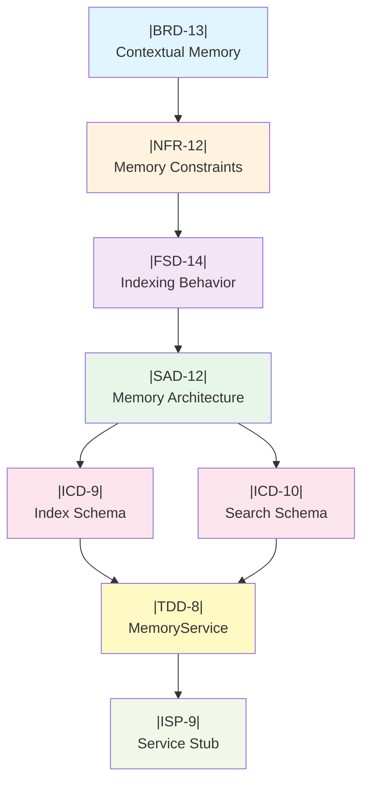

## 14. Advanced Traceability Techniques

### 14.1 Impact Analysis Queries

When modifying a tag, determine downstream effects:

**Query Template:**

```
SELECT child_tag, child_content, tier
FROM documentation
WHERE parent_citations LIKE '%|TARGET_TAG|%'
ORDER BY tier_depth DESC;

```

**Example: Changing |NFR-4.3|**

```
INPUT: |NFR-4.3|: "LLM Inference: <1s" → CHANGING TO <2s

IMPACT ANALYSIS:
┌──────────┬────────────────────────────────────┬──────┐
│ Child    │ Content Summary                    │ Tier │
├──────────┼────────────────────────────────────┼──────┤
│ FSD-12.3 │ TTS begins after first sentence    │ FSD  │ ← May need timing adjustment
│ SAD-10.4 │ Back-pressure queue size           │ SAD  │ ← OK (architecture unchanged)
│ ICD-8    │ Streaming token schema             │ ICD  │ ← OK (schema unchanged)
│ TDD-7.3  │ generate_stream() method           │ TDD  │ ← OK (implementation detail)
│ ISP-8    │ Performance note in docstring      │ ISP  │ ← UPDATE REQUIRED
└──────────┴────────────────────────────────────┴──────┘

ACTION ITEMS:
1. Update |ISP-8| docstring: "First token within 200ms" (still achievable)
2. Review |FSD-12.3|: Verify 2s budget still allows sentence-level TTS start
3. Mark reconciliation_manifest as DIRTY with pending review

```

### 14.2 Traceability Graphs

Visualize tag relationships for complex features:



### 14.3 Orphan Detection Algorithms

**Upward Orphan (Missing Parent):**

```python
def detect_upward_orphans(documentation: dict) -> List[str]:
    """
    Find tags that cite non-existent parents.

    Returns
    -------
    List[str]
        Tag IDs with broken citations
    """
    all_tags = set(documentation.keys())
    orphans = []

    for tag_id, content in documentation.items():
        citations = extract_citations(content)  # Parse ← |PARENT| syntax
        for parent in citations:
            if parent not in all_tags:
                orphans.append(f"{tag_id} ← |{parent}| (MISSING)")

    return orphans

```

**Downward Orphan (No Children):**

```python
def detect_downward_orphans(documentation: dict, tier: str) -> List[str]:
    """
    Find tier-N tags that have no tier-(N+1) children.
    Indicates incomplete specification.

    Parameters
    ----------
    tier : str
        Current tier (e.g., "FSD")

    Returns
    -------
    List[str]
        Tags requiring downstream specification
    """
    child_tier_map = {"BRD": "NFR", "NFR": "FSD", "FSD": "SAD",
                      "SAD": "ICD", "ICD": "TDD", "TDD": "ISP"}

    if tier not in child_tier_map:
        return []  # ISP has no children

    child_tier = child_tier_map[tier]
    tier_tags = [t for t in documentation if t.startswith(tier)]
    child_citations = set()

    for child_tag, content in documentation.items():
        if child_tag.startswith(child_tier):
            citations = extract_citations(content)
            child_citations.update(citations)

    orphans = [t for t in tier_tags if t not in child_citations]
    return orphans

```

**Example Output:**

```
UPWARD ORPHANS (Broken Citations):
- |FSD-14.2| ← |NFR-999| (MISSING) → CREATE NFR-999 or FIX CITATION

DOWNWARD ORPHANS (Incomplete Specs):
- |SAD-7| (no ICD children) → CREATE ICD schema for sentiment data
- |FSD-11.3| (no SAD children) → SPECIFY architecture for model validation

```

----------
