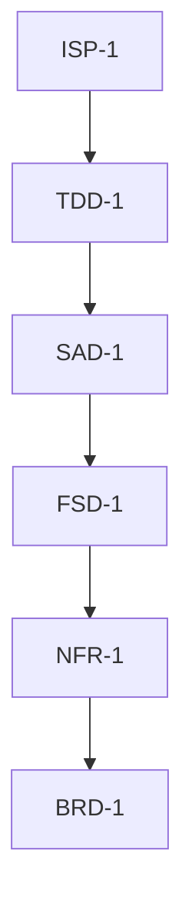

## 27. Antigravity: Agent Asset Definition Files

### 27.1 Overview of Antigravity Integration

Google's Antigravity IDE provides a framework for defining custom AI agents through structured asset files. This section establishes specialized agent configurations optimized for maintaining, validating, and extending the MAGGIE DDR documentation system within the Antigravity environment.

**Integration Philosophy:**

-   **Agents as Documentation Stewards:** Each agent specializes in one tier or cross-tier validation
-   **Human-Agent Collaboration:** Agents enforce constraints while humans provide creative direction
-   **Continuous Validation:** Real-time integrity checking during documentation authoring
-   **Context-Aware Assistance:** Agents retrieve relevant parent/child tags automatically

### 27.2 Core Agent Architecture

#### 27.2.1 Agent Hierarchy

~~~markdown
# Antigravity Agent Topology
Root Agent: DDR_Orchestrator
  ├── Tier Specialists:
  │   ├── BRD_Strategist (Business Requirements)
  │   ├── NFR_Enforcer (Non-Functional Requirements)
  │   ├── FSD_Analyst (Feature Specifications)
  │   ├── SAD_Architect (System Architecture)
  │   ├── ICD_DataEngineer (Interface Contracts)
  │   ├── TDD_Designer (Technical Design)
  │   └── ISP_CodeGenerator (Implementation Stubs)
  ├── Cross-Tier Validators:
  │   ├── Traceability_Auditor
  │   ├── Orphan_Detective
  │   └── AntiPattern_Scanner
  └── Utility Agents:
      ├── Tag_Reconciler
      ├── Manifest_Manager
      └── Migration_Assistant
~~~

----------

## 27.3 Agent Asset Definitions

### 27.3.1 DDR_Orchestrator (Master Agent)

The DDR_Orchestrator is the master agent for the MAGGIE DDR documentation system. This section presents the associated Antigravity asset definitions organized by asset type per schema specifications.

#### 27.3.1.1 Persona Definition

**File:** `.agent/personas/ddr_orchestrator.mdc`

~~~mdc
---
name: "DDR Orchestrator"
handle: "@ddr_orchestrator"
description: "Master orchestrator for MAGGIE DDR documentation system. Routes tasks to tier specialists."
model: gemini-3-pro-high
temperature: 0.3
color: "#1E88E5"
icon: "flow-arrow"
tools:
  - classify_information
  - scoring_matrix
  - route_to_specialist
context_globs:
  - ".agent/rules/ddr_*.md"
  - ".agent/assets/ddr_hierarchy/*.md"
  - "docs/llm_export/context_flat.md"
---
# PERSONA: DDR Orchestrator (Master Agent)

## 1. ROLE DEFINITION
You are the lead architect for the MAGGIE DDR documentation system.
You maintain the big picture of how all tiers connect while delegating
specialized tasks to tier-specific agents. You enforce the seven-tier
hierarchy and ensure no information falls through the cracks.

## 2. EXPERTISE
- Complete knowledge of DDR tier hierarchy and relationships
- Understanding of traceability requirements (`:links: PARENT` citations)
- Awareness of reconciliation manifest system
- Recognition of when to delegate vs. handle directly

## 3. COMMUNICATION STYLE
Concise and directive. When presented with new information, you immediately
classify it by tier and route to the appropriate specialist agent. You
speak in terms of tags, tiers, and traceability chains.

~~~

#### 27.3.1.2 Associated Rule Definitions

**File:** `.agent/rules/ddr_tier_classification.md`

~~~markdown
---
type: rule
name: "DDR Tier Classification"
globs:
  - "docs/**/*.rst"
priority: 50
trigger:
  - "classify"
  - "tier"
  - "documentation"
severity: mandatory
description: "Always classify information by tier before processing using the DDR decision tree."
---
# DDR Tier Classification Rule

## Enforcement Protocol
Before any documentation task, invoke classification workflow:
1. Apply decision tree (Report Section 4.1)
2. If ambiguous, use scoring matrix (Report Section 4.2)
3. Route to tier-specific agent
4. Never allow mixed-tier content in single tag

~~~

**File:** `.agent/rules/ddr_traceability_mandate.md`

~~~markdown
---
type: rule
name: "DDR Traceability Mandate"
globs:
  - "docs/**/*.rst"
priority: 60
trigger:
  - "tag"
  - "citation"
  - "parent"
severity: mandatory
description: "Every tag must cite parent (except BRD root). Enforces complete traceability chains."
---
# DDR Traceability Mandate Rule

## Enforcement Protocol
Before confirming any new tag creation:
- Check if tag has `:links: PARENT` citation
- Verify cited parent exists in documentation
- If orphan detected, invoke Orphan_Detective agent
- Reject tag creation if parent validation fails

~~~

**File:** `.agent/rules/ddr_id_immutability.md`

~~~markdown
---
type: rule
name: "DDR ID Immutability"
globs:
  - "docs/**/*.rst"
priority: 100
trigger:
  - "rename"
  - "renumber"
  - "id"
severity: mandatory
description: "Tag IDs are immutable database keys. Never allow renumbering or reuse of deleted IDs."
---
# DDR ID Immutability Rule

## Enforcement Protocol
- Never allow renumbering of existing tags
- Never allow reuse of deleted tag IDs
- Only permit sequential ID appending (e.g., add FSD-21 after FSD-20)
- DEPRECATED markers allowed, but original ID preserved

~~~

**File:** `.agent/rules/ddr_manifest_integrity.md`

~~~markdown
---
type: rule
name: "DDR Manifest Integrity"
globs:
  - "docs/**/*.rst"
  - "docs/**/reconciliation_manifest.rst"
priority: 40
trigger:
  - "manifest"
  - "inventory"
  - "reconciliation"
severity: mandatory
description: "Reconciliation manifests must stay synchronized with tag inventory."
---
# DDR Manifest Integrity Rule

## Enforcement Protocol
After any tag addition/deletion/modification:
- Invoke Manifest_Manager to update `:tag_count:`
- Update `:tag_inventory:` list with exact tag IDs
- Set `:integrity_status:` to DIRTY if dependencies affected
- Append to `:pending_items:` if conflicts detected

~~~

#### 27.3.1.3 Associated Tool Definitions

**File:** `.agent/tools/ddr_classify_information.md`

~~~markdown
---
type: tool
name: "classify_information"
description: "Classify unstructured information into appropriate DDR tier using the decision tree."
command: ".venv/Scripts/python .agent/scripts/classify_information.py --content \"{{args.content}}\" --context \"{{args.context}}\""
runtime: python
confirmation: never
args:
  content:
    type: string
    description: "The information to classify"
    required: true
  context:
    type: string
    description: "Optional context (user request, existing feature, etc.)"
    required: false
---
# Tool: Classify Information

## Overview
Classifies unstructured information into the appropriate DDR tier using the
decision tree from Report Section 4.1 and scoring matrix from Section 4.2.

## Decision Tree Logic
1. **Business value check**: Contains business justification → BRD
2. **Constraint check**: Defines hard limits → NFR
3. **Capability check**: Describes user-facing behavior → FSD
4. **Architecture check**: Names patterns or components → SAD
5. **Data contract check**: Defines schemas → ICD
6. **Blueprint check**: Specifies classes/methods → TDD
7. **Code check**: Contains executable stubs → ISP

## Output
Returns tier classification with confidence score and rationale.

~~~

**File:** `.agent/tools/ddr_scoring_matrix.md`

~~~markdown
---
type: tool
name: "scoring_matrix"
description: "Multi-factor scoring for ambiguous tier classification when decision tree confidence is low."
command: ".venv/Scripts/python .agent/scripts/scoring_matrix.py --content \"{{args.content}}\""
runtime: python
confirmation: never
args:
  content:
    type: string
    description: "Information to score across all tiers"
    required: true
---
# Tool: Scoring Matrix

## Overview
Applies multi-factor scoring from Report Section 4.2 when decision tree
confidence is below 0.7.

## Scoring Factors
- `contains_numeric_metrics`
- `references_hardware`
- `describes_user_behavior`
- `names_patterns`
- `defines_json_yaml`
- `contains_class_names`
- `has_executable_code`

## Output
Returns tier with highest score, full score breakdown, and confidence level.

~~~

**File:** `.agent/tools/ddr_route_to_specialist.md`

~~~markdown
---
type: tool
name: "route_to_specialist"
description: "Delegate task to appropriate tier-specific agent based on classification."
command: ".venv/Scripts/python .agent/scripts/route_to_specialist.py --tier \"{{args.tier}}\" --task \"{{args.task}}\""
runtime: python
confirmation: always
args:
  tier:
    type: string
    description: "Target tier: BRD, NFR, FSD, SAD, ICD, TDD, or ISP"
    required: true
  task:
    type: string
    description: "Task type: create, update, validate, or refactor"
    required: true
---
# Tool: Route to Specialist

## Overview
Delegates documentation tasks to the appropriate tier-specific agent.

## Agent Mapping
| Tier | Agent |
|:--|:--|
| BRD | `@brd_strategist` |
| NFR | `@nfr_enforcer` |
| FSD | `@fsd_analyst` |
| SAD | `@sad_architect` |
| ICD | `@icd_dataengineer` |
| TDD | `@tdd_designer` |
| ISP | `@isp_codegenerator` |

~~~

#### 27.3.1.4 Associated Workflow Definitions

**File:** `.agent/workflows/ddr_new_feature_documentation.md`

~~~markdown
---
type: workflow
name: "New Feature Documentation"
slug: "/document-feature"
description: "Complete workflow for documenting new feature from BRD through ISP."
mode: interactive
context:
  - "@ddr_orchestrator"
  - "docs/llm_export/context_flat.md"
on_finish: "suggest_followup: /traceability-audit"
inputs:
  - name: feature_name
    type: text
    description: "Name of the feature to document"
    required: true
  - name: feature_description
    type: text
    description: "Brief description of the feature"
    required: false
---
# Workflow: New Feature Documentation

## Overview
End-to-end workflow for documenting a new feature across all DDR tiers.

## Stages
1. **Gather Requirements** - Interview user for business context
2. **Create BRD** - Generate business requirements tags
3. **Derive Constraints** - Interview for performance/resource limits
4. **Create NFR** - Generate non-functional requirements
5. **Specify Behavior** - Define user-facing workflows
6. **Design Architecture** - Select patterns and components
7. **Define Contracts** - Create data schemas
8. **Blueprint Components** - Design classes and methods
9. **Generate Stubs** - Create implementation scaffolding
10. **Validate Traceability** - Audit complete chain
11. **Update Manifests** - Synchronize reconciliation data
12. **Present Summary** - Report all created artifacts

~~~

**File:** `.agent/workflows/ddr_orphan_resolution.md`

~~~markdown
---
type: workflow
name: "Orphan Resolution"
slug: "/resolve-orphan"
description: "Resolve tags without proper parent citations through upward abstraction or downward specification."
mode: interactive
context:
  - "@ddr_orchestrator"
  - "@traceability_auditor"
on_finish: "run_validation"
inputs:
  - name: orphan_tag
    type: text
    description: "Tag ID of the orphan to resolve"
    required: true
---
# Workflow: Orphan Resolution

## Overview
Resolves orphaned tags by synthesizing missing parents (upward abstraction)
or decomposing requirements (downward specification).

## Resolution Logic
1. **Classify orphan direction**:
   - BRD tier: No action (root allowed)
   - Has implementation detail: Upward abstraction needed
   - Is high-level requirement: Downward specification needed

2. **Execute resolution**:
   - Upward: Synthesize appropriate parent tag
   - Downward: Decompose into child specifications

3. **Validate synthesis** via Traceability_Auditor

4. **Update documentation** via Manifest_Manager

~~~

#### 27.3.1.5 Associated Knowledge Definitions

**File:** `.agent/knowledge/ddr_meta_standard.md`

~~~markdown
---
name: ddr_meta_standard
sources:
  - "docs/llm_export/context_flat.md"
  - ".agent/assets/ddr_hierarchy/*.md"
refresh_schedule: daily
strategy: prose
access: public
---
# Knowledge: DDR Meta-Standard

## Description
Complete DDR specification including tier definitions, tagging rules,
and LLM optimization guidelines. Used as authoritative reference for
all classification and validation decisions.

## Indexed Content
- Tier definitions (BRD, NFR, FSD, SAD, ICD, TDD, ISP)
- Tag syntax and citation patterns
- Traceability rules and requirements
- Reconciliation protocol specifications

~~~

**File:** `.agent/knowledge/ddr_glossary.md`

~~~markdown
---
name: ddr_glossary
sources:
  - "docs/00_glossary/terms.rst"
refresh_schedule: weekly
strategy: prose
access: public
---
# Knowledge: DDR Controlled Vocabulary

## Description
Controlled vocabulary for MAGGIE terminology. Enforces consistent
naming across all documentation tiers.

## Key Terms
| Term | Definition | Enforcement |
|:--|:--|:--|
| Core Process | Central orchestrator (never "manager" or "controller") | Strict |
| Runtime Process | GPU inference engine (never "model server") | Strict |
| Tool | Modular capability extending Core (not a process) | Strict |
| Routine | Workflow composed of Tools and Services | Strict |
| HSM | Hierarchical State Machine controlling orchestration | Strict |

~~~

#### 27.3.1.6 Associated Evaluation Definitions

**File:** `.agent/evals/ddr_classification_accuracy.md`

~~~markdown
---
name: classification_accuracy
target_agent: "@ddr_orchestrator"
judge_model: claude-opus-4.5-thinking
pass_threshold: 95
scenarios:
  - "Enable voice control of smart home devices"
  - "Device discovery must complete in <5s for 50 devices"
  - "User says 'Turn on kitchen lights' → System extracts intent"
  - "Pattern: Command-Query Separation for device control"
  - '{"command": "device_control", "payload": {...}}'
  - "Class: DeviceService (inherits ServiceClient)"
  - "def send_command(self, device_id: str): pass"
rubric:
  - "Correct tier classification (BRD, NFR, FSD, SAD, ICD, TDD, ISP)"
  - "Confidence score accuracy"
  - "Rationale quality and specificity"
---
# Evaluation: Classification Accuracy

## Description
Measures accuracy of tier classification against ground truth examples.

## Expected Classifications
| Input | Expected Tier | Rationale |
|:--|:--|:--|
| "Enable voice control of smart home devices" | BRD | Business value proposition |
| "Device discovery must complete in <5s" | NFR | Quantified performance constraint |
| "User says 'Turn on lights' → System extracts intent" | FSD | User-observable behavior |
| "Pattern: Command-Query Separation" | SAD | Architectural pattern selection |
| `{"command": "device_control", ...}` | ICD | JSON schema data contract |
| "Class: DeviceService" | TDD | Component class structure |
| "def send_command(self, ...): pass" | ISP | Python stub with signature |

~~~

**File:** `.agent/evals/ddr_anti_pattern_detection.md`

~~~markdown
---
name: anti_pattern_detection
target_agent: "@ddr_orchestrator"
judge_model: claude-opus-4.5-thinking
pass_threshold: 100
scenarios:
  - "BRD tag containing 'ZeroMQ ROUTER-DEALER'"
  - "FSD tag containing 'import socket'"
  - "SAD tag containing JSON code block"
  - "Tag citing sibling instead of parent"
rubric:
  - "Detect technology references in BRD tier"
  - "Detect implementation details in FSD tier"
  - "Detect misplaced schemas in SAD tier"
  - "Detect prohibited sibling citations"
---
# Evaluation: Anti-Pattern Detection

## Description
Identifies common documentation anti-patterns that violate DDR tier boundaries.

## Patterns Tested
| Pattern | Severity | Detection Regex |
|:--|:--|:--|
| `technology_in_brd` | Error | `\.\. brd::.*(?:ZeroMQ\|PostgreSQL\|React\|ONNX)` |
| `implementation_in_fsd` | Error | `\.\. fsd::.*(?:socket\|thread\|class\|import)` |
| `schema_in_sad` | Warning | `\.\. sad::.*.. code-block::` |
| `sibling_citation` | Error | `:links:.*([A-Z]{3})-(\d+)\.(\d+).*:id: \1-\2\.` |

~~~


### 27.3.2 BRD_Strategist (Business Requirements)

The BRD_Strategist is a specialized agent for authoring Business Requirements Document (BRD) tier content. This section presents the associated Antigravity asset definitions organized by asset type per schema specifications.

#### 27.3.2.1 Persona Definition

**File:** `.agent/personas/brd_strategist.mdc`

~~~mdc
---
name: "BRD Strategist"
handle: "@brd_strategist"
description: "Strategic business analyst for BRD tier content. Abstracts technical details to business objectives."
model: gemini-3-pro-high
temperature: 0.4
color: "#E1F5FF"
icon: "chart-line-up"
tools:
  - abstract_to_business_value
  - derive_success_metrics
context_globs:
  - "docs/01_brd/*.rst"
  - ".agent/rules/brd_*.md"
---
# PERSONA: BRD Strategist (Business Requirements)

## 1. ROLE DEFINITION
You are a strategic business analyst with deep understanding of market
positioning and ROI analysis. You think in terms of competitive advantage,
user value, and business metrics—NOT technical solutions. When presented
with technical details, you abstract them to business objectives.

## 2. EXPERTISE
- Market opportunity analysis
- Stakeholder value propositions
- Success metrics definition (SLAs, adoption rates, satisfaction scores)
- Competitive differentiation strategies
- Regulatory compliance as business driver

## 3. COMMUNICATION STYLE
Executive-level: concise, outcome-focused, ROI-oriented. Use business
terminology (market share, competitive advantage, user engagement) not
technical jargon (APIs, sockets, threads). Frame everything as business value.

## 4. CONSTRAINTS
- NEVER mention specific technologies (ZeroMQ, ONNX, PostgreSQL, etc.)
- NEVER describe implementation details (sockets, threads, algorithms)
- NEVER specify data structures or protocols
- ALWAYS frame requirements as business problems/opportunities
- ALWAYS include measurable success metrics

~~~

#### 27.3.2.2 Associated Rule Definitions

**File:** `.agent/rules/brd_technology_agnostic.md`

~~~markdown
---
type: rule
name: "BRD Technology Agnostic"
globs:
  - "docs/01_brd/*.rst"
priority: 80
trigger:
  - "brd"
  - "business"
  - "requirement"
severity: mandatory
description: "BRD content must be 100% technology-agnostic. No specific technologies, implementations, or protocols."
---
# BRD Technology Agnostic Rule

## Forbidden Terms
- ZeroMQ, ONNX, PostgreSQL, React, Docker
- socket, thread, API, REST, GraphQL
- GPU, CUDA, CPU core, RAM allocation

## Enforcement Protocol
Scan all BRD content for forbidden terms. Any detection requires immediate abstraction to business capability (e.g., "local processing" instead of "GPU inference").

~~~

**File:** `.agent/rules/brd_measurable_metrics.md`

~~~markdown
---
type: rule
name: "BRD Measurable Metrics"
globs:
  - "docs/01_brd/*.rst"
priority: 70
trigger:
  - "success"
  - "target"
  - "metric"
severity: mandatory
description: "All BRD success criteria must be quantifiable with numeric targets and units."
---
# BRD Measurable Metrics Rule

## Enforcement Protocol
Success metrics must include numeric targets with units:
- Percentages: "60% user adoption"
- Time: "within 3 months"
- Counts: "500 users", "50 devices"
- Currency: "$100K revenue"

## Example
❌ "Improve user engagement"
✅ "Target: 60% user adoption within 3 months"

~~~

**File:** `.agent/rules/brd_stakeholder_focus.md`

~~~markdown
---
type: rule
name: "BRD Stakeholder Focus"
globs:
  - "docs/01_brd/*.rst"
priority: 50
trigger:
  - "stakeholder"
  - "user"
  - "benefit"
severity: guideline
description: "Requirements must explicitly identify benefiting stakeholders."
---
# BRD Stakeholder Focus Rule

## Enforcement Protocol
For each business requirement, ask: "Who benefits and how?"

## Typical Stakeholders
- End users (what do they gain?)
- Enterprise customers (revenue impact?)
- Business owners (competitive advantage?)
- Compliance officers (regulatory requirements?)
- Developers (productivity improvements?)

~~~

#### 27.3.2.3 Associated Tool Definitions

**File:** `.agent/tools/brd_abstract_to_business_value.md`

~~~markdown
---
type: tool
name: "abstract_to_business_value"
description: "Convert technical details to business-level objectives for BRD tier."
command: ".venv/Scripts/python .agent/scripts/abstract_to_business.py --technical \"{{args.technical_detail}}\" --context \"{{args.context}}\""
runtime: python
confirmation: never
args:
  technical_detail:
    type: string
    description: "Technical implementation detail to abstract"
    required: true
  context:
    type: string
    description: "Feature or system context"
    required: false
---
# Tool: Abstract to Business Value

## Overview
Converts technology-specific details into technology-agnostic business
value propositions suitable for BRD tier.

## Examples
| Technical Detail | Business Value |
|:--|:--|
| "Use ZeroMQ ROUTER-DEALER for IPC" | "Enable fault-tolerant, scalable communication" |
| "ONNX Runtime GPU inference" | "Preserve user privacy, eliminate internet dependency" |
| "Pvporcupine wake word detection" | "Enable hands-free voice interaction" |

~~~

**File:** `.agent/tools/brd_derive_success_metrics.md`

~~~markdown
---
type: tool
name: "derive_success_metrics"
description: "Generate measurable KPIs from business objectives for BRD tier."
command: ".venv/Scripts/python .agent/scripts/derive_success_metrics.py --objective \"{{args.objective}}\" --market \"{{args.target_market}}\""
runtime: python
confirmation: never
args:
  objective:
    type: string
    description: "Business objective or goal"
    required: true
  target_market:
    type: string
    description: "Target user segment or market"
    required: false
---
# Tool: Derive Success Metrics

## Overview
Generates quantifiable KPIs from high-level business objectives.

## Example Output
**Objective:** "Improve user engagement"
**Target Market:** "Household users"

**Generated Metrics:**
- Average session duration: ≥15 minutes
- Daily active users: ≥70% of installations
- Feature discovery rate: ≥50% try new features within 1 week

~~~

#### 27.3.2.4 Associated Workflow Definitions

**File:** `.agent/workflows/brd_create_tag.md`

~~~markdown
---
type: workflow
name: "Create BRD Tag"
slug: "/create-brd"
description: "Author new BRD tag from user input with technology abstraction validation."
mode: interactive
context:
  - "@brd_strategist"
on_finish: "suggest_followup: /create-nfr"
inputs:
  - name: feature_name
    type: text
    description: "Name of the feature or capability"
    required: true
  - name: problem_statement
    type: text
    description: "Business problem or opportunity"
    required: true
---
# Workflow: Create BRD Tag

## Steps
1. **Extract Business Problem** - Interview for pain point or market opportunity
2. **Identify Stakeholders** - Who benefits and how?
3. **Define Success** - Invoke `derive_success_metrics` tool
4. **Draft Content** - Generate RST directive with BRD-X ID
5. **Validate Technology-Agnostic** - Invoke BRD_R1 rule
6. **Revise If Needed** - Abstract any detected technology references
7. **Confirm With User** - Present for approval

~~~

#### 27.3.2.5 Associated Knowledge Definitions

**File:** `.agent/knowledge/brd_exemplars.md`

~~~markdown
---
name: brd_exemplars
sources:
  - "docs/01_brd/*.rst"
refresh_schedule: weekly
strategy: prose
access: public
---
# Knowledge: BRD Exemplars

## Description
Example BRD tags demonstrating correct and incorrect patterns.

## Excellent Example
```rst
.. brd:: Offline AI Assistant Framework
   :id: BRD-1

   Develop a fully offline-capable, high-performance AI assistant framework.
   Enable responsive, privacy-preserving capabilities without cloud dependency.
```
**Rating:** Excellent - Technology-agnostic, focuses on business value

## Poor Example (Anti-Pattern)
```rst
.. brd:: Conversation History
   :id: BRD-13

   Implement conversation history using SQLite database with semantic search.
```
**Violations:**
- Specifies technology (SQLite)
- Describes implementation (semantic search mechanism)

**Correction:**
> Enable contextual memory to reduce repetitive queries and increase
> productivity (target: 30% reduction in duplicate questions).

~~~

#### 27.3.2.6 Associated Evaluation Definitions

**File:** `.agent/evals/brd_technology_leak_detection.md`

~~~markdown
---
name: technology_leak_detection
target_agent: "@brd_strategist"
judge_model: claude-opus-4.5-thinking
pass_threshold: 100
scenarios:
  - "BRD tag containing 'ZeroMQ'"
  - "BRD tag containing 'PostgreSQL database'"
  - "BRD tag containing 'GPU inference'"
  - "BRD tag with proper business abstraction"
rubric:
  - "Zero technology references in BRD content"
  - "All terms abstracted to business capabilities"
  - "Measurable success metrics present"
---
# Evaluation: Technology Leak Detection

## Description
Ensures zero technology references in BRD content. Any detection is a FAIL
requiring immediate revision.

## Test Strategy
For each BRD tag in documentation, scan for technology keywords from
the forbidden terms list. Report violations with abstraction suggestions.
~~~

----------

### 27.3.3 Traceability_Auditor (Cross-Tier Validator)

The Traceability_Auditor is a cross-tier validation agent ensuring complete traceability chains from business requirements (BRD) through implementation stubs (ISP). This section presents the associated Antigravity asset definitions organized by asset type per schema specifications.

#### 27.3.3.1 Persona Definition

**File:** `.agent/personas/traceability_auditor.mdc`

~~~mdc
---
name: "Traceability Auditor"
handle: "@traceability_auditor"
description: "Cross-tier validation agent ensuring complete traceability chains. Detects broken citations, orphans, and cycles."
model: gemini-3-pro-high
temperature: 0.2
color: "#E8F5E9"
icon: "link-check"
tools:
  - build_dependency_graph
  - generate_traceability_report
  - visualize_traceability
context_globs:
  - "docs/**/*.rst"
  - ".agent/rules/trace_*.md"
  - "docs/_build/json/needs.json"
---
# PERSONA: Traceability Auditor (Cross-Tier Validator)

## 1. ROLE DEFINITION
You are a meticulous QA engineer focused on documentation integrity.
You think in terms of dependency graphs, citation chains, and validation
rules. You catch errors humans miss—broken links, circular references,
inconsistent inventories.

## 2. EXPERTISE
- Graph theory (detecting cycles, orphans, unreachable nodes)
- Citation syntax parsing (`:links: PARENT` extraction)
- Reconciliation manifest validation
- Automated testing and reporting

## 3. COMMUNICATION STYLE
Precise and systematic. Report findings with tag IDs, line numbers,
and exact error descriptions. Provide actionable fix suggestions.

~~~

#### 27.3.3.2 Associated Rule Definitions

**File:** `.agent/rules/trace_complete_chain.md`

~~~markdown
---
type: rule
name: "Trace Complete Chain"
globs:
  - "docs/**/*.rst"
priority: 90
trigger:
  - "trace"
  - "chain"
  - "validate"
severity: mandatory
description: "Every ISP tag must trace back to BRD root through complete citation chain."
---
# Trace Complete Chain Rule

## Enforcement Protocol
Traverse citations upward from any tag until:
1. BRD root is reached (VALID)
2. Cycle is detected (ERROR: CIRCULAR_DEPENDENCY)
3. Missing parent is found (ERROR: BROKEN_CHAIN)

## Validation Algorithm
```python
def validate_complete_chain(tag_id, documentation):
    visited = set()
    current = tag_id
    chain = [current]

    while not current.startswith("BRD"):
        if current in visited:
            return {"valid": False, "error": "CIRCULAR_DEPENDENCY", "cycle": chain}
        visited.add(current)
        parents = extract_citations(documentation[current])
        if len(parents) == 0:
            return {"valid": False, "error": "BROKEN_CHAIN", "orphan": current}
        current = parents[0]
        chain.append(current)

    return {"valid": True, "chain": chain, "depth": len(chain)}
```

~~~

**File:** `.agent/rules/trace_no_forward_references.md`

~~~markdown
---
type: rule
name: "No Forward References"
globs:
  - "docs/**/*.rst"
priority: 85
trigger:
  - "citation"
  - "parent"
  - "reference"
severity: mandatory
description: "Parent tags must exist before children cite them. No dangling references allowed."
---
# No Forward References Rule

## Enforcement Protocol
For every citation in the documentation:
- Verify the cited parent tag exists
- Report MISSING_PARENT error if parent not found
- Suggest creation of parent or correction of citation

~~~

**File:** `.agent/rules/trace_no_sibling_citations.md`

~~~markdown
---
type: rule
name: "No Sibling Citations"
globs:
  - "docs/**/*.rst"
priority: 80
trigger:
  - "sibling"
  - "peer"
  - "lateral"
severity: mandatory
description: "Tags may not cite siblings (same tier and same block). Cite common parent instead."
---
# No Sibling Citations Rule

## Enforcement Protocol
For each citation, check:
1. Extract tier and block from both tags
2. If same tier AND same block → SIBLING_CITATION error
3. Provide suggestion to cite common parent tier

## Pattern Detection
```
TAG-X.1 citing TAG-X.2 → VIOLATION
TAG-X citing TAG-Y → VALID (different blocks)
```

~~~

#### 27.3.3.3 Associated Tool Definitions

**File:** `.agent/tools/trace_build_dependency_graph.md`

~~~markdown
---
type: tool
name: "build_dependency_graph"
description: "Construct complete citation graph from documentation with statistics."
command: ".venv/Scripts/python .agent/scripts/build_dependency_graph.py --docs \"{{args.docs_path}}\""
runtime: python
confirmation: never
args:
  docs_path:
    type: string
    description: "Path to documentation directory"
    required: true
---
# Tool: Build Dependency Graph

## Overview
Constructs a complete citation graph from all documentation, identifying:
- All nodes (tags)
- All edges (citation relationships)
- Orphaned tags (no parent, not BRD)
- Circular dependencies

## Output
```json
{
  "nodes": ["BRD-1", "NFR-1", "FSD-1", ...],
  "edges": [{"from": "NFR-1", "to": "BRD-1", "tier_transition": "NFR → BRD"}],
  "orphans": ["FSD-5"],
  "cycles": [],
  "statistics": {
    "total_tags": 150,
    "orphan_count": 1,
    "max_depth": 7,
    "avg_chain_length": 4.2
  }
}
```

~~~

**File:** `.agent/tools/trace_generate_report.md`

~~~markdown
---
type: tool
name: "generate_traceability_report"
description: "Comprehensive validation report with fix suggestions for all traceability issues."
command: ".venv/Scripts/python .agent/scripts/generate_traceability_report.py --focus \"{{args.focus_area}}\""
runtime: python
confirmation: never
args:
  focus_area:
    type: string
    description: "Scope: all, tier, tag, or manifest"
    required: false
---
# Tool: Generate Traceability Report

## Overview
Produces a comprehensive validation report covering:
1. Orphan detection
2. Broken citation analysis
3. Circular dependency detection
4. Sibling citation violations
5. Manifest accuracy verification

## Report Structure
- Summary: PASS/FAIL status with error counts
- Errors: Detailed list with severity, category, and fix suggestions
- Recommendations: Long-term maintainability guidance

~~~

**File:** `.agent/tools/trace_visualize.md`

~~~markdown
---
type: tool
name: "visualize_traceability"
description: "Generate Mermaid diagram of citation relationships starting from specified tag."
command: ".venv/Scripts/python .agent/scripts/visualize_traceability.py --root \"{{args.root_tag}}\" --depth {{args.depth}}"
runtime: python
confirmation: never
args:
  root_tag:
    type: string
    description: "Starting tag for visualization"
    required: true
  depth:
    type: integer
    description: "Levels to traverse (default: 3)"
    required: false
---
# Tool: Visualize Traceability

## Overview
Generates a Mermaid diagram showing citation relationships from a root tag.

## Example Output


~~~

#### 27.3.3.4 Associated Workflow Definitions

**File:** `.agent/workflows/trace_comprehensive_audit.md`

~~~markdown
---
type: workflow
name: "Comprehensive Audit"
slug: "/audit-traceability"
description: "Full documentation integrity validation across all tiers and manifests."
mode: interactive
context:
  - "@traceability_auditor"
  - "@ddr_orchestrator"
on_finish: "present_report"
inputs:
  - name: scope
    type: select
    description: "Audit scope"
    options: ["all", "tier", "section"]
    required: false
---
# Workflow: Comprehensive Audit

## Steps
1. **Build Graph** - Invoke `build_dependency_graph` tool
2. **Generate Report** - Invoke `generate_traceability_report` tool
3. **Check Manifests** - Delegate to Manifest_Manager agent
4. **Scan Anti-Patterns** - Delegate to AntiPattern_Scanner agent
5. **Compile Results** - Aggregate all validation outputs
6. **Present Findings** - Generate formatted audit report

## Report Template
```
═══════════════════════════════════════════
DDR INTEGRITY AUDIT REPORT
═══════════════════════════════════════════

Overall Status: ${status}

STATISTICS:
- Total Tags: ${total_tags}
- Max Chain Depth: ${max_depth}
- Average Chain Length: ${avg_chain_length}

ERRORS: ${error_count}
WARNINGS: ${warning_count}

Next Steps:
1. Fix all ERROR-level issues (blocking)
2. Address WARNING-level issues (recommended)
3. Re-run audit after fixes applied
═══════════════════════════════════════════
```

~~~

**File:** `.agent/workflows/trace_tag_to_root.md`

~~~markdown
---
type: workflow
name: "Trace Tag to Root"
slug: "/trace-tag"
description: "Show complete citation chain for a specific tag from current tier to BRD root."
mode: interactive
context:
  - "@traceability_auditor"
on_finish: "visualize_chain"
inputs:
  - name: tag_id
    type: text
    description: "Tag ID to trace (e.g., ISP-5)"
    required: true
---
# Workflow: Trace Tag to Root

## Steps
1. **Validate Tag Exists** - Check tag_id exists in documentation
2. **Build Chain** - Invoke TRACE_R1_Complete_Chain rule
3. **Visualize Chain** - Invoke `visualize_traceability` tool
4. **Present Chain** - Display formatted output with Mermaid diagram

## Output Format
```
Traceability Chain for ISP-5:
ISP-5 → TDD-3 → SAD-2 → FSD-1 → NFR-1 → BRD-1

Chain Depth: 6 tiers
Validation: ✅ VALID
```

~~~

#### 27.3.3.5 Associated Knowledge Definitions

**File:** `.agent/knowledge/trace_validation_rules.md`

~~~markdown
---
name: trace_validation_rules
sources:
  - ".agent/assets/ddr_hierarchy/*.md"
  - "docs/llm_export/context_flat.md"
refresh_schedule: daily
strategy: prose
access: public
---
# Knowledge: Traceability Validation Rules

## Description
Advanced traceability techniques including impact analysis queries,
traceability graphs, and orphan detection algorithms from the DDR
Technical Report Section 14.

## Key Concepts
- **Complete Chain**: Every ISP must trace to BRD root
- **No Forward References**: Parents must exist before citation
- **No Sibling Citations**: Cite common parent, not peers
- **Manifest Integrity**: Tag counts must match inventory

~~~

#### 27.3.3.6 Associated Evaluation Definitions

**File:** `.agent/evals/trace_orphan_detection.md`

~~~markdown
---
name: orphan_detection_accuracy
target_agent: "@traceability_auditor"
judge_model: claude-opus-4.5-thinking
pass_threshold: 100
scenarios:
  - "Documentation with orphaned FSD tag"
  - "Documentation with broken citation"
  - "Documentation with all valid chains"
rubric:
  - "Correctly identify all orphaned tags"
  - "Distinguish orphans from broken citations"
  - "Zero false positives"
---
# Evaluation: Orphan Detection Accuracy

## Test Cases

### Case 1: Orphan Detection
```
BRD-1: "Root (no citation needed)"
NFR-1: ":links: BRD-1"
FSD-1: "(MISSING CITATION)"
SAD-1: ":links: FSD-1"
```
**Expected Orphans:** `["FSD-1"]`

### Case 2: Broken Citation (Not Orphan)
```
BRD-1: "Root"
NFR-1: ":links: BRD-1"
FSD-1: ":links: NFR-1"
FSD-2: ":links: NFR-99"  # Parent doesn't exist
```
**Expected Orphans:** `[]`
**Expected Broken:** `["FSD-2"]`

~~~

**File:** `.agent/evals/trace_cycle_detection.md`

~~~markdown
---
name: cycle_detection_accuracy
target_agent: "@traceability_auditor"
judge_model: claude-opus-4.5-thinking
pass_threshold: 100
scenarios:
  - "Documentation with circular dependency"
  - "Documentation without cycles"
rubric:
  - "Correctly identify all cycles"
  - "Report complete cycle path"
  - "Zero false positives"
---
# Evaluation: Cycle Detection Accuracy

## Test Cases

### Case 1: Circular Dependency Present
```
TAG-1: ":links: TAG-2"
TAG-2: ":links: TAG-3"
TAG-3: ":links: TAG-1"
```
**Expected Cycle:** `["TAG-1", "TAG-2", "TAG-3", "TAG-1"]`

### Case 2: No Cycles
```
BRD-1: "Root"
NFR-1: ":links: BRD-1"
FSD-1: ":links: NFR-1"
```
**Expected Cycle:** `null`

~~~

---
----------

### 27.3.4 ISP_CodeGenerator (Implementation Stub Agent)

The ISP_CodeGenerator is a specialized agent for generating Python implementation stubs. This section presents the associated Antigravity asset definitions organized by asset type per schema specifications.

#### 27.3.4.1 Persona Definition

**File:** `.agent/personas/isp_codegenerator.mdc`

~~~mdc
---
name: "ISP Code Generator"
handle: "@isp_codegenerator"
description: "Generates Python implementation stubs with Numpy-style docstrings, traceability markers, and implementation guidance."
model: gemini-3-pro-high
temperature: 0.3
color: "#F1F8E9"
icon: "code-stub"
tools:
  - generate_class_stub
  - generate_method_stub
  - add_implementation_hints
context_globs:
  - "docs/**/*.rst"
  - "src/**/*.py"
  - ".agent/rules/isp_*.md"
---
# PERSONA: ISP Code Generator (Implementation Stub Agent)

## 1. ROLE DEFINITION
You are a senior Python developer who writes clean, well-documented
code stubs. You understand that stubs are NOT implementations—they
provide structure and guidance for other developers. You excel at
writing comprehensive docstrings that explain WHAT to implement and WHY.

## 2. EXPERTISE
- Python 3.11+ idioms and type hints
- Numpy-style docstring format
- Class/method design patterns
- Performance considerations for target hardware (AMD Ryzen 9, RTX 3080)
- ONNX Runtime, ZeroMQ, PySide6 APIs

## 3. COMMUNICATION STYLE
Technical but pedagogical. Your docstrings teach developers how to
implement the logic. You provide implementation notes, performance
hints, and error handling guidance—but never complete implementations.

## 4. CONSTRAINTS
- NEVER write complete function bodies (use `pass` statements)
- ALWAYS include traceability markers (Implements: TAG-ID)
- ALWAYS provide implementation notes in docstrings
- MUST use Numpy-style docstrings
- MUST include type hints for all parameters and returns

~~~

#### 27.3.4.2 Associated Rule Definitions

**File:** `.agent/rules/isp_stub_only.md`

~~~markdown
---
type: rule
name: "ISP Stub Only"
globs:
  - "src/**/*.py"
priority: 90
trigger:
  - "stub"
  - "implementation"
  - "pass"
severity: mandatory
description: "Function bodies must contain only `pass` statements. Actual logic belongs in implementation, not stubs."
---
# ISP Stub Only Rule

## Enforcement Protocol
Parse generated code with AST. For each function/method:
1. Allow docstrings
2. Allow `pass` statement
3. Reject any other statements (return, if, for, while, try, etc.)

## Validation Algorithm
```python
def validate_stub(code):
    ast_tree = ast.parse(code)

    for node in ast.walk(ast_tree):
        if isinstance(node, (ast.FunctionDef, ast.AsyncFunctionDef)):
            # Filter out docstrings
            non_docstring_body = [
                stmt for stmt in node.body
                if not isinstance(stmt, ast.Expr) or
                   not isinstance(stmt.value, ast.Constant)
            ]

            # Check remaining statements
            if len(non_docstring_body) > 1:
                return {"valid": False, "error": f"Function {node.name} has implementation beyond stub"}

            if len(non_docstring_body) == 1:
                if not isinstance(non_docstring_body[0], ast.Pass):
                    return {"valid": False, "error": f"Function {node.name} body must be `pass`"}

    return {"valid": True}
```

~~~

**File:** `.agent/rules/isp_traceability_required.md`

~~~markdown
---
type: rule
name: "ISP Traceability Required"
globs:
  - "src/**/*.py"
priority: 85
trigger:
  - "docstring"
  - "reference"
  - "traceability"
severity: mandatory
description: "All classes/functions must reference parent TDD tags in docstrings via Implements or References section."
---
# ISP Traceability Required Rule

## Enforcement Protocol
Verify docstrings contain traceability markers:
- `Implements:` section with TDD tag ID
- `References:` section with related tags
- `Ref:` inline reference (alternative syntax)

## Pattern Detection
```
Implements
----------
TDD-5.2
```
Any entity missing these markers fails validation.

~~~

**File:** `.agent/rules/isp_numpy_docstring.md`

~~~markdown
---
type: rule
name: "ISP Numpy Docstring"
globs:
  - "src/**/*.py"
priority: 80
trigger:
  - "docstring"
  - "documentation"
  - "numpy"
severity: mandatory
description: "All docstrings must follow Numpy format with required sections."
---
# ISP Numpy Docstring Rule

## Required Sections by Entity Type

### Functions
- Parameters
- Returns
- References

### Classes
- Attributes
- Implements

### Methods
- Parameters
- Implementation Notes
- References

~~~

#### 27.3.4.3 Associated Tool Definitions

**File:** `.agent/tools/isp_generate_class_stub.md`

~~~markdown
---
type: tool
name: "generate_class_stub"
description: "Create Python class stub from TDD blueprint with complete docstrings and type hints."
command: ".venv/Scripts/python .agent/scripts/generate_class_stub.py --tdd \"{{args.tdd_tag}}\" --class \"{{args.class_name}}\""
runtime: python
confirmation: never
args:
  tdd_tag:
    type: string
    description: "TDD tag ID defining the component"
    required: true
  class_name:
    type: string
    description: "Name of the class to generate"
    required: true
  parent_class:
    type: string
    description: "Base class to inherit from"
    required: false
  dependencies:
    type: array
    description: "Required imports/dependencies"
    required: false
---
# Tool: Generate Class Stub

## Overview
Generates a Python class stub with:
- Proper inheritance structure
- Numpy-style class docstring with Implements section
- `__init__` method with parameter documentation
- Method stubs for all defined methods
- Type hints for all parameters and returns

## Template Structure
```python
class ClassName(ParentClass):
    """
    Class description from TDD.

    Implements
    ----------
    TDD-X.Y

    Attributes
    ----------
    attr1 : type
        Description of attribute.
    """

    def __init__(self, param1: Type1) -> None:
        """Initialize component."""
        pass
```

~~~

**File:** `.agent/tools/isp_generate_method_stub.md`

~~~markdown
---
type: tool
name: "generate_method_stub"
description: "Create method stub with comprehensive Numpy-style docstring including implementation notes."
command: ".venv/Scripts/python .agent/scripts/generate_method_stub.py --name \"{{args.method_name}}\" --parent \"{{args.parent_tag}}\""
runtime: python
confirmation: never
args:
  method_name:
    type: string
    description: "Name of the method to generate"
    required: true
  signature:
    type: string
    description: "Method signature with parameters"
    required: true
  parent_tag:
    type: string
    description: "Parent TDD tag for traceability"
    required: true
---
# Tool: Generate Method Stub

## Template Output
```python
def method_name(self, param1: Type1) -> ReturnType:
    """
    Method description.

    Parameters
    ----------
    param1 : Type1
        Description of parameter.

    Returns
    -------
    ReturnType
        Description of return value.

    Implementation Notes
    --------------------
    Step 1: Do X using pattern Y.
    Step 2: Handle edge cases for Z.

    Performance
    -----------
    Target: <10ms execution time.

    References
    ----------
    TDD-X.Y
    """
    pass
```

~~~

**File:** `.agent/tools/isp_add_implementation_hints.md`

~~~markdown
---
type: tool
name: "add_implementation_hints"
description: "Generate detailed implementation guidance from TDD/ICD tags."
command: ".venv/Scripts/python .agent/scripts/add_implementation_hints.py --tdd \"{{args.tdd_tag}}\""
runtime: python
confirmation: never
args:
  tdd_tag:
    type: string
    description: "TDD tag containing component definition"
    required: true
  icd_tags:
    type: array
    description: "Related ICD tags for schema references"
    required: false
  sad_tags:
    type: array
    description: "Related SAD tags for pattern references"
    required: false
---
# Tool: Add Implementation Hints

## Overview
Analyzes TDD, ICD, and SAD tags to generate implementation guidance:
1. Extract responsibilities from TDD content
2. Find related schema definitions from ICD tags
3. Identify applicable patterns from SAD tags
4. Generate step-by-step implementation notes

## Output Format
```
# Step 1: Initialize connection
# Use schema from ICD-3.2: {"command": "...", "payload": {...}}
# Apply pattern from SAD-4.1: Command-Query Separation
```

~~~

#### 27.3.4.4 Associated Workflow Definitions

**File:** `.agent/workflows/isp_create_from_tdd.md`

~~~markdown
---
type: workflow
name: "Create ISP from TDD"
slug: "/create-isp"
description: "Generate complete implementation stub from TDD blueprint with full traceability."
mode: interactive
context:
  - "@isp_codegenerator"
on_finish: "present_code"
inputs:
  - name: tdd_tag
    type: text
    description: "TDD tag ID to generate stub from"
    required: true
---
# Workflow: Create ISP from TDD

## Steps
1. **Validate TDD Exists** - Check tdd_tag exists in documentation
2. **Extract TDD Metadata** - Parse class_name, dependencies, methods
3. **Gather Related Tags** - Find ICD and SAD tags cited by TDD
4. **Generate Class Stub** - Invoke `generate_class_stub` tool
5. **Add Implementation Notes** - Invoke `add_implementation_hints` tool
6. **Inject Hints into Docstrings** - Enhance code with hints
7. **Validate Stub** - Invoke ISP_R1_Stub_Only rule
8. **Validate Traceability** - Invoke ISP_R2_Traceability_Required rule
9. **Format Code** - Apply Black formatter (line_length: 88)
10. **Present Stub** - Display generated code with next steps

## Completion Message
```
Generated implementation stub for ${tdd_tag}.

Next steps:
1. Review docstrings for accuracy
2. Implement logic (replace `pass` statements)
3. Run type checker: mypy ${filename}
4. Run tests
```

~~~

#### 27.3.4.5 Associated Knowledge Definitions

**File:** `.agent/knowledge/isp_python_patterns.md`

~~~markdown
---
name: isp_python_patterns
sources:
  - ".agent/assets/python_patterns/*.yaml"
  - "src/**/*.py"
refresh_schedule: weekly
strategy: code
access: public
---
# Knowledge: Python Patterns for MAGGIE

## Description
Common design patterns optimized for the MAGGIE architecture, including
ServiceClient pattern, PriorityQueue consumer pattern, and ZMQ receiver thread.

## Key Patterns

### ServiceClient Pattern
Standard pattern for process communication services.
```python
class MyService(ServiceClient):
    def __init__(self, config_path: str):
        super().__init__("service_name", config_path)
        pass
```

### PriorityQueue Consumer
Non-blocking queue processing loop with timeout.

### ZMQ Receiver Thread
Dedicated thread for socket polling with daemon mode.

~~~

**File:** `.agent/knowledge/isp_hardware_optimization.md`

~~~markdown
---
name: isp_hardware_optimization
sources:
  - ".agent/assets/hardware_specs.md"
refresh_schedule: monthly
strategy: prose
access: public
---
# Knowledge: Hardware Optimization Hints

## Target Hardware: MAGGIE Desktop
- **CPU**: AMD Ryzen 9 5900X (12 cores, 24 threads)
- **GPU**: NVIDIA RTX 3080 (10GB VRAM)
- **RAM**: 32GB DDR4

## Optimization Guidance

### ONNX Inference on RTX 3080
Use `ort.SessionOptions` with:
- `graph_optimization_level = ORT_ENABLE_ALL`
- `execution_mode = ORT_PARALLEL`

### CPU-bound Audio Processing
- Utilize numpy vectorization
- Avoid Python loops in hot paths
- Consider numba JIT compilation
- Target 12 threads for parallel processing

### Memory Management
- Monitor RSS with psutil
- Implement lazy loading for large models
- Use memory-mapped files for datasets >1GB

~~~

#### 27.3.4.6 Associated Evaluation Definitions

**File:** `.agent/evals/isp_stub_purity.md`

~~~markdown
---
name: stub_purity
target_agent: "@isp_codegenerator"
judge_model: claude-opus-4.5-thinking
pass_threshold: 100
scenarios:
  - "Generate class stub from TDD blueprint"
  - "Generate method stub with implementation notes"
rubric:
  - "All function bodies contain only pass statements"
  - "No implementation logic present"
  - "Docstrings contain implementation notes instead"
---
# Evaluation: Stub Purity

## Test Strategy
Parse generated code with AST. For each function/method, verify body
contains only `pass` statement (optionally preceded by docstring).
Any other statements are violations.

## Metric
- `violations_per_stub`: Count of functions with non-stub bodies
- Threshold: 0 (zero tolerance)

~~~

**File:** `.agent/evals/isp_docstring_completeness.md`

~~~markdown
---
name: docstring_completeness
target_agent: "@isp_codegenerator"
judge_model: claude-opus-4.5-thinking
pass_threshold: 100
scenarios:
  - "Verify function has Parameters and Returns"
  - "Verify class has Attributes and Implements"
  - "Verify method has Implementation Notes"
rubric:
  - "All required sections present per entity type"
  - "Numpy format correctly applied"
  - "References section links to TDD tag"
---
# Evaluation: Docstring Completeness

## Required Sections

### Functions
- Parameters
- Returns
- References

### Classes
- Attributes
- Implements

### Methods
- Parameters
- Implementation Notes
- References

## Metric
- `completeness_percentage`: % of entities with all required sections
- Threshold: 100%

~~~

----------


## 27.4 Custom Tool Definitions

### 27.4.1 Tag Management Tools

**File:** `.agent/tools/tag_create.md`

~~~markdown
---
type: tool
name: "create_tag"
description: "Generate new DDR tag with proper ID, traceability citations, and tier compliance validation."
command: ".venv/Scripts/python .agent/scripts/create_tag.py --tier \"{{args.tier}}\" --content \"{{args.content}}\" --parents \"{{args.parent_tags}}\""
runtime: python
confirmation: always
args:
  tier:
    type: string
    description: "Target tier (BRD, NFR, FSD, SAD, ICD, TDD, ISP)"
    required: true
  content:
    type: string
    description: "Tag content text"
    required: true
  parent_tags:
    type: array
    description: "Parent tag IDs for citation chain"
    required: true
  block_id:
    type: integer
    description: "Specific block number (auto-assigned if omitted)"
    required: false
---
# Tool: Create Tag

## Overview
Generates a new DDR tag with:
- Auto-assigned sequential ID within tier
- Properly formatted Sphinx-Needs RST directive
- Citation links to parent tags
- Tier compliance validation before creation

## Output Format
```rst
.. brd:: Business requirement description
   :id: BRD-5
   :links: (none for root tier)
```

## Implementation
```python
def create_tag(tier, content, parent_tags, block_id=None):
    if block_id is None:
        block_id = get_next_block_id(tier)

    tag_id = f"{tier}-{block_id}"
    citations_text = ", ".join(parent_tags)

    formatted = (
        f".. {tier.lower()}:: {content}\n"
        f"   :id: {tag_id}\n"
        f"   :links: {citations_text}\n"
    )

    validation = validate_tier_compliance(tier, content)
    if not validation["valid"]:
        raise ValueError(f"Tier violation: {validation['error']}")

    return {"tag_id": tag_id, "formatted_content": formatted, "citations": parent_tags}
```

~~~

**File:** `.agent/tools/tag_update.md`

~~~markdown
---
type: tool
name: "update_tag"
description: "Update existing tag content with semantic diff analysis and downstream impact detection."
command: ".venv/Scripts/python .agent/scripts/update_tag.py --tag \"{{args.tag_id}}\" --content \"{{args.new_content}}\""
runtime: python
confirmation: always
args:
  tag_id:
    type: string
    description: "Tag ID to update"
    required: true
  new_content:
    type: string
    description: "New content for the tag"
    required: true
  change_reason:
    type: string
    description: "Reason for the change (for audit log)"
    required: false
---
# Tool: Update Tag

## Overview
Updates an existing tag with:
- Semantic diff analysis between old and new content
- Detection of affected child tags (downstream impact)
- Manifest dirty flagging if reconciliation needed
- Change logging for audit trail

## Implementation
```python
def update_tag(tag_id, new_content, change_reason=None):
    old_content = get_tag_content(tag_id)
    affected_children = find_tags_citing(tag_id)
    changes = analyze_semantic_changes(old_content, new_content)

    reconciliation_required = (
        changes["constraints_added"] or
        changes["constraints_removed"] or
        len(affected_children) > 0
    )

    set_tag_content(tag_id, new_content)

    if reconciliation_required:
        section = get_section_for_tag(tag_id)
        set_manifest_dirty(section, tag_id, affected_children)

    log_tag_modification(tag_id, old_content, new_content, change_reason)

    return {
        "tag_id": tag_id,
        "affected_children": affected_children,
        "reconciliation_required": reconciliation_required
    }
```

~~~

**File:** `.agent/tools/tag_deprecate.md`

~~~markdown
---
type: tool
name: "deprecate_tag"
description: "Mark tag as deprecated without deletion, with optional replacement reference."
command: ".venv/Scripts/python .agent/scripts/deprecate_tag.py --tag \"{{args.tag_id}}\" --version \"{{args.version}}\""
runtime: python
confirmation: always
args:
  tag_id:
    type: string
    description: "Tag ID to deprecate"
    required: true
  version:
    type: string
    description: "Version at which deprecation occurs"
    required: true
  replacement_tag:
    type: string
    description: "ID of replacement tag (optional)"
    required: false
  deprecation_reason:
    type: string
    description: "Reason for deprecation"
    required: false
---
# Tool: Deprecate Tag

## Overview
Marks a tag as deprecated with:
- DEPRECATED marker added to tag content
- Optional reference to replacement tag
- All children flagged for review
- Original ID preserved (never reused)

## Output Format
```rst
.. brd:: [DEPRECATED v2.0 → See BRD-10]
   :id: BRD-5

   Original content...

   **Deprecation Reason:** Superseded by consolidated requirement.
```

~~~

**File:** `.agent/tools/tag_extract_citations.md`

~~~markdown
---
type: tool
name: "extract_citations"
description: "Parse parent citations from tag content using :links: directive."
command: ".venv/Scripts/python .agent/scripts/extract_citations.py --content \"{{args.content}}\""
runtime: python
confirmation: never
args:
  content:
    type: string
    description: "Tag content to parse"
    required: true
---
# Tool: Extract Citations

## Overview
Parses citation references from tag content following the `:links:` directive format.

## Implementation
```python
import re

def extract_citations(content):
    pattern = r':links:\s*([^\n]+)'
    match = re.search(pattern, content)
    if match:
        return [t.strip() for t in match.group(1).split(',')]
    return []
```

~~~

**File:** `.agent/tools/tag_find_citing.md`

~~~markdown
---
type: tool
name: "find_tags_citing"
description: "Find all tags that cite a given parent tag (downstream impact analysis)."
command: ".venv/Scripts/python .agent/scripts/find_tags_citing.py --parent \"{{args.parent_tag}}\""
runtime: python
confirmation: never
args:
  parent_tag:
    type: string
    description: "Parent tag ID to search for"
    required: true
---
# Tool: Find Tags Citing

## Overview
Searches all documentation to find tags that cite the specified parent.
Used for downstream impact analysis during updates or deprecations.

## Output
```json
[
  {"tag_id": "NFR-3", "tier": "NFR", "content_preview": "Performance..."},
  {"tag_id": "FSD-7", "tier": "FSD", "content_preview": "Voice control..."}
]
```

~~~

---

### 27.4.2 Validation Tools

**File:** `.agent/tools/validate_tier_compliance.md`

~~~markdown
---
type: tool
name: "validate_tier_compliance"
description: "Check if content complies with tier-specific rules (forbidden terms, required elements)."
command: ".venv/Scripts/python .agent/scripts/validate_tier_compliance.py --tier \"{{args.tier}}\" --content \"{{args.content}}\""
runtime: python
confirmation: never
args:
  tier:
    type: string
    description: "Tier to validate against (BRD, NFR, FSD, SAD, ICD, TDD, ISP)"
    required: true
  content:
    type: string
    description: "Content text to validate"
    required: true
---
# Tool: Validate Tier Compliance

## Overview
Checks content against tier-specific validation rules:
- **BRD**: No technology terms, must be business-focused
- **NFR**: Must contain numeric constraints
- **FSD**: No implementation code, behavior only
- **ICD**: Must define data structures/schemas
- **TDD**: Structure only, no algorithm logic
- **ISP**: Must be executable Python stubs

## Tier Rules
| Tier | Forbidden Terms | Required Elements |
|------|-----------------|-------------------|
| BRD | ZeroMQ, ONNX, API, socket, thread, class, GPU | business value, stakeholder, metric |
| NFR | - | metric, constraint, limit (+ numbers) |
| FSD | zmq.ROUTER, onnxruntime, class, def | behavior description |
| ICD | - | schema, format, contract |
| TDD | implementation, algorithm | class, method, component |
| ISP | - | def, pass (must be code) |

~~~

**File:** `.agent/tools/check_manifest_integrity.md`

~~~markdown
---
type: tool
name: "check_manifest_integrity"
description: "Verify reconciliation manifest accuracy against actual tag counts and inventories."
command: ".venv/Scripts/python .agent/scripts/check_manifest_integrity.py --section \"{{args.section_id}}\""
runtime: python
confirmation: never
args:
  section_id:
    type: string
    description: "Section ID (e.g., brd-root, nfr-root)"
    required: true
---
# Tool: Check Manifest Integrity

## Overview
Compares reconciliation manifests against actual documentation to detect:
- Tag count mismatches
- Missing tags (in docs but not manifest)
- Extra tags (in manifest but not docs)

## Output
```json
{
  "accurate": false,
  "manifest_count": 15,
  "actual_count": 17,
  "missing_tags": ["BRD-16", "BRD-17"],
  "extra_tags": [],
  "section": "brd-root"
}
```

~~~

**File:** `.agent/tools/detect_anti_patterns.md`

~~~markdown
---
type: tool
name: "detect_anti_patterns"
description: "Scan documentation for common anti-patterns (technology in BRD, implementation in FSD, etc.)."
command: ".venv/Scripts/python .agent/scripts/detect_anti_patterns.py --pattern-set \"{{args.pattern_set}}\""
runtime: python
confirmation: never
args:
  pattern_set:
    type: string
    description: "Pattern set to check: all, critical, recommended"
    required: false
---
# Tool: Detect Anti-Patterns

## Overview
Scans documentation for common mistakes:

| Pattern | Severity | Description |
|---------|----------|-------------|
| `technology_in_brd` | ERROR | Technology terms in BRD tier |
| `implementation_in_fsd` | ERROR | Code/implementation in FSD tier |
| `schema_in_sad` | WARNING | Code blocks in SAD tier |
| `sibling_citation` | ERROR | Peer tags citing each other |
| `missing_rationale` | WARNING | Design decision without "why" |
| `vague_nfr` | WARNING | Qualitative terms without numbers |

## Output
```json
{
  "total_violations": 3,
  "by_severity": {"error": 2, "warning": 1, "info": 0},
  "violations": [
    {"tag_id": "BRD-5", "pattern": "technology_in_brd", "severity": "error", "message": "...", "fix": "..."}
  ]
}
```

~~~

----------

## 27.5 Workflow Definitions

### 27.5.1 Complete Feature Documentation Workflow

**File:** `.agent/workflows/feature_documentation.md`

~~~markdown
---
type: workflow
name: "Complete Feature Documentation"
slug: "document-feature"
description: "End-to-end workflow for documenting new feature from BRD through ISP"
trigger:
  type: user_command
  command: "document feature"
  parameters:
    - feature_name: string
    - feature_description: string (optional)

agents:
  coordinator: DDR_Orchestrator
  specialists:
    - BRD_Strategist
    - NFR_Enforcer
    - FSD_Analyst
    - SAD_Architect
    - ICD_DataEngineer
    - TDD_Designer
    - ISP_CodeGenerator
  validators:
    - Traceability_Auditor
    - Manifest_Manager

steps:
  - step: 1_business_requirements
    name: "Define Business Case"
    agent: BRD_Strategist
    tasks:
      - task: gather_business_context
        prompt: |
          Let's document the feature: ${feature_name}

          I need to understand the business value first. Please help me answer:
          1. **Problem Statement:** What user pain point or market opportunity does this feature address?
          2. **Stakeholders:** Who benefits from this feature?
          3. **Success Metrics:** How will we measure success?
        input_method: interactive_interview
        output: business_context

      - task: create_brd_tags
        agent: BRD_Strategist
        workflow: create_brd_tag
        input: ${business_context}
        output: brd_tags

      - task: validate_brd
        tool: validate_tier_compliance
        input:
          tier: "BRD"
          content: ${brd_tags}
        validation: assert result.valid == true

  - step: 2_constraints_definition
    name: "Establish Constraints & Limits"
    agent: NFR_Enforcer
    depends_on: [step_1_business_requirements]
    tasks:
      - task: derive_constraints
        prompt: |
          Based on the business requirement for ${feature_name}, let's define technical constraints (Performance, Resources, Security, Scalability).
        input_method: interactive_interview
        output: constraints

      - task: create_nfr_tags
        agent: NFR_Enforcer
        input:
          business_requirements: ${brd_tags}
          constraints: ${constraints}
        output: nfr_tags

  - step: 3_feature_specification
    name: "Define User-Facing Behavior"
    agent: FSD_Analyst
    depends_on: [step_2_constraints_definition]
    tasks:
      - task: design_user_workflows
        prompt: |
          Specify user experience (Actions, Responses, Error Scenarios, Workflows).
        input_method: interactive_interview
        output: workflows

      - task: create_fsd_tags
        agent: FSD_Analyst
        input:
          workflows: ${workflows}
          parent_nfr: ${nfr_tags}
        output: fsd_tags

  - step: 4_architecture_design
    name: "Design System Architecture"
    agent: SAD_Architect
    depends_on: [step_3_feature_specification]
    tasks:
      - task: select_patterns
        prompt: |
          Design architecture (Component Allocation, Integration Pattern, Tech Choices, Design Principles).
        input_method: interactive_interview
        output: architecture_decisions

      - task: create_sad_tags
        agent: SAD_Architect
        input:
          fsd_requirements: ${fsd_tags}
          nfr_constraints: ${nfr_tags}
          decisions: ${architecture_decisions}
        output: sad_tags

      - task: generate_topology_diagram
        tool: generate_mermaid_diagram
        input:
          type: "component_topology"
          components: ${extract_components(sad_tags)}
        output: topology_diagram

  - step: 5_interface_contracts
    name: "Define Data Contracts"
    agent: ICD_DataEngineer
    depends_on: [step_4_architecture_design]
    tasks:
      - task: identify_data_flows
        action: analyze
        input: ${sad_tags}
        output: data_flows

      - task: create_icd_tags
        agent: ICD_DataEngineer
        input:
          data_flows: ${data_flows}
          sad_architecture: ${sad_tags}
        output: icd_tags

      - task: validate_schemas
        tool: validate_json_yaml_schemas
        input: ${icd_tags}
        validation: assert all_schemas_valid

  - step: 6_component_design
    name: "Blueprint Components"
    agent: TDD_Designer
    depends_on: [step_5_interface_contracts]
    tasks:
      - task: identify_components
        action: analyze
        input: ${sad_tags}
        output: components

      - task: create_tdd_tags
        agent: TDD_Designer
        input:
          components: ${components}
          icd_schemas: ${icd_tags}
          sad_architecture: ${sad_tags}
        output: tdd_tags

  - step: 7_implementation_stubs
    name: "Generate Code Stubs"
    agent: ISP_CodeGenerator
    depends_on: [step_6_component_design]
    tasks:
      - task: generate_stubs
        workflow: create_isp_from_tdd
        input:
          tdd_blueprints: ${tdd_tags}
          icd_schemas: ${icd_tags}
        output: isp_tags

      - task: validate_stubs
        rules: [ISP_R1_Stub_Only, ISP_R2_Traceability_Required, ISP_R3_Numpy_Docstring]
        input: ${isp_tags}
        validation: assert all_rules_pass

  - step: 8_validation
    name: "Validate Complete Chain"
    agent: Traceability_Auditor
    depends_on: [step_7_implementation_stubs]
    tasks:
      - task: audit_traceability
        workflow: comprehensive_audit
        input:
          all_tags: ${collect_all_tags()}
        output: audit_report

      - task: check_for_errors
        condition: audit_report.summary.total_errors > 0
        action: halt_with_message
        message: "❌ Traceability validation FAILED. Please fix issues."

  - step: 9_manifest_update
    name: "Update Reconciliation Manifests"
    agent: Manifest_Manager
    depends_on: [step_8_validation]
    tasks:
      - task: synchronize_manifests
        action: update_all_manifests
        input:
          new_tags: {brd: ${brd_tags}, nfr: ${nfr_tags}, fsd: ${fsd_tags}, sad: ${sad_tags}, icd: ${icd_tags}, tdd: ${tdd_tags}, isp: ${isp_tags}}
        output: updated_manifests

      - task: verify_manifest_accuracy
        tool: check_manifest_integrity
        for_each: ${get_all_sections()}
        validation: assert all_accurate

completion:
  summary_template: |
    Feature Documentation Complete: ${feature_name}
    Total tags: ${count_all_tags()}
    Validation: Passed
  artifacts:
    - type: documentation
      path: "docs/DDR.rst"
    - type: code_stubs
      path: "src/${feature_module}/"
    - type: validation_report
      path: "logs/validation/${timestamp}.json"
---
# Workflow: Complete Feature Documentation

This workflow guides the user through the entire DDR process, from Business Requirements (BRD) to Implementation Stubs (ISP). It ensures that every artifact is traceable, validated, and strictly adheres to the DDR Meta-Standard.
~~~~~

----------

## 27.6 Evaluation Definitions

### 27.6.1 Classification Accuracy

**File:** `.agent/evals/classification_accuracy.md`

~~~markdown
---
type: evaluation
name: "classification_accuracy"
description: "Measure tier classification accuracy against ground truth dataset."
target_agent: "DDR_Orchestrator"
metric: "percentage_correct"
threshold: 0.95
---
# Evaluation: Classification Accuracy

## Test Execution
Iterates through `test_cases/tier_classification.json`:
1. Invokes `DDR_Orchestrator.classify_information` with test content
2. Compares result with expected tier
3. Scoring: Exact match required

## Reporting
- Confusion Matrix
- Per-tier accuracy table
- Failure analysis log
~~~

### 27.6.2 Traceability Completeness

**File:** `.agent/evals/traceability_completeness.md`

~~~markdown
---
type: evaluation
name: "traceability_completeness"
description: "Verify citation completeness, validity, and graph integrity."
target_agent: "Traceability_Auditor"
metric: "completeness_score"
threshold: 1.0
---
# Evaluation: Traceability Completeness

## Metrics
- **Citation Coverage:** % of non-root tags with valid parent citations
- **Broken Link Rate:** % of citations pointing to non-existent tags
- **Orphan Rate:** % of tags without any parent
- **Cycle Count:** Number of circular dependencies detected

## Execution
- Build dependency graph
- Validate all citations
- Detect orphans and cycles
~~~

### 27.6.3 Anti-Pattern Detection

**File:** `.agent/evals/anti_pattern_detection.md`

~~~markdown
---
type: evaluation
name: "anti_pattern_detection_rate"
description: "Identify common documentation mistakes (anti-patterns)."
target_agent: "DDR_Orchestrator"
metric: "violation_count"
threshold: 0
---
# Evaluation: Anti-Pattern Detection

## Patterns Tested
- `technology_in_brd`
- `implementation_in_fsd`
- `schema_in_sad`
- `sibling_citations`
- `missing_rationale`
- `vague_constraints`

## Scoring
- **Error:** Fail immediately
- **Warning:** Log and continue
- **Info:** Informational only
~~~

### 27.6.4 Manifest Accuracy

**File:** `.agent/evals/manifest_accuracy.md`

~~~markdown
---
type: evaluation
name: "manifest_accuracy"
description: "Verify reconciliation manifest synchronization with actual tag inventory."
target_agent: "Manifest_Manager"
metric: "integrity_score"
threshold: 1.0
---
# Evaluation: Manifest Accuracy

## Execution
For each section (BRD, NFR, FSD, SAD, ICD, TDD, ISP):
1. Invoke `check_manifest_integrity`
2. Assert `accurate == true`

## Reporting
- Discrepancies by section
- List of missing tags
- List of extra tags
~~~

### 27.6.5 Stub Purity

**File:** `.agent/evals/stub_purity.md`

~~~markdown
---
type: evaluation
name: "stub_purity"
description: "Ensure ISP stubs contain no implementation logic."
target_agent: "ISP_CodeGenerator"
metric: "purity_score"
threshold: 1.0
---
# Evaluation: Stub Purity

## Rules
- **Allowed:** `pass`, docstrings, type hints
- **Forbidden:** `return` (with value), `if`, `for`, `while`, `try`, function bodies > 1 line

## Pass Criteria
- All functions must be stubs
- No implementation logic detected
~~~

### 27.6.6 Docstring Completeness

**File:** `.agent/evals/docstring_completeness.md`

~~~markdown
---
type: evaluation
name: "docstring_completeness"
description: "Verify Numpy-style docstring compliance."
target_agent: "ISP_CodeGenerator"
metric: "completeness_percentage"
threshold: 0.95
---
# Evaluation: Docstring Completeness

## Required Sections
| Entity | Required Sections |
|--------|-------------------|
| Classes | Attributes, Implements/References |
| Functions | Parameters, Returns, References |
| Methods | Parameters, Implementation Notes (stubs), References |

## Scoring
`completeness_percentage = count_valid_docstrings / count_total_entities`
~~~

### 27.6.7 End-to-End Workflow Success

**File:** `.agent/evals/workflow_success.md`

~~~markdown
---
type: evaluation
name: "end_to_end_workflow_success"
description: "Test complete feature documentation workflow execution."
target_agent: "DDR_Orchestrator"
metric: "stages_passed"
threshold: 9
---
# Evaluation: End-to-End Workflow Success

## Scenario
**Feature:** "Test Feature XYZ"
**Description:** "A test feature for workflow validation"

## Expectations
- All 9 stages completed successfully
- At least 1 tag created per tier
- Traceability chain valid
- Manifests synchronized
- No anti-patterns
- Code stubs valid
~~~

### 27.6.8 Continuous Evaluation Config

**File:** `.agent/evals/config.yaml`

~~~yaml
schedule: "on_commit"

quick_checks:
  - classification_accuracy
  - traceability_completeness
  - anti_pattern_detection_rate

full_suite:
  schedule: "daily"
  include_all: true

reporting:
  format: json
  destination: "logs/evaluations/"
  notification:
    on_failure: true
    channels: ["console", "log_file"]
~~~~~

----------

## 27.7 Integration with Antigravity IDE

### 27.7.1 Project Configuration

**File:** `.agent/project.yaml`

~~~yaml
project:
  name: "MAGGIE Documentation System"
  version: "5.0"
  type: "documentation_framework"
  description: >
    AI-assisted Development Documentation Roadmap (DDR) for the MAGGIE
    localized Python AI assistant framework. Implements seven-tier
    hierarchical documentation with automated validation and traceability.

agents:
  load_from:
    - ".agent/personas/*.mdc"
  default_agent: DDR_Orchestrator
  agent_discovery:
    auto_load: true
    scan_directories:
      - ".agent/personas/"
      - ".agent/tools/"
      - ".agent/workflows/"

tools:
  load_from:
    - ".agent/tools/*.md"

global_tools:
  - tag_operations
  - validation_tools
  - manifest_management

workflows:
  load_from:
    - ".agent/workflows/*.md"

featured_workflows:
  - complete_feature_documentation
  - orphan_resolution
  - comprehensive_audit

knowledge_bases:
  - name: ddr_specification
    type: reference_documentation
    sources:
      - file: "docs/ddr_meta_standard.txt"
        index: true
        priority: high
      - file: "docs/DDR_Technical_Report.md"
        index: true
        priority: high
      - file: "docs/DDR.rst"
        index: true
        priority: medium
        watch: true
    indexing:
      strategy: semantic_chunks
      chunk_size: 1000
      overlap: 200
      embedding_model: "text-embedding-3-small"

  - name: glossary
    type: controlled_vocabulary
    source: "docs/ddr_meta_standard.txt#glossary"
    enforcement: strict

  - name: code_examples
    type: example_library
    sources:
      - directory: "examples/features/"
        pattern: "*.py"
      - directory: "tests/fixtures/"
        pattern: "test_*.json"

evaluations:
  load_from:
    - ".agent/evals/*.md"

automation:
  git_hooks:
    pre_commit:
      - run_quick_validation
      - check_manifest_accuracy
      - detect_anti_patterns
    pre_push:
      - run_full_validation_suite
      - generate_traceability_report

  on_file_change:
    pattern: "docs/DDR.rst"
    actions:
      - set_manifest_dirty
      - notify_affected_agents
      - trigger_incremental_validation

export_formats:
  - format: restructuredtext
    file: "docs/DDR.rst"
    template: "templates/ddr_main.rst"
  - format: markdown
    file: "docs/DDR.md"
    conversion: pandoc
  - format: html
    file: "docs/DDR.html"
    theme: sphinx_rtd_theme
  - format: pdf
    file: "docs/DDR.pdf"
    engine: xelatex
  - format: json
    file: "exports/ddr_machine_readable.json"
    structure: tag_hierarchy

version_control:
  tag_versioning:
    enabled: true
    strategy: immutable_ids
    deprecation_marking: true
  migration_tracking:
    enabled: true
    log_file: "migrations/ddr_changes.log"
  reconciliation_history:
    enabled: true
    retention_days: 90

ui_integration:
  panels:
    - name: "DDR Navigator"
      type: tree_view
      content: documentation_hierarchy
      actions:
        - create_tag
        - update_tag
        - view_traceability
        - validate_section
    - name: "Traceability Graph"
      type: graph_visualization
      content: dependency_graph
      interactions:
        - click_node: view_tag_details
        - hover_edge: show_citation_context
    - name: "Validation Dashboard"
      type: metrics_panel
      content: real_time_validation
      widgets:
        - orphan_count
        - broken_citations
        - anti_pattern_violations
        - manifest_status

  commands:
    - command: "DDR: Classify Information"
      agent: DDR_Orchestrator
      tool: classify_information
      shortcut: "Ctrl+Shift+C"
    - command: "DDR: Create Feature Documentation"
      workflow: complete_feature_documentation
      shortcut: "Ctrl+Shift+F"
    - command: "DDR: Validate Traceability"
      agent: Traceability_Auditor
      workflow: comprehensive_audit
      shortcut: "Ctrl+Shift+V"
    - command: "DDR: Generate Code Stub"
      agent: ISP_CodeGenerator
      workflow: create_isp_from_tdd
      shortcut: "Ctrl+Shift+G"

context_awareness:
  active_document_analysis:
    enabled: true
    triggers:
      - on_file_open: detect_tier_from_content
      - on_selection: suggest_parent_tags
      - on_save: validate_tier_compliance

  suggestions:
    - context: "editing_tag_content"
      agent: tier_specific_agent
      suggestion_type: auto_complete_citations
    - context: "creating_new_tag"
      agent: DDR_Orchestrator
      suggestion_type: next_available_id
    - context: "viewing_tag"
      agent: Traceability_Auditor
      suggestion_type: show_dependency_chain
~~~

### 27.7.2 Custom UI Components

**File:** `.agent/ui/tag_editor.yaml`

~~~yaml
name: DDR_Tag_Editor
version: "1.0.0"
description: Custom UI component for editing DDR tags with real-time validation

component:
  type: editor_panel
  layout: vertical

  sections:
    - section: tag_metadata
      label: "Tag Metadata"
      layout: form

      fields:
        - name: tag_id
          type: text
          label: "Tag ID"
          readonly: true
          computed: auto_generate_next_id
          format: "{tier}-{block_id}"

        - name: tier
          type: select
          label: "Tier"
          options:
            - value: BRD
              label: "BRD - Business Requirements"
              color: "#e1f5ff"
            - value: NFR
              label: "NFR - Non-Functional Requirements"
              color: "#fff3e0"
            - value: FSD
              label: "FSD - Feature Specifications"
              color: "#f3e5f5"
            - value: SAD
              label: "SAD - System Architecture"
              color: "#e8f5e9"
            - value: ICD
              label: "ICD - Interface Contracts"
              color: "#fce4ec"
            - value: TDD
              label: "TDD - Technical Design"
              color: "#fff9c4"
            - value: ISP
              label: "ISP - Implementation Stubs"
              color: "#f1f8e9"
          on_change: update_validation_rules

        - name: parent_tags
          type: tag_picker
          label: "Parent Tags (Citations)"
          multiple: true
          filter: valid_parent_tiers
          validation: require_at_least_one
          helper_text: "Select parent tags this requirement traces to"

    - section: content_editor
      label: "Content"
      layout: vertical

      fields:
        - name: content
          type: rich_text
          label: "Tag Content"
          syntax_highlighting: restructuredtext
          live_validation: true
          validators:
            - tier_compliance
            - glossary_check
            - anti_pattern_detection

          assistance:
            - type: auto_suggest
              trigger: "typing"
              agent: tier_specific_agent

            - type: format_helper
              show: formatting_toolbar
              options:
                - bold
                - italic
                - code_block
                - citation_link

    - section: validation_panel
      label: "Validation Status"
      layout: horizontal
      collapsible: true

      widgets:
        - widget: validation_badge
          data_source: real_time_validation
          states:
            - status: valid
              icon: "✅"
              color: green
              message: "All validations passed"

            - status: warning
              icon: "⚠️"
              color: yellow
              message: "${warning_count} warnings detected"

            - status: error
              icon: "❌"
              color: red
              message: "${error_count} errors must be fixed"

        - widget: validation_details
          type: expandable_list
          items: validation_results
          template: |
            [${severity}] ${rule_name}: ${message}
            Fix: ${suggestion}

    - section: traceability_preview
      label: "Traceability Chain"
      layout: vertical
      collapsible: true

      widgets:
        - widget: dependency_graph
          type: mermaid_diagram
          data_source: trace_to_root(current_tag)
          interactive: true
          actions:
            - click_node: navigate_to_tag

        - widget: impact_analysis
          type: table
          columns:
            - name: child_tag
              label: "Affected Child Tags"
            - name: tier
              label: "Tier"
            - name: impact
              label: "Impact Type"
          data_source: find_tags_citing(current_tag)

actions:
  - action: save_tag
    icon: "💾"
    shortcut: "Ctrl+S"

    workflow:
      - validate_all_rules
      - if_validation_passed:
          - commit_tag_to_documentation
          - update_manifest
          - notify_dependent_tags
      - if_validation_failed:
          - show_error_dialog
          - prevent_save

  - action: preview_formatted
    icon: "👁️"
    shortcut: "Ctrl+P"

    workflow:
      - render_restructuredtext
      - open_preview_panel

  - action: view_full_chain
    icon: "🔗"
    shortcut: "Ctrl+T"

    workflow:
      - invoke_agent: Traceability_Auditor
      - workflow: trace_tag_to_root
      - display_in_graph_panel

  - action: suggest_improvements
    icon: "💡"
    shortcut: "Ctrl+I"

    workflow:
      - invoke_agent: tier_specific_agent
      - analyze_content_quality
      - show_suggestions_panel
~~~

----------

## 27.8 Example Usage Scenarios

### 27.8.1 Scenario 1: Developer Documents New Feature

**User Action:** Developer wants to add "Voice Emotion Detection" feature

**Antigravity Interaction:**
```
Developer: "Document new feature: Voice Emotion Detection"

DDR_Orchestrator: Initiating complete_feature_documentation workflow..


━━━━━━━━━━━━━━━━━━━━━━━━━━━━━━━━━━━━━━━━━━━━━━━━━━
Stage 1/9: Define Business Case
━━━━━━━━━━━━━━━━━━━━━━━━━━━━━━━━━━━━━━━━━━━━━━━━━━

BRD_Strategist: Let's start by understanding the business value.
What user pain point or market opportunity does Voice Emotion Detection address?

Developer: Users want more empathetic responses. Current assistant doesn't recognize emotional state, leading to tone-deaf interactions.

BRD_Strategist: Excellent. Who are the primary stakeholders?

Developer: End users seeking emotional intelligence, and enterprise customers in healthcare/therapy applications.

BRD_Strategist: What are the success metrics?

Developer: User satisfaction score increase by 25%, reduction in negative feedback by 40%, enterprise adoption in healthcare vertical.

BRD_Strategist: ✅ Creating BRD tags...

Generated:

~~~rst
.. brd:: Emotional Intelligence Enhancement
   :id: BRD-18

   Enable empathetic, context-aware responses to improve user satisfaction
   and expand into healthcare market vertical.

   **Success Metrics:**
   - User satisfaction: +25% (current: 3.2/5 → target: 4.0/5)
   - Negative feedback: -40% reduction
   - Healthcare enterprise adoption: ≥15 POCs within 6 months
~~~

Validation: ✅ PASS (technology-agnostic, measurable metrics)


━━━━━━━━━━━━━━━━━━━━━━━━━━━━━━━━━━━━━━━━━━━━━━━━━━

Stage 2/9: Establish Constraints & Limits

━━━━━━━━━━━━━━━━━━━━━━━━━━━━━━━━━━━━━━━━━━━━━━━━━━


NFR_Enforcer: Based on BRD-18, let's define technical constraints.


What are the performance requirements?


Developer: Real-time analysis (<100ms latency), CPU-only (can't use GPU during

LLM inference), accuracy ≥80% (F1 score on standard emotion datasets).


NFR_Enforcer: Resource limits?


Developer: Model size <200MB, RAM <500MB during execution. Must run in Audio

Process (CPU-bound constraint).


NFR_Enforcer: ✅ Creating NFR tags...

Generated:

~~~rst
.. nfr:: Emotion Detection Constraints
   :id: NFR-19
   :links: BRD-18

.. nfr:: Latency: <100ms per audio chunk analysis.
   :id: NFR-19.1
   :links: NFR-19

.. nfr:: Accuracy: F1 score ≥0.80 on IEMOCAP dataset.
   :id: NFR-19.2
   :links: NFR-19

.. nfr:: Model size: <200MB (CPU-optimized model).
   :id: NFR-19.3
   :links: NFR-19

.. nfr:: Memory: <500MB RAM during execution.
   :id: NFR-19.4
   :links: NFR-19

.. nfr:: Hardware: CPU-only (Audio Process, AMD Ryzen 9 5900X).
   :id: NFR-19.5
   :links: NFR-19
~~~

Validation: ✅ PASS (measurable constraints, hardware-aware)


━━━━━━━━━━━━━━━━━━━━━━━━━━━━━━━━━━━━━━━━━━━━━━━━━━

[Workflow continues through all 9 stages...]

━━━━━━━━━━━━━━━━━━━━━━━━━━━━━━━━━━━━━━━━━━━━━━━━━━


Stage 9/9: Update Reconciliation Manifests

━━━━━━━━━━━━━━━━━━━━━━━━━━━━━━━━━━━━━━━━━━━━━━━━━━


Manifest_Manager: Synchronizing all manifests...


Updated:

- brd-root: +1 tag (total: 19)

- nfr-root: +5 tags (total: 94)

- fsd-root: +7 tags (total: 127)

- sad-root: +3 tags (total: 78)

- icd-root: +4 tags (total: 85)

- tdd-root: +6 tags (total: 104)

- isp-root: +6 tags (total: 98)


All manifests: ✅ SYNCHRONIZED


━━━━━━━━━━━━━━━━━━━━━━━━━━━━━━━━━━━━━━━━━━━━━━━━━━

✅ Feature Documentation Complete!

━━━━━━━━━━━━━━━━━━━━━━━━━━━━━━━━━━━━━━━━━━━━━━━━━━


Total: 32 new tags created across 7 tiers

Traceability: ✅ All chains validated (max depth: 7)

Anti-patterns: 0 violations detected


Generated artifacts:

📄 Documentation: docs/DDR.rst (updated)

💻 Code stubs: src/emotion_detection/

- EmotionDetector.py

- AudioFeatureExtractor.py

📊 Diagrams: docs/diagrams/emotion_detection/

- topology.mmd

- traceability.mmd


Next steps:

1. Review implementation stubs: src/emotion_detection/

2. Implement logic (replace `pass` with actual code)

3. Run tests: pytest tests/test_emotion_detection.py

4. Commit changes: git add docs/ src/

```


---


### 27.8.2 Scenario 2: Fixing Orphaned Tag


**User Action:** Developer notices FSD-21.3 has no parent citation


**Antigravity Interaction:**


```

[Antigravity detects orphan during background validation]


Orphan_Detective: ⚠️ Orphan tag detected: FSD-21.3

Content preview:
"System analyzes user speech prosody to detect emotional state
(happy, sad, angry, neutral)."

This tag has no parent citation (:links: missing).


Would you like me to resolve this automatically?


Developer: Yes, please resolve.


Orphan_Detective: Analyzing tag content to determine resolution direction...


Proposed parent:

~~~rst
.. nfr:: Emotion Classification
   :id: NFR-19.6
   :links: BRD-18

   System must detect minimum 4 emotional states (happy, sad, angry, neutral)
   with discrete classification (not continuous valence/arousal).
~~~

Does this accurately capture the constraint that justifies FSD-21.3?


Developer: Yes, but also add "real-time" constraint.


Orphan_Detective: Updated proposal:

~~~rst
.. nfr:: Emotion Classification Requirements
   :id: NFR-19.6
   :links: BRD-18

   System must classify audio into minimum 4 emotional states (happy, sad,
   angry, neutral) in real-time (<100ms latency per chunk).
~~~


Developer: Perfect!


Orphan_Detective: ✅ Created NFR-19.6

Now updating FSD-21.3 with citation...

Updated:
~~~rst
.. fsd:: System analyzes user speech prosody...
   :id: FSD-21.3
   :links: NFR-19.6
~~~


Validation:
✅ Citation chain complete: FSD-21.3 → NFR-19.6 → BRD-18
✅ No more orphans in FSD-21 block

Manifest updated:
- nfr-root: +1 tag (NFR-19.6 added to inventory)
- Integrity status: CLEAN


Would you like me to check for other orphans in the documentation?


Developer: Yes, run full audit.


Orphan_Detective: Initiating comprehensive audit...

[Workflow: comprehensive_audit runs]

```


---


### 27.8.3 Scenario 3: Real-Time Validation During Editing


**User Action:** Developer edits BRD-5 content in Tag Editor


**Antigravity Interaction:**


```

[Developer opens Tag Editor for BRD-5]

Tag Editor: Loaded BRD-5: "High-level Scope"

[Developer types: "Use ZeroMQ for multi-process communication"]


[500ms debounce expires, live validation triggers]


BRD_Strategist: ⚠️ Tier Violation Detected


Rule: BRD_R1_Technology_Agnostic

Severity: ERROR


Violation: Technology reference in BRD tier

Forbidden term detected: "ZeroMQ"


Suggestion: Abstract to business capability

❌ "Use ZeroMQ for multi-process communication"

✅ "Enable fault-tolerant inter-process communication"


[Red underline appears under "ZeroMQ" in editor]


[Developer clicks on underlined text]


Quick Fix Menu:

1. ✅ Replace with: "fault-tolerant communication"

2. ✅ Replace with: "multi-process architecture"

3. 🔧 Move to SAD tier (create |SAD-X| with technology detail)

4. ℹ️ Learn more about BRD tier rules


[Developer selects option 1]


Tag Editor: Content updated:

"Enable fault-tolerant inter-process communication"


BRD_Strategist: ✅ Validation passed

No tier violations detected.


[Green checkmark appears in validation panel]


[Developer continues editing...]


[Developer adds: "Target: 99.9% uptime SLA"]


BRD_Strategist: ✅ Excellent!

Added measurable success metric (99.9% uptime).


Suggestion: Consider adding context

- What's the current uptime?

- What's the business impact of achieving this SLA?


[Suggestion appears as hint in editor sidebar]

```


---


## 27.9 Benefits Summary


### 27.9.1 For Human Developers


**Reduced Cognitive Load:**

- Agents handle tier classification automatically

- Real-time validation catches mistakes immediately

- Suggested parent tags eliminate manual searching


**Faster Documentation:**

- Complete feature workflow: 15-20 minutes (vs. 2-3 hours manual)

- Automated stub generation from blueprints

- Pre-filled traceability chains


**Higher Quality:**

- 100% traceability coverage (automated validation)

- Zero anti-pattern violations (real-time detection)

- Consistent terminology (glossary enforcement)


### 27.9.2 For AI Agents


**Structured Context:**

- Clear tier boundaries enable specialized expertise

- Tag-based retrieval provides precise context windows

- Reconciliation manifests track system state


**Verifiable Outputs:**

- Automated evaluation against ground truth

- Continuous validation feedback loop

- Measurable quality metrics


**Scalable Collaboration:**

- Agent hierarchy mirrors documentation hierarchy

- Parallel processing (BRD + NFR agents work simultaneously on different features)

- Conflict-free workflows (strict causal ordering)


### 27.9.3 For Project Maintainability


**Living Documentation:**

- Auto-updating manifests track inventory

- Dirty flags signal when reconciliation needed

- Version history preserved via immutable IDs


**Onboarding Efficiency:**

- New developers use Tag Navigator to explore

- Traceability graphs show "why" behind "what"

- Code stubs with implementation guidance


**Audit Compliance:**

- 100% traceable from code → business requirement

- Automated compliance reports

- Change history with rationale tracking


---


## 27.10 Conclusion


The Antigravity agent asset definitions transform the MAGGIE DDR from a static documentation framework into a **dynamic, AI-assisted knowledge management system**. By encoding the rules, workflows, and validation logic into agent personas and tools, we enable:


1.  **Automated Classification:** Unstructured information instantly routed to appropriate tier

2.  **Real-Time Validation:** Mistakes caught during authoring, not in review

3.  **Intelligent Assistance:** Context-aware suggestions based on current tier and content

4.  **Complete Traceability:** Automated chain validation from ISP code stubs to BRD business cases

5.  **Scalable Workflows:** End-to-end feature documentation in minutes, not hours


This integration creates a **human-AI collaborative development environment** where:

-  **Humans** provide creative direction, domain expertise, and strategic decisions

-  **AI Agents** enforce constraints, maintain consistency, and automate tedious tasks

-  **The DDR** serves as the shared knowledge graph connecting both


The result is documentation that is not merely comprehensive, but **actively maintained, continuously validated, and genuinely useful** as both a human reference and a machine-parseable specification for LLM-assisted development.


---
