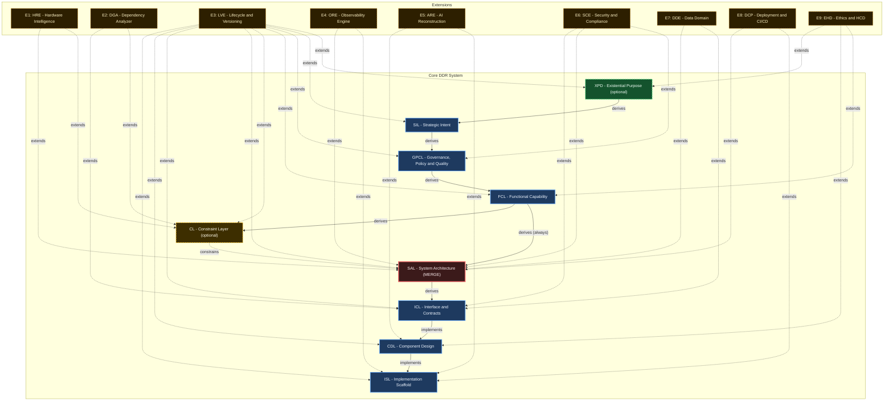

# DDR System Specification v5.0

> **Deterministic Design & Requirements System — Authoritative Reference**

| Property  | Value                                    |
| --------- | ---------------------------------------- |
| Version   | 5.0                                      |
| Status    | Finalized                                |
| Date      | 2026-03-25                               |
| Scope     | Systems-, language-, and domain-agnostic |
| Authority | DDR Architecture Board                   |
| Lineage   | Supersedes DDR v4.0                      |

> **Single Source of Truth.** This document is the exclusive normative specification for the DDR System. All prior versions are superseded. No conversation record, partial specification, or derivative document carries normative weight.

---

## 1. Design Philosophy

This specification was designed under three governing constraints:

1. **Minimize Design Complexity** — Every element earns its existence. No tier, edge type, operation, or rule exists without a concrete problem it solves. The system should be adoptable by a solo developer on day one and scale to enterprise without structural changes.
2. **Avoid Premature Optimization** — The Core defines the minimum viable graph. Advanced analytical capabilities, inference engines, and domain-specific intelligence are delivered exclusively via optional Extensions. The Core never anticipates an Extension.
3. **Maximize Structural Integrity** — The DAG is the single source of truth. Every node is traceable, every edge is typed, every mutation is validated. The system is correct by construction.

### 1.1 Changes from Prior Architectures

| Area                 | Prior State                         | Current Architecture                                                                                                        | Rationale                                                                                                                      |
| -------------------- | ----------------------------------- | --------------------------------------------------------------------------------------------------------------------------- | ------------------------------------------------------------------------------------------------------------------------------ |
| Tier count           | 11 tiers (8 mandatory + 3 optional) | 9 tiers (7 mandatory + 2 optional)                                                                                          | ORL absorbed into GPCL/FCL; HIL absorbed into TDL as a unified Constraint Layer. Eliminates two tiers without information loss |
| Fork-Join            | FCL forks to HIL∥TDL, joins at SAL  | FCL optionally constrains a single CL, joins at SAL                                                                         | Eliminates fork complexity; single constraint merge point                                                                      |
| Edge types           | 6 types                             | 4 types                                                                                                                     | `cites` merged into `derives`; `reads`/`annotates` unified into `extends`                                                      |
| Operations           | 11 operations                       | 7 operations                                                                                                                | RELOCATE removed (contradicted ID immutability); ABSTRACT/CONCRETIZE merged into INSERT with direction parameter               |
| Node ID immutability | Contradicted by RELOCATE            | Absolute — no operation mutates a node ID                                                                                   | Resolves the prior RELOCATE contradiction                                                                                      |
| ARE staging          | Ambiguous DRAFT-in-Core             | Extension Candidate Pool — explicitly outside Core DAG                                                                      | Eliminates read-only model tension                                                                                             |
| Express Mode         | 5 groups                            | Restructured from 5 groups to 4 groups; UNBUNDLE determinism rule added; all group boundaries realigned to 9-tier structure | Aligned to new 9-tier structure                                                                                                |
| Service Model        | 3-tier pricing                      | Removed                                                                                                                     | Premature optimization; commercial model is an operational concern, not a specification concern                                |

### 1.2 Errata Log

| Issue ID | Description | Resolution | Version Fixed |
| -------- | ----------- | ---------- | ------------- |
| **ISSUE-011** | ORL-R7 was incorrectly mapped to GPCL-R10 with consolidation_status 1:1. GPCL-R10 is already the exclusive 1:1 destination of ORL-R4, creating a destination collision. The notes field contained a TBD annotation, violating AX-3 Determinism in a Finalized artifact. | Corrected ORL-R7 destination to GPCL-R9. Applied consolidation_status Absorbed. Removed TBD annotation. Destination collision resolved. AX-3 compliance restored. | 4.0.1 |

---

## 2. Foundational Axioms

| ID   | Axiom                 | Statement                                                                                                                | Implication                                                                                             |
| ---- | --------------------- | ------------------------------------------------------------------------------------------------------------------------ | ------------------------------------------------------------------------------------------------------- |
| AX-1 | Traceability          | Every non-root node must cite at least one parent via a typed edge                                                       | Complete audit trails from intent to implementation; no orphaned requirements                           |
| AX-2 | Abstraction Ordering  | Technology and implementation specificity are deferred until logically necessary                                         | Tiers above CL (XPD, SIL, GPCL, FCL) must contain no technology, hardware, or implementation references |
| AX-3 | Determinism           | Identical inputs produce unambiguous, mechanically verifiable outputs                                                    | Automated validation and compliance checking are possible for all structural rules; semantic rules require explicit human disposition before node activation |
| AX-4 | Universality          | The Core applies to all software systems regardless of domain, scale, or technology                                      | No domain-specific assumptions in any Core tier                                                         |
| AX-5 | Extensibility         | Advanced analytical capabilities are delivered exclusively via optional Extensions                                       | Core remains stable under Extension addition, modification, or removal                                  |
| AX-6 | Declarative Integrity | The Core is strictly declarative; all inference, optimization, and automated recommendation are Extension-only behaviors | Core structural invariants cannot be destabilized by analytical logic                                   |
| AX-7 | DAG Acyclicity        | No citation chain may produce a cycle; causality flows in one direction only                                             | Graph traversal is always terminable                                                                    |

---

## 3. DAG Internal Model

### 3.1 Node Schema

| Property                | Type             | Description                                                       |
| ----------------------- | ---------------- | ----------------------------------------------------------------- |
| `id`                    | `TIER-N.M`       | **Immutable on assignment** — no operation may change a node's ID |
| `tier`                  | Enum             | One of: XPD, SIL, GPCL, FCL, CL, SAL, ICL, CDL, ISL               |
| `title`                 | String           | Human-readable artifact label                                     |
| `content`               | Text             | Body constrained by the tier's atomic ruleset                     |
| `parent_ids`            | List\[ParentCitation\] | ≥1 for all non-root nodes; each entry is a typed edge reference (`id`, `edge_type`, `derivation_mode`) |
| `status`                | Enum             | `DRAFT` \| `ACTIVE` \| `DIRTY` \| `DEPRECATED` \| `SUPERSEDED` \| `SUPERSEDE_PENDING` |
| `prior_status`          | Enum (Optional)  | Write-once field set when a node enters `SUPERSEDE_PENDING`, recording the prior status (`ACTIVE`, `DEPRECATED`, or `DIRTY`). |
| `version`               | SemVer           | Content version string                                            |
| `created`               | ISO 8601         | Creation timestamp                                                |
| `modified`              | ISO 8601         | Last modification timestamp                                       |
| `extension_annotations` | Map              | Read-only Extension metadata; never modifies `content`            |

### 3.2 Edge Types

| Type         | Symbol            | Semantics                                                                            |
| ------------ | ----------------- | ------------------------------------------------------------------------------------ |
| `derives`    | `──derives──▶`    | Supports two semantic modes via optional `derivation_mode` annotation: `semantic` (child content is derived from parent requirements) or `traceability` (parent is cited as authoritative lineage linkage). Defaults to `semantic`. |
| `constrains` | `╌╌constrains╌▶`  | Parent sets enforceable limits on child's design space                               |
| `implements` | `──implements──▶` | Child provides concrete realization of parent's abstract specification               |
| `extends`    | `···extends···▶`  | Extension adds metadata to or reads Core node without modifying it                   |

### 3.3 Universal Node Format

```text
[TIER]-[N].[M]: [Title]
  status:       ACTIVE | DRAFT | DIRTY | DEPRECATED | SUPERSEDED | SUPERSEDE_PENDING
  prior_status: ACTIVE | DIRTY | DEPRECATED (only present if SUPERSEDE_PENDING)
  version:      [SemVer]
  created:      [ISO 8601]
  modified:     [ISO 8601]
  parent_ids:
    - id: [TIER-N.M], edge_type: [Type], derivation_mode: [Mode]

  [Tier-compliant content body]
```

### 3.4 Core DAG Topology

```text
  [OPTIONAL ROOT]
  ┌──────────────────────────────────────────────┐
  │  XPD — Existential Purpose Document          │  ← Activate when ethical_impact ≠ none
  │  "What human need and ethical limits exist?" │    OR societal_scale > personal
  └───────────────────────┬──────────────────────┘
                          │ derives (if active)
  [INTENT LAYER]          ▼
  ┌──────────────────────────────────────────────┐
  │  SIL — Strategic Intent Layer                │  ← Root when XPD inactive
  │  "Why does this system exist?"               │
  └───────────────────────┬──────────────────────┘
                          │ derives
  [GOVERNANCE LAYER]      ▼
  ┌──────────────────────────────────────────────┐
  │  GPCL — Governance, Policy & Quality Layer   │
  │  "What external mandates and measurable      │
  │   quality thresholds govern this system?"    │
  └───────────────────────┬──────────────────────┘
                          │ derives
  [FUNCTIONAL LAYER]      ▼
  ┌──────────────────────────────────────────────┐
  │  FCL — Functional Capability Layer           │
  │  "What user-observable behaviors are needed?"│
  └───────────────┬──────────────────────────────┘
                  │ derives (always)
                  │
                  │         ┌─────────────────────────────────┐
                  │         │  CL — Constraint Layer          │  ← Optional
                  │    ────▶│  "What technology, hardware,    │
                  │         │   and infrastructure bounds     │
                  │         │   constrain the solution?"      │
                  │         └──────────────┬──────────────────┘
                  │                        │ constrains
  [ARCHITECTURE]  ▼────────────────────────┘
  ┌──────────────────────────────────────────────┐
  │  SAL — System Architecture Layer             │
  │  "How is the system structurally decomposed?"│  ← Constraint merge point
  └───────────────────────┬──────────────────────┘
                          │ derives
  [CONTRACT LAYER]        ▼
  ┌──────────────────────────────────────────────┐
  │  ICL — Interface & Contracts Layer           │
  │  "What formal contracts govern data exchange?"│
  └───────────────────────┬──────────────────────┘
                          │ implements
  [DESIGN LAYER]          ▼
  ┌──────────────────────────────────────────────┐
  │  CDL — Component Design Layer                │
  │  "What are the component structural          │
  │   blueprints?"                               │
  └───────────────────────┬──────────────────────┘
                          │ implements
  [SCAFFOLD LAYER]        ▼
  ┌──────────────────────────────────────────────┐
  │  ISL — Implementation Scaffold Layer         │
  │  "What traceable stubs initiate coding?"     │  ← Terminal leaf
  └──────────────────────────────────────────────┘
```

### 3.5 DAG Invariants

- **INV-1:** No cycles permitted at any path length.
- **INV-2:** No tier-skipping: citations must reference the immediately preceding active tier(s). SAL is the only permitted merge-node exception (exhaustive).
- **INV-3:** XPD and CL are conditionally activatable; the Core is valid and complete without them.
- **INV-4:** When CL is inactive, SAL derives directly from FCL.
- **INV-5:** All non-root nodes must carry at least one `parent_id` citation.
- **INV-6:** SUPERSEDE of any node across any tier must be atomic; partial application — defined as any state where step (1), (2), or (3) of the SUPERSEDE sequence has been applied without all three completing — constitutes a structural violation detectable by VERIFY. At most one XPD node may carry `status: ACTIVE` at any time.

### 3.6 Node ID Format

```text
[TIER]-[SECTION].[ITEM]    →  SIL-1.3 | GPCL-2.1 | CDL-12.5
XPD nodes                  →  XPD-0.N  (no sections; section = 0)
```

IDs are **immutable once assigned.** A superseded node retains its original ID with `status: SUPERSEDED`; the replacement receives a new ID. No operation — including relocation — may alter a node's assigned ID.

### 3.7 Citation Rules

| Rule    | Statement                                                                                                                                                                                                                     |
| ------- | ----------------------------------------------------------------------------------------------------------------------------------------------------------------------------------------------------------------------------- |
| CIT-R1  | Every non-root node must have ≥1 `parent_id`                                                                                                                                                                                  |
| CIT-R2  | `parent_ids` must reference node(s) from the immediately preceding active tier(s) in the DAG topology. For `edge_type='derives'`, `derivation_mode` may be provided as `semantic` or `traceability` (default is `semantic`). |
| CIT-R3  | CL → SAL constraint edges are recorded in `parent_ids` with edge type `constrains`                                                                                                                                            |
| CIT-R4  | An inline `[TIER-N.M]` citation in node content must have a matching entry in `parent_ids`                                                                                                                                    |
| CIT-R5  | Extension `extends` edges are stored in `extension_annotations` only — never in `parent_ids`                                                                                                                                  |
| CIT-R6  | Any `derives` edge used as an authority linkage (traceability citation) MUST set `derivation_mode` to `traceability`.                                                                                                         |

### 3.8 Node Status Lifecycle

> **Machine Authority:** `ddr_system_v5.0.yaml` → `lifecycle.status_transitions`

| From | To | Operation | Guards | Notes |
| ---- | -- | --------- | ------ | ----- |
| `DRAFT` | `ACTIVE` | `VALIDATE` | `gc-001`, `gc-005` |  |
| `DRAFT` | `DELETED` | `DELETE` |  |  |
| `ACTIVE` | `DIRTY` | `MODIFY\|PROPAGATION` |  | Covers direct MODIFY and DIRTY propagation side-effects. |
| `ACTIVE` | `DEPRECATED` | `MODIFY` | `gc-002` |  |
| `ACTIVE` | `SUPERSEDE_PENDING` | `SUPERSEDE` | `gc-007` |  |
| `DIRTY` | `ACTIVE` | `VERIFY+VALIDATE` | `gc-001`, `gc-005`, `gc-006` |  |
| `DIRTY` | `DEPRECATED` | `MODIFY` | `gc-002` |  |
| `DIRTY` | `SUPERSEDE_PENDING` | `SUPERSEDE` | `gc-007` |  |
| `DEPRECATED` | `SUPERSEDE_PENDING` | `SUPERSEDE` | `gc-007` |  |
| `SUPERSEDE_PENDING` | `SUPERSEDED` | `SUPERSEDE_COMPLETE` | `gc-008` | All three SUPERSEDE steps completed. `prior_status` cleared. |
| `SUPERSEDE_PENDING` | `{prior_status}` | `SUPERSEDE_ROLLBACK` | `gc-009` | Source reverts to prior status. `SUPERSEDE_FAILED` logged. |
| `DEPRECATED` | `DELETED` | `DELETE` | `gc-003` |  |
| `DEPRECATED` | `ACTIVE` | `MODIFY` | `gc-002`, `gc-003`, `gc-004` |  |

| Guard ID | Description | Mode |
| -------- | ----------- | ---- |
| `gc-001` | All structural rules for the node pass validation. | `structural` |
| `gc-002` | Deprecation rationale is explicitly documented. | `manual` |
| `gc-003` | Any previously set deprecation sunset date is cleared. | `manual` |
| `gc-004` | Status reversal is logged in the reconciliation manifest. | `manual` |
| `gc-005` | All review items are resolved. | `structural` |
| `gc-006` | Per-node validation scope is explicitly confirmed. | `structural` |
| `gc-007` | Before entering `SUPERSEDE_PENDING`, the node's current status must be recorded in `prior_status` (`ACTIVE`, `DEPRECATED`, or `DIRTY`). | `structural` |
| `gc-008` | Replacement node successfully `INSERT`ed/validated. Children re-wired and set `DIRTY`. `prior_status` cleared. | `structural` |
| `gc-009` | Replacement `INSERT` failed OR child re-wiring failed. Node reverts to `prior_status`. Replacement removed. | `structural` |

---

## 4. Consumption Modes

| Mode                   | Description                                                 | Best Fit                                  |
| ---------------------- | ----------------------------------------------------------- | ----------------------------------------- |
| **Express (4 Groups)** | Adjacent tiers bundled into groups; expandable via UNBUNDLE | Small-to-medium projects                  |
| **Full (9 Tiers)** | Every tier independently specified                          | Complex, regulated, or enterprise systems |

Express Mode is not a reduced system — it is Full Mode with grouped presentation.

### Express Mode Group Map

| Group | Tiers Bundled          | Label                          |
| ----- | ---------------------- | ------------------------------ |
| G1    | XPD (opt) + SIL + GPCL | Purpose, Strategy & Governance |
| G2    | FCL + CL (opt)         | Capabilities & Constraints     |
| G3    | SAL + ICL              | Architecture & Contracts       |
| G4    | CDL + ISL              | Design & Scaffolding           |

> **UNBUNDLE Determinism Rule:** Within Express Mode groups containing conditionally activatable tiers, content must be authored with explicit tier annotations (e.g., `[FCL]` or `[CL]`). `UNBUNDLE_SCAN` is independently invokable as a read-only pre-flight check that classifies each fragment. `UNBUNDLE_EXECUTE` is the atomic commit phase and may proceed only when all fragments are classified as 'high' confidence. The operation rejects entirely if unresolvable ambiguities exist.

## 5. Tier Specifications

> **Verification Mode:** Each atomic inclusion rule is assigned a mode: `structural` (mechanically verifiable) or `semantic` (requires human disposition via `REVIEW_REQUIRED` output before node activation).

---

### Tier 0 — XPD: Existential Purpose Document *(Optional)*

**Activate when:** `ethical_impact ≠ none` OR `societal_scale > personal`.
**Parent:** None (root when active). **Edge to child:** `derives` → SIL

#### XPD Atomic Inclusion Rules

| Rule   | Statement                                                                         | Violation Consequence                   | Mode |
| ------ | --------------------------------------------------------------------------------- | --------------------------------------- | ---- |
| XPD-R1 | Must articulate a fundamental human or societal need being addressed              | Downstream tiers lack ethical grounding | `structural` |
| XPD-R2 | Must be immutable across the project lifecycle; changes require a new XPD version | Scope drift; mission confusion          | `structural` |
| XPD-R3 | Must be comprehensible to non-technical stakeholders without a glossary           | Stakeholder misalignment                | `semantic` |
| XPD-R4 | Must establish ethical boundary conditions all subsequent tiers must satisfy      | Unethical design without detection      | `structural` |
| XPD-R5 | Must define success criteria independent of implementation metrics                | Wrong success measurement               | `structural` |
| XPD-R6 | Must identify populations who could be harmed and the safeguards required         | Harm by omission                        | `structural` |

#### XPD Atomic Exclusion Rules

*(Exclusion rules apply structurally across content bodies)*

- **XPD-E1:** Must not contain solution concepts, technology references, or architectural ideas.
- **XPD-E2:** Must not contain quantitative performance targets (→ GPCL).
- **XPD-E3:** Must not contain regulatory or legal constraints (→ GPCL).

---

### Tier 1 — SIL: Strategic Intent Layer

**Parent:** XPD (if active) or none. **Edge to child:** `derives` → GPCL

#### SIL Atomic Inclusion Rules

| Rule   | Statement                                                             | Violation Consequence                   | Mode |
| ------ | --------------------------------------------------------------------- | --------------------------------------- | ---- |
| SIL-R1 | Must define the core business problem or opportunity being addressed  | GPCL will lack strategic anchor         | `structural` |
| SIL-R2 | Must specify strategic objectives with measurable outcomes            | Unmeasurable success criteria           | `structural` |
| SIL-R3 | Must identify all stakeholder categories and their value propositions | Misaligned delivery priorities          | `structural` |
| SIL-R4 | Must establish explicit scope boundaries (in-scope and out-of-scope)  | Uncontrolled scope creep                | `structural` |
| SIL-R5 | Must define organizational success metrics                            | Inability to declare completion         | `structural` |
| SIL-R6 | Must be stable under technology changes                               | Technology coupling at the intent level | `structural` |

#### SIL Atomic Exclusion Rules

- **SIL-E1:** Must not reference hardware, technology stacks, frameworks, or languages.
- **SIL-E2:** Must not contain regulatory mandates or compliance requirements (→ GPCL).
- **SIL-E3:** Must not prescribe architectural patterns or implementation strategies.
- **SIL-E4:** Must not contain quantitative performance metrics (→ GPCL).

---

### Tier 2 — GPCL: Governance, Policy & Quality Layer

**Parent:** `derives` ← SIL. **Edge to child:** `derives` → FCL

#### GPCL Atomic Inclusion Rules

| Rule     | Statement                                                                                | Violation Consequence                              | Mode |
| -------- | ---------------------------------------------------------------------------------------- | -------------------------------------------------- | ---- |
| GPCL-R1  | Must enumerate all applicable regulatory frameworks with jurisdiction and scope          | Compliance gaps leading to legal exposure          | `structural` |
| GPCL-R2  | Must specify enforceable, testable constraints — not aspirational targets                | Non-verifiable compliance claims                   | `semantic` |
| GPCL-R3  | Must identify contractual obligations imposed by third-party relationships               | Contract breach by design                          | `structural` |
| GPCL-R4  | Must define data sovereignty and residency requirements                                  | Data law violations                                | `structural` |
| GPCL-R5  | Must specify audit and record-retention mandates                                         | Regulatory audit failure                           | `structural` |
| GPCL-R6  | Must specify quantifiable performance targets: latency, throughput, concurrency ceilings | Architecture unable to satisfy operational demands | `structural` |
| GPCL-FCL-BR1 | For every quantitative target (GPCL-R6), there must exist a corresponding FCL node providing behavioral context. Unmediated constraints must log `MISSING_MEDIATOR`. | Hollow FCL mappings or direct GPCL→SAL dependencies | `semantic` |
| GPCL-R7  | Must specify reliability and availability targets (SLAs, RTO, RPO)                       | Unacceptable service degradation                   | `structural` |
| GPCL-R8  | Must specify security requirements expressed technology-neutrally                        | Stale security specification on technology change  | `structural` |
| GPCL-R9  | Must specify scalability and accessibility requirements                                  | Architecture unable to grow; user exclusion        | `structural` |
| GPCL-R10 | Must cite parent SIL IDs for each constraint                                             | Orphaned requirements                              | `structural` |

#### GPCL Atomic Exclusion Rules

- **GPCL-E1:** Must not specify technology frameworks, library choices, or hardware specifications.
- **GPCL-E2:** Must not describe functional system behaviors (→ FCL).
- **GPCL-E3:** Must not contain business objectives or success metrics (→ SIL).

---

### Tier 3 — FCL: Functional Capability Layer

**Parent:** `derives` ← GPCL. **Edge to children:** `derives` → SAL (always); `derives` → CL (if active)

#### FCL Atomic Inclusion Rules

| Rule   | Statement                                                                                   | Violation Consequence                                           | Mode |
| ------ | ------------------------------------------------------------------------------------------- | --------------------------------------------------------------- | ---- |
| FCL-R1 | Must describe capabilities from the perspective of a user or external system                | Internal implementation details contaminate the functional spec | `semantic` |
| FCL-R2 | Must specify user workflows end-to-end without naming components, classes, or modules       | Premature structural coupling                                   | `semantic` |
| FCL-R3 | Must define event-driven behaviors and conditional business logic rules                     | Missing behavioral specification                                | `structural` |
| FCL-R4 | Must specify user-observable state transitions and error conditions                         | Incomplete behavioral model                                     | `structural` |
| FCL-R5 | Must be decomposable into sub-capabilities (parent-child FCL nodes) for complex features    | Monolithic feature specs that resist traceability               | `structural` |
| FCL-R6 | Must cite parent GPCL IDs for capabilities that satisfy a governance or quality requirement | Disconnected functional requirements                            | `structural` |
| FCL-R7 | For capability modifying persistent data, must enumerate logical data entities & CRUD relation without tech/schema details. | Data entity gaps surface reactively rather than proactively     | `semantic` |

#### FCL Atomic Exclusion Rules

- **FCL-E1:** Must not name specific classes, modules, APIs, or algorithms.
- **FCL-E2:** Must not specify network protocols, serialization formats, or data schemas.
- **FCL-E3:** Must not specify hardware requirements or infrastructure topology.

---

### Tier 4 — CL: Constraint Layer *(Conditionally Activatable)*

**Parents:** `derives` ← FCL. **Edge to child:** `constrains` → SAL
*Node Schema Extension:* CL nodes must declare `constraint_origin` as `derived` or `imposed`.

#### CL Atomic Inclusion Rules

| Rule   | Statement                                                                                            | Violation Consequence                                       | Mode |
| ------ | ---------------------------------------------------------------------------------------------------- | ----------------------------------------------------------- | ---- |
| CL-R1  | Must declare approved programming languages with version constraints                                 | Incompatible implementations                                | `structural` |
| CL-R2  | Must declare mandatory frameworks and core libraries with minimum version bounds                     | Dependency drift                                            | `structural` |
| CL-R3  | Must declare required external service contracts without their internal implementation details       | Integration gaps                                            | `structural` |
| CL-R4  | Must declare runtime environment constraints (OS, container runtime, execution environment)          | Deployment environment incompatibility                      | `structural` |
| CL-R5  | Must explicitly declare prohibited technologies with rationale                                       | License compliance violations                               | `structural` |
| CL-R6  | Must declare hardware envelopes when applicable (CPU class, RAM floor, storage, GPU)                 | Architecture that exceeds target hardware                   | `structural` |
| CL-R7  | Must declare infrastructure ceilings when applicable (compute budget, storage cap, bandwidth cap)    | Cost overruns from unconstrained architecture               | `structural` |
| CL-R8  | Must specify deployment topology declarations (on-premise, cloud-agnostic, hybrid, edge)             | Architecture incompatible with deployment target            | `structural` |
| CL-R9  | *(When origin=derived)* Must cite FCL IDs for each constraint                                        | Constraints untraceable to a business need                  | `structural` |
| CL-R9-imposed | *(When origin=imposed)* Must cite the external authority source that imposes the constraint.  | Untraceable external origin violating AX-1                  | `structural` |
| CL-R10 | Must explicitly document internal reconciliations of conflicting hardware and technology constraints | Loss of deterministic traceability for constraint conflicts | `structural` |

#### CL Atomic Exclusion Rules

- **CL-E1:** Must not auto-derive, infer, or recommend configurations (→ Extensions).
- **CL-E2:** Must not contain functional system behaviors (→ FCL).
- **CL-E3:** Must not contain cost models or TCO calculations (→ Extensions).

---

### Tier 5 — SAL: System Architecture Layer

**Merge node.**
**Parents:** `derives` ← FCL; `constrains` ← CL (if active). **Edge to child:** `derives` → ICL

#### SAL Atomic Inclusion Rules

| Rule   | Statement                                                                                  | Violation Consequence                                   | Mode |
| ------ | ------------------------------------------------------------------------------------------ | ------------------------------------------------------- | ---- |
| SAL-R1 | Must define the overarching architectural pattern(s) with rationale                        | No structural framework for downstream design           | `semantic` |
| SAL-R2 | Must specify system decomposition into major subsystems with ownership boundaries          | Ambiguous component responsibilities                    | `structural` |
| SAL-R3 | Must specify inter-subsystem communication patterns                                        | Integration design without architectural mandate        | `structural` |
| SAL-R4 | Must specify concurrency model and data ownership rules                                    | Race conditions and data integrity violations by design | `structural` |
| SAL-R5 | Must specify failure isolation and resilience boundaries                                   | Cascading failure scenarios in the architecture         | `structural` |
| SAL-R6 | Must cite all active parent IDs (FCL + CL if active) for each major architectural decision | Architectural decisions without traceable justification | `structural` |

#### SAL Atomic Exclusion Rules

- **SAL-E1:** Must not contain exact data schemas or payload definitions (→ ICL).
- **SAL-E2:** Must not contain class-level component blueprints (→ CDL).
- **SAL-E3:** Must not contain executable code, algorithm implementations, or procedural logic (→ CDL/ISL).

---

### Tier 6 — ICL: Interface & Contracts Layer

**Parent:** `derives` ← SAL. **Edge to child:** `implements` → CDL

#### ICL Atomic Inclusion Rules

| Rule   | Statement                                                                                     | Violation Consequence                              | Mode |
| ------ | --------------------------------------------------------------------------------------------- | -------------------------------------------------- | ---- |
| ICL-R1 | Must define all inter-component and external API contracts with complete input/output schemas | Implementations that diverge at integration points | `structural` |
| ICL-R2 | All schemas must be machine-parseable (JSON Schema, Protobuf, OpenAPI, or equivalent)         | Contracts that cannot be mechanically validated    | `structural` |
| ICL-R3 | Must specify serialization formats, encoding standards, and wire protocols per contract       | Interoperability failures from encoding mismatches | `structural` |
| ICL-R4 | Must specify mandatory fields, optional fields, type constraints, and validation rules        | Runtime failures from malformed payloads           | `structural` |
| ICL-R5 | Must specify error response contracts (error codes, payload structure, retry behavior)        | Undefined failure behavior at system boundaries    | `structural` |
| ICL-R6 | Must specify versioning strategy per contract                                                 | Breaking changes without migration path            | `structural` |
| ICL-R7 | Must cite SAL IDs for each contract                                                           | Contracts without architectural justification      | `structural` |

#### ICL Atomic Exclusion Rules

- **ICL-E1:** Must not contain internal component state management or business logic.
- **ICL-E2:** Must not specify architectural routing patterns (→ SAL).
- **ICL-E3:** Must not contain class or module blueprints (→ CDL).

---

### Tier 7 — CDL: Component Design Layer

**Parent:** `implements` ← ICL. **Edge to child:** `implements` → ISL

#### CDL Atomic Inclusion Rules

| Rule   | Statement                                                                                             | Violation Consequence                                     | Mode |
| ------ | ----------------------------------------------------------------------------------------------------- | --------------------------------------------------------- | ---- |
| CDL-R1 | Must define component names, logical responsibilities, and ownership boundaries                       | Ambiguous implementation targets                          | `structural` |
| CDL-R2 | Must specify all public method/function signatures (name, parameter types, return type, exceptions)   | Implementations that violate the declared interface       | `structural` |
| CDL-R3 | Must specify internal state structures as a logical model — not implementation                        | Hidden state dependencies between components              | `structural` |
| CDL-R4 | Must specify component dependencies (consumed components and ICL contracts)                           | Circular dependencies introduced at implementation        | `structural` |
| CDL-R5 | Must map each component to the ICL contracts it implements                                            | Components without contractual grounding                  | `structural` |
| CDL-R6 | Must specify initialization, lifecycle, and teardown contracts for stateful components                | Resource leaks and initialization-order bugs              | `structural` |
| CDL-R7 | When CL declares multiple target languages, must produce language-specific blueprints for each target | Language constraint not propagated; ISL-R5 compliance gap | `structural` |

#### CDL Atomic Exclusion Rules

- **CDL-E1:** Must not contain executable code bodies or algorithm implementations.
- **CDL-E2:** Must not contain system-wide architectural patterns (→ SAL).
- **CDL-E3:** Must not contain data serialization schemas (→ ICL).

---

### Tier 8 — ISL: Implementation Scaffold Layer

**Terminal leaf — no Core children.**

#### ISL Atomic Inclusion Rules

| Rule   | Statement                                                                                             | Violation Consequence                       | Mode |
| ------ | ----------------------------------------------------------------------------------------------------- | ------------------------------------------- | ---- |
| ISL-R1 | Must produce syntactically valid structural scaffolding in the target language                        | Scaffolding that fails to compile or parse  | `structural` |
| ISL-R2 | Must embed docstrings or code comments with explicit parent DDR node IDs                              | Implementations without traceability        | `structural` |
| ISL-R3 | Must include implementation hints as structured comments                                              | Implementers who lose architectural context | `structural` |
| ISL-R4 | Must define all function/method bodies exclusively as stubs                                           | Pre-implementation contamination            | `structural` |
| ISL-R5 | Must be language-specific — one ISL node per target language/runtime when multiple are declared in CL | Language-ambiguous stubs                    | `structural` |
| ISL-R6 | Must cite CDL parent IDs for every stub                                                               | Orphaned scaffolding                        | `structural` |

#### ISL Reference Blueprint

```python
# [CDL-7.1] DdrNode scaffold — Python target (CL-4.1: Python 3.10+)
from enum import Enum
from datetime import datetime
from dataclasses import dataclass, field
from typing import Any, Optional

class TierEnum(str, Enum):
    XPD="XPD"; SIL="SIL"; GPCL="GPCL"; FCL="FCL"; CL="CL"
    SAL="SAL"; ICL="ICL"; CDL="CDL"; ISL="ISL"

class StatusEnum(str, Enum):
    # SUPERSEDE_PENDING is transient and not a stable lifecycle state outside SUPERSEDE
    DRAFT="DRAFT"; ACTIVE="ACTIVE"; DIRTY="DIRTY"
    DEPRECATED="DEPRECATED"; SUPERSEDED="SUPERSEDED"
    SUPERSEDE_PENDING="SUPERSEDE_PENDING"

class EdgeTypeEnum(str, Enum):
    DERIVES="derives"; CONSTRAINS="constrains"
    IMPLEMENTS="implements"; EXTENDS="extends"

class DerivationModeEnum(str, Enum):
    SEMANTIC="semantic"; TRACEABILITY="traceability"

@dataclass
class ParentCitation:
    id: str
    edge_type: EdgeTypeEnum
    derivation_mode: Optional[DerivationModeEnum] = None

@dataclass
class DdrNode:
    id: str
    tier: TierEnum
    title: str
    status: StatusEnum
    version: str
    created: datetime
    modified: datetime
    parent_ids: list[ParentCitation] = field(default_factory=list)
    content: str = ""
    extension_annotations: dict[str, Any] = field(default_factory=dict)
```

#### ISL Atomic Exclusion Rules

- **ISL-E1:** Must not contain business logic or complete algorithmic logic.
- **ISL-E2:** Must not contain infrastructure configuration (→ Extensions).

---

## 6. Constraint Precedence

When two tiers produce conflicting constraints on a downstream tier, precedence governs resolution (highest to lowest):

1. **XPD** — Ethical boundaries function as an absolute veto right.
2. **SIL** — Strategic intent
3. **GPCL** — External regulatory mandates and quality thresholds
4. **FCL** — Functional requirements
5. **CL** — Externally imposed technology, hardware, and infrastructure limits
6. **SAL** — Architecture bounds
7. **ICL** — Contract derivation
8. **CDL** — Design derivation
9. **ISL** — Scaffold derivation

**Intra-Tier Conflict Rule:** When two or more nodes within the same tier produce conflicting constraints, the conflict must be explicitly documented and resolved before transitioning to `ACTIVE`.

---

## 7. Atomic Operations Protocol

### 7.1 Core Operations

| Operation | Description |
| --------- | ----------- |
| **INSERT** | Create node with auto-assigned ID, `parent_ids`, and tier-compliant content. Fails atomically on structural invalidity. |
| **DELETE** | Remove node; cascade orphan detection to children. |
| **MODIFY** | Update content; version incremented. DIRTY propagation sent to all descendants. |
| **SUPERSEDE** | **(1)** Transition source to `SUPERSEDE_PENDING`, record `prior_status`. **(2)** Attempt `INSERT` of replacement. **(3a)** On success: transition source to `SUPERSEDED`, re-wire children to replacement, set children `DIRTY`, clear `prior_status`. **(3b)** On failure: rollback source to `prior_status`, discard replacement, log `SUPERSEDE_FAILED`. |
| **VERIFY** | Traverse DAG downward; validate citation chains, edge types, ID references, orphans, and contamination. Any node in `SUPERSEDE_PENDING` causes a blocking failure. |
| **VALIDATE** | Mechanically check structural rules (Pass/Fail). For semantic rules, outputs `REVIEW_REQUIRED` — a node cannot become `ACTIVE` until all review requirements receive a recorded human disposition. |
| **UNBUNDLE_SCAN** | Read-only pre-flight scan classifying Express Mode fragments by confidence (high, ambiguous, none). |
| **UNBUNDLE_EXECUTE** | Atomic commit phase. Expands group into Full Mode tiers only if all fragments scored 'high' during scan. Reject atomically on ambiguity. |

### 7.2 Dirty Flag & Lifecycle Notes

- **Modify Cascades:** Modifying a node flags that node and **all** descendants `DIRTY`.
- **SUPERSEDE Scope:** The automatic re-wiring of `parent_ids` during a successful `SUPERSEDE` sets the immediate children `DIRTY` (so their content can be re-validated), but *does not* cascade to grandchildren automatically.
- **SUPERSEDE_PENDING:** While in this state, no `DIRTY` propagation occurs. `VERIFY` treats it as a `SUPERSEDE_PENDING_DETECTED` failure with severity `BLOCKING`.

### 7.3 Resolution Workflow

```text
DETECT CHANGE → SET DIRTY → SCAN DOWNSTREAM
  → GENERATE PENDING ITEMS → EXECUTE OPERATION → VERIFY → SET CLEAN | REPEAT
```

### 7.4 Reconciliation Manifest Schema

The manifest tracks aggregate states and pending items:
- **`MISSING_MEDIATOR`**: Logged when a GPCL-R6 quantitative target lacks an FCL capability providing behavioral context.
- **`SUPERSEDE_FAILED`**: Logs failed step 2 or 3 `SUPERSEDE` attempts along with the failure reason and target node hash.
- **`SUPERSEDE_PENDING_DETECTED`**: Emitted by `VERIFY` with `BLOCKING` severity when encountering in-flight operations.

---

## 8. Extension System

Extensions are **orthogonal read-only overlays** attaching to the Core DAG via `extends` edges.

**Extensions may:** Read Core node content; Annotate Core nodes (metadata only); Generate derived external artifacts; Add advisories.
**Extensions may not:** Modify Core `content`, `parent_ids`, `tier`, or `status`; Redefine Core semantics; Set Core nodes to `DIRTY`.

### 8.1 Extension Candidate Pool

AI Upward Reconstruction (ARE) places inferred nodes in an **Extension Candidate Pool** outside the Core DAG:
- **Activation States:**
  - **`active`**: Inference runs. Pool is visible. Promotion and manual discard allowed.
  - **`paused`**: Inference halts. Candidate Pool MUST be atomically persisted to the checkpoint path (`.agent/state/are_candidate_pool.checkpoint.yaml`). Existing candidates remain browsable and promotable. Re-persists on any pool mutation.
  - **`disabled`**: Inference halts. Pool is atomically discarded and checkpoint file is deleted.
- Nodes are strictly `CANDIDATE` status. No effect on Core `DIRTY` propagation.
- Promotion requires `INSERT` validation.

---

## 9. Extension Catalog

### E1 — Hardware & Resource Intelligence Extension (HRE)

*Annotates: CL, SAL.* Produces minimum hardware profiles, enforces SAL patterns against CL ceilings.

### E2 — Dependency Graph Analyzer (DGA)

*Annotates: CL, ICL.* Analyzes dependency graphs, flags conflicts and copyleft licenses.

### E3 — Lifecycle & Versioning Engine (LVE)

*Annotates: All.* Tracks version history, technical debt estimates, and VCS commit hashes.

### E4 — Observability & Runtime Engine (ORE)

*Annotates: ISL, SAL.* Derives telemetry stubs from GPCL targets, maps incidents to design nodes.

### E5 — AI Upward Reconstruction Engine (ARE)

*Annotates: SAL, ICL, CDL, ISL.* AI inference engine.
- **ARE-R2 / ARE-R5**: Each candidate is scored (0.0–1.0) using a declared `scoring_profile` (`standard_v1`, `conservative_v1`, or `custom`). Identical evidence must produce identical scores (AX-3).
- **ARE-R4**: ARE must never autonomously create XPD or GPCL nodes.
- **Scoring Thresholds**: Candidates below the profile's `minimum_surfacing_threshold` cannot be promoted via `INSERT` unless flagged with `override_flag: true` and documented `human_rationale`.

### E6 — Security & Compliance Engine (SCE)

*Annotates: GPCL, SAL, ICL.* Expresses STRIDE threat models, flags trust boundary violations, and enumerates PII flows.

### E7 — Data Domain Extension (DDE)

*Annotates: ICL, SAL, FCL.* Expresses canonical ER models.
- **DDE-R5**: Annotates FCL via *confirmation validation only* (verifying FCL-R7 entities exist in ICL). DDE must not infer unstated entities.

### E8 — Deployment & CI/CD Planner (DCP)

*Annotates: ISL, SAL.* Maps deployments, defines CI/CD pipelines, generates IaC linked to CL constraints.

### E9 — Ethics & Human-Centered Design Extension (EHD)

*Annotates: FCL, CDL, SAL.* Validates WCAG accessibility, assesses bias, and traces algorithmic accountability. Creates a synthetic, risk-flagging assessment if XPD is inactive.

---

## 10. Architecture Diagram



---

## 11. Compliance Checklist

A DDR project may not be declared `CLEAN` until all items are satisfied.

> **Structural Validation**

- [ ] All non-root nodes have ≥1 valid, non-superseded `parent_id`
- [ ] All `parent_ids` reference nodes of the correct parent tier
- [ ] No cycles exist in any citation path (VERIFY confirms)
- [ ] No tier-skipping detected
- [ ] All inline `[TIER-N.M]` citations have matching entries in `parent_ids`
- [ ] No node has `status: DIRTY`
- [ ] Reconciliation manifest shows zero pending items
- [ ] If any Extension is active, all Extension advisories classified as `critical` or `blocking` have a recorded disposition note

> **Atomic Rule Validation**

- [ ] XPD nodes satisfy XPD-R1 through XPD-R6 and XPD-E1 through XPD-E3
- [ ] SIL nodes satisfy SIL-R1 through SIL-R6 and SIL-E1 through SIL-E4
- [ ] GPCL nodes satisfy GPCL-R1 through GPCL-R10 and GPCL-E1 through GPCL-E3
- [ ] FCL capabilities are user-observable and free of implementation references. Data-modifying FCL capabilities enumerate all logical data entities and their CRUD relationships per FCL-R7 without referencing field types, schemas, or table structures (FCL-E2 boundary preserved).
- [ ] CL nodes are declarative only; no inference (CL-E1)
- [ ] SAL cites all active parent tiers (FCL + CL if active)
- [ ] ICL schemas are machine-parseable (ICL-R2)
- [ ] ISL stubs contain traceable docstrings citing CDL parent IDs
- [ ] CDL nodes produce language-specific blueprints when CL declares multiple targets (CDL-R7)
- [ ] All `REVIEW_REQUIRED` items in the reconciliation manifest have a recorded human disposition (APPROVED or REJECTED with rationale) before any affected node transitions from DRAFT to ACTIVE.

> **Extension Validation** *(when Extensions active)*

- [ ] All active Extensions declare compatible contract versions for DDR-Core-5.x
- [ ] Extension annotations stored in `extension_annotations` only
- [ ] Extension advisories reviewed; non-critical advisories have disposition notes
- [ ] ARE-generated candidates reviewed and either promoted via INSERT or discarded
- [ ] ARE `scoring_profile` is declared in the E5 Extension contract and references a valid profile. Custom profiles must satisfy all `required_fields`. Candidates promoted below `minimum_surfacing_threshold` carry `override_flag: true` with a non-empty `human_rationale` in pending_items.

---

## Glossary

| Term                   | Definition                                                                                                                                                                                       |
| ---------------------- | ------------------------------------------------------------------------------------------------------------------------------------------------------------------------------------------------ |
| **Atomic Rule** | An inclusion or exclusion constraint on a tier node, individually verifiable without reference to other nodes                                                                                    |
| **Candidate Pool** | Extension-managed staging area for ARE-inferred nodes; explicitly outside the Core DAG until promoted via INSERT                                                                                 |
| **DAG** | Directed Acyclic Graph — the DDR System's foundational data structure                                                                                                                            |
| **Dirty Flag** | `DIRTY` status indicating a node requires re-validation following a graph-modifying event                                                                                                        |
| **Edge Type** | One of four typed relationships: `derives`, `constrains`, `implements`, `extends`                                                                                                                |
| **Express Mode** | A four-group consumption mode; groups are unbundleable to Full Mode tiers via UNBUNDLE                                                                                                           |
| **Extension** | An optional analytical overlay that reads and annotates Core nodes without modifying Core semantics                                                                                              |
| **Leaf Node** | A node with no children; ISL nodes are the only valid leaf nodes in a CLEAN Core DAG. During incremental authoring, non-ISL tiers may temporarily be leaf nodes; VERIFY flags them as incomplete |
| **Merge Node** | SAL — the point where FCL derivations and CL constraints converge                                                                                                                                |
| **Orphan** | A non-root node with no valid `parent_id` — a structural violation                                                                                                                               |
| **REVIEW_REQUIRED** | A VALIDATE output status emitted for each semantic atomic inclusion rule. Indicates that human disposition is required before `ACTIVE` status is granted.                                        |
| **Root Node** | XPD (if active) or SIL (if XPD inactive); the only node with an empty `parent_ids` list                                                                                                          |
| **Tier Contamination** | Presence of content in a node that violates that tier's atomic exclusion rules                                                                                                                   |
| **verification_mode** | Classifies atomic inclusion rules as `structural` (mechanically verifiable) or `semantic` (requires human judgment).                                                                             |

---

## Appendix A: Version History

| Version | Date       | Change Summary                                                                                                                                                                                         |
| ------- | ---------- | ------------------------------------------------------------------------------------------------------------------------------------------------------------------------------------------------------ |
| 1.0     | —          | Initial DDR System concept (7-tier linear: BRD→NFR→FSD→SAD→ICD→TDD→ISP)                                                                                                                                |
| 2.1     | 2026-02-26 | Refined Core + Extension system                                                                                                                                                                        |
| 3.0     | 2026-02-26 | Complete redesign: fork-join DAG; GPCL isolation; XPD optional root; Z-axis extensions; Express Mode; CRR protocol; 9 Extensions                                                                       |
| 3.1.1   | 2026-02-26 | Structural consolidation: universal node format; 6-edge vocabulary; axiom implications                                                                                                                 |
| 4.0     | 2026-02-26 | Structural simplification: 11→9 tiers; 6→4 edge types; 11→7 operations; fork-join→merge-node; RELOCATE removed; ARE Candidate Pool; Express Mode→4 groups; Service Model removed; CRR protocol removed |
| 5.0     | 2026-03-25 | Issue-driven refinement: SUPERSEDE atomicity with SUPERSEDE_PENDING transient state and prior_status rollback; verification_mode on atomic rules; FCL-R7 data entity enumeration; ARE tri-state lifecycle with checkpoint persistence; DDE confirmation-only validation; UNBUNDLE_SCAN/UNBUNDLE_EXECUTE two-phase protocol; GPCL-FCL-BR1 bridge rule; CL constraint_origin and imposed-citation rule CL-R9-imposed; reconciliation manifest schema formalized. |

---

## Appendix B: Tier Migration (Prior to v4.0)

| v3.1.1 Tier | v4.0/5.0 Dest. | Migration Notes                                                                                     |
| ----------- | -------------- | --------------------------------------------------------------------------------------------------- |
| XPD         | XPD            | Unchanged                                                                                           |
| SIL         | SIL            | Unchanged                                                                                           |
| GPCL        | GPCL           | Expanded to absorb ORL quality/performance content                                                  |
| ORL         | GPCL           | ORL-R1 through ORL-R7 become GPCL-R6 through GPCL-R10 (ORL-R5 and ORL-R6 consolidated into GPCL-R9) |
| FCL         | FCL            | Now derives from GPCL instead of ORL                                                                |
| HIL         | CL             | HIL-R1 through HIL-R5 become CL-R6 through CL-R8                                                    |
| TDL         | CL             | TDL-R1 through TDL-R6 become CL-R1 through CL-R5                                                    |
| SAL         | SAL            | Simplified from fork-join to single merge-node                                                      |
| ICL         | ICL            | Unchanged                                                                                           |
| CDL         | CDL            | Unchanged                                                                                           |
| ISL         | ISL            | References CL instead of TDL for language targets                                                   |

### Rule-Level Cross-Reference

| Prior Rule ID                 | Destination                         | Consolidation Status                | Notes                                                |
| ----------------------------- | ----------------------------------- | ----------------------------------- | ---------------------------------------------------- |
| ORL-R1 through ORL-R4         | GPCL-R6, GPCL-R7, GPCL-R8, GPCL-R10 | 1:1                                 | Maps to performance, reliability, security, and SIL citation rules |
| ORL-R7                        | GPCL-R9                             | Absorbed                            | Semantics are subsumed under GPCL-R9 as broader operational governance constraints. *(Fixed in v4.0.1)* |
| ORL-R5                        | GPCL-R9                             | N:1                                 | Consolidated with ORL-R6                             |
| ORL-R6                        | GPCL-R9                             | N:1                                 | Consolidated with ORL-R5                             |
| HIL-R1/R2/R3                  | CL-R6                               | N:1 Consolidated                    | Consolidated into hardware envelopes                 |
| HIL-R4                        | CL-R7                               | 1:1                                 | —                                                    |
| HIL-R5                        | CL-R8                               | 1:1                                 | —                                                    |
| TDL-R1                        | CL-R1                               | 1:1                                 | —                                                    |
| TDL-R2/R6                     | CL-R2                               | N:1 Consolidated                    | Consolidated into minimum version bounds             |
| TDL-R3                        | CL-R3                               | 1:1                                 | —                                                    |
| TDL-R4                        | CL-R4                               | 1:1                                 | —                                                    |
| TDL-R5                        | CL-R5                               | 1:1                                 | —                                                    |

---
*DDR System v5.0 — Deterministic Design for Software Excellence*
*Single Source of Truth — All prior versions superseded*
