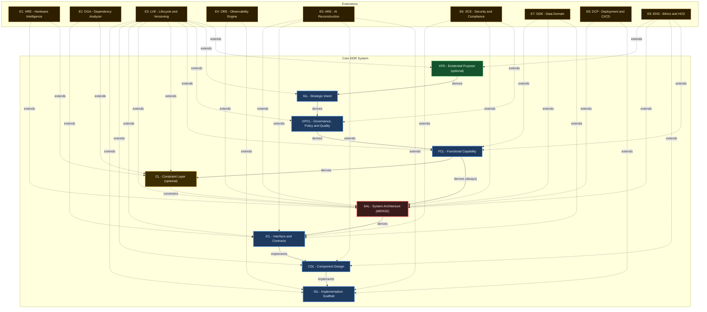

# DDR System Specification v5.0

> **Deterministic Design & Requirements System — Authoritative Reference**

| Property  | Value                                    |
| --------- | ---------------------------------------- |
| Version   | 5.0                                      |
| Status    | Finalized                                |
| Date      | 2026-03-25                               |
| Scope     | Systems-, language-, and domain-agnostic |
| Authority | DDR Architecture Board                   |
| Lineage   | Supersedes DDR v4.0                      |

> **Single Source of Truth.** This document is the exclusive normative specification for the DDR System. All prior versions are superseded. No conversation record, partial specification, or derivative document carries normative weight.

---

## 1. Design Philosophy

This specification was designed under three governing constraints:

1. **Minimize Design Complexity** — Every element earns its existence. No tier, edge type, operation, or rule exists without a concrete problem it solves. The system should be adoptable by a solo developer on day one and scale to enterprise without structural changes.
2. **Avoid Premature Optimization** — The Core defines the minimum viable graph. Advanced analytical capabilities, inference engines, and domain-specific intelligence are delivered exclusively via optional Extensions. The Core never anticipates an Extension.
3. **Maximize Structural Integrity** — The DAG is the single source of truth. Every node is traceable, every edge is typed, every mutation is validated. The system is correct by construction.

### 1.1 Changes from v4.0

| Area                 | v4.0                                | v5.0 (This Spec)                                                                                                            | Rationale                                                                                                                      |
| -------------------- | ----------------------------------- | --------------------------------------------------------------------------------------------------------------------------- | ------------------------------------------------------------------------------------------------------------------------------ |
| SUPERSEDE atomicity  | Single-step operation               | Three-phase protocol with SUPERSEDE_PENDING transient state, prior_status rollback, and SUPERSEDE_COMPLETE/SUPERSEDE_ROLLBACK | Resolves race conditions and partial failure states; enables deterministic recovery |
| Rule verification    | Implicit structural-only            | Explicit verification_mode (structural \| semantic) per atomic inclusion rule                                              | Enables VALIDATE to distinguish mechanical checks from human-required review |
| FCL data entities    | No explicit data entity requirement   | FCL-R7 mandates CRUD enumeration for all data-modifying capabilities                                                       | Prevents reactive data gaps; ensures proactive entity identification without ICL contamination |
| UNBUNDLE operation   | Single-phase execute                | Two-phase protocol: UNBUNDLE_SCAN (read-only diagnostic) + UNBUNDLE_EXECUTE (atomic commit)                                | Enables iterative diagnose-annotate-retry workflows; prevents ambiguous allocations |
| ARE lifecycle        | Binary active/disabled              | Tri-state: active \| paused \| disabled with checkpoint persistence                                                        | Supports practitioner review workflows without data loss; preserves AX-6 declarative integrity |
| ARE confidence       | Fixed 0.0-1.0 score                 | Scoring profiles (standard_v1, conservative_v1, custom) with configurable thresholds                                         | Adaptable confidence gating for regulated vs. rapid-development environments |
| CL constraints       | Single citation model               | constraint_origin (derived \| imposed) with differentiated citation requirements                                           | Distinguishes design-team choices from externally mandated constraints; preserves AX-1 traceability |
| GPCL-FCL bridge      | Implicit mediation                  | Explicit GPCL-FCL-BR1 bridge rule with MISSING_MEDIATOR logging                                                            | Prevents hollow FCL mappings; ensures behavioral context for all performance targets |
| DDE validation       | Discovery-mode annotation allowed   | Confirmation-only validation; FCL-R7 gaps flagged as FCL violations, not DDE discoveries                                 | Prevents Extension overreach into Core authoring responsibilities |

### 1.2 Errata Log

| Issue ID | Description | Resolution | Authority | Introduced | Fixed |
|----------|-------------|------------|-----------|------------|-------|
| ISSUE-011 | ORL-R7 incorrectly mapped to GPCL-R10 with 1:1 consolidation_status, creating destination collision with ORL-R4. Notes field contained TBD annotation violating AX-3. | Corrected ORL-R7 destination to GPCL-R9. Applied consolidation_status "Absorbed". Removed TBD annotation. | DDR Architecture Board | 4.0.0 | 4.0.1 |

---

## 2. Foundational Axioms

| ID   | Axiom                 | Statement                                                                                                                | Implication                                                                                             |
| ---- | --------------------- | ------------------------------------------------------------------------------------------------------------------------ | ------------------------------------------------------------------------------------------------------- |
| AX-1 | Traceability          | Every non-root node must cite at least one parent via a typed edge                                                       | Complete audit trails from intent to implementation; no orphaned requirements                           |
| AX-2 | Abstraction Ordering  | Technology and implementation specificity are deferred until logically necessary                                         | Tiers above CL (XPD, SIL, GPCL, FCL) must contain no technology, hardware, or implementation references |
| AX-3 | Determinism           | Identical inputs produce unambiguous, mechanically verifiable outputs                                                    | Automated validation and compliance checking are possible for structural rules; semantic rules require explicit human disposition |
| AX-4 | Universality          | The Core applies to all software systems regardless of domain, scale, or technology                                      | No domain-specific assumptions in any Core tier                                                         |
| AX-5 | Extensibility         | Advanced analytical capabilities are delivered exclusively via optional Extensions                                       | Core remains stable under Extension addition, modification, or removal                                  |
| AX-6 | Declarative Integrity | The Core is strictly declarative; all inference, optimization, and automated recommendation are Extension-only behaviors | Core structural invariants cannot be destabilized by analytical logic                                   |
| AX-7 | DAG Acyclicity        | No citation chain may produce a cycle; causality flows in one direction only                                             | Graph traversal is always terminable                                                                    |

---

## 3. DAG Internal Model

### 3.1 Node Schema

| Property                | Type             | Description                                                       |
| ----------------------- | ---------------- | ----------------------------------------------------------------- |
| `id`                    | `TIER-N.M`       | **Immutable on assignment** — no operation may change a node's ID |
| `tier`                  | Enum             | One of: XPD, SIL, GPCL, FCL, CL, SAL, ICL, CDL, ISL               |
| `title`                 | String           | Human-readable artifact label                                     |
| `content`               | Text             | Body constrained by the tier's atomic ruleset                     |
| `parent_ids`            | List[ParentCitation] | ≥1 for all non-root nodes; typed by edge with optional derivation_mode |
| `status`                | Enum             | `DRAFT` \| `ACTIVE` \| `DIRTY` \| `DEPRECATED` \| `SUPERSEDED` \| `SUPERSEDE_PENDING` |
| `prior_status`          | Enum (restricted) | Write-once field recording pre-SUPERSEDE status; cleared on SUPERSEDE completion or rollback |
| `version`               | SemVer           | Content version string                                            |
| `created`               | ISO 8601         | Creation timestamp                                                |
| `modified`              | ISO 8601         | Last modification timestamp                                       |
| `extension_annotations` | Map              | Read-only Extension metadata; never modifies `content`            |

**ParentCitation Structure:**

| Field | Type | Description |
|-------|------|-------------|
| `id` | String | Parent node ID (pattern: TIER-N.M) |
| `edge_type` | Enum | `derives` \| `constrains` \| `implements` \| `extends` |
| `derivation_mode` | Enum (optional) | `semantic` (default) \| `traceability` — valid only for `derives` edges |

### 3.2 Edge Types

| Type         | Symbol            | Semantics                                                                            |
| ------------ | ----------------- | ------------------------------------------------------------------------------------ |
| `derives`    | `──derives──▶`    | Child content derived from parent requirements. Supports two modes via `derivation_mode`: `semantic` = derived content; `traceability` = lineage linkage only |
| `constrains` | `╌╌constrains╌▶`  | Parent sets enforceable limits on child's design space                               |
| `implements` | `──implements──▶` | Child provides concrete realization of parent's abstract specification               |
| `extends`    | `···extends···▶`  | Extension adds metadata to or reads Core node without modifying it                 |

### 3.3 Universal Node Format

```text
[TIER]-[N].[M]: [Title]
  status:     ACTIVE | DRAFT | DIRTY | DEPRECATED | SUPERSEDED | SUPERSEDE_PENDING
  version:    [SemVer]
  created:    [ISO 8601]
  modified:   [ISO 8601]
  parent_ids: [[TIER-N.M], ...]   ← empty only for root nodes

  [Tier-compliant content body]
```

### 3.4 Core DAG Topology

```text
  [OPTIONAL ROOT]
  ┌──────────────────────────────────────────────┐
  │  XPD — Existential Purpose Document          │  ← Activate when ethical_impact ≠ none
  │  "What human need and ethical limits exist?" │    OR societal_scale > personal
  └───────────────────────┬──────────────────────┘
                          │ derives (if active)
  [INTENT LAYER]          ▼
  ┌──────────────────────────────────────────────┐
  │  SIL — Strategic Intent Layer                │  ← Root when XPD inactive
  │  "Why does this system exist?"               │
  └───────────────────────┬──────────────────────┘
                          │ derives
  [GOVERNANCE LAYER]      ▼
  ┌──────────────────────────────────────────────┐
  │  GPCL — Governance, Policy & Quality Layer │
  │  "What external mandates and measurable      │
  │   quality thresholds govern this system?"    │
  └───────────────────────┬──────────────────────┘
                          │ derives
  [FUNCTIONAL LAYER]      ▼
  ┌──────────────────────────────────────────────┐
  │  FCL — Functional Capability Layer           │
  │  "What user-observable behaviors are needed?"│
  └───────────────┬──────────────────────────────┘
                  │ derives (always)
                  │
                  │         ┌─────────────────────────────────┐
                  │         │  CL — Constraint Layer          │  ← Optional
                  │    ────▶│  "What technology, hardware,    │
                  │         │   and infrastructure bounds     │
                  │         │   constrain the solution?"      │
                  │         └──────────────┬──────────────────┘
                  │                        │ constrains
  [ARCHITECTURE]  ▼────────────────────────┘
  ┌──────────────────────────────────────────────┐
  │  SAL — System Architecture Layer             │
  │  "How is the system structurally decomposed?"│  ← Constraint merge point
  └───────────────────────┬──────────────────────┘
                          │ derives
  [CONTRACT LAYER]        ▼
  ┌──────────────────────────────────────────────┐
  │  ICL — Interface & Contracts Layer           │
  │  "What formal contracts govern data exchange?"│
  └───────────────────────┬──────────────────────┘
                          │ implements
  [DESIGN LAYER]          ▼
  ┌──────────────────────────────────────────────┐
  │  CDL — Component Design Layer                │
  │  "What are the component structural          │
  │   blueprints?"                               │
  └───────────────────────┬──────────────────────┘
                          │ implements
  [SCAFFOLD LAYER]        ▼
  ┌──────────────────────────────────────────────┐
  │  ISL — Implementation Scaffold Layer         │
  │  "What traceable stubs initiate coding?"     │  ← Terminal leaf
  └──────────────────────────────────────────────┘

  LEGEND:
  ──────────▶  derives / implements edge
  ╌╌╌╌╌╌╌╌╌▶  constrains edge
```

### 3.5 DAG Invariants

- No cycles permitted at any path length
- No tier-skipping: citations must reference the immediately preceding active tier(s). SAL is the only permitted merge-node exception (exhaustive)
- XPD and CL are conditionally activatable; the Core is valid and complete without them
- When CL is inactive, SAL derives directly from FCL
- All non-root nodes must carry at least one `parent_id` citation
- At most one XPD node may carry `status: ACTIVE` at any time
- SUPERSEDE of any node must be atomic; partial application constitutes a structural violation detectable by VERIFY

### 3.6 Node ID Format

```text
[TIER]-[SECTION].[ITEM]    →  SIL-1.3 | GPCL-2.1 | CDL-12.5
XPD nodes                  →  XPD-0.N  (no sections; section = 0)
```

IDs are **immutable once assigned.** A superseded node retains its original ID with `status: SUPERSEDED`; the replacement receives a new ID. No operation — including relocation — may alter a node's assigned ID.

### 3.7 Citation Rules

| Rule    | Statement                                                                                                                                                                                                                     |
| ------- | ----------------------------------------------------------------------------------------------------------------------------------------------------------------------------------------------------------------------------- |
| CIT-R1  | Every non-root node must have ≥1 `parent_id`                                                                                                                                                                                  |
| CIT-R2  | `parent_ids` must reference node(s) from the immediately preceding active tier(s) in the DAG topology. For `edge_type='derives'`, `derivation_mode` may be `semantic` (default) or `traceability`                           |
| CIT-R3  | CL → SAL constraint edges are recorded in `parent_ids` with edge type `constrains`                                                                                                                                            |
| CIT-R4  | An inline `[TIER-N.M]` citation in node content must have a matching entry in `parent_ids`                                                                                                                                  |
| CIT-R5  | Extension `extends` edges are stored in `extension_annotations` only — never in `parent_ids`                                                                                                                                 |
| CIT-R6  | Any `derives` edge used as authority linkage (traceability citation) MUST set `derivation_mode` to `traceability`                                                                                                           |

### 3.8 Node Status Lifecycle

> **Authority Note:** This table is a human-readable rendering of the `lifecycle.status_transitions` block in `ddr_system_v5.0.yaml`. In the event of divergence, the YAML block is authoritative. See §3.8 YAML Authority Policy.

| From | To | Operation | Guards | Notes |
| ---- | -- | --------- | ------ | ----- |
| `DRAFT` | `ACTIVE` | `VALIDATE` | `gc-001`, `gc-005` | |
| `DRAFT` | `DELETED` | `DELETE` | | |
| `ACTIVE` | `DIRTY` | `MODIFY\|PROPAGATION` | | Covers direct MODIFY and DIRTY propagation |
| `ACTIVE` | `DEPRECATED` | `MODIFY` | `gc-002` | |
| `ACTIVE` | `SUPERSEDE_PENDING` | `SUPERSEDE` | `gc-007` | Records `prior_status` before transition |
| `DIRTY` | `ACTIVE` | `VERIFY+VALIDATE` | `gc-001`, `gc-005`, `gc-006` | |
| `DIRTY` | `DEPRECATED` | `MODIFY` | `gc-002` | |
| `DIRTY` | `SUPERSEDE_PENDING` | `SUPERSEDE` | `gc-007` | |
| `DEPRECATED` | `SUPERSEDE_PENDING` | `SUPERSEDE` | `gc-007` | |
| `SUPERSEDE_PENDING` | `SUPERSEDED` | `SUPERSEDE_COMPLETE` | `gc-008` | All three SUPERSEDE steps completed; `prior_status` cleared |
| `SUPERSEDE_PENDING` | `{prior_status}` | `SUPERSEDE_ROLLBACK` | `gc-009` | Reverts to recorded `prior_status`; `prior_status` cleared |
| `DEPRECATED` | `DELETED` | `DELETE` | `gc-003` | |
| `DEPRECATED` | `ACTIVE` | `MODIFY` | `gc-002`, `gc-003`, `gc-004` | |

> **Terminal Status:** `SUPERSEDED` is a terminal status. No outbound transition from `SUPERSEDED` is permitted. A new node must be created via INSERT if superseded content requires revision.

> **Prohibited from SUPERSEDE_PENDING:** `DRAFT`, `DELETED`. SUPERSEDE_PENDING may only exit to SUPERSEDED (success) or to the node's recorded `prior_status` (failure/rollback).

| Guard ID | Description | Verification Mode |
| -------- | ----------- | ----------------- |
| `gc-001` | All structural rules for the node pass validation | `structural` |
| `gc-002` | Deprecation rationale is explicitly documented | `manual` |
| `gc-003` | Any previously set deprecation sunset date is cleared | `manual` |
| `gc-004` | Status reversal is logged in the reconciliation manifest | `manual` |
| `gc-005` | All review items are resolved | `structural` |
| `gc-006` | Per-node validation scope is explicitly confirmed | `structural` |
| `gc-007` | Before entering SUPERSEDE_PENDING, node's current status is recorded in `prior_status` (must be ACTIVE, DEPRECATED, or DIRTY) | `structural` |
| `gc-008` | Replacement node INSERTed and validated; children's `parent_ids` re-wired; children set DIRTY; `prior_status` cleared | `structural` |
| `gc-009` | Replacement INSERT failed or child re-wiring failed; source reverts to `prior_status`; replacement removed if INSERT succeeded; `SUPERSEDE_FAILED` logged | `structural` |

---

## 4. Consumption Modes

| Mode                   | Description                                                 | Best Fit                                  |
| ---------------------- | ----------------------------------------------------------- | ----------------------------------------- |
| **Express (4 Groups)** | Adjacent tiers bundled into groups; expandable via UNBUNDLE | Small-to-medium projects                  |
| **Full (9 Tiers)**     | Every tier independently specified                          | Complex, regulated, or enterprise systems |

Express Mode is not a reduced system — it is Full Mode with grouped presentation. The UNBUNDLE operation expands any group into its constituent tiers without information loss or invention.

### 4.1 Express Mode Group Map

| Group | Tiers Bundled          | Label                          |
| ----- | ---------------------- | ------------------------------ |
| G1    | XPD (opt) + SIL + GPCL | Purpose, Strategy & Governance |
| G2    | FCL + CL (opt)         | Capabilities & Constraints     |
| G3    | SAL + ICL              | Architecture & Contracts       |
| G4    | CDL + ISL              | Design & Scaffolding           |

### 4.2 UNBUNDLE Determinism Rule

Within Express Mode groups containing conditionally activatable tiers (G1: XPD+SIL+GPCL; G2: FCL+CL), content must be authored with explicit tier annotations (e.g., `[FCL]` or `[CL]` inline prefixes) to enable deterministic UNBUNDLE allocation.

**Two-Phase Protocol:**

- **UNBUNDLE_SCAN**: Read-only pre-flight check classifying each content fragment with confidence `high`, `ambiguous`, or `none`. Independently invokable without structural mutations. Enables iterative diagnose-annotate-retry workflows.
- **UNBUNDLE_EXECUTE**: Atomic commit phase. Proceeds only when all fragments classified as `high`. On rejection: no mutations applied; Express Mode group node retains pre-attempt status; rejection payload contains complete scan result.

---

## 5. Tier Specifications

### 5.1 Verification Mode

Every atomic inclusion rule carries a `verification_mode` classification:

| Mode | Description | VALIDATE Behavior |
|------|-------------|-------------------|
| `structural` | Mechanically verifiable by pattern matching, schema validation, keyword detection, or citation graph traversal | Automatically evaluated; returns pass/fail |
| `semantic` | Requires human judgment for evaluation | Emits `REVIEW_REQUIRED` status in reconciliation manifest's `pending_items` |

A node may not transition from `DRAFT` to `ACTIVE` while any `REVIEW_REQUIRED` item remains unresolved without a recorded human disposition (`APPROVED` or `REJECTED` with rationale).

---

### Tier 0 — XPD: Existential Purpose Document *(Optional)*

**Core Question:** "What human or societal need does this system exist to address, and what ethical boundaries govern all downstream decisions?"

**Activate when:** `ethical_impact ≠ none` OR `societal_scale > personal`. Required for AI/ML, healthcare, civic, and public-facing systems. Skippable for internal tooling with no external effect.

**Parent:** None (root when active). **Edge to child:** `derives` → SIL

#### XPD Atomic Inclusion Rules

| Rule | Statement | Violation Consequence | Verification Mode |
|------|-----------|----------------------|-------------------|
| XPD-R1 | Must articulate a fundamental human or societal need being addressed | Downstream tiers lack ethical grounding | `structural` |
| XPD-R2 | Must be immutable across the project lifecycle; changes require a new XPD version | Scope drift; mission confusion | `structural` |
| XPD-R3 | Must be comprehensible to non-technical stakeholders without a glossary | Stakeholder misalignment | `semantic` |
| XPD-R4 | Must establish ethical boundary conditions all subsequent tiers must satisfy | Unethical design without detection | `structural` |
| XPD-R5 | Must define success criteria independent of implementation metrics | Wrong success measurement | `structural` |
| XPD-R6 | Must identify populations who could be harmed and the safeguards required | Harm by omission | `structural` |

#### XPD Atomic Exclusion Rules

| Rule | Statement |
|------|-----------|
| XPD-E1 | Must not contain solution concepts, technology references, or architectural ideas |
| XPD-E2 | Must not contain quantitative performance targets (→ GPCL) |
| XPD-E3 | Must not contain regulatory or legal constraints (→ GPCL) |

---

### Tier 1 — SIL: Strategic Intent Layer

**Core Question:** "Why does this system exist, and what business outcomes must it achieve?"

**Parent:** XPD (if active) or none (root if XPD skipped). **Edge to child:** `derives` → GPCL

#### SIL Atomic Inclusion Rules

| Rule | Statement | Violation Consequence | Verification Mode |
|------|-----------|----------------------|-------------------|
| SIL-R1 | Must define the core business problem or opportunity being addressed | GPCL will lack strategic anchor | `structural` |
| SIL-R2 | Must specify strategic objectives with measurable outcomes | Unmeasurable success criteria | `structural` |
| SIL-R3 | Must identify all stakeholder categories and their value propositions | Misaligned delivery priorities | `structural` |
| SIL-R4 | Must establish explicit scope boundaries (in-scope and out-of-scope) | Uncontrolled scope creep | `structural` |
| SIL-R5 | Must define organizational success metrics | Inability to declare completion | `structural` |
| SIL-R6 | Must be stable under technology changes | Technology coupling at the intent level | `structural` |

#### SIL Atomic Exclusion Rules

| Rule | Statement |
|------|-----------|
| SIL-E1 | Must not reference hardware, technology stacks, frameworks, or languages |
| SIL-E2 | Must not contain regulatory mandates or compliance requirements (→ GPCL) |
| SIL-E3 | Must not prescribe architectural patterns or implementation strategies |
| SIL-E4 | Must not contain quantitative performance metrics (→ GPCL) |

---

### Tier 2 — GPCL: Governance, Policy & Quality Layer

**Core Question:** "What non-negotiable external mandates, regulatory obligations, policy constraints, and measurable quality thresholds govern this system?"

**Design Decision — ORL Absorption:** v3.1.1 separated governance constraints (GPCL) from operational requirements (ORL) as independent tiers. In practice, operational quality thresholds are themselves governance constraints — non-negotiable acceptance criteria imposed by external or organizational authority. Merging them eliminates a tier boundary that created pass-through nodes without independent semantic value.

**Parent:** `derives` ← SIL. **Edge to child:** `derives` → FCL

#### GPCL Atomic Inclusion Rules

| Rule | Statement | Violation Consequence | Verification Mode |
|------|-----------|----------------------|-------------------|
| GPCL-R1 | Must enumerate all applicable regulatory frameworks with jurisdiction and scope | Compliance gaps leading to legal exposure | `structural` |
| GPCL-R2 | Must specify enforceable, testable constraints — not aspirational targets | Non-verifiable compliance claims | `semantic` |
| GPCL-R3 | Must identify contractual obligations imposed by third-party relationships | Contract breach by design | `structural` |
| GPCL-R4 | Must define data sovereignty and residency requirements | Data law violations | `structural` |
| GPCL-R5 | Must specify audit and record-retention mandates | Regulatory audit failure | `structural` |
| GPCL-R6 | Must specify quantifiable performance targets: latency, throughput, concurrency ceilings | Architecture unable to satisfy operational demands | `structural` |
| GPCL-R7 | Must specify reliability and availability targets (SLAs, RTO, RPO) | Unacceptable service degradation | `structural` |
| GPCL-R8 | Must specify security requirements expressed technology-neutrally | Stale security specification on technology change | `structural` |
| GPCL-R9 | Must specify scalability and accessibility requirements | Architecture unable to grow; user exclusion | `structural` |
| GPCL-R10 | Must cite parent SIL IDs for each constraint | Orphaned requirements | `structural` |

#### GPCL-FCL Bridge Rule (GPCL-FCL-BR1)

| Rule | Statement | Violation Consequence | Verification Mode |
|------|-----------|----------------------|-------------------|
| GPCL-FCL-BR1 | For every quantitative performance target (GPCL-R6), there must exist a corresponding FCL node whose semantic contribution is the behavioral context of the governed interaction — not a restatement of the numeric threshold. FCL nodes created solely to satisfy the citation chain without contributing independent behavioral context are prohibited. When no user-facing behavioral dimension exists for a GPCL performance target, the author must log a `MISSING_MEDIATOR` item to the reconciliation manifest. VERIFY must flag any direct GPCL→SAL dependency lacking an FCL mediator for human review. | Unmediated GPCL performance targets create hollow FCL mappings or direct GPCL→SAL dependency | `semantic` |

#### GPCL Atomic Exclusion Rules

| Rule | Statement |
|------|-----------|
| GPCL-E1 | Must not specify technology frameworks, library choices, or hardware specifications |
| GPCL-E2 | Must not describe functional system behaviors (→ FCL) |
| GPCL-E3 | Must not contain business objectives or success metrics (→ SIL) |

---

### Tier 3 — FCL: Functional Capability Layer

**Core Question:** "What externally observable behaviors and user-facing capabilities must the system provide?"

**Parent:** `derives` ← GPCL. **Edge to children:** `derives` → SAL (always); `derives` → CL (if CL active)

#### FCL Atomic Inclusion Rules

| Rule | Statement | Violation Consequence | Verification Mode |
|------|-----------|----------------------|-------------------|
| FCL-R1 | Must describe capabilities from the perspective of a user or external system | Internal implementation details contaminate the functional spec | `semantic` |
| FCL-R2 | Must specify user workflows end-to-end without naming components, classes, or modules | Premature structural coupling | `semantic` |
| FCL-R3 | Must define event-driven behaviors and conditional business logic rules | Missing behavioral specification | `structural` |
| FCL-R4 | Must specify user-observable state transitions and error conditions | Incomplete behavioral model | `structural` |
| FCL-R5 | Must be decomposable into sub-capabilities (parent-child FCL nodes) for complex features | Monolithic feature specs that resist traceability | `structural` |
| FCL-R6 | Must cite parent GPCL IDs for capabilities that satisfy a governance or quality requirement | Disconnected functional requirements | `structural` |
| FCL-R7 | For any capability that creates, reads, updates, or deletes persistent data, must enumerate all logical data entities involved by name and their CRUD relationship to the capability. Entity names must be technology-neutral logical identifiers. Must not include attribute-level typing, storage-structure definitions, key declarations, or integrity rules (→ ICL). | FCL completeness for data entities becomes dependent on DDE activation, violating AX-5 and AX-6. Data entity gaps surface reactively at ICL authoring time. | `semantic` |

#### FCL Atomic Exclusion Rules

| Rule | Statement |
|------|-----------|
| FCL-E1 | Must not name specific classes, modules, APIs, or algorithms |
| FCL-E2 | Must not specify network protocols, serialization formats, or data schemas |
| FCL-E3 | Must not specify hardware requirements or infrastructure topology |

---

### Tier 4 — CL: Constraint Layer *(Conditionally Activatable)*

**Core Question:** "What are the declared technology selections, hardware envelopes, and infrastructure ceilings that bound the system's implementation?"

**Design Decision — HIL/TDL Unification:** v3.1.1 modeled hardware constraints (HIL) and technology constraints (TDL) as two independent, parallel tiers. The unified CL eliminates fork-join complexity while preserving full constraint expressiveness via content sections within a single tier.

**Activate when:** specific technology, hardware, or infrastructure constraints are non-negotiable. Optional when full freedom is preserved into the architecture phase.

**Node Schema Extension:**

| Field | Type | Description |
|-------|------|-------------|
| `constraint_origin` | Enum (`derived` \| `imposed`) | Declares causal origin. `derived` = chosen by design team in response to FCL. `imposed` = externally mandated (procurement, regulatory, legacy) independently of FCL. Default: `derived`. |

**Parents:** `derives` ← FCL (if CL active). **Edge to child:** `constrains` → SAL

#### CL Atomic Inclusion Rules

| Rule | Applies When | Statement | Violation Consequence | Verification Mode |
|------|------------|-----------|----------------------|-------------------|
| CL-R1 | always | Must declare approved programming languages with version constraints | Incompatible implementations | `structural` |
| CL-R2 | always | Must declare mandatory frameworks and core libraries with minimum version bounds | Dependency drift | `structural` |
| CL-R3 | always | Must declare required external service contracts without their internal implementation details | Integration gaps | `structural` |
| CL-R4 | always | Must declare runtime environment constraints (OS, container runtime, execution environment) | Deployment environment incompatibility | `structural` |
| CL-R5 | always | Must explicitly declare prohibited technologies with rationale | License compliance violations | `structural` |
| CL-R6 | always | Must declare hardware envelopes when applicable (CPU class, RAM floor, storage, GPU) | Architecture that exceeds target hardware | `structural` |
| CL-R7 | always | Must declare infrastructure ceilings when applicable (compute budget, storage cap, bandwidth cap) | Cost overruns from unconstrained architecture | `structural` |
| CL-R8 | always | Must specify deployment topology declarations (on-premise, cloud-agnostic, hybrid, edge) | Architecture incompatible with deployment target | `structural` |
| CL-R9 | `constraint_origin == 'derived'` | Must cite FCL IDs for each constraint | Constraints untraceable to a business need | `structural` |
| CL-R9-imposed | `constraint_origin == 'imposed'` | Must cite the external authority source (regulatory framework, contract reference, procurement policy, or organizational mandate) that imposes the constraint. FCL citation optional for contextual traceability. | Imposed constraint is untraceable to its originating authority, violating AX-1 | `structural` |
| CL-R10 | always | Must explicitly document internal reconciliations of conflicting hardware and technology constraints | Loss of deterministic traceability for constraint conflicts | `structural` |

#### CL Verify Citation Logic

| Constraint Origin | Enforced Rule | Citation Requirement |
|-------------------|---------------|-------------------|
| `derived` | CL-R9 | FCL citation required |
| `imposed` | CL-R9-imposed | External authority citation required; FCL citation optional |

#### CL Atomic Exclusion Rules

| Rule | Statement |
|------|-----------|
| CL-E1 | Must not auto-derive, infer, or recommend configurations (→ Extensions) |
| CL-E2 | Must not contain functional system behaviors (→ FCL) |
| CL-E3 | Must not contain cost models or TCO calculations (→ Extensions) |

---

### Tier 5 — SAL: System Architecture Layer

**Core Question:** "How is the system structurally decomposed, and what patterns govern component interaction?"

**Merge node.** SAL must satisfy all incoming constraints simultaneously. When CL is active, SAL absorbs CL constraints in addition to FCL derivations.

**Parents:** `derives` ← FCL (always); `constrains` ← CL (if active). **Edge to child:** `derives` → ICL

#### SAL Atomic Inclusion Rules

| Rule | Statement | Violation Consequence | Verification Mode |
|------|-----------|----------------------|-------------------|
| SAL-R1 | Must define the overarching architectural pattern(s) with rationale | No structural framework for downstream design | `semantic` |
| SAL-R2 | Must specify system decomposition into major subsystems with ownership boundaries | Ambiguous component responsibilities | `structural` |
| SAL-R3 | Must specify inter-subsystem communication patterns | Integration design without architectural mandate | `structural` |
| SAL-R4 | Must specify concurrency model and data ownership rules | Race conditions and data integrity violations by design | `structural` |
| SAL-R5 | Must specify failure isolation and resilience boundaries | Cascading failure scenarios in the architecture | `structural` |
| SAL-R6 | Must cite all active parent IDs (FCL + CL if active) for each major architectural decision | Architectural decisions without traceable justification | `structural` |

#### SAL Atomic Exclusion Rules

| Rule | Statement |
|------|-----------|
| SAL-E1 | Must not contain exact data schemas or payload definitions (→ ICL) |
| SAL-E2 | Must not contain class-level component blueprints (→ CDL) |
| SAL-E3 | Must not contain executable code, algorithm implementations, or procedural logic (→ CDL/ISL) |

---

### Tier 6 — ICL: Interface & Contracts Layer

**Core Question:** "What are the formal, machine-verifiable contracts governing data exchange between system boundaries?"

**Parent:** `derives` ← SAL. **Edge to child:** `implements` → CDL

#### ICL Atomic Inclusion Rules

| Rule | Statement | Violation Consequence | Verification Mode |
|------|-----------|----------------------|-------------------|
| ICL-R1 | Must define all inter-component and external API contracts with complete input/output schemas | Implementations that diverge at integration points | `structural` |
| ICL-R2 | All schemas must be machine-parseable (JSON Schema, Protobuf, OpenAPI, or equivalent) | Contracts that cannot be mechanically validated | `structural` |
| ICL-R3 | Must specify serialization formats, encoding standards, and wire protocols per contract | Interoperability failures from encoding mismatches | `structural` |
| ICL-R4 | Must specify mandatory fields, optional fields, type constraints, and validation rules | Runtime failures from malformed payloads | `structural` |
| ICL-R5 | Must specify error response contracts (error codes, payload structure, retry behavior) | Undefined failure behavior at system boundaries | `structural` |
| ICL-R6 | Must specify versioning strategy per contract | Breaking changes without migration path | `structural` |
| ICL-R7 | Must cite SAL IDs for each contract | Contracts without architectural justification | `structural` |

#### ICL Atomic Exclusion Rules

| Rule | Statement |
|------|-----------|
| ICL-E1 | Must not contain internal component state management or business logic |
| ICL-E2 | Must not specify architectural routing patterns (→ SAL) |
| ICL-E3 | Must not contain class or module blueprints (→ CDL) |

---

### Tier 7 — CDL: Component Design Layer

**Core Question:** "What are the structural blueprints of individual components — their public interfaces, internal state, and responsibilities?"

**Parent:** `implements` ← ICL. **Edge to child:** `implements` → ISL

#### CDL Atomic Inclusion Rules

| Rule | Statement | Violation Consequence | Verification Mode |
|------|-----------|----------------------|-------------------|
| CDL-R1 | Must define component names, logical responsibilities, and ownership boundaries | Ambiguous implementation targets | `structural` |
| CDL-R2 | Must specify all public method/function signatures (name, parameter types, return type, exceptions) | Implementations that violate the declared interface | `structural` |
| CDL-R3 | Must specify internal state structures as a logical model — not implementation | Hidden state dependencies between components | `structural` |
| CDL-R4 | Must specify component dependencies (consumed components and ICL contracts) | Circular dependencies introduced at implementation | `structural` |
| CDL-R5 | Must map each component to the ICL contracts it implements | Components without contractual grounding | `structural` |
| CDL-R6 | Must specify initialization, lifecycle, and teardown contracts for stateful components | Resource leaks and initialization-order bugs | `structural` |
| CDL-R7 | When CL declares multiple target languages, must produce language-specific blueprints for each target | Language constraint not propagated; ISL-R5 compliance gap | `structural` |

#### CDL Atomic Exclusion Rules

| Rule | Statement |
|------|-----------|
| CDL-E1 | Must not contain executable code bodies or algorithm implementations |
| CDL-E2 | Must not contain system-wide architectural patterns (→ SAL) |
| CDL-E3 | Must not contain data serialization schemas (→ ICL) |

---

### Tier 8 — ISL: Implementation Scaffold Layer

**Core Question:** "What is the minimal, structurally valid, traceable scaffolding required to initiate implementation?"

**Parent:** `implements` ← CDL. **Terminal leaf — no Core children.**

#### ISL Atomic Inclusion Rules

| Rule | Statement | Violation Consequence | Verification Mode |
|------|-----------|----------------------|-------------------|
| ISL-R1 | Must produce syntactically valid structural scaffolding in the target language | Scaffolding that fails to compile or parse | `structural` |
| ISL-R2 | Must embed docstrings or code comments with explicit parent DDR node IDs | Implementations without traceability | `structural` |
| ISL-R3 | Must include implementation hints as structured comments | Implementers who lose architectural context | `structural` |
| ISL-R4 | Must define all function/method bodies exclusively as stubs | Pre-implementation contamination | `structural` |
| ISL-R5 | Must be language-specific — one ISL node per target language/runtime when multiple are declared in CL | Language-ambiguous stubs | `structural` |
| ISL-R6 | Must cite CDL parent IDs for every stub | Orphaned scaffolding | `structural` |

#### ISL Atomic Exclusion Rules

| Rule | Statement |
|------|-----------|
| ISL-E1 | Must not contain business logic or complete algorithmic logic |
| ISL-E2 | Must not contain infrastructure configuration (→ Extensions) |

---

## 6. Constraint Precedence

When two tiers produce conflicting constraints on a downstream tier, precedence governs resolution (highest to lowest):

| Priority | Tier | Rationale |
| -------- | ---- | --------------------------------------------------------------------------- |
| 1 | XPD | Ethical boundary conditions are inviolable |
| 2 | SIL | Strategic intent defines the purpose of all design decisions |
| 3 | GPCL | External regulatory mandates and quality thresholds are non-negotiable |
| 4 | FCL | Functional requirements operate within the constraint envelope |
| 5 | CL | Technology, hardware, and infrastructure constraints are externally imposed |
| 6 | SAL | Architecture is bounded by all above |
| 7 | ICL | Contracts derive from architecture |
| 8 | CDL | Design derives from contracts |
| 9 | ISL | Scaffolding derives from design |

Higher-priority tiers override lower-priority tiers. An XPD ethical boundary functions as an **absolute veto right** over any downstream decision.

**Intra-Tier Conflict Rule:** When two or more nodes within the same tier produce conflicting constraints, the conflict must be explicitly documented and resolved before any conflicting node may transition to `status: ACTIVE`. The VERIFY operation must detect and report intra-tier conflicts as structural violations.

**Physical Constraint Escalation:** Constraint precedence governs design decisions, not physical impossibilities. When a higher-priority tier produces a requirement that is physically incompatible with a lower-priority tier's declared constraint (e.g., a functional requirement that exceeds declared hardware capacity), the conflict must be escalated to the authoring authority for resolution. The precedence hierarchy does not authorize silently overriding physical or externally imposed constraints.

---

## 7. Atomic Operations Protocol

### 7.1 Core Operations

| Operation | Description | Validation Trigger |
|-----------|-------------|-------------------|
| **INSERT** | Create node with auto-assigned ID, `parent_ids`, and tier-compliant content. Supports forward (parent→child) and reverse (child→inferred parent) direction | Full atomic ruleset; parent existence; DAG cycle detection |
| **DELETE** | Remove node; cascade orphan detection to children | Children → `DIRTY`; orphaned children must resolve via MODIFY, DELETE, or SUPERSEDE; manifest updated |
| **MODIFY** | Update content; version incremented | Re-validate ruleset; re-check citations; DIRTY propagation to all descendants |
| **SUPERSEDE** | Three-phase atomic protocol: (1) Transition source to `SUPERSEDE_PENDING`, recording `prior_status` (gc-007). (2) Attempt INSERT of replacement with full validation. (3a) On success: `SUPERSEDE_COMPLETE` — source → `SUPERSEDED`, re-wire children's `parent_ids` to replacement, set children `DIRTY`, clear `prior_status` (gc-008). (3b) On failure: `SUPERSEDE_ROLLBACK` — source reverts to `prior_status`, remove replacement if INSERT succeeded, log `SUPERSEDE_FAILED` (gc-009). No partial re-wiring permitted. | Old node retains ID; new node validated; VERIFY treats `SUPERSEDE_PENDING` as `SUPERSEDE_PENDING_DETECTED` advisory with severity `BLOCKING` |
| **VERIFY** | Traverse DAG downward; validate citation chains, edge types, ID references, orphans, contamination, and `SUPERSEDE_PENDING` states | Returns `CLEAN` or `DIRTY` with itemized violations |
| **VALIDATE** | Check single node against its tier's full atomic ruleset. Evaluates structural rules mechanically. For each semantic rule, emits `REVIEW_REQUIRED` in reconciliation manifest's `pending_items` | Returns pass/fail for structural rules; `REVIEW_REQUIRED` for semantic rules. Node cannot transition `DRAFT`→`ACTIVE` with unresolved `REVIEW_REQUIRED` items |
| **UNBUNDLE_SCAN** | Read-only pre-flight scan of Express Mode group. Returns per-fragment diagnostics: `fragment_id`, `content_preview`, `detected_annotation`, `confidence` (`high` \| `ambiguous` \| `none`), `ambiguity_reason` | No DAG state changes. Enables iterative diagnose-annotate-retry workflows |
| **UNBUNDLE_EXECUTE** | Atomic commit phase expanding Express Mode group into constituent tiers. Proceeds only when UNBUNDLE_SCAN shows all fragments `confidence: high` | Content allocated to correct tiers; `parent_ids` auto-wired. Rejects atomically on any `ambiguous` or `none` fragment. Express Mode group retains pre-attempt status on rejection |

### 7.2 Dirty Flag Triggers

| Trigger | Nodes Affected |
|---------|---------------|
| Node modified | Modified node + all descendants |
| Node deleted | All former children of the deleted node |
| Parent → `SUPERSEDED` (auto-update of child `parent_ids`) | Immediate children only; grandchildren not cascaded (structural re-wiring, not semantic content change) |
| CL constraint added or modified | SAL + all SAL descendants |
| XPD ethical boundary modified | All tiers (full re-validation required) |

**Dirty Flag Propagation Notes:**

- **Node Insertion:** INSERT may produce nodes in validated mode (synchronously `ACTIVE` or fails atomically) or draft mode (`validate=false` override produces `DRAFT`). DRAFT nodes must undergo successful VALIDATE to transition to ACTIVE. DRAFT nodes are structurally present but excluded from CLEAN compliance checks.

- **SUPERSEDE_PENDING Handling:** A node in `SUPERSEDE_PENDING` is treated by VERIFY as a structural advisory of type `SUPERSEDE_PENDING_DETECTED` with severity `BLOCKING`. No DIRTY propagation occurs while a node is in `SUPERSEDE_PENDING` — propagation is deferred until commit or rollback. On commit (`SUPERSEDE_PENDING` → `SUPERSEDED`): standard SUPERSEDE DIRTY propagation applies — immediate children set DIRTY; grandchildren not cascaded. On rollback (`SUPERSEDE_PENDING` → `prior_status`): no propagation occurs; DAG restored to pre-SUPERSEDE state.

- **Supersede-to-MODIFY Interaction:** If a DIRTY child's re-validation results in content MODIFY, standard MODIFY cascade rules apply — all descendants of the modified child are set DIRTY. This is a consequence of the child's own MODIFY, not an exception to SUPERSEDE scoped propagation.

- **Deprecation Lifecycle:** A node is set to `DEPRECATED` via MODIFY when scheduled for removal or replacement. DEPRECATED nodes remain structurally valid and included in VERIFY traversals. DEPRECATED is not terminal — may subsequently be SUPERSEDED or DELETED.

### 7.3 Resolution Workflow

```text
DETECT CHANGE → SET DIRTY → SCAN DOWNSTREAM
  → GENERATE PENDING ITEMS (node ID + violated rule ID + suggested operation)
  → EXECUTE OPERATION → VERIFY → SET CLEAN | REPEAT
```

The reconciliation manifest tracks: total node count by tier; `ACTIVE`/`DIRTY`/`DRAFT`/`DEPRECATED`/`SUPERSEDE_PENDING` counts; pending items list; last full validation timestamp; active Extensions and annotation counts; Extension advisories; `MISSING_MEDIATOR` items; `SUPERSEDE_FAILED` items; `SUPERSEDE_PENDING_DETECTED` items.

---

## 8. Extension System

### 8.1 Architecture

Extensions are **orthogonal read-only overlays** attaching to the Core DAG via `extends` edges. They interact with Core nodes without modifying Core semantics.

**Extensions may:**

- Read Core node content
- Annotate Core nodes with namespaced metadata (stored in `extension_annotations` only)
- Generate derived external artifacts (reports, IaC, recommendations)
- Add advisories to the reconciliation manifest's `extension_advisories` section

**Extensions may not:**

- Modify any Core node's `content`, `parent_ids`, `tier`, or `status`
- Redefine Core tier semantics or atomic rules
- Introduce structural cycles
- Set Core nodes to `DIRTY` (advisories only; no state mutation)

Disabling any Extension leaves the Core valid, complete, and fully operational.

### 8.2 Extension Candidate Pool (ARE)

The AI Upward Reconstruction Extension (ARE) requires special handling because it infers new nodes. To preserve AX-6, ARE-inferred nodes are placed in an **Extension Candidate Pool** — a staging area **outside the Core DAG**.

**Tri-State Activation Lifecycle:**

| State | Inference | Pool Visibility | Pool Preserved (Runtime) | Pool Preserved (Restart) | Promotion Allowed | Discard Allowed |
|-------|-----------|-----------------|-------------------------|-------------------------|-------------------|---------------|
| `active` | Running | Yes | Yes | Optional | Yes | Yes |
| `paused` | Halted | Yes | Yes | Yes (via checkpoint) | Yes | Yes |
| `disabled` | Halted | No | No | No | No | No |

**Transitions:**

- `active` → `paused`: Inference halts. Pool atomically persisted to `.agent/state/are_candidate_pool.checkpoint.yaml`.
- `paused` → `active`: Inference resumes. Existing Pool retained.
- `paused` → `disabled`: Checkpoint deleted. Pool discarded.
- `active` → `disabled`: Pool discarded.
- `disabled` → `active`: ARE starts fresh with empty Pool.
- `disabled` → `paused`: **Forbidden** — no Pool exists in `disabled` state.

**Candidate Properties:**

- Carry `status: CANDIDATE` (not a Core status value)
- Visible only when ARE is `active` or `paused`
- Carry `ARE::confidence_score` (0.0–1.0) computed per declared `scoring_profile`
- Have no effect on Core DIRTY/CLEAN status
- Must be promoted into Core DAG via INSERT (triggering full validation) to become Core nodes
- Automatically discarded on transition to `disabled`

**Checkpoint Behavior:** On `active` → `paused`, Pool MUST be atomically persisted to `.agent/state/are_candidate_pool.checkpoint.yaml`. Re-persisted after each mutating Pool action while `paused`. On restart with ARE state `paused`, checkpoint MUST be automatically loaded and state restored to `paused`.

### 8.3 ARE Scoring Profiles

| Profile | Context | Minimum Surfacing Threshold | Override Policy |
|---------|---------|---------------------------|-----------------|
| `standard_v1` | General development | 0.35 | Candidate below threshold may enter review queue with `override_flag: true` and non-empty `human_rationale` |
| `conservative_v1` | Regulated/high-assurance environments | 0.55 | Candidate below threshold may enter review queue with `override_flag: true` and non-empty `human_rationale` |
| `custom` | Organization-specific | Configurable | Must declare all `required_fields` or fail EXT-R1 validation |

**Score Bands (both standard and conservative):**

- `speculative` (0.0–0.4): Weak evidence; requires substantial scrutiny (standard) or do not promote (conservative)
- `probable` (0.4–0.7): Moderate evidence; permit with review confirmation (standard) or heightened scrutiny (conservative)
- `high_confidence` (0.7–1.0): Strong evidence; prioritize for review

### 8.4 Extension Integration Rules

| Rule | Statement |
|------|-----------|
| EXT-R1 | Must declare contract version compatible with DDR-Core-5.x |
| EXT-R2 | Must declare which Core tiers it reads and which it annotates |
| EXT-R3 | Annotations must be namespaced by Extension ID (e.g., `HRE::min_hardware_profile`). Keys: `EXTENSION_ID::annotation_key` where EXTENSION_ID is uppercase alphanumeric and annotation_key is lowercase snake_case. Keys named `content`, `parent_ids`, `status`, `tier`, or `id` are never valid |
| EXT-R4 | Extensions update the reconciliation manifest; annotation counts tracked |
| EXT-R5 | Disabling an Extension leaves Core CLEAN/DIRTY status unchanged |
| EXT-R6 | Extension-internal derived artifact graphs must maintain their own acyclicity |
| EXT-R7 | Extension advisories do not mutate Core node status |

> **Normative Note:** "All Core tiers" is not a valid contract declaration. Extensions must enumerate tiers by name to preserve auditability under EXT-R2.

---

## 9. Extension Catalog

### E1 — Hardware & Resource Intelligence Extension (HRE)

**Contract:** HRE-1.0 / DDR-Core-5.x · **Reads:** CL, SAL, CDL, ISL · **Annotates:** CL, SAL

| Rule | Statement |
|------|-----------|
| HRE-R1 | Bottom-up inference produces minimum hardware profiles as CL-compatible declarations |
| HRE-R2 | Cloud recommendations include ≥2 provider-agnostic instance class options |
| HRE-R3 | Top-down enforcement validates SAL patterns do not exceed CL ceilings |
| HRE-R4 | All recommendations are advisory; they do not override CL without explicit MODIFY |

### E2 — Dependency Graph Analyzer (DGA)

**Contract:** DGA-1.0 / DDR-Core-5.x · **Reads:** CL, ICL, CDL, ISL · **Annotates:** CL, ICL

| Rule | Statement |
|------|-----------|
| DGA-R1 | Produces a complete directed dependency graph for all CL-declared libraries |
| DGA-R2 | Detects version conflicts with resolution suggestions |
| DGA-R3 | Transitive dependency reports flag all copyleft licenses that could impose constraints |

### E3 — Lifecycle & Versioning Engine (LVE)

**Contract:** LVE-1.0 / DDR-Core-5.x · **Reads:** XPD, SIL, GPCL, FCL, CL, SAL, ICL, CDL, ISL · **Annotates:** XPD, SIL, GPCL, FCL, CL, SAL, ICL, CDL, ISL

| Rule | Statement |
|------|-----------|
| LVE-R1 | Every node modification produces a version history entry with timestamp, author, and rationale |
| LVE-R2 | Technical debt items classified by tier origin and estimated remediation effort |
| LVE-R3 | Deprecation requires a sunset date and migration path before node → `DEPRECATED` |
| LVE-R4 | Version control integration maps DDR node IDs to VCS commit hashes |

### E4 — Observability & Runtime Engine (ORE)

**Contract:** ORE-1.0 / DDR-Core-5.x · **Reads:** GPCL, SAL, ICL, CDL, ISL · **Annotates:** ISL, SAL

| Rule | Statement |
|------|-----------|
| ORE-R1 | Telemetry stubs derived from GPCL latency and throughput targets |
| ORE-R2 | Alert rules expressed in vendor-agnostic format |
| ORE-R3 | Every SAL component must have ≥1 telemetry point for operational readiness |
| ORE-R4 | Incident-to-design traceability maps runtime anomalies to ISL, CDL, and SAL nodes |

### E5 — AI Upward Reconstruction Engine (ARE)

**Contract:** ARE-1.0 / DDR-Core-5.x · **Scoring Profile:** `standard_v1` (configurable) · **Reads:** ISL, CDL, ICL, SAL · **Annotates:** SAL, ICL, CDL, ISL

**Notes:** ARE annotation is restricted to tiers at or below SAL (SAL, ICL, CDL, ISL). ARE must not annotate XPD, SIL, GPCL, or FCL nodes. Inferred insights pertaining to intent, governance, ethical, or functional dimensions are surfaced as Candidate Pool nodes only.

| Rule | Statement |
|------|-----------|
| ARE-R1 | All inferred nodes placed in the Extension Candidate Pool; automatic promotion prohibited |
| ARE-R2 | Each candidate carries `ARE::confidence_score` (0.0–1.0) computed per declared `scoring_profile`. Must be reproducible: identical inputs produce identical scores (AX-3) |
| ARE-R3 | Promotion into Core DAG requires INSERT with full atomic ruleset validation |
| ARE-R4 | ARE must never autonomously create XPD or GPCL nodes — ethical and regulatory content requires human authorship |
| ARE-R5 | Every ARE deployment must declare a `scoring_profile` in its Extension contract. Omission defaults to `standard_v1`. Custom profiles must declare all `required_fields` or fail EXT-R1 validation |
| ARE-R6 | ARE MUST implement tri-state activation: `active` \| `paused` \| `disabled`. Transition `disabled` → `paused` is forbidden. Pausing ARE MUST NOT alter any Core node status, annotation, or DIRTY/CLEAN propagation |
| ARE-R7 | On every `active` → `paused` transition, ARE MUST atomically persist complete Candidate Pool to `.agent/state/are_candidate_pool.checkpoint.yaml`. File MUST be re-persisted after each mutating Pool action while `paused`. On restart with ARE state `paused`, checkpoint MUST be automatically loaded. File MUST be deleted on any transition to `disabled` |

### E6 — Security & Compliance Engine (SCE)

**Contract:** SCE-1.0 / DDR-Core-5.x · **Reads:** GPCL, CL, SAL, ICL · **Annotates:** GPCL, SAL, ICL

| Rule | Statement |
|------|-----------|
| SCE-R1 | Threat models expressed in STRIDE format or equivalent structured notation |
| SCE-R2 | Trust boundary violations in SAL flagged as high-priority advisories |
| SCE-R3 | Every ICL contract must have an explicit RBAC access control policy |
| SCE-R4 | PII data flows enumerated in ICL and traceable to GPCL data-residency constraints |
| SCE-R5 | Compliance evidence records are immutable once generated |

### E7 — Data Domain Extension (DDE)

**Contract:** DDE-1.0 / DDR-Core-5.x · **Reads:** FCL, GPCL, SAL, ICL, CDL · **Annotates:** ICL, SAL, FCL

**Notes:** DDE annotates FCL to flag functional capabilities that imply data domain schemas not yet formally specified in ICL. This is a forward-reference advisory, not inference about intent. DDE performs **confirmation-only validation** on FCL nodes — verifying that each data entity enumerated under FCL-R7 has a corresponding ICL schema definition. DDE must NOT perform discovery-mode annotation on FCL nodes. Inferring unstated data entities from FCL capability semantics when no FCL-R7 enumeration is present is a Core FCL validation failure, not a DDE discovery responsibility.

| Rule | Statement |
|------|-----------|
| DDE-R1 | Canonical ER model expressed in formal notation (ERD, DBML, or equivalent) |
| DDE-R2 | Every ICL payload schema validated against the canonical ER model |
| DDE-R3 | Schema consistency violations flagged as blocking advisories |
| DDE-R4 | Data lifecycle policies specify retention periods traceable to GPCL regulatory requirements |
| DDE-R5 | When annotating FCL nodes, DDE must perform confirmation validation only: verify that each data entity enumerated under FCL-R7 has a corresponding ICL schema definition. DDE must not perform discovery-mode annotation on FCL nodes. FCL nodes lacking FCL-R7 enumeration must be flagged as FCL-R7 violations by VALIDATE, not annotated by DDE |

### E8 — Deployment & CI/CD Planner (DCP)

**Contract:** DCP-1.0 / DDR-Core-5.x · **Reads:** CL, SAL, ISL · **Annotates:** ISL, SAL

| Rule | Statement |
|------|-----------|
| DCP-R1 | Deployment manifests map every SAL subsystem to a deployment unit |
| DCP-R2 | CI/CD pipeline definitions include at minimum: lint, test, build, deploy stages |
| DCP-R3 | All generated IaC cites the CL nodes from which configuration was derived |
| DCP-R4 | Environment-specific configuration separated from application code |

### E9 — Ethics & Human-Centered Design Extension (EHD)

**Contract:** EHD-1.0 / DDR-Core-5.x · **Reads:** XPD, SIL, FCL, SAL, CDL · **Annotates:** FCL, CDL, SAL

| Rule | Statement |
|------|-----------|
| EHD-R1 | Bias impact assessments identify affected demographic groups and potential algorithmic biases |
| EHD-R2 | Accessibility compliance validates FCL capabilities against WCAG 2.1 AA or GPCL-declared standard |
| EHD-R3 | Algorithmic accountability maps link each automated CDL decision to a human oversight mechanism |
| EHD-R4 | All EHD assessments cite the XPD ethical boundary conditions being evaluated |
| EHD-R5 | When XPD is inactive, EHD creates a synthetic XPD-equivalent assessment anchored to SIL. The synthetic XPD-equivalent is a risk-flagging artifact only, carries no precedence weight in §6 conflict resolution, cannot be cited in Core node `parent_ids`, and does not substitute for a human-authored XPD node. If it identifies risks requiring formal governance, it must surface a blocking advisory recommending XPD activation |

---

## 10. Architecture Diagram



---

## 11. Compliance Checklist

A DDR project may not be declared `CLEAN` and production-ready until all items are satisfied.

### Structural Validation

- [ ] All non-root nodes have ≥1 valid, non-superseded `parent_id`
- [ ] All `parent_ids` reference nodes of the correct parent tier
- [ ] No cycles exist in any citation path (VERIFY confirms)
- [ ] No tier-skipping detected
- [ ] All inline `[TIER-N.M]` citations have matching entries in `parent_ids`
- [ ] No node has `status: DIRTY`
- [ ] No node has `status: SUPERSEDE_PENDING` (VERIFY treats as `SUPERSEDE_PENDING_DETECTED` BLOCKING advisory)
- [ ] Reconciliation manifest shows zero pending items
- [ ] If any Extension is active, all Extension advisories classified as `critical` or `blocking` have a recorded disposition note

### Atomic Rule Validation

- [ ] XPD nodes satisfy XPD-R1 through XPD-R6 and XPD-E1 through XPD-E3
- [ ] SIL nodes satisfy SIL-R1 through SIL-R6 and SIL-E1 through SIL-E4
- [ ] GPCL nodes satisfy GPCL-R1 through GPCL-R10 and GPCL-E1 through GPCL-E3
- [ ] GPCL-FCL-BR1 satisfied: all GPCL-R6 targets have FCL behavioral context; no direct GPCL→SAL dependencies; `MISSING_MEDIATOR` items logged where applicable
- [ ] FCL capabilities are user-observable and free of implementation references
- [ ] FCL-R7 satisfied: data-modifying capabilities enumerate logical entities and CRUD relationships without ICL-level schema detail
- [ ] CL nodes are declarative only; no inference (CL-E1)
- [ ] CL `constraint_origin` declared; citations match origin type (CL-R9 for derived, CL-R9-imposed for imposed)
- [ ] SAL cites all active parent tiers (FCL + CL if active)
- [ ] ICL schemas are machine-parseable (ICL-R2)
- [ ] ISL stubs contain traceable docstrings citing CDL parent IDs
- [ ] CDL nodes produce language-specific blueprints when CL declares multiple targets (CDL-R7)
- [ ] All `REVIEW_REQUIRED` items in reconciliation manifest have recorded human disposition (`APPROVED` or `REJECTED` with rationale) before any affected node transitions `DRAFT` → `ACTIVE`

### Extension Validation *(when Extensions active)*

- [ ] All active Extensions declare compatible contract versions for DDR-Core-5.x
- [ ] Extension annotations stored in `extension_annotations` only
- [ ] Extension advisories reviewed; non-critical advisories have disposition notes
- [ ] ARE-generated candidates reviewed and either promoted via INSERT or discarded
- [ ] ARE `scoring_profile` declared in E5 Extension contract and references valid entry in `are_scoring_profiles`
- [ ] Custom profiles satisfy all `required_fields`
- [ ] Candidates promoted below `minimum_surfacing_threshold` carry `override_flag: true` with non-empty `human_rationale` in `pending_items`

---

## Glossary

| Term | Definition |
|------|------------|
| **Atomic Rule** | An inclusion or exclusion constraint on a tier node, individually verifiable without reference to other nodes |
| **Candidate Pool** | Extension-managed staging area for ARE-inferred nodes; explicitly outside the Core DAG until promoted via INSERT |
| **DAG** | Directed Acyclic Graph — the DDR System's foundational data structure |
| **Dirty Flag** | `DIRTY` status indicating a node requires re-validation following a graph-modifying event |
| **Edge Type** | One of four typed relationships: `derives`, `constrains`, `implements`, `extends` |
| **Express Mode** | A four-group consumption mode; groups are unbundleable to Full Mode tiers via UNBUNDLE_SCAN/UNBUNDLE_EXECUTE |
| **Extension** | An optional analytical overlay that reads and annotates Core nodes without modifying Core semantics |
| **Leaf Node** | A node with no children; ISL nodes are the only valid leaf nodes in a CLEAN Core DAG |
| **Merge Node** | SAL — the point where FCL derivations and CL constraints converge |
| **Orphan** | A non-root node with no valid `parent_id` — a structural violation |
| **Root Node** | XPD (if active) or SIL (if XPD inactive); the only node with an empty `parent_ids` list |
| **REVIEW_REQUIRED** | A VALIDATE output status for semantic rules requiring human disposition before `DRAFT` → `ACTIVE` transition |
| **Tier Contamination** | Presence of content in a node that violates that tier's atomic exclusion rules |
| **verification_mode** | Classifies atomic inclusion rules as `structural` (mechanically verifiable) or `semantic` (requires human judgment) |

---

## Appendix A: Version History

| Version | Date | Change Summary |
|---------|------|----------------|
| 1.0 | — | Initial DDR System concept (7-tier linear: BRD→NFR→FSD→SAD→ICD→TDD→ISP) |
| 2.1 | 2026-02-26 | Refined Core + Extension system |
| 3.0 | 2026-02-26 | Complete redesign: fork-join DAG; GPCL isolation; XPD optional root; Z-axis extensions; Express Mode; CRR protocol; 9 Extensions |
| 3.1.1 | 2026-02-26 | Structural consolidation: universal node format; 6-edge vocabulary; axiom implications |
| 4.0 | 2026-02-26 | Structural simplification: 11→9 tiers; 6→4 edge types; 11→7 operations; fork-join→merge-node; RELOCATE removed; ARE Candidate Pool; Express Mode→4 groups; Service Model removed; CRR protocol removed |
| 5.0 | 2026-03-25 | Issue-driven refinement: 13 v4.0 issues resolved; SUPERSEDE atomicity with SUPERSEDE_PENDING transient state and prior_status rollback; verification_mode on atomic rules; FCL-R7 data entity enumeration; ARE tri-state lifecycle with checkpoint persistence; DDE confirmation-only validation; UNBUNDLE_SCAN/UNBUNDLE_EXECUTE two-phase protocol; GPCL-FCL-BR1 bridge rule; CL constraint_origin and imposed-citation rule CL-R9-imposed; reconciliation manifest schema formalized; errata log established |

---

## Appendix B: Tier Migration (v4.0 → v5.0)

v5.0 maintains the same 9-tier structure as v4.0. No tier consolidation or reorganization occurred between these versions. Changes were additive:

| v4.0 Tier | v5.0 Tier | Change Type |
|-----------|-----------|-------------|
| XPD | XPD | Unchanged |
| SIL | SIL | Unchanged |
| GPCL | GPCL | Added GPCL-FCL-BR1 bridge rule |
| FCL | FCL | Added FCL-R7 data entity enumeration |
| CL | CL | Added `constraint_origin` field; added CL-R9-imposed for imposed constraints |
| SAL | SAL | Unchanged |
| ICL | ICL | Unchanged |
| CDL | CDL | Unchanged |
| ISL | ISL | Unchanged |

---

*DDR System v5.0 — Deterministic Design for Software Excellence*
*Single Source of Truth — All prior versions superseded*
