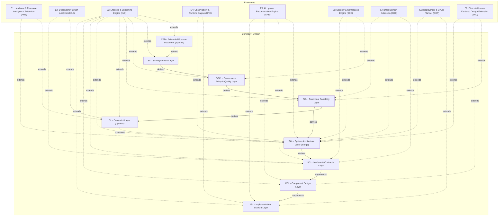

# DDR System Specification v6.2

> **Deterministic Design & Requirements System - Authoritative Reference**

| Property | Value |
| --- | --- |
| Version | 6.2 |
| Status | Finalized |
| Date | 2026-03-27 |
| Scope | Systems-, language-, and domain-agnostic |
| Authority | DDR Architecture Board |
| Lineage | Supersedes DDR v6.1 |
| Mode | full |

Active tiers: XPD, SIL, GPCL, FCL, CL, SAL, ICL, CDL, ISL

> Single source of truth. This document is the exclusive normative specification for the DDR System. All prior versions are superseded. No conversation record, partial specification, or derivative document carries normative weight.

---

## 1. Design Philosophy

This specification is governed by the design principles declared in the source definition.

1. **Minimize Design Complexity** - Every element earns its existence. No tier, edge type, operation, or rule exists without a concrete problem it solves. The system must be adoptable by a solo developer on day one and scale to enterprise without structural changes.
2. **Avoid Premature Optimization** - The Core defines the minimum viable graph. Advanced analytical capabilities, inference engines, and domain-specific intelligence are delivered exclusively via optional Extensions. The Core never anticipates an Extension.
3. **Maximize Structural Integrity** - The DAG is the single source of truth. Every node is traceable, every edge is typed, every mutation is validated. The system is correct by construction.

### 1.1 Changes from v6.1

| Area | Prior | Current | Rationale |
| --- | --- | --- | --- |
| Project-instance root contract | Schema required lifecycle for every DDR file | Lifecycle required only for system-definition files keyed by system_metadata | Restores the documented lean project-instance contract without weakening lifecycle authority for the canonical DDR specification. |
| Lifecycle machine typing | Lifecycle transitions accepted undefined target states and free-form guard references | Lifecycle transitions use typed status endpoints, typed rollback indirection, and a closed guard reference set | Makes the machine-authoritative lifecycle structurally closed and rejects undefined states, placeholders, and phantom guards. |
| Delete semantics | Lifecycle modeled DELETE as transition into DELETED | DELETE is treated as an operation sink rather than a persisted lifecycle state | Aligns lifecycle authority with the six-state runtime model and removes an undefined pseudo-state from transition tables. |
| Core citation boundary | ParentCitation accepted extends edges and derivation_mode on non-derives edges | parent_ids allow only derives\|constrains\|implements, with derivation_mode gated to derives | Enforces CIT-R5 and CIT-R2 structurally instead of leaving them as prose-only constraints. |
| Node integrity constraints | Tier prefix, CL-only fields, SUPERSEDE_PENDING rollback fields, and some parent cardinality rules were documentary only | Node ID prefixes are tier-bound, prior_status is status-gated, constraint_origin is CL-only, and non-root parent cardinality is tightened | Brings several core invariants into the schema so structurally invalid node shapes are rejected earlier. |
| Express mode enforcement | express_mode_group was described as required but not enforced | Express-mode documents require express_mode_group on every node | Keeps UNBUNDLE prerequisites machine-verifiable for express-mode files. |
| Extension annotation safety | Reserved annotation suffixes such as ::content and ::status were textually prohibited but schema-valid | Reserved shadow-key suffixes are structurally rejected | Tightens the Core/Extension boundary and prevents namespaced keys from imitating protected core fields. |

### 1.2 Errata Log

No active errata entries are carried in the authoritative YAML definition.

---

## 2. Foundational Axioms

| ID | Axiom | Statement | Implication |
| --- | --- | --- | --- |
| AX-1 | Traceability | Every non-root node must cite at least one parent via a typed edge. | Complete audit trails from intent to implementation; no orphaned requirements. |
| AX-2 | Abstraction Ordering | Technology and implementation specificity are deferred until logically necessary. | Tiers above CL (XPD, SIL, GPCL, FCL) must contain no technology, hardware, or implementation references. |
| AX-3 | Determinism | Identical inputs produce unambiguous, mechanically verifiable outputs. | Automated validation and compliance checking are possible for all structural rules; semantic rules require explicit human disposition before node activation. |
| AX-4 | Universality | The Core applies to all software systems regardless of domain, scale, or technology. | No domain-specific assumptions in any Core tier. |
| AX-5 | Extensibility | Advanced analytical capabilities are delivered exclusively via optional Extensions. | Core structure remains stable and does not depend on Extension behavior. Extensions may interact with Core via explicitly defined, non-mutating interfaces. |
| AX-6 | Declarative Integrity | The Core is strictly declarative; all inference, optimization, and automated recommendation are Extension-only behaviors. | Core structural invariants cannot be destabilized by analytical logic. |
| AX-7 | DAG Acyclicity | No citation chain may produce a cycle; causality flows in one direction only. | Graph traversal is always terminable. |

---

## 3. DAG Internal Model

### 3.1 Node Schema

| Property | Type | Required | Description |
| --- | --- | --- | --- |
| id | TIER-N.M | Required | Immutable on assignment — no operation may change a node ID. |
| tier | Enum | Required | One of: XPD, SIL, GPCL, FCL, CL, SAL, ICL, CDL, ISL. |
| title | String | Required | Human-readable artifact label. |
| content | Text | Optional | Body constrained by the tier's atomic ruleset. |
| parent_ids | List[ParentCitation] | Optional | ≥1 for all non-root nodes; each entry is a typed Core edge reference: {id, edge_type, derivation_mode?}. Legal edge_type values in parent_ids are derives\|constrains\|implements. For edge_type='derives', derivation_mode MAY be supplied as semantic\|traceability (default: semantic for backward compatibility when omitted). |
| status | Enum | Required | DRAFT \| ACTIVE \| DIRTY \| DEPRECATED \| SUPERSEDED \| SUPERSEDE_PENDING. SUPERSEDE_PENDING is a transient operational state entered exclusively during an in-flight SUPERSEDE operation and is not a stable lifecycle state reachable by any operation other than SUPERSEDE. See lifecycle.status_transitions for the normative transition listing. That block is the machine-parseable authority for all valid status transitions (DDR System Spec §3.8). |
| constraint_origin | Enum | Optional | CL-only field. One of: derived, imposed. Cardinality: conditional |
| prior_status | StatusEnum (restricted to [ACTIVE, DEPRECATED, DIRTY]) | Optional | Semantics: Write-once field set when a node transitions into SUPERSEDE_PENDING, recording the node's status immediately prior to the SUPERSEDE operation. Cleared (set to null or omitted) when the node exits SUPERSEDE_PENDING via either SUPERSEDE_COMPLETE or SUPERSEDE_ROLLBACK. Must not be set on any node that is not in SUPERSEDE_PENDING status. Backward compatibility: Existing nodes without prior_status are fully schema-valid. The field is optional and its absence is semantically equivalent to null. Cardinality: conditional |
| version | SemVer | Required | Content version string. |
| created | ISO 8601 | Required | Creation timestamp. |
| modified | ISO 8601 | Required | Last modification timestamp. |
| express_mode_group | Enum | Optional | Required on every node when project.mode=express; one of G1\|G2\|G3\|G4. Cardinality: conditional |
| extension_annotations | Map | Optional | Read-only Extension metadata; reserved suffixes matching core field names are invalid. |

### 3.2 Edge Types

| Type | Symbol | Semantics |
| --- | --- | --- |
| derives | ──derives──▶ | Supports two semantic modes via optional derivation_mode annotation: semantic = child content is derived from parent requirements; traceability = parent is cited as authoritative lineage linkage. If omitted, derivation_mode defaults to semantic. |
| constrains | ╌╌constrains╌▶ | Parent sets enforceable limits on child's design space. |
| implements | ──implements──▶ | Child provides concrete realization of parent's abstract specification. |
| extends | ···extends···▶ | Extension adds metadata to or reads Core node without modifying it. |

> v3.1.1 defined 6 edge types. 'cites' merged into 'derives' (a citation for traceability IS a derivation relationship). 'reads' and 'annotates' unified into 'extends' (both describe Extension-to-Core interaction with the same structural constraint: no Core mutation). Reduces vocabulary from 6 to 4 without losing expressiveness.

### 3.3 Universal Node Format

```text
[TIER]-[N].[M]: [Title]
  status:        DRAFT | ACTIVE | DIRTY | DEPRECATED | SUPERSEDED | SUPERSEDE_PENDING
  prior_status:  [StatusEnum]  <- present only during in-flight SUPERSEDE
  version:       [SemVer]
  created:       [ISO 8601]
  modified:      [ISO 8601]
  parent_ids:    [{id: [TIER-N.M], edge_type: derives|constrains|implements,
                   derivation_mode?: semantic|traceability}, ...]
                 <- empty only for root nodes

  [Tier-compliant content body]
```

### 3.4 Core DAG Topology

Active tiers: XPD, SIL, GPCL, FCL, CL, SAL, ICL, CDL, ISL

| Representative Node | Tier | Title | Parents |
| --- | --- | --- | --- |
| XPD-0.1 | XPD | Existential Purpose Document | ROOT |
| SIL-1.1 | SIL | Strategic Intent Layer | XPD-0.1 (derives, semantic) |
| GPCL-2.1 | GPCL | Governance, Policy & Quality Layer | SIL-1.1 (derives, traceability) |
| FCL-3.1 | FCL | Functional Capability Layer | GPCL-2.1 (derives, semantic) |
| CL-4.1 | CL | Constraint Layer | FCL-3.1 (derives, semantic) |
| SAL-5.1 | SAL | System Architecture Layer | FCL-3.1 (derives, semantic), CL-4.1 (constrains) |
| ICL-6.1 | ICL | Interface & Contracts Layer | SAL-5.1 (derives, semantic) |
| CDL-7.1 | CDL | Component Design Layer | ICL-6.1 (implements) |
| ISL-8.1 | ISL | Implementation Scaffold Layer | CDL-7.1 (implements) |

### 3.5 DAG Invariants

| Invariant | Statement |
| --- | --- |
| INV-1 | No cycles permitted at any path length. |
| INV-2 | No tier-skipping: citations must reference the immediately preceding active tier(s). SAL is the only permitted merge-node exception (exhaustive). See §3.5 of the Markdown specification for the complete normative definition. |
| INV-3 | XPD and CL are conditionally activatable; the Core is valid and complete without them. |
| INV-4 | When CL is inactive, SAL derives directly from FCL. |
| INV-5 | All non-root nodes must carry at least one parent_id citation. |
| INV-6 | SUPERSEDE of any node across any tier must be atomic; partial application — defined as any state where step (1), (2), or (3) of the SUPERSEDE sequence has been applied without all three completing — constitutes a structural violation detectable by VERIFY. At most one XPD node may carry status ACTIVE at any time. |
| INV-7 | Structural validity may coexist with declared semantic gaps only when those gaps are explicitly recorded in the reconciliation manifest under an allowed semantic_gap_classification type, with human rationale and a required resolution or waiver before CLEAN state. |
| INV-8 | The lifecycle.status_transitions definition must form a complete and closed state machine: every non-terminal status must have at least one valid outbound transition, and no undefined transitions are permitted. |

### 3.6 Node ID Format

```text
General pattern: [TIER]-[SECTION].[ITEM]
XPD pattern:     XPD-0.N  (no sections; section = 0)
Examples:        SIL-1.3 | GPCL-2.1 | CDL-12.5 | XPD-0.1
```

IDs are immutable once assigned. A superseded node retains its original ID with status SUPERSEDED; the replacement receives a new ID. No operation — including relocation — may alter a node's assigned ID.

### 3.7 Citation Rules

| Rule | Statement |
| --- | --- |
| CIT-R1 | Every non-root node must have ≥1 parent_id; only root nodes may carry an empty parent_ids array. |
| CIT-R2 | parent_ids must reference node(s) from the immediately preceding active tier(s) in the DAG topology. For edge_type='derives', derivation_mode may be provided as semantic\|traceability; if omitted, default is semantic. |
| CIT-R3 | CL→SAL constraint edges are recorded in parent_ids with edge type 'constrains'. |
| CIT-R4 | An inline [TIER-N.M] citation in node content must have a matching entry in parent_ids. |
| CIT-R5 | Extension extends edges are stored in extension_annotations only — never in parent_ids. |
| CIT-R6 | Any derives edge used as an authority linkage (traceability citation) MUST set derivation_mode to 'traceability'; non-derives edges must not carry derivation_mode. |
| CIT-R7 | A child node may remain ACTIVE only while each cited parent remains at the version last validated against. Any parent MODIFY or SUPERSEDE that changes cited parent content requires child re-validation; VERIFY must flag the child DIRTY until that re-validation completes. |

### 3.8 Node Status Lifecycle

> Authority note: lifecycle.status_transitions is the machine-readable authority for valid status transitions.

| From | To | Operation | Guards | Notes |
| --- | --- | --- | --- | --- |
| DRAFT | ACTIVE | VALIDATE | gc-001, gc-005 | - |
| ACTIVE | DIRTY | MODIFY\|PROPAGATION | - | Covers direct MODIFY and DIRTY propagation side-effects. |
| ACTIVE | DEPRECATED | MODIFY | gc-002 | - |
| ACTIVE | SUPERSEDE_PENDING | SUPERSEDE | gc-007 | - |
| DIRTY | ACTIVE | VERIFY+VALIDATE | gc-001, gc-005, gc-006 | - |
| DIRTY | DEPRECATED | MODIFY | gc-002 | - |
| DIRTY | SUPERSEDE_PENDING | SUPERSEDE | gc-007 | - |
| DEPRECATED | SUPERSEDE_PENDING | SUPERSEDE | gc-007 | - |
| SUPERSEDE_PENDING | SUPERSEDED | SUPERSEDE_COMPLETE | gc-008 | All three SUPERSEDE steps completed. prior_status cleared. |
| SUPERSEDE_PENDING | - | SUPERSEDE_ROLLBACK | gc-009 | Source node reverts to its recorded prior_status value. prior_status field cleared. No replacement node created. No parent_ids modified. SUPERSEDE_FAILED logged to reconciliation manifest. |
| DEPRECATED | ACTIVE | MODIFY | gc-002, gc-003, gc-004 | - |

**Prohibited transitions**

| From | Prohibited To | Reason |
| --- | --- | --- |
| DRAFT | DRAFT, DIRTY, DEPRECATED, SUPERSEDED | DRAFT may only transition to ACTIVE via VALIDATE. DELETE is an operation sink, not a persisted lifecycle state transition. |
| ACTIVE | DRAFT, ACTIVE | ACTIVE may not regress to DRAFT, self-transition, or be directly deleted without first transitioning through an allowed intermediary lifecycle state. |
| DIRTY | DRAFT, DIRTY | DIRTY may only transition to ACTIVE, DEPRECATED, or SUPERSEDE_PENDING under defined operations. |
| DEPRECATED | DRAFT, DIRTY, DEPRECATED | DEPRECATED may only transition to ACTIVE or SUPERSEDE_PENDING under defined operations. |
| SUPERSEDED | DRAFT, ACTIVE, DIRTY, DEPRECATED, SUPERSEDED, SUPERSEDE_PENDING | SUPERSEDED is a terminal status. No outbound transition is permitted. A new node must be created via INSERT if the superseded content requires revision. |
| SUPERSEDE_PENDING | DRAFT | SUPERSEDE_PENDING may only exit to SUPERSEDED (on success, via SUPERSEDE_COMPLETE) or to the node's recorded prior_status (on failure, via SUPERSEDE_ROLLBACK). All other transitions from SUPERSEDE_PENDING are prohibited. |

| Guard ID | Description | Verification Mode |
| --- | --- | --- |
| gc-001 | All structural rules for the node pass validation. | structural |
| gc-002 | Deprecation rationale is explicitly documented. | manual |
| gc-003 | Any previously set deprecation sunset date is cleared. | manual |
| gc-004 | Status reversal is logged in the reconciliation manifest. | manual |
| gc-005 | All review items are resolved. | structural |
| gc-006 | Per-node validation scope is explicitly confirmed. | structural |
| gc-007 | Before entering SUPERSEDE_PENDING, the node's current status must be recorded in prior_status. The prior_status value must be one of [ACTIVE, DEPRECATED, DIRTY]. Transition is rejected if prior_status cannot be set (e.g., node already in SUPERSEDE_PENDING). | structural |
| gc-008 | Replacement node has been successfully INSERTed and validated. All children's parent_ids have been re-wired to the replacement ID. All children are set DIRTY. prior_status is cleared from the source node. | structural |
| gc-009 | Replacement INSERT failed validation, OR child re-wiring failed after successful INSERT. Source node reverts to its prior_status. If INSERT succeeded before re-wiring failed, the replacement node is removed from the DAG. SUPERSEDE_FAILED is logged with failure_reason. | structural |

---

## 4. Consumption Modes

| Mode | Description | Best Fit |
| --- | --- | --- |
| Express (4 Groups) | Adjacent tiers bundled into groups; expandable via UNBUNDLE. | Small-to-medium projects. |
| Full (9 Tiers) | Every tier independently specified. | Complex, regulated, or enterprise systems. |

Express Mode is not a reduced system — it is Full Mode with grouped presentation. The UNBUNDLE operation expands any group into its constituent tiers without information loss or invention. When unbundling, parent_ids automatically wire to the immediately superior unbundled tier, satisfying CIT-R2 without manual intervention.

### Express Mode Group Map

| Group | Tiers | Label |
| --- | --- | --- |
| G1 | XPD, SIL, GPCL | Purpose, Strategy & Governance |
| G2 | FCL, CL | Capabilities & Constraints |
| G3 | SAL, ICL | Architecture & Contracts |
| G4 | CDL, ISL | Design & Scaffolding |

Unbundle determinism rule: Within Express Mode groups containing conditionally activatable tiers (G1: XPD+SIL+GPCL; G2: FCL+CL), content must be authored with explicit tier annotations (e.g. [FCL] or [CL] inline prefixes) to enable deterministic UNBUNDLE allocation. UNBUNDLE_SCAN is independently invokable as a read-only pre-flight check that classifies each content fragment with confidence 'high', 'ambiguous', or 'none'. UNBUNDLE_EXECUTE is the atomic commit phase and may proceed only when each fragment is either classified as 'high' or explicitly covered by deferred_fragment_handling. The UNBUNDLE operation must reject content that cannot be unambiguously assigned to a constituent tier and is not explicitly deferred. On rejected UNBUNDLE_EXECUTE, the Express Mode group node retains its current status with no structural mutations applied.

Deferred fragment handling: Fragments classified as 'ambiguous' or 'none' may be explicitly marked by the author with a [DEFER] annotation and a recorded human rationale in the reconciliation manifest. Deferred fragments are excluded from the current UNBUNDLE execution and retained in the source Express Mode group node. UNBUNDLE_EXECUTE may proceed only when every fragment is either confidence 'high' or explicitly deferred; any undeferred ambiguous or unannotated fragment forces atomic rejection.

---

## 5. Tier Specifications

### Tier 0 - XPD: Existential Purpose Document (Optional)

| Property | Value |
| --- | --- |
| Layer | OPTIONAL ROOT |
| Core Question | What human or societal need does this system exist to address, and what ethical boundaries govern all downstream decisions? |
| Activation Condition | ethical_impact ≠ none OR societal_scale > personal. Required for AI/ML, healthcare, civic, and public-facing systems. Skippable for internal tooling with no external effect. |
| Root Behavior | Always root when active. No parent. |
| Optional | Yes |
| Merge Node | No |
| Terminal Leaf | No |

**Parent relationships**

| Tier | Edge Type | Condition |
| --- | --- | --- |
| NONE | derives | none_root |

**Child relationships**

| Tier | Edge Type | Condition |
| --- | --- | --- |
| SIL | derives | always |

**Atomic inclusion rules**

| Rule | Verification | Statement | Violation Consequence |
| --- | --- | --- | --- |
| XPD-R1 | structural | Must articulate a fundamental human or societal need being addressed. | Downstream tiers lack ethical grounding. |
| XPD-R2 | structural | Must be immutable across the project lifecycle; changes require a new XPD version. | Scope drift; mission confusion. |
| XPD-R3 | semantic | Must be comprehensible to non-technical stakeholders without a glossary. | Stakeholder misalignment. |
| XPD-R4 | structural | Must establish ethical boundary conditions all subsequent tiers must satisfy. | Unethical design without detection. |
| XPD-R5 | structural | Must define success criteria independent of implementation metrics. | Wrong success measurement. |
| XPD-R6 | structural | Must identify populations who could be harmed and the safeguards required. | Harm by omission. |

**Atomic exclusion rules**

| Rule | Statement |
| --- | --- |
| XPD-E1 | Must not contain solution concepts, technology references, or architectural ideas. |
| XPD-E2 | Must not contain quantitative performance targets (→ GPCL). |
| XPD-E3 | Must not contain regulatory or legal constraints (→ GPCL). |

### Tier 1 - SIL: Strategic Intent Layer

| Property | Value |
| --- | --- |
| Layer | INTENT LAYER |
| Core Question | Why does this system exist, and what business outcomes must it achieve? |
| Activation Condition | - |
| Root Behavior | Root when XPD is inactive. |
| Optional | No |
| Merge Node | No |
| Terminal Leaf | No |

**Parent relationships**

| Tier | Edge Type | Condition |
| --- | --- | --- |
| XPD | derives | if_xpd_active |
| NONE | derives | if_xpd_inactive_then_root |

**Child relationships**

| Tier | Edge Type | Condition |
| --- | --- | --- |
| GPCL | derives | always |

**Atomic inclusion rules**

| Rule | Verification | Statement | Violation Consequence |
| --- | --- | --- | --- |
| SIL-R1 | structural | Must define the core business problem or opportunity being addressed. | GPCL will lack strategic anchor. |
| SIL-R2 | structural | Must specify strategic objectives with measurable outcomes. | Unmeasurable success criteria. |
| SIL-R3 | structural | Must identify all stakeholder categories and their value propositions. | Misaligned delivery priorities. |
| SIL-R4 | structural | Must establish explicit scope boundaries (in-scope and out-of-scope). | Uncontrolled scope creep. |
| SIL-R5 | structural | Must define organizational success metrics. | Inability to declare completion. |
| SIL-R6 | structural | Must be stable under technology changes. | Technology coupling at the intent level. |

**Atomic exclusion rules**

| Rule | Statement |
| --- | --- |
| SIL-E1 | Must not reference hardware, technology stacks, frameworks, or languages. |
| SIL-E2 | Must not contain regulatory mandates or compliance requirements (→ GPCL). |
| SIL-E3 | Must not prescribe architectural patterns or implementation strategies. |
| SIL-E4 | Must not contain quantitative performance metrics (→ GPCL). |

### Tier 2 - GPCL: Governance, Policy & Quality Layer

| Property | Value |
| --- | --- |
| Layer | GOVERNANCE LAYER |
| Core Question | What non-negotiable external mandates, regulatory obligations, policy constraints, and measurable quality thresholds govern this system? |
| Activation Condition | - |
| Root Behavior | - |
| Optional | No |
| Merge Node | No |
| Terminal Leaf | No |

**Parent relationships**

| Tier | Edge Type | Condition |
| --- | --- | --- |
| SIL | derives | always |

**Child relationships**

| Tier | Edge Type | Condition |
| --- | --- | --- |
| FCL | derives | always |

**Atomic inclusion rules**

| Rule | Verification | Statement | Violation Consequence |
| --- | --- | --- | --- |
| GPCL-R1 | structural | Must enumerate all applicable regulatory frameworks with jurisdiction and scope. | Compliance gaps leading to legal exposure. |
| GPCL-R2 | semantic | Must specify enforceable, testable constraints — not aspirational targets. | Non-verifiable compliance claims. |
| GPCL-R3 | structural | Must identify contractual obligations imposed by third-party relationships. | Contract breach by design. |
| GPCL-R4 | structural | Must define data sovereignty and residency requirements. | Data law violations. |
| GPCL-R5 | structural | Must specify audit and record-retention mandates. | Regulatory audit failure. |
| GPCL-R6 | structural | Must specify quantifiable performance targets: latency, throughput, concurrency ceilings. | Architecture unable to satisfy operational demands. |
| GPCL-FCL-BR1 | semantic | For every quantitative performance target specified under GPCL-R6, there must exist a corresponding FCL node whose semantic contribution is the behavioral context of the governed interaction — not a restatement of the numeric threshold. FCL nodes created solely to satisfy the citation chain without contributing independent behavioral context are prohibited. When no user-facing behavioral dimension exists for a GPCL performance target (e.g., infrastructure-level SLAs with no observable user interaction), the author must log a MISSING_MEDIATOR item to the reconciliation manifest. VERIFY must flag any direct GPCL→SAL dependency lacking an FCL mediator for human review. | Unmediated GPCL performance targets create hollow FCL mappings or direct GPCL→SAL dependency. |
| GPCL-R7 | structural | Must specify reliability and availability targets (SLAs, RTO, RPO). | Unacceptable service degradation. |
| GPCL-R8 | structural | Must specify security requirements expressed technology-neutrally. | Stale security specification on technology change. |
| GPCL-R9 | structural | Must specify scalability and accessibility requirements. | Architecture unable to grow; user exclusion. |
| GPCL-R10 | structural | Must cite parent SIL IDs for each constraint. | Orphaned requirements. |

**Atomic exclusion rules**

| Rule | Statement |
| --- | --- |
| GPCL-E1 | Must not specify technology frameworks, library choices, or hardware specifications. |
| GPCL-E2 | Must not describe functional system behaviors (→ FCL). |
| GPCL-E3 | Must not contain business objectives or success metrics (→ SIL). |

### Tier 3 - FCL: Functional Capability Layer

| Property | Value |
| --- | --- |
| Layer | FUNCTIONAL LAYER |
| Core Question | What externally observable behaviors and user-facing capabilities must the system provide? |
| Activation Condition | - |
| Root Behavior | - |
| Optional | No |
| Merge Node | No |
| Terminal Leaf | No |

**Parent relationships**

| Tier | Edge Type | Condition |
| --- | --- | --- |
| GPCL | derives | always |

**Child relationships**

| Tier | Edge Type | Condition |
| --- | --- | --- |
| SAL | derives | always |
| CL | derives | if_cl_active |

**Atomic inclusion rules**

| Rule | Verification | Statement | Violation Consequence |
| --- | --- | --- | --- |
| FCL-R1 | semantic | Must describe capabilities from the perspective of a user or external system. | Internal implementation details contaminate the functional spec. |
| FCL-R2 | semantic | Must specify user workflows end-to-end without naming components, classes, or modules. | Premature structural coupling. |
| FCL-R3 | structural | Must define event-driven behaviors and conditional business logic rules. | Missing behavioral specification. |
| FCL-R4 | structural | Must specify user-observable state transitions and error conditions. | Incomplete behavioral model. |
| FCL-R5 | structural | Must be decomposable into sub-capabilities (parent-child FCL nodes) for complex features. | Monolithic feature specs that resist traceability. |
| FCL-R6 | structural | Must cite parent GPCL IDs for capabilities that satisfy a governance or quality requirement. | Disconnected functional requirements. |
| FCL-R7 | semantic | For any capability that creates, reads, updates, or deletes persistent data, must enumerate all logical data entities involved by name and their CRUD relationship to the capability (for example: "creates Order, reads Customer, updates OrderItem"). Entity names must be technology-neutral logical identifiers. This rule requires entity names and CRUD verbs only and must not include attribute-level typing detail, storage-structure definitions, key declarations, or integrity-rule definitions; those belong in ICL and are prohibited at FCL level by FCL-E2. | FCL completeness for data entities becomes dependent on DDE activation, violating AX-5 and AX-6. Data entity gaps surface reactively at ICL authoring time rather than being caught proactively at FCL authoring time. |

**Atomic exclusion rules**

| Rule | Statement |
| --- | --- |
| FCL-E1 | Must not name specific classes, modules, APIs, or algorithms. |
| FCL-E2 | Must not specify network protocols, serialization formats, or data schemas. |
| FCL-E3 | Must not specify hardware requirements or infrastructure topology. |

### Tier 4 - CL: Constraint Layer (Optional)

| Property | Value |
| --- | --- |
| Layer | CONSTRAINT LAYER |
| Core Question | What are the declared technology selections, hardware envelopes, and infrastructure ceilings that bound the system's implementation? |
| Activation Condition | Specific technology, hardware, or infrastructure constraints are non-negotiable. Optional when full freedom is preserved into the architecture phase. |
| Root Behavior | - |
| Optional | Yes |
| Merge Node | No |
| Terminal Leaf | No |

**Parent relationships**

| Tier | Edge Type | Condition |
| --- | --- | --- |
| FCL | derives | if_cl_active |

**Child relationships**

| Tier | Edge Type | Condition |
| --- | --- | --- |
| SAL | constrains | if_cl_active |

**Atomic inclusion rules**

| Rule | Verification | Statement | Violation Consequence |
| --- | --- | --- | --- |
| CL-R1 | structural | Must declare approved programming languages with version constraints. | Incompatible implementations. |
| CL-R2 | structural | Must declare mandatory frameworks and core libraries with minimum version bounds. | Dependency drift. |
| CL-R3 | structural | Must declare required external service contracts without their internal implementation details. | Integration gaps. |
| CL-R4 | structural | Must declare runtime environment constraints (OS, container runtime, execution environment). | Deployment environment incompatibility. |
| CL-R5 | structural | Must explicitly declare prohibited technologies with rationale. | License compliance violations. |
| CL-R6 | structural | Must declare hardware envelopes when applicable (CPU class, RAM floor, storage, GPU). | Architecture that exceeds target hardware. |
| CL-R7 | structural | Must declare infrastructure ceilings when applicable (compute budget, storage cap, bandwidth cap). | Cost overruns from unconstrained architecture. |
| CL-R8 | structural | Must specify deployment topology declarations (on-premise, cloud-agnostic, hybrid, edge). | Architecture incompatible with deployment target. |
| CL-R9 | structural | Must cite FCL IDs for each constraint. | Constraints untraceable to a business need. |
| CL-R9-imposed | structural | Must cite the external authority source (regulatory framework, contract reference, procurement policy, or organizational mandate) that imposes the constraint. FCL citation is not required; an optional FCL cross-reference may be provided for contextual traceability. | Imposed constraint is untraceable to its originating authority, violating AX-1 audit integrity requirements. |
| CL-R10 | structural | Must explicitly document internal reconciliations of conflicting hardware and technology constraints. | Loss of deterministic traceability for constraint conflicts. |

**Atomic exclusion rules**

| Rule | Statement |
| --- | --- |
| CL-E1 | Must not auto-derive, infer, or recommend configurations (→ Extensions). |
| CL-E2 | Must not contain functional system behaviors (→ FCL). |
| CL-E3 | Must not contain cost models or TCO calculations (→ Extensions). |

### Tier 5 - SAL: System Architecture Layer (Merge Node)

| Property | Value |
| --- | --- |
| Layer | ARCHITECTURE LAYER |
| Core Question | How is the system structurally decomposed, and what patterns govern component interaction? |
| Activation Condition | - |
| Root Behavior | - |
| Optional | No |
| Merge Node | Yes |
| Terminal Leaf | No |

**Parent relationships**

| Tier | Edge Type | Condition |
| --- | --- | --- |
| FCL | derives | always |
| CL | constrains | if_cl_active |

**Child relationships**

| Tier | Edge Type | Condition |
| --- | --- | --- |
| ICL | derives | always |

**Atomic inclusion rules**

| Rule | Verification | Statement | Violation Consequence |
| --- | --- | --- | --- |
| SAL-R1 | semantic | Must define the overarching architectural pattern(s) with rationale. | No structural framework for downstream design. |
| SAL-R2 | structural | Must specify system decomposition into major subsystems with ownership boundaries. | Ambiguous component responsibilities. |
| SAL-R3 | structural | Must specify inter-subsystem communication patterns. | Integration design without architectural mandate. |
| SAL-R4 | structural | Must specify concurrency model and data ownership rules. | Race conditions and data integrity violations by design. |
| SAL-R5 | structural | Must specify failure isolation and resilience boundaries. | Cascading failure scenarios in the architecture. |
| SAL-R6 | structural | Must cite all active parent IDs (FCL + CL if active) for each major architectural decision. | Architectural decisions without traceable justification. |

**Atomic exclusion rules**

| Rule | Statement |
| --- | --- |
| SAL-E1 | Must not contain exact data schemas or payload definitions (→ ICL). |
| SAL-E2 | Must not contain class-level component blueprints (→ CDL). |
| SAL-E3 | Must not contain executable code, algorithm implementations, or procedural logic (→ CDL/ISL). |

### Tier 6 - ICL: Interface & Contracts Layer

| Property | Value |
| --- | --- |
| Layer | CONTRACT LAYER |
| Core Question | What are the formal, machine-verifiable contracts governing data exchange between system boundaries? |
| Activation Condition | - |
| Root Behavior | - |
| Optional | No |
| Merge Node | No |
| Terminal Leaf | No |

**Parent relationships**

| Tier | Edge Type | Condition |
| --- | --- | --- |
| SAL | derives | always |

**Child relationships**

| Tier | Edge Type | Condition |
| --- | --- | --- |
| CDL | implements | always |

**Atomic inclusion rules**

| Rule | Verification | Statement | Violation Consequence |
| --- | --- | --- | --- |
| ICL-R1 | structural | Must define all inter-component and external API contracts with complete input/output schemas. | Implementations that diverge at integration points. |
| ICL-R2 | structural | All schemas must be machine-parseable (JSON Schema, Protobuf, OpenAPI, or equivalent). | Contracts that cannot be mechanically validated. |
| ICL-R3 | structural | Must specify serialization formats, encoding standards, and wire protocols per contract. | Interoperability failures from encoding mismatches. |
| ICL-R4 | structural | Must specify mandatory fields, optional fields, type constraints, and validation rules. | Runtime failures from malformed payloads. |
| ICL-R5 | structural | Must specify error response contracts (error codes, payload structure, retry behavior). | Undefined failure behavior at system boundaries. |
| ICL-R6 | structural | Must specify versioning strategy per contract. | Breaking changes without migration path. |
| ICL-R7 | structural | Must cite SAL IDs for each contract. | Contracts without architectural justification. |

**Atomic exclusion rules**

| Rule | Statement |
| --- | --- |
| ICL-E1 | Must not contain internal component state management or business logic. |
| ICL-E2 | Must not specify architectural routing patterns (→ SAL). |
| ICL-E3 | Must not contain class or module blueprints (→ CDL). |

### Tier 7 - CDL: Component Design Layer

| Property | Value |
| --- | --- |
| Layer | DESIGN LAYER |
| Core Question | What are the structural blueprints of individual components — their public interfaces, internal state, and responsibilities? |
| Activation Condition | - |
| Root Behavior | - |
| Optional | No |
| Merge Node | No |
| Terminal Leaf | No |

**Parent relationships**

| Tier | Edge Type | Condition |
| --- | --- | --- |
| ICL | implements | always |

**Child relationships**

| Tier | Edge Type | Condition |
| --- | --- | --- |
| ISL | implements | always |

**Atomic inclusion rules**

| Rule | Verification | Statement | Violation Consequence |
| --- | --- | --- | --- |
| CDL-R1 | structural | Must define component names, logical responsibilities, and ownership boundaries. | Ambiguous implementation targets. |
| CDL-R2 | structural | Must specify all public method/function signatures (name, parameter types, return type, exceptions). | Implementations that violate the declared interface. |
| CDL-R3 | structural | Must specify internal state structures as a logical model — not implementation. | Hidden state dependencies between components. |
| CDL-R4 | structural | Must specify component dependencies (consumed components and ICL contracts). | Circular dependencies introduced at implementation. |
| CDL-R5 | structural | Must map each component to the ICL contracts it implements. | Components without contractual grounding. |
| CDL-R6 | structural | Must specify initialization, lifecycle, and teardown contracts for stateful components. | Resource leaks and initialization-order bugs. |
| CDL-R7 | structural | When CL declares multiple target languages, must produce language-specific blueprints for each target. | Language constraint not propagated; ISL-R5 compliance gap. |

**Atomic exclusion rules**

| Rule | Statement |
| --- | --- |
| CDL-E1 | Must not contain executable code bodies or algorithm implementations. |
| CDL-E2 | Must not contain system-wide architectural patterns (→ SAL). |
| CDL-E3 | Must not contain data serialization schemas (→ ICL). |

### Tier 8 - ISL: Implementation Scaffold Layer (Terminal Leaf)

| Property | Value |
| --- | --- |
| Layer | SCAFFOLD LAYER |
| Core Question | What is the minimal, structurally valid, traceable scaffolding required to initiate implementation? |
| Activation Condition | - |
| Root Behavior | - |
| Optional | No |
| Merge Node | No |
| Terminal Leaf | Yes |

**Parent relationships**

| Tier | Edge Type | Condition |
| --- | --- | --- |
| CDL | implements | always |

**Atomic inclusion rules**

| Rule | Verification | Statement | Violation Consequence |
| --- | --- | --- | --- |
| ISL-R1 | structural | Must produce syntactically valid structural scaffolding in the target language. | Scaffolding that fails to compile or parse. |
| ISL-R2 | structural | Must embed docstrings or code comments with explicit parent DDR node IDs. | Implementations without traceability. |
| ISL-R3 | structural | Must include implementation hints as structured comments. | Implementers who lose architectural context. |
| ISL-R4 | structural | Must define all function/method bodies exclusively as stubs. | Pre-implementation contamination. |
| ISL-R5 | structural | Must be language-specific — one ISL node per target language/runtime when multiple are declared in CL. | Language-ambiguous stubs. |
| ISL-R6 | structural | Must cite CDL parent IDs for every stub. | Orphaned scaffolding. |

**Atomic exclusion rules**

| Rule | Statement |
| --- | --- |
| ISL-E1 | Must not contain business logic or complete algorithmic logic. |
| ISL-E2 | Must not contain infrastructure configuration (→ Extensions). |

---

## 6. Constraint Precedence

| Priority | Tier | Rationale |
| --- | --- | --- |
| 1 | XPD | Ethical boundary conditions are inviolable. |
| 2 | SIL | Strategic intent defines the purpose of all design decisions. |
| 3 | GPCL | External regulatory mandates and quality thresholds are non-negotiable. |
| 4 | FCL | Functional requirements operate within the constraint envelope. |
| 5 | CL | Technology, hardware, and infrastructure constraints are externally imposed. |
| 6 | SAL | Architecture is bounded by all above. |
| 7 | ICL | Contracts derive from architecture. |
| 8 | CDL | Design derives from contracts. |
| 9 | ISL | Scaffolding derives from design. |

Higher-priority tiers override lower-priority tiers. An XPD ethical boundary functions as an absolute veto right over any downstream decision.

| Class | Description |
| --- | --- |
| logical | Governed by the formal tier precedence hierarchy. |
| physical | Represents non-negotiable physical realities or externally imposed constraints. These constraints cannot be silently overridden by logical precedence alone. |

**Intra tier conflict rule**

When two or more nodes within the same tier produce conflicting constraints, the conflict must be explicitly documented and resolved before any conflicting node may transition to status ACTIVE. The VERIFY operation must detect and report intra-tier conflicts as structural violations.

**Physical constraint rule**

Any CL node declared with constraint_origin='imposed' is treated as a non-overridable physical-or-external constraint for precedence evaluation. Conflicts between higher-priority logical requirements and such imposed constraints must trigger escalation and explicit human resolution; they cannot be silently overridden.

**Physical constraint escalation**

Constraint precedence governs design decisions, not physical impossibilities. When a higher-priority tier produces a requirement that is physically incompatible with a lower-priority tier's declared constraint (e.g. a functional requirement that exceeds declared hardware capacity), the conflict must be escalated to the authoring authority for resolution. The precedence hierarchy does not authorize silently overriding physical or externally imposed constraints.

---

## 7. Atomic Operations Protocol

### 7.1 Core Operations

| Operation | Description | Validation Trigger |
| --- | --- | --- |
| INSERT | Create node with auto-assigned ID, parent_ids, and tier-compliant content. Supports both forward (parent→child) and reverse (child→inferred parent) direction. | Full atomic ruleset; parent existence; DAG cycle detection. |
| DELETE | Remove node; cascade orphan detection to children. | Children → DIRTY; orphaned children (zero valid parent_ids) must resolve via MODIFY (re-attach), DELETE (cascade), or SUPERSEDE (replace deleted parent); manifest updated. |
| MODIFY | Update content; version incremented. | Re-validate ruleset; re-check citations; DIRTY propagation to all descendants. |
| SUPERSEDE | Mark node SUPERSEDED; create replacement with new ID. | (1) Transition source node to SUPERSEDE_PENDING, recording prior_status. (2) Attempt INSERT of replacement node with full atomic ruleset validation, parent existence check, and DAG cycle detection. (3a) On INSERT success: transition source SUPERSEDE_PENDING → SUPERSEDED, re-wire children's parent_ids to replacement ID, set children DIRTY, clear prior_status. Old node retains ID; new node validated; children's parent_ids auto-updated to replacement ID then set DIRTY for content re-validation; this auto-update does not cascade DIRTY to grandchildren. (3b) On INSERT failure: transition source SUPERSEDE_PENDING → prior_status, discard failed replacement, leave children unmodified, log SUPERSEDE_FAILED to reconciliation manifest. (4) If step 3a child re-wiring partially fails: remove replacement node, revert source to prior_status, log SUPERSEDE_FAILED. No partial re-wiring is permitted. VERIFY treats any node found in SUPERSEDE_PENDING as a SUPERSEDE_PENDING_DETECTED manifest item with severity BLOCKING. |
| VERIFY | Traverse DAG downward; validate citation chains, edge types, ID references, orphans, contamination, and any declared cross-node semantic consistency rules. | Returns CLEAN or DIRTY with itemized structural violations. When semantic_consistency_rules are defined, VERIFY may also emit REVIEW_REQUIRED items for non-blocking cross-node semantic conflicts. These findings do not convert a structurally valid graph into a structural violation, but they must receive a recorded human disposition before affected content may be declared CLEAN. |
| VALIDATE | Check single node against its tier's full atomic ruleset. Evaluates all structural rules mechanically and returns pass/fail. For each semantic rule, emits REVIEW_REQUIRED status in the reconciliation manifest's pending_items. A node may not transition from DRAFT to ACTIVE while any REVIEW_REQUIRED item remains unresolved without a recorded human disposition. | Returns pass/fail with specific violated rule IDs for structural rules. Returns REVIEW_REQUIRED with the rule_id for each semantic rule. Output includes a validation_scope declaration specifying which rule classifications were evaluated. REVIEW_REQUIRED items must carry a human disposition (APPROVED or REJECTED with rationale) before the target node may transition DRAFT → ACTIVE. |
| UNBUNDLE_SCAN | Read-only pre-flight scan of an Express Mode group. Traverses all content fragments and emits a per-fragment diagnostic object containing: fragment_id, content_preview, detected_annotation, confidence (high \| ambiguous \| none), and ambiguity_reason when confidence is not high. Independently invokable without committing structural mutations. Enables iterative diagnose-annotate-retry workflows before UNBUNDLE_EXECUTE is invoked. | Returns a structured scan result for every content fragment in the target Express Mode group. No DAG state changes are applied. A fragment reaches confidence 'high' when its [TIER] annotation unambiguously maps it to exactly one constituent tier of the group. Confidence is 'ambiguous' when annotation is present but maps to multiple tiers or conflicts with tier rules. Confidence is 'none' when no annotation is detected. |
| UNBUNDLE | Expand Express Mode group into constituent Full Mode tiers. | Content allocated to correct tiers; parent_ids auto-wired. If UNBUNDLE_SCAN detects any fragment with confidence 'ambiguous' or 'none', UNBUNDLE_EXECUTE rejects atomically unless the fragment is explicitly deferred per deferred_fragment_handling. No structural mutations are applied to rejected or deferred fragments. The Express Mode group node retains its pre-attempt status for those deferred fragments. The rejection payload is the complete UNBUNDLE_SCAN result: a list of per-fragment diagnostic objects, each containing fragment_id, content_preview, detected_annotation, confidence (high \| ambiguous \| none), and ambiguity_reason (when confidence is not 'high'). |

> v3.1.1 defined 11 operations. RELOCATE is removed (contradicted ID immutability). ABSTRACT and CONCRETIZE are merged into INSERT with a direction parameter. DETECT_ORPHAN and DETECT_CONTAMINATION are subsumed by VERIFY.

### 7.2 Dirty State and Propagation

| Trigger | Nodes Affected |
| --- | --- |
| Node modified | Modified node + all descendants. |
| Node deleted | All former children of the deleted node. |
| Parent → SUPERSEDED (auto-update of child parent_ids) | Immediate children only; grandchildren not cascaded (structural re-wiring, not semantic content change). |
| CL constraint added or modified | SAL + all SAL descendants. |
| XPD ethical boundary modified | All tiers (full re-validation required). |

- Node Insertion: INSERT may produce nodes in one of two modes: (a) validated insertion produces an ACTIVE node synchronously or fails atomically; (b) draft insertion (via validate=false override) produces a DRAFT node. DRAFT nodes must undergo a successful VALIDATE operation to transition to ACTIVE. DRAFT nodes are structurally present in the DAG but excluded from CLEAN compliance checks.
- Supersede Auto-Update: The SUPERSEDE auto-update of child parent_ids is a structural re-wiring operation. The grandchild's inherited content remains valid pending the child's own re-validation. This scoped propagation is an explicit exception to the general MODIFY cascade rule.
- SUPERSEDE_PENDING Handling: A node in SUPERSEDE_PENDING status is treated by VERIFY as a structural advisory of type SUPERSEDE_PENDING_DETECTED with severity BLOCKING. No DIRTY propagation occurs while a node is in SUPERSEDE_PENDING status — propagation is deferred until the operation either commits or rolls back. On commit (SUPERSEDE_PENDING → SUPERSEDED): standard SUPERSEDE DIRTY propagation applies — immediate children are set DIRTY; grandchildren are not cascaded. On rollback (SUPERSEDE_PENDING → prior_status): no propagation occurs; the DAG is restored to its pre-SUPERSEDE state with no DIRTY side-effects.
- Supersede-to-MODIFY Interaction: If a DIRTY child's re-validation results in a content MODIFY, standard MODIFY cascade rules apply — all descendants of the modified child are set DIRTY. This interaction is not an exception to the SUPERSEDE scoped propagation rule; it is a consequence of the child's own MODIFY, which triggers the general cascade independently.
- Deprecation Lifecycle: A node is set to DEPRECATED via MODIFY when it is scheduled for removal or replacement. DEPRECATED nodes remain structurally valid and are included in VERIFY traversals. DEPRECATED is not a terminal state — a DEPRECATED node may subsequently be SUPERSEDED (creating a replacement) or removed via DELETE. DEPRECATED means "scheduled for replacement, no replacement yet exists"; SUPERSEDED means "replacement exists and children have been re-wired."

| Classification | Description |
| --- | --- |
| structural | Indicates a structural change (for example parent_id rewiring) that does not by itself establish semantic invalidation of downstream content. |
| semantic | Indicates probable semantic invalidation requiring downstream review or content amendment before CLEAN can be re-established. |

Child nodes affected by parent_id rewiring enter DIRTY with classification 'structural'. Structural DIRTY does not automatically propagate to descendants. If subsequent VALIDATE or MODIFY activity reveals content drift, the affected node's DIRTY condition is reclassified as 'semantic', and standard downstream propagation rules then apply.

### 7.3 Resolution Workflow

DETECT CHANGE → SET DIRTY → SCAN DOWNSTREAM → GENERATE PENDING ITEMS (node ID + violated rule ID + suggested operation) → EXECUTE OPERATION → VERIFY → SET CLEAN | REPEAT

**Conflict resolution protocol**

1. Identify conflicting nodes and violated rules.
2. Classify conflict type as logical, physical, or semantic.
3. Escalate to the designated authoring authority.
4. Record the resolution decision and rationale.
5. Apply MODIFY, SUPERSEDE, or DELETE as required.

All conflict resolutions must be recorded in the reconciliation manifest with before/after state references and disposition authority.

**Semantic consistency rules**

Optional rule set enabling detection of semantic conflicts across nodes within the same tier or across adjacent tiers.

Enforcement: Non-blocking structural finding; VERIFY emits REVIEW_REQUIRED items in the reconciliation manifest for human disposition.

### 7.4 Reconciliation Manifest Schema

**Tracked items**

- Total node count by tier
- ACTIVE / DIRTY / DRAFT / DEPRECATED counts
- Pending items list
- Last full validation timestamp
- Active Extensions and annotation counts

| Item Type | Severity | Description | Fields |
| --- | --- | --- | --- |
| MISSING_MEDIATOR | - | Logged when a GPCL performance target (GPCL-R6) has no corresponding FCL capability node providing independent behavioral context. Flags the direct GPCL→SAL dependency for human review per GPCL-FCL-BR1. | gpcl_node_id, message, rationale |
| SUPERSEDE_FAILED | - | Logged when a SUPERSEDE operation fails at step 2 (replacement INSERT validation failure) or step 3 (child re-wiring failure). Records the source node ID, the attempted replacement content (or a stable hash thereof), the failure reason (validation error code or system failure indicator), and a timestamp. Enables VERIFY and reconciliation workflows to diagnose and retry failed SUPERSEDE operations without manual DAG inspection. | source_node_id, attempted_replacement_content_hash, failure_reason, timestamp |
| SUPERSEDE_PENDING_DETECTED | BLOCKING | Logged by VERIFY when it encounters any node in SUPERSEDE_PENDING status during a DAG traversal. Indicates an in-flight SUPERSEDE operation that has not yet committed or rolled back. Severity is BLOCKING — the DAG cannot be declared CLEAN while any node carries SUPERSEDE_PENDING status. Resolution requires either completing the SUPERSEDE (retry the replacement INSERT) or reverting the source node to its prior_status via SUPERSEDE_ROLLBACK. | node_id, prior_status, detected_at |

**Semantic gap classification**

Defines explicitly permitted structural-semantic gaps that do not violate DAG invariants when declared transparently and carried with human accountability.

Allowed types: MISSING_MEDIATOR

- Must be explicitly logged in the reconciliation manifest.
- Must carry human rationale.
- Must be resolved or explicitly waived before system-wide CLEAN state.

---

## 8. Extension System

### 8.1 Architecture

Extensions are orthogonal read-only overlays attaching to the Core DAG via extends edges. They interact with Core nodes without modifying Core semantics.

**Extensions may:**

- Read Core node content.
- Annotate Core nodes with namespaced metadata (stored in extension_annotations only).
- Generate derived external artifacts (reports, IaC, recommendations).
- Add advisories to the reconciliation manifest's extension_advisories section.

**Extensions may not:**

- Modify any Core node's content, parent_ids, tier, or status.
- Redefine Core tier semantics or atomic rules.
- Introduce structural cycles.
- Set Core nodes to DIRTY (advisories only; no state mutation).

### 8.2 Extension Candidate Pool

The AI Upward Reconstruction Extension (ARE) requires special handling because it infers new nodes. To preserve AX-6, ARE-inferred nodes are placed in an Extension Candidate Pool — a staging area outside the Core DAG.

- Candidate status value: CANDIDATE (not a Core status value)
- Visible when the ARE extension is in `active` or `paused` state. Not visible in `disabled` state.
- Core impact: No effect on Core DIRTY/CLEAN status.
- Must be promoted into the Core DAG via INSERT (triggering full validation) to become Core nodes. A candidate whose ARE::confidence_score falls below the declared scoring_profile's minimum_surfacing_threshold is ineligible for promotion via INSERT unless it carries override_flag: true accompanied by a non-empty human_rationale field recorded in the reconciliation manifest's pending_items. VERIFY enforces this gate structurally.

| State | Inference | Pool Visible | Pool Preserved (Restart) | Promotion Allowed | Discard Allowed |
| --- | --- | --- | --- | --- | --- |
| active | running | Yes | Optional | Yes | Yes |
| paused | halted | Yes | Yes | Yes | Yes |
| disabled | halted | No | No | No | No |

| From | To | Permitted | Effect / Rationale |
| --- | --- | --- | --- |
| active | paused | Yes | Inference halts. Candidate Pool is atomically persisted to checkpoint path. Existing candidates are retained and remain browsable. INSERT promotion and manual discards remain available. |
| paused | active | Yes | Inference resumes. Existing Pool, confidence scores, and annotations are retained without modification. Checkpoint policy becomes optional. |
| paused | disabled | Yes | Checkpoint file is deleted. Pool is discarded. Outcome is identical to active → disabled in final state. |
| active | disabled | Yes | Pool is discarded. Existing behavior preserved and unchanged. |
| disabled | active | Yes | ARE starts fresh with an empty Candidate Pool. Existing behavior preserved and unchanged. |
| disabled | paused | No | No Candidate Pool exists in `disabled` state. This transition is semantically undefined and is explicitly forbidden. |

Checkpoint path: `Canonical path for the ARE Pool checkpoint: `.agent/state/are_candidate_pool.checkpoint.yaml`. This file is written atomically on `active → paused` and re-written after each mutating Pool action while ARE is in `paused` state. It is deleted atomically on any transition to `disabled`. It is not written while ARE is in `active` state under normal operation.`

Automatically discarded on any transition to `disabled`, whether from `active` or `paused`. The checkpoint file at `.agent/state/are_candidate_pool.checkpoint.yaml` is deleted atomically alongside Pool discard. No discard occurs on `active → paused` or `paused → active` transitions.

### 8.3 Extension Integration Rules

| Rule | Statement |
| --- | --- |
| EXT-R1 | Must declare contract version compatible with DDR-Core-6.x. |
| EXT-R2 | Must declare which Core tiers it reads and which it annotates. |
| EXT-R3 | Annotations must be namespaced by Extension ID (e.g. 'HRE::min_hardware_profile'). |
| EXT-R4 | Extensions update the reconciliation manifest; annotation counts tracked. |
| EXT-R5 | Disabling an Extension leaves Core CLEAN/DIRTY status unchanged. |
| EXT-R6 | Extension-internal derived artifact graphs must maintain their own acyclicity. |
| EXT-R7 | Extension advisories do not mutate Core node status. |

> 'All Core tiers' is not a valid contract declaration. Extensions must enumerate tiers by name to preserve auditability under EXT-R2.

---

## 9. Extension Catalog

### E1 - Hardware & Resource Intelligence Extension (HRE)

**Contract:** HRE-1.0 / DDR-Core-6.x | **Reads:** CL, SAL, CDL, ISL | **Annotates:** CL, SAL

| Rule | Statement |
| --- | --- |
| HRE-R1 | Bottom-up inference produces minimum hardware profiles as CL-compatible declarations. |
| HRE-R2 | Cloud recommendations include ≥2 provider-agnostic instance class options. |
| HRE-R3 | Top-down enforcement validates SAL patterns do not exceed CL ceilings. |
| HRE-R4 | All recommendations are advisory; they do not override CL without explicit MODIFY. |

### E2 - Dependency Graph Analyzer (DGA)

**Contract:** DGA-1.0 / DDR-Core-6.x | **Reads:** CL, ICL, CDL, ISL | **Annotates:** CL, ICL

| Rule | Statement |
| --- | --- |
| DGA-R1 | Produces a complete directed dependency graph for all CL-declared libraries. |
| DGA-R2 | Detects version conflicts with resolution suggestions. |
| DGA-R3 | Transitive dependency reports flag all copyleft licenses that could impose constraints. |

### E3 - Lifecycle & Versioning Engine (LVE)

**Contract:** LVE-1.0 / DDR-Core-6.x | **Reads:** XPD, SIL, GPCL, FCL, CL, SAL, ICL, CDL, ISL | **Annotates:** XPD, SIL, GPCL, FCL, CL, SAL, ICL, CDL, ISL

| Rule | Statement |
| --- | --- |
| LVE-R1 | Every node modification produces a version history entry with timestamp, author, and rationale. |
| LVE-R2 | Technical debt items classified by tier origin and estimated remediation effort. |
| LVE-R3 | Deprecation requires a sunset date and migration path before node → DEPRECATED. |
| LVE-R4 | Version control integration maps DDR node IDs to VCS commit hashes. |

### E4 - Observability & Runtime Engine (ORE)

**Contract:** ORE-1.0 / DDR-Core-6.x | **Reads:** GPCL, SAL, ICL, CDL, ISL | **Annotates:** ISL, SAL

| Rule | Statement |
| --- | --- |
| ORE-R1 | Telemetry stubs derived from GPCL latency and throughput targets. |
| ORE-R2 | Alert rules expressed in vendor-agnostic format. |
| ORE-R3 | Every SAL component must have ≥1 telemetry point for operational readiness. |
| ORE-R4 | Incident-to-design traceability maps runtime anomalies to ISL, CDL, and SAL nodes. |

### E5 - AI Upward Reconstruction Engine (ARE)

**Contract:** ARE-1.0 / DDR-Core-6.x | **Reads:** ISL, CDL, ICL, SAL | **Annotates:** SAL, ICL, CDL, ISL | **Scoring Profile:** `standard_v1`

> ARE annotation is restricted to tiers at or below SAL (SAL, ICL, CDL, ISL). ARE must not annotate XPD, SIL, GPCL, or FCL nodes — these tiers are above the architecture layer and must not receive AI-inferred annotations. Inferred insights pertaining to intent, governance, ethical, or functional dimensions are surfaced as Candidate Pool nodes only, subject to human promotion via INSERT.

| Rule | Statement |
| --- | --- |
| ARE-R1 | All inferred nodes placed in the Extension Candidate Pool (§8.2); automatic promotion prohibited. |
| ARE-R2 | Each candidate carries ARE::confidence_score (0.0–1.0) computed according to the scoring_profile declared in the ARE Extension contract. The declared profile must be a standard profile (standard_v1 or conservative_v1) or a custom profile with all required_fields declared per are_scoring_profiles.custom.required_fields. Score computation must be reproducible: identical source evidence inputs must produce identical scores under the same profile (AX-3). |
| ARE-R3 | Promotion into Core DAG requires INSERT with full atomic ruleset validation. |
| ARE-R4 | ARE must never autonomously create XPD or GPCL nodes — ethical and regulatory content requires human authorship. |
| ARE-R5 | Every ARE deployment must declare a scoring_profile in its Extension contract. The scoring_profile value must reference a profile defined in are_scoring_profiles. Omission of scoring_profile defaults to standard_v1. Custom profiles must declare all fields enumerated in are_scoring_profiles.custom.required_fields or the Extension contract fails EXT-R1 validation. |
| ARE-R6 | The ARE Extension MUST implement a tri-state activation lifecycle: `active` (inference running), `paused` (inference halted, Pool retained), and `disabled` (inference halted, Pool discarded). The transition `disabled → paused` is forbidden. All other transitions are permitted per the state semantics defined in extension_system.candidate_pool.activation_states. Pausing ARE MUST NOT alter any Core node status, annotation, or DIRTY/CLEAN propagation. EXT-R5 applies to all ARE state transitions without exception. |
| ARE-R7 | On every `active → paused` transition, the ARE Extension MUST atomically persist the complete Candidate Pool — including all candidate node content, ARE::confidence_score annotations, review_status fields, and practitioner notes — to `.agent/state/are_candidate_pool.checkpoint.yaml`. This file MUST be re-persisted after each mutating Pool action (promotion via INSERT, manual discard) while ARE remains in `paused` state. On process restart with ARE state recorded as `paused`, the checkpoint MUST be automatically loaded and state MUST be restored to `paused` without requiring practitioner intervention. The checkpoint file MUST be deleted on any transition to `disabled`. |

#### ARE Scoring Profiles

Scoring profiles govern ARE confidence scoring and promotion gates.

**`standard_v1`**

| Input Signal | Weight Category | Description |
| --- | --- | --- |
| direct_source_node_count | high | Counts the number of directly cited source nodes supporting the candidate inference. |
| cross_tier_convergence | high | Measures whether evidence converges across multiple adjacent DDR tiers for the same inferred claim. |
| icl_contract_corroboration | medium | Checks whether ICL contract definitions corroborate the inferred candidate semantics. |
| sal_pattern_alignment | medium | Evaluates alignment between the inferred candidate and declared SAL architectural patterns. |
| tier_diversity_index | low | Assesses how many distinct eligible source tiers contribute evidence to the inference. |

| Band | Score Range | Promotion Guidance |
| --- | --- | --- |
| speculative | 0.0 - 0.4 | Treat as weak evidence and require substantial human scrutiny before considering promotion. |
| probable | 0.4 - 0.7 | Treat as moderate evidence and permit promotion consideration when human review confirms traceability. |
| high_confidence | 0.7 - 1.0 | Treat as strong evidence and prioritize for review and potential promotion via INSERT. |

Minimum surfacing threshold: **0.35**.

A candidate below minimum_surfacing_threshold may enter the review queue only if it carries override_flag: true with a non-empty human_rationale field.

**`conservative_v1`**

Intended for regulated or high-assurance environments where stricter confidence gating is required before human review and promotion actions.

| Input Signal | Weight Category | Description |
| --- | --- | --- |
| direct_source_node_count | high | Counts the number of directly cited source nodes supporting the candidate inference. |
| cross_tier_convergence | high | Measures whether evidence converges across multiple adjacent DDR tiers for the same inferred claim. |
| icl_contract_corroboration | medium | Checks whether ICL contract definitions corroborate the inferred candidate semantics. |
| sal_pattern_alignment | medium | Evaluates alignment between the inferred candidate and declared SAL architectural patterns. |
| tier_diversity_index | low | Assesses how many distinct eligible source tiers contribute evidence to the inference. |

| Band | Score Range | Promotion Guidance |
| --- | --- | --- |
| speculative | 0.0 - 0.4 | Do not promote under normal conditions and require explicit documented justification for any exception path. |
| probable | 0.4 - 0.7 | Permit review only with heightened scrutiny and complete evidence traceability prior to INSERT consideration. |
| high_confidence | 0.7 - 1.0 | Treat as the preferred band for promotion decisions after formal reviewer confirmation. |

Minimum surfacing threshold: **0.55**.

A candidate below minimum_surfacing_threshold may enter the review queue only if it carries override_flag: true with a non-empty human_rationale field.

**Custom profiles**

Required fields: `profile_id`, `input_signals`, `input_signals.signal_id`, `input_signals.description`, `input_signals.weight_category`, `score_bands`, `score_bands.band_id`, `score_bands.range`, `score_bands.label`, `score_bands.promotion_guidance`, `minimum_surfacing_threshold`, `override_policy`

Custom profiles that omit any required_fields entry fail extension contract validation under EXT-R1.

### E6 - Security & Compliance Engine (SCE)

**Contract:** SCE-1.0 / DDR-Core-6.x | **Reads:** GPCL, CL, SAL, ICL | **Annotates:** GPCL, SAL, ICL

| Rule | Statement |
| --- | --- |
| SCE-R1 | Threat models expressed in STRIDE format or equivalent structured notation. |
| SCE-R2 | Trust boundary violations in SAL flagged as high-priority advisories. |
| SCE-R3 | Every ICL contract must have an explicit RBAC access control policy. |
| SCE-R4 | PII data flows enumerated in ICL and traceable to GPCL data-residency constraints. |
| SCE-R5 | Compliance evidence records are immutable once generated. |

### E7 - Data Domain Extension (DDE)

**Contract:** DDE-1.0 / DDR-Core-6.x | **Reads:** FCL, GPCL, SAL, ICL, CDL | **Annotates:** ICL, SAL, FCL

> DDE annotates FCL to flag functional capabilities that imply data domain schemas not yet formally specified in ICL. This is a forward-reference advisory, not inference about intent.

| Rule | Statement |
| --- | --- |
| DDE-R1 | Canonical ER model expressed in formal notation (ERD, DBML, or equivalent). |
| DDE-R2 | Every ICL payload schema validated against the canonical ER model. |
| DDE-R3 | Schema consistency violations flagged as blocking advisories. |
| DDE-R4 | Data lifecycle policies specify retention periods traceable to GPCL regulatory requirements. |
| DDE-R5 | When annotating FCL nodes, DDE must perform confirmation validation only: verify that each data entity enumerated under FCL-R7 has a corresponding ICL schema definition. DDE must not perform discovery-mode annotation on FCL nodes. Inferring unstated data entities from FCL capability semantics when no FCL-R7 enumeration is present is a Core FCL validation failure and is not a DDE discovery responsibility. FCL nodes lacking FCL-R7 enumeration must be flagged as FCL-R7 violations by VALIDATE, not annotated by DDE. |

### E8 - Deployment & CI/CD Planner (DCP)

**Contract:** DCP-1.0 / DDR-Core-6.x | **Reads:** CL, SAL, ISL | **Annotates:** ISL, SAL

| Rule | Statement |
| --- | --- |
| DCP-R1 | Deployment manifests map every SAL subsystem to a deployment unit. |
| DCP-R2 | CI/CD pipeline definitions include at minimum: lint, test, build, deploy stages. |
| DCP-R3 | All generated IaC cites the CL nodes from which configuration was derived. |
| DCP-R4 | Environment-specific configuration separated from application code. |

### E9 - Ethics & Human-Centered Design Extension (EHD)

**Contract:** EHD-1.0 / DDR-Core-6.x | **Reads:** XPD, SIL, FCL, SAL, CDL | **Annotates:** FCL, CDL, SAL

| Rule | Statement |
| --- | --- |
| EHD-R1 | Bias impact assessments identify affected demographic groups and potential algorithmic biases. |
| EHD-R2 | Accessibility compliance validates FCL capabilities against WCAG 2.1 AA or GPCL-declared standard. |
| EHD-R3 | Algorithmic accountability maps link each automated CDL decision to a human oversight mechanism. |
| EHD-R4 | All EHD assessments cite the XPD ethical boundary conditions being evaluated. |
| EHD-R5 | When XPD is inactive, EHD creates a synthetic XPD-equivalent assessment anchored to SIL. The synthetic XPD-equivalent is a risk-flagging artifact only, carries no precedence weight in §6 conflict resolution, cannot be cited in Core node parent_ids, and does not substitute for a human-authored XPD node. If it identifies risks that require formal governance, it must surface a blocking advisory recommending XPD activation. |

---

## 10. Architecture Diagram



---

## 11. Compliance Checklist

### Structural Validation

- [ ] All non-root nodes have ≥1 valid, non-superseded parent_id.
- [ ] All parent_ids reference nodes of the correct parent tier.
- [ ] No cycles exist in any citation path (VERIFY confirms).
- [ ] No tier-skipping detected.
- [ ] All inline [TIER-N.M] citations have matching entries in parent_ids.
- [ ] No node has status DIRTY.
- [ ] No node has status SUPERSEDE_PENDING (indicates an incomplete SUPERSEDE operation; VERIFY flags as SUPERSEDE_PENDING_DETECTED with severity BLOCKING).
- [ ] Reconciliation manifest shows zero pending items.
- [ ] Any declared semantic gap uses an allowed semantic_gap_classification type and is resolved or explicitly waived with rationale before CLEAN.
- [ ] If any Extension is active, all Extension advisories classified as critical or blocking have a recorded disposition note.

### Atomic Rule Validation

- [ ] XPD nodes satisfy XPD-R1 through XPD-R6 and XPD-E1 through XPD-E3.
- [ ] SIL nodes satisfy SIL-R1 through SIL-R6 and SIL-E1 through SIL-E4.
- [ ] GPCL nodes satisfy GPCL-R1 through GPCL-R10 and GPCL-E1 through GPCL-E3.
- [ ] FCL capabilities are user-observable and free of implementation references. Data-modifying FCL capabilities enumerate all logical data entities and their CRUD relationships per FCL-R7 without referencing field types, schemas, or table structures (FCL-E2 boundary preserved).
- [ ] Every GPCL-R6 performance target either has a corresponding FCL node providing independent behavioral context, or a MISSING_MEDIATOR item is logged in the reconciliation manifest (GPCL-FCL-BR1).
- [ ] CL nodes are declarative only; no inference (CL-E1). Each CL node declares constraint_origin (derived or imposed).
- [ ] CL nodes with constraint_origin derived cite FCL IDs (CL-R9). CL nodes with constraint_origin imposed cite their external authority source (CL-R9-imposed).
- [ ] Child nodes are re-validated after cited parent version changes and may not remain ACTIVE against stale parent content (CIT-R7).
- [ ] SAL cites all active parent tiers (FCL + CL if active).
- [ ] ICL schemas are machine-parseable (ICL-R2).
- [ ] ISL stubs contain traceable docstrings citing CDL parent IDs.
- [ ] CDL nodes produce language-specific blueprints when CL declares multiple targets (CDL-R7).
- [ ] All REVIEW_REQUIRED items in the reconciliation manifest have a recorded human disposition (APPROVED or REJECTED with rationale) before any affected node transitions from DRAFT to ACTIVE.

### Extension Validation

- [ ] All active Extensions declare compatible contract versions for DDR-Core-6.x.
- [ ] Extension annotations stored in extension_annotations only.
- [ ] Extension advisories reviewed; non-critical advisories have disposition notes.
- [ ] ARE-generated candidates reviewed and either promoted via INSERT or discarded.
- [ ] ARE scoring_profile is declared in the E5 Extension contract and references a valid entry in are_scoring_profiles. Custom profiles must satisfy all required_fields. Candidates promoted below minimum_surfacing_threshold carry override_flag: true with a non-empty human_rationale in pending_items.

---

## Glossary

| Term | Definition |
| --- | --- |
| Atomic Rule | An inclusion or exclusion constraint on a tier node, individually verifiable without reference to other nodes. |
| Candidate Pool | Extension-managed staging area for ARE-inferred nodes; explicitly outside the Core DAG until promoted via INSERT. |
| DAG | Directed Acyclic Graph — the DDR System's foundational data structure. |
| Dirty Flag | DIRTY status indicating a node requires re-validation following a graph-modifying event. |
| Edge Type | One of four typed relationships: derives, constrains, implements, extends. |
| Express Mode | A four-group consumption mode; groups are unbundleable to Full Mode tiers via UNBUNDLE. |
| Extension | An optional analytical overlay that reads and annotates Core nodes without modifying Core semantics. |
| Leaf Node | A node with no children; ISL nodes are the only valid leaf nodes in a CLEAN Core DAG. During incremental authoring, non-ISL tiers may temporarily be leaf nodes; VERIFY flags them as incomplete. |
| Merge Node | SAL — the point where FCL derivations and CL constraints converge. |
| Orphan | A non-root node with no valid parent_id — a structural violation. |
| Root Node | XPD (if active) or SIL (if XPD inactive); the only node with an empty parent_ids list. |
| REVIEW_REQUIRED | A VALIDATE output status emitted for each semantic atomic inclusion rule. Indicates that the rule cannot be mechanically evaluated and requires a human disposition (APPROVED or REJECTED with rationale) recorded in the reconciliation manifest's pending_items before the target node may transition from DRAFT to ACTIVE. |
| Tier Contamination | Presence of content in a node that violates that tier's atomic exclusion rules. |
| verification_mode | A required field on every atomic inclusion rule definition. Classifies the rule as structural (mechanically verifiable by pattern matching, schema validation, keyword detection, or citation graph traversal) or semantic (requires human judgment for evaluation). VALIDATE evaluates structural rules automatically and emits REVIEW_REQUIRED for semantic rules. |

---

## Appendix A: Version History

| Version | Date | Change Summary |
| --- | --- | --- |
| 1.0 | - | Initial DDR System concept (7-tier linear: BRD→NFR→FSD→SAD→ICD→TDD→ISP). |
| 2.1 | 2026-02-26 | Refined Core + Extension system. |
| 3.0 | 2026-02-26 | Complete redesign: fork-join DAG; GPCL isolation; XPD optional root; Z-axis extensions; Express Mode; CRR protocol; 9 Extensions. |
| 3.1.1 | 2026-02-26 | Structural consolidation: universal node format; 6-edge vocabulary; axiom implications. |
| 4.0 | 2026-02-26 | Structural simplification: 11→9 tiers; 6→4 edge types; 11→7 operations; fork-join→merge-node; RELOCATE removed; ARE Candidate Pool; Express Mode→4 groups; Service Model removed; CRR protocol removed. |
| 5.0 | 2026-03-25 | Issue-driven refinement: 13 v4.0 issues resolved; SUPERSEDE atomicity with SUPERSEDE_PENDING transient state and prior_status rollback; verification_mode on atomic rules; FCL-R7 data entity enumeration; ARE tri-state lifecycle with checkpoint persistence; DDE confirmation- only validation (DDE-R5); UNBUNDLE_SCAN/UNBUNDLE two-phase protocol; GPCL-FCL-BR1 bridge rule; CL constraint_origin and imposed-citation rule CL-R9-imposed; reconciliation manifest schema formalized; derives derivation_mode subtype annotation; CIT-R6 traceability citation rule. |
| 6.0 | 2026-03-25 | Major version increment: DDR System v6.0. Transition from v5.0 to v6.0. All specification files, schema definitions, and meta-details updated to satisfy a comprehensive versioning alignment requirement. |
| 6.1 | 2026-03-27 | Consistency patch release: semantic gap classification and INV-7; AX-5 wording refinement; optional cross-node semantic consistency review under VERIFY; explicit conflict resolution protocol; deferred-fragment handling for UNBUNDLE; lifecycle completeness invariant INV-8; CIT-R7 parent-version freshness rule; schema and metadata alignment to v6.1. |
| 6.2 | 2026-03-27 | Schema hardening release: lifecycle root contract made profile-aware; lifecycle transitions typed and DELETE modeled as an operation sink; guard references closed; ParentCitation restricted to Core edge types; derivation_mode gated to derives; tier/id binding, CL-only constraint_origin, SUPERSEDE_PENDING-only prior_status, express-mode express_mode_group enforcement, and reserved extension shadow-key blocking added to the machine contract. |

---

## Appendix B: Legacy Tier Migration

> Migration policy: All future version migrations must include a complete rule-level cross-reference table with explicit consolidation status.

| From Tier | To Tier | Notes |
| --- | --- | --- |
| XPD | XPD | Unchanged. |
| SIL | SIL | Unchanged. |
| GPCL | GPCL | Expanded to absorb ORL quality/performance content. |
| ORL | GPCL | ORL-R1 through ORL-R7 become GPCL-R6 through GPCL-R10 (ORL-R5 and ORL-R6 consolidated into GPCL-R9). |
| FCL | FCL | Now derives from GPCL instead of ORL. |
| HIL | CL | HIL-R1 through HIL-R5 become CL-R6 through CL-R8. |
| TDL | CL | TDL-R1 through TDL-R6 become CL-R1 through CL-R5. |
| SAL | SAL | Simplified from fork-join to single merge-node. |
| ICL | ICL | Unchanged. |
| CDL | CDL | Unchanged. |
| ISL | ISL | References CL instead of TDL for language targets. |

### Rule-Level Cross-Reference

| From Rule ID(s) | To Rule ID(s) | Consolidation Status | Notes |
| --- | --- | --- | --- |
| ORL-R1 | GPCL-R6 | 1:1 | Maps to quantifiable performance targets rule. |
| ORL-R2 | GPCL-R7 | 1:1 | Maps to reliability and availability targets rule. |
| ORL-R3 | GPCL-R8 | 1:1 | Maps to security requirements rule. |
| ORL-R4 | GPCL-R10 | 1:1 | Maps to parent SIL citation rule. |
| ORL-R5 | GPCL-R9 | N:1 | Consolidated with ORL-R6 into scalability and accessibility rule. |
| ORL-R6 | GPCL-R9 | N:1 | Consolidated with ORL-R5 into scalability and accessibility rule. |
| ORL-R7 | GPCL-R9 | Absorbed | Semantics are subsumed under GPCL-R9 as broader operational governance constraints. |
| HIL-R1, HIL-R2, HIL-R3 | CL-R6 | N:1 Consolidated | Consolidated into hardware envelopes rule. |
| HIL-R4 | CL-R7 | 1:1 | - |
| HIL-R5 | CL-R8 | 1:1 | - |
| TDL-R1 | CL-R1 | 1:1 | - |
| TDL-R2, TDL-R6 | CL-R2 | N:1 Consolidated | Consolidated into minimum version bounds rule. |
| TDL-R3 | CL-R3 | 1:1 | - |
| TDL-R4 | CL-R4 | 1:1 | - |
| TDL-R5 | CL-R5 | 1:1 | - |
