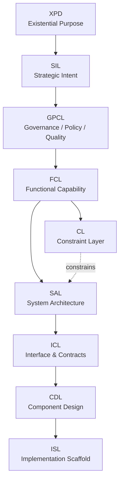
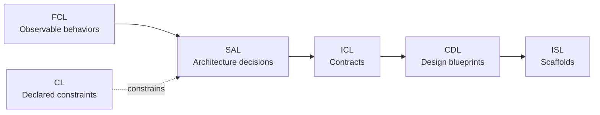
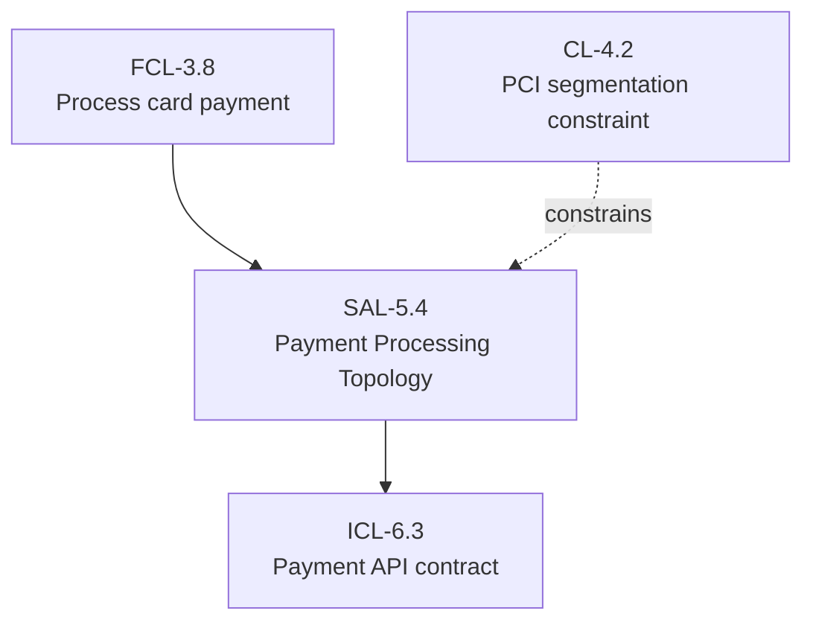
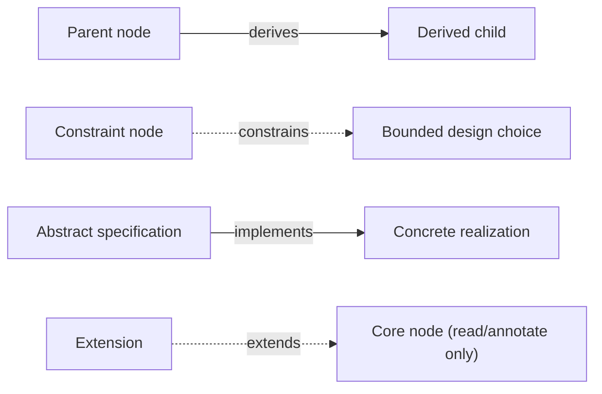
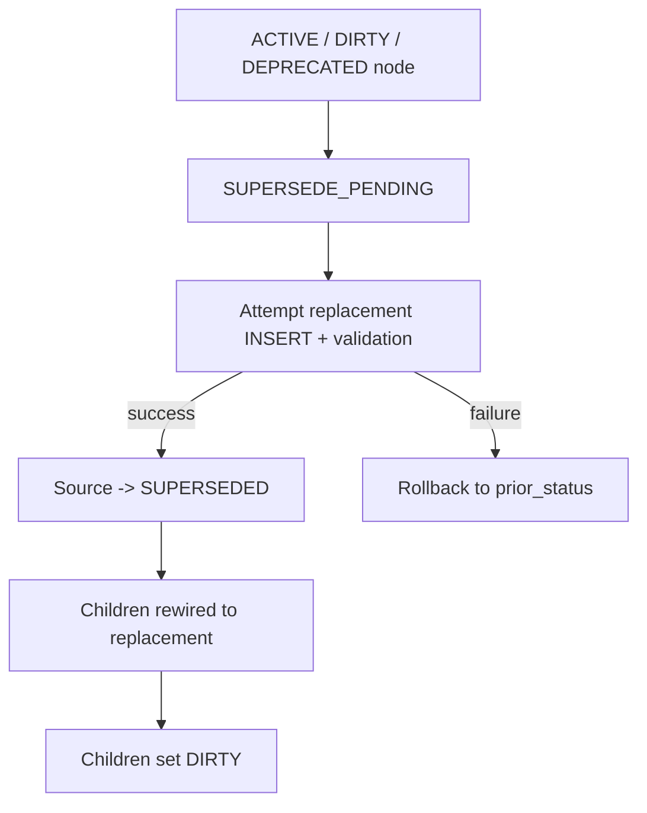
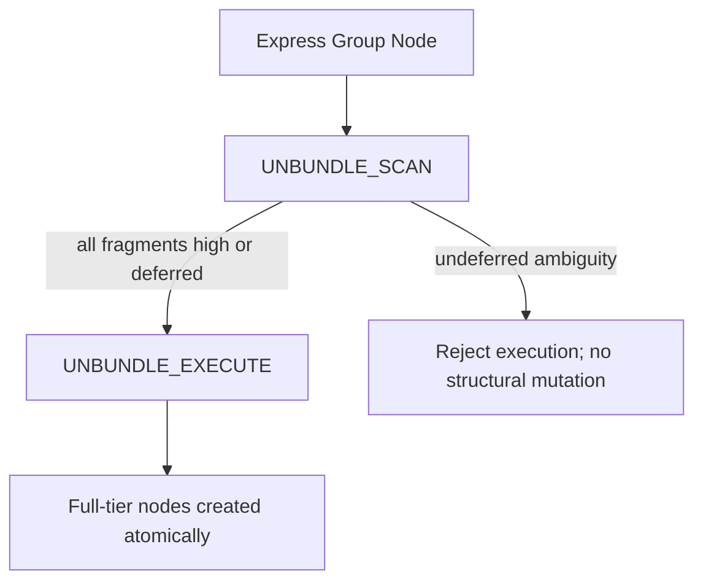
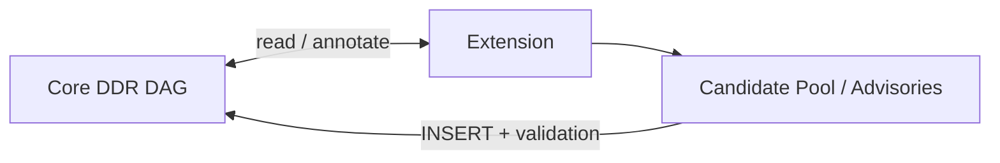
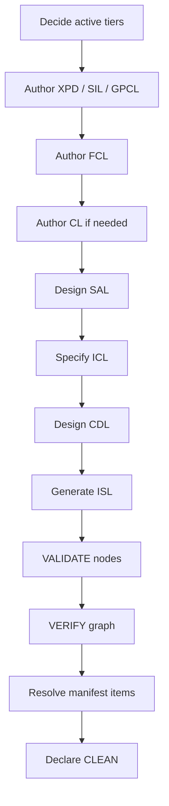

# DDR System Design Framework v6.3 — User’s Manual

> **Purpose of this manual**
> This manual is a user-facing, technically rigorous guide to understanding and applying the DDR System design framework v6.3. It is **interpretive guidance built from the authoritative v6.3 specification, YAML definition, and schema**, and should be read alongside the normative source artifacts.

## Table of Contents

1. [Executive Overview](#1-executive-overview)
2. [Why DDR Exists](#2-why-ddr-exists)
3. [Design Philosophy](#3-design-philosophy)
4. [Foundational DAG Concepts](#4-foundational-dag-concepts)
5. [Why a DAG Matters in DDR](#5-why-a-dag-matters-in-ddr)
6. [The Seven Axioms](#6-the-seven-axioms)
7. [Universal Node Format](#7-universal-node-format)
8. [Edge Types](#8-edge-types)
9. [Core DAG Topology](#9-core-dag-topology)
10. [DAG Invariants](#10-dag-invariants)
11. [Citation Rules and Traceability](#11-citation-rules-and-traceability)
12. [Node Lifecycle and Core Operations](#12-node-lifecycle-and-core-operations)
13. [Consumption Modes: Full vs Express](#13-consumption-modes-full-vs-express)
14. [Tier-by-Tier Technical Guide](#14-tier-by-tier-technical-guide)
15. [Constraint Precedence and Conflict Resolution](#15-constraint-precedence-and-conflict-resolution)
16. [Extension System](#16-extension-system)
17. [Extension Catalog](#17-extension-catalog)
18. [ARE Scoring Profiles](#18-are-scoring-profiles)
19. [Reconciliation Manifest, REVIEW_REQUIRED, and Semantic Gaps](#19-reconciliation-manifest-review_required-and-semantic-gaps)
20. [Compliance and CLEAN-State Readiness](#20-compliance-and-clean-state-readiness)
21. [End-to-End Worked Examples](#21-end-to-end-worked-examples)
22. [Common Failure Modes and Anti-Patterns](#22-common-failure-modes-and-anti-patterns)
23. [Practical Authoring Workflow](#23-practical-authoring-workflow)
24. [Final Guidance](#24-final-guidance)

---

## 1. Executive Overview

DDR (Deterministic Design & Requirements) is a **declarative, traceable, typed, acyclic design framework** for software-system specification. Its central idea is simple but powerful:

- software design knowledge should be represented as a **graph of explicit nodes**
- relationships between nodes should be **typed**
- movement from intent to implementation should be **ordered and auditable**
- structural correctness should be **mechanically verifiable whenever possible**
- higher-order analysis, inference, and optimization should be **extensions**, not hidden behavior inside the core model

That combination makes DDR useful in a place where many projects fail: the space between “we know what we want” and “we can prove why this implementation exists.”

DDR is therefore not just another documentation format. It is a **design-control system** for software engineering.

### What DDR gives you

- A stable path from purpose → strategy → governance → function → constraints → architecture → contracts → design → scaffold
- Bidirectional auditability across the entire design chain
- Structured separation between human-authored core truth and machine-generated advisory intelligence
- A way to scale from solo projects to regulated or enterprise-grade systems without changing the underlying model
- A precise handoff surface for agentic tooling, validation pipelines, and implementation scaffolding

### Mermaid: DDR at a glance



---

## 2. Why DDR Exists

### 2.1 The business and industry problem

Many software programs suffer from the same recurring defects:

1. **requirements lose meaning as they travel downward**
2. **architecture decisions become detached from business intent**
3. **compliance and quality targets arrive too late**
4. **implementation starts before interface, lifecycle, and ownership boundaries are stable**
5. **AI-assisted generation adds speed, but often weakens traceability and design integrity**

Traditional documents often flatten these concerns into prose or spread them across disconnected artifacts. That produces ambiguity, duplication, hidden assumptions, and non-deterministic downstream behavior.

DDR addresses this by making design knowledge a **typed graph with explicit rules and transition semantics**.

### 2.2 The unique role DDR serves

DDR occupies the space between:

- informal product/problem narratives
- classical requirements specifications
- architecture documents
- interface definitions
- implementation scaffolding
- extension-driven analytical tooling

Its unique role is to provide a **single declarative structure that preserves abstraction boundaries while still permitting deterministic expansion toward implementation**.

### 2.3 Why this matters in real projects

A team building an internal dashboard can often survive with loosely connected notes. A team building:

- a medical workflow platform,
- an AI-enabled public service,
- a regulated fintech product,
- a multi-runtime enterprise platform,

cannot safely rely on implicit design lineage.

DDR exists for projects where **correctness of reasoning** matters almost as much as correctness of code.

---

## 3. Design Philosophy

The v6.3 system is explicitly governed by three design principles:

### 3.1 Minimize Design Complexity

Every element must earn its place. Tiers, rules, edges, operations, and metadata all exist because they solve a concrete problem. DDR resists the common anti-pattern of expanding a “framework” until it becomes an abstract meta-model too expensive to adopt.

**Why it matters:** A design framework that is theoretically elegant but operationally expensive will be bypassed by practitioners.

**DDR effect:** The Core remains small enough to be teachable, but structured enough to govern serious systems.

### 3.2 Avoid Premature Optimization

The Core defines only the minimum viable graph. Advanced analytics, inference engines, dependency intelligence, runtime augmentation, and AI reconstruction all live in the Extension system.

**Why it matters:** When advanced behavior is embedded into the core model, the model becomes harder to reason about, harder to validate, and more fragile under change.

**DDR effect:** The Core remains stable even if entire classes of tooling are disabled.

### 3.3 Maximize Structural Integrity

The DAG is the source of truth. Every node is typed. Every edge is typed. Every mutation is validated. Lifecycle transitions are closed. Partial supersede is forbidden. Express expansion is atomic.

**Why it matters:** Design systems fail when mutation is informally managed.

**DDR effect:** Structural integrity is a first-class outcome, not a side effect of team discipline.

---

## 4. Foundational DAG Concepts

### 4.1 What a DAG is

A **Directed Acyclic Graph** is a graph whose edges have direction and whose paths never form a cycle.

In DDR, that means:

- direction expresses **causal or justificatory flow**
- acyclicity prevents circular reasoning
- the graph can be traversed without infinite recursion
- upstream decisions remain distinguishable from downstream realizations

### 4.2 Why software design maps well to DAGs

Good software design is not random association. It has directional meaning:

- purpose informs strategy
- strategy informs governance
- governance informs capability
- capability informs architecture
- architecture informs interfaces
- interfaces inform component design
- component design informs scaffolding

A DAG fits that reality better than undirected notes, flat checklists, or bi-directionally tangled documentation sets.

### 4.3 What DDR adds beyond “just use a graph”

DDR does not merely store nodes and edges. It adds:

- canonical tiers
- typed edge vocabulary
- no-tier-skipping rules
- lifecycle status semantics
- traceability freshness rules
- optional but disciplined extension behavior
- schema-constrained document profiles

That turns a generic graph into a **governed design system**.

---

## 5. Why a DAG Matters in DDR

DDR’s DAG is not decorative. It is the mechanism that enables the framework’s central guarantees.

### 5.1 Auditability

Every non-root node must carry parent citations. This makes downstream content explainable.

**Consequence:** If an ISL stub exists, there must be a CDL reason for it. If a CDL component exists, there must be an ICL contract or design basis. If a SAL architectural split exists, it must trace to capability and optionally constraint context.

### 5.2 Termination of reasoning

Acyclicity eliminates circular dependency in design justification.

**Consequence:** Verification, lineage analysis, supersede propagation, and dependency traversal are mechanically tractable.

### 5.3 Structured convergence

SAL is the single merge node where behavioral intent from FCL and implementation bounds from CL converge.

**Consequence:** Architecture is neither free-floating nor prematurely constrained at intent levels.

### 5.4 Deterministic decomposition

Downstream tiers become increasingly concrete, but only when logically permitted.

**Consequence:** The architecture and contract surfaces are not contaminated by intent prose, and implementation scaffolds are not contaminated by runtime business logic.

### Mermaid: Why SAL is the key merge point



### Real-world scenarios enabled by the DAG

#### Scenario A — regulated API platform

A latency mandate originates in GPCL. DDR requires an FCL mediator that gives the target behavioral meaning before architecture consumes it. This prevents teams from smuggling raw QoS numbers directly into architecture with no functional context.

#### Scenario B — constrained edge device deployment

A hardware ceiling is declared in CL. SAL must absorb that boundary through constrains edges before deciding process partitioning, queue depth, or concurrency design.

#### Scenario C — agentic code generation pipeline

An ISL stub generator can operate safely because every stub is downstream of a CDL blueprint, which is downstream of machine-parseable contracts and auditable architecture lineage.

---

## 6. The Seven Axioms

The axioms define the philosophical and operational boundary of DDR. They are not motivational slogans; they are system-shaping rules.

### 6.1 AX-1 — Traceability

**Statement:** Every non-root node must cite at least one parent via a typed edge.

#### AX-1 Technical importance

Traceability prevents “design apparition” — the sudden appearance of architecture, interface, or implementation artifacts with no demonstrable origin.

#### Why this matters (AX-1)

Without AX-1:

- requirements become folklore
- architecture rationales are reconstructed after the fact
- audits degrade into narrative defense rather than evidence

#### Hypothetical scenario (AX-1)

A team adds a new “priority queue worker” component to improve throughput.
In DDR, that component must trace through CDL → ICL → SAL and ultimately back to a governed capability or quality target. If it does not, the component is not simply “undocumented”; it is structurally suspect.

#### Practical lesson (AX-1)

AX-1 turns “why is this here?” from a meeting question into a graph query.

---

### 6.2 AX-2 — Abstraction Ordering

**Statement:** Technology and implementation specificity are deferred until logically necessary.

#### AX-2 Technical importance

This axiom protects upper tiers from contamination by design choices that belong lower in the stack.

#### Why this matters (AX-2)

If framework choices appear in SIL or FCL, the team starts solving with tools before proving the problem and capability boundaries.

#### Hypothetical scenario (AX-2)

An early requirements note says, “Users need a Redis-backed job queue for exports.”
DDR rejects this at intent/capability levels.
The valid upper-tier statement is behavioral: “Users must be able to request large export jobs asynchronously and retrieve results later.”

#### Practical lesson (AX-2)

AX-2 protects reusability, portability, and long-term design stability.

---

### 6.3 AX-3 — Determinism

**Statement:** Identical inputs produce unambiguous, mechanically verifiable outputs.

#### AX-3 Technical importance

Determinism is what makes DDR suitable for validators, agentic tooling, and reproducible conformance checks.

#### Why this matters (AX-3)

A design framework that cannot yield repeatable validation outcomes cannot safely serve as an automation substrate.

#### Hypothetical scenario (AX-3)

Two reviewers run VALIDATE on the same node. Structural results must agree. If a rule is semantic, DDR does not pretend otherwise; it emits REVIEW_REQUIRED and requires human disposition.

#### Practical lesson (AX-3)

AX-3 does not claim that all design understanding is mechanical.
It claims that **the system must be explicit about what is mechanical and what is not**.

---

### 6.4 AX-4 — Universality

**Statement:** The Core applies to all software systems regardless of domain, scale, or technology.

#### AX-4 Technical importance

Universality prevents the Core from embedding assumptions that only fit one delivery style.

#### Why this matters (AX-4)

A framework that assumes web APIs, cloud infrastructure, or a specific domain ceases to be a framework and becomes a specialized template.

#### Hypothetical scenario (AX-4)

DDR can describe:

- a local desktop tool
- a multi-tenant SaaS platform
- an edge deployment
- a healthcare records workflow
- a data pipeline
- an AI-assisted service

The tiers stay the same. The node content changes.

#### Practical lesson (AX-4)

AX-4 ensures that specialization enters through authored content and Extensions, not through hidden core bias.

---

### 6.5 AX-5 — Extensibility

**Statement:** Advanced analytical capabilities are delivered exclusively via optional Extensions.

#### AX-5 Technical importance

This cleanly separates normative core truth from advisory or inferential intelligence.

#### Why this matters (AX-5)

If analytics mutate the core by default, the framework becomes opaque and fragile.

#### Hypothetical scenario (AX-5)

An AI reconstruction engine infers a likely missing contract from scaffolding evidence. DDR permits that inference only in the Candidate Pool. Promotion into Core requires INSERT and full validation.

#### Practical lesson (AX-5)

AX-5 allows sophisticated tooling without surrendering authorship authority.

---

### 6.6 AX-6 — Declarative Integrity

**Statement:** The Core is strictly declarative; all inference, optimization, and automated recommendation are Extension-only behaviors.

#### AX-6 Technical importance

This guards the Core against hidden execution semantics.

#### Why this matters (AX-6)

A declarative core is inspectable. An inferential core is context-sensitive and harder to certify.

#### Hypothetical scenario (AX-6)

A CL node may declare Python 3.12 and a RAM ceiling. It may not “recommend” an instance family or auto-calculate deployment sizing. That work belongs to Extensions such as HRE.

#### Practical lesson (AX-6)

AX-6 keeps core nodes as truth claims, not tool outputs.

---

### 6.7 AX-7 — DAG Acyclicity

**Statement:** No citation chain may produce a cycle; causality flows in one direction only.

#### AX-7 Technical importance

Acyclicity guarantees finite traversal and prevents self-justifying dependency loops.

#### Why this matters (AX-7)

Cycles in design lineage make it impossible to determine whether a node is upstream justification or downstream consequence.

#### Hypothetical scenario (AX-7)

A SAL subsystem cites an ICL contract for justification, while the ICL contract cites the SAL subsystem for justification, and a CDL component cites both. That turns the design into a circular rationale trap. DDR forbids it.

#### Practical lesson (AX-7)

AX-7 is the backbone that makes every other lineage rule meaningful.

---

## 7. Universal Node Format

DDR uses a universal node shape so that every tier can participate in one coherent graph while still carrying tier-specific semantics.

### Canonical shape

```text
[TIER]-[N].[M]: [Title]
  status:        DRAFT | ACTIVE | DIRTY | DEPRECATED | SUPERSEDED | SUPERSEDE_PENDING
  prior_status:  [StatusEnum]  <- present only during in-flight SUPERSEDE
  version:       [SemVer]
  created:       [ISO 8601]
  modified:      [ISO 8601]
  parent_ids:    [{id, edge_type, derivation_mode?}, ...]
  [Tier-compliant content body]
```

### 7.1 Why this format is powerful

#### Uniformity

A validator, diff engine, or graph browser can inspect any DDR node using the same base contract.

#### Controlled variation

Tier-specific semantics still exist, but they are introduced via rules and conditional fields rather than entirely separate document models.

#### Lifecycle awareness

Status, version, timestamps, and transient supersede state exist directly on the node.

#### Extension safety

Extension metadata is isolated in `extension_annotations` and is explicitly read-only relative to Core truth.

### 7.2 Key fields and what they mean

- `id`: immutable identity
- `tier`: position in the abstraction topology
- `title`: human-recognizable label
- `content`: tier-bound declarative body
- `parent_ids`: typed justifications
- `status`: lifecycle state
- `prior_status`: only for in-flight supersede rollback safety
- `version`, `created`, `modified`: change accountability
- `constraint_origin`: CL-only branching field
- `express_mode_group`: required for express project instances
- `extension_annotations`: namespaced advisory metadata only

### 7.3 Why immutability of ID matters

A node’s identity survives supersede; the replacement gets a new ID.

That matters because:

- history remains stable
- audit chains remain referentially meaningful
- VCS mappings, issue links, and tooling references do not silently drift

### Example A — correct use

A SAL node is superseded after introducing a cleaner decomposition.
The old node remains, status `SUPERSEDED`, original ID intact.
Children are rewired to the new node. History remains understandable.

### Example B — incorrect use

A team edits the original SAL ID in place to represent “the new architecture.”
Now old reviews, references, and downstream evidence all ambiguously point at different realities over time.

### Mermaid: node as auditable unit



---

## 8. Edge Types

DDR intentionally reduced its edge vocabulary to four types. This is a strength, not a limitation.

### 8.1 `derives`

**Meaning:** child content is derived from parent requirements, or parent is cited as authoritative lineage via `derivation_mode`.

#### Modes

- `semantic`: substantive downstream derivation
- `traceability`: authoritative lineage linkage

#### Benefit

One edge type can represent both “this came from that requirement” and “this cites that authority” without multiplying vocabulary.

---

### 8.2 `constrains`

**Meaning:** parent limits the child’s design space.

#### Why it matters

This is crucial for CL → SAL. Constraints are not “just more requirements”; they bound what architecture is allowed to do.

---

### 8.3 `implements`

**Meaning:** child provides a concrete realization of a parent specification.

#### Why it matters

This captures the move from architecture contracts into component design and scaffold.

---

### 8.4 `extends`

**Meaning:** an Extension reads or annotates a Core node without mutating it.

#### Why it matters

This is the rule that preserves AX-5 and AX-6.

### Mermaid: edge semantics in one picture



### Example set

#### Example 1 — derives

FCL “User requests refund” derives from GPCL quality obligations and SIL customer-retention goals.

#### Example 2 — constrains

CL “Python 3.12 only, no JVM runtime” constrains SAL decisions around service layout and worker design.

#### Example 3 — implements

CDL “RefundProcessor component” implements ICL “RefundCommand contract.”

#### Example 4 — extends

ORE adds telemetry advisories to SAL and ISL, but does not change Core node status.

---

## 9. Core DAG Topology

The canonical v6.3 topology is:

XPD → SIL → GPCL → FCL → (optional CL) → SAL → ICL → CDL → ISL

with SAL as the only merge node.

### 9.1 Why this topology is strong

It solves several classic specification problems simultaneously:

- purpose can exist above business strategy when ethically or societally required
- governance and quality are separated from raw functional behavior
- constraints are optional, but once active they formally bound architecture
- architecture is the convergence point, not the origin point
- interfaces are downstream of architecture, not ad hoc side documents
- scaffolds come last and are intentionally incomplete

### 9.2 Why SAL is the merge point

SAL is where the system stops asking “what must happen?” and starts asking “how can this be structurally decomposed while honoring declared bounds?”

That is exactly where capabilities and constraints should converge.

### 9.3 Why ICL follows SAL

Contracts are not mere API documents. In DDR they are machine-verifiable declarations of the interactions architecture requires.

### 9.4 Why ISL is terminal

ISL exists to start implementation safely, not to contain implementation logic itself.

### Worked example — public case management system

- XPD: ensure fair and accessible citizen service delivery
- SIL: reduce case-resolution time and improve transparency
- GPCL: retention mandates, accessibility thresholds, SLA targets
- FCL: submit case, track status, receive notification, upload evidence
- CL: state-hosted environment only, no external PII persistence
- SAL: evented service split with bounded storage tiers
- ICL: submission, status, evidence, notification contracts
- CDL: case service, evidence validator, notification coordinator
- ISL: language-specific stubs with traceable docstrings

The DAG structure is what keeps that stack coherent rather than collapsing into a mixed architectural memo.

---

## 10. DAG Invariants

Invariants are always-on truths of the Core graph.

### INV-1 — No cycles

**Benefit:** finite traversal, stable lineage, no circular justification.

### INV-2 — No tier-skipping

**Benefit:** prevents hollow leaps, such as jumping directly from GPCL to SAL without functional mediation, except where the topology explicitly permits SAL’s merge behavior.

### INV-3 — Canonical active tier sets only

**Benefit:** topology cannot be re-authored arbitrarily by project whim. This protects the framework from silent fragmentation.

### INV-4 — If CL is inactive, SAL derives directly from FCL

**Benefit:** keeps architecture flow valid even when no formal constraints are declared.

### INV-5 — All non-root nodes need parent citations

**Benefit:** enforces AX-1 structurally.

### INV-6 — SUPERSEDE must be atomic

**Benefit:** forbids half-replaced nodes and partially rewired children.

### INV-7 — Structural validity may coexist with declared semantic gaps only if explicitly recorded and resolved or waived

**Benefit:** separates “known unresolved meaning” from “hidden inconsistency.”

### INV-8 — Lifecycle transitions form a complete, closed state machine

**Benefit:** eliminates informal lifecycle drift.

### Example scenarios

#### Example 1 — tier skipping caught

A team wants SAL to cite GPCL directly for latency. DDR forces either an FCL mediator or a manifest-recorded missing mediator review path.

#### Example 2 — incomplete supersede caught

A source node enters `SUPERSEDE_PENDING`, replacement exists, but child rewiring partially fails. DDR treats this as a structural violation.

#### Example 3 — silent semantic ambiguity blocked

A node is structurally valid but contains unresolved semantic judgments. It cannot quietly slide into CLEAN; the manifest must carry disposition.

---

## 11. Citation Rules and Traceability

Citation rules operationalize AX-1.

### Key rules in practice

- only root nodes may have empty `parent_ids`
- parent references must come from immediately preceding active tiers
- CL → SAL uses `constrains`
- inline citations in content must match `parent_ids`
- extension relationships never live in `parent_ids`
- `derivation_mode=traceability` is required when derives is used as authority linkage
- child nodes cannot remain ACTIVE against stale parent content

### Why `CIT-R7` is especially important

It solves a common failure mode: a child remains “approved” after its upstream basis changed.

Under DDR, upstream change forces downstream re-validation. This is critical for:

- architecture after governance changes
- contracts after architecture changes
- components after contract changes

### Scenario

A SAL node changes concurrency strategy.
ICL contract versioning, CDL responsibilities, and ISL scaffolds may all require re-validation. DDR does not pretend those children remain trustworthy by inertia.

---

## 12. Node Lifecycle and Core Operations

DDR treats graph mutation as a governed protocol.

### Statuses

- `DRAFT`
- `ACTIVE`
- `DIRTY`
- `DEPRECATED`
- `SUPERSEDED`
- `SUPERSEDE_PENDING`

### Core operations

- `INSERT`
- `DELETE`
- `MODIFY`
- `SUPERSEDE`
- `VERIFY`
- `VALIDATE`
- `UNBUNDLE_SCAN`
- `UNBUNDLE_EXECUTE`

### 12.1 Why lifecycle design matters

Many frameworks define content but not mutation semantics. DDR defines both.

That matters because the safety of a design system depends not just on what exists, but on **how it changes**.

### 12.2 SUPERSEDE is the most important operation

SUPERSEDE is deliberately atomic:

1. source enters `SUPERSEDE_PENDING`
2. replacement attempts full INSERT validation
3. if successful, source becomes `SUPERSEDED`, children rewire, children become DIRTY
4. if unsuccessful, rollback restores source and removes failed replacement

This avoids partial graph corruption.

### Mermaid: supersede flow



### 12.3 DIRTY is nuanced, not binary panic

DDR distinguishes structural and semantic DIRTY behavior. A rewired child may be structurally DIRTY without immediate semantic invalidation of all descendants.

This is an important optimization in rigor, not in speed: it prevents over-propagation while preserving correctness.

### 12.4 VALIDATE vs VERIFY

- `VALIDATE`: one node against its atomic ruleset
- `VERIFY`: the graph across nodes, citations, contamination, orphans, and optional semantic consistency rules

### Example — when each should be used

- Use `VALIDATE` after authoring a new FCL capability node
- Use `VERIFY` after changing a GPCL target or superseding a SAL design

---

## 13. Consumption Modes: Full vs Express

DDR supports two authoring modes.

### 13.1 Full Mode

All active tiers are independently authored.

**Best for:** complex, regulated, enterprise, or long-lived systems.

### 13.2 Express Mode

Adjacent tiers are bundled into four groups:

- G1 = XPD, SIL, GPCL
- G2 = FCL, CL
- G3 = SAL, ICL
- G4 = CDL, ISL

**Best for:** small-to-medium projects needing lighter presentation.

### 13.3 What Express is not

Express is **not** a different framework. It is grouped Full Mode with a deterministic expansion protocol.

### 13.4 Why UNBUNDLE is two-phase

- `UNBUNDLE_SCAN` is read-only diagnostics
- `UNBUNDLE_EXECUTE` is atomic expansion

This prevents ambiguous grouped content from silently creating malformed full-mode nodes.

#### Mermaid: express expansion



#### Scenario

A G2 group contains mixed capability and constraint text.
If fragments are not explicitly tier-annotated, scan returns ambiguity.
Execution is rejected until annotation or defer handling is added.
This protects the graph from non-deterministic allocation.

---

## 14. Tier-by-Tier Technical Guide

This section explains what each tier is for, what it must contain, what it must not contain, and why.

#### XPD Question

What human or societal need does this system exist to address?

#### XPD When active

ethically impactful, public-facing, healthcare, civic, AI/ML, or socially consequential systems.

#### XPD Why it exists

Some projects need a layer above business strategy: a durable statement of purpose, ethical boundary, and harm-aware success criteria.

#### XPD Benefits

- prevents purely commercial reasoning from erasing ethical limits
- creates durable normative context
- supports higher-priority veto behavior in conflict precedence

#### XPD Must include

- fundamental human/societal need
- ethical boundaries
- implementation-independent success criteria
- harmed populations and safeguards

#### XPD Must exclude

- technology choices
- performance targets
- regulatory/legal constraints

#### XPD Scenario 1

An AI triage assistant for public benefits eligibility requires XPD because fairness, harm prevention, and public trust are not reducible to business outcomes.

#### XPD Scenario 2

A private one-user command-line renaming tool may omit XPD if it has no meaningful external effect.

#### SIL Question

Why does this system exist, and what business outcomes must it achieve?

#### SIL Why it exists

SIL anchors the system in organizational purpose without collapsing into solution design.

#### SIL Benefits

- stable strategy under technology change
- explicit stakeholder/value mapping
- controlled scope boundaries

#### SIL Must include

- business problem/opportunity
- measurable strategic objectives
- stakeholder categories and value propositions
- in-scope / out-of-scope boundaries
- organizational success metrics

#### SIL Must exclude

- stacks, frameworks, hardware
- architecture patterns
- compliance mandates
- quantitative performance targets

#### SIL Scenario

A customer support platform’s SIL may define reduced resolution time, improved self-service success, and clearer escalation ownership, but may not mention event buses, PostgreSQL, or React.

#### GPCL Question

What non-negotiable external mandates and measurable quality thresholds govern the system?

#### GPCL Why it exists

DDR absorbs operational quality obligations into governance rather than splitting them into a separate operational tier.

#### GPCL Benefits

- places non-negotiable acceptance boundaries early
- prevents architecture from inventing compliance later
- keeps external obligations explicit and testable

#### GPCL Must include

- regulatory frameworks
- contracts and policies
- data residency and audit mandates
- performance targets
- availability/reliability targets
- security requirements
- scalability and accessibility requirements

#### GPCL Bridge rule importance

GPCL-FCL-BR1 prevents raw numeric targets from jumping directly into architecture with no behavioral mediator.

#### GPCL Scenario

“95th percentile response under 300 ms” belongs in GPCL, but FCL must explain which user-facing interaction that number governs.

---

### 14.4 FCL — Functional Capability Layer

#### FCL Question

What externally observable behaviors must the system provide?

#### FCL Why it exists

FCL is where the system becomes behaviorally legible without becoming architectural.

#### FCL Benefits

- preserves user-facing truth
- prevents “requirements” from being disguised architecture
- serves as the last technology-neutral behavior layer

#### FCL Must include

- user/external-system perspective
- end-to-end workflows
- event-driven behaviors
- observable state transitions and error conditions
- decomposition for complex capability trees
- GPCL traceability where needed
- logical data entities with CRUD relationships for persistent-data capabilities

#### FCL Must exclude

- classes/modules/APIs/algorithms
- schemas/protocols/serialization
- hardware or infrastructure topology

#### FCL Scenario

“User uploads evidence, system validates type, stores it, and exposes updated case status” is valid FCL.
“UploadEvidenceController posts multipart payload to /v1/files and stores to S3” is not.

---

### 14.5 CL — Constraint Layer

#### CL Question

What declared technology selections, hardware envelopes, and infrastructure ceilings bound implementation?

#### CL Why it exists

CL formalizes non-negotiable implementation bounds without polluting upper tiers.

#### CL Benefits

- architecture gets explicit boundaries
- physical impossibilities are surfaced before deep design
- external mandates can be represented without distorting FCL

#### CL Special feature: `constraint_origin`

- `derived`: chosen in response to FCL needs
- `imposed`: externally mandated authority

This branching is extremely important because it changes citation obligations.

#### CL Must include

- approved languages
- mandatory frameworks/libraries
- external service contract constraints
- runtime environment bounds
- prohibited technologies
- hardware envelopes
- infrastructure ceilings
- deployment topology
- authority citations for imposed constraints
- reconciliations of internal constraint conflicts

#### CL Must exclude

- inferred recommendations
- functional behaviors
- cost/TCO analysis

#### CL Scenario A — derived constraint

A real-time visualization need leads to a chosen runtime and GPU floor. That is derived.

#### CL Scenario B — imposed constraint

A procurement rule forbids non-approved cloud providers. That is imposed and cites external authority, not an FCL capability.

---

### 14.6 SAL — System Architecture Layer

#### SAL Question

How is the system structurally decomposed, and what patterns govern interaction?

#### SAL Why it exists

SAL is the turning point from behavioral truth to structural truth.

#### SAL Benefits

- gives architecture a legitimate causal basis
- absorbs constraints without letting them dominate upper tiers
- defines boundaries before contracts and components

#### SAL Must include

- architectural pattern(s) with rationale
- subsystem decomposition
- communication patterns
- concurrency model and data ownership rules
- resilience/failure-isolation boundaries
- citations to active parents

#### SAL Must exclude

- exact schemas
- class-level blueprints
- executable logic

#### SAL Scenario

A SAL decision may declare an event-driven architecture with isolated workflow, notification, and audit subsystems due to FCL behaviors and CL deployment constraints.

---

### 14.7 ICL — Interface & Contracts Layer

#### ICL Question

What formal, machine-verifiable contracts govern data exchange?

#### ICL Why it exists

ICL gives architecture enforceable boundary surfaces.

#### ICL Benefits

- contract-first rigor
- machine-parseable integration surfaces
- safer downstream code generation and review

#### ICL Must include

- complete schemas
- parseable formats
- protocols/serialization
- mandatory/optional fields and validation rules
- error response contracts
- versioning strategy
- SAL citations

#### ICL Must exclude

- internal business logic
- routing patterns
- class/module blueprints

#### ICL Scenario

An evidence-upload contract belongs here, including payload schema, error codes, version policy, and protocol rules.

---

### 14.8 CDL — Component Design Layer

#### CDL Question

What are the structural blueprints of components?

#### CDL Why it exists

CDL bridges contracts to implementable structure without allowing executable logic.

#### CDL Benefits

- explicit ownership and responsibility
- predictable downstream scaffold generation
- clearer implementation boundaries

#### CDL Must include

- component names and responsibilities
- signatures
- logical internal state models
- dependencies
- contract mappings
- lifecycle/teardown responsibilities
- language-specific blueprints if CL names multiple targets

#### CDL Must exclude

- executable code
- system-wide architecture patterns
- schemas

#### CDL Scenario

A `NotificationCoordinator` component blueprint defines its responsibilities and public methods, but not the actual retry algorithm implementation.

---

### 14.9 ISL — Implementation Scaffold Layer

#### ISL Question

What is the minimal, structurally valid, traceable scaffolding needed to initiate implementation?

#### ISL Why it exists

ISL gives implementation a safe start without prematurely encoding logic.

#### ISL Benefits

- enables code generation without inventing behavior
- preserves traceability into source files
- reduces drift between design and code entry points

#### ISL Must include

- syntactically valid scaffolding
- traceable docstrings/comments
- structured implementation hints
- stub-only bodies
- one scaffold per target runtime when needed
- CDL citations

#### ISL Must exclude

- business logic
- complete algorithms
- infrastructure configuration

#### ISL Scenario

A Python scaffold file contains function signatures, docstrings with DDR IDs, TODO markers, and empty bodies. It is intentionally not a “first implementation.”

---

## 15. Constraint Precedence and Conflict Resolution

DDR includes a formal precedence ladder:

1. XPD
2. SIL
3. GPCL
4. FCL
5. CL
6. SAL
7. ICL
8. CDL
9. ISL

### 15.1 What this means

Higher-priority tiers override lower-priority tiers in logical conflict.
But **physical or externally imposed constraints cannot be silently overridden by logic alone**.

This is a critical nuance.

### 15.2 Why `constraint_origin='imposed'` matters

An imposed CL node is treated as a non-overridable physical-or-external constraint in precedence evaluation.

**Interpretation:** A business desire does not magically make impossible hardware or contractual reality disappear.

### 15.3 How conflicts are resolved

1. identify conflicting nodes
2. classify conflict as logical / physical / semantic
3. escalate to authoring authority
4. record decision and rationale
5. apply MODIFY / SUPERSEDE / DELETE
6. VERIFY again

### Example scenarios

#### Scenario A — ethical veto

XPD forbids manipulative dark patterns.
A lower-tier UX optimization conflicts.
XPD wins outright.

#### Scenario B — physically impossible requirement

FCL requires model inference on commodity edge hardware with a strict RAM floor already imposed in CL.
The system cannot silently “choose” the functional request over the hardware reality. Escalation is mandatory.

#### Scenario C — same-tier conflict

Two GPCL nodes declare incompatible retention policies.
Neither may remain ACTIVE until resolved.

---

## 16. Extension System

The Extension system is how DDR becomes powerful without corrupting the Core.

### 16.1 Architectural principle

Extensions may read and annotate Core nodes. They may update reconciliation artifacts. They may not silently mutate Core truth.

### 16.2 Candidate Pool

The Candidate Pool is where inferred artifacts live before promotion.

This is one of the strongest design decisions in v6.3 because it preserves:

- human authority
- auditability
- deterministic promotion rules
- clean separation between inference and authored truth

### 16.3 Why this is better than direct AI insertion

Direct AI mutation of core design artifacts creates ambiguity about authorship, trust, and certification boundaries.

DDR solves this by making promotion explicit.

### Mermaid: extension separation



### 16.4 Core extension rules

Extensions must:

- declare compatible contract version
- declare which tiers they read and annotate
- namespace annotations
- update reconciliation tracking
- leave Core CLEAN/DIRTY status unchanged when disabled
- maintain internal acyclicity for their own artifact graphs
- avoid mutating Core status from advisories alone

### Example

A runtime observability extension can recommend telemetry surfaces on SAL/ISL nodes.
Those advisories may influence author decisions, but they do not become Core truth until human-applied operations occur.

---

## 17. Extension Catalog

The v6.3 catalog defines nine extensions.

### E1 — HRE: Hardware & Resource Intelligence Extension

**Purpose:** infer minimum hardware/resource profiles and validate SAL designs against CL ceilings.

**Value:** especially useful when architecture and deployment resource tension is high.

---

### E2 — DGA: Dependency Graph Analyzer

**Purpose:** produce dependency graphs, conflict analysis, and license constraint surfacing.

**Value:** useful for transitive risk management and dependency hygiene.

---

### E3 — LVE: Lifecycle & Versioning Engine

**Purpose:** version history, technical debt classification, deprecation control, VCS mapping.

**Value:** strengthens long-lived governance and audit integration.

---

### E4 — ORE: Observability & Runtime Engine

**Purpose:** derive telemetry stubs and alerting guidance from operational targets and architectural components.

**Value:** keeps runtime readiness tied to design lineage.

---

### E5 — ARE: AI Upward Reconstruction Engine

**Purpose:** infer candidate architectural/contracts/design insights from downstream artifacts.

**Value:** useful for brownfield recovery and reverse-structured documentation.

**Critical guardrails**

- annotation limited to SAL and below
- no autonomous XPD or GPCL creation
- scoring profile mandatory
- candidate promotion requires INSERT

---

### E6 — SCE: Security & Compliance Engine

**Purpose:** threat modeling, trust-boundary review, RBAC policy checks, PII traceability.

**Value:** embeds security review into design artifacts without turning security into undocumented side work.

---

### E7 — DDE: Data Domain Extension

**Purpose:** maintain consistency between FCL data-bearing capabilities and ICL schema surfaces.

**Value:** catches “we forgot to model the data surface” failures.

**Important nuance:** DDE does not invent missing FCL data entities. It only confirms them against ICL. That preserves AX-5 and AX-6.

---

### E8 — DCP: Deployment & CI/CD Planner

**Purpose:** deployment mapping and CI/CD stage derivation.

**Value:** keeps deployment reasoning downstream of declared architecture and constraints.

---

### E9 — EHD: Ethics & Human-Centered Design Extension

**Purpose:** bias, accessibility, accountability, and ethical boundary evaluation.

**Value:** extends ethical review into design artifacts without substituting for human-authored XPD.

---

## 18. ARE Scoring Profiles

ARE is the most sensitive extension because it deals with inference. v6.3 hardens it with explicit scoring profiles.

### 18.1 `standard_v1`

Designed for ordinary controlled use.

Signals include:

- direct source node count
- cross-tier convergence
- ICL corroboration
- SAL pattern alignment
- tier diversity index

Threshold behavior:

- minimum surfacing threshold: 0.35
- below-threshold items require explicit override with rationale

### 18.2 `conservative_v1`

Designed for higher-assurance or regulated settings.

Threshold behavior:

- minimum surfacing threshold: 0.55
- stronger gating before review or promotion

### 18.3 Custom profiles

Allowed, but only if they conform to required structure and deterministic validation rules.

### Why this design is good

It avoids the false dichotomy of:

- “AI inference is always acceptable”
- “AI inference must never be used”

Instead DDR says:

- inference is allowed,
- must be structured,
- must be reproducible,
- must be scored under a declared policy,
- must not become Core truth without promotion.

### Example

A brownfield service lacks SAL documentation but has rich ICL/CDL/ISL evidence.
ARE proposes a candidate subsystem boundary at 0.74 under `conservative_v1`.
That does not “become architecture.”
It becomes prioritized review input.

---

## 19. Reconciliation Manifest, REVIEW_REQUIRED, and Semantic Gaps

This is where DDR becomes unusually honest compared with many frameworks.

### 19.1 Structural vs semantic truth

DDR acknowledges that not all valid design judgment is mechanically decidable.

So it distinguishes:

- **structural validation**
- **semantic review requirements**

### 19.2 REVIEW_REQUIRED

When a semantic atomic rule is encountered during VALIDATE, the result is not fake certainty. DDR emits `REVIEW_REQUIRED`.

This is excellent design because it avoids pretending that architecture rationale, human comprehensibility, or behavioral appropriateness can always be reduced to pattern checks.

### 19.3 Semantic gaps

A graph can be structurally valid while still carrying known semantic gaps — but only if:

- the gap is explicitly recorded,
- classification is allowed,
- rationale is documented,
- resolution or waiver exists before CLEAN.

### Scenario

SAL contains a plausible architecture pattern, but rationale is underdeveloped.
The graph may be structurally sound.
It is not semantically complete.
DDR records that gap rather than hiding it.

---

## 20. Compliance and CLEAN-State Readiness

DDR’s compliance checklist defines what it means for a project to be truly clean.

### 20.1 Structural cleanliness

A CLEAN graph requires, among other things:

- valid parentage
- correct parent tiers
- no cycles
- no tier skipping
- representative nodes for active tiers
- no DIRTY nodes
- no SUPERSEDE_PENDING nodes
- no unresolved pending manifest items

### 20.2 Atomic rule cleanliness

Each tier must satisfy its inclusion and exclusion rules, and special cross-cutting rules like:

- FCL-R7 data entity enumeration
- GPCL-FCL-BR1 mediator behavior
- CL branching by `constraint_origin`
- CIT-R7 freshness
- CDL language-specific blueprint propagation

### 20.3 Extension cleanliness

If Extensions are active:

- contracts must match DDR-Core-6.x
- annotations must stay in `extension_annotations`
- blocking or critical advisories need disposition

### Practical takeaway

DDR CLEAN does not mean “we feel done.”
It means “the graph is structurally valid, semantically dispositioned, and operationally coherent.”

---

## 21. End-to-End Worked Examples

### Example 1 — AI-assisted municipal permit intake system

#### XPD

Provide accessible, fair, transparent permit intake for residents while minimizing exclusion risk.

#### SIL

Reduce intake time, increase status transparency, reduce manual routing errors.

#### GPCL

Accessibility standard, data retention requirements, response-time targets, auditability.

#### FCL

Resident submits permit request, uploads evidence, tracks progress, receives notifications.

#### CL

Government hosting boundary, approved language/runtime, no external PII services.

#### SAL

Submission subsystem, review workflow subsystem, notification subsystem, audit subsystem.

#### ICL

Submission payload schema, case status schema, evidence upload contract, notification contract.

#### CDL

Submission handler component, review coordinator, file validation service, notifier.

#### ISL

Stub files for each service with traceable comments.

**Why DDR works here:**
Ethics, compliance, capability, and architecture remain distinguishable yet connected.

---

### Example 2 — brownfield reverse reconstruction of an internal platform

Starting point: partial scaffolds and contracts exist, but architecture docs are stale.

Use ARE to infer candidate SAL and ICL patterns from ISL/CDL/ICL evidence.
Candidates enter the Pool.
Humans promote selected candidates through INSERT.
Rebuilt architecture then becomes authoritative.

**Why DDR works here:**
Inference is useful, but core truth is still curated.

---

### Example 3 — high-performance edge analytics appliance

FCL requires near-real-time anomaly surfacing.
CL imposes CPU-only deployment and strict RAM ceiling.
SAL must choose bounded concurrency and careful partitioning.
ORE later derives telemetry needs from those same quality targets.
HRE checks that SAL stays within CL ceilings.

**Why DDR works here:**
The graph preserves the reason performance trade-offs exist.

---

## 22. Common Failure Modes and Anti-Patterns

### Anti-pattern 1 — upper-tier contamination

Putting stacks, frameworks, APIs, or infrastructure into SIL/FCL.

**Fix:** push behavior up, push implementation down.

### Anti-pattern 2 — architecture without behavioral mediation

Letting GPCL numeric targets jump directly into SAL.

**Fix:** author behavioral FCL mediators or log missing mediator review.

### Anti-pattern 3 — inferred truth in Core

Letting AI-generated ideas directly alter authoritative nodes.

**Fix:** use Candidate Pool + INSERT.

### Anti-pattern 4 — schema in SAL

Writing payload formats or exact fields in architecture.

**Fix:** move to ICL.

### Anti-pattern 5 — executable logic in ISL

Turning scaffolds into half-implemented codebases.

**Fix:** keep ISL stub-only.

### Anti-pattern 6 — ignoring parent freshness

Keeping child nodes ACTIVE after upstream content changed.

**Fix:** rely on CIT-R7 and re-validation discipline.

---

## 23. Practical Authoring Workflow

### Recommended authoring sequence

1. decide whether XPD is active
2. author SIL
3. author GPCL
4. author FCL capability tree
5. activate CL only if constraints are truly non-negotiable
6. design SAL with cited parent decisions
7. formalize ICL contracts
8. author CDL blueprints
9. generate ISL scaffolds
10. run VALIDATE iteratively per node
11. run VERIFY across the graph
12. resolve REVIEW_REQUIRED items and semantic gaps
13. activate extensions as advisory multipliers, not substitutes for authorship

### Mermaid: recommended workflow



### Authoring tip

Write each node as though a skeptical reviewer will ask:

1. why does this exist?
2. what tier justifies it?
3. what content does this tier forbid?
4. what downstream tier is supposed to consume it?

If you cannot answer all four cleanly, the node is probably in the wrong shape or wrong tier.

---

## 24. Final Guidance

DDR v6.3 is strongest when treated as:

- a **design control framework**, not a fancy note system
- a **typed lineage model**, not a prose template
- a **human-authored core with machine-assisted extensions**, not an autonomous generator
- a **deterministic abstraction ladder**, not a flexible catch-all taxonomy

Its most important contribution is not any single tier or rule.
It is the combination of:

- abstraction discipline,
- traceable causality,
- closed mutation semantics,
- extension isolation,
- and honest treatment of semantic review.

That combination makes DDR unusually well-suited for modern software engineering environments that need both:

- rigorous design integrity, and
- compatibility with automation, validation, and agentic tooling.

In practice, DDR succeeds when teams use it to answer three questions relentlessly:

1. **What must be true?**
2. **Why is it true?**
3. **What downstream artifact is justified by that truth—and nothing more?**

If a team maintains that discipline, DDR becomes more than a framework.
It becomes a reliable engineering memory system for the entire project lifecycle.

---

## Source Basis

This manual was derived from the authoritative v6.3 artifacts:

- `DDR System(v6.3).md`
- `ddr_system_v6.3.yaml`
- `ddr_node_schema_v6.3.yaml`

Use those artifacts as the normative source of truth when this manual and the authoritative specification differ.
