# DDR System Design Framework v6.3 User's Manual

This manual is the comprehensive user-facing reference for the DDR System design framework v6.3. It is intentionally interpretive, tutorial-oriented, and example-rich, but every normative DDR fact in this document is derived from exactly two authoritative sources:

- `.agent/assets/proposals/active/v6.3/ddr_system_v6.3.yaml`
- `.agent/assets/proposals/active/v6.3/ddr_node_schema_v6.3.yaml`

Everything labeled `Illustrative scenario` is non-normative and exists only to explain why a DDR rule or structure matters in practice.

## Table of Contents

1. [Source Basis and How To Use This Manual](#1-source-basis-and-how-to-use-this-manual)
2. [Business Context, Industry Need, and DDR's Role](#2-business-context-industry-need-and-ddrs-role)
3. [Design Philosophy, DAG Fundamentals, and DDR Adoption of DAGs](#3-design-philosophy-dag-fundamentals-and-ddr-adoption-of-dags)
4. [The Seven Foundational Axioms](#4-the-seven-foundational-axioms)
5. [Core Structural Model](#5-core-structural-model)
6. [Lifecycle, Guards, and Atomic Operations](#6-lifecycle-guards-and-atomic-operations)
7. [Consumption Modes and Express Unbundling](#7-consumption-modes-and-express-unbundling)
8. [Tier-by-Tier Technical Reference](#8-tier-by-tier-technical-reference)
9. [Constraint Precedence, Reconciliation, and CLEAN-State Readiness](#9-constraint-precedence-reconciliation-and-clean-state-readiness)
10. [Extension System, Extension Catalog, and ARE Profiles](#10-extension-system-extension-catalog-and-are-profiles)
11. [Schema Contract and Machine Validation Surface](#11-schema-contract-and-machine-validation-surface)
12. [Appendices](#12-appendices)

---

## 1. Source Basis and How To Use This Manual

### 1.1 Source basis

| Authority surface | Role in this manual | Notes |
| --- | --- | --- |
| `ddr_system_v6.3.yaml` | Semantic authority | Defines axioms, tiers, rules, topology, operations, extensions, compliance, glossary, version history, and lifecycle. |
| `ddr_node_schema_v6.3.yaml` | Machine-contract authority | Defines required fields, conditionals, enums, structural typing, and root/profile validation logic. |

If those two files were to disagree, this manual would have to stop and report the mismatch rather than reconcile it in prose. No such mismatch was used as a source here.

### 1.2 How to read the manual

- Read Sections 2 through 4 first if you are learning DDR conceptually.
- Read Sections 5 through 7 first if you are implementing tooling, validation, or authoring workflows.
- Read Section 8 first if you are writing or reviewing tier content.
- Read Sections 10 and 11 first if you are building extensions or validators.
- Treat appendices as lookup surfaces, not introductory material.

### 1.3 Normative facts vs illustrative scenarios

- `Normative fact`: directly grounded in the two YAML authorities.
- `Interpretive explanation`: a faithful explanation of why the YAML design exists.
- `Illustrative scenario`: hypothetical real-world usage designed to demonstrate consequences, benefits, or failure modes.

### 1.4 Visual conventions

- Status colors:
  - `<span style="color:#16a34a"><strong>ACTIVE</strong></span>` = validated and current
  - `<span style="color:#d97706"><strong>DIRTY</strong></span>` = requires re-validation
  - `<span style="color:#2563eb"><strong>SUPERSEDE_PENDING</strong></span>` = in-flight atomic replacement
  - `<span style="color:#6b7280"><strong>DEPRECATED</strong></span>` = valid but scheduled for removal or replacement
  - `<span style="color:#374151"><strong>SUPERSEDED</strong></span>` = replaced but retained for audit lineage
- Verification modes:
  - `<span style="color:#0f766e"><strong>structural</strong></span>` = mechanically evaluable
  - `<span style="color:#92400e"><strong>manual</strong></span>` = human process requirement
  - `<span style="color:#7c2d12"><strong>semantic</strong></span>` = human judgment needed

### Nano Banana 2 Visual Prompt-1

- Objective: Establish the manual's visual language for the entire DDR reference.
- Subject: A polished technical editorial spread introducing DDR as a typed design graph with governance, architecture, interfaces, and scaffolding layers.
- Composition: Wide landscape composition, central DAG spine, left-to-right abstraction descent, right-side legend for statuses and verification modes, clean space for labels.
- Required labels/text: "DDR v6.3", "Core DAG", "Typed Edges", "Lifecycle", "Extensions", "Schema Contract".
- Style vocabulary: technical infographic, crisp vector blueprint, enterprise architecture poster, clean editorial layout, precise label rendering.
- Palette: deep blue, slate, teal, warm amber accents, restrained green for ACTIVE, no neon effects.
- Aspect ratio: 16:9.
- Consistency anchors: readable embedded text, exact node labels, layered information density, white or light neutral background, consistent line weights.
- Exclusions: no fantasy imagery, no code editor screenshots, no people, no cluttered 3D UI, no hand-drawn chaos.


---

## 2. Business Context, Industry Need, and DDR's Role

### 2.1 Why systems like DDR are needed

Software programs routinely fail not because teams lack documents, but because their documents are structurally weak. Common failure patterns include:

- business intent dissolves before it reaches implementation
- architecture is justified by preference rather than traceable need
- performance, compliance, or ethics arrive too late to reshape design safely
- code generation accelerates delivery but weakens auditability
- downstream artifacts cannot be revalidated precisely after upstream change

DDR addresses these problems by representing design knowledge as a directed, typed, auditable graph rather than as disconnected prose artifacts.

### 2.2 The unique role DDR serves

DDR is neither just a requirements template nor just an architecture template. It is a deterministic design-control framework that:

- orders abstraction from purpose to scaffold
- preserves typed lineage between every layer
- makes structural validation machine-checkable
- isolates advanced inference into optional extensions
- keeps the Core declarative and stable

That combination gives DDR a role that most documentation systems do not fill: it governs the path from rationale to implementable shape without collapsing all concerns into a single layer.

### 2.3 Benefits DDR offers

| Benefit | What DDR does | Why it matters |
| --- | --- | --- |
| Auditability | Requires typed parent citations for non-root nodes | You can explain why downstream artifacts exist. |
| Deterministic validation | Encodes rules, topology, and lifecycle as structured data | Tooling can verify the graph consistently. |
| Controlled abstraction | Defers technology and implementation detail until logically necessary | Prevents premature lock-in and upper-tier contamination. |
| Change isolation | Uses `DIRTY` propagation and parent freshness rules | Teams can revalidate only what was actually affected. |
| Stable extensibility | Restricts advanced analytics to optional Extensions | The Core does not become a moving target. |
| Universal applicability | Keeps the Core domain-agnostic | One framework can govern many software domains. |

### 2.4 Illustrative scenarios

1. `Illustrative scenario - regulated fintech platform`
   A throughput or retention change at `GPCL` can be traced to exactly the affected `FCL`, `SAL`, and `ICL` nodes rather than forcing a full-document re-audit.
2. `Illustrative scenario - AI-assisted internal platform`
   An extension can propose reverse-inferred contracts or designs, but those candidates remain outside the Core until formally promoted through `INSERT`.
3. `Illustrative scenario - safety-sensitive public system`
   Optional `XPD` activation introduces ethical boundaries that can veto downstream convenience features even when those features are technically feasible.

### Mermaid: End-to-end DDR topology

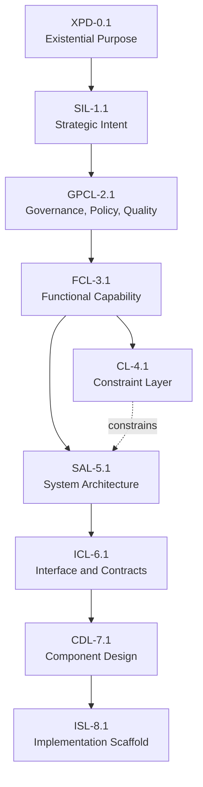

### Nano Banana 2 Visual Prompt-2

- Objective: Explain the industry problem DDR solves and show the full DDR path from intent to implementation.
- Subject: A systems-engineering poster showing fragmented traditional documents on one side and a unified DDR DAG on the other.
- Composition: Split composition, left side with disconnected requirement sheets and compliance notes, right side with the 9-tier DDR graph and explicit typed arrows.
- Required labels/text: "Disconnected Documents", "Traceability Loss", "DDR Core DAG", "Purpose -> Strategy -> Governance -> Capability -> Architecture -> Contracts -> Design -> Scaffold".
- Style vocabulary: technical contrast infographic, enterprise transformation poster, clean diagrammatic storytelling, exact text placement.
- Palette: muted red and gray on the legacy side, structured blue-teal-green on the DDR side, amber for constraint overlays.
- Aspect ratio: 16:9.
- Consistency anchors: light background, precise labels, straight connectors, minimal decorative flourishes, professional editorial feel.
- Exclusions: no comic style, no photorealistic office workers, no abstract art, no dark cyberpunk scene.


---

## 3. Design Philosophy, DAG Fundamentals, and DDR Adoption of DAGs

### 3.1 The three design principles

The `system_metadata.design_philosophy` block defines three governing principles:

1. `Minimize Design Complexity`
   Every element must solve a concrete problem. DDR is designed to be adoptable by a solo developer and still scale without structural redesign.
2. `Avoid Premature Optimization`
   The Core defines the minimum viable graph. Advanced analytics, inference, and recommendations belong in Extensions only.
3. `Maximize Structural Integrity`
   The DAG is the source of truth. Nodes, edges, mutations, and lifecycle behavior are all validated explicitly.

### 3.2 DAG foundations

A directed acyclic graph is useful in DDR because software reasoning is directional:

- purpose informs strategy
- strategy informs governance
- governance informs capability
- capability informs architecture
- architecture informs contracts
- contracts inform design
- design informs scaffolding

Acyclicity matters because circular design justification is operationally toxic. If two nodes depend on each other for legitimacy, neither is truly justified.

### 3.3 Why DDR uses a DAG instead of flat documents

DDR gets specific benefits from DAG structure that a flat specification cannot provide:

- `termination`: graph traversal always finishes because cycles are forbidden
- `precision`: only affected descendants need attention after change
- `typed meaning`: edges carry semantics, not just hyperlinks
- `mechanical topology checks`: validators can detect tier-skipping, orphans, and stale parent lineage
- `merge discipline`: `SAL` is the single merge node where behavior and constraints converge

### 3.4 Detailed technical review of DDR's DAG architecture

| Design element | DDR behavior | Benefit |
| --- | --- | --- |
| Canonical active tier order | Only four ordered `active_tiers` variants are legal | Prevents topology drift. |
| Typed `parent_ids` | Uses `derives`, `constrains`, and `implements` in Core citations | Preserves semantic meaning in lineage. |
| SAL merge exception | `SAL` may derive from `FCL` and be constrained by `CL` | Allows architecture to absorb both behavior and external bounds. |
| Extension isolation | `extends` is not allowed in `parent_ids`; extensions annotate via `extension_annotations` | Preserves Core declarative integrity. |
| Root discipline | Only `XPD` or `SIL` may be root depending on activation | Prevents orphaned topologies. |

### 3.5 Illustrative scenarios

1. `Illustrative scenario - municipal permitting platform`
   A legal retention rule in `GPCL` changes. DDR localizes downstream impact through `FCL`, `SAL`, `ICL`, and possibly `CDL`, rather than forcing a prose-wide review.
2. `Illustrative scenario - edge analytics appliance`
   A hard memory ceiling appears in `CL`. `SAL` must absorb it before interface and design layers proceed, preventing architecture from assuming non-existent resources.
3. `Illustrative scenario - brownfield reverse reconstruction`
   Existing code can be analyzed by `ARE`, but inferred artifacts remain in the candidate pool until a human promotes them through Core rules.

### Mermaid: Abstraction descent

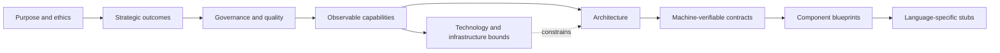

### Nano Banana 2 Visual Prompt-3

- Objective: Show why a DAG is superior to flat documentation for DDR.
- Subject: An abstraction ladder descending from human purpose to implementation scaffolds, with a highlighted merge at architecture.
- Composition: Left-to-right layered diagram, each abstraction zone separated visually, one converging constraint arrow into architecture, clear sense of causal flow.
- Required labels/text: "Purpose", "Strategy", "Governance", "Capability", "Constraint", "Architecture", "Contract", "Design", "Scaffold".
- Style vocabulary: layered technical cutaway, vector systems map, governance-aware architecture board, precise infographic.
- Palette: cool slate and blue foundations, amber constraint path, green downstream validation accents.
- Aspect ratio: 16:9.
- Consistency anchors: crisp labels, exact tier order, minimal gradients, light neutral background, consistent typography.
- Exclusions: no futuristic cityscapes, no UI mockups, no characters, no decorative particles.


---

## 4. The Seven Foundational Axioms

This section applies a fixed review pattern to each axiom: definition, why it exists, exact YAML-backed mechanics, failure mode if absent or misused, authoring guidance, and illustrative scenarios.

### 4.1 AX-1 - Traceability

**Definition:** Every non-root node must cite at least one parent via a typed edge.

**Why it exists:** DDR is supposed to explain why downstream design artifacts exist. Without traceability, the graph becomes an opinionated filing system rather than a justified design system.

**YAML-backed mechanics:**

- `AX-1` is defined in `axioms`.
- `INV-5` requires all non-root nodes to carry at least one `parent_id`.
- `CIT-R1` through `CIT-R4` operationalize parent-citation expectations.
- `ParentCitation` in the schema requires `id` and `edge_type`.

**Failure mode if absent or misused:** orphaned capabilities, components, or stubs can appear with no accountable lineage, destroying auditability.

**Authoring guidance:** when a child exists, record the smallest valid set of immediately preceding authoritative parents. Do not cite distant ancestry merely to decorate the node.

**Illustrative scenarios:**

1. A new `CDL` component appears without an `ICL` parent. DDR treats it as unjustified design surface rather than legitimate implementation preparation.
2. An `ISL` stub cites only a high-level `SIL` objective. The graph loses the intermediate contract and design rationale needed for safe implementation.

### 4.2 AX-2 - Abstraction Ordering

**Definition:** Technology and implementation specificity are deferred until logically necessary.

**Why it exists:** upper tiers should state intent, policy, and behavior, not prejudge implementation choices before the correct decision layer is reached.

**YAML-backed mechanics:**

- `AX-2` states the rule explicitly.
- Upper-tier atomic exclusion rules prohibit technology or implementation detail in `XPD`, `SIL`, `GPCL`, and `FCL`.
- `CL`, `SAL`, `ICL`, `CDL`, and `ISL` progressively admit more concrete detail.

**Failure mode if absent or misused:** strategy and governance become contaminated by framework preferences, making the system brittle under technology change.

**Authoring guidance:** if a sentence names a framework, protocol, language, payload schema, class, or algorithm, confirm the tier actually permits that detail.

**Illustrative scenarios:**

1. A `SIL` node says "use Rust to achieve reliability." That is a `CL` concern, not strategic intent.
2. An `FCL` node embeds JSON payload shape. That belongs in `ICL`, not capability definition.

### 4.3 AX-3 - Determinism

**Definition:** identical inputs produce unambiguous, mechanically verifiable outputs.

**Why it exists:** validation must be reproducible, and operational rules must not rely on hidden interpreter judgment.

**YAML-backed mechanics:**

- Lifecycle rules are centralized in `lifecycle.status_transitions`.
- Canonical operation names are closed in `operations.core_operations`.
- ARE scoring must be reproducible under a declared scoring profile.
- Express unbundling is split into deterministic scan and commit phases.

**Failure mode if absent or misused:** two validators can inspect the same graph and produce conflicting structural conclusions.

**Authoring guidance:** prefer explicit identifiers, explicit tier annotations, explicit status transitions, and explicit review dispositions.

**Illustrative scenarios:**

1. Two auditors run `VERIFY` on the same graph. Deterministic rules ensure they find the same structural violations.
2. An express group contains unlabeled mixed fragments. DDR refuses to guess; `UNBUNDLE_EXECUTE` must reject or defer.

### 4.4 AX-4 - Universality

**Definition:** the Core applies to all software systems regardless of domain, scale, or technology.

**Why it exists:** DDR should govern software reasoning, not encode sector-specific assumptions.

**YAML-backed mechanics:**

- Core tiers are domain-neutral.
- Extension catalog provides specialization without changing Core semantics.
- No Core edge, lifecycle state, or tier is tied to a specific platform stack.

**Failure mode if absent or misused:** the framework becomes a template for one industry rather than a reusable design architecture.

**Authoring guidance:** keep Core content technology- and domain-agnostic unless the tier explicitly requires concrete constraints or contracts.

**Illustrative scenarios:**

1. The same Core can govern a civic portal, embedded service, or internal enterprise platform.
2. Security-specific reasoning belongs in `SCE`, not in a domain-specific rewrite of the Core.

### 4.5 AX-5 - Extensibility

**Definition:** advanced analytical capabilities are delivered exclusively via optional Extensions.

**Why it exists:** Core stability depends on keeping specialized analytics out of the foundational model.

**YAML-backed mechanics:**

- `extension_system` defines permitted and prohibited Extension actions.
- `extension_catalog` enumerates nine optional Extensions.
- `extends` is an edge semantic for extension-to-Core interaction only.

**Failure mode if absent or misused:** advanced tooling becomes mandatory and begins redefining what Core truth means.

**Authoring guidance:** if a behavior reads, infers, scores, recommends, or annotates, it probably belongs in an Extension.

**Illustrative scenarios:**

1. Hardware sizing should be advisory in `HRE`, not a hidden mutation of `CL`.
2. Reverse inference should stage in the ARE candidate pool, not auto-create Core nodes.

### 4.6 AX-6 - Declarative Integrity

**Definition:** the Core is strictly declarative; all inference, optimization, and automated recommendation are Extension-only behaviors.

**Why it exists:** the Core must remain a stable statement of authored truth, not a mix of authored and machine-inferred claims.

**YAML-backed mechanics:**

- `extension_system.prohibited_actions` forbids Extensions from mutating Core semantics.
- `extension_annotations` is a dedicated read-only metadata surface.
- ARE candidates stay outside the Core until promoted through `INSERT`.

**Failure mode if absent or misused:** inferred content can masquerade as authoritative design intent.

**Authoring guidance:** treat Core nodes as declared truth and extension outputs as advisory overlays until formally promoted.

**Illustrative scenarios:**

1. A security engine may flag trust-boundary risk, but it cannot rewrite `SAL`.
2. An AI engine may infer a missing interface, but it cannot silently insert it into the DAG.

### 4.7 AX-7 - DAG Acyclicity

**Definition:** no citation chain may produce a cycle; causality flows in one direction only.

**Why it exists:** cycles destroy termination, obscure accountability, and make downstream reasoning ambiguous.

**YAML-backed mechanics:**

- `AX-7` defines the principle.
- `INV-1` prohibits cycles at any path length.
- `INSERT` and `SUPERSEDE` both trigger cycle checks.

**Failure mode if absent or misused:** validators, lineage analysis, and dependency reasoning can become non-terminating or logically circular.

**Authoring guidance:** cite immediate valid parents only, and never use back-links to make design rationales self-justify.

**Illustrative scenarios:**

1. A contract cannot justify the architecture that justifies the contract.
2. A component blueprint cannot become its own upstream rationale through a chain of indirect citations.

### Nano Banana 2 Visual Prompt-4

- Objective: Create a single visual summary of the seven axioms as governing laws of the DDR Core.
- Subject: Seven technical panels or cards arranged around a central DDR graph, one per axiom.
- Composition: Centered Core DAG with seven surrounding law cards, each card showing title, effect, and a small caution icon for failure mode.
- Required labels/text: "AX-1 Traceability", "AX-2 Abstraction Ordering", "AX-3 Determinism", "AX-4 Universality", "AX-5 Extensibility", "AX-6 Declarative Integrity", "AX-7 DAG Acyclicity".
- Style vocabulary: enterprise governance infographic, technical law-sheet, crisp vector panels, exact text rendering.
- Palette: navy and slate base, teal highlights, amber caution accents, green validation accents.
- Aspect ratio: 16:9.
- Consistency anchors: clean labels, modular card layout, light background, thin connector lines to the center graph.
- Exclusions: no fantasy symbols, no legal courtroom imagery, no dense paragraph text blocks, no abstract collage.


---

## 5. Core Structural Model

### 5.1 Universal Node Format

**Definition:** every Core node shares a common structural skeleton.

```text
[TIER]-[N].[M]: [Title]
  status: ACTIVE | DRAFT | DIRTY | DEPRECATED | SUPERSEDED | SUPERSEDE_PENDING
  prior_status: [ACTIVE | DEPRECATED | DIRTY]  # only during SUPERSEDE_PENDING
  version: [SemVer]
  created: [ISO 8601]
  modified: [ISO 8601]
  parent_ids: [{id, edge_type, derivation_mode?}, ...]
  content: [tier-constrained body]
```

**Why it exists:** a common node envelope lets tools validate and traverse very different design artifacts without inventing tier-specific object models from scratch.

**Exact mechanics:**

- Required base fields in `DdrNode`: `id`, `tier`, `title`, `status`, `version`, `created`, `modified`.
- Optional fields become conditionally required in specific states or tiers:
  - `prior_status` when `status == SUPERSEDE_PENDING`
  - `constraint_origin` for `CL`
  - `express_mode_group` for `project_instance_express`
- `extension_annotations` is a dedicated namespace for extension-owned metadata.

**Failure mode if absent or misused:** tools cannot reliably validate lifecycle, lineage, or extension boundaries.

**Authoring guidance:** treat the universal node format as the minimum compliance envelope before you reason about content quality.

### 5.2 Node ID format

**Definition:** IDs follow `[TIER]-[SECTION].[ITEM]`, with `XPD` using section `0`.

**Why it exists:** immutable IDs are the audit anchor for lineage, versioning, supersession, and reconciliation tracking.

**Exact mechanics:**

- General pattern in the specification: `[TIER]-[SECTION].[ITEM]`
- `XPD` pattern: `XPD-0.N`
- Tier-specific schema patterns enforce `SIL-*`, `GPCL-*`, `FCL-*`, `CL-*`, `SAL-*`, `ICL-*`, `CDL-*`, `ISL-*`
- ID mutation is prohibited, including during relocation-like operations

**Failure mode if absent or misused:** audit history, parent references, and supersession chains become unstable.

**Authoring guidance:** replacement nodes always receive new IDs; do not overload status changes to preserve identity while changing substance.

### 5.3 Edge types

#### `derives`

- `Definition:` child content is derived from parent requirements or the parent is cited as authoritative lineage.
- `Why it exists:` it captures both semantic inheritance and traceability without creating a separate citation edge type.
- `Mechanics:` `derivation_mode` may be `semantic` or `traceability`, but only when `edge_type == derives`.
- `Failure mode:` omission of `derivation_mode` on authority-only citations can blur behavioral derivation versus lineage trace.
- `Authoring guidance:` use `traceability` only when the edge is carrying lineage authority rather than direct semantic derivation.
- `Illustrative scenarios:`
  - `GPCL -> FCL` usually carries semantic derivation.
  - `SIL -> GPCL` may carry traceability where governance is anchored to strategic intent.

#### `constrains`

- `Definition:` a parent sets enforceable bounds on a child's design space.
- `Why it exists:` constraints are not merely derived ideas; they shape allowable solutions.
- `Mechanics:` appears in `parent_ids` for `SAL` when `CL` is active.
- `Failure mode:` architecture may look traceable but still ignore non-negotiable physical or mandated bounds.
- `Authoring guidance:` use `constrains` for binding external or selected limits, not as a stylistic substitute for `derives`.
- `Illustrative scenarios:`
  - a deployment ceiling in `CL` constrains partitioning choices in `SAL`
  - a mandated runtime environment constrains allowable service topology

#### `implements`

- `Definition:` a child provides concrete realization of an abstract specification.
- `Why it exists:` downstream artifacts should not pretend they merely derive when they actually operationalize or encode structure concretely.
- `Mechanics:` canonical uses are `ICL -> CDL` and `CDL -> ISL`.
- `Failure mode:` contracts and designs lose the clarity of realization boundaries.
- `Authoring guidance:` use `implements` when the child is materially more concrete and fulfills the parent's declared shape.
- `Illustrative scenarios:`
  - `CDL` implements `ICL` contracts in component-level blueprints
  - `ISL` implements `CDL` structure as compileable scaffolds

#### `extends`

- `Definition:` an Extension reads or annotates a Core node without mutating it.
- `Why it exists:` extension interaction must be visible without turning extension activity into Core lineage.
- `Mechanics:` not stored in `parent_ids`; reflected through `extension_annotations` and extension architecture rules.
- `Failure mode:` extension advice can be mistaken for Core authority.
- `Authoring guidance:` never mix `extends` into Core citation surfaces.
- `Illustrative scenarios:`
  - `SCE` annotates `ICL` with RBAC policy analysis
  - `ORE` annotates `SAL` and `ISL` with telemetry advisories

### Mermaid: Edge semantics

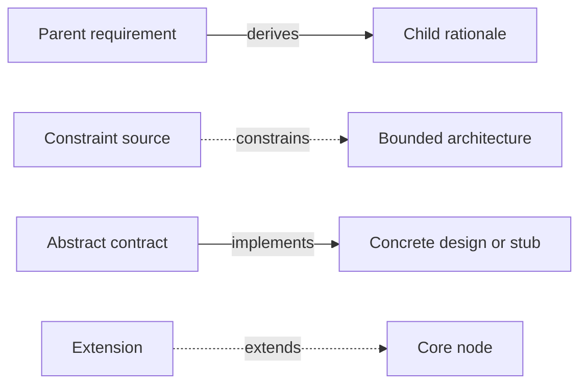

### 5.4 Core DAG topology

**Definition:** the v6.3 Core uses nine active tiers in canonical order when both optional tiers are active.

**Why it exists:** topology is the structural backbone that lets DDR distinguish purpose, governance, capability, constraint, architecture, contracts, design, and scaffolding cleanly.

**Exact mechanics:**

- Representative nodes in the system definition:
  - `XPD-0.1`
  - `SIL-1.1`
  - `GPCL-2.1`
  - `FCL-3.1`
  - `CL-4.1`
  - `SAL-5.1`
  - `ICL-6.1`
  - `CDL-7.1`
  - `ISL-8.1`
- `SAL` is the only merge node.
- `CL` is optional, but when active it constrains `SAL`.
- `XPD` is optional, but when active it is the root.

### Mermaid: Universal node anatomy

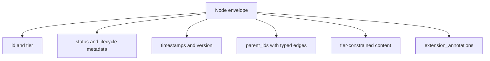

### Mermaid: SAL merge-node behavior

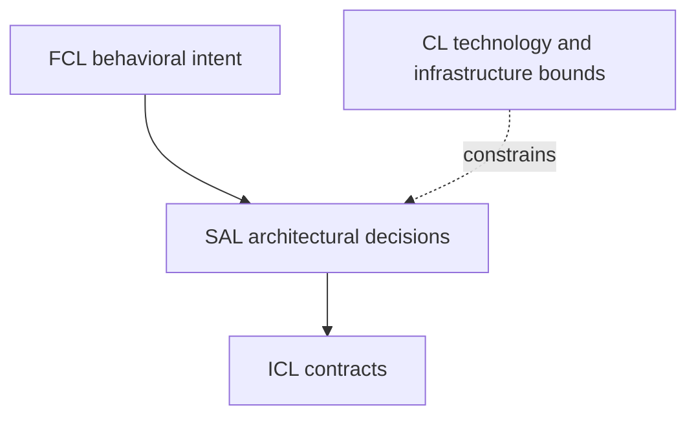

### 5.5 DAG invariants

#### `INV-1`
- `Definition:` no cycles permitted at any path length.
- `Why it exists:` guarantees termination and causal clarity.
- `Mechanics:` cycle detection is part of structural validation and mutation validation.
- `Failure mode:` endless traversal or circular justification.
- `Authoring guidance:` never use downstream nodes as upstream authority.
- `Illustrative scenario:` a design cannot indirectly justify the requirement that created it.

#### `INV-2`
- `Definition:` no tier-skipping; citations target the immediately preceding active tier, with `SAL` as the exhaustive merge-node exception.
- `Why it exists:` each tier must add real semantic value.
- `Mechanics:` `CIT-R2` and topology checks enforce adjacency.
- `Failure mode:` hidden pass-through tiers with no independent meaning.
- `Authoring guidance:` route reasoning through each mandatory mediation layer.
- `Illustrative scenario:` an `ISL` stub cannot cite `SIL` directly.

#### `INV-3`
- `Definition:` `active_tiers` must be one of four canonical ordered variants.
- `Why it exists:` avoids ad hoc topology invention.
- `Mechanics:` the schema's `active_tiers.oneOf` encodes the only legal variants.
- `Failure mode:` validators and tooling cannot assume a stable topology.
- `Authoring guidance:` activate only the sanctioned optional combinations.
- `Illustrative scenario:` a graph cannot omit `ICL` while keeping `CDL`.

#### `INV-4`
- `Definition:` when `CL` is inactive, `SAL` derives directly from `FCL`.
- `Why it exists:` architecture still needs an immediate parent even when explicit constraints are absent.
- `Mechanics:` canonical topology and parent relationships encode this path.
- `Failure mode:` architecture becomes rootless or incorrectly waits for optional constraint content.
- `Authoring guidance:` do not fabricate a `CL` tier merely to satisfy adjacency.
- `Illustrative scenario:` an unconstrained prototype still requires `FCL -> SAL`.

#### `INV-5`
- `Definition:` all non-root nodes must have at least one `parent_id`.
- `Why it exists:` operational form of `AX-1`.
- `Mechanics:` schema `minItems`, citation rules, and root semantics.
- `Failure mode:` orphaned nodes.
- `Authoring guidance:` validate roots explicitly and everything else transitively.
- `Illustrative scenario:` deleting a parent may force child reattachment or deletion.

#### `INV-6`
- `Definition:` `SUPERSEDE` must be atomic; partial application is a structural violation.
- `Why it exists:` lineage rewiring cannot leave the graph in a half-replaced state.
- `Mechanics:` `SUPERSEDE_PENDING`, `prior_status`, commit and rollback guards, and `VERIFY` handling.
- `Failure mode:` children point partly to old and new nodes or source nodes remain stranded mid-operation.
- `Authoring guidance:` treat supersession as a transaction, not a sequence of informal edits.
- `Illustrative scenario:` a failed replacement insertion must roll back cleanly.

#### `INV-7`
- `Definition:` structural validity may coexist with declared semantic gaps only when explicitly recorded under allowed classifications with rationale and resolution or waiver before CLEAN.
- `Why it exists:` DDR distinguishes structural truth from unresolved semantic judgment.
- `Mechanics:` semantic gap classification is defined in the reconciliation manifest schema.
- `Failure mode:` teams quietly normalize unresolved conceptual defects.
- `Authoring guidance:` log allowed gaps explicitly and close them before declaring the graph clean.
- `Illustrative scenario:` a `MISSING_MEDIATOR` may exist temporarily but cannot disappear into silence.

#### `INV-8`
- `Definition:` lifecycle transitions must form a complete, closed state machine.
- `Why it exists:` lifecycle ambiguity produces inconsistent tooling and operator behavior.
- `Mechanics:` `lifecycle.status_transitions` is the sole authority.
- `Failure mode:` undefined transitions are interpreted differently by different tools.
- `Authoring guidance:` never rely on prose-only lifecycle assumptions outside the transition table.
- `Illustrative scenario:` `SUPERSEDE_PENDING` can only commit or roll back, not wander to arbitrary statuses.

### Mermaid: Invariant and exception map

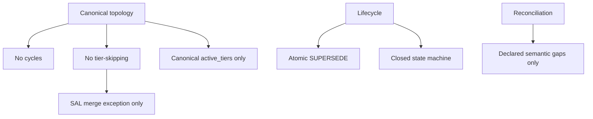

### 5.6 Citation rules

| Rule ID | Function |
| --- | --- |
| `CIT-R1` | Non-root nodes require at least one parent citation. |
| `CIT-R2` | Parent citations target the immediately preceding active tier, with `derivation_mode` allowed only for `derives`. |
| `CIT-R3` | `CL -> SAL` constraint edges are recorded with `edge_type: constrains`. |
| `CIT-R4` | Inline `[TIER-N.M]` citations in content must match `parent_ids`. |
| `CIT-R5` | Extension `extends` relationships belong in `extension_annotations`, never `parent_ids`. |
| `CIT-R6` | Authority-only `derives` citations must set `derivation_mode: traceability`. |
| `CIT-R7` | Children cannot remain `ACTIVE` against stale cited parent content. |

### 5.7 Illustrative scenarios

1. `Illustrative scenario - stale parent freshness`
   A parent `MODIFY` occurs. `CIT-R7` ensures children must be revalidated before they can continue to claim `ACTIVE` validity.
2. `Illustrative scenario - illegal extension citation`
   An extension tries to store advisory lineage in `parent_ids`; DDR rejects this because extension influence must not mutate Core structural semantics.

### Nano Banana 2 Visual Prompt-5

- Objective: Render the Core structural model of DDR as a precise technical explainer.
- Subject: A labeled DDR node, edge semantics strip, merge-node callout, and invariant control panel.
- Composition: Four-panel infographic with universal node anatomy, edge examples, SAL merge diagram, and invariant summary.
- Required labels/text: "Universal Node Format", "derives", "constrains", "implements", "extends", "INV-1", "INV-2", "INV-6", "CIT-R7".
- Style vocabulary: technical manual infographic, crisp vector architecture, exact label rendering, layered explanation board.
- Palette: steel blue, slate, teal, amber, restrained green.
- Aspect ratio: 16:9.
- Consistency anchors: clean white background, high text legibility, straight connector logic, modular panels.
- Exclusions: no soft watercolor, no human figures, no dark mode dashboard, no decorative noise.


---

## 6. Lifecycle, Guards, and Atomic Operations

### 6.1 Status model

DDR nodes use six Core statuses:

- `<span style="color:#d97706"><strong>DRAFT</strong></span>`: structurally present but not yet accepted as active truth
- `<span style="color:#16a34a"><strong>ACTIVE</strong></span>`: validated and current
- `<span style="color:#d97706"><strong>DIRTY</strong></span>`: requires re-validation due to direct or propagated change
- `<span style="color:#6b7280"><strong>DEPRECATED</strong></span>`: valid but scheduled for retirement or replacement
- `<span style="color:#374151"><strong>SUPERSEDED</strong></span>`: replaced, retained for lineage
- `<span style="color:#2563eb"><strong>SUPERSEDE_PENDING</strong></span>`: transient in-flight supersession state

### Mermaid: Lifecycle state machine

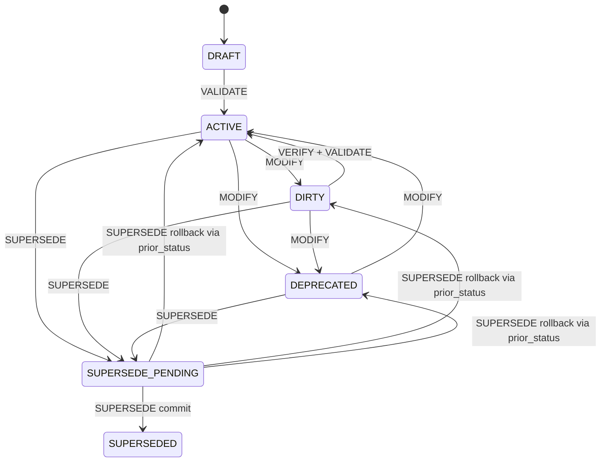

### 6.2 Guard definitions

| Guard ID | Verification mode | Meaning |
| --- | --- | --- |
| `gc-001` | structural | All structural rules for the node pass validation. |
| `gc-002` | manual | Deprecation rationale is explicitly documented. |
| `gc-003` | manual | Any previously set deprecation sunset date is cleared. |
| `gc-004` | manual | Status reversal is logged in the reconciliation manifest. |
| `gc-005` | structural | All review items are resolved. |
| `gc-006` | structural | Per-node validation scope is explicitly confirmed. |
| `gc-007` | structural | `prior_status` must be set correctly before entering `SUPERSEDE_PENDING`. |
| `gc-008` | structural | Replacement node inserted, children rewired, children set `DIRTY`, `prior_status` cleared. |
| `gc-009` | structural | On failure, source reverts to `prior_status`, replacement removed if needed, `SUPERSEDE_FAILED` logged. |

### 6.3 Atomic operations

#### `INSERT`

- `Definition:` create a node with assigned ID, parent citations, and tier-compliant content.
- `Why it exists:` the graph needs a disciplined way to grow without bypassing validation.
- `Mechanics:` supports forward and reverse direction; triggers full atomic ruleset validation, parent existence checks, and cycle detection.
- `Failure mode:` invalid or cyclic nodes enter the graph.
- `Authoring guidance:` insert only when you know the immediate parent tier and the child's rule surface.
- `Illustrative scenarios:`
  - create a new `ICL` contract from accepted `SAL` architecture
  - promote an ARE candidate only through full `INSERT`

#### `DELETE`

- `Definition:` remove a node and trigger orphan detection for children.
- `Why it exists:` removal must not silently invalidate descendants.
- `Mechanics:` children become `DIRTY`; orphaned children must resolve through reattachment, cascade deletion, or supersede-like replacement logic.
- `Failure mode:` dangling child references.
- `Authoring guidance:` treat deletion as a reconciliation event, not a text edit.
- `Illustrative scenarios:`
  - removing a deprecated component blueprint forces child stub resolution
  - deleting a constraint source may require architectural review

#### `MODIFY`

- `Definition:` update content and increment version.
- `Why it exists:` DDR needs a formal way to represent change without erasing lineage.
- `Mechanics:` revalidates rules, rechecks citations, and propagates `DIRTY` to descendants.
- `Failure mode:` stale descendants continue claiming validity.
- `Authoring guidance:` assume any meaningful upstream change has downstream consequences until validation proves otherwise.
- `Illustrative scenarios:`
  - changing a latency threshold in `GPCL`
  - refining error payload structure in `ICL`

#### `SUPERSEDE`

- `Definition:` replace a node atomically while preserving old identity for history.
- `Why it exists:` replacement is different from mutation; historical identity must remain intact.
- `Mechanics:` source enters `SUPERSEDE_PENDING`, replacement is inserted and validated, children are rewired, children become `DIRTY`, source becomes `SUPERSEDED`, or rollback restores the source using `prior_status`.
- `Failure mode:` partial rewiring corrupts the graph.
- `Authoring guidance:` use supersession for replacement, not for ordinary revision.
- `Illustrative scenarios:`
  - replacing a deprecated API contract with a new versioned contract
  - replacing a component blueprint while preserving audit history

#### `VERIFY`

- `Definition:` traverse the graph downward and evaluate structural and declared cross-node consistency conditions.
- `Why it exists:` full-graph coherence cannot be proven by single-node validation alone.
- `Mechanics:` checks citations, references, cycles, contamination, and optional semantic consistency review surfaces; emits `DIRTY`, `CLEAN`, or `REVIEW_REQUIRED`-related findings in reconciliation output.
- `Failure mode:` teams confuse local node validity with graph validity.
- `Authoring guidance:` run `VERIFY` after meaningful structural change and before claiming system-level cleanliness.
- `Illustrative scenarios:`
  - detect a direct `GPCL -> SAL` dependency lacking an `FCL` mediator
  - surface a `SUPERSEDE_PENDING_DETECTED` blocking item

#### `VALIDATE`

- `Definition:` evaluate one node against its tier's atomic ruleset.
- `Why it exists:` node-level acceptance must be distinct from graph-wide cleanliness.
- `Mechanics:` structural rules are evaluated mechanically; semantic rules emit `REVIEW_REQUIRED` items that need human disposition before `DRAFT -> ACTIVE`.
- `Failure mode:` structurally invalid or semantically unreviewed nodes become active truth.
- `Authoring guidance:` always distinguish "structurally valid" from "semantically reviewed."
- `Illustrative scenarios:`
  - an `FCL` node passes structure but emits `REVIEW_REQUIRED` for user-observable framing
  - an `XPD` node requires readability review for non-technical comprehensibility

#### `UNBUNDLE_SCAN`

- `Definition:` read-only pre-flight scan of an Express Mode group.
- `Why it exists:` DDR refuses ambiguous decomposition.
- `Mechanics:` emits per-fragment diagnostics with `fragment_id`, preview, detected annotation, confidence, and ambiguity reason.
- `Failure mode:` ambiguous express content is split inconsistently by different tools or authors.
- `Authoring guidance:` use explicit tier tags in mixed express groups before attempting execution.
- `Illustrative scenarios:`
  - a fragment tagged `[FCL]` yields `high` confidence
  - an unlabeled fragment in `G2` yields `none`

#### `UNBUNDLE_EXECUTE`

- `Definition:` atomic commit-phase expansion of an Express Mode group into constituent Full Mode tiers.
- `Why it exists:` presentation bundling should be reversible without information loss or improvisation.
- `Mechanics:` succeeds only when each fragment is high-confidence or explicitly deferred; rejection is atomic and returns the full scan payload.
- `Failure mode:` authors silently invent missing structure during expansion.
- `Authoring guidance:` defer ambiguous fragments explicitly or rewrite them before execution.
- `Illustrative scenarios:`
  - `G3` cleanly splits into `SAL` and `ICL`
  - a mixed governance/capability paragraph blocks `G2` execution

### Mermaid: SUPERSEDE commit and rollback

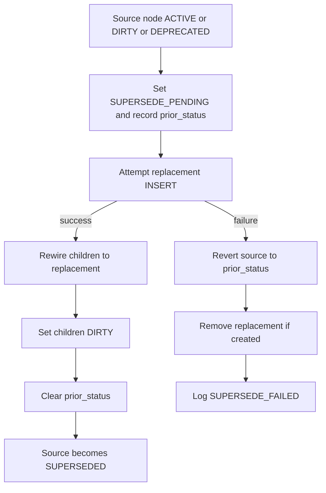

### Mermaid: DIRTY propagation

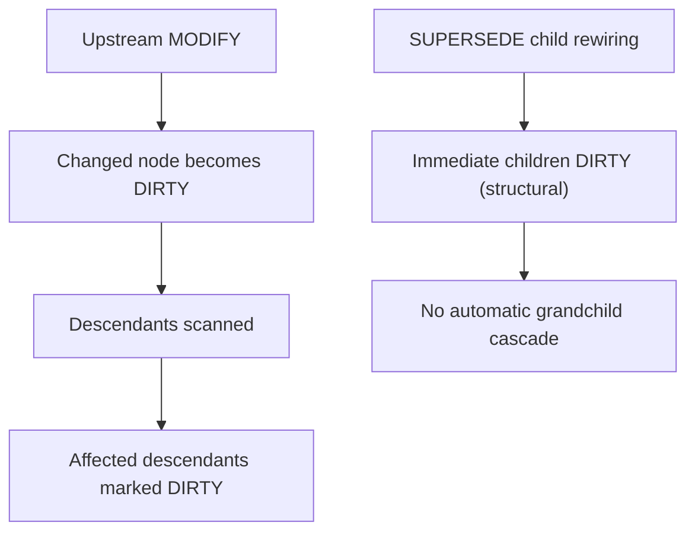

### 6.4 Why the lifecycle design is technically strong

- It centralizes transition authority in one place.
- It models rollback explicitly rather than assuming success.
- It distinguishes structural validation from semantic review.
- It refuses to let hidden partial states masquerade as stable graph truth.

### Nano Banana 2 Visual Prompt-6

- Objective: Visualize DDR lifecycle control as a formal state and transaction system.
- Subject: A clean state machine plus a supersede transaction lane with commit and rollback.
- Composition: Left side state machine, right side transaction swimlane, bottom strip showing DIRTY propagation behavior.
- Required labels/text: "DRAFT", "ACTIVE", "DIRTY", "DEPRECATED", "SUPERSEDE_PENDING", "SUPERSEDED", "gc-007", "gc-008", "gc-009", "VERIFY", "VALIDATE".
- Style vocabulary: systems operations diagram, transaction control infographic, formal workflow board, precise labels.
- Palette: blue and slate base, green for success, amber for DIRTY, gray for retirement states, red only for failure callouts.
- Aspect ratio: 16:9.
- Consistency anchors: exact status names, readable arrows, clean lane separation, light neutral background.
- Exclusions: no cinematic drama, no server-room photos, no metaphorical icons replacing state names.


---

## 7. Consumption Modes and Express Unbundling

### 7.1 Full Mode

`Full Mode` means every active tier is represented independently. It is the clearest mode for high-control environments because every abstraction boundary is explicit in the authored graph.

### 7.2 Express Mode

`Express Mode` is not a reduced DDR. It is a grouped presentation of the same model. The four groups are:

| Group ID | Tiers | Label |
| --- | --- | --- |
| `G1` | `XPD`, `SIL`, `GPCL` | Purpose, Strategy and Governance |
| `G2` | `FCL`, `CL` | Capabilities and Constraints |
| `G3` | `SAL`, `ICL` | Architecture and Contracts |
| `G4` | `CDL`, `ISL` | Design and Scaffolding |

### 7.3 Why the two-phase unbundle design matters

`UNBUNDLE_SCAN` and `UNBUNDLE_EXECUTE` exist because grouped content is only safe when its decomposition is explicit and deterministic. The scan phase diagnoses ambiguity; the execute phase commits only if the ambiguity problem is already resolved or explicitly deferred.

### 7.4 Deferred fragment handling

Fragments classified as `ambiguous` or `none` may be marked `[DEFER]` with recorded human rationale. DDR allows deferral but does not allow silent guessing.

### 7.5 Illustrative scenarios

1. `Illustrative scenario - startup adopting DDR quickly`
   A team authors `G3` as one grouped node early, then later expands it into `SAL` and `ICL` when contract precision becomes necessary.
2. `Illustrative scenario - ambiguous mixed paragraph`
   One paragraph discusses both user behavior and deployment runtime mandates. `UNBUNDLE_SCAN` cannot classify it cleanly, so `UNBUNDLE_EXECUTE` must reject unless it is deferred or rewritten.

### Mermaid: Express unbundle flow

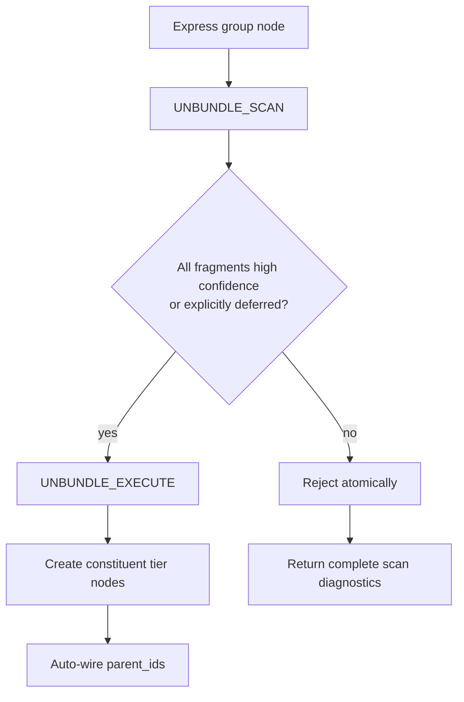

### Nano Banana 2 Visual Prompt-7

- Objective: Explain Express Mode as grouped presentation rather than a reduced DDR variant.
- Subject: Four grouped cards on the left and their expanded nine-tier graph on the right.
- Composition: Before-and-after transformation view, center callout for `UNBUNDLE_SCAN` and `UNBUNDLE_EXECUTE`, explicit deferred fragment note.
- Required labels/text: "G1", "G2", "G3", "G4", "UNBUNDLE_SCAN", "UNBUNDLE_EXECUTE", "deferred fragment", "deterministic expansion".
- Style vocabulary: transformation infographic, technical process poster, crisp grouped-to-expanded diagram.
- Palette: blue-gray base, teal grouping accents, amber warning for ambiguity, green for successful expansion.
- Aspect ratio: 16:9.
- Consistency anchors: exact group labels, exact operation names, white background, strong connector logic.
- Exclusions: no folding-paper metaphor, no cartoon panels, no cluttered annotations.


---

## 8. Tier-by-Tier Technical Reference

Every tier subsection below uses the same review frame: definition, purpose, exact mechanics, failure mode, authoring guidance, and illustrative scenarios.

### 8.1 XPD - Existential Purpose Document

**Definition:** optional root tier addressing the human or societal need and ethical boundaries of the system.

**Why it exists:** some systems need a formally articulated ethical boundary condition that outranks convenience or local optimization.

**Exact mechanics:**

- `is_optional: true`
- root when active
- child tier: `SIL`
- inclusion rules: `XPD-R1` through `XPD-R6`
- exclusion rules: `XPD-E1` through `XPD-E3`

**Failure mode if absent or misused:** systems with real external impact may proceed without explicit ethical limits.

**Authoring guidance:** activate `XPD` when ethical impact is not none or societal scale exceeds personal; keep it free of solutioning and quantitative performance detail.

**Illustrative scenarios:**

1. A public-facing AI tool uses `XPD` to define harm boundaries and safeguard obligations.
2. An internal one-off utility skips `XPD` because external ethical scope is absent.

### Nano Banana 2 Visual Prompt-8

- Objective: Depict XPD as the ethical and existential root of DDR when active.
- Subject: A single root document radiating ethical guardrails into the rest of the DDR graph.
- Composition: Top root node with downward influence lines, side callouts for human need, ethical boundary, success criteria, and harmed populations.
- Required labels/text: "XPD", "human or societal need", "ethical boundaries", "success criteria", "harm safeguards".
- Style vocabulary: ethics-aware architecture infographic, formal root-node poster, crisp vector labels.
- Palette: deep blue with teal and amber boundary accents.
- Aspect ratio: 16:9.
- Consistency anchors: exact DDR terminology, light background, simple clear structure.
- Exclusions: no courtroom symbolism, no religious iconography, no abstract moral allegory.


### 8.2 SIL - Strategic Intent Layer

**Definition:** mandatory intent layer stating why the system exists and what outcomes it must achieve.

**Why it exists:** strategy must be explicit before governance and functionality become meaningful.

**Exact mechanics:** root when `XPD` is inactive; child tier is `GPCL`; inclusion rules `SIL-R1` to `SIL-R6`; exclusions `SIL-E1` to `SIL-E4`.

**Failure mode:** governance lacks strategic anchor and scope boundaries blur.

**Authoring guidance:** state business problem, objectives, stakeholders, scope boundaries, and success metrics without leaking technology or compliance detail.

**Illustrative scenarios:**

1. A modernization effort uses `SIL` to define service consolidation outcomes before any tool choice appears.
2. A team attempts to specify framework preference in `SIL`; DDR treats it as contamination.

### Nano Banana 2 Visual Prompt-9

- Objective: Visualize strategic intent as the bridge between purpose and governance.
- Subject: Strategic intent layer card showing business problem, measurable outcomes, stakeholders, and scope.
- Composition: Layered board between XPD and GPCL with arrows up and down, compact metric and scope panels.
- Required labels/text: "SIL", "business problem", "measurable outcomes", "stakeholders", "scope boundaries".
- Style vocabulary: strategy canvas infographic, enterprise planning board, clean editorial diagram.
- Palette: blue, slate, teal with restrained amber emphasis.
- Aspect ratio: 16:9.
- Consistency anchors: exact terms, clean labels, light background.
- Exclusions: no startup whiteboard doodles, no marketing stock photography.


### 8.3 GPCL - Governance, Policy and Quality Layer

**Definition:** mandatory governance tier for regulatory, policy, contractual, and measurable quality constraints.

**Why it exists:** governance is semantically distinct from both business purpose and user-observable behavior.

**Exact mechanics:**

- parent: `SIL`
- child: `FCL`
- inclusion rules: `GPCL-R1` through `GPCL-R10` plus `GPCL-FCL-BR1`
- exclusion rules: `GPCL-E1` through `GPCL-E3`

**Failure mode:** capabilities and architecture operate without enforceable external obligations.

**Authoring guidance:** keep governance enforceable and testable; distinguish regulatory and operational thresholds from desired behavior.

**Illustrative scenarios:**

1. A data-residency requirement belongs in `GPCL`, not `SAL`.
2. A performance target requires either a real `FCL` mediator or a logged `MISSING_MEDIATOR`.

### Nano Banana 2 Visual Prompt-10

- Objective: Show GPCL as the non-negotiable governance and quality layer.
- Subject: Governance panel with regulatory, residency, audit, security, and performance requirement cards feeding capability design.
- Composition: Central GPCL card with multiple external mandate inputs and one downward capability mediation path.
- Required labels/text: "GPCL", "regulatory frameworks", "data residency", "audit retention", "latency and throughput", "MISSING_MEDIATOR".
- Style vocabulary: compliance architecture infographic, policy control board, exact text rendering.
- Palette: navy, slate, teal, amber, limited red for blocking governance risk.
- Aspect ratio: 16:9.
- Consistency anchors: crisp labels, light background, strong control-line geometry.
- Exclusions: no legal scales, no courthouse imagery, no overloaded paragraph blocks.


### 8.4 FCL - Functional Capability Layer

**Definition:** mandatory functional tier for externally observable behavior and user-facing capabilities.

**Why it exists:** behavior must be defined independently of specific implementation mechanisms.

**Exact mechanics:**

- parent: `GPCL`
- children: `SAL`, and `CL` if active
- inclusion rules: `FCL-R1` through `FCL-R7`
- exclusion rules: `FCL-E1` through `FCL-E3`

**Failure mode:** architecture starts from implementation detail rather than behavior.

**Authoring guidance:** write capabilities from the perspective of users or external systems; capture workflows, states, errors, and data entity CRUD relationships without schema detail.

**Illustrative scenarios:**

1. "User uploads a file and receives a single-use link" is `FCL`; "use S3 multipart upload" is not.
2. A persistent data capability must enumerate entities and CRUD roles at `FCL-R7` without introducing field schemas.

### Nano Banana 2 Visual Prompt-11

- Objective: Depict FCL as behavior, workflows, and user-observable state transitions.
- Subject: Capability map with user actions, state changes, and error branches, isolated from implementation detail.
- Composition: Flow-oriented panel with capability nodes, user-system interactions, and logical data entities listed as neutral nouns.
- Required labels/text: "FCL", "user-observable behavior", "workflow", "state transition", "error condition", "CRUD entity list".
- Style vocabulary: capability map infographic, service behavior board, clean vector flow design.
- Palette: blue and teal base with amber error-path accents.
- Aspect ratio: 16:9.
- Consistency anchors: light background, exact terminology, no implementation tokens.
- Exclusions: no code blocks, no API payloads, no server logos.


### 8.5 CL - Constraint Layer

**Definition:** optional constraint tier for technology selections, hardware envelopes, and infrastructure ceilings.

**Why it exists:** some systems must declare non-negotiable implementation bounds before architecture is chosen.

**Exact mechanics:**

- parent: `FCL` when active
- child relation: constrains `SAL`
- `constraint_origin` must be `derived` or `imposed`
- inclusion rules: `CL-R1` through `CL-R10`, including `CL-R9` and `CL-R9-imposed`
- exclusion rules: `CL-E1` through `CL-E3`

**Failure mode:** architecture assumes freedoms that the deployment reality or mandate structure does not allow.

**Authoring guidance:** distinguish selected constraints from imposed constraints and cite them accordingly.

**Illustrative scenarios:**

1. A procurement-mandated cloud restriction is `constraint_origin: imposed`.
2. A chosen runtime language driven by capability needs is `constraint_origin: derived`.

### Nano Banana 2 Visual Prompt-12

- Objective: Show CL as the formal boundary box around architectural possibility.
- Subject: Constraint panel containing language, framework, runtime, hardware, bandwidth, and topology ceilings feeding SAL.
- Composition: Architectural bounding box around a design space with a separate callout for `derived` versus `imposed`.
- Required labels/text: "CL", "constraint_origin", "derived", "imposed", "runtime", "hardware envelope", "infrastructure ceiling".
- Style vocabulary: bounded design-space infographic, technical constraints board, precise labels.
- Palette: cool blue-gray with amber bounding edges and red callouts only for prohibited technologies.
- Aspect ratio: 16:9.
- Consistency anchors: exact field names, light background, clear separation of constraint classes.
- Exclusions: no hardware glamour shots, no brand logos, no financial dashboard styling.


### 8.6 SAL - System Architecture Layer

**Definition:** mandatory merge-node architecture tier for system decomposition and interaction patterns.

**Why it exists:** architecture is where capabilities and constraints become structural decisions.

**Exact mechanics:**

- parents: `FCL` and `CL` if active
- child: `ICL`
- merge node: yes
- inclusion rules: `SAL-R1` through `SAL-R6`
- exclusion rules: `SAL-E1` through `SAL-E3`

**Failure mode:** architecture becomes either unconstrained behavior prose or prematurely detailed design.

**Authoring guidance:** describe subsystem decomposition, communication patterns, concurrency, ownership, resilience, and rationale, but keep exact schema and class blueprint detail out.

**Illustrative scenarios:**

1. A queue-based asynchronous architecture is justified in `SAL` because it reconciles behavior and throughput constraints.
2. A payload schema belongs downstream in `ICL`, not in `SAL`.

### Nano Banana 2 Visual Prompt-13

- Objective: Make SAL's merge-node role unmistakable.
- Subject: Architecture diagram where functional requirements and constraints converge into subsystem decomposition.
- Composition: Central architecture block receiving one behavioral input lane and one constraint lane, then emitting contract boundaries.
- Required labels/text: "SAL", "merge node", "architectural pattern", "subsystem boundaries", "concurrency", "resilience".
- Style vocabulary: architecture blueprint poster, merge-node systems diagram, clean vector cutaway.
- Palette: navy, slate, teal, amber constraint lane, restrained green downstream flow.
- Aspect ratio: 16:9.
- Consistency anchors: exact labels, light background, simple geometry, no extraneous decoration.
- Exclusions: no UML class clutter, no code snippets, no photorealistic data center art.


### 8.7 ICL - Interface and Contracts Layer

**Definition:** mandatory contract tier for machine-parseable interface definitions and exchange rules.

**Why it exists:** architecture cannot be implemented coherently without explicit contract boundaries.

**Exact mechanics:**

- parent: `SAL`
- child: `CDL`
- inclusion rules: `ICL-R1` through `ICL-R7`
- exclusion rules: `ICL-E1` through `ICL-E3`

**Failure mode:** integration points become ambiguous or incompatible across implementations.

**Authoring guidance:** define schemas, protocols, encoding, versioning, and error contracts precisely; keep internal logic and architecture-level routing patterns out.

**Illustrative scenarios:**

1. A protobuf or OpenAPI contract belongs in `ICL`.
2. An internal component lifecycle strategy belongs in `CDL`, not `ICL`.

### Nano Banana 2 Visual Prompt-14

- Objective: Show ICL as the exact contract boundary layer between architecture and component design.
- Subject: Contract board with request/response schemas, error payloads, versioning notes, and protocol labels.
- Composition: Central contract document surrounded by producer and consumer boundaries, clear machine-parseable schema motifs.
- Required labels/text: "ICL", "machine-parseable schema", "versioning strategy", "error contract", "protocol", "encoding".
- Style vocabulary: interface specification infographic, precise contract architecture, clean editorial panel.
- Palette: cool blue, slate, teal, small amber highlights for version changes.
- Aspect ratio: 16:9.
- Consistency anchors: exact DDR terms, crisp labels, light background.
- Exclusions: no runtime logs, no terminal screenshots, no cartoon API icons.


### 8.8 CDL - Component Design Layer

**Definition:** mandatory component blueprint tier for public signatures, internal state models, dependencies, and lifecycle contracts.

**Why it exists:** systems need one layer where implementation-relevant structure is explicit but executable logic is still withheld.

**Exact mechanics:**

- parent: `ICL` with `implements`
- child: `ISL`
- inclusion rules: `CDL-R1` through `CDL-R7`
- exclusion rules: `CDL-E1` through `CDL-E3`

**Failure mode:** developers jump from contracts directly to code with no accountable component blueprint.

**Authoring guidance:** specify names, responsibilities, interfaces, state, dependencies, and lifecycle behavior while keeping code bodies out.

**Illustrative scenarios:**

1. A service object with defined public signatures and teardown rules belongs in `CDL`.
2. Full algorithm logic still belongs downstream of this layer.

### Nano Banana 2 Visual Prompt-15

- Objective: Depict CDL as the component blueprint layer immediately before scaffolding.
- Subject: Component blueprint sheet with signatures, dependencies, state models, and lifecycle hooks.
- Composition: Structured blueprint board with three or four component cards, arrows to contracts above and stubs below.
- Required labels/text: "CDL", "public signatures", "internal state model", "dependencies", "lifecycle", "implements ICL".
- Style vocabulary: software blueprint infographic, formal design sheet, precise vector panels.
- Palette: slate and blue base, teal accents, limited amber for lifecycle hooks.
- Aspect ratio: 16:9.
- Consistency anchors: readable labels, clean white background, modular card layout.
- Exclusions: no executable code bodies, no UML overload, no messy handwritten notes.


### 8.9 ISL - Implementation Scaffold Layer

**Definition:** mandatory terminal tier for syntactically valid, language-specific stubs with traceable comments or docstrings.

**Why it exists:** DDR needs a disciplined handoff surface to implementation without allowing premature business logic.

**Exact mechanics:**

- parent: `CDL` with `implements`
- terminal leaf: yes
- inclusion rules: `ISL-R1` through `ISL-R6`
- exclusion rules: `ISL-E1` and `ISL-E2`

**Failure mode:** the supposed scaffold becomes production code, or loses traceability to the design graph.

**Authoring guidance:** keep bodies as stubs, embed parent IDs, and split scaffolds per language/runtime when constraints require multiple targets.

**Illustrative scenarios:**

1. A Python stub with docstrings citing `CDL-7.3` is valid `ISL`.
2. An `ISL` file that implements business logic violates `ISL-E1`.

### Nano Banana 2 Visual Prompt-16

- Objective: Show ISL as the final structured handoff to code generation or coding work.
- Subject: A scaffold sheet with function stubs, DDR parent IDs in comments, and language-specific branching.
- Composition: Bottom-tier terminal panel with annotated stub fragments and clear "no business logic" warning callout.
- Required labels/text: "ISL", "syntactically valid scaffold", "DDR parent IDs", "structured comments", "stub only", "language-specific".
- Style vocabulary: implementation scaffold infographic, technical starter template poster, exact label rendering.
- Palette: blue-gray base with green traceability accents and amber warning callouts.
- Aspect ratio: 16:9.
- Consistency anchors: light background, precise labels, minimalistic code-like framing without actual executable detail.
- Exclusions: no full code listings, no terminal windows, no infrastructure manifests.


---

## 9. Constraint Precedence, Reconciliation, and CLEAN-State Readiness

### 9.1 Constraint precedence

DDR defines a strict precedence stack:

| Priority | Tier | Rationale |
| --- | --- | --- |
| 1 | `XPD` | Ethical boundary conditions are inviolable. |
| 2 | `SIL` | Strategic intent defines the purpose of design. |
| 3 | `GPCL` | External mandates and quality thresholds are non-negotiable. |
| 4 | `FCL` | Functional requirements operate within the constraint envelope. |
| 5 | `CL` | Technology, hardware, and infrastructure constraints are externally imposed or selected limits. |
| 6 | `SAL` | Architecture is bounded by all above. |
| 7 | `ICL` | Contracts derive from architecture. |
| 8 | `CDL` | Design derives from contracts. |
| 9 | `ISL` | Scaffolding derives from design. |

The override principle is simple: higher-priority tiers override lower-priority tiers, except that physical or externally imposed constraints cannot be silently negated by logical precedence. Those conflicts must be escalated explicitly.

### Mermaid: Constraint precedence stack

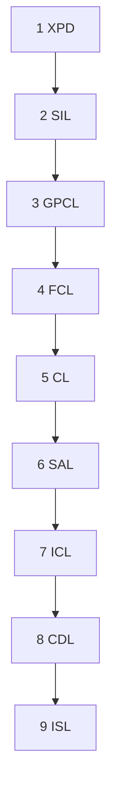

### 9.2 Reconciliation manifest

The reconciliation manifest is the operational memory surface for unresolved or tracked validation context. It tracks at least:

- total node count by tier
- status counts
- pending items
- last full validation timestamp
- active extensions and annotation counts

Defined manifest item types include:

- `MISSING_MEDIATOR`
- `SUPERSEDE_FAILED`
- `SUPERSEDE_PENDING_DETECTED`

### 9.3 REVIEW_REQUIRED and semantic gaps

`REVIEW_REQUIRED` is not a Core node status. It is a validation output indicating that semantic rules need human disposition before a node may transition from `DRAFT` to `ACTIVE`.

DDR also allows explicit semantic gaps, but only under controlled conditions:

- the gap class must be allowed
- the gap must be logged
- rationale must be recorded
- the gap must be resolved or explicitly waived before system-wide CLEAN

### 9.4 What CLEAN really means

CLEAN is not just "no broken links." The compliance checklist requires:

- no structural violations
- no `DIRTY` nodes
- no `SUPERSEDE_PENDING` nodes
- no unresolved pending items
- no unresolved disallowed semantic gaps
- all critical or blocking extension advisories dispositioned

### Mermaid: Compliance to CLEAN workflow

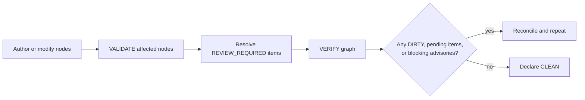

### 9.5 Illustrative scenarios

1. `Illustrative scenario - physical conflict`
   `FCL` demands a behavior that exceeds a mandated `CL` memory ceiling. DDR does not silently let higher-level intent erase physical impossibility; the conflict must be escalated.
2. `Illustrative scenario - mediator gap`
   A `GPCL` performance target has no real behavior-facing mediator. The gap may be logged as `MISSING_MEDIATOR`, but the graph cannot be called fully clean until it is resolved or explicitly waived.

### Nano Banana 2 Visual Prompt-17

- Objective: Explain precedence, reconciliation, and CLEAN-state governance as one operational control system.
- Subject: A vertical precedence ladder, a manifest side panel, and a CLEAN workflow lane.
- Composition: Three-column layout with precedence stack, manifest item board, and compliance resolution flow.
- Required labels/text: "Constraint Precedence", "MISSING_MEDIATOR", "SUPERSEDE_FAILED", "REVIEW_REQUIRED", "CLEAN".
- Style vocabulary: governance operations infographic, systems control dashboard in poster form, crisp vector labels.
- Palette: blue-gray structure, amber for unresolved items, green for CLEAN, limited red for blocking issues.
- Aspect ratio: 16:9.
- Consistency anchors: exact IDs and terms, light background, simple lane-based logic.
- Exclusions: no dark SOC dashboards, no photorealistic paperwork, no generic checklist clip-art.


---

## 10. Extension System, Extension Catalog, and ARE Profiles

### 10.1 Extension system architecture

Extensions are orthogonal read-only overlays. They may:

- read Core content
- annotate Core nodes with namespaced metadata
- generate external artifacts
- add advisories to reconciliation output

They may not:

- modify Core content, parent IDs, tier, or status
- redefine tier semantics or atomic rules
- introduce structural cycles
- set Core nodes to `DIRTY`

### Mermaid: Core and Extension separation

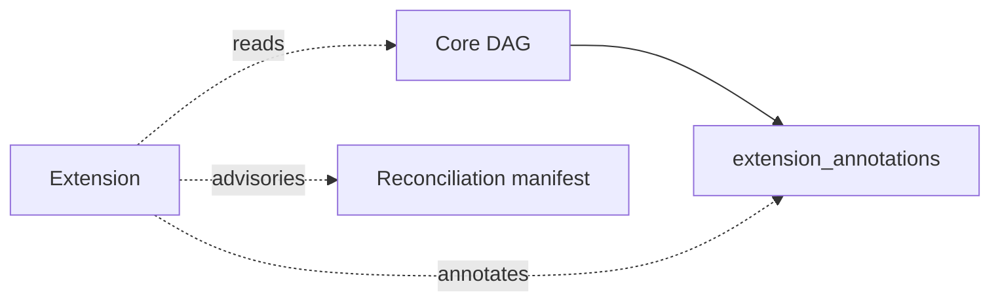

### 10.2 ARE candidate-pool lifecycle

ARE requires special handling because it infers candidate nodes. To preserve `AX-6`, those nodes remain outside the Core DAG until promoted.

- activation states: `active`, `paused`, `disabled`
- forbidden transition: `disabled -> paused`
- checkpoint path: `.agent/state/are_candidate_pool.checkpoint.yaml`
- pool visibility depends on state

### Mermaid: ARE candidate-pool lifecycle

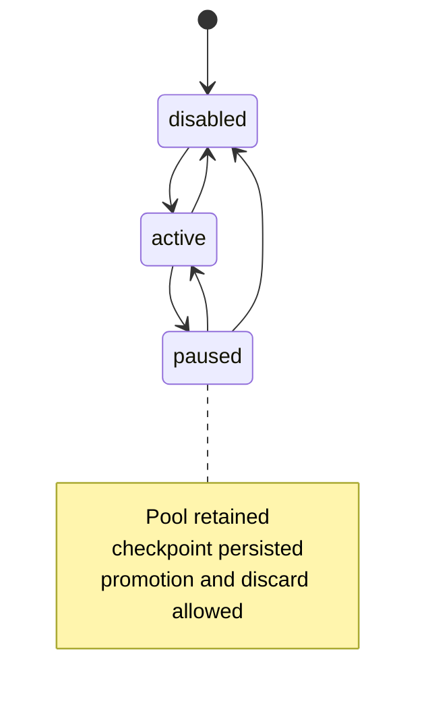

### 10.3 Extension catalog

#### `E1 - Hardware and Resource Intelligence Extension (HRE)`

- `Purpose:` infer or validate hardware/resource profiles against `CL` and `SAL`.
- `Reads:` `CL`, `SAL`, `CDL`, `ISL`
- `Annotates:` `CL`, `SAL`
- `Key rules:` `HRE-R1` to `HRE-R4`
- `Illustrative scenario:` HRE warns that the architecture exceeds a declared RAM floor but cannot mutate `CL`.

#### `E2 - Dependency Graph Analyzer (DGA)`

- `Purpose:` analyze dependency graphs, version conflicts, and copyleft exposure.
- `Reads:` `CL`, `ICL`, `CDL`, `ISL`
- `Annotates:` `CL`, `ICL`
- `Key rules:` `DGA-R1` to `DGA-R3`
- `Illustrative scenario:` DGA flags a transitive dependency license problem without changing the declared design.

#### `E3 - Lifecycle and Versioning Engine (LVE)`

- `Purpose:` enrich version history, technical debt records, deprecation data, and VCS mapping.
- `Reads and annotates:` all tiers
- `Key rules:` `LVE-R1` to `LVE-R4`
- `Illustrative scenario:` LVE records a sunset date and migration path for a deprecated contract family.

#### `E4 - Observability and Runtime Engine (ORE)`

- `Purpose:` derive telemetry and alerting readiness from runtime-facing design surfaces.
- `Reads:` `GPCL`, `SAL`, `ICL`, `CDL`, `ISL`
- `Annotates:` `ISL`, `SAL`
- `Key rules:` `ORE-R1` to `ORE-R4`
- `Illustrative scenario:` ORE generates telemetry advisories for each architectural subsystem.

#### `E5 - AI Upward Reconstruction Engine (ARE)`

- `Purpose:` infer candidate upstream artifacts from downstream evidence.
- `Reads:` `ISL`, `CDL`, `ICL`, `SAL`
- `Annotates:` `SAL`, `ICL`, `CDL`, `ISL`
- `Key rules:` `ARE-R1` to `ARE-R7`
- `Important constraints:`
  - automatic promotion prohibited
  - no autonomous creation of `XPD` or `GPCL`
  - scoring profile is mandatory
  - tri-state lifecycle is mandatory

#### `E6 - Security and Compliance Engine (SCE)`

- `Purpose:` apply structured trust-boundary, access-control, PII, and evidence analysis.
- `Reads:` `GPCL`, `CL`, `SAL`, `ICL`
- `Annotates:` `GPCL`, `SAL`, `ICL`
- `Key rules:` `SCE-R1` to `SCE-R5`
- `Illustrative scenario:` SCE flags missing RBAC coverage on a contract without altering the contract text.

#### `E7 - Data Domain Extension (DDE)`

- `Purpose:` validate data-model consistency across `FCL`, `ICL`, `SAL`, and `CDL`.
- `Reads:` `FCL`, `GPCL`, `SAL`, `ICL`, `CDL`
- `Annotates:` `ICL`, `SAL`, `FCL`
- `Key rules:` `DDE-R1` to `DDE-R5`
- `Important nuance:` `DDE-R5` is confirmation-only on `FCL`; DDE must not discover unstated entities for the Core.

#### `E8 - Deployment and CI/CD Planner (DCP)`

- `Purpose:` map architecture and constraints into deployment units and pipeline structure.
- `Reads:` `CL`, `SAL`, `ISL`
- `Annotates:` `ISL`, `SAL`
- `Key rules:` `DCP-R1` to `DCP-R4`
- `Illustrative scenario:` DCP generates advisory IaC mappings that cite their `CL` source nodes.

#### `E9 - Ethics and Human-Centered Design Extension (EHD)`

- `Purpose:` assess bias, accessibility, accountability, and ethical fit.
- `Reads:` `XPD`, `SIL`, `FCL`, `SAL`, `CDL`
- `Annotates:` `FCL`, `CDL`, `SAL`
- `Key rules:` `EHD-R1` to `EHD-R5`
- `Important nuance:` if `XPD` is inactive, EHD may create a synthetic XPD-equivalent risk artifact, but it has no Core precedence weight and cannot appear in `parent_ids`.

### 10.4 ARE scoring profiles

The system definition names three profile IDs:

- `standard_v1`
- `conservative_v1`
- `custom`

Operationally important facts:

- ARE deployments must declare a `scoring_profile`
- the profile must resolve to an entry in `are_scoring_profiles`
- custom profiles must satisfy required fields, score-band ordering, non-overlap, and `[0.0, 1.0]` bounds
- candidates promoted below `minimum_surfacing_threshold` require `override_flag: true` and human rationale

### 10.5 Why the extension design is technically strong

- Core truth stays authored and stable.
- Specialized analysis remains optional.
- Advisory power is high, but mutation authority is intentionally low.
- ARE is given power to infer, but not power to silently redefine history.

### Nano Banana 2 Visual Prompt-18

- Objective: Visualize the full extension architecture and the special handling of ARE.
- Subject: Core DAG at center, nine surrounding extensions, and a separate candidate-pool lifecycle panel for ARE.
- Composition: Radial extension map with one enlarged ARE inset showing pool states and promotion boundary.
- Required labels/text: "Core DAG", "extension_annotations", "ARE Candidate Pool", "active", "paused", "disabled", "E1 HRE", "E5 ARE", "E9 EHD".
- Style vocabulary: platform extension map, modular systems infographic, exact text rendering, crisp vector radial design.
- Palette: slate and blue base, teal extension links, amber advisory callouts, green controlled-promotion accent.
- Aspect ratio: 16:9.
- Consistency anchors: precise extension IDs, light background, restrained detail density, clear separation between Core and Extension space.
- Exclusions: no sci-fi neural web, no glowing AI face motifs, no generic chatbot UI.


---

## 11. Schema Contract and Machine Validation Surface

### 11.1 Root contract

The schema requires these root fields in every DDR file:

- `ddr_version`
- `document_profile`
- `active_tiers`
- `nodes`

The allowed `document_profile` values are:

- `project_instance`
- `project_instance_express`
- `system_definition`

### 11.2 Profile-specific obligations

| Profile | Required / forbidden implications |
| --- | --- |
| `project_instance` | must not require `system_metadata` |
| `project_instance_express` | requires `express_mode`; every node requires `express_mode_group`; must not require `system_metadata` |
| `system_definition` | requires the full authoritative surface including `system_metadata`, `axioms`, `edge_type_definitions`, `node_schema_fields`, `node_id_format`, `dag_invariants`, `citation_rules`, `consumption_modes`, `express_mode`, `tier_definitions`, `constraint_precedence`, `operations`, `extension_system`, `extension_catalog`, `compliance_checklist`, `glossary`, `are_scoring_profiles`, and `lifecycle` |

### 11.3 Canonical `active_tiers`

The schema allows exactly four ordered variants:

1. `[SIL, GPCL, FCL, SAL, ICL, CDL, ISL]`
2. `[XPD, SIL, GPCL, FCL, SAL, ICL, CDL, ISL]`
3. `[SIL, GPCL, FCL, CL, SAL, ICL, CDL, ISL]`
4. `[XPD, SIL, GPCL, FCL, CL, SAL, ICL, CDL, ISL]`

This is more than membership validation; it is topology closure.

### 11.4 `DdrNode`

Important machine constraints include:

- `id` pattern enforcement
- `tier` enum closure
- `status` enum closure
- `parent_ids` typed as `ParentCitation[]`
- `content` remains free text, but tier semantics are enforced by runtime validation
- `extension_annotations` must use `EXTENSION_ID::annotation_key` format and cannot shadow Core keys such as `content`, `parent_ids`, `status`, `tier`, or `id`

Conditional rules include:

- `prior_status` is required iff `status == SUPERSEDE_PENDING`
- `constraint_origin` is allowed only on `CL`
- each tier gets its own ID pattern and non-root parent minimums

### 11.5 `ParentCitation`

Machine requirements:

- required fields: `id`, `edge_type`
- allowed `edge_type`: `derives`, `constrains`, `implements`
- `derivation_mode` allowed values: `semantic`, `traceability`
- `derivation_mode` may appear only when `edge_type == derives`

### 11.6 Express-profile node obligations

When `document_profile == project_instance_express`:

- every node must carry `express_mode_group`
- `project.mode`, if present, must be `express`

### 11.7 Additional schema-level nuances

- if `active_tiers` contains `XPD`, the schema applies additional expectations to `SIL` parent behavior
- `StatusEnum` is explicitly closed to six values
- the schema preserves runtime responsibility for some semantics rather than pretending natural-language rules can be fully captured structurally

### 11.8 Illustrative scenarios

1. `Illustrative scenario - invalid extension annotation`
   An extension writes `HRE::status` into `extension_annotations`; the schema rejects it because Core-shadowing suffixes are reserved.
2. `Illustrative scenario - invalid parent citation`
   A `constrains` citation includes `derivation_mode`; the schema rejects it because `derivation_mode` is valid only for `derives`.

### Nano Banana 2 Visual Prompt-19

- Objective: Explain the machine-contract surface of DDR v6.3.
- Subject: A schema map showing root profile branching, active-tier closure, node field constraints, and parent citation typing.
- Composition: Left root profile decision tree, center node-schema card, right citation-schema card, bottom row for express and supersede conditionals.
- Required labels/text: "document_profile", "project_instance", "project_instance_express", "system_definition", "ParentCitation", "prior_status", "constraint_origin", "express_mode_group".
- Style vocabulary: schema architecture infographic, validator map, crisp technical flowchart, exact text rendering.
- Palette: blue-slate base, teal structural highlights, amber conditional callouts.
- Aspect ratio: 16:9.
- Consistency anchors: exact field names, light background, modular panel layout.
- Exclusions: no JSON dump wall, no code editor chrome, no decorative icons replacing field names.


---

## 12. Appendices

### 12.1 Compliance checklist

#### Structural validation

- All non-root nodes have `>= 1` valid, non-superseded `parent_id`.
- All `parent_ids` reference nodes of the correct parent tier.
- No cycles exist in any citation path.
- Every node tier belongs to `active_tiers`.
- System-definition artifacts include at least one representative node for every active tier.
- No tier-skipping is detected.
- All inline citations have matching `parent_ids`.
- No node has status `DIRTY`.
- No node has status `SUPERSEDE_PENDING`.
- Reconciliation manifest shows zero pending items.
- Any declared semantic gap uses an allowed classification and is resolved or explicitly waived before CLEAN.
- Critical or blocking extension advisories have recorded dispositions.

#### Atomic rule validation

- `XPD` nodes satisfy `XPD-R1` through `XPD-R6` and `XPD-E1` through `XPD-E3`.
- `SIL` nodes satisfy `SIL-R1` through `SIL-R6` and `SIL-E1` through `SIL-E4`.
- `GPCL` nodes satisfy `GPCL-R1` through `GPCL-R10` and `GPCL-E1` through `GPCL-E3`.
- `FCL` capabilities are user-observable, implementation-clean, and satisfy `FCL-R7` when persistent data is involved.
- Every `GPCL-R6` performance target has an `FCL` mediator or a logged `MISSING_MEDIATOR`.
- `CL` nodes are declarative only and declare `constraint_origin`.
- Derived `CL` cites `FCL`; imposed `CL` cites external authority.
- Children are revalidated after cited parent version changes.
- `SAL` cites all active parent tiers.
- `ICL` schemas are machine-parseable.
- `ISL` stubs contain traceable docstrings.
- `CDL` produces language-specific blueprints when `CL` declares multiple targets.
- All `REVIEW_REQUIRED` items are dispositioned before `DRAFT -> ACTIVE`.

#### Extension validation

- Active Extensions declare compatible contract versions for `DDR-Core-6.x`.
- Extension annotations are stored in `extension_annotations` only.
- Non-critical advisories have disposition notes.
- ARE candidates are reviewed and promoted via `INSERT` or discarded.
- ARE `scoring_profile` is declared and valid.
- Custom ARE profiles satisfy their required structure.
- Below-threshold promotions carry override flag and human rationale.

### 12.2 Rule ID registry

| Surface | Exact identifiers |
| --- | --- |
| `XPD` | `XPD-R1`, `XPD-R2`, `XPD-R3`, `XPD-R4`, `XPD-R5`, `XPD-R6`, `XPD-E1`, `XPD-E2`, `XPD-E3` |
| `SIL` | `SIL-R1`, `SIL-R2`, `SIL-R3`, `SIL-R4`, `SIL-R5`, `SIL-R6`, `SIL-E1`, `SIL-E2`, `SIL-E3`, `SIL-E4` |
| `GPCL` | `GPCL-R1`, `GPCL-R2`, `GPCL-R3`, `GPCL-R4`, `GPCL-R5`, `GPCL-R6`, `GPCL-FCL-BR1`, `GPCL-R7`, `GPCL-R8`, `GPCL-R9`, `GPCL-R10`, `GPCL-E1`, `GPCL-E2`, `GPCL-E3` |
| `FCL` | `FCL-R1`, `FCL-R2`, `FCL-R3`, `FCL-R4`, `FCL-R5`, `FCL-R6`, `FCL-R7`, `FCL-E1`, `FCL-E2`, `FCL-E3` |
| `CL` | `CL-R1`, `CL-R2`, `CL-R3`, `CL-R4`, `CL-R5`, `CL-R6`, `CL-R7`, `CL-R8`, `CL-R9`, `CL-R9-imposed`, `CL-R10`, `CL-E1`, `CL-E2`, `CL-E3` |
| `SAL` | `SAL-R1`, `SAL-R2`, `SAL-R3`, `SAL-R4`, `SAL-R5`, `SAL-R6`, `SAL-E1`, `SAL-E2`, `SAL-E3` |
| `ICL` | `ICL-R1`, `ICL-R2`, `ICL-R3`, `ICL-R4`, `ICL-R5`, `ICL-R6`, `ICL-R7`, `ICL-E1`, `ICL-E2`, `ICL-E3` |
| `CDL` | `CDL-R1`, `CDL-R2`, `CDL-R3`, `CDL-R4`, `CDL-R5`, `CDL-R6`, `CDL-R7`, `CDL-E1`, `CDL-E2`, `CDL-E3` |
| `ISL` | `ISL-R1`, `ISL-R2`, `ISL-R3`, `ISL-R4`, `ISL-R5`, `ISL-R6`, `ISL-E1`, `ISL-E2` |
| `Citation` | `CIT-R1`, `CIT-R2`, `CIT-R3`, `CIT-R4`, `CIT-R5`, `CIT-R6`, `CIT-R7` |
| `Extensions` | `HRE-R1`, `HRE-R2`, `HRE-R3`, `HRE-R4`, `DGA-R1`, `DGA-R2`, `DGA-R3`, `LVE-R1`, `LVE-R2`, `LVE-R3`, `LVE-R4`, `ORE-R1`, `ORE-R2`, `ORE-R3`, `ORE-R4`, `ARE-R1`, `ARE-R2`, `ARE-R3`, `ARE-R4`, `ARE-R5`, `ARE-R6`, `ARE-R7`, `SCE-R1`, `SCE-R2`, `SCE-R3`, `SCE-R4`, `SCE-R5`, `DDE-R1`, `DDE-R2`, `DDE-R3`, `DDE-R4`, `DDE-R5`, `DCP-R1`, `DCP-R2`, `DCP-R3`, `DCP-R4`, `EHD-R1`, `EHD-R2`, `EHD-R3`, `EHD-R4`, `EHD-R5` |

### 12.3 Glossary

| Term | Definition |
| --- | --- |
| `Atomic Rule` | Inclusion or exclusion constraint on a tier node, individually verifiable without reference to other nodes. |
| `Candidate Pool` | Extension-managed staging area for ARE-inferred nodes outside the Core DAG. |
| `DAG` | Directed Acyclic Graph, the DDR System's foundational data structure. |
| `Dirty Flag` | `DIRTY` status indicating a node requires re-validation after graph-modifying change. |
| `Edge Type` | One of four typed relationships: `derives`, `constrains`, `implements`, `extends`. |
| `Express Mode` | Four-group consumption mode expandable into Full Mode through unbundle operations. |
| `Extension` | Optional analytical overlay that reads and annotates Core nodes without modifying Core semantics. |
| `Leaf Node` | Node with no children; `ISL` is the only valid leaf tier in a CLEAN Core DAG. |
| `Merge Node` | `SAL`, where `FCL` derivation and `CL` constraints converge. |
| `Orphan` | Non-root node with no valid `parent_id`; a structural violation. |
| `Root Node` | `XPD` if active, otherwise `SIL`; the only node allowed to have empty `parent_ids`. |
| `REVIEW_REQUIRED` | Validation output for semantic rules requiring human disposition before activation. |
| `Tier Contamination` | Presence of content violating a tier's atomic exclusion rules. |
| `verification_mode` | Atomic inclusion rule classifier: `structural` or `semantic`; controls how `VALIDATE` treats the rule. |

### 12.4 Version history

| Version | Date | Summary |
| --- | --- | --- |
| `1.0` | - | Initial 7-tier linear DDR concept. |
| `2.1` | `2026-02-26` | Refined Core and Extension system. |
| `3.0` | `2026-02-26` | Fork-join redesign, GPCL isolation, XPD optional root, Z-axis extensions, Express Mode, CRR, 9 Extensions. |
| `3.1.1` | `2026-02-26` | Universal node format, 6-edge vocabulary, axiom implications. |
| `4.0` | `2026-02-26` | Simplified to 9 tiers, 4 edge types, 7 operations, merge-node model, ARE Candidate Pool, 4 Express groups. |
| `5.0` | `2026-03-25` | Atomic supersede, `SUPERSEDE_PENDING`, `prior_status`, `verification_mode`, `FCL-R7`, ARE tri-state lifecycle, `CL-R9-imposed`, reconciliation schema, `derivation_mode`, `CIT-R6`. |
| `6.0` | `2026-03-25` | Major version alignment release. |
| `6.1` | `2026-03-27` | `INV-7`, `INV-8`, semantic-gap classification, conflict protocol, deferred unbundle fragments, parent freshness. |
| `6.2` | `2026-03-27` | Schema hardening for profiles, lifecycle typing, `ParentCitation`, CL-only and supersede-only fields, express enforcement. |
| `6.3` | `2026-03-28` | Explicit `document_profile`, canonical `active_tiers`, status-transitions as sole lifecycle authority, ARE contract hardening, normalized operations, centralized rule-ID typing, closed Express Mode groups. |

### 12.5 Legacy tier migration

#### Tier map

| From | To | Notes |
| --- | --- | --- |
| `XPD` | `XPD` | Unchanged. |
| `SIL` | `SIL` | Unchanged. |
| `GPCL` | `GPCL` | Expanded to absorb ORL quality and performance content. |
| `ORL` | `GPCL` | ORL rules folded into `GPCL-R6` through `GPCL-R10`. |
| `FCL` | `FCL` | Now derives from `GPCL` instead of ORL. |
| `HIL` | `CL` | Hardware-oriented rules moved into `CL-R6` through `CL-R8`. |
| `TDL` | `CL` | Technology-oriented rules moved into `CL-R1` through `CL-R5`. |
| `SAL` | `SAL` | Simplified from fork-join to single merge-node. |
| `ICL` | `ICL` | Unchanged. |
| `CDL` | `CDL` | Unchanged. |
| `ISL` | `ISL` | References `CL` instead of `TDL` for language targets. |

#### Rule map

| From rule IDs | To rule IDs | Consolidation status | Notes |
| --- | --- | --- | --- |
| `ORL-R1` | `GPCL-R6` | `1:1` | Quantifiable performance targets. |
| `ORL-R2` | `GPCL-R7` | `1:1` | Reliability and availability targets. |
| `ORL-R3` | `GPCL-R8` | `1:1` | Security requirements. |
| `ORL-R4` | `GPCL-R10` | `1:1` | Parent citation rule. |
| `ORL-R5` | `GPCL-R9` | `N:1` | Consolidated with `ORL-R6`. |
| `ORL-R6` | `GPCL-R9` | `N:1` | Consolidated with `ORL-R5`. |
| `ORL-R7` | `GPCL-R9` | `Absorbed` | Broader operational governance semantics. |
| `HIL-R1, HIL-R2, HIL-R3` | `CL-R6` | `N:1 Consolidated` | Hardware envelopes. |
| `HIL-R4` | `CL-R7` | `1:1` | Infrastructure ceilings. |
| `HIL-R5` | `CL-R8` | `1:1` | Deployment topology declarations. |
| `TDL-R1` | `CL-R1` | `1:1` | Approved programming languages. |
| `TDL-R2, TDL-R6` | `CL-R2` | `N:1 Consolidated` | Framework and library minimum bounds. |
| `TDL-R3` | `CL-R3` | `1:1` | Required external service contracts. |
| `TDL-R4` | `CL-R4` | `1:1` | Runtime environment constraints. |
| `TDL-R5` | `CL-R5` | `1:1` | Prohibited technologies. |

### Mermaid: Version evolution and migration view

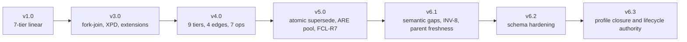

### 12.6 Coverage summary

This manual explicitly covers every top-level semantic block in `ddr_system_v6.3.yaml` and every major machine-contract surface in `ddr_node_schema_v6.3.yaml`, including:

- `system_metadata`
- `axioms`
- `node_schema_fields`
- `edge_type_definitions`
- `dag_invariants`
- `node_id_format`
- `citation_rules`
- `consumption_modes`
- `express_mode`
- `tier_definitions`
- `constraint_precedence`
- `operations`
- `extension_system`
- `extension_catalog`
- `are_scoring_profiles`
- `compliance_checklist`
- `glossary`
- `version_history`
- `tier_migration`
- `nodes`
- `lifecycle`
- schema root profile logic
- schema `DdrNode`
- schema `ParentCitation`
- schema `StatusEnum`

### Nano Banana 2 Visual Prompt-20

- Objective: Produce an appendix visual summarizing compliance, glossary, and version evolution as a reference poster.
- Subject: A compact DDR reference atlas with checklist, glossary strips, and version progression timeline.
- Composition: Multi-panel appendix board, left compliance list, center glossary tiles, right evolution timeline.
- Required labels/text: "Compliance Checklist", "Glossary", "Version History", "Migration", "v6.3".
- Style vocabulary: technical reference atlas, crisp editorial appendix board, exact small-text rendering.
- Palette: slate and blue base with teal indexing accents and green completion markers.
- Aspect ratio: 16:9.
- Consistency anchors: legible small text, modular organization, light background, minimal decorative elements.
- Exclusions: no abstract cover art, no photorealistic scenes, no ornamental textures.


---

## Source Basis

Primary DDR authority surfaces:

- `.agent/assets/proposals/active/v6.3/ddr_system_v6.3.yaml`
- `.agent/assets/proposals/active/v6.3/ddr_node_schema_v6.3.yaml`

Official Nano Banana 2 prompt-reference sources:

- [Google Blog: Nano Banana 2](https://blog.google/innovation-and-ai/technology/ai/nano-banana-2/)
- [Google DeepMind: Nano Banana 2 / Gemini 3.1 Flash Image](https://deepmind.google/models/gemini-image/flash/)

Prompt-block design in this manual follows the official model examples' demonstrated emphasis on detailed subject description, explicit composition, exact requested text, style specification, and aspect-ratio control.
