# Nano Banana Pro Prompt Pack for DDR System Design Framework v6.3
# Target document: ddr_ref_manual_v6.3(Codex).md

## Global Design Theme Prefix

Use this exact prefix before every prompt:

Create a technically rigorous educational visualization for the DDR System Design Framework v6.3. The image must look like a polished professional systems-engineering diagram prepared for an authoritative reference manual. Use a clean high-contrast editorial technical style, white or very light neutral background, dark graphite text, restrained accent colors, crisp vector-like linework, precise alignment to a strict grid, consistent spacing, sharp rectangular cards, no decorative clutter, no cartoon styling, no photorealism unless explicitly requested, no hand-drawn look, no glossy UI chrome unless explicitly requested. Prioritize factual clarity, exact labels, visual hierarchy, legible text, deterministic layout, and semantic accuracy over artistic flair. Every visible label must be spelled exactly as provided. Do not invent nodes, rules, tiers, labels, edge types, icons, legends, captions, or explanatory text not explicitly requested. When text appears in the image, render it sharply and accurately. Prefer landscape composition unless another aspect ratio is explicitly requested. Make the result immediately understandable when embedded inside a technical manual page.

## Global Prompt Construction Rules

Apply these rules to every prompt:
1. Treat the DDR v6.3 YAML specification and schema as source-of-truth semantics.
2. Preserve canonical tier order exactly when tiers are shown:
   XPD -> SIL -> GPCL -> FCL -> CL -> SAL -> ICL -> CDL -> ISL
3. Preserve Core edge semantics exactly when shown:
   derives, constrains, implements, extends
4. Preserve optional-tier behavior exactly:
   XPD optional root, CL optional constraint tier, SAL sole merge node.
5. Preserve lifecycle/state names exactly:
   DRAFT, ACTIVE, DIRTY, DEPRECATED, SUPERSEDED, SUPERSEDE_PENDING
6. Preserve operation names exactly:
   INSERT, DELETE, MODIFY, SUPERSEDE, VERIFY, VALIDATE, UNBUNDLE_SCAN, UNBUNDLE_EXECUTE
7. Preserve rule/invariant IDs exactly when included.
8. If a diagram contains text labels, render the exact provided text verbatim and do not paraphrase.
9. Use clean arrows, orthogonal connectors, consistent arrowheads, and clear merge/fork logic.
10. Avoid decorative icons unless they materially increase comprehension.
11. Avoid visually implying relationships that do not exist in DDR.
12. Avoid extra tiers, extra transitions, extra examples, extra annotations, or hidden background motifs.

---

## Section for 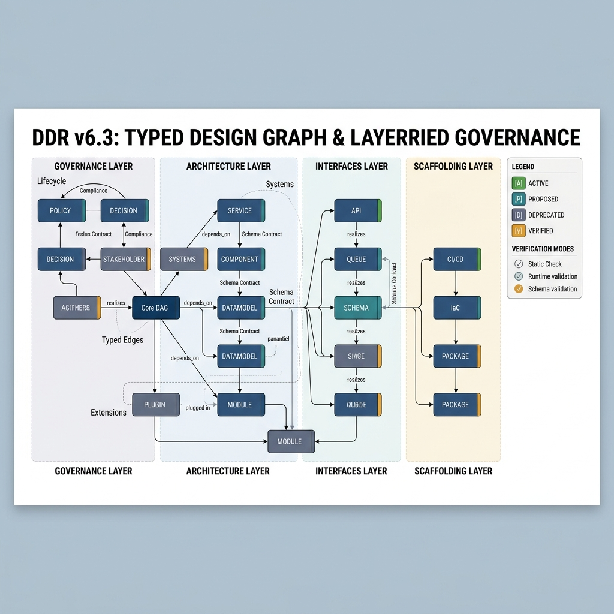

### Purpose
Visual conventions opener for the manual. This image should establish the visual language used throughout the rest of the manual.

### Prompt
Create a canonical DDR visual-language board for a technical reference manual. Landscape layout, 16:9. Organize the canvas into four clean zones on a strict grid: top title band, left status-color legend, center verification-mode legend, and bottom example-node strip. Title at top: "DDR Visual Conventions". In the left legend, show five status chips with exact labels and distinct clean colors: ACTIVE, DIRTY, SUPERSEDE_PENDING, DEPRECATED, SUPERSEDED. In the center legend, show three verification-mode chips with exact labels: structural, manual, semantic. In the bottom strip, show a sample DDR node card with labeled fields: id, tier, title, status, version, created, modified, parent_ids, content. Use a neutral technical editorial style, white background, dark graphite text, precise spacing, thin divider lines, sharp rectangular containers, no rounded playful shapes. Render all text perfectly legible. Include a tiny understated note at the bottom edge: "Visual language used throughout this manual". Do not include any tiers or lifecycle arrows here. Do not add decorative illustrations. The image must feel like the opening standards plate for a systems manual.

---

## Section for 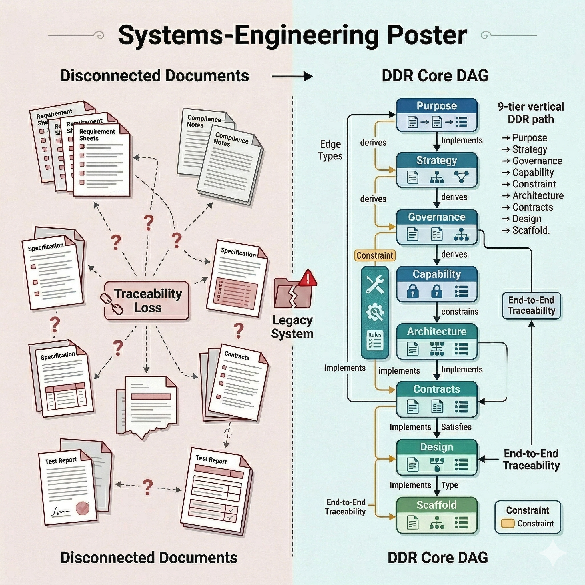

### Purpose
High-level end-to-end DDR topology overview for the business-context section.

### Prompt
Create a definitive overview diagram of the DDR System Design Framework v6.3 for a technical manual. Landscape 16:9. Show the full canonical tier chain exactly from left to right:
XPD -> SIL -> GPCL -> FCL -> CL -> SAL -> ICL -> CDL -> ISL
Use sharp rectangular tier cards, each with a title and a short subtitle:
XPD: Existential Purpose
SIL: Strategic Intent
GPCL: Governance, Policy, Quality
FCL: Functional Capability
CL: Constraint Layer
SAL: System Architecture
ICL: Interface and Contracts
CDL: Component Design
ISL: Implementation Scaffold
Show XPD and CL as visually optional tiers using subtle dashed outlines or muted optional markers, but keep them present in this overview. Show a solid derives flow through the main chain, and show CL feeding into SAL with a clearly labeled constrains connector. Emphasize that SAL is the sole merge node using a slightly stronger border or merge marker. Include a small right-side legend for derives and constrains. Title: "End-to-End DDR Topology". Subtitle: "From purpose to implementation scaffold". The design must look like a formal engineering teaching diagram, not a marketing infographic. Do not include lifecycle states, extension edges, or extra explanatory paragraphs.

---

## Section for 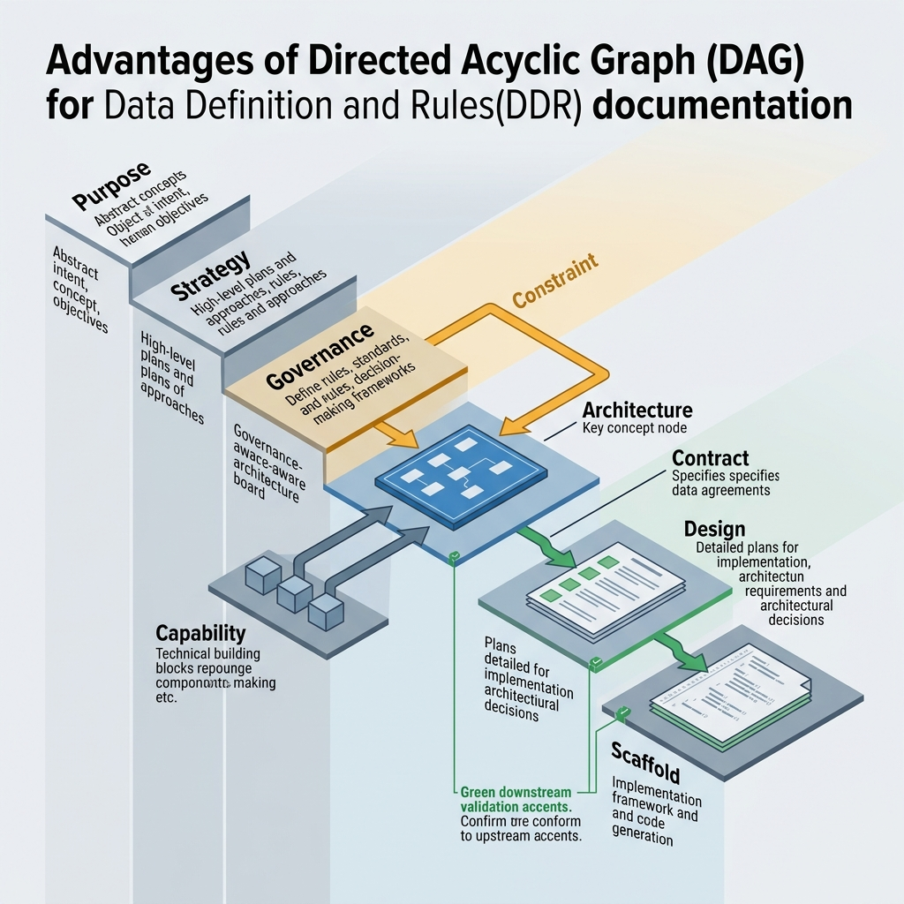

### Purpose
Abstraction descent visual for the DAG/philosophy section.

### Prompt
Create an abstraction-descent visualization for DDR v6.3 that teaches how specificity increases as the graph moves downward. Landscape 16:9. Arrange nine horizontal layers from top-left to bottom-right as a descending staircase or smooth diagonal progression. Label the conceptual progression clearly:
Purpose and ethics
Strategic outcomes
Governance and quality
Observable capabilities
Technology and infrastructure bounds
Architecture
Machine-verifiable contracts
Component blueprints
Language-specific stubs
Use a disciplined editorial technical style, not metaphorical art. Each layer should be a rectangular panel with progressively more concrete micro-details visible inside, for example top layers show abstract phrases and bottom layers show structured fields or pseudo-contract blocks. Add a subtle top-to-bottom gradient of concreteness from lighter to slightly darker neutral panels. Include a side annotation: "Abstraction ordering defers implementation detail until logically necessary". Show one dashed constrains input entering the Architecture layer from Technology and infrastructure bounds. Show that the flow is directional and acyclic. No decorative background art, no humans, no code screenshots. This image should visually explain why DDR uses a DAG.

---

## Section for 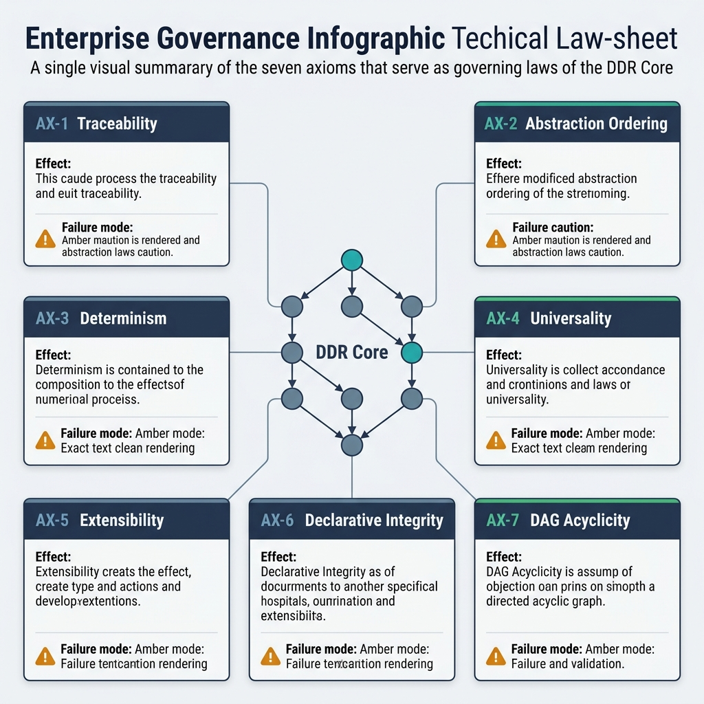

### Purpose
Seven Foundational Axioms summary plate.

### Prompt
Create a compact but highly legible axiom overview plate for DDR v6.3. Landscape 16:9. Title: "The Seven Foundational Axioms". Arrange seven numbered cards in a clean 2-row grid with exact names:
AX-1 Traceability
AX-2 Abstraction Ordering
AX-3 Determinism
AX-4 Universality
AX-5 Extensibility
AX-6 Declarative Integrity
AX-7 DAG Acyclicity
Each card must contain a one-line visual summary icon or mini-graphic that is abstract and technical, not playful. Example visual concepts: chain of lineage for Traceability, descending abstraction ladder for Abstraction Ordering, repeatable machine check for Determinism, domain-neutral globe/grid for Universality, modular overlay for Extensibility, locked declarative document for Declarative Integrity, acyclic directed graph for DAG Acyclicity. At the center or bottom include one unifying statement: "DDR remains traceable, ordered, deterministic, universal, extensible, declarative, and acyclic." Keep typography extremely clear. Do not invent extra axioms, extra rule IDs, or long paragraphs. The result should feel like a reference poster inserted after the explanatory prose.

---

## Section for 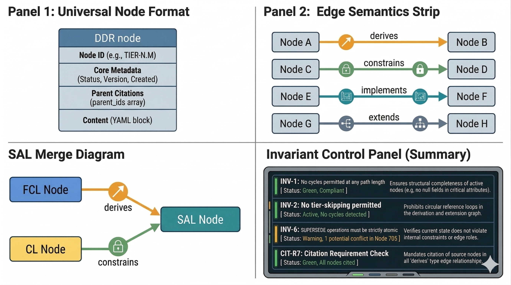

### Purpose
Core structural model summary for nodes, edges, topology, invariants, and citation rules.

### Prompt
Create a dense but clean systems-architecture summary board titled "Core Structural Model". Landscape 16:9. Divide the board into five labeled panels:
1. Universal Node Format
2. Edge Types
3. Core DAG Topology
4. DAG Invariants
5. Citation Rules
Panel 1: show a sample node card with fields id, tier, title, status, prior_status, version, created, modified, parent_ids, content, extension_annotations.
Panel 2: show exact edge labels derives, constrains, implements, extends, each with a short visual example.
Panel 3: show the canonical tier chain with SAL as sole merge node and CL constraining SAL.
Panel 4: show compact invariant badges INV-1 through INV-8.
Panel 5: show citation rule badges CIT-R1 through CIT-R7.
Use a white background, thin dark lines, restrained accent colors, exact typography, and excellent spacing. Prioritize readability over decoration. This should feel like a one-page architecture cheat sheet for the DDR Core. No glossy poster styling. No extra rule text beyond short labels and tiny explanatory fragments.

---

## Section for 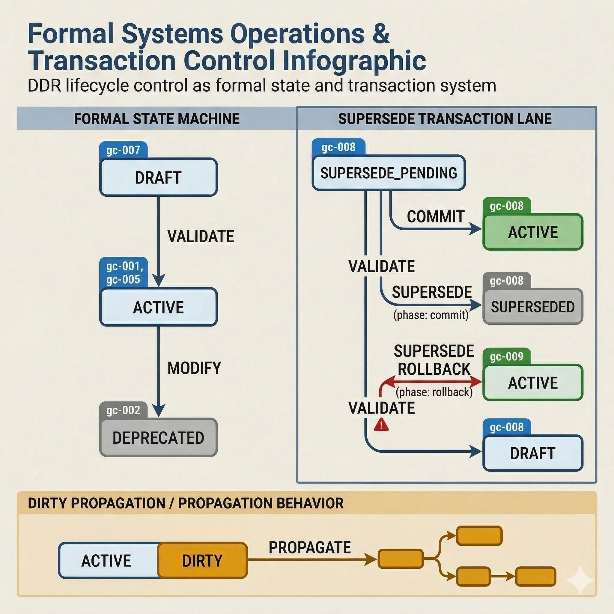

### Purpose
Lifecycle, guards, atomic operations, rollback, and dirty propagation.

### Prompt
Create a formal operational-state diagram board for DDR v6.3. Landscape 16:9. Title: "Lifecycle, Guards, and Atomic Operations". Use three coordinated panels.
Panel A: lifecycle state machine with exact statuses DRAFT, ACTIVE, DIRTY, DEPRECATED, SUPERSEDED, SUPERSEDE_PENDING. Show exact major transitions: VALIDATE, MODIFY, SUPERSEDE, VERIFY + VALIDATE, SUPERSEDE commit, SUPERSEDE rollback via prior_status.
Panel B: SUPERSEDE commit/rollback transaction flow. Show source node entering SUPERSEDE_PENDING, replacement INSERT attempt, child rewiring, children DIRTY, source SUPERSEDED, rollback path with removal of failed replacement and restoration of prior_status.
Panel C: DIRTY propagation flow. Show upstream MODIFY, affected descendants marked DIRTY, and note that SUPERSEDE child rewiring marks immediate children DIRTY without automatic grandchild cascade.
Along one side, include a compact guard table with gc-001 through gc-009 as tiny labeled tokens. Make this visually rigorous, like a standards-engineering state-and-transaction diagram. All text must be perfectly legible. No decorative gradients, no hand-drawn arrows, no fake UI chrome.

---

## Section for 

### Purpose
Express Mode and unbundle flow.

### Prompt
Create a precise workflow diagram for DDR Express Mode. Landscape 16:9. Title: "Express Unbundle Flow". Left side: show the four Express groups exactly:
G1 = XPD, SIL, GPCL
G2 = FCL, CL
G3 = SAL, ICL
G4 = CDL, ISL
Center: show UNBUNDLE_SCAN as a read-only diagnostic phase. After that, place a decision diamond with exact wording:
"All fragments high confidence or explicitly deferred?"
Yes branch: UNBUNDLE_EXECUTE -> Create constituent tier nodes -> Auto-wire parent_ids
No branch: Reject atomically -> Return complete scan diagnostics
Use clean orthogonal arrows and a highly legible flowchart style. Include a small side note: "Express Mode is grouped presentation, not a reduced DDR." Do not add extra groups. Do not invent extra phases. No decorative 3D elements.

---

## Section for 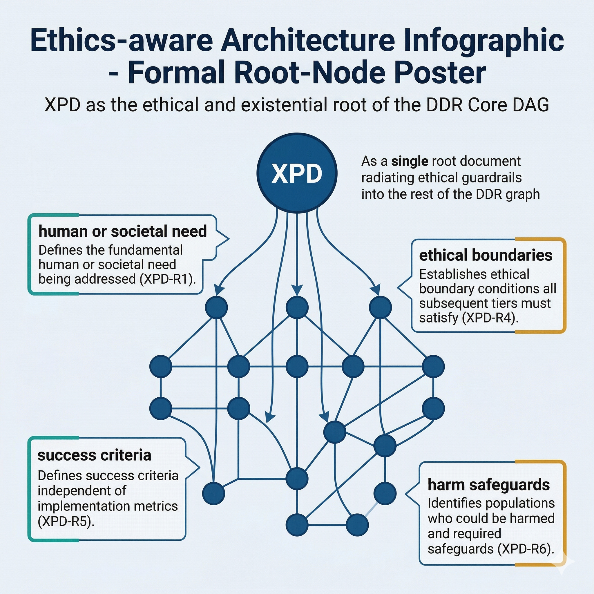

### Purpose
Tier spotlight for XPD.

### Prompt
Create a single-tier educational plate for DDR tier XPD. Landscape 16:9. Title: "XPD - Existential Purpose Document". Make the composition a structured technical poster with five panels:
Definition
Why it exists
Activation condition
Key inclusion rules
Key exclusions
Visually emphasize that XPD is an optional root tier. Show XPD at the top of a tiny mini-graph feeding into SIL. Include concise visual reminders that XPD addresses human or societal need and ethical boundaries, and excludes solution concepts, technology references, quantitative performance targets, and regulatory constraints. Use exact labels XPD-R1 through XPD-R6 and XPD-E1 through XPD-E3 as small rule chips, not full paragraphs. Add one subtle mini-scenario strip showing a public-facing AI system activating XPD. Keep the entire image abstract, diagrammatic, and editorial. No human faces, no photorealistic scenes.

---

## Section for 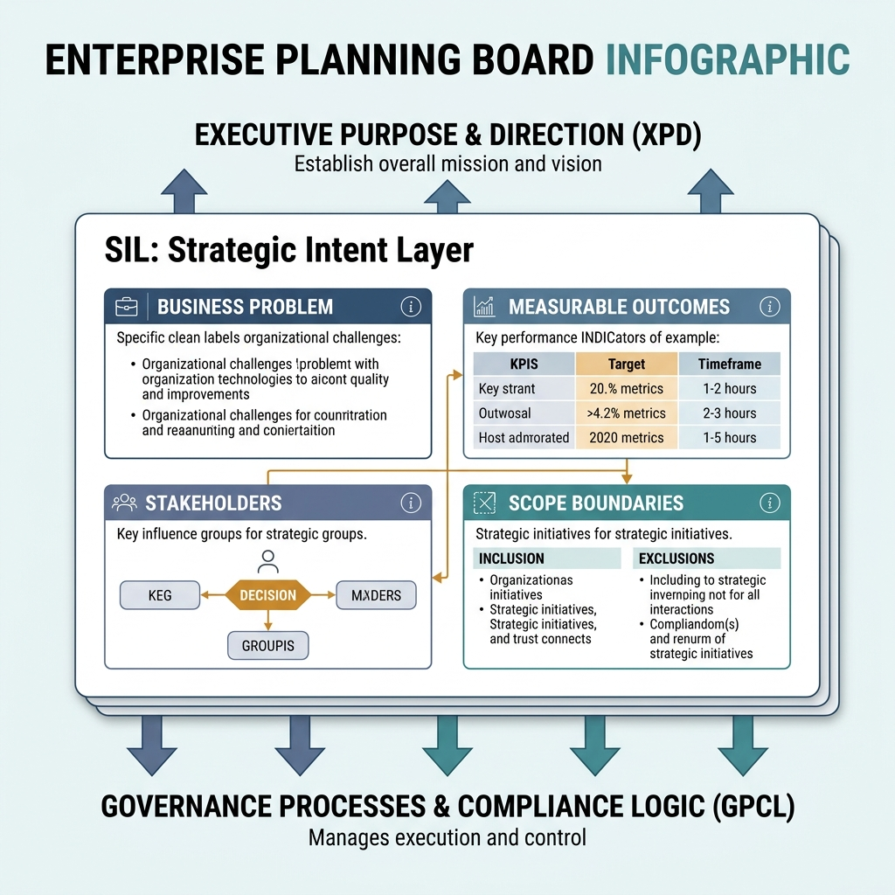

### Purpose
Tier spotlight for SIL.

### Prompt
Create a single-tier educational plate for DDR tier SIL. Landscape 16:9. Title: "SIL - Strategic Intent Layer". Structured technical poster with panels:
Definition
Why it exists
Root behavior
Key inclusion rules
Key exclusions
Mini-examples
Show SIL as root when XPD is inactive and as child of XPD when XPD is active. Include concise visual cues for business problem, strategic objectives, stakeholder categories, scope boundaries, and organizational success metrics. Show exclusion cues for no hardware, no frameworks, no regulatory mandates, no quantitative performance metrics. Include rule chips SIL-R1 through SIL-R6 and SIL-E1 through SIL-E4. Include a tiny contamination example where technology leaks into SIL and is visually marked invalid. Professional systems-manual style only.

---

## Section for 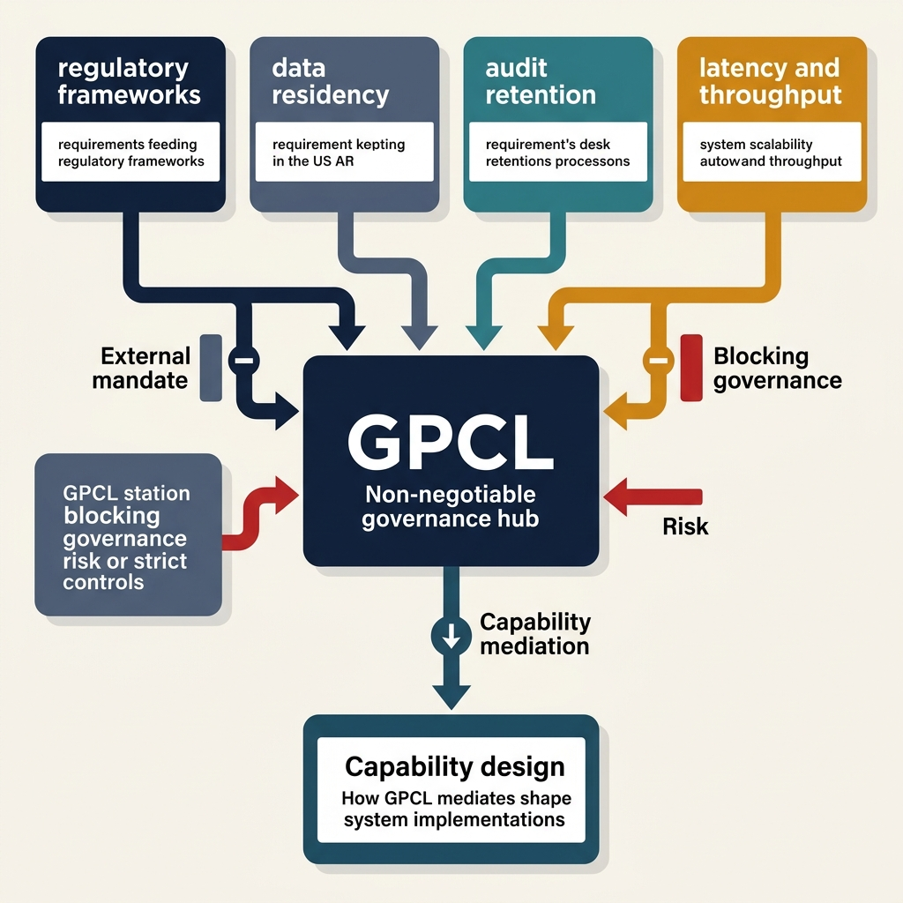

### Purpose
Tier spotlight for GPCL.

### Prompt
Create a single-tier educational plate for DDR tier GPCL. Landscape 16:9. Title: "GPCL - Governance, Policy and Quality Layer". Structured poster layout with panels:
Definition
Why it exists
Parent/child relationship
Governance content types
Key rules
Boundary to FCL
Show parent SIL and child FCL. Include visual categories for regulatory frameworks, policy constraints, contractual obligations, measurable quality thresholds, and operational governance. Use rule chips GPCL-R1 through GPCL-R10 and GPCL-FCL-BR1, plus exclusion chips GPCL-E1 through GPCL-E3. Include one small visual warning that GPCL must define enforceable, testable constraints, not aspirational goals. Keep it clean and formal. No decorative shields or compliance clichés.

---

## Section for 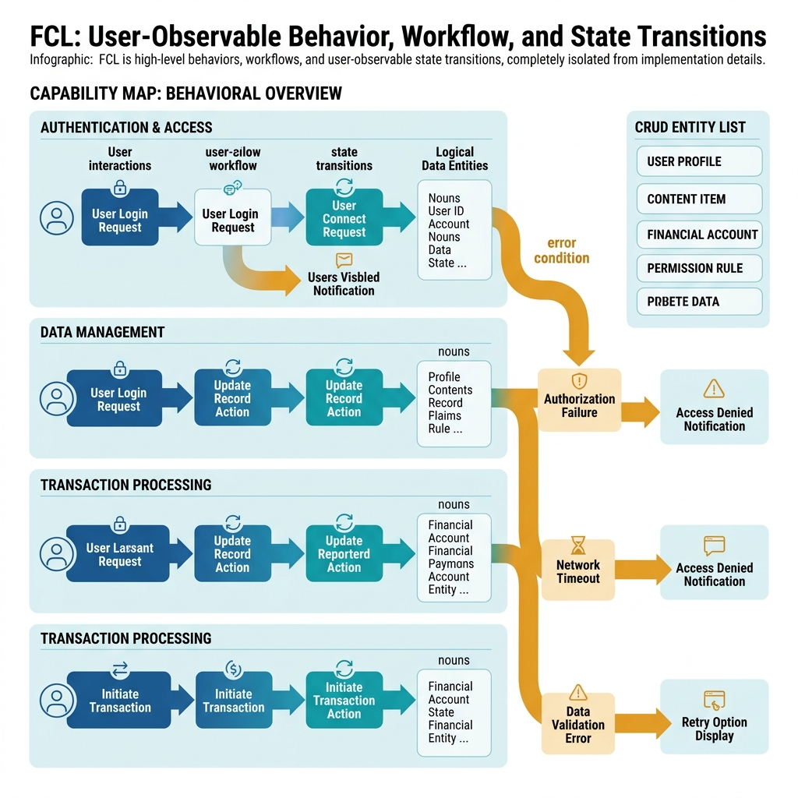

### Purpose
Tier spotlight for FCL.

### Prompt
Create a single-tier educational plate for DDR tier FCL. Landscape 16:9. Title: "FCL - Functional Capability Layer". Structured poster layout with panels:
Definition
Why it exists
Parent and children
Behavior framing
Key rules
Failure mode
Show parent GPCL and children SAL and CL if active. Visually represent externally observable behavior, workflows, states, errors, and CRUD relationships without showing implementation detail or schemas. Include rule chips FCL-R1 through FCL-R7 and exclusion chips FCL-E1 through FCL-E3. Include a small paired example: valid FCL statement versus invalid implementation-specific statement. Maintain the same design language as all prior tier posters.

---

## Section for 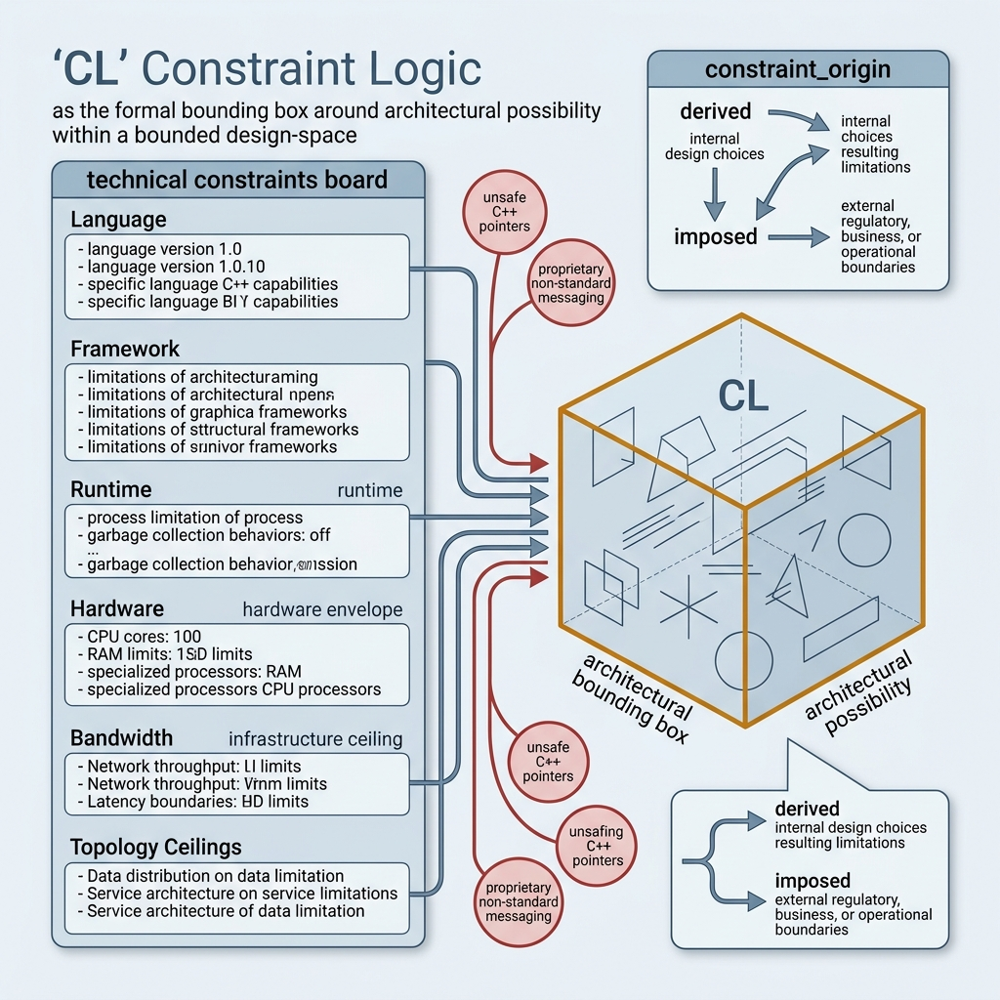

### Purpose
Tier spotlight for CL.

### Prompt
Create a single-tier educational plate for DDR tier CL. Landscape 16:9. Title: "CL - Constraint Layer". Structured poster layout with panels:
Definition
Why it exists
Optional activation
Constraint origin
Key rules
Architectural effect
Show CL as an optional tier positioned between FCL and SAL conceptually, but feeding SAL through a clearly labeled constrains relationship. Include the field constraint_origin with exact values derived and imposed. Visually summarize allowed content classes such as technology selections, hardware envelopes, infrastructure ceilings, required external service contracts, runtime environment constraints, and prohibited technologies. Include rule chips CL-R1 through CL-R8. Use a subtle visual distinction between chosen constraints and externally imposed constraints. No vendor logos. No photorealistic hardware.

---

## Section for 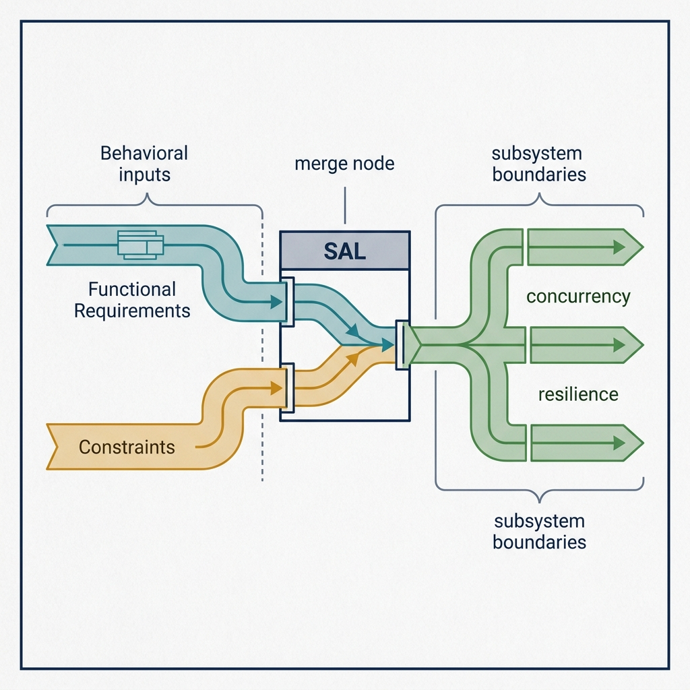

### Purpose
Tier spotlight for SAL.

### Prompt
Create a single-tier educational plate for DDR tier SAL. Landscape 16:9. Title: "SAL - System Architecture Layer". This should be one of the most important tier posters. Show SAL as the sole merge node. Use a central architecture card receiving two inputs: derives from FCL and constrains from CL. Surround it with panels:
Definition
Why it exists
Merge behavior
Architectural responsibilities
Key rules
Downstream child
Show child ICL. Visually communicate that SAL transforms behavior plus constraints into system architecture decisions, decomposition, trust boundaries, data/control flow, and topology. Include rule chips SAL-R1 through SAL-R8 if available only as compact numbered tags, without inventing missing details. Emphasize merge-node status visually but cleanly. No cloud-provider icons. No extra tiers.

---

## Section for 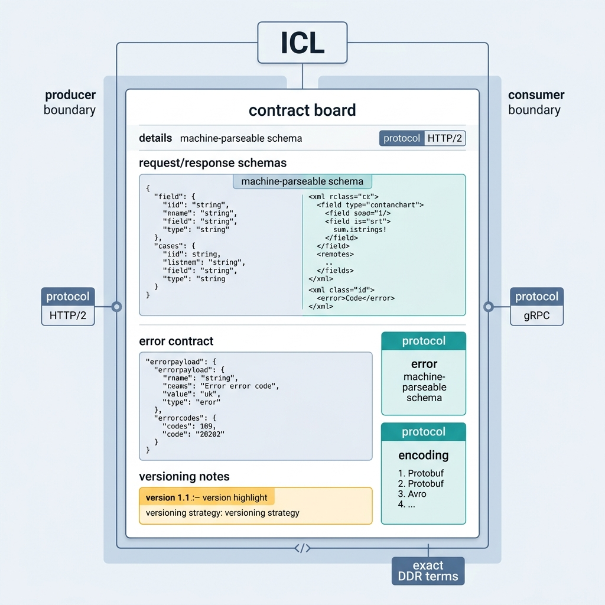

### Purpose
Tier spotlight for ICL.

### Prompt
Create a single-tier educational plate for DDR tier ICL. Landscape 16:9. Title: "ICL - Interface and Contracts Layer". Structured poster layout with panels:
Definition
Why it exists
Parent and child
Contract surface
Machine-verifiable details
Key exclusions
Show parent SAL and child CDL. Visually communicate that ICL captures precise interfaces, API shapes, message contracts, payload structures, error surfaces, and interoperability agreements. Use compact rule chips for ICL rules and exclusions without fabricating unsupported content. Make the central visual a contract/spec panel with structured fields and exacting alignment. This image must feel machine-verifiable and precise. No decorative API icons.

---

## Section for 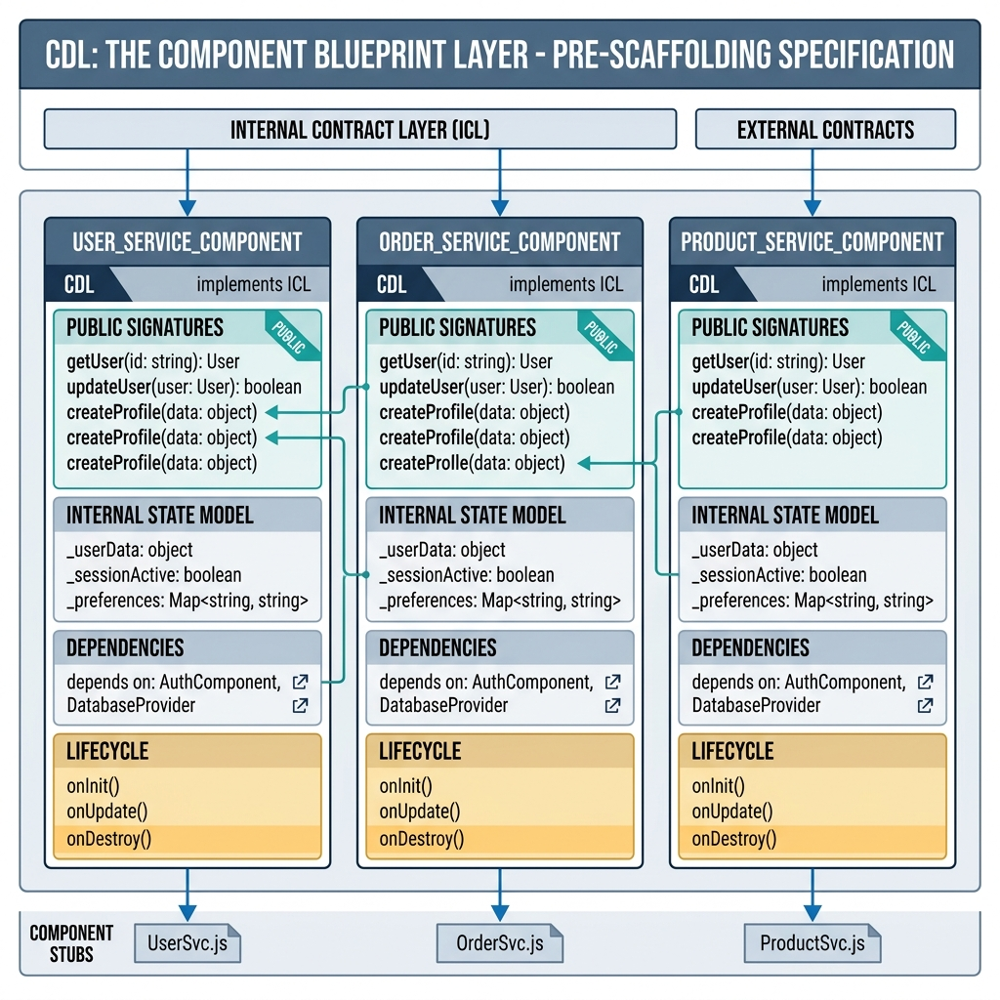

### Purpose
Tier spotlight for CDL.

### Prompt
Create a single-tier educational plate for DDR tier CDL. Landscape 16:9. Title: "CDL - Component Design Layer". Structured poster layout with panels:
Definition
Why it exists
Parent and child
Design responsibilities
Implements relationship
Failure mode
Show parent ICL and child ISL. Visually communicate component blueprints, internal responsibilities, module boundaries, data ownership, interaction patterns, and concrete design decisions that remain just above scaffold level. Emphasize the implements relationship from ICL to CDL. Show one tiny valid example of a component-level design card. Consistent editorial technical style, sharp boxes, exact typography, no code screenshot clutter.

---

## Section for 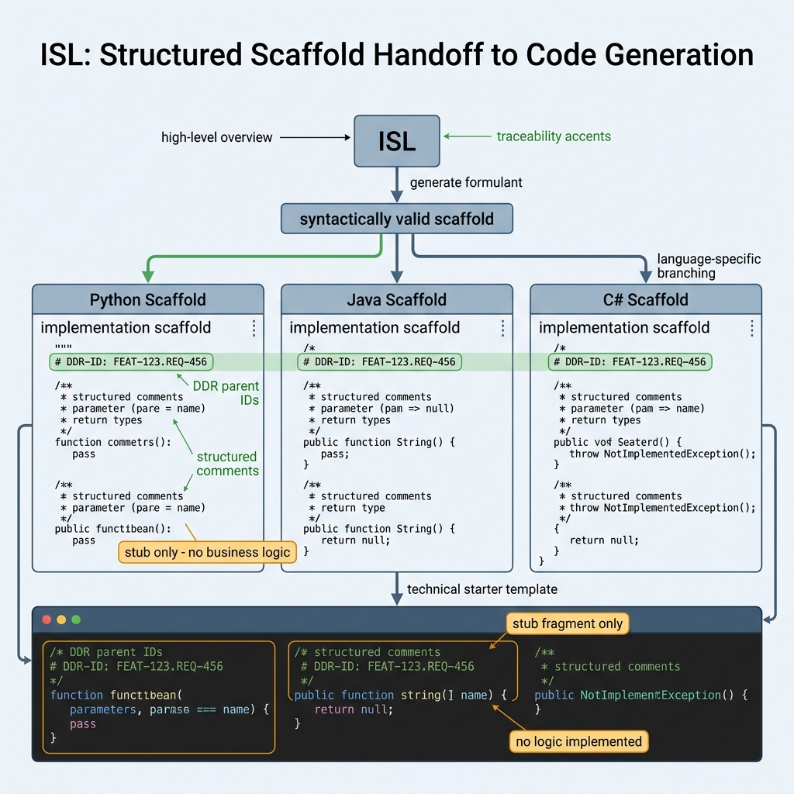

### Purpose
Tier spotlight for ISL.

### Prompt
Create a single-tier educational plate for DDR tier ISL. Landscape 16:9. Title: "ISL - Implementation Scaffold Layer". Structured poster layout with panels:
Definition
Why it exists
Parent relationship
Scaffold outputs
Boundary to real implementation
Audit lineage
Show parent CDL and emphasize that ISL is the most concrete Core tier while still remaining scaffold-oriented rather than final running implementation. Visually represent compileable stubs, project skeletons, interface placeholders, directory scaffolds, and typed implementation shells. Emphasize that ISL implements CDL. Include a small warning panel that ISL must not silently diverge from upstream design intent. Clean technical manual style only.

---

## Section for 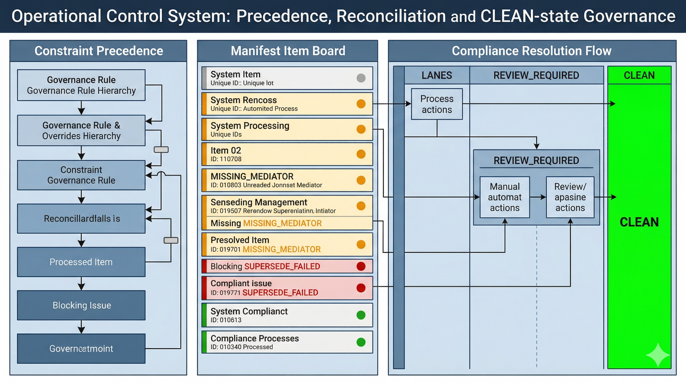

### Purpose
Constraint precedence, reconciliation, and CLEAN-state readiness.

### Prompt
Create a compliance-and-reconciliation workflow board for DDR v6.3. Landscape 16:9. Title: "Constraint Precedence, Reconciliation, and CLEAN". Divide into three coordinated panels.
Panel A: precedence ladder showing higher-level intent, governance, constraints, architecture, and physical feasibility, with a visual emphasis that physical impossibility cannot be erased by higher-level desire.
Panel B: compliance-to-CLEAN workflow:
Author or modify nodes -> VALIDATE affected nodes -> Resolve REVIEW_REQUIRED items -> VERIFY graph -> decision: "Any DIRTY, pending items, or blocking advisories?" -> yes: Reconcile and repeat -> no: Declare CLEAN
Panel C: semantic gap handling with explicit terms REVIEW_REQUIRED, MISSING_MEDIATOR, rationale, resolution or waiver, blocking before CLEAN.
Keep the image formal, crisp, and procedural. No extra statuses or invented gap classes. This should look like a governance workflow plate in a standards manual.

---

## Section for 

### Purpose
Extension system, extension catalog, and ARE profile overview.

### Prompt
Create an extension-architecture board for DDR v6.3. Landscape 16:9. Title: "Extension System and ARE Profiles". Center the Core DAG as a stable vertical or horizontal spine. Around it, place nine extension modules as read-only overlays, clearly outside the Core boundary. Label them as compact extension cards with identifiers and short names only if space allows; if not, show E1 through E9 around the Core. Show extends-style overlay relationships that read or annotate without mutating the Core. Include a special highlighted panel for ARE candidate pool behavior: CANDIDATE staging area outside the Core, promotion only through INSERT, visibility based on ARE state, and active / paused / disabled state concept. Include a small panel for scoring profiles showing standard_v1, conservative_v1, custom. Strongly emphasize "Core truth remains authored and stable". Do not show extensions as parents in parent_ids. No decorative AI imagery. It must look like a rigorous extension-boundary diagram.

---

## Section for 

### Purpose
Schema contract and machine validation surface.

### Prompt
Create a machine-contract visualization for DDR v6.3. Landscape 16:9. Title: "Schema Contract and Machine Validation Surface". Divide into four clean panels.
Panel 1: Root contract showing required root fields exactly:
ddr_version
document_profile
active_tiers
nodes
and allowed document_profile values:
project_instance
project_instance_express
system_definition
Panel 2: DdrNode contract showing exact major fields and conditional fields.
Panel 3: ParentCitation contract showing exact required fields id and edge_type, allowed edge_type values derives, constrains, implements, and derivation_mode only for derives with semantic or traceability.
Panel 4: lifecycle authority showing that lifecycle.status_transitions is the sole machine-parseable transition authority.
Use a strict schema/validator aesthetic, like a polished JSON-schema reference diagram. No 3D effects, no marketing icons, no extra fields.

---

## Section for 

### Purpose
Appendix / coverage summary / source-basis closing plate.

### Prompt
Create a closing appendix-style coverage summary image for the DDR v6.3 manual. Landscape 16:9. Title: "DDR v6.3 Coverage Summary". Layout as a clean checklist-and-map board. Include compact grouped checklists showing that the manual covers:
system_metadata
axioms
node_schema_fields
edge_type_definitions
dag_invariants
node_id_format
citation_rules
consumption_modes
express_mode
tier_definitions
constraint_precedence
operations
extension_system
extension_catalog
are_scoring_profiles
compliance_checklist
glossary
version_history
tier_migration
nodes
lifecycle
schema root profile logic
DdrNode
ParentCitation
StatusEnum
Add a bottom source-basis strip with exact labels:
ddr_system_v6.3.yaml
ddr_node_schema_v6.3.yaml
Make the visual feel like an authoritative endplate confirming completeness and traceable source authority. No celebratory graphics. No extra claims. Just precise coverage, source grounding, and tidy technical closure.

---

## Recommended Prompt Wrapper Template for Actual Use

For each image generation request, use this wrapper format:

[GLOBAL DESIGN THEME PREFIX]

Objective:
[one-sentence image goal]

Source-of-truth requirements:
[list exact DDR facts that must be preserved]

Layout contract:
[exact arrangement, aspect ratio, panel structure, reading order]

Mandatory visible text:
[list all labels that must appear verbatim]

Visual style:
[technical editorial style constraints]

Accuracy constraints:
[what must not be invented, omitted, merged, or mislabeled]

Negative constraints:
[no decorative clutter, no extra nodes, no paraphrased labels, no incorrect arrows, no illegible text]

Final instruction:
Render a polished, highly legible, technically accurate visualization suitable for direct inclusion in a formal systems-engineering reference manual.

## Recommended Generation Strategy

1. Generate each image individually rather than batching multiple manual figures into one request.
2. Keep each prompt tightly scoped to one figure.
3. Put exact text labels on their own lines in the prompt.
4. State canonical DDR facts explicitly when they are visually relevant.
5. For dense figures, specify panel layout before stylistic language.
6. For diagrams with text, explicitly require sharp and exact text rendering.
7. After generation, review for:
   - label correctness
   - tier order correctness
   - arrow semantics correctness
   - optional-tier treatment correctness
   - SAL merge-node correctness
   - absence of invented content
8. If a result is close but imperfect, iterate by naming only the exact defect and preserving the rest of the composition.
