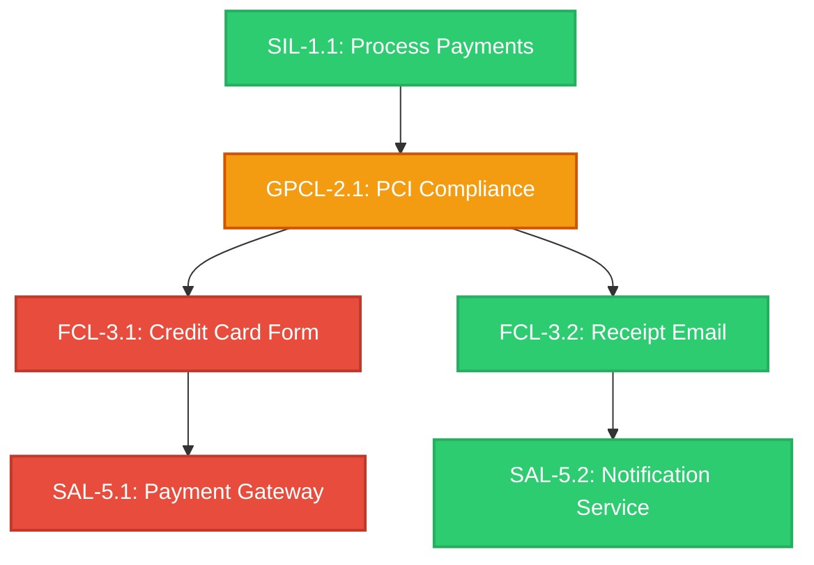
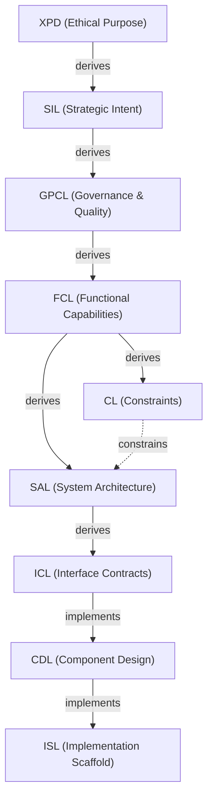

# DDR System Design Framework v6.3: User's Manual

## Executive Overview: Industry Needs and the DDR System

Historically, software engineering has suffered from a critical gap between what a system is *intended* to do and what it is *documented* to do. Traditional requirements documents (BRDs, PRDs, Tech Specs) quickly become stale, suffer from orphaned requirements, and fail to provide traceability from business intent down to the codebase.

The DDR System was created to eliminate this gap. By treating requirements not as static documents, but as a Directed Acyclic Graph (DAG) governed by strict rules, the DDR System provides a single source of truth where every node is traceable, every edge is typed, and every mutation is validated.

**Key Benefits:**

* **Mechanical Verification:** Structural violations (like orphaned requirements or circular dependencies) are mechanically detectable, removing reliance on human reviewer expertise.
* **Traceable Audit Trails:** Provides complete audit trails from high-level business intent down to implementation stubs.
* **Scalability:** Adoptable by a solo developer on day one, yet scales natively to enterprise complexity without structural changes.

---

## 1. The 7 Foundational Axioms

The DDR System is governed by seven inviolable axioms that ensure its structural integrity.

### AX-1: Traceability

* **Statement:** Every non-root node must cite at least one parent via a typed edge.
* **Implication:** Complete audit trails from intent to implementation; no orphaned requirements.
* **Real-World Scenario:** A developer attempts to add a new "Crypto Payment Gateway" into the Component Design Layer (CDL). Because AX-1 requires a parent citation, the system rejects the addition mechanically unless the developer can trace it back to an Interface Contract (ICL), which traces back to a Functional Capability (FCL). This actively prevents rogue feature development and scope creep.

### AX-2: Abstraction Ordering

* **Statement:** Technology and implementation specificity are deferred until logically necessary.
* **Implication:** Tiers above the Constraint Layer (CL)—specifically XPD, SIL, GPCL, and FCL—must contain no technology, hardware, or implementation references.
* **Real-World Scenario:** A product manager drafts a Strategic Intent Layer (SIL) node stating, "The system will use a React frontend to increase sales." Validation fails mechanically. AX-2 enforces that SIL must only define the business outcome ("increase sales"), deferring the "React" decision to the Constraint Layer (CL). This prevents premature technology lock-in.

### AX-3: Determinism

* **Statement:** Identical inputs produce unambiguous, mechanically verifiable outputs.
* **Implication:** Automated validation and compliance checking are possible for all structural rules; semantic rules require explicit human disposition before node activation.
* **Real-World Scenario:** During an audit, two different compliance officers run a `VERIFY` operation on the system DAG. Because of AX-3, both officers receive the exact same itemized list of structural violations, ensuring audits are entirely objective and reproducible.

### AX-4: Universality

* **Statement:** The Core applies to all software systems regardless of domain, scale, or technology.
* **Implication:** No domain-specific assumptions exist in any Core tier.
* **Real-World Scenario:** An enterprise transitions from building embedded IoT firmware to deploying cloud-native web applications. The DDR architecture remains exactly the same because the 9-tier core is domain-agnostic, saving massive retraining costs.

### AX-5: Extensibility

* **Statement:** Advanced analytical capabilities are delivered exclusively via optional Extensions.
* **Implication:** Core structure remains stable and does not depend on Extension behavior. Extensions may interact with Core via explicitly defined, non-mutating interfaces.
* **Real-World Scenario:** A team wants AI to suggest hardware profiles. Instead of mutating the core system, they activate the Hardware & Resource Intelligence Extension (HRE). The HRE safely annotates nodes with suggestions without altering the original, human-authored requirements.

### AX-6: Declarative Integrity

* **Statement:** The Core is strictly declarative; all inference, optimization, and automated recommendation are Extension-only behaviors.
* **Implication:** Core structural invariants cannot be destabilized by analytical logic.
* **Real-World Scenario:** An AI extension (like the ARE) hallucinates a flawed architectural pattern. Because of AX-6, this inference remains safely isolated in the Extension Candidate Pool and cannot autonomously mutate the active DAG or break existing compliance.

### AX-7: DAG Acyclicity

* **Statement:** No citation chain may produce a cycle; causality flows in one direction only.
* **Implication:** Graph traversal is always terminable.
* **Real-World Scenario:** Node A specifies a database schema, and Node B specifies an API that serves it. If a developer accidentally makes Node A depend on Node B, AX-7's cycle detection instantly blocks the `INSERT` operation, preventing an infinite loop during automated system building.

---

## 2. The DAG Architecture

The DDR System abandons flat documents in favor of a **Directed Acyclic Graph (DAG)**. In this model, individual requirements, constraints, and designs are discrete *Nodes*, and their relationships are directional *Edges*.

### Why a DAG?

Traditional documents suffer from linear rigidity. If a single compliance rule changes in chapter 1, it is impossible to mechanically determine which specific software functions in chapter 5 are broken. A DAG solves this by enabling **Dirty Propagation**.



*Diagram: Modifying a GPCL node mechanically flags its specific downstream FCL and SAL dependents as `DIRTY`, leaving unrelated branches untouched.*

**Real-World Scenario:** A new data residency law is passed in Europe. A compliance officer executes a `MODIFY` operation on the relevant GPCL (Governance) node. The DAG instantly cascades a `DIRTY` status to only the exact Functional Capabilities (FCL) and System Architecture (SAL) nodes that handle user data. The engineering team immediately knows exactly which components require re-validation, without having to manually audit the entire system.

---

## 3. Edge Types: The Connective Tissue

The DDR System utilizes exactly four strictly typed edges to define relationships. This limited vocabulary prevents ambiguity.

| Edge Type | Symbol | Semantics |
| :--- | :--- | :--- |
| **derives** | `──derives──▶` | The child's content is logically derived from the parent, or the parent is cited as authoritative lineage. |
| **constrains** | `╌╌constrains╌▶` | The parent sets enforceable limits on the child's design space. |
| **implements** | `──implements──▶` | The child provides a concrete realization of the parent's abstract specification. |
| **extends** | `···extends···▶` | An Extension adds metadata to a Core node without mutating it. |

**Real-World Scenarios:**

1. **Derives:** An FCL capability "User Login" *derives* from a GPCL mandate "Secure Authentication". The FCL node is the behavioral consequence of the governance requirement.
2. **Constrains:** A CL (Constraint Layer) node declaring "Must use Python 3.10" *constrains* the SAL (Architecture) layer. The architecture cannot dictate a Node.js microservice without causing a conflict.
3. **Implements:** An ISL (Implementation Scaffold) containing actual Python code stubs *implements* the abstract blueprints defined in the CDL (Component Design).
4. **Extends:** The Security & Compliance Engine (SCE) *extends* a GPCL node by attaching an external threat model to it as an annotation, never altering the core text authored by the compliance officer.

---

## 4. The Universal Node Format

Every node in the DDR System, regardless of its tier, adheres strictly to the Universal Node Format.

```yaml
[TIER]-[N].[M]: [Title]
  status:        DRAFT | ACTIVE | DIRTY | DEPRECATED | SUPERSEDED | SUPERSEDE_PENDING
  version:       [SemVer]
  created:       [ISO 8601]
  modified:      [ISO 8601]
  parent_ids:    [{id: [TIER-N.M], edge_type: derives|constrains|implements}]

  [Tier-compliant content body]
```

* **Immutable IDs:** Once assigned (e.g., `SIL-1.3`), an ID is permanent. No operation may alter it.
* **Status Lifecycle:** Nodes move strictly through approved states (e.g., a `DRAFT` becomes `ACTIVE` only after successful `VALIDATE` checks against atomic rules).
* **Parent Citations:** Guarantees Traceability (AX-1).

**Real-World Scenario:** A legacy authentication module is being phased out. The engineering team sets the node status to `DEPRECATED` via `MODIFY`, which alerts all downstream dependent components. Once the new module is built, the `SUPERSEDE` operation is executed. The old node becomes `SUPERSEDED` (retaining its original ID for historical audit records), a replacement node receives a brand new ID, and all child dependencies are automatically re-wired to the new ID and flagged as `DIRTY` to force re-validation.

---

## 5. Core DAG Topology: The 9-Tier Structure

The DDR framework dictates a canonical 9-tier topology.



### Deep Dive into the Tiers

1. **XPD (Existential Purpose Document):** Optional root. Defines human/societal needs and ethical boundaries. *Scenario: An AI healthcare app's XPD forbids selling patient data. This acts as an absolute veto over any downstream data monetization feature.*
2. **SIL (Strategic Intent Layer):** Defines the "Why" and measurable business outcomes.
3. **GPCL (Governance, Policy & Quality Layer):** Regulatory obligations, SLAs, throughput targets. *Scenario: GPCL requires 99.99% uptime. This forces specific resilience bounds downstream.*
4. **FCL (Functional Capability Layer):** User-facing workflows and system behaviors, absent of tech jargon.
5. **CL (Constraint Layer):** Non-negotiable hardware limits, chosen frameworks, and infrastructure ceilings.
6. **SAL (System Architecture Layer):** The crucial **Merge Node**. This is where functional behaviors (from FCL) are merged with and bounded by physical/technological realities (from CL).
7. **ICL (Interface & Contracts Layer):** Machine-verifiable data exchange contracts (e.g., OpenAPI, Protobuf).
8. **CDL (Component Design Layer):** Internal structural blueprints and logical state structures.
9. **ISL (Implementation Scaffold Layer):** The terminal leaf. Actual code stubs in the target language citing the exact CDL parent.

---

## 6. DAG Invariants

Invariants are the unbreakable laws of the graph. Violating them yields an invalid system definition.

* **INV-1:** No cycles permitted at any path length.
* **INV-2:** No tier-skipping permitted. Citations must point to the immediately preceding active tier (SAL is the only permitted merge-node exception).
  * *Real-World Scenario:* A developer tries to link an ISL code stub directly back to a SIL business objective, skipping the design layers. `VERIFY` blocks this. You cannot write code directly from a business goal without formalizing the architecture and contracts first.
* **INV-4:** When CL is inactive, SAL derives directly from FCL.
* **INV-6:** `SUPERSEDE` operations must be completely atomic.
  * *Real-World Scenario:* During a system upgrade, a network failure occurs midway through replacing a node. Because of INV-6, the system detects the partial application (`SUPERSEDE_PENDING`) and forces a rollback to the `prior_status`, preventing the graph from entering a corrupted, half-wired state.

---

This manual outlines the foundational architecture of the DDR v6.3 system. Would you like me to dive deeper into the **Atomic Operations Protocol (INSERT, MODIFY, SUPERSEDE)** or explore how the **AI Upward Reconstruction Engine (ARE)** safely infers nodes within the Extension pool?
