# DDR System v6.3 — Comprehensive User's Manual

> **Deterministic Design & Requirements System**
> Version 6.3 · Finalized · 2026-03-28
> *The authoritative practitioner reference for design, operation, and mastery of the DDR System framework*

---

## Document Information

| Property       | Value                                                                                  |
| -------------- | -------------------------------------------------------------------------------------- |
| Manual Version | 1.0                                                                                    |
| Covers         | DDR System Specification v6.3                                                          |
| Status         | Authoritative Reference                                                                |
| Audience       | Software architects, requirements engineers, technical leads, agentic AI practitioners |
| Prerequisites  | Familiarity with software requirements engineering, basic graph theory concepts        |

---

## Table of Contents

**Part I — Context & Foundations**

- [Chapter 1: Introduction & Purpose of This Manual](#chapter-1-introduction--purpose-of-this-manual)
- [Chapter 2: Business & Industry Context — Why the DDR System Was Created](#chapter-2-business--industry-context--why-the-ddr-system-was-created)
- [Chapter 3: Design Philosophy](#chapter-3-design-philosophy)

**Part II — Foundational Axioms**

- [Chapter 4: The Seven Foundational Axioms](#chapter-4-the-seven-foundational-axioms)

**Part III — The Graph Architecture**

- [Chapter 5: DAG Architecture — Foundations & Unique Advantages](#chapter-5-dag-architecture--foundations--unique-advantages)
- [Chapter 6: Edge Types](#chapter-6-edge-types)
- [Chapter 7: Universal Node Format](#chapter-7-universal-node-format)
- [Chapter 8: Core DAG Topology](#chapter-8-core-dag-topology)
- [Chapter 9: DAG Invariants](#chapter-9-dag-invariants)
- [Chapter 10: Node ID Format & Citation Rules](#chapter-10-node-id-format--citation-rules)

**Part IV — Tier Specifications**

- [Chapter 11: Constraint Precedence & Tier Overview](#chapter-11-constraint-precedence--tier-overview)
- [Chapter 12: Tier 0 — XPD: Existential Purpose Document](#chapter-12-tier-0--xpd-existential-purpose-document)
- [Chapter 13: Tier 1 — SIL: Strategic Intent Layer](#chapter-13-tier-1--sil-strategic-intent-layer)
- [Chapter 14: Tier 2 — GPCL: Governance, Policy & Quality Layer](#chapter-14-tier-2--gpcl-governance-policy--quality-layer)
- [Chapter 15: Tier 3 — FCL: Functional Capability Layer](#chapter-15-tier-3--fcl-functional-capability-layer)
- [Chapter 16: Tier 4 — CL: Constraint Layer](#chapter-16-tier-4--cl-constraint-layer)
- [Chapter 17: Tier 5 — SAL: System Architecture Layer](#chapter-17-tier-5--sal-system-architecture-layer)
- [Chapter 18: Tier 6 — ICL: Interface & Contracts Layer](#chapter-18-tier-6--icl-interface--contracts-layer)
- [Chapter 19: Tier 7 — CDL: Component Design Layer](#chapter-19-tier-7--cdl-component-design-layer)
- [Chapter 20: Tier 8 — ISL: Implementation Scaffold Layer](#chapter-20-tier-8--isl-implementation-scaffold-layer)

**Part V — Operations & Lifecycle**

- [Chapter 21: Node Status Lifecycle](#chapter-21-node-status-lifecycle)
- [Chapter 22: Atomic Operations Protocol](#chapter-22-atomic-operations-protocol)
- [Chapter 23: Dirty State, Propagation & Resolution Workflow](#chapter-23-dirty-state-propagation--resolution-workflow)
- [Chapter 24: Reconciliation Manifest](#chapter-24-reconciliation-manifest)

**Part VI — Consumption Modes**

- [Chapter 25: Full Mode vs. Express Mode](#chapter-25-full-mode-vs-express-mode)
- [Chapter 26: The UNBUNDLE Protocol](#chapter-26-the-unbundle-protocol)

**Part VII — Extension System**

- [Chapter 27: Extension Architecture](#chapter-27-extension-architecture)
- [Chapter 28: Extension Candidate Pool & ARE Lifecycle](#chapter-28-extension-candidate-pool--are-lifecycle)
- [Chapter 29: Extension Catalog — E1 through E9](#chapter-29-extension-catalog--e1-through-e9)

**Part VIII — Reference**

- [Chapter 30: Compliance & Validation Checklists](#chapter-30-compliance--validation-checklists)
- [Chapter 31: Glossary](#chapter-31-glossary)
- [Appendix A: Version History](#appendix-a-version-history)
- [Appendix B: Legacy Tier Migration](#appendix-b-legacy-tier-migration)

---

# PART I — CONTEXT & FOUNDATIONS

---

## Chapter 1: Introduction & Purpose of This Manual

### 1.1 What Is the DDR System?

The **Deterministic Design & Requirements (DDR) System** is a structured, graph-based framework for software documentation, requirements management, and traceability. It provides a rigorous, machine-verifiable methodology for expressing the full lineage of a software system — from its highest-level human or societal purpose all the way down to executable scaffolding code — while ensuring that every design decision is traceable, every constraint is validated, and every artifact is free of contamination from concerns that belong at a different level of abstraction.

Version 6.3 is the culmination of a design lineage stretching from v1.0's simple seven-tier linear model through to a mature, battle-tested, graph-theoretically sound architecture comprising nine tiers, four typed edge relationships, seven foundational axioms, eight atomic operations, and nine optional analytical extensions.

The DDR System is:

- **Domain-agnostic** — it applies equally to web applications, embedded systems, AI/ML platforms, enterprise SaaS products, civic infrastructure software, medical devices, and beyond.
- **Scale-agnostic** — a solo developer can adopt it on day one; an enterprise team of hundreds can use the identical structural model without modification.
- **Technology-agnostic** — at no point do the upper tiers of the DDR DAG reference specific technologies, languages, or frameworks. Technology specificity is deferred until it is logically required.
- **Correct by construction** — every mutation to the DDR graph triggers validation. The system cannot silently enter an inconsistent state; inconsistency is always detected and flagged.

### 1.2 How to Use This Manual

This manual is organized into eight parts, each targeting a specific dimension of DDR System knowledge:

- **Parts I–II** establish the *why* — the business context, philosophical rationale, and axiomatic foundations.
- **Part III** covers the *how the graph works* — the mathematical and structural underpinnings of the DAG architecture.
- **Part IV** covers the *what goes where* — the tier-by-tier specification of what content belongs at each level of abstraction.
- **Part V** covers *operations and change management* — how nodes are created, mutated, validated, and retired.
- **Part VI** covers *consumption flexibility* — the Full Mode and Express Mode profiles.
- **Part VII** covers the *Extension ecosystem* — nine optional analytical overlays.
- **Part VIII** is the *reference* — checklists, glossary, and historical context.

Each chapter is designed to be self-contained but cross-referenced, so practitioners can navigate to any topic and follow references to deepen understanding. Every major concept is accompanied by annotated Mermaid diagrams and concrete hypothetical real-world scenarios to ground abstract concepts in observable practice.

---

## Chapter 2: Business & Industry Context — Why the DDR System Was Created

### 2.1 The Problem Space

Modern software development organizations consistently suffer from a cluster of interconnected, costly, and largely avoidable failures:

**Requirements-Implementation Drift.** Specifications written at project inception frequently diverge from what is actually built. A business analyst writes a requirements document; an architect interprets it and produces an architecture document; a developer reads the architecture document and codes something subtly different. At each handoff, information is lost, assumptions are silently introduced, and the delivered system drifts further from the original intent. By delivery time, no one can reliably answer *why* a specific design choice was made.

**Orphaned Requirements.** In large projects, individual requirements nodes become disconnected from their justifications. A security constraint exists but references no regulatory framework. A performance target is specified but cannot be traced to a business objective. These orphaned requirements are a liability — they cannot be evaluated for relevance during scope changes, and they cannot be removed without the risk of accidentally discarding something critical.

**Premature Concretization.** Development teams routinely contaminate high-level requirements with implementation details. A business requirement specifying "the system shall process payments" becomes polluted with "using Stripe's v3 API over HTTPS with idempotency keys" before the architectural layer has even been touched. This coupling makes requirements fragile — they break whenever technology choices change — and creates traceability nightmares.

**Validation Gaps in Agentic AI Contexts.** The emergence of agentic AI coding tools — systems that generate entire modules or components from high-level prompts — has introduced a new class of problem. AI agents produce code that is syntactically valid but frequently semantically disconnected from the governing requirements. Without a machine-verifiable requirements DAG, there is no automated mechanism to assert that generated code satisfies stated intent.

**Compliance Audit Failure.** Regulated industries (healthcare, finance, aerospace, civic infrastructure) require complete audit trails demonstrating that every implementation decision satisfies applicable regulatory requirements. Traditional document-based approaches fail this test because the evidence chain is fragmented across multiple disconnected documents with no enforced structure linking them.

**Scale Complexity Explosion.** As projects grow from individual components to distributed systems with dozens of services, the cognitive overhead of maintaining consistent requirements across the system becomes exponentially more expensive. Without a structural model, cross-cutting concerns (security, performance, availability) are duplicated inconsistently across multiple documents.

### 2.2 What the DDR System Specifically Addresses

The DDR System was architected to resolve every class of failure described above through structural enforcement rather than process discipline:

| Problem                           | DDR Solution                                                                                                                                    |
| --------------------------------- | ----------------------------------------------------------------------------------------------------------------------------------------------- |
| Requirements-Implementation Drift | Typed edges enforce parent-child derivation; VERIFY detects any break in the citation chain                                                     |
| Orphaned Requirements             | AX-1 (Traceability) makes every non-root node cite at least one parent; CIT-R1 enforces this structurally                                       |
| Premature Concretization          | Tier-level atomic exclusion rules detect and reject technology contamination above the CL tier                                                  |
| Agentic AI Validation Gaps        | Machine-verifiable structural rules enable automated validation of AI-generated artifacts against the DAG                                       |
| Compliance Audit Failure          | The DAG provides a complete, immutable audit trail from ethical constraints (XPD) through implementation scaffolding (ISL)                      |
| Scale Complexity                  | The nine-tier hierarchical model provides a clear home for every class of content; Extension system adds analytical power without core mutation |

### 2.3 The Unique Role the DDR System Serves

The DDR System occupies a distinctive position in the software engineering tooling landscape that no existing methodology or tool class fully covers:

**It is not a requirements management tool** in the traditional sense (e.g., JIRA, Confluence, IBM Rational DOORS). Those tools provide storage and workflow for requirements but impose no structural validity constraints. The DDR System enforces structural correctness by construction.

**It is not a UML modelling tool.** UML provides a notation for expressing design. The DDR System provides a governance framework that enforces what may appear at each abstraction level and mandates traceable linkages between levels.

**It is not an architecture decision record (ADR) system.** ADRs capture individual decisions in isolation. The DDR System places every decision in a fully connected, directed, acyclic graph where its relationship to every other decision is explicit and validated.

**It is not merely a documentation standard.** Because every DDR node has a machine-verifiable atomic ruleset, the DDR System enables automated compliance checking, automated dirty-state propagation, and automated scaffold generation.

**It is uniquely positioned as the foundational context layer for agentic AI development.** When an AI coding agent is given a validated DDR DAG as its context, every generated artifact can be immediately evaluated for compliance with the governing requirements, constraints, and contracts defined in the graph. This transforms AI-generated code from a probabilistic guess into a verifiable implementation.

### 2.4 Industry Applications

The DDR System is particularly valuable in environments where:

**Regulatory Compliance Is Non-Negotiable.** Healthcare software (HIPAA, FDA 21 CFR Part 11), financial systems (PCI-DSS, SOC2, MiFID II), and government systems all require traceable audit trails that the DDR DAG produces automatically.

**Multi-Team Development at Scale.** When dozens of teams contribute to a single system, the DDR's tier separation prevents contamination of high-level requirements by low-level implementation concerns, and the DIRTY propagation system ensures teams are notified when upstream changes affect their work.

**AI/ML System Development.** Systems with significant ethical implications — AI recommendation engines, autonomous decision systems, public-facing AI interfaces — benefit critically from the XPD tier's ethical boundary conditions, which function as absolute veto rights over all downstream design decisions.

**Regulated Product Engineering.** Medical devices, automotive software (ISO 26262), and aerospace systems (DO-178C) require formal traceability from safety requirements to implementation. The DDR DAG satisfies this structural requirement natively.

**Long-Lived Systems Requiring Continuous Evolution.** Systems maintained over years or decades benefit from the DDR's immutable node IDs, SUPERSEDE protocol, and CIT-R7 parent-version freshness rule, which together ensure that evolution does not silently break established traceability chains.

### 2.5 The Benefits the DDR System Delivers

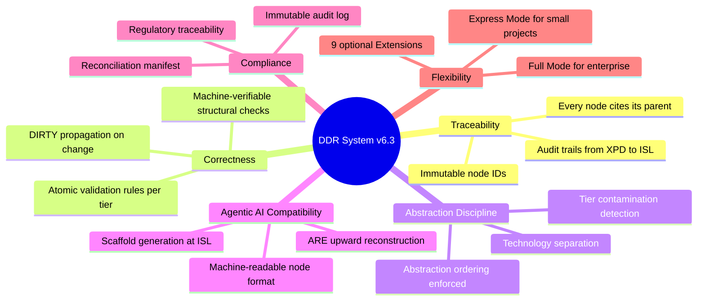

---

## Chapter 3: Design Philosophy

### 3.1 The Three Governing Principles

The DDR System is governed by three foundational design principles that were deliberately chosen to be mutually reinforcing and to avoid the failure modes common in requirements frameworks:

#### Principle 1: Minimize Design Complexity

> *Every element earns its existence. No tier, edge type, operation, or rule exists without a concrete problem it solves.*

This principle guards against framework bloat — the tendency of requirements systems to accumulate tiers, rule categories, relationship types, and metadata fields until the framework itself becomes a burden rather than an aid. Every structural element in the DDR System can be justified by pointing to a specific, observable failure mode it prevents.

The progression from v1.0's 7-tier linear model to v6.3's 9-tier DAG illustrates this principle in action: the version history shows not just additions but deliberate *consolidations* (11 tiers → 9, 6 edge types → 4, 11 operations → 8). Whenever two concepts could be expressed by one without losing expressiveness, they were merged.

The practical consequence is that the DDR System is **adoptable by a solo developer on day one**. A practitioner building an internal CLI tool does not need to activate XPD, may skip CL if constraints are unconstrained, and may use Express Mode to avoid the overhead of maintaining nine separate tier documents.

#### Principle 2: Avoid Premature Optimization

> *The Core defines the minimum viable graph. Advanced analytical capabilities are delivered exclusively via optional Extensions.*

The Extension system (Chapters 27–29) provides nine powerful analytical overlays: hardware profiling, dependency analysis, lifecycle versioning, observability mapping, AI upward reconstruction, security analysis, data domain validation, CI/CD planning, and ethics review. None of these capabilities live in the Core.

This separation has profound consequences:

- The Core structure is **stable**. A DDR v6.3 Core graph authored today will remain structurally valid even if every Extension is replaced, upgraded, or removed. Core stability is not contingent on Extension behavior.
- Extensions can be added, updated, or disabled without invalidating Core nodes. `EXT-R5` explicitly requires that disabling an Extension leaves Core CLEAN/DIRTY status unchanged.
- The Core never *anticipates* an Extension. Core tier rules make no assumptions about Extension-level inference. This prevents a subtle but dangerous anti-pattern where Core rules become meaningless without an Extension's output.

#### Principle 3: Maximize Structural Integrity

> *The DAG is the single source of truth. Every node is traceable, every edge is typed, every mutation is validated. The system is correct by construction.*

The DDR System takes a strong position: structural validity is non-negotiable and is mechanically enforced. This is in deliberate contrast to documentation-oriented approaches where "correctness" is a matter of author discipline.

The consequences of this principle appear throughout the specification:

- Every node mutation triggers atomic validation.
- SUPERSEDE operations are all-or-nothing: partial application is a structural violation.
- The VERIFY operation traverses the entire DAG and returns CLEAN only when zero violations exist.
- The reconciliation manifest provides a persistent, machine-readable ledger of all pending items, semantic gaps, and required human dispositions.

### 3.2 The v6.3 Change Philosophy

Version 6.3 was an *issue-resolution release* — its changes were motivated by specific ambiguities and enforcement gaps identified in v6.2. Understanding the philosophy behind each change class helps practitioners understand why the current design is the way it is:

| Change Area                 | Problem Being Solved                                                                                                                      | v6.3 Resolution                                                                                                              |
| --------------------------- | ----------------------------------------------------------------------------------------------------------------------------------------- | ---------------------------------------------------------------------------------------------------------------------------- |
| Explicit document profiling | Tooling could not machine-detect whether a document was a project instance or a system definition                                         | `document_profile` field with three canonical values makes intent machine-explicit                                           |
| Topology closure            | Four canonical `active_tiers` combinations were implied but not enforced; downstream validators had to implement their own topology logic | `active_tiers` is restricted to the four canonical ordered sets; any other combination is a schema violation                 |
| Lifecycle authority         | `status_transitions` and `prohibited_transitions` created dual-authority drift                                                            | `status_transitions` is the sole lifecycle authority; the field is machine-parseable                                         |
| ARE contract hardening      | ARE activation states and scoring profiles were under-typed                                                                               | Activation states are structurally typed; E5 requires explicit `scoring_profile`; custom profile structure is machine-shaped |
| Operation namespace         | Canonical operation names mixed with phase tokens and aliases                                                                             | Closed, normalized operation surface; `UNBUNDLE_EXECUTE` is the sole commit-phase token                                      |

---

# PART II — FOUNDATIONAL AXIOMS

---

## Chapter 4: The Seven Foundational Axioms

The DDR System's behavior is governed by seven axioms — inviolable logical statements from which all other structural rules are derived. An axiom is not a suggestion, a best practice, or a configurable option: it is a logical constraint that cannot be violated without the system ceasing to function as intended. Understanding each axiom deeply — not just its statement but its *justification* and *consequences* — is essential for practitioners who want to reason about edge cases and extensions.

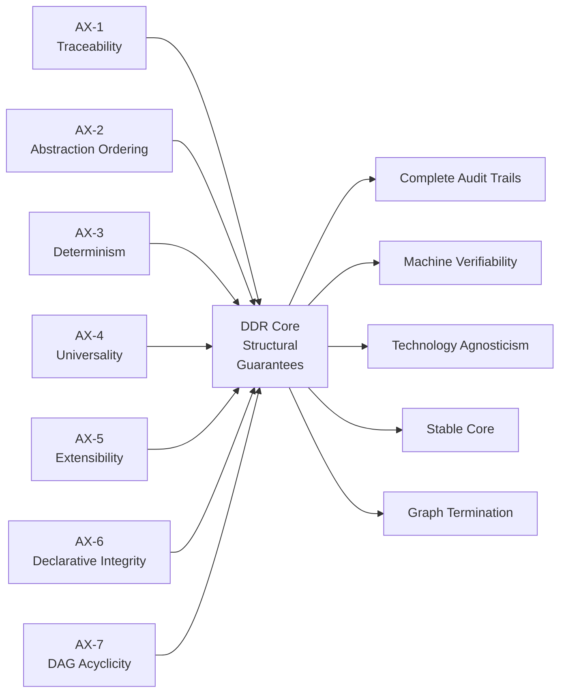

---

### 4.1 AX-1: Traceability

**Statement:** *Every non-root node must cite at least one parent via a typed edge.*

**Implication:** *Complete audit trails from intent to implementation; no orphaned requirements.*

#### 4.1.1 Technical Explanation

AX-1 is the axiom that transforms the DDR System from a collection of documents into a *graph*. Without this axiom, nodes are islands — each individually valid but collectively unrelated. With AX-1 enforced, every node in the DAG can be followed backward through its parent citations all the way to the root node, producing a complete causal chain that answers the question: *why does this artifact exist?*

The "typed" qualifier in AX-1 is as important as the citation requirement itself. A bare reference (node A references node B) does not convey *what kind of relationship* exists between A and B. In the DDR System, every citation carries one of four typed edges (`derives`, `constrains`, `implements`, `extends`), each with specific semantics. This typing enables validators to detect not just whether a citation exists, but whether the *relationship is appropriate* given the tier positions of the parent and child nodes.

The `derivation_mode` annotation on `derives` edges adds a second semantic dimension: `semantic` (child content is logically derived from parent requirements) vs. `traceability` (the citation is an authority linkage — the parent is cited as a reference, not a logical antecedent). This distinction prevents practitioners from masking shallow citations as derivations.

Enforcement of AX-1 is structural: CIT-R1 requires ≥1 `parent_id` on all non-root nodes; CIT-R4 requires that any inline reference in node content has a matching entry in `parent_ids`; CIT-R7 requires that children re-validate when their cited parent's version changes.

#### 4.1.2 Justification

The absence of traceability is the root cause of a wide class of software project failures. Consider what happens when a requirement cannot be traced to its origin:

- During a regulatory audit, the auditor asks *"which regulation mandates this security control?"* — the team cannot answer.
- During a scope reduction exercise, the team attempts to remove a feature — but cannot determine whether removing it would violate a compliance obligation.
- During a post-production incident, the engineering team traces a bug to a design decision — but cannot determine whether the design decision was made to satisfy a business requirement or was an arbitrary choice made by an individual developer.

AX-1 makes all of these scenarios resolvable by construction.

#### 4.1.3 Hypothetical Real-World Scenario: Medical Records Platform

A hospital network is developing an electronic health records (EHR) platform. During an FDA audit for 21 CFR Part 11 compliance, the auditor requests the evidence chain demonstrating that the system's audit logging implementation (an `ISL` node) satisfies the regulatory requirement for audit trail integrity (a `GPCL` node citing FDA 21 CFR Part 11 §11.10(e)).

Without AX-1, the audit logging implementation is a standalone artifact. The team must manually trace a chain of documents — requirements spec → architecture doc → implementation guide — none of which are formally linked, and some of which may have been updated without being re-validated against upstream requirements.

With AX-1 enforced throughout the DDR DAG, the evidence chain is automatic:

```
ISL-8.3 (audit logging stub)
  --implements--> CDL-7.2 (AuditLogger component blueprint)
  --implements--> ICL-6.4 (AuditEvent contract)
  --derives(semantic)--> SAL-5.2 (audit subsystem architecture)
  --derives(semantic)--> FCL-3.7 (audit trail capability)
  --derives(traceability)--> GPCL-2.3 (21 CFR Part 11 §11.10(e) compliance requirement)
  --derives(semantic)--> SIL-1.1 (strategic compliance objective)
```

The auditor receives a machine-generated compliance trace in seconds. Every link is typed, versioned, and validated. VERIFY confirms the chain is CLEAN.

---

### 4.2 AX-2: Abstraction Ordering

**Statement:** *Technology and implementation specificity are deferred until logically necessary.*

**Implication:** *Tiers above CL (XPD, SIL, GPCL, FCL) must contain no technology, hardware, or implementation references.*

#### 4.2.1 Technical Explanation

AX-2 is the axiom that enforces *cognitive stratification* of the design process. It mandates that the *what* and *why* of a system be fully specified before the *how* is introduced. The boundary is architectural: tiers XPD through FCL must be completely free of technology, hardware, framework, or implementation references. These concerns are introduced only at CL (when constraints are declared) and developed at SAL and below.

The enforcement mechanism is a set of atomic exclusion rules at each tier. For example:

- `SIL-E1`: Must not reference hardware, technology stacks, frameworks, or languages.
- `GPCL-E1`: Must not specify technology frameworks, library choices, or hardware specifications.
- `FCL-E1`: Must not name specific classes, modules, APIs, or algorithms.
- `FCL-E2`: Must not specify network protocols, serialization formats, or data schemas.

When VALIDATE is invoked on a node, it checks these exclusion rules mechanically (structural verification mode) or requires human disposition (semantic verification mode). A GPCL node that mentions "PostgreSQL" violates GPCL-E1 and cannot transition to ACTIVE.

#### 4.2.2 Justification

The contamination of high-level requirements with low-level implementation details is one of the most costly and pervasive problems in software engineering. It creates several specific failure modes:

**Technology Coupling.** When a functional requirement says "the system shall authenticate users via OAuth 2.0 with JWT bearer tokens," the requirement has been coupled to a specific technology choice. If the authentication library is deprecated or the organization mandates a different standard, the *functional requirement itself* must be rewritten — even though the underlying business need (authenticate users) has not changed.

**False Precision.** Implementation-polluted requirements appear more complete than they are. A requirement that says "using Redis pub/sub" *seems* specific, but it actually defers real questions (message durability? retry behavior? backpressure handling?) into the implementation, where they will be discovered late and expensively.

**Audit Confusion.** In regulated environments, a regulatory auditor reviewing a GPCL tier that contains "Python 3.11 with FastAPI" has no way to determine whether that technology choice was mandated by regulation, by organizational policy, or was an arbitrary developer preference. AX-2 enforces that regulatory mandates live in GPCL *without technology specificity*, and technology selections are declared separately in CL with explicit `constraint_origin` traceability.

#### 4.2.3 Hypothetical Real-World Scenario: Legacy System Migration

A financial services company is migrating a legacy transaction processing system from COBOL to a modern stack. The requirement for "process ACH transactions within 2 seconds of receipt" exists in the legacy documentation but is embedded in a COBOL-specific requirements document alongside specific database column definitions and transaction record layouts.

When the migration team attempts to port requirements to the new system, they cannot cleanly separate the *business rule* (process within 2 seconds) from the *implementation artifact* (COBOL record layout). They must reverse-engineer intent from implementation, a process that introduces errors.

In a DDR-governed system, this scenario cannot occur. AX-2 ensures:

```
GPCL-2.4: ACH transactions must be processed within 2 seconds of receipt
  (technology-neutral, traceable to SIL-1.2 operational efficiency objective)

CL-4.3: Runtime environment declared as JVM 21 on Linux x86_64
  (constraint_origin: imposed, citing vendor contract)

SAL-5.5: Transaction processing subsystem; queue-based ingestion pattern
  (cites GPCL-2.4 + CL-4.3, technology-constrained but architecture-neutral above ICL)
```

When the runtime stack changes from JVM to Node.js, only CL-4.3 is modified. The GPCL performance requirement, the FCL capability, and the SAL architectural pattern remain valid. CIT-R7 marks SAL-5.5 DIRTY for re-validation against the new CL constraint — but the re-validation effort is minimal because the abstraction separation was clean from the start.

---

### 4.3 AX-3: Determinism

**Statement:** *Identical inputs produce unambiguous, mechanically verifiable outputs.*

**Implication:** *Automated validation and compliance checking are possible for all structural rules; semantic rules require explicit human disposition before node activation.*

#### 4.3.1 Technical Explanation

AX-3 is the axiom that makes the DDR System machine-operable. Without determinism, validation rules would be ambiguous — the same node content could pass or fail depending on context, interpretation, or validator implementation. AX-3 demands that for any given node and rule set, the validation outcome is unambiguous and reproducible.

The DDR System achieves AX-3 through a bifurcated rule model:

**Structural rules** are defined with `verification: structural` and are mechanically evaluable. Examples include: does a node contain an inline citation without a matching `parent_ids` entry? (CIT-R4); does a `CL` node have `constraint_origin` declared? (CL-R9); does a `GPCL` node reference a specific framework? (GPCL-E1 keyword detection). These rules produce deterministic pass/fail results.

**Semantic rules** are defined with `verification: semantic` and require human judgment. Examples include: is this GPCL node's constraint "enforceable and testable" rather than "aspirational"? (GPCL-R2); does this FCL capability "describe behaviors from the perspective of a user or external system"? (FCL-R1). For semantic rules, VALIDATE does not attempt mechanical evaluation — it emits a `REVIEW_REQUIRED` status in the reconciliation manifest, requiring a human practitioner to record APPROVED or REJECTED with rationale before the node may transition to ACTIVE.

This bifurcation is itself deterministic: the classification of rules as structural or semantic is fixed in the specification and cannot change at runtime.

AX-3 also governs the ARE Extension's scoring system. ARE-R2 requires that identical source evidence inputs produce identical scores under the same scoring profile — a direct application of AX-3 to AI-inferred candidates.

#### 4.3.2 Justification

Requirements validation systems that rely on subjective assessments ("does this meet best practices?") are ineffective for several reasons: different validators produce different outcomes, validation results cannot be automated, and compliance demonstrations cannot be independently verified. AX-3 eliminates this class of problem for the structural rule set while explicitly acknowledging (rather than hiding) the boundary where human judgment is genuinely required.

The semantic rule boundary is not a weakness — it is an honest acknowledgment that some questions cannot be mechanically resolved. The value of AX-3 is that it *makes the boundary explicit and forces human accountability* for semantic decisions, rather than permitting those decisions to be implicitly deferred or silently skipped.

#### 4.3.3 Hypothetical Real-World Scenario: Automated Compliance Pipeline

A DevOps team builds an automated compliance gate in their CI/CD pipeline that runs DDR VALIDATE on every pull request that modifies a `GPCL` node. The pipeline must produce a binary pass/fail result to block or permit merges.

Without AX-3, the pipeline cannot reliably produce binary results — some rules would require subjective interpretation, causing the pipeline to either skip important rules (false pass) or require human review for everything (negating the automation benefit).

With AX-3, the pipeline behavior is well-defined:

- All structural rules (GPCL-R1 through GPCL-R10 with `verification: structural`) are evaluated automatically → pass/fail.
- Semantic rules (GPCL-R2 with `verification: semantic`) emit `REVIEW_REQUIRED` items.
- The pipeline blocks the merge if any structural rule fails OR if any `REVIEW_REQUIRED` item from a prior evaluation lacks a recorded human disposition in the reconciliation manifest.

The team achieves full compliance automation for structural concerns while preserving necessary human oversight for semantic concerns — precisely as AX-3 intends.

---

### 4.4 AX-4: Universality

**Statement:** *The Core applies to all software systems regardless of domain, scale, or technology.*

**Implication:** *No domain-specific assumptions in any Core tier.*

#### 4.4.1 Technical Explanation

AX-4 is what makes the DDR System a *framework* rather than a *methodology for a specific domain*. Every Core tier, every atomic rule, and every structural invariant is expressible without reference to any specific:

- Application domain (web, embedded, AI/ML, enterprise, civic)
- Technology stack (Java, Python, Rust, COBOL, cloud-native, on-premise)
- Regulatory regime (HIPAA, PCI-DSS, FDA, ISO 26262, SOC2)
- Team scale (solo developer to enterprise programme)

AX-4 is enforced by the design of every tier's atomic rules: they are stated in domain-neutral language. FCL asks "what externally observable behaviors and user-facing capabilities must the system provide?" — not "what API endpoints must the system expose?" or "what user stories must the system deliver?" SAL asks "how is the system structurally decomposed, and what patterns govern component interaction?" — not "what microservices architecture does the system use?"

Domain-specific analytical needs are satisfied by the Extension system, where Extensions may be written with domain-specific intelligence without polluting the Core. The EHD Extension (E9) provides ethics and human-centered design analysis; the SCE Extension (E6) provides security threat modeling — domain-relevant capabilities that are architecturally isolated from Core behavior.

#### 4.4.2 Justification

Domain-specific requirements frameworks are common (e.g., RUP for enterprise, SAFe for Agile, DO-178C for aviation), but they are only applicable within their domain. When an organization works across domains — a consultancy delivering both healthcare and fintech systems, a platform engineering team serving both AI and traditional software products — domain-specific frameworks create a fragmented tooling landscape with incompatible vocabularies and incompatible audit outputs.

AX-4 ensures that the DDR System provides a *single structural model* across all projects, reducing training burden, enabling tooling reuse, and allowing audit evidence to be produced consistently regardless of the domain being served.

#### 4.4.3 Hypothetical Real-World Scenario: Cross-Domain Platform Engineering Team

A platform engineering team at a large enterprise serves three product lines: a medical device data platform (FDA regulated), a retail analytics SaaS product (GDPR regulated), and an internal developer productivity toolchain (no regulatory overhead). Each product has different regulatory concerns, different technology stacks, and different scale requirements.

Without a universal framework, the team maintains three separate requirements methodologies, three sets of templates, three validation workflows, and three auditing systems. The cognitive overhead of context-switching between methodologies is significant, and cross-team knowledge transfer is impeded.

With AX-4, the DDR System applies identically to all three projects:

- The medical device platform activates XPD with FDA-specific ethical constraints; the analytics SaaS activates XPD with GDPR scope; the internal toolchain skips XPD entirely (no external ethical impact).
- GPCL captures FDA 21 CFR constraints for the medical platform, GDPR data residency rules for the analytics platform, and minimal internal quality SLAs for the internal tool.
- The Core structure — nine tiers, four edge types, eight operations — is identical across all three.

The team maintains one toolchain, one training curriculum, one audit methodology. AX-4 makes this possible.

---

### 4.5 AX-5: Extensibility

**Statement:** *Advanced analytical capabilities are delivered exclusively via optional Extensions.*

**Implication:** *Core structure remains stable and does not depend on Extension behavior. Extensions may interact with Core via explicitly defined, non-mutating interfaces.*

#### 4.5.1 Technical Explanation

AX-5 is the architectural boundary axiom. It defines a strict separation between the DDR Core (declarative, stable, universal) and the Extension ecosystem (analytical, domain-specific, optional). This separation is enforced through three mechanisms:

**Structural Isolation:** Extensions store all their output in `extension_annotations` — a namespaced metadata map on Core nodes. Extensions may not modify `content`, `parent_ids`, `tier`, `status`, or any other Core field. This is enforced by schema validation.

**Non-Mutating Interface:** Extensions read Core nodes and produce annotations, advisories, and external artifacts (reports, IaC templates, deployment manifests). They do not trigger DIRTY state changes, cannot validate or invalidate Core nodes, and cannot block Core operations.

**Core Independence:** The Core's atomic rules make no reference to any Extension. A Core graph is structurally complete and validatable with zero Extensions active. `EXT-R5` explicitly requires that disabling an Extension leaves Core CLEAN/DIRTY status unchanged — if an Extension could affect Core status, the Core would be implicitly dependent on the Extension.

The FCL-R7 rule is an instructive example of AX-5 in practice. FCL-R7 requires that FCL nodes enumerate all logical data entities involved in a capability. This requirement lives in the Core because its absence (not knowing what data entities are involved in a capability) would create traceability gaps that are independent of whether the DDE Extension (E7) is active. DDE-R5 *confirms* FCL-R7 enumeration; it does not *replace* or *infer* it. If FCL-R7 enumeration is absent, DDE does not perform discovery — it flags the FCL node as having a Core validation failure.

#### 4.5.2 Justification

Without AX-5, the boundary between "what the system knows" and "what analysis infers" collapses. This produces a dangerous situation where the correctness of the Core DAG depends on analytical inferences that may be incorrect, context-dependent, or unavailable when the Extension is disabled.

Consider the ARE Extension (E5), which infers missing architectural nodes from existing ISL/CDL/ICL/SAL content. Without AX-5, ARE-inferred nodes might be automatically inserted into the Core DAG without human review. This would make the Core's correctness contingent on ARE's inference quality — a direct violation of AX-6 (Declarative Integrity). AX-5 prevents this by requiring that ARE-inferred nodes remain in the Candidate Pool until a human explicitly promotes them via the validated INSERT operation.

#### 4.5.3 Hypothetical Real-World Scenario: Extension Upgrade Isolation

An engineering organization has a validated DDR Core graph for a payment processing system — 47 nodes across 9 tiers, all ACTIVE, VERIFY returns CLEAN. The organization decides to upgrade the DGA Extension (E2) from version 1.0 to version 2.0, which introduces new transitive dependency analysis capabilities.

Without AX-5, the DGA upgrade might trigger re-evaluation of Core nodes, potentially marking some as DIRTY or failing validation based on new dependency analysis logic. The CLEAN Core graph could become inconsistent as a result of an Extension update — a violation that could block a production deployment.

With AX-5, the DGA upgrade has zero effect on Core node status. DGA v2.0 reads the same Core nodes, produces richer `extension_annotations`, and adds more detailed `extension_advisories` to the reconciliation manifest — but not a single Core node changes status. The Core remains CLEAN; the organization reviews DGA v2.0's new advisories at their discretion.

---

### 4.6 AX-6: Declarative Integrity

**Statement:** *The Core is strictly declarative; all inference, optimization, and automated recommendation are Extension-only behaviors.*

**Implication:** *Core structural invariants cannot be destabilized by analytical logic.*

#### 4.6.1 Technical Explanation

AX-6 defines the *epistemic character* of the DDR Core: it declares, rather than infers. Every Core node contains human-authored, explicit content. The Core does not reason about its own content; it does not infer missing nodes from existing ones; it does not recommend optimizations; it does not auto-populate fields based on patterns.

This is a profound constraint. It means:

- `CL-E1`: CL nodes must not auto-derive, infer, or recommend configurations (this is an Extension responsibility).
- Constraint precedence (Chapter 11) is a *structural rule* applied by VERIFY, not an inference performed by Core logic.
- DIRTY propagation rules are explicitly enumerated in the specification — they are applied mechanically, not inferred from graph structure.

AX-6 is complementary to AX-3 (Determinism). AX-3 requires that identical inputs produce identical outputs; AX-6 ensures that Core nodes are *authored inputs*, not inferred outputs. Together, they guarantee that the Core DAG is a stable, human-controlled artifact.

#### 4.6.2 Justification

Declarative integrity is the property that makes the DDR Core *auditable*. Every statement in the Core was authored by a human practitioner (or promoted from an AI candidate by human decision). There is no "automatic" content in the Core. This means that when a compliance auditor reviews a Core node, they can ask "who authored this?" and receive a definitive answer. When a node is incorrect, there is a human author accountable for the error.

Systems that mix human-authored declarations with machine-inferred content blur this accountability boundary. Was this security requirement inferred by the tool or authored by the architect? AX-6 makes the answer unambiguous: every Core node was human-authored. Every Extension annotation is machine-generated and clearly namespaced as such.

#### 4.6.3 Hypothetical Real-World Scenario: Regulatory Audit of an AI-Assisted System

An AI system that makes healthcare recommendations (triage prioritization for emergency departments) is subject to a rigorous regulatory review. The regulators want to audit not just the system's behavior but the *governance of its development*.

A key regulatory question is: "Were the ethical boundary conditions governing this AI system authored by qualified human practitioners, or were they AI-generated?"

With AX-6, the answer is unambiguous:

- XPD tier nodes (ethical boundaries) are Core nodes → human-authored, human-approved.
- SIL tier nodes (strategic intent) → human-authored.
- Any AI-generated content appears only in `extension_annotations` (namespaced, identifiable as Extension-produced) or in the ARE Candidate Pool (not yet Core nodes) until explicitly promoted by a human via INSERT with full validation.

The organization can demonstrate with machine-generated audit trails that every Core node representing an ethical constraint, a governance mandate, or a functional requirement was human-authored and human-approved. AX-6 makes this guarantee possible.

---

### 4.7 AX-7: DAG Acyclicity

**Statement:** *No citation chain may produce a cycle; causality flows in one direction only.*

**Implication:** *Graph traversal is always terminable.*

#### 4.7.1 Technical Explanation

AX-7 is the graph-theoretic foundation of the DDR System. A cycle in the citation graph would mean that some node A derives from B which derives from C which derives from A — an epistemological impossibility (A's existence depends on C's existence which depends on A's existence). Beyond the logical contradiction, cycles make graph traversal non-terminating, breaking VERIFY, VALIDATE, and DIRTY propagation algorithms.

AX-7 is enforced at INSERT time: every INSERT operation triggers DAG cycle detection. A node cannot be successfully inserted if its `parent_ids` would create a cycle. Cycle detection is performed using depth-first search from the prospective parent — if any path from the parent leads back to the prospective child (or to the prospective child's future ID), the INSERT is rejected atomically.

The acyclicity constraint applies to the *entire citation graph* — not just within a single tier, but across all tiers. An ISL node cannot have a cycle through CDL and back to ISL; a CL node cannot have a cycle through SAL and back to CL (which is also prevented by INV-2's tier-ordering rule).

Note that the Extension system uses `extends` edges, which are stored in `extension_annotations` — not in `parent_ids`. `EXT-R6` requires that Extension-internal derived artifact graphs maintain their own acyclicity, extending AX-7's guarantee to the Extension domain.

#### 4.7.2 Justification

Acyclicity is the property that makes causality well-defined in the DDR graph. The DAG structure enables the following critical operations that would be impossible in a cyclic graph:

- **Complete topological ordering**: Every valid enumeration of DAG nodes respects parent-before-child ordering, enabling complete traversal in one pass.
- **Finite DIRTY propagation**: When a node is modified, DIRTY state propagates *downward* to descendants — this always terminates because descendants form a finite acyclic set.
- **Deterministic compliance checking**: Checking whether an ISL node satisfies a GPCL requirement requires tracing upward through the citation chain — this always terminates because the chain has finite length (root → leaf).
- **Root identification**: In any connected acyclic directed graph, there is exactly one root node reachable from all other nodes. This is the XPD or SIL node — the unambiguous origin of the entire system's design lineage.

#### 4.7.3 Hypothetical Real-World Scenario: Detecting a Circular Constraint

During a complex system redesign, an architect attempts to create a CL constraint node that references a SAL node, which in turn cites back to a different CL node, which the architect intends to link back to the SAL node creating a mutually reinforcing constraint pair. This is a sophisticated cycle: CL-4.5 → [constrains] → SAL-5.3 → [derives] → CL-4.6 → [constrains] → SAL-5.3.

Without AX-7 enforcement, this cycle would silently enter the graph. VERIFY traversal would loop indefinitely (or until a stack overflow); DIRTY propagation from CL-4.5 would never terminate; compliance evidence chains would be circular and therefore meaningless.

With AX-7 enforced by INSERT cycle detection, the attempt to INSERT CL-4.6 with `parent_ids` pointing to SAL-5.3 is rejected atomically — the cycle detector identifies that SAL-5.3 already has CL-4.5 as a constraint parent, and CL-4.5 will appear in the ancestry of CL-4.6 if the INSERT proceeds. The architect receives a `CYCLE_DETECTED` error with the specific citation path, and is forced to resolve the design contradiction at the requirements level rather than discovering it at integration time.

---

# PART III — THE GRAPH ARCHITECTURE

---

## Chapter 5: DAG Architecture — Foundations & Unique Advantages

### 5.1 What Is a Directed Acyclic Graph?

A **Directed Acyclic Graph (DAG)** is a mathematical structure consisting of:

- **Nodes (vertices):** discrete, self-contained units of information.
- **Directed edges:** relationships between nodes with a defined direction (parent → child), where the direction encodes *dependency* or *derivation* — the child depends on or is derived from the parent.
- **Acyclicity:** no path of directed edges leads from any node back to itself.

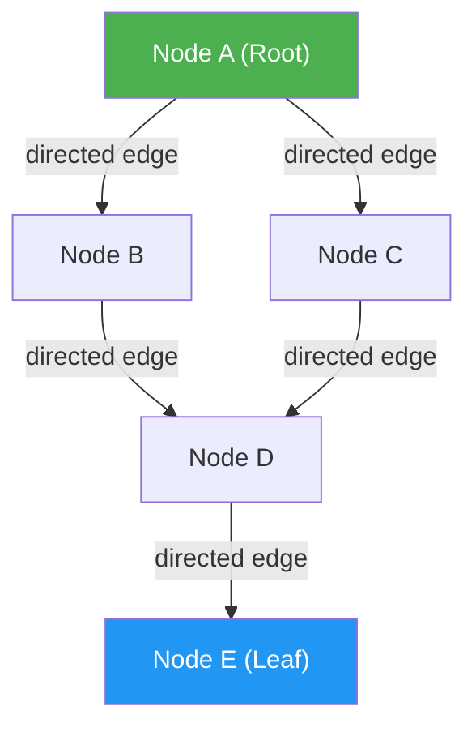

The key properties of a DAG that distinguish it from other data structures:

| Property                 | Significance in DDR Context                                                         |
| ------------------------ | ----------------------------------------------------------------------------------- |
| **Directed edges**       | Causality is unambiguous; parent → child means "child derives from parent"          |
| **Acyclicity**           | Every derivation chain has a definite origin; traversal always terminates           |
| **Multiple parents**     | A node may derive from multiple parents (the SAL merge node pattern)                |
| **Multiple children**    | A parent node may have multiple child derivations (branching)                       |
| **Topological ordering** | Nodes can always be enumerated from root to leaf respecting dependency order        |
| **Reachability**         | From any node, traversal can reach the root — producing a complete provenance chain |

### 5.2 Why a DAG? The Alternatives and Their Failures

Before examining the DDR System's specific DAG design, it is instructive to consider why alternative structures were rejected:

**Linear Chain (v1.0 approach):**

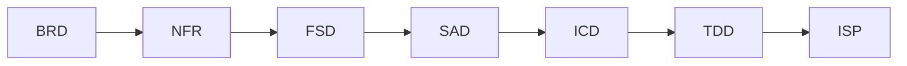

A linear requirements chain (Business Requirements → Non-Functional Requirements → Functional Spec → System Architecture → …) was the v1.0 DDR model and reflects traditional documentation waterfall thinking. Its failure modes:

- No support for many-to-many relationships between requirements
- No way to express that SAL is constrained by *both* FCL (functional) and CL (constraints) simultaneously
- Cross-cutting concerns (security, performance) cannot be expressed without duplication
- Cannot represent requirement fan-out (one GPCL regulation governing multiple FCL capabilities)

**Tree:**

A tree (each node has exactly one parent) resolves the fan-out problem but not the fan-in problem. SAL's merge node behavior — where it derives from *both* FCL and is constrained by CL — cannot be represented in a tree without either duplicating nodes or introducing false hierarchy.

**General Directed Graph (with cycles permitted):**

Permitting cycles would allow circular derivations ("requirement A is justified by requirement B which is justified by requirement A"), which are epistemologically void. Cycle detection overhead would be O(V+E) per VERIFY traversal — expensive on large graphs — and more importantly, cycles would break the fundamental causality guarantee that makes the DDR System auditable.

**Hypergraph:**

A hypergraph (where edges connect sets of nodes rather than pairs) would provide even more expressive power — but at the cost of dramatically increased conceptual complexity. The DDR System's typed edge vocabulary (`derives`, `constrains`, `implements`, `extends`) provides sufficient expressiveness for all required relationship types using standard directed binary edges.

The DAG is the uniquely optimal structure: it is maximally expressive for the DDR's requirements without introducing unnecessary complexity or breaking computational guarantees.

### 5.3 The DDR System's Specific DAG Design

The DDR System's DAG is not a generic DAG — it is a *typed*, *tiered*, *stratified* DAG with specific topological constraints:

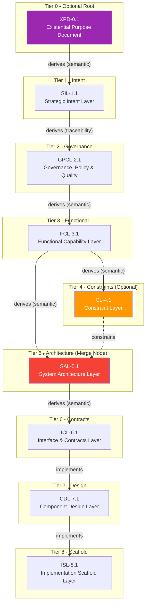

The distinctive structural features of the DDR DAG are:

**Tier stratification:** Nodes are assigned to exactly one of nine tiers, and edges must respect tier adjacency rules (INV-2). This stratification enforces the abstraction ordering mandated by AX-2.

**Typed edges:** Every directed edge carries a type (`derives`, `constrains`, `implements`, `extends`) with specific semantics. This allows VERIFY to detect not just whether a citation exists, but whether the *relationship type is semantically appropriate* for the tier positions involved.

**The SAL merge node:** SAL-tier nodes are unique in having two parent tiers — FCL (functional derivation) and CL (constraint application, when active). This merge node pattern is the structural expression of the architectural insight that system architecture is the convergence point where functional requirements and implementation constraints are jointly resolved.

**CL as an optional bypass:** When CL is inactive (no pre-committed technology constraints), SAL derives directly from FCL. When CL is active, SAL must cite *both* FCL (derives) and CL (constrains). INV-4 captures this conditional topology rule.

### 5.4 Unique Benefits of the DAG Architecture in the DDR Context

#### Benefit 1: O(n) Complete Audit Trail Generation

For any leaf node (ISL-tier scaffold), a depth-first traversal upward through parent citations produces a complete audit trail from scaffold to root. This traversal is O(V+E) in the worst case and produces the full causal chain. No other data structure provides this capability as efficiently while maintaining the independence of nodes at each tier.

#### Benefit 2: Automatic DIRTY Propagation

When a GPCL governance requirement is modified, *every descendant* — all FCL capabilities, CL constraints, SAL architectural decisions, ICL contracts, CDL designs, and ISL scaffolds that derive (directly or transitively) from that GPCL node — must be re-validated. In a DAG, this propagation is computed by a downward traversal starting at the modified node. The set of affected nodes is exactly the descendant subgraph — no more, no less. This precision is only possible because of the DAG's directed structure: you know exactly which nodes derive from a given node, and you know the traversal will terminate.

#### Benefit 3: Root-Cause Traceability for Any Artifact

Given any implementation scaffold (ISL node), a practitioner can ask: "Which business objective does this code satisfy?" The answer is obtained by traversing upward through parent citations: ISL → CDL → ICL → SAL → FCL → GPCL → SIL → XPD. Each step is typed, versioned, and validated. This root-cause traceability is the foundational capability for compliance auditing, impact analysis, and technical debt identification.

#### Benefit 4: Change Impact Analysis

Before modifying a node, the VERIFY operation can enumerate all descendants — the "impact surface" of the proposed change. A practitioner can determine, before executing MODIFY, exactly how many and which nodes will become DIRTY. This enables informed decision-making about the cost of change, particularly for high-tier nodes (GPCL changes that affect dozens of FCL nodes, for example).

#### Benefit 5: Merge Node Expressiveness

The SAL merge node pattern elegantly handles the ubiquitous software engineering challenge of satisfying multiple independent constraint dimensions simultaneously. An architectural decision must satisfy functional requirements *and* be bounded by technology constraints. The DAG expresses this naturally: SAL derives from FCL (functional parent) and is constrained by CL (constraint parent). Validators check both lineages independently; DIRTY propagation fires from either parent.

### 5.5 Real-World DAG Architecture Examples

#### Example 1: E-Commerce Platform — Fan-Out from GPCL

A single GPCL compliance node (PCI-DSS PAN encryption requirement) fans out to multiple FCL capabilities, each of which fans out to multiple SAL components, each to multiple ICL contracts, etc. The DAG enables tracking this one-to-many relationship explicitly:

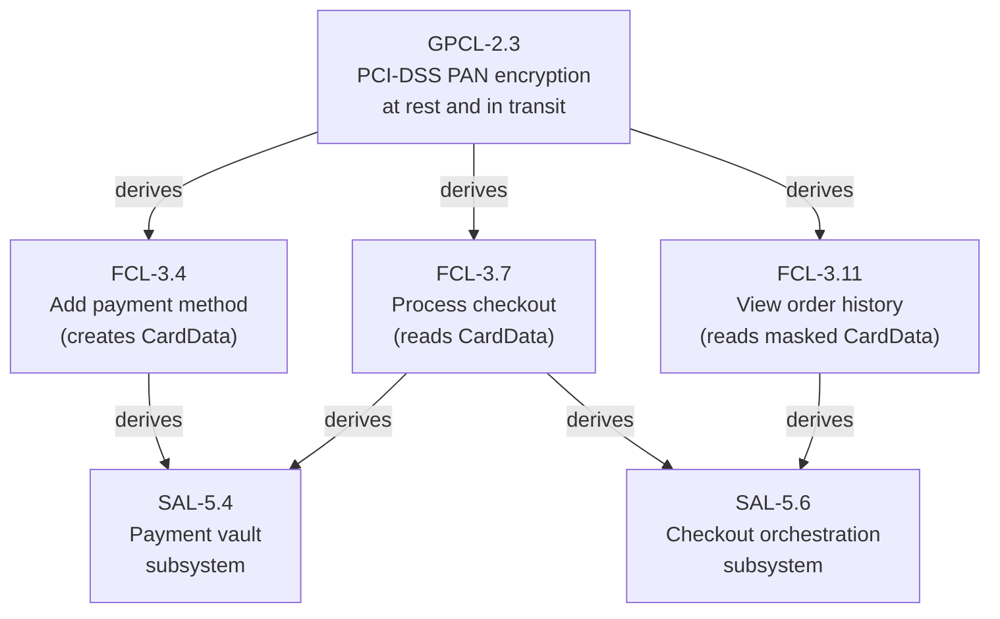

When GPCL-2.3 is updated (e.g., to reference PCI-DSS v4.0 instead of v3.2), DIRTY propagates to F1, F2, F3, S1, and S2 simultaneously. No descendant is missed; no non-descendant is incorrectly flagged.

#### Example 2: IoT Platform — CL Constraint Merge at SAL

A microcontroller-based IoT platform has a hard RAM constraint of 256KB (CL node with `constraint_origin: imposed`). FCL defines data buffering capabilities. SAL must reconcile the buffering requirements with the memory ceiling:

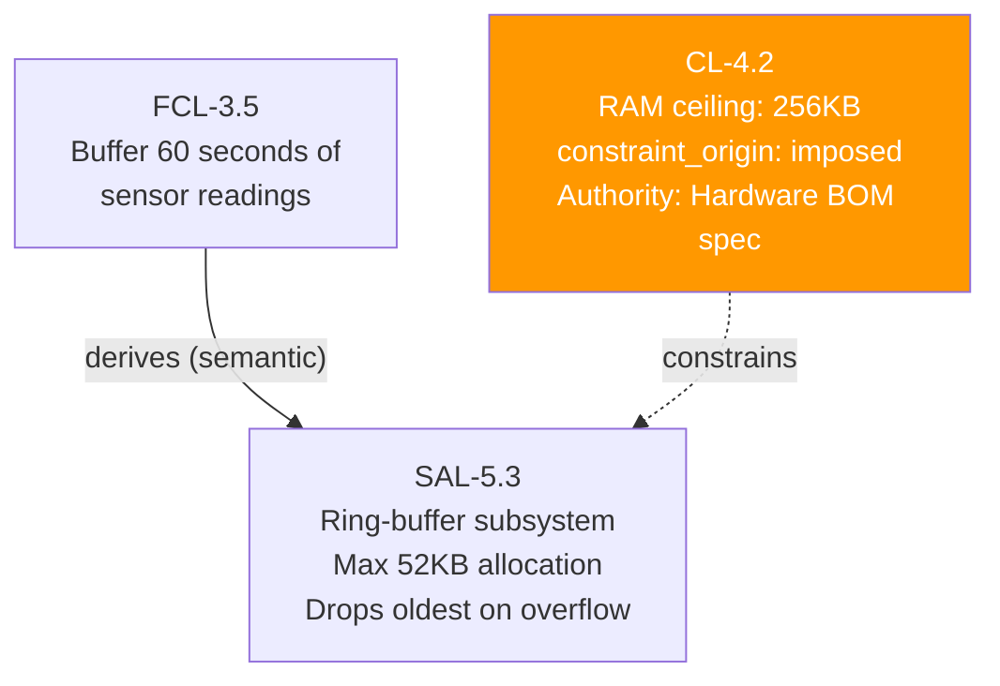

SAL-5.3 must satisfy FCL-3.5's buffering requirement while respecting CL-4.2's memory ceiling. The architecture note explains how: ring buffer with 52KB allocation, dropping oldest readings on overflow. When either parent changes, SAL-5.3 becomes DIRTY and must be re-validated against the new joint constraint surface.

#### Example 3: Healthcare AI System — XPD as Ethical Veto

A clinical decision support AI has an XPD node establishing that no algorithmic recommendation may override a licensed physician's clinical judgment. This ethical boundary propagates through the entire graph:

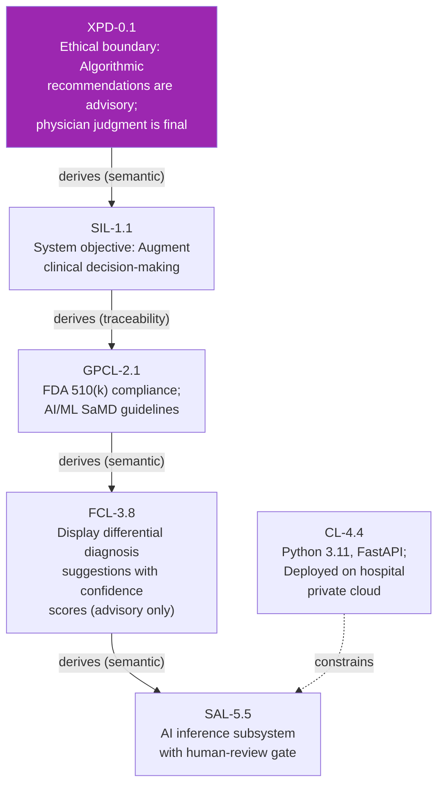

When a product manager proposes adding an automated triage queue that acts on AI recommendations without physician review, VERIFY detects that the proposed FCL node violates XPD-0.1's ethical boundary: it describes an automated action rather than an advisory presentation. The FCL node cannot transition to ACTIVE. XPD-0.1 exercises its absolute veto right — the highest-priority constraint in the system.

---

## Chapter 6: Edge Types

### 6.1 Overview and Role

The DDR System defines four typed edge relationships, each with precise semantics, structural constraints, and validation implications. Edge typing is not cosmetic — it is the mechanism by which the DDR System differentiates between fundamentally different kinds of inter-node relationships, enabling validators to check not just *that* a citation exists, but *whether the nature of the relationship is appropriate*.

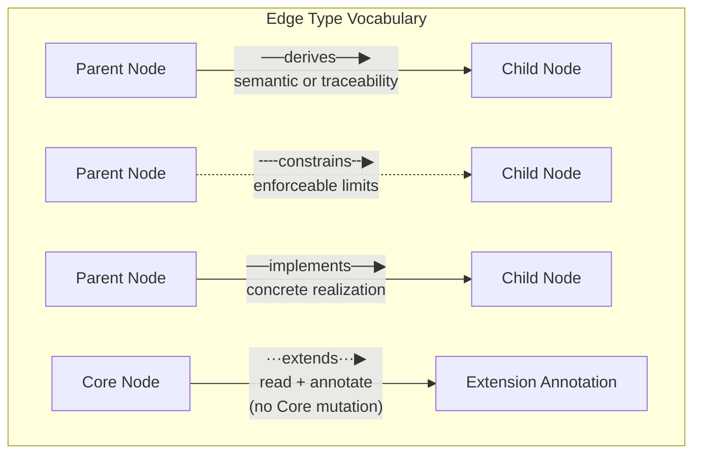

The v6.3 edge vocabulary was finalized through deliberate consolidation. v3.1.1 defined six edge types. The reduction to four was achieved by:

- Merging `cites` into `derives` (a traceability citation is a derivation relationship, distinguished by `derivation_mode: traceability`)
- Unifying `reads` and `annotates` into `extends` (both describe Extension-to-Core interaction with the same structural constraint: no Core mutation)

This consolidation reduces vocabulary without losing expressiveness, consistent with Principle 1 (Minimize Design Complexity).

### 6.2 `derives` — Derivation Edge

| Property              | Value                                                                                         |
| --------------------- | --------------------------------------------------------------------------------------------- |
| Symbol                | `──derives──▶`                                                                                |
| Direction             | Parent → Child                                                                                |
| Semantics             | Child content is derived from parent requirements OR parent is cited as authoritative lineage |
| `derivation_mode`     | `semantic` (default) or `traceability`                                                        |
| Valid in `parent_ids` | Yes                                                                                           |
| Tier contexts         | XPD→SIL, SIL→GPCL, GPCL→FCL, FCL→CL, FCL→SAL, SAL→ICL                                         |

#### The `derivation_mode` Subtypes

The `derivation_mode` annotation was introduced to resolve an important semantic ambiguity: the `derives` edge type covers two meaningfully different relationships:

**`semantic` derivation** means the child's *content* was logically derived from the parent's requirements. The child node would not exist, or would be different, if the parent were different. Example: an FCL capability node derives semantically from a GPCL quality requirement — the capability was *defined* in response to the governance mandate.

**`traceability` derivation** means the parent is cited as an *authoritative reference* — the child content was not logically derived from the parent, but the parent provides the legal, regulatory, or organizational authority that gives the child node its legitimacy. Example: GPCL-2.1 derives from SIL-1.1 with `derivation_mode: traceability` — the GPCL governance layer cites SIL as its strategic context, not as the logical source from which GPCL was derived.

CIT-R6 enforces that `derivation_mode: traceability` is *required* when a `derives` edge is used as an authority linkage. Non-derives edges must not carry `derivation_mode`.

#### 6.2.1 Hypothetical Scenarios for `derives`

**Scenario A: Semantic Derivation — Safety Requirement to FCL Capability**

A railway signalling system has a GPCL node for IEC 62280 (railway communication security standard). This derives semantically to an FCL capability node for "the system shall authenticate all command messages using cryptographic signatures." The FCL capability was *logically derived* from the IEC 62280 mandate — without the standard, this specific capability might not have been defined.

```yaml
id: FCL-3.11
tier: FCL
title: Authenticate all command messages with cryptographic signatures
parent_ids:
  - id: GPCL-2.4
    edge_type: derives
    derivation_mode: semantic
```

**Scenario B: Traceability Derivation — Strategic Authority Linkage**

A GPCL node for GDPR Article 17 (right to erasure) cites SIL-1.1 (the company's strategic commitment to user trust) as a traceability citation:

```yaml
id: GPCL-2.7
tier: GPCL
title: GDPR Article 17 - Right to erasure compliance
parent_ids:
  - id: SIL-1.1
    edge_type: derives
    derivation_mode: traceability
```

The GPCL node was not *logically derived* from the SIL objective (GDPR is an external mandate, not derived from company strategy). But SIL-1.1 is cited as the strategic context that makes this compliance obligation relevant to the organization.

---

### 6.3 `constrains` — Constraint Edge

| Property              | Value                                                      |
| --------------------- | ---------------------------------------------------------- |
| Symbol                | `╌╌constrains╌▶`                                           |
| Direction             | Parent → Child                                             |
| Semantics             | Parent sets enforceable limits on child's design space     |
| `derivation_mode`     | Never (non-derives edges must not carry `derivation_mode`) |
| Valid in `parent_ids` | Yes (CL→SAL only)                                          |
| Tier contexts         | CL→SAL (when CL is active)                                 |

The `constrains` edge is architecturally unique. It is the *only* edge type in the DDR System that has a defined asymmetric effect on the child node's design space: when CL constrains SAL, the CL node's declared technology and hardware boundaries become hard limits that the SAL architecture must satisfy. VERIFY checks that SAL architectural patterns do not violate CL-declared constraints; HRE (E1) can annotate SAL with warnings when proposed patterns would exceed CL hardware ceilings.

The `constrains` edge is intentionally restricted to the CL→SAL relationship. This is not an arbitrary limitation — it reflects a principled design decision: constraints are not derivations, and they are not implementations. They occupy a distinct semantic category: the parent *does not define* the child (as `derives` does) and the child *does not realize* the parent (as `implements` does). The parent merely *bounds* the child's solution space.

CIT-R3 requires that CL→SAL constraint edges be recorded with edge type `constrains`, not `derives`. A practitioner who records this edge as `derives` is making a semantic error: they are claiming that the SAL architecture was *derived from* the CL constraints, when in fact the SAL architecture was derived from FCL requirements and merely *bounded by* CL constraints.

#### 6.3.1 Hypothetical Scenarios for `constrains`

**Scenario: Legacy Hardware Ceiling in Enterprise Migration**

An enterprise ERP migration is constrained by organizational policy (CL node) to run on existing on-premise servers with maximum 8 CPU cores and 32GB RAM per node (no new hardware budget). SAL must design an architecture that stays within this ceiling:

```yaml
# CL node
id: CL-4.3
tier: CL
title: On-premise server ceiling — 8 cores, 32GB RAM per node
constraint_origin: imposed
# Cites the procurement policy document as authority (CL-R9-imposed)

# SAL node
id: SAL-5.2
tier: SAL
title: Monolithic-with-vertical-services architecture
parent_ids:
  - id: FCL-3.1
    edge_type: derives
    derivation_mode: semantic
  - id: CL-4.3
    edge_type: constrains  # constrains, not derives
```

HRE (E1) annotates SAL-5.2 with a minimum hardware profile inference, confirming that the proposed architecture fits within CL-4.3's ceiling. If an architect proposes a Kubernetes microservices pattern that requires 16+ cores per node, HRE flags it as a ceiling violation advisory — the SAL node becomes subject to human review before it can transition to ACTIVE.

---

### 6.4 `implements` — Implementation Edge

| Property              | Value                                                                  |
| --------------------- | ---------------------------------------------------------------------- |
| Symbol                | `──implements──▶`                                                      |
| Direction             | Parent → Child                                                         |
| Semantics             | Child provides concrete realization of parent's abstract specification |
| `derivation_mode`     | Never                                                                  |
| Valid in `parent_ids` | Yes                                                                    |
| Tier contexts         | ICL→CDL, CDL→ISL                                                       |

The `implements` edge expresses a fundamentally different relationship than `derives`. When a CDL component blueprint *implements* an ICL interface contract, the CDL node is not simply derived from the ICL content — it is providing a concrete realization of an abstract specification. The ICL contract defines *what* the interface does; the CDL blueprint defines *how* it will be constructed. This is the classic abstraction-implementation distinction formalized as an edge type.

The semantic distinction between `derives` and `implements` is important for validation:

- If a CDL node *derives* from ICL (incorrectly), the validator infers that the CDL content was *generated from* ICL requirements — perhaps by adding new behavioral specifications.
- If a CDL node *implements* ICL (correctly), the validator knows the CDL is providing a structural realization of a pre-existing interface contract. The CDL must not add new contracts; it maps components to existing ones.

This is enforced by ICL-E3 (ICL must not contain class or module blueprints → CDL) and CDL-R5 (CDL must map each component to the ICL contracts it implements).

#### 6.4.1 Hypothetical Scenarios for `implements`

**Scenario: REST API Contract Implementation**

An ICL contract defines the `POST /users` endpoint with a complete OpenAPI schema. A CDL node provides the `UserRegistrationService` component blueprint that implements this contract:

```yaml
# ICL node
id: ICL-6.3
tier: ICL
title: User registration API contract — POST /users

# CDL node
id: CDL-7.4
tier: CDL
title: UserRegistrationService — component blueprint
parent_ids:
  - id: ICL-6.3
    edge_type: implements  # implements, not derives
```

When ICL-6.3 is modified (e.g., a new required field `phone_number` is added to the request schema), CDL-7.4 becomes DIRTY — its blueprint must be updated to reflect the new contract requirements. This is DIRTY propagation via `implements` edge: the implementation must be re-evaluated against its changed specification.

---

### 6.5 `extends` — Extension Edge

| Property              | Value                                                              |
| --------------------- | ------------------------------------------------------------------ |
| Symbol                | `···extends···▶`                                                   |
| Direction             | Extension → Core Node                                              |
| Semantics             | Extension adds metadata to or reads Core node without modifying it |
| `derivation_mode`     | Never                                                              |
| Valid in `parent_ids` | Never (stored in `extension_annotations` only — CIT-R5)            |
| Tier contexts         | Any Extension → any Core tier it is contracted to read             |

The `extends` edge is fundamentally different from the three Core edge types. It does not express a derivation, constraint, or implementation relationship. It expresses the *non-mutating analytical relationship* between an Extension and a Core node: the Extension reads the Core node's content and attaches namespaced metadata.

The key structural constraint — enforced by CIT-R5 and the Extension Integration Rules — is that `extends` edges are *never* stored in `parent_ids`. This is not a minor technicality; it is a structural guarantee of AX-5. If Extension edges were allowed in `parent_ids`, an Extension could appear as a "parent" of a Core node, creating an implicit dependency of the Core on the Extension. This would violate the Core's independence from Extension behavior.

By restricting `extends` edges to `extension_annotations`, the DDR System ensures that Extensions are always *overlays* — they attach to the Core DAG without becoming part of it.

#### 6.5.1 Hypothetical Scenarios for `extends`

**Scenario: ARE Extension Annotating SAL with Reconstruction Confidence**

The ARE Extension (E5) reads SAL-5.3, CDL-7.6, and ICL-6.4 to infer that a caching layer may be missing from the architecture. It annotates SAL-5.3 with confidence metadata:

```yaml
id: SAL-5.3
# ... Core content unchanged ...
extension_annotations:
  ARE::candidate_coverage:
    inferred_missing: "distributed-cache subsystem"
    confidence_score: 0.74
    source_nodes: ["ISL-8.9", "ISL-8.11", "CDL-7.6"]
    scoring_profile: standard_v1
```

The Core content of SAL-5.3 is untouched. The ARE annotation is clearly namespaced (`ARE::`) and lives in `extension_annotations`. A practitioner reviews the candidate in the ARE Candidate Pool and decides to INSERT a new SAL node for the caching subsystem — promoting the inference to Core via human-reviewed INSERT.

---

## Chapter 7: Universal Node Format

### 7.1 Design Rationale

The Universal Node Format (UNF) is the common structural template shared by every node in the DDR System, regardless of tier, content type, or lifecycle stage. Its universality is intentional and foundational: by ensuring that every node — from an XPD ethical boundary document to an ISL scaffolding stub — has identical metadata fields, the DDR System enables:

- **Uniform tooling:** A single node schema supports all tiers; validators do not need tier-specific metadata parsers.
- **Consistent audit capability:** Timestamps, version numbers, and status fields are always present and always in the same location.
- **Machine-readable lifecycle tracking:** The `status` and `prior_status` fields enable automated lifecycle state machines to operate on any node without tier-specific logic.

### 7.2 The UNF Structure

```text
[TIER]-[N].[M]: [Title]
  status:        DRAFT | ACTIVE | DIRTY | DEPRECATED | SUPERSEDED | SUPERSEDE_PENDING
  prior_status:  [StatusEnum]  ← present only during in-flight SUPERSEDE
  version:       [SemVer]
  created:       [ISO 8601]
  modified:      [ISO 8601]
  parent_ids:    [{id: [TIER-N.M], edge_type: derives|constrains|implements,
                   derivation_mode?: semantic|traceability}, ...]
                 ← empty only for root nodes

  [Tier-compliant content body]
```

### 7.3 Field-by-Field Analysis

#### `id` — Node Identifier (Required)

The node ID follows the pattern `[TIER]-[SECTION].[ITEM]`:

- XPD uses `XPD-0.N` (no sections; section is always 0)
- All other tiers use `[TIER]-[N].[M]` where N is the section number and M is the item within that section

**Critical constraint:** IDs are immutable once assigned. No operation — including SUPERSEDE or conceptual relocation — may change a node's assigned ID. A superseded node retains its original ID with `status: SUPERSEDED`; the replacement receives a new ID. This immutability is the foundation of the DDR's audit trail: a reference to `GPCL-2.3` always refers to the same conceptual artifact, regardless of its current status.

**Why immutability?** If node IDs could change, any citation in a child node's `parent_ids` that referenced the old ID would become invalid, producing orphan violations across the entire descendant subgraph. Immutability eliminates this class of failure entirely.

#### `status` (Required)

The node status is a state machine value with six valid states:

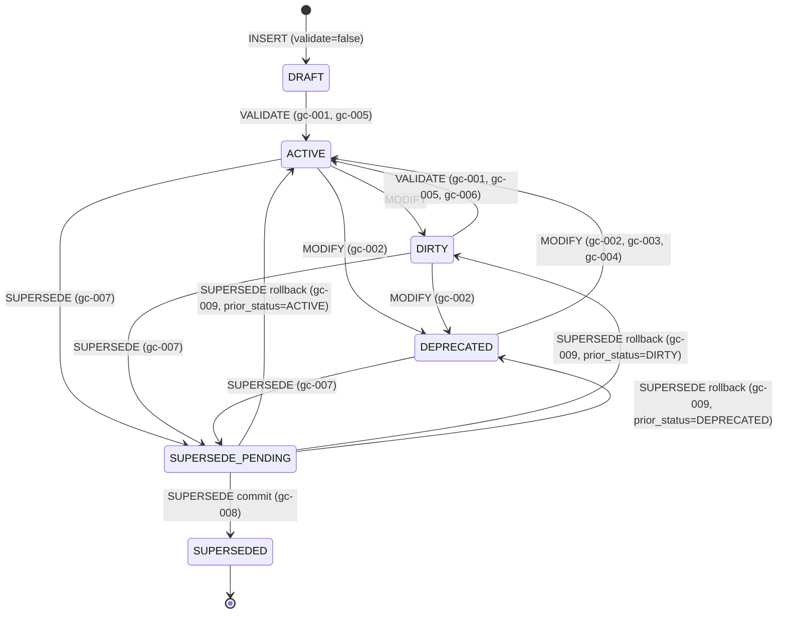

**`SUPERSEDE_PENDING`** deserves special attention: it is the only transient operational state in the DDR lifecycle. It is not a stable resting state — it represents an *in-flight SUPERSEDE operation* that has completed step 1 (recording `prior_status`) but has not yet committed (step 3a) or rolled back (step 3b). VERIFY treats any node in `SUPERSEDE_PENDING` as a `SUPERSEDE_PENDING_DETECTED` manifest item with severity BLOCKING — the DAG cannot be declared CLEAN while any node is in this state.

#### `prior_status` (Conditional)

`prior_status` is a write-once field set exclusively when a node transitions into `SUPERSEDE_PENDING`. It records the node's status *immediately prior* to the SUPERSEDE operation, enabling clean rollback. It must not be set on any node that is not in `SUPERSEDE_PENDING` status. It is cleared when the node exits `SUPERSEDE_PENDING` (on either commit or rollback).

This field is the mechanism that makes SUPERSEDE *atomically reversible*. Without `prior_status`, a failed SUPERSEDE would leave the source node in `SUPERSEDE_PENDING` with no record of what state to revert to, requiring manual intervention.

#### `parent_ids` (Optional for root, required for non-root)

The `parent_ids` list is the core structural field that implements the DAG. Each entry is a typed citation object:

```yaml
parent_ids:
  - id: GPCL-2.3
    edge_type: derives
    derivation_mode: semantic
  - id: CL-4.1
    edge_type: constrains
```

Rules governing `parent_ids`:

- Root nodes (XPD when active, SIL when XPD is inactive) have an empty `parent_ids` array.
- All other nodes must have ≥1 entry (CIT-R1, AX-1).
- `derivation_mode` is valid only on `edge_type: derives` entries (CIT-R6).
- `extends` edges are *never* in `parent_ids` (CIT-R5).

#### `express_mode_group` (Conditional)

Required on every node when `document_profile: project_instance_express`. Value must be one of `G1 | G2 | G3 | G4`. This field tells the UNBUNDLE_EXECUTE operation which Express Mode group the node belongs to, enabling deterministic tier allocation during unbundling.

#### `extension_annotations` (Optional)

A namespaced map where Extensions store their output. Reserved suffixes matching Core field names are invalid to prevent Extension metadata from being confused with Core fields. All Extension annotations must use the Extension's ID as a namespace prefix (e.g., `ARE::confidence_score`, `HRE::min_hardware_profile`).

### 7.4 Real-World UNF Examples

#### Example 1: Complete XPD Node

```yaml
id: XPD-0.1
tier: XPD
title: Existential Purpose Document — Autonomous Vehicle Decision Platform
status: ACTIVE
version: 1.2.0
created: 2026-01-15T09:00:00Z
modified: 2026-02-20T14:30:00Z
parent_ids: []  # Root node — always empty

content: |
  This system exists to reduce traffic fatalities and injuries caused by human
  driver error. The system processes sensor data to make real-time trajectory
  decisions for passenger vehicles.

  Ethical boundary conditions (all downstream tiers must satisfy):
  - No trajectory decision may place passengers or third parties in provably
    greater danger than the pre-intervention trajectory.
  - The system may never operate in a mode that eliminates all human intervention
    capability.
  - Populations at risk: pedestrians, cyclists, passengers, emergency responders.

  Success criteria (technology-independent):
  - Statistically significant reduction in at-fault incidents in controlled trials.
  - Public trust metrics maintained above defined thresholds.
```

#### Example 2: CL Node with `constraint_origin: imposed`

```yaml
id: CL-4.2
tier: CL
title: Mandated use of FIPS 140-2 validated cryptographic modules
status: ACTIVE
version: 1.0.0
created: 2026-02-01T11:00:00Z
modified: 2026-02-01T11:00:00Z
constraint_origin: imposed  # CL-only field
parent_ids:
  - id: FCL-3.6
    edge_type: derives
    derivation_mode: traceability  # Optional cross-reference (CL-R9-imposed allows this)

content: |
  All cryptographic operations must use NIST-validated FIPS 140-2 Level 2 modules.

  External authority: Federal agency contract requirement, Section 4.3(b) of the
  Master Service Agreement dated 2025-11-01 — cites NIST SP 800-175B.

  Rationale: Federal procurement policy prohibits use of non-validated cryptographic
  implementations in systems processing classified or sensitive unclassified data.

  Prohibited: OpenSSL standard builds (not FIPS-validated by default).
  Approved: BoringSSL FIPS build, OpenSSL with FIPS provider enabled and validated.
```

#### Example 3: ISL Node with Traceability Docstrings

```yaml
id: ISL-8.5
tier: ISL
title: UserAuthenticationService stub — Python 3.11
status: ACTIVE
version: 1.0.0
parent_ids:
  - id: CDL-7.3
    edge_type: implements

content: |
  # DDR Node: ISL-8.5
  # Parent: CDL-7.3 (UserAuthenticationService blueprint)
  # Traces to: ICL-6.2 (auth contract), SAL-5.3 (auth subsystem), FCL-3.2 (login capability)

  from typing import Optional
  from dataclasses import dataclass

  @dataclass
  class AuthResult:
      """Result of authentication attempt.
      DDR: CDL-7.3 internal state structure (UserPrincipal)
      """
      success: bool
      user_id: Optional[str] = None
      session_token: Optional[str] = None

  class UserAuthenticationService:
      """
      Implements ICL-6.2: User authentication contract.
      Hint: Validate credentials against identity store;
            issue short-lived JWT bearer tokens (CL-4.5: FIPS 140-2 via BoringSSL).
      """

      def authenticate(self, username: str, password: str) -> AuthResult:
          """
          DDR: CDL-7.3.authenticate() — stub only, no business logic.
          Implements: ICL-6.2 POST /auth/login contract.
          """
          raise NotImplementedError("ISL-8.5: Implementation required")

      def revoke_session(self, session_token: str) -> bool:
          """
          DDR: CDL-7.3.revoke_session() — stub only.
          Implements: ICL-6.2 DELETE /auth/session contract.
          """
          raise NotImplementedError("ISL-8.5: Implementation required")
```

---

## Chapter 8: Core DAG Topology

### 8.1 Overview

The Core DAG Topology defines the canonical nine-tier structure of the DDR System — the tier identities, their ordering, and the mandatory edge relationships between them. Understanding the topology is prerequisite to understanding every other structural rule in the DDR System, because the topology defines *where* content belongs and *what relationships are legal*.

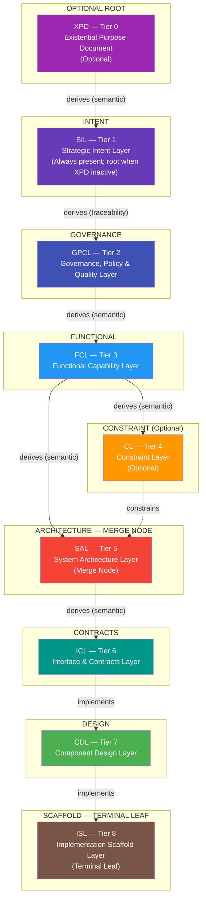

### 8.2 The Four Canonical Active Tier Configurations

INV-3 mandates that `active_tiers` must be one of exactly four canonical ordered sets. This constraint was introduced in v6.3 to close ambiguity in topology interpretation. No custom tier ordering or partial tier set is valid.

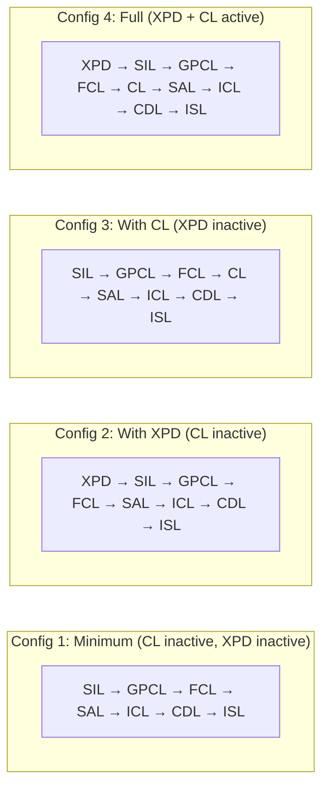

| Configuration | Use Case                                              | XPD      | CL       | Notes                                            |
| ------------- | ----------------------------------------------------- | -------- | -------- | ------------------------------------------------ |
| Config 1      | Internal tooling, no external constraints             | Inactive | Inactive | Minimum viable configuration                     |
| Config 2      | Ethical/societal impact systems, no pre-selected tech | Active   | Inactive | AI, healthcare, civic systems                    |
| Config 3      | Commercial systems with technology pre-selection      | Inactive | Active   | Enterprise with existing tech contracts          |
| Config 4      | Regulated + pre-constrained systems                   | Active   | Active   | Government, healthcare with procurement mandates |

### 8.3 The Representative Node Concept

A *representative node* is the canonical node that anchors each tier in the DAG. System-definition artifacts (documents authored with `document_profile: system_definition`) must contain at least one representative node for every tier in `active_tiers`. The representative node establishes the tier's presence in the graph and provides the root citation point for all other nodes in that tier.

The standard representative node identifiers follow the tier's section number:

| Representative Node | Tier | Canonical Title Pattern            |
| ------------------- | ---- | ---------------------------------- |
| XPD-0.1             | XPD  | Existential Purpose Document       |
| SIL-1.1             | SIL  | Strategic Intent Layer             |
| GPCL-2.1            | GPCL | Governance, Policy & Quality Layer |
| FCL-3.1             | FCL  | Functional Capability Layer        |
| CL-4.1              | CL   | Constraint Layer                   |
| SAL-5.1             | SAL  | System Architecture Layer          |
| ICL-6.1             | ICL  | Interface & Contracts Layer        |
| CDL-7.1             | CDL  | Component Design Layer             |
| ISL-8.1             | ISL  | Implementation Scaffold Layer      |

### 8.4 The SAL Merge Node

The SAL tier's designation as a *merge node* is one of the most architecturally significant features of the DDR topology. It is the *only* tier that legitimately accepts parents from two distinct tiers with two distinct edge types.

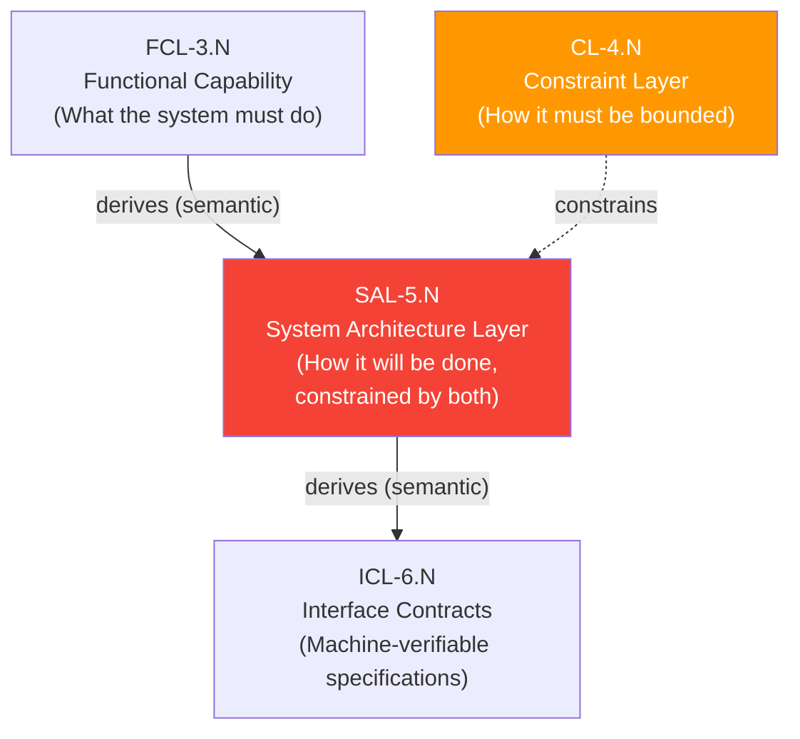

The architectural insight behind the merge node:

**Functional requirements (FCL)** tell the architect *what the system must do* — the behaviors and capabilities that must be realized. Architecture must answer: "Given these capabilities, what structural decomposition and communication patterns will realize them?"

**Technology constraints (CL, when active)** tell the architect *within what bounds* the system must operate — approved languages, mandatory frameworks, hardware ceilings. Architecture must answer: "Given these constraints, what structural choices are permissible?"

The SAL merge node forces the architect to address *both* questions simultaneously. An architectural decision that satisfies FCL but violates CL is not a valid architectural decision. An architectural decision that respects CL but fails to realize FCL capabilities is equally invalid. SAL must cite all active parents (SAL-R6), making this dual accountability explicit and validatable.

### 8.5 XPD: The Optional Root

XPD's optionality is governed by a clear activation condition: it is required when `ethical_impact ≠ none` OR `societal_scale > personal`. This translates to: any system with potential effects on people who are not the system's direct users (AI/ML systems affecting third parties, healthcare systems affecting patients, civic systems affecting populations, public-facing platforms with potential for misuse).

For internal developer tooling, configuration management systems, build pipelines, and other systems with no external societal impact, XPD may be safely omitted. When omitted, SIL becomes the root node.

The activation condition is intentionally conservative: when in doubt, activate XPD. The cost of an unnecessary XPD node (articulating the human need the tool serves) is low; the cost of missing XPD when a system has unexamined ethical implications can be severe.

When XPD is active, it functions as an **absolute veto** over all downstream decisions through constraint precedence (Chapter 11). No FCL capability, CL technology choice, SAL architectural pattern, ICL contract, CDL design, or ISL scaffold may violate XPD's declared ethical boundary conditions. If a conflict is detected (e.g., an FCL capability implicitly assumes automated action that violates XPD's "human oversight required" boundary), the VERIFY operation flags it and the FCL node cannot transition to ACTIVE until the conflict is resolved.

### 8.6 CL: The Optional Bypass

CL's optionality reflects a real architectural reality: not all systems are developed under pre-committed technology constraints. A greenfield startup building their first product may have complete freedom to choose any technology stack, runtime environment, and hardware target. For such systems, CL is not useful — declaring "no constraints" as a CL node adds complexity without value.

When CL is inactive, SAL derives *directly* from FCL (INV-4). The SAL architecture is bounded only by the functional requirements — the architect has complete freedom in technology and pattern selection. This freedom is captured in the topology: the `constrains` edge from CL to SAL simply doesn't exist.

When CL is active, the topology changes: SAL must cite *both* FCL (derives) and CL (constrains). The SAL-R6 rule enforces this by requiring SAL to cite all active parent IDs for each major architectural decision.

### 8.7 Topology Application Scenarios

#### Scenario 1: SaaS Analytics Platform (Config 1 — Minimum)

A small startup is building a business intelligence SaaS product. No ethical impact beyond normal commercial software. No pre-committed technology constraints (greenfield). Full architecture freedom.

- **XPD: inactive** (no significant societal impact; internal commercial software)
- **CL: inactive** (complete technology freedom)
- **Active tiers:** `[SIL, GPCL, FCL, SAL, ICL, CDL, ISL]`
- **SAL topology:** derives only from FCL (INV-4 applies: no CL → SAL direct)

SIL defines the business objectives (enterprise data visibility, self-service analytics). GPCL captures GDPR obligations and SOC2 Type II commitments. FCL enumerates dashboard capabilities, data source connectors, scheduled reporting. SAL designs the multi-tenant architecture. ICL defines the REST and WebSocket APIs. CDL blueprints the ingestion, processing, and rendering components. ISL generates Python and TypeScript scaffolds.

#### Scenario 2: Government Benefits Distribution System (Config 4 — Full)

A federal agency is modernizing a benefits disbursement system. Significant societal impact (millions of beneficiaries). Mandatory use of FedRAMP-authorized cloud services. Multiple regulatory frameworks.

- **XPD: active** (societal_scale is maximum; vulnerable populations at risk)
- **CL: active** (FedRAMP authorization mandates specific cloud provider; Section 508 accessibility required; FIPS 140-2 cryptography mandated by procurement)
- **Active tiers:** `[XPD, SIL, GPCL, FCL, CL, SAL, ICL, CDL, ISL]`
- **SAL topology:** derives from FCL + constrained by CL

XPD establishes: people living in poverty and disability beneficiaries could be harmed if the system incorrectly denies benefits or fails to process applications. All downstream tiers must preserve human review rights for any automated denial decision. SIL captures the agency's mission. GPCL enumerates: ADA/Section 508, FISMA, Privacy Act, FERPA, state-specific benefit rules. CL declares: AWS GovCloud (FedRAMP High), FIPS 140-2 crypto, Java 21 LTS. The rest flows from there.

#### Scenario 3: Autonomous Robotics Platform (Config 2 — With XPD, No CL)

A research organization is building an autonomous robotic inspection platform for industrial facilities. High ethical impact (worker safety, potential for physical harm). Greenfield technology stack — no constraints.

- **XPD: active** (workers in industrial facilities could be harmed; physical safety implications)
- **CL: inactive** (greenfield; technology choices are research-driven)
- **Active tiers:** `[XPD, SIL, GPCL, FCL, SAL, ICL, CDL, ISL]`

XPD's ethical boundaries include: the robot must never operate in the presence of undetected human presence; all decisions affecting human safety must have a logged and auditable justification. These boundaries propagate through the entire DAG, ultimately constraining ISL scaffold code (ISL nodes must include traceable docstrings that demonstrate how the human-presence detection and audit logging requirements are satisfied).

---

## Chapter 9: DAG Invariants

The DAG Invariants are a set of structural rules that must hold across the entire graph at all times. While atomic rules (Chapter 15–20) govern individual node content, invariants govern the *graph structure as a whole*. VERIFY checks all invariants on every traversal; any invariant violation causes VERIFY to return DIRTY (not CLEAN).

### 9.1 INV-1: No Cycles

**Statement:** No cycles permitted at any path length.

**Technical Detail:** A cycle is a sequence of nodes v₁, v₂, ..., vₙ, v₁ where each consecutive pair has a directed edge. INV-1 prohibits cycles of any length, including trivial self-references (v₁ → v₁) and multi-hop cycles (v₁ → v₂ → v₃ → v₁).

**Enforcement:** Cycle detection is performed at INSERT time using depth-first search. VERIFY re-validates acyclicity during full graph traversal. A cycle discovered by VERIFY that was not caught at INSERT is a serious system integrity failure (indicates either a bug in the INSERT cycle detection or a DAG that was modified outside of the atomic operations protocol).

**Justification:** See AX-7 (Chapter 4.7). Cycles make traversal non-terminating, causality circular, and audit trails meaningless.

**Scenario: Architectural Re-design Cycle Attempt**

During an architecture refactoring, a developer proposes adding a new ICL contract that logically derives from SAL, but also wants the SAL node to cite this ICL contract as an architectural authority. This would create a cycle: SAL-5.2 → ICL-6.8 → SAL-5.2.

The INSERT of ICL-6.8 with `parent_ids: [{id: SAL-5.2, edge_type: derives}]` succeeds. The subsequent attempt to INSERT SAL-5.4 with `parent_ids: [{id: ICL-6.8, edge_type: derives}]` is rejected — ICL-6.8 is a descendant of SAL-5.2 (in the tentative graph), creating a cycle. The developer must resolve the design confusion: either the ICL contract should derive from SAL (standard topology) *or* SAL should be modified to reference the ICL node's content directly in its own documentation (without a `parent_id` citation back to ICL).

---

### 9.2 INV-2: No Tier-Skipping

**Statement:** Citations must reference the immediately preceding active tier(s). SAL is the only permitted merge-node exception.

**Technical Detail:** INV-2 enforces the abstraction ordering mandated by AX-2 in a structural way. A CDL node cannot cite an FCL node directly (skipping ICL and SAL). A SAL node cannot cite a GPCL node directly (skipping FCL). Every citation must step through tiers one level at a time.

The SAL merge-node exception is explicitly enumerated: SAL legitimately accepts parents from both FCL (the immediately preceding active tier in the functional lineage) and CL (also in the immediately preceding position as a constraint parent). This is the only documented exception to tier adjacency.

**Justification:** Tier-skipping creates hidden dependencies — a CDL component that "derives" from a GPCL requirement has bypassed three intermediate tiers, each of which contributes specific structural content. The skipped tiers (FCL: behavioral specification, SAL: architectural context, ICL: contract specification) are not optional — they each answer specific questions that the child tier depends on. Allowing tier-skipping would permit practitioners to short-circuit the abstraction progression, producing a system where ISL scaffolds exist without contract specifications, or contract specifications exist without architectural context.

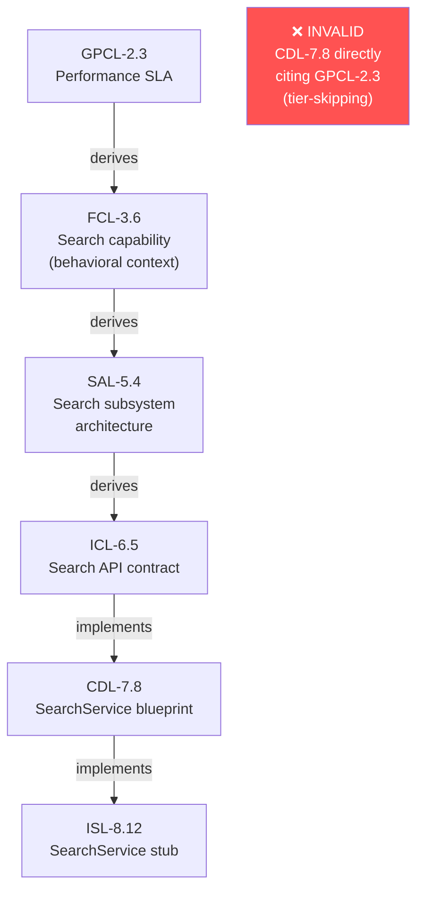

**Scenario: Shortcut Citation Attempt in Rapid Development**

Under time pressure, a developer authors a CDL component blueprint for a rate-limiting module, and attempts to cite GPCL-2.6 (API rate limit requirement) directly in the CDL node's `parent_ids` instead of tracing through the intermediate tiers. The reasoning: "The rate limit value comes directly from GPCL — why go through SAL and ICL?"

INV-2 rejects this. The ICL tier must contain the machine-verifiable rate limit contract (the exact request/response structure for 429 responses, retry-after headers, client-facing error payloads). The SAL tier must document which architectural subsystem owns rate limiting (API gateway? middleware layer? individual services?). Skipping these tiers doesn't mean their questions are answered — it means they're unanswered and invisible, making the CDL component fragile.

---

### 9.3 INV-3: Canonical `active_tiers` Enforcement

**Statement:** `active_tiers` must be one of four canonical ordered sets. Every node tier must belong to `active_tiers`, and every system-definition artifact must contain at least one representative node for each active tier.

**Technical Detail:** The four canonical sets are:

1. `[SIL, GPCL, FCL, SAL, ICL, CDL, ISL]`
2. `[XPD, SIL, GPCL, FCL, SAL, ICL, CDL, ISL]`
3. `[SIL, GPCL, FCL, CL, SAL, ICL, CDL, ISL]`
4. `[XPD, SIL, GPCL, FCL, CL, SAL, ICL, CDL, ISL]`

Any other combination is a schema violation. This closes ambiguity that existed in v6.2 where "active_tiers" was loosely enforced, leaving topology consequences to downstream logic.

**Justification:** Without canonical set enforcement, practitioners could theoretically activate subsets of tiers that violate the abstraction ordering (e.g., `[SIL, FCL, ICL, ISL]` — skipping GPCL, CL, SAL, CDL). This would produce a malformed DAG without the governance, constraint, and architecture layers, making the system structurally incomplete. The four canonical sets represent all valid combinations of the two optional tiers (XPD and CL), ensuring complete coverage of all legitimate use cases while excluding all invalid configurations.

---

### 9.4 INV-4: CL Inactive → SAL Derives from FCL

**Statement:** When CL is inactive, SAL derives directly from FCL.

**Technical Detail:** This invariant is the direct structural consequence of CL's optionality. When CL is not in `active_tiers`, the `constrains` edge from CL to SAL cannot exist (CL nodes don't exist). SAL must still have a parent — INV-5 requires ≥1 parent — and that parent must be the immediately preceding active tier, which is FCL when CL is absent.

**Justification:** INV-4 prevents ambiguous topology when CL is inactive. Without an explicit rule, a practitioner might wonder: does SAL need any parent in the absence of CL? The answer is yes (INV-5). What is that parent? The immediately preceding tier, which is FCL (INV-2). INV-4 makes this explicit rather than requiring practitioners to derive it from the combination of INV-2 and INV-5.

---

### 9.5 INV-5: All Non-Root Nodes Must Carry ≥1 `parent_id`

**Statement:** All non-root nodes must carry at least one `parent_id` citation.

**Technical Detail:** This is the structural enforcement of AX-1 (Traceability). The root node (XPD-0.1 or SIL-1.1) is the only node legitimately permitted to have an empty `parent_ids` array. Every other node — regardless of tier, status, or content — must cite at least one parent.

VERIFY detects nodes with empty `parent_ids` arrays (for non-root nodes) and reports them as orphan violations — the DAG cannot be CLEAN with orphan nodes.

**Justification:** An orphan node is a node that exists without justification. In a requirements graph, every requirement must be traceable to either a higher-level requirement or to the system's root. An orphan requirement cannot be evaluated for relevance, cannot be validated for completeness, and cannot be removed without the risk of accidentally discarding something important that was simply never linked.

---

### 9.6 INV-6: SUPERSEDE Atomicity

**Statement:** SUPERSEDE of any node across any tier must be atomic; partial application constitutes a structural violation detectable by VERIFY. At most one XPD node may carry status ACTIVE at any time.

**Technical Detail:** The SUPERSEDE operation has three steps:

1. Transition source node to `SUPERSEDE_PENDING`, recording `prior_status`.
2. Attempt INSERT of replacement node.
3a. On success: transition source to `SUPERSEDED`, re-wire children's `parent_ids`, set children DIRTY, clear `prior_status`.
3b. On failure: revert source to `prior_status`, discard failed replacement, log `SUPERSEDE_FAILED`.

Any state where step 1 is complete but step 3 is not (commit or rollback) is partial application — a structural violation. VERIFY treats any `SUPERSEDE_PENDING` node as a BLOCKING manifest item.

The XPD constraint ("at most one XPD node may carry status ACTIVE at any time") prevents scope drift through version confusion: there can only ever be one active existential purpose statement for a system. If a new XPD is needed (significant mission change), the old XPD must be SUPERSEDED before the new one becomes ACTIVE.

**Scenario: Failed SUPERSEDE Recovery**

A team attempts to SUPERSEDE GPCL-2.3 (a GDPR data residency requirement) with a new version that incorporates Schrems II requirements. The source node transitions to `SUPERSEDE_PENDING`. The INSERT of the replacement fails validation (a required `derivation_mode` is missing on a `parent_ids` entry — a v6.3 schema validation failure).

VERIFY now reports GPCL-2.3 as `SUPERSEDE_PENDING_DETECTED` with severity BLOCKING. The DAG cannot be declared CLEAN. The reconciliation manifest logs a `SUPERSEDE_FAILED` item with `failure_reason: missing_derivation_mode_on_derives_edge`.

The team fixes the replacement node's schema, retries the INSERT, which succeeds, completing step 3a: GPCL-2.3 → `SUPERSEDED`, new GPCL-2.4 → `ACTIVE`, all FCL children of GPCL-2.3 become DIRTY. The manifest's BLOCKING item is cleared. VERIFY can now return CLEAN (once all DIRTY descendants are re-validated).

---

### 9.7 INV-7: Structural Validity with Declared Semantic Gaps

**Statement:** Structural validity may coexist with declared semantic gaps only when those gaps are explicitly recorded in the reconciliation manifest under an allowed `semantic_gap_classification` type, with human rationale and required resolution or waiver before CLEAN state.

**Technical Detail:** The DDR System acknowledges that real-world projects sometimes have legitimate reasons for temporary semantic incompleteness. For example, a GPCL performance target may not yet have a corresponding FCL capability node — this is a `MISSING_MEDIATOR` semantic gap. The project's DAG is structurally valid (all nodes have citations, no cycles, no orphans), but semantically incomplete (the GPCL requirement is not fully realized at the FCL level).

INV-7 allows this state to persist *provided it is explicitly declared*. A `MISSING_MEDIATOR` entry in the reconciliation manifest with human rationale and a committed resolution plan satisfies INV-7. An undeclared semantic gap is a structural violation.

**Justification:** Real software projects do not achieve complete semantic coverage instantaneously. A requirements framework that requires full semantic completeness before any node can be declared ACTIVE would prevent incremental authoring and early validation — two practices that are valuable in iterative development. INV-7 provides a structured mechanism for managing inevitable incompleteness without hiding it.

---

### 9.8 INV-8: Lifecycle Completeness

**Statement:** The `lifecycle.status_transitions` definition must form a complete and closed state machine: every non-terminal status must have at least one valid outbound transition, and no undefined transitions are permitted.

**Technical Detail:** INV-8 was introduced in v6.1 to address a class of errors where node status could become trapped — a node in a particular state with no valid path forward or backward. The `status_transitions` block in the YAML schema defines the machine-readable state machine; INV-8 requires that this definition is *complete* (every non-terminal status has ≥1 outbound transition) and *closed* (no transition that is not in the definition is permitted).

`SUPERSEDED` is the only terminal status — nodes that have been superseded have no outbound transitions (they are historical records, not active artifacts). All other statuses (DRAFT, ACTIVE, DIRTY, DEPRECATED, SUPERSEDE_PENDING) must have defined outbound paths.

**Justification:** A node in a status with no valid outbound transition is stuck — it cannot be advanced to ACTIVE, cannot be deprecated, cannot be superseded. This is a lifecycle deadlock. INV-8 prevents this class of problem by requiring that the status machine is complete by construction, not by relying on practitioners to remember all valid state transitions.

---

# PART IV — TIER SPECIFICATIONS

---

## Chapter 10: Node ID Format & Citation Rules

### 10.1 Node ID Format

```
General pattern:  [TIER]-[SECTION].[ITEM]
XPD pattern:      XPD-0.N  (no sections; section is always 0)

Examples:
  SIL-1.3     = SIL tier, section 1, item 3
  GPCL-2.1    = GPCL tier, section 2, item 1
  CDL-12.5    = CDL tier, section 12, item 5
  XPD-0.1     = XPD tier, only section (0), item 1
```

**Section numbers** in non-XPD tiers correspond to the tier's canonical section number in the DDR hierarchy:

- Tier 1 (SIL): `SIL-1.x`
- Tier 2 (GPCL): `GPCL-2.x`
- Tier 3 (FCL): `FCL-3.x`
- Tier 4 (CL): `CL-4.x`
- Tier 5 (SAL): `SAL-5.x`
- Tier 6 (ICL): `ICL-6.x`
- Tier 7 (CDL): `CDL-7.x`
- Tier 8 (ISL): `ISL-8.x`

For large systems with many nodes in a single tier, the section number may advance beyond the canonical tier number. `CDL-12.5` is a valid CDL node ID where section 12 simply means the twelfth section within the CDL tier's content.

**Immutability:** Once assigned, a node ID is permanent. The SUPERSEDE operation creates a *new* node with a *new* ID; the original node retains its ID with status SUPERSEDED. This is not merely a convention — it is enforced by the atomic operations protocol. No operation may alter an assigned ID.

The practical consequence: external systems (CI/CD pipelines, compliance reporting tools, regulatory filings) may permanently reference DDR node IDs with the guarantee that the reference will always resolve to the same artifact, even after that artifact has been superseded. The historical record is preserved.

### 10.2 Citation Rules

The seven citation rules govern how `parent_ids` are populated and validated:

| Rule   | Verification | Statement                                                                                            |
| ------ | ------------ | ---------------------------------------------------------------------------------------------------- |
| CIT-R1 | structural   | Every non-root node must have ≥1 `parent_id`; only root nodes may have an empty array                |
| CIT-R2 | structural   | `parent_ids` must reference nodes from the immediately preceding active tier(s)                      |
| CIT-R3 | structural   | CL→SAL constraint edges use edge type `constrains`                                                   |
| CIT-R4 | structural   | An inline `[TIER-N.M]` citation in node content must have a matching entry in `parent_ids`           |
| CIT-R5 | structural   | Extension `extends` edges stored in `extension_annotations` only — never in `parent_ids`             |
| CIT-R6 | structural   | Any `derives` edge used as authority linkage MUST set `derivation_mode: traceability`                |
| CIT-R7 | structural   | A child may remain ACTIVE only while each cited parent remains at the version last validated against |

**CIT-R4** is particularly important for content integrity. When a practitioner writes an FCL capability that says "this capability must satisfy the constraints defined in [GPCL-2.3]", the inline citation in the content must be backed by a `parent_ids` entry for GPCL-2.3. If the inline citation exists without a `parent_ids` entry, the citation is dangling — visible to human readers but invisible to structural validators. CIT-R4 closes this gap.

**CIT-R7** is the parent-version freshness rule introduced in v6.1. It addresses the scenario where a parent node is modified after a child is validated and promoted to ACTIVE. Without CIT-R7, the child could remain ACTIVE against stale parent content indefinitely. With CIT-R7, any MODIFY or SUPERSEDE that changes cited parent content triggers the child's status to DIRTY — re-validation against the new parent version is required before the child may remain ACTIVE.

---

## Chapter 11: Constraint Precedence & Tier Overview

### 11.1 The Constraint Precedence Hierarchy

The DDR System establishes a strict priority ordering across tiers for conflict resolution:

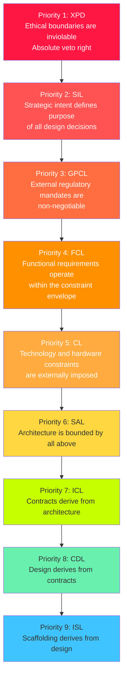

**Higher-priority tiers override lower-priority tiers.** An XPD ethical boundary is an absolute veto over any downstream decision. A GPCL regulatory mandate cannot be overridden by an FCL capability requirement. This hierarchy governs conflict resolution at every level of the DDR System.

### 11.2 Constraint Classes

| Class    | Description                                                         | Conflict Resolution                                                             |
| -------- | ------------------------------------------------------------------- | ------------------------------------------------------------------------------- |
| Logical  | Governed by the formal tier precedence hierarchy                    | Higher-priority tier wins; lower-priority tier must be modified                 |
| Physical | Non-negotiable physical realities or externally imposed constraints | Cannot be silently overridden by logical precedence — requires human escalation |

**Physical constraint rule:** Any CL node declared with `constraint_origin: imposed` is treated as a non-overridable physical-or-external constraint. Conflicts between higher-priority logical requirements and such imposed constraints must trigger explicit human resolution — they cannot be resolved algorithmically. The constraint precedence hierarchy governs design *decisions*, not physical *impossibilities*.

**Example:** An FCL capability requires 256GB of working memory (high-priority requirement). A CL node with `constraint_origin: imposed` declares a 32GB RAM ceiling (hardware contract). The constraint precedence hierarchy says FCL outranks CL — but the DDR System does not allow the FCL requirement to simply "win" and ignore the physical constraint. Instead, VERIFY flags this as a physical constraint conflict requiring escalation to the authoring authority for human resolution. Options include: modify the FCL requirement (reduce memory needs through algorithmic changes), modify the CL constraint (negotiate new hardware), or flag the project as architecturally infeasible.

### 11.3 Intra-Tier Conflict Rule

When two or more nodes *within the same tier* produce conflicting constraints, the conflict must be explicitly documented and resolved before any conflicting node may transition to status ACTIVE. VERIFY detects and reports intra-tier conflicts as structural violations.

Example: GPCL-2.3 requires data to be retained for 7 years (audit obligation). GPCL-2.7 requires data to be deleted within 90 days of user request (GDPR right to erasure). These are intra-tier conflicts at the GPCL level. Neither GPCL node may transition to ACTIVE until the reconciliation manifest records an explicit resolution (e.g., audit records are excluded from right-to-erasure scope per legitimate interest exception, with legal basis documented).

---

## Chapter 12: Tier 0 — XPD: Existential Purpose Document

### 12.1 Layer Identity

| Property             | Value                                                                                                                         |
| -------------------- | ----------------------------------------------------------------------------------------------------------------------------- |
| Layer                | OPTIONAL ROOT                                                                                                                 |
| Core Question        | *What human or societal need does this system exist to address, and what ethical boundaries govern all downstream decisions?* |
| Optional             | Yes                                                                                                                           |
| Activation Condition | `ethical_impact ≠ none` OR `societal_scale > personal`                                                                        |
| Root Behavior        | Always root when active; no parent                                                                                            |
| Merge Node           | No                                                                                                                            |
| Terminal Leaf        | No                                                                                                                            |

### 12.2 Purpose and Significance

XPD is the most philosophically significant tier in the DDR System — and potentially the most important practically. It exists because the DDR System acknowledges that software has consequences beyond its intended users, and those consequences must be explicitly governed.

The "Existential" in the name is deliberate. XPD answers not "what should this software do?" (that is SIL's question) but "why should this software exist, and at what ethical cost is it acceptable?" This reframing transforms the tier from a philosophical nicety into a structural safeguard with genuine engineering consequences.

### 12.3 Atomic Inclusion Rules

| Rule   | Verification | Statement                                                                         |
| ------ | ------------ | --------------------------------------------------------------------------------- |
| XPD-R1 | structural   | Must articulate a fundamental human or societal need being addressed              |
| XPD-R2 | structural   | Must be immutable across the project lifecycle; changes require a new XPD version |
| XPD-R3 | semantic     | Must be comprehensible to non-technical stakeholders without a glossary           |
| XPD-R4 | structural   | Must establish ethical boundary conditions all subsequent tiers must satisfy      |
| XPD-R5 | structural   | Must define success criteria independent of implementation metrics                |
| XPD-R6 | structural   | Must identify populations who could be harmed and the safeguards required         |

**XPD-R2** (immutability) deserves emphasis. The XPD node is not a living document — it is the *foundational statement of intent* that anchors the entire DAG. If the fundamental human need the system addresses changes, that represents a mission change, not an update. The old XPD must be SUPERSEDED with a new one, and the cascade of DIRTY propagation to all descendants correctly forces re-evaluation of the *entire system* against the new ethical foundation.

**XPD-R3** (non-technical comprehensibility) is a semantic rule — requiring human disposition — because "comprehensibility to non-technical stakeholders" cannot be mechanically evaluated. This rule forces practitioners to verify that the XPD tier is genuinely accessible to the people whose needs it represents, not just to the technical team building the system.

**XPD-R6** (harm identification) is perhaps the most consequential rule. By requiring explicit enumeration of at-risk populations and required safeguards, XPD forces *proactive ethical risk assessment* rather than reactive harm mitigation. The safeguards become traceable constraints that propagate through the entire DAG.

### 12.4 Atomic Exclusion Rules

| Rule   | Statement                                                                         |
| ------ | --------------------------------------------------------------------------------- |
| XPD-E1 | Must not contain solution concepts, technology references, or architectural ideas |
| XPD-E2 | Must not contain quantitative performance targets (→ GPCL)                        |
| XPD-E3 | Must not contain regulatory or legal constraints (→ GPCL)                         |

XPD's exclusion rules enforce its existential nature: it speaks only about human needs, ethical principles, and success criteria. The moment a technology reference appears in XPD, it has become an architectural document, not an existential one — VALIDATE detects this contamination.

### 12.5 Real-World Hypothetical Scenarios

#### Scenario A: Mental Health Support Platform

An organization builds a mental health support mobile application providing AI-driven mood tracking, crisis detection, and therapist connection. The ethical implications are significant: vulnerable users (people experiencing mental health crises) could be harmed if the system fails, provides harmful advice, or misuses sensitive data.

**XPD-0.1 content principles:**

- **Human need:** People experiencing mental health challenges lack accessible, stigma-free support between clinical sessions.
- **Populations at risk:** Users in acute mental health crises; minors; users with limited digital literacy.
- **Ethical boundaries:** No automated action may be taken based on crisis detection without human clinical review. All data is treated as medical information and governed by HIPAA. The system may never provide clinical diagnosis or prescription advice.
- **Success criteria (technology-independent):** Reduction in reported crisis escalations among users; increase in sustained engagement with mental health resources; no adverse events attributable to system errors.

These boundaries then propagate:

- FCL capabilities involving crisis detection must include human review workflows (XPD-R4 enforced).
- A proposed FCL capability for "automated emergency services notification based on crisis detection score" would violate XPD's "no automated action without human clinical review" boundary — it is rejected before it can become ACTIVE.

#### Scenario B: Credit Scoring Algorithm

A fintech company builds an AI-powered alternative credit scoring system for underbanked populations. XPD is required because the system has significant societal scale (affects access to financial services for a protected class of users) and potential for algorithmic harm (biased scoring).

**XPD-0.1 establishes:**

- The system must produce credit decisions that are explainable to applicants in plain language.
- No protected class characteristic (race, gender, national origin, religion) may be used as an input signal, even indirectly through proxy features.
- Populations at risk: underbanked individuals, immigrant populations, people with limited credit histories.
- Safeguards: all model decisions subject to human review escalation upon applicant request; bias monitoring active at all times; quarterly fairness audits by independent third party.

This XPD propagates into FCL (the "explain my credit decision" capability is required, not optional), SAL (the audit logging subsystem is mandatory), ICL (the explainability API contract must be machine-verifiable), and CDL/ISL (the bias detection component must be designed and scaffolded).

---

## Chapter 13: Tier 1 — SIL: Strategic Intent Layer

### 13.1 Layer Identity

| Property      | Value                                                                     |
| ------------- | ------------------------------------------------------------------------- |
| Layer         | INTENT LAYER                                                              |
| Core Question | *Why does this system exist, and what business outcomes must it achieve?* |
| Optional      | No                                                                        |
| Root Behavior | Root when XPD is inactive                                                 |
| Merge Node    | No                                                                        |
| Terminal Leaf | No                                                                        |

### 13.2 Purpose and Significance

SIL is the mandatory anchor of the DDR graph. When XPD is inactive, SIL is the root — it is the starting point from which all requirements, constraints, and implementations derive. SIL translates the *why* of the business into a set of strategic objectives with measurable outcomes, stakeholder definitions, and explicit scope boundaries.

The fundamental distinction between XPD and SIL is scope: XPD speaks to the *human or societal need* the system addresses (the existential justification); SIL speaks to the *business objectives* the organization is pursuing in addressing that need. A medical records system's XPD might state "patients need reliable access to their own health data." The corresponding SIL states "our organization will capture the hospital EHR market in the Northeast by delivering the most user-friendly patient portal in the sector, generating $50M ARR by FY2028."

### 13.3 Atomic Inclusion Rules

| Rule   | Verification | Statement                                                             |
| ------ | ------------ | --------------------------------------------------------------------- |
| SIL-R1 | structural   | Must define the core business problem or opportunity being addressed  |
| SIL-R2 | structural   | Must specify strategic objectives with measurable outcomes            |
| SIL-R3 | structural   | Must identify all stakeholder categories and their value propositions |
| SIL-R4 | structural   | Must establish explicit scope boundaries (in-scope and out-of-scope)  |
| SIL-R5 | structural   | Must define organizational success metrics                            |
| SIL-R6 | structural   | Must be stable under technology changes                               |

**SIL-R6** (technology stability) is the SIL corollary to AX-2. SIL content must be expressible without reference to any specific technology. "Reduce patient wait times by 30% through improved scheduling" is technology-stable. "Reduce patient wait times by 30% using an AI scheduling algorithm built on TensorFlow" is not — it has coupled the strategic intent to a technology choice.

**SIL-R4** (explicit scope boundaries) is critical for managing scope creep at the highest level. By declaring explicitly what is *out of scope* in the SIL tier, the DDR System creates a structural gate against capability additions that were never part of the original strategic intent. If a proposed FCL capability cannot be traced to a SIL objective (because it falls outside the declared scope), the FCL node cannot be validated — it becomes an orphan.

### 13.4 Atomic Exclusion Rules

| Rule   | Statement                                                                |
| ------ | ------------------------------------------------------------------------ |
| SIL-E1 | Must not reference hardware, technology stacks, frameworks, or languages |
| SIL-E2 | Must not contain regulatory mandates or compliance requirements (→ GPCL) |
| SIL-E3 | Must not prescribe architectural patterns or implementation strategies   |
| SIL-E4 | Must not contain quantitative performance metrics (→ GPCL)               |

**SIL-E4** is a common source of tier contamination. Business stakeholders frequently express strategic intent with performance metrics: "we need a system that responds in under 100ms." This is a performance target — it belongs in GPCL-R6, not in SIL. The SIL-level statement is "we need a system that provides a fast, responsive user experience" (qualitative, technology-neutral). The quantitative target is a governance constraint that bounds how "fast" must be measured.

### 13.5 Real-World Hypothetical Scenarios

#### Scenario A: Digital Banking Platform SIL

A challenger bank is building its core banking platform from scratch. The SIL tier must anchor the strategic purpose without technology references or specific metric targets.

**SIL-1.1 (root node):** The core business problem is that traditional banks fail to serve digitally native consumers who expect seamless, instant, mobile-first financial management. Strategic objectives: (1) acquire 1M customers within 24 months; (2) achieve NPS ≥ 70 within 12 months; (3) achieve profitability per active customer within 36 months.

**SIL-1.2:** Stakeholders: (a) primary — millennial and Gen-Z consumers seeking mobile-first banking; (b) secondary — small business owners needing simple cash flow management; (c) internal — compliance and risk teams requiring audit trails.

**SIL-1.3:** Scope boundaries: IN scope — personal checking/savings accounts, debit cards, peer-to-peer payments, basic investing. OUT of scope — mortgages, commercial lending, insurance products, brick-and-mortar branches (this cycle).

This clean SIL specification prevents scope contamination: a proposed FCL capability for "mortgage application processing" cannot be validated — it falls outside SIL-1.3's declared out-of-scope boundary.

#### Scenario B: Internal Developer Productivity Toolchain SIL

A platform engineering team at a tech company builds an internal CLI toolchain for standardizing microservice scaffolding. XPD is inactive (internal tooling, no external societal impact). SIL is the root.

**SIL-1.1 (root):** The business problem is that each engineering team scaffolds new microservices differently, producing inconsistent CI/CD pipelines, observability integrations, and security configurations. This inconsistency multiplies onboarding time and creates security audit failures.

Scope: IN — microservice scaffold generation, CI/CD pipeline configuration, telemetry stub injection. OUT — application business logic generation, infrastructure provisioning (→ separate DCP Extension scope).

SIL-E1 prevents the team from specifying "using Python 3.11 and GitHub Actions" in the SIL tier — those are CL and ICL concerns respectively. SIL just says "standardize scaffold creation across all microservice projects."

---

## Chapter 14: Tier 2 — GPCL: Governance, Policy & Quality Layer

### 14.1 Layer Identity

| Property      | Value                                                                                                                                      |
| ------------- | ------------------------------------------------------------------------------------------------------------------------------------------ |
| Layer         | GOVERNANCE LAYER                                                                                                                           |
| Core Question | *What non-negotiable external mandates, regulatory obligations, policy constraints, and measurable quality thresholds govern this system?* |
| Optional      | No                                                                                                                                         |
| Root Behavior | N/A                                                                                                                                        |
| Merge Node    | No                                                                                                                                         |
| Terminal Leaf | No                                                                                                                                         |

### 14.2 Purpose and Significance

GPCL is the mandatory governance tier — the place where the external world's requirements on the system are formally declared. It covers three broad categories:

**Regulatory compliance:** GDPR, HIPAA, PCI-DSS, SOC2, FDA, ISO 26262, WCAG 2.1 — any external legal or regulatory framework that applies to the system and its operation.

**Contractual obligations:** Third-party SLAs, API provider terms, licensing constraints, vendor contracts that impose technical obligations on the system.

**Measurable quality thresholds:** Performance targets (p99 latency ≤ 200ms), reliability targets (99.9% uptime SLA), security requirements (all data encrypted at rest), scalability requirements (support 10,000 concurrent users).

The critical distinction from SIL is that GPCL content is *external* and *non-negotiable*. SIL objectives are things the organization *chooses to pursue*. GPCL constraints are things the organization *must satisfy* regardless of choice. GDPR compliance is not optional for a European-facing service; PCI-DSS compliance is not optional for a payment processor.

### 14.3 The Bridge Rule: GPCL-FCL-BR1

The bridge rule introduced in v5.0 is one of the most architecturally significant rules in the DDR System. It addresses a subtle but important structural problem:

**Problem:** A GPCL performance target (e.g., "API response time ≤ 200ms at p99") cannot be architecturally realized directly at the SAL tier — there is no identifiable architectural pattern that "satisfies a response time requirement" without the mediation of a functional context. The performance target needs to be understood in terms of *what user-facing behavior* it governs.

**GPCL-FCL-BR1 requirement:** For every quantitative performance target specified under GPCL-R6, there must exist a corresponding FCL node whose semantic contribution is the *behavioral context* of the governed interaction — not a restatement of the numeric threshold.

**Prohibited:** An FCL node that says "search must respond within 200ms" — this is not behavioral context, it's a restatement of the GPCL metric.

**Required:** An FCL node that says "the user must receive search results before they perceive a delay (instant feel), enabling continued shopping workflow without interruption" — this is behavioral context. The 200ms threshold from GPCL is the measurable definition of "instant feel."

If no user-facing behavioral dimension exists for a GPCL performance target (e.g., a backend batch job SLA with no user interaction), the author logs a `MISSING_MEDIATOR` item to the reconciliation manifest, explicitly acknowledging that no FCL mediator is required and recording the rationale.

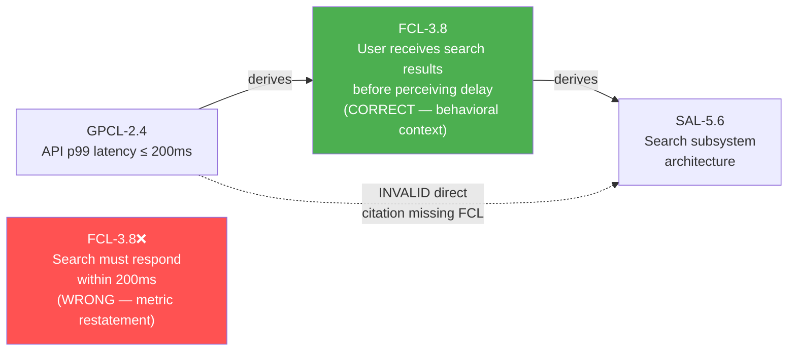

### 14.4 Atomic Inclusion Rules

| Rule         | Verification | Statement                                                                           |
| ------------ | ------------ | ----------------------------------------------------------------------------------- |
| GPCL-R1      | structural   | Enumerate all applicable regulatory frameworks with jurisdiction and scope          |
| GPCL-R2      | semantic     | Specify enforceable, testable constraints — not aspirational targets                |
| GPCL-R3      | structural   | Identify contractual obligations imposed by third-party relationships               |
| GPCL-R4      | structural   | Define data sovereignty and residency requirements                                  |
| GPCL-R5      | structural   | Specify audit and record-retention mandates                                         |
| GPCL-R6      | structural   | Specify quantifiable performance targets: latency, throughput, concurrency ceilings |
| GPCL-FCL-BR1 | semantic     | FCL mediator required per GPCL-R6 target, or MISSING_MEDIATOR logged                |
| GPCL-R7      | structural   | Specify reliability and availability targets (SLAs, RTO, RPO)                       |
| GPCL-R8      | structural   | Specify security requirements expressed technology-neutrally                        |
| GPCL-R9      | structural   | Specify scalability and accessibility requirements                                  |
| GPCL-R10     | structural   | Cite parent SIL IDs for each constraint                                             |

### 14.5 Real-World Hypothetical Scenarios

#### Scenario A: Multi-Jurisdiction E-Commerce Platform

An e-commerce platform serves EU and US customers. GPCL must capture both GDPR and CCPA alongside commercial SLAs:

```
GPCL-2.1 → SIL-1.1 (derives, traceability)
  GDPR (EU) 2016/679: Data processing lawful basis, right to erasure (Article 17),
  data residency (processing in EU-adequate jurisdictions), DPA appointment required
  for EU operations. Jurisdiction: European Union.

GPCL-2.2 → SIL-1.1 (derives, traceability)
  CCPA (California) 2018: Consumer right to know, right to delete, right to opt-out
  of sale. Jurisdiction: California, USA. In-scope for CA residents.

GPCL-2.3 → SIL-1.2 (derives, semantic)
  Stripe payment platform MSA § 4.2: PCI-DSS compliance required; no raw card data
  in application servers; tokenization mandatory. (Contractual obligation)

GPCL-2.4 → SIL-1.3 (derives, semantic)
  Performance: checkout flow ≤ 3 seconds end-to-end at p95; search ≤ 500ms at p99;
  cart page ≤ 1 second at p99. (GPCL-R6 — triggers GPCL-FCL-BR1 mediator requirement)

GPCL-2.5 → SIL-1.3 (derives, semantic)
  Availability: 99.95% uptime SLA; RTO 4 hours; RPO 1 hour. (GPCL-R7)
```

#### Scenario B: Embedded Medical Device Software

A medical device for continuous glucose monitoring requires FDA 21 CFR Part 820 (Quality System Regulation) and IEC 62304 (medical device software lifecycle) compliance.

The GPCL tier captures these regulatory obligations with specific rule references, making them machine-traceable from ISL scaffolding all the way back to the regulatory citations. When the FDA updates a guidance document, the relevant GPCL node is SUPERSEDED, propagating DIRTY through the entire DAG — the team knows exactly which FCL capabilities, SAL subsystems, ICL contracts, CDL components, and ISL stubs require re-evaluation.

---

## Chapter 15: Tier 3 — FCL: Functional Capability Layer

### 15.1 Layer Identity

| Property      | Value                                                                                        |
| ------------- | -------------------------------------------------------------------------------------------- |
| Layer         | FUNCTIONAL LAYER                                                                             |
| Core Question | *What externally observable behaviors and user-facing capabilities must the system provide?* |
| Optional      | No                                                                                           |
| Root Behavior | N/A                                                                                          |
| Merge Node    | No                                                                                           |
| Terminal Leaf | No                                                                                           |

### 15.2 Purpose and Significance

FCL is where the system's functional contract with its users is formally declared. The defining characteristic of FCL content is its perspective: FCL describes *what users can do* and *what the system does in response* — entirely from the outside, without any reference to internal architecture, implementation, or specific technology.

FCL answers questions like:

- "Can a user reset their password?"
- "What happens when a payment fails?"
- "What data does the system display on the order history screen?"

FCL does *not* answer:

- "How does the password reset email get sent?" (SAL/ICL concern)
- "What database table stores the order?" (ICL/CDL concern)
- "What API endpoint handles the password reset request?" (ICL concern)

### 15.3 FCL-R7: The Data Entity Enumeration Rule

FCL-R7 is a critical rule introduced in v5.0 to ensure that FCL capabilities that involve persistent data are complete in their statement:

**Requirement:** For any capability that creates, reads, updates, or deletes persistent data, enumerate all logical data entities involved by name and their CRUD relationship to the capability.

**Example of compliant FCL-R7 content:**
> "The user submits a new product review. Creates: Review, ReviewMedia. Reads: Product, User. Updates: Product.averageRating."

**Why this rule exists:** Without FCL-R7, the completeness of data entity specifications is contingent on whether the DDE Extension (E7) is active. AX-5 and AX-6 require that Core completeness is independent of Extension behavior. FCL-R7 ensures that data entity coverage is a Core requirement, captured in FCL where it belongs — at the functional level, as logical entity names with CRUD verbs, *without* field-level detail (which belongs in ICL).

The rule explicitly prohibits attribute-level typing, storage structure definitions, key declarations, or integrity rules at the FCL tier — these are ICL concerns. FCL says "creates Order, reads Customer" — it does not say "creates Order with columns order_id UUID PRIMARY KEY, customer_id FK…"

### 15.4 Real-World Hypothetical Scenarios

#### Scenario A: Ride-Sharing Platform FCL Node

```
FCL-3.4: Request a ride
  Parent: GPCL-2.3 (derives, semantic) — satisfies real-time availability requirement

  A rider submits a pickup request specifying current location and destination.
  The system presents available vehicle options with estimated arrival times and
  pricing. The rider selects an option and the system confirms the booking.

  User-observable state transitions:
  - REQUESTING → MATCHING → CONFIRMED → EN_ROUTE → ARRIVED → IN_PROGRESS → COMPLETED
  - Error states: NO_DRIVERS_AVAILABLE, PAYMENT_DECLINED, RIDER_CANCELLED, DRIVER_CANCELLED

  Data entities (FCL-R7):
  Creates: RideRequest, Booking
  Reads: Vehicle, Driver, RiderProfile, PaymentMethod, PricingModel
  Updates: Driver.status, Vehicle.currentLocation
```

This FCL node is technology-free (no API endpoints, no database tables) but complete: state transitions, error conditions, and data entities are fully enumerated. DDE (E7) can confirm that corresponding ICL schemas exist for all listed entities.

#### Scenario B: Content Moderation Platform FCL Fan-Out

A single GPCL compliance requirement (EU DSA content moderation obligations) fans out to multiple FCL capabilities — demonstrating how the DAG handles regulatory one-to-many relationships:

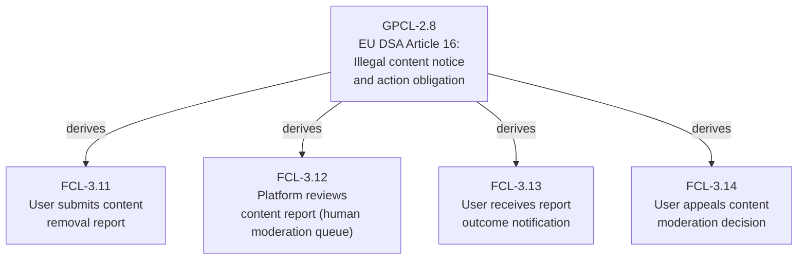

When the DSA Article 16 GPCL node is updated (e.g., to reflect an updated EU regulatory guidance), all four FCL capabilities become DIRTY simultaneously — the team reviews which behavioral specifications need updating.

---

## Chapter 16: Tier 4 — CL: Constraint Layer

### 16.1 Layer Identity

| Property             | Value                                                                                                                                  |
| -------------------- | -------------------------------------------------------------------------------------------------------------------------------------- |
| Layer                | CONSTRAINT LAYER                                                                                                                       |
| Core Question        | *What are the declared technology selections, hardware envelopes, and infrastructure ceilings that bound the system's implementation?* |
| Optional             | Yes                                                                                                                                    |
| Activation Condition | Specific technology, hardware, or infrastructure constraints are non-negotiable                                                        |
| Merge Node           | No                                                                                                                                     |
| Terminal Leaf        | No                                                                                                                                     |

### 16.2 Purpose and Significance

CL is the tier where technology reality enters the DDR graph. It is the formal declaration of constraints that are *pre-committed* before architecture begins — not because the architect chose them, but because external forces (organizational policy, hardware procurement, contractual obligations, regulatory mandates) impose them.

The critical design principle governing CL is AX-6 (Declarative Integrity): CL nodes *declare* constraints — they do not derive, infer, or recommend them. CL-E1 explicitly prohibits auto-derived or inferred configurations. The job of CL is to say: "These are the facts about our technology environment. Architecture must work within them." The job of the HRE Extension (E1) is to analyze whether the architecture actually does.

### 16.3 The `constraint_origin` Field

Every CL node must declare `constraint_origin` as either `derived` or `imposed`:

**`derived`:** The constraint was selected by the organization's architects or engineers based on technical judgment. Example: "We have chosen Python 3.11 for our backend services based on team expertise and ecosystem maturity."

**`imposed`:** The constraint was imposed by an external authority — a regulatory requirement, a contractual obligation, a procurement policy, or a physical hardware reality. Example: "Federal contract terms mandate use of FIPS 140-2 validated cryptography."

The distinction matters for conflict resolution (Chapter 11): an `imposed` CL constraint is a physical constraint that cannot be overridden by higher-priority logical tiers. A `derived` CL constraint can theoretically be overridden by a sufficiently high-priority FCL requirement — but doing so requires explicit escalation and human resolution, not automatic precedence application.

**`constraint_origin: imposed` → cite external authority (CL-R9-imposed):** When a constraint is imposed, the CL node must cite the external authority source — the regulatory framework, contract reference, procurement policy, or organizational mandate. This citation is stored in the content (not in `parent_ids` — the external authority is not a DDR node). An optional FCL cross-reference may be provided for contextual traceability.

**`constraint_origin: derived` → cite FCL IDs (CL-R9):** When a constraint is derived, the CL node must cite the FCL IDs for the capabilities whose technology needs motivated the constraint selection.

### 16.4 Real-World Hypothetical Scenarios

#### Scenario A: Regulated Financial Trading Platform

A trading platform is developed under strict organizational and regulatory constraints:

```
CL-4.1: Java 21 LTS (constraint_origin: derived)
  Rationale: Enterprise-wide JVM standardization policy. Team expertise in Java/Spring.
  FCL citations: FCL-3.1 (order management), FCL-3.2 (market data feed), FCL-3.5 (reporting)

CL-4.2: AWS GovCloud (us-gov-west-1) (constraint_origin: imposed)
  External authority: Federal contract § 4.2(b) — FedRAMP High authorization required.
  Prohibited: Any non-FedRAMP-authorized service. No cross-region data transfer to
  commercial regions without explicit DLP policy activation.

CL-4.3: FIPS 140-2 Level 2 cryptography (constraint_origin: imposed)
  External authority: NIST SP 800-57, Federal contract § 4.3(c)
  Approved: AWS KMS (FIPS-validated), BoringSSL FIPS build

CL-4.4: Hardware ceiling — m5.4xlarge maximum instance size (constraint_origin: imposed)
  External authority: Annual compute budget allocation, Finance § BU-2026-Q1-003.
  Rationale: 16 vCPU, 64GB RAM maximum per instance without finance approval.
```

#### Scenario B: Embedded System Constraint Conflict Resolution

A real-time data acquisition system has conflicting constraints. FCL-3.6 requires processing 10,000 samples/second (high-priority functional requirement). CL-4.5 declares a hardware ceiling of an ARM Cortex-M4 at 168MHz with 256KB RAM (imposed by hardware procurement).

This triggers a physical constraint conflict — the M4's processing budget cannot sustain 10,000 samples/second at the required precision. CL-R10 requires that the conflict be explicitly documented in CL-4.5's content with a reconciliation note. The reconciliation manifest records a human escalation decision: the team will evaluate DSP acceleration hardware as an exception to the procurement policy, or will negotiate the FCL-3.6 sample rate downward, or will redesign the sampling algorithm to meet the constraint. The conflict cannot be silently resolved by constraint precedence.

---

## Chapter 17: Tier 5 — SAL: System Architecture Layer

### 17.1 Layer Identity

| Property      | Value                                                                                        |
| ------------- | -------------------------------------------------------------------------------------------- |
| Layer         | ARCHITECTURE LAYER                                                                           |
| Core Question | *How is the system structurally decomposed, and what patterns govern component interaction?* |
| Optional      | No                                                                                           |
| Merge Node    | Yes (derives from FCL; constrained by CL when active)                                        |
| Terminal Leaf | No                                                                                           |

### 17.2 Purpose and Significance

SAL is where the system's internal structure is first defined. It answers the architect's fundamental question: given what the system must *do* (FCL) and within what bounds it must *operate* (CL), *how* is it decomposed into subsystems, and how do those subsystems interact?

SAL's position as the merge node gives it a unique architectural burden: it must simultaneously satisfy functional requirements from FCL and respect constraints from CL. This is not a trivial reconciliation — often, the architectural patterns that best satisfy FCL requirements are not compatible with CL constraints, requiring careful design trade-offs that must be explicitly documented and traceable.

### 17.3 SAL's Defining Characteristics

SAL is the highest tier that may reference specific structural patterns (microservices, event-driven, layered, hexagonal) — but only as architectural patterns, not as technology selections. "Event-driven architecture with publish-subscribe messaging" is a SAL-appropriate pattern. "Event-driven architecture using Apache Kafka" is not — the specific technology belongs in CL or ICL.

SAL is the *architecture*, not the *design*. It defines subsystems and their interaction patterns; it does not define individual components, their methods, or their data structures (CDL), and it does not define machine-verifiable API contracts (ICL).

### 17.4 Real-World Hypothetical Scenarios

#### Scenario A: Multi-Tenant SaaS Platform Architecture

An analytics SaaS platform requires a multi-tenant architecture that supports thousands of customers with data isolation guarantees.

```
SAL-5.1: Multi-tenant analytics platform architecture
  Parents:
    FCL-3.1 (derives, semantic) — data ingestion capability
    FCL-3.2 (derives, semantic) — dashboard rendering capability
    FCL-3.7 (derives, semantic) — tenant data isolation capability
    CL-4.1 (constrains) — Python/FastAPI stack constraint
    CL-4.2 (constrains) — PostgreSQL with row-level security constraint

  Architectural pattern: Three-tier with tenant-aware data layer.
  Major subsystems:
    [1] API Gateway subsystem — request routing, auth, rate limiting
    [2] Analytics Engine subsystem — query processing, aggregation
    [3] Tenant Data subsystem — row-level security enforcement, data isolation
    [4] Notification subsystem — async alert delivery

  Communication pattern: Synchronous REST (API Gateway → Analytics Engine),
    async queue (Analytics Engine → Notification subsystem)

  Failure isolation: Notification subsystem failure must not affect Analytics Engine
    availability. Circuit breaker pattern required at Gateway→Engine boundary.

  Concurrency model: Stateless API Gateway; stateful Analytics Engine via connection
    pool; Notification subsystem via async worker pool.
```

#### Scenario B: SAL Merge Node Conflict Resolution

During architecture design, the architect discovers that the FCL's requirement for real-time data streaming (FCL-3.9: "users receive updated dashboard data within 500ms of an event") is in tension with the CL constraint for PostgreSQL (CL-4.2: "PostgreSQL is the mandatory data store" — `constraint_origin: imposed`).

A WebSocket-based real-time push architecture (optimal for FCL-3.9) conflicts with PostgreSQL's polling-based notification model (CL-4.2 reality). The SAL node must document this architectural tension explicitly (SAL-R1 rationale requirement), declare the chosen resolution (LISTEN/NOTIFY + pg_logical replication for sub-500ms propagation at the targeted event rate), and cite both parent IDs. The HRE Extension annotates SAL-5.3 confirming the chosen approach fits within the declared CL hardware ceiling.

---

## Chapter 18: Tier 6 — ICL: Interface & Contracts Layer

### 18.1 Layer Identity

| Property      | Value                                                                                                  |
| ------------- | ------------------------------------------------------------------------------------------------------ |
| Layer         | CONTRACT LAYER                                                                                         |
| Core Question | *What are the formal, machine-verifiable contracts governing data exchange between system boundaries?* |
| Optional      | No                                                                                                     |
| Merge Node    | No                                                                                                     |
| Terminal Leaf | No                                                                                                     |

### 18.2 Purpose and Significance

ICL is the DDR tier that bridges the gap between high-level architecture and concrete implementation. It contains machine-verifiable contracts — not descriptions of what the system does (FCL), not architectural patterns of how it's structured (SAL), but formal specifications of *exactly how data crosses system boundaries*: the precise schemas, protocols, error codes, versioning strategies, and access control policies that govern inter-component communication.

The "machine-verifiable" requirement (ICL-R2) is non-negotiable: all ICL schemas must be expressed in a format that can be programmatically validated — JSON Schema, Protobuf, OpenAPI, Avro, WSDL, or equivalent. A contract expressed in prose is not an ICL contract; it is an FCL capability description or a SAL pattern description placed in the wrong tier.

### 18.3 Real-World Hypothetical Scenarios

#### Scenario A: Microservices Platform ICL Node

```yaml
id: ICL-6.5
tier: ICL
title: Order Service → Payment Service gRPC contract
parent_ids:
  - id: SAL-5.4
    edge_type: derives
    derivation_mode: semantic

content: |
  Contract: Protobuf 3 over gRPC/HTTP2

  // payment_service.proto (v2.1.0)
  service PaymentService {
    rpc ProcessPayment(ProcessPaymentRequest) returns (ProcessPaymentResponse);
    rpc RefundPayment(RefundRequest) returns (RefundResponse);
  }

  message ProcessPaymentRequest {
    string order_id = 1;       // required: UUID v4
    int64 amount_cents = 2;    // required: positive integer, cents
    string currency_code = 3;  // required: ISO 4217 three-letter code
    string idempotency_key = 4; // required: UUID v4
  }

  Versioning strategy: Semantic versioning; additive changes are backward compatible;
    breaking changes require new major version with 90-day deprecation window.

  Error contract: gRPC status codes; INVALID_ARGUMENT for malformed requests;
    RESOURCE_EXHAUSTED for rate limits with retry-after metadata.

  RBAC: Caller must present service-to-service mTLS certificate with CN=order-service.
    ICL-R7: SAL-5.4 (payment orchestration subsystem)
```

#### Scenario B: ICL → CDL cascade on contract change

An ICL contract for the User Registration API (ICL-6.3) is modified in v1.3.0 to add a mandatory `phone_number` field to the registration request. ICL-6.3 transitions from ACTIVE to DIRTY after MODIFY.

CIT-R7 immediately sets CDL-7.4 (UserRegistrationService blueprint) to DIRTY — its blueprint must be updated to include `phone_number` in the service's parameter handling. ISL-8.5 (the Python stub for UserRegistrationService) also becomes DIRTY transitively. The team sees a precise DIRTY propagation from the contract change through the design and scaffolding layers — exactly the components that need updating, nothing more.

---

## Chapter 19: Tier 7 — CDL: Component Design Layer

### 19.1 Layer Identity

| Property      | Value                                                                                                                          |
| ------------- | ------------------------------------------------------------------------------------------------------------------------------ |
| Layer         | DESIGN LAYER                                                                                                                   |
| Core Question | *What are the structural blueprints of individual components — their public interfaces, internal state, and responsibilities?* |
| Optional      | No                                                                                                                             |
| Merge Node    | No                                                                                                                             |
| Terminal Leaf | No                                                                                                                             |

### 19.2 Purpose and Significance

CDL is the transition tier between abstract contracts (ICL) and concrete scaffolding (ISL). CDL blueprints define individual components as structural specifications: what methods they expose, what internal state they maintain, what dependencies they consume, and how they initialize and terminate. CDL is the engineer's design document — specific enough to implement, but still free of executable code.

The CDL-ICL relationship is governed by `implements` edges: CDL components implement ICL contracts. This relationship mandates a one-to-one contractual grounding (CDL-R5): every CDL component must be mapped to the ICL contracts it implements. A component that exists without an ICL contract is architecturally ungrounded.

### 19.3 Multi-Language Support

CDL-R7 handles the multi-language scenario: when CL declares multiple target languages (e.g., Java for the backend, TypeScript for the frontend), CDL must produce language-specific blueprints for each target. This ensures that the ISL tier's language-specific stubs (ISL-R5) are grounded in language-specific blueprints, not language-agnostic abstractions.

### 19.4 Real-World Hypothetical Scenarios

#### Scenario A: Event-Sourced Order Management CDL

```
CDL-7.5: OrderAggregate — component blueprint (Java 21)
  Implements: ICL-6.4 (Order domain events contract), ICL-6.5 (Order query contract)

  Public interface:
    +submitOrder(cart: CartSnapshot, customer: CustomerRef): OrderCreatedEvent
    +confirmPayment(orderId: UUID, paymentRef: PaymentRef): PaymentConfirmedEvent
    +cancelOrder(orderId: UUID, reason: CancellationReason): OrderCancelledEvent
    +queryOrder(orderId: UUID): Optional<OrderReadModel>

  Internal state:
    -orderId: UUID (immutable after creation)
    -status: OrderStatus (ENUM: PENDING | CONFIRMED | CANCELLED | FULFILLED)
    -eventLog: List<DomainEvent> (append-only)
    -version: long (optimistic concurrency control)

  Dependencies: OrderRepository (ICL-6.4), PaymentEventPublisher (ICL-6.7)

  Initialization: OrderAggregate is always created with an empty event log;
    reconstituted by replaying events from OrderRepository.

  Lifecycle: Stateless beyond event log; no teardown contract required.
```

#### Scenario B: CDL Propagation to ISL on Language Change

A project initially declares a single language target in CL (Python). CDL-7.8 produces a Python-specific blueprint. Later, a new CL node (CL-4.7) declares TypeScript as a second target for the frontend BFF layer.

CDL-R7 requires CDL-7.8 to produce a TypeScript-specific blueprint for the components serving the BFF. CDL-7.8 transitions to DIRTY. The team creates CDL-7.8-TS (TypeScript variant). ISL-8.12 (the Python stub) remains valid; a new ISL-8.13 (TypeScript stub) is created and implements CDL-7.8-TS.

---

## Chapter 20: Tier 8 — ISL: Implementation Scaffold Layer

### 20.1 Layer Identity

| Property      | Value                                                                                                 |
| ------------- | ----------------------------------------------------------------------------------------------------- |
| Layer         | SCAFFOLD LAYER                                                                                        |
| Core Question | *What is the minimal, structurally valid, traceable scaffolding required to initiate implementation?* |
| Optional      | No                                                                                                    |
| Terminal Leaf | Yes                                                                                                   |
| Merge Node    | No                                                                                                    |

### 20.2 Purpose and Significance

ISL is the point where the DDR graph meets the code editor. ISL nodes contain syntactically valid code scaffolds — compilable and parseable structures with stub method bodies — that developers use as their starting point for actual implementation. The ISL tier is uniquely positioned: it is a Code artifact, but it is also a *documentation artifact* — every stub carries traceable docstrings that link the code to its governing DDR node IDs.

As the terminal leaf tier, ISL nodes are the only nodes that *should* be leaf nodes in a CLEAN Core DAG. During incremental authoring, non-ISL tiers may temporarily be leaf nodes, but VERIFY flags them as incomplete.

### 20.3 Atomic Inclusion Rules

| Rule   | Verification | Statement                                                                                             |
| ------ | ------------ | ----------------------------------------------------------------------------------------------------- |
| ISL-R1 | structural   | Must produce syntactically valid structural scaffolding in the target language                        |
| ISL-R2 | structural   | Must embed docstrings or code comments with explicit parent DDR node IDs                              |
| ISL-R3 | structural   | Must include implementation hints as structured comments                                              |
| ISL-R4 | structural   | Must define all function/method bodies exclusively as stubs                                           |
| ISL-R5 | structural   | Must be language-specific — one ISL node per target language/runtime when multiple are declared in CL |
| ISL-R6 | structural   | Must cite CDL parent IDs for every stub                                                               |

**ISL-R4** (stubs only) is the most critical exclusion: ISL nodes must not contain business logic or complete algorithmic implementations (ISL-E1). This is not a limitation — it is a structural guarantee. By ensuring ISL contains only stubs, the DDR System creates a clean handoff point: the scaffold exists, the traceability is established, and the implementation engineer's responsibility begins precisely where ISL ends.

### 20.4 Real-World Hypothetical Scenarios

#### Scenario A: Generated Python Scaffold for a Recommendation Engine

```python
# DDR Node: ISL-8.14
# Parent: CDL-7.11 (RecommendationEngine component blueprint)
# Contract: ICL-6.8 (recommendation API contract)
# Architecture: SAL-5.7 (ML inference subsystem)
# Constraint: CL-4.1 (Python 3.11), CL-4.3 (FIPS 140-2 crypto for model auth)

from typing import List, Optional
from dataclasses import dataclass
from uuid import UUID

@dataclass
class RecommendationResult:
    """
    DDR: CDL-7.11 RecommendationResult internal state model.
    Implements ICL-6.8 RecommendationResponse schema.
    """
    item_id: UUID
    score: float  # 0.0-1.0, higher = more relevant
    explanation: str  # human-readable rationale (XPD-0.1: algorithmic transparency)

class RecommendationEngine:
    """
    DDR: CDL-7.11 RecommendationEngine blueprint.
    Implements: ICL-6.8 GET /recommendations/{user_id} contract.
    Traces to: FCL-3.14 (personalized product recommendations capability)

    Hint: Use collaborative filtering model; model artifact stored in S3
    (CL-4.2: AWS GovCloud bucket). Load on init; refresh on model version update.
    Hint: Respect XPD-0.1 algorithmic transparency: include explanation field.
    """

    def get_recommendations(
        self,
        user_id: UUID,
        limit: int = 10,
        context: Optional[dict] = None
    ) -> List[RecommendationResult]:
        """
        DDR: CDL-7.11.get_recommendations() — stub only.
        Implements: ICL-6.8 GET /recommendations/{user_id}
        Max response time: 200ms (GPCL-2.4 p99 latency target).
        """
        raise NotImplementedError("ISL-8.14: Implementation required")

    def refresh_model(self, model_version: str) -> bool:
        """
        DDR: CDL-7.11.refresh_model() — stub only.
        Called by model update webhook; must be idempotent.
        """
        raise NotImplementedError("ISL-8.14: Implementation required")
```

---

# PART V — OPERATIONS & LIFECYCLE

---

## Chapter 21: Node Status Lifecycle

### 21.1 The Six Status Values

The DDR System's node lifecycle is a formal state machine with six status values and strictly governed transitions:

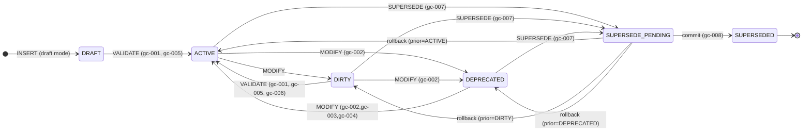

| Status            | Meaning                                                                          | Included in VERIFY?                     | Blocks CLEAN?                     |
| ----------------- | -------------------------------------------------------------------------------- | --------------------------------------- | --------------------------------- |
| DRAFT             | Authored but not validated; structurally present, excluded from CLEAN compliance | Yes (cycle detection, orphan detection) | Yes (any DRAFT node)              |
| ACTIVE            | Fully validated; structurally and semantically current                           | Yes                                     | No (if no violations)             |
| DIRTY             | Requires re-validation following an upstream change                              | Yes                                     | Yes                               |
| DEPRECATED        | Scheduled for removal; no replacement yet exists                                 | Yes                                     | No (unless orphan children exist) |
| SUPERSEDED        | Replacement exists and children re-wired; historical record                      | Yes (for cycle integrity)               | No                                |
| SUPERSEDE_PENDING | Transient; in-flight SUPERSEDE operation                                         | Yes — BLOCKING                          | Yes — BLOCKING                    |

### 21.2 Lifecycle Guards

Guards are preconditions that must be satisfied before a status transition is permitted:

| Guard  | Description                                                                        | Verification |
| ------ | ---------------------------------------------------------------------------------- | ------------ |
| gc-001 | All structural rules for the node pass validation                                  | structural   |
| gc-002 | Deprecation rationale is explicitly documented                                     | manual       |
| gc-003 | Any previously set deprecation sunset date is cleared                              | manual       |
| gc-004 | Status reversal is logged in the reconciliation manifest                           | manual       |
| gc-005 | All review items are resolved                                                      | structural   |
| gc-006 | Per-node validation scope is explicitly confirmed                                  | structural   |
| gc-007 | Node's current status recorded in `prior_status` before entering SUPERSEDE_PENDING | structural   |
| gc-008 | Replacement node successfully INSERTed and validated; all children re-wired        | structural   |
| gc-009 | SUPERSEDE failed; source reverts to `prior_status`; failure logged                 | structural   |

### 21.3 Deprecation vs. Supersession

These two lifecycle paths are frequently confused. The distinction is critical:

**DEPRECATED** means "this node is scheduled for replacement, but no replacement exists yet." The node remains structurally valid, is included in VERIFY traversals, and all its children's citations remain valid. A deprecated node can be restored to ACTIVE (MODIFY with gc-002 through gc-004) or progressed to SUPERSEDED once a replacement is ready.

**SUPERSEDED** means "a replacement node has been created, validated, and all former children's `parent_ids` have been re-wired to the replacement." The superseded node is a historical record — its ID remains in the graph (immutability) but it has no live children. The replacement node is ACTIVE with new children.

The practical implication: if you deprecate a node and then delete it without creating a replacement, you orphan all its former children (they still cite the now-deleted node in `parent_ids`). VERIFY would detect these as orphan violations. The correct workflow is: DEPRECATED → SUPERSEDE → children re-wired to replacement → source SUPERSEDED.

---

## Chapter 22: Atomic Operations Protocol

### 22.1 The Eight Operations

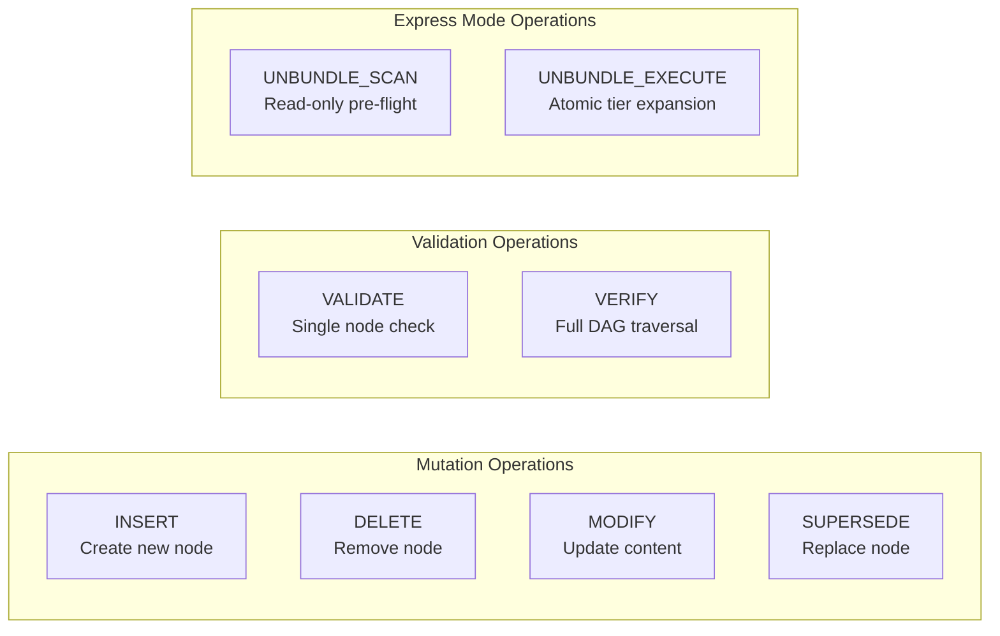

#### INSERT

INSERT creates a new node with an auto-assigned ID, `parent_ids`, and tier-compliant content. It supports two modes:

- **Validated insertion** (`validate=true`, default): The node is fully validated on INSERT. If any structural rule fails or any cycle would be created, the INSERT is rejected atomically. On success, the node is ACTIVE.
- **Draft insertion** (`validate=false`): The node is created in DRAFT status without full validation. Useful for incremental authoring workflows where complete content is being assembled. The node must subsequently undergo VALIDATE to transition to ACTIVE.

INSERT supports both forward direction (specifying parent → creating child) and reverse direction (specifying child's content → system infers parent), the latter enabling bottom-up authoring workflows.

#### DELETE

DELETE removes a node and triggers orphan detection in its former children. Children of a deleted node become structurally orphaned — they cite a non-existent node in `parent_ids`. The resolution workflow (Chapter 23) presents options: MODIFY the children to re-attach to an alternative parent, DELETE them in cascade, or SUPERSEDE the deleted parent (creating a replacement that the children can re-wire to).

#### MODIFY

MODIFY updates node content and increments the node's SemVer `version` field. MODIFY triggers:

1. Re-validation of the modified node's full atomic ruleset.
2. DIRTY propagation to all descendants (transitively).
3. CIT-R7 freshness check: all children of the modified node become DIRTY.

A MODIFY of an ACTIVE node immediately transitions it to DIRTY — it must be re-validated to return to ACTIVE.

#### SUPERSEDE

SUPERSEDE is the most complex operation, requiring atomic three-step execution:

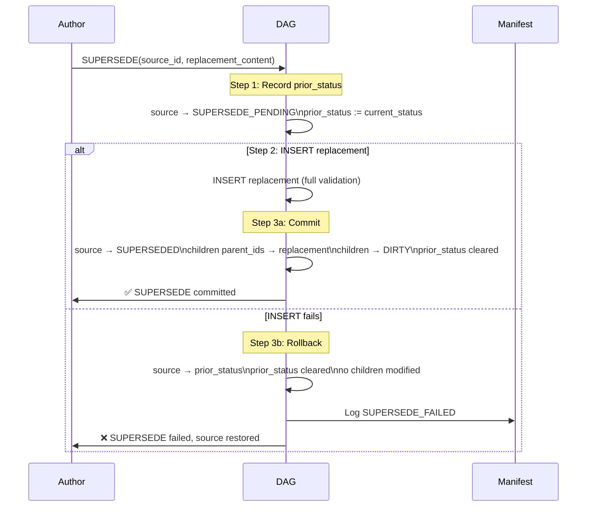

The key behaviors:

- **No partial state:** If any step fails, the entire operation rolls back to the exact pre-SUPERSEDE state.
- **Child re-wiring scope:** SUPERSEDE auto-updates immediate children's `parent_ids` to the replacement ID. Grandchildren are *not* directly cascaded (this is a structural re-wiring, not a semantic change); they receive DIRTY propagation only when their parent (the immediate child) is subsequently MODIFYed.
- **SUPERSEDE_PENDING is BLOCKING:** Any node in `SUPERSEDE_PENDING` makes VERIFY return DIRTY with severity BLOCKING. A CLEAN graph cannot have any in-flight SUPERSEDE operations.

#### VALIDATE

VALIDATE checks a single node against its tier's full atomic ruleset:

- Structural rules: evaluated mechanically, return pass/fail with violated rule IDs.
- Semantic rules: emit `REVIEW_REQUIRED` in the reconciliation manifest's `pending_items`.
- Output includes a `validation_scope` declaration.

A node with unresolved `REVIEW_REQUIRED` items cannot transition from DRAFT to ACTIVE.

#### VERIFY

VERIFY performs a full DAG traversal, checking:

- All citation chains (CIT-R1 through CIT-R7)
- All edge type semantics (correct edge types for each tier relationship)
- All ID references (no dangling citations)
- All orphan detection
- All tier contamination (atomic exclusion rules)
- All declared cross-node semantic consistency rules (if defined)
- All `SUPERSEDE_PENDING` nodes (BLOCKING)

VERIFY returns CLEAN (zero violations) or DIRTY (itemized structural violations). The CLEAN state is the DDR System's highest assurance: every structural rule in the specification is satisfied.

#### UNBUNDLE_SCAN and UNBUNDLE_EXECUTE

These operations are the mechanism for converting Express Mode documents to Full Mode. See Chapter 26 for complete coverage.

### 22.2 Real-World Operational Scenarios

#### Scenario A: Cascade from a GPCL Change

A GDPR enforcement action results in a new GPCL requirement: all personal data exports must be available within 30 days of request (GDPR Article 20). The team MODIFYs GPCL-2.7:

1. GPCL-2.7 transitions ACTIVE → DIRTY (MODIFY applied).
2. DIRTY propagates to all FCL children of GPCL-2.7: FCL-3.11 (data export capability), FCL-3.15 (data portability format capability).
3. DIRTY propagates transitively to SAL-5.8 (data management subsystem), ICL-6.11 (data export API contract), CDL-7.9 (DataExportService blueprint), ISL-8.17 (DataExportService Python stub).
4. Team re-validates each DIRTY node in tier order (top-down): GPCL-2.7 → ACTIVE; FCL-3.11 evaluated for new behavioral spec additions; etc.

#### Scenario B: SUPERSEDE of an ICL Contract

ICL-6.3 (User Registration API v1.x) is superseded with ICL-6.9 (User Registration API v2.0, adding OAuth 2.0 authorization flow):

1. ICL-6.3 → SUPERSEDE_PENDING. `prior_status` recorded as ACTIVE.
2. INSERT ICL-6.9 with full validation. Passes all ICL atomic rules.
3a. Commit: ICL-6.3 → SUPERSEDED. CDL-7.4 (UserRegistrationService) `parent_ids` updated from ICL-6.3 → ICL-6.9. CDL-7.4 → DIRTY. ISL-8.5 is grandchild — not directly cascaded.
3. Team validates CDL-7.4 against ICL-6.9. CDL-7.4 blueprints updated to include OAuth flow. CDL-7.4 → ACTIVE. ISL-8.5 becomes DIRTY via CDL-7.4 MODIFY cascade.
4. ISL-8.5 stub updated with OAuth stubs. ISL-8.5 → ACTIVE. VERIFY → CLEAN.

---

## Chapter 23: Dirty State, Propagation & Resolution Workflow

### 23.1 DIRTY Propagation Rules

```mermaid
graph TD
    T["Trigger Event"] --> E1["Node Modified"]
    T --> E2["Node Deleted"]
    T --> E3["Parent → SUPERSEDED\n(child parent_ids re-wired)"]
    T --> E4["CL constraint added/modified"]
    T --> E5["XPD ethical boundary modified"]

    E1 --> D1["Modified node + ALL descendants"]
    E2 --> D2["All former children of deleted node"]
    E3 --> D3["Immediate children ONLY\n(structural re-wiring, not semantic change)\nGrandchildren: NOT cascaded"]
    E4 --> D4["SAL + all SAL descendants"]
    E5 --> D5["ALL tiers — full re-validation required"]

    style E5 fill:#FF1744,color:#fff
    style D5 fill:#FF5252,color:#fff
```

The XPD ethical boundary DIRTY rule deserves attention: any modification to XPD-0.1 (or any XPD node) triggers DIRTY propagation across *all tiers*. This is the structural expression of XPD's absolute veto right — if the system's ethical foundation changes, every downstream artifact must be re-evaluated for compatibility with the new ethical baseline.

### 23.2 Structural vs. Semantic DIRTY

DIRTY propagation has two classifications:

**Structural DIRTY:** The parent's structural relationship to the child has changed (e.g., `parent_ids` re-wiring after SUPERSEDE). The child's content may still be valid — the structural re-wiring does not by itself establish semantic invalidation. Structural DIRTY does *not* automatically cascade to grandchildren.

**Semantic DIRTY:** The parent's content has changed in a way that probably invalidates the child's content (e.g., parent MODIFY changed a requirement that the child implements). Semantic DIRTY triggers standard downstream propagation to all descendants.

When a re-validation of a structurally DIRTY node reveals content drift (the child's content is actually incompatible with the new parent state), the DIRTY classification is reclassified to semantic, and standard downstream propagation then applies.

### 23.3 The Resolution Workflow

```
DETECT CHANGE → SET DIRTY → SCAN DOWNSTREAM → GENERATE PENDING ITEMS
→ EXECUTE OPERATION → VERIFY → SET CLEAN | REPEAT
```

Each DIRTY node generates a pending item in the reconciliation manifest:

- `node_id`: the DIRTY node
- `violated_rule_id`: the specific structural or semantic rule that needs evaluation
- `suggested_operation`: VALIDATE, MODIFY, or SUPERSEDE recommendation

The conflict resolution protocol when multiple nodes produce conflicting constraints:

```mermaid
graph LR
    A["1. Identify conflicting nodes\nand violated rules"]
    B["2. Classify: logical,\nphysical, or semantic"]
    C["3. Escalate to designated\nauthoring authority"]
    D["4. Record resolution\ndecision and rationale"]
    E["5. Apply MODIFY,\nSUPERSEDE, or DELETE"]
    F["6. VERIFY →\nCLEAN or REPEAT"]

    A --> B --> C --> D --> E --> F --> A
```

All conflict resolutions are recorded in the reconciliation manifest with before/after state references and the identity of the authority who made the disposition.

---

## Chapter 24: Reconciliation Manifest

### 24.1 Purpose and Structure

The reconciliation manifest is the DDR System's persistent ledger of all structural events, pending items, semantic gaps, and human dispositions. It is the *accountability record* of the DDR graph's evolution — every decision that could not be resolved mechanically, every gap that was explicitly acknowledged, and every conflict that was resolved by human authority is recorded here.

The manifest tracks:

- Total node count by tier
- ACTIVE / DIRTY / DRAFT / DEPRECATED counts
- Pending items list (with item type, severity, fields)
- Last full validation timestamp
- Active Extensions and annotation counts

### 24.2 Manifest Item Types

#### `MISSING_MEDIATOR`

Logged when a GPCL performance target (GPCL-R6) has no corresponding FCL capability node providing independent behavioral context — the absence of the FCL mediator mandated by GPCL-FCL-BR1.

| Field          | Content                                                                   |
| -------------- | ------------------------------------------------------------------------- |
| `gpcl_node_id` | The GPCL node ID with the unmediated performance target                   |
| `message`      | Human-readable description of the missing mediator                        |
| `rationale`    | Why no FCL mediator exists (e.g., "backend SLA with no user interaction") |

This item does not block VERIFY from returning CLEAN — it is an explicitly declared semantic gap under INV-7 — provided it has a recorded human rationale and a committed resolution or waiver.

#### `SUPERSEDE_FAILED`

Logged when a SUPERSEDE operation fails at step 2 (replacement INSERT validation failure) or step 3 (child re-wiring failure).

| Field                                | Content                                           |
| ------------------------------------ | ------------------------------------------------- |
| `source_node_id`                     | The node that attempted SUPERSEDE                 |
| `attempted_replacement_content_hash` | Hash of the replacement content for diagnosis     |
| `failure_reason`                     | Validation error code or system failure indicator |
| `timestamp`                          | ISO 8601 timestamp of the failure                 |

#### `SUPERSEDE_PENDING_DETECTED` (BLOCKING)

Logged by VERIFY when it encounters any node in `SUPERSEDE_PENDING` status. Severity is BLOCKING — the DAG cannot be declared CLEAN while any node is in this state.

| Field          | Content                                        |
| -------------- | ---------------------------------------------- |
| `node_id`      | The node in SUPERSEDE_PENDING                  |
| `prior_status` | The status the node will revert to on rollback |
| `detected_at`  | ISO 8601 timestamp                             |

### 24.3 Semantic Gap Classification

INV-7 allows structural validity to coexist with declared semantic gaps when those gaps are explicitly recorded. The allowed `semantic_gap_classification` type in v6.3 is: `MISSING_MEDIATOR`.

Requirements for a semantic gap to be legitimately declared under INV-7:

1. Logged in the reconciliation manifest under the allowed classification type
2. Carries human rationale explaining why the gap exists
3. Has a committed resolution plan or an explicit waiver decision

A semantic gap without all three of these elements is not a legitimately declared gap — it is an undeclared structural violation that blocks CLEAN.

---

# PART VI — CONSUMPTION MODES

---

## Chapter 25: Full Mode vs. Express Mode

### 25.1 Overview

The DDR System provides two consumption modes that adapt the framework's overhead to the project's scale and complexity:

| Mode         | Description                                                  | Active Tier Count               | Best Fit                               |
| ------------ | ------------------------------------------------------------ | ------------------------------- | -------------------------------------- |
| Full Mode    | Every active tier independently specified as a separate node | 7–9 (per `active_tiers` config) | Complex, regulated, enterprise systems |
| Express Mode | Adjacent tiers bundled into four named groups                | 4 groups (G1–G4)                | Small-to-medium projects               |

A critical principle: **Express Mode is not a reduced system.** It is Full Mode with grouped presentation. Every requirement, constraint, architecture decision, and scaffold that would exist in Full Mode also exists in Express Mode — it is simply co-located in a group node rather than distributed across individual tier nodes.

```mermaid
graph LR
    subgraph "Express Mode"
        G1["G1\nXPD + SIL + GPCL\nPurpose, Strategy & Governance"]
        G2["G2\nFCL + CL\nCapabilities & Constraints"]
        G3["G3\nSAL + ICL\nArchitecture & Contracts"]
        G4["G4\nCDL + ISL\nDesign & Scaffolding"]
    end

    subgraph "Full Mode (after UNBUNDLE_EXECUTE)"
        XPD["XPD"] --> SIL["SIL"] --> GPCL["GPCL"]
        GPCL --> FCL["FCL"] --> CL["CL"]
        FCL --> SAL["SAL"]
        CL -.-> SAL
        SAL --> ICL["ICL"] --> CDL["CDL"] --> ISL["ISL"]
    end

    G1 -->|"UNBUNDLE_EXECUTE"| XPD
    G2 -->|"UNBUNDLE_EXECUTE"| FCL
    G3 -->|"UNBUNDLE_EXECUTE"| SAL
    G4 -->|"UNBUNDLE_EXECUTE"| CDL
```

### 25.2 Express Mode Group Map

| Group | Tiers          | Label                          | Rationale for Grouping                                                              |
| ----- | -------------- | ------------------------------ | ----------------------------------------------------------------------------------- |
| G1    | XPD, SIL, GPCL | Purpose, Strategy & Governance | These three tiers all answer "why" questions before any "what" is specified         |
| G2    | FCL, CL        | Capabilities & Constraints     | Functional requirements and their technology constraints are jointly authored early |
| G3    | SAL, ICL       | Architecture & Contracts       | Architecture and its contracts are jointly specified                                |
| G4    | CDL, ISL       | Design & Scaffolding           | Component blueprints and their scaffolds are jointly produced                       |

### 25.3 Unbundle Determinism

Express Mode documents must be authored with explicit tier annotations to enable deterministic unbundling:

```
[G2 node content example — with tier annotations]
[FCL] The user submits a product search query and receives results ranked by relevance.
[FCL-DATA] Creates: SearchQuery. Reads: Product, ProductIndex. Updates: none.
[CL] Required technology: Python 3.11, Elasticsearch 8.x (derived, FCL-3.1 citation)
[CL-ORIGIN] constraint_origin: derived — technology selection by engineering team
```

Each content fragment is annotated with its target tier (`[FCL]`, `[CL]`, `[SAL]`, etc.) to enable UNBUNDLE_SCAN to classify fragments with `confidence: high`. Unannotated or ambiguously annotated fragments receive `confidence: ambiguous` or `confidence: none`, requiring either re-annotation or explicit deferral before UNBUNDLE_EXECUTE can proceed.

### 25.4 When to Use Express Mode

**Express Mode is appropriate when:**

- The project team is small (1–5 engineers)
- The project timeline is short (weeks to a few months)
- The system has limited regulatory complexity
- The primary use case is rapid prototyping or internal tooling
- The full nine-tier structure would create more overhead than value

**Express Mode is inappropriate when:**

- The system is regulated (healthcare, finance, aerospace, government)
- The team is large (10+ engineers across multiple domains)
- Multi-team traceability is required
- Compliance audit trails must be presented tier-by-tier
- The project involves significant ethical risk (XPD activation required)

Express Mode does not prevent a project from starting simple and growing — the UNBUNDLE_EXECUTE protocol provides a structured, lossless migration path from Express Mode to Full Mode at any time in the project lifecycle.

---

## Chapter 26: The UNBUNDLE Protocol

### 26.1 Two-Phase Design

The UNBUNDLE protocol consists of two independent operations:

**UNBUNDLE_SCAN** (read-only pre-flight) — traverses all content fragments in a target Express Mode group and produces a per-fragment diagnostic result. No DAG mutations are applied. Designed for iterative "diagnose → annotate → re-scan → execute" workflows.

**UNBUNDLE_EXECUTE** (atomic commit) — expands the Express Mode group into its constituent Full Mode tier nodes. All-or-nothing: if any fragment cannot be unambiguously allocated (confidence ≠ high and not explicitly deferred), the entire operation is rejected and the group node retains its current status.

### 26.2 Fragment Classification

UNBUNDLE_SCAN classifies each content fragment with one of three confidence levels:

| Confidence  | Meaning                                                                           | UNBUNDLE_EXECUTE Behavior            |
| ----------- | --------------------------------------------------------------------------------- | ------------------------------------ |
| `high`      | Fragment's `[TIER]` annotation unambiguously maps to exactly one constituent tier | Eligible for allocation to that tier |
| `ambiguous` | Annotation present but maps to multiple tiers, or conflicts with tier rules       | MUST be re-annotated or deferred     |
| `none`      | No annotation detected                                                            | MUST be re-annotated or deferred     |

### 26.3 Deferred Fragment Handling

Fragments that cannot be resolved in the current UNBUNDLE attempt may be explicitly deferred:

1. Author annotates the fragment with `[DEFER]` and records a rationale in the reconciliation manifest.
2. UNBUNDLE_EXECUTE proceeds for all `confidence: high` fragments.
3. Deferred fragments remain in the source Express Mode group node.
4. The group node's status is retained for the deferred content; the unbundled tier nodes are created from the high-confidence content.

This enables incremental unbundling — a project can begin Full Mode migration without requiring 100% fragment classification upfront.

### 26.4 UNBUNDLE_EXECUTE: The Commit Phase

When UNBUNDLE_EXECUTE succeeds:

1. Each `confidence: high` fragment is allocated to its target tier.
2. New tier nodes are created via INSERT with full atomic ruleset validation.
3. `parent_ids` are auto-wired to the immediately superior unbundled tier — satisfying CIT-R2 without manual intervention.
4. The Express Mode group node transitions to a reduced state (retaining deferred content only, or removed if fully unbundled).

Auto-wiring is one of UNBUNDLE_EXECUTE's key benefits: the practitioner does not need to manually specify every `parent_id` in the newly created tier nodes. The system infers the correct parent citations from the group structure and the tier topology.

### 26.5 Real-World Scenario: Startup MVP → Enterprise Migration

A startup builds an API-driven fintech tool for small businesses using Express Mode. The initial G2 group contains:

```
[FCL] Business owners can connect bank accounts via OAuth.
[FCL-DATA] Creates: LinkedAccount, OAuthToken. Reads: User. Updates: User.bankConnections.
[FCL] Business owners can view categorized transaction history.
[FCL-DATA] Reads: LinkedAccount, Transaction, Category.
[CL] OAuth library: Plaid Link SDK v4.x (derived, FCL-bank-link citation)
[CL] Python 3.11 backend (derived, all FCL capabilities)
[CL] constraint_origin: derived for both
```

After achieving product-market fit, the startup seeks Series A investment and a Fortune 500 customer who requires SOC2 Type II compliance. The customer's procurement team requires Full Mode DDR documentation for their vendor risk assessment.

UNBUNDLE_SCAN on G2 reports: all fragments are `confidence: high` (clean tier annotations throughout). UNBUNDLE_EXECUTE succeeds:

- FCL-3.1 (bank connection capability), FCL-3.2 (transaction history capability) created.
- CL-4.1 (Plaid SDK), CL-4.2 (Python 3.11) created with proper `constraint_origin: derived`.
- `parent_ids` auto-wired: FCL nodes derive from GPCL-2.1; CL nodes derive from FCL-3.1 and FCL-3.2 respectively.

The startup progresses to Full Mode with no information loss. The Fortune 500 customer receives the Full Mode DDR documentation for SOC2 vendor review.

---

# PART VII — EXTENSION SYSTEM

---

## Chapter 27: Extension Architecture

### 27.1 Architectural Principles

Extensions are *orthogonal read-only overlays* that attach to the Core DAG via `extends` edges. The architectural principles governing Extensions are directly derived from AX-5 (Extensibility) and AX-6 (Declarative Integrity):

**Extensions may:**

- Read Core node content
- Annotate Core nodes with namespaced metadata (stored in `extension_annotations` only)
- Generate derived external artifacts (compliance reports, IaC configurations, recommendations, analysis outputs)
- Add advisories to the reconciliation manifest's `extension_advisories` section

**Extensions may NOT:**

- Modify any Core node's `content`, `parent_ids`, `tier`, or `status`
- Redefine Core tier semantics or atomic rules
- Introduce structural cycles
- Set Core nodes to DIRTY (they may issue advisories, but Core status is controlled by Core operations only)
- Appear in Core `parent_ids` (CIT-R5)

### 27.2 Extension Integration Rules

| Rule   | Statement                                                                                        |
| ------ | ------------------------------------------------------------------------------------------------ |
| EXT-R1 | Must declare contract version compatible with `DDR-Core-6.x`                                     |
| EXT-R2 | Must declare which Core tiers it reads and which it annotates (by name — "all tiers" is invalid) |
| EXT-R3 | Annotations must be namespaced by Extension ID (e.g., `HRE::min_hardware_profile`)               |
| EXT-R4 | Extensions update the reconciliation manifest; annotation counts tracked                         |
| EXT-R5 | Disabling an Extension leaves Core CLEAN/DIRTY status unchanged                                  |
| EXT-R6 | Extension-internal derived artifact graphs must maintain their own acyclicity                    |
| EXT-R7 | Extension advisories do not mutate Core node status                                              |

**EXT-R2** (explicit tier enumeration) prevents "blanket" Extension contracts that claim access to all tiers without specifying which. This is an auditability requirement: if an Extension annotates unexpected tiers, EXT-R2 violation detection flags the anomaly.

**EXT-R7** is the advisory-only constraint. An Extension may observe that a SAL architectural pattern exceeds the CL hardware ceiling and wish to flag this — but it cannot set SAL to DIRTY. It issues an advisory in `extension_advisories`. A human practitioner reviews the advisory and decides whether to trigger a MODIFY operation (which would then set SAL to DIRTY through the normal Core mechanism). This indirection preserves Core integrity: only Core operations may change Core status.

### 27.3 Mermaid: Extension Overlay Architecture

```mermaid
graph TD
    subgraph CORE["DDR Core DAG"]
        XPD --> SIL --> GPCL --> FCL
        FCL --> CL
        FCL --> SAL
        CL -.-> SAL
        SAL --> ICL --> CDL --> ISL
    end

    subgraph EXT["Extension Ecosystem (Orthogonal Overlays)"]
        E1["E1: HRE\nHardware & Resource"]
        E2["E2: DGA\nDependency Graph"]
        E3["E3: LVE\nLifecycle & Versioning"]
        E4["E4: ORE\nObservability & Runtime"]
        E5["E5: ARE\nAI Upward Reconstruction"]
        E6["E6: SCE\nSecurity & Compliance"]
        E7["E7: DDE\nData Domain"]
        E8["E8: DCP\nDeployment & CI/CD"]
        E9["E9: EHD\nEthics & Human-Centered"]
    end

    E1 -.->|"reads, annotates"| CL
    E1 -.->|"reads, annotates"| SAL
    E5 -.->|"reads, annotates"| SAL
    E5 -.->|"reads, annotates"| ICL
    E5 -.->|"reads, annotates"| CDL
    E5 -.->|"reads, annotates"| ISL
    E9 -.->|"reads, annotates"| XPD
    E9 -.->|"reads, annotates"| FCL
    E9 -.->|"reads, annotates"| SAL

    style CORE fill:#f5f5f5,stroke:#999
    style EXT fill:#e3f2fd,stroke:#1976D2
```

---

## Chapter 28: Extension Candidate Pool & ARE Lifecycle

### 28.1 The ARE Candidate Pool

The AI Upward Reconstruction Extension (E5) is architecturally unique among the nine Extensions because it *infers new nodes* — something no other Extension does. To preserve AX-6 (Declarative Integrity), ARE-inferred nodes cannot be directly inserted into the Core DAG. Instead, they are placed in the *Extension Candidate Pool* — a staging area outside the Core DAG.

```mermaid
graph LR
    subgraph "ARE Inference Process"
        ISL["ISL nodes"] --> ARE["ARE Engine\n(E5)"]
        CDL["CDL nodes"] --> ARE
        ICL["ICL nodes"] --> ARE
        SAL["SAL nodes"] --> ARE
        ARE --> POOL["Candidate Pool\nstatus: CANDIDATE\n(not Core status)"]
    end

    subgraph "Human Review Gate"
        POOL --> REVIEW["Practitioner\nreviews candidate\nwith confidence score"]
        REVIEW -->|"INSERT (full validation)"| CORE["Core DAG\nnew node: ACTIVE"]
        REVIEW -->|"Discard"| BIN["Discarded\n(no Core impact)"]
    end
```

Key properties of the Candidate Pool:

- Candidate nodes have status `CANDIDATE` — this is **not** a Core status value. Candidates are not Core nodes.
- The Pool has no effect on Core CLEAN/DIRTY status.
- Candidates are visible when ARE is in `active` or `paused` state; not visible in `disabled` state.
- Promotion requires INSERT with full atomic ruleset validation — a candidate that fails validation cannot enter the Core.
- A candidate below the `minimum_surfacing_threshold` can only enter the review queue with `override_flag: true` and a non-empty `human_rationale`.

### 28.2 ARE Tri-State Lifecycle

```mermaid
stateDiagram-v2
    disabled : disabled\nPool discarded\nInference halted
    active : active\nInference running\nPool visible
    paused : paused\nInference halted\nPool preserved

    [*] --> disabled
    disabled --> active : start fresh
    active --> paused : halt; atomically persist Pool checkpoint
    paused --> active : resume; load checkpoint
    active --> disabled : discard Pool; delete checkpoint
    paused --> disabled : discard Pool; delete checkpoint
    disabled --> paused : FORBIDDEN ❌
```

The `disabled → paused` transition is explicitly forbidden. In `disabled` state, no Candidate Pool exists — there is nothing to "pause" into. The transition is semantically undefined.

**Checkpoint persistence:** On every `active → paused` transition, ARE atomically persists the complete Candidate Pool to `.agent/state/are_candidate_pool.checkpoint.yaml`. This file is re-written after each mutating Pool action (promotion via INSERT, manual discard) while ARE is in `paused` state. On process restart with ARE recorded as `paused`, the checkpoint is automatically loaded.

### 28.3 ARE Scoring Profiles

The `standard_v1` profile governs ARE confidence scoring in normal development contexts:

| Input Signal                 | Weight Category | Description                                                          |
| ---------------------------- | --------------- | -------------------------------------------------------------------- |
| `direct_source_node_count`   | high            | Counts directly cited source nodes supporting the inference          |
| `cross_tier_convergence`     | high            | Measures whether evidence converges across multiple adjacent tiers   |
| `icl_contract_corroboration` | medium          | Checks whether ICL contracts corroborate inferred semantics          |
| `sal_pattern_alignment`      | medium          | Evaluates alignment with declared SAL architectural patterns         |
| `tier_diversity_index`       | low             | Assesses how many distinct eligible source tiers contribute evidence |

| Band              | Score Range | Promotion Guidance                                                          |
| ----------------- | ----------- | --------------------------------------------------------------------------- |
| `speculative`     | 0.0–0.4     | Weak evidence; substantial human scrutiny required                          |
| `probable`        | 0.4–0.7     | Moderate evidence; permit promotion when human review confirms traceability |
| `high_confidence` | 0.7–1.0     | Strong evidence; prioritize for review and potential promotion              |

**Minimum surfacing threshold (standard_v1):** 0.35

The `conservative_v1` profile is designed for regulated or high-assurance environments:

- Same input signals and weights
- **Minimum surfacing threshold: 0.55** (higher bar for surfacing candidates)
- `speculative` band promotion guidance: explicitly prohibited under normal conditions
- `probable` band: "heightened scrutiny and complete evidence traceability prior to INSERT consideration"

### 28.4 Custom ARE Scoring Profiles

Organizations with domain-specific confidence requirements may define custom scoring profiles. Required fields:

```yaml
custom_profile:
  profile_id: "fintech_v1"
  input_signals:
    - signal_id: "regulatory_node_corroboration"
      description: "Checks whether inferred candidate aligns with GPCL regulatory nodes"
      weight_category: high
    # ... additional signals
  score_bands:
    - band_id: "low"
      range: [0.0, 0.5]
      label: "speculative"
      promotion_guidance: "Do not promote; regulatory risk unacceptable"
    # ... additional bands (must be ordered, non-overlapping, bounded within [0.0, 1.0])
  minimum_surfacing_threshold: 0.60
  override_policy: "Prohibited for GPCL-adjacent candidates"
```

---

## Chapter 29: Extension Catalog — E1 through E9

### 29.1 E1 — Hardware & Resource Intelligence Extension (HRE)

**Contract:** HRE-1.0 / DDR-Core-6.x
**Reads:** CL, SAL, CDL, ISL
**Annotates:** CL, SAL

| Rule   | Statement                                                                            |
| ------ | ------------------------------------------------------------------------------------ |
| HRE-R1 | Bottom-up inference produces minimum hardware profiles as CL-compatible declarations |
| HRE-R2 | Cloud recommendations include ≥2 provider-agnostic instance class options            |
| HRE-R3 | Top-down enforcement validates SAL patterns do not exceed CL ceilings                |
| HRE-R4 | All recommendations are advisory; they do not override CL without explicit MODIFY    |

**Real-World Scenario:**

An engineering team designs a distributed caching subsystem in SAL. HRE reads SAL-5.5 (caching subsystem), CDL-7.7 (cache manager component), and ISL-8.9 (cache manager stub). HRE performs bottom-up inference: the CDL blueprint specifies in-memory storage of up to 50GB of session data; ISL-8.9 hints indicate Redis-compatible interface; SAL-5.5 specifies three-node replication.

HRE annotates CL with a minimum hardware profile: `HRE::min_hardware_profile: {memory_per_node: "18GB minimum", network: "10Gbps recommended"}`. HRE annotates SAL-5.5 with: `HRE::ceiling_check: PASS` (the inferred memory profile fits within CL-4.4's declared 32GB ceiling).

When the architect proposes an SAL variant with 100GB in-memory storage per node, HRE annotates SAL-5.5 with: `HRE::ceiling_check: ADVISORY — proposed 100GB exceeds CL-4.4 ceiling of 32GB. Consider cache eviction policy or hardware upgrade.` This advisory does not change SAL-5.5's ACTIVE status — it informs the human practitioner who decides whether to MODIFY CL-4.4 or redesign the caching approach.

---

### 29.2 E2 — Dependency Graph Analyzer (DGA)

**Contract:** DGA-1.0 / DDR-Core-6.x
**Reads:** CL, ICL, CDL, ISL
**Annotates:** CL, ICL

| Rule   | Statement                                                                              |
| ------ | -------------------------------------------------------------------------------------- |
| DGA-R1 | Produces a complete directed dependency graph for all CL-declared libraries            |
| DGA-R2 | Detects version conflicts with resolution suggestions                                  |
| DGA-R3 | Transitive dependency reports flag all copyleft licenses that could impose constraints |

**Real-World Scenario:**

A backend platform declares in CL: Spring Boot 3.2.x, Spring Security 6.x, Hibernate 6.x. DGA performs transitive dependency analysis and discovers that one of Hibernate's transitive dependencies (a logging framework) is GPL-licensed — and the organization's GPCL tier includes a constraint that all third-party libraries must be Apache 2.0 or MIT licensed (to comply with a customer contractual obligation).

DGA annotates CL-4.1 (Spring Boot) with `DGA::license_advisory: GPL-transitive detected via hibernate-core → slf4j-reload4j`. DGA annotates ICL-6.3 (the persistence contract) with `DGA::dependency_risk: HIGH — GPL transitive dependency may impose license obligations`.

The advisory is non-blocking to Core status but is marked as priority review in `extension_advisories`. The team reviews: slf4j-reload4j is only in test scope — not shipped in production. They record the disposition in the manifest. The advisory is resolved.

---

### 29.3 E3 — Lifecycle & Versioning Engine (LVE)

**Contract:** LVE-1.0 / DDR-Core-6.x
**Reads:** All tiers (by name: XPD, SIL, GPCL, FCL, CL, SAL, ICL, CDL, ISL)
**Annotates:** All tiers

| Rule   | Statement                                                                                      |
| ------ | ---------------------------------------------------------------------------------------------- |
| LVE-R1 | Every node modification produces a version history entry with timestamp, author, and rationale |
| LVE-R2 | Technical debt items classified by tier origin and estimated remediation effort                |
| LVE-R3 | Deprecation requires a sunset date and migration path before node → DEPRECATED                 |
| LVE-R4 | Version control integration maps DDR node IDs to VCS commit hashes                             |

**Real-World Scenario:**

An enterprise software platform has been in production for 18 months. LVE annotates every node with its version history and produces a technical debt report classified by tier:

```
LVE::technical_debt_summary:
  ICL-tier: 3 nodes at version 1.x with no v2.x migration plan
  CDL-tier: 7 nodes with deprecated patterns (Builder pattern replaced by factory in style guide v3.0)
  ISL-tier: 12 stubs with no implementation progress markers (zero associated VCS commits)

LVE::debt_priority: MEDIUM-HIGH (12 ISL stubs unimplemented suggest significant delivery risk)
```

LVE-R4 maps each ISL stub to its VCS commit hash, enabling the team to confirm which stubs have been implemented, which remain as pure stubs (potential gaps between spec and implementation), and which have been modified post-stub (drift from the specified interface).

---

### 29.4 E4 — Observability & Runtime Engine (ORE)

**Contract:** ORE-1.0 / DDR-Core-6.x
**Reads:** GPCL, SAL, ICL, CDL, ISL
**Annotates:** ISL, SAL

| Rule   | Statement                                                                         |
| ------ | --------------------------------------------------------------------------------- |
| ORE-R1 | Telemetry stubs derived from GPCL latency and throughput targets                  |
| ORE-R2 | Alert rules expressed in vendor-agnostic format                                   |
| ORE-R3 | Every SAL component must have ≥1 telemetry point for operational readiness        |
| ORE-R4 | Incident-to-design traceability maps runtime anomalies to ISL, CDL, and SAL nodes |

**Real-World Scenario:**

A streaming data platform has GPCL-2.4 declaring p99 latency ≤ 50ms for stream processing operations. ORE reads GPCL-2.4 and annotates SAL-5.6 (stream processor subsystem) with:

```
ORE::telemetry_requirement: {
  metric: "stream_processing_latency_p99",
  target: 50ms,
  alert_threshold: 45ms (warn), 50ms (critical),
  alert_format: "vendor-agnostic prometheus rule",
  source: GPCL-2.4
}
```

ORE also annotates ISL-8.11 (StreamProcessor Python stub) with:

```
ORE::telemetry_stub: |
  # ORE-generated telemetry hook (DDR: GPCL-2.4, SAL-5.6)
  # Instrument this method with latency histogram:
  # histogram_name = "stream_processing_latency_seconds"
  # labels = {"tier": "ISL-8.11", "ddr_node": "ISL-8.11"}
```

ORE-R4 enables incident tracing: when a production alert fires on `stream_processing_latency_p99 > 50ms`, the operations team can immediately trace the alert through ORE's `incident-to-design` map to ISL-8.11, CDL-7.8, and SAL-5.6 — the exact nodes that governed the implementation. Root cause analysis begins at the DDR specification level, not by reverse-engineering the code.

---

### 29.5 E5 — AI Upward Reconstruction Engine (ARE)

**Contract:** ARE-1.0 / DDR-Core-6.x
**Reads:** ISL, CDL, ICL, SAL
**Annotates:** SAL, ICL, CDL, ISL
**Scoring Profile:** `standard_v1` (default) or `conservative_v1` or custom

ARE is the DDR System's most sophisticated Extension and the one most relevant to agentic AI development workflows. It addresses a specific and common scenario: an engineering team has a body of existing code but lacks formal higher-level documentation. ARE reads the implementation-level tiers (ISL, CDL, ICL, SAL) and infers what higher-level content likely exists, placing inferred nodes in the Candidate Pool for human review and promotion.

**Critical restriction (ARE-R4):** ARE must never autonomously create XPD or GPCL nodes. Ethical boundary conditions and regulatory compliance requirements require human authorship without exception. ARE may infer FCL and SIL candidates (placed in the Candidate Pool), but XPD and GPCL are strictly human-only.

**Real-World Scenario:**

A 3-year-old codebase lacks formal requirements documentation. The DDR Core DAG exists at the SAL, ICL, CDL, and ISL levels (reverse-engineered architecture), but FCL, GPCL, SIL, and XPD are absent. ARE is activated in `active` state.

ARE reads ISL-8.7 (a UserConsentService stub that explicitly checks for GDPR consent flags), ICL-6.5 (the consent API contract referencing GDPR Article 7), and SAL-5.3 (the data management subsystem documenting GDPR-aligned data retention logic). ARE infers:

```
CANDIDATE: FCL-candidate-001
  Inferred tier: FCL
  Title: "User provides or withdraws consent for data processing"
  Confidence: 0.82 (high_confidence band)
  Evidence: ISL-8.7 (consent flags), ICL-6.5 (GDPR Article 7 reference), SAL-5.3 (retention logic)
  ARE::confidence_score: 0.82
  review_status: PENDING
```

A practitioner reviews the candidate (confidence 0.82 → `high_confidence` band → prioritized for review). The candidate accurately describes a real FCL capability. The practitioner INSERTs it as FCL-3.6 with full validation. FCL-3.6 is now a Core node, properly linked to its SAL and ICL children. The upward reconstruction process has produced a traceable FCL capability from existing implementation evidence.

---

### 29.6 E6 — Security & Compliance Engine (SCE)

**Contract:** SCE-1.0 / DDR-Core-6.x
**Reads:** GPCL, CL, SAL, ICL
**Annotates:** GPCL, SAL, ICL

| Rule   | Statement                                                                         |
| ------ | --------------------------------------------------------------------------------- |
| SCE-R1 | Threat models expressed in STRIDE format or equivalent structured notation        |
| SCE-R2 | Trust boundary violations in SAL flagged as high-priority advisories              |
| SCE-R3 | Every ICL contract must have an explicit RBAC access control policy               |
| SCE-R4 | PII data flows enumerated in ICL and traceable to GPCL data-residency constraints |
| SCE-R5 | Compliance evidence records are immutable once generated                          |

**Real-World Scenario:**

A payments platform has GPCL-2.3 (PCI-DSS compliance) and GPCL-2.7 (GDPR data residency). SCE reads these alongside SAL-5.4 (payment processing subsystem) and ICL-6.5 (card data contract).

SCE annotates SAL-5.4 with a STRIDE analysis:

```
SCE::stride_analysis:
  spoofing: Payment service identity verified by mTLS (CL-4.3) — LOW risk
  tampering: Request signing required per ICL-6.5 — MEDIUM risk (key rotation schedule not declared in CL)
  repudiation: Audit log mandatory per GPCL-2.3 — covered by ORE telemetry stubs
  information_disclosure: PAN data masked in all non-vault contexts per ICL-6.5 — LOW risk
  denial_of_service: Rate limiting declared in ICL-6.3 — MEDIUM risk (circuit breaker not declared in SAL)
  elevation_of_privilege: RBAC enforced per ICL-6.5 — LOW risk
```

SCE issues advisory: `SCE::trust_boundary: SAL-5.4→ICL-6.5: circuit breaker pattern not declared for DoS scenarios. Priority: HIGH.` The team reviews, MODIFYs SAL-5.4 to add circuit breaker declaration, and ICL-6.3 to add the rate limit contract detail. SCE-R5 ensures that the original compliance evidence record (the STRIDE analysis that triggered the advisory) is immutable — audit history is preserved.

---

### 29.7 E7 — Data Domain Extension (DDE)

**Contract:** DDE-1.0 / DDR-Core-6.x
**Reads:** FCL, GPCL, SAL, ICL, CDL
**Annotates:** ICL, SAL, FCL

A critical clarification from DDE-R5: **DDE performs confirmation validation only** — it verifies that each data entity enumerated in FCL-R7 has a corresponding ICL schema definition. DDE does **not** perform discovery-mode annotation on FCL nodes. If FCL-R7 enumeration is absent from an FCL node, DDE does not infer what entities exist — it flags the FCL node as an FCL-R7 Core validation failure.

| Rule   | Statement                                                                                   |
| ------ | ------------------------------------------------------------------------------------------- |
| DDE-R1 | Canonical ER model expressed in formal notation (ERD, DBML, or equivalent)                  |
| DDE-R2 | Every ICL payload schema validated against the canonical ER model                           |
| DDE-R3 | Schema consistency violations flagged as blocking advisories                                |
| DDE-R4 | Data lifecycle policies specify retention periods traceable to GPCL regulatory requirements |
| DDE-R5 | FCL annotation is confirmation-only; no discovery inference                                 |

**Real-World Scenario:**

An e-commerce platform's FCL-3.4 declares (per FCL-R7): "Creates: Order, OrderItem. Reads: Customer, Product, InventoryReservation. Updates: Inventory.quantity." DDE reads ICL-6.4 through ICL-6.8, constructs the canonical ER model, and performs confirmation validation:

- Order entity: ✅ ICL-6.4 defines `OrderSchema` with all required fields
- OrderItem entity: ✅ ICL-6.5 defines `OrderItemSchema`
- InventoryReservation entity: ❌ No ICL schema found

DDE annotates FCL-3.4: `DDE::schema_confirmation: InventoryReservation entity declared in FCL-R7 has no corresponding ICL schema — DDE-R3 blocking advisory`. The advisory is blocking: the InventoryReservation ICL schema must be authored before DDE will clear the advisory.

DDE-R4 traces data retention: GPCL-2.7 declares 7-year audit retention for Order data. DDE confirms that ICL-6.4 (OrderSchema) includes a `created_at` timestamp and verifies that the DCP Extension's generated IaC applies the correct retention policy to the Orders table.

---

### 29.8 E8 — Deployment & CI/CD Planner (DCP)

**Contract:** DCP-1.0 / DDR-Core-6.x
**Reads:** CL, SAL, ISL
**Annotates:** ISL, SAL

| Rule   | Statement                                                                       |
| ------ | ------------------------------------------------------------------------------- |
| DCP-R1 | Deployment manifests map every SAL subsystem to a deployment unit               |
| DCP-R2 | CI/CD pipeline definitions include at minimum: lint, test, build, deploy stages |
| DCP-R3 | All generated IaC cites the CL nodes from which configuration was derived       |
| DCP-R4 | Environment-specific configuration separated from application code              |

**Real-World Scenario:**

A cloud-native platform has CL-4.2 declaring AWS EKS deployment target and CL-4.1 declaring Python 3.11. SAL-5.1 through SAL-5.7 define seven subsystems. ISL-8.1 through ISL-8.15 define Python stubs.

DCP reads CL and SAL, generates:

- Kubernetes deployment manifest for each SAL subsystem (`DCP-R1`): `SAL-5.3 → Deployment/payment-service`
- GitHub Actions workflow (`DCP-R2`): lint (ruff/mypy), test (pytest), build (Docker), deploy (kubectl)
- Terraform IaC for EKS cluster (`DCP-R3`): each Terraform resource block includes a comment `# DDR: CL-4.2`
- ConfigMap templates for environment-specific config (`DCP-R4`)

DCP annotates ISL-8.5 with `DCP::deployment_unit: payment-service (SAL-5.3)` and `DCP::dockerfile_hint: Python 3.11-slim base image; CL-4.1`. The team uses DCP's generated IaC as their starting deployment configuration, reducing the infrastructure authoring effort while maintaining traceable links to CL constraints.

---

### 29.9 E9 — Ethics & Human-Centered Design Extension (EHD)

**Contract:** EHD-1.0 / DDR-Core-6.x
**Reads:** XPD, SIL, FCL, SAL, CDL
**Annotates:** FCL, CDL, SAL

| Rule   | Statement                                                                                         |
| ------ | ------------------------------------------------------------------------------------------------- |
| EHD-R1 | Bias impact assessments identify affected demographic groups and potential algorithmic biases     |
| EHD-R2 | Accessibility compliance validates FCL capabilities against WCAG 2.1 AA or GPCL-declared standard |
| EHD-R3 | Algorithmic accountability maps link each automated CDL decision to a human oversight mechanism   |
| EHD-R4 | All EHD assessments cite the XPD ethical boundary conditions being evaluated                      |
| EHD-R5 | When XPD is inactive, EHD creates a synthetic XPD-equivalent assessment anchored to SIL           |

**EHD-R5** addresses projects where XPD is inactive but EHD is activated. The synthetic XPD-equivalent is a *risk-flagging artifact only* — it has no precedence weight in constraint resolution (Chapter 11), cannot be cited in Core `parent_ids`, and does not substitute for a human-authored XPD. If it identifies risks requiring formal governance, it must surface a BLOCKING advisory recommending XPD activation.

**Real-World Scenario:**

A hiring platform uses ML to rank job applicants. XPD-0.1 declares: "No demographic characteristic (age, gender, race, national origin) may be used directly or indirectly (via proxy features) in ranking decisions."

EHD reads XPD-0.1 and CDL-7.9 (ApplicantRankingModel component blueprint). EHD performs a bias impact assessment:

```
EHD::bias_assessment:
  target_component: CDL-7.9 (ApplicantRankingModel)
  ethical_boundary: XPD-0.1

  feature_risk_analysis:
    - "zip_code" feature: HIGH RISK — correlated with race and socioeconomic status (redlining proxy)
    - "graduation_year" feature: MEDIUM RISK — age proxy for applicants who graduated recently
    - "name_tokenization" feature: HIGH RISK — gender and ethnicity inference potential

  advisory: BLOCKING — three features are potential demographic proxies.
    CDL-7.9 cannot be deployed without documented bias mitigation for each.
    Recommended actions: (1) Remove zip_code feature, (2) Replace graduation_year with years_experience,
    (3) Remove name tokenization from feature set.

  human_oversight: XPD-0.1 requires human review gate for all ranking decisions above threshold 0.85.
    CDL-7.9 does not declare this gate. Add human_review_gate to CDL-7.9 component design.
```

The BLOCKING advisory surfaces to the team before CDL-7.9 is implemented. The team MODIFYs CDL-7.9 to remove the proxy features and add the human review gate, satisfying XPD-0.1's ethical boundary. EHD re-assesses: all three HIGH risks resolved; advisory cleared.

---

# PART VIII — REFERENCE

---

## Chapter 30: Compliance & Validation Checklists

### 30.1 Structural Validation Checklist

Before declaring a DDR Core DAG as CLEAN, verify all items:

- [ ] All non-root nodes have ≥1 valid, non-superseded `parent_id`
- [ ] All `parent_ids` reference nodes of the correct parent tier (INV-2)
- [ ] No cycles exist in any citation path — VERIFY confirms (INV-1)
- [ ] Every node tier belongs to `active_tiers` (INV-3)
- [ ] `active_tiers` is one of the four canonical ordered sets (INV-3)
- [ ] System-definition artifacts include at least one representative node for every tier in `active_tiers` (INV-3)
- [ ] No tier-skipping detected (INV-2)
- [ ] All inline `[TIER-N.M]` citations in node content have matching `parent_ids` entries (CIT-R4)
- [ ] No node has status DIRTY
- [ ] No node has status SUPERSEDE_PENDING (BLOCKING — VERIFY flags as `SUPERSEDE_PENDING_DETECTED`)
- [ ] Reconciliation manifest shows zero pending items (or all pending items are resolved/waived)
- [ ] Any declared semantic gap uses an allowed `semantic_gap_classification` type and is resolved or explicitly waived with rationale before CLEAN (INV-7)
- [ ] If any Extension is active, all Extension advisories classified as critical or blocking have a recorded disposition note

### 30.2 Atomic Rule Validation Checklist

**XPD tier:**

- [ ] XPD-R1: Articulates a fundamental human or societal need
- [ ] XPD-R2: Immutable; version change requires new XPD
- [ ] XPD-R3 (semantic): Comprehensible to non-technical stakeholders — human disposition recorded
- [ ] XPD-R4: Ethical boundary conditions declared
- [ ] XPD-R5: Success criteria defined independently of implementation metrics
- [ ] XPD-R6: At-risk populations identified with required safeguards
- [ ] XPD-E1: No solution concepts, technology references, or architectural ideas
- [ ] XPD-E2: No quantitative performance targets
- [ ] XPD-E3: No regulatory or legal constraints

**SIL tier:**

- [ ] SIL-R1 through SIL-R6: All inclusion rules verified
- [ ] SIL-E1 through SIL-E4: No technology references, regulatory mandates, architectural prescriptions, or quantitative metrics

**GPCL tier:**

- [ ] GPCL-R1 through GPCL-R10: All inclusion rules verified (R2 semantic — human disposition required)
- [ ] GPCL-FCL-BR1 (semantic): Every GPCL-R6 performance target has FCL mediator with behavioral context, or MISSING_MEDIATOR logged
- [ ] GPCL-E1 through GPCL-E3: No technology frameworks, functional behaviors, or business objectives

**FCL tier:**

- [ ] FCL capabilities are user-observable and free of implementation references
- [ ] FCL-R7: Data-modifying capabilities enumerate all logical data entities and CRUD relationships — no field types, schemas, or table structures
- [ ] FCL-R1, FCL-R2 (semantic): User perspective maintained — human disposition recorded
- [ ] FCL-E1 through FCL-E3: No class/module/API names, no protocols/schemas, no hardware references

**CL tier:**

- [ ] CL-R1 through CL-R10: All inclusion rules verified
- [ ] Every CL node declares `constraint_origin` (derived or imposed)
- [ ] `constraint_origin: derived` nodes cite FCL IDs (CL-R9)
- [ ] `constraint_origin: imposed` nodes cite their external authority source (CL-R9-imposed)
- [ ] CL-E1: No auto-derived or inferred configurations
- [ ] CL-E2: No functional behaviors
- [ ] CL-E3: No cost models or TCO calculations

**SAL tier:**

- [ ] SAL-R1 through SAL-R6: All inclusion rules verified (R1 semantic)
- [ ] SAL cites all active parent tiers (FCL + CL if active) per SAL-R6
- [ ] SAL-E1 through SAL-E3: No exact data schemas, no class-level blueprints, no executable code

**ICL tier:**

- [ ] ICL-R1 through ICL-R7: All inclusion rules verified
- [ ] ICL-R2: All schemas are machine-parseable (JSON Schema, Protobuf, OpenAPI, etc.)
- [ ] ICL-E1 through ICL-E3: No internal state management, no routing patterns, no class blueprints

**CDL tier:**

- [ ] CDL-R1 through CDL-R7: All inclusion rules verified
- [ ] CDL-R7: When CL declares multiple target languages, language-specific blueprints produced for each
- [ ] CDL-E1 through CDL-E3: No executable code bodies, no system-wide patterns, no data schemas

**ISL tier:**

- [ ] ISL-R1 through ISL-R6: All inclusion rules verified
- [ ] ISL-R2: All stubs embed docstrings with explicit parent DDR node IDs
- [ ] ISL-R4: All function/method bodies are stubs only
- [ ] ISL-R5: Language-specific — one node per target language when multiple declared in CL
- [ ] ISL-E1: No business logic or complete algorithmic implementations
- [ ] ISL-E2: No infrastructure configuration

**Citation rules:**

- [ ] CIT-R1 through CIT-R7: All citation rules verified for every non-root node
- [ ] CIT-R6: All `derives` edges used as authority linkages carry `derivation_mode: traceability`
- [ ] CIT-R7: All child nodes validated against current parent versions

### 30.3 Extension Validation Checklist

- [ ] All active Extensions declare compatible contract versions for `DDR-Core-6.x` (EXT-R1)
- [ ] Extension annotations stored in `extension_annotations` only — never in `parent_ids` (CIT-R5)
- [ ] Extension advisories reviewed; non-critical advisories have disposition notes
- [ ] ARE-generated candidates reviewed and either promoted via INSERT or discarded
- [ ] ARE `scoring_profile` declared in E5 contract references a valid entry in `are_scoring_profiles`
- [ ] Custom ARE profiles satisfy all `required_fields`; all `score_bands` are ordered, non-overlapping, and bounded within `[0.0, 1.0]`
- [ ] Candidates promoted below `minimum_surfacing_threshold` carry `override_flag: true` with non-empty `human_rationale`

---

## Chapter 31: Glossary

| Term                            | Definition                                                                                                                                                                                                   |
| ------------------------------- | ------------------------------------------------------------------------------------------------------------------------------------------------------------------------------------------------------------ |
| **Atomic Rule**                 | An inclusion or exclusion constraint on a tier node, individually verifiable without reference to other nodes. Classified as `structural` (mechanically verifiable) or `semantic` (requires human judgment). |
| **Candidate Pool**              | Extension-managed staging area for ARE-inferred nodes; explicitly outside the Core DAG until promoted via INSERT.                                                                                            |
| **CLEAN**                       | The VERIFY output state indicating zero structural violations across the entire DAG.                                                                                                                         |
| **Constraint Precedence**       | The nine-tier priority ordering governing conflict resolution: XPD (highest) through ISL (lowest).                                                                                                           |
| **Core DAG**                    | The DDR System's fundamental data structure: a directed acyclic graph of typed, tiered, validated nodes.                                                                                                     |
| **DAG**                         | Directed Acyclic Graph — a mathematical structure of nodes connected by directed edges with no cycles.                                                                                                       |
| **derivation_mode**             | Optional annotation on `derives` edges: `semantic` (content logically derived from parent) or `traceability` (parent cited as authoritative reference). Default: `semantic`.                                 |
| **DIRTY**                       | Node status indicating re-validation is required following a graph-modifying event.                                                                                                                          |
| **document_profile**            | Field distinguishing `project_instance`, `project_instance_express`, and `system_definition` artifacts.                                                                                                      |
| **Edge Type**                   | One of four typed relationships: `derives`, `constrains`, `implements`, `extends`.                                                                                                                           |
| **Express Mode**                | A four-group consumption mode; groups G1–G4 are unbundleable to Full Mode tiers via the UNBUNDLE protocol.                                                                                                   |
| **Extension**                   | An optional analytical overlay that reads and annotates Core nodes without modifying Core semantics.                                                                                                         |
| **extension_annotations**       | The namespaced metadata map where Extensions store all their output on Core nodes.                                                                                                                           |
| **Invariant**                   | A structural rule that must hold across the entire graph (not just individual nodes).                                                                                                                        |
| **Leaf Node**                   | A node with no children. ISL nodes are the only valid leaf nodes in a CLEAN Core DAG.                                                                                                                        |
| **Merge Node**                  | SAL — the only tier that legitimately accepts parents from two distinct tiers (FCL via `derives` and CL via `constrains`).                                                                                   |
| **MISSING_MEDIATOR**            | A reconciliation manifest item indicating a GPCL performance target without a corresponding FCL behavioral mediator.                                                                                         |
| **Orphan**                      | A non-root node with no valid `parent_id` — a structural violation.                                                                                                                                          |
| **prior_status**                | Write-once field set on a node entering SUPERSEDE_PENDING, recording its pre-SUPERSEDE status for rollback.                                                                                                  |
| **Reconciliation Manifest**     | Persistent ledger of all structural events, pending items, semantic gaps, and human dispositions in the DDR lifecycle.                                                                                       |
| **Representative Node**         | The canonical node anchoring each tier in a system-definition artifact.                                                                                                                                      |
| **REVIEW_REQUIRED**             | VALIDATE output status emitted for each semantic atomic inclusion rule, requiring a human APPROVED/REJECTED disposition before the node may transition from DRAFT to ACTIVE.                                 |
| **Root Node**                   | XPD (if active) or SIL (if XPD inactive); the only node with an empty `parent_ids` array.                                                                                                                    |
| **SUPERSEDE**                   | Atomic three-step operation: record prior_status → INSERT replacement → commit (re-wire children) or rollback.                                                                                               |
| **SUPERSEDE_PENDING**           | Transient operational status for a node mid-SUPERSEDE; treated as BLOCKING by VERIFY.                                                                                                                        |
| **Tier Contamination**          | Presence of content in a node that violates that tier's atomic exclusion rules.                                                                                                                              |
| **Traceability**                | AX-1: every non-root node cites at least one parent, producing a complete causal chain from intent to implementation.                                                                                        |
| **UNBUNDLE_EXECUTE**            | Atomic commit-phase expansion of an Express Mode group into Full Mode tier nodes.                                                                                                                            |
| **UNBUNDLE_SCAN**               | Read-only pre-flight scan classifying each Express Mode content fragment by confidence level.                                                                                                                |
| **Universal Node Format (UNF)** | The common structural template shared by every DDR node across all tiers.                                                                                                                                    |
| **verification_mode**           | Classification of an atomic rule as `structural` (mechanically verifiable) or `semantic` (requires human judgment).                                                                                          |

---

## Appendix A: Version History

| Version | Date       | Change Summary                                                                                                                                                                                                                                                                                                                                                                               |
| ------- | ---------- | -------------------------------------------------------------------------------------------------------------------------------------------------------------------------------------------------------------------------------------------------------------------------------------------------------------------------------------------------------------------------------------------- |
| 1.0     | —          | Initial DDR concept (7-tier linear: BRD→NFR→FSD→SAD→ICD→TDD→ISP)                                                                                                                                                                                                                                                                                                                             |
| 2.1     | 2026-02-26 | Refined Core + Extension system                                                                                                                                                                                                                                                                                                                                                              |
| 3.0     | 2026-02-26 | Complete redesign: fork-join DAG; GPCL isolation; XPD optional root; Z-axis Extensions; Express Mode; 4 groups; 9 Extensions                                                                                                                                                                                                                                                                 |
| 3.1.1   | 2026-02-26 | Structural consolidation: Universal Node Format; 6-edge vocabulary; axiom implications                                                                                                                                                                                                                                                                                                       |
| 4.0     | 2026-02-26 | Structural simplification: 11→9 tiers; 6→4 edge types; 11→7 operations; fork-join→merge-node; RELOCATE removed; ARE Candidate Pool; Express Mode→4 groups                                                                                                                                                                                                                                    |
| 5.0     | 2026-03-25 | Issue-driven refinement: 13 v4.0 issues resolved; SUPERSEDE_PENDING transient state; `prior_status` rollback; `verification_mode` on atomic rules; FCL-R7 data entity enumeration; ARE tri-state lifecycle; DDE-R5 confirmation-only; UNBUNDLE two-phase protocol; GPCL-FCL-BR1; CL `constraint_origin` and CL-R9-imposed; reconciliation manifest schema; `derivation_mode` subtype; CIT-R6 |
| 6.0     | 2026-03-25 | Major version: comprehensive versioning alignment; all spec files and schema definitions updated                                                                                                                                                                                                                                                                                             |
| 6.1     | 2026-03-27 | Consistency patch: semantic gap classification; INV-7; AX-5 refinement; optional cross-node semantic consistency review; explicit conflict resolution protocol; deferred-fragment handling; INV-8 lifecycle completeness; CIT-R7 parent-version freshness                                                                                                                                    |
| 6.2     | 2026-03-27 | Schema hardening: lifecycle root contract profile-aware; transitions typed; DELETE as operation sink; guard references closed; ParentCitation restricted to Core edge types; `derivation_mode` gated to `derives`; tier/id binding; CL-only `constraint_origin`; SUPERSEDE_PENDING-only `prior_status`; express-mode enforcement; reserved extension shadow-key blocking                     |
| 6.3     | 2026-03-28 | Issue-resolution: explicit `document_profile` root contract; canonical `active_tiers` closure; `status_transitions` as sole lifecycle authority; deterministic ARE contract hardening; normalized operation namespace with UNBUNDLE_EXECUTE as commit-phase token; centralized rule-ID typing; structurally closed Express Mode groups                                                       |

---

## Appendix B: Legacy Tier Migration

For practitioners migrating from earlier DDR versions (pre-v4.0), the following table provides the tier mapping:

| From Tier | To Tier | Notes                                                                                         |
| --------- | ------- | --------------------------------------------------------------------------------------------- |
| XPD       | XPD     | Unchanged                                                                                     |
| SIL       | SIL     | Unchanged                                                                                     |
| GPCL      | GPCL    | Expanded to absorb ORL quality/performance content                                            |
| ORL       | GPCL    | ORL-R1→GPCL-R6; ORL-R2→GPCL-R7; ORL-R3→GPCL-R8; ORL-R4→GPCL-R10; ORL-R5+ORL-R6+ORL-R7→GPCL-R9 |
| FCL       | FCL     | Now derives from GPCL instead of ORL                                                          |
| HIL       | CL      | HIL-R1–R3→CL-R6; HIL-R4→CL-R7; HIL-R5→CL-R8                                                   |
| TDL       | CL      | TDL-R1→CL-R1; TDL-R2+TDL-R6→CL-R2; TDL-R3→CL-R3; TDL-R4→CL-R4; TDL-R5→CL-R5                   |
| SAL       | SAL     | Simplified from fork-join to single merge-node                                                |
| ICL       | ICL     | Unchanged                                                                                     |
| CDL       | CDL     | Unchanged                                                                                     |
| ISL       | ISL     | References CL instead of TDL for language targets                                             |

### Rule-Level Cross-Reference

| From Rule ID(s)        | To Rule ID(s) | Consolidation Status                            |
| ---------------------- | ------------- | ----------------------------------------------- |
| ORL-R1                 | GPCL-R6       | 1:1                                             |
| ORL-R2                 | GPCL-R7       | 1:1                                             |
| ORL-R3                 | GPCL-R8       | 1:1                                             |
| ORL-R4                 | GPCL-R10      | 1:1                                             |
| ORL-R5 + ORL-R6        | GPCL-R9       | N:1 Consolidated                                |
| ORL-R7                 | GPCL-R9       | Absorbed (subsumed under GPCL-R9 broader scope) |
| HIL-R1, HIL-R2, HIL-R3 | CL-R6         | N:1 Consolidated (hardware envelopes)           |
| HIL-R4                 | CL-R7         | 1:1                                             |
| HIL-R5                 | CL-R8         | 1:1                                             |
| TDL-R1                 | CL-R1         | 1:1                                             |
| TDL-R2 + TDL-R6        | CL-R2         | N:1 Consolidated (minimum version bounds)       |
| TDL-R3                 | CL-R3         | 1:1                                             |
| TDL-R4                 | CL-R4         | 1:1                                             |
| TDL-R5                 | CL-R5         | 1:1                                             |

---

*End of DDR System v6.3 Comprehensive User's Manual*

---

> **Document Information**
> DDR System v6.3 User's Manual v1.0 · Generated 2026-03-28
> This manual is the authoritative practitioner reference for the DDR System v6.3 framework.
> All structural specifications derive from the DDR System Specification v6.3 (Finalized).
> *Prepared for the DDR System practitioner community.*
