# DDR System v6.3 Reference Manual

<style>
  :root {
    --bg-base: #0f172a;
    --bg-surface: rgba(30, 41, 59, 0.7);
    --text-main: #f1f5f9;
    --text-muted: #94a3b8;
    --accent-glow: #38bdf8;
    --accent-dim: #0ea5e9;
    --border-glass: rgba(148, 163, 184, 0.15);
    --table-header: rgba(51, 65, 85, 0.5);
  }
  @media (prefers-color-scheme: light), print {
    :root {
      --bg-base: #ffffff;
      --bg-surface: #f8fafc;
      --text-main: #1e293b;
      --text-muted: #64748b;
      --accent-glow: #2563eb;
      --accent-dim: #1d4ed8;
      --border-glass: #e2e8f0;
      --table-header: #f1f5f9;
    }
  }
  body {
    background-color: var(--bg-base);
    font-family: 'Inter', system-ui, -apple-system, sans-serif;
    color: var(--text-main);
    line-height: 1.7;
    max-width: 900px;
    margin: 0 auto;
    padding: 2rem;
  }
  h1, h2, h3, h4 { color: var(--accent-glow); font-weight: 800; letter-spacing: -0.025em; }
  h1 { font-size: 3rem; margin-top: 4rem; text-shadow: 0 0 20px rgba(56, 189, 248, 0.15); }
  h2 { font-size: 1.85rem; margin-top: 3.5rem; border-left: 4px solid var(--accent-dim); padding-left: 1rem; color: var(--text-main); }
  
  table {
    width: 100%; border-collapse: separate; border-spacing: 0; margin: 2rem 0;
    background: var(--bg-surface); backdrop-filter: blur(12px);
    border-radius: 12px; border: 1px solid var(--border-glass); overflow: hidden;
    box-shadow: 0 10px 15px -3px rgba(0, 0, 0, 0.1);
  }
  th, td { padding: 1rem; border-bottom: 1px solid var(--border-glass); text-align: left; }
  th { background: var(--table-header); color: var(--accent-glow); font-size: 0.875rem; text-transform: uppercase; letter-spacing: 0.05em; font-weight: 700; }
  tr:last-child td { border-bottom: none; }
  
  .ddr-badge {
    display: inline-flex; align-items: center; padding: 0.25rem 0.75rem; border-radius: 9999px; font-size: 0.75rem; font-weight: 700;
    text-transform: uppercase; letter-spacing: 0.025em; border: 1px solid var(--border-glass);
    background: rgba(255, 255, 255, 0.05); color: var(--accent-glow);
  }
  .ddr-surface-normative { background: rgba(34, 197, 94, 0.1); color: #4ade80 !important; border-color: rgba(34, 197, 94, 0.2); }
  .ddr-surface-schema { background: rgba(59, 130, 246, 0.1); color: #60a5fa !important; border-color: rgba(59, 130, 246, 0.2); }
  
  blockquote { border-left: 4px solid var(--border-glass); padding-left: 1.5rem; margin: 2rem 0; color: var(--text-muted); font-style: italic; }
  hr { border: 0; border-top: 1px solid var(--border-glass); margin: 3rem 0; }

  @media print {
    body { font-size: 10.5pt; max-width: none; padding: 0; }
    h1, h2, h3 { color: #0f172a !important; text-shadow: none; border-color: #0f172a; }
    table { box-shadow: none; backdrop-filter: none; page-break-inside: avoid; }
    th { background: #f8fafc; color: #0f172a; }
    .ddr-badge { border-color: #0f172a; color: #0f172a !important; }
  }
</style>


This manual is a source-derived reference for DDR System v6.3. All normative DDR facts in this document are derived from the authoritative v6.3 YAML authority pair:

- <span class="ddr-badge ddr-surface-normative"><strong>Semantic Authority</strong></span> `ddr_system_v6.3.yaml` - semantic and structural system-definition authority
- <span class="ddr-badge ddr-surface-schema"><strong>Machine Contract</strong></span> `ddr_node_schema_v6.3.yaml` - authority for allowed shapes, conditionals, enums, and validation branching

Interpretive guidance in this manual is limited to explanation and organization. If this manual and the YAML authority ever diverge, the YAML pair controls: the system definition governs semantic content, and the schema governs the allowed validation surface.

**Audit Focus For This Edition**

- `document_profile` branching, `project.mode` coupling, and canonical `active_tiers` closure
- lifecycle authority, typed transitions, `prior_status`, and `SUPERSEDE_PENDING` rollback semantics
- canonical operation namespace, `DIRTY` propagation rules, and reconciliation-manifest item structure
- deterministic Express Mode authoring, scan diagnostics, and atomic `UNBUNDLE_EXECUTE`
- extension boundary integrity, ARE activation states, checkpointing, and scoring-profile conformance
- schema conditionals, closed enums, rule-ID typing, and extension-annotation key constraints

**Visual Semantics**

| Category               | Semantic badges                                                                                                                                                                                                                                                                                                                                                                                                                                                                         | Meaning                                                                                                                |
| ---------------------- | --------------------------------------------------------------------------------------------------------------------------------------------------------------------------------------------------------------------------------------------------------------------------------------------------------------------------------------------------------------------------------------------------------------------------------------------------------------------------------------- | ---------------------------------------------------------------------------------------------------------------------- |
| Authority surfaces     | <span class="ddr-badge ddr-surface-normative"><strong>Normative</strong></span> <span class="ddr-badge ddr-surface-schema"><strong>Schema</strong></span> <span class="ddr-badge ddr-surface-explanatory"><strong>Explanatory</strong></span> <span class="ddr-badge ddr-surface-historical"><strong>Historical</strong></span>                                                                                                                                                         | Identifies whether a statement is source-controlling, schema-controlling, manual-local explanation, or historical-only |
| Status semantics       | <span class="ddr-badge ddr-status-draft"><strong>DRAFT</strong></span> <span class="ddr-badge ddr-status-active"><strong>ACTIVE</strong></span> <span class="ddr-badge ddr-status-dirty"><strong>DIRTY</strong></span> <span class="ddr-badge ddr-status-deprecated"><strong>DEPRECATED</strong></span> <span class="ddr-badge ddr-status-superseded"><strong>SUPERSEDED</strong></span> <span class="ddr-badge ddr-status-supersede-pending"><strong>SUPERSEDE_PENDING</strong></span> | Marks lifecycle condition and operational intent                                                                       |
| Verification semantics | <span class="ddr-badge ddr-check-structural"><strong>structural</strong></span> <span class="ddr-badge ddr-check-manual"><strong>manual</strong></span> <span class="ddr-badge ddr-check-semantic"><strong>semantic</strong></span>                                                                                                                                                                                                                                                     | Distinguishes mechanically checkable rules from human-review gates                                                     |
| Mode and constraints   | <span class="ddr-badge ddr-mode-full"><strong>Full</strong></span> <span class="ddr-badge ddr-mode-express"><strong>Express</strong></span> <span class="ddr-badge ddr-constraint-logical"><strong>logical</strong></span> <span class="ddr-badge ddr-constraint-physical"><strong>physical</strong></span>                                                                                                                                                                             | Identifies consumption-mode scope and precedence/escalation semantics                                                  |
| Edge semantics         | <span class="ddr-badge ddr-edge-derives"><strong>derives</strong></span> <span class="ddr-badge ddr-edge-constrains"><strong>constrains</strong></span> <span class="ddr-badge ddr-edge-implements"><strong>implements</strong></span> <span class="ddr-badge ddr-edge-extends"><strong>extends</strong></span>                                                                                                                                                                         | Visually distinguishes the closed relationship vocabulary                                                              |

<span class="ddr-label ddr-surface-explanatory"><strong>Diagram convention</strong></span> Each figure visualizes nearby authoritative tables or lists; diagrams aid local comprehension, but the adjacent table or prose remains authoritative.

**Manual Map**

- Part I - Authority and Orientation: Sections 1-2 establish source basis, scope, metadata, and high-level change framing.
- Part II - Core Model and Tiers: Sections 3-4 cover the typed DAG model, canonical topology, node contract, and tier-by-tier rule surfaces.
- Part III - Operations, Modes, and Reconciliation: Sections 5-7 cover lifecycle, operations, Express Mode, precedence, reconciliation, and CLEAN-state logic.
- Part IV - Extensions and Validation Surface: Sections 8-9 cover the extension system, ARE, and the schema-side machine contract.
- Part V - Appendices, Quick Reference, and Study Companion: Section 10 provides glossary, history, migration, authoritative counts, source crosswalk material, practitioner quick references, and study aids.

## Table of Contents

1. [Source Basis, Scope, and How to Use This Manual](#1-source-basis-scope-and-how-to-use-this-manual)
2. [System Overview and Design Philosophy](#2-system-overview-and-design-philosophy)
3. [Foundational Axioms and Core Structural Model](#3-foundational-axioms-and-core-structural-model)
4. [Tier Reference](#4-tier-reference)
5. [Lifecycle and Operations](#5-lifecycle-and-operations)
6. [Consumption Modes and Express Mode](#6-consumption-modes-and-express-mode)
7. [Constraint Precedence, Reconciliation, and CLEAN State](#7-constraint-precedence-reconciliation-and-clean-state)
8. [Extension System and ARE](#8-extension-system-and-are)
9. [Schema Contract and Machine Validation Surface](#9-schema-contract-and-machine-validation-surface)
   - [9.8 Schema Conditionals, Enums, and Rule-ID Typing](#98-schema-conditionals-enums-and-rule-id-typing)
10. [Appendices](#10-appendices)

- [10.6 Lifecycle and Operation Quick Reference](#106-lifecycle-and-operation-quick-reference)
- [10.7 Express Mode Authoring and Unbundling Reference](#107-express-mode-authoring-and-unbundling-reference)
- [10.8 ARE and Extension Reference](#108-are-and-extension-reference)
- [10.9 Section Summaries](#109-section-summaries)
- [10.10 Pro Tips](#1010-pro-tips)
- [10.11 Q&A](#1011-qa)
- [10.12 Quiz](#1012-quiz)

<div style="page-break-before: always;"></div>

## 1. Source Basis, Scope, and How to Use This Manual


This section establishes the authority model for the manual, the scope of the underlying system-definition artifact, the recommended entry points for different readers, and the boundary between normative facts and explanatory organization. Use this section before relying on later sections as reference surfaces.

### 1.1 Authority model

| Source                      | Role                                                                                                                                                            |
| --------------------------- | --------------------------------------------------------------------------------------------------------------------------------------------------------------- |
| `ddr_system_v6.3.yaml`      | <span class="ddr-badge ddr-surface-normative"><strong>Semantic Authority</strong></span> Semantic and structural authority for the DDR System definition        |
| `ddr_node_schema_v6.3.yaml` | <span class="ddr-badge ddr-surface-schema"><strong>Machine Contract</strong></span> Authority for allowed shapes, conditionals, enums, and validation branching |

<span class="ddr-label ddr-surface-explanatory"><strong>Mermaid compatibility policy</strong></span> This manual uses a `stable-only` Mermaid subset: `flowchart`, `stateDiagram`, `classDiagram`, `sequenceDiagram`, `erDiagram`, `subgraph`, and `classDef`. Renderer-specific v11-only features such as `architecture-beta`, expanded flowchart shapes, and ELK-only layout directives are intentionally excluded from the committed source.

**Figure 1.1. Authority precedence and manual role**

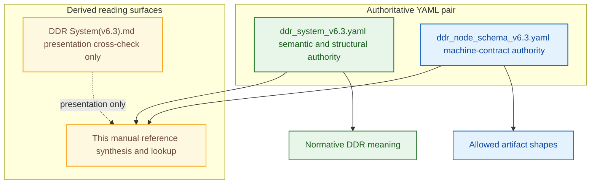

<span class="ddr-label ddr-surface-explanatory"><strong>Interpretation</strong></span> The manual depends on both YAML authorities at once: the system definition controls meaning, while the schema controls what valid DDR artifacts may look like.

<span class="ddr-label ddr-surface-schema"><strong>Authority basis</strong></span> Opening authority statement, Section `1.1`, and the root roles described by `ddr_system_v6.3.yaml` and `ddr_node_schema_v6.3.yaml`.

The specification defines the current DDR System. The schema defines what valid DDR artifacts may look like. Both are required to document v6.3 correctly.

### 1.2 Scope

| Property                                              | Value                                           |
| ----------------------------------------------------- | ----------------------------------------------- |
| DDR version                                           | `6.3`                                           |
| Document profile of the authoritative source artifact | `system_definition`                             |
| Project name                                          | `DDR System v6.3 - Authoritative Specification` |
| Project mode                                          | `full`                                          |
| System status                                         | `Finalized`                                     |
| System date                                           | `2026-03-28`                                    |
| System scope                                          | `Systems-, language-, and domain-agnostic`      |
| Authority                                             | `DDR Architecture Board`                        |
| Lineage                                               | `Supersedes DDR v6.2`                           |

### 1.3 How to use this manual

| Role                    | Primary need                                                                                                  | Start here                               |
| ----------------------- | ------------------------------------------------------------------------------------------------------------- | ---------------------------------------- |
| New reader              | Understand the authority model, current-state overview, and the core DDR shape before diving into details     | Sections 1, 2, then 3                    |
| Tier author / reviewer  | Check what each tier must contain and how it interacts with parent, child, and reconciliation rules           | Sections 4, 3, and 7                     |
| Validator / tool author | Inspect machine-facing profile rules, schema branches, lifecycle transitions, guards, and validation surfaces | Sections 9, 5, and 3                     |
| Extension implementer   | Confirm extension boundaries, ARE behavior, schema-side extension rules, and reconciliation touchpoints       | Sections 8, 9, and 7                     |
| Audit / history reader  | Trace changes from current-state metadata through version history, migration, counts, and source crosswalk    | Sections 2.3, 10.2, 10.3, 10.4, and 10.5 |

**Figure 1.2. Reader routing by technical objective**

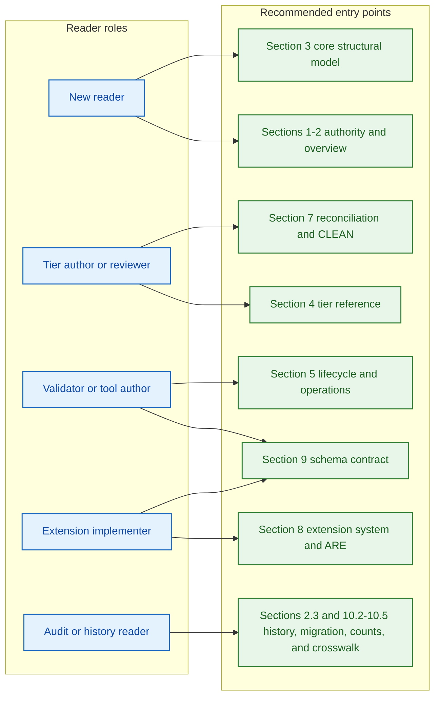

<span class="ddr-label ddr-surface-explanatory"><strong>Interpretation</strong></span> The routing matrix is optimized for lookup speed: readers enter through the authority, structure, operational, extension, or history surfaces that match their immediate task.

<span class="ddr-label ddr-surface-explanatory"><strong>Authority basis</strong></span> Section `1.3` role-routing table and the preserved section-family structure of this manual.

### 1.4 Normative vs explanatory content

- <span class="ddr-badge ddr-surface-normative"><strong>Normative DDR facts</strong></span> are taken directly from the authoritative YAML files.
- <span class="ddr-badge ddr-surface-explanatory"><strong>Reference explanations</strong></span> reorganize or summarize those facts for lookup.
- <span class="ddr-badge ddr-surface-schema"><strong>Schema-literal constraints</strong></span> remain governed by the schema whenever a rule depends on field shape, enum closure, or conditional validation branching.
- `Examples` in this manual are limited to source-native examples already present in the authoritative files, such as representative nodes, canonical tier variants, scoring profiles, lifecycle transitions, and extension catalog entries.

<div style="page-break-before: always;"></div>

## 2. System Overview and Design Philosophy


This section covers the current authoritative metadata, the governing design philosophy, the explicit v6.2-to-v6.3 change surface, and the current errata state. Use Section 3 for the operational structure of the Core model and Section 10 for historical and migration context.

### 2.1 System metadata

| Surface                                  | Value                                                                                                                                                                                  |
| ---------------------------------------- | -------------------------------------------------------------------------------------------------------------------------------------------------------------------------------------- |
| `project.name`                           | `DDR System v6.3 - Authoritative Specification`                                                                                                                                        |
| `project.created`                        | `2026-02-26`                                                                                                                                                                           |
| `project.mode`                           | `full`                                                                                                                                                                                 |
| `system_metadata.status`                 | `Finalized`                                                                                                                                                                            |
| `system_metadata.date`                   | `2026-03-28`                                                                                                                                                                           |
| `system_metadata.scope`                  | Systems-, language-, and domain-agnostic                                                                                                                                               |
| `system_metadata.authority`              | `DDR Architecture Board`                                                                                                                                                               |
| `system_metadata.lineage`                | Supersedes DDR v6.2                                                                                                                                                                    |
| `system_metadata.single_source_of_truth` | This document is the exclusive normative specification for DDR v6.3; prior versions, conversation records, partial specifications, and derivative documents carry no normative weight. |

The authoritative specification does more than identify itself as current. It explicitly closes the authority chain: the YAML system-definition artifact is the normative source of truth, and derivative documents such as this manual are explanatory aids only.

### 2.2 Design philosophy

| Principle                     | Description                                                                                                                                                                                                                            |
| ----------------------------- | -------------------------------------------------------------------------------------------------------------------------------------------------------------------------------------------------------------------------------------- |
| Minimize Design Complexity    | Every element earns its existence. No tier, edge type, operation, or rule exists without a concrete problem it solves. The system must be adoptable by a solo developer on day one and scale to enterprise without structural changes. |
| Avoid Premature Optimization  | The Core defines the minimum viable graph. Advanced analytical capabilities, inference engines, and domain-specific intelligence are delivered exclusively via optional Extensions. The Core never anticipates an Extension.           |
| Maximize Structural Integrity | The DAG is the single source of truth. Every node is traceable, every edge is typed, every mutation is validated. The system is correct by construction.                                                                               |

### 2.3 Changes from v6.2 in v6.3

| Area                               | Prior                                                                                                                      | Current                                                                                                                                  | Rationale                                                                                                                                       |
| ---------------------------------- | -------------------------------------------------------------------------------------------------------------------------- | ---------------------------------------------------------------------------------------------------------------------------------------- | ----------------------------------------------------------------------------------------------------------------------------------------------- |
| Explicit document profiling        | System-definition intent was inferred indirectly from `system_metadata`                                                    | `document_profile` explicitly distinguishes `project_instance`, `project_instance_express`, and `system_definition` roots                | Makes authored document intent machine-explicit and lets the schema require the full authoritative surface only for system-definition artifacts |
| Topology closure                   | `active_tiers` enforced membership loosely and left topology consequences to downstream logic                              | `active_tiers` is restricted to canonical order variants and topology obligations become first-class invariants                          | Closes ordering and representative-coverage ambiguity without adding a second topology model                                                    |
| Lifecycle authority simplification | Lifecycle behavior was split across `status_transitions` and `prohibited_transitions`, with composite raw operation tokens | `status_transitions` is the sole lifecycle authority and transition metadata decomposes operation, phase, side-effect, and prerequisites | Removes dual-authority drift and keeps operation identity machine-normalized                                                                    |
| ARE contract hardening             | ARE activation states, E5 `scoring_profile` requirements, and custom-profile structure were under-typed                    | Activation states are structurally typed, E5 requires `scoring_profile`, and custom-profile shape is explicit                            | Strengthens the schema front door while leaving profile resolution and score-band ordering to deterministic ARE conformance validation          |
| Operation namespace normalization  | Operations, lifecycle rows, and scaffold comments mixed canonical names with phase or alias tokens                         | The canonical operation surface is closed and `UNBUNDLE_EXECUTE` is the sole commit-phase token                                          | Keeps validators, logs, and API-like surfaces aligned                                                                                           |
| Rule identifier typing             | Invariant, atomic-rule, and extension-rule identifiers were only partially typed                                           | Rule-ID families are centralized and typed consistently across the schema                                                                | Reduces malformed-reference drift                                                                                                               |
| Express mode closure               | Express Mode groups and top-level express authority were under-enforced                                                    | Group compositions are fixed structurally and express-capable profiles require the full `express_mode` authority block                   | Prevents authored Express Mode files from redefining group structure or omitting their governing contract                                       |

### 2.4 Errata state

The authoritative `errata_log` is empty. No active errata entries are carried in the v6.3 system-definition artifact.

**Figure 2.1. v6.3 framing surfaces and downstream impact**

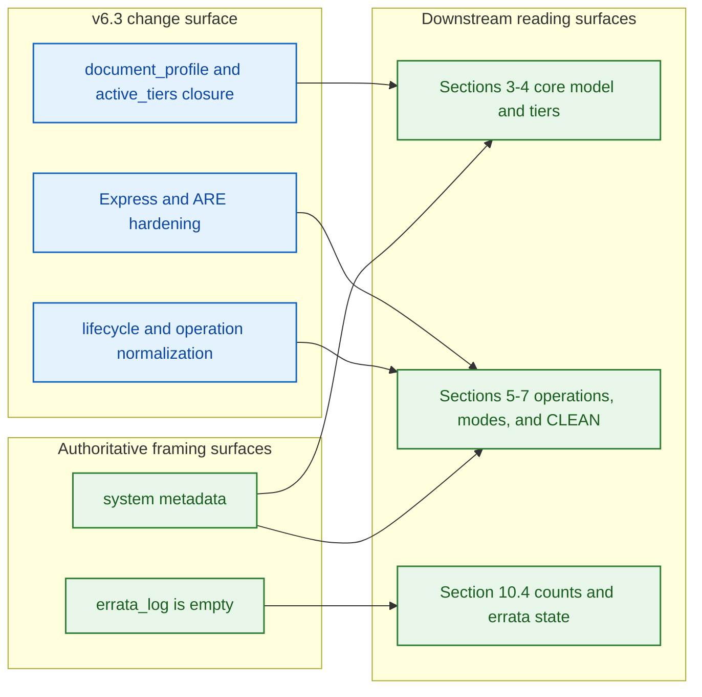

<span class="ddr-label ddr-surface-explanatory"><strong>Interpretation</strong></span> Section 2 is not introductory filler; it frames the exact v6.3 deltas that explain why later profile, lifecycle, Express, and ARE sections are structured as they are.

<span class="ddr-label ddr-surface-normative"><strong>Authority basis</strong></span> `project`, `system_metadata`, `errata_log`, and the Section `2.3` change table sourced from `ddr_system_v6.3.yaml`.

<div style="page-break-before: always;"></div>

## 3. Foundational Axioms and Core Structural Model


This section covers the current-state structural foundation of DDR v6.3: axioms, document profiles, canonical topology, universal node shape, edge semantics, citation rules, and invariants. Use Section 4 for tier-local rule surfaces, Section 5 for operational behavior, and Section 9 for the corresponding schema-side machine contract.

### 3.1 Foundational axioms

| ID     | Name                  | Statement                                                                                                                 | Implication                                                                                                         |
| ------ | --------------------- | ------------------------------------------------------------------------------------------------------------------------- | ------------------------------------------------------------------------------------------------------------------- |
| `AX-1` | Traceability          | Every non-root node must cite at least one parent via a typed edge.                                                       | Complete audit trails from intent to implementation; no orphaned requirements.                                      |
| `AX-2` | Abstraction Ordering  | Technology and implementation specificity are deferred until logically necessary.                                         | Tiers above CL (`XPD`, `SIL`, `GPCL`, `FCL`) must contain no technology, hardware, or implementation references.    |
| `AX-3` | Determinism           | Identical inputs produce unambiguous, mechanically verifiable outputs.                                                    | Structural rules support automated validation; semantic rules require explicit human disposition before activation. |
| `AX-4` | Universality          | The Core applies to all software systems regardless of domain, scale, or technology.                                      | No domain-specific assumptions belong in any Core tier.                                                             |
| `AX-5` | Extensibility         | Advanced analytical capabilities are delivered exclusively via optional Extensions.                                       | Core structure remains stable and does not depend on Extension behavior.                                            |
| `AX-6` | Declarative Integrity | The Core is strictly declarative; all inference, optimization, and automated recommendation are Extension-only behaviors. | Core structural invariants cannot be destabilized by analytical logic.                                              |
| `AX-7` | DAG Acyclicity        | No citation chain may produce a cycle; causality flows in one direction only.                                             | Graph traversal always terminates.                                                                                  |

### 3.2 Document profiles

The schema defines three top-level document profiles:

| Profile                    | Meaning                                  | High-level contract                                                                                                                                                                            |
| -------------------------- | ---------------------------------------- | ---------------------------------------------------------------------------------------------------------------------------------------------------------------------------------------------- |
| `project_instance`         | Lean full-mode project artifact          | Rooted in `ddr_version`, `document_profile`, `active_tiers`, and `nodes`; must not require `system_metadata`                                                                                   |
| `project_instance_express` | Express-mode project artifact            | Same lean root plus express obligations; requires `express_mode`, and each node must carry `express_mode_group`                                                                                |
| `system_definition`        | Authoritative DDR specification artifact | Requires the full normative top-level surface, including metadata, axioms, edge definitions, tier definitions, operations, extension system, compliance, glossary, ARE profiles, and lifecycle |

Additional machine-enforced coupling rules that matter during authoring:

- If `project.mode = express`, the schema forces `document_profile = project_instance_express`.
- If `document_profile = project_instance_express` and `project.mode` is present, `project.mode` must equal `express`.
- If `document_profile = project_instance_express`, every node must carry `express_mode_group`.
- If `active_tiers` contains `XPD`, `SIL` is no longer schema-legal as a root node and must carry at least one `parent_ids` entry.

Authoring examples:

| Intent                          | Minimal valid profile posture                                                                                                                                |
| ------------------------------- | ------------------------------------------------------------------------------------------------------------------------------------------------------------ |
| Lean full-mode project file     | `document_profile: project_instance` plus canonical `active_tiers` and `nodes`                                                                               |
| Lean express-mode project file  | `document_profile: project_instance_express`, top-level `express_mode`, node-level `express_mode_group`, and `project.mode: express` if `project` is present |
| Authoritative DDR spec artifact | `document_profile: system_definition` plus the full normative surface required by the schema                                                                 |

**Figure 3.1. `document_profile` branching and required-surface split**

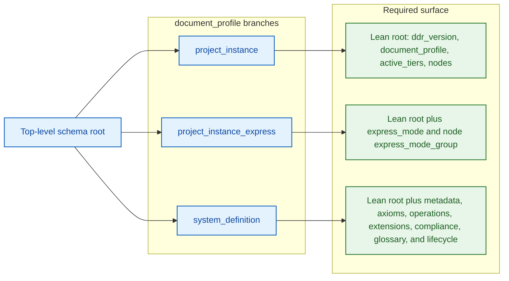

<span class="ddr-label ddr-surface-explanatory"><strong>Interpretation</strong></span> `document_profile` is the top-level branching key that separates lean project artifacts from the authoritative full-surface system-definition artifact.

<span class="ddr-label ddr-surface-schema"><strong>Authority basis</strong></span> `ddr_node_schema_v6.3.yaml` top-level profile branching and Section `3.2`.

### 3.3 Canonical `active_tiers` variants

The schema allows exactly four ordered variants:

| Variant              | Ordered tiers                                 |
| -------------------- | --------------------------------------------- |
| Base 7-tier topology | `SIL, GPCL, FCL, SAL, ICL, CDL, ISL`          |
| Base + `XPD`         | `XPD, SIL, GPCL, FCL, SAL, ICL, CDL, ISL`     |
| Base + `CL`          | `SIL, GPCL, FCL, CL, SAL, ICL, CDL, ISL`      |
| Base + `XPD` + `CL`  | `XPD, SIL, GPCL, FCL, CL, SAL, ICL, CDL, ISL` |

**Figure 3.2. Canonical `active_tiers` closure**

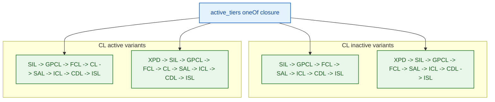

<span class="ddr-label ddr-surface-explanatory"><strong>Interpretation</strong></span> DDR v6.3 closes `active_tiers` to four legal ordered topologies; arbitrary activation sets and arbitrary orderings are not part of the allowed model.

<span class="ddr-label ddr-surface-schema"><strong>Authority basis</strong></span> `ddr_node_schema_v6.3.yaml` `properties.active_tiers` closure and Section `3.3`.

### 3.4 Canonical topology and representative nodes

**Figure 3.3. Canonical topology and merge behavior**

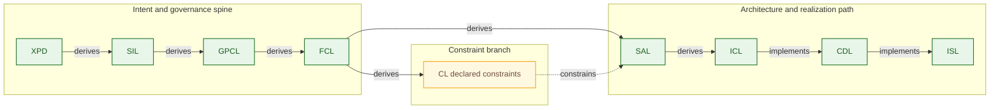

<span class="ddr-label ddr-surface-explanatory"><strong>Interpretation</strong></span> `SAL` is the architectural merge point: capability intent arrives from `FCL`, while declared technology and infrastructure bounds arrive from `CL` through `constrains`.

<span class="ddr-label ddr-surface-normative"><strong>Authority basis</strong></span> Representative `nodes`, `tier_definitions`, and the `CIT-R3` / `INV-4` surfaces summarized in Sections `3.4`, `3.8`, and `3.9`.

The authoritative system-definition artifact includes one representative node for each active tier:

| Node ID    | Tier   | Title                              | Parent citations                                   |
| ---------- | ------ | ---------------------------------- | -------------------------------------------------- |
| `XPD-0.1`  | `XPD`  | Existential Purpose Document       | root                                               |
| `SIL-1.1`  | `SIL`  | Strategic Intent Layer             | `XPD-0.1` via `derives` with `semantic`            |
| `GPCL-2.1` | `GPCL` | Governance, Policy & Quality Layer | `SIL-1.1` via `derives` with `traceability`        |
| `FCL-3.1`  | `FCL`  | Functional Capability Layer        | `GPCL-2.1` via `derives` with `semantic`           |
| `CL-4.1`   | `CL`   | Constraint Layer                   | `FCL-3.1` via `derives` with `semantic`            |
| `SAL-5.1`  | `SAL`  | System Architecture Layer          | `FCL-3.1` via `derives`; `CL-4.1` via `constrains` |
| `ICL-6.1`  | `ICL`  | Interface & Contracts Layer        | `SAL-5.1` via `derives` with `semantic`            |
| `CDL-7.1`  | `CDL`  | Component Design Layer             | `ICL-6.1` via `implements`                         |
| `ISL-8.1`  | `ISL`  | Implementation Scaffold Layer      | `CDL-7.1` via `implements`                         |

### 3.5 Universal node format

The specification documents 13 node schema fields:

| Field                   | Type                            | Notes                                                                                       |
| ----------------------- | ------------------------------- | ------------------------------------------------------------------------------------------- |
| `id`                    | `TIER-N.M`                      | Immutable once assigned                                                                     |
| `tier`                  | enum                            | One of `XPD, SIL, GPCL, FCL, CL, SAL, ICL, CDL, ISL`                                        |
| `title`                 | string                          | Human-readable artifact label                                                               |
| `content`               | text                            | Body constrained by the tier's atomic ruleset                                               |
| `parent_ids`            | list of `ParentCitation`        | Required for all non-root nodes; `SIL` is root unless `XPD` is active. Legal edge types: `derives`, `constrains`, `implements` |
| `status`                | enum                            | `DRAFT, ACTIVE, DIRTY, DEPRECATED, SUPERSEDED, SUPERSEDE_PENDING`                           |
| `constraint_origin`     | enum, conditional               | `CL` only; one of `derived`, `imposed`                                                      |
| `prior_status`          | status enum subset, conditional | Only for `SUPERSEDE_PENDING`; allowed values are `ACTIVE`, `DEPRECATED`, `DIRTY`            |
| `version`               | SemVer string                   | Incremented on `MODIFY`                                                                     |
| `created`               | ISO 8601 datetime               | Creation timestamp                                                                          |
| `modified`              | ISO 8601 datetime               | Last modification timestamp                                                                 |
| `express_mode_group`    | enum, conditional               | Required when `document_profile = project_instance_express`; one of `G1, G2, G3, G4`        |
| `extension_annotations` | map                             | Read-only extension metadata with reserved shadow-key blocking                              |

**Figure 3.4. `DdrNode` and `ParentCitation` conditional structure**

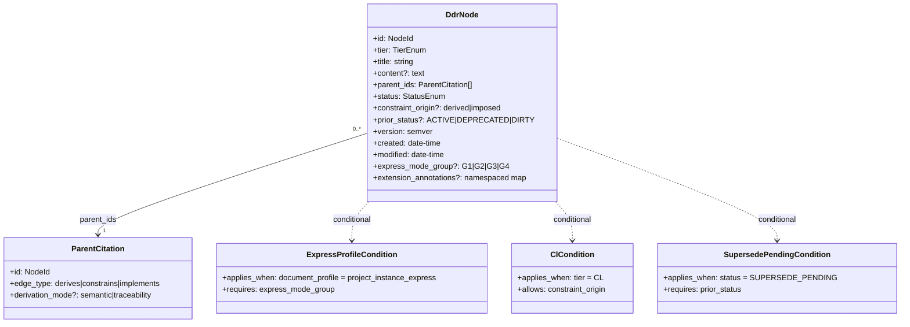

<span class="ddr-label ddr-surface-explanatory"><strong>Interpretation</strong></span> The node contract is closed, but several fields are legal only under profile-, tier-, or status-specific branches that the schema enforces explicitly.

<span class="ddr-label ddr-surface-schema"><strong>Authority basis</strong></span> `ddr_node_schema_v6.3.yaml` `$defs.DdrNode`, `$defs.ParentCitation`, and Section `3.5`.

### 3.6 Node ID format

| Item              | Value                                                                                  |
| ----------------- | -------------------------------------------------------------------------------------- |
| General pattern   | `[TIER]-[SECTION].[ITEM]`                                                              |
| XPD pattern       | `XPD-0.N`                                                                              |
| Examples          | `SIL-1.3`, `GPCL-2.1`, `CDL-12.5`, `XPD-0.1`                                           |
| Immutability rule | IDs never change. A superseded node retains its ID; the replacement receives a new ID. |

**Figure 3.5. Node ID grammar decomposition**

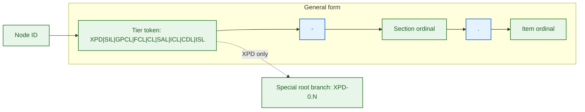

<span class="ddr-label ddr-surface-explanatory"><strong>Interpretation</strong></span> The ID format is stable across the system, with `XPD-0.N` as the only special root-pattern branch.

<span class="ddr-label ddr-surface-normative"><strong>Authority basis</strong></span> `node_id_format` in `ddr_system_v6.3.yaml` and the Section `3.6` lookup table.

### 3.7 Edge types

The current edge vocabulary is the four-type surface declared by `edge_type_definitions`. The specification also records the consolidation decision that reduced older edge vocabularies into this set.

| Edge type                                                                      | Symbol            | Semantics                                                                                                                                                                              |
| ------------------------------------------------------------------------------ | ----------------- | -------------------------------------------------------------------------------------------------------------------------------------------------------------------------------------- |
| <span class="ddr-badge ddr-edge-derives"><strong>derives</strong></span>       | `--derives-->`    | Child content derives from parent requirements, or parent is cited as authoritative lineage. Optional `derivation_mode` may be `semantic` or `traceability`; omitted means `semantic`. |
| <span class="ddr-badge ddr-edge-constrains"><strong>constrains</strong></span> | `--constrains-->` | Parent sets enforceable limits on the child's design space.                                                                                                                            |
| <span class="ddr-badge ddr-edge-implements"><strong>implements</strong></span> | `--implements-->` | Child provides concrete realization of the parent's abstract specification.                                                                                                            |
| <span class="ddr-badge ddr-edge-extends"><strong>extends</strong></span>       | `...extends...>`  | Extension reads or annotates Core nodes without modifying Core semantics.                                                                                                              |

### 3.8 Citation rules

| Rule     | Statement                                                                                                                                                                                         |
| -------- | ------------------------------------------------------------------------------------------------------------------------------------------------------------------------------------------------- |
| `CIT-R1` | Every non-root node must have `>= 1` parent citation; only root nodes may have an empty `parent_ids` array.                                                                                       |
| `CIT-R2` | Parent citations must reference the immediately preceding active tier or tiers. For `derives`, `derivation_mode` may be `semantic` or `traceability`; default is `semantic`.                      |
| `CIT-R3` | `CL -> SAL` constraint edges are stored in `parent_ids` with edge type `constrains`.                                                                                                              |
| `CIT-R4` | Any inline `[TIER-N.M]` citation in node content must have a matching `parent_ids` entry.                                                                                                         |
| `CIT-R5` | Extension `extends` relationships are stored in `extension_annotations` only, never in `parent_ids`.                                                                                              |
| `CIT-R6` | Any authority-linkage `derives` edge must set `derivation_mode: traceability`; non-`derives` edges must not carry `derivation_mode`.                                                              |
| `CIT-R7` | A child may remain `ACTIVE` only while each cited parent remains at the version last validated against. Any parent `MODIFY` or `SUPERSEDE` that changes cited content forces child re-validation. |

**Figure 3.6. Edge vocabulary and citation-surface separation**

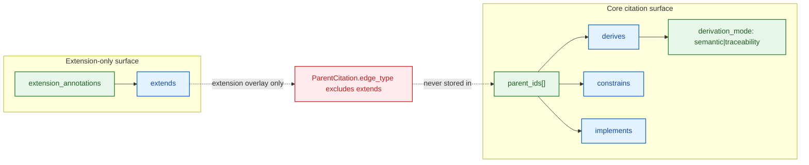

<span class="ddr-label ddr-surface-explanatory"><strong>Interpretation</strong></span> Core parent citations are closed to three edge types, while `extends` is isolated into extension annotations so that analytical overlays cannot masquerade as Core lineage.

<span class="ddr-label ddr-surface-schema"><strong>Authority basis</strong></span> `edge_type_definitions`, `citation_rules`, `$defs.ParentCitation`, and Sections `3.7-3.8`.

Worked citation examples:

```yaml
# Semantic derivation: the child's design content is derived from the parent's requirements.
parent_ids:
  - id: GPCL-2.1
    edge_type: derives
    derivation_mode: semantic

# Traceability citation: the parent is cited as lineage authority rather than as source semantics.
parent_ids:
  - id: SIL-1.1
    edge_type: derives
    derivation_mode: traceability

# Constraint injection into SAL.
parent_ids:
  - id: CL-4.1
    edge_type: constrains

# Implementation realization.
parent_ids:
  - id: ICL-6.1
    edge_type: implements
```

Common failure cases the YAML pair rejects or treats as non-conformant:

- `derivation_mode` attached to `constrains` or `implements`
- `extends` authored inside `parent_ids`
- inline `[TIER-N.M]` citations that do not have a matching `parent_ids` entry
- children left `ACTIVE` after cited-parent content changes without re-validation under `CIT-R7`

### 3.9 DAG invariants

| Invariant | Statement                                                                                                                                                                                                                               |
| --------- | --------------------------------------------------------------------------------------------------------------------------------------------------------------------------------------------------------------------------------------- |
| `INV-1`   | No cycles are permitted at any path length.                                                                                                                                                                                             |
| `INV-2`   | No tier-skipping: citations must target the immediately preceding active tier or tiers. `SAL` is the only exhaustive merge-node exception.                                                                                              |
| `INV-3`   | `active_tiers` must be one of the four canonical ordered sets. Every node tier must belong to `active_tiers`, and every `system_definition` artifact must include at least one representative node for each active tier.                |
| `INV-4`   | When `CL` is inactive, `SAL` derives directly from `FCL`.                                                                                                                                                                               |
| `INV-5`   | All non-root nodes must carry at least one parent citation.                                                                                                                                                                             |
| `INV-6`   | `SUPERSEDE` must be atomic across all tiers. Partial application is a structural violation. At most one XPD node may carry status ACTIVE at any time.                                                                    |
| `INV-7`   | Structural validity may coexist with declared semantic gaps only when the gap is explicitly logged in the reconciliation manifest under an allowed classification, with human rationale and required resolution or waiver before CLEAN. |
| `INV-8`   | `lifecycle.status_transitions` must form a complete and closed state machine: every non-terminal status has at least one valid outbound transition, and undefined transitions are invalid.                                              |

See also: Section 4, Section 5, Section 9.

<div style="page-break-before: always;"></div>

## 4. Tier Reference


This section covers the tier-by-tier current-state contract for DDR v6.3, including representative nodes, parent and child relationships, inclusion rules, exclusion rules, and tier-specific verification notes. Use Section 3 for shared structural rules, Section 5 for lifecycle and operation effects, and Section 7 for reconciliation and CLEAN-state implications.

**Figure 4.1. Abstraction descent across active tiers**

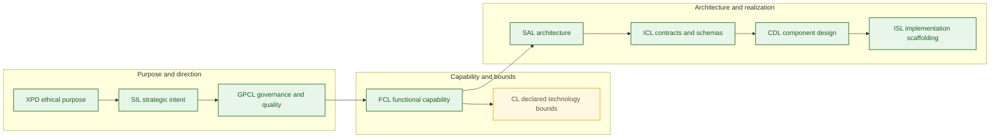

<span class="ddr-label ddr-surface-explanatory"><strong>Interpretation</strong></span> DDR descends from ethical and strategic abstraction into concrete contracts and scaffolding, while `CL` sits beside the functional path as a declaration of non-negotiable bounds rather than user-facing behavior.

<span class="ddr-label ddr-surface-normative"><strong>Authority basis</strong></span> `tier_definitions`, `AX-2`, and the tier reference surfaces in Section `4`.

**Figure 4.2. Constraint injection path from `CL` into downstream design**

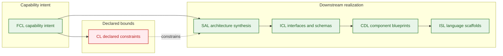

<span class="ddr-label ddr-surface-explanatory"><strong>Interpretation</strong></span> `CL` does not replace functional intent; it injects explicit technology, hardware, and infrastructure bounds into `SAL`, and that constrained architecture then propagates into contracts, design, and scaffolding.

<span class="ddr-label ddr-surface-normative"><strong>Authority basis</strong></span> `tier_definitions`, `constraint_precedence`, and the tier-local parent/child relationship tables in Section `4`.

### 4.1 `XPD` - Existential Purpose Document

| Property                                  | Value                                                                                                                                                         |
| ----------------------------------------- | ------------------------------------------------------------------------------------------------------------------------------------------------------------- |
| Representative node                       | `XPD-0.1`                                                                                                                                                     |
| Label                                     | Existential Purpose Document                                                                                                                                  |
| Core question                             | What human or societal need does this system exist to address, and what ethical boundaries govern all downstream decisions?                                   |
| Optional                                  | Yes                                                                                                                                                           |
| Root / activation rule                    | Always root when active. Required when ethical impact is not none or societal scale exceeds personal; skippable for internal tooling with no external effect. |
| Parent relationships                      | `NONE` via `derives` under condition `none_root`                                                                                                              |
| Child relationships                       | `SIL` via `derives` under condition `always`                                                                                                                  |
| Tier-specific schema or verification note | None beyond universal node contract                                                                                                                           |

| Inclusion rule | verification_mode | Statement                                                                          |
| -------------- | ----------------- | ---------------------------------------------------------------------------------- |
| `XPD-R1`       | structural        | Must articulate a fundamental human or societal need being addressed.              |
| `XPD-R2`       | structural        | Must be immutable across the project lifecycle; changes require a new XPD version. |
| `XPD-R3`       | semantic          | Must be comprehensible to non-technical stakeholders without a glossary.           |
| `XPD-R4`       | structural        | Must establish ethical boundary conditions all subsequent tiers must satisfy.      |
| `XPD-R5`       | structural        | Must define success criteria independent of implementation metrics.                |
| `XPD-R6`       | structural        | Must identify populations who could be harmed and the safeguards required.         |

| Exclusion rule | Statement                                                                          |
| -------------- | ---------------------------------------------------------------------------------- |
| `XPD-E1`       | Must not contain solution concepts, technology references, or architectural ideas. |
| `XPD-E2`       | Must not contain quantitative performance targets; those belong in `GPCL`.         |
| `XPD-E3`       | Must not contain regulatory or legal constraints; those belong in `GPCL`.          |

### 4.2 `SIL` - Strategic Intent Layer

| Property                                  | Value                                                                       |
| ----------------------------------------- | --------------------------------------------------------------------------- |
| Representative node                       | `SIL-1.1`                                                                   |
| Label                                     | Strategic Intent Layer                                                      |
| Core question                             | Why does this system exist, and what business outcomes must it achieve?     |
| Optional                                  | No                                                                          |
| Root / activation rule                    | Root when `XPD` is inactive                                                 |
| Parent relationships                      | `XPD` via `derives` if `XPD` active; `NONE` via `derives` if `XPD` inactive |
| Child relationships                       | `GPCL` via `derives` under condition `always`                               |
| Tier-specific schema or verification note | None beyond universal node contract                                         |

| Inclusion rule | verification_mode | Statement                                                                            |
| -------------- | ----------------- | ------------------------------------------------------------------------------------ |
| `SIL-R1`       | structural        | Must define the core business problem or opportunity being addressed.                |
| `SIL-R2`       | structural        | Must specify strategic objectives with measurable outcomes.                          |
| `SIL-R3`       | structural        | Must identify all stakeholder categories and their value propositions.               |
| `SIL-R4`       | structural        | Must establish explicit scope boundaries, including in-scope and out-of-scope areas. |
| `SIL-R5`       | structural        | Must define organizational success metrics.                                          |
| `SIL-R6`       | structural        | Must remain stable under technology changes.                                         |

| Exclusion rule | Statement                                                                                |
| -------------- | ---------------------------------------------------------------------------------------- |
| `SIL-E1`       | Must not reference hardware, technology stacks, frameworks, or languages.                |
| `SIL-E2`       | Must not contain regulatory mandates or compliance requirements; those belong in `GPCL`. |
| `SIL-E3`       | Must not prescribe architectural patterns or implementation strategies.                  |
| `SIL-E4`       | Must not contain quantitative performance metrics; those belong in `GPCL`.               |

### 4.3 `GPCL` - Governance, Policy & Quality Layer

| Property                                  | Value                                                                                                                                    |
| ----------------------------------------- | ---------------------------------------------------------------------------------------------------------------------------------------- |
| Representative node                       | `GPCL-2.1`                                                                                                                               |
| Label                                     | Governance, Policy & Quality Layer                                                                                                       |
| Core question                             | What non-negotiable external mandates, regulatory obligations, policy constraints, and measurable quality thresholds govern this system? |
| Optional                                  | No                                                                                                                                       |
| Root / activation rule                    | Never root; derives from `SIL`                                                                                                           |
| Parent relationships                      | `SIL` via `derives` under condition `always`                                                                                             |
| Child relationships                       | `FCL` via `derives` under condition `always`                                                                                             |
| Tier-specific schema or verification note | No extra schema fields beyond the universal node contract                                                                                |

| Inclusion rule | verification_mode | Statement                                                                                                                                                                                                                                               |
| -------------- | ----------------- | ------------------------------------------------------------------------------------------------------------------------------------------------------------------------------------------------------------------------------------------------------- |
| `GPCL-R1`      | structural        | Must enumerate all applicable regulatory frameworks with jurisdiction and scope.                                                                                                                                                                        |
| `GPCL-R2`      | semantic          | Must specify enforceable, testable constraints rather than aspirational targets.                                                                                                                                                                        |
| `GPCL-R3`      | structural        | Must identify contractual obligations imposed by third-party relationships.                                                                                                                                                                             |
| `GPCL-R4`      | structural        | Must define data sovereignty and residency requirements.                                                                                                                                                                                                |
| `GPCL-R5`      | structural        | Must specify audit and record-retention mandates.                                                                                                                                                                                                       |
| `GPCL-R6`      | structural        | Must specify quantifiable performance targets: latency, throughput, and concurrency ceilings.                                                                                                                                                           |
| `GPCL-FCL-BR1` | semantic          | Every `GPCL-R6` target needs a corresponding `FCL` node that provides behavioral context rather than merely repeating the number. If no user-facing behavioral dimension exists, the author must log `MISSING_MEDIATOR` in the reconciliation manifest. |
| `GPCL-R7`      | structural        | Must specify reliability and availability targets such as SLAs, RTO, and RPO.                                                                                                                                                                           |
| `GPCL-R8`      | structural        | Must specify security requirements in technology-neutral language.                                                                                                                                                                                      |
| `GPCL-R9`      | structural        | Must specify scalability and accessibility requirements.                                                                                                                                                                                                |
| `GPCL-R10`     | structural        | Must cite parent `SIL` IDs for each constraint.                                                                                                                                                                                                         |

| Exclusion rule | Statement                                                                            |
| -------------- | ------------------------------------------------------------------------------------ |
| `GPCL-E1`      | Must not specify technology frameworks, library choices, or hardware specifications. |
| `GPCL-E2`      | Must not describe functional system behaviors; those belong in `FCL`.                |
| `GPCL-E3`      | Must not contain business objectives or success metrics; those belong in `SIL`.      |

### 4.4 `FCL` - Functional Capability Layer

| Property                                  | Value                                                                                      |
| ----------------------------------------- | ------------------------------------------------------------------------------------------ |
| Representative node                       | `FCL-3.1`                                                                                  |
| Label                                     | Functional Capability Layer                                                                |
| Core question                             | What externally observable behaviors and user-facing capabilities must the system provide? |
| Optional                                  | No                                                                                         |
| Root / activation rule                    | Never root; derives from `GPCL`                                                            |
| Parent relationships                      | `GPCL` via `derives` under condition `always`                                              |
| Child relationships                       | `SAL` via `derives` always; `CL` via `derives` if `CL` is active                           |
| Tier-specific schema or verification note | `FCL-R7` adds mandatory logical data-entity enumeration for data-modifying capabilities    |

| Inclusion rule | verification_mode | Statement                                                                                                                                                                                                                           |
| -------------- | ----------------- | ----------------------------------------------------------------------------------------------------------------------------------------------------------------------------------------------------------------------------------- |
| `FCL-R1`       | semantic          | Must describe capabilities from the perspective of a user or external system.                                                                                                                                                       |
| `FCL-R2`       | semantic          | Must specify user workflows end-to-end without naming components, classes, or modules.                                                                                                                                              |
| `FCL-R3`       | structural        | Must define event-driven behaviors and conditional business-logic rules.                                                                                                                                                            |
| `FCL-R4`       | structural        | Must specify user-observable state transitions and error conditions.                                                                                                                                                                |
| `FCL-R5`       | structural        | Must be decomposable into sub-capabilities for complex features.                                                                                                                                                                    |
| `FCL-R6`       | structural        | Must cite parent `GPCL` IDs for capabilities that satisfy governance or quality requirements.                                                                                                                                       |
| `FCL-R7`       | semantic          | For any capability that creates, reads, updates, or deletes persistent data, must enumerate all logical data entities involved and their CRUD relationship, without attribute typing, storage structures, keys, or integrity rules. |

| Exclusion rule | Statement                                                                   |
| -------------- | --------------------------------------------------------------------------- |
| `FCL-E1`       | Must not name specific classes, modules, APIs, or algorithms.               |
| `FCL-E2`       | Must not specify network protocols, serialization formats, or data schemas. |
| `FCL-E3`       | Must not specify hardware requirements or infrastructure topology.          |

### 4.5 `CL` - Constraint Layer

| Property                                  | Value                                                                                                                                |
| ----------------------------------------- | ------------------------------------------------------------------------------------------------------------------------------------ |
| Representative node                       | `CL-4.1`                                                                                                                             |
| Label                                     | Constraint Layer                                                                                                                     |
| Core question                             | What are the declared technology selections, hardware envelopes, and infrastructure ceilings that bound the system's implementation? |
| Optional                                  | Yes                                                                                                                                  |
| Root / activation rule                    | Active when technology, hardware, or infrastructure constraints are non-negotiable                                                   |
| Parent relationships                      | `FCL` via `derives` if `CL` is active                                                                                                |
| Child relationships                       | `SAL` via `constrains` if `CL` is active                                                                                             |
| Tier-specific schema or verification note | `constraint_origin` is required and branches verification between `CL-R9` and `CL-R9-imposed`                                        |

| Inclusion rule  | verification_mode | Statement                                                                                                                       |
| --------------- | ----------------- | ------------------------------------------------------------------------------------------------------------------------------- |
| `CL-R1`         | structural        | Must declare approved programming languages with version constraints.                                                           |
| `CL-R2`         | structural        | Must declare mandatory frameworks and core libraries with minimum version bounds.                                               |
| `CL-R3`         | structural        | Must declare required external service contracts without internal implementation detail.                                        |
| `CL-R4`         | structural        | Must declare runtime environment constraints such as OS, container runtime, or execution environment.                           |
| `CL-R5`         | structural        | Must explicitly declare prohibited technologies with rationale.                                                                 |
| `CL-R6`         | structural        | Must declare hardware envelopes when applicable, including CPU class, RAM floor, storage, and GPU.                              |
| `CL-R7`         | structural        | Must declare infrastructure ceilings when applicable, including compute budget, storage cap, and bandwidth cap.                 |
| `CL-R8`         | structural        | Must specify deployment topology declarations such as on-premise, cloud-agnostic, hybrid, or edge.                              |
| `CL-R9`         | structural        | Must cite `FCL` IDs for each `derived` constraint.                                                                              |
| `CL-R9-imposed` | structural        | Must cite the external authority source for each `imposed` constraint. `FCL` citation becomes optional contextual traceability. |
| `CL-R10`        | structural        | Must explicitly document internal reconciliations of conflicting hardware and technology constraints.                           |

| Exclusion rule | Statement                                                                                  |
| -------------- | ------------------------------------------------------------------------------------------ |
| `CL-E1`        | Must not auto-derive, infer, or recommend configurations; inference belongs to Extensions. |
| `CL-E2`        | Must not contain functional system behaviors; those belong in `FCL`.                       |
| `CL-E3`        | Must not contain cost models or TCO calculations; those belong in Extensions.              |

### 4.6 `SAL` - System Architecture Layer

| Property                                  | Value                                                                                      |
| ----------------------------------------- | ------------------------------------------------------------------------------------------ |
| Representative node                       | `SAL-5.1`                                                                                  |
| Label                                     | System Architecture Layer                                                                  |
| Core question                             | How is the system structurally decomposed, and what patterns govern component interaction? |
| Optional                                  | No                                                                                         |
| Root / activation rule                    | Never root; merge node between functional derivation and optional constraint input         |
| Parent relationships                      | `FCL` via `derives` always; `CL` via `constrains` if `CL` is active                        |
| Child relationships                       | `ICL` via `derives` under condition `always`                                               |
| Tier-specific schema or verification note | `SAL` is the only valid merge node in the Core topology                                    |

| Inclusion rule | verification_mode | Statement                                                                                            |
| -------------- | ----------------- | ---------------------------------------------------------------------------------------------------- |
| `SAL-R1`       | semantic          | Must define the overarching architectural pattern or patterns with rationale.                        |
| `SAL-R2`       | structural        | Must specify system decomposition into major subsystems with ownership boundaries.                   |
| `SAL-R3`       | structural        | Must specify inter-subsystem communication patterns.                                                 |
| `SAL-R4`       | structural        | Must specify concurrency model and data ownership rules.                                             |
| `SAL-R5`       | structural        | Must specify failure isolation and resilience boundaries.                                            |
| `SAL-R6`       | structural        | Must cite all active parent IDs for each major architectural decision: `FCL`, plus `CL` when active. |

| Exclusion rule | Statement                                                                                                         |
| -------------- | ----------------------------------------------------------------------------------------------------------------- |
| `SAL-E1`       | Must not contain exact data schemas or payload definitions; those belong in `ICL`.                                |
| `SAL-E2`       | Must not contain class-level component blueprints; those belong in `CDL`.                                         |
| `SAL-E3`       | Must not contain executable code, algorithm implementations, or procedural logic; those belong in `CDL` or `ISL`. |

### 4.7 `ICL` - Interface & Contracts Layer

| Property                                  | Value                                                                                                |
| ----------------------------------------- | ---------------------------------------------------------------------------------------------------- |
| Representative node                       | `ICL-6.1`                                                                                            |
| Label                                     | Interface & Contracts Layer                                                                          |
| Core question                             | What are the formal, machine-verifiable contracts governing data exchange between system boundaries? |
| Optional                                  | No                                                                                                   |
| Root / activation rule                    | Never root; derives from `SAL`                                                                       |
| Parent relationships                      | `SAL` via `derives` under condition `always`                                                         |
| Child relationships                       | `CDL` via `implements` under condition `always`                                                      |
| Tier-specific schema or verification note | `ICL-R2` requires machine-parseable schemas                                                          |

| Inclusion rule | verification_mode | Statement                                                                                            |
| -------------- | ----------------- | ---------------------------------------------------------------------------------------------------- |
| `ICL-R1`       | structural        | Must define all inter-component and external API contracts with complete input and output schemas.   |
| `ICL-R2`       | structural        | All schemas must be machine-parseable, such as JSON Schema, Protobuf, OpenAPI, or equivalent.        |
| `ICL-R3`       | structural        | Must specify serialization formats, encoding standards, and wire protocols per contract.             |
| `ICL-R4`       | structural        | Must specify mandatory fields, optional fields, type constraints, and validation rules.              |
| `ICL-R5`       | structural        | Must specify error response contracts, including error codes, payload structure, and retry behavior. |
| `ICL-R6`       | structural        | Must specify versioning strategy per contract.                                                       |
| `ICL-R7`       | structural        | Must cite `SAL` IDs for each contract.                                                               |

| Exclusion rule | Statement                                                               |
| -------------- | ----------------------------------------------------------------------- |
| `ICL-E1`       | Must not contain internal component state management or business logic. |
| `ICL-E2`       | Must not specify architectural routing patterns; those belong in `SAL`. |
| `ICL-E3`       | Must not contain class or module blueprints; those belong in `CDL`.     |

### 4.8 `CDL` - Component Design Layer

| Property                                  | Value                                                                                                                           |
| ----------------------------------------- | ------------------------------------------------------------------------------------------------------------------------------- |
| Representative node                       | `CDL-7.1`                                                                                                                       |
| Label                                     | Component Design Layer                                                                                                          |
| Core question                             | What are the structural blueprints of individual components, including public interfaces, internal state, and responsibilities? |
| Optional                                  | No                                                                                                                              |
| Root / activation rule                    | Never root; implements `ICL`                                                                                                    |
| Parent relationships                      | `ICL` via `implements` under condition `always`                                                                                 |
| Child relationships                       | `ISL` via `implements` under condition `always`                                                                                 |
| Tier-specific schema or verification note | `CDL-R7` requires language-specific blueprints when `CL` declares multiple targets                                              |

| Inclusion rule | verification_mode | Statement                                                                                                              |
| -------------- | ----------------- | ---------------------------------------------------------------------------------------------------------------------- |
| `CDL-R1`       | structural        | Must define component names, logical responsibilities, and ownership boundaries.                                       |
| `CDL-R2`       | structural        | Must specify all public method or function signatures, including names, parameter types, return types, and exceptions. |
| `CDL-R3`       | structural        | Must specify internal state structures as a logical model rather than executable implementation.                       |
| `CDL-R4`       | structural        | Must specify component dependencies, including consumed components and `ICL` contracts.                                |
| `CDL-R5`       | structural        | Must map each component to the `ICL` contracts it implements.                                                          |
| `CDL-R6`       | structural        | Must specify initialization, lifecycle, and teardown contracts for stateful components.                                |
| `CDL-R7`       | structural        | When `CL` declares multiple target languages, must produce language-specific blueprints for each target.               |

| Exclusion rule | Statement                                                                   |
| -------------- | --------------------------------------------------------------------------- |
| `CDL-E1`       | Must not contain executable code bodies or algorithm implementations.       |
| `CDL-E2`       | Must not contain system-wide architectural patterns; those belong in `SAL`. |
| `CDL-E3`       | Must not contain data serialization schemas; those belong in `ICL`.         |

### 4.9 `ISL` - Implementation Scaffold Layer

| Property                                  | Value                                                                                               |
| ----------------------------------------- | --------------------------------------------------------------------------------------------------- |
| Representative node                       | `ISL-8.1`                                                                                           |
| Label                                     | Implementation Scaffold Layer                                                                       |
| Core question                             | What is the minimal, structurally valid, traceable scaffolding required to initiate implementation? |
| Optional                                  | No                                                                                                  |
| Root / activation rule                    | Terminal leaf tier                                                                                  |
| Parent relationships                      | `CDL` via `implements` under condition `always`                                                     |
| Child relationships                       | none                                                                                                |
| Tier-specific schema or verification note | `ISL` is the only valid leaf tier in a CLEAN Core DAG                                               |

| Inclusion rule | verification_mode | Statement                                                                                                         |
| -------------- | ----------------- | ----------------------------------------------------------------------------------------------------------------- |
| `ISL-R1`       | structural        | Must produce syntactically valid structural scaffolding in the target language.                                   |
| `ISL-R2`       | structural        | Must embed docstrings or code comments with explicit parent DDR node IDs.                                         |
| `ISL-R3`       | structural        | Must include implementation hints as structured comments.                                                         |
| `ISL-R4`       | structural        | Must define all function or method bodies exclusively as stubs.                                                   |
| `ISL-R5`       | structural        | Must be language-specific, with one `ISL` node per target language or runtime when multiple are declared in `CL`. |
| `ISL-R6`       | structural        | Must cite `CDL` parent IDs for every stub.                                                                        |

| Exclusion rule | Statement                                                                  |
| -------------- | -------------------------------------------------------------------------- |
| `ISL-E1`       | Must not contain business logic or complete algorithmic logic.             |
| `ISL-E2`       | Must not contain infrastructure configuration; that belongs in Extensions. |

See also: Section 3, Section 5, Section 7.

<div style="page-break-before: always;"></div>

## 5. Lifecycle and Operations


This section covers the operational state machine of DDR v6.3, including statuses, valid transitions, guards, canonical operations, DIRTY behavior, and conflict-resolution flow. Use Section 6 for Express Mode execution rules, Section 7 for reconciliation and CLEAN-state implications, and Section 9 for the schema-side lifecycle contract.

### 5.1 Status model and lifecycle authority

`lifecycle.status_transitions` is the sole normative authority for valid node status transitions.

| Status                                                                                         | Operational meaning                                                |
| ---------------------------------------------------------------------------------------------- | ------------------------------------------------------------------ |
| <span class="ddr-badge ddr-status-draft"><strong>DRAFT</strong></span>                         | Authored but not yet activated through the validation path         |
| <span class="ddr-badge ddr-status-active"><strong>ACTIVE</strong></span>                       | Structurally valid, review-complete, and current                   |
| <span class="ddr-badge ddr-status-dirty"><strong>DIRTY</strong></span>                         | Requires re-validation because of direct change or upstream change |
| <span class="ddr-badge ddr-status-deprecated"><strong>DEPRECATED</strong></span>               | Still present but marked for retirement or replacement             |
| <span class="ddr-badge ddr-status-superseded"><strong>SUPERSEDED</strong></span>               | Replaced but retained for audit lineage                            |
| <span class="ddr-badge ddr-status-supersede-pending"><strong>SUPERSEDE_PENDING</strong></span> | Transient state during an in-flight `SUPERSEDE` transaction        |

**Figure 5.1. Lifecycle state machine and rollback authority**

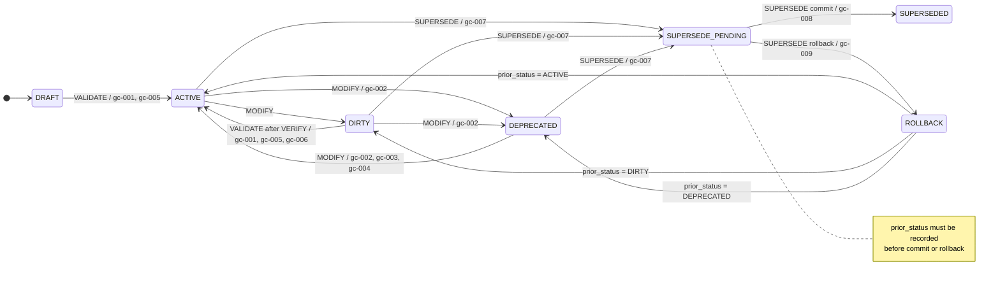

<span class="ddr-label ddr-surface-explanatory"><strong>Interpretation</strong></span> DDR v6.3 treats lifecycle changes as a closed machine in which `SUPERSEDE` is transactional and rollback is resolved only through the recorded `prior_status` branch.

<span class="ddr-label ddr-surface-normative"><strong>Authority basis</strong></span> `lifecycle.status_transitions`, `lifecycle.guard_definitions`, and Sections `5.1-5.2`.

<span class="ddr-label ddr-surface-schema"><strong>Schema note</strong></span> The rollback row is modeled in the schema as `to_node_field: prior_status`, not as three separate transition rows. The diagram expands the restored target states for readability.

### 5.2 Status transitions

| From                | To                  | Operation   | Phase / side-effect        | Prerequisites | Guards                       | Notes                                          |
| ------------------- | ------------------- | ----------- | -------------------------- | ------------- | ---------------------------- | ---------------------------------------------- |
| `DRAFT`             | `ACTIVE`            | `VALIDATE`  | none                       | none          | `gc-001`, `gc-005`           | Initial activation path                        |
| `ACTIVE`            | `DIRTY`             | `MODIFY`    | none                       | none          | none                         | Direct modification of an active node          |
| `ACTIVE`            | `DIRTY`             | `MODIFY`    | `side_effect: propagation` | none          | none                         | Downstream propagation after ancestor mutation |
| `ACTIVE`            | `DEPRECATED`        | `MODIFY`    | none                       | none          | `gc-002`                     | Deprecation path                               |
| `ACTIVE`            | `SUPERSEDE_PENDING` | `SUPERSEDE` | none                       | none          | `gc-007`                     | Enter supersede transaction                    |
| `DIRTY`             | `ACTIVE`            | `VALIDATE`  | none                       | `VERIFY`      | `gc-001`, `gc-005`, `gc-006` | Re-activation after cleanup                    |
| `DIRTY`             | `DEPRECATED`        | `MODIFY`    | none                       | none          | `gc-002`                     | Dirty node can still be deprecated             |
| `DIRTY`             | `SUPERSEDE_PENDING` | `SUPERSEDE` | none                       | none          | `gc-007`                     | Dirty node can be superseded                   |
| `DEPRECATED`        | `SUPERSEDE_PENDING` | `SUPERSEDE` | none                       | none          | `gc-007`                     | Deprecated node can be replaced                |
| `SUPERSEDE_PENDING` | `SUPERSEDED`        | `SUPERSEDE` | `phase: commit`            | none          | `gc-008`                     | Successful replacement and rewiring            |
| `SUPERSEDE_PENDING` | `prior_status`      | `SUPERSEDE` | `phase: rollback`          | none          | `gc-009`                     | Rollback uses stored prior status              |
| `DEPRECATED`        | `ACTIVE`            | `MODIFY`    | none                       | none          | `gc-002`, `gc-003`, `gc-004` | Re-activate deprecated node                    |

### 5.3 Guard definitions

| Guard    | verification_mode                                                               | Description                                                                                                                                                            |
| -------- | ------------------------------------------------------------------------------- | ---------------------------------------------------------------------------------------------------------------------------------------------------------------------- |
| `gc-001` | <span class="ddr-badge ddr-check-structural"><strong>structural</strong></span> | All structural rules for the node pass validation.                                                                                                                     |
| `gc-002` | <span class="ddr-badge ddr-check-manual"><strong>manual</strong></span>         | Deprecation rationale is explicitly documented.                                                                                                                        |
| `gc-003` | <span class="ddr-badge ddr-check-manual"><strong>manual</strong></span>         | Any previously set deprecation sunset date is cleared.                                                                                                                 |
| `gc-004` | <span class="ddr-badge ddr-check-manual"><strong>manual</strong></span>         | Status reversal is logged in the reconciliation manifest.                                                                                                              |
| `gc-005` | <span class="ddr-badge ddr-check-structural"><strong>structural</strong></span> | All review items are resolved.                                                                                                                                         |
| `gc-006` | <span class="ddr-badge ddr-check-structural"><strong>structural</strong></span> | Per-node validation scope is explicitly confirmed.                                                                                                                     |
| `gc-007` | <span class="ddr-badge ddr-check-structural"><strong>structural</strong></span> | Before entering `SUPERSEDE_PENDING`, the node's current status must be recorded in `prior_status`, and that value must be one of `ACTIVE`, `DEPRECATED`, or `DIRTY`.   |
| `gc-008` | <span class="ddr-badge ddr-check-structural"><strong>structural</strong></span> | Replacement node is successfully inserted and validated, children are rewired to the replacement ID, affected children are set `DIRTY`, and `prior_status` is cleared. |
| `gc-009` | <span class="ddr-badge ddr-check-structural"><strong>structural</strong></span> | Replacement insert failed or child rewiring failed; source node reverts to `prior_status`, replacement is removed if necessary, and `SUPERSEDE_FAILED` is logged.      |

Guards are declared only as <span class="ddr-badge ddr-check-structural"><strong>structural</strong></span> or <span class="ddr-badge ddr-check-manual"><strong>manual</strong></span> checks. Separate node-level `VALIDATE` logic may also emit <span class="ddr-badge ddr-check-semantic"><strong>semantic</strong></span> `REVIEW_REQUIRED` items for tier-local rule review before activation.

**Figure 5.2. Verification-mode handling across guards and rule review**

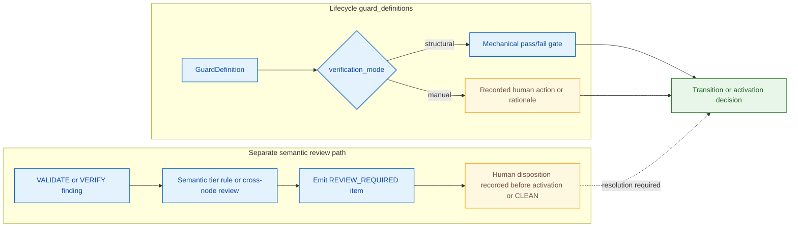

<span class="ddr-label ddr-surface-explanatory"><strong>Interpretation</strong></span> DDR separates lifecycle guard verification modes from semantic review obligations so that `guard_definitions` remain closed to `structural` and `manual` while semantic review still stays explicit.

<span class="ddr-label ddr-surface-normative"><strong>Authority basis</strong></span> `lifecycle.guard_definitions`, the `VALIDATE` operation contract, and the `verification_mode` glossary definition.

### 5.4 Canonical operations

| Operation          | Mutates DAG | Source-defined behavior                                                                                                                                                  | High-signal validation and output details                                                                                                                                                    |
| ------------------ | ----------- | ------------------------------------------------------------------------------------------------------------------------------------------------------------------------ | -------------------------------------------------------------------------------------------------------------------------------------------------------------------------------------------- |
| `INSERT`           | Yes         | Create a node with auto-assigned ID, `parent_ids`, and tier-compliant content. Supports both forward and reverse direction.                                              | Full atomic ruleset validation, parent existence, and DAG cycle detection.                                                                                                                   |
| `DELETE`           | Yes         | Remove a node and cascade orphan detection to children.                                                                                                                  | Former children become `DIRTY`; zero-parent cases must resolve through re-attachment, cascade delete, or replacement; manifest is updated.                                                   |
| `MODIFY`           | Yes         | Update node content and increment version.                                                                                                                               | Re-validates the ruleset, re-checks citations, and propagates `DIRTY` to all descendants.                                                                                                    |
| `SUPERSEDE`        | Yes         | Replace a node transactionally while preserving the old ID for audit lineage.                                                                                            | Enters `SUPERSEDE_PENDING`, attempts replacement `INSERT`, re-wires child `parent_ids` on commit, sets immediate children `DIRTY`, or rolls back atomically with `SUPERSEDE_FAILED` logging. |
| `VERIFY`           | No          | Traverse the DAG downward and validate citation chains, edge types, ID references, orphan conditions, contamination, and optional cross-node semantic consistency rules. | Returns `CLEAN` or `DIRTY` with itemized structural findings; may also emit non-blocking `REVIEW_REQUIRED` items for semantic consistency review.                                            |
| `VALIDATE`         | No          | Check one node against its tier's full atomic ruleset.                                                                                                                   | Structural rules return pass/fail with violated rule IDs. Semantic rules emit `REVIEW_REQUIRED` items plus a `validation_scope` declaration that records what was evaluated.                 |
| `UNBUNDLE_SCAN`    | No          | Read-only pre-flight scan of an Express Mode group.                                                                                                                      | Produces one diagnostic object per fragment: `fragment_id`, `content_preview`, `detected_annotation`, `confidence`, and `ambiguity_reason` when confidence is not `high`.                    |
| `UNBUNDLE_EXECUTE` | Yes         | Atomic commit-phase expansion of an Express Mode group into constituent full-mode tiers.                                                                                 | Succeeds only when every fragment is confidently assignable or explicitly deferred. Rejection payload is the complete `UNBUNDLE_SCAN` result.                                                |

**Figure 5.3. Canonical operation families**

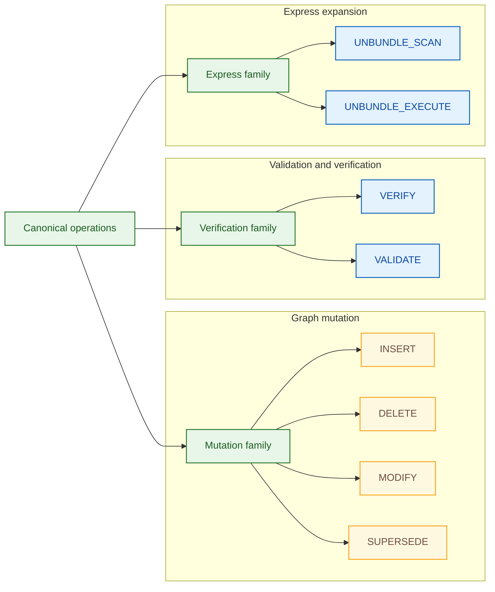

<span class="ddr-label ddr-surface-explanatory"><strong>Interpretation</strong></span> The operation namespace is intentionally closed: mutation, validation, and Express expansion each have named entry points rather than informal aliases or mixed phase tokens.

<span class="ddr-label ddr-surface-normative"><strong>Authority basis</strong></span> `operations.core_operations` and the normalization changes summarized in Section `2.3`.

Operational nuances that are easy to miss if you only read the names:

- `INSERT` can run as validated insertion that yields an `ACTIVE` node synchronously, or as draft insertion via `validate=false` override that yields a `DRAFT` node.
- `VALIDATE` is node-local and tier-local; `VERIFY` is graph-traversal-oriented and may consider optional cross-node semantic consistency rules.
- `UNBUNDLE_SCAN` is independently invokable and is not just an internal pre-step of `UNBUNDLE_EXECUTE`.
- `UNBUNDLE_EXECUTE` does not invent placement for unclear fragments. It either gets deterministic allocation or rejects atomically unless the fragment is explicitly deferred.

Example `UNBUNDLE_SCAN` diagnostic payload:

```yaml
fragment_id: G2-F03
content_preview: "[CL] Runtime must be Python 3.10+ and run in Linux containers."
detected_annotation: CL
confidence: high
ambiguity_reason: null
```

### 5.5 DIRTY triggers and classification

| Trigger                                                             | Nodes affected                                             |
| ------------------------------------------------------------------- | ---------------------------------------------------------- |
| Node modified                                                       | Modified node plus all descendants                         |
| Node deleted                                                        | All former children of the deleted node                    |
| Parent becomes `SUPERSEDED` and child `parent_ids` are auto-updated | Immediate children only; grandchildren do not auto-cascade |
| `CL` constraint added or modified                                   | `SAL` plus all `SAL` descendants                           |
| `XPD` ethical boundary modified                                     | All tiers                                                  |

| DIRTY classification                                                            | Meaning                                                                                                         |
| ------------------------------------------------------------------------------- | --------------------------------------------------------------------------------------------------------------- |
| <span class="ddr-badge ddr-check-structural"><strong>structural</strong></span> | Structural change such as parent rewiring without immediate proof of semantic invalidation                      |
| <span class="ddr-badge ddr-check-semantic"><strong>semantic</strong></span>     | Probable semantic invalidation requiring downstream review or content change before CLEAN can be re-established |

The specification also states the following `SUPERSEDE` DIRTY behavior:

- Child nodes affected by parent rewiring enter `DIRTY` with classification `structural`.
- Structural `DIRTY` does not automatically propagate to descendants.
- If later validation or modification reveals content drift, the affected node's `DIRTY` condition is reclassified as `semantic`, and normal downstream propagation resumes.

**Figure 5.4. `DIRTY` propagation and reclassification workflow**

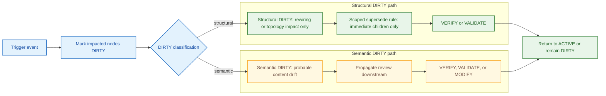

<span class="ddr-label ddr-surface-explanatory"><strong>Interpretation</strong></span> DDR distinguishes structural rewiring fallout from semantic drift so that not every topology change triggers blind full-depth propagation.

<span class="ddr-label ddr-surface-normative"><strong>Authority basis</strong></span> `operations.dirty_flag_triggers`, `dirty_classification`, `supersede_dirty_behavior`, and Section `5.5`.

Authoritative DIRTY notes that materially affect implementation behavior:

- A `DRAFT` node created through draft insertion is structurally present in the DAG but excluded from CLEAN compliance checks until successfully validated.
- While a node is in `SUPERSEDE_PENDING`, `VERIFY` treats that condition as a blocking manifest item rather than as ordinary `DIRTY` propagation.
- `SUPERSEDE` commit marks immediate children `DIRTY` with classification `structural`; grandchildren do not auto-cascade from the rewiring alone.
- `SUPERSEDE` rollback restores the source node to `prior_status` and produces no DIRTY side-effects.
- If a rewired child is later modified during re-validation, ordinary `MODIFY` cascade rules apply from that child downward.
- `DEPRECATED` nodes remain structurally traversable and are still part of `VERIFY` scope; they are not removed from the graph merely by deprecation.

### 5.6 Conflict resolution and resolution workflow

Conflict resolution protocol:

1. Identify conflicting nodes and violated rules.
2. Classify the conflict as logical, physical, or semantic.
3. Escalate to the designated authoring authority.
4. Record the resolution decision and rationale.
5. Apply `MODIFY`, `SUPERSEDE`, or `DELETE` as required.

Audit requirement:

- All conflict resolutions must be recorded in the reconciliation manifest with before-and-after state references and disposition authority.

Resolution workflow:

`DETECT CHANGE -> SET DIRTY -> SCAN DOWNSTREAM -> GENERATE PENDING ITEMS -> EXECUTE OPERATION -> VERIFY -> SET CLEAN OR REPEAT`

**Figure 5.5. `SUPERSEDE` transaction with commit and rollback**

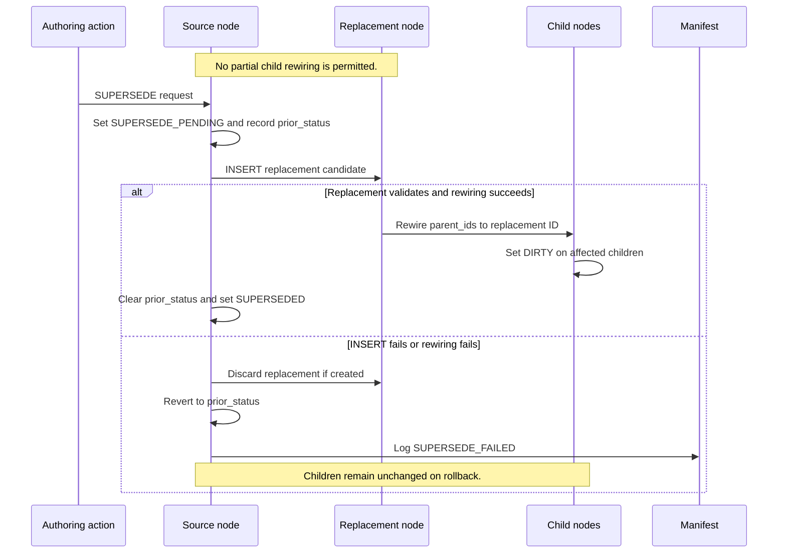

<span class="ddr-label ddr-surface-explanatory"><strong>Interpretation</strong></span> `SUPERSEDE` is not a rename; it is a transactional replace-and-rewire operation with an explicit rollback path that forbids partial child rewiring.

<span class="ddr-label ddr-surface-normative"><strong>Authority basis</strong></span> `operations.core_operations.SUPERSEDE`, `lifecycle.status_transitions`, `gc-007`, `gc-008`, and `gc-009`.

See also: Section 6, Section 7, Section 9.

<div style="page-break-before: always;"></div>

## 6. Consumption Modes and Express Mode


This section covers the two declared consumption modes, the fixed four-group Express Mode structure, and the deterministic `UNBUNDLE_SCAN` / `UNBUNDLE_EXECUTE` contract. Use Section 5 for the underlying operation model and Section 9 for the express-profile schema rules.

### 6.1 Consumption modes

| Mode                                                                                  | Description                                                                                                     | Best fit                                  |
| ------------------------------------------------------------------------------------- | --------------------------------------------------------------------------------------------------------------- | ----------------------------------------- |
| <span class="ddr-badge ddr-mode-express"><strong>Express (4 Groups)</strong></span>   | Adjacent tiers are bundled into fixed groups and later expanded through `UNBUNDLE_SCAN` and `UNBUNDLE_EXECUTE`. | Small-to-medium projects                  |
| <span class="ddr-badge ddr-mode-full"><strong>Full (All Active Tiers)</strong></span> | Every active tier is specified independently.                                                                   | Complex, regulated, or enterprise systems |

**Figure 6.1. Full vs Express authority split**

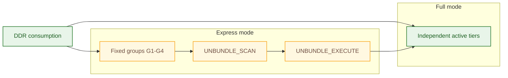

<span class="ddr-label ddr-surface-explanatory"><strong>Interpretation</strong></span> Express Mode is an alternate presentation and authoring path, not a reduced DDR model; successful unbundling lands back on the same full-tier surface.

<span class="ddr-label ddr-surface-normative"><strong>Authority basis</strong></span> `consumption_modes`, `express_mode.description`, and Section `6.1`.

### 6.2 Express Mode groups

| Group | Tiers            | Label                          |
| ----- | ---------------- | ------------------------------ |
| `G1`  | `XPD, SIL, GPCL` | Purpose, Strategy & Governance |
| `G2`  | `FCL, CL`        | Capabilities & Constraints     |
| `G3`  | `SAL, ICL`       | Architecture & Contracts       |
| `G4`  | `CDL, ISL`       | Design & Scaffolding           |

**Figure 6.2. Fixed `G1-G4` composition**

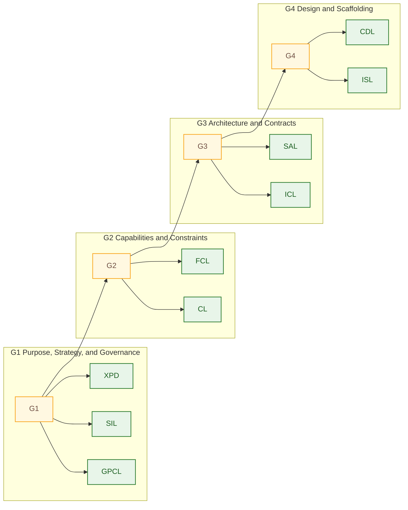

<span class="ddr-label ddr-surface-explanatory"><strong>Interpretation</strong></span> Express grouping is fixed and closed; authors do not invent alternate bundles or reorder tiers inside the group system.

<span class="ddr-label ddr-surface-normative"><strong>Authority basis</strong></span> `express_mode.groups` and Section `6.2`.

### 6.3 Express Mode contract

The authoritative `express_mode` block defines the following:

- Express Mode is not a reduced system; it is grouped presentation of the full model.
- `UNBUNDLE_SCAN` is a read-only pre-flight classifier.
- `UNBUNDLE_EXECUTE` is the commit-phase operation and the only canonical commit token in v6.3.
- On successful unbundling, `parent_ids` auto-wire to the immediately superior unbundled tier, satisfying `CIT-R2` without manual intervention.

**Figure 6.3. `UNBUNDLE_SCAN` / `UNBUNDLE_EXECUTE` sequence**

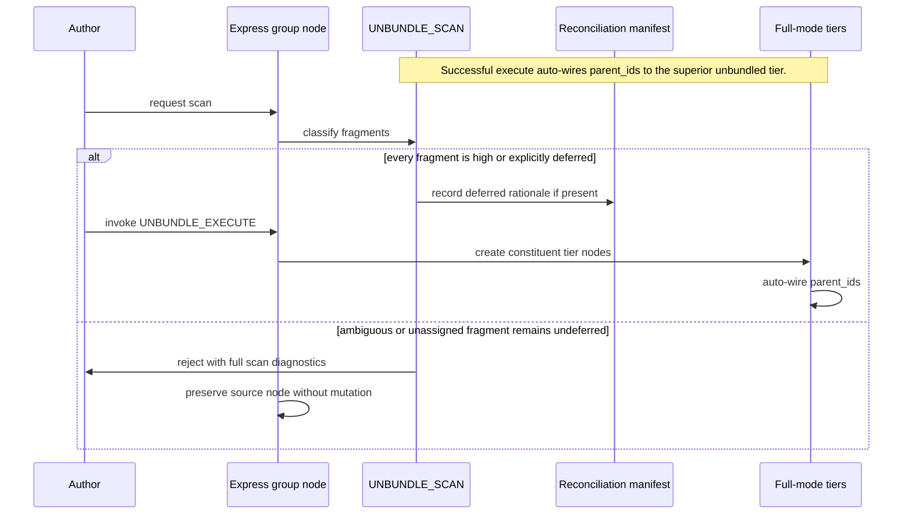

<span class="ddr-label ddr-surface-explanatory"><strong>Interpretation</strong></span> Unbundling is deliberately split into a read-only diagnostic phase and an atomic commit phase so that ambiguous fragments cannot silently mutate the graph.

<span class="ddr-label ddr-surface-normative"><strong>Authority basis</strong></span> `express_mode.description`, `unbundle_determinism_rule`, and the `UNBUNDLE_SCAN` / `UNBUNDLE_EXECUTE` operation definitions.

### 6.4 Deterministic unbundling and deferred fragments

The authoritative determinism rule requires:

- Explicit tier annotations inside grouped content when a group contains conditionally activatable tiers, specifically `G1` and `G2`
- Per-fragment classification into `high`, `ambiguous`, or `none`
- Rejection of `UNBUNDLE_EXECUTE` when any fragment remains ambiguous or unassigned without explicit deferment

Deferred-fragment handling requires:

- Explicit `[DEFER]` annotation
- Recorded human rationale in the reconciliation manifest
- Retention of deferred fragments in the source Express Mode group node
- Atomic rejection when ambiguous fragments are neither confidently classified nor explicitly deferred

Worked `G2` example:

| Fragment                                                               | Expected scan result                  | Reasoning                                                                         |
| ---------------------------------------------------------------------- | ------------------------------------- | --------------------------------------------------------------------------------- |
| `[FCL] User uploads an invoice PDF and sees validation errors inline.` | `high -> FCL`                         | User-observable behavior with explicit tier annotation                            |
| `[CL] Runtime must be Python 3.10+ and run in Linux containers.`       | `high -> CL`                          | Declared technology and environment bounds with explicit tier annotation          |
| `Uploads should be fast.`                                              | `none`                                | No tier annotation and insufficient deterministic allocation surface              |
| `[DEFER] Retention wording pending legal review.`                      | deferred from current execute attempt | Explicit defer marker plus recorded rationale permits atomic progress on the rest |

Example rejection posture:

```yaml
fragment_id: G2-F04
content_preview: "Uploads should be fast."
detected_annotation: null
confidence: none
ambiguity_reason: "No explicit [FCL] or [CL] marker was supplied."
```

If that fragment is not explicitly deferred, `UNBUNDLE_EXECUTE` must reject with the complete scan result and leave the source group node structurally unchanged.

**Figure 6.4. Deferred-fragment and atomic-rejection workflow**

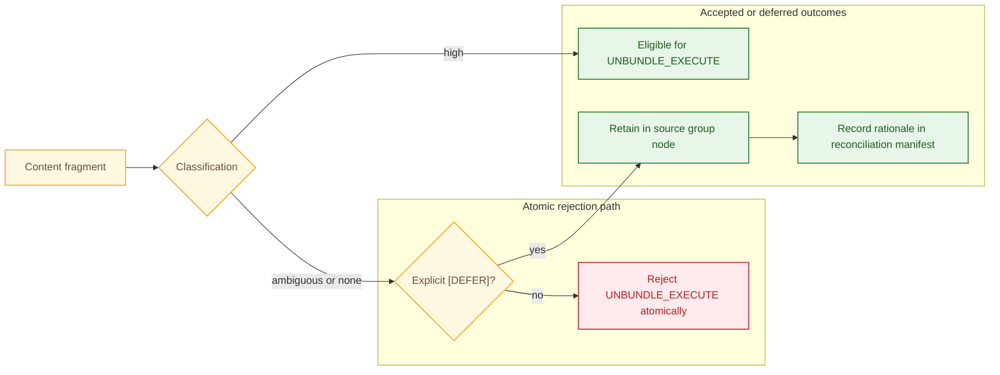

<span class="ddr-label ddr-surface-explanatory"><strong>Interpretation</strong></span> Deferred fragments remain traceable and local to the original Express node, while undeferred ambiguity blocks the entire commit so that partial unbundling never becomes authoritative.

<span class="ddr-label ddr-surface-normative"><strong>Authority basis</strong></span> `express_mode.unbundle_determinism_rule`, `express_mode.deferred_fragment_handling`, and Section `6.4`.

See also: Section 5, Section 9.

<div style="page-break-before: always;"></div>

## 7. Constraint Precedence, Reconciliation, and CLEAN State


This section covers how DDR v6.3 resolves conflicting constraints, tracks unresolved conditions, and determines whether a graph may be treated as CLEAN. Use Section 5 for the operation and DIRTY mechanics that feed reconciliation, Section 9 for the machine-validation surface, and Section 10 for glossary and historical appendix context.

### 7.1 Constraint precedence hierarchy

| Priority | Tier   | Rationale                                                                    |
| -------- | ------ | ---------------------------------------------------------------------------- |
| 1        | `XPD`  | Ethical boundary conditions are inviolable.                                  |
| 2        | `SIL`  | Strategic intent defines the purpose of all design decisions.                |
| 3        | `GPCL` | External regulatory mandates and quality thresholds are non-negotiable.      |
| 4        | `FCL`  | Functional requirements operate within the constraint envelope.              |
| 5        | `CL`   | Technology, hardware, and infrastructure constraints are externally imposed. |
| 6        | `SAL`  | Architecture is bounded by all above.                                        |
| 7        | `ICL`  | Contracts derive from architecture.                                          |
| 8        | `CDL`  | Design derives from contracts.                                               |
| 9        | `ISL`  | Scaffolding derives from design.                                             |

**Figure 7.1. Constraint precedence ladder with physical-escalation branch**

```mermaid
flowchart TD
    accTitle: Constraint precedence ladder with physical-escalation branch
    accDescr: Shows the ordered logical precedence ladder, the XPD veto branch, and the escalation path for imposed or physical CL conflicts.
    subgraph LADDER["Logical precedence ladder"]
        XPD["1 XPD"]
        SIL["2 SIL"]
        GPCL["3 GPCL"]
        FCL["4 FCL"]
        CL["5 CL"]
        SAL["6 SAL"]
        ICL["7 ICL"]
        CDL["8 CDL"]
        ISL["9 ISL"]
    end
    ESC["Escalate to authoring authority"]

    XPD --> SIL --> GPCL --> FCL --> CL --> SAL --> ICL --> CDL --> ISL
    XPD -. ethical veto .-> ESC
    CL -. imposed or physical conflict .-> ESC

    classDef normative fill:#e8f5e9,stroke:#2e7d32,color:#1b5e20,stroke-width:1.5px;
    classDef alert fill:#ffebee,stroke:#c62828,color:#b71c1c,stroke-width:1.5px;
    class XPD,SIL,GPCL,FCL,SAL,ICL,CDL,ISL normative;
    class CL,ESC alert;
```

<span class="ddr-label ddr-surface-explanatory"><strong>Interpretation</strong></span> The logical override ladder is linear, but it contains explicit non-override branches: `XPD` ethical boundaries and imposed or physically impossible `CL` constraints force escalation instead of silent precedence resolution.

<span class="ddr-label ddr-surface-normative"><strong>Authority basis</strong></span> `constraint_precedence.tiers`, `override_principle`, `physical_constraint_rule`, and `physical_constraint_escalation`.

Override principle:

- Higher-priority tiers override lower-priority tiers.
- An `XPD` ethical boundary acts as an absolute veto right over downstream decisions.

### 7.2 Constraint classes and escalation rules

| Constraint class                                                                 | Description                                                                                                                                   |
| -------------------------------------------------------------------------------- | --------------------------------------------------------------------------------------------------------------------------------------------- |
| <span class="ddr-badge ddr-constraint-logical"><strong>logical</strong></span>   | Governed by the formal tier precedence hierarchy                                                                                              |
| <span class="ddr-badge ddr-constraint-physical"><strong>physical</strong></span> | Represents non-negotiable physical realities or externally imposed constraints that cannot be silently overridden by logical precedence alone |

Additional precedence rules:

- Intra-tier conflicts must be documented and resolved before conflicting nodes can become `ACTIVE`.
- Any `CL` node with `constraint_origin = imposed` is treated as a non-overridable physical-or-external constraint during precedence evaluation.
- Physical incompatibilities must be escalated to the authoring authority; precedence does not authorize silently overriding physical or externally imposed constraints.

### 7.3 Reconciliation manifest

Tracked values:

| Track                                           | Meaning                                   |
| ----------------------------------------------- | ----------------------------------------- |
| Total node count by tier                        | Current topology inventory                |
| `ACTIVE`, `DIRTY`, `DRAFT`, `DEPRECATED` counts | Status distribution                       |
| Pending items list                              | Unresolved review, gap, and failure items |
| Last full validation timestamp                  | Most recent global validation point       |
| Active Extensions and annotation counts         | Extension overlay inventory               |

Manifest item types:

| Item type                    | Fields                                                                                | Meaning                                                                               |
| ---------------------------- | ------------------------------------------------------------------------------------- | ------------------------------------------------------------------------------------- |
| `MISSING_MEDIATOR`           | `gpcl_node_id`, `message`, `rationale`                                                | Logged when a `GPCL-R6` target has no corresponding `FCL` behavioral mediator         |
| `SUPERSEDE_FAILED`           | `source_node_id`, `attempted_replacement_content_hash`, `failure_reason`, `timestamp` | Logged when supersession fails during replacement insert or rewiring                  |
| `SUPERSEDE_PENDING_DETECTED` | `node_id`, `prior_status`, `detected_at`                                              | Logged by `VERIFY` when a node remains in `SUPERSEDE_PENDING`; severity is `BLOCKING` |

Semantic-gap classification:

| Property             | Value                                                                                                                 |
| -------------------- | --------------------------------------------------------------------------------------------------------------------- |
| Allowed type(s)      | `MISSING_MEDIATOR`                                                                                                    |
| Required constraints | Must be logged explicitly; must carry human rationale; must be resolved or explicitly waived before system-wide CLEAN |

**Figure 7.2. Reconciliation manifest tracks and blocking item surfaces**

```mermaid
erDiagram
    accTitle: Reconciliation manifest tracks and blocking item surfaces
    accDescr: Shows the reconciliation manifest, its tracked summary records, and the three typed pending-item families that affect CLEAN eligibility.
    direction LR

    RECONCILIATION_MANIFEST ||--|{ TIER_COUNT : tracks
    RECONCILIATION_MANIFEST ||--|{ STATUS_DISTRIBUTION : summarizes
    RECONCILIATION_MANIFEST ||--|| EXTENSION_SUMMARY : counts
    RECONCILIATION_MANIFEST ||--o{ MISSING_MEDIATOR : logs
    RECONCILIATION_MANIFEST ||--o{ SUPERSEDE_FAILED : logs
    RECONCILIATION_MANIFEST ||--o{ SUPERSEDE_PENDING_DETECTED : logs

    RECONCILIATION_MANIFEST {
        datetime last_full_validation_timestamp
    }
    TIER_COUNT {
        string tier
        int total_nodes
    }
    STATUS_DISTRIBUTION {
        string status
        int count
    }
    EXTENSION_SUMMARY {
        int active_extensions
        int annotation_count
    }
    MISSING_MEDIATOR {
        string gpcl_node_id
        string message
        string rationale
    }
    SUPERSEDE_FAILED {
        string source_node_id
        string attempted_replacement_content_hash
        string failure_reason
        datetime timestamp
    }
    SUPERSEDE_PENDING_DETECTED {
        string node_id
        string prior_status
        datetime detected_at
        string severity
    }
```

<span class="ddr-label ddr-surface-explanatory"><strong>Interpretation</strong></span> The reconciliation manifest is not a generic notes bucket; it has a closed track structure and a small set of typed pending-item records that directly affect CLEAN eligibility.

<span class="ddr-label ddr-surface-normative"><strong>Authority basis</strong></span> `operations.reconciliation_manifest_tracks`, `operations.reconciliation_manifest_schema`, and Section `7.3`.

Illustrative manifest snippets:

```yaml
pending_items:
  - item_type: MISSING_MEDIATOR
    gpcl_node_id: GPCL-2.7
    message: "Latency target has no independent FCL behavioral mediator."
    rationale: "User-visible interaction breakdown has not been authored yet."

  - item_type: SUPERSEDE_FAILED
    source_node_id: SAL-5.4
    attempted_replacement_content_hash: "sha256:0d8c..."
    failure_reason: "replacement_insert_validation_failed"
    timestamp: "2026-03-28T14:22:31Z"

  - item_type: SUPERSEDE_PENDING_DETECTED
    node_id: CL-4.2
    prior_status: ACTIVE
    detected_at: "2026-03-28T14:24:00Z"
```

Interpret these three item families differently:

- `MISSING_MEDIATOR` is the only allowed semantic-gap classification in v6.3.
- `SUPERSEDE_FAILED` records an operational failure that must be diagnosed or retried.
- `SUPERSEDE_PENDING_DETECTED` is a blocking cleanliness failure, not a waivable semantic gap.

### 7.4 Compliance checklist

Structural validation requirements:

- All non-root nodes have `>= 1` valid, non-superseded parent citation.
- All parent citations reference the correct parent tier.
- No cycles exist in any citation path.
- Every node tier belongs to `active_tiers`.
- Every `system_definition` artifact includes at least one representative node for each active tier.
- No tier-skipping is present.
- All inline citations have matching `parent_ids`.
- No node remains `DIRTY`.
- No node remains `SUPERSEDE_PENDING`.
- The reconciliation manifest has zero pending items.
- Any declared semantic gap uses an allowed classification and is resolved or explicitly waived with rationale before CLEAN.
- If any Extension is active, all critical or blocking advisories have recorded disposition notes.

Atomic-rule validation requirements:

- Each tier satisfies its declared inclusion and exclusion rules.
- `FCL-R7` requires logical data-entity and CRUD enumeration for data-modifying capabilities.
- `GPCL-FCL-BR1` requires either an `FCL` mediator or a `MISSING_MEDIATOR` manifest entry.
- `CL` nodes remain declarative and must declare `constraint_origin`.
- `CL-R9` applies to `derived` constraints; `CL-R9-imposed` applies to `imposed` constraints.
- `CIT-R7` requires re-validation after cited parent version changes.
- `SAL` cites all active parent tiers.
- `ICL-R2` requires machine-parseable schemas.
- `ISL` stubs must cite `CDL` parent IDs.
- `CDL-R7` requires language-specific blueprints when multiple targets are declared.
- All `REVIEW_REQUIRED` items must carry recorded human disposition before affected nodes move from `DRAFT` to `ACTIVE`.

Extension validation requirements:

- Active Extensions declare compatible `DDR-Core-6.x` contracts.
- Extension annotations appear in `extension_annotations` only.
- Extension advisories are reviewed; non-critical advisories have disposition notes.
- ARE candidates are either promoted via `INSERT` or discarded.
- E5 declares a valid `scoring_profile`.
- Custom ARE profiles satisfy required fields and bounded, ordered, non-overlapping score bands.
- Candidates promoted below threshold require `override_flag: true` plus non-empty `human_rationale`.

### 7.5 CLEAN-state logic

A DDR graph may be treated as CLEAN only when all of the following are true:

- No node is `DIRTY`.
- No node is `SUPERSEDE_PENDING`.
- Citation rules and topology invariants hold.
- Tier-specific atomic rules hold.
- Reconciliation manifest pending items are resolved or explicitly waived where allowed.
- Parent-version freshness is preserved.
- Extension advisories with critical or blocking severity have disposition.

**Figure 7.3. CLEAN-state validation gate**

```mermaid
flowchart TD
    accTitle: CLEAN-state validation gate
    accDescr: Shows the ordered checks that must all pass before a DDR graph may be declared CLEAN.
    START["Candidate CLEAN assertion"] --> STATUS{"Any DIRTY or SUPERSEDE_PENDING nodes?"}
    STATUS -->|yes| FAIL["Not CLEAN"]
    STATUS -->|no| TOPO{"Topology and citation rules hold?"}
    TOPO -->|no| FAIL
    TOPO -->|yes| ATOMIC{"Tier atomic rules and review dispositions complete?"}
    ATOMIC -->|no| FAIL
    ATOMIC -->|yes| MANIFEST{"Manifest pending items resolved or waived where allowed?"}
    MANIFEST -->|no| FAIL
    MANIFEST -->|yes| EXT{"Critical or blocking extension advisories disposed?"}
    EXT -->|no| FAIL
    EXT -->|yes| CLEAN["CLEAN"]

    classDef normative fill:#e8f5e9,stroke:#2e7d32,color:#1b5e20,stroke-width:1.5px;
    classDef alert fill:#ffebee,stroke:#c62828,color:#b71c1c,stroke-width:1.5px;
    class START,TOPO,ATOMIC,MANIFEST,EXT,CLEAN normative;
    class STATUS,FAIL alert;
```

<span class="ddr-label ddr-surface-explanatory"><strong>Interpretation</strong></span> CLEAN is a gate condition across status, structure, atomic-rule review, manifest state, and extension-advisory disposition; no single operation can declare it unilaterally.

<span class="ddr-label ddr-surface-normative"><strong>Authority basis</strong></span> `compliance_checklist`, `operations.semantic_consistency_rules`, and Section `7.5`.

See also: Section 5, Section 9, Section 10.

<div style="page-break-before: always;"></div>

## 8. Extension System and ARE


This section covers the optional extension overlay model, integration rules, ARE candidate-pool behavior, scoring profiles, and the v6.3 extension catalog. Use Section 9 for the schema-side extension and ARE contract and Section 10 for crosswalk and historical lookup surfaces.

### 8.1 Extension architecture

**Figure 8.1. Extension overlay architecture**

```mermaid
flowchart LR
    accTitle: Extension overlay architecture
    accDescr: Shows Core DDR surfaces, the extension overlay, manifest advisories, and the ARE candidate pool without using v11-only architecture-beta syntax.
    subgraph CORE["Core DDR surfaces"]
        CORENODE["Core DAG"]
        ANN["extension_annotations"]
    end
    subgraph EXT["Extension overlay"]
        EXTRT["Extension runtime"]
    end
    subgraph AUX["Auxiliary surfaces"]
        MANIFEST["Reconciliation manifest advisories"]
        POOL["ARE candidate pool"]
        INSERT["Human-reviewed INSERT into Core"]
    end

    EXTRT -->|reads| CORENODE
    EXTRT -->|writes namespaced annotations| ANN
    EXTRT -->|emits advisories| MANIFEST
    EXTRT -->|ARE only| POOL
    POOL -->|promotion via INSERT only| INSERT --> CORENODE

    classDef normative fill:#e8f5e9,stroke:#2e7d32,color:#1b5e20,stroke-width:1.5px;
    classDef schema fill:#e3f2fd,stroke:#1565c0,color:#0d47a1,stroke-width:1.5px;
    classDef extension fill:#f3e5f5,stroke:#6a1b9a,color:#4a148c,stroke-width:1.5px;
    class CORENODE,MANIFEST,INSERT normative;
    class ANN schema;
    class EXTRT,POOL extension;
```

<span class="ddr-label ddr-surface-explanatory"><strong>Interpretation</strong></span> Extensions remain outside the Core semantics boundary: they may read, annotate, advise, and stage candidates, but only Core operations can mutate the authoritative DAG.

<span class="ddr-label ddr-surface-normative"><strong>Authority basis</strong></span> `extension_system.architecture_description`, `permitted_actions`, `candidate_pool`, and Section `8.1`.

Permitted actions:

- Read Core node content.
- Annotate Core nodes with namespaced metadata stored only in `extension_annotations`.
- Generate derived external artifacts such as reports, IaC, or recommendations.
- Add advisories to the reconciliation manifest's extension-advisories surface.

Prohibited actions:

- Modify any Core node's `content`, `parent_ids`, `tier`, or `status`.
- Redefine Core tier semantics or atomic rules.
- Introduce structural cycles into the Core DAG.
- Set Core nodes to `DIRTY`; extensions may advise but not mutate status.

Normative note:

- "`All Core tiers`" is not a valid contract declaration. Extensions must enumerate tiers by name to satisfy `EXT-R2`.

### 8.2 Extension integration rules

| Rule     | Statement                                                                            |
| -------- | ------------------------------------------------------------------------------------ |
| `EXT-R1` | Must declare contract version compatible with `DDR-Core-6.x`.                        |
| `EXT-R2` | Must declare which Core tiers the extension reads and annotates.                     |
| `EXT-R3` | Annotations must be namespaced by Extension ID, such as `HRE::min_hardware_profile`. |
| `EXT-R4` | Extensions update the reconciliation manifest; annotation counts are tracked.        |
| `EXT-R5` | Disabling an Extension leaves Core CLEAN and DIRTY status unchanged.                 |
| `EXT-R6` | Extension-internal derived artifact graphs must maintain their own acyclicity.       |
| `EXT-R7` | Extension advisories do not mutate Core node status.                                 |

**Figure 8.2. Extension integration boundary map**

```mermaid
flowchart LR
    accTitle: Extension integration boundary map
    accDescr: Separates the narrow allowed extension behaviors from the prohibited mutation and semantic redefinition surfaces.
    EXT["Extension runtime"]
    subgraph ALLOWED["Allowed behaviors"]
        READ["Read Core node content"]
        ANN["Annotate via extension_annotations"]
        ADV["Advisories to reconciliation manifest"]
    end
    subgraph BLOCKED["Blocked behaviors"]
        MUT["No content, parent_ids, tier, or status mutation"]
        REDEF["No redefinition of Core semantics"]
        CYCLE["No structural cycles introduced"]
    end

    EXT --> READ
    EXT --> ANN
    EXT --> ADV
    EXT -. forbidden .-> MUT
    EXT -. forbidden .-> REDEF
    EXT -. forbidden .-> CYCLE

    classDef normative fill:#e8f5e9,stroke:#2e7d32,color:#1b5e20,stroke-width:1.5px;
    classDef extension fill:#f3e5f5,stroke:#6a1b9a,color:#4a148c,stroke-width:1.5px;
    classDef alert fill:#ffebee,stroke:#c62828,color:#b71c1c,stroke-width:1.5px;
    class EXT extension;
    class READ,ANN,ADV normative;
    class MUT,REDEF,CYCLE alert;
```

<span class="ddr-label ddr-surface-explanatory"><strong>Interpretation</strong></span> The extension contract is intentionally asymmetric: allowed behaviors are narrow and explicit, while prohibited behaviors ring-fence the Core from hidden mutation.

<span class="ddr-label ddr-surface-normative"><strong>Authority basis</strong></span> `extension_system.permitted_actions`, `prohibited_actions`, and `EXT-R1` through `EXT-R7`.

### 8.3 ARE candidate pool and activation states

The candidate pool is specific to E5, the AI Upward Reconstruction Engine (`ARE`). It is explicitly outside the Core DAG until promotion through `INSERT`.

| Property               | Value                                                                           |
| ---------------------- | ------------------------------------------------------------------------------- |
| Candidate status value | `CANDIDATE` (not a Core status)                                                 |
| Visibility rule        | Visible when ARE is `active` or `paused`; hidden when `disabled`                |
| Checkpoint path        | `.agent/state/are_candidate_pool.checkpoint.yaml`                               |
| Effect on Core status  | No effect on Core CLEAN or DIRTY status                                         |
| Promotion mechanism    | Promotion into Core requires `INSERT` with full validation and threshold checks |
| Discard trigger        | Any transition to `disabled` discards the pool and deletes the checkpoint file  |

Activation states:

| State      | Inference | Pool visibility | Pool preserved at runtime | Pool preserved across restart | Promotion allowed | Discard allowed | Special behavior                                                                  |
| ---------- | --------- | --------------- | ------------------------- | ----------------------------- | ----------------- | --------------- | --------------------------------------------------------------------------------- |
| `active`   | running   | yes             | yes                       | optional                      | yes               | yes             | Normal operating state                                                            |
| `paused`   | halted    | yes             | yes                       | yes                           | yes               | yes             | Pool must be atomically checkpointed on entry and after each mutating pool action |
| `disabled` | halted    | no              | no                        | no                            | no                | no              | Pool is discarded                                                                 |

Activation transitions:

| From       | To         | Permitted | Effect                                                                 |
| ---------- | ---------- | --------- | ---------------------------------------------------------------------- |
| `active`   | `paused`   | yes       | Inference halts; pool is atomically checkpointed and remains browsable |
| `paused`   | `active`   | yes       | Inference resumes; pool, scores, and annotations are retained          |
| `paused`   | `disabled` | yes       | Checkpoint file is deleted and pool is discarded                       |
| `active`   | `disabled` | yes       | Pool is discarded                                                      |
| `disabled` | `active`   | yes       | ARE starts fresh with an empty pool                                    |
| `disabled` | `paused`   | no        | Forbidden because no candidate pool exists in `disabled` state         |

Operational reading of the activation contract:

- `pool_preserved_runtime` and `pool_preserved_restart` are first-class ARE state semantics, not informal implementation hints.
- In `active`, restart preservation is explicitly `optional`; in `paused`, restart preservation is mandatory.
- Entering `paused` creates a durability obligation: the checkpoint must be written atomically on entry and re-written after every mutating pool action while paused.
- Transitioning to `disabled` deletes the checkpoint and discards the pool regardless of whether the prior state was `active` or `paused`.

Paused-state practitioner sequence:

1. ARE runs in `active` and accumulates candidates.
2. Transition `active -> paused` halts inference and writes `.agent/state/are_candidate_pool.checkpoint.yaml`.
3. Promotion by `INSERT` or manual discard remains allowed while paused.
4. Every paused-state pool mutation re-persists the checkpoint.
5. Process restart restores the checkpoint automatically and returns ARE to `paused`.
6. Any transition to `disabled` deletes the checkpoint and discards the pool.

### 8.4 ARE scoring profiles

Profile summary:

| Profile           | Threshold       | Notes                                                     |
| ----------------- | --------------: | --------------------------------------------------------- |
| `standard_v1`     | `0.35`          | Default E5 profile in the authoritative extension catalog |
| `conservative_v1` | `0.55`          | Intended for regulated or high-assurance environments     |
| `custom`          | template-driven | Must satisfy all required fields and conformance checks   |

Shared standard and conservative input signals:

| Signal ID                    | Meaning                                                                                   | Weight category |
| ---------------------------- | ----------------------------------------------------------------------------------------- | --------------- |
| `direct_source_node_count`   | Counts directly cited source nodes supporting the candidate inference                     | high            |
| `cross_tier_convergence`     | Measures whether evidence converges across adjacent DDR tiers for the same inferred claim | high            |
| `icl_contract_corroboration` | Checks whether `ICL` contract definitions corroborate candidate semantics                 | medium          |
| `sal_pattern_alignment`      | Evaluates alignment with declared `SAL` architectural patterns                            | medium          |
| `tier_diversity_index`       | Assesses how many distinct eligible source tiers contribute evidence                      | low             |

`standard_v1` score bands:

| Band              | Range       | Guidance                                                                                           |
| ----------------- | ----------- | -------------------------------------------------------------------------------------------------- |
| `speculative`     | `0.0 - 0.4` | Weak evidence; requires substantial human scrutiny before promotion consideration                  |
| `probable`        | `0.4 - 0.7` | Moderate evidence; promotion consideration is allowed only when human review confirms traceability |
| `high_confidence` | `0.7 - 1.0` | Strong evidence; prioritize for review and possible promotion via `INSERT`                         |

`conservative_v1` score bands:

| Band              | Range       | Guidance                                                                                                 |
| ----------------- | ----------- | -------------------------------------------------------------------------------------------------------- |
| `speculative`     | `0.0 - 0.4` | Do not promote under normal conditions; require explicit documented justification for exception handling |
| `probable`        | `0.4 - 0.7` | Permit review only with heightened scrutiny and complete evidence traceability                           |
| `high_confidence` | `0.7 - 1.0` | Preferred band for promotion decisions after formal reviewer confirmation                                |

Override policy for both standard and conservative profiles:

- A candidate below `minimum_surfacing_threshold` may enter review only when it carries `override_flag: true` and a non-empty `human_rationale`.

Custom-profile contract:

| Requirement     | Value                                                                                                                                                                                                |
| --------------- | ---------------------------------------------------------------------------------------------------------------------------------------------------------------------------------------------------- |
| Required fields | `profile_id`, `input_signals`, signal subfields, `score_bands`, band subfields, `minimum_surfacing_threshold`, `override_policy`                                                                     |
| Template rule   | Custom profiles may change field values and add signals or bands, but the object structure must remain conformant                                                                                    |
| Validation note | Custom profiles fail extension contract validation when required fields are missing; deterministic ARE conformance validation also checks reference resolution, score-band ordering, and non-overlap |

Important reading of `are_scoring_profiles`:

- `standard_v1` and `conservative_v1` are concrete reusable profiles.
- `custom` is not a ready-made runtime profile. It is the required-fields contract plus the template shape that any implementation-defined custom profile must satisfy.
- Threshold gating controls whether low-confidence candidates are surfaced for review, not whether the model is allowed to infer candidates internally.

Example promotion-readiness comparison:

| Candidate score | `standard_v1` (`0.35`) | `conservative_v1` (`0.55`) | Review posture                                                             |
| --------------- | ---------------------- | -------------------------- | -------------------------------------------------------------------------- |
| `0.62`          | Above threshold        | Above threshold            | Reviewable without override under both concrete profiles                   |
| `0.40`          | Above threshold        | Below threshold            | Reviewable under `standard_v1`; requires override under `conservative_v1`  |
| `0.30`          | Below threshold        | Below threshold            | Requires `override_flag: true` plus non-empty `human_rationale` under both |

Minimal E5 contract example:

```yaml
id: E5
name: AI Upward Reconstruction Engine (ARE)
contract: ARE-1.0 / DDR-Core-6.x
scoring_profile: standard_v1
reads: [ISL, CDL, ICL, SAL]
annotates: [SAL, ICL, CDL, ISL]
```

**Figure 8.3. ARE candidate-pool and scoring lifecycle**

```mermaid
flowchart TB
    accTitle: ARE candidate-pool and scoring lifecycle
    accDescr: Separates the ARE activation state machine from the candidate scoring and promotion pipeline, including checkpointing and the forbidden disabled-to-paused transition.
    subgraph ACT["ARE activation lifecycle"]
        ACTIVE["active"]
        PAUSED["paused"]
        DISABLED["disabled"]
        CHECKPOINT["Write or reload checkpoint"]
        DROP["Delete checkpoint and discard pool"]
        FORBID["disabled -> paused is forbidden"]

        ACTIVE --> PAUSED
        PAUSED --> ACTIVE
        ACTIVE --> DISABLED
        PAUSED --> DISABLED
        PAUSED --> CHECKPOINT
        DISABLED --> DROP
        DISABLED -. no candidate pool exists .-> FORBID
    end
    subgraph PIPE["Candidate scoring and promotion pipeline"]
        INFER["Infer candidate"]
        POOL["Candidate Pool"]
        SCORE["Score under declared profile"]
        THRESH{"Meets threshold or valid override?"}
        REVIEW["Human review"]
        INSERT["Promote via INSERT into Core"]
        HOLD["Remain candidate or discard"]

        INFER --> POOL --> SCORE --> THRESH
        THRESH -->|yes| REVIEW --> INSERT
        THRESH -->|no| HOLD
    end

    ACTIVE --> INFER
    CHECKPOINT -. preserves pool for restart .-> POOL

    classDef normative fill:#e8f5e9,stroke:#2e7d32,color:#1b5e20,stroke-width:1.5px;
    classDef caution fill:#fff8e1,stroke:#f9a825,color:#6d4c41,stroke-width:1.5px;
    classDef alert fill:#ffebee,stroke:#c62828,color:#b71c1c,stroke-width:1.5px;
    classDef extension fill:#f3e5f5,stroke:#6a1b9a,color:#4a148c,stroke-width:1.5px;
    class ACTIVE,PAUSED,CHECKPOINT,INFER,POOL,SCORE extension;
    class THRESH,HOLD caution;
    class REVIEW,INSERT normative;
    class DISABLED,DROP,FORBID alert;
```

<span class="ddr-label ddr-surface-explanatory"><strong>Interpretation</strong></span> ARE inference, scoring, checkpointing, and promotion are coupled but not identical: candidate generation is extension-local, while promotion remains a human-reviewed Core `INSERT`.

<span class="ddr-label ddr-surface-normative"><strong>Authority basis</strong></span> `extension_system.candidate_pool`, `are_scoring_profiles`, the E5 catalog entry, and Sections `8.3-8.4`.

### 8.5 Extension catalog

#### `E1` - Hardware & Resource Intelligence Extension (`HRE`)

| Property  | Value                    |
| --------- | ------------------------ |
| Contract  | `HRE-1.0 / DDR-Core-6.x` |
| Reads     | `CL, SAL, CDL, ISL`      |
| Annotates | `CL, SAL`                |

| Rule     | Statement                                                                               |
| -------- | --------------------------------------------------------------------------------------- |
| `HRE-R1` | Bottom-up inference produces minimum hardware profiles as `CL`-compatible declarations. |
| `HRE-R2` | Cloud recommendations include at least two provider-agnostic instance class options.    |
| `HRE-R3` | Top-down enforcement validates that `SAL` patterns do not exceed `CL` ceilings.         |
| `HRE-R4` | All recommendations are advisory and do not override `CL` without explicit `MODIFY`.    |

#### `E2` - Dependency Graph Analyzer (`DGA`)

| Property  | Value                    |
| --------- | ------------------------ |
| Contract  | `DGA-1.0 / DDR-Core-6.x` |
| Reads     | `CL, ICL, CDL, ISL`      |
| Annotates | `CL, ICL`                |

| Rule     | Statement                                                                           |
| -------- | ----------------------------------------------------------------------------------- |
| `DGA-R1` | Produces a complete directed dependency graph for all `CL`-declared libraries.      |
| `DGA-R2` | Detects version conflicts and suggests resolutions.                                 |
| `DGA-R3` | Transitive dependency reports flag copyleft licenses that could impose constraints. |

#### `E3` - Lifecycle & Versioning Engine (`LVE`)

| Property  | Value                                         |
| --------- | --------------------------------------------- |
| Contract  | `LVE-1.0 / DDR-Core-6.x`                      |
| Reads     | `XPD, SIL, GPCL, FCL, CL, SAL, ICL, CDL, ISL` |
| Annotates | `XPD, SIL, GPCL, FCL, CL, SAL, ICL, CDL, ISL` |

| Rule     | Statement                                                                                       |
| -------- | ----------------------------------------------------------------------------------------------- |
| `LVE-R1` | Every node modification produces a version-history entry with timestamp, author, and rationale. |
| `LVE-R2` | Technical debt items are classified by tier origin and estimated remediation effort.            |
| `LVE-R3` | Deprecation requires a sunset date and migration path before node status becomes `DEPRECATED`.  |
| `LVE-R4` | Version-control integration maps DDR node IDs to VCS commit hashes.                             |

#### `E4` - Observability & Runtime Engine (`ORE`)

| Property  | Value                      |
| --------- | -------------------------- |
| Contract  | `ORE-1.0 / DDR-Core-6.x`   |
| Reads     | `GPCL, SAL, ICL, CDL, ISL` |
| Annotates | `ISL, SAL`                 |

| Rule     | Statement                                                                                |
| -------- | ---------------------------------------------------------------------------------------- |
| `ORE-R1` | Telemetry stubs are derived from `GPCL` latency and throughput targets.                  |
| `ORE-R2` | Alert rules are expressed in vendor-agnostic format.                                     |
| `ORE-R3` | Every `SAL` component must have at least one telemetry point for operational readiness.  |
| `ORE-R4` | Incident-to-design traceability maps runtime anomalies to `ISL`, `CDL`, and `SAL` nodes. |

#### `E5` - AI Upward Reconstruction Engine (`ARE`)

| Property        | Value                                                                                                                                                                       |
| --------------- | --------------------------------------------------------------------------------------------------------------------------------------------------------------------------- |
| Contract        | `ARE-1.0 / DDR-Core-6.x`                                                                                                                                                    |
| Scoring profile | `standard_v1`                                                                                                                                                               |
| Reads           | `ISL, CDL, ICL, SAL`                                                                                                                                                        |
| Annotates       | `SAL, ICL, CDL, ISL`                                                                                                                                                        |
| Notes           | ARE annotation is restricted to `SAL`, `ICL`, `CDL`, and `ISL`. Higher-level intent, governance, ethical, or functional insights are surfaced only as candidate-pool items. |

| Rule     | Statement                                                                                                                                                                                                                                                                                              |
| -------- | ------------------------------------------------------------------------------------------------------------------------------------------------------------------------------------------------------------------------------------------------------------------------------------------------------ |
| `ARE-R1` | All inferred nodes are placed in the extension candidate pool; automatic promotion is prohibited.                                                                                                                                                                                                      |
| `ARE-R2` | Every candidate carries `ARE::confidence_score` computed under the declared `scoring_profile`; deterministic conformance validation resolves the profile and enforces reproducible scoring.                                                                                                            |
| `ARE-R3` | Promotion into the Core DAG requires `INSERT` with full atomic validation.                                                                                                                                                                                                                             |
| `ARE-R4` | ARE must never autonomously create `XPD` or `GPCL` nodes.                                                                                                                                                                                                                                              |
| `ARE-R5` | Every ARE deployment must declare a `scoring_profile` that references a profile defined in `are_scoring_profiles`.                                                                                                                                                                                     |
| `ARE-R6` | ARE must implement the tri-state activation lifecycle `active`, `paused`, and `disabled`, with `disabled -> paused` forbidden.                                                                                                                                                                         |
| `ARE-R7` | On every `active -> paused` transition, ARE must atomically persist the full candidate pool to `.agent/state/are_candidate_pool.checkpoint.yaml`, re-persist after each mutating pool action while paused, restore paused state on restart, and delete the checkpoint on any transition to `disabled`. |

#### `E6` - Security & Compliance Engine (`SCE`)

| Property  | Value                    |
| --------- | ------------------------ |
| Contract  | `SCE-1.0 / DDR-Core-6.x` |
| Reads     | `GPCL, CL, SAL, ICL`     |
| Annotates | `GPCL, SAL, ICL`         |

| Rule     | Statement                                                                       |
| -------- | ------------------------------------------------------------------------------- |
| `SCE-R1` | Threat models are expressed in STRIDE format or equivalent structured notation. |
| `SCE-R2` | Trust-boundary violations in `SAL` are flagged as high-priority advisories.     |
| `SCE-R3` | Every `ICL` contract must have an explicit RBAC access-control policy.          |
| `SCE-R4` | PII data flows in `ICL` must be traceable to `GPCL` data-residency constraints. |
| `SCE-R5` | Compliance evidence records are immutable once generated.                       |

#### `E7` - Data Domain Extension (`DDE`)

| Property  | Value                                                                                                                   |
| --------- | ----------------------------------------------------------------------------------------------------------------------- |
| Contract  | `DDE-1.0 / DDR-Core-6.x`                                                                                                |
| Reads     | `FCL, GPCL, SAL, ICL, CDL`                                                                                              |
| Annotates | `ICL, SAL, FCL`                                                                                                         |
| Notes     | When annotating `FCL`, DDE performs confirmation-only validation. It does not infer missing data entities for the Core. |

| Rule     | Statement                                                                                                                                                                                             |
| -------- | ----------------------------------------------------------------------------------------------------------------------------------------------------------------------------------------------------- |
| `DDE-R1` | Canonical ER models are expressed in formal notation such as ERD or DBML.                                                                                                                             |
| `DDE-R2` | Every `ICL` payload schema is validated against the canonical ER model.                                                                                                                               |
| `DDE-R3` | Schema-consistency violations are flagged as blocking advisories.                                                                                                                                     |
| `DDE-R4` | Data lifecycle policies specify retention periods traceable to `GPCL` regulatory requirements.                                                                                                        |
| `DDE-R5` | When annotating `FCL`, DDE verifies only that each entity named under `FCL-R7` has a corresponding `ICL` schema. Missing `FCL-R7` enumeration is a Core validation failure, not a DDE discovery task. |

#### `E8` - Deployment & CI/CD Planner (`DCP`)

| Property  | Value                    |
| --------- | ------------------------ |
| Contract  | `DCP-1.0 / DDR-Core-6.x` |
| Reads     | `CL, SAL, ISL`           |
| Annotates | `ISL, SAL`               |

| Rule     | Statement                                                                         |
| -------- | --------------------------------------------------------------------------------- |
| `DCP-R1` | Deployment manifests map every `SAL` subsystem to a deployment unit.              |
| `DCP-R2` | CI/CD pipeline definitions include at least lint, test, build, and deploy stages. |
| `DCP-R3` | All generated IaC cites the `CL` nodes from which configuration was derived.      |
| `DCP-R4` | Environment-specific configuration is separated from application code.            |

#### `E9` - Ethics & Human-Centered Design Extension (`EHD`)

| Property  | Value                     |
| --------- | ------------------------- |
| Contract  | `EHD-1.0 / DDR-Core-6.x`  |
| Reads     | `XPD, SIL, FCL, SAL, CDL` |
| Annotates | `FCL, CDL, SAL`           |

| Rule     | Statement                                                                                                                                                                                                                                |
| -------- | ---------------------------------------------------------------------------------------------------------------------------------------------------------------------------------------------------------------------------------------- |
| `EHD-R1` | Bias-impact assessments identify affected demographic groups and potential algorithmic biases.                                                                                                                                           |
| `EHD-R2` | Accessibility compliance validates `FCL` capabilities against WCAG 2.1 AA or a `GPCL`-declared standard.                                                                                                                                 |
| `EHD-R3` | Algorithmic accountability maps link each automated `CDL` decision to a human oversight mechanism.                                                                                                                                       |
| `EHD-R4` | All EHD assessments cite the `XPD` ethical boundary conditions being evaluated.                                                                                                                                                          |
| `EHD-R5` | When `XPD` is inactive, EHD creates a synthetic `XPD`-equivalent risk-flagging artifact anchored to `SIL`; it carries no precedence weight, cannot be cited in Core `parent_ids`, and cannot substitute for a human-authored `XPD` node. |

See also: Section 9, Section 10.

<div style="page-break-before: always;"></div>

## 9. Schema Contract and Machine Validation Surface


This section covers the machine-contract side of DDR v6.3: profile branching, canonical top-level closures, node and citation schemas, express-specific rules, extension and ARE schema rules, and lifecycle schema requirements. Use Section 3 for the human-readable structural model, Section 5 for lifecycle behavior, Section 6 for Express Mode semantics, and Section 8 for extension semantics.

### 9.1 Top-level contract by profile

Global top-level schema rules:

- `type: object`
- `additionalProperties: false`
- Always required: `ddr_version`, `document_profile`, `active_tiers`, `nodes`

Profile-specific requirements:

| Profile                    | Required / prohibited behavior                                                                                                                                                                                                                                                                                                                                  |
| -------------------------- | --------------------------------------------------------------------------------------------------------------------------------------------------------------------------------------------------------------------------------------------------------------------------------------------------------------------------------------------------------------- |
| `project_instance`         | Must not require `system_metadata`                                                                                                                                                                                                                                                                                                                              |
| `project_instance_express` | Requires `express_mode`; each node must require `express_mode_group`; must not require `system_metadata`                                                                                                                                                                                                                                                        |
| `system_definition`        | Requires `system_metadata`, `axioms`, `edge_type_definitions`, `node_schema_fields`, `node_id_format`, `dag_invariants`, `citation_rules`, `consumption_modes`, `express_mode`, `tier_definitions`, `constraint_precedence`, `operations`, `extension_system`, `extension_catalog`, `compliance_checklist`, `glossary`, `are_scoring_profiles`, and `lifecycle` |

Top-level conditional branches enforced by the schema `allOf` surface:

| Condition                                                                 | Enforced consequence                                                                                     |
| ------------------------------------------------------------------------- | -------------------------------------------------------------------------------------------------------- |
| `document_profile = project_instance`                                     | `system_metadata` must not be required                                                                   |
| `document_profile = project_instance_express`                             | `express_mode` required; each node requires `express_mode_group`; `system_metadata` must not be required |
| `document_profile = system_definition`                                    | Full authoritative top-level surface required                                                            |
| `active_tiers` contains `XPD`                                             | Any `SIL` node must have at least one parent citation                                                    |
| `project.mode = express`                                                  | `document_profile` is forced to `project_instance_express`                                               |
| `document_profile = project_instance_express` plus `project.mode` present | `project.mode` must equal `express`                                                                      |

**Figure 9.1. Profile root and schema-closure relationship**

```mermaid
flowchart LR
    accTitle: Profile root and schema-closure relationship
    accDescr: Shows the shared root contract and the profile-specific closure rules enforced by the schema for project, express, and system-definition artifacts.
    subgraph SHARED["Shared root contract"]
        ROOT["Schema root"]
        REQ["Always required: ddr_version, document_profile, active_tiers, nodes"]
        NODES["nodes[] -> DdrNode"]
    end
    subgraph PROFILE["Profile-specific closure"]
        PI["project_instance"]
        PIE["project_instance_express"]
        SD["system_definition"]
        EM["Requires express_mode and node express_mode_group"]
        FULL["Requires full authoritative top-level surface"]
    end

    ROOT --> REQ --> NODES
    ROOT --> PI
    ROOT --> PIE --> EM
    ROOT --> SD --> FULL

    classDef normative fill:#e8f5e9,stroke:#2e7d32,color:#1b5e20,stroke-width:1.5px;
    classDef schema fill:#e3f2fd,stroke:#1565c0,color:#0d47a1,stroke-width:1.5px;
    class ROOT,REQ,NODES,PI,PIE,SD schema;
    class EM,FULL normative;
```

<span class="ddr-label ddr-surface-explanatory"><strong>Interpretation</strong></span> The schema root is both closed and profile-aware: every valid artifact shares the same minimal root keys, then branches into express-specific or system-definition-specific obligations.

<span class="ddr-label ddr-surface-schema"><strong>Authority basis</strong></span> `ddr_node_schema_v6.3.yaml` root properties, profile branching, and Section `9.1`.

### 9.2 `active_tiers` schema closure

The schema enforces:

- array type
- unique tier values
- values restricted to the canonical tier enum
- exactly one of the four ordered topologies listed in Section 3.3

This means DDR v6.3 does not permit arbitrary tier activation orderings.

### 9.3 `DdrNode` definition

The schema's `DdrNode` contract enforces:

| Area                    | Machine rule                                                                                                                       |
| ----------------------- | ---------------------------------------------------------------------------------------------------------------------------------- |
| Required fields         | `id`, `tier`, `title`, `status`, `version`, `created`, `modified`                                                                  |
| Status enum             | `DRAFT, ACTIVE, DIRTY, DEPRECATED, SUPERSEDED, SUPERSEDE_PENDING`                                                                  |
| ID pattern              | General regex permits `XPD-0.N` or `[A-Z]{2,5}-N.M`; tier-specific branches tighten each tier's allowed prefix                     |
| Root handling           | `XPD` may be root when active; `SIL` may be root when `XPD` is inactive; other non-root tiers require at least one parent citation |
| `constraint_origin`     | Allowed only when `tier = CL`; forbidden for other tiers                                                                           |
| `prior_status`          | Required when `status = SUPERSEDE_PENDING`; forbidden otherwise                                                                    |
| `express_mode_group`    | Allowed values `G1-G4`; required for express-profile project artifacts                                                             |
| `extension_annotations` | Must be namespaced as `EXTENSION_ID::annotation_key`; reserved Core field names cannot appear after `::`                           |
| Additional properties   | Forbidden                                                                                                                          |

### 9.4 `ParentCitation` definition

| Property                   | Machine rule                                                                            |
| -------------------------- | --------------------------------------------------------------------------------------- |
| Required fields            | `id`, `edge_type`                                                                       |
| Allowed edge types         | `derives`, `constrains`, `implements`                                                   |
| Forbidden Core parent edge | `extends` is not allowed in `parent_ids`                                                |
| `derivation_mode`          | Allowed values are `semantic` and `traceability`; valid only when `edge_type = derives` |
| Additional properties      | Forbidden                                                                               |

### 9.5 Express-specific schema rules

| Area                            | Machine rule                                                                                                        |
| ------------------------------- | ------------------------------------------------------------------------------------------------------------------- |
| `ExpressModeGroup`              | Each group ID is closed to its exact tier tuple: `G1 = XPD,SIL,GPCL`; `G2 = FCL,CL`; `G3 = SAL,ICL`; `G4 = CDL,ISL` |
| Top-level `express_mode.groups` | Must contain all four groups                                                                                        |
| Express-profile nodes           | Every node requires `express_mode_group` when `document_profile = project_instance_express`                         |
| Project mode note               | If `project.mode` is present for an express-profile artifact, it must be `express`                                  |

### 9.6 Extension and ARE schema rules

| Area                       | Machine rule                                                                                                                                                                           |
| -------------------------- | -------------------------------------------------------------------------------------------------------------------------------------------------------------------------------------- |
| `ExtensionEntry`           | Requires `id`, `name`, `contract`, `reads`, `annotates`, and `rules`; `notes` is optional; `additionalProperties: false`                                                               |
| E5 special case            | When `id = E5`, `scoring_profile` is required                                                                                                                                          |
| `AreActivationState`       | Requires `inference`, `pool_visibility`, `pool_preserved_runtime`, `pool_preserved_restart`, `promotion_allowed`, and `discard_allowed`; `checkpoint_behavior` is optional             |
| `AreActivationTransition`  | Requires `from` and `to`; if `permitted = false`, `rationale` is required and `effect` is forbidden; otherwise `effect` is required                                                    |
| `AreActivationStates`      | Requires `active`, `paused`, `disabled`, and `transitions`                                                                                                                             |
| `ScoringProfile`           | Requires `input_signals`, `score_bands`, `minimum_surfacing_threshold`, and `override_policy`                                                                                          |
| Score bands                | Each band must provide `band_id`, two-number `range`, `label`, and `promotion_guidance`                                                                                                |
| Custom profile conformance | Custom profiles must satisfy `required_fields` and the `profile_template` shape; deterministic ARE validation additionally checks reference resolution, band ordering, and non-overlap |
| Numeric bounds             | All score values are constrained to `[0,1]`                                                                                                                                            |

### 9.7 Lifecycle schema rules

| Area                         | Machine rule                                                                                                                              |
| ---------------------------- | ----------------------------------------------------------------------------------------------------------------------------------------- |
| `lifecycle`                  | Object with `additionalProperties: false`; requires `status_transitions`; `guard_definitions` is optional but typed when present          |
| `StatusTransition` core rule | Always requires `from` and `operation`; requires `to` unless `phase = rollback`, in which case it requires `to_node_field = prior_status` |
| `phase`                      | Closed enum: `commit` or `rollback`                                                                                                       |
| `side_effect`                | Closed enum: `propagation`                                                                                                                |
| `prerequisite_operations`    | Optional unique array whose values must be canonical operation names                                                                      |
| `guards`                     | Optional array closed to `gc-001` through `gc-009` via `GuardIdRef`                                                                       |
| `GuardDefinition`            | Requires `id`, `description`, and `verification_mode`                                                                                     |
| Guard `verification_mode`    | Closed enum: `structural` or `manual`                                                                                                     |

### 9.8 Schema Conditionals, Enums, and Rule-ID Typing

Closed enum and reference surfaces worth keeping at hand:

| Surface                                   | Allowed values or shape                                                                                                         |
| ----------------------------------------- | ------------------------------------------------------------------------------------------------------------------------------- |
| `StatusEnum`                              | `DRAFT`, `ACTIVE`, `DIRTY`, `DEPRECATED`, `SUPERSEDED`, `SUPERSEDE_PENDING`                                                     |
| `OperationNameEnum`                       | `INSERT`, `DELETE`, `MODIFY`, `SUPERSEDE`, `VERIFY`, `VALIDATE`, `UNBUNDLE_SCAN`, `UNBUNDLE_EXECUTE`                            |
| `TransitionPhase`                         | `commit`, `rollback`                                                                                                            |
| `TransitionSideEffect`                    | `propagation`                                                                                                                   |
| `GuardIdRef`                              | `gc-001` through `gc-009`                                                                                                       |
| `ManifestItemType.item_type`              | `MISSING_MEDIATOR`, `SUPERSEDE_FAILED`, `SUPERSEDE_PENDING_DETECTED`                                                            |
| `SemanticGapClassification.allowed_types` | `MISSING_MEDIATOR` only                                                                                                         |
| `extension_annotations` key shape         | `EXTENSION_ID::annotation_key`, with reserved Core suffixes such as `content`, `parent_ids`, `status`, `tier`, and `id` blocked |

Rule-ID families are also typed rather than free-form:

| Family             | Schema pattern                                                        | Example         |
| ------------------ | --------------------------------------------------------------------- | --------------- |
| `InvariantId`      | `^INV-[0-9]+$`                                                        | `INV-7`         |
| `CitationRuleId`   | `^CIT-R[0-9]+$`                                                       | `CIT-R6`        |
| `AtomicTierRuleId` | `^(?:XPD|SIL|GPCL|FCL|CL|SAL|ICL|CDL|ISL)-[?:R|E](0-9)+(?:-[a-z]+)?$` | `CL-R9-imposed` |
| `BridgeRuleId`     | `^[A-Z]+-[A-Z]+-BR[0-9]+$`                                            | `GPCL-FCL-BR1`  |
| `ExtensionRuleId`  | `^[A-Z]{3,4}-R[0-9]+$`                                                | `ARE-R7`        |

**Figure 9.2. Schema definition map for nodes, citations, extensions, and lifecycle**

```mermaid
classDiagram
    accTitle: Schema definition map for nodes, citations, extensions, and lifecycle
    accDescr: Organizes the main schema object types into root, node, lifecycle, and extension clusters and shows the conditional branches that control express-mode, CL, and SUPERSEDE_PENDING fields.
    namespace Root {
        class RootContract {
          +ddr_version: string
          +document_profile: profile enum
          +active_tiers: canonical set
          +nodes: DdrNode[]
        }
    }
    namespace NodeTypes {
        class DdrNode {
          +id: NodeId
          +tier: TierEnum
          +status: StatusEnum
          +constraint_origin?: derived|imposed
          +prior_status?: ACTIVE|DEPRECATED|DIRTY
          +parent_ids: ParentCitation[]
          +express_mode_group?: G1|G2|G3|G4
          +extension_annotations?: namespaced map
        }
        class ParentCitation {
          +id: NodeId
          +edge_type: derives|constrains|implements
          +derivation_mode?: semantic|traceability
        }
        class ExpressProfileCondition {
          +document_profile = project_instance_express
          +requires: express_mode_group
        }
        class ClCondition {
          +tier = CL
          +allows: constraint_origin
        }
        class SupersedePendingCondition {
          +status = SUPERSEDE_PENDING
          +requires: prior_status
        }
    }
    namespace Lifecycle {
        class StatusTransition {
          +from: StatusEnum
          +to?: StatusEnum
          +to_node_field?: prior_status
          +operation: OperationNameEnum
          +phase?: commit|rollback
          +guards: GuardIdRef[]
        }
        class GuardDefinition {
          +id: gc-001..gc-009
          +verification_mode: structural|manual
          +description: string
        }
    }
    namespace Extensions {
        class ExtensionEntry {
          +id: string
          +name: string
          +contract: string
          +reads: TierEnum[]
          +annotates: TierEnum[]
          +rules: rule[]
          +scoring_profile?: profile ref
        }
        class ScoringProfile {
          +input_signals[]
          +score_bands[]
          +minimum_surfacing_threshold
          +override_policy
        }
    }

    RootContract "0..*" --> DdrNode : nodes
    DdrNode "0..*" --> "1" ParentCitation : parent_ids
    DdrNode ..> ExpressProfileCondition : conditional
    DdrNode ..> ClCondition : conditional
    DdrNode ..> SupersedePendingCondition : conditional
    ExtensionEntry "0..1" ..> "1" ScoringProfile : E5 scoring_profile
    StatusTransition "0..*" --> "1" GuardDefinition : guards
```

<span class="ddr-label ddr-surface-explanatory"><strong>Interpretation</strong></span> The schema contract is not a flat property list; it is a graph of typed objects whose conditional relationships mirror the manual's structural, extension, and lifecycle sections.

<span class="ddr-label ddr-surface-schema"><strong>Authority basis</strong></span> `ddr_node_schema_v6.3.yaml` root properties, `$defs.DdrNode`, `$defs.ParentCitation`, `$defs.ExpressModeGroup`, `$defs.ExtensionEntry`, `$defs.ScoringProfile`, `$defs.StatusTransition`, and `$defs.GuardDefinition`.

See also: Section 3, Section 5, Section 6, Section 8.

<div style="page-break-before: always;"></div>

## 10. Appendices


This section collects supporting reference surfaces that remain necessary for auditability and maintenance: glossary, version history, legacy tier migration, authoritative counts, source crosswalks, practitioner quick references, and study aids. Use these appendices when you need historical context, surface counts, source-to-manual mapping, or a concise refresher on lifecycle, Express Mode, ARE, and common authoring pitfalls.

### 10.1 Glossary

| Term                | Definition                                                                                                                                                                                                                     |
| ------------------- | ------------------------------------------------------------------------------------------------------------------------------------------------------------------------------------------------------------------------------ |
| Atomic Rule         | An inclusion or exclusion constraint on a tier node, individually verifiable without reference to other nodes.                                                                                                                 |
| Candidate Pool      | Extension-managed staging area for ARE-inferred nodes, explicitly outside the Core DAG until promoted via `INSERT`.                                                                                                            |
| DAG                 | Directed Acyclic Graph, the DDR System's foundational data structure.                                                                                                                                                          |
| Dirty Flag          | `DIRTY` status indicating a node requires re-validation following a graph-modifying event.                                                                                                                                     |
| Edge Type           | One of four typed relationships: `derives`, `constrains`, `implements`, `extends`.                                                                                                                                             |
| Express Mode        | A four-group consumption mode that can be unbundled into full-mode tiers through `UNBUNDLE_SCAN` and `UNBUNDLE_EXECUTE`.                                                                                                       |
| Extension           | An optional analytical overlay that reads and annotates Core nodes without modifying Core semantics.                                                                                                                           |
| Leaf Node           | A node with no children. `ISL` is the only valid leaf tier in a CLEAN Core DAG; non-`ISL` leaves during authoring are incomplete and are flagged by `VERIFY`.                                                                  |
| Merge Node          | `SAL`, the point where `FCL` derivations and `CL` constraints converge.                                                                                                                                                        |
| Orphan              | A non-root node with no valid `parent_id`; this is a structural violation.                                                                                                                                                     |
| Root Node           | `XPD` if active, otherwise `SIL`; the only node allowed to have an empty `parent_ids` list.                                                                                                                                    |
| `REVIEW_REQUIRED`   | A `VALIDATE` output status emitted for each semantic atomic inclusion rule. It requires a human disposition of `APPROVED` or `REJECTED` with rationale before the target node may transition from `DRAFT` to `ACTIVE`.         |
| Tier Contamination  | Presence of content that violates a tier's atomic exclusion rules.                                                                                                                                                             |
| `verification_mode` | Required field on every atomic inclusion rule. `structural` rules are mechanically verifiable by pattern matching, schema validation, keyword detection, or citation-graph traversal; `semantic` rules require human judgment. |

<span class="ddr-badge ddr-surface-historical"><strong>Historical scope</strong></span> Sections 10.2 and 10.3 preserve legacy tier names, removed operations, and migration mappings strictly for version-history and migration reference. Those historical terms are not part of current-state DDR v6.3 vocabulary outside these appendices.

### 10.2 Version history

| Version | Date          | Summary                                                                                                                                                                                                                                                                                                                                               |
| ------- | ------------- | ----------------------------------------------------------------------------------------------------------------------------------------------------------------------------------------------------------------------------------------------------------------------------------------------------------------------------------------------------- |
| `1.0`   | none recorded | Initial DDR concept using a 7-tier linear model `BRD -> NFR -> FSD -> SAD -> ICD -> TDD -> ISP`                                                                                                                                                                                                                                                       |
| `2.1`   | `2026-02-26`  | Refined Core plus Extension system                                                                                                                                                                                                                                                                                                                    |
| `3.0`   | `2026-02-26`  | Complete redesign: fork-join DAG, `GPCL` isolation, optional `XPD`, Z-axis extensions, Express Mode, `CRR`, and 9 Extensions                                                                                                                                                                                                                          |
| `3.1.1` | `2026-02-26`  | Structural consolidation: universal node format, 6-edge vocabulary, and axiom implications                                                                                                                                                                                                                                                            |
| `4.0`   | `2026-02-26`  | Structural simplification: `11 -> 9` tiers, `6 -> 4` edge types, `11 -> 7` operations, fork-join to merge-node, `RELOCATE` removed, ARE Candidate Pool added, Express Mode reduced to 4 groups, Service Model removed, `CRR` removed                                                                                                                  |
| `5.0`   | `2026-03-25`  | Issue-driven refinement: `SUPERSEDE_PENDING`, `prior_status`, `verification_mode`, `FCL-R7`, ARE tri-state lifecycle, `DDE-R5`, `UNBUNDLE_SCAN`, `UNBUNDLE_EXECUTE`, `GPCL-FCL-BR1`, `constraint_origin`, `CL-R9-imposed`, manifest schema, `derivation_mode`, `CIT-R6`                                                                               |
| `6.0`   | `2026-03-25`  | Major version increment and versioning alignment                                                                                                                                                                                                                                                                                                      |
| `6.1`   | `2026-03-27`  | Semantic-gap classification, `INV-7`, AX-5 wording refinement, optional semantic consistency review under `VERIFY`, explicit conflict resolution protocol, deferred fragments, `INV-8`, `CIT-R7`, schema alignment                                                                                                                                    |
| `6.2`   | `2026-03-27`  | Schema hardening: profile-aware root contract, typed lifecycle transitions, `DELETE` modeled as an operation sink, closed guard references, `ParentCitation` restrictions, `derivation_mode` gating, tier/id binding, `CL`-only `constraint_origin`, `SUPERSEDE_PENDING`-only `prior_status`, express-node enforcement, extension shadow-key blocking |
| `6.3`   | `2026-03-28`  | Issue-resolution release: explicit `document_profile`, canonical `active_tiers` closure, `status_transitions` as sole lifecycle authority, deterministic ARE hardening, normalized operation namespace, centralized rule-ID typing, and closed Express Mode group requirements                                                                        |

### 10.3 Tier migration

Migration policy:

- All future migrations must include a complete rule-level cross-reference table with explicit consolidation status.

Tier map:

| From   | To     | Notes                                                                                  |
| ------ | ------ | -------------------------------------------------------------------------------------- |
| `XPD`  | `XPD`  | Unchanged                                                                              |
| `SIL`  | `SIL`  | Unchanged                                                                              |
| `GPCL` | `GPCL` | Expanded to absorb ORL quality and performance content                                 |
| `ORL`  | `GPCL` | `ORL-R1` through `ORL-R7` became `GPCL-R6` through `GPCL-R10`, with some consolidation |
| `FCL`  | `FCL`  | Now derives from `GPCL` instead of `ORL`                                               |
| `HIL`  | `CL`   | `HIL-R1` through `HIL-R5` became `CL-R6` through `CL-R8`                               |
| `TDL`  | `CL`   | `TDL-R1` through `TDL-R6` became `CL-R1` through `CL-R5`                               |
| `SAL`  | `SAL`  | Simplified from fork-join to single merge node                                         |
| `ICL`  | `ICL`  | Unchanged                                                                              |
| `CDL`  | `CDL`  | Unchanged                                                                              |
| `ISL`  | `ISL`  | References `CL` instead of `TDL` for language targets                                  |

Rule map:

| From rule IDs            | To rule IDs | Consolidation status | Notes                                                   |
| ------------------------ | ----------- | -------------------- | ------------------------------------------------------- |
| `ORL-R1`                 | `GPCL-R6`   | `1:1`                | Maps to quantifiable performance targets                |
| `ORL-R2`                 | `GPCL-R7`   | `1:1`                | Maps to reliability and availability targets            |
| `ORL-R3`                 | `GPCL-R8`   | `1:1`                | Maps to security requirements                           |
| `ORL-R4`                 | `GPCL-R10`  | `1:1`                | Maps to parent `SIL` citation rule                      |
| `ORL-R5`                 | `GPCL-R9`   | `N:1`                | Consolidated with `ORL-R6`                              |
| `ORL-R6`                 | `GPCL-R9`   | `N:1`                | Consolidated with `ORL-R5`                              |
| `ORL-R7`                 | `GPCL-R9`   | `Absorbed`           | Semantics subsumed under broader governance constraints |
| `HIL-R1, HIL-R2, HIL-R3` | `CL-R6`     | `N:1 Consolidated`   | Consolidated into hardware envelopes rule               |
| `HIL-R4`                 | `CL-R7`     | `1:1`                | Direct map                                              |
| `HIL-R5`                 | `CL-R8`     | `1:1`                | Direct map                                              |
| `TDL-R1`                 | `CL-R1`     | `1:1`                | Direct map                                              |
| `TDL-R2, TDL-R6`         | `CL-R2`     | `N:1 Consolidated`   | Consolidated into minimum version bounds                |
| `TDL-R3`                 | `CL-R3`     | `1:1`                | Direct map                                              |
| `TDL-R4`                 | `CL-R4`     | `1:1`                | Direct map                                              |
| `TDL-R5`                 | `CL-R5`     | `1:1`                | Direct map                                              |

### 10.4 Authoritative counts and current errata state

| Surface                           | Count |
| --------------------------------- | ----: |
| Top-level specification sections  | 26    |
| Top-level schema properties       | 26    |
| Document profiles                 | 3     |
| Canonical `active_tiers` variants | 4     |
| Axioms                            | 7     |
| Edge types                        | 4     |
| Node schema fields                | 13    |
| Citation rules                    | 7     |
| DAG invariants                    | 8     |
| Tier definitions                  | 9     |
| Canonical operations              | 8     |
| Consumption modes                 | 2     |
| Express groups                    | 4     |
| Extension catalog entries         | 9     |
| ARE scoring profiles              | 3     |
| Compliance checklist categories   | 3     |
| Glossary entries                  | 14    |
| Version history entries           | 10    |
| Representative nodes              | 9     |
| Status transitions                | 12    |
| Guard definitions                 | 9     |
| Active errata entries             | 0     |

### 10.5 Source crosswalk

| Source surface                                                                                                                                                                           | Manual section      |
| ---------------------------------------------------------------------------------------------------------------------------------------------------------------------------------------- | ------------------- |
| `project`                                                                                                                                                                                | `2.1`               |
| `system_metadata`                                                                                                                                                                        | `2.1`, `2.2`, `2.3` |
| `errata_log`                                                                                                                                                                             | `2.4`, `10.4`       |
| `axioms`                                                                                                                                                                                 | `3.1`               |
| `node_schema_fields`                                                                                                                                                                     | `3.5`               |
| `edge_type_definitions`                                                                                                                                                                  | `3.7`               |
| `dag_invariants`                                                                                                                                                                         | `3.9`               |
| `node_id_format`                                                                                                                                                                         | `3.6`               |
| `citation_rules`                                                                                                                                                                         | `3.8`               |
| `nodes`                                                                                                                                                                                  | `3.4`, `4.1-4.9`    |
| `tier_definitions`                                                                                                                                                                       | `4.1-4.9`           |
| `lifecycle`                                                                                                                                                                              | `5.1-5.3`, `10.6`   |
| `operations.core_operations`                                                                                                                                                             | `5.4`, `10.6`       |
| `operations.dirty_flag_triggers`                                                                                                                                                         | `5.5`, `10.6`       |
| `operations.dirty_classification`                                                                                                                                                        | `5.5`, `10.6`       |
| `operations.supersede_dirty_behavior`                                                                                                                                                    | `5.5`, `10.6`       |
| `operations.conflict_resolution_protocol`                                                                                                                                                | `5.6`, `7.2`        |
| `operations.resolution_workflow`                                                                                                                                                         | `5.6`               |
| `operations.reconciliation_manifest_tracks`                                                                                                                                              | `7.3`               |
| `operations.reconciliation_manifest_schema`                                                                                                                                              | `7.3`, `10.6`       |
| `operations.semantic_consistency_rules`                                                                                                                                                  | `5.4`, `7.5`        |
| `consumption_modes`                                                                                                                                                                      | `6.1`, `10.7`       |
| `express_mode`                                                                                                                                                                           | `6.2-6.4`, `10.7`   |
| `constraint_precedence`                                                                                                                                                                  | `7.1-7.2`           |
| `compliance_checklist`                                                                                                                                                                   | `7.4-7.5`           |
| `extension_system`                                                                                                                                                                       | `8.1-8.4`, `10.8`   |
| `extension_catalog`                                                                                                                                                                      | `8.5`               |
| `are_scoring_profiles`                                                                                                                                                                   | `8.4`, `10.8`       |
| `glossary`                                                                                                                                                                               | `10.1`              |
| `version_history`                                                                                                                                                                        | `10.2`              |
| `tier_migration`                                                                                                                                                                         | `10.3`              |
| Schema `properties.document_profile`                                                                                                                                                     | `3.2`, `9.1`        |
| Schema `properties.active_tiers`                                                                                                                                                         | `3.3`, `9.2`        |
| Schema `$defs.DdrNode`                                                                                                                                                                   | `3.5`, `9.3`        |
| Schema `$defs.ParentCitation`                                                                                                                                                            | `3.8`, `9.4`        |
| Schema `$defs.ExpressModeGroup`                                                                                                                                                          | `6.2`, `9.5`        |
| Schema `$defs.ExtensionEntry`                                                                                                                                                            | `8.5`, `9.6`        |
| Schema `$defs.ScoringProfile`                                                                                                                                                            | `8.4`, `9.6`        |
| Schema `$defs.StatusTransition`                                                                                                                                                          | `5.2`, `9.7`        |
| Schema `$defs.GuardDefinition`                                                                                                                                                           | `5.3`, `9.7`        |
| Schema enum and ID defs (`StatusEnum`, `OperationNameEnum`, `TransitionPhase`, `TransitionSideEffect`, `GuardIdRef`, `InvariantId`, `CitationRuleId`, `AtomicRuleId`, `ExtensionRuleId`) | `9.8`               |

### 10.6 Lifecycle and Operation Quick Reference

| Operation          | Primary scope                    | Mutates graph | Typical manifest or review impact                                                               | Common follow-up                                                  |
| ------------------ | -------------------------------- | ------------- | ----------------------------------------------------------------------------------------------- | ----------------------------------------------------------------- |
| `INSERT`           | Add one node                     | Yes           | None by default; if inserted as `DRAFT`, later review and validation remain pending             | `VALIDATE` if draft-inserted                                      |
| `DELETE`           | Remove one node                  | Yes           | Manifest updated as orphan fallout is detected                                                  | `MODIFY`, cascading `DELETE`, or `SUPERSEDE` on affected children |
| `MODIFY`           | Change one node's content        | Yes           | May lead to `REVIEW_REQUIRED` items after re-validation                                         | `VALIDATE`, then `VERIFY`                                         |
| `SUPERSEDE`        | Transactionally replace one node | Yes           | `SUPERSEDE_FAILED` on failed insert or rewire; `SUPERSEDE_PENDING_DETECTED` if incomplete       | Retry or rollback, then `VERIFY`                                  |
| `VERIFY`           | Whole-graph traversal            | No            | May emit structural findings and optional semantic `REVIEW_REQUIRED` items                      | Resolve findings, then re-run `VERIFY`                            |
| `VALIDATE`         | Single-node atomic ruleset       | No            | Emits violated rule IDs and semantic `REVIEW_REQUIRED` items plus `validation_scope`            | Human disposition for semantic findings before activation         |
| `UNBUNDLE_SCAN`    | One Express group                | No            | May drive deferred-rationale entries in the manifest                                            | Annotate, defer, or retry                                         |
| `UNBUNDLE_EXECUTE` | One Express group                | Yes           | Rejection payload is full scan output; successful execution may record deferred rationale usage | `VERIFY` on resulting full-mode graph                             |

Status and transition reminders:

- `SUPERSEDE_PENDING` is transient and blocks CLEAN until commit or rollback finishes.
- `DEPRECATED` is structurally present and traversed by `VERIFY`; it is not equivalent to deleted.
- `DRAFT` nodes may exist in the DAG but are excluded from CLEAN compliance until validated.
- `DIRTY` from `SUPERSEDE` rewiring is initially structural and scoped to immediate children.

### 10.7 Express Mode Authoring and Unbundling Reference

| Group | Tiers                | Explicit tier tags required by source rule | Authoring implication                                                                                  |
| ----- | -------------------- | ------------------------------------------ | ------------------------------------------------------------------------------------------------------ |
| `G1`  | `XPD`, `SIL`, `GPCL` | Yes                                        | Ethical, strategic, and governance fragments must be explicitly separable for deterministic unbundling |
| `G2`  | `FCL`, `CL`          | Yes                                        | Capability behavior must stay separable from declared technology and infrastructure constraints        |
| `G3`  | `SAL`, `ICL`         | Not explicitly required, but still helpful | Architectural decomposition and machine contracts should stay visually distinct                        |
| `G4`  | `CDL`, `ISL`         | Not explicitly required, but still helpful | Design blueprints and executable scaffolds are easier to audit when pre-tagged                         |

Authoring checklist:

- Use explicit `[TIER]` markers throughout `G1` and `G2`.
- Use `[DEFER]` only when you can record a human rationale in the reconciliation manifest.
- Treat `UNBUNDLE_SCAN` as a workflow tool, not as a one-time gate.
- Expect `UNBUNDLE_EXECUTE` to reject atomically if any undeferred fragment remains `ambiguous` or `none`.

Illustrative grouped content:

```text
[FCL] User can export monthly billing reports.
[CL] Export worker must run in Python 3.10+ on Linux.
[DEFER] Accessibility wording pending UX review.
```

### 10.8 ARE and Extension Reference

| Surface                     | Source-derived rule of thumb                                                                                                       | Why it matters                                                                          |
| --------------------------- | ---------------------------------------------------------------------------------------------------------------------------------- | --------------------------------------------------------------------------------------- |
| Extension mutation boundary | Extensions read, annotate, advise, and generate artifacts; they do not mutate Core node content, `parent_ids`, `tier`, or `status` | Preserves AX-6 declarative integrity and keeps Core authority local to named operations |
| Annotation storage          | Extension metadata lives in `extension_annotations` only, with namespaced keys                                                     | Prevents `extends` from masquerading as Core lineage                                    |
| Candidate Pool              | Only E5 uses a candidate pool, and it stays outside the Core DAG                                                                   | ARE inference remains reviewable without silently altering authoritative structure      |
| Paused ARE state            | Pool must be checkpointed on entry and after every mutating pool action while paused                                               | Restart behavior is part of the contract, not optional implementation polish            |
| Disabled ARE state          | Pool is discarded, checkpoint deleted, visibility removed, and promotion/discard actions disabled                                  | Avoids stale candidate carryover after shutdown                                         |
| Review threshold            | Candidates below threshold need `override_flag: true` plus non-empty `human_rationale`                                             | Prevents low-confidence inference from entering review without human accountability     |
| Concrete profiles           | `standard_v1` and `conservative_v1` are reusable profiles; `custom` is a template contract                                         | Prevents teams from treating the `custom` template as a pre-approved scoring profile    |

### 10.9 Section Summaries

| Section | Core takeaway                                                                                       | Common failure mode                                                                | Revisit when...                                                            |
| ------- | --------------------------------------------------------------------------------------------------- | ---------------------------------------------------------------------------------- | -------------------------------------------------------------------------- |
| `1`     | The YAML pair is authoritative; this manual is derivative guidance                                  | Treating prose summaries as stronger than source YAML                              | You need to settle a disagreement between manual text and machine contract |
| `2`     | v6.3 is framed by explicit profiling, lifecycle closure, ARE hardening, and operation normalization | Reading v6.3 as a minor editorial revision instead of a closure release            | You need to understand why later sections got stricter                     |
| `3`     | The Core model is a typed DAG with closed citation and profile rules                                | Mixing `extends` into Core lineage or skipping tiers                               | You are authoring topology, IDs, citations, or profile roots               |
| `4`     | Each tier has a sharply bounded semantic role and rule surface                                      | Writing implementation detail too early or policy content too low                  | You are deciding where content belongs                                     |
| `5`     | Lifecycle behavior is a closed machine and operations are named, typed entry points                 | Treating `SUPERSEDE` as a rename or assuming all `DIRTY` cascades behave the same  | You are modifying or replacing nodes                                       |
| `6`     | Express Mode is grouped Full Mode, not a reduced variant                                            | Assuming ambiguous fragments can be auto-placed during execute                     | You are authoring or unbundling grouped documents                          |
| `7`     | CLEAN depends on status, topology, rule conformance, manifest state, and advisory disposition       | Treating CLEAN as equivalent to “no DIRTY nodes” only                              | You are asserting readiness or validation completeness                     |
| `8`     | Extensions are tightly bounded overlays; ARE is special because it stages candidates                | Letting extension output blur into Core authority                                  | You are integrating analytical tooling or reviewing ARE output             |
| `9`     | The schema is an active contract with conditionals, closed enums, and typed IDs                     | Reading the schema as passive documentation instead of executable validation logic | You are implementing validators or authoring machine-facing artifacts      |
| `10`    | The appendices are operational tools, not just historical leftovers                                 | Skipping quick references and recreating rules from memory                         | You need fast lookup, study aids, or migration context                     |

### 10.10 Pro Tips

- Use `derivation_mode: traceability` only when the parent is lineage authority rather than source semantics.
- Treat `SAL` as the only merge node. If you find yourself inventing another one, the model is drifting.
- Keep `FCL` behavioral and `CL` declarative. Mixed nodes look efficient at first and create downstream ambiguity later.
- When `constraint_origin = imposed`, record the external authority source immediately. Retroactive cleanup is expensive.
- Use `UNBUNDLE_SCAN` early in `G1` and `G2` authoring. Late ambiguity is harder to unwind.
- Do not treat `DEPRECATED` as inactive. It still participates in graph traversal and audit history.
- Remember that `SUPERSEDE_PENDING` is blocking. A half-finished supersede is not a tolerable intermediate resting state.
- Keep extension annotations obviously namespaced and never mirror Core field names after `::`.
- If an ARE candidate is below threshold, force yourself to write the human rationale before allowing review.
- Use the reconciliation manifest as structured evidence, not as a miscellaneous note sink.
- Re-run `VERIFY` after any operation that rewires lineage, not just after obvious content edits.
- When in doubt about validity, check the schema conditionals in Section `9` before inventing a workflow exception.

### 10.11 Q&A

| Question                                                          | Answer                                                                                               |
| ----------------------------------------------------------------- | ---------------------------------------------------------------------------------------------------- |
| Is Express Mode a simplified DDR model?                           | No. It is grouped presentation of the same Full Mode structure, with deterministic unbundling rules. |
| Can `extends` appear in `parent_ids`?                             | No. `extends` belongs only in extension annotations and never in Core parent citations.              |
| Can `SIL` be a root node when `XPD` is active?                    | No. If `active_tiers` contains `XPD`, `SIL` must have at least one parent citation.                  |
| Is `SUPERSEDE_PENDING` a stable lifecycle destination?            | No. It is a transient transactional state that must commit or roll back.                             |
| Does `DEPRECATED` remove a node from verification scope?          | No. `DEPRECATED` nodes remain structurally present and are traversed by `VERIFY`.                    |
| Can ARE promote a candidate directly into the Core DAG?           | No. Promotion always goes through `INSERT` with full validation.                                     |
| Is the `custom` ARE profile usable as-is?                         | No. It is a template and validation contract for implementation-defined custom profiles.             |
| What happens if `UNBUNDLE_SCAN` returns `none` for a fragment?    | `UNBUNDLE_EXECUTE` must reject unless that fragment is explicitly deferred with recorded rationale.  |
| Do structural `DIRTY` flags always cascade to grandchildren?      | No. `SUPERSEDE` rewiring creates a scoped structural DIRTY on immediate children only.               |
| Can extensions set Core nodes to `DIRTY`?                         | No. Extensions may advise, but they do not mutate Core status.                                       |
| What is the only allowed semantic-gap classification in v6.3?     | `MISSING_MEDIATOR`.                                                                                  |
| Which document profile is required when `project.mode = express`? | `project_instance_express`.                                                                          |

### 10.12 Quiz

1. Which DDR surface is the sole normative authority for lifecycle transitions in v6.3?
2. Which edge type is valid in `extension_annotations` but not in `parent_ids`?
3. What field records the source node's prior lifecycle value during `SUPERSEDE`?
4. Which two Express groups require explicit tier annotations for deterministic unbundling?
5. What is the only allowed semantic-gap classification in the reconciliation manifest?
6. What ARE transition is explicitly forbidden?
7. Can a `DEPRECATED` node still be traversed by `VERIFY`?
8. What additional requirement applies to E5 in the schema that does not apply to every other extension entry?
9. What happens to the ARE checkpoint file on any transition to `disabled`?
10. Which tier is the only valid merge node in the Core DAG?

Answer key:

1. `lifecycle.status_transitions`
2. `extends`
3. `prior_status`
4. `G1` and `G2`
5. `MISSING_MEDIATOR`
6. `disabled -> paused`
7. Yes
8. `scoring_profile` is required
9. It is deleted atomically as the pool is discarded
10. `SAL`
