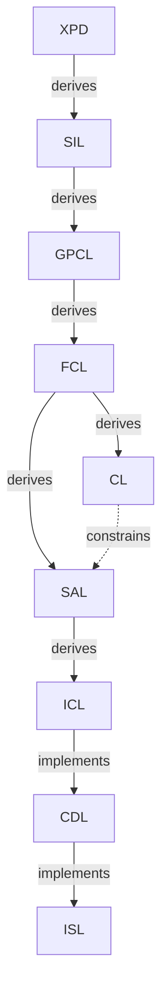
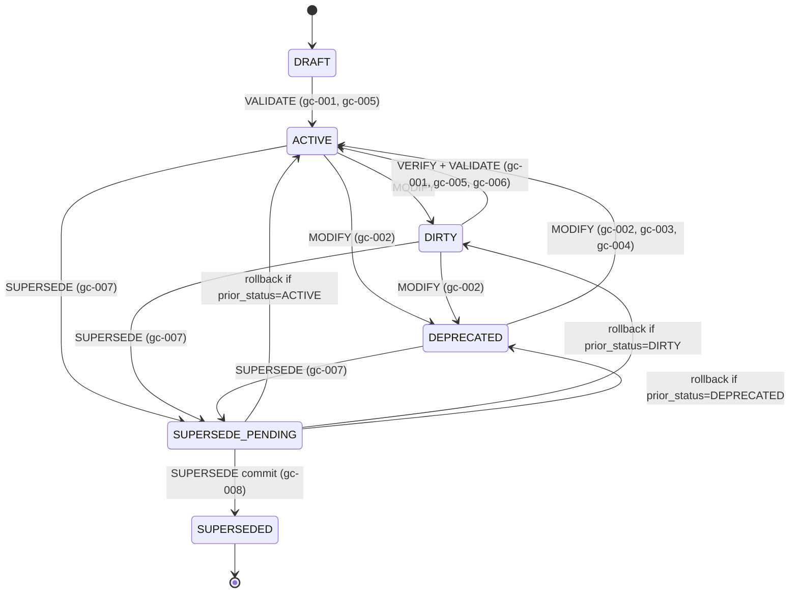
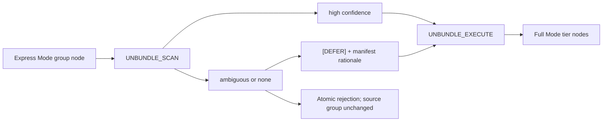
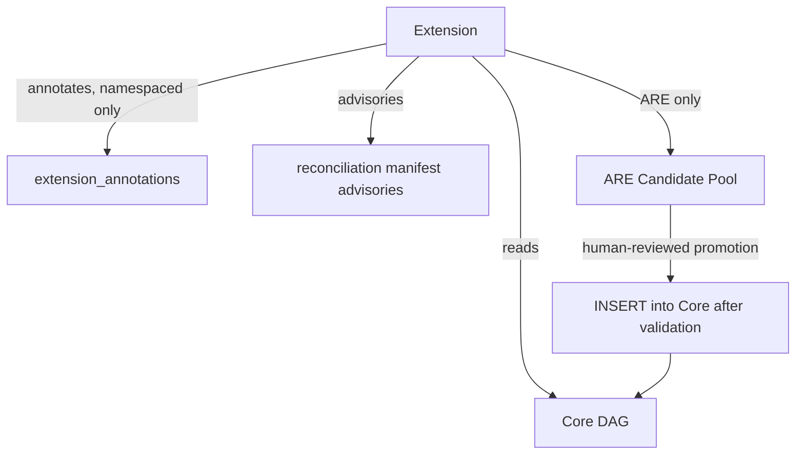

# DDR System v6.3 Reference Manual

This manual is a source-derived reference for DDR System v6.3. All normative DDR facts in this document are grounded in the authoritative v6.3 YAML specification and schema:

- `ddr_system_v6.3.yaml`
- `ddr_node_schema_v6.3.yaml`

Interpretive guidance in this manual is limited to explanation and organization. If this manual and the YAML authority ever diverge, the YAML authority wins.

## Table of Contents

1. [Source Basis, Scope, and How to Use This Manual](#1-source-basis-scope-and-how-to-use-this-manual)
2. [System Overview and Design Philosophy](#2-system-overview-and-design-philosophy)
3. [Foundational Axioms and Core Structural Model](#3-foundational-axioms-and-core-structural-model)
4. [Tier Reference](#4-tier-reference)
5. [Lifecycle and Operations](#5-lifecycle-and-operations)
6. [Consumption Modes and Express Mode](#6-consumption-modes-and-express-mode)
7. [Constraint Precedence, Reconciliation, and CLEAN State](#7-constraint-precedence-reconciliation-and-clean-state)
8. [Extension System and ARE](#8-extension-system-and-are)
9. [Schema Contract and Machine Validation Surface](#9-schema-contract-and-machine-validation-surface)
10. [Appendices](#10-appendices)

## 1. Source Basis, Scope, and How to Use This Manual

### 1.1 Authority model

| Source | Role |
| --- | --- |
| `ddr_system_v6.3.yaml` | Semantic and structural authority for the DDR System definition |
| `ddr_node_schema_v6.3.yaml` | Machine-contract authority for allowed shapes, conditionals, enums, and validation branching |

The specification defines the current DDR System. The schema defines what valid DDR artifacts may look like. Both are required to document v6.3 correctly.

### 1.2 Scope

| Property | Value |
| --- | --- |
| DDR version | `6.3` |
| Document profile of the authoritative source artifact | `system_definition` |
| Project name | `DDR System v6.3 - Authoritative Specification` |
| Project mode | `full` |
| System status | `Finalized` |
| System date | `2026-03-28` |
| System scope | `Systems-, language-, and domain-agnostic` |
| Authority | `DDR Architecture Board` |
| Lineage | `Supersedes DDR v6.2` |

### 1.3 How to use this manual

| Need | Start here |
| --- | --- |
| Overall model, axioms, node shape, and topology | Section 3 |
| What each tier contains | Section 4 |
| Statuses, transitions, guards, and operations | Section 5 |
| Express Mode and unbundling | Section 6 |
| CLEAN-state logic and reconciliation | Section 7 |
| Extensions and ARE behavior | Section 8 |
| Exact schema branching and conditional rules | Section 9 |
| Glossary, version history, migration, and crosswalk | Section 10 |

### 1.4 Normative vs explanatory content

- `Normative DDR facts` are taken directly from the authoritative YAML files.
- `Reference explanations` reorganize or summarize those facts for lookup.
- `Examples` in this manual are limited to source-native examples already present in the authoritative files, such as representative nodes, canonical tier variants, scoring profiles, lifecycle transitions, and extension catalog entries.

## 2. System Overview and Design Philosophy

### 2.1 System metadata

The authoritative specification declares itself the exclusive normative source of truth for DDR v6.3. It explicitly states that prior versions are superseded and that no conversation record, partial specification, or derivative document carries normative weight.

### 2.2 Design philosophy

| Principle | Description |
| --- | --- |
| Minimize Design Complexity | Every element earns its existence. No tier, edge type, operation, or rule exists without a concrete problem it solves. The system must be adoptable by a solo developer on day one and scale to enterprise without structural changes. |
| Avoid Premature Optimization | The Core defines the minimum viable graph. Advanced analytical capabilities, inference engines, and domain-specific intelligence are delivered exclusively via optional Extensions. The Core never anticipates an Extension. |
| Maximize Structural Integrity | The DAG is the single source of truth. Every node is traceable, every edge is typed, every mutation is validated. The system is correct by construction. |

### 2.3 Changes from v6.2 in v6.3

| Area | Prior | Current | Rationale |
| --- | --- | --- | --- |
| Explicit document profiling | System-definition intent was inferred indirectly from `system_metadata` | `document_profile` explicitly distinguishes `project_instance`, `project_instance_express`, and `system_definition` roots | Makes authored document intent machine-explicit and lets the schema require the full authoritative surface only for system-definition artifacts |
| Topology closure | `active_tiers` enforced membership loosely and left topology consequences to downstream logic | `active_tiers` is restricted to canonical order variants and topology obligations become first-class invariants | Closes ordering and representative-coverage ambiguity without adding a second topology model |
| Lifecycle authority simplification | Lifecycle behavior was split across `status_transitions` and `prohibited_transitions`, with composite raw operation tokens | `status_transitions` is the sole lifecycle authority and transition metadata decomposes operation, phase, side-effect, and prerequisites | Removes dual-authority drift and keeps operation identity machine-normalized |
| ARE contract hardening | ARE activation states, E5 `scoring_profile` requirements, and custom-profile structure were under-typed | Activation states are structurally typed, E5 requires `scoring_profile`, and custom-profile shape is explicit | Strengthens the schema front door while leaving profile resolution and score-band ordering to deterministic ARE conformance validation |
| Operation namespace normalization | Operations, lifecycle rows, and scaffold comments mixed canonical names with phase or alias tokens | The canonical operation surface is closed and `UNBUNDLE_EXECUTE` is the sole commit-phase token | Keeps validators, logs, and API-like surfaces aligned |
| Rule identifier typing | Invariant, atomic-rule, and extension-rule identifiers were only partially typed | Rule-ID families are centralized and typed consistently across the schema | Reduces malformed-reference drift |
| Express mode closure | Express Mode groups and top-level express authority were under-enforced | Group compositions are fixed structurally and express-capable profiles require the full `express_mode` authority block | Prevents authored Express Mode files from redefining group structure or omitting their governing contract |

### 2.4 Errata state

The authoritative `errata_log` is empty. No active errata entries are carried in the v6.3 system-definition artifact.

## 3. Foundational Axioms and Core Structural Model

### 3.1 Foundational axioms

| ID | Name | Statement | Implication |
| --- | --- | --- | --- |
| `AX-1` | Traceability | Every non-root node must cite at least one parent via a typed edge. | Complete audit trails from intent to implementation; no orphaned requirements. |
| `AX-2` | Abstraction Ordering | Technology and implementation specificity are deferred until logically necessary. | Tiers above CL (`XPD`, `SIL`, `GPCL`, `FCL`) must contain no technology, hardware, or implementation references. |
| `AX-3` | Determinism | Identical inputs produce unambiguous, mechanically verifiable outputs. | Structural rules support automated validation; semantic rules require explicit human disposition before activation. |
| `AX-4` | Universality | The Core applies to all software systems regardless of domain, scale, or technology. | No domain-specific assumptions belong in any Core tier. |
| `AX-5` | Extensibility | Advanced analytical capabilities are delivered exclusively via optional Extensions. | Core structure remains stable and does not depend on Extension behavior. |
| `AX-6` | Declarative Integrity | The Core is strictly declarative; all inference, optimization, and automated recommendation are Extension-only behaviors. | Core structural invariants cannot be destabilized by analytical logic. |
| `AX-7` | DAG Acyclicity | No citation chain may produce a cycle; causality flows in one direction only. | Graph traversal always terminates. |

### 3.2 Document profiles

The schema defines three top-level document profiles:

| Profile | Meaning | High-level contract |
| --- | --- | --- |
| `project_instance` | Lean full-mode project artifact | Rooted in `ddr_version`, `document_profile`, `active_tiers`, and `nodes`; must not require `system_metadata` |
| `project_instance_express` | Express-mode project artifact | Same lean root plus express obligations; requires `express_mode`, and each node must carry `express_mode_group` |
| `system_definition` | Authoritative DDR specification artifact | Requires the full normative top-level surface, including metadata, axioms, edge definitions, tier definitions, operations, extension system, compliance, glossary, ARE profiles, and lifecycle |

### 3.3 Canonical `active_tiers` variants

The schema allows exactly four ordered variants:

| Variant | Ordered tiers |
| --- | --- |
| Base 7-tier topology | `SIL, GPCL, FCL, SAL, ICL, CDL, ISL` |
| Base + `XPD` | `XPD, SIL, GPCL, FCL, SAL, ICL, CDL, ISL` |
| Base + `CL` | `SIL, GPCL, FCL, CL, SAL, ICL, CDL, ISL` |
| Base + `XPD` + `CL` | `XPD, SIL, GPCL, FCL, CL, SAL, ICL, CDL, ISL` |

### 3.4 Canonical topology and representative nodes

The authoritative system-definition artifact includes one representative node for each active tier:

| Node ID | Tier | Title | Parent citations |
| --- | --- | --- | --- |
| `XPD-0.1` | `XPD` | Existential Purpose Document | root |
| `SIL-1.1` | `SIL` | Strategic Intent Layer | `XPD-0.1` via `derives` with `semantic` |
| `GPCL-2.1` | `GPCL` | Governance, Policy & Quality Layer | `SIL-1.1` via `derives` with `traceability` |
| `FCL-3.1` | `FCL` | Functional Capability Layer | `GPCL-2.1` via `derives` with `semantic` |
| `CL-4.1` | `CL` | Constraint Layer | `FCL-3.1` via `derives` with `semantic` |
| `SAL-5.1` | `SAL` | System Architecture Layer | `FCL-3.1` via `derives`; `CL-4.1` via `constrains` |
| `ICL-6.1` | `ICL` | Interface & Contracts Layer | `SAL-5.1` via `derives` with `semantic` |
| `CDL-7.1` | `CDL` | Component Design Layer | `ICL-6.1` via `implements` |
| `ISL-8.1` | `ISL` | Implementation Scaffold Layer | `CDL-7.1` via `implements` |

### 3.5 Universal node format

The specification documents 13 node schema fields:

| Field | Type | Notes |
| --- | --- | --- |
| `id` | `TIER-N.M` | Immutable once assigned |
| `tier` | enum | One of `XPD, SIL, GPCL, FCL, CL, SAL, ICL, CDL, ISL` |
| `title` | string | Human-readable artifact label |
| `content` | text | Body constrained by the tier's atomic ruleset |
| `parent_ids` | list of `ParentCitation` | Required for all non-root nodes; legal edge types are `derives`, `constrains`, `implements` |
| `status` | enum | `DRAFT, ACTIVE, DIRTY, DEPRECATED, SUPERSEDED, SUPERSEDE_PENDING` |
| `constraint_origin` | enum, conditional | `CL` only; one of `derived`, `imposed` |
| `prior_status` | status enum subset, conditional | Only for `SUPERSEDE_PENDING`; allowed values are `ACTIVE`, `DEPRECATED`, `DIRTY` |
| `version` | SemVer string | Incremented on `MODIFY` |
| `created` | ISO 8601 datetime | Creation timestamp |
| `modified` | ISO 8601 datetime | Last modification timestamp |
| `express_mode_group` | enum, conditional | Required when `document_profile = project_instance_express`; one of `G1, G2, G3, G4` |
| `extension_annotations` | map | Read-only extension metadata with reserved shadow-key blocking |

### 3.6 Node ID format

| Item | Value |
| --- | --- |
| General pattern | `[TIER]-[SECTION].[ITEM]` |
| XPD pattern | `XPD-0.N` |
| Examples | `SIL-1.3`, `GPCL-2.1`, `CDL-12.5`, `XPD-0.1` |
| Immutability rule | IDs never change. A superseded node retains its ID; the replacement receives a new ID. |

### 3.7 Edge types

The current edge vocabulary is the four-type surface declared by `edge_type_definitions`. The specification also records the consolidation decision that reduced older edge vocabularies into this set.

| Edge type | Symbol | Semantics |
| --- | --- | --- |
| `derives` | `--derives-->` | Child content derives from parent requirements, or parent is cited as authoritative lineage. Optional `derivation_mode` may be `semantic` or `traceability`; omitted means `semantic`. |
| `constrains` | `--constrains-->` | Parent sets enforceable limits on the child's design space. |
| `implements` | `--implements-->` | Child provides concrete realization of the parent's abstract specification. |
| `extends` | `...extends...>` | Extension reads or annotates Core nodes without modifying Core semantics. |

### 3.8 Citation rules

| Rule | Statement |
| --- | --- |
| `CIT-R1` | Every non-root node must have `>= 1` parent citation; only root nodes may have an empty `parent_ids` array. |
| `CIT-R2` | Parent citations must reference the immediately preceding active tier or tiers. For `derives`, `derivation_mode` may be `semantic` or `traceability`; default is `semantic`. |
| `CIT-R3` | `CL -> SAL` constraint edges are stored in `parent_ids` with edge type `constrains`. |
| `CIT-R4` | Any inline `[TIER-N.M]` citation in node content must have a matching `parent_ids` entry. |
| `CIT-R5` | Extension `extends` relationships are stored in `extension_annotations` only, never in `parent_ids`. |
| `CIT-R6` | Any authority-linkage `derives` edge must set `derivation_mode: traceability`; non-`derives` edges must not carry `derivation_mode`. |
| `CIT-R7` | A child may remain `ACTIVE` only while each cited parent remains at the version last validated against. Any parent `MODIFY` or `SUPERSEDE` that changes cited content forces child re-validation. |

### 3.9 DAG invariants

| Invariant | Statement |
| --- | --- |
| `INV-1` | No cycles are permitted at any path length. |
| `INV-2` | No tier-skipping: citations must target the immediately preceding active tier or tiers. `SAL` is the only exhaustive merge-node exception. |
| `INV-3` | `active_tiers` must be one of the four canonical ordered sets. Every node tier must belong to `active_tiers`, and every `system_definition` artifact must include at least one representative node for each active tier. |
| `INV-4` | When `CL` is inactive, `SAL` derives directly from `FCL`. |
| `INV-5` | All non-root nodes must carry at least one parent citation. |
| `INV-6` | `SUPERSEDE` must be atomic across all tiers. Partial application is a structural violation. The system also restricts `ACTIVE` `XPD` nodes to at most one at a time. |
| `INV-7` | Structural validity may coexist with declared semantic gaps only when the gap is explicitly logged in the reconciliation manifest under an allowed classification, with human rationale and required resolution or waiver before CLEAN. |
| `INV-8` | `lifecycle.status_transitions` must form a complete and closed state machine: every non-terminal status has at least one valid outbound transition, and undefined transitions are invalid. |

## 4. Tier Reference

### 4.1 `XPD` - Existential Purpose Document

| Property | Value |
| --- | --- |
| Representative node | `XPD-0.1` |
| Label | Existential Purpose Document |
| Core question | What human or societal need does this system exist to address, and what ethical boundaries govern all downstream decisions? |
| Optional | Yes |
| Root / activation rule | Always root when active. Required when ethical impact is not none or societal scale exceeds personal; skippable for internal tooling with no external effect. |
| Parent relationships | `NONE` via `derives` under condition `none_root` |
| Child relationships | `SIL` via `derives` under condition `always` |
| Tier-specific schema or verification note | None beyond universal node contract |

| Inclusion rule | verification_mode | Statement |
| --- | --- | --- |
| `XPD-R1` | structural | Must articulate a fundamental human or societal need being addressed. |
| `XPD-R2` | structural | Must be immutable across the project lifecycle; changes require a new XPD version. |
| `XPD-R3` | semantic | Must be comprehensible to non-technical stakeholders without a glossary. |
| `XPD-R4` | structural | Must establish ethical boundary conditions all subsequent tiers must satisfy. |
| `XPD-R5` | structural | Must define success criteria independent of implementation metrics. |
| `XPD-R6` | structural | Must identify populations who could be harmed and the safeguards required. |

| Exclusion rule | Statement |
| --- | --- |
| `XPD-E1` | Must not contain solution concepts, technology references, or architectural ideas. |
| `XPD-E2` | Must not contain quantitative performance targets; those belong in `GPCL`. |
| `XPD-E3` | Must not contain regulatory or legal constraints; those belong in `GPCL`. |

### 4.2 `SIL` - Strategic Intent Layer

| Property | Value |
| --- | --- |
| Representative node | `SIL-1.1` |
| Label | Strategic Intent Layer |
| Core question | Why does this system exist, and what business outcomes must it achieve? |
| Optional | No |
| Root / activation rule | Root when `XPD` is inactive |
| Parent relationships | `XPD` via `derives` if `XPD` active; `NONE` via `derives` if `XPD` inactive |
| Child relationships | `GPCL` via `derives` under condition `always` |
| Tier-specific schema or verification note | None beyond universal node contract |

| Inclusion rule | verification_mode | Statement |
| --- | --- | --- |
| `SIL-R1` | structural | Must define the core business problem or opportunity being addressed. |
| `SIL-R2` | structural | Must specify strategic objectives with measurable outcomes. |
| `SIL-R3` | structural | Must identify all stakeholder categories and their value propositions. |
| `SIL-R4` | structural | Must establish explicit scope boundaries, including in-scope and out-of-scope areas. |
| `SIL-R5` | structural | Must define organizational success metrics. |
| `SIL-R6` | structural | Must remain stable under technology changes. |

| Exclusion rule | Statement |
| --- | --- |
| `SIL-E1` | Must not reference hardware, technology stacks, frameworks, or languages. |
| `SIL-E2` | Must not contain regulatory mandates or compliance requirements; those belong in `GPCL`. |
| `SIL-E3` | Must not prescribe architectural patterns or implementation strategies. |
| `SIL-E4` | Must not contain quantitative performance metrics; those belong in `GPCL`. |

### 4.3 `GPCL` - Governance, Policy & Quality Layer

| Property | Value |
| --- | --- |
| Representative node | `GPCL-2.1` |
| Label | Governance, Policy & Quality Layer |
| Core question | What non-negotiable external mandates, regulatory obligations, policy constraints, and measurable quality thresholds govern this system? |
| Optional | No |
| Root / activation rule | Never root; derives from `SIL` |
| Parent relationships | `SIL` via `derives` under condition `always` |
| Child relationships | `FCL` via `derives` under condition `always` |
| Tier-specific schema or verification note | No extra schema fields beyond the universal node contract |

| Inclusion rule | verification_mode | Statement |
| --- | --- | --- |
| `GPCL-R1` | structural | Must enumerate all applicable regulatory frameworks with jurisdiction and scope. |
| `GPCL-R2` | semantic | Must specify enforceable, testable constraints rather than aspirational targets. |
| `GPCL-R3` | structural | Must identify contractual obligations imposed by third-party relationships. |
| `GPCL-R4` | structural | Must define data sovereignty and residency requirements. |
| `GPCL-R5` | structural | Must specify audit and record-retention mandates. |
| `GPCL-R6` | structural | Must specify quantifiable performance targets: latency, throughput, and concurrency ceilings. |
| `GPCL-FCL-BR1` | semantic | Every `GPCL-R6` target needs a corresponding `FCL` node that provides behavioral context rather than merely repeating the number. If no user-facing behavioral dimension exists, the author must log `MISSING_MEDIATOR` in the reconciliation manifest. |
| `GPCL-R7` | structural | Must specify reliability and availability targets such as SLAs, RTO, and RPO. |
| `GPCL-R8` | structural | Must specify security requirements in technology-neutral language. |
| `GPCL-R9` | structural | Must specify scalability and accessibility requirements. |
| `GPCL-R10` | structural | Must cite parent `SIL` IDs for each constraint. |

| Exclusion rule | Statement |
| --- | --- |
| `GPCL-E1` | Must not specify technology frameworks, library choices, or hardware specifications. |
| `GPCL-E2` | Must not describe functional system behaviors; those belong in `FCL`. |
| `GPCL-E3` | Must not contain business objectives or success metrics; those belong in `SIL`. |

### 4.4 `FCL` - Functional Capability Layer

| Property | Value |
| --- | --- |
| Representative node | `FCL-3.1` |
| Label | Functional Capability Layer |
| Core question | What externally observable behaviors and user-facing capabilities must the system provide? |
| Optional | No |
| Root / activation rule | Never root; derives from `GPCL` |
| Parent relationships | `GPCL` via `derives` under condition `always` |
| Child relationships | `SAL` via `derives` always; `CL` via `derives` if `CL` is active |
| Tier-specific schema or verification note | `FCL-R7` adds mandatory logical data-entity enumeration for data-modifying capabilities |

| Inclusion rule | verification_mode | Statement |
| --- | --- | --- |
| `FCL-R1` | semantic | Must describe capabilities from the perspective of a user or external system. |
| `FCL-R2` | semantic | Must specify user workflows end-to-end without naming components, classes, or modules. |
| `FCL-R3` | structural | Must define event-driven behaviors and conditional business-logic rules. |
| `FCL-R4` | structural | Must specify user-observable state transitions and error conditions. |
| `FCL-R5` | structural | Must be decomposable into sub-capabilities for complex features. |
| `FCL-R6` | structural | Must cite parent `GPCL` IDs for capabilities that satisfy governance or quality requirements. |
| `FCL-R7` | semantic | For any capability that creates, reads, updates, or deletes persistent data, must enumerate all logical data entities involved and their CRUD relationship, without attribute typing, storage structures, keys, or integrity rules. |

| Exclusion rule | Statement |
| --- | --- |
| `FCL-E1` | Must not name specific classes, modules, APIs, or algorithms. |
| `FCL-E2` | Must not specify network protocols, serialization formats, or data schemas. |
| `FCL-E3` | Must not specify hardware requirements or infrastructure topology. |

### 4.5 `CL` - Constraint Layer

| Property | Value |
| --- | --- |
| Representative node | `CL-4.1` |
| Label | Constraint Layer |
| Core question | What are the declared technology selections, hardware envelopes, and infrastructure ceilings that bound the system's implementation? |
| Optional | Yes |
| Root / activation rule | Active when technology, hardware, or infrastructure constraints are non-negotiable |
| Parent relationships | `FCL` via `derives` if `CL` is active |
| Child relationships | `SAL` via `constrains` if `CL` is active |
| Tier-specific schema or verification note | `constraint_origin` is required and branches verification between `CL-R9` and `CL-R9-imposed` |

| Inclusion rule | verification_mode | Statement |
| --- | --- | --- |
| `CL-R1` | structural | Must declare approved programming languages with version constraints. |
| `CL-R2` | structural | Must declare mandatory frameworks and core libraries with minimum version bounds. |
| `CL-R3` | structural | Must declare required external service contracts without internal implementation detail. |
| `CL-R4` | structural | Must declare runtime environment constraints such as OS, container runtime, or execution environment. |
| `CL-R5` | structural | Must explicitly declare prohibited technologies with rationale. |
| `CL-R6` | structural | Must declare hardware envelopes when applicable, including CPU class, RAM floor, storage, and GPU. |
| `CL-R7` | structural | Must declare infrastructure ceilings when applicable, including compute budget, storage cap, and bandwidth cap. |
| `CL-R8` | structural | Must specify deployment topology declarations such as on-premise, cloud-agnostic, hybrid, or edge. |
| `CL-R9` | structural | Must cite `FCL` IDs for each `derived` constraint. |
| `CL-R9-imposed` | structural | Must cite the external authority source for each `imposed` constraint. `FCL` citation becomes optional contextual traceability. |
| `CL-R10` | structural | Must explicitly document internal reconciliations of conflicting hardware and technology constraints. |

| Exclusion rule | Statement |
| --- | --- |
| `CL-E1` | Must not auto-derive, infer, or recommend configurations; inference belongs to Extensions. |
| `CL-E2` | Must not contain functional system behaviors; those belong in `FCL`. |
| `CL-E3` | Must not contain cost models or TCO calculations; those belong in Extensions. |

### 4.6 `SAL` - System Architecture Layer

| Property | Value |
| --- | --- |
| Representative node | `SAL-5.1` |
| Label | System Architecture Layer |
| Core question | How is the system structurally decomposed, and what patterns govern component interaction? |
| Optional | No |
| Root / activation rule | Never root; merge node between functional derivation and optional constraint input |
| Parent relationships | `FCL` via `derives` always; `CL` via `constrains` if `CL` is active |
| Child relationships | `ICL` via `derives` under condition `always` |
| Tier-specific schema or verification note | `SAL` is the only valid merge node in the Core topology |

| Inclusion rule | verification_mode | Statement |
| --- | --- | --- |
| `SAL-R1` | semantic | Must define the overarching architectural pattern or patterns with rationale. |
| `SAL-R2` | structural | Must specify system decomposition into major subsystems with ownership boundaries. |
| `SAL-R3` | structural | Must specify inter-subsystem communication patterns. |
| `SAL-R4` | structural | Must specify concurrency model and data ownership rules. |
| `SAL-R5` | structural | Must specify failure isolation and resilience boundaries. |
| `SAL-R6` | structural | Must cite all active parent IDs for each major architectural decision: `FCL`, plus `CL` when active. |

| Exclusion rule | Statement |
| --- | --- |
| `SAL-E1` | Must not contain exact data schemas or payload definitions; those belong in `ICL`. |
| `SAL-E2` | Must not contain class-level component blueprints; those belong in `CDL`. |
| `SAL-E3` | Must not contain executable code, algorithm implementations, or procedural logic; those belong in `CDL` or `ISL`. |

### 4.7 `ICL` - Interface & Contracts Layer

| Property | Value |
| --- | --- |
| Representative node | `ICL-6.1` |
| Label | Interface & Contracts Layer |
| Core question | What are the formal, machine-verifiable contracts governing data exchange between system boundaries? |
| Optional | No |
| Root / activation rule | Never root; derives from `SAL` |
| Parent relationships | `SAL` via `derives` under condition `always` |
| Child relationships | `CDL` via `implements` under condition `always` |
| Tier-specific schema or verification note | `ICL-R2` requires machine-parseable schemas |

| Inclusion rule | verification_mode | Statement |
| --- | --- | --- |
| `ICL-R1` | structural | Must define all inter-component and external API contracts with complete input and output schemas. |
| `ICL-R2` | structural | All schemas must be machine-parseable, such as JSON Schema, Protobuf, OpenAPI, or equivalent. |
| `ICL-R3` | structural | Must specify serialization formats, encoding standards, and wire protocols per contract. |
| `ICL-R4` | structural | Must specify mandatory fields, optional fields, type constraints, and validation rules. |
| `ICL-R5` | structural | Must specify error response contracts, including error codes, payload structure, and retry behavior. |
| `ICL-R6` | structural | Must specify versioning strategy per contract. |
| `ICL-R7` | structural | Must cite `SAL` IDs for each contract. |

| Exclusion rule | Statement |
| --- | --- |
| `ICL-E1` | Must not contain internal component state management or business logic. |
| `ICL-E2` | Must not specify architectural routing patterns; those belong in `SAL`. |
| `ICL-E3` | Must not contain class or module blueprints; those belong in `CDL`. |

### 4.8 `CDL` - Component Design Layer

| Property | Value |
| --- | --- |
| Representative node | `CDL-7.1` |
| Label | Component Design Layer |
| Core question | What are the structural blueprints of individual components, including public interfaces, internal state, and responsibilities? |
| Optional | No |
| Root / activation rule | Never root; implements `ICL` |
| Parent relationships | `ICL` via `implements` under condition `always` |
| Child relationships | `ISL` via `implements` under condition `always` |
| Tier-specific schema or verification note | `CDL-R7` requires language-specific blueprints when `CL` declares multiple targets |

| Inclusion rule | verification_mode | Statement |
| --- | --- | --- |
| `CDL-R1` | structural | Must define component names, logical responsibilities, and ownership boundaries. |
| `CDL-R2` | structural | Must specify all public method or function signatures, including names, parameter types, return types, and exceptions. |
| `CDL-R3` | structural | Must specify internal state structures as a logical model rather than executable implementation. |
| `CDL-R4` | structural | Must specify component dependencies, including consumed components and `ICL` contracts. |
| `CDL-R5` | structural | Must map each component to the `ICL` contracts it implements. |
| `CDL-R6` | structural | Must specify initialization, lifecycle, and teardown contracts for stateful components. |
| `CDL-R7` | structural | When `CL` declares multiple target languages, must produce language-specific blueprints for each target. |

| Exclusion rule | Statement |
| --- | --- |
| `CDL-E1` | Must not contain executable code bodies or algorithm implementations. |
| `CDL-E2` | Must not contain system-wide architectural patterns; those belong in `SAL`. |
| `CDL-E3` | Must not contain data serialization schemas; those belong in `ICL`. |

### 4.9 `ISL` - Implementation Scaffold Layer

| Property | Value |
| --- | --- |
| Representative node | `ISL-8.1` |
| Label | Implementation Scaffold Layer |
| Core question | What is the minimal, structurally valid, traceable scaffolding required to initiate implementation? |
| Optional | No |
| Root / activation rule | Terminal leaf tier |
| Parent relationships | `CDL` via `implements` under condition `always` |
| Child relationships | none |
| Tier-specific schema or verification note | `ISL` is the only valid leaf tier in a CLEAN Core DAG |

| Inclusion rule | verification_mode | Statement |
| --- | --- | --- |
| `ISL-R1` | structural | Must produce syntactically valid structural scaffolding in the target language. |
| `ISL-R2` | structural | Must embed docstrings or code comments with explicit parent DDR node IDs. |
| `ISL-R3` | structural | Must include implementation hints as structured comments. |
| `ISL-R4` | structural | Must define all function or method bodies exclusively as stubs. |
| `ISL-R5` | structural | Must be language-specific, with one `ISL` node per target language or runtime when multiple are declared in `CL`. |
| `ISL-R6` | structural | Must cite `CDL` parent IDs for every stub. |

| Exclusion rule | Statement |
| --- | --- |
| `ISL-E1` | Must not contain business logic or complete algorithmic logic. |
| `ISL-E2` | Must not contain infrastructure configuration; that belongs in Extensions. |

## 5. Lifecycle and Operations

### 5.1 Status model and lifecycle authority

`lifecycle.status_transitions` is the sole normative authority for valid node status transitions.

| Status | Operational meaning |
| --- | --- |
| `DRAFT` | Authored but not yet activated through the validation path |
| `ACTIVE` | Structurally valid, review-complete, and current |
| `DIRTY` | Requires re-validation because of direct change or upstream change |
| `DEPRECATED` | Still present but marked for retirement or replacement |
| `SUPERSEDED` | Replaced but retained for audit lineage |
| `SUPERSEDE_PENDING` | Transient state during an in-flight `SUPERSEDE` transaction |

### 5.2 Status transitions

| From | To | Operation | Phase / side-effect | Prerequisites | Guards | Notes |
| --- | --- | --- | --- | --- | --- | --- |
| `DRAFT` | `ACTIVE` | `VALIDATE` | none | none | `gc-001`, `gc-005` | Initial activation path |
| `ACTIVE` | `DIRTY` | `MODIFY` | none | none | none | Direct modification of an active node |
| `ACTIVE` | `DIRTY` | `MODIFY` | `side_effect: propagation` | none | none | Downstream propagation after ancestor mutation |
| `ACTIVE` | `DEPRECATED` | `MODIFY` | none | none | `gc-002` | Deprecation path |
| `ACTIVE` | `SUPERSEDE_PENDING` | `SUPERSEDE` | none | none | `gc-007` | Enter supersede transaction |
| `DIRTY` | `ACTIVE` | `VALIDATE` | none | `VERIFY` | `gc-001`, `gc-005`, `gc-006` | Re-activation after cleanup |
| `DIRTY` | `DEPRECATED` | `MODIFY` | none | none | `gc-002` | Dirty node can still be deprecated |
| `DIRTY` | `SUPERSEDE_PENDING` | `SUPERSEDE` | none | none | `gc-007` | Dirty node can be superseded |
| `DEPRECATED` | `SUPERSEDE_PENDING` | `SUPERSEDE` | none | none | `gc-007` | Deprecated node can be replaced |
| `SUPERSEDE_PENDING` | `SUPERSEDED` | `SUPERSEDE` | `phase: commit` | none | `gc-008` | Successful replacement and rewiring |
| `SUPERSEDE_PENDING` | `prior_status` | `SUPERSEDE` | `phase: rollback` | none | `gc-009` | Rollback uses stored prior status |
| `DEPRECATED` | `ACTIVE` | `MODIFY` | none | none | `gc-002`, `gc-003`, `gc-004` | Re-activate deprecated node |

### 5.3 Guard definitions

| Guard | verification_mode | Description |
| --- | --- | --- |
| `gc-001` | structural | All structural rules for the node pass validation. |
| `gc-002` | manual | Deprecation rationale is explicitly documented. |
| `gc-003` | manual | Any previously set deprecation sunset date is cleared. |
| `gc-004` | manual | Status reversal is logged in the reconciliation manifest. |
| `gc-005` | structural | All review items are resolved. |
| `gc-006` | structural | Per-node validation scope is explicitly confirmed. |
| `gc-007` | structural | Before entering `SUPERSEDE_PENDING`, the node's current status must be recorded in `prior_status`, and that value must be one of `ACTIVE`, `DEPRECATED`, or `DIRTY`. |
| `gc-008` | structural | Replacement node is successfully inserted and validated, children are rewired to the replacement ID, affected children are set `DIRTY`, and `prior_status` is cleared. |
| `gc-009` | structural | Replacement insert failed or child rewiring failed; source node reverts to `prior_status`, replacement is removed if necessary, and `SUPERSEDE_FAILED` is logged. |

### 5.4 Canonical operations

| Operation | Description | Validation trigger |
| --- | --- | --- |
| `INSERT` | Create a node with auto-assigned ID, parent citations, and tier-compliant content. Supports both forward and reverse direction. | Full atomic ruleset validation, parent existence, and cycle detection |
| `DELETE` | Remove a node and cascade orphan detection to children. | Children become `DIRTY`; orphaned children must be resolved by re-attachment, cascade delete, or superseding replacement |
| `MODIFY` | Update content and increment version. | Re-validate rule surface, re-check citations, and propagate `DIRTY` to descendants |
| `SUPERSEDE` | Mark a node as replaced while keeping the old ID for audit. | Transactional entry into `SUPERSEDE_PENDING`, replacement insert, child rewiring, commit or rollback |
| `VERIFY` | Traverse the DAG downward and validate citations, edges, references, orphans, contamination, and optional cross-node semantic consistency rules. | Returns `CLEAN` or `DIRTY` with itemized findings; may emit non-blocking `REVIEW_REQUIRED` items for semantic conflicts |
| `VALIDATE` | Check one node against its tier's full atomic ruleset. | Structural rules pass or fail mechanically; semantic rules emit `REVIEW_REQUIRED` items that need human disposition before activation |
| `UNBUNDLE_SCAN` | Read-only pre-flight scan of an Express Mode group. | Produces per-fragment diagnostics with confidence `high`, `ambiguous`, or `none` |
| `UNBUNDLE_EXECUTE` | Atomic commit-phase expansion of an Express Mode group into constituent full-mode tiers. | Succeeds only when every fragment is confidently assignable or explicitly deferred |

### 5.5 DIRTY triggers and classification

| Trigger | Nodes affected |
| --- | --- |
| Node modified | Modified node plus all descendants |
| Node deleted | All former children of the deleted node |
| Parent becomes `SUPERSEDED` and child `parent_ids` are auto-updated | Immediate children only; grandchildren do not auto-cascade |
| `CL` constraint added or modified | `SAL` plus all `SAL` descendants |
| `XPD` ethical boundary modified | All tiers |

| DIRTY classification | Meaning |
| --- | --- |
| `structural` | Structural change such as parent rewiring without immediate proof of semantic invalidation |
| `semantic` | Probable semantic invalidation requiring downstream review or content change before CLEAN can be re-established |

The specification also states the following `SUPERSEDE` DIRTY behavior:

- Child nodes affected by parent rewiring enter `DIRTY` with classification `structural`.
- Structural `DIRTY` does not automatically propagate to descendants.
- If later validation or modification reveals content drift, the affected node's `DIRTY` condition is reclassified as `semantic`, and normal downstream propagation resumes.

### 5.6 Conflict resolution and resolution workflow

Conflict resolution protocol:

1. Identify conflicting nodes and violated rules.
2. Classify the conflict as logical, physical, or semantic.
3. Escalate to the designated authoring authority.
4. Record the resolution decision and rationale.
5. Apply `MODIFY`, `SUPERSEDE`, or `DELETE` as required.

Audit requirement:

- All conflict resolutions must be recorded in the reconciliation manifest with before-and-after state references and disposition authority.

Resolution workflow:

`DETECT CHANGE -> SET DIRTY -> SCAN DOWNSTREAM -> GENERATE PENDING ITEMS -> EXECUTE OPERATION -> VERIFY -> SET CLEAN OR REPEAT`

## 6. Consumption Modes and Express Mode

### 6.1 Consumption modes

| Mode | Description | Best fit |
| --- | --- | --- |
| `Express (4 Groups)` | Adjacent tiers are bundled into fixed groups and later expanded through `UNBUNDLE_SCAN` and `UNBUNDLE_EXECUTE`. | Small-to-medium projects |
| `Full (All Active Tiers)` | Every active tier is specified independently. | Complex, regulated, or enterprise systems |

### 6.2 Express Mode groups

| Group | Tiers | Label |
| --- | --- | --- |
| `G1` | `XPD, SIL, GPCL` | Purpose, Strategy & Governance |
| `G2` | `FCL, CL` | Capabilities & Constraints |
| `G3` | `SAL, ICL` | Architecture & Contracts |
| `G4` | `CDL, ISL` | Design & Scaffolding |

### 6.3 Express Mode contract

The authoritative `express_mode` block defines the following:

- Express Mode is not a reduced system; it is grouped presentation of the full model.
- `UNBUNDLE_SCAN` is a read-only pre-flight classifier.
- `UNBUNDLE_EXECUTE` is the commit-phase operation and the only canonical commit token in v6.3.
- On successful unbundling, `parent_ids` auto-wire to the immediately superior unbundled tier, satisfying `CIT-R2` without manual intervention.

### 6.4 Deterministic unbundling and deferred fragments

The authoritative determinism rule requires:

- Explicit tier annotations inside grouped content when a group contains conditionally activatable tiers, specifically `G1` and `G2`
- Per-fragment classification into `high`, `ambiguous`, or `none`
- Rejection of `UNBUNDLE_EXECUTE` when any fragment remains ambiguous or unassigned without explicit deferment

Deferred-fragment handling requires:

- Explicit `[DEFER]` annotation
- Recorded human rationale in the reconciliation manifest
- Retention of deferred fragments in the source Express Mode group node
- Atomic rejection when ambiguous fragments are neither confidently classified nor explicitly deferred

## 7. Constraint Precedence, Reconciliation, and CLEAN State

### 7.1 Constraint precedence hierarchy

| Priority | Tier | Rationale |
| --- | --- | --- |
| 1 | `XPD` | Ethical boundary conditions are inviolable. |
| 2 | `SIL` | Strategic intent defines the purpose of all design decisions. |
| 3 | `GPCL` | External regulatory mandates and quality thresholds are non-negotiable. |
| 4 | `FCL` | Functional requirements operate within the constraint envelope. |
| 5 | `CL` | Technology, hardware, and infrastructure constraints are externally imposed. |
| 6 | `SAL` | Architecture is bounded by all above. |
| 7 | `ICL` | Contracts derive from architecture. |
| 8 | `CDL` | Design derives from contracts. |
| 9 | `ISL` | Scaffolding derives from design. |

Override principle:

- Higher-priority tiers override lower-priority tiers.
- An `XPD` ethical boundary acts as an absolute veto right over downstream decisions.

### 7.2 Constraint classes and escalation rules

| Constraint class | Description |
| --- | --- |
| `logical` | Governed by the formal tier precedence hierarchy |
| `physical` | Represents non-negotiable physical realities or externally imposed constraints that cannot be silently overridden by logical precedence alone |

Additional precedence rules:

- Intra-tier conflicts must be documented and resolved before conflicting nodes can become `ACTIVE`.
- Any `CL` node with `constraint_origin = imposed` is treated as a non-overridable physical-or-external constraint during precedence evaluation.
- Physical incompatibilities must be escalated to the authoring authority; precedence does not authorize silently overriding physical or externally imposed constraints.

### 7.3 Reconciliation manifest

Tracked values:

| Track | Meaning |
| --- | --- |
| Total node count by tier | Current topology inventory |
| `ACTIVE`, `DIRTY`, `DRAFT`, `DEPRECATED` counts | Status distribution |
| Pending items list | Unresolved review, gap, and failure items |
| Last full validation timestamp | Most recent global validation point |
| Active Extensions and annotation counts | Extension overlay inventory |

Manifest item types:

| Item type | Fields | Meaning |
| --- | --- | --- |
| `MISSING_MEDIATOR` | `gpcl_node_id`, `message`, `rationale` | Logged when a `GPCL-R6` target has no corresponding `FCL` behavioral mediator |
| `SUPERSEDE_FAILED` | `source_node_id`, `attempted_replacement_content_hash`, `failure_reason`, `timestamp` | Logged when supersession fails during replacement insert or rewiring |
| `SUPERSEDE_PENDING_DETECTED` | `node_id`, `prior_status`, `detected_at` | Logged by `VERIFY` when a node remains in `SUPERSEDE_PENDING`; severity is `BLOCKING` |

Semantic-gap classification:

| Property | Value |
| --- | --- |
| Allowed type(s) | `MISSING_MEDIATOR` |
| Required constraints | Must be logged explicitly; must carry human rationale; must be resolved or explicitly waived before system-wide CLEAN |

### 7.4 Compliance checklist

Structural validation requirements:

- All non-root nodes have `>= 1` valid, non-superseded parent citation.
- All parent citations reference the correct parent tier.
- No cycles exist in any citation path.
- Every node tier belongs to `active_tiers`.
- Every `system_definition` artifact includes at least one representative node for each active tier.
- No tier-skipping is present.
- All inline citations have matching `parent_ids`.
- No node remains `DIRTY`.
- No node remains `SUPERSEDE_PENDING`.
- The reconciliation manifest has zero pending items.
- Any declared semantic gap uses an allowed classification and is resolved or explicitly waived with rationale before CLEAN.
- If any Extension is active, all critical or blocking advisories have recorded disposition notes.

Atomic-rule validation requirements:

- Each tier satisfies its declared inclusion and exclusion rules.
- `FCL-R7` requires logical data-entity and CRUD enumeration for data-modifying capabilities.
- `GPCL-FCL-BR1` requires either an `FCL` mediator or a `MISSING_MEDIATOR` manifest entry.
- `CL` nodes remain declarative and must declare `constraint_origin`.
- `CL-R9` applies to `derived` constraints; `CL-R9-imposed` applies to `imposed` constraints.
- `CIT-R7` requires re-validation after cited parent version changes.
- `SAL` cites all active parent tiers.
- `ICL-R2` requires machine-parseable schemas.
- `ISL` stubs must cite `CDL` parent IDs.
- `CDL-R7` requires language-specific blueprints when multiple targets are declared.
- All `REVIEW_REQUIRED` items must carry recorded human disposition before affected nodes move from `DRAFT` to `ACTIVE`.

Extension validation requirements:

- Active Extensions declare compatible `DDR-Core-6.x` contracts.
- Extension annotations appear in `extension_annotations` only.
- Extension advisories are reviewed; non-critical advisories have disposition notes.
- ARE candidates are either promoted via `INSERT` or discarded.
- E5 declares a valid `scoring_profile`.
- Custom ARE profiles satisfy required fields and bounded, ordered, non-overlapping score bands.
- Candidates promoted below threshold require `override_flag: true` plus non-empty `human_rationale`.

### 7.5 CLEAN-state logic

A DDR graph may be treated as CLEAN only when all of the following are true:

- No node is `DIRTY`.
- No node is `SUPERSEDE_PENDING`.
- Citation rules and topology invariants hold.
- Tier-specific atomic rules hold.
- Reconciliation manifest pending items are resolved or explicitly waived where allowed.
- Parent-version freshness is preserved.
- Extension advisories with critical or blocking severity have disposition.

## 8. Extension System and ARE

### 8.1 Extension architecture

Permitted actions:

- Read Core node content.
- Annotate Core nodes with namespaced metadata stored only in `extension_annotations`.
- Generate derived external artifacts such as reports, IaC, or recommendations.
- Add advisories to the reconciliation manifest's extension-advisories surface.

Prohibited actions:

- Modify any Core node's `content`, `parent_ids`, `tier`, or `status`.
- Redefine Core tier semantics or atomic rules.
- Introduce structural cycles into the Core DAG.
- Set Core nodes to `DIRTY`; extensions may advise but not mutate status.

Normative note:

- "`All Core tiers`" is not a valid contract declaration. Extensions must enumerate tiers by name to satisfy `EXT-R2`.

### 8.2 Extension integration rules

| Rule | Statement |
| --- | --- |
| `EXT-R1` | Must declare contract version compatible with `DDR-Core-6.x`. |
| `EXT-R2` | Must declare which Core tiers the extension reads and annotates. |
| `EXT-R3` | Annotations must be namespaced by Extension ID, such as `HRE::min_hardware_profile`. |
| `EXT-R4` | Extensions update the reconciliation manifest; annotation counts are tracked. |
| `EXT-R5` | Disabling an Extension leaves Core CLEAN and DIRTY status unchanged. |
| `EXT-R6` | Extension-internal derived artifact graphs must maintain their own acyclicity. |
| `EXT-R7` | Extension advisories do not mutate Core node status. |

### 8.3 ARE candidate pool and activation states

The candidate pool is specific to E5, the AI Upward Reconstruction Engine (`ARE`). It is explicitly outside the Core DAG until promotion through `INSERT`.

| Property | Value |
| --- | --- |
| Candidate status value | `CANDIDATE` (not a Core status) |
| Visibility rule | Visible when ARE is `active` or `paused`; hidden when `disabled` |
| Checkpoint path | `.agent/state/are_candidate_pool.checkpoint.yaml` |
| Effect on Core status | No effect on Core CLEAN or DIRTY status |
| Promotion mechanism | Promotion into Core requires `INSERT` with full validation and threshold checks |
| Discard trigger | Any transition to `disabled` discards the pool and deletes the checkpoint file |

Activation states:

| State | Inference | Pool visibility | Pool preserved at runtime | Pool preserved across restart | Promotion allowed | Discard allowed | Special behavior |
| --- | --- | --- | --- | --- | --- | --- | --- |
| `active` | running | yes | yes | optional | yes | yes | Normal operating state |
| `paused` | halted | yes | yes | yes | yes | yes | Pool must be atomically checkpointed on entry and after each mutating pool action |
| `disabled` | halted | no | no | no | no | no | Pool is discarded |

Activation transitions:

| From | To | Permitted | Effect |
| --- | --- | --- | --- |
| `active` | `paused` | yes | Inference halts; pool is atomically checkpointed and remains browsable |
| `paused` | `active` | yes | Inference resumes; pool, scores, and annotations are retained |
| `paused` | `disabled` | yes | Checkpoint file is deleted and pool is discarded |
| `active` | `disabled` | yes | Pool is discarded |
| `disabled` | `active` | yes | ARE starts fresh with an empty pool |
| `disabled` | `paused` | no | Forbidden because no candidate pool exists in `disabled` state |

### 8.4 ARE scoring profiles

Profile summary:

| Profile | Threshold | Notes |
| --- | ---: | --- |
| `standard_v1` | `0.35` | Default E5 profile in the authoritative extension catalog |
| `conservative_v1` | `0.55` | Intended for regulated or high-assurance environments |
| `custom` | template-driven | Must satisfy all required fields and conformance checks |

Shared standard and conservative input signals:

| Signal ID | Meaning | Weight category |
| --- | --- | --- |
| `direct_source_node_count` | Counts directly cited source nodes supporting the candidate inference | high |
| `cross_tier_convergence` | Measures whether evidence converges across adjacent DDR tiers for the same inferred claim | high |
| `icl_contract_corroboration` | Checks whether `ICL` contract definitions corroborate candidate semantics | medium |
| `sal_pattern_alignment` | Evaluates alignment with declared `SAL` architectural patterns | medium |
| `tier_diversity_index` | Assesses how many distinct eligible source tiers contribute evidence | low |

`standard_v1` score bands:

| Band | Range | Guidance |
| --- | --- | --- |
| `speculative` | `0.0 - 0.4` | Weak evidence; requires substantial human scrutiny before promotion consideration |
| `probable` | `0.4 - 0.7` | Moderate evidence; promotion consideration is allowed only when human review confirms traceability |
| `high_confidence` | `0.7 - 1.0` | Strong evidence; prioritize for review and possible promotion via `INSERT` |

`conservative_v1` score bands:

| Band | Range | Guidance |
| --- | --- | --- |
| `speculative` | `0.0 - 0.4` | Do not promote under normal conditions; require explicit documented justification for exception handling |
| `probable` | `0.4 - 0.7` | Permit review only with heightened scrutiny and complete evidence traceability |
| `high_confidence` | `0.7 - 1.0` | Preferred band for promotion decisions after formal reviewer confirmation |

Override policy for both standard and conservative profiles:

- A candidate below `minimum_surfacing_threshold` may enter review only when it carries `override_flag: true` and a non-empty `human_rationale`.

Custom-profile contract:

| Requirement | Value |
| --- | --- |
| Required fields | `profile_id`, `input_signals`, signal subfields, `score_bands`, band subfields, `minimum_surfacing_threshold`, `override_policy` |
| Template rule | Custom profiles may change field values and add signals or bands, but the object structure must remain conformant |
| Validation note | Custom profiles fail extension contract validation when required fields are missing; deterministic ARE conformance validation also checks reference resolution, score-band ordering, and non-overlap |

### 8.5 Extension catalog

#### `E1` - Hardware & Resource Intelligence Extension (`HRE`)

| Property | Value |
| --- | --- |
| Contract | `HRE-1.0 / DDR-Core-6.x` |
| Reads | `CL, SAL, CDL, ISL` |
| Annotates | `CL, SAL` |

| Rule | Statement |
| --- | --- |
| `HRE-R1` | Bottom-up inference produces minimum hardware profiles as `CL`-compatible declarations. |
| `HRE-R2` | Cloud recommendations include at least two provider-agnostic instance class options. |
| `HRE-R3` | Top-down enforcement validates that `SAL` patterns do not exceed `CL` ceilings. |
| `HRE-R4` | All recommendations are advisory and do not override `CL` without explicit `MODIFY`. |

#### `E2` - Dependency Graph Analyzer (`DGA`)

| Property | Value |
| --- | --- |
| Contract | `DGA-1.0 / DDR-Core-6.x` |
| Reads | `CL, ICL, CDL, ISL` |
| Annotates | `CL, ICL` |

| Rule | Statement |
| --- | --- |
| `DGA-R1` | Produces a complete directed dependency graph for all `CL`-declared libraries. |
| `DGA-R2` | Detects version conflicts and suggests resolutions. |
| `DGA-R3` | Transitive dependency reports flag copyleft licenses that could impose constraints. |

#### `E3` - Lifecycle & Versioning Engine (`LVE`)

| Property | Value |
| --- | --- |
| Contract | `LVE-1.0 / DDR-Core-6.x` |
| Reads | `XPD, SIL, GPCL, FCL, CL, SAL, ICL, CDL, ISL` |
| Annotates | `XPD, SIL, GPCL, FCL, CL, SAL, ICL, CDL, ISL` |

| Rule | Statement |
| --- | --- |
| `LVE-R1` | Every node modification produces a version-history entry with timestamp, author, and rationale. |
| `LVE-R2` | Technical debt items are classified by tier origin and estimated remediation effort. |
| `LVE-R3` | Deprecation requires a sunset date and migration path before node status becomes `DEPRECATED`. |
| `LVE-R4` | Version-control integration maps DDR node IDs to VCS commit hashes. |

#### `E4` - Observability & Runtime Engine (`ORE`)

| Property | Value |
| --- | --- |
| Contract | `ORE-1.0 / DDR-Core-6.x` |
| Reads | `GPCL, SAL, ICL, CDL, ISL` |
| Annotates | `ISL, SAL` |

| Rule | Statement |
| --- | --- |
| `ORE-R1` | Telemetry stubs are derived from `GPCL` latency and throughput targets. |
| `ORE-R2` | Alert rules are expressed in vendor-agnostic format. |
| `ORE-R3` | Every `SAL` component must have at least one telemetry point for operational readiness. |
| `ORE-R4` | Incident-to-design traceability maps runtime anomalies to `ISL`, `CDL`, and `SAL` nodes. |

#### `E5` - AI Upward Reconstruction Engine (`ARE`)

| Property | Value |
| --- | --- |
| Contract | `ARE-1.0 / DDR-Core-6.x` |
| Scoring profile | `standard_v1` |
| Reads | `ISL, CDL, ICL, SAL` |
| Annotates | `SAL, ICL, CDL, ISL` |
| Notes | ARE annotation is restricted to `SAL`, `ICL`, `CDL`, and `ISL`. Higher-level intent, governance, ethical, or functional insights are surfaced only as candidate-pool items. |

| Rule | Statement |
| --- | --- |
| `ARE-R1` | All inferred nodes are placed in the extension candidate pool; automatic promotion is prohibited. |
| `ARE-R2` | Every candidate carries `ARE::confidence_score` computed under the declared `scoring_profile`; deterministic conformance validation resolves the profile and enforces reproducible scoring. |
| `ARE-R3` | Promotion into the Core DAG requires `INSERT` with full atomic validation. |
| `ARE-R4` | ARE must never autonomously create `XPD` or `GPCL` nodes. |
| `ARE-R5` | Every ARE deployment must declare a `scoring_profile` that references a profile defined in `are_scoring_profiles`. |
| `ARE-R6` | ARE must implement the tri-state activation lifecycle `active`, `paused`, and `disabled`, with `disabled -> paused` forbidden. |
| `ARE-R7` | On every `active -> paused` transition, ARE must atomically persist the full candidate pool to `.agent/state/are_candidate_pool.checkpoint.yaml`, re-persist after each mutating pool action while paused, restore paused state on restart, and delete the checkpoint on any transition to `disabled`. |

#### `E6` - Security & Compliance Engine (`SCE`)

| Property | Value |
| --- | --- |
| Contract | `SCE-1.0 / DDR-Core-6.x` |
| Reads | `GPCL, CL, SAL, ICL` |
| Annotates | `GPCL, SAL, ICL` |

| Rule | Statement |
| --- | --- |
| `SCE-R1` | Threat models are expressed in STRIDE format or equivalent structured notation. |
| `SCE-R2` | Trust-boundary violations in `SAL` are flagged as high-priority advisories. |
| `SCE-R3` | Every `ICL` contract must have an explicit RBAC access-control policy. |
| `SCE-R4` | PII data flows in `ICL` must be traceable to `GPCL` data-residency constraints. |
| `SCE-R5` | Compliance evidence records are immutable once generated. |

#### `E7` - Data Domain Extension (`DDE`)

| Property | Value |
| --- | --- |
| Contract | `DDE-1.0 / DDR-Core-6.x` |
| Reads | `FCL, GPCL, SAL, ICL, CDL` |
| Annotates | `ICL, SAL, FCL` |
| Notes | When annotating `FCL`, DDE performs confirmation-only validation. It does not infer missing data entities for the Core. |

| Rule | Statement |
| --- | --- |
| `DDE-R1` | Canonical ER models are expressed in formal notation such as ERD or DBML. |
| `DDE-R2` | Every `ICL` payload schema is validated against the canonical ER model. |
| `DDE-R3` | Schema-consistency violations are flagged as blocking advisories. |
| `DDE-R4` | Data lifecycle policies specify retention periods traceable to `GPCL` regulatory requirements. |
| `DDE-R5` | When annotating `FCL`, DDE verifies only that each entity named under `FCL-R7` has a corresponding `ICL` schema. Missing `FCL-R7` enumeration is a Core validation failure, not a DDE discovery task. |

#### `E8` - Deployment & CI/CD Planner (`DCP`)

| Property | Value |
| --- | --- |
| Contract | `DCP-1.0 / DDR-Core-6.x` |
| Reads | `CL, SAL, ISL` |
| Annotates | `ISL, SAL` |

| Rule | Statement |
| --- | --- |
| `DCP-R1` | Deployment manifests map every `SAL` subsystem to a deployment unit. |
| `DCP-R2` | CI/CD pipeline definitions include at least lint, test, build, and deploy stages. |
| `DCP-R3` | All generated IaC cites the `CL` nodes from which configuration was derived. |
| `DCP-R4` | Environment-specific configuration is separated from application code. |

#### `E9` - Ethics & Human-Centered Design Extension (`EHD`)

| Property | Value |
| --- | --- |
| Contract | `EHD-1.0 / DDR-Core-6.x` |
| Reads | `XPD, SIL, FCL, SAL, CDL` |
| Annotates | `FCL, CDL, SAL` |

| Rule | Statement |
| --- | --- |
| `EHD-R1` | Bias-impact assessments identify affected demographic groups and potential algorithmic biases. |
| `EHD-R2` | Accessibility compliance validates `FCL` capabilities against WCAG 2.1 AA or a `GPCL`-declared standard. |
| `EHD-R3` | Algorithmic accountability maps link each automated `CDL` decision to a human oversight mechanism. |
| `EHD-R4` | All EHD assessments cite the `XPD` ethical boundary conditions being evaluated. |
| `EHD-R5` | When `XPD` is inactive, EHD creates a synthetic `XPD`-equivalent risk-flagging artifact anchored to `SIL`; it carries no precedence weight, cannot be cited in Core `parent_ids`, and cannot substitute for a human-authored `XPD` node. |

## 9. Schema Contract and Machine Validation Surface

### 9.1 Top-level contract by profile

Global top-level schema rules:

- `type: object`
- `additionalProperties: false`
- Always required: `ddr_version`, `document_profile`, `active_tiers`, `nodes`

Profile-specific requirements:

| Profile | Required / prohibited behavior |
| --- | --- |
| `project_instance` | Must not require `system_metadata` |
| `project_instance_express` | Requires `express_mode`; each node must require `express_mode_group`; must not require `system_metadata` |
| `system_definition` | Requires `system_metadata`, `axioms`, `edge_type_definitions`, `node_schema_fields`, `node_id_format`, `dag_invariants`, `citation_rules`, `consumption_modes`, `express_mode`, `tier_definitions`, `constraint_precedence`, `operations`, `extension_system`, `extension_catalog`, `compliance_checklist`, `glossary`, `are_scoring_profiles`, and `lifecycle` |

### 9.2 `active_tiers` schema closure

The schema enforces:

- array type
- unique tier values
- values restricted to the canonical tier enum
- exactly one of the four ordered topologies listed in Section 3.3

This means DDR v6.3 does not permit arbitrary tier activation orderings.

### 9.3 `DdrNode` definition

The schema's `DdrNode` contract enforces:

| Area | Machine rule |
| --- | --- |
| Required fields | `id`, `tier`, `title`, `status`, `version`, `created`, `modified` |
| Status enum | `DRAFT, ACTIVE, DIRTY, DEPRECATED, SUPERSEDED, SUPERSEDE_PENDING` |
| ID pattern | General regex permits `XPD-0.N` or `[A-Z]{2,5}-N.M`; tier-specific branches tighten each tier's allowed prefix |
| Root handling | `XPD` may be root when active; `SIL` may be root when `XPD` is inactive; other non-root tiers require at least one parent citation |
| `constraint_origin` | Allowed only when `tier = CL`; forbidden for other tiers |
| `prior_status` | Required when `status = SUPERSEDE_PENDING`; forbidden otherwise |
| `express_mode_group` | Allowed values `G1-G4`; required for express-profile project artifacts |
| `extension_annotations` | Must be namespaced as `EXTENSION_ID::annotation_key`; reserved Core field names cannot appear after `::` |
| Additional properties | Forbidden |

### 9.4 `ParentCitation` definition

| Property | Machine rule |
| --- | --- |
| Required fields | `id`, `edge_type` |
| Allowed edge types | `derives`, `constrains`, `implements` |
| Forbidden Core parent edge | `extends` is not allowed in `parent_ids` |
| `derivation_mode` | Allowed values are `semantic` and `traceability`; valid only when `edge_type = derives` |
| Additional properties | Forbidden |

### 9.5 Express-specific schema rules

| Area | Machine rule |
| --- | --- |
| `ExpressModeGroup` | Each group ID is closed to its exact tier tuple: `G1 = XPD,SIL,GPCL`; `G2 = FCL,CL`; `G3 = SAL,ICL`; `G4 = CDL,ISL` |
| Top-level `express_mode.groups` | Must contain all four groups |
| Express-profile nodes | Every node requires `express_mode_group` when `document_profile = project_instance_express` |
| Project mode note | If `project.mode` is present for an express-profile artifact, it must be `express` |

### 9.6 Extension and ARE schema rules

| Area | Machine rule |
| --- | --- |
| `ExtensionEntry` | Requires `id`, `name`, `contract`, `reads`, `annotates`, `rules`; additional properties are forbidden |
| E5 special case | When `id = E5`, `scoring_profile` is required |
| `ScoringProfile` | Requires `input_signals`, `score_bands`, `minimum_surfacing_threshold`, and `override_policy` |
| Score bands | Each band must provide `band_id`, two-number `range`, `label`, and `promotion_guidance` |
| Numeric bounds | All score values are constrained to `[0,1]` |

### 9.7 Lifecycle schema rules

| Area | Machine rule |
| --- | --- |
| `lifecycle` | Object with `additionalProperties: false`; requires `status_transitions` |
| `StatusTransition` | Always requires `from` and `operation`; requires `to` unless `phase = rollback`, in which case it requires `to_node_field = prior_status` |
| `GuardDefinition` | Requires `id`, `description`, and `verification_mode` |

## 10. Appendices

### 10.1 Glossary

| Term | Definition |
| --- | --- |
| Atomic Rule | An inclusion or exclusion constraint on a tier node, individually verifiable without reference to other nodes. |
| Candidate Pool | Extension-managed staging area for ARE-inferred nodes, explicitly outside the Core DAG until promoted via `INSERT`. |
| DAG | Directed Acyclic Graph, the DDR System's foundational data structure. |
| Dirty Flag | `DIRTY` status indicating a node requires re-validation following a graph-modifying event. |
| Edge Type | One of four typed relationships: `derives`, `constrains`, `implements`, `extends`. |
| Express Mode | A four-group consumption mode that can be unbundled into full-mode tiers through `UNBUNDLE_SCAN` and `UNBUNDLE_EXECUTE`. |
| Extension | An optional analytical overlay that reads and annotates Core nodes without modifying Core semantics. |
| Leaf Node | A node with no children. `ISL` is the only valid leaf tier in a CLEAN Core DAG; non-`ISL` leaves during authoring are incomplete and are flagged by `VERIFY`. |
| Merge Node | `SAL`, the point where `FCL` derivations and `CL` constraints converge. |
| Orphan | A non-root node with no valid parent citation. |
| Root Node | `XPD` when active, otherwise `SIL`; the only node allowed to have an empty `parent_ids` list. |
| `REVIEW_REQUIRED` | `VALIDATE` output emitted for semantic atomic inclusion rules. Requires human disposition before the target node may transition from `DRAFT` to `ACTIVE`. |
| Tier Contamination | Presence of content that violates a tier's atomic exclusion rules. |
| `verification_mode` | Required field on every atomic inclusion rule, classifying it as `structural` or `semantic`. Structural rules can be checked mechanically; semantic rules require human judgment. |

### 10.2 Version history

| Version | Date | Summary |
| --- | --- | --- |
| `1.0` | none recorded | Initial DDR concept using a 7-tier linear model `BRD -> NFR -> FSD -> SAD -> ICD -> TDD -> ISP` |
| `2.1` | `2026-02-26` | Refined Core plus Extension system |
| `3.0` | `2026-02-26` | Complete redesign: fork-join DAG, `GPCL` isolation, optional `XPD`, Z-axis extensions, Express Mode, `CRR`, and 9 Extensions |
| `3.1.1` | `2026-02-26` | Structural consolidation: universal node format, 6-edge vocabulary, and axiom implications |
| `4.0` | `2026-02-26` | Structural simplification: `11 -> 9` tiers, `6 -> 4` edge types, `11 -> 7` operations, fork-join to merge-node, `RELOCATE` removed, ARE Candidate Pool added, Express Mode reduced to 4 groups, Service Model removed, `CRR` removed |
| `5.0` | `2026-03-25` | Issue-driven refinement: `SUPERSEDE_PENDING`, `prior_status`, `verification_mode`, `FCL-R7`, ARE tri-state lifecycle, `DDE-R5`, `UNBUNDLE_SCAN`, `UNBUNDLE_EXECUTE`, `GPCL-FCL-BR1`, `constraint_origin`, `CL-R9-imposed`, manifest schema, `derivation_mode`, `CIT-R6` |
| `6.0` | `2026-03-25` | Major version increment and versioning alignment |
| `6.1` | `2026-03-27` | Semantic-gap classification, `INV-7`, AX-5 wording refinement, optional semantic consistency review under `VERIFY`, explicit conflict resolution protocol, deferred fragments, `INV-8`, `CIT-R7`, schema alignment |
| `6.2` | `2026-03-27` | Schema hardening: profile-aware root contract, typed lifecycle transitions, `DELETE` modeled as an operation sink, closed guard references, `ParentCitation` restrictions, `derivation_mode` gating, tier/id binding, `CL`-only `constraint_origin`, `SUPERSEDE_PENDING`-only `prior_status`, express-node enforcement, extension shadow-key blocking |
| `6.3` | `2026-03-28` | Issue-resolution release: explicit `document_profile`, canonical `active_tiers` closure, `status_transitions` as sole lifecycle authority, deterministic ARE hardening, normalized operation namespace, centralized rule-ID typing, and closed Express Mode group requirements |

### 10.3 Tier migration

Migration policy:

- All future migrations must include a complete rule-level cross-reference table with explicit consolidation status.

Tier map:

| From | To | Notes |
| --- | --- | --- |
| `XPD` | `XPD` | Unchanged |
| `SIL` | `SIL` | Unchanged |
| `GPCL` | `GPCL` | Expanded to absorb ORL quality and performance content |
| `ORL` | `GPCL` | `ORL-R1` through `ORL-R7` became `GPCL-R6` through `GPCL-R10`, with some consolidation |
| `FCL` | `FCL` | Now derives from `GPCL` instead of `ORL` |
| `HIL` | `CL` | `HIL-R1` through `HIL-R5` became `CL-R6` through `CL-R8` |
| `TDL` | `CL` | `TDL-R1` through `TDL-R6` became `CL-R1` through `CL-R5` |
| `SAL` | `SAL` | Simplified from fork-join to single merge node |
| `ICL` | `ICL` | Unchanged |
| `CDL` | `CDL` | Unchanged |
| `ISL` | `ISL` | References `CL` instead of `TDL` for language targets |

Rule map:

| From rule IDs | To rule IDs | Consolidation status | Notes |
| --- | --- | --- | --- |
| `ORL-R1` | `GPCL-R6` | `1:1` | Maps to quantifiable performance targets |
| `ORL-R2` | `GPCL-R7` | `1:1` | Maps to reliability and availability targets |
| `ORL-R3` | `GPCL-R8` | `1:1` | Maps to security requirements |
| `ORL-R4` | `GPCL-R10` | `1:1` | Maps to parent `SIL` citation rule |
| `ORL-R5` | `GPCL-R9` | `N:1` | Consolidated with `ORL-R6` |
| `ORL-R6` | `GPCL-R9` | `N:1` | Consolidated with `ORL-R5` |
| `ORL-R7` | `GPCL-R9` | `Absorbed` | Semantics subsumed under broader governance constraints |
| `HIL-R1, HIL-R2, HIL-R3` | `CL-R6` | `N:1 Consolidated` | Consolidated into hardware envelopes rule |
| `HIL-R4` | `CL-R7` | `1:1` | Direct map |
| `HIL-R5` | `CL-R8` | `1:1` | Direct map |
| `TDL-R1` | `CL-R1` | `1:1` | Direct map |
| `TDL-R2, TDL-R6` | `CL-R2` | `N:1 Consolidated` | Consolidated into minimum version bounds |
| `TDL-R3` | `CL-R3` | `1:1` | Direct map |
| `TDL-R4` | `CL-R4` | `1:1` | Direct map |
| `TDL-R5` | `CL-R5` | `1:1` | Direct map |

### 10.4 Authoritative counts and current errata state

| Surface | Count |
| --- | ---: |
| Top-level specification sections | 26 |
| Top-level schema properties | 26 |
| Document profiles | 3 |
| Canonical `active_tiers` variants | 4 |
| Axioms | 7 |
| Edge types | 4 |
| Node schema fields | 13 |
| Citation rules | 7 |
| DAG invariants | 8 |
| Tier definitions | 9 |
| Canonical operations | 8 |
| Consumption modes | 2 |
| Express groups | 4 |
| Extension catalog entries | 9 |
| ARE scoring profiles | 3 |
| Compliance checklist categories | 3 |
| Glossary entries | 14 |
| Version history entries | 10 |
| Representative nodes | 9 |
| Status transitions | 12 |
| Guard definitions | 9 |
| Active errata entries | 0 |

### 10.5 Source crosswalk

| Source surface | Manual section |
| --- | --- |
| `project` | `2.1` |
| `system_metadata` | `2.1`, `2.2`, `2.3` |
| `errata_log` | `2.4`, `10.4` |
| `axioms` | `3.1` |
| `node_schema_fields` | `3.5` |
| `edge_type_definitions` | `3.7` |
| `dag_invariants` | `3.9` |
| `node_id_format` | `3.6` |
| `citation_rules` | `3.8` |
| `nodes` | `3.4`, `4.1-4.9` |
| `tier_definitions` | `4.1-4.9` |
| `lifecycle` | `5.1-5.3` |
| `operations.core_operations` | `5.4` |
| `operations.dirty_flag_triggers` | `5.5` |
| `operations.dirty_classification` | `5.5` |
| `operations.supersede_dirty_behavior` | `5.5` |
| `operations.conflict_resolution_protocol` | `5.6`, `7.2` |
| `operations.resolution_workflow` | `5.6` |
| `operations.reconciliation_manifest_tracks` | `7.3` |
| `operations.reconciliation_manifest_schema` | `7.3` |
| `operations.semantic_consistency_rules` | `5.4`, `7.5` |
| `consumption_modes` | `6.1` |
| `express_mode` | `6.2-6.4` |
| `constraint_precedence` | `7.1-7.2` |
| `compliance_checklist` | `7.4-7.5` |
| `extension_system` | `8.1-8.4` |
| `extension_catalog` | `8.5` |
| `are_scoring_profiles` | `8.4` |
| `glossary` | `10.1` |
| `version_history` | `10.2` |
| `tier_migration` | `10.3` |
| Schema `properties.document_profile` | `3.2`, `9.1` |
| Schema `properties.active_tiers` | `3.3`, `9.2` |
| Schema `$defs.DdrNode` | `3.5`, `9.3` |
| Schema `$defs.ParentCitation` | `3.8`, `9.4` |
| Schema `$defs.ExpressModeGroup` | `6.2`, `9.5` |
| Schema `$defs.ExtensionEntry` | `8.5`, `9.6` |
| Schema `$defs.ScoringProfile` | `8.4`, `9.6` |
| Schema `$defs.StatusTransition` | `5.2`, `9.7` |
| Schema `$defs.GuardDefinition` | `5.3`, `9.7` |
