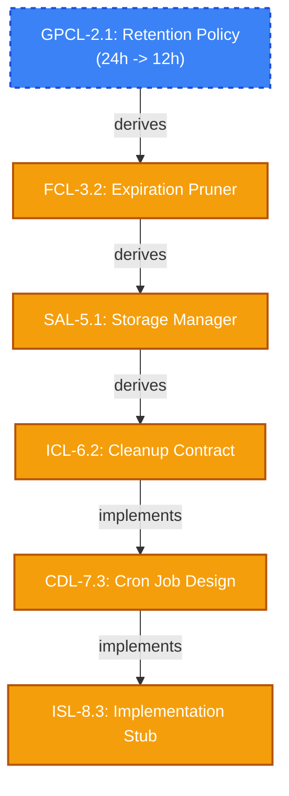

# DDR System v6.3: Comprehensive Tutorial & Demonstration Concepts

> **Status:** Conceptual Brainstorming
> **Target Audience:** Developers, System Architects, Compliance Officers
> **Framework:** DDR System v6.3

## 1. Pedagogical Objective

The goal of this tutorial series is to demonstrate that the **Deterministic Design & Requirements (DDR) System** is not just another documentation format, but a *machine-verifiable, structural guarantee* of system integrity. The tutorial must bridge the gap between high-level architectural theory and concrete, day-to-day developer workflows.

### Key Principles for the Tutorial

- **Show, Don't Just Tell:** Every concept must be tied to a practical artifact in the demonstration project.
- **Visual-First Comprehension:** The DAG topology and state changes (`CLEAN` vs `DIRTY`) should be represented via Mermaid diagrams or high-quality architectural graphics.
- **The "Aha!" Moment:** The tutorial *must* include a requirement change (e.g., a new regulatory constraint) to demonstrate the cascading `DIRTY` mechanics and the `SUPERSEDE` atomic operation preventing out-of-sync implementations.

---

## 2. Ideal Software Project Candidates

To effectively demonstrate DDR v6.3, the project must be simple enough to understand in 5 minutes, yet complex enough to require governance (`GPCL`), architectural boundaries (`SAL`), and strict interface contracts (`ICL`).

### Option A: Distributed IoT Temperature Collector

- **Pros:** Easy interfaces (MQTT/REST), clear physical constraints.
- **Cons:** Hardware constraint layer (`CL`) may alienate some software-only developers who lack hardware context.

### Option B: E-Commerce Tax Calculation Microservice

- **Pros:** Strict governance (tax laws), straightforward contract (`ICL`).
- **Cons:** Too simplistic, purely algorithmic, lacks rich functional capability mappings.

### Option C (Recommended): "VaultLink" - Ephemeral Secure File Sharing

*An API-first service that allows users to upload a file and receive a one-time, time-limited download link (similar to Mozilla Send).*

- **XPD/SIL:** A clear mission—secure, privacy-respecting, untraceable data transfer.
- **GPCL:** Hard requirements on data retention (e.g., "Must mathematically destroy data after 24 hours or single use") and encryption standards.
- **FCL:** Simple capabilities (Upload, Generate Link, Download, Auto-expire).
- **CL:** Strict technical bounds (e.g., "Must not use symmetric keys transmitted over the wire", "Must target AWS S3").
- **Why it wins:** It explicitly requires all 9 canonical tiers, it has undeniable security governance that demands traceability, and a change to the retention policy is incredibly easy to visualize cascading down the DAG constraint precedence hierarchy.

---

## 3. Tutorial Structure & Pacing

A maximally optimized tutorial should be broken into **6 discrete sections (pages)**, ranging from ~1,000 to ~2,000 words each to avoid cognitive overload.

| Page | Title & Focus | Est. Length | Key DDR Concepts Demonstrated | Visual Aid Target |
| --- | --- | --- | --- | --- |
| **1** | **Introduction to Deterministic Design** | 1,000 words | DAG acyclicity, Traceability (AX-1), 9-Tier Topology. | Topological Map (Overall DAG structure mapping to VaultLink). |
| **2** | **Defining Purpose & Governance (G1)** | 1,200 words | `XPD`, `SIL`, `GPCL`. Writing machine-parseable constraints. | Governance Graph (How an external law traces to a `GPCL` node). |
| **3** | **Capabilities & Constraints (G2)** | 1,200 words | `FCL`, `CL`. Mediating quantitative performance metrics. | Capability Map with constraint boundaries bounding the design. |
| **4** | **Architecture & Contracts (G3)** | 1,500 words | `SAL`, `ICL`. The `SAL` merge node exception (joining `FCL` & `CL`). | Architecture Diagram showing `ICL` boundaries & serialization. |
| **5** | **Design & Scaffolding (G4)** | 1,200 words | `CDL`, `ISL`. Creating syntax-valid stubs with Parent ID citations. | Code Block Callouts linking directly to higher-tier abstractions. |
| **6** | **The True Power: Mutations & Lifecycle** | 2,000 words | `MODIFY`, `DIRTY` propagation, `SUPERSEDE` atomicity, Validation. | State Machine Diagram (`ACTIVE` -> `SUPERSEDE_PENDING` -> `DIRTY` cascades). |

---

## 4. Visual Aids & Technical Imagery

Every page **must** feature at least 1 high-quality visual aid. Visuals should utilize color coding to represent state (e.g., Green for `ACTIVE`, Orange for `DIRTY`, Red for `DEPRECATED`, Blue for `SUPERSEDE_PENDING`).

### Example Diagram: The Mutation Cascade (Page 6)

The following Mermaid diagram demonstrates how changing a regulatory constraint inherently invalidates downstream code scaffolding:

> [!TIP]
> **Implementation Note for Visuals:** Use `mermaid` extensively for dynamically generated DAGs because they are text-based and easy to version control. For static assets (landing page art), utilize high-contrast SVG architectures that follow Material Design or IBM Carbon design systems for a premium feel.

---

## 5. Recommended Python Ecosystem Tools for Visualizations & Asset Generation

To craft high-quality, data-driven visual aids and diagrams programmatically based on the DDR System's DAG structure, the following modern Python and ecosystem tools should be investigated and utilized:

### 1. Structural & Architectural Visualization (Diagrams-as-Code)

- **[Diagrams](https://diagrams.mingrammer.com/):** The industry standard for representing cloud infrastructure and component architectures as code.
  - *Best Use Case in DDR:* Generating the `SAL` (Architecture Layer) and `CL` (Constraint Layer) cloud topologies. Enables programmatic syncing between definitions and visual outputs.
- **NetworkX + Pyvis:**
  - *Best Use Case in DDR:* Generating interactive, web-based visualizations of the entire 9-tier DAG. `NetworkX` handles the complex parent-child adjacency processing, while `Pyvis` renders highly interactive, physics-based HTML graphs. Perfect for the "Topological Map" on Page 1.

### 2. High-Fidelity Educational Animation

- **Manim (Community Edition):** The premier mathematical and programmatic animation engine in Python.
  - *Best Use Case in DDR:* Creating cinematic explainer videos or GIFs for "The Mutation Cascade" (Page 6). Manim can perfectly animate a `SUPERSEDE` operation, visually drawing the `DIRTY` status flowing down the hierarchy frame-by-frame.
- **Motion Canvas (TypeScript alternative):** While not Python, it is an exceptional modern engine designed for real-time web-based motion graphics that is highly recommended for creating interactive, timeline-scrubbable educational assets.

### 3. Integrated Markdown / CI-CD Generators

- **Mermaid Integrations (e.g., mermaid-py):** Allowing Python scripts to programmatically ingest the `ddr_system_v6.3.yaml` schema and auto-generate the Mermaid markdown syntax currently mocked up in Section 4.

---

## 6. Maximizing Tutorial Optimization & Engagement

To ensure the tutorial is not just read, but actually applied to future projects, incorporate the following optimization techniques:

1. **Dual-Mode Presentation:** Start by showing the **Express Mode** ("Group") writing style, as v6.3 heavily emphasizes this for solo/small-team adoption. Then, demonstrate practically how `UNBUNDLE_SCAN` and `UNBUNDLE_EXECUTE` transform it into the full canonical graph.
2. **Actionable Command Log Emulation:** Provide mock console output showing a `VERIFY` command reporting a `MISSING_MEDIATOR` or `SUPERSEDE_FAILED`. Treat the command-line interface as an integrated part of the core pedagogical experience, proving that rules are mechanically enforced, not just highly suggested.
3. **Artifact Download Access:** Offer the complete `ddr_system_v6.3.yaml` and the target "VaultLink" YAML/Markdown schemas as a downloadable scaffold bundle at the end of Page 1.
4. **"Common Mistakes" Callouts:** Actively guide users away from structural invalidity using alert boxes.

> [!WARNING]
> **Anti-Pattern Identified in Tutorial:** Writing concrete JSON payloads inside the architecture layer (`SAL`) instead of the contracts layer (`ICL`). The tutorial must explicitly show this mistake being flagged by the `VERIFY` step under execution rule `SAL-E1` ("Must not contain exact data schemas or payload definitions").

## 7. Next Actions for Execution

1. Adopt the **"VaultLink"** project as the official tutorial anchor.
2. Generate the VaultLink `ddr_system_v6.3.yaml` and `.md` mock data (the "golden path" artifacts) to ensure the examples are completely internally consistent before drafting the prose.
3. Draft Page 1 focusing purely on the `Express Mode` entry path to hook users looking for low-friction adoption.
