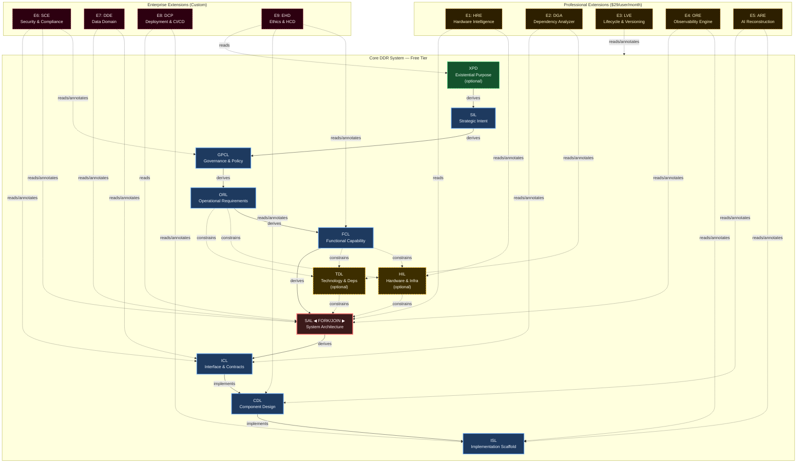

# DDR System Specification v3.1.1

> **Deterministic Design & Requirements System — Authoritative Reference**

| Property  | Value                                    |
| --------- | ---------------------------------------- |
| Version   | 3.1.1                                    |
| Status    | Finalized                                |
| Date      | 2026-02-26                               |
| Scope     | Systems-, language-, and domain-agnostic |
| Authority | DDR Architecture Board                   |

> **Single Source of Truth.** This document is the exclusive normative specification for the DDR System. All prior versions are superseded. No conversation record, partial specification, or derivative document carries normative weight.

---

## 1. Foundational Axioms

| ID   | Axiom                 | Statement                                                                                                                | Implication                                                                   |
| ---- | --------------------- | ------------------------------------------------------------------------------------------------------------------------ | ----------------------------------------------------------------------------- |
| AX-1 | Traceability          | Every non-root node must cite at least one parent via a typed edge                                                       | Complete audit trails from intent to implementation; no orphaned requirements |
| AX-2 | Abstraction Ordering  | Technology and implementation specificity are deferred until logically necessary                                         | No technology references above the Constraint tiers                           |
| AX-3 | Determinism           | Identical inputs produce unambiguous, mechanically verifiable outputs                                                    | Automated validation and compliance checking are possible                     |
| AX-4 | Universality          | The Core applies to all software systems regardless of domain, scale, or technology                                      | No domain-specific assumptions in any Core tier                               |
| AX-5 | Extensibility         | Advanced analytical capabilities are delivered exclusively via optional Extensions                                       | Core remains stable under Extension addition, modification, or removal        |
| AX-6 | Declarative Integrity | The Core is strictly declarative; all inference, optimization, and automated recommendation are Extension-only behaviors | Core structural invariants cannot be destabilized by analytical logic         |
| AX-7 | DAG Acyclicity        | No citation chain may produce a cycle; causality flows in one direction only                                             | Graph traversal is always terminable                                          |

---

## 2. DAG Internal Model

### 2.1 Node Schema

| Property                | Type           | Description                                                        |
| ----------------------- | -------------- | ------------------------------------------------------------------ |
| `id`                    | `TIER-N.M`     | Immutable on assignment; superseded nodes retain their original ID |
| `tier`                  | Enum           | One of: XPD, SIL, GPCL, ORL, FCL, HIL, TDL, SAL, ICL, CDL, ISL     |
| `title`                 | String         | Human-readable artifact label                                      |
| `content`               | Text           | Body constrained by the tier's atomic ruleset                      |
| `parent_ids`            | List\[String\] | ≥1 for all non-root nodes; typed by edge                           |
| `status`                | Enum           | `DRAFT` \| `ACTIVE` \| `DIRTY` \| `DEPRECATED` \| `SUPERSEDED`     |
| `version`               | SemVer         | Content version string                                             |
| `created`               | ISO 8601       | Creation timestamp                                                 |
| `modified`              | ISO 8601       | Last modification timestamp                                        |
| `extension_annotations` | Map            | Read-only Extension metadata; never modifies `content`             |

### 2.2 Edge Types

| Type         | Symbol             | Semantics                                                              |
| ------------ | ------------------ | ---------------------------------------------------------------------- |
| `derives`    | `──derives──▶`     | Child content derived from parent requirements                         |
| `constrains` | `╌╌constrains╌▶`   | Parent sets enforceable limits on child's design space                 |
| `implements` | `──implements──▶`  | Child provides concrete realization of parent's abstract specification |
| `cites`      | `╌╌cites╌╌╌╌╌▶`    | Child references parent for traceability without full derivation       |
| `annotates`  | `···annotates···▶` | Extension adds metadata to Core node without modifying it              |
| `reads`      | `···reads···▶`     | Extension accesses Core node content for analysis                      |

### 2.3 Universal Node Format

All tiers share this format. Tier-specific content is governed by the atomic ruleset in Section 4.

```text
[TIER]-[N].[M]: [Title]
  status:     ACTIVE | DRAFT | DIRTY | DEPRECATED | SUPERSEDED
  version:    [SemVer]
  created:    [ISO 8601]
  modified:   [ISO 8601]
  parent_ids: [[TIER-N.M], ...]   ← empty only for root nodes

  [Tier-compliant content body]
```

### 2.4 Core DAG Topology

```text
  [OPTIONAL ROOT]
  ┌──────────────────────────────────────────────┐
  │  XPD — Existential Purpose Document          │  ← Activate when ethical_impact ≠ none
  │  "What human need and ethical limits exist?" │    OR societal_scale > personal
  └───────────────────────┬──────────────────────┘
                          │ derives (if active)
  [INTENT LAYER]          ▼
  ┌──────────────────────────────────────────────┐
  │  SIL — Strategic Intent Layer                │  ← Root when XPD inactive
  │  "Why does this system exist?"               │
  └───────────────────────┬──────────────────────┘
                          │ derives
  [GOVERNANCE LAYER]      ▼
  ┌──────────────────────────────────────────────┐
  │  GPCL — Governance & Policy Constraint Layer │
  │  "What external mandates govern this system?"│
  └───────────────────────┬──────────────────────┘
                          │ derives
  [REQUIREMENTS LAYER]    ▼
  ┌──────────────────────────────────────────────┐
  │  ORL — Operational Requirements Layer        │
  │  "What measurable thresholds must be met?"   │
  └───────────────────────┬──────────────────────┘
                          │ derives
  [FUNCTIONAL LAYER]      ▼
  ┌──────────────────────────────────────────────┐
  │  FCL — Functional Capability Layer           │
  │  "What user-observable behaviors are needed?"│
  └──────────────┬─────────────────┬─────────────┘
                 │ constrains      │ constrains
  [CONSTRAINT LAYER — FORK: two independent, orthogonal constraint sources]
       ┌──────────▼──────┐   ┌─────▼──────────┐
       │  HIL (optional) │   │  TDL (optional)│  ← Independent; do not cite each other
       │  Hardware &     │   │  Technology &  │
       │  Infra Layer    │   │  Deps Layer    │
       └──────────┬──────┘   └─────┬──────────┘
                  │ constrains      │ constrains
  [ARCHITECTURE LAYER — JOIN: all constraints resolved at SAL]
                  └────────┬────────┘
                           ▼
  ┌──────────────────────────────────────────────┐
  │  SAL — System Architecture Layer             │
  │  "How is the system structurally decomposed?"│  ← Fork-join resolution point
  └───────────────────────┬──────────────────────┘
                          │ derives
  [CONTRACT LAYER]        ▼
  ┌──────────────────────────────────────────────┐
  │  ICL — Interface & Contracts Layer           │
  │  "What formal contracts govern data exchange?"│
  └───────────────────────┬──────────────────────┘
                          │ implements
  [DESIGN LAYER]          ▼
  ┌──────────────────────────────────────────────┐
  │  CDL — Component Design Layer                │
  │  "What are the component structural blueprints?"│
  └───────────────────────┬──────────────────────┘
                          │ implements
  [SCAFFOLD LAYER]        ▼
  ┌──────────────────────────────────────────────┐
  │  ISL — Implementation Scaffold Layer         │
  │  "What traceable stubs initiate coding?"     │  ← Terminal leaf; no Core children
  └──────────────────────────────────────────────┘

  LEGEND:
  ──────────▶  derives / implements edge
  - - - - -▶  constrains edge
```

### 2.5 DAG Invariants

- No cycles permitted at any path length
- No tier-skipping (each citation references exactly one tier above)
- HIL and TDL do not derive from each other; they are strictly parallel and orthogonal
- XPD, HIL, and TDL are conditionally activatable; the Core is valid and complete without any of them
- When HIL and TDL are both inactive, SAL derives directly from FCL
- All non-root nodes must carry at least one `parent_id` citation

### 2.6 Node ID Format

```text
[TIER]-[SECTION].[ITEM]    →  SIL-1.3 | ORL-2.1 | CDL-12.5
XPD nodes                  →  XPD-0.N  (no sections; section = 0)
CRRs                       →  CRR-N
```

IDs are **immutable once assigned.** A superseded node retains its original ID with `status: SUPERSEDED`; the replacement receives a new ID.

### 2.7 Citation Rules

| Rule   | Statement                                                                                              |
| ------ | ------------------------------------------------------------------------------------------------------ |
| CIT-R1 | Every non-root node must have ≥1 `parent_id`                                                           |
| CIT-R2 | `parent_ids` must reference nodes exactly one tier above in the derivation path                        |
| CIT-R3 | HIL/TDL → SAL constraint edges are recorded in `parent_ids` with edge type `constrains`                |
| CIT-R4 | An inline `[TIER-N.M]` citation in node content must have a matching entry in `parent_ids`             |
| CIT-R5 | Extension `annotates`/`reads` edges are stored in `extension_annotations` only — never in `parent_ids` |

---

## 3. Consumption Modes

| Mode                   | Description                                                 | Best Fit                                  |
| ---------------------- | ----------------------------------------------------------- | ----------------------------------------- |
| **Express (5 Groups)** | Adjacent tiers bundled into groups; expandable via UNBUNDLE | Small-to-medium projects                  |
| **Full (10+ Tiers)**   | Every tier independently specified                          | Complex, regulated, or enterprise systems |

Express Mode is not a reduced system — it is Full Mode with grouped presentation. The UNBUNDLE operation expands any group into its constituent tiers without information loss or invention.

### Express Mode Group Map

| Group | Tiers Bundled               | Label                          |
| ----- | --------------------------- | ------------------------------ |
| G1    | XPD (opt) + SIL + GPCL      | Purpose, Strategy & Governance |
| G2    | ORL + FCL                   | Requirements                   |
| G3    | HIL (opt) + TDL (opt) + SAL | Architecture & Constraints     |
| G4    | ICL + CDL                   | Design                         |
| G5    | ISL                         | Scaffolding                    |

---

## 4. Tier Specifications

---

### Tier 0 — XPD: Existential Purpose Document *(Optional)*

**Core Question:** "What human or societal need does this system exist to address, and what ethical boundaries govern all downstream decisions?"

**Activate when:** `ethical_impact ≠ none` OR `societal_scale > personal`. Required for AI/ML, healthcare, civic, and public-facing systems. Skippable for internal tooling with no external effect.

**Parent:** None (root when active). **Edge to child:** `derives` → SIL

#### Atomic Inclusion Rules

| Rule   | Statement                                                                         | Violation Consequence                   |
| ------ | --------------------------------------------------------------------------------- | --------------------------------------- |
| XPD-R1 | Must articulate a fundamental human or societal need being addressed              | Downstream tiers lack ethical grounding |
| XPD-R2 | Must be immutable across the project lifecycle; changes require a new XPD version | Scope drift; mission confusion          |
| XPD-R3 | Must be comprehensible to non-technical stakeholders without a glossary           | Stakeholder misalignment                |
| XPD-R4 | Must establish ethical boundary conditions all subsequent tiers must satisfy      | Unethical design without detection      |
| XPD-R5 | Must define success criteria independent of implementation metrics                | Wrong success measurement               |
| XPD-R6 | Must identify populations who could be harmed and the safeguards required         | Harm by omission                        |

#### Atomic Exclusion Rules

| Rule   | Statement                                                                         |
| ------ | --------------------------------------------------------------------------------- |
| XPD-E1 | Must not contain solution concepts, technology references, or architectural ideas |
| XPD-E2 | Must not contain quantitative performance targets (→ ORL)                         |
| XPD-E3 | Must not contain regulatory or legal constraints (→ GPCL)                         |

---

### Tier 1 — SIL: Strategic Intent Layer

**Core Question:** "Why does this system exist, and what business outcomes must it achieve?"

**Parent:** XPD (if active) or none (root if XPD skipped). **Edge to child:** `derives` → GPCL

#### SIL: Atomic Inclusion Rules

| Rule   | Statement                                                                                    | Violation Consequence                   |
| ------ | -------------------------------------------------------------------------------------------- | --------------------------------------- |
| SIL-R1 | Must define the core business problem or opportunity being addressed                         | GPCL/ORL will lack strategic anchor     |
| SIL-R2 | Must specify strategic objectives with measurable outcomes                                   | Unmeasurable success criteria           |
| SIL-R3 | Must identify all stakeholder categories and their value propositions                        | Misaligned delivery priorities          |
| SIL-R4 | Must establish explicit scope boundaries (in-scope and out-of-scope)                         | Uncontrolled scope creep                |
| SIL-R5 | Must define organizational success metrics                                                   | Inability to declare completion         |
| SIL-R6 | Must be stable under technology changes; content must not be invalidated by a framework swap | Technology coupling at the intent level |

#### SIL: Atomic Exclusion Rules

| Rule   | Statement                                                                |
| ------ | ------------------------------------------------------------------------ |
| SIL-E1 | Must not reference hardware, technology stacks, frameworks, or languages |
| SIL-E2 | Must not contain regulatory mandates or compliance requirements (→ GPCL) |
| SIL-E3 | Must not prescribe architectural patterns or implementation strategies   |
| SIL-E4 | Must not contain quantitative performance metrics (→ ORL)                |

---

### Tier 2 — GPCL: Governance & Policy Constraint Layer

**Core Question:** "What non-negotiable external mandates, regulatory obligations, and policy constraints govern this system?"

**Rationale for isolation from SIL:** Governance constraints originate from external authorities — not organizational intent. They are non-negotiable, externally mandated, and persist regardless of strategic pivots. They evolve with legal landscapes; SIL evolves with the business. Conflating them obscures their different change velocities and legal weight.

**Parent:** `derives` ← SIL. **Edge to child:** `derives` → ORL

#### GPCL: Atomic Inclusion Rules

| Rule    | Statement                                                                       | Violation Consequence                     |
| ------- | ------------------------------------------------------------------------------- | ----------------------------------------- |
| GPCL-R1 | Must enumerate all applicable regulatory frameworks with jurisdiction and scope | Compliance gaps leading to legal exposure |
| GPCL-R2 | Must specify enforceable, testable constraints — not aspirational targets       | Non-verifiable compliance claims          |
| GPCL-R3 | Must identify contractual obligations imposed by third-party relationships      | Contract breach by design                 |
| GPCL-R4 | Must define data sovereignty and residency requirements                         | Data law violations                       |
| GPCL-R5 | Must specify audit and record-retention mandates                                | Regulatory audit failure                  |
| GPCL-R6 | Must cite parent SIL IDs for each constraint, establishing the business context | Orphaned compliance requirements          |

#### GPCL: Atomic Exclusion Rules

| Rule    | Statement                                                             |
| ------- | --------------------------------------------------------------------- |
| GPCL-E1 | Must not contain performance metrics or SLA targets (→ ORL)           |
| GPCL-E2 | Must not contain technology selections or architectural prescriptions |
| GPCL-E3 | Must not contain business objectives or success metrics (→ SIL)       |

---

### Tier 3 — ORL: Operational Requirements Layer

**Core Question:** "What are the measurable, non-functional thresholds the system must satisfy to be acceptable?"

**Parent:** `derives` ← GPCL. **Edges to children:** `constrains` → HIL (if active); `constrains` → TDL (if active); `derives` → FCL

#### ORL: Atomic Inclusion Rules

| Rule   | Statement                                                                          | Violation Consequence                                          |
| ------ | ---------------------------------------------------------------------------------- | -------------------------------------------------------------- |
| ORL-R1 | All requirements must be quantifiable and verifiable via automated or manual tests | Untestable acceptance criteria                                 |
| ORL-R2 | Must specify performance targets: latency, throughput, concurrency ceilings        | Architecture unable to satisfy operational demands             |
| ORL-R3 | Must specify reliability and availability targets (SLAs, RTO, RPO)                 | Unacceptable service degradation                               |
| ORL-R4 | Must specify security requirements expressed technology-neutrally                  | Security specification that becomes stale on technology change |
| ORL-R5 | Must specify scalability requirements                                              | Architecture unable to grow                                    |
| ORL-R6 | Must specify accessibility requirements (e.g., WCAG 2.1 AA)                        | Compliance violations and user exclusion                       |
| ORL-R7 | Compliance-driven requirements must cite parent GPCL IDs                           | Orphaned compliance-driven requirements                        |

#### ORL: Atomic Exclusion Rules

| Rule   | Statement                                                 |
| ------ | --------------------------------------------------------- |
| ORL-E1 | Must not specify technology frameworks or library choices |
| ORL-E2 | Must not describe functional system behaviors (→ FCL)     |
| ORL-E3 | Must not contain hardware specifications (→ HIL)          |

---

### Tier 4 — FCL: Functional Capability Layer

**Core Question:** "What externally observable behaviors and user-facing capabilities must the system provide?"

**Parent:** `derives` ← ORL. **Fork point** when HIL or TDL active; `derives` → SAL when neither active.

#### FCL: Atomic Inclusion Rules

| Rule   | Statement                                                                                | Violation Consequence                                           |
| ------ | ---------------------------------------------------------------------------------------- | --------------------------------------------------------------- |
| FCL-R1 | Must describe capabilities from the perspective of a user or external system             | Internal implementation details contaminate the functional spec |
| FCL-R2 | Must specify user workflows end-to-end without naming components, classes, or modules    | Premature structural coupling                                   |
| FCL-R3 | Must define event-driven behaviors and conditional business logic rules                  | Missing behavioral specification                                |
| FCL-R4 | Must specify user-observable state transitions and error conditions                      | Incomplete behavioral model                                     |
| FCL-R5 | Must be decomposable into sub-capabilities (parent-child FCL nodes) for complex features | Monolithic feature specs that resist traceability               |
| FCL-R6 | Must cite parent ORL IDs for capabilities that satisfy an operational requirement        | Disconnected functional requirements                            |

#### FCL: Atomic Exclusion Rules

| Rule   | Statement                                                                  |
| ------ | -------------------------------------------------------------------------- |
| FCL-E1 | Must not name specific classes, modules, APIs, or algorithms               |
| FCL-E2 | Must not specify network protocols, serialization formats, or data schemas |
| FCL-E3 | Must not specify hardware requirements or infrastructure topology          |

---

### Tier 5a — HIL: Hardware & Infrastructure Layer *(Conditionally Activatable)*

**Core Question:** "What are the declared hardware envelopes and infrastructure ceilings within which the system must operate?"

**Activate when:** system targets specific hardware (embedded, edge, HPC, IoT) or infrastructure constraints are non-negotiable (on-premise, air-gapped, sovereign cloud). Activatable at any point; SAL absorbs HIL constraints immediately on activation.

**Core scope is declarative only.** Derivation, inference, cost modeling, and cloud mapping are exclusively Extension behaviors (HRE).

**Parents:** `constrains` ← FCL; `constrains` ← ORL. **Edge to child:** `constrains` → SAL

#### HIL: Atomic Inclusion Rules

| Rule   | Statement                                                                                           | Violation Consequence                                 |
| ------ | --------------------------------------------------------------------------------------------------- | ----------------------------------------------------- |
| HIL-R1 | Must declare minimum hardware envelopes (CPU class, RAM floor, storage, GPU if applicable)          | Architecture that exceeds target hardware             |
| HIL-R2 | Must declare infrastructure ceilings (compute budget, storage cap, bandwidth cap)                   | Cost overruns from unconstrained architecture         |
| HIL-R3 | Must specify deployment topology declarations (on-premise, cloud-agnostic, hybrid, edge)            | Architecture incompatible with deployment target      |
| HIL-R4 | Must specify network topology constraints (air-gapped, restricted egress, inter-zone latency SLAs)  | Architecture with unachievable networking assumptions |
| HIL-R5 | Must cite parent ORL IDs for each constraint derived from a performance or availability requirement | Orphaned infrastructure constraints                   |

#### HIL: Atomic Exclusion Rules

| Rule   | Statement                                                                           |
| ------ | ----------------------------------------------------------------------------------- |
| HIL-E1 | Must not auto-derive, infer, or recommend hardware configurations (→ HRE Extension) |
| HIL-E2 | Must not contain cost models or TCO calculations (→ HRE Extension)                  |
| HIL-E3 | Must not contain technology stack selections (→ TDL)                                |

---

### Tier 5b — TDL: Technology & Dependency Layer *(Conditionally Activatable)*

**Core Question:** "What are the declared technology selections and ecosystem dependencies that bound the system's implementation?"

**Activate when:** specific technology choices are non-negotiable (mandated by client, regulation, existing ecosystem, or strategic platform decision). Optional when full technology freedom is preserved into the architecture phase.

**HIL ∥ TDL orthogonality:** HIL and TDL are independent. A project may activate either, both, or neither. They do not constrain each other — each independently constrains SAL.

**Parents:** `constrains` ← FCL; `constrains` ← ORL. **Edge to child:** `constrains` → SAL

#### TDL: Atomic Inclusion Rules

| Rule   | Statement                                                                                      | Violation Consequence                                |
| ------ | ---------------------------------------------------------------------------------------------- | ---------------------------------------------------- |
| TDL-R1 | Must declare approved programming languages with version constraints                           | Incompatible implementations                         |
| TDL-R2 | Must declare mandatory frameworks and core libraries with minimum version bounds               | Dependency drift                                     |
| TDL-R3 | Must declare required external service contracts without their internal implementation details | Integration gaps                                     |
| TDL-R4 | Must declare runtime environment constraints (OS, container runtime, execution environment)    | Deployment environment incompatibility               |
| TDL-R5 | Must explicitly declare prohibited technologies with rationale                                 | License compliance violations                        |
| TDL-R6 | Must cite FCL or ORL IDs for each mandated technology choice                                   | Technology selections untraceable to a business need |

#### TDL: Atomic Exclusion Rules

| Rule   | Statement                                                                                               |
| ------ | ------------------------------------------------------------------------------------------------------- |
| TDL-E1 | Must not contain dependency resolution, compatibility analysis, or conflict detection (→ DGA Extension) |
| TDL-E2 | Must not specify hardware or infrastructure constraints (→ HIL)                                         |
| TDL-E3 | Must not contain functional system behaviors                                                            |

---

### Tier 6 — SAL: System Architecture Layer

**Core Question:** "How is the system structurally decomposed, and what patterns govern component interaction?"

**Join node.** SAL must satisfy all incoming constraints simultaneously. HIL∥TDL conflicts require a CRR (see Section 5.2).

**Parents:** `derives` ← FCL (always); `constrains` ← HIL (if active); `constrains` ← TDL (if active). **Edge to child:** `derives` → ICL

#### SAL: Atomic Inclusion Rules

| Rule   | Statement                                                                                                   | Violation Consequence                                   |
| ------ | ----------------------------------------------------------------------------------------------------------- | ------------------------------------------------------- |
| SAL-R1 | Must define the overarching architectural pattern(s) with rationale                                         | No structural framework for downstream design           |
| SAL-R2 | Must specify system decomposition into major subsystems with ownership boundaries                           | Ambiguous component responsibilities                    |
| SAL-R3 | Must specify inter-subsystem communication patterns (synchronous, asynchronous, pub-sub, RPC)               | Integration design without architectural mandate        |
| SAL-R4 | Must specify concurrency model and data ownership rules                                                     | Race conditions and data integrity violations by design |
| SAL-R5 | Must specify failure isolation and resilience boundaries (circuit breakers, bulkheads, fallback strategies) | Cascading failure scenarios in the architecture         |
| SAL-R6 | Must cite all active parent IDs (FCL + HIL if active + TDL if active) for each major architectural decision | Architectural decisions without traceable justification |

#### SAL: Atomic Exclusion Rules

| Rule   | Statement                                                          |
| ------ | ------------------------------------------------------------------ |
| SAL-E1 | Must not contain exact data schemas or payload definitions (→ ICL) |
| SAL-E2 | Must not contain class-level component blueprints (→ CDL)          |
| SAL-E3 | Must not contain executable code                                   |

---

### Tier 7 — ICL: Interface & Contracts Layer

**Core Question:** "What are the formal, machine-verifiable contracts governing data exchange between system boundaries?"

**Parent:** `derives` ← SAL. **Edge to child:** `implements` → CDL

#### ICL: Atomic Inclusion Rules

| Rule   | Statement                                                                                     | Violation Consequence                              |
| ------ | --------------------------------------------------------------------------------------------- | -------------------------------------------------- |
| ICL-R1 | Must define all inter-component and external API contracts with complete input/output schemas | Implementations that diverge at integration points |
| ICL-R2 | All schemas must be machine-parseable (JSON Schema, Protobuf, OpenAPI, or equivalent)         | Contracts that cannot be mechanically validated    |
| ICL-R3 | Must specify serialization formats, encoding standards, and wire protocols per contract       | Interoperability failures from encoding mismatches |
| ICL-R4 | Must specify mandatory fields, optional fields, type constraints, and validation rules        | Runtime failures from malformed payloads           |
| ICL-R5 | Must specify error response contracts (error codes, payload structure, retry behavior)        | Undefined failure behavior at system boundaries    |
| ICL-R6 | Must specify versioning strategy per contract (backward compatibility, deprecation protocol)  | Breaking changes without migration path            |
| ICL-R7 | Must cite SAL IDs for each contract, establishing which architectural boundary it governs     | Contracts without architectural justification      |

#### ICL: Atomic Exclusion Rules

| Rule   | Statement                                                              |
| ------ | ---------------------------------------------------------------------- |
| ICL-E1 | Must not contain internal component state management or business logic |
| ICL-E2 | Must not specify architectural routing patterns (→ SAL)                |
| ICL-E3 | Must not contain class or module blueprints (→ CDL)                    |

---

### Tier 8 — CDL: Component Design Layer

**Core Question:** "What are the structural blueprints of individual components — their public interfaces, internal state, and responsibilities?"

**Parent:** `implements` ← ICL. **Edge to child:** `implements` → ISL

#### CDL: Atomic Inclusion Rules

| Rule   | Statement                                                                                           | Violation Consequence                               |
| ------ | --------------------------------------------------------------------------------------------------- | --------------------------------------------------- |
| CDL-R1 | Must define component names, logical responsibilities, and ownership boundaries                     | Ambiguous implementation targets                    |
| CDL-R2 | Must specify all public method/function signatures (name, parameter types, return type, exceptions) | Implementations that violate the declared interface |
| CDL-R3 | Must specify internal state structures as a logical model — not implementation                      | Hidden state dependencies between components        |
| CDL-R4 | Must specify component dependencies (consumed components and ICL contracts)                         | Circular dependencies introduced at implementation  |
| CDL-R5 | Must map each component to the ICL contracts it implements                                          | Components without contractual grounding            |
| CDL-R6 | Must specify initialization, lifecycle, and teardown contracts for stateful components              | Resource leaks and initialization-order bugs        |

#### CDL: Atomic Exclusion Rules

| Rule   | Statement                                                            |
| ------ | -------------------------------------------------------------------- |
| CDL-E1 | Must not contain executable code bodies or algorithm implementations |
| CDL-E2 | Must not contain system-wide architectural patterns (→ SAL)          |
| CDL-E3 | Must not contain data serialization schemas (→ ICL)                  |

---

### Tier 9 — ISL: Implementation Scaffold Layer

**Core Question:** "What is the minimal, structurally valid, traceable scaffolding required to initiate implementation?"

**Parent:** `implements` ← CDL. **Terminal leaf — no Core children.**

#### ISL: Atomic Inclusion Rules

| Rule   | Statement                                                                                                                                    | Violation Consequence                                         |
| ------ | -------------------------------------------------------------------------------------------------------------------------------------------- | ------------------------------------------------------------- |
| ISL-R1 | Must produce syntactically valid structural scaffolding in the target language (classes, interfaces, function stubs with `pass`/`{}` bodies) | Scaffolding that fails to compile or parse                    |
| ISL-R2 | Must embed docstrings or code comments with explicit parent DDR node IDs (e.g., `# CDL-3.2, ICL-1.4`)                                        | Implementations without traceability to design decisions      |
| ISL-R3 | Must include implementation hints as structured comments (e.g., `# IMPL: Apply strategy pattern from SAL-2.1`)                               | Implementers who lose architectural context at the code level |
| ISL-R4 | Must not contain business logic; all function/method bodies must be stubs                                                                    | Pre-implementation contamination of the scaffold              |
| ISL-R5 | Must be language-specific — one ISL node per target language/runtime when multiple are declared in TDL                                       | Language-ambiguous stubs                                      |
| ISL-R6 | Must cite CDL parent IDs for every stub                                                                                                      | Orphaned scaffolding                                          |

#### ISL: Atomic Exclusion Rules

| Rule   | Statement                                                       |
| ------ | --------------------------------------------------------------- |
| ISL-E1 | Must not contain complete algorithmic logic                     |
| ISL-E2 | Must not contain infrastructure configuration (→ DCP Extension) |

---

## 5. Constraint Precedence & Conflict Resolution

### 5.1 Tier Precedence Order

When two tiers produce conflicting constraints on a downstream tier, precedence governs resolution (highest to lowest):

| Priority | Tier | Rationale                                                      |
| -------- | ---- | -------------------------------------------------------------- |
| 1        | XPD  | Ethical boundary conditions are inviolable                     |
| 2        | GPCL | External regulatory mandates are non-negotiable                |
| 3        | SIL  | Strategic intent defines the purpose of all design decisions   |
| 4        | ORL  | Quantitative operational thresholds must be satisfiable        |
| 5        | HIL  | Physical infrastructure constraints are external and fixed     |
| 6        | TDL  | Technology selections are bounded by physical constraints      |
| 7        | FCL  | Functional requirements operate within the constraint envelope |
| 8        | SAL  | Architecture is bounded by all above                           |
| 9        | ICL  | Contracts derive from architecture                             |
| 10       | CDL  | Design derives from contracts                                  |
| 11       | ISL  | Scaffolding derives from design                                |

Higher-priority tiers override lower-priority tiers. A GPCL–SIL conflict is resolved in favor of GPCL. A HIL–TDL conflict is resolved in favor of HIL.

### 5.2 Fork Conflict Resolution Protocol

Conflicts between HIL and TDL constraints arriving at SAL require a **Constraint Reconciliation Record (CRR)**:

```text
CRR-[N]: [Title]
  conflicting_constraints:
    - hil_id:  HIL-[X].[Y]   (e.g., "Maximum 4 GB RAM per process")
    - tdl_id:  TDL-[A].[B]   (e.g., "Must use Python 3.12 with full standard library")
  conflict_description: [Description of the incompatibility]
  resolution:            [Decision and rationale]
  resolved_by:           HIL | TDL | Negotiated
  sal_impact:            [How SAL is modified to satisfy the resolution]
  parent_ids:            [HIL-X.Y, TDL-A.B]
```

CRRs are mandatory when a fork conflict is detected. The reconciliation workflow automatically flags SAL as `DIRTY` when a CRR is created or modified. No SAL node in conflict state may be set to `ACTIVE` until its CRR is resolved.

### 5.3 XPD Ethical Override

XPD constraints function as **absolute veto rights** over any downstream decision. If a proposed SAL, ICL, or CDL node violates an XPD ethical boundary, the violation must be escalated to the Architecture Board before the node can be set to `ACTIVE`. No automation may approve an XPD-override resolution.

---

## 6. Formal ID & Citation Scheme

### 6.1 Node ID Format

```text
[TIER]-[SECTION].[ITEM]

  SIL-1.3     →  SIL tier, section 1, item 3
  ORL-2.1     →  ORL tier, section 2, item 1
  CDL-12.5    →  CDL tier, section 12, item 5
  XPD-0.1     →  XPD tier, item 1 (section always 0)
  CRR-1       →  Constraint Reconciliation Record 1
```

### 6.2 Citation Format

```text
[TIER-N.M]               →  single parent
[TIER-N.M, TIER-P.Q]     →  multiple parents
```

Example: *"This architectural boundary derives from the microservices mandate \[SAL-2.1\] and the latency ceiling \[ORL-1.3\], with the API contract defined in \[ICL-3.1\]."*

---

## 7. Atomic Operations Protocol

### 7.1 Core Operations

| Operation                | Description                                                                    | Validation Trigger                                                            |
| ------------------------ | ------------------------------------------------------------------------------ | ----------------------------------------------------------------------------- |
| **INSERT**               | Create node with auto-assigned ID, `parent_ids`, and tier-compliant content    | Full atomic ruleset; parent existence; DAG cycle detection                    |
| **DELETE**               | Remove node; cascade orphan detection to children                              | Children → `DIRTY`; manifest updated; CRR required if children exist          |
| **MODIFY**               | Update content; version incremented                                            | Re-validate ruleset; re-check citations; DIRTY propagation to all descendants |
| **RELOCATE**             | Move node within same tier                                                     | ID updated; all citations to old ID flagged                                   |
| **ABSTRACT**             | Derive parent from existing child (reverse engineering)                        | New parent satisfies tier above; edge typed; cycle detection                  |
| **CONCRETIZE**           | Derive child from existing parent (forward design)                             | New child satisfies tier below; full ruleset validation                       |
| **VERIFY**               | Traverse DAG downward; validate citation chains, edge types, and ID references | Returns `CLEAN` or `DIRTY` with itemized violations                           |
| **VALIDATE**             | Check single node against its tier's full atomic ruleset                       | Returns pass/fail with specific violated rule IDs                             |
| **DETECT ORPHAN**        | Scan full graph for non-root nodes with empty `parent_ids`                     | Reports all orphaned node IDs                                                 |
| **DETECT CONTAMINATION** | Scan all nodes for atomic exclusion rule violations                            | Reports contamination by node ID and rule ID                                  |
| **UNBUNDLE**             | Expand Express Mode group into constituent Full Mode tiers                     | Content allocated to correct tiers; `parent_ids` preserved                    |

### 7.2 Dirty Flag Triggers

| Trigger                                 | Nodes Affected                            |
| --------------------------------------- | ----------------------------------------- |
| Node modified                           | Modified node + all descendants           |
| Node deleted                            | All former children of the deleted node   |
| Node inserted                           | New node (until validated)                |
| Parent → `SUPERSEDED`                   | All children citing the superseded parent |
| HIL or TDL constraint added or modified | SAL + all SAL descendants                 |
| XPD ethical boundary modified           | All tiers (full re-validation required)   |

### 7.3 Resolution Workflow

```text
DETECT CHANGE → SET DIRTY → SCAN DOWNSTREAM
  → GENERATE PENDING ITEMS (node ID + violated rule ID + suggested operation)
  → EXECUTE OPERATION → VERIFY → SET CLEAN | REPEAT
```

The reconciliation manifest tracks: total node count by tier; `ACTIVE`/`DIRTY`/`DRAFT`/`DEPRECATED` counts; pending items list; last full validation timestamp; active Extensions and annotation counts.

---

## 8. Extension System

### 8.1 Architecture

Extensions are **orthogonal read-only overlays** attaching to the Core DAG along a Z-axis perpendicular to the tier hierarchy. They intersect specific Core nodes via `reads` and `annotates` edges exclusively.

**Extensions may:**

- Read Core nodes via `reads` edges
- Annotate Core nodes via `annotates` edges (stored in `extension_annotations` only — never in `content`)
- Generate derived external artifacts (reports, IaC, recommendations)
- Add advisories to the reconciliation manifest's `extension_advisories` section

**Extensions may not:**

- Modify any Core node's `content`, `parent_ids`, `tier`, or `status`
- Redefine Core tier semantics or atomic rules
- Introduce structural cycles
- Set Core nodes to `DIRTY` (advisories only; no state mutation)

Disabling any Extension leaves the Core valid, complete, and fully operational.

### 8.2 Extension Integration Rules

| Rule   | Statement                                                                                  |
| ------ | ------------------------------------------------------------------------------------------ |
| EXT-R1 | Must declare contract version compatible with DDR-Core-3.x                                 |
| EXT-R2 | Must declare which Core tiers it reads and which it annotates                              |
| EXT-R3 | Annotations must be namespaced by Extension ID (e.g., `HRE::min_hardware_profile`)         |
| EXT-R4 | Extensions update the reconciliation manifest; annotation counts tracked                   |
| EXT-R5 | Disabling an Extension leaves Core `CLEAN`/`DIRTY` status unchanged                        |
| EXT-R6 | Extension-internal derived artifact graphs must maintain their own acyclicity              |
| EXT-R7 | Extension flags appear in `extension_advisories` only; they do not mutate Core node status |

---

## 9. Extension Catalog

### E1 — Hardware Intelligence Extension (HRE)

**Service Tier:** Professional · **Contract:** HRE-1.0 / DDR-Core-3.x

**Purpose:** Activates bidirectional hardware intelligence. Performs bottom-up inference of minimum hardware profiles from ISL/CDL content, validates HIL declarations against architecture (top-down enforcement), generates cloud-instance recommendations, and produces IaC templates.

**Reads:** HIL, ORL, SAL, CDL, ISL
**Annotates:** HIL (`HRE::min_hardware_profile`, `HRE::cloud_recommendation`); SAL (`HRE::compute_budget_utilization`)

| Rule   | Statement                                                                                         |
| ------ | ------------------------------------------------------------------------------------------------- |
| HRE-R1 | Bottom-up inference produces minimum hardware profiles as HIL-compatible declarations             |
| HRE-R2 | Cloud recommendations include ≥2 provider-agnostic instance class options                         |
| HRE-R3 | Top-down enforcement validates that SAL patterns do not exceed HIL ceilings                       |
| HRE-R4 | All recommendations are advisory; they do not override HIL without explicit MODIFY                |
| HRE-R5 | Power and thermal simulation outputs must cite the CDL and ISL nodes from which they were derived |

---

### E2 — Dependency Graph Analyzer (DGA)

**Service Tier:** Professional · **Contract:** DGA-1.0 / DDR-Core-3.x

**Purpose:** Provides full dependency graph analysis, sub-DDR contract management, version conflict detection, compatibility validation across TDL declarations, and transitive dependency mapping.

**Reads:** TDL, ICL, CDL, ISL
**Annotates:** TDL (`DGA::dependency_graph`, `DGA::conflict_report`); ICL (`DGA::contract_compatibility`)

| Rule   | Statement                                                                              |
| ------ | -------------------------------------------------------------------------------------- |
| DGA-R1 | Produces a complete directed dependency graph for all TDL-declared libraries           |
| DGA-R2 | Detects version conflicts with resolution suggestions                                  |
| DGA-R3 | Sub-DDR contract imports validate compatibility with local ICL definitions             |
| DGA-R4 | Sub-DDR contracts imported by reference only; never by content copy                    |
| DGA-R5 | Transitive dependency reports flag all copyleft licenses that could impose constraints |

---

### E3 — Lifecycle & Versioning Engine (LVE)

**Service Tier:** Professional · **Contract:** LVE-1.0 / DDR-Core-3.x

**Purpose:** Manages temporal evolution of the DDR graph: technical debt tracking, migration pathway planning, version control integration, deprecation workflows, and evolution history.

**Reads:** All Core tiers
**Annotates:** All Core tiers (`LVE::version_history`, `LVE::debt_classification`)

| Rule   | Statement                                                                                          |
| ------ | -------------------------------------------------------------------------------------------------- |
| LVE-R1 | Every node modification produces a version history entry with timestamp, author, and rationale     |
| LVE-R2 | Technical debt items classified by tier origin and estimated remediation effort                    |
| LVE-R3 | Deprecation requires a sunset date and migration path before node → `DEPRECATED`                   |
| LVE-R4 | Migration pathways produce a MODIFY or CONCRETIZE operation sequence that preserves traceability   |
| LVE-R5 | Version control integration maps DDR node IDs to VCS commit hashes for implementation traceability |

---

### E4 — Observability & Runtime Engine (ORE)

**Service Tier:** Professional · **Contract:** ORE-1.0 / DDR-Core-3.x

**Purpose:** Bridges the DDR design graph to operational runtime concerns: telemetry instrumentation planning, alerting rule derivation, operational readiness assessment, and production-incident traceability back to design decisions.

**Reads:** ORL, SAL, ICL, ISL
**Annotates:** ISL (`ORE::telemetry_stubs`, `ORE::alert_rules`); SAL (`ORE::observability_topology`)

| Rule   | Statement                                                                            |
| ------ | ------------------------------------------------------------------------------------ |
| ORE-R1 | Telemetry stubs derived from ORL latency and throughput targets                      |
| ORE-R2 | Alert rules expressed in vendor-agnostic format (Prometheus AlertManager compatible) |
| ORE-R3 | Every SAL component must have ≥1 telemetry point for operational readiness           |
| ORE-R4 | Incident-to-design traceability maps runtime anomalies to ISL, CDL, and SAL nodes    |

---

### E5 — AI Upward Reconstruction Engine (ARE)

**Service Tier:** Professional · **Contract:** ARE-1.0 / DDR-Core-3.x

**Purpose:** Enables reverse-engineering of higher-tier DDR nodes from lower-tier content or existing codebases. Infers DRAFT-status parent nodes from ISL, CDL, and ICL content; surfaces candidates for human review and promotion.

**Reads:** ISL, CDL, ICL, SAL
**Annotates:** All tiers (`ARE::inferred_draft`, `ARE::confidence_score` \[0.0–1.0\])

| Rule   | Statement                                                                                                       |
| ------ | --------------------------------------------------------------------------------------------------------------- |
| ARE-R1 | All inferred nodes created with `status: DRAFT`; automatic promotion to `ACTIVE` prohibited                     |
| ARE-R2 | Each inferred node carries `ARE::confidence_score` derived from quality of source evidence                      |
| ARE-R3 | Inferred parent-child citations are provisional until human validation                                          |
| ARE-R4 | ABSTRACT operation required to formalize any ARE-inferred node; triggers full atomic ruleset validation         |
| ARE-R5 | ARE must never autonomously create XPD or GPCL nodes — ethical and regulatory content requires human authorship |

---

### E6 — Security & Compliance Engine (SCE)

**Service Tier:** Enterprise · **Contract:** SCE-1.0 / DDR-Core-3.x

**Purpose:** Maps threat models, trust boundaries, RBAC matrices, regulatory compliance evidence, and privacy-by-design audits across the Core DAG. Flags manifest when proposed architectural decisions violate security invariants.

**Reads:** GPCL, ORL, TDL, SAL, ICL
**Annotates:** GPCL (`SCE::compliance_evidence`); SAL (`SCE::threat_model`, `SCE::trust_boundaries`); ICL (`SCE::rbac_matrix`)

| Rule   | Statement                                                                                                   |
| ------ | ----------------------------------------------------------------------------------------------------------- |
| SCE-R1 | Threat models expressed in STRIDE format or equivalent structured notation                                  |
| SCE-R2 | Trust boundary violations in SAL flagged as high-priority advisories                                        |
| SCE-R3 | Every ICL contract must have an explicit RBAC access control policy                                         |
| SCE-R4 | PII data flows enumerated in ICL and traceable to GPCL data-residency constraints                           |
| SCE-R5 | Compliance evidence records are immutable once generated and cite the specific GPCL regulation they satisfy |
| SCE-R6 | Security advisories violating GPCL constraints escalated to `critical_advisories`                           |

---

### E7 — Data Domain Extension (DDE)

**Service Tier:** Enterprise · **Contract:** DDE-1.0 / DDR-Core-3.x

**Purpose:** Defines the canonical Entity-Relationship model, persistent state rules, and data lifecycle policies. Validates ICL payload contracts against the canonical data model, preventing API responses that violate normalized schema invariants.

**Reads:** FCL, SAL, ICL, CDL
**Annotates:** ICL (`DDE::schema_consistency_report`); SAL (`DDE::persistence_topology`); FCL (`DDE::entity_map`)

| Rule   | Statement                                                                                   |
| ------ | ------------------------------------------------------------------------------------------- |
| DDE-R1 | Canonical ER model expressed in formal notation (ERD, DBML, or equivalent)                  |
| DDE-R2 | Every ICL payload schema validated against the canonical ER model                           |
| DDE-R3 | Schema consistency violations flagged as blocking advisories                                |
| DDE-R4 | Data lifecycle policies specify retention periods traceable to GPCL regulatory requirements |
| DDE-R5 | CDL component state structures validated against the canonical ER model's entity boundaries |

---

### E8 — Deployment & CI/CD Planner (DCP)

**Service Tier:** Enterprise · **Contract:** DCP-1.0 / DDR-Core-3.x

**Purpose:** Generates deployment manifests, CI/CD pipeline definitions, containerization profiles, environment-specific configuration templates, and release readiness assessments from the Core DAG.

**Reads:** HIL, TDL, SAL, ISL
**Annotates:** ISL (`DCP::dockerfile_stub`, `DCP::cicd_pipeline`); SAL (`DCP::deployment_topology`)

| Rule   | Statement                                                                                                    |
| ------ | ------------------------------------------------------------------------------------------------------------ |
| DCP-R1 | Deployment manifests map every SAL subsystem to a deployment unit                                            |
| DCP-R2 | CI/CD pipeline definitions include at minimum: lint, test, build, deploy stages                              |
| DCP-R3 | All generated IaC cites the HIL and TDL nodes from which configuration was derived                           |
| DCP-R4 | Environment-specific configuration separated from application code (12-factor compliance)                    |
| DCP-R5 | Release readiness assessments validate that all ISL nodes are `ACTIVE` before deployment manifest generation |

---

### E9 — Ethics & Human-Centered Design Extension (EHD)

**Service Tier:** Enterprise · **Contract:** EHD-1.0 / DDR-Core-3.x

**Purpose:** Extends XPD ethical principles throughout the design lifecycle with concrete audit protocols: bias impact assessments, accessibility compliance validation, inclusive design reviews, and algorithmic accountability mapping.

**Reads:** XPD, SIL, FCL, SAL, CDL
**Annotates:** FCL (`EHD::bias_impact_assessment`); CDL (`EHD::accessibility_compliance`); SAL (`EHD::accountability_map`)

| Rule   | Statement                                                                                                                |
| ------ | ------------------------------------------------------------------------------------------------------------------------ |
| EHD-R1 | Bias impact assessments identify affected demographic groups and enumerate potential algorithmic biases in FCL behaviors |
| EHD-R2 | Accessibility compliance validates FCL capabilities against WCAG 2.1 AA or the ORL-declared standard                     |
| EHD-R3 | Algorithmic accountability maps link each automated CDL decision to a human oversight mechanism                          |
| EHD-R4 | All EHD assessments cite the XPD ethical boundary conditions being evaluated                                             |
| EHD-R5 | When XPD is inactive, EHD creates a synthetic XPD-equivalent assessment anchored to SIL                                  |

---

## 10. Service Model

| Tier             | Cost           | Includes                                                                           | Target                                                    |
| ---------------- | -------------- | ---------------------------------------------------------------------------------- | --------------------------------------------------------- |
| **Core**         | Free           | Full 10-tier Core + Express Mode + all Atomic Operations + reconciliation protocol | Individual developers, startups, small-to-medium projects |
| **Professional** | $29/user/month | Core + E1 (HRE) + E2 (DGA) + E3 (LVE) + E4 (ORE) + E5 (ARE) + Read API             | Senior engineers, architects, complex systems             |
| **Enterprise**   | Custom         | All Extensions + full read-write API + audit-trail export + SSO                    | Regulated industries, enterprise platforms, AI/ML systems |

---

## 11. Architecture Diagram



---

## 12. Compliance Checklist

A DDR project may not be declared `CLEAN` and production-ready until all items are satisfied.

> **Structural Validation**

- [ ] All non-root nodes have ≥1 valid, non-superseded `parent_id`
- [ ] All `parent_ids` reference nodes of the correct parent tier
- [ ] No cycles exist in any citation path (VERIFY confirms)
- [ ] No tier-skipping detected
- [ ] All inline `[TIER-N.M]` citations have matching entries in `parent_ids`
- [ ] HIL and TDL do not cite each other
- [ ] No node has `status: DIRTY`
- [ ] Reconciliation manifest shows zero pending items

> **Atomic Rule Validation**

- [ ] XPD nodes satisfy XPD-R1 through XPD-R6 and XPD-E1 through XPD-E3
- [ ] SIL nodes satisfy SIL-R1 through SIL-R6 and SIL-E1 through SIL-E4
- [ ] GPCL nodes satisfy GPCL-R1 through GPCL-R6 and GPCL-E1 through GPCL-E3
- [ ] ORL requirements are quantifiable and testable (ORL-R1)
- [ ] FCL capabilities are user-observable and free of implementation references (FCL-E1 through FCL-E3)
- [ ] HIL nodes are declarative only; no inference (HIL-E1)
- [ ] TDL nodes are declarative only; no resolution logic (TDL-E1)
- [ ] SAL cites all active parent tiers (FCL + HIL if active + TDL if active)
- [ ] ICL schemas are machine-parseable (ICL-R2)
- [ ] ISL stubs contain traceable docstrings citing CDL parent IDs (ISL-R2, ISL-R5, ISL-R6)

> **Fork Conflict Resolution**

- [ ] All HIL∥TDL conflicts are documented in CRRs
- [ ] All CRRs have explicit resolution rationale and SAL impact statements
- [ ] No SAL node in conflict state is set to `ACTIVE`

> **Extension Validation** *(when Extensions active)*

- [ ] All active Extensions declare compatible contract versions for DDR-Core-3.x
- [ ] Extension annotations stored in `extension_annotations` only
- [ ] Extension advisories reviewed; critical advisories have disposition notes
- [ ] ARE-generated `DRAFT` nodes reviewed and either promoted via ABSTRACT or deleted

---

## Glossary

| Term                   | Definition                                                                                                             |
| ---------------------- | ---------------------------------------------------------------------------------------------------------------------- |
| **Atomic Rule**        | An inclusion or exclusion constraint on a tier node, individually verifiable without reference to other nodes          |
| **CRR**                | Constraint Reconciliation Record — mandatory artifact documenting HIL∥TDL conflict resolution at SAL                   |
| **DAG**                | Directed Acyclic Graph — a graph with directed edges and no cycles; the DDR System's foundational data structure       |
| **Dirty Flag**         | `DIRTY` status indicating a node requires re-validation following a graph-modifying event                              |
| **Edge Type**          | One of six typed relationships between DDR nodes: `derives`, `constrains`, `implements`, `cites`, `annotates`, `reads` |
| **Express Mode**       | A five-group consumption mode for small-to-medium projects; groups are unbundleable to Full Mode tiers via UNBUNDLE    |
| **Extension**          | An optional analytical overlay that reads and annotates Core nodes without modifying Core semantics                    |
| **Fork**               | The divergence point where FCL sends constraint edges to HIL and TDL independently                                     |
| **Full Mode**          | The complete ten-tier (plus optional XPD) Core consumption mode                                                        |
| **Join**               | The convergence point where HIL and TDL constraint edges both arrive at SAL                                            |
| **Leaf Node**          | A node with no children; ISL nodes are the only valid leaf nodes in the Core DAG                                       |
| **Orphan**             | A non-root node with no valid `parent_id` — a structural violation                                                     |
| **Root Node**          | XPD (if active) or SIL (if XPD inactive); the only node permitted to have an empty `parent_ids` list                   |
| **Tier Contamination** | Presence of content in a node that violates that tier's atomic exclusion rules                                         |
| **Z-Axis**             | The conceptual dimension perpendicular to the tier hierarchy along which Extensions attach to the Core DAG             |

---

## Appendix A: Version History

| Version | Date       | Change Summary                                                                                                                                                                                                          |
| ------- | ---------- | ----------------------------------------------------------------------------------------------------------------------------------------------------------------------------------------------------------------------- |
| 1.0     | —          | Initial DDR System concept (7-tier linear)                                                                                                                                                                              |
| 2.1     | 2026-02-26 | Refined Core + Extension system                                                                                                                                                                                         |
| 3.0     | 2026-02-26 | Complete redesign: fork-join DAG topology; GPCL isolation; XPD optional root; Z-axis extension model; formal ID/citation scheme; Express Mode; CRR protocol; 9 Extensions; full operations protocol                     |
| 3.1.1   | 2026-02-26 | Structural consolidation: universal node format template; diagram economy; full node schema retained; 6-edge vocabulary retained; axiom implications restored; ISL checklist tightened; all editorial artifacts removed |

---

*DDR System v3.1.1 — Deterministic Design for Software Excellence*
*Single Source of Truth — All prior versions superseded*
