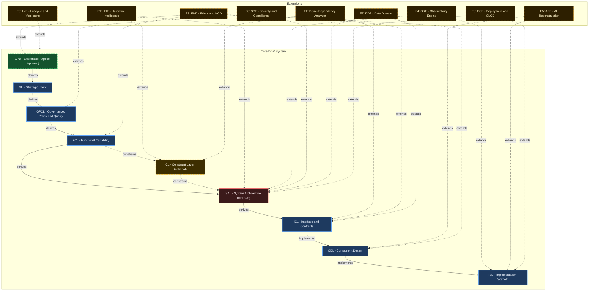

# DDR System Specification v4.0

> **Deterministic Design & Requirements System — Authoritative Reference**

| Property  | Value                                    |
| --------- | ---------------------------------------- |
| Version   | 4.0                                      |
| Status    | Finalized                                |
| Date      | 2026-02-26                               |
| Scope     | Systems-, language-, and domain-agnostic |
| Authority | DDR Architecture Board                   |
| Lineage   | Supersedes DDR v3.1.1 (Claude_v3)        |

> **Single Source of Truth.** This document is the exclusive normative specification for the DDR System. All prior versions are superseded. No conversation record, partial specification, or derivative document carries normative weight.

---

## 1. Design Philosophy

This specification was designed under three governing constraints:

1. **Minimize Design Complexity** — Every element earns its existence. No tier, edge type, operation, or rule exists without a concrete problem it solves. The system should be adoptable by a solo developer on day one and scale to enterprise without structural changes.
2. **Avoid Premature Optimization** — The Core defines the minimum viable graph. Advanced analytical capabilities, inference engines, and domain-specific intelligence are delivered exclusively via optional Extensions. The Core never anticipates an Extension.
3. **Maximize Structural Integrity** — The DAG is the single source of truth. Every node is traceable, every edge is typed, every mutation is validated. The system is correct by construction.

### 1.1 Changes from v3.1.1

| Area                 | v3.1.1 (Claude_v3)                  | v4.0 (This Spec)                                       | Rationale                                                                                                                      |
| -------------------- | ----------------------------------- | ------------------------------------------------------ | ------------------------------------------------------------------------------------------------------------------------------ |
| Tier count           | 11 tiers (8 mandatory + 3 optional) | 9 tiers (7 mandatory + 2 optional)                     | ORL absorbed into GPCL/FCL; HIL absorbed into TDL as a unified Constraint Layer. Eliminates two tiers without information loss |
| Fork-Join            | FCL forks to HIL∥TDL, joins at SAL  | FCL optionally constrains a single CL, joins at SAL    | Eliminates fork complexity; single constraint merge point                                                                      |
| Edge types           | 6 types                             | 4 types                                                | `cites` merged into `derives`; `reads`/`annotates` unified into `extends`                                                      |
| Operations           | 11 operations                       | 7 operations                                           | RELOCATE removed (contradicted ID immutability); ABSTRACT/CONCRETIZE merged into INSERT with direction parameter               |
| Node ID immutability | Contradicted by RELOCATE            | Absolute — no operation mutates a node ID              | Resolves the v3.1.1 RELOCATE contradiction                                                                                     |
| ARE staging          | Ambiguous DRAFT-in-Core             | Extension Candidate Pool — explicitly outside Core DAG | Eliminates read-only model tension                                                                                             |
| Express Mode         | 5 groups                            | Retained with updated groupings                        | Aligned to new 9-tier structure                                                                                                |
| Service Model        | 3-tier pricing                      | Removed                                                | Premature optimization; commercial model is an operational concern, not a specification concern                                |

---

## 2. Foundational Axioms

| ID   | Axiom                 | Statement                                                                                                                | Implication                                                                   |
| ---- | --------------------- | ------------------------------------------------------------------------------------------------------------------------ | ----------------------------------------------------------------------------- |
| AX-1 | Traceability          | Every non-root node must cite at least one parent via a typed edge                                                       | Complete audit trails from intent to implementation; no orphaned requirements |
| AX-2 | Abstraction Ordering  | Technology and implementation specificity are deferred until logically necessary                                         | No technology references above the Constraint tier                            |
| AX-3 | Determinism           | Identical inputs produce unambiguous, mechanically verifiable outputs                                                    | Automated validation and compliance checking are possible                     |
| AX-4 | Universality          | The Core applies to all software systems regardless of domain, scale, or technology                                      | No domain-specific assumptions in any Core tier                               |
| AX-5 | Extensibility         | Advanced analytical capabilities are delivered exclusively via optional Extensions                                       | Core remains stable under Extension addition, modification, or removal        |
| AX-6 | Declarative Integrity | The Core is strictly declarative; all inference, optimization, and automated recommendation are Extension-only behaviors | Core structural invariants cannot be destabilized by analytical logic         |
| AX-7 | DAG Acyclicity        | No citation chain may produce a cycle; causality flows in one direction only                                             | Graph traversal is always terminable                                          |

---

## 3. DAG Internal Model

### 3.1 Node Schema

| Property                | Type             | Description                                                       |
| ----------------------- | ---------------- | ----------------------------------------------------------------- |
| `id`                    | `TIER-N.M`       | **Immutable on assignment** — no operation may change a node's ID |
| `tier`                  | Enum             | One of: XPD, SIL, GPCL, FCL, CL, SAL, ICL, CDL, ISL               |
| `title`                 | String           | Human-readable artifact label                                     |
| `content`               | Text             | Body constrained by the tier's atomic ruleset                     |
| `parent_ids`            | List\[String\]   | ≥1 for all non-root nodes; typed by edge                          |
| `status`                | Enum             | `DRAFT` \| `ACTIVE` \| `DIRTY` \| `DEPRECATED` \| `SUPERSEDED`    |
| `version`               | SemVer           | Content version string                                            |
| `created`               | ISO 8601         | Creation timestamp                                                |
| `modified`              | ISO 8601         | Last modification timestamp                                       |
| `extension_annotations` | Map              | Read-only Extension metadata; never modifies `content`            |

### 3.2 Edge Types

| Type         | Symbol            | Semantics                                                                            |
| ------------ | ----------------- | ------------------------------------------------------------------------------------ |
| `derives`    | `──derives──▶`    | Child content derived from parent requirements or references parent for traceability |
| `constrains` | `╌╌constrains╌▶`  | Parent sets enforceable limits on child's design space                               |
| `implements` | `──implements──▶` | Child provides concrete realization of parent's abstract specification               |
| `extends`    | `···extends···▶`  | Extension adds metadata to or reads Core node without modifying it                   |

> **Design Decision:** v3.1.1 defined 6 edge types. `cites` has been merged into `derives` (a citation for traceability *is* a derivation relationship). `reads` and `annotates` have been unified into `extends` (both describe Extension-to-Core interaction with the same structural constraint: no Core mutation). This reduces the edge vocabulary from 6 to 4 without losing expressiveness.

### 3.3 Universal Node Format

```text
[TIER]-[N].[M]: [Title]
  status:     ACTIVE | DRAFT | DIRTY | DEPRECATED | SUPERSEDED
  version:    [SemVer]
  created:    [ISO 8601]
  modified:   [ISO 8601]
  parent_ids: [[TIER-N.M], ...]   ← empty only for root nodes

  [Tier-compliant content body]
```

### 3.4 Core DAG Topology

```text
  [OPTIONAL ROOT]
  ┌──────────────────────────────────────────────┐
  │  XPD — Existential Purpose Document          │  ← Activate when ethical_impact ≠ none
  │  "What human need and ethical limits exist?" │    OR societal_scale > personal
  └───────────────────────┬──────────────────────┘
                          │ derives (if active)
  [INTENT LAYER]          ▼
  ┌──────────────────────────────────────────────┐
  │  SIL — Strategic Intent Layer                │  ← Root when XPD inactive
  │  "Why does this system exist?"               │
  └───────────────────────┬──────────────────────┘
                          │ derives
  [GOVERNANCE LAYER]      ▼
  ┌──────────────────────────────────────────────┐
  │  GPCL — Governance, Policy & Quality Layer   │
  │  "What external mandates and measurable      │
  │   quality thresholds govern this system?"    │
  └───────────────────────┬──────────────────────┘
                          │ derives
  [FUNCTIONAL LAYER]      ▼
  ┌──────────────────────────────────────────────┐
  │  FCL — Functional Capability Layer           │
  │  "What user-observable behaviors are needed?"│
  └───────────────┬──────────────────────────────┘
                  │ derives (always)
                  │
                  │         ┌─────────────────────────────────┐
                  │         │  CL — Constraint Layer          │  ← Optional
                  │    ╌╌╌╌▶│  "What technology, hardware,    │
                  │         │   and infrastructure bounds     │
                  │         │   constrain the solution?"      │
                  │         └──────────────┬──────────────────┘
                  │                        │ constrains
  [ARCHITECTURE]  ▼────────────────────────┘
  ┌──────────────────────────────────────────────┐
  │  SAL — System Architecture Layer             │
  │  "How is the system structurally decomposed?"│  ← Constraint merge point
  └───────────────────────┬──────────────────────┘
                          │ derives
  [CONTRACT LAYER]        ▼
  ┌──────────────────────────────────────────────┐
  │  ICL — Interface & Contracts Layer           │
  │  "What formal contracts govern data exchange?"│
  └───────────────────────┬──────────────────────┘
                          │ implements
  [DESIGN LAYER]          ▼
  ┌──────────────────────────────────────────────┐
  │  CDL — Component Design Layer                │
  │  "What are the component structural          │
  │   blueprints?"                               │
  └───────────────────────┬──────────────────────┘
                          │ implements
  [SCAFFOLD LAYER]        ▼
  ┌──────────────────────────────────────────────┐
  │  ISL — Implementation Scaffold Layer         │
  │  "What traceable stubs initiate coding?"     │  ← Terminal leaf
  └──────────────────────────────────────────────┘

  LEGEND:
  ──────────▶  derives / implements edge
  ╌╌╌╌╌╌╌╌╌▶  constrains edge
```

### 3.5 DAG Invariants

- No cycles permitted at any path length
- No tier-skipping: each citation references exactly one tier above in the derivation path
- XPD and CL are conditionally activatable; the Core is valid and complete without them
- When CL is inactive, SAL derives directly from FCL
- All non-root nodes must carry at least one `parent_id` citation

### 3.6 Node ID Format

```text
[TIER]-[SECTION].[ITEM]    →  SIL-1.3 | GPCL-2.1 | CDL-12.5
XPD nodes                  →  XPD-0.N  (no sections; section = 0)
```

IDs are **immutable once assigned.** A superseded node retains its original ID with `status: SUPERSEDED`; the replacement receives a new ID. No operation — including relocation — may alter a node's assigned ID.

### 3.7 Citation Rules

| Rule   | Statement                                                                                    |
| ------ | -------------------------------------------------------------------------------------------- |
| CIT-R1 | Every non-root node must have ≥1 `parent_id`                                                 |
| CIT-R2 | `parent_ids` must reference nodes exactly one tier above in the derivation path              |
| CIT-R3 | CL → SAL constraint edges are recorded in `parent_ids` with edge type `constrains`           |
| CIT-R4 | An inline `[TIER-N.M]` citation in node content must have a matching entry in `parent_ids`   |
| CIT-R5 | Extension `extends` edges are stored in `extension_annotations` only — never in `parent_ids` |

---

## 4. Consumption Modes

| Mode                   | Description                                                 | Best Fit                                  |
| ---------------------- | ----------------------------------------------------------- | ----------------------------------------- |
| **Express (4 Groups)** | Adjacent tiers bundled into groups; expandable via UNBUNDLE | Small-to-medium projects                  |
| **Full (9 Tiers)**     | Every tier independently specified                          | Complex, regulated, or enterprise systems |

Express Mode is not a reduced system — it is Full Mode with grouped presentation. The UNBUNDLE operation expands any group into its constituent tiers without information loss or invention. When unbundling, `parent_ids` automatically wire to the immediately superior unbundled tier, satisfying CIT-R2 without manual intervention.

### Express Mode Group Map

| Group | Tiers Bundled          | Label                          |
| ----- | ---------------------- | ------------------------------ |
| G1    | XPD (opt) + SIL + GPCL | Purpose, Strategy & Governance |
| G2    | FCL + CL (opt)         | Capabilities & Constraints     |
| G3    | SAL + ICL              | Architecture & Contracts       |
| G4    | CDL + ISL              | Design & Scaffolding           |

## 5. Tier Specifications

---

### Tier 0 — XPD: Existential Purpose Document *(Optional)*

**Core Question:** "What human or societal need does this system exist to address, and what ethical boundaries govern all downstream decisions?"

**Activate when:** `ethical_impact ≠ none` OR `societal_scale > personal`. Required for AI/ML, healthcare, civic, and public-facing systems. Skippable for internal tooling with no external effect.

**Parent:** None (root when active). **Edge to child:** `derives` → SIL

#### XPD Atomic Inclusion Rules

| Rule   | Statement                                                                         | Violation Consequence                   |
| ------ | --------------------------------------------------------------------------------- | --------------------------------------- |
| XPD-R1 | Must articulate a fundamental human or societal need being addressed              | Downstream tiers lack ethical grounding |
| XPD-R2 | Must be immutable across the project lifecycle; changes require a new XPD version | Scope drift; mission confusion          |
| XPD-R3 | Must be comprehensible to non-technical stakeholders without a glossary           | Stakeholder misalignment                |
| XPD-R4 | Must establish ethical boundary conditions all subsequent tiers must satisfy      | Unethical design without detection      |
| XPD-R5 | Must define success criteria independent of implementation metrics                | Wrong success measurement               |
| XPD-R6 | Must identify populations who could be harmed and the safeguards required         | Harm by omission                        |

#### XPD Atomic Exclusion Rules

| Rule   | Statement                                                                         |
| ------ | --------------------------------------------------------------------------------- |
| XPD-E1 | Must not contain solution concepts, technology references, or architectural ideas |
| XPD-E2 | Must not contain quantitative performance targets (→ GPCL)                        |
| XPD-E3 | Must not contain regulatory or legal constraints (→ GPCL)                         |

---

### Tier 1 — SIL: Strategic Intent Layer

**Core Question:** "Why does this system exist, and what business outcomes must it achieve?"

**Parent:** XPD (if active) or none (root if XPD skipped). **Edge to child:** `derives` → GPCL

#### SIL Atomic Inclusion Rules

| Rule   | Statement                                                             | Violation Consequence                   |
| ------ | --------------------------------------------------------------------- | --------------------------------------- |
| SIL-R1 | Must define the core business problem or opportunity being addressed  | GPCL will lack strategic anchor         |
| SIL-R2 | Must specify strategic objectives with measurable outcomes            | Unmeasurable success criteria           |
| SIL-R3 | Must identify all stakeholder categories and their value propositions | Misaligned delivery priorities          |
| SIL-R4 | Must establish explicit scope boundaries (in-scope and out-of-scope)  | Uncontrolled scope creep                |
| SIL-R5 | Must define organizational success metrics                            | Inability to declare completion         |
| SIL-R6 | Must be stable under technology changes                               | Technology coupling at the intent level |

#### SIL Atomic Exclusion Rules

| Rule   | Statement                                                                |
| ------ | ------------------------------------------------------------------------ |
| SIL-E1 | Must not reference hardware, technology stacks, frameworks, or languages |
| SIL-E2 | Must not contain regulatory mandates or compliance requirements (→ GPCL) |
| SIL-E3 | Must not prescribe architectural patterns or implementation strategies   |
| SIL-E4 | Must not contain quantitative performance metrics (→ GPCL)               |

---

### Tier 2 — GPCL: Governance, Policy & Quality Layer

**Core Question:** "What non-negotiable external mandates, regulatory obligations, policy constraints, and measurable quality thresholds govern this system?"

**Design Decision — ORL Absorption:** v3.1.1 separated governance constraints (GPCL) from operational requirements (ORL) as independent tiers. In practice, operational quality thresholds (latency, availability, security) are themselves governance constraints — they are non-negotiable acceptance criteria imposed by external or organizational authority. Merging them eliminates a tier boundary that created pass-through nodes without independent semantic value, while preserving the classification distinction via content sections within GPCL.

**Parent:** `derives` ← SIL. **Edge to child:** `derives` → FCL

#### GPCL Atomic Inclusion Rules

| Rule     | Statement                                                                                | Violation Consequence                              |
| -------- | ---------------------------------------------------------------------------------------- | -------------------------------------------------- |
| GPCL-R1  | Must enumerate all applicable regulatory frameworks with jurisdiction and scope          | Compliance gaps leading to legal exposure          |
| GPCL-R2  | Must specify enforceable, testable constraints — not aspirational targets                | Non-verifiable compliance claims                   |
| GPCL-R3  | Must identify contractual obligations imposed by third-party relationships               | Contract breach by design                          |
| GPCL-R4  | Must define data sovereignty and residency requirements                                  | Data law violations                                |
| GPCL-R5  | Must specify audit and record-retention mandates                                         | Regulatory audit failure                           |
| GPCL-R6  | Must specify quantifiable performance targets: latency, throughput, concurrency ceilings | Architecture unable to satisfy operational demands |
| GPCL-R7  | Must specify reliability and availability targets (SLAs, RTO, RPO)                       | Unacceptable service degradation                   |
| GPCL-R8  | Must specify security requirements expressed technology-neutrally                        | Stale security specification on technology change  |
| GPCL-R9  | Must specify scalability and accessibility requirements                                  | Architecture unable to grow; user exclusion        |
| GPCL-R10 | Must cite parent SIL IDs for each constraint                                             | Orphaned requirements                              |

#### GPCL Atomic Exclusion Rules

| Rule    | Statement                                                                           |
| ------- | ----------------------------------------------------------------------------------- |
| GPCL-E1 | Must not specify technology frameworks, library choices, or hardware specifications |
| GPCL-E2 | Must not describe functional system behaviors (→ FCL)                               |
| GPCL-E3 | Must not contain business objectives or success metrics (→ SIL)                     |

---

### Tier 3 — FCL: Functional Capability Layer

**Core Question:** "What externally observable behaviors and user-facing capabilities must the system provide?"

**Parent:** `derives` ← GPCL. **Edge to children:** `derives` → SAL (always); `constrains` → CL (if CL active)

#### FCL Atomic Inclusion Rules

| Rule   | Statement                                                                                   | Violation Consequence                                           |
| ------ | ------------------------------------------------------------------------------------------- | --------------------------------------------------------------- |
| FCL-R1 | Must describe capabilities from the perspective of a user or external system                | Internal implementation details contaminate the functional spec |
| FCL-R2 | Must specify user workflows end-to-end without naming components, classes, or modules       | Premature structural coupling                                   |
| FCL-R3 | Must define event-driven behaviors and conditional business logic rules                     | Missing behavioral specification                                |
| FCL-R4 | Must specify user-observable state transitions and error conditions                         | Incomplete behavioral model                                     |
| FCL-R5 | Must be decomposable into sub-capabilities (parent-child FCL nodes) for complex features    | Monolithic feature specs that resist traceability               |
| FCL-R6 | Must cite parent GPCL IDs for capabilities that satisfy a governance or quality requirement | Disconnected functional requirements                            |

#### FCL Atomic Exclusion Rules

| Rule   | Statement                                                                  |
| ------ | -------------------------------------------------------------------------- |
| FCL-E1 | Must not name specific classes, modules, APIs, or algorithms               |
| FCL-E2 | Must not specify network protocols, serialization formats, or data schemas |
| FCL-E3 | Must not specify hardware requirements or infrastructure topology          |

---

### Tier 4 — CL: Constraint Layer *(Conditionally Activatable)*

**Core Question:** "What are the declared technology selections, hardware envelopes, and infrastructure ceilings that bound the system's implementation?"

**Design Decision — HIL/TDL Unification:** v3.1.1 modeled hardware constraints (HIL) and technology constraints (TDL) as two independent, parallel tiers forming a fork-join topology. The unified CL eliminates fork-join complexity, the CRR protocol, and the parallel-tier invariant enforcement, while preserving full constraint expressiveness via content sections within a single tier. Conflicts between hardware and technology constraints are resolved internally within CL nodes.

**Activate when:** specific technology, hardware, or infrastructure constraints are non-negotiable. Optional when full freedom is preserved into the architecture phase.

**Parents:** `constrains` ← FCL. **Edge to child:** `constrains` → SAL

#### CL Atomic Inclusion Rules

| Rule   | Statement                                                                                            | Violation Consequence                                       |
| ------ | ---------------------------------------------------------------------------------------------------- | ----------------------------------------------------------- |
| CL-R1  | Must declare approved programming languages with version constraints                                 | Incompatible implementations                                |
| CL-R2  | Must declare mandatory frameworks and core libraries with minimum version bounds                     | Dependency drift                                            |
| CL-R3  | Must declare required external service contracts without their internal implementation details       | Integration gaps                                            |
| CL-R4  | Must declare runtime environment constraints (OS, container runtime, execution environment)          | Deployment environment incompatibility                      |
| CL-R5  | Must explicitly declare prohibited technologies with rationale                                       | License compliance violations                               |
| CL-R6  | Must declare hardware envelopes when applicable (CPU class, RAM floor, storage, GPU)                 | Architecture that exceeds target hardware                   |
| CL-R7  | Must declare infrastructure ceilings when applicable (compute budget, storage cap, bandwidth cap)    | Cost overruns from unconstrained architecture               |
| CL-R8  | Must specify deployment topology declarations (on-premise, cloud-agnostic, hybrid, edge)             | Architecture incompatible with deployment target            |
| CL-R9  | Must cite FCL or GPCL IDs for each constraint                                                        | Constraints untraceable to a business need                  |
| CL-R10 | Must explicitly document internal reconciliations of conflicting hardware and technology constraints | Loss of deterministic traceability for constraint conflicts |

#### CL Atomic Exclusion Rules

| Rule  | Statement                                                               |
| ----- | ----------------------------------------------------------------------- |
| CL-E1 | Must not auto-derive, infer, or recommend configurations (→ Extensions) |
| CL-E2 | Must not contain functional system behaviors (→ FCL)                    |
| CL-E3 | Must not contain cost models or TCO calculations (→ Extensions)         |

---

### Tier 5 — SAL: System Architecture Layer

**Core Question:** "How is the system structurally decomposed, and what patterns govern component interaction?"

**Merge node.** SAL must satisfy all incoming constraints simultaneously. When CL is active, SAL absorbs CL constraints in addition to FCL derivations.

**Parents:** `derives` ← FCL (always); `constrains` ← CL (if active). **Edge to child:** `derives` → ICL

#### SAL Atomic Inclusion Rules

| Rule   | Statement                                                                                  | Violation Consequence                                   |
| ------ | ------------------------------------------------------------------------------------------ | ------------------------------------------------------- |
| SAL-R1 | Must define the overarching architectural pattern(s) with rationale                        | No structural framework for downstream design           |
| SAL-R2 | Must specify system decomposition into major subsystems with ownership boundaries          | Ambiguous component responsibilities                    |
| SAL-R3 | Must specify inter-subsystem communication patterns                                        | Integration design without architectural mandate        |
| SAL-R4 | Must specify concurrency model and data ownership rules                                    | Race conditions and data integrity violations by design |
| SAL-R5 | Must specify failure isolation and resilience boundaries                                   | Cascading failure scenarios in the architecture         |
| SAL-R6 | Must cite all active parent IDs (FCL + CL if active) for each major architectural decision | Architectural decisions without traceable justification |

#### SAL Atomic Exclusion Rules

| Rule   | Statement                                                          |
| ------ | ------------------------------------------------------------------ |
| SAL-E1 | Must not contain exact data schemas or payload definitions (→ ICL) |
| SAL-E2 | Must not contain class-level component blueprints (→ CDL)          |
| SAL-E3 | Must not contain executable code                                   |

---

### Tier 6 — ICL: Interface & Contracts Layer

**Core Question:** "What are the formal, machine-verifiable contracts governing data exchange between system boundaries?"

**Parent:** `derives` ← SAL. **Edge to child:** `implements` → CDL

#### ICL Atomic Inclusion Rules

| Rule   | Statement                                                                                     | Violation Consequence                              |
| ------ | --------------------------------------------------------------------------------------------- | -------------------------------------------------- |
| ICL-R1 | Must define all inter-component and external API contracts with complete input/output schemas | Implementations that diverge at integration points |
| ICL-R2 | All schemas must be machine-parseable (JSON Schema, Protobuf, OpenAPI, or equivalent)         | Contracts that cannot be mechanically validated    |
| ICL-R3 | Must specify serialization formats, encoding standards, and wire protocols per contract       | Interoperability failures from encoding mismatches |
| ICL-R4 | Must specify mandatory fields, optional fields, type constraints, and validation rules        | Runtime failures from malformed payloads           |
| ICL-R5 | Must specify error response contracts (error codes, payload structure, retry behavior)        | Undefined failure behavior at system boundaries    |
| ICL-R6 | Must specify versioning strategy per contract                                                 | Breaking changes without migration path            |
| ICL-R7 | Must cite SAL IDs for each contract                                                           | Contracts without architectural justification      |

#### ICL Atomic Exclusion Rules

| Rule   | Statement                                                              |
| ------ | ---------------------------------------------------------------------- |
| ICL-E1 | Must not contain internal component state management or business logic |
| ICL-E2 | Must not specify architectural routing patterns (→ SAL)                |
| ICL-E3 | Must not contain class or module blueprints (→ CDL)                    |

---

### Tier 7 — CDL: Component Design Layer

**Core Question:** "What are the structural blueprints of individual components — their public interfaces, internal state, and responsibilities?"

**Parent:** `implements` ← ICL. **Edge to child:** `implements` → ISL

#### CDL Atomic Inclusion Rules

| Rule   | Statement                                                                                           | Violation Consequence                               |
| ------ | --------------------------------------------------------------------------------------------------- | --------------------------------------------------- |
| CDL-R1 | Must define component names, logical responsibilities, and ownership boundaries                     | Ambiguous implementation targets                    |
| CDL-R2 | Must specify all public method/function signatures (name, parameter types, return type, exceptions) | Implementations that violate the declared interface |
| CDL-R3 | Must specify internal state structures as a logical model — not implementation                      | Hidden state dependencies between components        |
| CDL-R4 | Must specify component dependencies (consumed components and ICL contracts)                         | Circular dependencies introduced at implementation  |
| CDL-R5 | Must map each component to the ICL contracts it implements                                          | Components without contractual grounding            |
| CDL-R6 | Must specify initialization, lifecycle, and teardown contracts for stateful components              | Resource leaks and initialization-order bugs        |

#### CDL Atomic Exclusion Rules

| Rule   | Statement                                                            |
| ------ | -------------------------------------------------------------------- |
| CDL-E1 | Must not contain executable code bodies or algorithm implementations |
| CDL-E2 | Must not contain system-wide architectural patterns (→ SAL)          |
| CDL-E3 | Must not contain data serialization schemas (→ ICL)                  |

---

### Tier 8 — ISL: Implementation Scaffold Layer

**Core Question:** "What is the minimal, structurally valid, traceable scaffolding required to initiate implementation?"

**Parent:** `implements` ← CDL. **Terminal leaf — no Core children.**

#### ISL Atomic Inclusion Rules

| Rule   | Statement                                                                                             | Violation Consequence                       |
| ------ | ----------------------------------------------------------------------------------------------------- | ------------------------------------------- |
| ISL-R1 | Must produce syntactically valid structural scaffolding in the target language                        | Scaffolding that fails to compile or parse  |
| ISL-R2 | Must embed docstrings or code comments with explicit parent DDR node IDs                              | Implementations without traceability        |
| ISL-R3 | Must include implementation hints as structured comments                                              | Implementers who lose architectural context |
| ISL-R4 | Must define all function/method bodies exclusively as stubs                                           | Pre-implementation contamination            |
| ISL-R5 | Must be language-specific — one ISL node per target language/runtime when multiple are declared in CL | Language-ambiguous stubs                    |
| ISL-R6 | Must cite CDL parent IDs for every stub                                                               | Orphaned scaffolding                        |

#### ISL Atomic Exclusion Rules

| Rule   | Statement                                                     |
| ------ | ------------------------------------------------------------- |
| ISL-E1 | Must not contain business logic or complete algorithmic logic |
| ISL-E2 | Must not contain infrastructure configuration (→ Extensions)  |

---

## 6. Constraint Precedence

When two tiers produce conflicting constraints on a downstream tier, precedence governs resolution (highest to lowest):

| Priority | Tier | Rationale                                                                   |
| -------- | ---- | --------------------------------------------------------------------------- |
| 1        | XPD  | Ethical boundary conditions are inviolable                                  |
| 2        | GPCL | External regulatory mandates and quality thresholds are non-negotiable      |
| 3        | SIL  | Strategic intent defines the purpose of all design decisions                |
| 4        | CL   | Technology, hardware, and infrastructure constraints are externally imposed |
| 5        | FCL  | Functional requirements operate within the constraint envelope              |
| 6        | SAL  | Architecture is bounded by all above                                        |
| 7        | ICL  | Contracts derive from architecture                                          |
| 8        | CDL  | Design derives from contracts                                               |
| 9        | ISL  | Scaffolding derives from design                                             |

Higher-priority tiers override lower-priority tiers. An XPD ethical boundary functions as an **absolute veto right** over any downstream decision.

---

## 7. Atomic Operations Protocol

### 7.1 Core Operations

| Operation     | Description                                                                                                                                                     | Validation Trigger                                                            |
| ------------- | --------------------------------------------------------------------------------------------------------------------------------------------------------------- | ----------------------------------------------------------------------------- |
| **INSERT**    | Create node with auto-assigned ID, `parent_ids`, and tier-compliant content. Supports both forward (parent→child) and reverse (child→inferred parent) direction | Full atomic ruleset; parent existence; DAG cycle detection                    |
| **DELETE**    | Remove node; cascade orphan detection to children                                                                                                               | Children → `DIRTY`; manifest updated                                          |
| **MODIFY**    | Update content; version incremented                                                                                                                             | Re-validate ruleset; re-check citations; DIRTY propagation to all descendants |
| **SUPERSEDE** | Mark node `SUPERSEDED`; create replacement with new ID                                                                                                          | Old node retains ID; new node validated; all children re-targeted             |
| **VERIFY**    | Traverse DAG downward; validate citation chains, edge types, ID references, orphans, and contamination                                                          | Returns `CLEAN` or `DIRTY` with itemized violations                           |
| **VALIDATE**  | Check single node against its tier's full atomic ruleset                                                                                                        | Returns pass/fail with specific violated rule IDs                             |
| **UNBUNDLE**  | Expand Express Mode group into constituent Full Mode tiers                                                                                                      | Content allocated to correct tiers; `parent_ids` auto-wired                   |

> **Design Decision — Removed Operations:** v3.1.1 defined 11 operations. RELOCATE is removed (contradicted ID immutability). ABSTRACT and CONCRETIZE are merged into INSERT with a direction parameter. DETECT ORPHAN and DETECT CONTAMINATION are subsumed by VERIFY.

### 7.2 Dirty Flag Triggers

| Trigger                         | Nodes Affected                            |
| ------------------------------- | ----------------------------------------- |
| Node modified                   | Modified node + all descendants           |
| Node deleted                    | All former children of the deleted node   |
| Node inserted                   | New node (until validated)                |
| Parent → `SUPERSEDED`           | All children citing the superseded parent |
| CL constraint added or modified | SAL + all SAL descendants                 |
| XPD ethical boundary modified   | All tiers (full re-validation required)   |

### 7.3 Resolution Workflow

```text
DETECT CHANGE → SET DIRTY → SCAN DOWNSTREAM
  → GENERATE PENDING ITEMS (node ID + violated rule ID + suggested operation)
  → EXECUTE OPERATION → VERIFY → SET CLEAN | REPEAT
```

The reconciliation manifest tracks: total node count by tier; `ACTIVE`/`DIRTY`/`DRAFT`/`DEPRECATED` counts; pending items list; last full validation timestamp; active Extensions and annotation counts.

---

## 8. Extension System

### 8.1 Architecture

Extensions are **orthogonal read-only overlays** attaching to the Core DAG via `extends` edges. They interact with Core nodes without modifying Core semantics.

**Extensions may:**

- Read Core node content
- Annotate Core nodes with namespaced metadata (stored in `extension_annotations` only)
- Generate derived external artifacts (reports, IaC, recommendations)
- Add advisories to the reconciliation manifest's `extension_advisories` section

**Extensions may not:**

- Modify any Core node's `content`, `parent_ids`, `tier`, or `status`
- Redefine Core tier semantics or atomic rules
- Introduce structural cycles
- Set Core nodes to `DIRTY` (advisories only; no state mutation)

Disabling any Extension leaves the Core valid, complete, and fully operational.

### 8.2 Extension Candidate Pool

The AI Upward Reconstruction Extension (ARE) requires special handling because it infers new nodes. To preserve AX-6, ARE-inferred nodes are placed in an **Extension Candidate Pool** — a staging area **outside the Core DAG**. Candidate nodes:

- Carry `status: CANDIDATE` (not a Core status value)
- Are visible only when the ARE extension is active
- Have no effect on Core DIRTY/CLEAN status
- Must be promoted into the Core DAG via INSERT (triggering full validation) to become Core nodes
- Are automatically discarded when ARE is disabled

### 8.3 Extension Integration Rules

| Rule   | Statement                                                                          |
| ------ | ---------------------------------------------------------------------------------- |
| EXT-R1 | Must declare contract version compatible with DDR-Core-4.x                         |
| EXT-R2 | Must declare which Core tiers it reads and which it annotates                      |
| EXT-R3 | Annotations must be namespaced by Extension ID (e.g., `HRE::min_hardware_profile`) |
| EXT-R4 | Extensions update the reconciliation manifest; annotation counts tracked           |
| EXT-R5 | Disabling an Extension leaves Core `CLEAN`/`DIRTY` status unchanged                |
| EXT-R6 | Extension-internal derived artifact graphs must maintain their own acyclicity      |
| EXT-R7 | Extension advisories do not mutate Core node status                                |

---

## 9. Extension Catalog

### E1 — Hardware & Resource Intelligence Extension (HRE)

**Contract:** HRE-1.0 / DDR-Core-4.x · **Reads:** CL, SAL, CDL, ISL · **Annotates:** CL, SAL

| Rule   | Statement                                                                            |
| ------ | ------------------------------------------------------------------------------------ |
| HRE-R1 | Bottom-up inference produces minimum hardware profiles as CL-compatible declarations |
| HRE-R2 | Cloud recommendations include ≥2 provider-agnostic instance class options            |
| HRE-R3 | Top-down enforcement validates SAL patterns do not exceed CL ceilings                |
| HRE-R4 | All recommendations are advisory; they do not override CL without explicit MODIFY    |

### E2 — Dependency Graph Analyzer (DGA)

**Contract:** DGA-1.0 / DDR-Core-4.x · **Reads:** CL, ICL, CDL, ISL · **Annotates:** CL, ICL

| Rule   | Statement                                                                              |
| ------ | -------------------------------------------------------------------------------------- |
| DGA-R1 | Produces a complete directed dependency graph for all CL-declared libraries            |
| DGA-R2 | Detects version conflicts with resolution suggestions                                  |
| DGA-R3 | Transitive dependency reports flag all copyleft licenses that could impose constraints |

### E3 — Lifecycle & Versioning Engine (LVE)

**Contract:** LVE-1.0 / DDR-Core-4.x · **Reads:** All Core tiers · **Annotates:** All Core tiers

| Rule   | Statement                                                                                      |
| ------ | ---------------------------------------------------------------------------------------------- |
| LVE-R1 | Every node modification produces a version history entry with timestamp, author, and rationale |
| LVE-R2 | Technical debt items classified by tier origin and estimated remediation effort                |
| LVE-R3 | Deprecation requires a sunset date and migration path before node → `DEPRECATED`               |
| LVE-R4 | Version control integration maps DDR node IDs to VCS commit hashes                             |

### E4 — Observability & Runtime Engine (ORE)

**Contract:** ORE-1.0 / DDR-Core-4.x · **Reads:** GPCL, SAL, ICL, ISL · **Annotates:** ISL, SAL

| Rule   | Statement                                                                         |
| ------ | --------------------------------------------------------------------------------- |
| ORE-R1 | Telemetry stubs derived from GPCL latency and throughput targets                  |
| ORE-R2 | Alert rules expressed in vendor-agnostic format                                   |
| ORE-R3 | Every SAL component must have ≥1 telemetry point for operational readiness        |
| ORE-R4 | Incident-to-design traceability maps runtime anomalies to ISL, CDL, and SAL nodes |

### E5 — AI Upward Reconstruction Engine (ARE)

**Contract:** ARE-1.0 / DDR-Core-4.x · **Reads:** ISL, CDL, ICL, SAL · **Annotates:** All tiers

| Rule   | Statement                                                                                                   |
| ------ | ----------------------------------------------------------------------------------------------------------- |
| ARE-R1 | All inferred nodes placed in the Extension Candidate Pool (§8.2); automatic promotion prohibited            |
| ARE-R2 | Each candidate carries `ARE::confidence_score` (0.0–1.0) derived from source evidence quality               |
| ARE-R3 | Promotion into Core DAG requires INSERT with full atomic ruleset validation                                 |
| ARE-R4 | ARE must never autonomously create XPD or GPCL nodes — ethical/regulatory content requires human authorship |

### E6 — Security & Compliance Engine (SCE)

**Contract:** SCE-1.0 / DDR-Core-4.x · **Reads:** GPCL, CL, SAL, ICL · **Annotates:** GPCL, SAL, ICL

| Rule   | Statement                                                                         |
| ------ | --------------------------------------------------------------------------------- |
| SCE-R1 | Threat models expressed in STRIDE format or equivalent structured notation        |
| SCE-R2 | Trust boundary violations in SAL flagged as high-priority advisories              |
| SCE-R3 | Every ICL contract must have an explicit RBAC access control policy               |
| SCE-R4 | PII data flows enumerated in ICL and traceable to GPCL data-residency constraints |
| SCE-R5 | Compliance evidence records are immutable once generated                          |

### E7 — Data Domain Extension (DDE)

**Contract:** DDE-1.0 / DDR-Core-4.x · **Reads:** FCL, SAL, ICL, CDL · **Annotates:** ICL, SAL, FCL

| Rule   | Statement                                                                                   |
| ------ | ------------------------------------------------------------------------------------------- |
| DDE-R1 | Canonical ER model expressed in formal notation (ERD, DBML, or equivalent)                  |
| DDE-R2 | Every ICL payload schema validated against the canonical ER model                           |
| DDE-R3 | Schema consistency violations flagged as blocking advisories                                |
| DDE-R4 | Data lifecycle policies specify retention periods traceable to GPCL regulatory requirements |

### E8 — Deployment & CI/CD Planner (DCP)

**Contract:** DCP-1.0 / DDR-Core-4.x · **Reads:** CL, SAL, ISL · **Annotates:** ISL, SAL

| Rule   | Statement                                                                       |
| ------ | ------------------------------------------------------------------------------- |
| DCP-R1 | Deployment manifests map every SAL subsystem to a deployment unit               |
| DCP-R2 | CI/CD pipeline definitions include at minimum: lint, test, build, deploy stages |
| DCP-R3 | All generated IaC cites the CL nodes from which configuration was derived       |
| DCP-R4 | Environment-specific configuration separated from application code              |

### E9 — Ethics & Human-Centered Design Extension (EHD)

**Contract:** EHD-1.0 / DDR-Core-4.x · **Reads:** XPD, SIL, FCL, SAL, CDL · **Annotates:** FCL, CDL, SAL

| Rule   | Statement                                                                                         |
| ------ | ------------------------------------------------------------------------------------------------- |
| EHD-R1 | Bias impact assessments identify affected demographic groups and potential algorithmic biases     |
| EHD-R2 | Accessibility compliance validates FCL capabilities against WCAG 2.1 AA or GPCL-declared standard |
| EHD-R3 | Algorithmic accountability maps link each automated CDL decision to a human oversight mechanism   |
| EHD-R4 | All EHD assessments cite the XPD ethical boundary conditions being evaluated                      |
| EHD-R5 | When XPD is inactive, EHD creates a synthetic XPD-equivalent assessment anchored to SIL           |

---

## 10. Architecture Diagram



---

## 11. Compliance Checklist

A DDR project may not be declared `CLEAN` and production-ready until all items are satisfied.

> **Structural Validation**

- [ ] All non-root nodes have ≥1 valid, non-superseded `parent_id`
- [ ] All `parent_ids` reference nodes of the correct parent tier
- [ ] No cycles exist in any citation path (VERIFY confirms)
- [ ] No tier-skipping detected
- [ ] All inline `[TIER-N.M]` citations have matching entries in `parent_ids`
- [ ] No node has `status: DIRTY`
- [ ] Reconciliation manifest shows zero pending items

> **Atomic Rule Validation**

- [ ] XPD nodes satisfy XPD-R1 through XPD-R6 and XPD-E1 through XPD-E3
- [ ] SIL nodes satisfy SIL-R1 through SIL-R6 and SIL-E1 through SIL-E4
- [ ] GPCL nodes satisfy GPCL-R1 through GPCL-R10 and GPCL-E1 through GPCL-E3
- [ ] FCL capabilities are user-observable and free of implementation references
- [ ] CL nodes are declarative only; no inference (CL-E1)
- [ ] SAL cites all active parent tiers (FCL + CL if active)
- [ ] ICL schemas are machine-parseable (ICL-R2)
- [ ] ISL stubs contain traceable docstrings citing CDL parent IDs

**Extension Validation** *(when Extensions active)*

- [ ] All active Extensions declare compatible contract versions for DDR-Core-4.x
- [ ] Extension annotations stored in `extension_annotations` only
- [ ] Extension advisories reviewed; critical advisories have disposition notes
- [ ] ARE-generated candidates reviewed and either promoted via INSERT or discarded

---

## Glossary

| Term                   | Definition                                                                                                       |
| ---------------------- | ---------------------------------------------------------------------------------------------------------------- |
| **Atomic Rule**        | An inclusion or exclusion constraint on a tier node, individually verifiable without reference to other nodes    |
| **Candidate Pool**     | Extension-managed staging area for ARE-inferred nodes; explicitly outside the Core DAG until promoted via INSERT |
| **DAG**                | Directed Acyclic Graph — the DDR System's foundational data structure                                            |
| **Dirty Flag**         | `DIRTY` status indicating a node requires re-validation following a graph-modifying event                        |
| **Edge Type**          | One of four typed relationships: `derives`, `constrains`, `implements`, `extends`                                |
| **Express Mode**       | A four-group consumption mode; groups are unbundleable to Full Mode tiers via UNBUNDLE                           |
| **Extension**          | An optional analytical overlay that reads and annotates Core nodes without modifying Core semantics              |
| **Leaf Node**          | A node with no children; ISL nodes are the only valid leaf nodes in the Core DAG                                 |
| **Merge Node**         | SAL — the point where FCL derivations and CL constraints converge                                                |
| **Orphan**             | A non-root node with no valid `parent_id` — a structural violation                                               |
| **Root Node**          | XPD (if active) or SIL (if XPD inactive); the only node with an empty `parent_ids` list                          |
| **Tier Contamination** | Presence of content in a node that violates that tier's atomic exclusion rules                                   |

---

## Appendix A: Version History

| Version | Date       | Change Summary                                                                                                                                                                                         |
| ------- | ---------- | ------------------------------------------------------------------------------------------------------------------------------------------------------------------------------------------------------ |
| 1.0     | —          | Initial DDR System concept (7-tier linear: BRD→NFR→FSD→SAD→ICD→TDD→ISP)                                                                                                                                |
| 2.1     | 2026-02-26 | Refined Core + Extension system                                                                                                                                                                        |
| 3.0     | 2026-02-26 | Complete redesign: fork-join DAG; GPCL isolation; XPD optional root; Z-axis extensions; Express Mode; CRR protocol; 9 Extensions                                                                       |
| 3.1.1   | 2026-02-26 | Structural consolidation: universal node format; 6-edge vocabulary; axiom implications                                                                                                                 |
| 4.0     | 2026-02-26 | Structural simplification: 11→9 tiers; 6→4 edge types; 11→7 operations; fork-join→merge-node; RELOCATE removed; ARE Candidate Pool; Express Mode→4 groups; Service Model removed; CRR protocol removed |

---

## Appendix B: v3.1.1 → v4.0 Tier Migration

| v3.1.1 Tier | v4.0 Destination | Migration Notes                                                                                     |
| ----------- | ---------------- | --------------------------------------------------------------------------------------------------- |
| XPD         | XPD              | Unchanged                                                                                           |
| SIL         | SIL              | Unchanged                                                                                           |
| GPCL        | GPCL             | Expanded to absorb ORL quality/performance content                                                  |
| ORL         | GPCL             | ORL-R1 through ORL-R7 become GPCL-R6 through GPCL-R10 (ORL-R5 and ORL-R6 consolidated into GPCL-R9) |
| FCL         | FCL              | Now derives from GPCL instead of ORL                                                                |
| HIL         | CL               | HIL-R1 through HIL-R5 become CL-R6 through CL-R8                                                    |
| TDL         | CL               | TDL-R1 through TDL-R6 become CL-R1 through CL-R5                                                    |
| SAL         | SAL              | Simplified from fork-join to single merge-node                                                      |
| ICL         | ICL              | Unchanged                                                                                           |
| CDL         | CDL              | Unchanged                                                                                           |
| ISL         | ISL              | References CL instead of TDL for language targets                                                   |

---

*DDR System v4.0 — Deterministic Design for Software Excellence*
*Single Source of Truth — All prior versions superseded*
