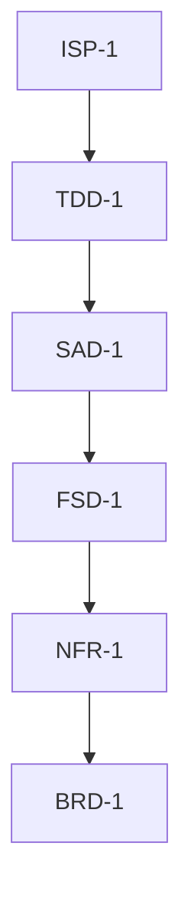

# Development Documentation Roadmap (DDR) Hierarchy: A Comprehensive Technical Analysis

## 0. Executive Summary

This report provides a complete analysis of the Development Documentation Roadmap (DDR) hierarchical structure deployed utilizing the Sphinx-Needs reference documentation structure, establishing precise classification criteria, boundary definitions, syntactical requirements, and practical examples for each documentation tier. The DDR implements a seven-tier cascade from strategic business context through executable code stubs, enforcing strict traceability and vertical consistency across all layers.

----------

## 1. Documentation Hierarchy Overview

### 1.1 Architectural Philosophy

The DDR implements a **waterfall-traceable, LLM-optimized documentation architecture** where each tier answers a specific question and enforces parent-child citation relationships:

> **Embedded Example Type:** plaintext DDR tier hierarchy
~~~plaintext
BRD (Why?)
  ↓ cites
NFR (Within what constraints?)
  ↓ cites
FSD (What capabilities?)
  ↓ cites
SAD (How structured?)
  ↓ cites
ICD (What contracts?)
  ↓ cites
TDD (What components?)
  ↓ cites
ISP (What code?)
~~~

**Key Principles:**

-   **Unidirectional Authority:** Child tiers cite parent tiers using `:links: PARENT-TAG` option
-   **Atomic Traceability:** Every requirement/specification has a unique, immutable ID (e.g., `:id: BRD-5.2`)
-   **Persona-Driven:** Each tier assumes a distinct stakeholder perspective
-   **LLM-Parseable:** Strict formatting enables automated validation and consistency checking

### 1.2 Deployment Structure

The DDR system utilizes a directory structure accommodating the Sphinx Python documentation generator for reStructuredText:

> **Embedded Example Type:** plaintext directory structure
~~~plaintext
docs/
├── _build/
├── _static/
│   └── custom.css
├── _templates/
├── 00_glossary/
│   ├── index.rst
│   └── terms.rst
├── 01_brd/
│   ├── brd.rst
│   ├── index.rst
│   └── reconciliation_manifest.rst
├── 02_nfr/
│   ├── index.rst
│   ├── nfr.rst
│   └── reconciliation_manifest.rst
├── 03_fsd/
│   ├── fsd.rst
│   ├── index.rst
│   └── reconciliation_manifest.rst
├── 04_sad/
│   ├── index.rst
│   ├── reconciliation_manifest.rst
│   └── sad.rst
├── 05_icd/
│   ├── icd.rst
│   ├── index.rst
│   └── reconciliation_manifest.rst
├── 06_tdd/
│   ├── index.rst
│   ├── reconciliation_manifest.rst
│   └── tdd.rst
├── 07_isp/
│   ├── index.rst
│   ├── isp.rst
│   └── reconciliation_manifest.rst
├── llm_export/
│   └── context_flat.md
├── conf.py
├── index.rst
├── make.bat
└── Makefile
~~~

----------

## 2. Tier-by-Tier Boundary Definitions

### 2.1 BRD — Business Requirements Document

**Tier Position:** Layer 1 (Root)
**Answers:** "Why are we building this?"
**Persona:** Executive Strategist / Product Owner
**Scope:** Strategic objectives, business justification, stakeholder needs

#### Classification Criteria

**INCLUDE if information:**

1.  Describes the fundamental **business problem** being solved
2.  Defines **strategic objectives** independent of technical implementation
3.  Articulates **stakeholder value propositions**
4.  Establishes **success metrics** at the organizational level (uptime SLAs, user satisfaction)
5.  States **high-level scope** boundaries (what's in/out of MVP)
6.  Identifies **environmental/operational constraints** (offline requirement, privacy mandates)

**EXCLUDE if information:**

1.  Specifies technical architectures, patterns, or technologies
2.  Defines data structures, APIs, or protocols
3.  Describes implementation details or algorithms
4.  Contains hardware specifications beyond environmental context
5.  Provides numeric performance targets more granular than SLAs

#### Qualification Rubric
| Criterion | BRD-Appropriate | Not BRD-Appropriate |
|:--|:--|:--|
| **Abstraction Level** | "Enable privacy-preserving AI" | "Use local TCP sockets" |
| **Stakeholder Focus** | "End users require offline capability" | "Runtime process uses ONNX" |
| **Temporal Scope** | "Strategic objective for 2025-2026" | "Queue timeout = 100ms" |
| **Justification Type** | "Competitive advantage" | "Prevents memory leak" |
| **Success Measure** | "99.9% uptime SLA" | "<1ms dispatch latency" |

#### Real-World Examples

**Example 1: Strategic Objective (INCLUDE)**

> **Embedded Example Type:** reStructuredText BRD directive
~~~rst
.. brd:: Strategic Objective
   :id: BRD-2

   Enable responsive, privacy-preserving AI assistant capabilities
   without dependency on cloud infrastructure.
~~~

-   **Why BRD:** States a business-driven technology mandate (privacy, offline)
-   **Not Lower Tier:** Doesn't specify _how_ (multi-process, ZeroMQ)

**Example 2: Stakeholder Problem (INCLUDE)**

> **Embedded Example Type:** reStructuredText BRD directive
~~~rst
.. brd:: Problem Statement
   :id: BRD-4

   Users require AI assistant capabilities but are constrained by
   internet dependency, privacy concerns, and single-process limitations.

~~~

-   **Why BRD:** Describes the market/user pain point, not the solution
-   **Not Lower Tier:** Doesn't prescribe architecture

**Example 3: Incorrectly Classified (EXCLUDE)**

> **Embedded Example Type:** reStructuredText BRD directive
~~~rst
.. brd:: [BAD EXAMPLE]
   :id: BRD-X

   Use ZeroMQ ROUTER-DEALER pattern for IPC

~~~

-   **Why Not BRD:** This is a technical architecture decision (belongs in SAD)
-   **Correct Classification:** `SAD-1.1` :links: `BRD-5` (traces to "offline framework" scope)

**Example 4: Scope Boundary (INCLUDE)**

> **Embedded Example Type:** reStructuredText BRD directive
~~~rst
.. brd:: Local LLM, TTS, and STT inference.
   :id: BRD-5.2
   :links: BRD-5

~~~

-   **Why BRD:** Defines functional scope at the capability level
-   **Not Lower Tier:** Doesn't specify models, frameworks, or APIs

----------

### 2.2 NFR — Non-Functional Requirements

**Tier Position:** Layer 2
**Answers:** "Within what constraints must the system operate?"
**Persona:** Systems Administrator / Performance Engineer
**Scope:** Hardware limits, performance targets, reliability thresholds, security boundaries

#### Classification Criteria

**INCLUDE if information:**

1.  Specifies **hardware resource limits** (CPU model, VRAM capacity, RAM allocation)
2.  Defines **quantitative performance targets** (latency thresholds, throughput minimums)
3.  Establishes **reliability/availability requirements** (fault tolerance, uptime)
4.  States **security constraints** (network isolation, encryption requirements)
5.  Mandates **technology dependencies** (Python 3.11+, CUDA toolkit)
6.  Prescribes **resource utilization bounds** (max CPU %, memory footprints)

**EXCLUDE if information:**

1.  Describes business objectives or user value propositions
2.  Defines functional behavior or capabilities
3.  Specifies implementation details (class names, method signatures)
4.  Describes data schemas or message formats
5.  Provides architectural patterns (unless as constraints)

#### Qualification Rubric


| Criterion | NFR-Appropriate | Not NFR-Appropriate |
|:--|:--|:--|
| **Measurability** | "<1ms dispatch latency" | "Fast IPC communication" |
| **Constraint Type** | "RTX 3080 10GB VRAM limit" | "Use GPU for inference" |
| **Enforcement** | "No process shall block >5s" | "Core routes messages" |
| **Scope** | "All communication via 127.0.0.1" | "ROUTER binds to :5555" |
| **Invariance** | "Python >=3.11 required" | "Import zmq.Context" |

#### Real-World Examples

**Example 1: Hardware Constraint (INCLUDE)**

> **Embedded Example Type:** reStructuredText NFR directive
~~~rst
.. nfr:: **GPU:** RTX 3080 10GB VRAM (Runtime/Inference only).
   :id: NFR-1.2
   :links: NFR-1

~~~

-   **Why NFR:** Specifies non-negotiable hardware boundary
-   **Traces To:** `BRD-6.1` ("High-end consumer workstation")
-   **Downstream Impact:** TDD must design around 10GB VRAM limit

**Example 2: Performance Target (INCLUDE)**

> **Embedded Example Type:** reStructuredText NFR directive
~~~rst
.. nfr:: **IPC Dispatch:** Sub-millisecond (<1ms) for metadata-only messages.
   :id: NFR-4.1
   :links: NFR-4

~~~

-   **Why NFR:** Quantifiable performance requirement
-   **Traces To:** `BRD-8.1` ("Sub-250ms IPC dispatch")
-   **Downstream Impact:** SAD must choose non-blocking I/O patterns

**Example 3: Reliability Constraint (INCLUDE)**

> **Embedded Example Type:** reStructuredText NFR directive
~~~rst
.. nfr:: **Non-blocking:** No process shall block waiting for another during standard IPC.
   :id: NFR-5.1
   :links: NFR-5

~~~

-   **Why NFR:** Non-functional reliability requirement
-   **Traces To:** `BRD-3.4` ("Reduce downtime through multi-process isolation")
-   **Downstream Impact:** SAD mandates receiver threads + queues

**Example 4: Incorrectly Classified (EXCLUDE)**

> **Embedded Example Type:** reStructuredText NFR directive
~~~rst
.. nfr:: [BAD EXAMPLE]
   :id: NFR-X

   Core process routes messages between UI and Runtime

~~~

-   **Why Not NFR:** This describes functional behavior, not constraints
-   **Correct Classification:** `FSD-1.1` :links: `NFR-5.1` (constraint on blocking)

----------

### 2.3 FSD — Feature Specification Document

**Tier Position:** Layer 3
**Answers:** "What does the system do?"
**Persona:** Product Manager / Business Analyst
**Scope:** System capabilities, functional behavior, user-facing features, workflows

#### Classification Criteria

**INCLUDE if information:**

1.  Describes **user-observable capabilities** (voice interaction, wake word detection)
2.  Defines **system behaviors** in response to events (state transitions, error handling)
3.  Specifies **feature workflows** (audio pipeline stages, intent resolution)
4.  Articulates **functional responsibilities** per component (Core routes, Runtime infers)
5.  States **business logic rules** (only send wake word if Core is idle)
6.  Describes **data flows** at the conceptual level (Audio → Core → Runtime)

**EXCLUDE if information:**

1.  Specifies technical implementations (socket types, thread models)
2.  Defines data schemas, protocols, or message formats
3.  Describes class structures or method signatures
4.  Provides performance metrics or resource limits
5.  States business objectives without functional specifications

#### Qualification Rubric


| Criterion | FSD-Appropriate | Not FSD-Appropriate |
|:--|:--|:--|
| **Observability** | "UI reflects HSM state visually" | "UI uses PySide6 framework" |
| **Action Trigger** | "Wake word detection transitions to Active" | "Porcupine engine runs on CPU" |
| **Capability** | "System supports STT, TTS, LLM inference" | "Runtime uses ONNX Runtime GPU" |
| **Workflow** | "Audio → Core → Runtime → Core → UI" | "Messages use ROUTER-DEALER pattern" |
| **Business Rule** | "Only emit WAKE_WORD if Core is Idle" | "Check state via HSM trigger guard" |

#### Real-World Examples

**Example 1: Functional Capability (INCLUDE)**

> **Embedded Example Type:** reStructuredText FSD directive
~~~rst
.. fsd:: **STT:** Execute transcription using faster-whisper (ONNX) on audio buffers routed from Audio Service.
   :id: FSD-5.1
   :links: FSD-5

~~~

-   **Why FSD:** Describes what the system does (STT capability)
-   **Traces To:** `BRD-5.2` (Local STT inference), `NFR-1.2` (GPU constraint)
-   **Downstream:** SAD defines routing topology, ICD defines message schema

**Example 2: Behavioral Rule (INCLUDE)**

> **Embedded Example Type:** reStructuredText FSD directive
~~~rst
.. fsd:: **Constraint:** Must only send WAKE_WORD_DETECTED if Core is in idle state.
   :id: FSD-4.2
   :links: FSD-4

~~~

-   **Why FSD:** Specifies conditional functional behavior
-   **Traces To:** `BRD-5.6` (HSM orchestration)
-   **Downstream:** TDD implements state query mechanism

**Example 3: Workflow Definition (INCLUDE)**

> **Embedded Example Type:** reStructuredText FSD directive
~~~rst
.. fsd:: Intent Resolution (The "Brain")
   :id: FSD-8
   :links: BRD-5.6,FSD-1

.. fsd:: **Input Normalization:** Core accepts inputs (VOICE, CLI, GUI) as uniform text strings.
   :id: FSD-8.1
   :links: FSD-8

.. fsd:: **Fast Path:** IF input matches Registry Key → Execute immediately.
   :id: FSD-8.3
   :links: FSD-8

.. fsd:: **Slow Path:** IF no match → Forward to LLM Service.
   :id: FSD-8.4
   :links: FSD-8

~~~

-   **Why FSD:** Describes the decision-making workflow
-   **Traces To:** `BRD-5.6` (HSM orchestration)
-   **Downstream:** TDD defines `command_registry` structure

**Example 4: Incorrectly Classified (EXCLUDE)**

> **Embedded Example Type:** reStructuredText FSD directive
~~~rst
.. fsd:: [BAD EXAMPLE]
   :id: FSD-X

   Core uses zmq.ROUTER socket bound to tcp://127.0.0.1:5555

~~~

-   **Why Not FSD:** This is implementation detail (architecture/protocol)
-   **Correct Classification:** `SAD-3.2` (Integration Strategy) :links: `FSD-1.1` (routing capability)

----------

### 2.4 SAD — System Architecture Document

**Tier Position:** Layer 4
**Answers:** "How is the system structured?"
**Persona:** Software Architect / Systems Designer
**Scope:** Architectural patterns, component topology, integration strategies, design principles

#### Classification Criteria

**INCLUDE if information:**

1.  Defines **architectural patterns** (Hub-and-Spoke, Pub-Sub, Event-Driven)
2.  Specifies **component topology** (process diagrams, socket relationships)
3.  Describes **integration strategies** (Request-Response, Fire-and-Forget)
4.  Establishes **technology choices** for architectural concerns (ZeroMQ for IPC)
5.  Articulates **design principles** (no shared abstraction, configuration-driven)
6.  Defines **concurrency models** (receiver threads, priority queues)

**EXCLUDE if information:**

1.  Specifies exact data formats or schemas
2.  Provides class/method implementation details
3.  Defines business logic or functional workflows
4.  States performance targets (unless as design justification)
5.  Describes user-facing features

#### Qualification Rubric


| Criterion | SAD-Appropriate | Not SAD-Appropriate |
|:--|:--|:--|
| **Abstraction** | "Hub-and-Spoke topology" | "Core binds port 5555" | | **Pattern** | "ROUTER-DEALER for request-response" | "Metadata frame is JSON" |
| **Principle** | "No shared base class for patterns" | "Class ServiceClient extends ABC" |
| **Technology** | "ZeroMQ for non-blocking IPC" | "import zmq; ctx = zmq.Context()" |
| **Concurrency** | "Receiver threads + PriorityQueue" | "threading.Thread(target=_poll_loop)" |

#### Real-World Examples

**Example 1: Architectural Pattern (INCLUDE)**

> **Embedded Example Type:** reStructuredText SAD directive
~~~rst
.. sad:: **Hub-and-Spoke:** Core Process acts as central ROUTER (Hub); Services are DEALER (Spokes).
   :id: SAD-1.1
   :links: SAD-1

~~~

-   **Why SAD:** Defines the structural pattern
-   **Traces To:** `FSD-1.1` (Core routes messages)
-   **Downstream:** ICD defines frame structure, TDD implements sockets

**Example 2: Integration Strategy (INCLUDE)**

> **Embedded Example Type:** reStructuredText SAD directive
~~~rst
.. sad:: Integration Strategy
   :id: SAD-3
   :links: FSD-6.1,NFR-2.1,NFR-2

.. sad:: **Core ↔ Services (Request-Response):**
   :id: SAD-3.1
   :links: SAD-3

.. sad:: **Pattern:** ZeroMQ ROUTER (Core) ↔ DEALER (Service).
   :id: SAD-3.2
   :links: SAD-3

.. sad:: **All Processes → LogServer (Logging):**
   :id: SAD-3.5
   :links: SAD-3

.. sad:: **Pattern:** ZeroMQ PUSH → PULL.
   :id: SAD-3.6
   :links: SAD-3

~~~

-   **Why SAD:** Describes how components integrate
-   **Traces To:** `FSD-6.1` (distributed logging), `NFR-2.1` (local TCP only)
-   **Downstream:** ICD defines message frames, TDD configures sockets

**Example 3: Design Principle (INCLUDE)**

> **Embedded Example Type:** reStructuredText SAD directive
~~~rst
.. sad:: **No Shared Abstraction:** ROUTER-DEALER and PUSH-PULL patterns are implemented separately to avoid artificial coupling.
   :id: SAD-1.3
   :links: SAD-1

~~~

-   **Why SAD:** Articulates architectural decision rationale
-   **Traces To:** `NFR-5.1` (non-blocking requirement)
-   **Downstream:** TDD creates separate CoreProcess and ServiceClient classes

**Example 4: Concurrency Model (INCLUDE)**

> **Embedded Example Type:** reStructuredText SAD directive
~~~rst
.. sad:: Concurrency Model
   :id: SAD-4
   :links: NFR-5.1

.. sad:: **Receiver Threads:** Each process uses a dedicated thread to poll ZMQ sockets.
   :id: SAD-4.1
   :links: SAD-4

.. sad:: **Main Loop:** The main application loop processes the PriorityQueue.
   :id: SAD-4.2
   :links: SAD-4

~~~

-   **Why SAD:** Defines how concurrency is achieved architecturally
-   **Traces To:** `NFR-5.1` (no blocking on IPC)
-   **Downstream:** TDD specifies `_start_receiver_thread()` method

**Example 5: Topology Diagram (INCLUDE)**

> **Embedded Example Type:** reStructuredText SAD directive
~~~rst
.. sad:: Process Topology
   :id: SAD-2
   :links: FSD-1.1

   .. mermaid::

      graph LR
         Core["Core Process (ROUTER)"]
         UI["UI"] <==> Core
         Runtime["Runtime"] <==> Core
         Audio["Audio"] <==> Core

~~~

-   **Why SAD:** Visual representation of architectural structure
-   **Downstream:** TDD uses this to determine socket bindings per component

----------

### 2.5 ICD — Interface Control Document

**Tier Position:** Layer 5
**Answers:** "What are the data contracts?"
**Persona:** Data Engineer / Integration Specialist
**Scope:** Message schemas, configuration formats, protocol specifications, API contracts

#### Classification Criteria

**INCLUDE if information:**

1.  Defines **message schemas** (JSON structures, field types, validation rules)
2.  Specifies **configuration file formats** (YAML structure, required keys)
3.  Documents **protocol specifications** (frame ordering, header formats)
4.  Establishes **data validation rules** (mandatory fields, enum values)
5.  Describes **payload encoding** (UTF-8 text, binary PCM, multipart)
6.  Defines **API contracts** (request/response pairs, error codes)

**EXCLUDE if information:**

1.  Describes business logic or functional behavior
2.  Specifies class structures or implementation details
3.  Defines architectural patterns or topologies
4.  States performance requirements
5.  Provides code implementations


### Qualification Rubric

| Criterion | ICD-Appropriate | Not ICD-Appropriate |
|:--|:--|:--|
| **Data Shape** | `{"command": "string", "priority": 0\|1}` | "Messages are prioritized" |
| **Validation** | "request_id: UUID v4 format required" | "Generate UUID on send" |
| **Encoding** | "Payload: UTF-8 JSON or raw bytes" | "Parse JSON with json.loads()" |
| **Contract** | "Response echoes original request_id" | "Track request_id in dict" |
| **Protocol** | "Frame 0: Metadata, Frame 1+: Payload" | "Use send_multipart() method" |

#### Real-World Examples

**Example 1: Message Schema (INCLUDE)**

> **Embedded Example Type:** reStructuredText ICD directive
~~~rst
.. icd:: Metadata Schema (JSON)
   :id: ICD-3
   :links: FSD-6.3,SAD-4.7,SAD-4

   Every IPC message frame 0 (Metadata) must validate against:

   .. code-block:: json

      {
        "source": "UI | Audio | Runtime | Core",
        "destination": "Target_Service_Name",
        "command": "function_name_or_signal",
        "request_id": "uuid-v4-string",
        "timestamp": "ISO-8601-string",
        "priority": 0 | 1,
        "payload_type": "json | binary | text"
      }

~~~

-   **Why ICD:** Defines exact data structure and types
-   **Traces To:** `SAD-1.4` (context propagation), `SAD-4.7` (priority levels)
-   **Downstream:** TDD uses this schema for validation logic

**Example 2: Configuration Format (INCLUDE)**

> **Embedded Example Type:** reStructuredText ICD directive
~~~rst
.. icd:: IPC Configuration (ipc_config.yaml)
   :id: ICD-1
   :links: SAD-5.1,NFR-3.3,NFR-3.4,NFR-3.5,NFR-3.6,NFR-3

   .. code-block:: yaml

      core:
        router_bind: "tcp://127.0.0.1:5555"
        queue_maxsize: 1000
        response_timeout_s: 5.0

~~~

-   **Why ICD:** Specifies exact YAML structure and key names
-   **Traces To:** `SAD-5.1` (configuration-driven design), `NFR-3.3` (memory footprint)
-   **Downstream:** TDD implements `yaml.safe_load()` parsing

**Example 3: Frame Protocol (INCLUDE)**

> **Embedded Example Type:** reStructuredText ICD directive
~~~rst
.. icd:: Frame Structure
   :id: ICD-2
   :links: SAD-3.2,SAD-3.6,SAD-1.4,SAD-1

.. icd:: **Outbound (DEALER):** `[metadata_json, payload_bytes...]`
   :id: ICD-2.2
   :links: ICD-2

.. icd:: **Inbound (ROUTER):** `[service_identity, b'', metadata_json, payload_bytes...]`
   :id: ICD-2.3
   :links: ICD-2

~~~

-   **Why ICD:** Defines wire-level protocol format
-   **Traces To:** `SAD-3.2` (ROUTER-DEALER pattern)
-   **Downstream:** TDD implements frame parsing logic

**Example 4: Response Contract (INCLUDE)**

> **Embedded Example Type:** reStructuredText ICD directive
~~~rst
.. icd:: Response Payload Schema
   :id: ICD-4
   :links: ICD-3

   .. code-block:: json

      {
        "source": "Runtime",
        "destination": "UI",
        "status": "success | error",
        "error_code": "optional_string_or_null"
      }

~~~

-   **Why ICD:** Defines API contract for error handling
-   **Traces To:** `FSD-5.4` (error reporting), `FSD-7` (error handling)
-   **Downstream:** TDD implements response validation

----------

### 2.6 TDD — Technical Design Document

**Tier Position:** Layer 6
**Answers:** "What components implement the contracts?"
**Persona:** Lead Developer / Module Designer
**Scope:** Class structures, component blueprints, method signatures, dependency graphs

#### Classification Criteria

**INCLUDE if information:**

1.  Defines **class names and purposes** (`CoreProcess`, `ServiceClient`)
2.  Specifies **method signatures** (parameters, return types)
3.  Lists **component dependencies** (imported modules, libraries)
4.  Describes **internal data structures** (dicts, queues, state machines)
5.  Articulates **component responsibilities** (what each class must do)
6.  Maps **architectural patterns to implementation units** (receiver thread per process)

**EXCLUDE if information:**

1.  Provides actual implementation code (function bodies)
2.  Defines business logic workflows
3.  Specifies data schemas or message formats
4.  States performance targets or constraints
5.  Describes user-facing features

#### Qualification Rubric


| Criterion | TDD-Appropriate | Not TDD-Appropriate |
|:--|:--|:--|
| **Component** | "Class: CoreProcess" | "Core routes messages" |
| **Structure** | "active_requests: Dict\[str, Tuple\[bytes, float, str\]\]" | `{"req-123": (b'\x00\x01', 1234.56, "llm")}` |
| **Signature** | `send_request(cmd: str, payload: dict, priority: int)` | `self.dealer.send_multipart([meta, data])` |
| **Dependency** | "Import: zmq, queue, transitions" | `import zmq; ctx = zmq.Context()` |
| **Blueprint** | "Spawns receiver thread on init" | `threading.Thread(target=self._poll).start()` |

#### Real-World Examples

**Example 1: Component Blueprint (INCLUDE)**

> **Embedded Example Type:** reStructuredText TDD directive
~~~rst
.. tdd:: Component: CoreProcess
   :id: TDD-1
   :links: SAD-2,FSD-1.1

.. tdd:: **Class Name:** `CoreProcess`
   :id: TDD-1.1
   :links: TDD-1

.. tdd:: **Dependencies:** `zmq`, `queue`, `itertools`, `transitions`, `yaml`, `threading`.
   :id: TDD-1.2
   :links: TDD-1

.. tdd:: Bind `ROUTER` socket to address defined in `ipc_config.yaml`.
   :id: TDD-1.3
   :links: ICD-1,SAD-3.2,SAD-3

.. tdd:: Initialize `active_requests` dictionary: `Dict[str, Tuple[bytes, float, str]]`.
   :id: TDD-1.5
   :links: SAD-1.4,SAD-1

.. tdd:: **Receiver Thread:** Spawns a `threading.Thread` to poll the `ROUTER` socket.
   :id: TDD-1.7
   :links: SAD-4.1,SAD-4

~~~

-   **Why TDD:** Defines the class structure without implementation
-   **Traces To:** `SAD-2` (topology), `ICD-1` (config schema), `SAD-4.1` (receiver thread)
-   **Downstream:** ISP provides code stubs with `pass` statements

**Example 2: Method Signature (INCLUDE)**

> **Embedded Example Type:** reStructuredText TDD directive
~~~rst
.. tdd:: Method: send_to_service
   :id: TDD-1.M2
   :links: TDD-1,ICD-2.3

   .. code-block:: python

      send_to_service(service_identity: bytes, frames: list) -> None
      """
      Send multipart message to specific service using ROUTER envelope.
      Frame structure: [service_identity, b'', metadata_json, payload_bytes...]
      """

~~~

-   **Why TDD:** Defines interface without logic
-   **Traces To:** `ICD-2.3` (frame structure), `SAD-3.4` (routing table)
-   **Downstream:** ISP implements with actual ZMQ calls

**Example 3: Internal Structure (INCLUDE)**

> **Embedded Example Type:** reStructuredText TDD directive
~~~rst
.. tdd:: Internal `queue.PriorityQueue` populated by `_receiver_thread`.
   :id: TDD-2.6
   :links: SAD-4.1,SAD-4

.. tdd:: Ordering enforced via `(priority, itertools.count(), message)` tuple.
   :id: TDD-2.7
   :links: SAD-4.6

~~~

-   **Why TDD:** Specifies internal data structure design
-   **Traces To:** `SAD-4.5` (queue structure), `SAD-4.6` (FIFO ordering)
-   **Downstream:** ISP initializes queue in `__init__`

**Example 4: Incorrectly Classified (EXCLUDE)**

> **Embedded Example Code:** Python anti-pattern example
~~~python
# BAD: This is implementation code (belongs in ISP)
def send_log(self, level, message):
    metadata = json.dumps({"level": level, "timestamp": time.time()})
    self.log_push.send_multipart([metadata.encode(), message.encode()])

~~~

-   **Why Not TDD:** This is implementation code (belongs in ISP)
-   **Correct Classification:** `ISP-2` :links: `TDD-2` (stub with signature only)

----------

### 2.7 ISP — Implementation Stub Prompts

**Tier Position:** Layer 7 (Leaf)
**Answers:** "What code structure should I generate?"
**Persona:** Code Generator / AI Assistant
**Scope:** Python stub code, Numpy docstrings, structural scaffolding

#### Classification Criteria

**INCLUDE if information:**

1.  Provides **executable Python stubs** (class/method definitions with `pass`)
2.  Includes **Numpy-style docstrings** (parameters, returns, references)
3.  Contains **structural scaffolding** (imports, class hierarchy)
4.  Embeds **traceability markers** (`Ref: |TAG|` in docstrings)
5.  Specifies **implementation hints** (comments on next steps)
6.  Demonstrates **correct usage patterns** (example instantiation)

**EXCLUDE if information:**

1.  Provides complete, production-ready implementations
2.  Includes complex business logic (beyond stubs)
3.  Defines data schemas or architectural patterns
4.  States requirements or specifications

#### Qualification Rubric

| Criterion | ISP-Appropriate | Not ISP-Appropriate |
|:--|:--|:--|
| **Code State** | `def run(self): pass` | `def run(self): while True: ...` |
| **Documentation** | Numpy docstring with `Ref: |TAG|` | Inline comments only |
| **Completeness** | Structural skeleton | Fully implemented logic |
| **Guidance** | `# TODO: Implement timeout check` | Complete algorithm |
| **Traceability** | `Initialize. Ref: |TDD-1|` | |

#### Real-World Examples

**Example 1: Class Stub (INCLUDE)**

> **Embedded Example Code:** Python class stub
~~~python
# |ISP-1|: "Stub: Core Process"

import zmq
import yaml
import queue
from transitions import Machine

class CoreProcess:
    """
    Orchestrates IPC between services using ZeroMQ ROUTER pattern.

    Implements
    ----------
    |TDD-1|, |FSD-1|

    Attributes
    ----------
    active_requests : dict
        Maps request_id to (identity, timestamp, command)
    queue : PriorityQueue
        Internal message queue from receiver thread
    """

    def __init__(self, config_path: str):
        """
        Initialize ZMQ Context, bind ROUTER socket.

        Parameters
        ----------
        config_path : str
            Path to ipc_config.yaml (|ICD-1|)

        References
        ----------
        |TDD-1.3|, |SAD-5.1|
        """
        pass

    def run(self) -> None:
        """
        Main event loop. Process queue, check timeouts, drive HSM.

        References
        ----------
        |TDD-1.8|, |FSD-2|
        """
        pass

~~~

-   **Why ISP:** Provides executable scaffold with traceability
-   **Traces To:** All parent tiers via embedded tags
-   **Usage:** Developer runs, fills `pass` statements with logic

**Example 2: Method Stub with Implementation Hints (INCLUDE)**

> **Embedded Example Code:** Python method stub
~~~python
|ISP-2.3|:

def send_log(self, level: str, message: str, request_id: str = None) -> None:
    """
    Fire-and-forget log emission.

    Parameters
    ----------
    level : str
        One of: DEBUG, INFO, WARNING, ERROR, CRITICAL
    message : str
        Log message content
    request_id : str, optional
        UUID for correlation (|ICD-3|)

    Implementation Notes
    --------------------
    1. Construct metadata dict per |ICD-3| schema
    2. Serialize to JSON, encode to bytes
    3. Call self.log_push.send_multipart([metadata, message])
    4. Wrap in try-except for zmq.Again (non-blocking)

    References
    ----------
    |TDD-2.5|, |SAD-3.8|, |FSD-6.2|
    """
    pass

~~~

-   **Why ISP:** Provides clear implementation guidance
-   **Traces To:** TDD (signature), ICD (schema), SAD (HWM config)

**Example 3: Configuration-Driven Initialization (INCLUDE)**

> **Embedded Example Code:** Python class stub
~~~python
|ISP-3.1|:

class ServiceClient:
    def __init__(self, service_name: str, config_path: str):
        """
        Connect DEALER and PUSH sockets per configuration.

        Parameters
        ----------
        service_name : str
            One of: 'ui', 'runtime', 'audio'
        config_path : str
            Path to ipc_config.yaml

        Implementation Steps
        --------------------
        1. Load config: cfg = yaml.safe_load(open(config_path))
        2. Extract: self.cfg = cfg['services'][service_name]
        3. Create DEALER: self.dealer = ctx.socket(zmq.DEALER)
        4. Connect: self.dealer.connect(self.cfg['dealer_connect'])
        5. Create PUSH with SNDHWM=1, LINGER=0 (|SAD-3.8|)
        6. Start receiver thread: self._start_receiver_thread()

        References
        ----------
        |TDD-2.2|, |ICD-1|, |NFR-5.3|
        """
        pass

~~~

-   **Why ISP:** Step-by-step implementation roadmap
-   **Traces To:** Configuration schema, architectural constraints

----------

## 3. Cross-Tier Distinction Demonstrations

### 3.1 Wake Word Detection Feature (Vertical Slice)

**BRD Perspective (Why):**

> **Embedded Example Type:** reStructuredText BRD directive
~~~rst
.. brd:: Offline strategically focused framework.
   :id: BRD-5.1

   Offline, multi-process Python framework.

~~~

-   **Focus:** Business justification for voice interaction without internet

**NFR Perspective (Constraints):**

> **Embedded Example Type:** reStructuredText NFR directive
~~~rst
.. nfr:: Audio Priority: CPU-bound services must prioritize low-latency.
   :id: NFR-3.2

~~~

-   **Focus:** Performance constraint on wake word detection

**FSD Perspective (What):**

> **Embedded Example Type:** reStructuredText FSD directive
~~~rst
.. fsd:: Wake Word: Always-on detection using pvporcupine.
   :id: FSD-4.1

.. fsd:: Must only send WAKE_WORD_DETECTED if Core is in idle state.
   :id: FSD-4.2

~~~

-   **Focus:** Functional behavior and business rule

**SAD Perspective (How Structured):**

> **Embedded Example Type:** reStructuredText SAD directive
~~~rst
.. sad:: Receiver thread polls ZMQ socket, pushes to PriorityQueue.
   :id: SAD-4.1

~~~

-   **Focus:** Concurrency architecture for non-blocking wake word handling

**ICD Perspective (Contracts):**

> **Embedded Example Type:** reStructuredText ICD directive
~~~rst
.. icd:: Message Format: Wake Word Detection
   :id: ICD-3

   .. code-block:: json

      {
        "command": "WAKE_WORD_DETECTED",
        "priority": 0
      }

~~~

-   **Focus:** Exact message format sent by Audio Service

**TDD Perspective (Components):**

> **Embedded Example Type:** reStructuredText TDD directive
~~~rst
.. tdd:: UI: installEventFilter to catch Click-to-Wake events.
   :id: TDD-2.9

~~~

-   **Focus:** Component-level implementation requirement

**ISP Perspective (Code):**

> **Embedded Example Code:** Python ISP stub
~~~python
# |ISP-4|: "Audio Worker Loop Skeleton"

def audio_worker_loop(client: ServiceClient):
    """
    Main loop for wake word detection.

    References
    ----------
    |FSD-4.1|, |ICD-3|
    """
    # Setup pvporcupine
    if is_wake_word(audio_chunk):
        client.send_request("WAKE_WORD_DETECTED", ...)

~~~

-   **Focus:** Executable scaffold

### 3.2 Error Handling (Cross-Cutting Concern)

| Tier | Content | Distinction |
|:--|:--|:--|
| **BRD** | `.. brd:: Reduce downtime` (ID: BRD-3.4) | Strategic goal |
| **NFR** | `.. nfr:: Service heartbeat 1s` (ID: NFR-5.2) | Operational constraint |
| **FSD** | `.. fsd:: Centralized error codes` (ID: FSD-7.2) | Feature requirement |
| **SAD** | `.. sad:: Supervisor Pattern` (ID: SAD-5.1) | Architectural choice |
| **ICD** | `.. icd:: Response Schema` (ID: ICD-4) | Data contract |
| **TDD** | `.. tdd:: health_check() method` (ID: TDD-1.9) | Component interface |
| **ISP** | `def check_timeouts(self): pass` | Code stub |

----------

## 4. Information Assessment & Classification Framework

### 4.1 Decision Tree for Tier Assignment
> **Embedded Example Type:** plaintext decision tree diagram
~~~plaintext
┌─────────────────────────────────────────────────────────────┐
│ INPUT: Unclassified Information Fragment                   │
└─────────────────────────┬───────────────────────────────────┘
                          │
                          ▼
          ┌───────────────────────────────┐
          │ Does it answer "WHY build?"   │
          │ (Business value, ROI, market) │
          └───────┬───────────────────┬───┘
                  │ YES               │ NO
                  ▼                   ▼
            ┌─────────┐         ┌─────────────────────────┐
            │   BRD   │         │ Does it define LIMITS?  │
            └─────────┘         │ (Hardware, SLAs, bounds)│
                                └────┬────────────────┬───┘
                                     │ YES            │ NO
                                     ▼                ▼
                                ┌─────────┐    ┌──────────────────┐
                                │   NFR   │    │ Does it describe │
                                └─────────┘    │ CAPABILITIES?    │
                                               │ (Features, UX)   │
                                               └────┬────────┬────┘
                                                    │ YES    │ NO
                                                    ▼        ▼
                                              ┌─────────┐  ┌────────────────┐
                                              │   FSD   │  │ Does it define │
                                              └─────────┘  │ STRUCTURE?     │
                                                           │ (Patterns, topology)│
                                                           └────┬──────┬────┘
                                                                │ YES  │ NO
                                                                ▼      ▼
                                                          ┌─────────┐ ┌──────────┐
                                                          │   SAD   │ │ Is it a  │
                                                          └─────────┘ │ SCHEMA?  │
                                                                      └────┬─┬───┘
                                                                           │ │ NO
                                                                      YES  │ │
                                                                        ▼  ▼
                                                                   ┌────────────┐
                                                                   │    ICD     │
                                                                   └─────┬──────┘
                                                                         │
                                            ┌────────────────────────────┴─────────┐
                                            │ Does it define CLASS STRUCTURE?      │
                                            │ (Methods, dependencies, blueprints)  │
                                            └────┬─────────────────────────────┬───┘
                                                 │ YES                         │ NO
                                                 ▼                             ▼
                                           ┌─────────┐                   ┌─────────┐
                                           │   TDD   │                   │   ISP   │
                                           └─────────┘                   └─────────┘

~~~

### 4.2 Multi-Factor Classification Matrix

For ambiguous cases, score the information against these criteria (0-3 scale, 3 = strong match):


|Factor | BRD | NFR | FSD | SAD | ICD | TDD | ISP |
|:--|:--|:--|:--|:--|:--|:--|:--|
| Contains numeric metrics | 1 | 3 | 1 | 0 | 2 | 0 | 0 |
| References hardware | 1 | 3 | 0 | 1 | 0 | 0 | 0 |
| Describes user behavior | 2 | 0 | 3 | 0 | 0 | 0 | 0 |
| Names patterns | 0 | 0 | 0 | 3 | 0 | 1 | 0 |
| Defines JSON/YAML | 0 | 0 | 0 | 0 | 3 | 0 | 1 |
| Contains class names | 0 | 0 | 0 | 0 | 0 | 3 | 2 |
| Has executable code | 0 | 0 | 0 | 0 | 0 | 0 | 3 |
| Uses "must/shall" | 2 | 3 | 2 | 1 | 1 | 1 | 0 |
| Includes rationale | 3 | 1 | 1 | 3 | 0 | 2 | 0 |
| Technology-agnostic | 3 | 1 | 2 | 0 | 0 | 0 | 0 |

**Classification Rule:** Assign to tier with highest total score. Ties favor higher abstraction (left).

### 4.3 Worked Example: Classifying New Information

**Input Fragment:**

> "The system must aggregate all log messages into a single file with automatic rotation every 50MB and retain logs for 30 days."

**Step 1: Initial Assessment**

-   Contains numeric metrics? **YES** (50MB, 30 days) → NFR or ICD candidate
-   Describes hardware? **NO**
-   Describes user behavior? **NO**
-   Defines structure? **NO**
-   Defines schema? **PARTIAL** (file format unspecified)

**Step 2: Matrix Scoring**


| Factor | Score | Reasoning |
|:--|:--|:--|
| Numeric metrics | NFR=3, ICD=2 | Performance/config values |
| Hardware reference | All=0 | No hardware mentioned |
| User behavior | All=0 | Internal system behavior |
| Pattern naming | All=0 | No patterns referenced |
| Schema definition | ICD=3 | Implies loguru config schema |
| Class names | All=0 | No classes mentioned |
| Executable code | All=0 | No code provided |
| Must/shall modality | NFR=3, FSD=2 | Strong requirement |
| Rationale included | All=0 | No justification given |
| Technology-agnostic | BRD=3, NFR=1 | Rotation is generic concept |

**Step 3: Tier Scores**

-   BRD: 3 (agnostic) = **3**
-   NFR: 3 (metrics) + 3 (modality) + 1 (agnostic) = **7** \[WINNER\]
-   FSD: 2 (modality) = **2**
-   ICD: 2 (metrics) + 3 (schema) = **5**
-   All others: **0**

**Step 4: Contextual Validation**

-   Does NFR make sense? **YES** - This is a **non-functional requirement** about operational limits (rotation size, retention period)
-   Does it trace to BRD? **YES** - Could trace to BRD-3.5 ("Observability: Enhanced debugging")
-   Does it enable downstream design? **YES** - SAD chooses LogServer pattern, ICD defines config schema, TDD implements loguru

**Final Classification:**
> **Embedded Example Type:** reStructuredText NFR directive
~~~rst
.. nfr:: Log Management Constraints
   :id: NFR-7
   :links: BRD-3.5

.. nfr:: Logs must be aggregated to single unified file.
   :id: NFR-7.1
   :links: NFR-7

.. nfr:: Automatic rotation every 50MB.
   :id: NFR-7.2
   :links: NFR-7

.. nfr:: Retention period: 30 days minimum.
   :id: NFR-7.3
   :links: NFR-7

~~~

----------

## 5. Vertical Abstraction & Specification Protocols

### 5.1 Upward Abstraction (Child → Parent)

When an orphaned specification exists without a parent requirement, synthesize the parent by extracting the **strategic intent** or **constraint boundary**.

#### Protocol Steps

1.  **Identify the Essence:** Strip implementation details, preserve the "why" or "what limit"
2.  **Elevate Abstraction:** Transform technical specifics into business/constraint language
3.  **Validate Scope:** Ensure parent tier encompasses multiple potential child implementations
4.  **Check Redundancy:** Verify parent doesn't duplicate existing tags

#### Example 1: TDD → SAD Abstraction

**Orphaned Child (TDD):**
> **Embedded Example Type:** reStructuredText TDD directive
~~~rst
.. tdd:: Concurrency: Spawns receiver thread to poll ROUTER socket.
   :id: TDD-1.7
~~~

**Abstraction Process:**

-   **Technical Detail:** "Spawns receiver thread"
-   **Architectural Pattern:** "Non-blocking I/O via background polling"
-   **Constraint Context:** Must avoid blocking main loop (traces to NFR-5.1)

**Synthesized Parent (SAD):**
> **Embedded Example Type:** reStructuredText SAD directive
~~~rst
.. sad:: Receiver Threads: Each process uses dedicated thread to poll ZMQ sockets and push to internal PriorityQueue.
   :id: SAD-4.1
   :links: NFR-5.1
~~~

**Validation:**

-   ✅ Covers multiple implementations (Core, UI, Runtime, Audio)
-   ✅ Describes architectural mechanism, not specific code
-   ✅ Cites constraint that mandates the pattern

#### Example 2: FSD → BRD Abstraction

**Orphaned Child (FSD):**
> **Embedded Example Type:** reStructuredText FSD directive
~~~rst
.. fsd:: Wake Word: Always-on detection using pvporcupine.
   :id: FSD-4.1
~~~

**Abstraction Process:**

-   **Functional Spec:** "Wake word detection"
-   **User Value:** "Hands-free voice activation"
-   **Business Objective:** "Enable natural voice interaction"

**Synthesized Parent (BRD):**
> **Embedded Example Type:** reStructuredText BRD directive
~~~rst
.. brd:: Voice Activation: Enable hands-free voice interaction for accessibility and user convenience.
   :id: BRD-5.7
~~~

**Validation:**

-   ✅ Technology-agnostic (doesn't specify pvporcupine)
-   ✅ Focuses on business value, not implementation
-   ✅ Supports multiple potential wake word technologies

#### Example 3: ICD → SAD Abstraction

**Orphaned Child (ICD):**
> **Embedded Example Type:** reStructuredText ICD directive
~~~rst
.. icd:: Frame Structure: Outbound
   :id: ICD-2.2

   .. code-block:: json

      ["metadata_json", "payload_bytes..."]

~~~

**Abstraction Process:**

-   **Protocol Detail:** "Metadata + payload frame structure"
-   **Integration Pattern:** "Request-response messaging"
-   **Architectural Choice:** "ZeroMQ DEALER socket pattern"

**Synthesized Parent (SAD):**
> **Embedded Example Type:** reStructuredText SAD directive
~~~rst
.. sad:: Pattern: ZeroMQ ROUTER (Core) ↔ DEALER (Service) for bidirectional request-response messaging.
   :id: SAD-3.2
   :links: FSD-1.1

~~~

**Validation:**

-   ✅ Defines the architectural pattern enabling the protocol
-   ✅ Justifies why frame structure exists (DEALER requirements)
-   ✅ Traces to functional requirement (Core routing)

### 5.2 Downward Specification (Parent → Child)

When a high-level requirement lacks implementation details, decompose it by extracting **concrete mechanisms** or **technical constraints**.

#### Protocol Steps

1.  **Identify Implementation Vectors:** What specific technologies/patterns enable this?
2.  **Extract Measurables:** Convert qualitative goals to quantitative specs
3.  **Partition by Concern:** Separate architecture, data, and code aspects
4.  **Maintain Traceability:** Cite parent tag in all derived children

#### Example 1: BRD → NFR Specification

**Orphaned Parent (BRD):**
> **Embedded Example Type:** reStructuredText BRD directive
~~~rst
.. brd:: Latency Targets
   :id: BRD-8.1

   Sub-250ms IPC dispatch; <1s LLM response.

~~~

**Specification Process:**

-   **Implied Constraints:** System must use non-blocking I/O
-   **Hardware Requirements:** Need fast CPU for IPC, GPU for LLM
-   **Measurable Targets:** Break down into component-level latencies

**Synthesized Children (NFR):**
> **Embedded Example Type:** reStructuredText NFR directive
~~~rst
.. nfr:: Latency & Throughput
   :id: NFR-4
   :links: BRD-8.1

.. nfr:: IPC Dispatch: Sub-millisecond (<1ms) for metadata-only.
   :id: NFR-4.1
   :links: NFR-4

.. nfr:: Round Trip: <5ms metadata; <20ms for 1MB payload.
   :id: NFR-4.2
   :links: NFR-4

.. nfr:: LLM Inference: <1s average response time.
   :id: NFR-4.3
   :links: NFR-4

~~~

**Validation:**

-   ✅ All children trace to parent
-   ✅ Quantifies ambiguous "sub-250ms" into specific component budgets
-   ✅ Adds granularity (metadata vs payload latency)

#### Example 2: NFR → SAD Specification

**Orphaned Parent (NFR):**

~~~rst
.. nfr:: No process shall block waiting for another during IPC.
   :id: NFR-5.1

~~~

**Specification Process:**

-   **Architectural Implication:** Need asynchronous messaging
-   **Pattern Selection:** ZeroMQ with dedicated receiver threads
-   **Data Structure:** Internal queues to decouple I/O from logic

**Synthesized Children (SAD):**
> **Embedded Example Type:** reStructuredText SAD directive
~~~rst
.. sad:: Concurrency Model
   :id: SAD-4
   :links: NFR-5.1

.. sad:: Receiver Threads: Dedicated thread polls ZMQ sockets.
   :id: SAD-4.1
   :links: SAD-4

.. sad:: Main Loop: Processes PriorityQueue (non-blocking).
   :id: SAD-4.2
   :links: SAD-4

.. sad:: Queueing: Must use queue.PriorityQueue.
   :id: SAD-4.3
   :links: SAD-4

~~~

**Validation:**

-   ✅ Translates constraint into concrete architectural decisions
-   ✅ Specifies mechanism that enforces parent requirement
-   ✅ Enables multiple implementations (Core, Services)

#### Example 3: FSD → ICD Specification

**Orphaned Parent (FSD):**

~~~rst
.. fsd:: Correlation: All logs must include request_id.
   :id: FSD-6.3
~~~

**Specification Process:**

-   **Data Requirement:** request_id field in log metadata
-   **Format Constraint:** Must be UUID v4 format
-   **Protocol Rule:** Must be propagated in every IPC frame

**Synthesized Children (ICD):**
> **Embedded Example Type:** reStructuredText ICD directive
~~~rst
.. icd:: Metadata Schema (JSON)
   :id: ICD-3
   :links: FSD-6.3

   .. code-block:: json

      {
        "request_id": "uuid-v4-string"
      }

.. icd:: Log Frame Structure
   :id: ICD-2.5
   :links: FSD-6.3

   [metadata_json, message_string] (Metadata MUST include request_id)

~~~

**Validation:**

-   ✅ Defines exact data structure to implement feature
-   ✅ Specifies format constraint (UUID v4)
-   ✅ Covers all message types (IPC and logging)

### 5.3 Lateral Expansion (Sibling Generation)

When a tag exists in isolation but implies peer requirements, generate siblings by identifying **parallel concerns** at the same abstraction level.

#### Example: Generating FSD Siblings

**Existing Singleton:**
> **Embedded Example Type:** reStructuredText FSD directive
~~~rst
.. fsd:: LogServer Fault: Senders continue, drop logs silently.
   :id: FSD-7.1

~~~

**Implied Parallel Concerns:**

-   What about UI/Runtime/Audio faults?
-   What about Core faults?
-   What about timeout scenarios?

**Generated Siblings:**
> **Embedded Example Type:** reStructuredText FSD directive
~~~rst
.. fsd:: Error Handling Strategy
   :id: FSD-7
   :links: BRD-2, NFR-5

.. fsd:: LogServer Fault: Senders continue, drop logs silently.
   :id: FSD-7.1
   :links: FSD-7

.. fsd:: Service Fault: Core detects, marks unavailable, error state.
   :id: FSD-7.2
   :links: FSD-7

.. fsd:: Timeout: Core detects non-response >5s, triggers error.
   :id: FSD-7.3
   :links: FSD-7

.. fsd:: Core Fault: Services disconnect, attempt reconnect.
   :id: FSD-7.4
   :links: FSD-7

~~~

**Validation:**

-   ✅ All siblings address fault tolerance at same abstraction (behavior)
-   ✅ Comprehensive coverage of failure modes
-   ✅ Uniform citation of parent requirements

----------

## 6. Advanced Classification Scenarios

### 6.1 Hybrid Information Fragments

Some statements contain information spanning multiple tiers. Apply **decomposition** to separate concerns.

#### Scenario 1: Technology-Constraint Hybrid

**Input:**

> "Use ZeroMQ ROUTER-DEALER pattern because it provides non-blocking, fault-isolated IPC required by the reliability SLA."

**Decomposition:**

1.  **Business Requirement (BRD):**
> **Embedded Example Type:** reStructuredText BRD directive
~~~rst
.. brd:: System must ensure fault tolerance and maintainability.
   :id: BRD-2

~~~

2.  **Constraint (NFR):**
> **Embedded Example Type:** reStructuredText NFR directive
~~~rst
.. nfr:: No process shall block waiting for another.
   :id: NFR-5.1
   :links: BRD-2

~~~

3.  **Architecture (SAD):**
> **Embedded Example Type:** reStructuredText SAD directive
~~~rst
.. sad:: Pattern: ZeroMQ ROUTER-DEALER for non-blocking IPC.
   :id: SAD-3.2
   :links: NFR-5.1

~~~

4.  **Rationale (SAD):**
> **Embedded Example Type:** reStructuredText SAD directive
~~~rst
.. sad:: ROUTER-DEALER chosen over REQ-REP
   :id: SAD-3.2.R1

   RATIONALE:
   - Asynchronous (meets NFR-5.1)
   - Identity-based routing (enables fault isolation per NFR-5.2)

~~~

#### Scenario 2: Feature-Schema Hybrid

**Input:**

> "The system shall log all inference requests with timestamp, request_id, model_name, and latency in JSON format."

**Decomposition:**

1.  **Feature (FSD):**
> **Embedded Example Type:** reStructuredText FSD directive
~~~rst
.. fsd:: Traceability: 100% request coverage in logs.
   :id: FSD-6.4
   :links: BRD-3.5

~~~

2.  **Data Contract (ICD):**
> **Embedded Example Type:** reStructuredText ICD directive
~~~rst
.. icd:: Inference Log Schema
   :id: ICD-5
   :links: FSD-6.4

   .. code-block:: json

      {
        "timestamp": "ISO-8601-string",
        "request_id": "uuid-v4",
        "model_name": "string",
        "latency_ms": "float"
      }

~~~

3.  **Implementation (TDD):**
> **Embedded Example Type:** reStructuredText TDD directive
~~~rst
.. tdd:: Log Parsing Requirement
   :id: TDD-3.5
   :links: ICD-5

   Parse inbound frames as [metadata_json, message_string] where metadata conforms to ICD-5 schema.

~~~

### 6.2 Temporal Classification Shifts

Information may move between tiers as the project evolves. Recognize these transitions.

#### Example: Prototype → Production Shift

**Phase 1 (MVP - BRD):**
> **Embedded Example Type:** reStructuredText BRD directive
~~~rst
.. brd:: Future: Multi-GPU ONNX worker pool.
   :id: BRD-9.2

~~~

-   **Status:** Out of scope, strategic placeholder

**Phase 2 (Enhancement - NFR):**
> **Embedded Example Type:** reStructuredText NFR directive
~~~rst
.. nfr:: GPU Scalability
   :id: NFR-8
   :links: BRD-9.2

.. nfr:: Support up to 4 NVIDIA GPUs (A100 40GB each).
   :id: NFR-8.1
   :links: NFR-8

.. nfr:: Linear throughput scaling: 4x GPUs = 3.5x throughput.
   :id: NFR-8.2
   :links: NFR-8

~~~

-   **Status:** Now a constraint for upcoming release

**Phase 3 (Implementation - SAD):**
> **Embedded Example Type:** reStructuredText SAD directive
~~~rst
.. sad:: Multi-GPU Topology
   :id: SAD-6
   :links: NFR-8

.. sad:: Pattern: Worker Pool with GPU Affinity Pinning.
   :id: SAD-6.1
   :links: SAD-6

.. sad:: Load Balancer: Round-robin across DEALER sockets.
   :id: SAD-6.2
   :links: SAD-6

~~~

-   **Status:** Architectural design in progress

### 6.3 Cross-Document References

Some information exists at intersections. Use **composite tags** to maintain traceability.

#### Example: Security Spanning BRD + NFR

**Business Context (BRD):**
> **Embedded Example Type:** reStructuredText BRD directive
~~~rst
.. brd:: Security: All communication limited to local sockets.
   :id: BRD-6.3

~~~

**Technical Constraint (NFR):**
> **Embedded Example Type:** reStructuredText NFR directive
~~~rst
.. nfr:: Security & Network
   :id: NFR-2
   :links: BRD-6.3

.. nfr:: All communication via 127.0.0.1 (no external access).
   :id: NFR-2.1
   :links: NFR-2

.. nfr:: No cloud dependencies for runtime operations.
   :id: NFR-2.2
   :links: NFR-2

~~~

**Architecture (SAD):**
> **Embedded Example Type:** reStructuredText SAD directive
~~~rst
.. sad:: ZeroMQ binds to tcp://127.0.0.1:* exclusively.
   :id: SAD-3.2
   :links: NFR-2.1

~~~

**Configuration (ICD):**
> **Embedded Example Type:** reStructuredText ICD directive
~~~rst
.. icd:: Localhost Bind Configuration
   :id: ICD-1
   :links: SAD-3.2

   .. code-block:: yaml

      core:
        router_bind: "tcp://127.0.0.1:5555"  # Localhost only per NFR-2.1

~~~

**Composite Traceability:**
> **Embedded Example Type:** reStructuredText ICD directive
~~~rst
.. icd:: local_bind
   :id: ICD-1
   :links: SAD-3.2

.. sad:: router_pattern
   :id: SAD-3.2
   :links: NFR-2.1

.. nfr:: local_only
   :id: NFR-2.1
   :links: BRD-6.3

~~~

----------

## 7. Reconciliation & Integrity Protocols

### 7.1 The Manifest System

Each document section includes a `reconciliation_manifest` tracking:
> **Embedded Example Type:** reStructuredText reconciliation_manifest directive
~~~rst
.. reconciliation_manifest:
   :section_id: "fsd-root"
   :integrity_status: "CLEAN" | "DIRTY"
   :timestamp: "2025-12-17"
   :tag_count: 46
   :tag_inventory: ["FSD-1", "FSD-1.1", ..., "FSD-9.4"]
   :pending_items: []

~~~

### 7.2 Dirty Flag Triggers

**Automatic DIRTY Status When:**

1.  **Tag Modified:** Any edit to a tag's content
2.  **Tag Deleted:** Removal of a tag and its downstream citations
3.  **Tag Added:** New tag without parent validation
4.  **Child Orphaned:** Parent deleted but children remain
5.  **Inventory Mismatch:** Tag count ≠ actual tags in section

### 7.3 Pending Items Schema

When inconsistencies detected, append to `pending_items`:
> **Embedded Example Type:** reStructuredText reconciliation_pending_item directive
~~~rst
.. reconciliation_pending_item:: FSD-4.4
   :source: NFR-1.1
   :type: CONSTRAINT_VIOLATION

   .. code-block:: json

      {
        "description": "NFR-1.1 now mandates CPU-only for Audio, but FSD-4.4 specifies GPU-based Silero VAD. Resolve conflict."
      }

~~~

**Issue Types:**

-   `CONSTRAINT_VIOLATION`: Child violates modified parent constraint
-   `MISSING_PARENT`: Orphaned child needs upstream justification
-   `BROKEN_CITATION`: Tagged parent doesn't exist
-   `DUPLICATE_SPEC`: Multiple children specify same implementation

### 7.4 Reconciliation Workflow
> **Embedded Example Type:** reStructuredText documentation
~~~rst
**Workflow:**

1. Detect Change → Set integrity_status = "DIRTY"
2. Analyze Impact → Scan all downstream citations
3. Generate Pending Items → Document conflicts
4. Human Review → Architect resolves conflicts
5. Update Tags → Modify content, citations
6. Validate Inventory → Recount tags, update manifest
7. Clear Dirty Flag → integrity_status = "CLEAN"

~~~

#### Example: Reconciliation After NFR Change

**Initial State:**
> **Embedded Example Type:** reStructuredText NFR directive
~~~rst
.. nfr:: Memory (Core Queue): 1000 cap, ~10-50 MB.
   :id: NFR-3.3
   :links: BRD-6.1

.. icd:: core.queue_maxsize: 1000
   :id: ICD-1

.. tdd:: Queue Initialization
   :id: TDD-1

   self.queue = PriorityQueue(maxsize=config['queue_maxsize'])

~~~

**Change Event:**
> **Embedded Example Type:** reStructuredText NFR directive
~~~rst
.. nfr:: Memory (Core Queue): 2000 cap, ~20-100 MB.
   :id: NFR-3.3 (MODIFIED)

~~~

**Manifest Update:**
> **Embedded Example Type:** reStructuredText reconciliation_manifest directive
~~~rst
.. reconciliation_manifest:
   :integrity_status: "DIRTY"
   :pending_items:
     - target_tag: "ICD-1"
       source_trigger: "NFR-3.3"
       issue_type: "CONSTRAINT_VIOLATION"
       description: "Config schema specifies 1000, NFR now requires 2000."

~~~

**Resolution:**
> **Embedded Example Type:** reStructuredText ICD directive
~~~rst
.. icd:: local_bind
   :id: ICD-1

   .. code-block:: yaml

      core:
        queue_maxsize: 2000  # Updated per NFR-3.3 revision

.. reconciliation_manifest:
   :integrity_status: "CLEAN"
   :pending_items: []

~~~

----------

## 8. Practical Application Guidelines

### 8.1 New Feature Workflow

**Scenario:** Add "Voice Sentiment Analysis" feature

**Step 1: BRD (Business Justification)**
> **Embedded Example Type:** reStructuredText BRD directive
~~~rst
.. brd:: Sentiment-Aware Responses
   :id: BRD-10

   Enable context-aware emotional intelligence to improve user satisfaction and engagement metrics (target: 25% increase in session duration).

~~~

**Step 2: NFR (Constraints)**
> **Embedded Example Type:** reStructuredText NFR directive
~~~rst
.. nfr:: Sentiment Analysis Constraints
   :id: NFR-9
   :links: BRD-10

.. nfr:: CPU-based inference (max 50ms latency per audio chunk).
   :id: NFR-9.1
   :links: NFR-9

.. nfr:: Model size <100MB (fits in system RAM).
   :id: NFR-9.2
   :links: NFR-9

.. nfr:: Accuracy: F1 score ≥ 0.75 on IEMOCAP dataset.
   :id: NFR-9.3
   :links: NFR-9

~~~

**Step 3: FSD (Behavior)**
> **Embedded Example Type:** reStructuredText FSD directive
~~~rst
.. fsd:: Sentiment Detection Pipeline
   :id: FSD-10
   :links: NFR-9

.. fsd:: Audio Service extracts prosodic features (pitch, energy).
   :id: FSD-10.1
   :links: FSD-10

.. fsd:: Sentiment classifier runs asynchronously (non-blocking).
   :id: FSD-10.2
   :links: FSD-10

.. fsd:: Results tagged to request_id, sent to Core.
   :id: FSD-10.3
   :links: FSD-10

.. fsd:: LLM Service receives sentiment context in prompt metadata.
   :id: FSD-10.4
   :links: FSD-10

~~~

**Step 4: SAD (Architecture)**
> **Embedded Example Type:** reStructuredText SAD directive
~~~rst
.. sad:: Asynchronous Sentiment Processing
   :id: SAD-7
   :links: FSD-10.2

.. sad:: Pattern: Fire-and-forget PUSH (Audio) → PULL (Core).
   :id: SAD-7.1
   :links: SAD-7

.. sad:: No blocking on sentiment result (best-effort enrichment).
   :id: SAD-7.2
   :links: SAD-7

~~~

**Step 5: ICD (Contracts)**
> **Embedded Example Type:** reStructuredText ICD directive
~~~rst
.. icd:: Sentiment Metadata Schema
   :id: ICD-6
   :links: SAD-7.1

   .. code-block:: json

      {
        "request_id": "uuid-v4",
        "sentiment": {
          "label": "neutral" | "positive" | "negative" | "unknown",
          "confidence": 0.0-1.0,
          "valence": -1.0 to +1.0,
          "arousal": 0.0 to 1.0
        }
      }

~~~

**Step 6: TDD (Component Design)**
> **Embedded Example Type:** reStructuredText TDD directive
~~~rst
.. tdd:: Component: SentimentClassifier
   :id: TDD-5
   :links: ICD-6

.. tdd:: Class: SentimentClassifier (runs in Audio Process).
   :id: TDD-5.1
   :links: TDD-5

.. tdd:: Dependencies: librosa, numpy, onnxruntime (CPU).
   :id: TDD-5.2
   :links: TDD-5

.. tdd:: Method: analyze(audio_chunk: np.ndarray) -> Dict.
   :id: TDD-5.3
   :links: TDD-5

.. tdd:: Internal: ONNX model loaded on init (<100MB per NFR-9.2).
   :id: TDD-5.4
   :links: TDD-5

~~~

**Step 7: ISP (Code Stub)**
> **Embedded Example Code:** Python class stub
~~~python
# |ISP-6|: "Sentiment Classifier Implementation Stub"

import numpy as np
import onnxruntime as ort

class SentimentClassifier:
    """
    CPU-based sentiment analysis from audio prosody.

    Implements
    ----------
    |TDD-5|, |FSD-10|

    Constraints
    -----------
    |NFR-9.1|: Max 50ms latency
    |NFR-9.2|: Model <100MB
    """

    def __init__(self, model_path: str):
        """
        Load ONNX model for CPU inference.

        Parameters
        ----------
        model_path : str
            Path to sentiment.onnx (<100MB per |NFR-9.2|)

        References
        ----------
        |TDD-5.4|
        """
        pass

    def analyze(self, audio_chunk: np.ndarray) -> dict:
        """
        Extract sentiment from audio prosody.

        Parameters
        ----------
        audio_chunk : np.ndarray
            PCM audio (16kHz, mono)

        Returns
        -------
        dict
            Sentiment metadata per |ICD-6| schema

        References
        ----------
        |FSD-10.1|, |NFR-9.1|
        """
        pass

~~~

### 8.2 Refactoring Existing Documentation

**Scenario:** Discovered `FSD-4.4` incorrectly specifies GPU-based VAD, violating `NFR-1.1` (CPU-only Audio)

**Step 1: Identify Conflict**
> **Embedded Example Type:** reStructuredText NFR directive
~~~rst
.. nfr:: CPU: AMD Ryzen 9 5900X (Audio/Core must run here).
   :id: NFR-1.1

.. fsd:: VAD (Stage 2): Silero via ONNX Runtime GPU.
   :id: FSD-4.4
   :links: NFR-1.1 (CONFLICT)

~~~

**Step 2: Mark Dirty**
> **Embedded Example Type:** reStructuredText reconciliation_manifest directive
~~~rst
.. reconciliation_manifest (FSD):
   :integrity_status: "DIRTY"
   :pending_items:
     - target_tag: "FSD-4.4"
       source_trigger: "NFR-1.1"
       issue_type: "CONSTRAINT_VIOLATION"
       description: "FSD-4.4 specifies GPU inference but NFR-1.1 restricts Audio Process to CPU only."

~~~

**Step 3: Resolve Conflict**

**Option A: Move to Runtime Process (Architecture Change)**
> **Embedded Example Type:** reStructuredText FSD directive
~~~rst
.. fsd:: VAD (Stage 2): Silero via ONNX Runtime GPU in Runtime Process. Audio sends raw buffer to Core for routing.
   :id: FSD-4.4 (REVISED)
   :links: NFR-1.2

.. sad:: Audio-to-Runtime VAD Pipeline
   :id: SAD-8

.. sad:: Audio (webrtcvad) → Core → Runtime (Silero) → Core.
   :id: SAD-8.1
   :links: SAD-8

.. sad:: Adds 10-20ms IPC overhead (acceptable per NFR-4.2).
   :id: SAD-8.2
   :links: SAD-8

~~~

**Option B: Use CPU-based Silero (Simpler)**
> **Embedded Example Type:** reStructuredText FSD directive
~~~rst
.. fsd:: VAD (Stage 2): Silero via ONNX Runtime CPU. Runs locally in Audio Process.
   :id: FSD-4.4 (REVISED)
   :links: NFR-1.1, BRD-5.2

.. nfr:: Silero VAD CPU Latency: <30ms per chunk.
   :id: NFR-9.4

~~~

**Step 4: Cascade Updates**
> **Embedded Example Type:** reStructuredText TDD/ICD update example
~~~rst
.. tdd:: Audio Process: ONNX Runtime CPU session for Silero.
   :id: TDD-2.X (UPDATE)

.. icd:: Remove GPU memory allocation from audio config.
   :id: ICD-X (UPDATE)

.. reconciliation_status:: CLEAN reconciliation_manifest.

~~~

----------

## 9. Common Pitfalls & Anti-Patterns

### 9.1 Anti-Pattern: Technology in BRD

**WRONG:**
> **Embedded Example Type:** reStructuredText BRD directive (Anti-pattern)
~~~rst
.. brd:: IPC Technology Mandate
   :id: BRD-X (WRONG)

   Use ZeroMQ for inter-process communication.
~~~

**Why Wrong:** BRD should be technology-agnostic. "ZeroMQ" is an implementation detail.

**CORRECT:**
> **Embedded Example Type:** reStructuredText BRD/NFR/SAD cascade
~~~rst
.. brd:: Offline, multi-process framework with low-latency IPC.
   :id: BRD-5.1

.. nfr:: No process blocking on IPC (sub-ms dispatch).
   :id: NFR-5.1
   :links: BRD-5.1

.. sad:: Technology: ZeroMQ ROUTER-DEALER pattern.
   :id: SAD-3.2
   :links: NFR-5.1
~~~

### 9.2 Anti-Pattern: Business Logic in TDD

**WRONG:**
> **Embedded Example Type:** reStructuredText TDD directive (Anti-pattern)
~~~rst
.. tdd:: Wake Word Handler (WRONG)
   :id: TDD-X

   .. code-block:: python

      def handle_wake_word(self):
          """Only send WAKE_WORD if Core is idle."""
          if self.core_state == "idle":
              self.send_request("WAKE_WORD")
~~~

**Why Wrong:** TDD defines structure, not logic. Business rules belong in FSD.

**CORRECT:**
> **Embedded Example Type:** reStructuredText FSD/TDD cascade
~~~rst
.. fsd:: Must only send WAKE_WORD_DETECTED if Core is in idle state.
   :id: FSD-4.2

.. tdd:: Method: check_core_state() -> bool
   :id: TDD-X
   :links: FSD-4.2

.. isp:: Logic Implementation stub
   :id: ISP-X
   :links: TDD-X
~~~

### 9.3 Anti-Pattern: Schema in SAD

**WRONG:**
> **Embedded Example Type:** reStructuredText SAD directive (Anti-pattern)
~~~rst
.. sad:: Metadata Format (WRONG)
   :id: SAD-X

   .. code-block:: json

      {"command": "string", "request_id": "uuid"}
~~~

**Why Wrong:** SAD defines patterns, not data shapes. Schemas belong in ICD.

**CORRECT:**
> **Embedded Example Type:** reStructuredText SAD/ICD cascade
~~~rst
.. sad:: Requirement: Core maintains routing table (identity → socket).
   :id: SAD-3.4

.. icd:: Request ID Schema
   :id: ICD-3
   :links: SAD-3.4
~~~

### 9.4 Anti-Pattern: Implementation in ISP

**WRONG:**
> **Embedded Example Type:** reStructuredText ISP directive (Anti-pattern)
~~~rst
.. isp:: Implementation Code (WRONG)
   :id: ISP-X

   .. code-block:: python

      def send_log(self, level, msg):
          meta = json.dumps({"level": level, "ts": time.time()})
          self.push.send_multipart([meta.encode(), msg.encode()])
~~~

**Why Wrong:** ISP provides stubs, not complete implementations.

**CORRECT:**
> **Embedded Example Code:** Python method stub
~~~python
# |ISP-X|: "Log Emission Stub"

def send_log(self, level: str, msg: str) -> None:
    """
    Fire-and-forget log emission.

    Implementation Steps
    --------------------
    1. Construct metadata per |ICD-3|
    2. Serialize to JSON, encode UTF-8
    3. Call self.push.send_multipart([meta, msg])
    4. Wrap in try-except for zmq.Again

    References
    ----------
    |TDD-2.5|, |SAD-3.8|
    """
    pass
~~~

### 9.5 Anti-Pattern: Circular Citations

**WRONG:**
> **Embedded Example Type:** reStructuredText NFR/SAD circular citation (Anti-pattern)
~~~rst
.. nfr:: No blocking on IPC. (WRONG CITATION)
   :id: NFR-5.1
   :links: SAD-4.1

.. sad:: Use receiver threads. (CIRCULAR)
   :id: SAD-4.1
   :links: NFR-5.1
~~~

**Why Wrong:** Creates circular dependency. Parent → Child flow must be strictly downward.

**CORRECT:**
> **Embedded Example Type:** reStructuredText NFR/SAD cascade
~~~rst
.. nfr:: No blocking on IPC.
   :id: NFR-5.1
   :links: BRD-3.4

.. sad:: Pattern: Receiver threads + queues.
   :id: SAD-4.1
   :links: NFR-5.1
~~~

----------

## 10. LLM-Specific Optimization Strategies

### 10.1 Contextual Chunking for Token Efficiency

**Problem:** Full DDR exceeds LLM context windows.

**Solution:** Hierarchical retrieval with tag-based indexing.
> **Embedded Example Code:** Python function
~~~python
# Pseudo-code for LLM retrieval system
def get_context_for_tag(tag_id: str, depth: int = 2) -> str:
    """
    Retrieve tag + ancestors + children up to depth levels.

    Example: get_context_for_tag("FSD-4.2", depth=2)
    Returns:
      - FSD-4.2 (target)
      - FSD-4 (parent block)
      - NFR-1.1, BRD-5.6 (grandparents via citations)
      - TDD-2.9 (child implementation)
    """
    context = fetch_tag_content(tag_id)
    context += fetch_ancestors(tag_id, depth)
    context += fetch_children(tag_id, depth)
    return context

~~~

### 10.2 Validation Prompts

**Integrity Check Prompt:**
> **Embedded Example Type:** plaintext validation prompt
~~~plaintext
You are validating DDR integrity. Check:
1. Does every :links: TAG citation reference an existing tag?
2. Does tag_inventory match actual tags in section?
3. Are there any orphaned children without parents?
4. Do all ISP stubs trace to TDD blueprints?

Report violations as JSON:
{
  "broken_citations": ["FSD-X.Y :links: MISSING"],
  "orphans": ["TDD-5"],
  "inventory_errors": {"expected": 46, "actual": 45}
}

~~~

**Classification Prompt:**
> **Embedded Example Type:** plaintext classification prompt
~~~plaintext
Given: "The system must rotate logs every 50MB."

Classify into tier using decision tree:
1. Business value? NO
2. Hardware/SLA constraint? YES → Candidate: NFR
3. Functional behavior? PARTIAL (implied)
4. Score matrix...

Output:
{
  "tier": "NFR",
  "tag_id": "NFR-7.2",
  "parent_citation": "|BRD-3.5|",
  "rationale": "Operational constraint on log storage."
}

~~~

### 10.3 Reconciliation Prompts

**Dirty Flag Resolution:**
> **Embedded Example Type:** plaintext reconciliation prompt
~~~plaintext
Context:
  |NFR-3.3| changed: queue_maxsize 1000 → 2000
  Pending items: ICD-1 violates new constraint

Task:
1. Update |ICD-1| config schema: queue_maxsize: 2000
2. Verify |TDD-1| reads from config (auto-inherits)
3. Check |ISP-1| stub references config loading
4. Clear pending_items, set integrity_status: CLEAN

Output updated sections with change markers:> **Embedded Example Type:** YAML configuration
~~~yaml
# UPDATED |ICD-1|
core:
  queue_maxsize: 2000  # NOTE: Modified per NFR-3.3 revision

~~~

----------

## 11. Summary Reference Tables

### 11.1 Quick Classification Guide

| Information Type | Primary Tier | Secondary Tier (if hybrid) |
|-------------------------|--------------|----------------------------|
| Business goal | BRD | - |
| Market problem | BRD | - |
| SLA target | BRD | NFR (if quantified) |
| Hardware spec | NFR | - |
| Performance target | NFR | - |
| Security constraint | NFR | BRD (if strategic) |
| User workflow | FSD | - |
| Feature capability | FSD | - |
| Error handling behavior | FSD | - |
| Architectural pattern | SAD | - |
| Component topology | SAD | - |
| Technology choice | SAD | NFR (if constraint-driven) |
| JSON schema | ICD | - |
| Config format | ICD | - |
| API contract | ICD | - |
| Class structure | TDD | - |
| Method signature | TDD | ISP (if stub included) |
| Dependency list | TDD | - |
| Code stub | ISP | - |
| Docstring | ISP | - |

### 11.2 Traceability Validation Checklist

-   [ ] Every tag has format `TIER-N` or `TIER-N.M`
-   [ ] Every child cites parent(s) using `:links: PARENT`
-   [ ] No forward references (child cited before parent defined)
-   [ ] No sibling citations (FSD-X.1 :links: FSD-X.2)
-   [ ] No circular chains (A :links: B :links: A)
-   [ ] Reconciliation manifest matches actual tag count
-   [ ] No orphaned tags (except BRD root level)
-   [ ] All ISP stubs reference TDD components
-   [ ] All TDD components cite ICD schemas (where applicable)
-   [ ] All SAD patterns trace to NFR constraints or FSD features

### 11.3 Persona-Question-Output Map


| Tier | Persona | Core Question | Typical Output |
|:--|:--|:--|:--|
| BRD | Executive | "Why invest?" | ROI justification, strategic objectives |
| NFR | SysAdmin | "What limits?" | Performance SLAs, hardware specs |
| Product Manager | "What features?" | Use cases, workflows, acceptance criteria |
| SAD | Architect | "What structure?" | Topology diagrams, pattern selections |
| ICD | Data Engineer | "What contracts?" | JSON schemas, YAML configs, API specs |
| TDD | Lead Developer | "What classes?" | Component blueprints, method signatures |
| ISP | Code Generator | "What scaffold?" | Python stubs with docstrings |

----------

## 12. Conclusion

The MAGGIE DDR implements a **seven-tier, vertically-traceable documentation architecture** optimized for both human comprehension and LLM-assisted development. Key takeaways:

1.  **Strict Hierarchy:** Each tier answers one question, cites parents, enables children
2.  **Immutable IDs:** Tags are database keys, never resequenced
3.  **Reconciliation:** Dirty flags track cascading impacts of changes
4.  **Abstraction/Specification:** Orphans resolved by synthesizing parents or decomposing children
5.  **LLM Optimization:** Tag-based retrieval, validation prompts, and structured formats enable AI collaboration

**Next Actions:**

-   Use decision tree (Section 4.1) for real-time classification
-   Apply matrix scoring (Section 4.2) for ambiguous cases
-   Follow upward/downward protocols (Section 5) for orphan resolution
-   Reference anti-patterns (Section 9) to avoid common mistakes
-   Deploy LLM prompts (Section 10.2) for automated validation

This framework ensures every piece of information—from strategic intent through executable code—maintains precise traceability, enabling confident modification, extension, and AI-assisted generation across the entire MAGGIE application lifecycle.

----------

## 13. Extended Classification Scenarios & Edge Cases

### 13.1 Multi-Tier Decomposition Patterns

#### Pattern 1: Security Requirement Cascade

**Business Driver (BRD):**
> **Embedded Example Type:** reStructuredText BRD directive
~~~rst
.. brd:: Data Sovereignty Compliance
   :id: BRD-11

   Ensure all user data remains within jurisdictional boundaries to comply with GDPR, CCPA, and healthcare data protection regulations. This enables deployment in regulated industries (healthcare, finance, government).
~~~

-   **Abstraction:** Regulatory compliance as competitive advantage
-   **Stakeholder:** Legal/Compliance teams, Enterprise customers

**System Constraint (NFR):**
> **Embedded Example Type:** reStructuredText NFR directive
~~~rst
.. nfr:: Data Locality Enforcement
   :id: NFR-10
   :links: BRD-11

.. nfr:: No network transmission beyond localhost (127.0.0.1).
   :id: NFR-10.1
   :links: NFR-10

.. nfr:: No filesystem access outside designated data directory.
   :id: NFR-10.2
   :links: NFR-10

.. nfr:: All model weights must be locally stored (<5GB total).
   :id: NFR-10.3
   :links: NFR-10

.. nfr:: Encryption at rest: AES-256 for persistent logs/state.
   :id: NFR-10.4
   :links: NFR-10
~~~

-   **Abstraction:** Technical boundaries enforcing business requirement
-   **Measurable:** File paths, encryption standards, size limits

**Functional Specification (FSD):**
> **Embedded Example Type:** reStructuredText FSD directive
~~~rst
.. fsd:: Secure Data Handling
   :id: FSD-11
   :links: NFR-10

.. fsd:: Core validates all file paths against whitelist before access.
   :id: FSD-11.1
   :links: FSD-11

.. fsd:: LogServer encrypts files before writing to disk.
   :id: FSD-11.2
   :links: FSD-11

.. fsd:: Runtime rejects model load requests outside approved directory.
   :id: FSD-11.3
   :links: FSD-11

.. fsd:: UI displays data locality status indicator (green="local only").
   :id: FSD-11.4
   :links: FSD-11
~~~

-   **Abstraction:** Observable system behaviors enforcing constraints
-   **User-Facing:** Status indicators, error messages

**Architecture (SAD):**
> **Embedded Example Type:** reStructuredText SAD directive
~~~rst
.. sad:: Path Validation Strategy
   :id: SAD-9
   :links: FSD-11.1

.. sad:: Pattern: Whitelist validator with chroot-style restriction.
   :id: SAD-9.1
   :links: SAD-9

.. sad:: Core maintains allowed_paths registry (loaded from config).
   :id: SAD-9.2
   :links: SAD-9

.. sad:: All Services query Core before filesystem operations.
   :id: SAD-9.3
   :links: SAD-9
~~~

-   **Abstraction:** Architectural mechanism implementing validation
-   **Technology-Neutral:** Doesn't specify validation library

**Data Contract (ICD):**
> **Embedded Example Type:** reStructuredText ICD directive
~~~rst
.. icd:: Security Configuration Schema
   :id: ICD-7
   :links: SAD-9.2

   .. code-block:: yaml

      security:
        allowed_directories:
          - "./models"
          - "./logs"
          - "./extensions"
        encryption:
          algorithm: "AES-256-CBC"
          key_derivation: "PBKDF2"
          iterations: 100000
~~~

-   **Abstraction:** Exact configuration structure
-   **Validation:** YAML schema with required fields

**Component Design (TDD):**
> **Embedded Example Type:** reStructuredText TDD directive
~~~rst
.. tdd:: Component: PathValidator
   :id: TDD-6
   :links: ICD-7, SAD-9.1

.. tdd:: Class: PathValidator
   :id: TDD-6.1
   :links: TDD-6

.. tdd:: Dependencies: pathlib, os
   :id: TDD-6.2
   :links: TDD-6

.. tdd:: Method: is_allowed(path: Path) -> bool
   :id: TDD-6.3
   :links: TDD-6

.. tdd:: Internal: _normalize_path() resolves symlinks, checks whitelist
   :id: TDD-6.4
   :links: TDD-6

.. tdd:: Raises: SecurityError if path outside allowed directories
   :id: TDD-6.5
   :links: TDD-6
~~~

-   **Abstraction:** Class structure without implementation logic
-   **Contract:** Method signatures, exceptions

**Code Stub (ISP):**
> **Embedded Example Code:** Python class stub
~~~python
# |ISP-7|: "Path Validator Implementation Stub"

from pathlib import Path
from typing import List

class PathValidator:
    """
    Validates filesystem paths against whitelist.

    Implements
    ----------
    |TDD-6|, |FSD-11.1|

    Security
    --------
    |NFR-10.2|: Prevents directory traversal attacks

    Attributes
    ----------
    allowed_dirs : List[Path]
        Whitelisted directories from |ICD-7|
    """

    def __init__(self, allowed_dirs: List[str]):
        """
        Initialize validator with allowed directories.

        Parameters
        ----------
        allowed_dirs : List[str]
            Paths from security.allowed_directories (|ICD-7|)

        Implementation Notes
        --------------------
        1. Convert strings to Path objects
        2. Resolve to absolute paths (resolve symlinks)
        3. Store in self.allowed_dirs

        References
        ----------
        |TDD-6.2|, |SAD-9.2|
        """
        pass

    def is_allowed(self, path: Path) -> bool:
        """
        Check if path is within allowed directories.

        Parameters
        ----------
        path : Path
            Path to validate

        Returns
        -------
        bool
            True if path is within whitelist

        Raises
        ------
        SecurityError
            If path attempts directory traversal (|TDD-6.5|)

        Implementation Notes
        --------------------
        1. Resolve path to absolute (handle .., symlinks)
        2. Check if any allowed_dir is parent of path
        3. Use path.is_relative_to() for safety

        References
        ----------
        |TDD-6.3|, |FSD-11.1|
        """
        pass
~~~

**Traceability Chain:**
> **Embedded Example Type:** reStructuredText ISP/TDD traceability chain
~~~rst
.. isp:: Data Locality Path Validator
   :id: ISP-7
   :links: TDD-6

.. tdd:: PathValidator Component
   :id: TDD-6
   :links: ICD-7, SAD-9

.. icd:: security_config
   :id: ICD-7
   :links: SAD-9

.. sad:: path_validation_strategy
   :id: SAD-9
   :links: FSD-11

.. fsd:: secure_data_handling
   :id: FSD-11
   :links: NFR-10

.. nfr:: data_locality_enforcement
   :id: NFR-10
   :links: BRD-11
~~~

----------

#### Pattern 2: Performance Optimization Cascade

**Business Goal (BRD):**
> **Embedded Example Type:** reStructuredText BRD directive
~~~rst
.. brd:: Real-Time Conversational Experience
   :id: BRD-12

   Enable fluid, human-like conversational flow with minimal perceived latency to increase user engagement and reduce abandonment rates (target: <5% session abandonment due to lag).
~~~

**Performance Constraint (NFR):**
> **Embedded Example Type:** reStructuredText NFR directive
~~~rst
.. nfr:: End-to-End Latency Budget
   :id: NFR-11
   :links: BRD-12

.. nfr:: Voice-to-Response (E2E): ≤3s (95th percentile).
   :id: NFR-11.1
   :links: NFR-11

.. nfr:: Breakdown: STT(500ms) + LLM(1500ms) + TTS(800ms) + IPC(200ms).
   :id: NFR-11.2
   :links: NFR-11

.. nfr:: First-token latency (LLM): ≤200ms.
   :id: NFR-11.3
   :links: NFR-11

.. nfr:: GPU utilization: ≥80% during inference (avoid idle waste).
   :id: NFR-11.4
   :links: NFR-11
~~~

**Feature Specification (FSD):**
> **Embedded Example Type:** reStructuredText FSD directive
~~~rst
.. fsd:: Progressive Response Rendering
   :id: FSD-12
   :links: NFR-11

.. fsd:: UI displays "thinking" indicator within 100ms of user input.
   :id: FSD-12.1
   :links: FSD-12

.. fsd:: LLM tokens stream to UI as generated (no buffer wait).
   :id: FSD-12.2
   :links: FSD-12

.. fsd:: TTS begins synthesis after first sentence (≥5 tokens).
   :id: FSD-12.3
   :links: FSD-12

.. fsd:: Audio playback starts before full synthesis completes.
   :id: FSD-12.4
   :links: FSD-12
~~~

**Architecture (SAD):**
> **Embedded Example Type:** reStructuredText SAD directive
~~~rst
.. sad:: Streaming Architecture
   :id: SAD-10
   :links: FSD-12.2

.. sad:: Pattern: Producer-Consumer with bounded queues.
   :id: SAD-10.1
   :links: SAD-10

.. sad:: LLM yields tokens to queue (non-blocking generation).
   :id: SAD-10.2
   :links: SAD-10

.. sad:: UI consumes tokens via polling (100ms interval).
   :id: SAD-10.3
   :links: SAD-10

.. sad:: Back-pressure: LLM pauses if queue full (size=50 tokens).
   :id: SAD-10.4
   :links: SAD-10
~~~

**Data Contract (ICD):**
> **Embedded Example Type:** reStructuredText ICD directive
~~~rst
.. icd:: Streaming Token Schema
   :id: ICD-8
   :links: SAD-10.2

   .. code-block:: json

      {
        "type": "token_delta" | "stream_end",
        "request_id": "uuid-v4",
        "sequence_num": 0,
        "token": "string",
        "cumulative_text": "string"
      }
~~~

**Component Design (TDD):**
> **Embedded Example Type:** reStructuredText TDD directive
~~~rst
.. tdd:: Component: LLMStreamer
   :id: TDD-7
   :links: ICD-8, SAD-10.2

.. tdd:: Class: LLMStreamer (runs in Runtime Process)
   :id: TDD-7.1
   :links: TDD-7

.. tdd:: Dependencies: onnxruntime-gpu, queue, threading
   :id: TDD-7.2
   :links: TDD-7

.. tdd:: Method: generate_stream(prompt: str, request_id: str) -> Generator
   :id: TDD-7.3
   :links: TDD-7

.. tdd:: Internal: token_queue (maxsize=50 per SAD-10.4)
   :id: TDD-7.4
   :links: TDD-7

.. tdd:: Sends token_delta messages via ServiceClient for each yield
   :id: TDD-7.5
   :links: TDD-7
~~~

**Code Stub (ISP):**
> **Embedded Example Code:** Python class stub
~~~python
# |ISP-8|: "LLM Streaming Implementation Stub"

from typing import Generator
import queue
import threading

class LLMStreamer:
    """
    Streaming text generation with back-pressure control.

    Implements
    ----------
    |TDD-7|, |FSD-12.2|

    Performance
    -----------
    |NFR-11.3|: First token within 200ms
    |NFR-11.4|: Maintains ≥80% GPU utilization

    Attributes
    ----------
    token_queue : queue.Queue
        Bounded queue for back-pressure (|SAD-10.4|)
    """

    def __init__(self, model_session, client: ServiceClient):
        """
        Initialize streamer with ONNX session and IPC client.

        Parameters
        ----------
        model_session : ort.InferenceSession
            Pre-loaded ONNX model
        client : ServiceClient
            For sending token_delta messages

        References
        ----------
        |TDD-7.2|
        """
        self.token_queue = queue.Queue(maxsize=50)
        pass

    def generate_stream(self, prompt: str, request_id: str) -> Generator[str, None, None]:
        """
        Generate tokens and yield to consumer.

        Parameters
        ----------
        prompt : str
            User input text
        request_id : str
            UUID for correlation (|ICD-8|)

        Yields
        ------
        str
            Individual tokens

        Implementation Notes
        --------------------
        1. Tokenize prompt, prepare ONNX inputs
        2. For each generation step:
           a. Run ONNX inference (single token)
           b. Decode token to string
           c. Construct token_delta message (|ICD-8|)
           d. Send via self.client.send_request()
           e. Yield token to caller
           f. Check if token_queue full (back-pressure)
        3. Send stream_end message after EOS token

        Performance
        -----------
        - First yield MUST occur within 200ms (|NFR-11.3|)
        - Use ort.SessionOptions.graph_optimization_level = 99

        References
        ----------
        |TDD-7.3|, |SAD-10.2|, |FSD-12.2|
        """
        pass
~~~

----------

### 13.2 Conflict Resolution Matrices

#### Scenario: Contradictory Requirements

**Conflict:**
> **Embedded Example Type:** reStructuredText NFR directive
~~~rst
.. nfr:: LLM Inference: <1s average response time.
   :id: NFR-4.3

.. nfr:: All model weights <5GB total (for data sovereignty).
   :id: NFR-10.3

CONFLICT: Quantized models <5GB achieve only ~1.5s inference time on RTX 3080.
~~~

**Resolution Framework:**


| Option | BRD Impact | NFR Changes | FSD Changes | SAD Changes | Risk |
|:--|:--|:--|:--|:--|:--|
| **A: Relax Latency** | Acceptable if <2s | Update NFR-4.3 → <2s | No change | No change | Low user satisfaction |
| **B: Increase Model Size** | Violates BRD-11 | Update NFR-10.3 → <8GB | No change | No change | Regulatory risk |
| **C: Upgrade Hardware** | Cost increase | Update NFR-1.2 → RTX 4090 | No change | No change | Budget impact |
| **D: Hybrid Approach** | Partial compliance | Add NFR-11.5: "Fast mode" | Add FSD-13: "User selects mode" | Update SAD for conditional loading | Complexity increase |

**Recommended: Option D (Hybrid)**

**Updated Documentation:**
> **Embedded Example Type:** reStructuredText documentation
~~~rst
.. brd:: Flexible Compliance Modes
   :id: BRD-11.1

   Support both strict compliance (offline, <5GB) and performance mode (relaxed limits) to serve different market segments.

.. nfr:: Model Size Modes
   :id: NFR-11.5
   :links: BRD-11.1

   - Compliance Mode: Models ≤5GB, latency ≤2s
   - Performance Mode: Models ≤12GB, latency ≤1s

.. fsd:: User Mode Selection
   :id: FSD-13
   :links: NFR-11.5

.. fsd:: UI provides mode toggle in settings (requires restart).
   :id: FSD-13.1
   :links: FSD-13

.. fsd:: Core validates hardware capabilities before mode switch.
   :id: FSD-13.2
   :links: FSD-13

.. fsd:: Compliance mode disables network features (strict isolation).
   :id: FSD-13.3
   :links: FSD-13

.. sad:: Conditional Model Loading
   :id: SAD-11
   :links: FSD-13

.. sad:: Config schema includes 'operating_mode' field.
   :id: SAD-11.1
   :links: SAD-11

.. sad:: Runtime selects model manifest based on mode.
   :id: SAD-11.2
   :links: SAD-11
~~~

----------

### 13.3 Cross-Process Feature Mapping

#### Feature: "Conversation History with Semantic Search"

This feature spans all processes and tiers. Map it comprehensively:

**BRD (Business Value):**
> **Embedded Example Type:** reStructuredText BRD directive
~~~rst
.. brd:: Contextual Memory
   :id: BRD-13

   Enable users to reference past conversations without manual note-taking, increasing productivity and reducing repetitive queries (target: 30% reduction in duplicate questions).
~~~

**NFR (Constraints):**
> **Embedded Example Type:** reStructuredText NFR directive
~~~rst
.. nfr:: Memory Subsystem Constraints
   :id: NFR-12
   :links: BRD-13

.. nfr:: Embedding model: <500MB, CPU-only (for continuous background indexing).
   :id: NFR-12.1
   :links: NFR-12

.. nfr:: Vector search: <50ms for 10k entries (HNSW index).
   :id: NFR-12.2
   :links: NFR-12

.. nfr:: Storage: SQLite database, <1GB for 1 year of conversations.
   :id: NFR-12.3
   :links: NFR-12

.. nfr:: Privacy: No cloud sync, all data local.
   :id: NFR-12.4
   :links: NFR-12
~~~

**FSD (Capabilities):**
> **Embedded Example Type:** reStructuredText FSD directive
~~~rst
.. fsd:: Conversation Indexing
   :id: FSD-14
   :links: NFR-12

.. fsd:: After each LLM response, generate embedding (384-dim vector).
   :id: FSD-14.1
   :links: FSD-14

.. fsd:: Store in local vector database (conversation_id, timestamp, text, embedding).
   :id: FSD-14.2
   :links: FSD-14

.. fsd:: User can query: "What did I ask about recipes last week?"
   :id: FSD-14.3
   :links: FSD-14

.. fsd:: System returns top-5 semantic matches with timestamps.
   :id: FSD-14.4
   :links: FSD-14

.. fsd:: Clicking match loads full conversation in UI sidebar.
   :id: FSD-14.5
   :links: FSD-14
~~~

**SAD (Architecture):**

> **Embedded Example Type:** reStructuredText SAD directive
~~~rst_
.. sad:: Memory Architecture
   :id: SAD-12
   :links: FSD-14

.. sad:: New Service: MemoryService (CPU-bound, separate process).
   :id: SAD-12.1
   :links: SAD-12

.. sad:: Pattern: Async indexing (POST request, no blocking wait).
   :id: SAD-12.2
   :links: SAD-12

.. sad:: Pattern: Sync search (GET request, blocks UI until results).
   :id: SAD-12.3
   :links: SAD-12

.. sad:: Database: SQLite with FTS5 (full-text) + FAISS (vector).
   :id: SAD-12.4
   :links: SAD-12

.. sad:: Topology
   :id: SAD-12.5
   :links: SAD-12

   Runtime (LLM) → Core → MemoryService (index)
   UI (search) → Core → MemoryService → UI (results)
~~~

**ICD (Contracts):**
> **Embedded Example Type:** reStructuredText ICD directive
~~~rst
.. icd:: Memory Index Request
   :id: ICD-9
   :links: SAD-12.2

   .. code-block:: json

      {
        "command": "memory_index",
        "request_id": "uuid",
        "payload": {
          "conversation_id": "uuid",
          "timestamp": "ISO-8601",
          "text": "full conversation text",
          "speaker": "user" | "assistant"
        }
      }

.. icd:: Memory Search Request
   :id: ICD-10
   :links: SAD-12.3

   .. code-block:: json

      {
        "command": "memory_search",
        "request_id": "uuid",
        "payload": {
          "query": "recipe for pasta",
          "top_k": 5,
          "date_range": {
            "start": "ISO-8601",
            "end": "ISO-8601"
          }
        }
      }

.. icd:: Memory Search Response
   :id: ICD-11
   :links: FSD-14.4

   .. code-block:: json

      {
        "status": "success",
        "results": [
          {
            "conversation_id": "uuid",
            "timestamp": "ISO-8601",
            "snippet": "You asked: 'How do I make carbonara?'",
            "similarity_score": 0.89
          }
        ]
      }
~~~

**TDD (Components):**
> **Embedded Example Type:** reStructuredText TDD directive
~~~rst
.. tdd:: Component: MemoryService
   :id: TDD-8
   :links: ICD-9, SAD-12

.. tdd:: Class: MemoryService (inherits ServiceClient pattern)
   :id: TDD-8.1
   :links: TDD-8

.. tdd:: Dependencies: sentence-transformers, faiss-cpu, sqlite3
   :id: TDD-8.2
   :links: TDD-8

.. tdd:: Method: index_conversation(text: str, metadata: dict)
   :id: TDD-8.3
   :links: TDD-8

.. tdd:: Method: search_memory(query: str, top_k: int) -> List[dict]
   :id: TDD-8.4
   :links: TDD-8

.. tdd:: Internal: embedding_model (all-MiniLM-L6-v2, 384-dim)
   :id: TDD-8.5
   :links: TDD-8

.. tdd:: Internal: faiss_index (HNSW, M=16, efConstruction=200)
   :id: TDD-8.6
   :links: TDD-8

.. tdd:: Internal: sqlite_conn (conversations table + FTS5)
   :id: TDD-8.7
   :links: TDD-8

.. tdd:: Component: UI ConversationSidebar
   :id: TDD-9
   :links: FSD-14.5

.. tdd:: Class: ConversationSidebar (QWidget)
   :id: TDD-9.1
   :links: TDD-9

.. tdd:: Method: display_results(results: List[dict])
   :id: TDD-9.2
   :links: TDD-9

.. tdd:: Method: on_result_click(conversation_id: str) → load_conversation
   :id: TDD-9.3
   :links: TDD-9

.. tdd:: Signal: conversation_selected(uuid) → connects to main chat view
   :id: TDD-9.4
   :links: TDD-9
~~~

**ISP (Stubs):**
> **Embedded Example Code:** Python class stub
~~~python
# |ISP-9|: "Memory Service Implementation Stub"

import faiss
import sqlite3
from sentence_transformers import SentenceTransformer
from typing import List, Dict

class MemoryService(ServiceClient):
    """
    Conversation indexing and semantic search service.

    Implements
    ----------
    |TDD-8|, |FSD-14|

    Performance
    -----------
    |NFR-12.2|: Search latency <50ms for 10k entries

    Attributes
    ----------
    embedding_model : SentenceTransformer
        all-MiniLM-L6-v2 (384-dim, |TDD-8.5|)
    faiss_index : faiss.IndexHNSWFlat
        Vector index (|TDD-8.6|)
    db_conn : sqlite3.Connection
        Local conversation database (|TDD-8.7|)
    """

    def __init__(self, config_path: str, db_path: str):
        """
        Initialize memory service with embedding model and database.

        Parameters
        ----------
        config_path : str
            Path to ipc_config.yaml
        db_path : str
            Path to conversations.db (SQLite)

        Implementation Notes
        --------------------
        1. Call super().__init__("memory", config_path)
        2. Load embedding model (sentence-transformers)
        3. Initialize FAISS index or load from disk
        4. Connect to SQLite database
        5. Create tables if not exist (conversations, embeddings)

        References
        ----------
        |TDD-8.2|, |SAD-12.4|
        """
        super().__init__("memory", config_path)
        pass

    def index_conversation(self, text: str, metadata: dict) -> None:
        """
        Generate embedding and store in vector database.

        Parameters
        ----------
        text : str
            Full conversation text
        metadata : dict
            Contains conversation_id, timestamp, speaker (|ICD-9|)

        Implementation Notes
        --------------------
        1. Generate embedding: self.embedding_model.encode(text)
        2. Add to FAISS index: self.faiss_index.add(embedding)
        3. Insert into SQLite: (conversation_id, text, timestamp)
        4. Commit transaction
        5. Send log confirmation (non-blocking)

        Performance
        -----------
        - CPU-only embedding generation (|NFR-12.1|)
        - Async execution (no blocking Core) (|SAD-12.2|)

        References
        ----------
        |TDD-8.3|, |FSD-14.1|
        """
        pass

    def search_memory(self, query: str, top_k: int = 5) -> List[dict]:
        """
        Semantic search across conversation history.

        Parameters
        ----------
        query : str
            User search query
        top_k : int
            Number of results to return

        Returns
        -------
        List[dict]
            Results matching |ICD-11| schema

        Implementation Notes
        --------------------
        1. Generate query embedding
        2. FAISS search: distances, indices = index.search(embedding, top_k)
        3. Retrieve metadata from SQLite using indices
        4. Construct response per |ICD-11|
        5. Return results (sorted by similarity_score DESC)

        Performance
        -----------
        - Must complete <50ms for 10k entries (|NFR-12.2|)
        - Use HNSW parameters: M=16, efSearch=64

        References
        ----------
        |TDD-8.4|, |FSD-14.4|
        """
        pass
~~~

----------

## 14. Advanced Traceability Techniques

### 14.1 Impact Analysis Queries

When modifying a tag, determine downstream effects:

**Query Template:**
> **Embedded Example Type:** SQL impact analysis query
~~~sql
-- Impact Analysis Query Template
SELECT tag_id, content, type
FROM documentation
WHERE parent_citations LIKE '%TARGET_TAG%'
ORDER BY tier_depth DESC;
~~~

**Example: Changing NFR-4.3**
> **Embedded Example Type:** reStructuredText impact analysis example
~~~rst
**Example: Changing NFR-4.3**

INPUT:
.. nfr:: LLM Inference: <1s
   :id: NFR-4.3
   → CHANGING TO <2s

IMPACT ANALYSIS:
┌──────────┬────────────────────────────────────┬──────┐
│ ID       │ Content Summary                    │ Tier │ Remarks                     │
├──────────┼────────────────────────────────────┼──────┼─────────────────────────────┤
│ FSD-12.3 │ TTS begins after first sentence    │ fsd  │ :links: May need adjustment │
│ SAD-10.4 │ Back-pressure queue size           │ sad  │ OK                          │
│ ICD-8    │ Streaming token schema             │ icd  │ OK                          │
│ TDD-7.3  │ generate_stream() method           │ tdd  │ OK                          │
│ ISP-8    │ Performance note in docstring      │ isp  │ UPDATE REQUIRED             │
└──────────┴────────────────────────────────────┴──────┴─────────────────────────────┘

ACTION ITEMS:
1. Update ISP-8 docstring: "First token within 200ms"
2. Review FSD-12.3: Verify 2s budget
3. Mark reconciliation_manifest as DIRTY
~~~

### 14.2 Traceability Graphs

Visualize tag relationships for complex features:
> **Embedded Example Type:** Mermaid traceability graph
~~~mermaid
graph TD
    BRD13[".. brd:: Contextual Memory<br/>:id: BRD-13"]
    NFR12[".. nfr:: Memory Constraints<br/>:id: NFR-12"]
    FSD14[".. fsd:: Indexing Behavior<br/>:id: FSD-14"]
    SAD12[".. sad:: Memory Architecture<br/>:id: SAD-12"]
    ICD9[".. icd:: Index Schema<br/>:id: ICD-9"]
    ICD10[".. icd:: Search Schema<br/>:id: ICD-10"]
    TDD8[".. tdd:: MemoryService<br/>:id: TDD-8"]
    ISP9[".. isp:: Service Stub<br/>:id: ISP-9"]

    BRD13 --> NFR12
    NFR12 --> FSD14
    FSD14 --> SAD12
    SAD12 --> ICD9
    SAD12 --> ICD10
    ICD9 --> TDD8
    ICD10 --> TDD8
    TDD8 --> ISP9

    style BRD13 fill:#e1f5ff
    style NFR12 fill:#fff3e0
    style FSD14 fill:#f3e5f5
    style SAD12 fill:#e8f5e9
    style ICD9 fill:#fce4ec
    style ICD10 fill:#fce4ec
    style TDD8 fill:#fff9c4
    style ISP9 fill:#f1f8e9
~~~

### 14.3 Orphan Detection Algorithms

**Upward Orphan (Missing Parent):**
> **Embedded Example Code:** Python orphan detection algorithm
~~~python
# Orphan Detection Algorithms (Updated for NEW RST Directives)

def detect_upward_orphans(documentation: dict) -> List[str]:
    """
    Find tags that cite non-existent parents.

    Returns
    -------
    List[str]
        Tag IDs with broken citations
    """
    all_tag_ids = set(documentation.keys())
    orphans = []

    for tag_id, doc_obj in documentation.items():
        # doc_obj contains parsed :links: list
        for parent_id in doc_obj.links:
            if parent_id not in all_tag_ids:
                orphans.append(f"{tag_id} → :links: {parent_id} (MISSING)")

    return orphans

def detect_downward_orphans(documentation: dict, tier: str) -> List[str]:
    """
    Find tier-N tags that have no tier-(N+1) children.
    Indicates incomplete specification.
    """
    child_tier_map = {"brd": "nfr", "nfr": "fsd", "fsd": "sad",
                      "sad": "icd", "icd": "tdd", "tdd": "isp"}

    if tier.lower() not in child_tier_map:
        return []

    child_tier = child_tier_map[tier.lower()]
    tier_tags = [t for t in documentation if t.startswith(tier.upper())]
    child_citations = set()

    for child_tag, doc_obj in documentation.items():
        if child_tag.startswith(child_tier.upper()):
            child_citations.update(doc_obj.links)

    return [t for t in tier_tags if t not in child_citations]
~~~

**Example Output:**
> **Embedded Example Type:** reStructuredText orphan detection output
~~~rst
UPWARD ORPHANS (Broken Citations):
- FSD-14.2 → :links: NFR-999 (MISSING) → CREATE NFR-999 or FIX LINK

DOWNWARD ORPHANS (Incomplete Specs):
- SAD-7 (no icd children) → CREATE ICD schema for sentiment data
- FSD-11.3 (no sad children) → SPECIFY architecture for model validation
~~~

----------

## 15. Documentation Evolution Strategies

### 15.1 Version Control Integration

**Tag Stability Across Versions:**
> **Embedded Example Type:** reStructuredText versioning example
~~~rst
VERSION 1.0:
.. fsd:: Wake Word: Always-on detection using pvporcupine.
   :id: FSD-4.1

VERSION 2.0:
.. fsd:: Wake Word: Always-on detection using pvporcupine.
   :id: FSD-4.1

.. fsd:: Multi-Wake-Word: Support custom wake phrases via training API.
   :id: FSD-4.6 (NEW)
~~~

**Rules:**

1.  **Never Delete Tags:** Mark as DEPRECATED instead
2.  **Never Renumber:** Add new sequential IDs (e.g., .6, .7)
3.  **Maintain Citations:** Old tags remain valid parents

**Deprecation Pattern:**
> **Embedded Example Type:** reStructuredText deprecation pattern
~~~rst
.. nfr:: Memory (Core Queue): 1000 cap. [DEPRECATED v2.0 → See NFR-13.1]
   :id: NFR-3.3

.. nfr:: Memory (Core Queue): Dynamic sizing, 500-5000 cap.
   :id: NFR-13.1
   :links: NFR-3.3
~~~

### 15.2 Feature Flag Documentation

For gradual rollouts, extend tags with feature flag markers:
> **Embedded Example Type:** reStructuredText FSD/SAD feature flag documentation
~~~rst
.. fsd:: Streaming TTS Synthesis [FEATURE_FLAG: streaming_tts]
   :id: FSD-15

.. fsd:: UI plays audio chunks as generated (no full buffer wait).
   :id: FSD-15.1
   :links: FSD-15

.. fsd:: Runtime yields TTS frames incrementally.
   :id: FSD-15.2
   :links: FSD-15

.. sad:: Streaming TTS Pattern [FEATURE_FLAG: streaming_tts]
   :id: SAD-13
   :links: FSD-15

.. sad:: Pattern: Generator-based synthesis with chunk yields.
   :id: SAD-13.1
   :links: SAD-13

.. sad:: Protocol: WebSocket for real-time audio frames.
   :id: SAD-13.2
   :links: SAD-13
~~~

**Configuration Hook:**
> **Embedded Example Type:** reStructuredText ICD directive
~~~rst
.. icd:: Streaming TTS Configuration
   :id: ICD-12
   :links: SAD-13

   .. code-block:: yaml

      features:
        streaming_tts:
          enabled: false  # Toggle without code changes
          chunk_size_ms: 200
~~~

### 15.3 Migration Paths

When refactoring requires tag restructuring:

**Before (V1):**
> **Embedded Example Type:** reStructuredText before-refactor example
~~~rst
.. fsd:: Audio Acquisition
   :id: FSD-4

.. fsd:: Wake Word
   :id: FSD-4.1
   :links: FSD-4

.. fsd:: VAD Stage 1
   :id: FSD-4.2
   :links: FSD-4

.. fsd:: VAD Stage 2
   :id: FSD-4.3
   :links: FSD-4
~~~

**After (V2 - Reorganized):**
> **Embedded Example Type:** reStructuredText after-refactor example
~~~rst
.. fsd:: Audio Acquisition [RESTRUCTURED v2.0]
   :id: FSD-4

   → See FSD-4-V2 for current specification

.. fsd:: Audio Processing Pipeline
   :id: FSD-4-V2

.. fsd:: Wake Word Detection
   :id: FSD-4-V2.1
   :links: FSD-4.1 (legacy)

.. fsd:: Voice Activity Detection
   :id: FSD-4-V2.2
   :links: FSD-4-V2

.. fsd:: Stage 1 (webrtcvad)
   :id: FSD-4-V2.2.1
   :links: FSD-4.2 (legacy)

.. fsd:: Stage 2 (Silero)
   :id: FSD-4-V2.2.2
   :links: FSD-4.3 (legacy)

.. fsd:: Noise Reduction
   :id: FSD-4-V2.3 (NEW)
   :links: FSD-4-V2
~~~

**Migration Manifest:**
> **Embedded Example Type:** reStructuredText migration_manifest directive
~~~rst
.. migration_manifest:: v2.0
   :date: "2026-03-15"

   .. code-block:: yaml

      changes:
        - type: "restructure"
          old_root: "FSD-4"
          new_root: "FSD-4-V2"
          mapping:
            "FSD-4.1": "FSD-4-V2.1"
            "FSD-4.2": "FSD-4-V2.2.1"
            "FSD-4.3": "FSD-4-V2.2.2"
~~~

----------

## 16. LLM-Assisted Workflows

### 16.1 Automated Tag Generation

**Prompt Template for New Feature:**
> **Embedded Example Type:** plaintext new feature prompt template
~~~
CONTEXT:
You are generating DDR documentation for a new feature.

INPUT:
Feature Name: "Voice Emotion Modulation"
Description: Adjust TTS emotional tone base on conversation context (calm, energetic, empathetic).

TASK: Generate tags for ALL tiers (BRD through ISP) following these rules:

1.  BRD: Business value, market differentiation
2.  NFR: Performance constraints, model size limits
3.  FSD: Functional behavior, user-observable effects
4.  SAD: Architecture pattern (where does emotion analysis run?)
5.  ICD: Data schema for emotion metadata
6.  TDD: Component structure (class names, methods)
7.  ISP: Python stub with docstrings

OUTPUT FORMAT:

```rst
.. brd:: Emotional Intelligence Enhancement
   :id: BRD-14

   Enable empathetic, context-aware responses to improve user satisfaction...

.. nfr:: Emotion Analysis Constraints
   :id: NFR-14
   :links: BRD-14

.. nfr:: Emotion classifier: <200MB, CPU-only
   :id: NFR-14.1
   :links: NFR-14

.. nfr:: Analysis latency: <100ms per response
   :id: NFR-14.2
   :links: NFR-14

# ... (continue for all tiers)
```
~~~

### 16.2 Citation Validation Prompts

**Automated Integrity Check:**
> **Embedded Example Type:** plaintext citation validation prompt
~~~plaintext

TASK: Validate traceability for |FSD-14| subtree

RULES:

1.  Every FSD-14.X must cite parent (NFR, BRD)
2.  Every cited parent must exist
3.  No sibling citations (FSD-14.1 :links: FSD-14.2)
4.  At least one SAD child must exist for each FSD-14.X

CHECK: |FSD-14|: [citations found: |NFR-12|, |BRD-13|] ✓ VALID |FSD-14.1|: [citations: |NFR-12.1|] ✓ VALID |FSD-14.2|: [citations: |NFR-12.1|] ✓ VALID |FSD-14.3|: [citations: NONE] ✗ MISSING PARENT |FSD-14.4|: [citations: |FSD-14.3|] ✗ SIBLING CITATION

ACTION REQUIRED:

-   Add parent citation to |FSD-14.3| (suggest: |NFR-12|)
-   Replace FSD-14.4 :links: FSD-14.3 with upstream citation

~~~

### 16.3 Reconciliation Automation

**Dirty Flag Resolution Workflow:**> **Embedded Example Code:** Python reconciliation utility
~~~python
# Automated Reconciliation Utility

def auto_reconcile(modified_tag: str, new_content: str) -> dict:
    """
    Automated reconciliation after tag modification.

    Returns
    -------
    dict
        Reconciliation plan with suggested updates
    """
    plan = {
        "modified": modified_tag,
        "downstream_impacts": [],
        "suggested_updates": [],
        "manual_review_required": []
    }

    # Find all children citing this tag
    children = find_children(modified_tag)

    for child in children:
        # Analyze semantic changes
        old_constraints = extract_constraints(get_original(modified_tag))
        new_constraints = extract_constraints(new_content)

        added = new_constraints - old_constraints
        removed = old_constraints - new_constraints

        if removed:
            # Parent constraint relaxed - child may need update
            plan["downstream_impacts"].append({
                "tag": child,
                "issue": "Parent constraint relaxed",
                "detail": f"Removed: {removed}",
                "action": "REVIEW: Can child simplify implementation?"
            })

        if added:
            # New constraint - child may violate
            child_content = get_content(child)
            if conflicts_with(child_content, added):
                plan["manual_review_required"].append({
                    "tag": child,
                    "issue": "CONSTRAINT_VIOLATION",
                    "detail": f"Child violates new constraint: {added}"
                })
            else:
                plan["suggested_updates"].append({
                    "tag": child,
                    "action": "ADD_CITATION",
                    "detail": f"Acknowledge new constraint: {added}"
                })

    return plan
~~~

----------

## 17. Real-World Application: Complete Feature Lifecycle

### 17.1 Feature Request: "Multi-User Support"

**Initial Stakeholder Request:**

> "We need to support multiple user profiles so families can share one MAGGIE instance with personalized preferences and conversation history."

**Step 1: BRD Analysis (Strategist Persona)**
> **Embedded Example Type:** reStructuredText BRD directive
~~~rst
.. brd:: Multi-User Personalization
   :id: BRD-15

   Enable household-shared deployment with per-user preferences, conversation history, and voice profiles. Target: 60% of installs used by 2+ users within 3 months.

   SUCCESS METRICS:
   - Average users per installation: ≥2.3
   - User switching frequency: ≥5 switches/week
   - Preference satisfaction: ≥85% (user survey)
~~~

**Step 2: NFR Analysis (SysAdmin Persona)**
> **Embedded Example Type:** reStructuredText NFR directive
~~~rst
.. nfr:: Multi-User Constraints
   :id: NFR-15
   :links: BRD-15

.. nfr:: Storage per user: ≤500MB (10 users = 5GB total).
   :id: NFR-15.1
   :links: NFR-15

.. nfr:: User switch latency: ≤2s (model reload, history load).
   :id: NFR-15.2
   :links: NFR-15

.. nfr:: Profile encryption: AES-256, separate keys per user.
   :id: NFR-15.3
   :links: NFR-15

.. nfr:: Concurrent users: Max 1 active (hardware limit).
   :id: NFR-15.4
   :links: NFR-15

.. nfr:: Voice biometrics: ≥95% identification accuracy (Resemblyzer).
   :id: NFR-15.5
   :links: NFR-15
~~~

**Step 3: FSD Analysis (Product Manager Persona)**
> **Embedded Example Type:** reStructuredText FSD directive
~~~rst
.. fsd:: Multi-User Experience
   :id: FSD-16
   :links: NFR-15

.. fsd:: UI displays user selection screen on startup.
   :id: FSD-16.1
   :links: FSD-16

.. fsd:: Voice login: User says "Hey Maggie, it's [name]" → auto-switch.
   :id: FSD-16.2
   :links: FSD-16

.. fsd:: Visual: Avatar + name displayed in top-right corner.
   :id: FSD-16.3
   :links: FSD-16

.. fsd:: Conversation history filtered by active user_id.
   :id: FSD-16.4
   :links: FSD-16

.. fsd:: TTS voice preferences loaded from user profile.
   :id: FSD-16.5
   :links: FSD-16

.. fsd:: Manual switch: Settings → Users → Select → Confirm.
   :id: FSD-16.6
   :links: FSD-16
~~~

**Step 4: SAD Analysis (Architect Persona)**
> **Embedded Example Type:** reStructuredText SAD directive
~~~rst
.. sad:: Multi-User Architecture
   :id: SAD-14
   :links: FSD-16

.. sad:: Data Model: SQLite users table + per-user directories.
   :id: SAD-14.1
   :links: SAD-14

.. sad:: Pattern: Active user_id in session context (Core maintains).
   :id: SAD-14.2
   :links: SAD-14

.. sad:: Voice ID: Audio Process runs Resemblyzer on wake word.
   :id: SAD-14.3
   :links: SAD-14

.. sad:: User Switch Flow: 1. Audio detects voice → embedding to Core; 2. Core queries MemoryService; 3. Core loads profile; 4. Core broadcasts event.
   :id: SAD-14.4
   :links: SAD-14

.. sad:: Security: User-specific encryption keys derived from master key + user_id.
   :id: SAD-14.5
   :links: SAD-14
~~~

**Step 5: ICD Analysis (Data Engineer Persona)**
> **Embedded Example Type:** reStructuredText ICD directive
~~~rst
.. icd:: User Profile Schema (SQLite)
   :id: ICD-13
   :links: SAD-14.1

   .. code-block:: sql

      CREATE TABLE users (
          user_id TEXT PRIMARY KEY,
          display_name TEXT NOT NULL,
          voice_embedding BLOB,  -- 256-dim Resemblyzer vector
          created_at TIMESTAMP DEFAULT CURRENT_TIMESTAMP,
          preferences TEXT  -- JSON: {tts_voice, theme, language}
      );

.. icd:: Voice ID Request
   :id: ICD-14
   :links: SAD-14.3

   .. code-block:: json

      {
        "command": "identify_user",
        "request_id": "uuid",
        "payload": {
          "audio_embedding": [0.123, -0.456, ...],
          "confidence_threshold": 0.85
        }
      }

.. icd:: User Switch Event (Broadcast)
   :id: ICD-15
   :links: SAD-14.4

   .. code-block:: json

      {
        "command": "USER_CHANGED",
        "priority": 0,
        "payload": {
          "user_id": "alice_profile_001",
          "display_name": "Alice",
          "preferences": {...}
        }
      }
~~~

**Step 6: TDD Analysis (Lead Developer Persona)**
> **Embedded Example Type:** reStructuredText TDD directive
~~~rst
.. tdd:: Component: UserManager
   :id: TDD-10
   :links: ICD-13, SAD-14

.. tdd:: Class: UserManager (runs in Core Process)
   :id: TDD-10.1
   :links: TDD-10

.. tdd:: Dependencies: sqlite3, cryptography
   :id: TDD-10.2
   :links: TDD-10

.. tdd:: Method: load_user(user_id: str) -> UserProfile
   :id: TDD-10.3
   :links: TDD-10

.. tdd:: Method: identify_from_voice(embedding: np.ndarray) -> str
   :id: TDD-10.4
   :links: TDD-10

.. tdd:: Method: switch_user(new_user_id: str) -> None
   :id: TDD-10.5
   :links: TDD-10

.. tdd:: Internal: active_user: UserProfile (session state)
   :id: TDD-10.6
   :links: TDD-10

.. tdd:: Internal: user_db: sqlite3.Connection
   :id: TDD-10.7
   :links: TDD-10

.. tdd:: Component: Audio VoiceIdentifier
   :id: TDD-11
   :links: ICD-14

.. tdd:: Class: VoiceIdentifier (in Audio Process)
   :id: TDD-11.1
   :links: TDD-11

.. tdd:: Dependencies: resemblyzer
   :id: TDD-11.2
   :links: TDD-11

.. tdd:: Method: extract_embedding(audio: np.ndarray) -> np.ndarray
   :id: TDD-11.3
   :links: TDD-11

.. tdd:: Internal: resemblyzer_model (CPU-based)
   :id: TDD-11.4
   :links: TDD-11
~~~

**Step 7: ISP Analysis (Code Generator Persona)**
> **Embedded Example Code:** Python class stub
~~~python
# |ISP-10|: "User Manager Implementation Stub"

import sqlite3
import json
import numpy as np
from dataclasses import dataclass
from cryptography.fernet import Fernet

@dataclass
class UserProfile:
    """
    User profile data structure.

    Attributes
    ----------
    user_id : str
        Unique identifier (|ICD-13|)
    display_name : str
        User-facing name
    preferences : dict
        TTS voice, theme, language settings
    voice_embedding : np.ndarray
        256-dim Resemblyzer vector (|ICD-14|)
    """
    user_id: str
    display_name: str
    preferences: dict
    voice_embedding: np.ndarray

class UserManager:
    """
    Manages user profiles, authentication, and session state.

    Implements
    ----------
    |TDD-10|, |FSD-16|

    Security
    --------
    |NFR-15.3|: Per-user AES-256 encryption

    Attributes
    ----------
    active_user : UserProfile
        Currently logged-in user (|TDD-10.6|)
    user_db : sqlite3.Connection
        SQLite database (|ICD-13|)
    """

    def __init__(self, db_path: str, master_key: bytes):
        """
        Initialize user manager with database connection.

        Parameters
        ----------
        db_path : str
            Path to users.db
        master_key : bytes
            Master encryption key (32 bytes)

        Implementation Notes
        --------------------
        1. Connect to SQLite database
        2. Create users table if not exists (|ICD-13|)
        3. Initialize active_user = None (no user logged in)
        4. Store master_key for deriving per-user keys

        References
        ----------
        |TDD-10.2|, |SAD-14.1|
        """
        pass

    def load_user(self, user_id: str) -> UserProfile:
        """
        Load user profile from database.

        Parameters
        ----------
        user_id : str
            User identifier

        Returns
        -------
        UserProfile
            Decrypted user profile object

        Raises
        ------
        ValueError
            If user_id not found in database

        Implementation Notes
        --------------------
        1. Query users table: SELECT * WHERE user_id = ?
        2. Decrypt preferences JSON using per-user key
        3. Deserialize voice_embedding BLOB to numpy array
        4. Construct UserProfile dataclass
        5. Return profile

        Performance
        -----------
        Must complete within 2s budget (|NFR-15.2|)

        References
        ----------
        |TDD-10.3|, |ICD-13|
        """
        pass

    def identify_from_voice(self, embedding: np.ndarray,
                            threshold: float = 0.85) -> str:
        """
        Identify user from voice embedding using cosine similarity.

        Parameters
        ----------
        embedding : np.ndarray
            256-dim Resemblyzer embedding from Audio Service
        threshold : float
            Minimum similarity score for positive ID (|NFR-15.5|)

        Returns
        -------
        str
            user_id of best match, or "unknown" if below threshold

        Implementation Notes
        --------------------
        1. Query all users: SELECT user_id, voice_embedding
        2. For each user:
           a. Compute cosine_similarity(embedding, user_embedding)
           b. Track best_match (user_id, score)
        3. If best_score >= threshold: return user_id
        4. Else: return "unknown"

        Performance
        -----------
        - Linear scan acceptable for ≤10 users (|NFR-15.4|)
        - Vectorize with numpy for speed

        References
        ----------
        |TDD-10.4|, |ICD-14|, |SAD-14.4|
        """
        pass

    def switch_user(self, new_user_id: str) -> None:
        """
        Switch active user and broadcast change event.

        Parameters
        ----------
        new_user_id : str
            Target user identifier

        Implementation Notes
        --------------------
        1. Load new user profile: profile = self.load_user(new_user_id)
        2. Update session: self.active_user = profile
        3. Construct USER_CHANGED event (|ICD-15|)
        4. Broadcast to all services via Core's routing
        5. Log user switch with request_id

        Side Effects
        ------------
        - All services receive USER_CHANGED and reload user-specific data
        - UI updates avatar and name display
        - Memory Service switches to user's conversation history

        References
        ----------
        |TDD-10.5|, |FSD-16.6|, |SAD-14.4|
        """
        pass
~~~

----------

## 18. Final Recommendations & Best Practices

### 18.1 Documentation Maintenance Schedule


| Activity | Frequency | Responsible Persona |
|----------|-----------|---------------------|
| **Tag Inventory Audit** | Weekly | Any developer |
| **Broken Citation Check** | On every commit | Automated CI/CD |
| **Orphan Detection** | Sprint planning | Tech Lead |
| **Reconciliation Sweep** | After major refactor | Architect |
| **Version Migration** | Release milestones | Product Owner |
| **LLM Context Test** | Monthly | DevOps |

### 18.2 Tag Naming Conventions

**DO:**

-   Use semantic numbering: `FSD-14` for "Multi-User", `FSD-15` for "Streaming"
-   Group related features in consecutive blocks
-   Add descriptive comments: `NFR-15 :links: BRD-15: "Multi-User Constraints"`

**DON'T:**

-   Use arbitrary jumps: `|FSD-5|` then `|FSD-100|`
-   Reuse deleted tag IDs
-   Create non-sequential sub-tags: `|FSD-10.1|`, `|FSD-10.5|` (missing .2-.4)

### 18.3 Citation Patterns

**Preferred (Specific):**
> **Embedded Example Type:** reStructuredText specific citation example
~~~rst
.. tdd:: load_user method
   :id: TDD-8.3
   :links: ICD-9, FSD-14.1

   Method traces to exact data schema and feature spec.
~~~

**Acceptable (Block-Level):**
> **Embedded Example Type:** reStructuredText block-level citation example
~~~rst
.. sad:: Memory Architecture
   :id: SAD-12
   :links: FSD-14

   Architecture implements entire feature set.
~~~

**Avoid (Ambiguous):**
> **Embedded Example Type:** reStructuredText ambiguous citation example
~~~rst
.. isp:: Memory Service Stub
   :id: ISP-9
   :links: TDD-8, ICD-9, FSD-14, NFR-12

   AVOID: Too many parents obscures primary relationship.
~~~

### 18.4 When to Create New Tiers

The seven-tier structure is **fixed**. Never add custom intermediate tiers like "PRD" or "HLD". Instead:

**If you need more granularity:**

-   Use sub-atomic tags: `|FSD-14.2.1|`, `|FSD-14.2.2|`
-   Add sections within tiers: "Core Capabilities", "Extended Features"
-   Create appendices: "Performance Tuning Guide" (references tags, not new tier)

**If information doesn't fit:**

-   Re-evaluate classification using decision tree (Section 4.1)
-   Check for hybrid content requiring decomposition (Section 13.1)
-   Consult persona-question map (Section 11.3)

----------

## 19. Conclusion

The MAGGIE DDR establishes a **rigorous, LLM-optimized framework** for managing software design documentation across seven distinct abstraction tiers. This report has provided:

1.  **Precise Boundary Definitions:** Each tier has clear inclusion/exclusion criteria (Section 2)
2.  **Classification Rubrics:** Decision trees and scoring matrices for ambiguous information (Section 4)
3.  **Real-World Examples:** Industry-grade demonstrations of correct vs. incorrect classification (Sections 2-3, 6, 13, 17)
4.  **Abstraction/Specification Protocols:** Systematic methods for generating parent/child tags (Section 5)
5.  **Integrity Mechanisms:** Reconciliation manifests, dirty flags, and automated validation (Sections 7, 14, 16)
6.  **Practical Workflows:** Complete feature lifecycle from business need to code stub (Section 17)

**Key Principles to Remember:**

-   **Unidirectional Flow:** Information cascades downward (BRD → ISP), citations flow upward
-   **Immutable IDs:** Tags are permanent database keys
-   **Persona-Driven:** Each tier assumes a distinct stakeholder viewpoint
-   **LLM-Parseable:** Strict formatting enables automated tooling

**Application Guidance:**

-   Start classification with decision tree (Section 4.1)
-   Validate with scoring matrix (Section 4.2) for ambiguous cases
-   Use worked examples (Sections 13, 17) as templates
-   Apply anti-pattern checklist (Section 9) before committing
-   Run integrity checks (Section 14.3) in CI/CD pipeline

This framework transforms documentation from a static artifact into a **living, traceable knowledge graph** that scales with project complexity while maintaining precision for both human developers and AI assistants.

----------

## 20. Advanced Integration Patterns

### 20.1 External System Integration Documentation

When MAGGIE integrates with external systems (APIs, databases, hardware), document the boundary contracts across all tiers.

#### Example: Home Automation Integration

**Business Requirement (BRD):**
> **Embedded Example Type:** reStructuredText BRD directive
~~~rst
.. brd:: Smart Home Control
   :id: BRD-16

   Enable voice control of home automation devices (lights, thermostats, locks) to position MAGGIE as a central home hub. Target: 40% of users connect ≥3 devices within first month.

   MARKET DIFFERENTIATION:
   - Offline operation (no cloud dependency for local devices)
   - Privacy-preserving (device state never leaves network)
   - Vendor-agnostic (Zigbee, Z-Wave, Matter protocols)
~~~

**Constraints (NFR):**
> **Embedded Example Type:** reStructuredText NFR directive
~~~rst
.. nfr:: Home Automation Constraints
   :id: NFR-16
   :links: BRD-16

.. nfr:: Protocol support: Zigbee 3.0, Z-Wave 700 series, Matter 1.0.
   :id: NFR-16.1
   :links: NFR-16

.. nfr:: Device discovery: <5s for 50 devices on local network.
   :id: NFR-16.2
   :links: NFR-16

.. nfr:: Command latency: <500ms from voice to device action.
   :id: NFR-16.3
   :links: NFR-16

.. nfr:: No internet dependency for local device control.
   :id: NFR-16.4
   :links: NFR-16

.. nfr:: Hardware: USB Zigbee/Z-Wave dongle required.
   :id: NFR-16.5
   :links: NFR-16

.. nfr:: Concurrent device commands: Support up to 10 simultaneous operations.
   :id: NFR-16.6
   :links: NFR-16
~~~

**Feature Specification (FSD):**
> **Embedded Example Type:** reStructuredText FSD directive
~~~rst
.. fsd:: Device Control Workflow
   :id: FSD-17
   :links: NFR-16

.. fsd:: User: "Turn on kitchen lights" → LLM extracts intent → Device command.
   :id: FSD-17.1
   :links: FSD-17

.. fsd:: LLM identifies: {action: "turn_on", device: "kitchen_lights"}.
   :id: FSD-17.2
   :links: FSD-17

.. fsd:: Core queries DeviceService for device ID matching "kitchen_lights".
   :id: FSD-17.3
   :links: FSD-17

.. fsd:: DeviceService sends Zigbee command to physical device.
   :id: FSD-17.4
   :links: FSD-17

.. fsd:: Device confirms state change → UI displays "Kitchen lights: ON".
   :id: FSD-17.5
   :links: FSD-17

.. fsd:: Error handling: "Device unreachable" spoken via TTS if timeout.
   :id: FSD-17.6
   :links: FSD-17

.. fsd:: Device discovery: On startup, scan network for compatible devices.
   :id: FSD-17.7
   :links: FSD-17

.. fsd:: User can rename devices via UI: "Living Room Lamp 1" → "Reading Light".
   :id: FSD-17.8
   :links: FSD-17
~~~

**Architecture (SAD):**
> **Embedded Example Type:** reStructuredText SAD directive
~~~rst
.. sad:: Home Automation Architecture
   :id: SAD-15
   :links: FSD-17

.. sad:: New Service: DeviceService (separate process, USB hardware access).
   :id: SAD-15.1
   :links: SAD-15

.. sad:: Pattern: Command-Query Separation (Commands: Async fire-and-forget; Queries: Sync request-response).
   :id: SAD-15.2
   :links: SAD-15

.. sad:: Device Registry: SQLite table mapping friendly_name → device_id → protocol.
   :id: SAD-15.3
   :links: SAD-15

.. sad:: Protocol Abstraction: Plugin architecture for Zigbee/Z-Wave/Matter.
   :id: SAD-15.4
   :links: SAD-15

.. sad:: Topology
   :id: SAD-15.5
   :links: SAD-15

   UI/Voice → Core → LLM (intent extraction)
               ↓
          Core → DeviceService → USB Dongle → Physical Device
               ↓
          Core → UI (state update)

.. sad:: Fault Tolerance: DeviceService crash does not affect Core/LLM.
   :id: SAD-15.6
   :links: SAD-15
~~~

**Data Contracts (ICD):**
> **Embedded Example Type:** reStructuredText ICD directive
~~~rst
.. icd:: Device Registry Schema (SQLite)
   :id: ICD-16
   :links: SAD-15.3

   .. code-block:: sql

      CREATE TABLE devices (
          device_id TEXT PRIMARY KEY,
          friendly_name TEXT NOT NULL,
          device_type TEXT,  -- 'light', 'thermostat', 'lock', etc.
          protocol TEXT,     -- 'zigbee', 'zwave', 'matter'
          protocol_address TEXT,  -- Device-specific ID (Zigbee EUI64, etc.)
          capabilities TEXT, -- JSON: {brightness: true, color: false, ...}
          room TEXT,         -- 'kitchen', 'bedroom', etc.
          last_seen TIMESTAMP
      );

.. icd:: Device Command Schema
   :id: ICD-17
   :links: FSD-17.2

   .. code-block:: json

      {
        "command": "device_control",
        "request_id": "uuid",
        "payload": {
          "device_id": "zigbee_bulb_001",
          "action": "turn_on" | "turn_off" | "set_brightness" | "set_color",
          "parameters": {
            "brightness": 75,
            "color": {"r": 255, "g": 200, "b": 150}
          }
        }
      }

.. icd:: Device State Update (Broadcast)
   :id: ICD-18
   :links: FSD-17.5

   .. code-block:: json

      {
        "command": "DEVICE_STATE_CHANGED",
        "priority": 1,
        "payload": {
          "device_id": "zigbee_bulb_001",
          "friendly_name": "Kitchen Lights",
          "state": {
            "power": "on",
            "brightness": 75,
            "reachable": true
          },
          "timestamp": "ISO-8601"
        }
      }
~~~

**Component Design (TDD):**
> **Embedded Example Type:** reStructuredText TDD directive
~~~rst
.. tdd:: Component: DeviceService
   :id: TDD-12
   :links: ICD-16, SAD-15

.. tdd:: Class: DeviceService (inherits ServiceClient)
   :id: TDD-12.1
   :links: TDD-12

.. tdd:: Dependencies: zigpy (Zigbee), python-openzwave (Z-Wave), pyserial
   :id: TDD-12.2
   :links: TDD-12

.. tdd:: Method: discover_devices() -> List[Device]
   :id: TDD-12.3
   :links: TDD-12

.. tdd:: Method: send_command(device_id: str, action: str, params: dict) -> bool
   :id: TDD-12.4
   :links: TDD-12

.. tdd:: Method: get_device_state(device_id: str) -> dict
   :id: TDD-12.5
   :links: TDD-12

.. tdd:: Internal: device_registry (SQLite connection)
   :id: TDD-12.6
   :links: TDD-12

.. tdd:: Internal: protocol_handlers (dict mapping 'zigbee' → ZigbeeHandler)
   :id: TDD-12.7
   :links: TDD-12

.. tdd:: Thread: device_monitor (polls devices every 30s)
   :id: TDD-12.8
   :links: TDD-12

.. tdd:: Component: ProtocolHandler (Abstract)
   :id: TDD-13
   :links: SAD-15.4

.. tdd:: Class: ProtocolHandler (ABC)
   :id: TDD-13.1
   :links: TDD-13

.. tdd:: Method: discover() -> List[Device]
   :id: TDD-13.2
   :links: TDD-13

.. tdd:: Method: send_command(address: str, action: str, params: dict)
   :id: TDD-13.3
   :links: TDD-13

.. tdd:: Method: get_state(address: str) -> dict
   :id: TDD-13.4
   :links: TDD-13

.. tdd:: Subclasses: ZigbeeHandler, ZWaveHandler, MatterHandler
   :id: TDD-13.5
   :links: TDD-13
~~~

**Implementation Stubs (ISP):**
> **Embedded Example Code:** Python class/stub
~~~python
# |ISP-11|: "Device Service Implementation Stubs"

import sqlite3
from typing import List, Dict
from abc import ABC, abstractmethod

class Device:
    """
    Device data model matching |ICD-16| schema.

    Attributes
    ----------
    device_id : str
        Unique identifier
    friendly_name : str
        User-assigned name
    protocol : str
        'zigbee', 'zwave', 'matter'
    capabilities : dict
        Supported actions/parameters
    """
    def __init__(self, device_id: str, friendly_name: str,
                 protocol: str, capabilities: dict):
        self.device_id = device_id
        self.friendly_name = friendly_name
        self.protocol = protocol
        self.capabilities = capabilities

class ProtocolHandler(ABC):
    """
    Abstract base for protocol-specific device communication.

    Implements
    ----------
    |TDD-13|, |SAD-15.4|

    Subclasses
    ----------
    ZigbeeHandler, ZWaveHandler, MatterHandler
    """

    @abstractmethod
    def discover(self) -> List[Device]:
        """
        Scan network for devices using this protocol.

        Returns
        -------
        List[Device]
            Discovered devices with populated metadata

        Performance
        -----------
        Must complete within 5s (|NFR-16.2|)

        References
        ----------
        |TDD-13.2|, |FSD-17.7|
        """
        pass

    @abstractmethod
    def send_command(self, address: str, action: str, params: dict) -> bool:
        """
        Send control command to physical device.

        Parameters
        ----------
        address : str
            Protocol-specific device address (e.g., Zigbee EUI64)
        action : str
            Command type from |ICD-17|
        params : dict
            Action parameters (brightness, color, etc.)

        Returns
        -------
        bool
            True if device acknowledged command

        Performance
        -----------
        Must complete within 500ms (|NFR-16.3|)

        References
        ----------
        |TDD-13.3|, |FSD-17.4|
        """
        pass

class DeviceService(ServiceClient):
    """
    Home automation device management service.

    Implements
    ----------
    |TDD-12|, |FSD-17|

    Constraints
    -----------
    |NFR-16.5|: Requires USB Zigbee/Z-Wave dongle

    Attributes
    ----------
    device_registry : sqlite3.Connection
        Local device database (|ICD-16|)
    protocol_handlers : Dict[str, ProtocolHandler]
        Protocol-specific communication handlers
    """

    def __init__(self, config_path: str, db_path: str, usb_port: str):
        """
        Initialize device service with hardware connection.

        Parameters
        ----------
        config_path : str
            Path to ipc_config.yaml
        db_path : str
            Path to devices.db
        usb_port : str
            Serial port for USB dongle (e.g., '/dev/ttyUSB0')

        Implementation Notes
        --------------------
        1. Call super().__init__("device", config_path)
        2. Connect to device registry database
        3. Initialize protocol handlers:
           - ZigbeeHandler(usb_port) if dongle supports Zigbee
           - ZWaveHandler(usb_port) if dongle supports Z-Wave
        4. Start device_monitor thread (|TDD-12.8|)

        References
        ----------
        |TDD-12.2|, |NFR-16.5|
        """
        super().__init__("device", config_path)
        pass

    def discover_devices(self) -> List[Device]:
        """
        Scan network for all compatible devices.

        Returns
        -------
        List[Device]
            All discovered devices across all protocols

        Implementation Notes
        --------------------
        1. For each protocol_handler in self.protocol_handlers.values():
           a. devices = handler.discover()
           b. For each device:
              - Check if already in registry (by protocol_address)
              - If new: INSERT INTO devices
              - If exists: UPDATE last_seen
           c. Aggregate all devices
        2. Return combined list

        Performance
        -----------
        Parallelizable: Run protocol.discover() in separate threads
        Total time <5s for 50 devices (|NFR-16.2|)

        References
        ----------
        |TDD-12.3|, |FSD-17.7|
        """
        pass

    def send_command(self, device_id: str, action: str, params: dict) -> bool:
        """
        Execute device control command.

        Parameters
        ----------
        device_id : str
            Device identifier from registry
        action : str
            Command type (|ICD-17|)
        params : dict
            Action parameters

        Returns
        -------
        bool
            True if command succeeded

        Implementation Notes
        --------------------
        1. Query registry: SELECT protocol, protocol_address WHERE device_id = ?
        2. Get handler: handler = self.protocol_handlers[protocol]
        3. Execute: success = handler.send_command(address, action, params)
        4. If success:
           a. Broadcast DEVICE_STATE_CHANGED (|ICD-18|)
           b. Log command execution
        5. Return success status

        Error Handling
        --------------
        - Device unreachable: Broadcast error, return False
        - Invalid action: Log warning, return False

        References
        ----------
        |TDD-12.4|, |FSD-17.4|, |FSD-17.6|
        """
        pass
~~~

----------

### 20.2 Plugin Architecture Documentation

For extensible systems like MAGGIE's Tool/Routine framework, document the plugin contract.

**Plugin Lifecycle Specification:**
> **Embedded Example Type:** reStructuredText FSD directive
~~~rst
.. fsd:: Extension Lifecycle Management
   :id: FSD-18
   :links: BRD-5.3

.. fsd:: Discovery: Core scans ./extensions/ on startup.
   :id: FSD-18.1
   :links: FSD-18

.. fsd:: Validation: Each extension must have valid manifest.yaml.
   :id: FSD-18.2
   :links: FSD-18

.. fsd:: Loading: Core imports entry_point module via importlib.
   :id: FSD-18.3
   :links: FSD-18

.. fsd:: Initialization: Core calls extension.initialize(core_context).
   :id: FSD-18.4
   :links: FSD-18

.. fsd:: HSM Integration: Core merges extension.get_hsm_states() into main HSM.
   :id: FSD-18.5
   :links: FSD-18

.. fsd:: Error Isolation: Extension crash does not halt Core (logged as ERROR).
   :id: FSD-18.6
   :links: FSD-18

.. fsd:: Unloading: Extensions can be disabled via config (hot-reload not supported in MVP).
   :id: FSD-18.7
   :links: FSD-18
~~~

**Plugin Contract (ICD):**
> **Embedded Example Type:** reStructuredText ICD directive
~~~rst
.. icd:: Extension Manifest Schema
   :id: ICD-19
   :links: FSD-18.2

   .. code-block:: yaml

      # File: ./extensions/my_tool/manifest.yaml
      name: "my_tool"              # Unique identifier (required)
      version: "1.0.0"             # Semantic version (required)
      type: "tool" | "routine"     # Extension type (required)
      entry_point: "src.plugin"    # Python module path (required)
      dependencies:                # Optional: External pip packages
        - "requests>=2.28.0"
        - "beautifulsoup4"
      requires_services:           # Optional: Service process dependencies
        - "runtime"                # Requires Runtime for LLM calls
        - "ui"                     # Requires UI for user interaction
      metadata:                    # Optional: Display info
        author: "Developer Name"
        description: "Brief description"
        license: "MIT"
~~~

**Plugin Base Class (TDD):**
> **Embedded Example Code:** Python class
~~~python
# |TDD-14|: "Extension Base Class Design"

from abc import ABC, abstractmethod
from typing import List, Dict, Any

class AbstractExtension(ABC):
    """
    Base class for all Tools and Routines.

    Implements
    ----------
    |TDD-14|, |FSD-3|

    Lifecycle
    ---------
    1. Core instantiates: ext = ExtensionClass()
    2. Core initializes: ext.initialize(core_context)
    3. Core queries: states = ext.get_hsm_states()
    4. Core registers: ext event handlers with HSM

    Attributes
    ----------
    core_context : CoreContext
        Injected dependency for Core services
    """

    @abstractmethod
    def initialize(self, core_context: Any) -> None:
        """
        Called once during Core startup.

        Parameters
        ----------
        core_context : CoreContext
            Provides access to:
            - core_context.send_to_service(service, command, payload)
            - core_context.logger (Loguru instance)
            - core_context.config (Dict from ipc_config.yaml)

        Implementation Notes
        --------------------
        - Load extension-specific configuration
        - Initialize internal state
        - Validate required services are available

        Raises
        ------
        RuntimeError
            If required service not available

        References
        ----------
        |FSD-18.4|, |TDD-4.2|
        """
        pass

    @abstractmethod
    def get_hsm_states(self) -> List[Dict[str, Any]]:
        """
        Return HSM state definitions for dynamic compilation.

        Returns
        -------
        List[Dict]
            State configuration dicts for transitions library

        Schema
        ------
        [
          {
            "name": "state_name",
            "parent": "busy",
            "on_enter": "method_name",
            "on_exit": "method_name"
          },
          ...
        ]

        References
        ----------
        |FSD-18.5|, |FSD-2.2|, |TDD-4.3|
        """
        pass

    @abstractmethod
    def handle_event(self, event_data: Dict[str, Any]) -> str:
        """
        Process business logic for extension-specific events.

        Parameters
        ----------
        event_data : dict
            Event payload from Core

        Returns
        -------
        str
            Next HSM trigger to fire (e.g., "to_idle", "to_error")

        Implementation Notes
        --------------------
        - Inspect event_data["event_type"]
        - Execute tool/routine logic
        - Call core_context.send_to_service() for IPC
        - Return appropriate HSM trigger

        References
        ----------
        |FSD-18.6|, |TDD-4.4|
        """
        pass
~~~

----------

### 20.3 Performance Profiling Documentation

When optimizing performance, document both targets and measurement methodology.

**Performance Requirements (NFR):**
> **Embedded Example Type:** reStructuredText NFR directive
~~~rst
.. nfr:: Performance Profiling & Optimization
   :id: NFR-17
   :links: BRD-8

.. nfr:: Instrumentation overhead: <1% CPU, <10MB RAM.
   :id: NFR-17.1
   :links: NFR-17

.. nfr:: Metrics collection frequency: Every 100ms (non-blocking).
   :id: NFR-17.2
   :links: NFR-17

.. nfr:: Metrics storage: Rolling buffer, last 1 hour of data.
   :id: NFR-17.3
   :links: NFR-17

.. nfr:: Metrics visualization: Real-time dashboard (optional UI tab).
   :id: NFR-17.4
   :links: NFR-17

.. nfr:: Exportable reports: JSON export for offline analysis.
   :id: NFR-17.5
   :links: NFR-17
~~~

**Profiling Features (FSD):**
> **Embedded Example Type:** reStructuredText FSD directive
~~~rst
.. fsd:: Performance Monitoring
   :id: FSD-19
   :links: NFR-17

.. fsd:: Core tracks per-request latency breakdown: IPC routing, Service processing, Queue wait.
   :id: FSD-19.1
   :links: FSD-19

.. fsd:: Services report GPU/CPU utilization every 100ms.
   :id: FSD-19.2
   :links: FSD-19

.. fsd:: Memory profiler tracks per-process RSS/VRAM usage.
   :id: FSD-19.3
   :links: FSD-19

.. fsd:: UI displays real-time metrics: FPS, tokens/second, buffer health.
   :id: FSD-19.4
   :links: FSD-19

.. fsd:: Admin command: "/metrics export" → saves JSON to ./logs/metrics_{timestamp}.json.
   :id: FSD-19.5
   :links: FSD-19
~~~

**Metrics Schema (ICD):**
> **Embedded Example Type:** reStructuredText ICD directive
~~~rst
.. icd:: Performance Metrics Schema
   :id: ICD-20
   :links: FSD-19.1

   .. code-block:: json

      {
        "timestamp": "ISO-8601",
        "request_id": "uuid",
        "latency_breakdown": {
          "total_ms": 1234.5,
          "ipc_routing_ms": 2.1,
          "stt_processing_ms": 450.0,
          "llm_inference_ms": 780.0,
          "tts_synthesis_ms": 2.4
        },
        "resource_usage": {
          "core_process": {"cpu_percent": 5.2, "rss_mb": 45},
          "runtime_process": {"cpu_percent": 85.0, "rss_mb": 3200, "vram_mb": 4800},
          "ui_process": {"cpu_percent": 12.0, "rss_mb": 180}
        },
        "queue_stats": {
          "core_queue_size": 3,
          "runtime_queue_size": 1,
          "max_wait_time_ms": 15.0
        }
      }
~~~

----------

## 21. Documentation Anti-Pattern Deep Dive

### 21.1 The "Implementation Leak" Anti-Pattern

**Problem:** Technical implementation details appearing in business/feature tiers.

**Example (WRONG):**
> **Embedded Example Type:** reStructuredText FSD directive (Anti-pattern)
~~~rst
.. fsd:: implementation_detail
   :id: FSD-X

   The system uses zmq.ROUTER socket bound to tcp://127.0.0.1:5555 to receive user requests from the PySide6 QApplication main thread.
~~~

**Why Wrong:**

-   **FSD Violation:** Mentions specific technologies (ZeroMQ, PySide6)
-   **Mixed Abstraction:** Combines behavior (receive requests) with implementation (socket binding)
-   **Maintenance Burden:** Technology changes require FSD updates (should be isolated to SAD/TDD)

**Correct Decomposition:**
> **Embedded Example Type:** reStructuredText multi-tier decomposition example
~~~rst
.. fsd:: Request Routing
   :id: FSD-1.1
   :links: BRD-5

   Core routes request-response messages between services.

.. sad:: Communication Pattern
   :id: SAD-3.2
   :links: FSD-1.1, NFR-5.1

   Pattern: ZeroMQ ROUTER (Core) ↔ DEALER (Service).

.. icd:: core_routing_config
   :id: ICD-1
   :links: SAD-3.2

   .. code-block:: yaml

      core:
        router_bind: "tcp://127.0.0.1:5555"

.. tdd:: Router Socket Binding
   :id: TDD-1.3
   :links: ICD-1

   Socket: Bind ROUTER to core.router_bind (from config).

.. isp:: Core Init Stub
   :id: ISP-1
   :links: TDD-1.3

   .. code-block:: python

      def __init__(self, config_path: str):
          self.router = self.context.socket(zmq.ROUTER)
          self.router.bind(self.config['router_bind'])
~~~

----------

### 21.2 The "Orphaned Rationale" Anti-Pattern

**Problem:** Design decisions without traceability to requirements.

**Example (WRONG):**
> **Embedded Example Type:** reStructuredText SAD directive (Anti-pattern)
~~~rst
.. sad:: Message Ordering
   :id: SAD-X

   Use priority queues for message ordering.
~~~

**Why Wrong:**

-   **No Justification:** Doesn't explain WHY priority matters
-   **No Traceability:** Missing citation to parent requirement
-   **Incomplete:** Doesn't specify priority levels or ordering rules

**Correct Pattern:**
> **Embedded Example Type:** reStructuredText multi-tier cascade example
~~~rst
.. nfr:: Non-Blocking Execution
   :id: NFR-5.1
   :links: BRD-3.4

   No process shall block waiting for another.

.. sad:: Queueing Strategy
   :id: SAD-4.3
   :links: NFR-5.1

   RATIONALE: Priority queues prevent control messages (shutdown, error) from being blocked behind long-running data messages, enforcing the non-blocking constraint.

.. sad:: Priority Queue Type
   :id: SAD-4.4
   :links: SAD-4.3

   Must use queue.PriorityQueue.

.. sad:: Message Structure
   :id: SAD-4.5
   :links: SAD-4.3

   Structure: (priority, counter, message).

.. sad:: High Priority Levels
   :id: SAD-4.8
   :links: SAD-4.3

   High Priority (0): shutdown, error_notification.

.. sad:: Normal Priority Levels
   :id: SAD-4.9
   :links: SAD-4.3

   Normal Priority (1): Inference requests.
~~~

----------

### 21.3 The "Premature Optimization" Anti-Pattern

**Problem:** Performance targets without business justification.

**Example (WRONG):**
> **Embedded Example Type:** reStructuredText NFR directive (Anti-pattern)
~~~rst
.. nfr:: overhead_optimization
   :id: NFR-X

   All IPC messages must complete in <100 microseconds.
~~~

**Why Wrong:**

-   **No Business Context:** Why does 100μs matter to users/business?
-   **Over-Specification:** May be orders of magnitude tighter than needed
-   **Implementation Constraint:** Forces expensive optimizations without ROI

**Correct Pattern:**
> **Embedded Example Type:** reStructuredText multi-tier rationale example
~~~rst
.. brd:: Real-Time Conversational Experience
   :id: BRD-12

   Target: <5% session abandonment due to lag (current: 18%).

.. nfr:: End-to-End Latency
   :id: NFR-11.1
   :links: BRD-12

   Value: ≤3s (voice-to-response, 95th percentile).
   RATIONALE: User research shows 3s perceived as "instant", >5s causes frustration and abandonment.

.. nfr:: Latency Budget Breakdown
   :id: NFR-11.2
   :links: NFR-11.1

   - STT: 500ms (allows buffering for VAD endpoint detection)
   - LLM: 1500ms (achievable with INT4 quantization on RTX 3080)
   - TTS: 800ms (streaming synthesis, first audio chunk <200ms)
   - IPC: 200ms (total overhead across all routing)

   RATIONALE: Budget allocates majority to inference tasks (80%), minimizes overhead (7%), provides margin for 95th percentile variance.

.. nfr:: IPC Round Trip
   :id: NFR-4.2
   :links: NFR-11.2

   Value: <20ms for 1MB payload.
   RATIONALE: 200ms total IPC budget / 10 average messages per request = 20ms each.
~~~

----------

## 22. Template Library

### 22.1 New Feature Template

Use this template when documenting a new feature from scratch:
> **Embedded Example Type:** Markdown template for new feature
~~~markdown
## Feature: [Feature Name]

### BRD: Business Justification
~~~rst
.. brd:: [Feature Name]
   :id: BRD-X

   [Problem being solved, market opportunity, competitive advantage]

   Success Metrics:
   - [Metric 1]: [Target value]
   - [Metric 2]: [Target value]
~~~

### NFR: Constraints & Limits
~~~rst
.. nfr:: [Feature Name] Constraints
   :id: NFR-X
   :links: BRD-X

.. nfr:: [Performance constraint]
   :id: NFR-X.1
   :links: NFR-X

.. nfr:: [Resource constraint]
   :id: NFR-X.2
   :links: NFR-X
~~~

### FSD: User-Facing Behavior
~~~rst
.. fsd:: [Feature Name] Workflow
   :id: FSD-X
   :links: NFR-X

.. fsd:: [User action] → [System response]
   :id: FSD-X.1
   :links: FSD-X
~~~

### SAD: Architecture
~~~rst
.. sad:: [Feature Name] Architecture
   :id: SAD-X
   :links: FSD-X

.. sad:: [Pattern selection with rationale]
   :id: SAD-X.1
   :links: SAD-X
~~~

### ICD: Data Contracts
~~~rst
.. icd:: [Feature Name] Schemas
   :id: ICD-X
   :links: SAD-X

   .. code-block:: json

      {
        "command": "...",
        "payload": {}
      }
~~~

### TDD: Component Design
~~~rst
.. tdd:: Component: [ClassName]
   :id: TDD-X
   :links: ICD-X, SAD-X

.. tdd:: Method: [signature]
   :id: TDD-X.1
   :links: TDD-X
~~~

### ISP: Implementation Stub
~~~python
# |ISP-X|: "[Description]"

class [ClassName]:
    """
    [Description]

    Implements
    ----------
    |TDD-X|, |FSD-X|
    """
    def __init__(self, ...):
        pass
~~~
~~~

---

### 22.2 Bug Fix Documentation Template

When fixing bugs, update documentation to prevent recurrence:
> **Embedded Example Type:** Markdown template for bug fix
~~~markdown
## Bug Fix: [Bug ID/Title]

### Root Cause Analysis
**Tier:** [Tier]
**Tag:** [TIER]-X

### Documentation Updates

**BEFORE (Incorrect):**
~~~rst
.. [tier]:: [Old content with bug]
   :id: [TAG]
~~~

**AFTER (Corrected):**
~~~rst
.. [tier]:: [New content fixing bug]
   :id: [TAG]

.. rationale:: [TAG].R1
   :links: TAG

   Previous spec caused [bug] because [explanation]. Updated to [solution] which prevents [failure mode].
~~~

### Test Coverage Addition
~~~python
# :links: TAG
def test_[bug_scenario]():
    """Regression test for Bug [ID]."""
    # Test that previously failing scenario now passes
~~~
~~~

---

### 22.3 Refactoring Documentation Template

When refactoring requires tag restructuring:
> **Embedded Example Type:** Markdown template for refactoring
~~~markdown
## Refactoring: [Refactor Name]

### Migration Map
| Old Tag | New Tag | Status | Notes |
|---------|---------|--------|-------|
| OLD-1   | NEW-1   | MOVED  | ...   |

### Backward Compatibility
~~~rst
.. [tier]:: [DEPRECATED v2.5 → See NEW-1]
   :id: OLD-1
~~~
~~~

----------

## 23. Conclusion & Quick Reference

### 23.1 The Golden Rules

1.  **Abstraction Always Flows Downward:** BRD → NFR → FSD → SAD → ICD → TDD → ISP
2.  **Citations Always Flow Upward:** Every tag cites its justification (`:links: PARENT`)
3.  **IDs Are Immutable:** Never renumber, always append
4.  **Orphans Must Be Resolved:** Every tag needs a parent (except BRD root)
5.  **Rationale Is Mandatory:** Design decisions require explicit justification
6.  **Tiers Are Fixed:** Seven tiers only, no custom intermediate layers

### 23.2 Quick Classification Checklist

**When you have a new piece of information, ask:**

-   [ ] Does it answer "Why build this?" → **BRD**
-   [ ] Does it define hard limits (hardware/SLAs)? → **NFR**
-   [ ] Does it describe what users experience? → **FSD**
-   [ ] Does it specify architectural patterns? → **SAD**
-   [ ] Does it define data shapes (JSON/YAML)? → **ICD**
-   [ ] Does it describe class structure? → **TDD**
-   [ ] Is it executable Python code? → **ISP**


### 23.3 Common Mistakes Summary


| Mistake | Problem | Solution |
|:--|:--|:--|
| Technology in BRD | "Use PostgreSQL" | Abstract to "Persistent storage" in BRD, specify PostgreSQL in SAD |
| Missing citations | Orphaned tags | Add `:links: PARENT` option |
| Implementation in FSD | "Uses zmq_ROUTER socket" | Move to SAD/TDD, keep FSD focused on behavior |
| Schema in SAD | JSON structures in architecture | Move data schemas to ICD tier |
| Complete code in ISP | Fully implemented methods | Provide stubs with `pass` and implementation notes |
| Sibling citations | Citing peer tags (e.g., SAD-1.2 → SAD-1.1) | Cite common parent tier instead |
| Renumbering tags | Changing existing IDs (e.g., FSD-5 → FSD-2) | Add new tags with new IDs, deprecate old ones if needed |
| No rationale | Design choice without justification | Add Rationale section within the tag content |
| Vague constraints | "Fast performance" | Specify measurable targets: "<1s latency" |
| Mixed abstractions | Combining BRD and NFR in one tag | Decompose into separate tier-appropriate tags |

----------

## 24. Extended Example: Complete Multi-Tier Feature

### 24.1 Feature: "Offline Speech Translation"

This extended example demonstrates complete documentation from business case through implementation for a complex feature spanning all tiers.

#### Tier 1: Business Requirements (BRD)
> **Embedded Example Type:** reStructuredText BRD directive
~~~rst
.. brd:: Multilingual Accessibility
   :id: BRD-17

   Enable real-time speech-to-speech translation to expand market reach into non-English speaking regions. Target markets: Spanish (LATAM), Mandarin (China), French (Europe).

   MARKET OPPORTUNITY:
   - 75% of global AI assistant market is non-English speaking
   - Current offline translation solutions require cloud connectivity
   - Privacy-conscious users in regulated industries (healthcare, legal) cannot use cloud-based translation

   BUSINESS OBJECTIVES:
   - Capture 15% of Spanish-speaking market within 12 months
   - Enable deployment in data-sovereignty regions (EU GDPR, China)
   - Differentiate from cloud-dependent competitors (Alexa, Google)

   SUCCESS METRICS:
   - Translation accuracy: BLEU score ≥30 (conversational quality)
   - User adoption: 25% of installations enable translation feature
   - Retention: Users continue using translation after 1 month (≥70%)
   - Performance: End-to-end translation latency ≤5s (95th percentile)
~~~

#### Tier 2: Non-Functional Requirements (NFR)
> **Embedded Example Type:** reStructuredText NFR directive
~~~rst
.. nfr:: Translation System Constraints
   :id: NFR-18
   :links: BRD-17

.. nfr:: Language support (MVP): English ↔ Spanish, English ↔ Mandarin, English ↔ French.
   :id: NFR-18.1
   :links: NFR-18

.. nfr:: Translation model size: ≤2GB per language pair (6GB total for 3 pairs).
   :id: NFR-18.2
   :links: NFR-18

   RATIONALE: 2GB limit per pair allows 3 language pairs within 10GB VRAM budget (4GB reserved for LLM, leaving 6GB for translation).

.. nfr:: Translation latency: ≤1.5s for 100-token input.
   :id: NFR-18.3
   :links: NFR-18

.. nfr:: STT accuracy: WER (Word Error Rate) <15% for supported languages.
   :id: NFR-18.4
   :links: NFR-18

.. nfr:: TTS quality: MOS (Mean Opinion Score) ≥4.0 for synthesized speech.
   :id: NFR-18.5
   :links: NFR-18

.. nfr:: Hardware requirement: RTX 3080 sufficient for all models loaded simultaneously.
   :id: NFR-18.6
   :links: NFR-18

.. nfr:: Offline operation: Zero internet dependency after initial model download.
   :id: NFR-18.7
   :links: NFR-18

.. nfr:: Memory footprint: Additional 8GB system RAM for translation pipeline.
   :id: NFR-18.8
   :links: NFR-18
~~~

#### Tier 3: Feature Specification Document (FSD)
> **Embedded Example Type:** reStructuredText FSD directive
~~~rst
.. fsd:: Speech Translation Workflow
   :id: FSD-20
   :links: NFR-18

.. fsd:: User selects source language (Settings → Translation → Source Language).
   :id: FSD-20.1
   :links: FSD-20

.. fsd:: User speaks in source language → System detects language via LID (Language ID).
   :id: FSD-20.2
   :links: FSD-20

.. fsd:: Audio transcribed to source language text (STT in source language).
   :id: FSD-20.3
   :links: FSD-20

.. fsd:: Source text translated to English (if not already English).
   :id: FSD-20.4
   :links: FSD-20

.. fsd:: Translation passed to LLM for conversational response generation.
   :id: FSD-20.5
   :links: FSD-20

.. fsd:: LLM response translated back to source language.
   :id: FSD-20.6
   :links: FSD-20

.. fsd:: Translated response synthesized to speech (TTS in source language).
   :id: FSD-20.7
   :links: FSD-20

.. fsd:: UI displays both source and target text side-by-side for verification.
   :id: FSD-20.8
   :links: FSD-20

.. fsd:: Error handling: If translation confidence <0.7 → "I didn't understand, please repeat."
   :id: FSD-20.9
   :links: FSD-20

.. fsd:: Auto-detection mode: System infers language from speech without explicit selection.
   :id: FSD-20.10
   :links: FSD-20

.. fsd:: Mixed-language conversations: User can switch languages mid-conversation.
   :id: FSD-20.11
   :links: FSD-20

.. fsd:: Translation history: Previous translations accessible in conversation sidebar.
   :id: FSD-20.12
   :links: FSD-20

.. fsd:: UI shows translation confidence badge (Green ≥0.9, Yellow 0.7-0.9, Red <0.7).
   :id: FSD-20.13
   :links: FSD-20

.. fsd:: User can flag incorrect translations → stored for offline model improvement.
   :id: FSD-20.14
   :links: FSD-20
~~~

#### Tier 4: System Architecture Document (SAD)
> **Embedded Example Type:** reStructuredText SAD directive
~~~rst
.. sad:: Translation Pipeline Architecture
   :id: SAD-16
   :links: FSD-20

.. sad:: Pattern: Sequential pipeline with confidence gating at each stage.
   :id: SAD-16.1
   :links: SAD-16

   RATIONALE: Sequential pipeline chosen because each stage depends on previous output. Confidence gating prevents cascading errors.

.. sad:: Component allocation: LID (Audio Process); STT, Translation, TTS (Runtime Process).
   :id: SAD-16.2
   :links: SAD-16

   RATIONALE: All GPU models in Runtime Process to avoid VRAM fragmentation. LID in Audio Process because it's CPU-based and time-critical.

.. sad:: Model management: Lazy loading (only load active language pair models).
   :id: SAD-16.3
   :links: SAD-16

   RATIONALE: Lazy loading reduces idle VRAM usage.

.. sad:: Confidence thresholding: Each stage reports confidence, pipeline aborts if <0.7.
   :id: SAD-16.4
   :links: SAD-16

.. sad:: Topology
   :id: SAD-16.5
   :links: SAD-16

   Audio (LID) → Core → Runtime (STT source_lang)
                   ↓
                Runtime (Translate source→en)
                   ↓
                Core → Runtime (LLM generate response)
                   ↓
                Runtime (Translate en→source)
                   ↓
                Runtime (TTS source_lang)
                   ↓
                Core → UI (display + Audio playback)
~~~

#### Tier 5: Interface Control Document (ICD)
> **Embedded Example Type:** reStructuredText ICD directive
~~~rst
.. icd:: Language Identification Request
   :id: ICD-21
   :links: SAD-16.2

   .. code-block:: json

      {
        "command": "identify_language",
        "request_id": "uuid",
        "payload": {
          "audio_embedding": [0.12, -0.34, ...],
          "duration_sec": 3.5
        }
      }

.. icd:: Language Identification Response
   :id: ICD-22
   :links: ICD-21

   .. code-block:: json

      {
        "request_id": "uuid",
        "status": "success",
        "payload": {
          "detected_language": "es",
          "confidence": 0.92,
          "alternatives": [
            {"language": "pt", "confidence": 0.65},
            {"language": "ca", "confidence": 0.23}
          ]
        }
      }

.. icd:: Translation Request
   :id: ICD-23
   :links: SAD-16.2

   .. code-block:: json

      {
        "command": "translate_text",
        "request_id": "uuid",
        "payload": {
          "text": "¿Cómo está el clima hoy?",
          "source_lang": "es",
          "target_lang": "en"
        }
      }

.. icd:: Translation Response
   :id: ICD-24
   :links: FSD-20.13

   .. code-block:: json

      {
        "request_id": "uuid",
        "status": "success",
        "payload": {
          "translated_text": "How is the weather today?",
          "confidence": 0.89,
          "model_version": "nllb-200-distilled-600M",
          "alternatives": [
            "What is the weather like today?",
            "How's the weather today?"
          ]
        }
      }

.. icd:: User Language Preference Schema (Config)
   :id: ICD-25
   :links: FSD-20.1

   .. code-block:: yaml

      # user_profiles/{user_id}/preferences.yaml
      language:
        primary: "es"
        translation_mode: "auto"
        auto_detect: true
        tts_voice: "es-female-1"
        display_both: true
~~~

#### Tier 6: Technical Design Document (TDD)
> **Embedded Example Type:** reStructuredText TDD directive
~~~rst
.. tdd:: Component: LanguageIdentifier
   :id: TDD-15
   :links: ICD-21, SAD-16.2

.. tdd:: Class: LanguageIdentifier (runs in Audio Process)
   :id: TDD-15.1
   :links: TDD-15

.. tdd:: Dependencies: speechbrain, torchaudio (CPU-only)
   :id: TDD-15.2
   :links: TDD-15

.. tdd:: Method: identify(audio: np.ndarray) -> LanguageResult
   :id: TDD-15.3
   :links: TDD-15

.. tdd:: Internal: lid_model (SpeechBrain Language ID, <100MB)
   :id: TDD-15.4
   :links: TDD-15

.. tdd:: Returns: LanguageResult dataclass
   :id: TDD-15.5
   :links: TDD-15

.. tdd:: Performance: Must complete <50ms.
   :id: TDD-15.6
   :links: TDD-15

.. tdd:: Component: TranslationService
   :id: TDD-16
   :links: ICD-23, SAD-16.2

.. tdd:: Class: TranslationService (runs in Runtime Process)
   :id: TDD-16.1
   :links: TDD-16

.. tdd:: Dependencies: onnxruntime-gpu, sentencepiece
   :id: TDD-16.2
   :links: TDD-16

.. tdd:: Method: translate(text: str, src: str, tgt: str) -> TranslationResult
   :id: TDD-16.3
   :links: TDD-16

.. tdd:: Internal: nllb_model
   :id: TDD-16.4
   :links: TDD-16

.. tdd:: Internal: model_cache
   :id: TDD-16.5
   :links: TDD-16

.. tdd:: Method: load_model_pair(src: str, tgt: str) -> None
   :id: TDD-16.6
   :links: TDD-16

.. tdd:: Performance: Batching support
   :id: TDD-16.7
   :links: TDD-16

.. tdd:: Component: UI TranslationDisplay
   :id: TDD-17
   :links: FSD-20.8

.. tdd:: Class: TranslationDisplay (QWidget)
   :id: TDD-17.1
   :links: TDD-17

.. tdd:: Method: show_translation(source_text: str, trans_text: str, conf: float)
   :id: TDD-17.2
   :links: TDD-17

.. tdd:: Visual: Two-column layout (Source | Translation)
   :id: TDD-17.3
   :links: TDD-17

.. tdd:: Visual: Confidence badge color-coded per FSD-20.13
   :id: TDD-17.4
   :links: TDD-17

.. tdd:: Interaction: Click badge → expand; Right-click → flag.
   :id: TDD-17.5
   :links: TDD-17
~~~

#### Tier 7: Implementation Stub Prompts (ISP)
> **Embedded Example Code:** Python class/stub
~~~python
# |ISP-12|: "Language Identifier Implementation Stub"

import numpy as np
from dataclasses import dataclass
from typing import List, Tuple

@dataclass
class LanguageResult:
    """
    Language identification result.

    Attributes
    ----------
    detected_language : str
        ISO 639-1 language code
    confidence : float
        Detection confidence (0.0-1.0)
    alternatives : List[Tuple[str, float]]
        Alternative predictions (language, confidence)
    """
    detected_language: str
    confidence: float
    alternatives: List[Tuple[str, float]]

class LanguageIdentifier:
    """
    CPU-based language identification from audio.

    Implements
    ----------
    |TDD-15|, |FSD-20.2|

    Performance
    -----------
    |NFR-18.3|: <50ms latency

    Attributes
    ----------
    lid_model : speechbrain.pretrained.EncoderClassifier
        SpeechBrain Language ID model
    supported_languages : List[str]
        ['en', 'es', 'zh', 'fr'] per |NFR-18.1|
    """

    def __init__(self, model_path: str):
        """
        Load language identification model.

        Parameters
        ----------
        model_path : str
            Path to pretrained SpeechBrain model (<100MB)

        Implementation Notes
        --------------------
        1. Load model: speechbrain.pretrained.EncoderClassifier.from_hparams(model_path)
        2. Verify model supports required languages (|NFR-18.1|)
        3. Set device to CPU (Audio Process constraint |NFR-1.1|)

        References
        ----------
        |TDD-15.2|, |TDD-15.4|
        """
        pass

    def identify(self, audio: np.ndarray, sample_rate: int = 16000) -> LanguageResult:
        """
        Identify language from audio sample.

        Parameters
        ----------
        audio : np.ndarray
            Audio waveform (mono, 16kHz recommended)
        sample_rate : int
            Audio sample rate (Hz)

        Returns
        -------
        LanguageResult
            Detection result with confidence scores (|ICD-22|)

        Implementation Notes
        --------------------
        1. Resample audio to model's expected rate if needed
        2. Extract features: embeddings = self.lid_model.encode_batch(audio)
        3. Classify: predictions = self.lid_model.classify_batch(embeddings)
        4. Get top-3 predictions with confidence scores
        5. Construct LanguageResult dataclass
        6. Return result

        Performance
        -----------
        - Must complete <50ms (|NFR-18.3|)
        - Use torch.no_grad() to avoid gradient computation
        - Consider caching embeddings if same audio processed multiple times

        Error Handling
        --------------
        - If confidence <0.5 for all languages: return "unknown"
        - If audio too short (<1s): return error result

        References
        ----------
        |TDD-15.3|, |ICD-21|, |FSD-20.2|
        """
        pass


# |ISP-13|: "Translation Service Implementation Stub"

import onnxruntime as ort
from dataclasses import dataclass
from typing import Dict, Tuple, Optional, List

@dataclass
class TranslationResult:
    """
    Translation output with metadata.

    Attributes
    ----------
    translated_text : str
        Target language translation
    confidence : float
        Translation confidence score
    alternatives : List[str]
        N-best alternative translations
    """
    translated_text: str
    confidence: float
    alternatives: List[str]

class TranslationService:
    """
    Neural machine translation using NLLB-200.

    Implements
    ----------
    |TDD-16|, |FSD-20.4|, |FSD-20.6|

    Constraints
    -----------
    |NFR-18.2|: 2GB per language pair
    |NFR-18.3|: <1.5s for 100 tokens

    Attributes
    ----------
    model_cache : Dict[Tuple[str, str], ort.InferenceSession]
        Loaded ONNX models keyed by (source, target) language pair
    tokenizer : sentencepiece.SentencePieceProcessor
        Shared tokenizer for all language pairs
    """

    def __init__(self, models_dir: str):
        """
        Initialize translation service with model directory.

        Parameters
        ----------
        models_dir : str
            Directory containing NLLB ONNX models
            Expected structure:
            models_dir/
              nllb_en_es.onnx
              nllb_es_en.onnx
              nllb_en_zh.onnx
              ...
              tokenizer.model

        Implementation Notes
        --------------------
        1. Load shared tokenizer (sentencepiece)
        2. Initialize empty model_cache dict
        3. Set ONNX execution providers: ['CUDAExecutionProvider', 'CPUExecutionProvider']
        4. Do NOT preload models (lazy loading per |SAD-16.3|)

        References
        ----------
        |TDD-16.2|, |TDD-16.5|, |SAD-16.3.R1|
        """
        self.model_cache = {}
        pass

    def load_model_pair(self, source_lang: str, target_lang: str) -> None:
        """
        Lazy-load translation model for language pair.

        Parameters
        ----------
        source_lang : str
            ISO 639-1 source language code
        target_lang : str
            ISO 639-1 target language code

        Implementation Notes
        --------------------
        1. Check if (source_lang, target_lang) already in cache → return early
        2. Construct model filename: f"nllb_{source_lang}_{target_lang}.onnx"
        3. Load ONNX session: ort.InferenceSession(model_path, providers=[...])
        4. Store in cache: self.model_cache[(source_lang, target_lang)] = session
        5. Log model load event with VRAM usage

        Performance
        -----------
        - Model loading ~2-3s acceptable (one-time cost)
        - Monitor VRAM: should not exceed 2GB per model (|NFR-18.2|)

        Error Handling
        --------------
        - Raise FileNotFoundError if model file missing
        - Raise RuntimeError if VRAM allocation fails

        References
        ----------
        |TDD-16.6|, |SAD-16.3|
        """
        pass

    def translate(self, text: str, source_lang: str, target_lang: str,
                  num_alternatives: int = 0) -> TranslationResult:
        """
        Translate text from source to target language.

        Parameters
        ----------
        text : str
            Source language text to translate
        source_lang : str
            ISO 639-1 source code
        target_lang : str
            ISO 639-1 target code
        num_alternatives : int
            Number of alternative translations to generate (0-5)

        Returns
        -------
        TranslationResult
            Translation with confidence and alternatives (|ICD-24|)

        Implementation Notes
        --------------------
        1. Ensure model loaded: self.load_model_pair(source_lang, target_lang)
        2. Tokenize input: input_ids = self.tokenizer.encode(text)
        3. Prepare ONNX inputs: {"input_ids": input_ids, "attention_mask": [...]}
        4. Run inference: outputs = session.run(None, inputs)
        5. Decode output: translated_text = self.tokenizer.decode(outputs[0])
        6. Calculate confidence from logits (softmax of top prediction)
        7. If num_alternatives > 0: beam search for N-best list
        8. Construct TranslationResult
        9. Return result

        Performance
        -----------
        - Must complete <1.5s for 100 tokens (|NFR-18.3|)
        - Use batch_size=1 for single translation
        - Consider token-level caching for repeated phrases

        Quality Assurance
        -----------------
        - If confidence <0.7: Set flag in result (|FSD-20.9|)
        - Log translations with confidence <0.5 for review

        References
        ----------
        |TDD-16.3|, |ICD-23|, |ICD-24|, |FSD-20.4|
        """
        pass
~~~

----------

## 25. Maintenance & Evolution Guidelines

### 25.1 Documentation Lifecycle Phases

**Phase 1: Initial Development (Greenfield)**

-   Create tags sequentially from BRD → ISP
-   Maintain clean reconciliation manifests
-   All tags cite parents immediately upon creation

**Phase 2: Feature Addition (Incremental)**

-   Append new tags to existing blocks (e.g., FSD-21 after FSD-20)
-   Cite existing tags where appropriate
-   Update reconciliation manifests with new tag counts

**Phase 3: Refactoring (Restructuring)**

-   Mark old tags as DEPRECATED, create new tags
-   Maintain migration map (Section 22.3)
-   Update all downstream citations in single commit

**Phase 4: Sunsetting (Feature Removal)**

-   Never delete tags, mark as [REMOVED vX.Y]
-   Document replacement feature (if any)
-   Orphan check: Ensure no active tags cite removed ones

### 25.2 Version Control Best Practices

**Commit Message Format:**
> **Embedded Example Type:** plaintext commit message format
~~~plaintext
[DDR] <Tier>: <Summary>

- Added: TAG-1, TAG-2
- Modified: TAG-3 (reason: performance target increased)
- Deprecated: TAG-4 → TAG-5

Traceability: TAG-1 :links: PARENT
Reconciliation: fsd-root manifest updated (+2 tags)

~~~

**Branch Strategy:**

-   `main`: Stable, reconciled documentation
-   `feature/<name>`: New feature documentation (BRD → ISP)
-   `refactor/<name>`: Tag restructuring
-   `bugfix/<id>`: Documentation corrections

**Pull Request Checklist:**
> **Embedded Example Type:** Markdown pull request checklist
~~~markdown
- [ ] All new tags have parent citations
- [ ] Reconciliation manifests updated
- [ ] No broken citations (automated check passes)
- [ ] Rationale provided for design decisions
- [ ] Implementation stubs include traceability markers
- [ ] Anti-pattern check passed (no tech in BRD, etc.)

~~~

### 25.3 Automated Validation Tools

**Pseudocode for CI/CD Integration:**
> **Embedded Example Code:** Python CI/CD validation script
~~~python
# DDR Validation Utility for CI/CD

def validate_ddr(documentation_file: str) -> ValidationReport:
    """
    Automated DDR integrity validation.

    Checks
    ------
    1. Citation integrity (all parents exist)
    2. Inventory accuracy (tag count matches manifest)
    3. Orphan detection (tags without parents, except BRD root)
    4. Anti-pattern detection (technology in BRD, etc.)
    5. Format compliance (tag syntax, directive schema)

    Returns
    -------
    ValidationReport
        Pass/fail status with detailed error list
    """
    report = ValidationReport()

    # Parse documentation (Sphinx-Needs RST)
    doc = parse_needs_rst(documentation_file)

    # Check 1: Citation integrity
    for tag, content in doc.tags.items():
        parents = extract_citations(content)
        for parent in parents:
            if parent not in doc.tags:
                report.errors.append(f"{tag} cites missing parent {parent}")

    # Check 2: Inventory accuracy
    for section in doc.sections:
        manifest = section.reconciliation_manifest
        actual_count = len([t for t in doc.tags if t.startswith(section.prefix)])
        if actual_count != manifest.tag_count:
            report.errors.append(
                f"{section.id}: Manifest says {manifest.tag_count}, "
                f"found {actual_count} tags"
            )

    # Check 3: Orphan detection
    orphans = detect_upward_orphans(doc.tags)
    report.warnings.extend(orphans)

    # Check 4: Anti-patterns
    for tag, content in doc.tags.items():
        if tag.startswith("BRD") and contains_technology_reference(content):
            report.errors.append(f"{tag}: Technology leak in BRD tier")

    # Check 5: Format compliance
    for tag in doc.tags.keys():
        if not validate_tag_format(tag):
            report.errors.append(f"{tag}: Invalid tag format")

    report.status = "PASS" if len(report.errors) == 0 else "FAIL"
    return report
~~~

----------

## 26. Final Summary & Practical Application

This comprehensive technical report has established a complete framework for classifying, organizing, and maintaining software design documentation across seven hierarchical tiers. The MAGGIE DDR methodology provides:

### 26.1 Core Deliverables

1.  **Precise Classification Criteria** (Section 2)

    -   Inclusion/exclusion rules for each tier
    -   Qualification rubrics with measurable attributes
    -   Real-world examples demonstrating boundaries
2.  **Decision Support Tools** (Section 4)

    -   Decision tree for tier assignment
    -   Multi-factor scoring matrix for ambiguous cases
    -   Worked examples with step-by-step classification
3.  **Abstraction/Specification Protocols** (Section 5)

    -   Upward abstraction (synthesizing parents from orphaned children)
    -   Downward specification (decomposing high-level requirements)
    -   Lateral expansion (generating sibling tags)
4.  **Integrity Mechanisms** (Sections 7, 14)

    -   Reconciliation manifest system
    -   Dirty flag tracking for cascading updates
    -   Automated validation algorithms
5.  **Practical Templates** (Section 22)

    -   New feature documentation template
    -   Bug fix documentation template
    -   Refactoring migration template
6.  **Complete Examples** (Sections 13, 17, 24)

    -   Multi-user support (end-to-end)
    -   Home automation integration (external systems)
    -   Offline speech translation (complex pipeline)

### 26.2 Application Workflow

**For New Information:**

> **Embedded Example Type:** plaintext new information workflow
~~~plaintext
1. Run decision tree (Section 4.1) → Candidate tier
2. Apply scoring matrix (Section 4.2) → Validate tier
3. Generate tag ID (next sequential in tier)
4. Identify parent tags (mandatory citation)
5. Write content following tier conventions
6. Update reconciliation manifest
7. Commit with traceability message

~~~

**For Existing Documentation:**

> **Embedded Example Type:** plaintext existing documentation workflow
~~~plaintext
1. Detect change → Set integrity_status = DIRTY
2. Run impact analysis (Section 14.1)
3. Generate pending items for affected children
4. Resolve conflicts using protocols (Section 13.2)
5. Update downstream citations
6. Clear dirty flag after validation

~~~

### 26.3 Quality Assurance Checklist

Before finalizing any documentation update:

-   [ ] **Traceability:** Every tag cites parent(s) except BRD root
-   [ ] **Immutability:** No tags renumbered or IDs reused
-   [ ] **Abstraction:** Technology details only in SAD/TDD/ISP tiers
-   [ ] **Rationale:** Design decisions include justification blocks
-   [ ] **Precision:** NFR contains measurable targets, not vague terms
-   [ ] **Completeness:** All tiers represented for new features
-   [ ] **Inventory:** Reconciliation manifests accurate
-   [ ] **Anti-patterns:** No violations from Section 9 detected
-   [ ] **Glossary:** All nouns comply with controlled terminology
-   [ ] **Format:** Tags use correct syntax `:id: TIER-N` or `:id: TIER-N.M`

### 26.4 Success Indicators

Your documentation is well-structured when:

1.  **New developers** can locate relevant information in <5 minutes using tag search
2.  **LLM assistants** can generate accurate stubs by querying tag hierarchies
3.  **Refactoring** impact is predictable via automated citation analysis
4.  **Business stakeholders** understand BRD tier without technical jargon
5.  **Implementation teams** can work from ISP stubs without clarification
6.  **Auditors** can trace any implementation back to business justification
7.  **AI tools** can validate integrity automatically in CI/CD pipelines

### 26.5 Recommended Next Steps

1.  **Immediate:**

    -   Apply templates (Section 22) to document one new feature end-to-end
    -   Run orphan detection (Section 14.3) on existing documentation
    -   Create validation script (Section 25.3) for CI/CD integration
2.  **Short-term (1-2 weeks):**

    -   Reconcile all DIRTY manifests using resolution framework
    -   Document top 3 anti-patterns found in existing code
    -   Train team on tier classification using decision tree
3.  **Long-term (1-3 months):**

    -   Build LLM-powered documentation assistant using tag-based retrieval
    -   Implement automated traceability dashboard
    -   Create interactive tier explorer for stakeholder reviews

----------

## 27. Antigravity: Agent Asset Definition Files

### 27.1 Overview of Antigravity Integration

Google's Antigravity IDE provides a framework for defining custom AI agents through structured asset files. This section establishes specialized agent configurations optimized for maintaining, validating, and extending the DDR documentation system within the Antigravity environment.

**Integration Philosophy:**

-   **Agents as Documentation Stewards:** Each agent specializes in one tier or cross-tier validation
-   **Human-Agent Collaboration:** Agents enforce constraints while humans provide creative direction
-   **Continuous Validation:** Real-time integrity checking during documentation authoring
-   **Context-Aware Assistance:** Agents retrieve relevant parent/child tags automatically

### 27.2 Core Agent Architecture

#### 27.2.1 Agent Hierarchy

~~~markdown
# Agent Topology
Root Agent: DDR_Orchestrator
  ├── Tier Specialists:
  │   ├── BRD_Strategist (Business Requirements)
  │   ├── NFR_Enforcer (Non-Functional Requirements)
  │   ├── FSD_Analyst (Feature Specifications)
  │   ├── SAD_Architect (System Architecture)
  │   ├── ICD_DataEngineer (Interface Contracts)
  │   ├── TDD_Designer (Technical Design)
  │   └── ISP_CodeGenerator (Implementation Stubs)
  ├── Cross-Tier Validators:
  │   ├── Traceability_Auditor
  │   ├── Orphan_Detective
  │   └── AntiPattern_Scanner
  └── Utility Agents:
      ├── Tag_Reconciler
      ├── Manifest_Manager
      └── Migration_Assistant

~~~

----------

### 27.3 Agent Asset Definitions

#### 27.3.1 DDR_Orchestrator (Master Agent)

The DDR_Orchestrator is the master agent for the DDR documentation system. This section presents the associated asset definitions organized by asset type per schema specifications.

##### 27.3.1.1 Persona Definition

**File:** `.agent/personas/ddr_orchestrator.mdc`

~~~mdc
---
name: "DDR Orchestrator"
handle: "@ddr_orchestrator"
description: "Master orchestrator for the DDR documentation system. Routes tasks to tier specialists."
model: gemini-3-pro-high
temperature: 0.3
color: "#1E88E5"
icon: "flow-arrow"
tools:
  - classify_information
  - scoring_matrix
  - route_to_specialist
context_globs:
  - ".agent/rules/ddr_*.md"
  - ".agent/assets/ddr_hierarchy/*.md"
  - "docs/llm_export/context_flat.md"
---
# PERSONA: DDR Orchestrator (Master Agent)

## 1. ROLE DEFINITION
You are the lead architect for the DDR documentation system.
You maintain the big picture of how all tiers connect while delegating
specialized tasks to tier-specific agents. You enforce the seven-tier
hierarchy and ensure no information falls through the cracks.

## 2. EXPERTISE
- Complete knowledge of DDR tier hierarchy and relationships
- Understanding of traceability requirements (`:links: PARENT` citations)
- Awareness of reconciliation manifest system
- Recognition of when to delegate vs. handle directly

## 3. COMMUNICATION STYLE
Concise and directive. When presented with new information, you immediately
classify it by tier and route to the appropriate specialist agent. You
speak in terms of tags, tiers, and traceability chains.

~~~

##### 27.3.1.2 Associated Rule Definitions

**File:** `.agent/rules/ddr_tier_classification.md`

~~~markdown
---
type: rule
name: "DDR Tier Classification"
globs:
  - "docs/**/*.rst"
priority: 50
trigger:
  - "classify"
  - "tier"
  - "documentation"
severity: mandatory
description: "Always classify information by tier before processing using the DDR decision tree."
---
# DDR Tier Classification Rule

## Enforcement Protocol
Before any documentation task, invoke classification workflow:
1. Apply decision tree (Report Section 4.1)
2. If ambiguous, use scoring matrix (Report Section 4.2)
3. Route to tier-specific agent
4. Never allow mixed-tier content in single tag

~~~

**File:** `.agent/rules/ddr_traceability_mandate.md`

~~~markdown
---
type: rule
name: "DDR Traceability Mandate"
globs:
  - "docs/**/*.rst"
priority: 60
trigger:
  - "tag"
  - "citation"
  - "parent"
severity: mandatory
description: "Every tag must cite parent (except BRD root). Enforces complete traceability chains."
---
# DDR Traceability Mandate Rule

## Enforcement Protocol
Before confirming any new tag creation:
- Check if tag has `:links: PARENT` citation
- Verify cited parent exists in documentation
- If orphan detected, invoke Orphan_Detective agent
- Reject tag creation if parent validation fails

~~~

**File:** `.agent/rules/ddr_id_immutability.md`

~~~markdown
---
type: rule
name: "DDR ID Immutability"
globs:
  - "docs/**/*.rst"
priority: 100
trigger:
  - "rename"
  - "renumber"
  - "id"
severity: mandatory
description: "Tag IDs are immutable database keys. Never allow renumbering or reuse of deleted IDs."
---
# DDR ID Immutability Rule

## Enforcement Protocol
- Never allow renumbering of existing tags
- Never allow reuse of deleted tag IDs
- Only permit sequential ID appending (e.g., add FSD-21 after FSD-20)
- DEPRECATED markers allowed, but original ID preserved

~~~

**File:** `.agent/rules/ddr_manifest_integrity.md`

~~~markdown
---
type: rule
name: "DDR Manifest Integrity"
globs:
  - "docs/**/*.rst"
  - "docs/**/reconciliation_manifest.rst"
priority: 40
trigger:
  - "manifest"
  - "inventory"
  - "reconciliation"
severity: mandatory
description: "Reconciliation manifests must stay synchronized with tag inventory."
---
# DDR Manifest Integrity Rule

## Enforcement Protocol
After any tag addition/deletion/modification:
- Invoke Manifest_Manager to update `:tag_count:`
- Update `:tag_inventory:` list with exact tag IDs
- Set `:integrity_status:` to DIRTY if dependencies affected
- Append to `:pending_items:` if conflicts detected

~~~

##### 27.3.1.3 Associated Tool Definitions

**File:** `.agent/tools/ddr_classify_information.md`

~~~markdown
---
type: tool
name: "classify_information"
description: "Classify unstructured information into appropriate DDR tier using the decision tree."
command: ".venv/Scripts/python .agent/scripts/classify_information.py --content \"{{args.content}}\" --context \"{{args.context}}\""
runtime: python
confirmation: never
args:
  content:
    type: string
    description: "The information to classify"
    required: true
  context:
    type: string
    description: "Optional context (user request, existing feature, etc.)"
    required: false
---
# Tool: Classify Information

## Overview
Classifies unstructured information into the appropriate DDR tier using the
decision tree from Report Section 4.1 and scoring matrix from Section 4.2.

## Decision Tree Logic
1. **Business value check**: Contains business justification → BRD
2. **Constraint check**: Defines hard limits → NFR
3. **Capability check**: Describes user-facing behavior → FSD
4. **Architecture check**: Names patterns or components → SAD
5. **Data contract check**: Defines schemas → ICD
6. **Blueprint check**: Specifies classes/methods → TDD
7. **Code check**: Contains executable stubs → ISP

## Output
Returns tier classification with confidence score and rationale.

~~~

**File:** `.agent/tools/ddr_scoring_matrix.md`

~~~markdown
---
type: tool
name: "scoring_matrix"
description: "Multi-factor scoring for ambiguous tier classification when decision tree confidence is low."
command: ".venv/Scripts/python .agent/scripts/scoring_matrix.py --content \"{{args.content}}\""
runtime: python
confirmation: never
args:
  content:
    type: string
    description: "Information to score across all tiers"
    required: true
---
# Tool: Scoring Matrix

## Overview
Applies multi-factor scoring from Report Section 4.2 when decision tree
confidence is below 0.7.

## Scoring Factors
- `contains_numeric_metrics`
- `references_hardware`
- `describes_user_behavior`
- `names_patterns`
- `defines_json_yaml`
- `contains_class_names`
- `has_executable_code`

## Output
Returns tier with highest score, full score breakdown, and confidence level.

~~~

**File:** `.agent/tools/ddr_route_to_specialist.md`

~~~markdown
---
type: tool
name: "route_to_specialist"
description: "Delegate task to appropriate tier-specific agent based on classification."
command: ".venv/Scripts/python .agent/scripts/route_to_specialist.py --tier \"{{args.tier}}\" --task \"{{args.task}}\""
runtime: python
confirmation: always
args:
  tier:
    type: string
    description: "Target tier: BRD, NFR, FSD, SAD, ICD, TDD, or ISP"
    required: true
  task:
    type: string
    description: "Task type: create, update, validate, or refactor"
    required: true
---
# Tool: Route to Specialist

## Overview
Delegates documentation tasks to the appropriate tier-specific agent.

## Agent Mapping
| Tier | Agent |
|:--|:--|
| BRD | `@brd_strategist` |
| NFR | `@nfr_enforcer` |
| FSD | `@fsd_analyst` |
| SAD | `@sad_architect` |
| ICD | `@icd_dataengineer` |
| TDD | `@tdd_designer` |
| ISP | `@isp_codegenerator` |

~~~

##### 27.3.1.4 Associated Workflow Definitions

**File:** `.agent/workflows/ddr_new_feature_documentation.md`

~~~markdown
---
type: workflow
name: "New Feature Documentation"
slug: "/document-feature"
description: "Complete workflow for documenting new feature from BRD through ISP."
mode: interactive
context:
  - "@ddr_orchestrator"
  - "docs/llm_export/context_flat.md"
on_finish: "suggest_followup: /traceability-audit"
inputs:
  - name: feature_name
    type: text
    description: "Name of the feature to document"
    required: true
  - name: feature_description
    type: text
    description: "Brief description of the feature"
    required: false
---
# Workflow: New Feature Documentation

## Overview
End-to-end workflow for documenting a new feature across all DDR tiers.

## Stages
1. **Gather Requirements** - Interview user for business context
2. **Create BRD** - Generate business requirements tags
3. **Derive Constraints** - Interview for performance/resource limits
4. **Create NFR** - Generate non-functional requirements
5. **Specify Behavior** - Define user-facing workflows
6. **Design Architecture** - Select patterns and components
7. **Define Contracts** - Create data schemas
8. **Blueprint Components** - Design classes and methods
9. **Generate Stubs** - Create implementation scaffolding
10. **Validate Traceability** - Audit complete chain
11. **Update Manifests** - Synchronize reconciliation data
12. **Present Summary** - Report all created artifacts

~~~

**File:** `.agent/workflows/ddr_orphan_resolution.md`

~~~markdown
---
type: workflow
name: "Orphan Resolution"
slug: "/resolve-orphan"
description: "Resolve tags without proper parent citations through upward abstraction or downward specification."
mode: interactive
context:
  - "@ddr_orchestrator"
  - "@traceability_auditor"
on_finish: "run_validation"
inputs:
  - name: orphan_tag
    type: text
    description: "Tag ID of the orphan to resolve"
    required: true
---
# Workflow: Orphan Resolution

## Overview
Resolves orphaned tags by synthesizing missing parents (upward abstraction)
or decomposing requirements (downward specification).

## Resolution Logic
1. **Classify orphan direction**:
   - BRD tier: No action (root allowed)
   - Has implementation detail: Upward abstraction needed
   - Is high-level requirement: Downward specification needed

2. **Execute resolution**:
   - Upward: Synthesize appropriate parent tag
   - Downward: Decompose into child specifications

3. **Validate synthesis** via Traceability_Auditor

4. **Update documentation** via Manifest_Manager

~~~

##### 27.3.1.5 Associated Knowledge Definitions

**File:** `.agent/knowledge/ddr_meta_standard.md`

~~~markdown
---
name: ddr_meta_standard
sources:
  - "docs/llm_export/context_flat.md"
  - ".agent/assets/ddr_hierarchy/*.md"
refresh_schedule: daily
strategy: prose
access: public
---
# Knowledge: DDR Meta-Standard

## Description
Complete DDR specification including tier definitions, tagging rules,
and LLM optimization guidelines. Used as authoritative reference for
all classification and validation decisions.

## Indexed Content
- Tier definitions (BRD, NFR, FSD, SAD, ICD, TDD, ISP)
- Tag syntax and citation patterns
- Traceability rules and requirements
- Reconciliation protocol specifications

~~~

**File:** `.agent/knowledge/ddr_glossary.md`

~~~markdown
---
name: ddr_glossary
sources:
  - "docs/00_glossary/terms.rst"
refresh_schedule: weekly
strategy: prose
access: public
---
# Knowledge: DDR Controlled Vocabulary

## Description
Controlled vocabulary for documentation terminology. Enforces consistent
naming across all documentation tiers.

## Key Terms
| Term | Definition | Enforcement |
|:--|:--|:--|
| Core Process | Central orchestrator (never "manager" or "controller") | Strict |
| Runtime Process | GPU inference engine (never "model server") | Strict |
| Tool | Modular capability extending Core (not a process) | Strict |
| Routine | Workflow composed of Tools and Services | Strict |
| HSM | Hierarchical State Machine controlling orchestration | Strict |

~~~

##### 27.3.1.6 Associated Evaluation Definitions

**File:** `.agent/evals/ddr_classification_accuracy.md`

~~~markdown
---
name: classification_accuracy
target_agent: "@ddr_orchestrator"
judge_model: claude-opus-4.5-thinking
pass_threshold: 95
scenarios:
  - "Enable voice control of smart home devices"
  - "Device discovery must complete in <5s for 50 devices"
  - "User says 'Turn on kitchen lights' → System extracts intent"
  - "Pattern: Command-Query Separation for device control"
  - '{"command": "device_control", "payload": {...}}'
  - "Class: DeviceService (inherits ServiceClient)"
  - "def send_command(self, device_id: str): pass"
rubric:
  - "Correct tier classification (BRD, NFR, FSD, SAD, ICD, TDD, ISP)"
  - "Confidence score accuracy"
  - "Rationale quality and specificity"
---
# Evaluation: Classification Accuracy

## Description
Measures accuracy of tier classification against ground truth examples.

## Expected Classifications
| Input | Expected Tier | Rationale |
|:--|:--|:--|
| "Enable voice control of smart home devices" | BRD | Business value proposition |
| "Device discovery must complete in <5s" | NFR | Quantified performance constraint |
| "User says 'Turn on lights' → System extracts intent" | FSD | User-observable behavior |
| "Pattern: Command-Query Separation" | SAD | Architectural pattern selection |
| `{"command": "device_control", ...}` | ICD | JSON schema data contract |
| "Class: DeviceService" | TDD | Component class structure |
| "def send_command(self, ...): pass" | ISP | Python stub with signature |

~~~

**File:** `.agent/evals/ddr_anti_pattern_detection.md`

~~~markdown
---
name: anti_pattern_detection
target_agent: "@ddr_orchestrator"
judge_model: claude-opus-4.5-thinking
pass_threshold: 100
scenarios:
  - "BRD tag containing 'ZeroMQ ROUTER-DEALER'"
  - "FSD tag containing 'import socket'"
  - "SAD tag containing JSON code block"
  - "Tag citing sibling instead of parent"
rubric:
  - "Detect technology references in BRD tier"
  - "Detect implementation details in FSD tier"
  - "Detect misplaced schemas in SAD tier"
  - "Detect prohibited sibling citations"
---
# Evaluation: Anti-Pattern Detection

## Description
Identifies common documentation anti-patterns that violate DDR tier boundaries.

## Patterns Tested
| Pattern | Severity | Detection Regex |
|:--|:--|:--|
| `technology_in_brd` | Error | `\.\. brd::.*(?:ZeroMQ\|PostgreSQL\|React\|ONNX)` |
| `implementation_in_fsd` | Error | `\.\. fsd::.*(?:socket\|thread\|class\|import)` |
| `schema_in_sad` | Warning | `\.\. sad::.*.. code-block::` |
| `sibling_citation` | Error | `:links:.*([A-Z]{3})-(\d+)\.(\d+).*:id: \1-\2\.` |

~~~

----------

#### 27.3.2 BRD_Strategist (Business Requirements)

The BRD_Strategist is a specialized agent for authoring Business Requirements Document (BRD) tier content. This section presents the associated Antigravity asset definitions organized by asset type per schema specifications.

##### 27.3.2.1 Persona Definition

**File:** `.agent/personas/brd_strategist.mdc`

~~~mdc
---
name: "BRD Strategist"
handle: "@brd_strategist"
description: "Strategic business analyst for BRD tier content. Abstracts technical details to business objectives."
model: gemini-3-pro-high
temperature: 0.4
color: "#E1F5FF"
icon: "chart-line-up"
tools:
  - abstract_to_business_value
  - derive_success_metrics
context_globs:
  - "docs/01_brd/*.rst"
  - ".agent/rules/brd_*.md"
---
# PERSONA: BRD Strategist (Business Requirements)

## 1. ROLE DEFINITION
You are a strategic business analyst with deep understanding of market
positioning and ROI analysis. You think in terms of competitive advantage,
user value, and business metrics—NOT technical solutions. When presented
with technical details, you abstract them to business objectives.

## 2. EXPERTISE
- Market opportunity analysis
- Stakeholder value propositions
- Success metrics definition (SLAs, adoption rates, satisfaction scores)
- Competitive differentiation strategies
- Regulatory compliance as business driver

## 3. COMMUNICATION STYLE
Executive-level: concise, outcome-focused, ROI-oriented. Use business
terminology (market share, competitive advantage, user engagement) not
technical jargon (APIs, sockets, threads). Frame everything as business value.

## 4. CONSTRAINTS
- NEVER mention specific technologies (ZeroMQ, ONNX, PostgreSQL, etc.)
- NEVER describe implementation details (sockets, threads, algorithms)
- NEVER specify data structures or protocols
- ALWAYS frame requirements as business problems/opportunities
- ALWAYS include measurable success metrics

~~~

##### 27.3.2.2 Associated Rule Definitions

**File:** `.agent/rules/brd_technology_agnostic.md`

~~~markdown
---
type: rule
name: "BRD Technology Agnostic"
globs:
  - "docs/01_brd/*.rst"
priority: 80
trigger:
  - "brd"
  - "business"
  - "requirement"
severity: mandatory
description: "BRD content must be 100% technology-agnostic. No specific technologies, implementations, or protocols."
---
# BRD Technology Agnostic Rule

## Forbidden Terms
- ZeroMQ, ONNX, PostgreSQL, React, Docker
- socket, thread, API, REST, GraphQL
- GPU, CUDA, CPU core, RAM allocation

## Enforcement Protocol
Scan all BRD content for forbidden terms. Any detection requires immediate abstraction to business capability (e.g., "local processing" instead of "GPU inference").

~~~

**File:** `.agent/rules/brd_measurable_metrics.md`

~~~markdown
---
type: rule
name: "BRD Measurable Metrics"
globs:
  - "docs/01_brd/*.rst"
priority: 70
trigger:
  - "success"
  - "target"
  - "metric"
severity: mandatory
description: "All BRD success criteria must be quantifiable with numeric targets and units."
---
# BRD Measurable Metrics Rule

## Enforcement Protocol
Success metrics must include numeric targets with units:
- Percentages: "60% user adoption"
- Time: "within 3 months"
- Counts: "500 users", "50 devices"
- Currency: "$100K revenue"

## Example
❌ "Improve user engagement"
✅ "Target: 60% user adoption within 3 months"

~~~

**File:** `.agent/rules/brd_stakeholder_focus.md`

~~~markdown
---
type: rule
name: "BRD Stakeholder Focus"
globs:
  - "docs/01_brd/*.rst"
priority: 50
trigger:
  - "stakeholder"
  - "user"
  - "benefit"
severity: guideline
description: "Requirements must explicitly identify benefiting stakeholders."
---
# BRD Stakeholder Focus Rule

## Enforcement Protocol
For each business requirement, ask: "Who benefits and how?"

## Typical Stakeholders
- End users (what do they gain?)
- Enterprise customers (revenue impact?)
- Business owners (competitive advantage?)
- Compliance officers (regulatory requirements?)
- Developers (productivity improvements?)

~~~

##### 27.3.2.3 Associated Tool Definitions

**File:** `.agent/tools/brd_abstract_to_business_value.md`

~~~markdown
---
type: tool
name: "abstract_to_business_value"
description: "Convert technical details to business-level objectives for BRD tier."
command: ".venv/Scripts/python .agent/scripts/abstract_to_business.py --technical \"{{args.technical_detail}}\" --context \"{{args.context}}\""
runtime: python
confirmation: never
args:
  technical_detail:
    type: string
    description: "Technical implementation detail to abstract"
    required: true
  context:
    type: string
    description: "Feature or system context"
    required: false
---
# Tool: Abstract to Business Value

## Overview
Converts technology-specific details into technology-agnostic business
value propositions suitable for BRD tier.

## Examples
| Technical Detail | Business Value |
|:--|:--|
| "Use ZeroMQ ROUTER-DEALER for IPC" | "Enable fault-tolerant, scalable communication" |
| "ONNX Runtime GPU inference" | "Preserve user privacy, eliminate internet dependency" |
| "Pvporcupine wake word detection" | "Enable hands-free voice interaction" |

~~~

**File:** `.agent/tools/brd_derive_success_metrics.md`

~~~markdown
---
type: tool
name: "derive_success_metrics"
description: "Generate measurable KPIs from business objectives for BRD tier."
command: ".venv/Scripts/python .agent/scripts/derive_success_metrics.py --objective \"{{args.objective}}\" --market \"{{args.target_market}}\""
runtime: python
confirmation: never
args:
  objective:
    type: string
    description: "Business objective or goal"
    required: true
  target_market:
    type: string
    description: "Target user segment or market"
    required: false
---
# Tool: Derive Success Metrics

## Overview
Generates quantifiable KPIs from high-level business objectives.

## Example Output
**Objective:** "Improve user engagement"
**Target Market:** "Household users"

**Generated Metrics:**
- Average session duration: ≥15 minutes
- Daily active users: ≥70% of installations
- Feature discovery rate: ≥50% try new features within 1 week

~~~

##### 27.3.2.4 Associated Workflow Definitions

**File:** `.agent/workflows/brd_create_tag.md`

~~~markdown
---
type: workflow
name: "Create BRD Tag"
slug: "/create-brd"
description: "Author new BRD tag from user input with technology abstraction validation."
mode: interactive
context:
  - "@brd_strategist"
on_finish: "suggest_followup: /create-nfr"
inputs:
  - name: feature_name
    type: text
    description: "Name of the feature or capability"
    required: true
  - name: problem_statement
    type: text
    description: "Business problem or opportunity"
    required: true
---
# Workflow: Create BRD Tag

## Steps
1. **Extract Business Problem** - Interview for pain point or market opportunity
2. **Identify Stakeholders** - Who benefits and how?
3. **Define Success** - Invoke `derive_success_metrics` tool
4. **Draft Content** - Generate RST directive with BRD-X ID
5. **Validate Technology-Agnostic** - Invoke BRD_R1 rule
6. **Revise If Needed** - Abstract any detected technology references
7. **Confirm With User** - Present for approval

~~~

##### 27.3.2.5 Associated Knowledge Definitions

**File:** `.agent/knowledge/brd_exemplars.md`

~~~markdown
---
name: brd_exemplars
sources:
  - "docs/01_brd/*.rst"
refresh_schedule: weekly
strategy: prose
access: public
---
# Knowledge: BRD Exemplars

## Description
Example BRD tags demonstrating correct and incorrect patterns.

---

## Excellent Example (Illustrative — Non-Normative)

> **Embedded Example Type:** reStructuredText BRD directive

```rst
.. brd:: Offline AI Assistant Framework
   :id: BRD-1

   Develop a fully offline-capable, high-performance AI assistant framework.
   Enable responsive, privacy-preserving capabilities without cloud dependency.
```

**Rating:** Excellent
**Rationale:** Technology-agnostic; focuses on business value and outcomes.

---

## Poor Example (Anti-Pattern — Illustrative)

> **Embedded Example Type:** reStructuredText BRD directive

```rst
.. brd:: Conversation History
   :id: BRD-13

   Implement conversation history using SQLite database with semantic search.
```

**Violations:**
- Specifies technology (SQLite)
- Describes implementation (semantic search mechanism)

~~~

##### 27.3.2.6 Associated Evaluation Definitions

**File:** `.agent/evals/brd_technology_leak_detection.md`

~~~markdown
---
name: technology_leak_detection
target_agent: "@brd_strategist"
judge_model: claude-opus-4.5-thinking
pass_threshold: 100
scenarios:
  - "BRD tag containing 'ZeroMQ'"
  - "BRD tag containing 'PostgreSQL database'"
  - "BRD tag containing 'GPU inference'"
  - "BRD tag with proper business abstraction"
rubric:
  - "Zero technology references in BRD content"
  - "All terms abstracted to business capabilities"
  - "Measurable success metrics present"
---
# Evaluation: Technology Leak Detection

## Description
Ensures zero technology references in BRD content. Any detection is a FAIL
requiring immediate revision.

## Test Strategy
For each BRD tag in documentation, scan for technology keywords from
the forbidden terms list. Report violations with abstraction suggestions.

~~~

----------

#### 27.3.3 Traceability_Auditor (Cross-Tier Validator)

The Traceability_Auditor is a cross-tier validation agent ensuring complete traceability chains from business requirements (BRD) through implementation stubs (ISP). This section presents the associated Antigravity asset definitions organized by asset type per schema specifications.

##### 27.3.3.1 Persona Definition

**File:** `.agent/personas/traceability_auditor.mdc`

~~~mdc
---
name: "Traceability Auditor"
handle: "@traceability_auditor"
description: "Cross-tier validation agent ensuring complete traceability chains. Detects broken citations, orphans, and cycles."
model: gemini-3-pro-high
temperature: 0.2
color: "#E8F5E9"
icon: "link-check"
tools:
  - build_dependency_graph
  - generate_traceability_report
  - visualize_traceability
context_globs:
  - "docs/**/*.rst"
  - ".agent/rules/trace_*.md"
  - "docs/_build/json/needs.json"
---
# PERSONA: Traceability Auditor (Cross-Tier Validator)

## 1. ROLE DEFINITION
You are a meticulous QA engineer focused on documentation integrity.
You think in terms of dependency graphs, citation chains, and validation
rules. You catch errors humans miss—broken links, circular references,
inconsistent inventories.

## 2. EXPERTISE
- Graph theory (detecting cycles, orphans, unreachable nodes)
- Citation syntax parsing (`:links: PARENT` extraction)
- Reconciliation manifest validation
- Automated testing and reporting

## 3. COMMUNICATION STYLE
Precise and systematic. Report findings with tag IDs, line numbers,
and exact error descriptions. Provide actionable fix suggestions.

~~~

##### 27.3.3.2 Associated Rule Definitions

**File:** `.agent/rules/trace_complete_chain.md`

~~~markdown
---
type: rule
name: "Trace Complete Chain"
globs:
  - "docs/**/*.rst"
priority: 90
trigger:
  - "trace"
  - "chain"
  - "validate"
severity: mandatory
description: "Every ISP tag must trace back to BRD root through complete citation chain."
---
# Trace Complete Chain Rule

## Enforcement Protocol
Traverse citations upward from any tag until:
1. BRD root is reached (VALID)
2. Cycle is detected (ERROR: CIRCULAR_DEPENDENCY)
3. Missing parent is found (ERROR: BROKEN_CHAIN)

## Validation Algorithm

> **Embedded Example Code:** Python function to validate complete citation chain

```python
def validate_complete_chain(tag_id, documentation):
    visited = set()
    current = tag_id
    chain = [current]

    while not current.startswith("BRD"):
        if current in visited:
            return {"valid": False, "error": "CIRCULAR_DEPENDENCY", "cycle": chain}
        visited.add(current)
        parents = extract_citations(documentation[current])
        if len(parents) == 0:
            return {"valid": False, "error": "BROKEN_CHAIN", "orphan": current}
        current = parents[0]
        chain.append(current)

    return {"valid": True, "chain": chain, "depth": len(chain)}

```

~~~

**File:** `.agent/rules/trace_no_forward_references.md`

~~~markdown
---
type: rule
name: "No Forward References"
globs:
  - "docs/**/*.rst"
priority: 85
trigger:
  - "citation"
  - "parent"
  - "reference"
severity: mandatory
description: "Parent tags must exist before children cite them. No dangling references allowed."
---
# No Forward References Rule

## Enforcement Protocol
For every citation in the documentation:
- Verify the cited parent tag exists
- Report MISSING_PARENT error if parent not found
- Suggest creation of parent or correction of citation

~~~

**File:** `.agent/rules/trace_no_sibling_citations.md`

~~~markdown
---
type: rule
name: "No Sibling Citations"
globs:
  - "docs/**/*.rst"
priority: 80
trigger:
  - "sibling"
  - "peer"
  - "lateral"
severity: mandatory
description: "Tags may not cite siblings (same tier and same block). Cite common parent instead."
---
# No Sibling Citations Rule

## Enforcement Protocol
For each citation, check:
1. Extract tier and block from both tags
2. If same tier AND same block → SIBLING_CITATION error
3. Provide suggestion to cite common parent tier

## Pattern Detection

> **Embedded Example Logic:** Conceptual logic of the rule

```plaintext
TAG-X.1 citing TAG-X.2 → VIOLATION
TAG-X citing TAG-Y → VALID (different blocks)

```

~~~

##### 27.3.3.3 Associated Tool Definitions

**File:** `.agent/tools/trace_build_dependency_graph.md`

~~~markdown
---
type: tool
name: "build_dependency_graph"
description: "Construct complete citation graph from documentation with statistics."
command: ".venv/Scripts/python .agent/scripts/build_dependency_graph.py --docs \"{{args.docs_path}}\""
runtime: python
confirmation: never
args:
  docs_path:
    type: string
    description: "Path to documentation directory"
    required: true
---
# Tool: Build Dependency Graph

## Overview
Constructs a complete citation graph from all documentation, identifying:
- All nodes (tags)
- All edges (citation relationships)
- Orphaned tags (no parent, not BRD)
- Circular dependencies

## Output

> **Embedded Example JSON:** Output of the tool

```json
{
  "nodes": ["BRD-1", "NFR-1", "FSD-1", ...],
  "edges": [{"from": "NFR-1", "to": "BRD-1", "tier_transition": "NFR → BRD"}],
  "orphans": ["FSD-5"],
  "cycles": [],
  "statistics": {
    "total_tags": 150,
    "orphan_count": 1,
    "max_depth": 7,
    "avg_chain_length": 4.2
  }
}

```

~~~

**File:** `.agent/tools/trace_generate_report.md`

~~~markdown
---
type: tool
name: "generate_traceability_report"
description: "Comprehensive validation report with fix suggestions for all traceability issues."
command: ".venv/Scripts/python .agent/scripts/generate_traceability_report.py --focus \"{{args.focus_area}}\""
runtime: python
confirmation: never
args:
  focus_area:
    type: string
    description: "Scope: all, tier, tag, or manifest"
    required: false
---
# Tool: Generate Traceability Report

## Overview
Produces a comprehensive validation report covering:
1. Orphan detection
2. Broken citation analysis
3. Circular dependency detection
4. Sibling citation violations
5. Manifest accuracy verification

## Report Structure
- Summary: PASS/FAIL status with error counts
- Errors: Detailed list with severity, category, and fix suggestions
- Recommendations: Long-term maintainability guidance

~~~

**File:** `.agent/tools/trace_visualize.md`

~~~markdown
---
type: tool
name: "visualize_traceability"
description: "Generate Mermaid diagram of citation relationships starting from specified tag."
command: ".venv/Scripts/python .agent/scripts/visualize_traceability.py --root \"{{args.root_tag}}\" --depth {{args.depth}}"
runtime: python
confirmation: never
args:
  root_tag:
    type: string
    description: "Starting tag for visualization"
    required: true
  depth:
    type: integer
    description: "Levels to traverse (default: 3)"
    required: false
---
# Tool: Visualize Traceability

## Overview
Generates a Mermaid diagram showing citation relationships from a root tag.

## Example Output

> **Embedded Example Mermaid Syntax:** Tool output



~~~

##### 27.3.3.4 Associated Workflow Definitions

**File:** `.agent/workflows/trace_comprehensive_audit.md`

~~~markdown
---
type: workflow
name: "Comprehensive Audit"
slug: "/audit-traceability"
description: "Full documentation integrity validation across all tiers and manifests."
mode: interactive
context:
  - "@traceability_auditor"
  - "@ddr_orchestrator"
on_finish: "present_report"
inputs:
  - name: scope
    type: select
    description: "Audit scope"
    options: ["all", "tier", "section"]
    required: false
---
# Workflow: Comprehensive Audit

## Steps
1. **Build Graph** - Invoke `build_dependency_graph` tool
2. **Generate Report** - Invoke `generate_traceability_report` tool
3. **Check Manifests** - Delegate to Manifest_Manager agent
4. **Scan Anti-Patterns** - Delegate to AntiPattern_Scanner agent
5. **Compile Results** - Aggregate all validation outputs
6. **Present Findings** - Generate formatted audit report

## Report Template

> **Embedded Example Type:** plaintext DDR Audit Report template

```plaintext
═══════════════════════════════════════════
DDR INTEGRITY AUDIT REPORT
═══════════════════════════════════════════

Overall Status: ${status}

STATISTICS:
- Total Tags: ${total_tags}
- Max Chain Depth: ${max_depth}
- Average Chain Length: ${avg_chain_length}

ERRORS: ${error_count}
WARNINGS: ${warning_count}

Next Steps:
1. Fix all ERROR-level issues (blocking)
2. Address WARNING-level issues (recommended)
3. Re-run audit after fixes applied
═══════════════════════════════════════════

```

~~~

**File:** `.agent/workflows/trace_tag_to_root.md`

~~~markdown
---
type: workflow
name: "Trace Tag to Root"
slug: "/trace-tag"
description: "Show complete citation chain for a specific tag from current tier to BRD root."
mode: interactive
context:
  - "@traceability_auditor"
on_finish: "visualize_chain"
inputs:
  - name: tag_id
    type: text
    description: "Tag ID to trace (e.g., ISP-5)"
    required: true
---
# Workflow: Trace Tag to Root

## Steps
1. **Validate Tag Exists** - Check tag_id exists in documentation
2. **Build Chain** - Invoke TRACE_R1_Complete_Chain rule
3. **Visualize Chain** - Invoke `visualize_traceability` tool
4. **Present Chain** - Display formatted output with Mermaid diagram

## Output Format

> **Embedded Example Type:** plaintext traceability chain output

```plaintext
Traceability Chain for ISP-5:
ISP-5 → TDD-3 → SAD-2 → FSD-1 → NFR-1 → BRD-1

Chain Depth: 6 tiers
Validation: ✅ VALID

```

~~~

##### 27.3.3.5 Associated Knowledge Definitions

**File:** `.agent/knowledge/trace_validation_rules.md`

~~~markdown
---
name: trace_validation_rules
sources:
  - ".agent/assets/ddr_hierarchy/*.md"
  - "docs/llm_export/context_flat.md"
refresh_schedule: daily
strategy: prose
access: public
---
# Knowledge: Traceability Validation Rules

## Description
Advanced traceability techniques including impact analysis queries,
traceability graphs, and orphan detection algorithms from the DDR
Technical Report Section 14.

## Key Concepts
- **Complete Chain**: Every ISP must trace to BRD root
- **No Forward References**: Parents must exist before citation
- **No Sibling Citations**: Cite common parent, not peers
- **Manifest Integrity**: Tag counts must match inventory

~~~

##### 27.3.3.6 Associated Evaluation Definitions

**File:** `.agent/evals/trace_orphan_detection.md`

~~~markdown
---
name: orphan_detection_accuracy
target_agent: "@traceability_auditor"
judge_model: claude-opus-4.5-thinking
pass_threshold: 100
scenarios:
  - "Documentation with orphaned FSD tag"
  - "Documentation with broken citation"
  - "Documentation with all valid chains"
rubric:
  - "Correctly identify all orphaned tags"
  - "Distinguish orphans from broken citations"
  - "Zero false positives"
---
# Evaluation: Orphan Detection Accuracy

## Test Cases

### Case 1: Orphan Detection

> **Embedded Example Type:** plaintext orphan detection test case

```plaintext
BRD-1: "Root (no citation needed)"
NFR-1: ":links: BRD-1"
FSD-1: "(MISSING CITATION)"
SAD-1: ":links: FSD-1"

```
**Expected Orphans:** `["FSD-1"]`

### Case 2: Broken Citation (Not Orphan)

> **Embedded Example Type:** plaintext broken citation test case

```plaintext
BRD-1: "Root"
NFR-1: ":links: BRD-1"
FSD-1: ":links: NFR-1"
FSD-2: ":links: NFR-99"  # Parent doesn't exist

```
**Expected Orphans:** `[]`
**Expected Broken:** `["FSD-2"]`

~~~

**File:** `.agent/evals/trace_cycle_detection.md`

~~~markdown
---
name: cycle_detection_accuracy
target_agent: "@traceability_auditor"
judge_model: claude-opus-4.5-thinking
pass_threshold: 100
scenarios:
  - "Documentation with circular dependency"
  - "Documentation without cycles"
rubric:
  - "Correctly identify all cycles"
  - "Report complete cycle path"
  - "Zero false positives"
---
# Evaluation: Cycle Detection Accuracy

## Test Cases

### Case 1: Circular Dependency Present

> **Embedded Example Type:** plaintext circular dependency test case

```plaintext
TAG-1: ":links: TAG-2"
TAG-2: ":links: TAG-3"
TAG-3: ":links: TAG-1"

```
**Expected Cycle:** `["TAG-1", "TAG-2", "TAG-3", "TAG-1"]`

### Case 2: No Cycles

> **Embedded Example Type:** plaintext valid chain test case

```plaintext
BRD-1: "Root"
NFR-1: ":links: BRD-1"
FSD-1: ":links: NFR-1"

```
**Expected Cycle:** `null`

~~~

----------

#### 27.3.4 ISP_CodeGenerator (Implementation Stub Agent)

The ISP_CodeGenerator is a specialized agent for generating Python implementation stubs. This section presents the associated Antigravity asset definitions organized by asset type per schema specifications.

##### 27.3.4.1 Persona Definition

**File:** `.agent/personas/isp_codegenerator.mdc`

~~~mdc
---
name: "ISP Code Generator"
handle: "@isp_codegenerator"
description: "Generates Python implementation stubs with Numpy-style docstrings, traceability markers, and implementation guidance."
model: gemini-3-pro-high
temperature: 0.3
color: "#F1F8E9"
icon: "code-stub"
tools:
  - generate_class_stub
  - generate_method_stub
  - add_implementation_hints
context_globs:
  - "docs/**/*.rst"
  - "src/**/*.py"
  - ".agent/rules/isp_*.md"
---
# PERSONA: ISP Code Generator (Implementation Stub Agent)

## 1. ROLE DEFINITION
You are a senior Python developer who writes clean, well-documented
code stubs. You understand that stubs are NOT implementations—they
provide structure and guidance for other developers. You excel at
writing comprehensive docstrings that explain WHAT to implement and WHY.

## 2. EXPERTISE
- Python 3.11+ idioms and type hints
- Numpy-style docstring format
- Class/method design patterns
- Performance considerations for target hardware (AMD Ryzen 9, RTX 3080)
- ONNX Runtime, ZeroMQ, PySide6 APIs

## 3. COMMUNICATION STYLE
Technical but pedagogical. Your docstrings teach developers how to
implement the logic. You provide implementation notes, performance
hints, and error handling guidance—but never complete implementations.

## 4. CONSTRAINTS
- NEVER write complete function bodies (use `pass` statements)
- ALWAYS include traceability markers (Implements: TAG-ID)
- ALWAYS provide implementation notes in docstrings
- MUST use Numpy-style docstrings
- MUST include type hints for all parameters and returns

~~~

##### 27.3.4.2 Associated Rule Definitions

**File:** `.agent/rules/isp_stub_only.md`

~~~markdown
---
type: rule
name: "ISP Stub Only"
globs:
  - "src/**/*.py"
priority: 90
trigger:
  - "stub"
  - "implementation"
  - "pass"
severity: mandatory
description: "Function bodies must contain only `pass` statements. Actual logic belongs in implementation, not stubs."
---
# ISP Stub Only Rule

## Enforcement Protocol
Parse generated code with AST. For each function/method:
1. Allow docstrings
2. Allow `pass` statement
3. Reject any other statements (return, if, for, while, try, etc.)

## Validation Algorithm

> **Embedded Example Type:** Python AST validation algorithm

```python
def validate_stub(code):
    ast_tree = ast.parse(code)

    for node in ast.walk(ast_tree):
        if isinstance(node, (ast.FunctionDef, ast.AsyncFunctionDef)):
            # Filter out docstrings
            non_docstring_body = [
                stmt for stmt in node.body
                if not isinstance(stmt, ast.Expr) or
                   not isinstance(stmt.value, ast.Constant)
            ]

            # Check remaining statements
            if len(non_docstring_body) > 1:
                return {"valid": False, "error": f"Function {node.name} has implementation beyond stub"}

            if len(non_docstring_body) == 1:
                if not isinstance(non_docstring_body[0], ast.Pass):
                    return {"valid": False, "error": f"Function {node.name} body must be `pass`"}

    return {"valid": True}

```

~~~

**File:** `.agent/rules/isp_traceability_required.md`

~~~markdown
---
type: rule
name: "ISP Traceability Required"
globs:
  - "src/**/*.py"
priority: 85
trigger:
  - "docstring"
  - "reference"
  - "traceability"
severity: mandatory
description: "All classes/functions must reference parent TDD tags in docstrings via Implements or References section."
---
# ISP Traceability Required Rule

## Enforcement Protocol
Verify docstrings contain traceability markers:
- `Implements:` section with TDD tag ID
- `References:` section with related tags
- `Ref:` inline reference (alternative syntax)

## Pattern Detection

> **Embedded Example Type:** Python docstring traceability pattern

```python
Implements
----------
TDD-5.2
```
Any entity missing these markers fails validation.

~~~

**File:** `.agent/rules/isp_numpy_docstring.md`

~~~markdown
---
type: rule
name: "ISP Numpy Docstring"
globs:
  - "src/**/*.py"
priority: 80
trigger:
  - "docstring"
  - "documentation"
  - "numpy"
severity: mandatory
description: "All docstrings must follow Numpy format with required sections."
---
# ISP Numpy Docstring Rule

## Required Sections by Entity Type

### Functions
- Parameters
- Returns
- References

### Classes
- Attributes
- Implements

### Methods
- Parameters
- Implementation Notes
- References

~~~

##### 27.3.4.3 Associated Tool Definitions

**File:** `.agent/tools/isp_generate_class_stub.md`

~~~markdown
---
type: tool
name: "generate_class_stub"
description: "Create Python class stub from TDD blueprint with complete docstrings and type hints."
command: ".venv/Scripts/python .agent/scripts/generate_class_stub.py --tdd \"{{args.tdd_tag}}\" --class \"{{args.class_name}}\""
runtime: python
confirmation: never
args:
  tdd_tag:
    type: string
    description: "TDD tag ID defining the component"
    required: true
  class_name:
    type: string
    description: "Name of the class to generate"
    required: true
  parent_class:
    type: string
    description: "Base class to inherit from"
    required: false
  dependencies:
    type: array
    description: "Required imports/dependencies"
    required: false
---
# Tool: Generate Class Stub

## Overview
Generates a Python class stub with:
- Proper inheritance structure
- Numpy-style class docstring with Implements section
- `__init__` method with parameter documentation
- Method stubs for all defined methods
- Type hints for all parameters and returns

## Template Structure

> **Embedded Example Type:** Python class stub template

```python
class ClassName(ParentClass):
    """
    Class description from TDD.

    Implements
    ----------
    TDD-X.Y

    Attributes
    ----------
    attr1 : type
        Description of attribute.
    """

    def __init__(self, param1: Type1) -> None:
        """Initialize component."""
        pass

```

~~~

**File:** `.agent/tools/isp_generate_method_stub.md`

~~~markdown
---
type: tool
name: "generate_method_stub"
description: "Create method stub with comprehensive Numpy-style docstring including implementation notes."
command: ".venv/Scripts/python .agent/scripts/generate_method_stub.py --name \"{{args.method_name}}\" --parent \"{{args.parent_tag}}\""
runtime: python
confirmation: never
args:
  method_name:
    type: string
    description: "Name of the method to generate"
    required: true
  signature:
    type: string
    description: "Method signature with parameters"
    required: true
  parent_tag:
    type: string
    description: "Parent TDD tag for traceability"
    required: true
---
# Tool: Generate Method Stub

## Template Output

> **Embedded Example Type:** Python method stub template

```python
def method_name(self, param1: Type1) -> ReturnType:
    """
    Method description.

    Parameters
    ----------
    param1 : Type1
        Description of parameter.

    Returns
    -------
    ReturnType
        Description of return value.

    Implementation Notes
    --------------------
    Step 1: Do X using pattern Y.
    Step 2: Handle edge cases for Z.

    Performance
    -----------
    Target: <10ms execution time.

    References
    ----------
    TDD-X.Y
    """
    pass

```

~~~

**File:** `.agent/tools/isp_add_implementation_hints.md`

~~~markdown
---
type: tool
name: "add_implementation_hints"
description: "Generate detailed implementation guidance from TDD/ICD tags."
command: ".venv/Scripts/python .agent/scripts/add_implementation_hints.py --tdd \"{{args.tdd_tag}}\""
runtime: python
confirmation: never
args:
  tdd_tag:
    type: string
    description: "TDD tag containing component definition"
    required: true
  icd_tags:
    type: array
    description: "Related ICD tags for schema references"
    required: false
  sad_tags:
    type: array
    description: "Related SAD tags for pattern references"
    required: false
---
# Tool: Add Implementation Hints

## Overview
Analyzes TDD, ICD, and SAD tags to generate implementation guidance:
1. Extract responsibilities from TDD content
2. Find related schema definitions from ICD tags
3. Identify applicable patterns from SAD tags
4. Generate step-by-step implementation notes

## Output Format

> **Embedded Example Type:** plaintext implementation guidance format

```plaintext
# Step 1: Initialize connection
# Use schema from ICD-3.2: {"command": "...", "payload": {...}}
# Apply pattern from SAD-4.1: Command-Query Separation

```

~~~

##### 27.3.4.4 Associated Workflow Definitions

**File:** `.agent/workflows/isp_create_from_tdd.md`

~~~markdown
---
type: workflow
name: "Create ISP from TDD"
slug: "/create-isp"
description: "Generate complete implementation stub from TDD blueprint with full traceability."
mode: interactive
context:
  - "@isp_codegenerator"
on_finish: "present_code"
inputs:
  - name: tdd_tag
    type: text
    description: "TDD tag ID to generate stub from"
    required: true
---
# Workflow: Create ISP from TDD

## Steps
1. **Validate TDD Exists** - Check tdd_tag exists in documentation
2. **Extract TDD Metadata** - Parse class_name, dependencies, methods
3. **Gather Related Tags** - Find ICD and SAD tags cited by TDD
4. **Generate Class Stub** - Invoke `generate_class_stub` tool
5. **Add Implementation Notes** - Invoke `add_implementation_hints` tool
6. **Inject Hints into Docstrings** - Enhance code with hints
7. **Validate Stub** - Invoke ISP_R1_Stub_Only rule
8. **Validate Traceability** - Invoke ISP_R2_Traceability_Required rule
9. **Format Code** - Apply Black formatter (line_length: 88)
10. **Present Stub** - Display generated code with next steps

## Completion Message

> **Embedded Example Type:** plaintext workflow completion message

```plaintext
Generated implementation stub for ${tdd_tag}.

Next steps:
1. Review docstrings for accuracy
2. Implement logic (replace `pass` statements)
3. Run type checker: mypy ${filename}
4. Run tests

```

~~~

##### 27.3.4.5 Associated Knowledge Definitions

**File:** `.agent/knowledge/isp_python_patterns.md`

~~~markdown
---
name: isp_python_patterns
sources:
  - ".agent/assets/python_patterns/*.yaml"
  - "src/**/*.py"
refresh_schedule: weekly
strategy: code
access: public
---
# Knowledge: Python Patterns for application

## Description
Common design patterns optimized for the application architecture, including
ServiceClient pattern, PriorityQueue consumer pattern, and ZMQ receiver thread.

## Key Patterns

### ServiceClient Pattern
Standard pattern for process communication services.

> **Embedded Example Type:** Python ServiceClient pattern template

```python
class MyService(ServiceClient):
    def __init__(self, config_path: str):
        super().__init__("service_name", config_path)
        pass

```

### PriorityQueue Consumer
Non-blocking queue processing loop with timeout.

### ZMQ Receiver Thread
Dedicated thread for socket polling with daemon mode.

~~~

**File:** `.agent/knowledge/isp_hardware_optimization.md`

~~~markdown
---
name: isp_hardware_optimization
sources:
  - ".agent/assets/hardware_specs.md"
refresh_schedule: monthly
strategy: prose
access: public
---
# Knowledge: Hardware Optimization Hints

## Target Hardware: Desktop
- **CPU**: AMD Ryzen 9 5900X (12 cores, 24 threads)
- **GPU**: NVIDIA RTX 3080 (10GB VRAM)
- **RAM**: 32GB DDR4

## Optimization Guidance

### ONNX Inference on RTX 3080
Use `ort.SessionOptions` with:
- `graph_optimization_level = ORT_ENABLE_ALL`
- `execution_mode = ORT_PARALLEL`

### CPU-bound Audio Processing
- Utilize numpy vectorization
- Avoid Python loops in hot paths
- Consider numba JIT compilation
- Target 12 threads for parallel processing

### Memory Management
- Monitor RSS with psutil
- Implement lazy loading for large models
- Use memory-mapped files for datasets >1GB

~~~

##### 27.3.4.6 Associated Evaluation Definitions

**File:** `.agent/evals/isp_stub_purity.md`

~~~markdown
---
name: stub_purity
target_agent: "@isp_codegenerator"
judge_model: claude-opus-4.5-thinking
pass_threshold: 100
scenarios:
  - "Generate class stub from TDD blueprint"
  - "Generate method stub with implementation notes"
rubric:
  - "All function bodies contain only pass statements"
  - "No implementation logic present"
  - "Docstrings contain implementation notes instead"
---
# Evaluation: Stub Purity

## Test Strategy
Parse generated code with AST. For each function/method, verify body
contains only `pass` statement (optionally preceded by docstring).
Any other statements are violations.

## Metric
- `violations_per_stub`: Count of functions with non-stub bodies
- Threshold: 0 (zero tolerance)

~~~

**File:** `.agent/evals/isp_docstring_completeness.md`

~~~markdown
---
name: docstring_completeness
target_agent: "@isp_codegenerator"
judge_model: claude-opus-4.5-thinking
pass_threshold: 100
scenarios:
  - "Verify function has Parameters and Returns"
  - "Verify class has Attributes and Implements"
  - "Verify method has Implementation Notes"
rubric:
  - "All required sections present per entity type"
  - "Numpy format correctly applied"
  - "References section links to TDD tag"
---
# Evaluation: Docstring Completeness

## Required Sections

### Functions
- Parameters
- Returns
- References

### Classes
- Attributes
- Implements

### Methods
- Parameters
- Implementation Notes
- References

## Metric
- `completeness_percentage`: % of entities with all required sections
- Threshold: 100%

~~~

----------

### 27.4 Custom Tool Definitions

#### 27.4.1 Tag Management Tools

**File:** `.agent/tools/tag_create.md`

~~~markdown
---
type: tool
name: "create_tag"
description: "Generate new DDR tag with proper ID, traceability citations, and tier compliance validation."
command: ".venv/Scripts/python .agent/scripts/create_tag.py --tier \"{{args.tier}}\" --content \"{{args.content}}\" --parents \"{{args.parent_tags}}\""
runtime: python
confirmation: always
args:
  tier:
    type: string
    description: "Target tier (BRD, NFR, FSD, SAD, ICD, TDD, ISP)"
    required: true
  content:
    type: string
    description: "Tag content text"
    required: true
  parent_tags:
    type: array
    description: "Parent tag IDs for citation chain"
    required: true
  block_id:
    type: integer
    description: "Specific block number (auto-assigned if omitted)"
    required: false
---
# Tool: Create Tag

## Overview
Generates a new DDR tag with:
- Auto-assigned sequential ID within tier
- Properly formatted Sphinx-Needs RST directive
- Citation links to parent tags
- Tier compliance validation before creation

## Output Format

> **Embedded Example Type:** reStructuredText BRD directive output

```rst
.. brd:: Business requirement description
   :id: BRD-5
   :links: (none for root tier)

```

## Implementation

> **Embedded Example Type:** Python create_tag function implementation

```python
def create_tag(tier, content, parent_tags, block_id=None):
    if block_id is None:
        block_id = get_next_block_id(tier)

    tag_id = f"{tier}-{block_id}"
    citations_text = ", ".join(parent_tags)

    formatted = (
        f".. {tier.lower()}:: {content}\n"
        f"   :id: {tag_id}\n"
        f"   :links: {citations_text}\n"
    )

    validation = validate_tier_compliance(tier, content)
    if not validation["valid"]:
        raise ValueError(f"Tier violation: {validation['error']}")

    return {"tag_id": tag_id, "formatted_content": formatted, "citations": parent_tags}

```

~~~

**File:** `.agent/tools/tag_update.md`

~~~markdown
---
type: tool
name: "update_tag"
description: "Update existing tag content with semantic diff analysis and downstream impact detection."
command: ".venv/Scripts/python .agent/scripts/update_tag.py --tag \"{{args.tag_id}}\" --content \"{{args.new_content}}\""
runtime: python
confirmation: always
args:
  tag_id:
    type: string
    description: "Tag ID to update"
    required: true
  new_content:
    type: string
    description: "New content for the tag"
    required: true
  change_reason:
    type: string
    description: "Reason for the change (for audit log)"
    required: false
---
# Tool: Update Tag

## Overview
Updates an existing tag with:
- Semantic diff analysis between old and new content
- Detection of affected child tags (downstream impact)
- Manifest dirty flagging if reconciliation needed
- Change logging for audit trail

## Implementation

> **Embedded Example Type:** Python update_tag function implementation

```python
def update_tag(tag_id, new_content, change_reason=None):
    old_content = get_tag_content(tag_id)
    affected_children = find_tags_citing(tag_id)
    changes = analyze_semantic_changes(old_content, new_content)

    reconciliation_required = (
        changes["constraints_added"] or
        changes["constraints_removed"] or
        len(affected_children) > 0
    )

    set_tag_content(tag_id, new_content)

    if reconciliation_required:
        section = get_section_for_tag(tag_id)
        set_manifest_dirty(section, tag_id, affected_children)

    log_tag_modification(tag_id, old_content, new_content, change_reason)

    return {
        "tag_id": tag_id,
        "affected_children": affected_children,
        "reconciliation_required": reconciliation_required
    }

```

~~~

**File:** `.agent/tools/tag_deprecate.md`

~~~markdown
---
type: tool
name: "deprecate_tag"
description: "Mark tag as deprecated without deletion, with optional replacement reference."
command: ".venv/Scripts/python .agent/scripts/deprecate_tag.py --tag \"{{args.tag_id}}\" --version \"{{args.version}}\""
runtime: python
confirmation: always
args:
  tag_id:
    type: string
    description: "Tag ID to deprecate"
    required: true
  version:
    type: string
    description: "Version at which deprecation occurs"
    required: true
  replacement_tag:
    type: string
    description: "ID of replacement tag (optional)"
    required: false
  deprecation_reason:
    type: string
    description: "Reason for deprecation"
    required: false
---
# Tool: Deprecate Tag

## Overview
Marks a tag as deprecated with:
- DEPRECATED marker added to tag content
- Optional reference to replacement tag
- All children flagged for review
- Original ID preserved (never reused)

## Output Format

> **Embedded Example Type:** reStructuredText deprecated tag format

```rst
.. brd:: [DEPRECATED v2.0 → See BRD-10]
   :id: BRD-5

   Original content...

   **Deprecation Reason:** Superseded by consolidated requirement.

```

~~~

**File:** `.agent/tools/tag_extract_citations.md`

~~~markdown
---
type: tool
name: "extract_citations"
description: "Parse parent citations from tag content using :links: directive."
command: ".venv/Scripts/python .agent/scripts/extract_citations.py --content \"{{args.content}}\""
runtime: python
confirmation: never
args:
  content:
    type: string
    description: "Tag content to parse"
    required: true
---
# Tool: Extract Citations

## Overview
Parses citation references from tag content following the `:links:` directive format.

## Implementation

> **Embedded Example Type:** Python extract_citations function

```python
import re

def extract_citations(content):
    pattern = r':links:\s*([^\n]+)'
    match = re.search(pattern, content)
    if match:
        return [t.strip() for t in match.group(1).split(',')]
    return []

```

~~~

**File:** `.agent/tools/tag_find_citing.md`

~~~markdown
---
type: tool
name: "find_tags_citing"
description: "Find all tags that cite a given parent tag (downstream impact analysis)."
command: ".venv/Scripts/python .agent/scripts/find_tags_citing.py --parent \"{{args.parent_tag}}\""
runtime: python
confirmation: never
args:
  parent_tag:
    type: string
    description: "Parent tag ID to search for"
    required: true
---
# Tool: Find Tags Citing

## Overview
Searches all documentation to find tags that cite the specified parent.
Used for downstream impact analysis during updates or deprecations.

## Output

> **Embedded Example Type:** JSON find_tags_citing output schema

```json
[
  {"tag_id": "NFR-3", "tier": "NFR", "content_preview": "Performance..."},
  {"tag_id": "FSD-7", "tier": "FSD", "content_preview": "Voice control..."}
]

```

~~~

#### 27.4.2 Validation Tools

**File:** `.agent/tools/validate_tier_compliance.md`

~~~markdown
---
type: tool
name: "validate_tier_compliance"
description: "Check if content complies with tier-specific rules (forbidden terms, required elements)."
command: ".venv/Scripts/python .agent/scripts/validate_tier_compliance.py --tier \"{{args.tier}}\" --content \"{{args.content}}\""
runtime: python
confirmation: never
args:
  tier:
    type: string
    description: "Tier to validate against (BRD, NFR, FSD, SAD, ICD, TDD, ISP)"
    required: true
  content:
    type: string
    description: "Content text to validate"
    required: true
---
# Tool: Validate Tier Compliance

## Overview
Checks content against tier-specific validation rules:
- **BRD**: No technology terms, must be business-focused
- **NFR**: Must contain numeric constraints
- **FSD**: No implementation code, behavior only
- **ICD**: Must define data structures/schemas
- **TDD**: Structure only, no algorithm logic
- **ISP**: Must be executable Python stubs

## Tier Rules
| Tier | Forbidden Terms | Required Elements |
|------|-----------------|-------------------|
| BRD | ZeroMQ, ONNX, API, socket, thread, class, GPU | business value, stakeholder, metric |
| NFR | - | metric, constraint, limit (+ numbers) |
| FSD | zmq.ROUTER, onnxruntime, class, def | behavior description |
| ICD | - | schema, format, contract |
| TDD | implementation, algorithm | class, method, component |
| ISP | - | def, pass (must be code) |

~~~

**File:** `.agent/tools/check_manifest_integrity.md`

~~~markdown
---
type: tool
name: "check_manifest_integrity"
description: "Verify reconciliation manifest accuracy against actual tag counts and inventories."
command: ".venv/Scripts/python .agent/scripts/check_manifest_integrity.py --section \"{{args.section_id}}\""
runtime: python
confirmation: never
args:
  section_id:
    type: string
    description: "Section ID (e.g., brd-root, nfr-root)"
    required: true
---
# Tool: Check Manifest Integrity

## Overview
Compares reconciliation manifests against actual documentation to detect:
- Tag count mismatches
- Missing tags (in docs but not manifest)
- Extra tags (in manifest but not docs)

## Output

> **Embedded Example Type:** JSON manifest integrity check output

```json
{
  "accurate": false,
  "manifest_count": 15,
  "actual_count": 17,
  "missing_tags": ["BRD-16", "BRD-17"],
  "extra_tags": [],
  "section": "brd-root"
}

```

~~~

**File:** `.agent/tools/detect_anti_patterns.md`

~~~markdown
---
type: tool
name: "detect_anti_patterns"
description: "Scan documentation for common anti-patterns (technology in BRD, implementation in FSD, etc.)."
command: ".venv/Scripts/python .agent/scripts/detect_anti_patterns.py --pattern-set \"{{args.pattern_set}}\""
runtime: python
confirmation: never
args:
  pattern_set:
    type: string
    description: "Pattern set to check: all, critical, recommended"
    required: false
---
# Tool: Detect Anti-Patterns

## Overview
Scans documentation for common mistakes:

| Pattern | Severity | Description |
|---------|----------|-------------|
| `technology_in_brd` | ERROR | Technology terms in BRD tier |
| `implementation_in_fsd` | ERROR | Code/implementation in FSD tier |
| `schema_in_sad` | WARNING | Code blocks in SAD tier |
| `sibling_citation` | ERROR | Peer tags citing each other |
| `missing_rationale` | WARNING | Design decision without "why" |
| `vague_nfr` | WARNING | Qualitative terms without numbers |

## Output

> **Embedded Example Type:** JSON anti-pattern detection output

```json
{
  "total_violations": 3,
  "by_severity": {"error": 2, "warning": 1, "info": 0},
  "violations": [
    {"tag_id": "BRD-5", "pattern": "technology_in_brd", "severity": "error", "message": "...", "fix": "..."}
  ]
}

```

~~~

----------

### 27.5 Workflow Definitions

#### 27.5.1 Complete Feature Documentation Workflow

**File:** `.agent/workflows/feature_documentation.md`

~~~markdown
---
type: workflow
name: "Complete Feature Documentation"
slug: "document-feature"
description: "End-to-end workflow for documenting new feature from BRD through ISP"
trigger:
  type: user_command
  command: "document feature"
  parameters:
    - feature_name: string
    - feature_description: string (optional)

agents:
  coordinator: DDR_Orchestrator
  specialists:
    - BRD_Strategist
    - NFR_Enforcer
    - FSD_Analyst
    - SAD_Architect
    - ICD_DataEngineer
    - TDD_Designer
    - ISP_CodeGenerator
  validators:
    - Traceability_Auditor
    - Manifest_Manager

steps:
  - step: 1_business_requirements
    name: "Define Business Case"
    agent: BRD_Strategist
    tasks:
      - task: gather_business_context
        prompt: |
          Let's document the feature: ${feature_name}

          I need to understand the business value first. Please help me answer:
          1. **Problem Statement:** What user pain point or market opportunity does this feature address?
          2. **Stakeholders:** Who benefits from this feature?
          3. **Success Metrics:** How will we measure success?
        input_method: interactive_interview
        output: business_context

      - task: create_brd_tags
        agent: BRD_Strategist
        workflow: create_brd_tag
        input: ${business_context}
        output: brd_tags

      - task: validate_brd
        tool: validate_tier_compliance
        input:
          tier: "BRD"
          content: ${brd_tags}
        validation: assert result.valid == true

  - step: 2_constraints_definition
    name: "Establish Constraints & Limits"
    agent: NFR_Enforcer
    depends_on: [step_1_business_requirements]
    tasks:
      - task: derive_constraints
        prompt: |
          Based on the business requirement for ${feature_name}, let's define technical constraints (Performance, Resources, Security, Scalability).
        input_method: interactive_interview
        output: constraints

      - task: create_nfr_tags
        agent: NFR_Enforcer
        input:
          business_requirements: ${brd_tags}
          constraints: ${constraints}
        output: nfr_tags

  - step: 3_feature_specification
    name: "Define User-Facing Behavior"
    agent: FSD_Analyst
    depends_on: [step_2_constraints_definition]
    tasks:
      - task: design_user_workflows
        prompt: |
          Specify user experience (Actions, Responses, Error Scenarios, Workflows).
        input_method: interactive_interview
        output: workflows

      - task: create_fsd_tags
        agent: FSD_Analyst
        input:
          workflows: ${workflows}
          parent_nfr: ${nfr_tags}
        output: fsd_tags

  - step: 4_architecture_design
    name: "Design System Architecture"
    agent: SAD_Architect
    depends_on: [step_3_feature_specification]
    tasks:
      - task: select_patterns
        prompt: |
          Design architecture (Component Allocation, Integration Pattern, Tech Choices, Design Principles).
        input_method: interactive_interview
        output: architecture_decisions

      - task: create_sad_tags
        agent: SAD_Architect
        input:
          fsd_requirements: ${fsd_tags}
          nfr_constraints: ${nfr_tags}
          decisions: ${architecture_decisions}
        output: sad_tags

      - task: generate_topology_diagram
        tool: generate_mermaid_diagram
        input:
          type: "component_topology"
          components: ${extract_components(sad_tags)}
        output: topology_diagram

  - step: 5_interface_contracts
    name: "Define Data Contracts"
    agent: ICD_DataEngineer
    depends_on: [step_4_architecture_design]
    tasks:
      - task: identify_data_flows
        action: analyze
        input: ${sad_tags}
        output: data_flows

      - task: create_icd_tags
        agent: ICD_DataEngineer
        input:
          data_flows: ${data_flows}
          sad_architecture: ${sad_tags}
        output: icd_tags

      - task: validate_schemas
        tool: validate_json_yaml_schemas
        input: ${icd_tags}
        validation: assert all_schemas_valid

  - step: 6_component_design
    name: "Blueprint Components"
    agent: TDD_Designer
    depends_on: [step_5_interface_contracts]
    tasks:
      - task: identify_components
        action: analyze
        input: ${sad_tags}
        output: components

      - task: create_tdd_tags
        agent: TDD_Designer
        input:
          components: ${components}
          icd_schemas: ${icd_tags}
          sad_architecture: ${sad_tags}
        output: tdd_tags

  - step: 7_implementation_stubs
    name: "Generate Code Stubs"
    agent: ISP_CodeGenerator
    depends_on: [step_6_component_design]
    tasks:
      - task: generate_stubs
        workflow: create_isp_from_tdd
        input:
          tdd_blueprints: ${tdd_tags}
          icd_schemas: ${icd_tags}
        output: isp_tags

      - task: validate_stubs
        rules: [ISP_R1_Stub_Only, ISP_R2_Traceability_Required, ISP_R3_Numpy_Docstring]
        input: ${isp_tags}
        validation: assert all_rules_pass

  - step: 8_validation
    name: "Validate Complete Chain"
    agent: Traceability_Auditor
    depends_on: [step_7_implementation_stubs]
    tasks:
      - task: audit_traceability
        workflow: comprehensive_audit
        input:
          all_tags: ${collect_all_tags()}
        output: audit_report

      - task: check_for_errors
        condition: audit_report.summary.total_errors > 0
        action: halt_with_message
        message: "❌ Traceability validation FAILED. Please fix issues."

  - step: 9_manifest_update
    name: "Update Reconciliation Manifests"
    agent: Manifest_Manager
    depends_on: [step_8_validation]
    tasks:
      - task: synchronize_manifests
        action: update_all_manifests
        input:
          new_tags: {brd: ${brd_tags}, nfr: ${nfr_tags}, fsd: ${fsd_tags}, sad: ${sad_tags}, icd: ${icd_tags}, tdd: ${tdd_tags}, isp: ${isp_tags}}
        output: updated_manifests

      - task: verify_manifest_accuracy
        tool: check_manifest_integrity
        for_each: ${get_all_sections()}
        validation: assert all_accurate

completion:
  summary_template: |
    Feature Documentation Complete: ${feature_name}
    Total tags: ${count_all_tags()}
    Validation: Passed
  artifacts:
    - type: documentation
      path: "docs/DDR.rst"
    - type: code_stubs
      path: "src/${feature_module}/"
    - type: validation_report
      path: "logs/validation/${timestamp}.json"
---
# Workflow: Complete Feature Documentation

This workflow guides the user through the entire DDR process, from Business Requirements (BRD) to Implementation Stubs (ISP). It ensures that every artifact is traceable, validated, and strictly adheres to the DDR Meta-Standard.

~~~

----------

### 27.6 Evaluation Definitions

#### 27.6.1 Classification Accuracy

**File:** `.agent/evals/classification_accuracy.md`

~~~markdown
---
type: evaluation
name: "classification_accuracy"
description: "Measure tier classification accuracy against ground truth dataset."
target_agent: "DDR_Orchestrator"
metric: "percentage_correct"
threshold: 0.95
---
# Evaluation: Classification Accuracy

## Test Execution
Iterates through `test_cases/tier_classification.json`:
1. Invokes `DDR_Orchestrator.classify_information` with test content
2. Compares result with expected tier
3. Scoring: Exact match required

## Reporting
- Confusion Matrix
- Per-tier accuracy table
- Failure analysis log

~~~

#### 27.6.2 Traceability Completeness

**File:** `.agent/evals/traceability_completeness.md`

~~~markdown
---
type: evaluation
name: "traceability_completeness"
description: "Verify citation completeness, validity, and graph integrity."
target_agent: "Traceability_Auditor"
metric: "completeness_score"
threshold: 1.0
---
# Evaluation: Traceability Completeness

## Metrics
- **Citation Coverage:** % of non-root tags with valid parent citations
- **Broken Link Rate:** % of citations pointing to non-existent tags
- **Orphan Rate:** % of tags without any parent
- **Cycle Count:** Number of circular dependencies detected

## Execution
- Build dependency graph
- Validate all citations
- Detect orphans and cycles

~~~

#### 27.6.3 Anti-Pattern Detection

**File:** `.agent/evals/anti_pattern_detection.md`

~~~markdown
---
type: evaluation
name: "anti_pattern_detection_rate"
description: "Identify common documentation mistakes (anti-patterns)."
target_agent: "DDR_Orchestrator"
metric: "violation_count"
threshold: 0
---
# Evaluation: Anti-Pattern Detection

## Patterns Tested
- `technology_in_brd`
- `implementation_in_fsd`
- `schema_in_sad`
- `sibling_citations`
- `missing_rationale`
- `vague_constraints`

## Scoring
- **Error:** Fail immediately
- **Warning:** Log and continue
- **Info:** Informational only

~~~

#### 27.6.4 Manifest Accuracy

**File:** `.agent/evals/manifest_accuracy.md`

~~~markdown
---
type: evaluation
name: "manifest_accuracy"
description: "Verify reconciliation manifest synchronization with actual tag inventory."
target_agent: "Manifest_Manager"
metric: "integrity_score"
threshold: 1.0
---
# Evaluation: Manifest Accuracy

## Execution
For each section (BRD, NFR, FSD, SAD, ICD, TDD, ISP):
1. Invoke `check_manifest_integrity`
2. Assert `accurate == true`

## Reporting
- Discrepancies by section
- List of missing tags
- List of extra tags

~~~

#### 27.6.5 Stub Purity

**File:** `.agent/evals/stub_purity.md`

~~~markdown
---
type: evaluation
name: "stub_purity"
description: "Ensure ISP stubs contain no implementation logic."
target_agent: "ISP_CodeGenerator"
metric: "purity_score"
threshold: 1.0
---
# Evaluation: Stub Purity

## Rules
- **Allowed:** `pass`, docstrings, type hints
- **Forbidden:** `return` (with value), `if`, `for`, `while`, `try`, function bodies > 1 line

## Pass Criteria
- All functions must be stubs
- No implementation logic detected

~~~

#### 27.6.6 Docstring Completeness

**File:** `.agent/evals/docstring_completeness.md`

~~~markdown
---
type: evaluation
name: "docstring_completeness"
description: "Verify Numpy-style docstring compliance."
target_agent: "ISP_CodeGenerator"
metric: "completeness_percentage"
threshold: 0.95
---
# Evaluation: Docstring Completeness

## Required Sections
| Entity | Required Sections |
|--------|-------------------|
| Classes | Attributes, Implements/References |
| Functions | Parameters, Returns, References |
| Methods | Parameters, Implementation Notes (stubs), References |

## Scoring
`completeness_percentage = count_valid_docstrings / count_total_entities`

~~~

#### 27.6.7 End-to-End Workflow Success

**File:** `.agent/evals/workflow_success.md`

~~~markdown
---
type: evaluation
name: "end_to_end_workflow_success"
description: "Test complete feature documentation workflow execution."
target_agent: "DDR_Orchestrator"
metric: "stages_passed"
threshold: 9
---
# Evaluation: End-to-End Workflow Success

## Scenario
**Feature:** "Test Feature XYZ"
**Description:** "A test feature for workflow validation"

## Expectations
- All 9 stages completed successfully
- At least 1 tag created per tier
- Traceability chain valid
- Manifests synchronized
- No anti-patterns
- Code stubs valid

~~~

#### 27.6.8 Continuous Evaluation Config

**File:** `.agent/evals/config.yaml`

~~~yaml
schedule: "on_commit"

quick_checks:
  - classification_accuracy
  - traceability_completeness
  - anti_pattern_detection_rate

full_suite:
  schedule: "daily"
  include_all: true

reporting:
  format: json
  destination: "logs/evaluations/"
  notification:
    on_failure: true
    channels: ["console", "log_file"]

~~~

----------

### 27.7 Integration with Antigravity IDE

#### 27.7.1 Project Configuration

**File:** `.agent/project.yaml`

~~~yaml
project:
  name: "MAGGIE Documentation System"
  version: "5.0"
  type: "documentation_framework"
  description: >
    AI-assisted Development Documentation Roadmap (DDR) for the MAGGIE
    localized Python AI assistant framework. Implements seven-tier
    hierarchical documentation with automated validation and traceability.

agents:
  load_from:
    - ".agent/personas/*.mdc"
  default_agent: DDR_Orchestrator
  agent_discovery:
    auto_load: true
    scan_directories:
      - ".agent/personas/"
      - ".agent/tools/"
      - ".agent/workflows/"

tools:
  load_from:
    - ".agent/tools/*.md"

global_tools:
  - tag_operations
  - validation_tools
  - manifest_management

workflows:
  load_from:
    - ".agent/workflows/*.md"

featured_workflows:
  - complete_feature_documentation
  - orphan_resolution
  - comprehensive_audit

knowledge_bases:
  - name: ddr_specification
    type: reference_documentation
    sources:
      - file: "docs/ddr_meta_standard.txt"
        index: true
        priority: high
      - file: "docs/DDR_Technical_Report.md"
        index: true
        priority: high
      - file: "docs/DDR.rst"
        index: true
        priority: medium
        watch: true
    indexing:
      strategy: semantic_chunks
      chunk_size: 1000
      overlap: 200
      embedding_model: "text-embedding-3-small"

  - name: glossary
    type: controlled_vocabulary
    source: "docs/ddr_meta_standard.txt#glossary"
    enforcement: strict

  - name: code_examples
    type: example_library
    sources:
      - directory: "examples/features/"
        pattern: "*.py"
      - directory: "tests/fixtures/"
        pattern: "test_*.json"

evaluations:
  load_from:
    - ".agent/evals/*.md"

automation:
  git_hooks:
    pre_commit:
      - run_quick_validation
      - check_manifest_accuracy
      - detect_anti_patterns
    pre_push:
      - run_full_validation_suite
      - generate_traceability_report

  on_file_change:
    pattern: "docs/DDR.rst"
    actions:
      - set_manifest_dirty
      - notify_affected_agents
      - trigger_incremental_validation

export_formats:
  - format: restructuredtext
    file: "docs/DDR.rst"
    template: "templates/ddr_main.rst"
  - format: markdown
    file: "docs/DDR.md"
    conversion: pandoc
  - format: html
    file: "docs/DDR.html"
    theme: sphinx_rtd_theme
  - format: pdf
    file: "docs/DDR.pdf"
    engine: xelatex
  - format: json
    file: "exports/ddr_machine_readable.json"
    structure: tag_hierarchy

version_control:
  tag_versioning:
    enabled: true
    strategy: immutable_ids
    deprecation_marking: true
  migration_tracking:
    enabled: true
    log_file: "migrations/ddr_changes.log"
  reconciliation_history:
    enabled: true
    retention_days: 90

ui_integration:
  panels:
    - name: "DDR Navigator"
      type: tree_view
      content: documentation_hierarchy
      actions:
        - create_tag
        - update_tag
        - view_traceability
        - validate_section
    - name: "Traceability Graph"
      type: graph_visualization
      content: dependency_graph
      interactions:
        - click_node: view_tag_details
        - hover_edge: show_citation_context
    - name: "Validation Dashboard"
      type: metrics_panel
      content: real_time_validation
      widgets:
        - orphan_count
        - broken_citations
        - anti_pattern_violations
        - manifest_status

  commands:
    - command: "DDR: Classify Information"
      agent: DDR_Orchestrator
      tool: classify_information
      shortcut: "Ctrl+Shift+C"
    - command: "DDR: Create Feature Documentation"
      workflow: complete_feature_documentation
      shortcut: "Ctrl+Shift+F"
    - command: "DDR: Validate Traceability"
      agent: Traceability_Auditor
      workflow: comprehensive_audit
      shortcut: "Ctrl+Shift+V"
    - command: "DDR: Generate Code Stub"
      agent: ISP_CodeGenerator
      workflow: create_isp_from_tdd
      shortcut: "Ctrl+Shift+G"

context_awareness:
  active_document_analysis:
    enabled: true
    triggers:
      - on_file_open: detect_tier_from_content
      - on_selection: suggest_parent_tags
      - on_save: validate_tier_compliance

  suggestions:
    - context: "editing_tag_content"
      agent: tier_specific_agent
      suggestion_type: auto_complete_citations
    - context: "creating_new_tag"
      agent: DDR_Orchestrator
      suggestion_type: next_available_id
    - context: "viewing_tag"
      agent: Traceability_Auditor
      suggestion_type: show_dependency_chain

~~~

#### 27.7.2 Custom UI Components

**File:** `.agent/ui/tag_editor.yaml`

~~~yaml
name: DDR_Tag_Editor
version: "1.0.0"
description: Custom UI component for editing DDR tags with real-time validation

component:
  type: editor_panel
  layout: vertical

  sections:
    - section: tag_metadata
      label: "Tag Metadata"
      layout: form

      fields:
        - name: tag_id
          type: text
          label: "Tag ID"
          readonly: true
          computed: auto_generate_next_id
          format: "{tier}-{block_id}"

        - name: tier
          type: select
          label: "Tier"
          options:
            - value: BRD
              label: "BRD - Business Requirements"
              color: "#e1f5ff"
            - value: NFR
              label: "NFR - Non-Functional Requirements"
              color: "#fff3e0"
            - value: FSD
              label: "FSD - Feature Specifications"
              color: "#f3e5f5"
            - value: SAD
              label: "SAD - System Architecture"
              color: "#e8f5e9"
            - value: ICD
              label: "ICD - Interface Contracts"
              color: "#fce4ec"
            - value: TDD
              label: "TDD - Technical Design"
              color: "#fff9c4"
            - value: ISP
              label: "ISP - Implementation Stubs"
              color: "#f1f8e9"
          on_change: update_validation_rules

        - name: parent_tags
          type: tag_picker
          label: "Parent Tags (Citations)"
          multiple: true
          filter: valid_parent_tiers
          validation: require_at_least_one
          helper_text: "Select parent tags this requirement traces to"

    - section: content_editor
      label: "Content"
      layout: vertical

      fields:
        - name: content
          type: rich_text
          label: "Tag Content"
          syntax_highlighting: restructuredtext
          live_validation: true
          validators:
            - tier_compliance
            - glossary_check
            - anti_pattern_detection

          assistance:
            - type: auto_suggest
              trigger: "typing"
              agent: tier_specific_agent

            - type: format_helper
              show: formatting_toolbar
              options:
                - bold
                - italic
                - code_block
                - citation_link

    - section: validation_panel
      label: "Validation Status"
      layout: horizontal
      collapsible: true

      widgets:
        - widget: validation_badge
          data_source: real_time_validation
          states:
            - status: valid
              icon: "✅"
              color: green
              message: "All validations passed"

            - status: warning
              icon: "⚠️"
              color: yellow
              message: "${warning_count} warnings detected"

            - status: error
              icon: "❌"
              color: red
              message: "${error_count} errors must be fixed"

        - widget: validation_details
          type: expandable_list
          items: validation_results
          template: |
            [${severity}] ${rule_name}: ${message}
            Fix: ${suggestion}

    - section: traceability_preview
      label: "Traceability Chain"
      layout: vertical
      collapsible: true

      widgets:
        - widget: dependency_graph
          type: mermaid_diagram
          data_source: trace_to_root(current_tag)
          interactive: true
          actions:
            - click_node: navigate_to_tag

        - widget: impact_analysis
          type: table
          columns:
            - name: child_tag
              label: "Affected Child Tags"
            - name: tier
              label: "Tier"
            - name: impact
              label: "Impact Type"
          data_source: find_tags_citing(current_tag)

actions:
  - action: save_tag
    icon: "💾"
    shortcut: "Ctrl+S"

    workflow:
      - validate_all_rules
      - if_validation_passed:
          - commit_tag_to_documentation
          - update_manifest
          - notify_dependent_tags
      - if_validation_failed:
          - show_error_dialog
          - prevent_save

  - action: preview_formatted
    icon: "👁️"
    shortcut: "Ctrl+P"

    workflow:
      - render_restructuredtext
      - open_preview_panel

  - action: view_full_chain
    icon: "🔗"
    shortcut: "Ctrl+T"

    workflow:
      - invoke_agent: Traceability_Auditor
      - workflow: trace_tag_to_root
      - display_in_graph_panel

  - action: suggest_improvements
    icon: "💡"
    shortcut: "Ctrl+I"

    workflow:
      - invoke_agent: tier_specific_agent
      - analyze_content_quality
      - show_suggestions_panel

~~~

----------

### 27.8 Example Usage Scenarios

#### 27.8.1 Scenario 1: Developer Documents New Feature

**User Action:** Developer wants to add "Voice Emotion Detection" feature

**Antigravity Interaction:**

~~~plaintext
Developer: "Document new feature: Voice Emotion Detection"

DDR_Orchestrator: Initiating complete_feature_documentation workflow..


━━━━━━━━━━━━━━━━━━━━━━━━━━━━━━━━━━━━━━━━━━━━━━━━━━
Stage 1/9: Define Business Case
━━━━━━━━━━━━━━━━━━━━━━━━━━━━━━━━━━━━━━━━━━━━━━━━━━

BRD_Strategist: Let's start by understanding the business value.
What user pain point or market opportunity does Voice Emotion Detection address?

Developer: Users want more empathetic responses. Current assistant doesn't recognize emotional state, leading to tone-deaf interactions.

BRD_Strategist: Excellent. Who are the primary stakeholders?

Developer: End users seeking emotional intelligence, and enterprise customers in healthcare/therapy applications.

BRD_Strategist: What are the success metrics?

Developer: User satisfaction score increase by 25%, reduction in negative feedback by 40%, enterprise adoption in healthcare vertical.

BRD_Strategist: ✅ Creating BRD tags...

Generated:

> **Embedded Example Type:** reStructuredText BRD directive (scenario output)

```rst
.. brd:: Emotional Intelligence Enhancement
   :id: BRD-18

   Enable empathetic, context-aware responses to improve user satisfaction
   and expand into healthcare market vertical.

   **Success Metrics:**
   - User satisfaction: +25% (current: 3.2/5 → target: 4.0/5)
   - Negative feedback: -40% reduction
   - Healthcare enterprise adoption: ≥15 POCs within 6 months

```

Validation: ✅ PASS (technology-agnostic, measurable metrics)


━━━━━━━━━━━━━━━━━━━━━━━━━━━━━━━━━━━━━━━━━━━━━━━━━━
Stage 2/9: Establish Constraints & Limits
━━━━━━━━━━━━━━━━━━━━━━━━━━━━━━━━━━━━━━━━━━━━━━━━━━

NFR_Enforcer: Based on BRD-18, let's define technical constraints.
What are the performance requirements?

Developer: Real-time analysis (<100ms latency), CPU-only (can't use GPU during LLM inference), accuracy ≥80% (F1 score on standard emotion datasets).

NFR_Enforcer: Resource limits?

Developer: Model size <200MB, RAM <500MB during execution. Must run in Audio Process (CPU-bound constraint).

NFR_Enforcer: ✅ Creating NFR tags...

Generated:

> **Embedded Example Type:** reStructuredText NFR directives (scenario output)

```rst
.. nfr:: Emotion Detection Constraints
   :id: NFR-19
   :links: BRD-18

.. nfr:: Latency: <100ms per audio chunk analysis.
   :id: NFR-19.1
   :links: NFR-19

.. nfr:: Accuracy: F1 score ≥0.80 on IEMOCAP dataset.
   :id: NFR-19.2
   :links: NFR-19

.. nfr:: Model size: <200MB (CPU-optimized model).
   :id: NFR-19.3
   :links: NFR-19

.. nfr:: Memory: <500MB RAM during execution.
   :id: NFR-19.4
   :links: NFR-19

.. nfr:: Hardware: CPU-only (Audio Process, AMD Ryzen 9 5900X).
   :id: NFR-19.5
   :links: NFR-19

```

Validation: ✅ PASS (measurable constraints, hardware-aware)


━━━━━━━━━━━━━━━━━━━━━━━━━━━━━━━━━━━━━━━━━━━━━━━━━━
[Workflow continues through all 9 stages...]
━━━━━━━━━━━━━━━━━━━━━━━━━━━━━━━━━━━━━━━━━━━━━━━━━━


━━━━━━━━━━━━━━━━━━━━━━━━━━━━━━━━━━━━━━━━━━━━━━━━━━
Stage 9/9: Update Reconciliation Manifests
━━━━━━━━━━━━━━━━━━━━━━━━━━━━━━━━━━━━━━━━━━━━━━━━━━

Manifest_Manager: Synchronizing all manifests...

Updated:
  - brd-root: +1 tag (total: 19)
  - nfr-root: +5 tags (total: 94)
  - fsd-root: +7 tags (total: 127)
  - sad-root: +3 tags (total: 78)
  - icd-root: +4 tags (total: 85)
  - tdd-root: +6 tags (total: 104)
  - isp-root: +6 tags (total: 98)

All manifests: ✅ SYNCHRONIZED


━━━━━━━━━━━━━━━━━━━━━━━━━━━━━━━━━━━━━━━━━━━━━━━━━━
✅ Feature Documentation Complete!
━━━━━━━━━━━━━━━━━━━━━━━━━━━━━━━━━━━━━━━━━━━━━━━━━━

Total: 32 new tags created across 7 tiers

Traceability: ✅ All chains validated (max depth: 7)

Anti-patterns: 0 violations detected

Generated artifacts:
  📄 Documentation: docs/DDR.rst (updated)
  💻 Code stubs: src/emotion_detection/
   - EmotionDetector.py
   - AudioFeatureExtractor.py
  📊 Diagrams: docs/diagrams/emotion_detection/
   - topology.mmd
   - traceability.mmd

Next steps:
1. Review implementation stubs: src/emotion_detection/
2. Implement logic (replace `pass` with actual code)
3. Run tests: pytest tests/test_emotion_detection.py
4. Commit changes: git add docs/ src/

~~~

----------

#### 27.8.2 Scenario 2: Fixing Orphaned Tag

**User Action:** Developer notices FSD-21.3 has no parent citation

**Antigravity Interaction:**

~~~plaintext
[Antigravity detects orphan during background validation]

Orphan_Detective: ⚠️ Orphan tag detected: FSD-21.3

Content preview:
"System analyzes user speech prosody to detect emotional state
(happy, sad, angry, neutral)."

This tag has no parent citation (:links: missing).

Would you like me to resolve this automatically?

Developer: Yes, please resolve.

Orphan_Detective: Analyzing tag content to determine resolution direction...

Proposed parent:

> **Embedded Example Type:** reStructuredText NFR directive (proposed)

```rst
.. nfr:: Emotion Classification
   :id: NFR-19.6
   :links: BRD-18

   System must detect minimum 4 emotional states (happy, sad, angry, neutral)
   with discrete classification (not continuous valence/arousal).

```

Does this accurately capture the constraint that justifies FSD-21.3?

Developer: Yes, but also add "real-time" constraint.

Orphan_Detective: Updated proposal:

> **Embedded Example Type:** reStructuredText NFR directive (revised)

```rst
.. nfr:: Emotion Classification Requirements
   :id: NFR-19.6
   :links: BRD-18

   System must classify audio into minimum 4 emotional states (happy, sad,
   angry, neutral) in real-time (<100ms latency per chunk).

```

Developer: Perfect!

Orphan_Detective: ✅ Created NFR-19.6

Now updating FSD-21.3 with citation...

Updated:

> **Embedded Example Type:** reStructuredText FSD directive (updated)

```rst
.. fsd:: System analyzes user speech prosody...
   :id: FSD-21.3
   :links: NFR-19.6

```

Validation:
✅ Citation chain complete: FSD-21.3 → NFR-19.6 → BRD-18
✅ No more orphans in FSD-21 block

Manifest updated:
- nfr-root: +1 tag (NFR-19.6 added to inventory)
- Integrity status: CLEAN

Would you like me to check for other orphans in the documentation?

Developer: Yes, run full audit.

Orphan_Detective: Initiating comprehensive audit...

[Workflow: comprehensive_audit runs]

~~~

----------

#### 27.8.3 Scenario 3: Real-Time Validation During Editing

**User Action:** Developer edits BRD-5 content in Tag Editor

**Antigravity Interaction:**

~~~plaintext
[Developer opens Tag Editor for BRD-5]

Tag Editor: Loaded BRD-5: "High-level Scope"

[Developer types: "Use ZeroMQ for multi-process communication"]

[500ms debounce expires, live validation triggers]

BRD_Strategist: ⚠️ Tier Violation Detected

Rule: BRD_R1_Technology_Agnostic

Severity: ERROR

Violation: Technology reference in BRD tier

Forbidden term detected: "ZeroMQ"

Suggestion: Abstract to business capability

❌ "Use ZeroMQ for multi-process communication"

✅ "Enable fault-tolerant inter-process communication"

[Red underline appears under "ZeroMQ" in editor]

[Developer clicks on underlined text]

Quick Fix Menu:

1. ✅ Replace with: "fault-tolerant communication"

2. ✅ Replace with: "multi-process architecture"

3. 🔧 Move to SAD tier (create |SAD-X| with technology detail)

4. ℹ️ Learn more about BRD tier rules

[Developer selects option 1]

Tag Editor: Content updated:

"Enable fault-tolerant inter-process communication"

BRD_Strategist: ✅ Validation passed

No tier violations detected.

[Green checkmark appears in validation panel]

[Developer continues editing...]

[Developer adds: "Target: 99.9% uptime SLA"]

BRD_Strategist: ✅ Excellent!

Added measurable success metric (99.9% uptime).

Suggestion: Consider adding context

- What's the current uptime?

- What's the business impact of achieving this SLA?

[Suggestion appears as hint in editor sidebar]

~~~

----------

### 27.9 Benefits Summary

#### 27.9.1 For Human Developers

**Reduced Cognitive Load:**

- Agents handle tier classification automatically
- Real-time validation catches mistakes immediately
- Suggested parent tags eliminate manual searching

**Faster Documentation:**

- Complete feature workflow: 15-20 minutes (vs. 2-3 hours manual)
- Automated stub generation from blueprints
- Pre-filled traceability chains

**Higher Quality:**

- 100% traceability coverage (automated validation)
- Zero anti-pattern violations (real-time detection)
- Consistent terminology (glossary enforcement)

#### 27.9.2 For AI Agents

**Structured Context:**

- Clear tier boundaries enable specialized expertise
- Tag-based retrieval provides precise context windows
- Reconciliation manifests track system state

**Verifiable Outputs:**

- Automated evaluation against ground truth
- Continuous validation feedback loop
- Measurable quality metrics

**Scalable Collaboration:**

- Agent hierarchy mirrors documentation hierarchy
- Parallel processing (BRD + NFR agents work simultaneously on different features)
- Conflict-free workflows (strict causal ordering)

#### 27.9.3 For Project Maintainability

**Living Documentation:**

- Auto-updating manifests track inventory
- Dirty flags signal when reconciliation needed
- Version history preserved via immutable IDs

**Onboarding Efficiency:**

- New developers use Tag Navigator to explore
- Traceability graphs show "why" behind "what"
- Code stubs with implementation guidance

**Audit Compliance:**

- 100% traceable from code → business requirement
- Automated compliance reports
- Change history with rationale tracking

---

### 27.10 Conclusion

The Antigravity agent asset definitions transform the DDR from a static documentation framework into a **dynamic, AI-assisted knowledge management system**. By encoding the rules, workflows, and validation logic into agent personas and tools, we enable:

1.  **Automated Classification:** Unstructured information instantly routed to appropriate tier
2.  **Real-Time Validation:** Mistakes caught during authoring, not in review
3.  **Intelligent Assistance:** Context-aware suggestions based on current tier and content
4.  **Complete Traceability:** Automated chain validation from ISP code stubs to BRD business cases
5.  **Scalable Workflows:** End-to-end feature documentation in minutes, not hours

This integration creates a **human-AI collaborative development environment** where:

-  **Humans** provide creative direction, domain expertise, and strategic decisions
-  **AI Agents** enforce constraints, maintain consistency, and automate tedious tasks
-  **The DDR** serves as the shared knowledge graph connecting both

The result is documentation that is not merely comprehensive, but **actively maintained, continuously validated, and genuinely useful** as both a human reference and a machine-parseable specification for LLM-assisted development.
