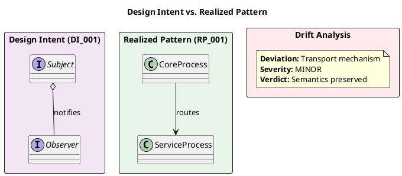

# Enhancement Proposal: Design Intent Layer (DIL)

**Proposal ID:** EP-DIL-001
**Status:** Draft
**Version:** 2.0
**Created:** 2026-01-16
**Last Modified:** 2026-01-16
**Category:** DDR System Enhancement
**Estimated Complexity:** Medium-High

---

## 1. Executive Summary

This proposal introduces a **Design Intent Layer (DIL)**—a meta-layer mechanism that enriches DDR documentation by associating architectural elements with established design patterns and flow topologies. The DIL leverages Sphinx-Needs' native PlantUML integration and custom Need Types to create traceable Design Intent associations that propagate contextual intent through the DDR tier hierarchy.

### 1.1 Core Value Proposition

| Benefit | Description |
|---------|-------------|
| **Design Continuity** | Patterns established at SAD tier influence implementation decisions at ISP tier |
| **Drift Detection** | Programmatic comparison of intended vs. realized patterns identifies architectural drift |
| **Agent Context Enhancement** | Downstream agents receive enriched context from upstream design intent |
| **Visual Validation** | PlantUML diagrams enable multimodal comparison of ideal vs. actual structures |
| **Knowledge Capture** | Implicit pattern decisions become explicit, traceable documentation |

### 1.2 Alignment with DDR Principles

The DIL directly supports established DDR protocols:

| DDR Protocol | DIL Support |
|--------------|-------------|
| **Information Flow** | Design Intent cascades downward through tiers |
| **Traceability Chain** | Pattern associations create additional traceability links |
| **Impact Analysis** | Drift detection identifies downstream effects of deviations |
| **Abstraction Downward** | Pattern templates guide child decomposition |

---

## 2. Problem Statement

### 2.1 Current State

The DDR System establishes hierarchical traceability from Business Requirements (BRD) through Implementation Specifications (ISP). This traceability focuses on **what** is being built (requirements → specifications → implementation) but does not explicitly capture **how** architectural decisions should manifest as patterns.

### 2.2 Gap Analysis

| Gap | Description | Impact |
|-----|-------------|--------|
| **No Pattern Association** | SAD elements describe architecture but don't associate with recognized design patterns | Agents lack structural vocabulary |
| **No Design Intent Propagation** | Downstream tiers lack context about intended structural relationships | Implementation decisions are disconnected from architectural vision |
| **No Drift Detection** | Implementation may diverge from architectural intent without detection | Technical debt accumulates silently |
| **Implicit Knowledge Loss** | Pattern decisions exist only in human understanding | Knowledge is not transferable to agents |

### 2.3 Motivating Scenario

Consider a Hub-and-Spoke message routing architecture (SAD-tier):

```
Current State (SAD tier):
  "Core Process acts as central ROUTER; Services are DEALER endpoints."

Missing Information:
  - This implements the Observer pattern
  - Core Process is the SUBJECT role
  - Services are the OBSERVER role
  - Expected multiplicity: 1 Subject, N Observers
  - Notification mechanism: Message dispatch
```

Without explicit pattern association, an ISP-tier agent implementing this architecture has no structured guidance about expected relationships, leading to potential structural drift.

---

## 3. Proposed Solution

### 3.1 Design Intent Layer Architecture

The DIL introduces a parallel meta-layer that shadows the SAD and ISP tiers, associating elements with design pattern templates and enabling comparison between intention and realization.

```
┌───────────────────────────────────────────────────────────────────────────────┐
│                        DDR Hierarchy with Design Intent Layer                 │
├───────────────────────────────────────────────────────────────────────────────┤
│                                                                               │
│  BRD ────► NFR ────► FSD ────► SAD ────────────► ICD ────► TDD ────► ISP     │
│                                  │                                    │       │
│                                  ▼                                    ▼       │
│                           ┌───────────┐                        ┌───────────┐  │
│                           │  DIL-SAD  │                        │  DIL-ISP  │  │
│                           │  (Intent) │  ─────────────────►    │ (Realized)│  │
│                           └───────────┘     propagates         └───────────┘  │
│                                  │          via context               │       │
│                                  │                                    │       │
│                                  └────────────┬───────────────────────┘       │
│                                               ▼                               │
│                                        ┌─────────────┐                        │
│                                        │Drift Report │                        │
│                                        │ (Automated) │                        │
│                                        └─────────────┘                        │
└───────────────────────────────────────────────────────────────────────────────┘
```

**Key Architectural Properties:**

1. **Non-Invasive**: DIL exists alongside existing tiers, not replacing them
2. **Optional**: Documentation remains valid without DIL elements
3. **Traceable**: DIL elements reference SAD/ISP elements via Sphinx-Needs links
4. **Generative**: DIL elements are generated by specialized agents, not authored manually

### 3.2 Custom Sphinx-Needs Types

Define new Need types for Design Intent elements in `conf.py`:

```python
# Design Intent Layer Custom Need Types
needs_types = [
    # Existing DDR types preserved...

    # DIL-SAD: Design Intent (what patterns SHOULD exist)
    dict(
        directive="intent",
        title="Design Intent",
        prefix="DI_",
        color="#9B59B6",     # Purple - conceptual/aspirational
        style="node"
    ),

    # DIL-ISP: Realized Pattern (what patterns ACTUALLY exist)
    dict(
        directive="realized",
        title="Realized Pattern",
        prefix="RP_",
        color="#27AE60",     # Green - implemented/concrete
        style="node"
    ),

    # Drift Element (divergence between intent and realization)
    dict(
        directive="drift",
        title="Pattern Drift",
        prefix="DRIFT_",
        color="#E74C3C",     # Red - attention required
        style="node"
    ),
]

# Custom link types for DIL traceability
needs_extra_links = [
    {
        "option": "intends",
        "incoming": "is intended by",
        "outgoing": "intends pattern for",
        "copy": False,
        "color": "#9B59B6"
    },
    {
        "option": "realizes",
        "incoming": "is realized by",
        "outgoing": "realizes intent",
        "copy": False,
        "color": "#27AE60"
    },
    {
        "option": "drifts_from",
        "incoming": "has drift",
        "outgoing": "drifts from",
        "copy": False,
        "color": "#E74C3C"
    },
]

# Custom options for DIL metadata
needs_extra_options = [
    "pattern_name",       # Observer | Strategy | Factory | etc.
    "pattern_category",   # Behavioral | Structural | Creational | Flow
    "pattern_role",       # SUBJECT | OBSERVER | CONTEXT | STRATEGY | etc.
    "confidence",         # HIGH | MEDIUM | LOW
    "drift_severity",     # CONFORMANT | MINOR | MAJOR | DIVERGENT
    "role_assignments",   # JSON object mapping tag IDs to roles
]
```

### 3.3 Pattern Template Library

A constrained set of pattern templates reduces classification variability and provides structured role definitions.

#### 3.3.1 Pattern Categories

| Category | Purpose | Example Patterns |
|----------|---------|------------------|
| **Structural** | Object composition and relationships | Adapter, Facade, Proxy, Composite |
| **Behavioral** | Object interaction and communication | Observer, Strategy, Command, State |
| **Creational** | Object instantiation mechanisms | Factory, Singleton, Builder, Prototype |
| **Flow** | Process execution topologies | Sequential, Parallel, Pipeline, Event-Driven |

#### 3.3.2 Pattern Definition Schema

Each pattern template defines:

```yaml
# Example: patterns/observer.yaml
name: Observer
category: Behavioral
intent: "Define one-to-many dependency where state changes notify dependents"

participants:
  - role: SUBJECT
    multiplicity: "1"
    responsibilities:
      - "Maintain list of observers"
      - "Provide attach/detach interface"
      - "Notify observers on state change"

  - role: OBSERVER
    multiplicity: "0..*"
    responsibilities:
      - "Define update interface"
      - "React to subject notifications"

  - role: CONCRETE_SUBJECT
    multiplicity: "1"
    responsibilities:
      - "Store state of interest"
      - "Send notifications when state changes"

  - role: CONCRETE_OBSERVER
    multiplicity: "0..*"
    responsibilities:
      - "Maintain reference to subject"
      - "Implement update to stay consistent"

relationships:
  - source: SUBJECT
    target: OBSERVER
    type: aggregation
    multiplicity: "1 to *"

  - source: CONCRETE_SUBJECT
    target: SUBJECT
    type: inheritance

  - source: CONCRETE_OBSERVER
    target: OBSERVER
    type: inheritance

plantuml_template: |
  @startuml {diagram_name}
  !define SUBJECT_COLOR #FFE5E5
  !define OBSERVER_COLOR #E5F5FF

  interface Subject <<{subject_tag}>> SUBJECT_COLOR {
    +attach(observer)
    +detach(observer)
    +notify()
  }

  interface Observer <<{observer_tags}>> OBSERVER_COLOR {
    +update()
  }

  Subject "1" o-- "0..*" Observer : notifies
  @enduml
```

#### 3.3.3 Supported Patterns (Initial Set)

**Behavioral Patterns:**
| Pattern | Roles | Use Case |
|---------|-------|----------|
| Observer | SUBJECT, OBSERVER | Event notification, pub/sub |
| Strategy | CONTEXT, STRATEGY, CONCRETE_STRATEGY | Algorithm encapsulation |
| Command | INVOKER, COMMAND, RECEIVER | Request encapsulation |
| State | CONTEXT, STATE, CONCRETE_STATE | State-dependent behavior |
| Chain of Responsibility | HANDLER, CONCRETE_HANDLER | Handler pipelines |

**Structural Patterns:**
| Pattern | Roles | Use Case |
|---------|-------|----------|
| Adapter | TARGET, ADAPTER, ADAPTEE | Interface translation |
| Facade | FACADE, SUBSYSTEM | Simplified interface |
| Proxy | SUBJECT, PROXY, REAL_SUBJECT | Access control |
| Decorator | COMPONENT, DECORATOR | Wrapper extensions |

**Flow Patterns:**
| Pattern | Characteristics | Use Case |
|---------|-----------------|----------|
| Sequential | Linear execution, single path | Simple workflows |
| Parallel | Fork-join, concurrent execution | Independent subtasks |
| Pipeline | Stage-based, transformation chain | Data processing |
| Event-Driven | Async, reactive execution | Message-based systems |

---

## 4. Implementation Mechanism

### 4.1 DIL-SAD: Design Intent Association

An AI agent specializing on the SAD tier analyzes architectural elements and proposes pattern associations.

#### 4.1.1 Agent Input Context

```yaml
# Context provided to SAD-tier agent
input:
  needs_json: "docs/_build/json/needs.json"
  scope_filter: "SAD-*"  # Only SAD-tier elements
  pattern_library: "patterns/*.yaml"

  elements:
    - id: "SAD-1"
      type: "arch"
      title: "Hub-and-Spoke Topology"
      content: "Core Process acts as central ROUTER..."
      links:
        satisfies: ["FSD-2", "FSD-3"]

    - id: "SAD-2"
      type: "arch"
      title: "Service Registration"
      content: "Services register with Core..."
      links:
        satisfies: ["FSD-4"]
```

#### 4.1.2 Agent Output: Design Intent Directive

```rst
.. intent:: Hub-Spoke Observer Intent
   :id: DI_001
   :pattern_name: Observer
   :pattern_category: Behavioral
   :confidence: HIGH
   :intends: SAD-1, SAD-2, SAD-3

   :role_assignments: {"SAD-1": "SUBJECT", "SAD-2": "OBSERVER", "SAD-3": "OBSERVER"}

   The Hub-and-Spoke topology maps to the **Observer** pattern:

   - **Subject Role** (SAD-1): Core Process maintains routing table and notifies services
   - **Observer Role** (SAD-2, SAD-3): Services receive state updates via message dispatch

   **Structural Expectation:**

   - Single Subject (Core Process)
   - Multiple Observers (Services)
   - Attach/Detach via service registration
   - Notify via message routing

   .. uml::

      @startuml DI_001_Observer_Intent
      !define SUBJECT_COLOR #FFE5E5
      !define OBSERVER_COLOR #E5F5FF

      title Design Intent: Observer Pattern

      interface Subject <<SAD-1>> SUBJECT_COLOR {
        +attach(observer)
        +detach(observer)
        +notify()
      }

      interface Observer <<SAD-2, SAD-3>> OBSERVER_COLOR {
        +update()
      }

      Subject "1" o-- "0..*" Observer : notifies

      note right of Subject
        Core Process
        Message Router
      end note

      note right of Observer
        Service Processes
        Message Consumers
      end note
      @enduml
```

### 4.2 DIL-ISP: Realized Pattern Association

An AI agent specializing on the ISP tier examines implementation specifications and identifies realized patterns, comparing against upstream Design Intents.

#### 4.2.1 Agent Input Context

```yaml
# Context provided to ISP-tier agent
input:
  needs_json: "docs/_build/json/needs.json"
  scope_filter: "ISP-*"

  # Upstream context from DIL-SAD
  design_intents:
    - id: "DI_001"
      pattern_name: "Observer"
      role_assignments:
        SAD-1: "SUBJECT"
        SAD-2: "OBSERVER"
        SAD-3: "OBSERVER"
      intends: ["SAD-1", "SAD-2", "SAD-3"]
```

#### 4.2.2 Agent Output: Realized Pattern Directive

```rst
.. realized:: Message Router Implementation
   :id: RP_001
   :pattern_name: Observer
   :pattern_category: Behavioral
   :realizes: DI_001
   :drift_severity: MINOR

   :role_assignments: {"ISP-1": "SUBJECT", "ISP-2": "OBSERVER", "ISP-3": "OBSERVER"}

   Implementation realizes the **Observer** pattern with transport-layer modifications:

   - **Subject Role** (ISP-1): ``CoreProcess.message_router`` maintains routing table
   - **Observer Role** (ISP-2, ISP-3): ``ServiceProcess.handle_message`` receives notifications

   **Implementation Detail:**

   - Attach: ``register_service()`` via ZMQ DEALER socket
   - Detach: Socket disconnection (implicit)
   - Notify: ``route_message()`` via ZMQ ROUTER dispatch

   **Variance from Intent:**

   - Transport: ZMQ sockets instead of direct method calls
   - Decoupling: Process isolation instead of object references

   .. uml::

      @startuml RP_001_Observer_Realized
      !define SUBJECT_COLOR #E5FFE5
      !define OBSERVER_COLOR #E5F5FF

      title Realized Pattern: Observer via ZMQ

      class CoreProcess <<Subject>> SUBJECT_COLOR {
        -routing_table: Dict
        +register_service()
        +route_message()
      }

      class ServiceProcess <<Observer>> OBSERVER_COLOR {
        -socket: zmq.Socket
        +handle_message()
      }

      CoreProcess "1" --> "0..*" ServiceProcess : routes via ZMQ

      note right of CoreProcess
        ISP-1: Core service
        ZMQ ROUTER socket
      end note
      @enduml
```

### 4.3 Drift Detection and Reporting

Programmatic comparison identifies structural deviations between Design Intent and Realized Pattern.

#### 4.3.1 Drift Severity Classification

| Severity | Criteria | Required Action |
|----------|----------|-----------------|
| **CONFORMANT** | Realized pattern matches intent exactly | None |
| **MINOR** | Implementation varies but preserves pattern semantics | Document in drift:: element |
| **MAJOR** | Significant structural deviation from intent | Review with architect |
| **DIVERGENT** | Implementation contradicts design intent | Escalate for remediation |

#### 4.3.2 Drift Detection Criteria

```yaml
# Drift detection rules
detection_rules:
  participant_count:
    description: "Role counts must match intent"
    check: "realized.role_count(role) == intent.role_count(role)"
    violation_severity: MAJOR

  relationship_preservation:
    description: "Core relationships must exist"
    check: "all(rel in realized for rel in intent.relationships)"
    violation_severity: MAJOR

  multiplicity_compliance:
    description: "Multiplicities must be satisfied"
    check: "realized.multiplicity(role) in intent.multiplicity_range(role)"
    violation_severity: MINOR

  transport_substitution:
    description: "Communication mechanism may vary"
    check: "realized.achieves_same_semantics(intent)"
    violation_severity: MINOR
```

#### 4.3.3 Drift Element Directive

```rst
.. drift:: ZMQ Transport Substitution
   :id: DRIFT_001
   :drift_severity: MINOR
   :drifts_from: DI_001
   :realized_by: RP_001

   **Deviation Description:**

   Direct observer callbacks replaced with ZMQ message passing.

   **Justification:**

   ZMQ provides process isolation and network transparency, enabling:

   - Independent process lifecycles
   - Network-distributed deployment
   - Language-agnostic service implementations

   **Architectural Impact Assessment:**

   - Pattern semantics: **Preserved** (notification still occurs)
   - Coupling: **Reduced** (processes vs. objects)
   - Complexity: **Increased** (network layer introduced)

   **Verdict:** Acceptable deviation with documented rationale.
```

---

## 5. Agent Workflow Integration

### 5.1 SAD-Tier Agent Workflow

```
┌───────────────────────────────────────────────────────────────────────────────┐
│                          SAD Agent Workflow (DIL-SAD)                         │
├────────────────────┬──────────────────────────────────────────────────────────┤
│ 1. INGEST          │ Load needs.json, filter to SAD-tier elements            │
│                    │ Load pattern template library                            │
├────────────────────┼──────────────────────────────────────────────────────────┤
│ 2. ANALYZE         │ Extract element titles, content, and relationships       │
│                    │ Identify clusters of related elements                    │
├────────────────────┼──────────────────────────────────────────────────────────┤
│ 3. CLASSIFY        │ Match element clusters to pattern templates              │
│                    │ Assign pattern roles to individual elements              │
│                    │ Assess confidence level (HIGH/MEDIUM/LOW)                │
├────────────────────┼──────────────────────────────────────────────────────────┤
│ 4. GENERATE        │ Create intent:: directives with role assignments         │
│                    │ Populate PlantUML diagrams from templates                │
├────────────────────┼──────────────────────────────────────────────────────────┤
│ 5. OUTPUT          │ Write RST file: docs/07_dil/dil_sad.rst                  │
│                    │ Update needs.json with DIL elements                      │
└────────────────────┴──────────────────────────────────────────────────────────┘
```

### 5.2 ISP-Tier Agent Workflow

```
┌───────────────────────────────────────────────────────────────────────────────┐
│                          ISP Agent Workflow (DIL-ISP)                         │
├────────────────────┬──────────────────────────────────────────────────────────┤
│ 1. INGEST          │ Load needs.json, filter to ISP-tier elements            │
│                    │ Load upstream DIL-SAD Design Intents                     │
├────────────────────┼──────────────────────────────────────────────────────────┤
│ 2. CORRELATE       │ Map ISP elements to SAD elements via traceability       │
│                    │ Inherit pattern context from Design Intents              │
├────────────────────┼──────────────────────────────────────────────────────────┤
│ 3. REALIZE         │ Identify actual pattern implementations in ISP          │
│                    │ Assign realized roles to ISP elements                    │
├────────────────────┼──────────────────────────────────────────────────────────┤
│ 4. COMPARE         │ Execute drift detection rules                            │
│                    │ Classify deviation severity                              │
│                    │ Generate drift:: elements for variances                  │
├────────────────────┼──────────────────────────────────────────────────────────┤
│ 5. VISUALIZE       │ Generate realized PlantUML diagrams                      │
│                    │ Create side-by-side comparison views                     │
├────────────────────┼──────────────────────────────────────────────────────────┤
│ 6. OUTPUT          │ Write RST file: docs/07_dil/dil_isp.rst                  │
│                    │ Generate drift report: _build/dil_drift_report.md        │
└────────────────────┴──────────────────────────────────────────────────────────┘
```

### 5.3 Context Propagation Mechanism

Design Intents provide downstream agents with structured context:

| Context Element | Purpose | Example |
|-----------------|---------|---------|
| **Pattern Name** | Shared vocabulary for structural discussion | "Observer" |
| **Role Assignments** | Expected responsibilities for elements | `{SAD-1: SUBJECT}` |
| **Relationship Expectations** | Required structural connections | "Subject aggregates Observers" |
| **Multiplicity Constraints** | Cardinality requirements | "1 Subject, 0..* Observers" |
| **PlantUML Diagram** | Visual reference for intended structure | `DI_001_Observer_Intent.svg` |

---

## 6. PlantUML Integration Strategy

### 6.1 Sphinx-Needs Native Support

Sphinx-Needs includes built-in PlantUML support via `sphinxcontrib-plantuml`. Diagrams can be embedded directly within Need directive content.

**Configuration:**
```python
# conf.py
extensions = [
    'sphinx_needs',
    'sphinxcontrib.plantuml',
]

# PlantUML rendering options
plantuml_output_format = 'svg'

# Option 1: Local JAR (requires Java)
plantuml = 'java -jar C:/path/to/plantuml.jar'

# Option 2: PlantUML Server (recommended for CI/CD)
# plantuml = 'http://www.plantuml.com/plantuml'
```

### 6.2 Semantic Styling Convention

Assign semantic meaning to PlantUML visual elements for consistent interpretation:

#### 6.2.1 Color Semantics

| Color Code | Hex | Meaning |
|------------|-----|---------|
| Intent Purple | `#9B59B6` | Design Intent (aspirational) |
| Realized Green | `#27AE60` | Realized Pattern (implemented) |
| Drift Red | `#E74C3C` | Pattern Drift (deviation) |
| Subject Rose | `#FFE5E5` | Subject/Publisher role |
| Observer Blue | `#E5F5FF` | Observer/Subscriber role |
| Context Yellow | `#FFFFE5` | Context/Container role |
| Strategy Lavender | `#E8E0F0` | Strategy/Algorithm role |

#### 6.2.2 Line Style Semantics

| Line Style | PlantUML Syntax | Meaning |
|------------|-----------------|---------|
| Solid Arrow | `-->` | Direct relationship |
| Dashed Arrow | `..>` | Indirect/derived relationship |
| Aggregation | `o--` | Container relationship |
| Composition | `*--` | Ownership relationship |
| Inheritance | `--|>` | Generalization |
| Implementation | `..|>` | Interface realization |

#### 6.2.3 Stereotype Conventions

```plantuml
' DDR Tag Reference
class CoreProcess <<SAD-1>> { }

' Pattern Role
class Subject <<Subject>> { }

' Combined (Tag + Role)
class CoreProcess <<SAD-1 / Subject>> SUBJECT_COLOR { }
```

### 6.3 Diagram Comparison for Drift Analysis

Generate side-by-side diagrams for multimodal agent comparison:



---

## 7. Validation Mechanism

### 7.1 Programmatic Validation

Automated checks compare Design Intent against Realized Pattern:

```python
from dataclasses import dataclass
from enum import Enum
from typing import Dict, List, Optional

class DriftSeverity(Enum):
    CONFORMANT = 0
    MINOR = 1
    MAJOR = 2
    DIVERGENT = 3

@dataclass
class DriftViolation:
    rule: str
    expected: str
    actual: str
    severity: DriftSeverity

@dataclass
class DriftReport:
    intent_id: str
    realized_id: str
    overall_severity: DriftSeverity
    violations: List[DriftViolation]
    is_acceptable: bool

def validate_pattern_realization(
    intent: Dict,
    realized: Dict
) -> DriftReport:
    """
    Compare Design Intent to Realized Pattern.

    Validation Checks:
    1. Role count matches (e.g., 1 Subject, N Observers)
    2. Relationship types preserved
    3. Multiplicity constraints satisfied
    4. Required operations present (if specified)
    """
    violations = []

    intent_roles = intent.get('role_assignments', {})
    realized_roles = realized.get('role_assignments', {})

    # Check: Each role in intent has corresponding realization
    for role, count in _count_roles(intent_roles).items():
        realized_count = _count_roles(realized_roles).get(role, 0)

        if realized_count != count:
            violations.append(DriftViolation(
                rule="PARTICIPANT_COUNT",
                expected=f"{count} {role}(s)",
                actual=f"{realized_count} {role}(s)",
                severity=DriftSeverity.MAJOR
            ))

    # Determine overall severity
    if not violations:
        overall = DriftSeverity.CONFORMANT
    else:
        overall = max(v.severity for v in violations)

    return DriftReport(
        intent_id=intent['id'],
        realized_id=realized['id'],
        overall_severity=overall,
        violations=violations,
        is_acceptable=(overall.value <= DriftSeverity.MINOR.value)
    )

def _count_roles(role_assignments: Dict[str, str]) -> Dict[str, int]:
    """Count occurrences of each role."""
    counts = {}
    for tag_id, role in role_assignments.items():
        counts[role] = counts.get(role, 0) + 1
    return counts
```

### 7.2 Agent-Assisted Validation

For complex structural comparisons beyond programmatic rules, agents can perform multimodal analysis:

1. **Render Diagrams**: Generate SVG for both Intent and Realized patterns
2. **Visual Comparison**: Use vision capabilities to identify structural differences
3. **Semantic Analysis**: Determine if differences preserve pattern semantics
4. **Natural Language Explanation**: Generate human-readable drift rationale

---

## 8. Integration with Existing DDR Infrastructure

### 8.1 needs.json Consumption

DIL agents consume the existing `needs.json` output generated by Sphinx-Needs:

```json
{
  "versions": {
    "current": {
      "needs": {
        "SAD-1": {
          "id": "SAD-1",
          "type": "arch",
          "title": "Hub-and-Spoke Topology",
          "content": "Core Process acts as central ROUTER; Services are DEALER endpoints.",
          "links": ["FSD-2", "FSD-3"],
          "docname": "04_sad/architecture"
        }
      }
    }
  }
}
```

### 8.2 DIL Output Integration

DIL elements are added to the same `needs.json` structure:

```json
{
  "DI_001": {
    "id": "DI_001",
    "type": "intent",
    "title": "Hub-Spoke Observer Intent",
    "pattern_name": "Observer",
    "pattern_category": "Behavioral",
    "confidence": "HIGH",
    "intends": ["SAD-1", "SAD-2", "SAD-3"],
    "role_assignments": {
      "SAD-1": "SUBJECT",
      "SAD-2": "OBSERVER",
      "SAD-3": "OBSERVER"
    },
    "docname": "07_dil/dil_sad"
  }
}
```

### 8.3 rebuild_docs Workflow Extension

Extend the existing `rebuild_docs` tool workflow:

```
┌─────────────────────────────────────────────────────────────────────────────┐
│                     Extended rebuild_docs Workflow                          │
├─────────────────────────────────────────────────────────────────────────────┤
│                                                                             │
│  [EXISTING STEPS]                                                           │
│  1. Build Sphinx HTML                                                       │
│  2. Generate needs.json                                                     │
│  3. Export context_flat.md                                                  │
│                                                                             │
│  [NEW DIL STEPS]                                                            │
│  4. Execute DIL-SAD Analysis                                                │
│     └─► Generate docs/07_dil/dil_sad.rst                                    │
│     └─► Update needs.json with DI_* elements                                │
│                                                                             │
│  5. Execute DIL-ISP Analysis                                                │
│     └─► Generate docs/07_dil/dil_isp.rst                                    │
│     └─► Update needs.json with RP_*, DRIFT_* elements                       │
│                                                                             │
│  6. Generate Drift Report                                                   │
│     └─► Output: _build/reports/dil_drift_report.md                          │
│     └─► Output: _build/reports/dil_drift_report.json                        │
│                                                                             │
│  7. Rebuild Sphinx (incremental)                                            │
│     └─► Include new DIL documentation                                       │
│                                                                             │
└─────────────────────────────────────────────────────────────────────────────┘
```

### 8.4 File Structure

```
docs/
├── 04_sad/
│   └── architecture.rst          # Existing SAD documentation
├── 07_dil/                        # NEW: Design Intent Layer
│   ├── index.rst                  # DIL overview and navigation
│   ├── dil_sad.rst                # Design Intent elements
│   ├── dil_isp.rst                # Realized Pattern elements
│   └── drift_summary.rst          # Aggregated drift report
├── _static/
│   └── diagrams/
│       ├── DI_001_Observer_Intent.svg
│       └── RP_001_Observer_Realized.svg
└── _build/
    ├── json/
    │   └── needs.json             # Includes DIL elements
    └── reports/
        ├── dil_drift_report.md
        └── dil_drift_report.json
```

---

## 9. Success Criteria

### 9.1 Quantitative Metrics

| Metric | Target | Measurement Method |
|--------|--------|-------------------|
| Pattern Coverage | ≥80% of SAD elements associated with patterns | `count(DI_*) / count(SAD-*)` |
| Realization Rate | ≥90% of Design Intents have Realized counterparts | `count(RP_*) / count(DI_*)` |
| Drift Detection Rate | ≥95% of structural deviations identified | Manual audit of sample |
| False Positive Rate | ≤5% of drift reports are spurious | Manual review |
| Build Time Impact | <30 seconds added to documentation build | Benchmark comparison |

### 9.2 Qualitative Criteria

| Criterion | Success Indicator |
|-----------|-------------------|
| Agent Context Improvement | Downstream agents reference DIL context in decision rationale |
| Pattern Vocabulary Adoption | Team uses consistent pattern terminology in discussions |
| Drift Visibility | Architectural deviations are surfaced before code review |
| Knowledge Retention | Pattern decisions persist across team member transitions |

---

## 10. Implementation Phases

### Phase 1: Foundation (Est. 30 hours)

**Deliverables:**
- Custom Need types added to `conf.py`
- Pattern template library (YAML schemas for 10 patterns)
- PlantUML styling convention document
- DIL tier directory structure (`docs/07_dil/`)

**Verification:**
- Sphinx builds successfully with new types
- Pattern templates validate against schema

### Phase 2: DIL-SAD Implementation (Est. 50 hours)

**Deliverables:**
- SAD-tier agent workflow specification
- Pattern classification logic
- `intent::` directive generation
- PlantUML diagram template rendering
- Integration with needs.json

**Verification:**
- Agent successfully generates DIL-SAD for sample SAD elements
- Generated diagrams render correctly in Sphinx

### Phase 3: DIL-ISP Implementation (Est. 50 hours)

**Deliverables:**
- ISP-tier agent workflow specification
- Realization detection logic
- `realized::` directive generation
- Drift detection rules and `drift::` generation
- Side-by-side diagram comparison

**Verification:**
- Agent successfully generates DIL-ISP for sample ISP elements
- Drift detection identifies known deviations

### Phase 4: Reporting & Integration (Est. 30 hours)

**Deliverables:**
- Drift report generation (Markdown, JSON)
- Integration with `rebuild_docs` workflow
- DIL documentation index and navigation
- Agent workflow documentation

**Verification:**
- Full end-to-end workflow executes successfully
- Reports accurately reflect drift status

### Total Estimated Effort: 160 hours

---

## 11. Risk Assessment

| Risk | Likelihood | Impact | Mitigation |
|------|------------|--------|------------|
| Pattern misclassification | Medium | Medium | Confidence scoring, human review for LOW confidence |
| Over-engineering simple architectures | Medium | Low | Minimum element threshold for pattern association |
| PlantUML rendering failures | Low | Medium | Fallback to text-based descriptions |
| Agent context overload | Medium | Medium | Selective propagation, relevance filtering |
| Drift report fatigue | Medium | Medium | Severity-based filtering, aggregated views |

---

## 12. Future Enhancements

### 12.1 Potential Extensions

| Enhancement | Description | Prerequisite |
|-------------|-------------|--------------|
| **TDD Coverage** | Extend DIL to TDD tier for technical design patterns | DIL-ISP stable |
| **Pattern Evolution Tracking** | Track pattern changes across DDR versions | Version control integration |
| **Automated Remediation Suggestions** | Generate fix recommendations for drifts | Drift classification stable |
| **Multi-Pattern Composition** | Detect composite patterns (e.g., MVC) | Pattern library expansion |
| **LLM-Enhanced Classification** | Use LLM for ambiguous pattern matching | Classification baseline established |

### 12.2 Integration Opportunities

- **CI/CD Pipeline**: Drift reports as pull request checks
- **IDE Integration**: Pattern hints in code editor
- **Architecture Decision Records**: Link ADRs to Design Intents

---

## 13. Appendix: Terminology

| Term | Definition |
|------|------------|
| **Design Intent (DI)** | A traceable assertion that a set of SAD elements should implement a specific design pattern |
| **Realized Pattern (RP)** | A traceable assertion that a set of ISP elements actually implements a design pattern |
| **Pattern Drift** | A documented deviation between Design Intent and Realized Pattern |
| **Role Assignment** | Mapping of DDR elements to pattern participant roles |
| **Pattern Template** | YAML schema defining a pattern's structure, roles, and relationships |
| **Drift Severity** | Classification of deviation significance (CONFORMANT, MINOR, MAJOR, DIVERGENT) |

---

## 14. References

### Internal References
- DDR Knowledge Sources: `.agent/knowledge/sources/`
- Tier Hierarchy: `.agent/knowledge/sources/concepts/tier_hierarchy.md`
- Traceability Chain: `.agent/knowledge/sources/protocols/traceability_chain.md`
- Information Flow: `.agent/knowledge/sources/concepts/information_flow.md`

### External References
- [Sphinx-Needs Documentation](https://sphinx-needs.readthedocs.io/)
- [PlantUML Language Reference](https://plantuml.com/guide)
- [Gang of Four Design Patterns](https://en.wikipedia.org/wiki/Design_Patterns)
- [Enterprise Integration Patterns](https://www.enterpriseintegrationpatterns.com/)
