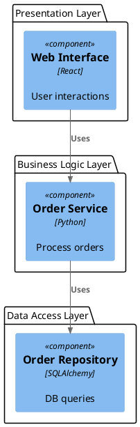
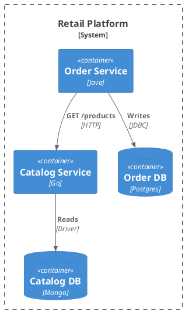
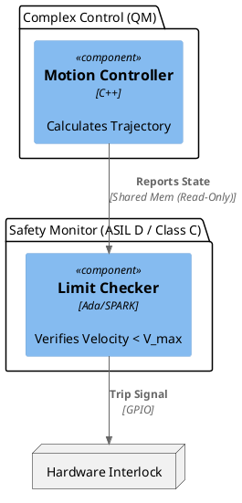

# Development Documentation Roadmap (DDR) Architecture Standards: Formal Schemas and Enforcement for Antigravity IDE v1.13.3

## Executive Summary

The modern software engineering landscape is characterized by an increasing divergence between architectural intent and implementation reality. This "architectural drift" introduces significant risks, particularly in high-assurance domains such as medical device software and critical infrastructure, where the gap between design and code can lead to catastrophic failure. To address this, Google's Antigravity IDE v1.13.3 introduces the Development Documentation Roadmap (DDR) system—a paradigm shift that treats architectural description not as static documentation, but as a compilable, verifiable, and enforceable code artifact.

This report presents an exhaustive research analysis of Industry Standard Architectural Design Structures, creating a comprehensive library of formal schemas tailored for the DDR ecosystem. By leveraging the synergistic capabilities of Sphinx, Sphinx-Needs, and PlantUML, we define a rigorous methodology for defining, selecting, and enforcing architectural patterns across all scales of development. From the lightweight strictures of layered architectures for developer tools to the mathematical rigor of the Simplex architecture for safety-critical control systems, this document establishes the "Architecture as Code" (AaC) standards required to build reliable, optimized, and compliant software.

We explore the theoretical underpinnings of these patterns, referencing foundational work in Architecture Analysis and Design Language (AADL) and SysML v2, and map them to practical implementation details within the Antigravity IDE. Furthermore, we define the Python-based enforcement mechanisms that transform these diagrams into active gatekeepers, automatically validating compliance with regulatory frameworks such as IEC 62304 and NIST SP 800-160. This report serves as the definitive reference for architects utilizing the DDR system to engineer systems that are correct by construction and verifiable by design.

---

## 1. Introduction: The Imperative for Architectural Formalism

The traditional approach to software architecture relies heavily on transient artifacts—whiteboard sketches, wiki pages, and slide decks—that effectively expire the moment coding begins. In complex systems, this lack of formalism creates a synchronization gap where the "documented architecture" becomes a fiction, disconnected from the "implemented architecture." For highly regulated industries, this disconnect is not merely an inconvenience; it is a compliance violation. The Development Documentation Roadmap (DDR) system within Antigravity IDE v1.13.3 addresses this by rooting architectural definition directly in the development lifecycle.

### 1.1 The Architecture as Code (AaC) Paradigm

Architecture as Code (AaC) posits that the architectural definition of a system should be co-located with the source code, version-controlled, and machine-readable. Within the DDR system, we utilize a toolchain that converts text-based descriptions into a structured graph database of architectural "needs."

Sphinx and Sphinx-Needs serve as the backbone of this system. Sphinx transforms reStructuredText (reST) into navigable documentation, while the Sphinx-Needs extension adds a layer of object-oriented management. It allows us to define "Need objects"—requirements, specifications, architectural components, and test cases—that have unique IDs, attributes, and traceable links. This transforms the documentation from a passive text into a queryable database, enabling architects to ask questions like, "Which components implement Safety Requirement SR-001?" or "Which test cases verify the isolation of the Safety Monitor?"

PlantUML acts as the domain-specific language (DSL) for structural definition. While often viewed as a visualization tool, when strictly constrained by the schemas defined in this report, PlantUML serves as a lightweight Architecture Description Language (ADL). It allows architects to define boundaries, components, and relationships in plain text, which the DDR system can then parse, analyze, and validate against formal rules.

### 1.2 The Antigravity IDE v1.13.3 Ecosystem

Antigravity IDE v1.13.3 integrates these tools into a seamless workflow. The DDR system is not an external plugin but a core component of the project structure. It mandates a `docs/architecture` directory where the architectural state is maintained. The IDE's build system triggers the Sphinx compilation process, which performs three critical functions:

1.  **Collection:** Aggregates all architectural definitions and requirements.
2.  **Resolution:** Resolves links and dependencies between objects.
3.  **Validation:** Executes Python-based enforcement scripts to verify that the defined architecture adheres to the selected pattern (e.g., verifying that a Microservice does not access another service's database directly).

### 1.3 Compliance as a Continuous Process

For sectors like medical devices (IEC 62304) and government security (NIST SP 800-160), compliance has traditionally been a retrospective "paperwork" exercise. The DDR system inverts this model. By defining regulatory constraints as architectural rules—for example, "Class C software units must be segregated from Class A units"—the system ensures that compliance is checked continuously. Every commit that modifies a PlantUML diagram triggers a compliance check, preventing non-compliant architectural changes from entering the main branch. This approach aligns with the "Shift Left" philosophy, moving validation to the earliest possible stage of development.

---

## 2. Library of Formal Architectural Schemas

To support projects of all scales, the DDR system defines a library of standard architectural schemas. These are not loose recommendations but formal templates with strict rules for components and connections. Architects must select a base schema for their project, which effectively sets the "rules of the road" for the automated validation tools.

### 2.1 Small-Scale Architectures: Utility and Efficiency

For developer tools, internal scripts, and small consumer applications, the primary architectural drivers are simplicity, ease of deployment, and low overhead. The complexity of distributed systems is often unjustified here.

#### 2.1.1 The Layered Architecture

The Layered Architecture is the most ubiquitous pattern for small-to-medium systems. It organizes code into horizontal layers of responsibility, typically Presentation, Business Logic, Persistence, and Database.

**Formal Definition:**
The system is partitioned into an ordered set of layers $L = \{L_1, L_2, \dots, L_n\}$, where $L_1$ is the highest layer (e.g., UI) and $L_n$ is the lowest (e.g., Infrastructure).

**Variants:**
* **Strict Layering (Closed Layers):** A component in layer $L_i$ may strictly depend only on components in the immediate layer below it, $L_{i+1}$. This maximizes isolation and makes swapping layers easier but can lead to the "Architecture Sinkhole" anti-pattern, where intermediate layers serve only as pass-throughs for data.
* **Relaxed Layering (Open Layers):** A component in layer $L_i$ may depend on any component in layer $L_j$ where $j > i$. This is more pragmatic for smaller systems but increases coupling.

**DDR Implementation (PlantUML Schema):**
In Antigravity, layers are defined using PlantUML packages. The validation script enforces the directionality of dependencies based on the package order defined in the `conf.py` configuration.



**Enforcement Mechanism:**
The DDR validation script parses the dependencies. It assigns an ordinal index to each layer. If Strict Mode is enabled, it asserts that for every dependency $A \rightarrow B$, $Index(B) == Index(A) + 1$. If Relaxed Mode is enabled, it asserts $Index(B) > Index(A)$.

#### 2.1.2 The Modular Monolith

For projects that are too complex for a simple layered approach but do not require the operational overhead of microservices, the Modular Monolith is the preferred schema.

**Formal Definition:**
The system is a single deployment unit partitioned into vertical "Modules" based on business capabilities (e.g., Billing, Shipping, Catalog). Each module encapsulates its own data and logic.

**Constraint Rules:**
1.  **Module Isolation:** Code within Module A cannot directly import internal classes from Module B.
2.  **Public API:** Communication between modules must occur exclusively through defined public interfaces (APIs) or shared events.
3.  **Shared Kernel:** A specific "Shared" module is permitted for ubiquitous utilities (logging, base types), which all other modules may depend on.

This schema is heavily supported by the DDR system to prevent the "Big Ball of Mud" anti-pattern. The validation logic checks that cross-module dependencies only target components explicitly tagged as `role="public_api"`.

### 2.2 Medium-Scale Architectures: Domain-Centric Design

As applications grow in longevity and business complexity, separating the core business rules from external technologies (frameworks, databases) becomes critical. These architectures are designed to be "framework agnostic."

#### 2.2.1 Hexagonal Architecture (Ports and Adapters)

Also known as Ports and Adapters, this pattern places the business logic at the center, surrounded by interfaces (ports) that connect to the outside world via adapters.

**Formal Definition:**
The architecture consists of two regions: the Interior (Application Core/Domain) and the Exterior (Infrastructure).
* **Dependency Rule:** All source code dependencies must point inward toward the Application Core. The Core knows nothing of the database, the web server, or external APIs.

**DDR Implementation (PlantUML Schema):**
The diagram must explicitly define the hexagon boundary. Sphinx-Needs tags are used to identify "Primary Adapters" (Driving) and "Secondary Adapters" (Driven).

```plantuml
@startuml
!include <C4/C4_Component>

package "Infrastructure (Driving)" {
 Component(rest_controller, "REST Controller", "Flask", "Primary Adapter")
}

package "Application Core" {
 Interface(input_port, "IOrderService", "Port")
 Component(order_logic, "Order Logic", "Domain Service")
 Interface(output_port, "IOrderRepository", "Port")
}

package "Infrastructure (Driven)" {
 Component(postgres_adapter, "Postgres Implementation", "SQLAlchemy", "Secondary Adapter")
}

' Valid Flows
Rel(rest_controller, input_port, "Uses")
Rel(input_port, order_logic, "Implemented By")
Rel(order_logic, output_port, "Uses")
Rel(postgres_adapter, output_port, "Implements")
@enduml
```

**Enforcement Mechanism:**
The DDR script validates the "Inward Dependency Rule." It scans all links. If a component inside the Application Core package has a Uses relationship targeting a component in Infrastructure, the build fails. This ensures that the domain remains pure and testable in isolation.

#### 2.2.2 Clean Architecture

An evolution of Hexagonal Architecture, Clean Architecture defines four concentric circles: Entities, Use Cases, Interface Adapters, and Frameworks.

**Constraint Rules:**
* **Entities:** No dependencies.
* **Use Cases:** Depend only on Entities.
* **Interface Adapters:** Depend only on Use Cases and Entities.
* **Frameworks:** Depend on Interface Adapters.

The DDR system maps these circles to Sphinx-Needs tags. A dependency matrix is generated during the build to visualize violations of these concentric boundaries.

### 2.3 Large-Scale Architectures: Distributed Systems

For enterprise solutions requiring independent scalability, fault isolation, or polyglot development, distributed patterns are necessary.

#### 2.3.1 Microservices Architecture

Microservices partition the application into small, autonomous services, each owning its own data and running in its own process.

**Formal Definition:**
A collection of loosely coupled services bounded by business contexts.
* **Database per Service:** Services must not share data storage.
* **API First:** Communication is strictly via network APIs (REST, gRPC, Messaging).

**DDR Implementation (C4 Container View):**
In Antigravity, we model Microservices at the C4 "Container" level.



**Enforcement Mechanism:**
The automated check specifically looks for "Shared Database" violations. It builds a graph where nodes are Containers and Databases. If a ContainerDb node has incoming edges from more than one Container node (excluding backup/replication nodes), it flags a critical architectural violation. This prevents the insidious coupling that turns microservices into a "distributed monolith".

#### 2.3.2 Event-Driven Architecture (EDA)

EDA decouples services temporally. Components produce events without knowledge of consumers.

**Schema Definition:**
The DDR defines a special Topic or EventStream component type.
* **Producers:** Explicitly link to the Topic with Produces.
* **Consumers:** Explicitly link to the Topic with Consumes.
* **Schema Registry:** Each Topic must be linked to a schema Need (e.g., Avro/Protobuf definition) to ensure contract validity.

### 2.4 High-Assurance and Safety-Critical Architectures

For industries such as medical devices (IEC 62304), automotive (ISO 26262), and avionics, the primary drivers are safety, determinism, and fault tolerance. These patterns are the most rigorously defined within the DDR system.

#### 2.4.1 Monitor-Actuator Pattern

This pattern is fundamental for systems where a failure in the primary function could lead to harm. It is explicitly referenced in safety literature for achieving high integrity with lower-integrity components.

**Formal Definition:**
The system comprises two parallel channels:
1.  **Actuator Channel (Primary):** Performs the complex control function. It may be highly complex and difficult to verify fully (e.g., running on a general-purpose OS).
2.  **Monitor Channel (Safety):** A simpler, independent unit that observes the Actuator or the physical environment. It has a single responsibility: verify safety constraints. If a constraint is violated, it triggers a safe state (e.g., halting the motor).

**Constraint Rules:**
* **Independence:** The Monitor must run on diverse hardware or a separated partition to prevent common-mode failures.
* **Simplicity:** The Monitor code must be simple enough to be formally verified.
* **Authority:** The Monitor must have hardware-level authority to override the Actuator (e.g., via a hardware interlock or non-maskable interrupt).

**DDR Implementation (PlantUML with AADL Mapping):**
While PlantUML defines the structure, we map these components to AADL (Architecture Analysis and Design Language) concepts using stereotypes. AADL is the industry standard for modeling performance and safety properties.



**Enforcement Mechanism:**
The DDR validation script checks the "Safety Classification" attribute of the components.
* If monitor is Class C (IEC 62304), it must NOT depend on any Class A/B component.
* The script verifies that the data flow from actuator to monitor is strictly one-way (Read-Only) or mediated by a verified IPC mechanism, preventing the complex channel from corrupting the safety channel.

#### 2.4.2 Simplex Architecture

Developed by the Software Engineering Institute (SEI), the Simplex architecture allows for the safe use of high-performance, unverified controllers (e.g., Machine Learning models) in safety-critical systems.

**Mechanism:**
* **High-Assurance Kernel:** A verified microkernel or hypervisor.
* **Safety Controller:** A simple, reliable controller (e.g., PID) that keeps the system within a safe envelope.
* **Complex Controller:** Advanced, unverified controller (e.g., Neural Network).
* **Decision Module:** Monitors the physical state. If the Complex Controller pushes the system towards the boundary of the safe envelope, the Decision Module switches control to the Safety Controller.

**DDR Implementation:**
The DDR defines the Decision Module as a distinct architectural asset. The validation logic enforces that the Complex Controller has no direct access to physical actuators. All actuation commands must pass through the Decision Module. This "Simplex Rule" is hard-coded into the validation scripts for projects tagged as `type: safety_critical`.

#### 2.4.3 MILS (Multiple Independent Levels of Security)

For government and defense applications, MILS provides a robust approach to information security.

**Formal Definition:**
The system is divided into isolated partitions managed by a separation kernel. Communication is only possible through strictly defined, kernel-mediated channels.
* **Partitions:** Groups of components with the same security classification.
* **Cross-Domain Solutions (CDS):** Trusted components allowed to move data between partitions (e.g., a "Guard" that sanitizes data moving from Low to High security).

**Enforcement:**
The DDR treats partitions as "Security Domains." The validation script utilizes a Bell-LaPadula model logic: "No Read Up, No Write Down" (unless explicitly authorized via a CDS Need).

---

## 3. The Development Documentation Roadmap (DDR) System

The DDR system is the engine that operationalizes these schemas. It serves as the bridge between the conceptual definitions (Section 2) and the automated verification (Section 4).

### 3.1 The DDR Metamodel: Sphinx-Needs Configuration

To represent architectural concepts as data, we configure `conf.py` in Sphinx to define custom Need types. This creates a domain-specific metamodel for our architecture.

**Configuration Strategy:**
We define types that mirror the software lifecycle, enabling full traceability from the "Problem Space" (Requirements) to the "Solution Space" (Architecture & Code).

```python
# conf.py - Antigravity DDR Configuration

needs_types = [...]

# Define extra attributes for compliance
needs_extra_options = [...]

# Strict Validation of Links
needs_flow_configs = {
 'compliance_trace': """
 skinparam componentStyle uml2
 class "Risk" as risk
 class "Requirement" as req
 class "Component" as arch
 class "Test" as test

 risk --> req : mitigated_by
 req --> arch : implemented_by
 arch --> test : verified_by
 """
}
```

This configuration ensures that every architectural component (arch) has fields for safety classification and AADL mapping, which are essential for the high-assurance patterns.

### 3.2 PlantUML as a Formal Schema Language

While PlantUML is text-based, it is often used loosely. The DDR imposes a strict syntax to ensure diagrams are machine-parsable and unambiguous.

**Syntactic Rules:**
1.  **Stereotyping:** Every element must have a stereotype indicating its architectural role (e.g., `<<Service>>`, `<<Layer>>`, `<<SafetyMonitor>>`).
2.  **Tagging:** Elements must use the `$tags` feature (supported in C4-PlantUML) to link back to the Sphinx-Need ID.
    * Example: `Component(mon, "Monitor", "C++", $tags="ARCH_MON_01+safety_critical")`
3.  **Explicit Directionality:** Relative positioning (e.g., `-`) is forbidden for dependencies. Directional arrows (`-->`) must be used to indicate data/control flow.

### 3.3 Architecture Decision Records (ADRs)

Architecture is the sum of decisions made. The DDR system formalizes the recording of these decisions using the decision need type. This creates an immutable log of why a specific pattern was chosen.

**ADR Template in Sphinx:**

```rst
.. decision:: Selection of Monitor-Actuator for Infusion Control
 :id: ADR_005
 :status: accepted
 :date: 2025-10-12
 :safety_class: C
 :links: REQ_SAFE_09

 **Context:** The infusion pump control loop has a catastrophic failure mode (overdose).
 **Decision:** We selected the Monitor-Actuator pattern over Simplex.
 **Rationale:** Simplex was rejected due to the complexity of implementing the decision module on the target microcontroller. Monitor-Actuator provides sufficient safety guarantees (IEC 62304 compliance) with lower hardware overhead.
 **Consequences:** Requires dual-core microcontroller with lockstep support.
```

By linking the ADR to the Requirement (`REQ_SAFE_09`), we create a traceability chain that explains the architectural choice in the context of the user needs.

---

## 4. Automated Enforcement and Verification

The most significant innovation of the DDR system is its active enforcement capability. It transforms the architectural "roadmap" from a passive guide into an active gatekeeper. This is achieved through a validation pipeline that extracts structure from diagrams and validates it against the rules defined in Section 2.

### 4.1 The Validation Pipeline: XMI Extraction

Directly parsing PlantUML text is error-prone due to syntactic flexibility. The DDR utilizes PlantUML's ability to export to XMI (XML Metadata Interchange), a standard format for UML models.

**Pipeline Steps:**
1.  **Source:** Architect edits `architecture.puml`.
2.  **Build Trigger:** Sphinx build initiates.
3.  **Extraction:** The build process invokes `java -jar plantuml.jar -txmi architecture.puml`. This generates `architecture.xmi`.
4.  **Parsing:** A Python script (`arch_validator.py`) loads the XMI file using `xml.etree.ElementTree` or a specialized library. It constructs a NetworkX graph representation of the architecture.
5.  **Validation:** The graph is analyzed against the constraints of the selected schema (e.g., Layered, Microservices).
6.  **Result:** If violations are found, the build fails with a descriptive error.

### 4.2 Python Validation Logic

Below are examples of the Python logic used to enforce specific architectural rules.

**Enforcing Strict Layering (Anti-Sinkhole):**

```python
def validate_layers(graph, layer_order):
 """
 Ensures dependencies only flow from Layer N to Layer N+1.
 layer_order: dict mapping Component ID to Layer Index (0=Top)
 """
 for edge in graph.edges():
 src, target = edge
 src_layer = layer_order.get(src)
 tgt_layer = layer_order.get(target)

 if src_layer is None or tgt_layer is None: continue

 # Strict Rule: Dependency must be to the immediate next layer
 if tgt_layer != src_layer + 1:
 raise ArchitectureViolation(
 f"Layer Violation: {src} (L{src_layer}) accesses {target} (L{tgt_layer}). "
 f"Strict layering requires access only to L{src_layer + 1}."
 )
```

**Enforcing Safety Isolation (IEC 62304):**

```python
def validate_safety_isolation(graph, needs_db):
 """
 Ensures High Assurance components do not depend on Low Assurance ones.
 """
 for edge in graph.edges():
 src, target = edge
 src_need = needs_db.get(src) # Retrieve Sphinx-Need object
 tgt_need = needs_db.get(target)

 src_class = src_need.get("safety_class", "A")
 tgt_class = tgt_need.get("safety_class", "A")

 # Mapping: C > B > A.
 # Rule: Higher class cannot depend on Lower class.
 if safety_rank(src_class) > safety_rank(tgt_class):
 raise ArchitectureViolation(
 f"Safety Violation: Class {src_class} component '{src}' "
 f"depends on Class {tgt_class} component '{target}'. "
 "This violates IEC 62304 segregation requirements."
 )
```

### 4.3 Custom Sphinx-Needs Filters

Beyond structural validation, we need to validate traceability completeness. Are all requirements implemented? Are all components tested? We use Sphinx-Needs filter functions for this.

**Filter Example: Verify Safety Traceability**

The following filter function can be used in a report to list any Safety Requirement that lacks a link to a specific architectural component or test case.

```python
# filter_files.py
def verify_safety_coverage(needs, results, **kwargs):
 """
 Filters for Safety Requirements that are missing implementation or verification links.
 """
 for need in needs:
 if need["type"] != "req": continue
 if "safety" not in need["tags"]: continue

 has_arch = any(n["type"] == "arch" for n in need["links_back"])
 has_test = any(n["type"] == "test" for n in need["links_back"])

 if not (has_arch and has_test):
 results.append(need) # These are the non-compliant needs
 return results
```

This allows the generation of "Compliance Gap Reports" directly within the IDE documentation.

### 4.4 Synthesis with ArchUnit

While the DDR validates the design (PlantUML), we must ensure the code matches the design. For Java/Kotlin/C# components, the DDR system can generate ArchUnit rules.

* **Workflow:** The Python validator reads the PlantUML layers and generates a JUnit test file containing ArchRule definitions.
* **Generated Rule:** `classes().that().resideInAPackage("..service..").should().onlyBeAccessed().byAnyPackage("..web..")`
    This closes the loop: Design -> DDR Validation -> Code Generation -> ArchUnit Validation.

---

## 5. Quantitative Selection Framework

Choosing the right architecture requires balancing competing qualities (e.g., scalability vs. consistency). The DDR system formalizes this selection via a Quantitative Decision Matrix.

### 5.1 The Selection Matrix

We define five key quality attributes (QAs) weighted by project context:
1.  Assurance (Safety/Security): Critical for Medical/Gov.
2.  Scalability: Critical for large user bases.
3.  Time-to-Market (TTM): Critical for startups.
4.  Maintainability: Critical for long-lifecycle projects.
5.  Cost: Infrastructure and development cost.

**Scoring Algorithm:**
$Score(Pattern) = \sum (Rating_{QA} \times Weight_{QA})$

**Ratings:** 1 (Poor) to 5 (Excellent).

### 5.2 Scenario Analysis

**Scenario A: Class C Medical Device (e.g., Pacemaker)**
Weights: Assurance (5), Maintainability (4), Scalability (1), TTM (2), Cost (3).

| Pattern | Assurance (5) | Maintainability (4) | Scalability (1) | TTM (2) | Cost (3) | Total |
| :---: | :---: | :---: | :---: | :---: | :---: | :---: |
| Monolith | 3 | 2 | 2 | 4 | 5 | 48 |
| Microservices | 1 | 2 | 5 | 2 | 1 | 25 |
| Monitor-Actuator | 5 | 4 | 2 | 2 | 3 | 56 |

**Result:** Monitor-Actuator is the clear winner. Microservices score poorly due to the complexity of validating distributed state, which is a massive liability for safety certification.

**Scenario B: High-Frequency Trading Platform**
Weights: Scalability (5), Assurance (3), TTM (4), Maintainability (2), Cost (1).

| Pattern | Assurance (3) | Maintainability (2) | Scalability (5) | TTM (4) | Cost (1) | Total |
| :---: | :---: | :---: | :---: | :---: | :---: | :---: |
| Layered | 3 | 3 | 2 | 5 | 5 | 48 |
| Event-Driven | 3 | 2 | 5 | 3 | 2 | 52 |
| Microservices | 3 | 4 | 5 | 3 | 1 | 55 |

**Result:** Microservices or Event-Driven are viable. The choice would likely come down to the specific latency requirements (favoring EDA) vs. transactional complexity (favoring Microservices).

---

## 6. Regulatory Compliance and Assurance

The rigorous enforcement provided by the DDR system is designed to generate evidence for regulatory audits.

### 6.1 IEC 62304 (Medical Device Software)

The standard requires manufacturers to define the software architecture and identify items that are safety-related.

**DDR Alignment:**
* **Architecture Definition (5.3):** The PlantUML diagrams serve as the formal architecture document.
* **SOUP (Software of Unknown Provenance):** Third-party libraries are modeled as Component artifacts with a distinct `type="SOUP"`.
* **Segregation (5.3.5):** The "Safety Isolation" script (Section 4.2) provides automated evidence that high-risk and low-risk components are effectively segregated, a key requirement for reducing the classification of the rest of the system.

### 6.2 NIST SP 800-160 (Systems Security Engineering)

NIST emphasizes the concept of "trustworthiness" and identifying security design principles.

**DDR Alignment:**
* **Least Privilege:** The validation scripts enforce that components only have the dependencies explicitly defined in the architecture. "Hidden" channels are flagged as violations.
* **Resiliency:** The inclusion of Simplex and Monitor-Actuator patterns demonstrates a commitment to "Design for Resiliency" and "Design for Fault Tolerance," satisfying the engineering rigor expected by the standard.

---

## 7. Conclusion

The Development Documentation Roadmap (DDR) system for Antigravity IDE v1.13.3 represents a maturity leap in software engineering. It acknowledges that for modern, complex, and regulated software, "good intentions" are insufficient. We require formal structures, rigorous definitions, and automated enforcement.

This report has defined a comprehensive library of architectural schemas—from the efficient Layered architecture to the high-assurance Simplex pattern—and provided the tools to implement them. By combining the descriptive power of Sphinx and PlantUML with the analytical power of Python-based validation, we empower architects to build systems that are not only theoretically sound but demonstrably compliant. The DDR system ensures that the architecture described is the architecture deployed, providing the reliability required for the next generation of critical software systems.

### Citation Reference Table

| Citation ID | Source Name | URL |
| :--- | :--- | :--- |
| 1 | Sphinx-Needs: Docs-as-Code based Life cycle management | [https://www.sphinx-needs.com/](https://www.sphinx-needs.com/) |
| 2 | Tutorial - Sphinx-Needs 6.3.0 documentation | [https://sphinx-needs.readthedocs.io/en/stable/tutorial.html](https://sphinx-needs.readthedocs.io/en/stable/tutorial.html) |
| 3 | Notation \| C4 model | [https://c4model.com/diagrams/notation](https://c4model.com/diagrams/notation) |
| 4 | C4-PlantUML GitHub | [https://github.com/plantuml-stdlib/C4-PlantUML](https://github.com/plantuml-stdlib/C4-PlantUML) |
| 5 | What Is IEC 62304? Overview | [https://www.perforce.com/blog/qac/what-iec-62304](https://www.perforce.com/blog/qac/what-iec-62304) |
| 6 | The IEC 62304 Compliance | [https://www.hardianhealth.com/insights/iec62304](https://www.hardianhealth.com/insights/iec62304) |
| 7 | Choose the Right Software Architecture Pattern (Medium) | [https://medium.com/@webelightsolutions/choose-the-right-software-architecture-pattern-for-your-project-in-2025-2c1c7ddbd14c](https://medium.com/@webelightsolutions/choose-the-right-software-architecture-pattern-for-your-project-in-2025-2c1c7ddbd14c) |
| 8 | Layers - SeedStack | [http://seedstack.org/docs/business/layers/](http://seedstack.org/docs/business/layers/) |
| 9 | Layered Architecture Style (Medium) | [https://medium.com/@mohamedsallam953/layered-architecture-style-chapter-10-fundamentals-of-software-architecture-19edf25805d1](https://medium.com/@mohamedsallam953/layered-architecture-style-chapter-10-fundamentals-of-software-architecture-19edf25805d1) |
| 10 | N-tier Architecture Style - Azure | [https://learn.microsoft.com/en-us/azure/architecture/guide/architecture-styles/n-tier](https://learn.microsoft.com/en-us/azure/architecture/guide/architecture-styles/n-tier) |
| 11 | Enterprise software architecture patterns: The complete guide | [https://vfunction.com/blog/enterprise-software-architecture-patterns/](https://vfunction.com/blog/enterprise-software-architecture-patterns/) |
| 12 | Hexagonal Architecture (Medium) | [https://newlight77.medium.com/hexagonal-architecture-a7d956dc4782](https://newlight77.medium.com/hexagonal-architecture-a7d956dc4782) |
| 13 | Hexagonal Architecture - What is it? | [https://sd.blackball.lv/en/articles/read/19658-hexagonal-architecture-what-is-it-why-should-you-use-it](https://sd.blackball.lv/en/articles/read/19658-hexagonal-architecture-what-is-it-why-should-you-use-it) |
| 14 | Hexagonal vs Layered Architecture | [https://medium.com/@josivan.arch/hexagonal-vs-layered-architecture-key-differences-every-software-engineer-should-know-4b67a4ce2ed7](https://medium.com/@josivan.arch/hexagonal-vs-layered-architecture-key-differences-every-software-engineer-should-know-4b67a4ce2ed7) |
| 15 | Clean-architecture Java: How ArchUnit can help | [https://pretius.com/blog/clean-architecture-java](https://pretius.com/blog/clean-architecture-java) |
| 16 | Monolithic vs Microservices - AWS | [https://aws.amazon.com/compare/the-difference-between-monolithic-and-microservices-architecture/](https://aws.amazon.com/compare/the-difference-between-monolithic-and-microservices-architecture/) |
| 17 | Monolithic vs microservices architecture: DX | [https://getdx.com/blog/monolithic-vs-microservices/](https://getdx.com/blog/monolithic-vs-microservices/) |
| 18 | Design Patterns for Safety-Critical Embedded Systems | [https://publications.rwth-aachen.de/record/51773/files/3273.pdf](https://publications.rwth-aachen.de/record/51773/files/3273.pdf) |
| 19 | Monitor Actuator Pair Design Pattern | [https://betterembsw.blogspot.com/2014/04/monitor-actuator-pair-design-pattern.html](https://betterembsw.blogspot.com/2014/04/monitor-actuator-pair-design-pattern.html) |
| 20 | Monitor/actuator pair conceptual diagram | [https://www.researchgate.net/figure/monitor-actuator-pair-conceptual-diagram-Figure-originally-presented-in-koopman-and_fig1_319971359](https://www.researchgate.net/figure/monitor-actuator-pair-conceptual-diagram-Figure-originally-presented-in-koopman-and_fig1_319971359) |
| 21 | Architecture Analysis and Design Language (AADL) | [https://www.sei.cmu.edu/projects/architecture-analysis-and-design-language-aadl/](https://www.sei.cmu.edu/projects/architecture-analysis-and-design-language-aadl/) |
| 22 | AADL Examples (GitHub) | [https://github.com/osate/examples/blob/master/core-examples/patterns/sense_actuate.aadl](https://github.com/osate/examples/blob/master/core-examples/patterns/sense_actuate.aadl) |
| 23 | The original Simplex architecture diagram | [https://www.researchgate.net/figure/The-original-Simplex-architecture-as-described-by-Sha-et-al-11-The-components-that_fig1_395991632](https://www.researchgate.net/figure/The-original-Simplex-architecture-as-described-by-Sha-et-al-11-The-components-that_fig1_395991632) |
| 24 | The Use of the Simplex Architecture (arXiv) | [https://arxiv.org/html/2509.21014v1](https://arxiv.org/html/2509.21014v1) |
| 25 | The System-Level Simplex Architecture (ResearchGate) | [https://www.researchgate.net/publication/221569245_The_System-Level_Simplex_Architecture_for_Improved_Real-Time_Embedded_System_Safety](https://www.researchgate.net/publication/221569245_The_System-Level_Simplex_Architecture_for_Improved_Real-Time_Embedded_System_Safety) |
| 26 | NIST Special Publication (SP) 800-160 | [https://csrc.nist.gov/files/pubs/sp/800/160/2pd/docs/sp800_160_second-draft.pdf](https://csrc.nist.gov/files/pubs/sp/800/160/2pd/docs/sp800_160_second-draft.pdf) |
| 27 | Configuration — Sphinx documentation | [https://www.sphinx-doc.org/en/master/usage/configuration.html](https://www.sphinx-doc.org/en/master/usage/configuration.html) |
| 28 | sphinx-needs configuration (GitHub) | [https://github.com/useblocks/sphinx-needs/blob/master/docs/configuration.rst?plain=true](https://github.com/useblocks/sphinx-needs/blob/master/docs/configuration.rst?plain=true) |
| 29 | ADR process - AWS | [https://docs.aws.amazon.com/prescriptive-guidance/latest/architectural-decision-records/adr-process.html](https://docs.aws.amazon.com/prescriptive-guidance/latest/architectural-decision-records/adr-process.html) |
| 30 | Maintain an architecture decision record (ADR) - Azure | [https://learn.microsoft.com/en-us/azure/well-architected/architect-role/architecture-decision-record](https://learn.microsoft.com/en-us/azure/well-architected/architect-role/architecture-decision-record) |
| 31 | PlantUML XMI | [https://plantuml.com/xmi](https://plantuml.com/xmi) |
| 32 | Filtering needs - Sphinx-Needs | [https://sphinx-needs.readthedocs.io/en/latest/filter.html](https://sphinx-needs.readthedocs.io/en/latest/filter.html) |
| 33 | How to Ensure Clean Architecture with ArchUnit? | [https://medium.com/java-and-beyond/ensuring-clean-architecture-with-archunit-91d43959e648](https://medium.com/java-and-beyond/ensuring-clean-architecture-with-archunit-91d43959e648) |
| 34 | ArchUnit User Guide | [https://www.archunit.org/userguide/html/000_Index.html](https://www.archunit.org/userguide/html/000_Index.html) |
| 35 | Decision Matrix for Software Development Teams | [https://www.larksuite.com/en_us/topics/project-management-methodologies-for-functional-teams/decision-matrix-for-software-development-teams](https://www.larksuite.com/en_us/topics/project-management-methodologies-for-functional-teams/decision-matrix-for-software-development-teams) |
| 36 | Weighted Criteria Matrix - Template & Example | [https://goleansixsigma.com/weighted-criteria-matrix/](https://goleansixsigma.com/weighted-criteria-matrix/) |
| 37 | Illustrated guide to medical device software | [https://medicaldevicehq.com/articles/the-illustrated-guide-to-medical-device-software-development-and-iec-62304/](https://medicaldevicehq.com/articles/the-illustrated-guide-to-medical-device-software-development-and-iec-62304/) |
| 38 | Draft SP 800-160 Vol. 2 | [https://csrc.nist.gov/CSRC/media/Publications/sp/800-160/vol-2/draft/documents/sp800-160-vol2-draft.pdf](https://csrc.nist.gov/CSRC/media/Publications/sp/800-160/vol-2/draft/documents/sp800-160-vol2-draft.pdf) |