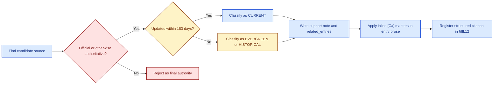
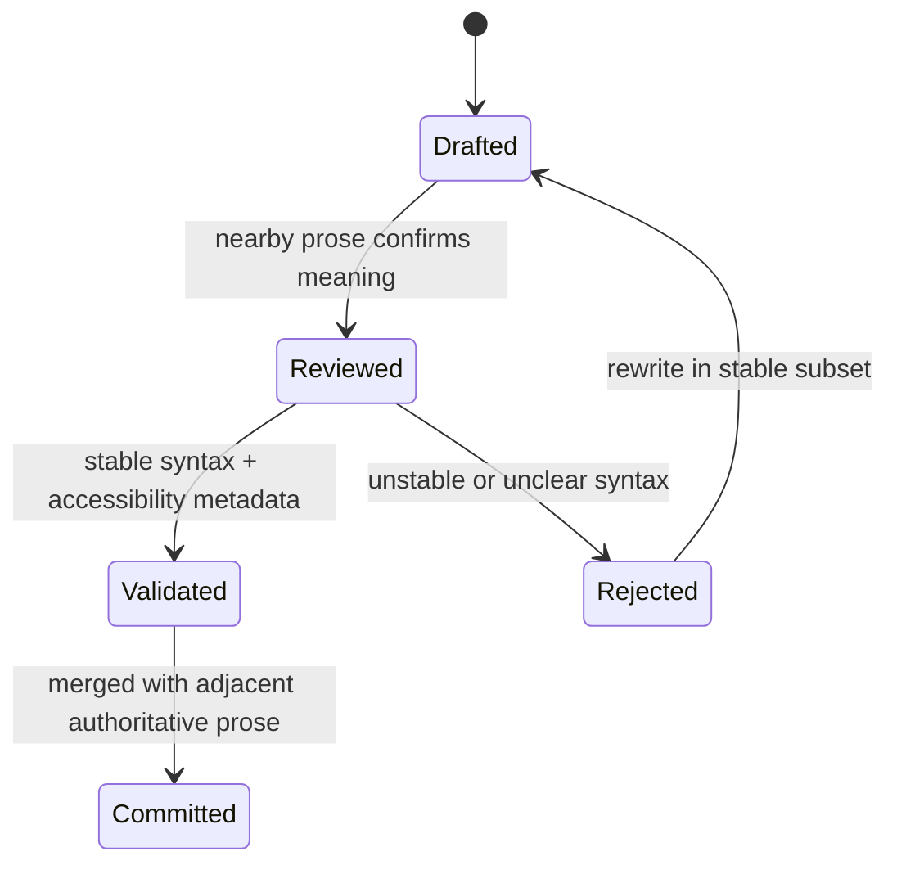

# DDR SYSTEM

## Application Framework

## Brainstorming Compendium

<style>
.brain-badge,
.brain-label {
  display: inline-block;
  padding: 0.1rem 0.45rem;
  border-radius: 0.35rem;
  border: 1px solid currentColor;
  font-weight: 700;
  line-height: 1.2;
  white-space: nowrap;
}
.brain-label {
  padding: 0 0.18rem;
  border: none;
  border-radius: 0.2rem;
}
.brain-governance { color: #166534; background: #dcfce7; }
.brain-evidence { color: #1d4ed8; background: #dbeafe; }
.brain-hypothesis { color: #0f766e; background: #ccfbf1; }
.brain-recommendation { color: #92400e; background: #fef3c7; }
.brain-risk { color: #991b1b; background: #fee2e2; }
.brain-badge.brain-governance,
.brain-badge.brain-evidence,
.brain-badge.brain-hypothesis,
.brain-badge.brain-recommendation,
.brain-badge.brain-risk {
  border-width: 1px;
}
</style>

| Property | Value |
| --- | --- |
| Document ID | DDR-BRAIN-001 |
| Base Version | DDR System v6.3 (2026-03-28) |
| Status | LIVING DOCUMENT - Append-Only Until Promoted |
| Owner | DDR Architecture Board |
| Created | {{CREATED_DATE}} |
| Last Revised | {{LAST_REVISED_DATE}} |
| Schema | BRAIN-ENTRY-1.1 |
| Reference Source | `{{SOURCE_REFERENCE_PATH}}` |

> LIVING DOCUMENT NOTICE: This document is intentionally incomplete. It is a structured collection
> point for ideas, candidates, and architectural directions that are not yet committed to any
> implementation plan. All entries are speculative unless explicitly marked `PROMOTED`. Do not
> treat any entry as an engineering decision unless it appears in the DDR System formal
> specification or a dedicated Architecture Decision Record (ADR).

## PART I — Document Manifest

Part I is permanent and immutable. It defines how this document works: its structure, the entry
schema, the classification taxonomy, conventions for adding new sections, and the governance model
for promoting ideas to formal design status. Read Part I before contributing any entry.

### §1 Document Purpose and Scope

This Brainstorming Compendium is the singular, structured repository for nascent ideas,
architectural directions, library candidates, and design hypotheses related to the construction of
a standalone application framework built on top of DDR System v6.3. It is intentionally broader
and less constrained than a formal specification so promising paths can be retained before
premature decisions eliminate them.

#### 1.1 What Belongs Here

- Application architecture and design patterns being considered for the DDR App Framework.
- Open-source library candidates with relevance to DDR concerns and commercial distribution.
- Integration hypotheses between the DDR Extension System (E1-E9) and application-layer tooling.
- UX and workflow concepts for DDR node CRUD, graph visualization, and project management.
- Data persistence, serialization, and interchange format ideas.
- Deferred or parked ideas that are not immediately actionable but worth retaining.

#### 1.2 What Does Not Belong Here

- Finalized engineering decisions. These belong in ADRs or the formal DDR specification.
- Implementation code. No production code is authored inside this document.
- Bug reports or operational issue tracking. Use the DDR Issue Tracker for those.
- Content duplicating the normative DDR System v6.3 specification. Reference it instead.

### §2 Document Structure and Navigation

The document is organized into three major Parts. Additional Parts may be added as new top-level
concept categories are identified. Every new Part must be registered in the Part Registry and
adopt the section and entry conventions defined in §3 before entries are added.

| Part | Title | Purpose |
| --- | --- | --- |
| Part I | Document Manifest | Self-description, schema, taxonomy, and governance. |
| Part II | Application Design Concepts | Architectural ideas and next-step hypotheses for the DDR App Framework. |
| Part III | Open-Source Library Candidates | Vetted and candidate OSS libraries across relevant problem domains. |

#### 2.1 Part Registry

All Parts that exist or are planned must be recorded here. Update this table when adding a new
Part.

| Part ID | Short Title | Status |
| --- | --- | --- |
| PART-I | Document Manifest | PERMANENT - DO NOT MODIFY |
| PART-II | Application Design Concepts | ACTIVE |
| PART-III | OSS Library Candidates | ACTIVE |
| PART-IV | [Reserved: UX & Workflow] | RESERVED - Not Yet Opened |
| PART-V | [Reserved: Data & Persistence] | RESERVED - Not Yet Opened |
| PART-VI | [Reserved: Deployment & Distribution] | RESERVED - Not Yet Opened |
| PART-VII | [Reserved: Parking Lot] | RESERVED - Not Yet Opened |

### §3 Entry Schema (BRAIN-ENTRY-1.1)

Every entry in this document must conform to one of the canonical entry types defined below. This
Markdown contract is normalized for agent editing, with each entry represented by a heading plus a
fenced `yaml` block.

#### 3.1 Common Fields (All Entry Types)

| Field | Type / Format | Description |
| --- | --- | --- |
| `entry_id` | `BRAIN-{PART#}-{SEQ:3d}` | Immutable identifier such as `BRAIN-II-001`. |
| `title` | `String (<=80 chars)` | Short, unambiguous label for the idea or candidate. |
| `category` | `CategoryEnum` | Controlled classification tag from §3.4. |
| `priority` | `HIGH \| MED \| LOW \| PARKED` | Current urgency for consideration. Not a commitment. |
| `status` | `StatusEnum` | Lifecycle state from §3.5. |
| `authored_by` | `String` | Initials or handle of the contributor. |
| `authored_date` | `YYYY-MM-DD` | Date the entry was first recorded. |
| `revised_date` | `YYYY-MM-DD` | Date of the most recent revision. |
| `description` | `Text` | One to three sentence summary of the concept. |
| `detail` | `Text` | Extended technical description and context. |
| `open_questions` | `List[String]` | Questions that must be answered before promotion. |
| `tags` | `List[String]` | Freeform search tags such as `#visualization` or `#E5-ARE`. |
| `ddr_relevance` | `List[TierEnum \| ExtEnum]` | DDR tiers or extensions directly affected by the entry. |
| `citation_ids` | `List[CitationId]` | Exact external citation IDs used inline by the entry. |
| `references` | `List[String]` | ADR IDs, spec sections, local artifact paths, or related brainstorm IDs only. |

#### 3.2 Idea Entry (TYPE: IDEA)

| Field | Type / Format | Description |
| --- | --- | --- |
| `motivation` | `Text` | Why the idea exists and what problem it solves. |
| `prior_art` | `Text` | Known existing solutions, patterns, or precedents. |
| `ddr_constraints` | `Text` | DDR axioms, invariants, or extension contracts the idea must respect. |
| `risks` | `Text` | Complexity, performance, licensing, or adoption risks. |
| `dependencies` | `List[String]` | Related brainstorm IDs or external dependencies. |

#### 3.3 Library Candidate Entry (TYPE: LIB)

| Field | Type / Format | Description |
| --- | --- | --- |
| `repository` | `URL or package locator` | Canonical source location. |
| `language` | `Python \| JavaScript \| Rust \| Go \| Other` | Primary implementation language. |
| `license` | `MIT \| Apache-2.0 \| BSD-2-Clause \| BSD-3-Clause \| ISC \| MPL-2.0 \| LGPL \| Other` | Primary license classification. |
| `commercial_use` | `YES \| CONDITIONAL \| NO` | Whether commercial distribution is currently acceptable. |
| `latest_release` | `String` | Release version/date snapshot or `TBD`. |
| `maintenance` | `ACTIVE \| MAINTAINED \| SLOW \| ARCHIVED` | Current maintenance signal. |
| `install_size_kb` | `Integer or TBD` | Approximate footprint. |
| `maturity` | `EXPERIMENTAL \| STABLE \| MATURE \| LEGACY` | Maturity signal for adoption planning. |
| `verdict` | `CANDIDATE \| UNDER_REVIEW \| ACCEPTED \| REJECTED \| PARKED` | Current adoption verdict. |
| `rejection_reason` | `Text` | Required only when `verdict` is `REJECTED`. |

#### 3.4 Category Taxonomy

| Category ID | Label | Applies To |
| --- | --- | --- |
| `CAT-ARCH` | Application Architecture | Structural patterns, layering, module boundaries, deployment topology. |
| `CAT-DAG` | DAG Engine | Graph construction, traversal, validation, cycle detection, topological sort. |
| `CAT-VIZ` | Visualization | Graph rendering, node and edge display, tier-map diagrams, diff views. |
| `CAT-CRUD` | Node CRUD & Editing | Node creation, reading, updating, deletion operations and UI/API surface. |
| `CAT-VALID` | Validation & Schema | JSON Schema or YAML Schema compliance and structural rule enforcement. |
| `CAT-STORE` | Data Persistence | File formats, databases, version control integration, export and import. |
| `CAT-LIFE` | Lifecycle & Operations | Status transitions, SUPERSEDE or DEPRECATE flows, operation protocol. |
| `CAT-EXT` | Extension System | E1-E9 integration, candidate pool management, ARE scoring. |
| `CAT-UX` | User Experience | Workflow design, navigation patterns, onboarding, CLI vs GUI. |
| `CAT-DIST` | Distribution & Packaging | PyPI, installers, Electron, Docker, licensing for commercial sale. |
| `CAT-AI` | AI / Agentic Integration | LLM tooling, code generation, agentic interfaces, Codex and Claude integration. |
| `CAT-TEST` | Testing & QA | Unit, integration, and property-based testing strategies. |
| `CAT-MISC` | Miscellaneous / Uncategorized | Catch-all for entries not yet classified. Re-categorize within two sessions. |

#### 3.5 Entry Status Vocabulary

| Status | Meaning | Transition Rules |
| --- | --- | --- |
| `SEED` | Newly captured, minimally described. | Any entry may start here. |
| `EXPLORING` | Actively being researched or discussed. | From `SEED` or `PARKED`. |
| `CANDIDATE` | Sufficiently developed for formal evaluation. | From `EXPLORING`; requires all common fields populated. |
| `PROMOTED` | Accepted into a formal ADR or specification. | From `CANDIDATE`; requires an ADR reference in `references`. |
| `REJECTED` | Evaluated and not adopted; retained for record. | From any status; requires `rejection_reason` or equivalent note. |
| `PARKED` | Deferred indefinitely; may be revisited later. | From any non-`PROMOTED` status. |
| `SUPERSEDED` | Replaced by a newer entry; ID preserved. | From any status; link the superseding entry in `references`. |

#### 3.6 Priority Vocabulary

| Priority | Meaning | Guidance |
| --- | --- | --- |
| `HIGH` | Actively explore in the current design cycle. | Limit to five `HIGH` entries per Part when possible. |
| `MED` | Relevant but not blocking. | Default priority for most new entries. |
| `LOW` | Peripheral; retain without active focus. | Reassess at each review cycle. |
| `PARKED` | Indefinitely deferred. | Pair with status `PARKED`. |

### §4 Rules for Adding New Sections

Follow these rules when appending new content to this document:

#### 4.1 Adding a New Entry to an Existing Section

- Assign the next sequential `entry_id` within the current Part.
- Populate all common fields. Use `TBD` only for genuinely unknown values.
- Resolve current external evidence before finalizing substantive prose.
- Add `citation_ids` for every external source used inline inside the entry.
- Reserve `references` for internal cross-links only.
- Select the type-specific fields from §3.2 or §3.3 as appropriate.
- Enter the content using the canonical heading plus fenced `yaml` block format.
- Update the relevant section index table when a new subsection is created.
- Do not renumber or remove existing IDs. Use `SUPERSEDED`, `REJECTED`, or `PARKED` instead.

#### 4.2 Adding a New Subsection Within a Part

- Number new subsections sequentially within their Part.
- Align titles to a Category ID from §3.4 unless the subsection is structural.
- Open each new subsection with a short scope statement before the first entry.

#### 4.3 Adding a New Part

- Verify that no existing Part or reserved slot already covers the intended space.
- Register the new Part in the Part Registry with status `ACTIVE` before adding entries.
- Open the new Part with a cover statement and a section index table.
- Start new IDs at `BRAIN-{PART#}-001`.

### §5 Governance and Promotion Protocol

This document is a feeder for formal design artifacts. It never becomes normative on its own.

#### 5.1 Promotion Criteria

An entry may move to `CANDIDATE` when:

- All common fields are populated without unresolved blanks other than acceptable `TBD`s.
- The `open_questions` list contains only questions that do not block understanding.
- At least one DDR tier or extension is identified in `ddr_relevance`.
- Commercial licensing viability is assessed for `LIB` entries.
- At least one `CURRENT` citation supports any factual comparison or recommendation carried forward for evaluation.

An entry may move to `PROMOTED` when:

- A corresponding ADR exists and is referenced.
- Relevant DDR owners or the Architecture Board have reviewed the proposal.
- `references` contains the ADR ID and any affected spec section.

#### 5.2 Review Cadence

- Review the document at the start of each new development cycle.
- Move entries that remain `EXPLORING` for more than two cycles to `PARKED` or `REJECTED`.
- Reassess `HIGH` priority items that show no progress after one cycle.

> IMPORTANT - DDR Axiom Alignment: No promoted idea may introduce a dependency that violates
> `AX-3` (Determinism), `AX-6` (Declarative Integrity), or `AX-7` (DAG Acyclicity). Before
> promotion, each `IDEA` entry must include an explicit statement in `ddr_constraints`
> confirming those axioms are respected or documenting the exemption rationale.

### §6 Visual Semantics and Font Color Index

This document uses a small, governed visual vocabulary so persistent rules, evidence-backed facts,
open hypotheses, recommendations, and risks can be recognized quickly without changing the
underlying Markdown authority surface.

#### 6.1 Font Color Index

| Class | Sample | Meaning | Allowed Use |
| --- | --- | --- | --- |
| `brain-governance` | <span class="brain-badge brain-governance"><strong>Governance</strong></span> | Immutable document rules, authority boundaries, and protocol statements. | Headline badges, policy labels, and manifest callouts. |
| `brain-evidence` | <span class="brain-badge brain-evidence"><strong>Evidence</strong></span> | Citation-backed external facts, release signals, and current-source support. | Citation callouts, evidence labels, and source-quality markers. |
| `brain-hypothesis` | <span class="brain-badge brain-hypothesis"><strong>Hypothesis</strong></span> | Exploratory concepts, design options, and unresolved technical paths. | Short option badges and hypothesis labels. |
| `brain-recommendation` | <span class="brain-badge brain-recommendation"><strong>Recommendation</strong></span> | Endorsed next steps or preferred directions inside the brainstorm. | Recommendation badges and concise endorsement labels. |
| `brain-risk` | <span class="brain-badge brain-risk"><strong>Risk</strong></span> | Caveats, failure modes, tradeoffs, and cautionary notes. | Risk badges and short caution labels. |

#### 6.2 Usage Rules

- Use `<span class="...">` only for short badges, labels, or callouts.
- Do not wrap full paragraphs, fenced code blocks, table cells containing YAML, or YAML keys in styled spans.
- Keep the visual system semantic, not decorative: every color choice must communicate a governed meaning.
- If a new semantic color is needed, update this index first before using it anywhere else in the document.

### §7 Citation and Research Protocol

This document requires recent, reputable, and authoritative online evidence for any substantive
assertion, recommendation, or factual comparison that is added or materially revised by an agent.

#### 7.1 Source Hierarchy

1. Official vendor or project documentation, release notes, or canonical repository releases.
2. Standards bodies, government publications, or academic sources when they directly govern the topic.
3. Reputable secondary analysis only as support, never as the final authority when an official source exists.
4. Anonymous forums, social posts, and aggregators may inform exploration but must not be the final cited authority.

#### 7.2 Citation Freshness Rules

- A citation classified as `CURRENT` must be published or materially updated within 183 days of the entry `revised_date`.
- Evergreen sources may supplement durable concepts, APIs, or repository surfaces, but they must not be the only support for a new recommendation or factual claim.
- Every citation record must capture both `published_date` and `accessed_date`.
- Every citation must list the brainstorm entries it supports in `related_entries`.

#### 7.3 Citation Application Rules

- Add inline `[C#]` markers inside prose whenever the entry makes an assumption, assertion, or recommendation.
- Keep `citation_ids` exactly aligned to the citation IDs actually used inline in the entry.
- Store all external bibliography items in §III.12. Do not embed raw external URLs in `references`.
- Prefer the smallest citation set that fully supports the claim while keeping the evidence current.

**Figure 7.1. External research and evidence normalization flow**



### §8 Mermaid Diagram Standards

Mermaid diagrams are preferred when they materially improve comprehension, but they remain
supporting visuals rather than the authority surface. Nearby prose and tables continue to govern.

#### 8.1 Supported Mermaid Diagram Types

| Type | Status | Notes |
| --- | --- | --- |
| `flowchart` | Preferred | Use for pipelines, decision funnels, and architectural flows. |
| `sequenceDiagram` | Preferred | Use for request/response or operation choreography. |
| `stateDiagram-v2` | Preferred | Use for lifecycle transitions and guarded state changes. |
| `classDiagram` | Allowed | Use for bounded structural maps where type-like relationships matter. |
| `erDiagram` | Allowed | Use for structured data shape and storage relationship sketches. |

#### 8.2 Accessibility and Stability Rules

- Every Mermaid block must include `accTitle` and `accDescr`.
- Use the stable committed subset only. Do not commit renderer-specific experimental syntax such as `architecture-beta`, `mindmap`, or ELK-only layout directives.
- Prefer `classDef`, `subgraph`, and `linkStyle` only when they improve comprehension and remain broadly renderer-compatible.
- Keep diagrams synchronized with nearby prose whenever a cited recommendation changes.

**Figure 8.1. Diagram review states for governed brainstorm visuals**



## PART II — Application Design Concepts

Part II collects architectural ideas, design pattern hypotheses, and next-step candidates for the
DDR Application Framework: the standalone application that will serve as the primary human
interface for creating, managing, and validating software engineering projects structured with the
DDR System.

### Part II — Section Index

| Section | Title | Category |
| --- | --- | --- |
| `§II.1` | Application Architecture Overview | `CAT-ARCH` |
| `§II.2` | DAG Engine Design | `CAT-DAG` |
| `§II.3` | Node CRUD and Editing Surface | `CAT-CRUD` |
| `§II.4` | Validation and Schema Enforcement | `CAT-VALID` |
| `§II.5` | Extension System Integration | `CAT-EXT` |
| `§II.6` | AI and Agentic Interface | `CAT-AI` |

### §II.1 Application Architecture Overview

This section captures early thinking about structural decomposition, module boundaries, project
storage, deployment topology, and the application's relationship to the DDR files it manages.

#### [BRAIN-II-001] Three-Layer Application Architecture

```yaml
entry_type: IDEA
entry_id: BRAIN-II-001
title: Three-Layer Application Architecture
category: CAT-ARCH
priority: HIGH
status: EXPLORING
authored_by: DDR-AB
authored_date: 2026-03-30
revised_date: 2026-03-30
description: >-
  Decompose the DDR App Framework into three cleanly separated layers: Core Engine, Service Layer,
  and Presentation Layer. [C31][C36]
detail: >-
  The Core Engine owns DAG construction, topological sorting, lifecycle state handling, schema
  validation, and extension orchestration without UI dependencies. The Service Layer mediates
  between that engine and any presentation surface through a typed command and query interface
  aligned to the DDR Operations Protocol. The Presentation Layer remains replaceable across desktop,
  CLI, REST, and future surfaces. [C31][C36]
open_questions:
- Should the Service Layer remain in-process or be isolated as a subprocess?
- >-
  How should the command interface map to INSERT, ACTIVATE, MODIFY, SUPERSEDE, DEPRECATE, VALIDATE,
  BUNDLE, and UNBUNDLE?
- Does the Core Engine need to ship as a standalone package?
tags:
- '#architecture'
- '#service-layer'
- '#presentation-layer'
ddr_relevance:
- SAL
- ICL
- CDL
- ISL
citation_ids:
- C31
- C36
references:
- "DDR System v6.3 \xA77"
- BRAIN-II-003
- BRAIN-III-010
- BRAIN-III-015
motivation: >-
  Keep DDR specification logic isolated from delivery surfaces so validation and lifecycle behavior
  remain consistent regardless of UI technology. [C31][C36]
prior_art: >-
  Standard layered application architecture and command/query mediation patterns. [C31][C36]
ddr_constraints: >-
  Must preserve AX-3 determinism, AX-6 declarative integrity, and the canonical operation vocabulary
  from DDR System v6.3. [C31][C36]
risks: >-
  Adds interface-design overhead and can become over-abstracted if the service boundary is too
  heavy for a single-user tool. [C31][C36]
dependencies:
- BRAIN-II-003
```

#### [BRAIN-II-002] DDR Project as a File-System-First Store

```yaml
entry_type: IDEA
entry_id: BRAIN-II-002
title: DDR Project as a File-System-First Store
category: CAT-STORE
priority: HIGH
status: EXPLORING
authored_by: DDR-AB
authored_date: 2026-03-30
revised_date: 2026-03-30
description: >-
  Treat a DDR project as a structured directory tree where each node is a YAML file, making the
  project VCS-friendly without requiring a database. [C30]
detail: >-
  A project root would include a manifest, an active_tiers declaration, tiered node directories,
  and an `.agent/` directory for extension state such as ARE checkpoints. Node files would follow
  `{node_id}.yaml` and conform to the DDR schema. Database backends remain optional acceleration
  layers for scale or collaboration rather than the default persistence surface. [C30]
open_questions:
- Are graph edges stored only in child `parent_ids` or also in an adjacency index?
- At what scale does the file-system-first model stop being practical?
- How should the manifest represent express vs full document profiles?
tags:
- '#storage'
- '#yaml'
- '#git'
ddr_relevance:
- SAL
- ICL
- ISL
- E5
citation_ids:
- C30
references:
- ddr_node_schema_v6.3.yaml
- BRAIN-III-009
motivation: >-
  Maximize auditability and version-control friendliness while keeping the default deployment
  model simple for single-user projects. [C30]
prior_art: >-
  File-system-first knowledge bases, infrastructure-as-code repositories, and YAML-driven project
  stores. [C30]
ddr_constraints: >-
  Must preserve schema-valid node files, lifecycle auditability, and deterministic graph reconstruction.
  [C30]
risks: >-
  Large projects may suffer from indexing or validation latency, and comment preservation requires
  careful YAML tooling. [C30]
dependencies:
- BRAIN-II-005
- BRAIN-II-009
```

#### [BRAIN-II-003] Unified Operations Protocol API Surface

```yaml
entry_type: IDEA
entry_id: BRAIN-II-003
title: Unified Operations Protocol API Surface
category: CAT-ARCH
priority: HIGH
status: EXPLORING
authored_by: DDR-AB
authored_date: 2026-03-30
revised_date: 2026-03-30
description: >-
  Expose all DDR mutation operations through a single strongly typed API surface mirroring the
  Operations Protocol. [C4][C6][C19]
detail: >-
  Every mutating action would flow through named operation objects that carry preconditions, atomic
  execution logic, and postcondition assertions. The journal of operations would be append-only
  and auditable so lifecycle and structural rules cannot be bypassed by direct file edits. Read-only
  graph and validation queries stay separate from the mutation journal. [C4][C6][C19]
open_questions:
- Should the operation journal use YAML or NDJSON?
- How should failed precondition checks be surfaced to the user?
- Is VALIDATE purely a query, or should it persist structured annotations?
tags:
- '#operations'
- '#audit'
- '#api'
ddr_relevance:
- FCL
- SAL
- ICL
- ISL
citation_ids:
- C4
- C6
- C19
references:
- "DDR System v6.3 \xA77"
- BRAIN-II-001
motivation: >-
  Keep every state change aligned with the authoritative DDR vocabulary and preserve auditability
  across all surfaces. [C4][C6][C19]
prior_art: Command pattern implementations, event journals, and domain service APIs. [C4][C6][C19]
ddr_constraints: >-
  Must preserve atomicity, lifecycle authority, and append-only audit behavior. [C4][C6][C19]
risks: >-
  If the operation surface becomes too rigid it may slow product iteration or create unnecessary
  serialization overhead. [C4][C6][C19]
dependencies:
- BRAIN-II-001
```

### §II.2 DAG Engine Design

The DAG Engine is the most critical internal component of the DDR App Framework. It owns graph
construction, invariant enforcement, topological ordering, cycle detection, and DIRTY propagation.

#### [BRAIN-II-004] Plugin Architecture for DDR Extensions (E1-E9)

```yaml
entry_type: IDEA
entry_id: BRAIN-II-004
title: Plugin Architecture for DDR Extensions (E1-E9)
category: CAT-EXT
priority: MED
status: EXPLORING
authored_by: DDR-AB
authored_date: 2026-03-30
revised_date: 2026-03-30
description: >-
  Implement the DDR Extension System as a first-class plugin architecture with discrete loadable
  plugins and explicit contracts. [C4][C19][C20]
detail: >-
  A registry would track extension contracts, activation states, reads and annotates manifests,
  and links to extension-managed state such as the ARE candidate pool and checkpointing. Plugins
  would never mutate core nodes directly and would operate only through the sanctioned read or
  annotate interfaces defined by DDR contracts. [C4][C19][C20]
open_questions:
- What isolation model is appropriate for plugins: subprocess, dynamic import, or shared namespace?
- How should extension contracts be validated at load time?
- Is the architecture open to third-party plugins or limited to first-party ones?
tags:
- '#extensions'
- '#plugins'
- '#contracts'
ddr_relevance:
- E1
- E5
- E9
citation_ids:
- C4
- C19
- C20
references:
- "DDR System v6.3 \xA78"
- BRAIN-II-010
motivation: >-
  Keep extension behavior modular and contract-driven without allowing plugins to erode core DAG
  guarantees. [C4][C19][C20]
prior_art: >-
  Plugin registries, capability manifests, and extension sandboxes in IDE and workflow tooling.
  [C4][C19][C20]
ddr_constraints: >-
  Must preserve AX-6 declarative integrity and the no-core-mutation rule for extensions. [C4][C19][C20]
risks: >-
  Isolation, compatibility, and security boundaries can become expensive if third-party plugins
  are later supported. [C4][C19][C20]
dependencies:
- BRAIN-II-003
- BRAIN-II-010
```

#### [BRAIN-II-005] In-Memory DAG Representation with Lazy Hydration

```yaml
entry_type: IDEA
entry_id: BRAIN-II-005
title: In-Memory DAG Representation with Lazy Hydration
category: CAT-DAG
priority: HIGH
status: EXPLORING
authored_by: DDR-AB
authored_date: 2026-03-30
revised_date: 2026-03-30
description: >-
  Maintain the active DDR project graph as an in-memory DAG hydrated lazily from the file-system
  store with dirty-aware cache invalidation. [C22][C23][C24]
detail: >-
  Only the project manifest and node index would load at project open. Node files hydrate into
  memory on first access and remain cached with file mtime tracking for out-of-band edits. The
  graph would use adjacency lists keyed by node ID to support parent lookups, traversal, and descendant
  fanout queries. Topological sort and cycle detection would run as needed around mutations. [C22][C23][C24]
open_questions:
- What graph library best fits the model?
- How should lazy hydration interact with full-graph validation passes?
- At what scale does the lazy strategy stop paying for itself?
tags:
- '#dag'
- '#lazy-hydration'
- '#cache'
ddr_relevance:
- XPD
- SAL
- ISL
citation_ids:
- C22
- C23
- C24
references:
- BRAIN-III-001
- BRAIN-III-002
- BRAIN-III-003
motivation: >-
  Balance startup latency with rich graph operations by loading only what is needed while retaining
  a coherent in-memory graph. [C22][C23][C24]
prior_art: Lazy graph stores, adjacency-list models, and cached repository indexes. [C22][C23][C24]
ddr_constraints: >-
  Must preserve AX-7 DAG acyclicity checks and deterministic reconstruction from persisted node
  files. [C22][C23][C24]
risks: >-
  Cache invalidation and partial graph loads may complicate validation and stale-state handling.
  [C22][C23][C24]
dependencies:
- BRAIN-II-002
- BRAIN-II-009
```

#### [BRAIN-II-006] DIRTY Propagation Engine

```yaml
entry_type: IDEA
entry_id: BRAIN-II-006
title: DIRTY Propagation Engine
category: CAT-DAG
priority: MED
status: EXPLORING
authored_by: DDR-AB
authored_date: 2026-03-30
revised_date: 2026-03-30
description: >-
  Implement DIRTY propagation as an explicit graph traversal pass triggered by MODIFY, SUPERSEDE,
  and DEPRECATE operations. [C22][C23][C24]
detail: >-
  When a node becomes DIRTY or changes ACTIVE state, all descendants that cite the mutated node
  would be traversed and marked for revalidation. The pass is synchronous and atomic with the
  triggering operation so the visible graph state always matches lifecycle expectations. The journal
  would record each propagation event for auditability. [C22][C23][C24]
open_questions:
- Should propagation always block or can it be queued in some modes?
- How should the UI surface a DIRTY cascade to the user?
- Do extension candidate pools participate in DIRTY propagation?
tags:
- '#dirty'
- '#propagation'
- '#dag'
ddr_relevance:
- XPD
- SIL
- GPCL
- FCL
- CL
- SAL
- ICL
- CDL
- ISL
citation_ids:
- C22
- C23
- C24
references:
- DDR System v6.3 CIT-R7
- BRAIN-II-005
- BRAIN-III-001
- BRAIN-III-002
- BRAIN-III-003
motivation: >-
  Make parent-version freshness and descendant invalidation explicit rather than relying on informal
  or partial revalidation behavior. [C22][C23][C24]
prior_art: >-
  Incremental build invalidation, dependency graph dirtiness propagation, and audit-friendly lifecycle
  journaling. [C22][C23][C24]
ddr_constraints: >-
  Must stay atomic with the triggering operation and preserve deterministic downstream status
  outcomes. [C22][C23][C24]
risks: Large cascades may be expensive and confusing if reporting is poor. [C22][C23][C24]
dependencies:
- BRAIN-II-003
- BRAIN-II-005
```

### §II.3 Node CRUD and Editing Surface

This section covers how users create, read, update, and delete DDR nodes while keeping operation
semantics visible and enforceable in the editing experience.

#### [BRAIN-II-007] Tier-Aware Node Editor with Inline Atomic Rule Guidance

```yaml
entry_type: IDEA
entry_id: BRAIN-II-007
title: Tier-Aware Node Editor with Inline Atomic Rule Guidance
category: CAT-CRUD
priority: HIGH
status: EXPLORING
authored_by: DDR-AB
authored_date: 2026-03-30
revised_date: 2026-03-30
description: >-
  Provide a structured node editor that understands tier context and surfaces the relevant atomic
  ruleset during authoring. [C2][C21]
detail: >-
  The editor would show tier-specific guidance, real-time validation feedback, constrained parent
  selection, and lifecycle transition options that mirror the DDR state machine. Special fields
  such as `constraint_origin` and `prior_status` would be surfaced only when applicable so the
  UI remains explicit without overwhelming ordinary authoring flows. [C2][C21]
open_questions:
- How should CL-only and SUPERSEDE_PENDING-only fields be exposed?
- Should SUPERSEDE use a side-by-side diff workflow?
- Is a form editor sufficient or is a structured Markdown plus YAML editor better?
tags:
- '#editor'
- '#rules'
- '#crud'
ddr_relevance:
- FCL
- CL
- SAL
- ICL
- CDL
- ISL
citation_ids:
- C2
- C21
references:
- "DDR System v6.3 \xA75"
- BRAIN-II-009
motivation: >-
  Help authors stay inside tier boundaries and lifecycle rules while editing so validation failures
  become visible before operations are committed. [C2][C21]
prior_art: Schema-aware forms, DSL editors, and inline lint-guidance surfaces. [C2][C21]
ddr_constraints: Must not bypass the authoritative VALIDATE and lifecycle transition rules. [C2][C21]
risks: >-
  A highly structured editor may feel rigid if expert users need direct text editing or custom
  authoring flows. [C2][C21]
dependencies:
- BRAIN-II-003
- BRAIN-II-009
```

#### [BRAIN-II-008] Express Mode Project Scaffolding Wizard

```yaml
entry_type: IDEA
entry_id: BRAIN-II-008
title: Express Mode Project Scaffolding Wizard
category: CAT-CRUD
priority: MED
status: EXPLORING
authored_by: DDR-AB
authored_date: 2026-03-30
revised_date: 2026-03-30
description: >-
  Provide a scaffolding wizard for Express Mode that generates canonical group compositions and
  the full express authority block. [C36][C37]
detail: >-
  The wizard would collect project name, active tiers, and group assignments, then produce a conforming
  project structure and starter manifest for `project_instance_express`. By validating group compositions
  before writing output, the tool would prevent users from silently redefining Express Mode in
  ways DDR v6.3 explicitly forbids. [C36][C37]
open_questions:
- Should representative starter nodes be scaffolded automatically?
- Is the wizard exposed via CLI, GUI, or both?
- How should the flow pivot when a user really wants a full project profile?
tags:
- '#express-mode'
- '#wizard'
- '#scaffolding'
ddr_relevance:
- FCL
- CL
- SAL
- ICL
- CDL
- ISL
citation_ids:
- C36
- C37
references:
- "DDR System v6.3 \xA74"
- BRAIN-III-015
- BRAIN-III-016
motivation: >-
  Make Express Mode approachable without allowing authors to drift from its fixed group and authority
  rules. [C36][C37]
prior_art: Project initialization wizards and guided CLI setup flows. [C36][C37]
ddr_constraints: Must preserve canonical Express Mode groups and UNBUNDLE authority behavior.
  [C36][C37]
risks: >-
  A wizard may hide important system details or duplicate value already provided by a simple CLI
  template generator. [C36][C37]
dependencies:
- BRAIN-II-002
- BRAIN-II-003
```

### §II.4 Validation and Schema Enforcement

Validation is DDR's primary quality gate. This section explores how VALIDATE is surfaced and how
schema and structural conformance remain continuously visible.

#### [BRAIN-II-009] Continuous Background Validation with Severity-Classified Findings

```yaml
entry_type: IDEA
entry_id: BRAIN-II-009
title: Continuous Background Validation with Severity-Classified Findings
category: CAT-VALID
priority: HIGH
status: EXPLORING
authored_by: DDR-AB
authored_date: 2026-03-30
revised_date: 2026-03-30
description: >-
  Run VALIDATE continuously in the background after file-system changes and surface findings by
  severity in a persistent panel. [C28][C33]
detail: >-
  The validation engine would debounce file-system activity, revalidate affected nodes and descendants,
  and classify findings as BLOCKER, ERROR, WARNING, or INFO. Findings would remain visible across
  sessions and link back to the node ID and rule ID that produced them. BUNDLE and UNBUNDLE_EXECUTE
  would be gated on a BLOCKER-free state. [C28][C33]
open_questions:
- How should extension findings be distinguished from core validation findings?
- Should background validation be opt-in or always-on?
- What latency budget is acceptable for large projects?
tags:
- '#validation'
- '#findings'
- '#watchers'
ddr_relevance:
- GPCL
- FCL
- SAL
- ICL
- CDL
- ISL
- E1
- E9
citation_ids:
- C28
- C33
references:
- "DDR System v6.3 \xA711"
- BRAIN-III-007
- BRAIN-III-012
motivation: >-
  Keep structural and semantic health visible continuously so users do not discover blocking problems
  only at export or promotion time. [C28][C33]
prior_art: >-
  Background linting, IDE diagnostic panes, and watcher-driven incremental validation pipelines.
  [C28][C33]
ddr_constraints: >-
  Must preserve deterministic validation outputs and never silently mutate the project while reporting
  findings. [C28][C33]
risks: >-
  High-frequency validation can become noisy or expensive without careful debounce and severity
  tuning. [C28][C33]
dependencies:
- BRAIN-II-005
- BRAIN-II-006
```

### §II.5 Extension System Integration

The DDR Extension System defines nine named extensions with reads or annotates contracts. This
section explores how they should be integrated into the application layer.

#### [BRAIN-II-010] ARE Candidate Pool Review Interface

```yaml
entry_type: IDEA
entry_id: BRAIN-II-010
title: ARE Candidate Pool Review Interface
category: CAT-EXT
priority: MED
status: EXPLORING
authored_by: DDR-AB
authored_date: 2026-03-30
revised_date: 2026-03-30
description: >-
  Build a dedicated UI panel for the E5 ARE Candidate Pool with scoring visualization and one-click
  promotion via INSERT. [C4][C7][C8]
detail: >-
  The panel would list candidates by confidence score, show score-band labels, review status,
  practitioner notes, and the evidence used to infer each candidate. It would also expose ARE
  activation controls, checkpoint status, and below-threshold override pathways that still require
  human rationale. [C4][C7][C8]
open_questions:
- Should the pool support bulk review or only one candidate at a time?
- How should scoring profiles be visualized?
- How should below-threshold overrides be captured and justified?
tags:
- '#are'
- '#candidate-pool'
- '#review'
ddr_relevance:
- E5
- SAL
- ICL
- CDL
- ISL
citation_ids:
- C4
- C7
- C8
references:
- DDR System v6.3 E5
- BRAIN-II-004
motivation: >-
  Turn the ARE extension into a visible, reviewable workflow rather than an opaque background
  suggestion engine. [C4][C7][C8]
prior_art: >-
  ML-assisted review queues, inference candidate staging panels, and human approval workflows.
  [C4][C7][C8]
ddr_constraints: >-
  Must preserve candidate-pool separation from the core DAG and enforce human review before promotion.
  [C4][C7][C8]
risks: >-
  If the UI encourages bulk promotion without careful evidence review, the quality of inferred
  nodes may decline. [C4][C7][C8]
dependencies:
- BRAIN-II-004
- BRAIN-II-003
```

### §II.6 AI and Agentic Interface

The DDR App Framework is designed to be used with and by AI agents. This section explores how the
application exposes itself to agentic coding assistants and LLM tooling.

#### [BRAIN-II-011] AGENTS.md Auto-Generation from Active Project

```yaml
entry_type: IDEA
entry_id: BRAIN-II-011
title: AGENTS.md Auto-Generation from Active Project
category: CAT-AI
priority: MED
status: EXPLORING
authored_by: DDR-AB
authored_date: 2026-03-30
revised_date: 2026-03-30
description: >-
  Provide a command that auto-generates AGENTS.md from the live DDR project state for Codex, Claude
  Code, and similar agentic coding contexts. [C4][C6][C7]
detail: >-
  The generated file would include active tiers, summarized atomic rules, current ACTIVE nodes
  by tier, operation surfaces, blocking validation findings, and concise project intent derived
  from the current XPD or SIL context. Verbosity levels would allow the output to target different
  context budgets without abandoning the same authoritative source. [C4][C6][C7]
open_questions:
- Should AGENTS.md generation be a built-in command or a named extension?
- How should Express Mode output differ from full project_instance output?
- Should alternate output formats such as JSON also be supported?
tags:
- '#agents'
- '#context'
- '#llm'
ddr_relevance:
- XPD
- SIL
- GPCL
- FCL
- SAL
- E5
citation_ids:
- C4
- C6
- C7
references:
- AGENTS.md
- BRAIN-II-012
motivation: >-
  Give AI agents a compact, project-specific context export that is richer and safer than raw
  YAML file edits alone. [C4][C6][C7]
prior_art: Repo-level agent instruction files, export commands, and context compilers. [C4][C6][C7]
ddr_constraints: >-
  Must preserve source-of-truth boundaries and never claim normative authority beyond the live
  DDR project state. [C4][C6][C7]
risks: >-
  Generated context can become stale quickly or expose too much information if verbosity controls
  are weak. [C4][C6][C7]
dependencies:
- BRAIN-II-003
- BRAIN-II-009
```

#### [BRAIN-II-012] MCP Server Exposure for DDR Project Operations

```yaml
entry_type: IDEA
entry_id: BRAIN-II-012
title: MCP Server Exposure for DDR Project Operations
category: CAT-AI
priority: LOW
status: EXPLORING
authored_by: DDR-AB
authored_date: 2026-03-30
revised_date: 2026-03-30
description: >-
  Expose the DDR App Framework's operation API as an MCP server so AI coding assistants can issue
  DDR operations directly against a live project. [C4][C19][C20]
detail: >-
  An optional MCP server mode would advertise the authoritative DDR operations as structured tools
  rather than forcing agents to edit YAML files directly. Tool schemas would derive from the Operations
  Protocol definitions, allowing agent clients to author, validate, and manage lifecycle transitions
  through semantically rich interfaces. [C4][C19][C20]
open_questions:
- Which MCP SDK is the right implementation surface?
- How should authentication and project-scope isolation work in server mode?
- >-
  Is direct tool access worth the added complexity compared with AGENTS.md plus file edits?
tags:
- '#mcp'
- '#agents'
- '#tooling'
ddr_relevance:
- SAL
- ICL
- ISL
citation_ids:
- C4
- C19
- C20
references:
- BRAIN-II-003
- BRAIN-II-011
motivation: >-
  Give AI assistants an operations-level interface that respects DDR semantics instead of relying
  on brittle raw file manipulation. [C4][C19][C20]
prior_art: >-
  Model Context Protocol servers, command brokers, and structured automation APIs. [C4][C19][C20]
ddr_constraints: >-
  Must preserve the same lifecycle, validation, and audit guarantees as the native application
  surfaces. [C4][C19][C20]
risks: >-
  Authentication, isolation, and schema versioning may create significant operational complexity
  for early versions. [C4][C19][C20]
dependencies:
- BRAIN-II-003
```

## PART III — Open-Source Library Candidates

Part III catalogs open-source libraries under evaluation for inclusion in the DDR App Framework.
Commercial distribution is a hard constraint. Libraries with unclear or restrictive licensing stay
in exploration until legal viability is clear.

> COMMERCIAL LICENSING POLICY: MIT, Apache-2.0, BSD-2-Clause, BSD-3-Clause, and ISC are
> unconditionally eligible. MPL-2.0 and LGPL variants require legal review of linking and
> redistribution obligations. GPL, AGPL, SSPL, and similarly restrictive licenses are out of
> policy.

### Part III — Section Index

| Section   | Title                                       | Category    |
| --------- | ------------------------------------------- | ----------- |
| `§III.1`  | DAG and Graph Engine Libraries              | `CAT-DAG`   |
| `§III.2`  | Graph Visualization Libraries               | `CAT-VIZ`   |
| `§III.3`  | YAML / JSON Schema Validation               | `CAT-VALID` |
| `§III.4`  | Desktop GUI Frameworks                      | `CAT-UX`    |
| `§III.5`  | File-System Watching and Event Handling     | `CAT-STORE` |
| `§III.6`  | Serialization and Data Modeling             | `CAT-STORE` |
| `§III.7`  | CLI Frameworks                              | `CAT-UX`    |
| `§III.8`  | Full Target Subsystem Dependencies          | `CAT-AI`    |
| `§III.9`  | Desktop Runtime and IDE Workbench Libraries | `CAT-ARCH`  |
| `§III.10` | Embedded Store, Search, and Telemetry       | `CAT-STORE` |
| `§III.11` | MCP, Browser, and Agent Automation Assets   | `CAT-AI`    |
| `§III.12` | Citations and References                    | `CAT-MISC`  |

### §III.1 DAG and Graph Engine Libraries

Libraries for constructing, traversing, and analyzing directed acyclic graphs in Python.

#### [BRAIN-III-001] NetworkX

```yaml
entry_type: LIB
entry_id: BRAIN-III-001
title: NetworkX
category: CAT-DAG
priority: HIGH
status: CANDIDATE
authored_by: DDR-AB
authored_date: 2026-03-30
revised_date: 2026-03-30
description: >-
  Mature Python graph library with broad DAG support, traversal utilities, topological sort, and
  cycle detection. [C22]
detail: >-
  NetworkX maps naturally to the DDR node and edge model, supports descendant and ancestor queries
  for DIRTY propagation, and is battle-tested for graph analytics and serialization workflows.
  It is the clearest default candidate for the initial in-memory graph representation. [C22]
open_questions:
- Is NetworkX fast enough for projects beyond roughly 10k nodes?
- Should it be a hard dependency or swapped behind an abstraction?
tags:
- '#graph'
- '#python'
- '#candidate'
ddr_relevance:
- XPD
- SAL
- ISL
citation_ids:
- C22
references:
- BRAIN-II-005
repository: https://github.com/networkx/networkx
language: Python
license: BSD-3-Clause
commercial_use: true
latest_release: TBD
maintenance: ACTIVE
install_size_kb: TBD
maturity: MATURE
verdict: CANDIDATE
rejection_reason: ''
```

#### [BRAIN-III-002] graphlib (stdlib)

```yaml
entry_type: LIB
entry_id: BRAIN-III-002
title: graphlib (stdlib)
category: CAT-DAG
priority: MED
status: CANDIDATE
authored_by: DDR-AB
authored_date: 2026-03-30
revised_date: 2026-03-30
description: >-
  Python standard-library topological sorting utility with zero external dependency cost. [C23]
detail: >-
  `graphlib.TopologicalSorter` is a lean primitive for ordering DAG nodes and detecting cycles,
  but it does not replace a full graph model with traversal queries and metadata support. It is
  most attractive as a narrow primitive if a heavier graph package is deferred. [C23]
open_questions:
- Is a split model worth the complexity if NetworkX already covers sorting?
- Does the stdlib primitive meaningfully reduce risk in the critical path?
tags:
- '#stdlib'
- '#topological-sort'
ddr_relevance:
- SAL
- ISL
citation_ids:
- C23
references:
- BRAIN-II-005
repository: https://docs.python.org/3/library/graphlib.html
language: Python
license: Other
commercial_use: true
latest_release: Python 3.9+ standard library
maintenance: ACTIVE
install_size_kb: 0
maturity: STABLE
verdict: CANDIDATE
rejection_reason: ''
```

#### [BRAIN-III-003] rustworkx

```yaml
entry_type: LIB
entry_id: BRAIN-III-003
title: rustworkx
category: CAT-DAG
priority: MED
status: EXPLORING
authored_by: DDR-AB
authored_date: 2026-03-30
revised_date: 2026-03-30
description: High-performance graph library with a Python API backed by Rust. [C24]
detail: >-
  rustworkx promises faster traversal and validation paths than NetworkX and is attractive if
  background validation latency becomes a bottleneck. It is best treated as a performance-phase
  alternative rather than the first implementation. [C24]
open_questions:
- How much migration cost is incurred if the API diverges from NetworkX usage?
- Do wheel and build constraints complicate adoption on all target platforms?
tags:
- '#performance'
- '#rust'
- '#graph'
ddr_relevance:
- SAL
- ISL
citation_ids:
- C24
references:
- BRAIN-II-005
repository: https://github.com/Qiskit/rustworkx
language: Python
license: Apache-2.0
commercial_use: true
latest_release: TBD
maintenance: ACTIVE
install_size_kb: TBD
maturity: STABLE
verdict: UNDER_REVIEW
rejection_reason: ''
```

### §III.2 Graph Visualization Libraries

Libraries for rendering DDR project graphs as navigable, tier-aware visual diagrams.

#### [BRAIN-III-004] Cytoscape.js

```yaml
entry_type: LIB
entry_id: BRAIN-III-004
title: Cytoscape.js
category: CAT-VIZ
priority: HIGH
status: CANDIDATE
authored_by: DDR-AB
authored_date: 2026-03-30
revised_date: 2026-03-30
description: >-
  Mature JavaScript graph visualization library for interactive directed graph rendering and layout.
  [C25]
detail: >-
  Cytoscape.js is a strong fit for a web-based graph panel, supports custom styling, and has layout
  plugins that align well with tier-aware DDR visualization. It is especially compelling when
  paired with a WebView-based desktop surface. [C25]
open_questions:
- Is a web renderer acceptable for the first Presentation Layer?
- Which layout plugin should be treated as canonical for DDR tier maps?
tags:
- '#visualization'
- '#webview'
- '#graph'
ddr_relevance:
- SAL
- CDL
- ISL
citation_ids:
- C25
references:
- BRAIN-II-001
repository: https://github.com/cytoscape/cytoscape.js
language: JavaScript
license: MIT
commercial_use: true
latest_release: TBD
maintenance: ACTIVE
install_size_kb: TBD
maturity: MATURE
verdict: CANDIDATE
rejection_reason: ''
```

#### [BRAIN-III-005] Graphviz + graphviz / PyGraphviz

```yaml
entry_type: LIB
entry_id: BRAIN-III-005
title: Graphviz + graphviz / PyGraphviz
category: CAT-VIZ
priority: MED
status: CANDIDATE
authored_by: DDR-AB
authored_date: 2026-03-30
revised_date: 2026-03-30
description: DOT-based graph rendering stack well suited to static DDR graph exports. [C26]
detail: >-
  Graphviz provides reliable hierarchical layouts for static export to SVG, PNG, or PDF and pairs
  naturally with documentation and bundle outputs. It is less suitable for interactive editing
  surfaces than Cytoscape.js, but a strong option for reports and snapshot exports. [C26]
open_questions:
- Should static export be built directly into BUNDLE outputs?
- Is PyGraphviz worth the system dependency compared with pure DOT emission?
tags:
- '#graphviz'
- '#export'
- '#documentation'
ddr_relevance:
- SAL
- ISL
citation_ids:
- C26
references:
- BRAIN-II-009
repository: https://github.com/xflr6/graphviz
language: Python
license: MIT
commercial_use: true
latest_release: TBD
maintenance: MAINTAINED
install_size_kb: TBD
maturity: MATURE
verdict: CANDIDATE
rejection_reason: ''
```

#### [BRAIN-III-006] Mermaid.js

```yaml
entry_type: LIB
entry_id: BRAIN-III-006
title: Mermaid.js
category: CAT-VIZ
priority: MED
status: CANDIDATE
authored_by: DDR-AB
authored_date: 2026-03-30
revised_date: 2026-03-30
description: >-
  Diagram-as-code library for lightweight text-based graph rendering in Markdown-heavy contexts.
  [C27]
detail: >-
  Mermaid is attractive for AGENTS.md exports and documentation snapshots where compact text output
  matters more than rich interactivity. It is not a good fit for large or heavily interactive
  graphs, but it offers a useful low-friction export surface. [C27]
open_questions:
- Should Mermaid exports target the whole graph or only focused subgraphs?
- Is Mermaid enough for AI-agent context exports without another visual layer?
tags:
- '#mermaid'
- '#markdown'
- '#agents'
ddr_relevance:
- SAL
- ISL
citation_ids:
- C27
references:
- BRAIN-II-011
repository: https://github.com/mermaid-js/mermaid
language: JavaScript
license: MIT
commercial_use: true
latest_release: TBD
maintenance: ACTIVE
install_size_kb: TBD
maturity: STABLE
verdict: CANDIDATE
rejection_reason: ''
```

### §III.3 YAML / JSON Schema Validation

Libraries for enforcing DDR node schema conformance and structural invariant checking.

#### [BRAIN-III-007] jsonschema

```yaml
entry_type: LIB
entry_id: BRAIN-III-007
title: jsonschema
category: CAT-VALID
priority: HIGH
status: CANDIDATE
authored_by: DDR-AB
authored_date: 2026-03-30
revised_date: 2026-03-30
description: >-
  Reference Python implementation of JSON Schema with support for modern drafts and detailed validation
  errors. [C28]
detail: >-
  DDR node schema validation currently aligns well with `jsonschema`, which provides path-aware
  errors, format hooks, and a straightforward boundary-layer validation story for YAML-backed
  DDR nodes after parsing. [C28]
open_questions:
- Is compiled-validator caching needed for large project validation?
- Which custom format checks should be first-class for DDR IDs and rule IDs?
tags:
- '#schema'
- '#validation'
- '#python'
ddr_relevance:
- ICL
- ISL
citation_ids:
- C28
references:
- BRAIN-II-009
repository: https://github.com/python-jsonschema/jsonschema
language: Python
license: MIT
commercial_use: true
latest_release: TBD
maintenance: ACTIVE
install_size_kb: TBD
maturity: MATURE
verdict: CANDIDATE
rejection_reason: ''
```

### §III.4 Desktop GUI Frameworks

Frameworks for the Presentation Layer of the DDR App Framework targeting desktop deployment.

#### [BRAIN-III-008] Pydantic v2

```yaml
entry_type: LIB
entry_id: BRAIN-III-008
title: Pydantic v2
category: CAT-VALID
priority: MED
status: CANDIDATE
authored_by: DDR-AB
authored_date: 2026-03-30
revised_date: 2026-03-30
description: >-
  High-performance typed data validation library for Python with useful in-memory model semantics.
  [C29]
detail: >-
  Pydantic v2 is attractive for the in-memory node model and strict type validation after YAML
  input has crossed the boundary. It complements rather than replaces schema validators and could
  provide a strong typed domain model for application services. [C29]
open_questions:
- Is dual validation with both jsonschema and Pydantic worth the complexity?
- Can Pydantic models become the canonical internal representation without drift?
tags:
- '#models'
- '#validation'
- '#python'
ddr_relevance:
- ICL
- CDL
- ISL
citation_ids:
- C29
references:
- BRAIN-II-005
repository: https://github.com/pydantic/pydantic
language: Python
license: MIT
commercial_use: true
latest_release: TBD
maintenance: ACTIVE
install_size_kb: TBD
maturity: MATURE
verdict: CANDIDATE
rejection_reason: ''
```

#### [BRAIN-III-009] ruamel.yaml

```yaml
entry_type: LIB
entry_id: BRAIN-III-009
title: ruamel.yaml
category: CAT-STORE
priority: HIGH
status: CANDIDATE
authored_by: DDR-AB
authored_date: 2026-03-30
revised_date: 2026-03-30
description: >-
  YAML parser and emitter that preserves comments, key order, and formatting on round trips. [C30]
detail: >-
  ruamel.yaml is especially attractive for a file-system-first DDR store where users may annotate
  node files manually and expect comments to survive tool edits. It is the strongest candidate
  for YAML I/O if preserving authored annotation matters. [C30]
open_questions:
- Is comment-preserving round trip worth the extra complexity and performance cost?
- Can the tool rely on one YAML stack for both schema loading and node editing?
tags:
- '#yaml'
- '#round-trip'
- '#store'
ddr_relevance:
- ICL
- ISL
citation_ids:
- C30
references:
- BRAIN-II-002
repository: https://sourceforge.net/projects/ruamel-yaml/
language: Python
license: MIT
commercial_use: true
latest_release: TBD
maintenance: MAINTAINED
install_size_kb: TBD
maturity: STABLE
verdict: CANDIDATE
rejection_reason: ''
```

#### [BRAIN-III-010] PySide6 (Qt for Python)

```yaml
entry_type: LIB
entry_id: BRAIN-III-010
title: PySide6 (Qt for Python)
category: CAT-UX
priority: HIGH
status: CANDIDATE
authored_by: DDR-AB
authored_date: 2026-03-30
revised_date: 2026-03-30
description: >-
  Official Qt binding for Python with mature desktop widgets, WebEngine, and file-system watcher
  support. [C31]
detail: >-
  PySide6 is a strong candidate for the first desktop surface because it brings widgets, signals
  and slots, embedded web rendering, and watcher support in one stack. It aligns well with a Python-first
  Core Engine and can host Cytoscape.js through WebEngine when rich graph rendering is needed.
  [C31]
open_questions:
- >-
  Is the LGPL dynamic-linking model acceptable for the intended commercial distribution path?
- Does Qt become too heavy compared with a slimmer web-based shell?
tags:
- '#desktop'
- '#qt'
- '#python'
ddr_relevance:
- SAL
- CDL
- ISL
citation_ids:
- C31
references:
- BRAIN-II-001
- BRAIN-III-004
repository: https://doc.qt.io/qtforpython/
language: Python
license: LGPL
commercial_use: CONDITIONAL
latest_release: TBD
maintenance: ACTIVE
install_size_kb: TBD
maturity: MATURE
verdict: CANDIDATE
rejection_reason: ''
```

#### [BRAIN-III-011] Tauri

```yaml
entry_type: LIB
entry_id: BRAIN-III-011
title: Tauri
category: CAT-DIST
priority: MED
status: EXPLORING
authored_by: DDR-AB
authored_date: 2026-03-30
revised_date: 2026-03-30
description: >-
  Lightweight desktop framework using native WebViews and a Rust backend with room for Python
  sidecars. [C32]
detail: >-
  Tauri is attractive if the Presentation Layer moves toward a web frontend and distribution footprint
  matters more than staying entirely in Python. It offers a credible alternative to Qt and Electron,
  but introduces inter-process coordination complexity with a Python Core Engine. [C32]
open_questions:
- Is the sidecar IPC model acceptable for the first implementation?
- How much platform variance will native WebViews introduce into testing?
tags:
- '#desktop'
- '#distribution'
- '#rust'
ddr_relevance:
- SAL
- ISL
citation_ids:
- C32
references:
- BRAIN-II-001
repository: https://github.com/tauri-apps/tauri
language: Rust
license: Apache-2.0
commercial_use: true
latest_release: TBD
maintenance: ACTIVE
install_size_kb: TBD
maturity: STABLE
verdict: UNDER_REVIEW
rejection_reason: ''
```

### §III.5 File-System Watching and Event Handling

Libraries for monitoring DDR project directory changes to trigger background validation.

#### [BRAIN-III-012] watchdog

```yaml
entry_type: LIB
entry_id: BRAIN-III-012
title: watchdog
category: CAT-STORE
priority: MED
status: CANDIDATE
authored_by: DDR-AB
authored_date: 2026-03-30
revised_date: 2026-03-30
description: Cross-platform Python file-system watcher based on native OS event APIs. [C33]
detail: >-
  watchdog is a strong fit for headless or CLI deployment modes where Qt is not in play, and it
  pairs naturally with background validation workflows triggered by node file changes. [C33]
open_questions:
- >-
  Should watcher behavior be abstracted so Qt and non-Qt modes share the same validation pipeline?
- How aggressively should the tool debounce high-frequency file churn?
tags:
- '#watcher'
- '#filesystem'
- '#validation'
ddr_relevance:
- ISL
- E5
citation_ids:
- C33
references:
- BRAIN-II-009
repository: https://github.com/gorakhargosh/watchdog
language: Python
license: Apache-2.0
commercial_use: true
latest_release: TBD
maintenance: ACTIVE
install_size_kb: TBD
maturity: STABLE
verdict: CANDIDATE
rejection_reason: ''
```

### §III.6 Serialization and Data Modeling

Libraries for data interchange, serialization, and project archive formats.

#### [BRAIN-III-013] msgspec

```yaml
entry_type: LIB
entry_id: BRAIN-III-013
title: msgspec
category: CAT-STORE
priority: MED
status: EXPLORING
authored_by: DDR-AB
authored_date: 2026-03-30
revised_date: 2026-03-30
description: >-
  High-performance Python validation and serialization library with strong throughput characteristics.
  [C34]
detail: >-
  msgspec may outperform richer modeling libraries in bulk validation and serialization-heavy
  workflows, making it a candidate for later optimization if validation throughput becomes a bottleneck.
  [C34]
open_questions:
- Is the ecosystem mature enough compared with Pydantic and jsonschema?
- Does YAML support reach the level needed for user-authored DDR node files?
tags:
- '#serialization'
- '#performance'
- '#python'
ddr_relevance:
- ICL
- ISL
citation_ids:
- C34
references:
- BRAIN-II-009
repository: https://github.com/jcrist/msgspec
language: Python
license: BSD-3-Clause
commercial_use: true
latest_release: TBD
maintenance: ACTIVE
install_size_kb: TBD
maturity: STABLE
verdict: UNDER_REVIEW
rejection_reason: ''
```

#### [BRAIN-III-014] zipfile / tarfile (stdlib) + zipimport

```yaml
entry_type: LIB
entry_id: BRAIN-III-014
title: zipfile / tarfile (stdlib) + zipimport
category: CAT-STORE
priority: MED
status: CANDIDATE
authored_by: DDR-AB
authored_date: 2026-03-30
revised_date: 2026-03-30
description: >-
  Zero-dependency archive tooling from the Python standard library for BUNDLE and UNBUNDLE workflows.
  [C35]
detail: >-
  The standard library already provides enough ZIP and TAR support to prototype DDR bundle archives
  without adding another dependency. It is especially attractive for early bundle formats and
  self-describing archive manifests. [C35]
open_questions:
- Should DDR bundle outputs standardize on ZIP, TAR, or support both?
- Is zipimport-based tooling actually useful for agent workflows?
tags:
- '#bundle'
- '#archive'
- '#stdlib'
ddr_relevance:
- ISL
citation_ids:
- C35
references: []
repository: https://docs.python.org/3/library/zipfile.html
language: Python
license: Other
commercial_use: true
latest_release: Python standard library
maintenance: ACTIVE
install_size_kb: 0
maturity: MATURE
verdict: CANDIDATE
rejection_reason: ''
```

### §III.7 CLI Frameworks

Libraries for building the DDR App Framework CLI as a first-class delivery surface.

#### [BRAIN-III-015] Typer

```yaml
entry_type: LIB
entry_id: BRAIN-III-015
title: Typer
category: CAT-UX
priority: HIGH
status: CANDIDATE
authored_by: DDR-AB
authored_date: 2026-03-30
revised_date: 2026-03-30
description: >-
  Modern Python CLI framework built on Click with type-hint-driven argument parsing and subcommand
  support. [C36]
detail: >-
  Typer maps well to a strongly typed operations surface such as `ddr insert`, `ddr validate`,
  and `ddr bundle`. It offers a low-friction path to a rich CLI without abandoning the Python-first
  core. [C36]
open_questions:
- >-
  Should the CLI mirror operation names exactly or expose a more user-friendly alias layer?
- Is a Rich-based output layer mandatory from day one?
tags:
- '#cli'
- '#python'
- '#operations'
ddr_relevance:
- SAL
- ICL
- ISL
citation_ids:
- C36
references:
- BRAIN-II-003
repository: https://github.com/tiangolo/typer
language: Python
license: MIT
commercial_use: true
latest_release: TBD
maintenance: ACTIVE
install_size_kb: TBD
maturity: STABLE
verdict: CANDIDATE
rejection_reason: ''
```

#### [BRAIN-III-016] Rich

```yaml
entry_type: LIB
entry_id: BRAIN-III-016
title: Rich
category: CAT-UX
priority: MED
status: CANDIDATE
authored_by: DDR-AB
authored_date: 2026-03-30
revised_date: 2026-03-30
description: >-
  Rich terminal rendering library for tables, panels, progress displays, and formatted validation
  output. [C37]
detail: >-
  Rich is a strong pairing with Typer for a DDR CLI because validation findings, graph summaries,
  and bundle status reports all benefit from structured terminal output. [C37]
open_questions:
- Should Rich output also be exportable to HTML reports for saved findings?
- Is Rich required for the default CLI or optional based on environment?
tags:
- '#cli'
- '#terminal'
- '#output'
ddr_relevance:
- ISL
citation_ids:
- C37
references:
- BRAIN-III-015
repository: https://github.com/Textualize/rich
language: Python
license: MIT
commercial_use: true
latest_release: TBD
maintenance: ACTIVE
install_size_kb: TBD
maturity: MATURE
verdict: CANDIDATE
rejection_reason: ''
```

### §III.8 Full Target Subsystem Dependencies

This section is reserved for AI and local-runtime dependency candidates that extend beyond the
canonical seed set.

### §III.9 Desktop Runtime and IDE Workbench Libraries

This section is reserved for desktop-shell and editing-workbench candidates that may be promoted
into the brainstorm after the starter seed is initialized.

### §III.10 Embedded Store, Search, and Telemetry

This section is reserved for embedded storage, search, reconciliation, and telemetry candidates
that may be evaluated in later brainstorm updates.

### §III.11 MCP, Browser, and Agent Automation Assets

This section is reserved for MCP servers, browser automation assets, and agent-host integration
surfaces that may be appended after initialization.

### §III.12 Citations and References

This section is the authoritative external citation catalog for Part II and Part III. Every `citation_id` used inline by an entry must resolve here.

#### [C2] February 2026 (version 1.110)

```yaml
citation_id: C2
publisher: Visual Studio Code
title: February 2026 (version 1.110)
url: https://code.visualstudio.com/updates/v1_110
published_date: '2026-03-04'
accessed_date: '2026-03-30'
authority_type: OFFICIAL_VENDOR
recency_class: CURRENT
support_note: Visual Studio Code, "February 2026 (version 1.110)." Release date March 4, 2026.
related_entries:
- BRAIN-II-007
```

#### [C4] From model to agent: Equipping the Responses API with a computer environment

```yaml
citation_id: C4
publisher: OpenAI
title: 'From model to agent: Equipping the Responses API with a computer environment'
url: https://openai.com/index/equip-responses-api-computer-environment/
published_date: '2026-03-11'
accessed_date: '2026-03-30'
authority_type: OFFICIAL_VENDOR
recency_class: CURRENT
support_note: >-
  OpenAI, "From model to agent: Equipping the Responses API with a computer environment." March
  11, 2026.
related_entries:
- BRAIN-II-003
- BRAIN-II-004
- BRAIN-II-010
- BRAIN-II-011
- BRAIN-II-012
```

#### [C6] GitHub Copilot CLI is now generally available

```yaml
citation_id: C6
publisher: GitHub Changelog
title: GitHub Copilot CLI is now generally available
url: https://github.blog/changelog/2026-02-25-github-copilot-cli-is-now-generally-available/
published_date: '2026-02-25'
accessed_date: '2026-03-30'
authority_type: OFFICIAL_VENDOR
recency_class: CURRENT
support_note: GitHub Changelog, "GitHub Copilot CLI is now generally available." February 25,
  2026.
related_entries:
- BRAIN-II-003
- BRAIN-II-011
```

#### [C7] What's new with GitHub Copilot coding agent

```yaml
citation_id: C7
publisher: GitHub Blog
title: What's new with GitHub Copilot coding agent
url: https://github.blog/ai-and-ml/github-copilot/whats-new-with-github-copilot-coding-agent/
published_date: '2026-02-26'
accessed_date: '2026-03-30'
authority_type: OFFICIAL_VENDOR
recency_class: CURRENT
support_note: GitHub Blog, "What's new with GitHub Copilot coding agent." February 26, 2026.
related_entries:
- BRAIN-II-010
- BRAIN-II-011
```

#### [C8] New APIs to manage coding agent repository access are now available

```yaml
citation_id: C8
publisher: GitHub Changelog
title: New APIs to manage coding agent repository access are now available
url: https://github.blog/changelog/2026-03-24-new-apis-to-manage-coding-agent-repository-access-are-now-available/
published_date: '2026-03-24'
accessed_date: '2026-03-30'
authority_type: OFFICIAL_VENDOR
recency_class: CURRENT
support_note: >-
  GitHub Changelog, "New APIs to manage coding agent repository access are now available." March
  24, 2026.
related_entries:
- BRAIN-II-010
```

#### [C19] github-mcp-server v0.32.0

```yaml
citation_id: C19
publisher: GitHub
title: github-mcp-server v0.32.0
url: https://github.com/github/github-mcp-server/releases
published_date: '2026-03-06'
accessed_date: '2026-03-30'
authority_type: OFFICIAL_PROJECT
recency_class: CURRENT
support_note: GitHub, "github-mcp-server v0.32.0." March 6, 2026.
related_entries:
- BRAIN-II-003
- BRAIN-II-004
- BRAIN-II-012
```

#### [C20] playwright-mcp releases

```yaml
citation_id: C20
publisher: Microsoft
title: playwright-mcp releases
url: https://github.com/microsoft/playwright-mcp/releases
published_date: '2026-02-06'
accessed_date: '2026-03-30'
authority_type: OFFICIAL_PROJECT
recency_class: CURRENT
support_note: >-
  Microsoft, "playwright-mcp releases." Includes v0.0.64 on February 6, 2026 and v0.0.68 on February
  14, 2026.
related_entries:
- BRAIN-II-004
- BRAIN-II-012
```

#### [C21] monaco-editor releases

```yaml
citation_id: C21
publisher: Microsoft
title: monaco-editor releases
url: https://github.com/microsoft/monaco-editor/releases
published_date: '2026-03-30'
accessed_date: '2026-03-30'
authority_type: OFFICIAL_PROJECT
recency_class: CURRENT
support_note: >-
  Microsoft, "monaco-editor releases." 2026 prerelease activity visible on the releases page.
related_entries:
- BRAIN-II-007
```

#### [C22] networkx/networkx repository

```yaml
citation_id: C22
publisher: networkx
title: networkx/networkx repository
url: https://github.com/networkx/networkx
published_date: '2026-03-26'
accessed_date: '2026-03-30'
authority_type: OFFICIAL_PROJECT
recency_class: CURRENT
support_note: >-
  Official repository metadata used to confirm canonical source location and current project activity.
related_entries:
- BRAIN-II-005
- BRAIN-II-006
- BRAIN-III-001
```

#### [C23] graphlib (stdlib)

```yaml
citation_id: C23
publisher: Python Documentation
title: graphlib (stdlib)
url: https://docs.python.org/3/library/graphlib.html
published_date: '2026-03-30'
accessed_date: '2026-03-30'
authority_type: OFFICIAL_VENDOR
recency_class: CURRENT
support_note: >-
  Official Python documentation page used to confirm stdlib availability and module surface.
related_entries:
- BRAIN-II-005
- BRAIN-II-006
- BRAIN-III-002
```

#### [C24] Qiskit/rustworkx repository

```yaml
citation_id: C24
publisher: Qiskit
title: Qiskit/rustworkx repository
url: https://github.com/Qiskit/rustworkx
published_date: '2026-03-28'
accessed_date: '2026-03-30'
authority_type: OFFICIAL_PROJECT
recency_class: CURRENT
support_note: >-
  Official repository metadata used to confirm canonical source location and current project activity.
related_entries:
- BRAIN-II-005
- BRAIN-II-006
- BRAIN-III-003
```

#### [C25] cytoscape/cytoscape.js repository

```yaml
citation_id: C25
publisher: cytoscape
title: cytoscape/cytoscape.js repository
url: https://github.com/cytoscape/cytoscape.js
published_date: '2026-03-25'
accessed_date: '2026-03-30'
authority_type: OFFICIAL_PROJECT
recency_class: CURRENT
support_note: >-
  Official repository metadata used to confirm canonical source location and current project activity.
related_entries:
- BRAIN-III-004
```

#### [C26] xflr6/graphviz repository

```yaml
citation_id: C26
publisher: xflr6
title: xflr6/graphviz repository
url: https://github.com/xflr6/graphviz
published_date: '2025-12-29'
accessed_date: '2026-03-30'
authority_type: OFFICIAL_PROJECT
recency_class: CURRENT
support_note: >-
  Official repository metadata used to confirm canonical source location and current project activity.
related_entries:
- BRAIN-III-005
```

#### [C27] mermaid-js/mermaid repository

```yaml
citation_id: C27
publisher: mermaid-js
title: mermaid-js/mermaid repository
url: https://github.com/mermaid-js/mermaid
published_date: '2026-03-30'
accessed_date: '2026-03-30'
authority_type: OFFICIAL_PROJECT
recency_class: CURRENT
support_note: >-
  Official repository metadata used to confirm canonical source location and current project activity.
related_entries:
- BRAIN-III-006
```

#### [C28] python-jsonschema/jsonschema repository

```yaml
citation_id: C28
publisher: python-jsonschema
title: python-jsonschema/jsonschema repository
url: https://github.com/python-jsonschema/jsonschema
published_date: '2026-03-28'
accessed_date: '2026-03-30'
authority_type: OFFICIAL_PROJECT
recency_class: CURRENT
support_note: >-
  Official repository metadata used to confirm canonical source location and current project activity.
related_entries:
- BRAIN-II-009
- BRAIN-III-007
```

#### [C29] pydantic/pydantic repository

```yaml
citation_id: C29
publisher: pydantic
title: pydantic/pydantic repository
url: https://github.com/pydantic/pydantic
published_date: '2026-03-30'
accessed_date: '2026-03-30'
authority_type: OFFICIAL_PROJECT
recency_class: CURRENT
support_note: >-
  Official repository metadata used to confirm canonical source location and current project activity.
related_entries:
- BRAIN-III-008
```

#### [C30] ruamel.yaml

```yaml
citation_id: C30
publisher: ruamel.yaml
title: ruamel.yaml
url: https://sourceforge.net/projects/ruamel-yaml/
published_date: '2026-03-30'
accessed_date: '2026-03-30'
authority_type: OFFICIAL_PROJECT
recency_class: CURRENT
support_note: >-
  Official project page used to confirm canonical source location and current project surface.
related_entries:
- BRAIN-II-002
- BRAIN-III-009
```

#### [C31] PySide6 (Qt for Python)

```yaml
citation_id: C31
publisher: Qt
title: PySide6 (Qt for Python)
url: https://doc.qt.io/qtforpython/
published_date: '2026-03-23'
accessed_date: '2026-03-30'
authority_type: OFFICIAL_VENDOR
recency_class: CURRENT
support_note: >-
  Official Qt documentation page used to confirm current framework surface and support context.
related_entries:
- BRAIN-II-001
- BRAIN-III-010
```

#### [C32] tauri-apps/tauri repository

```yaml
citation_id: C32
publisher: tauri-apps
title: tauri-apps/tauri repository
url: https://github.com/tauri-apps/tauri
published_date: '2026-03-30'
accessed_date: '2026-03-30'
authority_type: OFFICIAL_PROJECT
recency_class: CURRENT
support_note: >-
  Official repository metadata used to confirm canonical source location and current project activity.
related_entries:
- BRAIN-III-011
```

#### [C33] gorakhargosh/watchdog repository

```yaml
citation_id: C33
publisher: gorakhargosh
title: gorakhargosh/watchdog repository
url: https://github.com/gorakhargosh/watchdog
published_date: '2026-02-27'
accessed_date: '2026-03-30'
authority_type: OFFICIAL_PROJECT
recency_class: CURRENT
support_note: >-
  Official repository metadata used to confirm canonical source location and current project activity.
related_entries:
- BRAIN-II-009
- BRAIN-III-012
```

#### [C34] jcrist/msgspec repository

```yaml
citation_id: C34
publisher: jcrist
title: jcrist/msgspec repository
url: https://github.com/jcrist/msgspec
published_date: '2025-11-27'
accessed_date: '2026-03-30'
authority_type: OFFICIAL_PROJECT
recency_class: CURRENT
support_note: >-
  Official repository metadata used to confirm canonical source location and current project activity.
related_entries:
- BRAIN-III-013
```

#### [C35] zipfile / tarfile (stdlib) + zipimport

```yaml
citation_id: C35
publisher: Python Documentation
title: zipfile / tarfile (stdlib) + zipimport
url: https://docs.python.org/3/library/zipfile.html
published_date: '2026-03-30'
accessed_date: '2026-03-30'
authority_type: OFFICIAL_VENDOR
recency_class: CURRENT
support_note: >-
  Official Python documentation page used to confirm stdlib availability and module surface.
related_entries:
- BRAIN-III-014
```

#### [C36] fastapi/typer repository

```yaml
citation_id: C36
publisher: fastapi
title: fastapi/typer repository
url: https://github.com/fastapi/typer
published_date: '2026-03-30'
accessed_date: '2026-03-30'
authority_type: OFFICIAL_PROJECT
recency_class: CURRENT
support_note: >-
  Official repository metadata used to confirm canonical source location and current project activity.
related_entries:
- BRAIN-II-001
- BRAIN-II-008
- BRAIN-III-015
```

#### [C37] Textualize/rich repository

```yaml
citation_id: C37
publisher: Textualize
title: Textualize/rich repository
url: https://github.com/Textualize/rich
published_date: '2026-02-26'
accessed_date: '2026-03-30'
authority_type: OFFICIAL_PROJECT
recency_class: CURRENT
support_note: >-
  Official repository metadata used to confirm canonical source location and current project activity.
related_entries:
- BRAIN-II-008
- BRAIN-III-016
```
