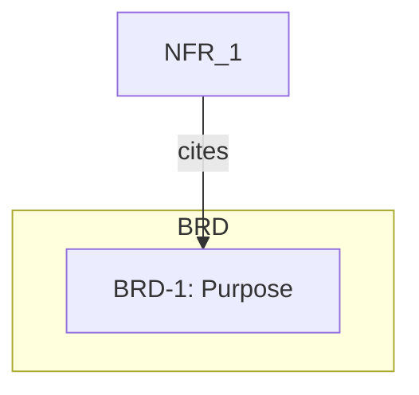

# Tool: Visualize Traceability

## Overview

Generates Mermaid flowcharts with tier-based subgraphs and color coding.

## Knowledge Source

- **Tier Hierarchy**: `.agent/knowledge/sources/concepts/tier_hierarchy.md`

## Configuration

- **Entry Point**: `.agent/scripts/visualize_traceability.py`
- **Interpreter**: `.venv/Scripts/python`
- **Arguments**:
    - `--needs-json`: Optional. Path to needs.json.
    - `--root`: Optional. Root tag for focused view.
    - `--depth`: Optional. Traversal depth.
    - `--direction`: Optional. up/down/both.

## Protocol & Validation

### Success Verification
1. Output starts with `flowchart TD`
2. Contains tier subgraphs

### Example Output

## Rules
- **Read-Only**: Generates output only
- **Requires needs.json**: Run `rebuild_docs` first
