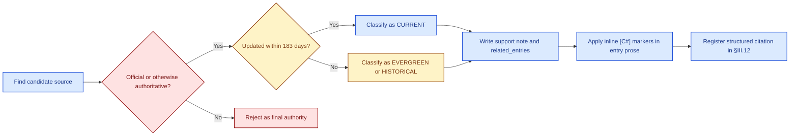
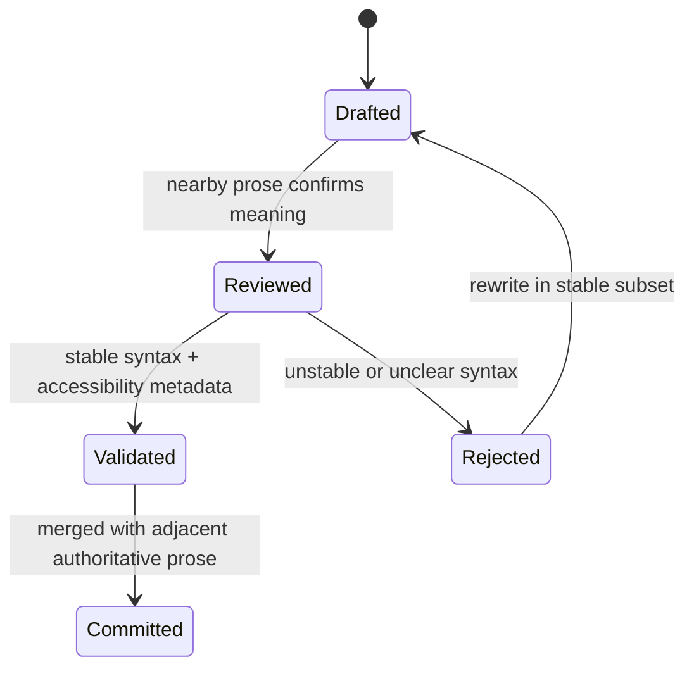

# DDR SYSTEM

## Application Framework

## Brainstorming Compendium

<style>
.brain-badge,
.brain-label {
  display: inline-block;
  padding: 0.1rem 0.45rem;
  border-radius: 0.35rem;
  border: 1px solid currentColor;
  font-weight: 700;
  line-height: 1.2;
  white-space: nowrap;
}
.brain-label {
  padding: 0 0.18rem;
  border: none;
  border-radius: 0.2rem;
}
.brain-governance { color: #166534; background: #dcfce7; }
.brain-evidence { color: #1d4ed8; background: #dbeafe; }
.brain-hypothesis { color: #0f766e; background: #ccfbf1; }
.brain-recommendation { color: #92400e; background: #fef3c7; }
.brain-risk { color: #991b1b; background: #fee2e2; }
.brain-badge.brain-governance,
.brain-badge.brain-evidence,
.brain-badge.brain-hypothesis,
.brain-badge.brain-recommendation,
.brain-badge.brain-risk {
  border-width: 1px;
}
</style>

| Property         | Value                                                                                                         |
| ---------------- | ------------------------------------------------------------------------------------------------------------- |
| Document ID      | DDR-BRAIN-001                                                                                                 |
| Base Version     | DDR System v6.3 (2026-03-28)                                                                                  |
| Status           | LIVING DOCUMENT - Append-Only Until Promoted                                                                  |
| Owner            | DDR Architecture Board                                                                                        |
| Created          | 2026-03-30                                                                                                    |
| Last Revised     | 2026-04-04                                                                                                    |
| Schema           | BRAIN-ENTRY-1.1                                                                                               |
| Reference Source | `C:/AI/10162025/maggie/Antigravity/.agent/schemas/brainstorm/DDR_AppFramework_Brainstorm.xhtml`               |

> LIVING DOCUMENT NOTICE: This document is intentionally incomplete. It is a structured collection
> point for ideas, candidates, and architectural directions that are not yet committed to any
> implementation plan. All entries are speculative unless explicitly marked `PROMOTED`. Do not
> treat any entry as an engineering decision unless it appears in the DDR System formal
> specification or a dedicated Architecture Decision Record (ADR).

## PART I — Document Manifest

Part I is permanent and immutable. It defines how this document works: its structure, the entry
schema, the classification taxonomy, conventions for adding new sections, and the governance model
for promoting ideas to formal design status. Read Part I before contributing any entry.

### §1 Document Purpose and Scope

This Brainstorming Compendium is the singular, structured repository for nascent ideas,
architectural directions, library candidates, and design hypotheses related to the construction of
a standalone application framework built on top of DDR System v6.3. It is intentionally broader
and less constrained than a formal specification so promising paths can be retained before
premature decisions eliminate them.

#### 1.1 What Belongs Here

- Application architecture and design patterns being considered for the DDR App Framework.
- Open-source library candidates with relevance to DDR concerns and commercial distribution.
- Integration hypotheses between the DDR Extension System (E1-E9) and application-layer tooling.
- UX and workflow concepts for DDR node CRUD, graph visualization, and project management.
- Data persistence, serialization, and interchange format ideas.
- Deferred or parked ideas that are not immediately actionable but worth retaining.

#### 1.2 What Does Not Belong Here

- Finalized engineering decisions. These belong in ADRs or the formal DDR specification.
- Implementation code. No production code is authored inside this document.
- Bug reports or operational issue tracking. Use the DDR Issue Tracker for those.
- Content duplicating the normative DDR System v6.3 specification. Reference it instead.

### §2 Document Structure and Navigation

The document is organized into three major Parts. Additional Parts may be added as new top-level
concept categories are identified. Every new Part must be registered in the Part Registry and
adopt the section and entry conventions defined in §3 before entries are added.

| Part     | Title                          | Purpose                                                                 |
| -------- | ------------------------------ | ----------------------------------------------------------------------- |
| Part I   | Document Manifest              | Self-description, schema, taxonomy, and governance.                     |
| Part II  | Application Design Concepts    | Architectural ideas and next-step hypotheses for the DDR App Framework. |
| Part III | Open-Source Library Candidates | Vetted and candidate OSS libraries across relevant problem domains.     |

#### 2.1 Part Registry

All Parts that exist or are planned must be recorded here. Update this table when adding a new
Part.

| Part ID  | Short Title                           | Status                    |
| -------- | ------------------------------------- | ------------------------- |
| PART-I   | Document Manifest                     | PERMANENT - DO NOT MODIFY |
| PART-II  | Application Design Concepts           | ACTIVE                    |
| PART-III | OSS Library Candidates                | ACTIVE                    |
| PART-IV  | [Reserved: UX & Workflow]             | RESERVED - Not Yet Opened |
| PART-V   | [Reserved: Data & Persistence]        | RESERVED - Not Yet Opened |
| PART-VI  | [Reserved: Deployment & Distribution] | RESERVED - Not Yet Opened |
| PART-VII | [Reserved: Parking Lot]               | RESERVED - Not Yet Opened |

### §3 Entry Schema (BRAIN-ENTRY-1.1)

Every entry in this document must conform to one of the canonical entry types defined below. This
Markdown contract is normalized for agent editing, with each entry represented by a heading plus a
fenced `yaml` block.

#### 3.1 Common Fields (All Entry Types)

| Field | Type / Format | Description |
| --- | --- | --- |
| `entry_id` | `BRAIN-{PART#}-{SEQ:3d}` | Immutable identifier such as `BRAIN-II-001`. |
| `title` | `String (<=80 chars)` | Short, unambiguous label for the idea or candidate. |
| `category` | `CategoryEnum` | Controlled classification tag from §3.4. |
| `priority` | `HIGH \| MED \| LOW \| PARKED` | Current urgency for consideration. Not a commitment. |
| `status` | `StatusEnum` | Lifecycle state from §3.5. |
| `authored_by` | `String` | Initials or handle of the contributor. |
| `authored_date` | `YYYY-MM-DD` | Date the entry was first recorded. |
| `revised_date` | `YYYY-MM-DD` | Date of the most recent revision. |
| `description` | `Text` | One to three sentence summary of the concept. |
| `detail` | `Text` | Extended technical description and context. |
| `open_questions` | `List[String]` | Questions that must be answered before promotion. |
| `tags` | `List[String]` | Freeform search tags such as `#visualization` or `#E5-ARE`. |
| `ddr_relevance` | `List[TierEnum \| ExtEnum]` | DDR tiers or extensions directly affected by the entry. |
| `citation_ids` | `List[CitationId]` | Exact external citation IDs used inline by the entry. |
| `references` | `List[String]` | ADR IDs, spec sections, local artifact paths, or related brainstorm IDs only. |

#### 3.2 Idea Entry (TYPE: IDEA)

| Field             | Type / Format  | Description                                                           |
| ----------------- | -------------- | --------------------------------------------------------------------- |
| `motivation`      | `Text`         | Why the idea exists and what problem it solves.                       |
| `prior_art`       | `Text`         | Known existing solutions, patterns, or precedents.                    |
| `ddr_constraints` | `Text`         | DDR axioms, invariants, or extension contracts the idea must respect. |
| `risks`           | `Text`         | Complexity, performance, licensing, or adoption risks.                |
| `dependencies`    | `List[String]` | Related brainstorm IDs or external dependencies.                      |

#### 3.3 Library Candidate Entry (TYPE: LIB)

| Field              | Type / Format                                                                          | Description                                              |
| ------------------ | -------------------------------------------------------------------------------------- | -------------------------------------------------------- |
| `repository`       | `URL or package locator`                                                               | Canonical source location.                               |
| `language`         | `Python \| JavaScript \| Rust \| Go \| Other`                                          | Primary implementation language.                         |
| `license`          | `MIT \| Apache-2.0 \| BSD-2-Clause \| BSD-3-Clause \| ISC \| MPL-2.0 \| LGPL \| Other` | Primary license classification.                          |
| `commercial_use`   | `YES \| CONDITIONAL \| NO`                                                             | Whether commercial distribution is currently acceptable. |
| `latest_release`   | `String`                                                                               | Release version/date snapshot or `TBD`.                  |
| `maintenance`      | `ACTIVE \| MAINTAINED \| SLOW \| ARCHIVED`                                             | Current maintenance signal.                              |
| `install_size_kb`  | `Integer or TBD`                                                                       | Approximate footprint.                                   |
| `maturity`         | `EXPERIMENTAL \| STABLE \| MATURE \| LEGACY`                                           | Maturity signal for adoption planning.                   |
| `verdict`          | `CANDIDATE \| UNDER_REVIEW \| ACCEPTED \| REJECTED \| PARKED`                          | Current adoption verdict.                                |
| `rejection_reason` | `Text`                                                                                 | Required only when `verdict` is `REJECTED`.              |

#### 3.4 Category Taxonomy

| Category ID | Label                         | Applies To                                                                      |
| ----------- | ----------------------------- | ------------------------------------------------------------------------------- |
| `CAT-ARCH`  | Application Architecture      | Structural patterns, layering, module boundaries, deployment topology.          |
| `CAT-DAG`   | DAG Engine                    | Graph construction, traversal, validation, cycle detection, topological sort.   |
| `CAT-VIZ`   | Visualization                 | Graph rendering, node and edge display, tier-map diagrams, diff views.          |
| `CAT-CRUD`  | Node CRUD & Editing           | Node creation, reading, updating, deletion operations and UI/API surface.       |
| `CAT-VALID` | Validation & Schema           | JSON Schema or YAML Schema compliance and structural rule enforcement.          |
| `CAT-STORE` | Data Persistence              | File formats, databases, version control integration, export and import.        |
| `CAT-LIFE`  | Lifecycle & Operations        | Status transitions, SUPERSEDE or DEPRECATE flows, operation protocol.           |
| `CAT-EXT`   | Extension System              | E1-E9 integration, candidate pool management, ARE scoring.                      |
| `CAT-UX`    | User Experience               | Workflow design, navigation patterns, onboarding, CLI vs GUI.                   |
| `CAT-DIST`  | Distribution & Packaging      | PyPI, installers, Electron, Docker, licensing for commercial sale.              |
| `CAT-AI`    | AI / Agentic Integration      | LLM tooling, code generation, agentic interfaces, Codex and Claude integration. |
| `CAT-TEST`  | Testing & QA                  | Unit, integration, and property-based testing strategies.                       |
| `CAT-MISC`  | Miscellaneous / Uncategorized | Catch-all for entries not yet classified. Re-categorize within two sessions.    |

#### 3.5 Entry Status Vocabulary

| Status       | Meaning                                         | Transition Rules                                                 |
| ------------ | ----------------------------------------------- | ---------------------------------------------------------------- |
| `SEED`       | Newly captured, minimally described.            | Any entry may start here.                                        |
| `EXPLORING`  | Actively being researched or discussed.         | From `SEED` or `PARKED`.                                         |
| `CANDIDATE`  | Sufficiently developed for formal evaluation.   | From `EXPLORING`; requires all common fields populated.          |
| `PROMOTED`   | Accepted into a formal ADR or specification.    | From `CANDIDATE`; requires an ADR reference in `references`.     |
| `REJECTED`   | Evaluated and not adopted; retained for record. | From any status; requires `rejection_reason` or equivalent note. |
| `PARKED`     | Deferred indefinitely; may be revisited later.  | From any non-`PROMOTED` status.                                  |
| `SUPERSEDED` | Replaced by a newer entry; ID preserved.        | From any status; link the superseding entry in `references`.     |

#### 3.6 Priority Vocabulary

| Priority | Meaning                                       | Guidance                                             |
| -------- | --------------------------------------------- | ---------------------------------------------------- |
| `HIGH`   | Actively explore in the current design cycle. | Limit to five `HIGH` entries per Part when possible. |
| `MED`    | Relevant but not blocking.                    | Default priority for most new entries.               |
| `LOW`    | Peripheral; retain without active focus.      | Reassess at each review cycle.                       |
| `PARKED` | Indefinitely deferred.                        | Pair with status `PARKED`.                           |

### §4 Rules for Adding New Sections

Follow these rules when appending new content to this document:

#### 4.1 Adding a New Entry to an Existing Section

- Assign the next sequential `entry_id` within the current Part.
- Populate all common fields. Use `TBD` only for genuinely unknown values.
- Resolve current external evidence before finalizing substantive prose.
- Add `citation_ids` for every external source used inline inside the entry.
- Reserve `references` for internal cross-links only.
- Select the type-specific fields from §3.2 or §3.3 as appropriate.
- Enter the content using the canonical heading plus fenced `yaml` block format.
- Update the relevant section index table when a new subsection is created.
- Do not renumber or remove existing IDs. Use `SUPERSEDED`, `REJECTED`, or `PARKED` instead.

#### 4.2 Adding a New Subsection Within a Part

- Number new subsections sequentially within their Part.
- Align titles to a Category ID from §3.4 unless the subsection is structural.
- Open each new subsection with a short scope statement before the first entry.

#### 4.3 Adding a New Part

- Verify that no existing Part or reserved slot already covers the intended space.
- Register the new Part in the Part Registry with status `ACTIVE` before adding entries.
- Open the new Part with a cover statement and a section index table.
- Start new IDs at `BRAIN-{PART#}-001`.

### §5 Governance and Promotion Protocol

This document is a feeder for formal design artifacts. It never becomes normative on its own.

#### 5.1 Promotion Criteria

An entry may move to `CANDIDATE` when:

- All common fields are populated without unresolved blanks other than acceptable `TBD`s.
- The `open_questions` list contains only questions that do not block understanding.
- At least one DDR tier or extension is identified in `ddr_relevance`.
- Commercial licensing viability is assessed for `LIB` entries.
- At least one `CURRENT` citation supports any factual comparison or recommendation carried forward for evaluation.

An entry may move to `PROMOTED` when:

- A corresponding ADR exists and is referenced.
- Relevant DDR owners or the Architecture Board have reviewed the proposal.
- `references` contains the ADR ID and any affected spec section.

#### 5.2 Review Cadence

- Review the document at the start of each new development cycle.
- Move entries that remain `EXPLORING` for more than two cycles to `PARKED` or `REJECTED`.
- Reassess `HIGH` priority items that show no progress after one cycle.

> IMPORTANT - DDR Axiom Alignment: No promoted idea may introduce a dependency that violates
> `AX-3` (Determinism), `AX-6` (Declarative Integrity), or `AX-7` (DAG Acyclicity). Before
> promotion, each `IDEA` entry must include an explicit statement in `ddr_constraints`
> confirming those axioms are respected or documenting the exemption rationale.

### §6 Visual Semantics and Font Color Index

This document uses a small, governed visual vocabulary so persistent rules, evidence-backed facts,
open hypotheses, recommendations, and risks can be recognized quickly without changing the
underlying Markdown authority surface.

#### 6.1 Font Color Index

| Class | Sample | Meaning | Allowed Use |
| --- | --- | --- | --- |
| `brain-governance` | <span class="brain-badge brain-governance"><strong>Governance</strong></span> | Immutable document rules, authority boundaries, and protocol statements. | Headline badges, policy labels, and manifest callouts. |
| `brain-evidence` | <span class="brain-badge brain-evidence"><strong>Evidence</strong></span> | Citation-backed external facts, release signals, and current-source support. | Citation callouts, evidence labels, and source-quality markers. |
| `brain-hypothesis` | <span class="brain-badge brain-hypothesis"><strong>Hypothesis</strong></span> | Exploratory concepts, design options, and unresolved technical paths. | Short option badges and hypothesis labels. |
| `brain-recommendation` | <span class="brain-badge brain-recommendation"><strong>Recommendation</strong></span> | Endorsed next steps or preferred directions inside the brainstorm. | Recommendation badges and concise endorsement labels. |
| `brain-risk` | <span class="brain-badge brain-risk"><strong>Risk</strong></span> | Caveats, failure modes, tradeoffs, and cautionary notes. | Risk badges and short caution labels. |

#### 6.2 Usage Rules

- Use `<span class="...">` only for short badges, labels, or callouts.
- Do not wrap full paragraphs, fenced code blocks, table cells containing YAML, or YAML keys in styled spans.
- Keep the visual system semantic, not decorative: every color choice must communicate a governed meaning.
- If a new semantic color is needed, update this index first before using it anywhere else in the document.

### §7 Citation and Research Protocol

This document requires recent, reputable, and authoritative online evidence for any substantive
assertion, recommendation, or factual comparison that is added or materially revised by an agent.

#### 7.1 Source Hierarchy

1. Official vendor or project documentation, release notes, or canonical repository releases.
2. Standards bodies, government publications, or academic sources when they directly govern the topic.
3. Reputable secondary analysis only as support, never as the final authority when an official source exists.
4. Anonymous forums, social posts, and aggregators may inform exploration but must not be the final cited authority.

#### 7.2 Citation Freshness Rules

- A citation classified as `CURRENT` must be published or materially updated within 183 days of the entry `revised_date`.
- Evergreen sources may supplement durable concepts, APIs, or repository surfaces, but they must not be the only support for a new recommendation or factual claim.
- Every citation record must capture both `published_date` and `accessed_date`.
- Every citation must list the brainstorm entries it supports in `related_entries`.

#### 7.3 Citation Application Rules

- Add inline `[C#]` markers inside prose whenever the entry makes an assumption, assertion, or recommendation.
- Keep `citation_ids` exactly aligned to the citation IDs actually used inline in the entry.
- Store all external bibliography items in §III.12. Do not embed raw external URLs in `references`.
- Prefer the smallest citation set that fully supports the claim while keeping the evidence current.

**Figure 7.1. External research and evidence normalization flow**



### §8 Mermaid Diagram Standards

Mermaid diagrams are preferred when they materially improve comprehension, but they remain
supporting visuals rather than the authority surface. Nearby prose and tables continue to govern.

#### 8.1 Supported Mermaid Diagram Types

| Type | Status | Notes |
| --- | --- | --- |
| `flowchart` | Preferred | Use for pipelines, decision funnels, and architectural flows. |
| `sequenceDiagram` | Preferred | Use for request/response or operation choreography. |
| `stateDiagram-v2` | Preferred | Use for lifecycle transitions and guarded state changes. |
| `classDiagram` | Allowed | Use for bounded structural maps where type-like relationships matter. |
| `erDiagram` | Allowed | Use for structured data shape and storage relationship sketches. |

#### 8.2 Accessibility and Stability Rules

- Every Mermaid block must include `accTitle` and `accDescr`.
- Use the stable committed subset only. Do not commit renderer-specific experimental syntax such as `architecture-beta`, `mindmap`, or ELK-only layout directives.
- Prefer `classDef`, `subgraph`, and `linkStyle` only when they improve comprehension and remain broadly renderer-compatible.
- Keep diagrams synchronized with nearby prose whenever a cited recommendation changes.

**Figure 8.1. Diagram review states for governed brainstorm visuals**




## PART II — Application Design Concepts

Part II collects architectural ideas, design pattern hypotheses, and next-step candidates for the
DDR Application Framework: the standalone application that will serve as the primary human
interface for creating, managing, and validating software engineering projects structured with the
DDR System.

### Part II — Section Index

| Section  | Title                                  | Category    |
| -------- | -------------------------------------- | ----------- |
| `§II.1`  | Application Architecture Overview      | `CAT-ARCH`  |
| `§II.2`  | DAG Engine Design                      | `CAT-DAG`   |
| `§II.3`  | Node CRUD and Editing Surface          | `CAT-CRUD`  |
| `§II.4`  | Validation and Schema Enforcement      | `CAT-VALID` |
| `§II.5`  | Extension System Integration           | `CAT-EXT`   |
| `§II.6`  | AI and Agentic Interface               | `CAT-AI`    |
| `§II.7`  | Target System Optimization             | `CAT-ARCH`  |
| `§II.8`  | Workbench and Interaction Architecture | `CAT-UX`    |
| `§II.9`  | Data, Search, and Observability        | `CAT-STORE` |
| `§II.10` | Secure Agent Operations and Tutorials  | `CAT-AI`    |
| `§II.11` | Collaboration and Delivery Workflows   | `CAT-UX`    |

### §II.1 Application Architecture Overview

This section captures early thinking about structural decomposition, module boundaries, project
storage, deployment topology, and the application's relationship to the DDR files it manages.

#### [BRAIN-II-001] Three-Layer Application Architecture

```yaml
entry_type: IDEA
entry_id: BRAIN-II-001
title: Three-Layer Application Architecture
category: CAT-ARCH
priority: HIGH
status: EXPLORING
authored_by: DDR-AB
authored_date: 2026-03-30
revised_date: 2026-03-30
description: >-
  Decompose the DDR App Framework into three cleanly separated layers: Core Engine, Service Layer,
  and Presentation Layer. [C31][C36]
detail: >-
  The Core Engine owns DAG construction, topological sorting, lifecycle state handling, schema
  validation, and extension orchestration without UI dependencies. The Service Layer mediates
  between that engine and any presentation surface through a typed command and query interface
  aligned to the DDR Operations Protocol. The Presentation Layer remains replaceable across desktop,
  CLI, REST, and future surfaces. [C31][C36]
open_questions:
- Should the Service Layer remain in-process or be isolated as a subprocess?
- >-
  How should the command interface map to INSERT, ACTIVATE, MODIFY, SUPERSEDE, DEPRECATE, VALIDATE,
  BUNDLE, and UNBUNDLE?
- Does the Core Engine need to ship as a standalone package?
tags:
- '#architecture'
- '#service-layer'
- '#presentation-layer'
ddr_relevance:
- SAL
- ICL
- CDL
- ISL
citation_ids:
- C31
- C36
references:
- "DDR System v6.3 \xA77"
- BRAIN-II-003
- BRAIN-III-010
- BRAIN-III-015
motivation: >-
  Keep DDR specification logic isolated from delivery surfaces so validation and lifecycle behavior
  remain consistent regardless of UI technology. [C31][C36]
prior_art: >-
  Standard layered application architecture and command/query mediation patterns. [C31][C36]
ddr_constraints: >-
  Must preserve AX-3 determinism, AX-6 declarative integrity, and the canonical operation vocabulary
  from DDR System v6.3. [C31][C36]
risks: >-
  Adds interface-design overhead and can become over-abstracted if the service boundary is too
  heavy for a single-user tool. [C31][C36]
dependencies:
- BRAIN-II-003
```

#### [BRAIN-II-002] DDR Project as a File-System-First Store

```yaml
entry_type: IDEA
entry_id: BRAIN-II-002
title: DDR Project as a File-System-First Store
category: CAT-STORE
priority: HIGH
status: EXPLORING
authored_by: DDR-AB
authored_date: 2026-03-30
revised_date: 2026-03-30
description: >-
  Treat a DDR project as a structured directory tree where each node is a YAML file, making the
  project VCS-friendly without requiring a database. [C30]
detail: >-
  A project root would include a manifest, an active_tiers declaration, tiered node directories,
  and an `.agent/` directory for extension state such as ARE checkpoints. Node files would follow
  `{node_id}.yaml` and conform to the DDR schema. Database backends remain optional acceleration
  layers for scale or collaboration rather than the default persistence surface. [C30]
open_questions:
- Are graph edges stored only in child `parent_ids` or also in an adjacency index?
- At what scale does the file-system-first model stop being practical?
- How should the manifest represent express vs full document profiles?
tags:
- '#storage'
- '#yaml'
- '#git'
ddr_relevance:
- SAL
- ICL
- ISL
- E5
citation_ids:
- C30
references:
- ddr_node_schema_v6.3.yaml
- BRAIN-III-009
motivation: >-
  Maximize auditability and version-control friendliness while keeping the default deployment
  model simple for single-user projects. [C30]
prior_art: >-
  File-system-first knowledge bases, infrastructure-as-code repositories, and YAML-driven project
  stores. [C30]
ddr_constraints: >-
  Must preserve schema-valid node files, lifecycle auditability, and deterministic graph reconstruction.
  [C30]
risks: >-
  Large projects may suffer from indexing or validation latency, and comment preservation requires
  careful YAML tooling. [C30]
dependencies:
- BRAIN-II-005
- BRAIN-II-009
```

#### [BRAIN-II-003] Unified Operations Protocol API Surface

```yaml
entry_type: IDEA
entry_id: BRAIN-II-003
title: Unified Operations Protocol API Surface
category: CAT-ARCH
priority: HIGH
status: EXPLORING
authored_by: DDR-AB
authored_date: 2026-03-30
revised_date: 2026-03-30
description: >-
  Expose all DDR mutation operations through a single strongly typed API surface mirroring the
  Operations Protocol. [C4][C6][C19]
detail: >-
  Every mutating action would flow through named operation objects that carry preconditions, atomic
  execution logic, and postcondition assertions. The journal of operations would be append-only
  and auditable so lifecycle and structural rules cannot be bypassed by direct file edits. Read-only
  graph and validation queries stay separate from the mutation journal. [C4][C6][C19]
open_questions:
- Should the operation journal use YAML or NDJSON?
- How should failed precondition checks be surfaced to the user?
- Is VALIDATE purely a query, or should it persist structured annotations?
tags:
- '#operations'
- '#audit'
- '#api'
ddr_relevance:
- FCL
- SAL
- ICL
- ISL
citation_ids:
- C4
- C6
- C19
references:
- "DDR System v6.3 \xA77"
- BRAIN-II-001
motivation: >-
  Keep every state change aligned with the authoritative DDR vocabulary and preserve auditability
  across all surfaces. [C4][C6][C19]
prior_art: Command pattern implementations, event journals, and domain service APIs. [C4][C6][C19]
ddr_constraints: >-
  Must preserve atomicity, lifecycle authority, and append-only audit behavior. [C4][C6][C19]
risks: >-
  If the operation surface becomes too rigid it may slow product iteration or create unnecessary
  serialization overhead. [C4][C6][C19]
dependencies:
- BRAIN-II-001
```

### §II.2 DAG Engine Design

The DAG Engine is the most critical internal component of the DDR App Framework. It owns graph
construction, invariant enforcement, topological ordering, cycle detection, and DIRTY propagation.

#### [BRAIN-II-004] Plugin Architecture for DDR Extensions (E1-E9)

```yaml
entry_type: IDEA
entry_id: BRAIN-II-004
title: Plugin Architecture for DDR Extensions (E1-E9)
category: CAT-EXT
priority: MED
status: EXPLORING
authored_by: DDR-AB
authored_date: 2026-03-30
revised_date: 2026-03-30
description: >-
  Implement the DDR Extension System as a first-class plugin architecture with discrete loadable
  plugins and explicit contracts. [C4][C19][C20]
detail: >-
  A registry would track extension contracts, activation states, extends manifests, and links
  to extension-managed state such as the ARE candidate pool and checkpointing. Plugins would never
  mutate core nodes directly and would operate only through the sanctioned read or annotate interfaces
  defined by DDR contracts. [C4][C19][C20]
open_questions:
- What isolation model is appropriate for plugins: subprocess, dynamic import, or shared namespace?
- How should extension contracts be validated at load time?
- Is the architecture open to third-party plugins or limited to first-party ones?
tags:
- '#extensions'
- '#plugins'
- '#contracts'
ddr_relevance:
- E1
- E5
- E9
citation_ids:
- C4
- C19
- C20
references:
- "DDR System v6.3 \xA78"
- BRAIN-II-010
motivation: >-
  Keep extension behavior modular and contract-driven without allowing plugins to erode core DAG
  guarantees. [C4][C19][C20]
prior_art: >-
  Plugin registries, capability manifests, and extension sandboxes in IDE and workflow tooling.
  [C4][C19][C20]
ddr_constraints: >-
  Must preserve AX-6 declarative integrity and the no-core-mutation rule for extensions. [C4][C19][C20]
risks: >-
  Isolation, compatibility, and security boundaries can become expensive if third-party plugins
  are later supported. [C4][C19][C20]
dependencies:
- BRAIN-II-003
- BRAIN-II-010
```

#### [BRAIN-II-005] In-Memory DAG Representation with Lazy Hydration

```yaml
entry_type: IDEA
entry_id: BRAIN-II-005
title: In-Memory DAG Representation with Lazy Hydration
category: CAT-DAG
priority: HIGH
status: EXPLORING
authored_by: DDR-AB
authored_date: 2026-03-30
revised_date: 2026-03-30
description: >-
  Maintain the active DDR project graph as an in-memory DAG hydrated lazily from the file-system
  store with dirty-aware cache invalidation. [C22][C23][C24]
detail: >-
  Only the project manifest and node index would load at project open. Node files hydrate into
  memory on first access and remain cached with file mtime tracking for out-of-band edits. The
  graph would use adjacency lists keyed by node ID to support parent lookups, traversal, and descendant
  fanout queries. Topological sort and cycle detection would run as needed around mutations. [C22][C23][C24]
open_questions:
- What graph library best fits the model?
- How should lazy hydration interact with full-graph validation passes?
- At what scale does the lazy strategy stop paying for itself?
tags:
- '#dag'
- '#lazy-hydration'
- '#cache'
ddr_relevance:
- XPD
- SAL
- ISL
citation_ids:
- C22
- C23
- C24
references:
- BRAIN-III-001
- BRAIN-III-002
- BRAIN-III-003
motivation: >-
  Balance startup latency with rich graph operations by loading only what is needed while retaining
  a coherent in-memory graph. [C22][C23][C24]
prior_art: Lazy graph stores, adjacency-list models, and cached repository indexes. [C22][C23][C24]
ddr_constraints: >-
  Must preserve AX-7 DAG acyclicity checks and deterministic reconstruction from persisted node
  files. [C22][C23][C24]
risks: >-
  Cache invalidation and partial graph loads may complicate validation and stale-state handling.
  [C22][C23][C24]
dependencies:
- BRAIN-II-002
- BRAIN-II-009
```

#### [BRAIN-II-006] DIRTY Propagation Engine

```yaml
entry_type: IDEA
entry_id: BRAIN-II-006
title: DIRTY Propagation Engine
category: CAT-DAG
priority: MED
status: EXPLORING
authored_by: DDR-AB
authored_date: 2026-03-30
revised_date: 2026-03-30
description: >-
  Implement DIRTY propagation as an explicit graph traversal pass triggered by MODIFY, SUPERSEDE,
  and DEPRECATE operations. [C22][C23][C24]
detail: >-
  When a node becomes DIRTY or changes ACTIVE state, all descendants that cite the mutated node
  would be traversed and marked for revalidation. The pass is synchronous and atomic with the
  triggering operation so the visible graph state always matches lifecycle expectations. The journal
  would record each propagation event for auditability. [C22][C23][C24]
open_questions:
- Should propagation always block or can it be queued in some modes?
- How should the UI surface a DIRTY cascade to the user?
- Do extension candidate pools participate in DIRTY propagation?
tags:
- '#dirty'
- '#propagation'
- '#dag'
ddr_relevance:
- XPD
- SIL
- GPCL
- FCL
- CL
- SAL
- ICL
- CDL
- ISL
citation_ids:
- C22
- C23
- C24
references:
- DDR System v6.3 CIT-R7
- BRAIN-II-005
- BRAIN-III-001
- BRAIN-III-002
- BRAIN-III-003
motivation: >-
  Make parent-version freshness and descendant invalidation explicit rather than relying on informal
  or partial revalidation behavior. [C22][C23][C24]
prior_art: >-
  Incremental build invalidation, dependency graph dirtiness propagation, and audit-friendly lifecycle
  journaling. [C22][C23][C24]
ddr_constraints: >-
  Must stay atomic with the triggering operation and preserve deterministic downstream status
  outcomes. [C22][C23][C24]
risks: Large cascades may be expensive and confusing if reporting is poor. [C22][C23][C24]
dependencies:
- BRAIN-II-003
- BRAIN-II-005
```

### §II.3 Node CRUD and Editing Surface

This section covers how users create, read, update, and delete DDR nodes while keeping operation
semantics visible and enforceable in the editing experience.

#### [BRAIN-II-007] Tier-Aware Node Editor with Inline Atomic Rule Guidance

```yaml
entry_type: IDEA
entry_id: BRAIN-II-007
title: Tier-Aware Node Editor with Inline Atomic Rule Guidance
category: CAT-CRUD
priority: HIGH
status: EXPLORING
authored_by: DDR-AB
authored_date: 2026-03-30
revised_date: 2026-03-30
description: >-
  Provide a structured node editor that understands tier context and surfaces the relevant atomic
  ruleset during authoring. [C2][C21]
detail: >-
  The editor would show tier-specific guidance, real-time validation feedback, constrained parent
  selection, and lifecycle transition options that mirror the DDR state machine. Special fields
  such as `constraint_origin` and `prior_status` would be surfaced only when applicable so the
  UI remains explicit without overwhelming ordinary authoring flows. [C2][C21]
open_questions:
- How should CL-only and SUPERSEDE_PENDING-only fields be exposed?
- Should SUPERSEDE use a side-by-side diff workflow?
- Is a form editor sufficient or is a structured Markdown plus YAML editor better?
tags:
- '#editor'
- '#rules'
- '#crud'
ddr_relevance:
- FCL
- CL
- SAL
- ICL
- CDL
- ISL
citation_ids:
- C2
- C21
references:
- "DDR System v6.3 \xA75"
- BRAIN-II-009
motivation: >-
  Help authors stay inside tier boundaries and lifecycle rules while editing so validation failures
  become visible before operations are committed. [C2][C21]
prior_art: Schema-aware forms, DSL editors, and inline lint-guidance surfaces. [C2][C21]
ddr_constraints: Must not bypass the authoritative VALIDATE and lifecycle transition rules. [C2][C21]
risks: >-
  A highly structured editor may feel rigid if expert users need direct text editing or custom
  authoring flows. [C2][C21]
dependencies:
- BRAIN-II-003
- BRAIN-II-009
```

#### [BRAIN-II-008] Express Mode Project Scaffolding Wizard

```yaml
entry_type: IDEA
entry_id: BRAIN-II-008
title: Express Mode Project Scaffolding Wizard
category: CAT-CRUD
priority: MED
status: EXPLORING
authored_by: DDR-AB
authored_date: 2026-03-30
revised_date: 2026-03-30
description: >-
  Provide a scaffolding wizard for Express Mode that generates canonical group compositions and
  the full express authority block. [C36][C37]
detail: >-
  The wizard would collect project name, active tiers, and group assignments, then produce a conforming
  project structure and starter manifest for `project_instance_express`. By validating group compositions
  before writing output, the tool would prevent users from silently redefining Express Mode in
  ways DDR v6.3 explicitly forbids. [C36][C37]
open_questions:
- Should representative starter nodes be scaffolded automatically?
- Is the wizard exposed via CLI, GUI, or both?
- How should the flow pivot when a user really wants a full project profile?
tags:
- '#express-mode'
- '#wizard'
- '#scaffolding'
ddr_relevance:
- FCL
- CL
- SAL
- ICL
- CDL
- ISL
citation_ids:
- C36
- C37
references:
- "DDR System v6.3 \xA74"
- BRAIN-III-015
- BRAIN-III-016
motivation: >-
  Make Express Mode approachable without allowing authors to drift from its fixed group and authority
  rules. [C36][C37]
prior_art: Project initialization wizards and guided CLI setup flows. [C36][C37]
ddr_constraints: Must preserve canonical Express Mode groups and UNBUNDLE authority behavior.
  [C36][C37]
risks: >-
  A wizard may hide important system details or duplicate value already provided by a simple CLI
  template generator. [C36][C37]
dependencies:
- BRAIN-II-002
- BRAIN-II-003
```

### §II.4 Validation and Schema Enforcement

Validation is DDR's primary quality gate. This section explores how VALIDATE is surfaced and how
schema and structural conformance remain continuously visible.

#### [BRAIN-II-009] Continuous Background Validation with Severity-Classified Findings

```yaml
entry_type: IDEA
entry_id: BRAIN-II-009
title: Continuous Background Validation with Severity-Classified Findings
category: CAT-VALID
priority: HIGH
status: EXPLORING
authored_by: DDR-AB
authored_date: 2026-03-30
revised_date: 2026-03-30
description: >-
  Run VALIDATE continuously in the background after file-system changes and surface findings by
  severity in a persistent panel. [C28][C33]
detail: >-
  The validation engine would debounce file-system activity, revalidate affected nodes and descendants,
  and classify findings as BLOCKER, ERROR, WARNING, or INFO. Findings would remain visible across
  sessions and link back to the node ID and rule ID that produced them. BUNDLE and UNBUNDLE_EXECUTE
  would be gated on a BLOCKER-free state. [C28][C33]
open_questions:
- How should extension findings be distinguished from core validation findings?
- Should background validation be opt-in or always-on?
- What latency budget is acceptable for large projects?
tags:
- '#validation'
- '#findings'
- '#watchers'
ddr_relevance:
- GPCL
- FCL
- SAL
- ICL
- CDL
- ISL
- E1
- E9
citation_ids:
- C28
- C33
references:
- "DDR System v6.3 \xA711"
- BRAIN-III-007
- BRAIN-III-012
motivation: >-
  Keep structural and semantic health visible continuously so users do not discover blocking problems
  only at export or promotion time. [C28][C33]
prior_art: >-
  Background linting, IDE diagnostic panes, and watcher-driven incremental validation pipelines.
  [C28][C33]
ddr_constraints: >-
  Must preserve deterministic validation outputs and never silently mutate the project while reporting
  findings. [C28][C33]
risks: >-
  High-frequency validation can become noisy or expensive without careful debounce and severity
  tuning. [C28][C33]
dependencies:
- BRAIN-II-005
- BRAIN-II-006
```

### §II.5 Extension System Integration

The DDR Extension System defines nine named extensions with extends contracts. This
section explores how they should be integrated into the application layer.

#### [BRAIN-II-010] ARE Candidate Pool Review Interface

```yaml
entry_type: IDEA
entry_id: BRAIN-II-010
title: ARE Candidate Pool Review Interface
category: CAT-EXT
priority: MED
status: EXPLORING
authored_by: DDR-AB
authored_date: 2026-03-30
revised_date: 2026-03-30
description: >-
  Build a dedicated UI panel for the E5 ARE Candidate Pool with scoring visualization and one-click
  promotion via INSERT. [C4][C7][C8]
detail: >-
  The panel would list candidates by confidence score, show score-band labels, review status,
  practitioner notes, and the evidence used to infer each candidate. It would also expose ARE
  activation controls, checkpoint status, and below-threshold override pathways that still require
  human rationale. [C4][C7][C8]
open_questions:
- Should the pool support bulk review or only one candidate at a time?
- How should scoring profiles be visualized?
- How should below-threshold overrides be captured and justified?
tags:
- '#are'
- '#candidate-pool'
- '#review'
ddr_relevance:
- E5
- SAL
- ICL
- CDL
- ISL
citation_ids:
- C4
- C7
- C8
references:
- DDR System v6.3 E5
- BRAIN-II-004
motivation: >-
  Turn the ARE extension into a visible, reviewable workflow rather than an opaque background
  suggestion engine. [C4][C7][C8]
prior_art: >-
  ML-assisted review queues, inference candidate staging panels, and human approval workflows.
  [C4][C7][C8]
ddr_constraints: >-
  Must preserve candidate-pool separation from the core DAG and enforce human review before promotion.
  [C4][C7][C8]
risks: >-
  If the UI encourages bulk promotion without careful evidence review, the quality of inferred
  nodes may decline. [C4][C7][C8]
dependencies:
- BRAIN-II-004
- BRAIN-II-003
```

### §II.6 AI and Agentic Interface

The DDR App Framework is designed to be used with and by AI agents. This section explores how the
application exposes itself to agentic coding assistants and LLM tooling.

#### [BRAIN-II-011] AGENTS.md Auto-Generation from Active Project

```yaml
entry_type: IDEA
entry_id: BRAIN-II-011
title: AGENTS.md Auto-Generation from Active Project
category: CAT-AI
priority: MED
status: EXPLORING
authored_by: DDR-AB
authored_date: 2026-03-30
revised_date: 2026-03-30
description: >-
  Provide a command that auto-generates AGENTS.md from the live DDR project state for Codex, Claude
  Code, and similar agentic coding contexts. [C4][C6][C7]
detail: >-
  The generated file would include active tiers, summarized atomic rules, current ACTIVE nodes
  by tier, operation surfaces, blocking validation findings, and concise project intent derived
  from the current XPD or SIL context. Verbosity levels would allow the output to target different
  context budgets without abandoning the same authoritative source. [C4][C6][C7]
open_questions:
- Should AGENTS.md generation be a built-in command or a named extension?
- How should Express Mode output differ from full project_instance output?
- Should alternate output formats such as JSON also be supported?
tags:
- '#agents'
- '#context'
- '#llm'
ddr_relevance:
- XPD
- SIL
- GPCL
- FCL
- SAL
- E5
citation_ids:
- C4
- C6
- C7
references:
- AGENTS.md
- BRAIN-II-012
motivation: >-
  Give AI agents a compact, project-specific context export that is richer and safer than raw
  YAML file edits alone. [C4][C6][C7]
prior_art: Repo-level agent instruction files, export commands, and context compilers. [C4][C6][C7]
ddr_constraints: >-
  Must preserve source-of-truth boundaries and never claim normative authority beyond the live
  DDR project state. [C4][C6][C7]
risks: >-
  Generated context can become stale quickly or expose too much information if verbosity controls
  are weak. [C4][C6][C7]
dependencies:
- BRAIN-II-003
- BRAIN-II-009
```

#### [BRAIN-II-012] MCP Server Exposure for DDR Project Operations

```yaml
entry_type: IDEA
entry_id: BRAIN-II-012
title: MCP Server Exposure for DDR Project Operations
category: CAT-AI
priority: LOW
status: EXPLORING
authored_by: DDR-AB
authored_date: 2026-03-30
revised_date: 2026-03-30
description: >-
  Expose the DDR App Framework's operation API as an MCP server so AI coding assistants can issue
  DDR operations directly against a live project. [C4][C19][C20]
detail: >-
  An optional MCP server mode would advertise the authoritative DDR operations as structured tools
  rather than forcing agents to edit YAML files directly. Tool schemas would derive from the Operations
  Protocol definitions, allowing agent clients to author, validate, and manage lifecycle transitions
  through semantically rich interfaces. [C4][C19][C20]
open_questions:
- Which MCP SDK is the right implementation surface?
- How should authentication and project-scope isolation work in server mode?
- >-
  Is direct tool access worth the added complexity compared with AGENTS.md plus file edits?
tags:
- '#mcp'
- '#agents'
- '#tooling'
ddr_relevance:
- SAL
- ICL
- ISL
citation_ids:
- C4
- C19
- C20
references:
- BRAIN-II-003
- BRAIN-II-011
motivation: >-
  Give AI assistants an operations-level interface that respects DDR semantics instead of relying
  on brittle raw file manipulation. [C4][C19][C20]
prior_art: >-
  Model Context Protocol servers, command brokers, and structured automation APIs. [C4][C19][C20]
ddr_constraints: >-
  Must preserve the same lifecycle, validation, and audit guarantees as the native application
  surfaces. [C4][C19][C20]
risks: >-
  Authentication, isolation, and schema versioning may create significant operational complexity
  for early versions. [C4][C19][C20]
dependencies:
- BRAIN-II-003
```

### §II.7 Target System Optimization

#### [BRAIN-II-013] Local Offline-First AI Ecosystem on 10GB VRAM Constraint

```yaml
entry_type: IDEA
entry_id: BRAIN-II-013
title: Local Offline-First AI Ecosystem on 10GB VRAM Constraint
category: CAT-ARCH
priority: HIGH
status: EXPLORING
authored_by: DDR-AB
authored_date: 2026-03-30
revised_date: 2026-03-30
description: >-
  Design the application's AI inference pipeline to operate entirely offline while sharing a strict
  10GB VRAM ceiling (RTX 3080). [C38][C39][C47][C49][C50]
detail: >-
  The target hardware profile (Ryzen 9 5900X, 32GB RAM, RTX 3080 10GB) requires strict VRAM management.
  The app must dynamically load/unload models or rely on INT4 (Phi-3) and INT8 (Kokoro) quantization
  via onnxruntime-gpu to ensure the LLM, STT (faster-whisper via ctranslate2), and TTS models
  can coexist without OOM crashes during heavy DDR graph operations. [C38][C39][C47][C49][C50]
open_questions:
- >-
  How will the application handle context switching between LLM processing and heavy STT transcription?
- Should the AI service layer load models on-demand rather than pooling them at startup?
tags:
- '#hardware'
- '#vram'
- '#offline'
- '#quantization'
ddr_relevance:
- E5
- SAL
- CDL
citation_ids:
- C38
- C39
- C47
- C49
- C50
references:
- target-system.txt
- dependencies.txt
- BRAIN-III-017
- BRAIN-III-018
- BRAIN-III-026
- BRAIN-III-028
- BRAIN-III-029
motivation: >-
  Ensure the application remains viable and performant on the designated local hardware footprint
  without relying on external cloud APIs. [C38][C39][C47][C49][C50]
prior_art: >-
  Local LLM desktop wrappers (LM Studio, Ollama) using aggressive memory mapping and model offloading.
  [C38][C39][C47][C49][C50]
ddr_constraints: >-
  Must ensure that AI memory footprint does not starve the Core Engine of resources needed to
  maintain AX-7 (acyclicity checking). [C38][C39][C47][C49][C50]
risks: >-
  Simultaneous voice invocation (pvporcupine), STT processing, and LLM text generation may cause
  micro-stutters or out-of-memory errors on 10GB VRAM. [C38][C39][C47][C49][C50]
dependencies:
- BRAIN-III-017
- BRAIN-III-018
```

### §II.8 Workbench and Interaction Architecture

This section explores the application shell, editing workbench, and navigation surfaces that would
make a DDR-native software development environment feel credible to experienced developers while
remaining legible to newcomers.

#### [BRAIN-II-014] Desktop Shell Strategy: Electron 41 vs Qt 6.11

```yaml
entry_type: IDEA
entry_id: BRAIN-II-014
title: 'Desktop Shell Strategy: Electron 41 vs Qt 6.11'
category: CAT-ARCH
priority: HIGH
status: EXPLORING
authored_by: CODX
authored_date: 2026-03-30
revised_date: 2026-03-30
description: >-
  Select the desktop shell by explicitly comparing an Electron-first IDE shell against a Qt-first
  native shell rather than treating the host runtime as an implementation afterthought. [C1][C2][C11][C12][C17][C18][C31]
detail: |-
  Option A is an Electron 41 shell with a web-native workbench. Electron's March 2026 release line continued the rapid Chromium and Node cadence and added ASAR integrity digest support, which strengthens packaging integrity for a desktop IDE that will likely embed Monaco, browser tools, and agent-facing web views [C11][C12].

  Option B is a Qt 6.11 / Qt 6.9.3 shell. Qt's March 2026 release pages show an actively maintained cross-platform runtime with a clearer support matrix and a more conservative native-desktop compatibility story than a Chromium-bound stack [C17][C18].

  Adversarial Comparative Analysis: Electron maximizes ecosystem leverage because nearly every advanced editor, diff, browser-automation, and agent plugin pattern the product may want already assumes a webview-capable runtime. The downside is higher baseline RAM use, faster security patch churn, and more frequent dependency alignment work. Qt offers stronger native desktop affordances, cleaner OS integration, and a less browser-centric resource profile, but it pushes the team toward a split-stack UI strategy and weaker reuse of modern IDE/editor assets [C11][C12][C17][C18].

  Final Endorsement: endorse Electron for the first commercial DDR workbench, with Qt retained as a contingency path if empirical memory profiling or regulated deployment requirements later show the browser-first runtime is too expensive.
open_questions:
- >-
  What memory floor is acceptable once the shell, graph rendering, and optional local AI features
  run together?
- >-
  Should the first release prefer installer-driven updates over a background auto-update service?
- Is a future Qt companion shell justified for highly locked-down enterprise environments?
tags:
- '#desktop'
- '#electron'
- '#qt'
- '#workbench'
ddr_relevance:
- SAL
- ICL
- CDL
- ISL
citation_ids:
- C1
- C2
- C11
- C12
- C17
- C18
- C31
references:
- BRAIN-III-047
- BRAIN-III-010
motivation: >-
  The shell decision will constrain packaging, editor reuse, extension boundaries, update channels,
  and the cost of delivering a genuinely IDE-like DDR experience. [C1][C2][C11][C12][C17][C18][C31]
prior_art: >-
  Electron-class developer tools continue to converge on browser-native workbenches with agent
  tooling, while Qt remains the stronger candidate when native desktop compatibility and long-lived
  support windows outrank web ecosystem leverage [C1][C2][C17][C18].
ddr_constraints: >-
  The shell must remain a presentation concern only; all authoritative DDR lifecycle, validation,
  and DAG logic must stay isolated behind the service boundary so AX-3, AX-6, and AX-7 remain
  runtime-agnostic. [C1][C2][C11][C12][C17][C18][C31]
risks: >-
  Electron can over-consume RAM and impose constant browser-engine upgrade pressure; Qt can slow
  delivery by forcing a mixed technology stack and weaker reuse of web-first IDE assets. [C1][C2][C11][C12][C17][C18][C31]
dependencies:
- BRAIN-II-001
- BRAIN-II-007
- BRAIN-III-047
- BRAIN-III-010
```

#### [BRAIN-II-015] Monaco-Centered Hybrid Editing Workbench

```yaml
entry_type: IDEA
entry_id: BRAIN-II-015
title: Monaco-Centered Hybrid Editing Workbench
category: CAT-CRUD
priority: HIGH
status: EXPLORING
authored_by: CODX
authored_date: 2026-03-30
revised_date: 2026-03-30
description: >-
  Use a Monaco-centered editing workbench with a schema-aware inspector instead of forcing users
  into either a raw-text-only or form-only authoring model. [C1][C2][C10][C21][C68]
detail: |-
  Option A is a Monaco-centered hybrid workbench: raw YAML / Markdown authoring, inline diagnostics, structural breadcrumbs, parent-citation pickers, diff views, and a right-side DDR inspector for lifecycle-only fields. Option B is a form-first editor that generates tier-specific controls and exposes text only as a secondary detail view.

  Adversarial Comparative Analysis: the hybrid Monaco route is superior for expert authoring, copy/paste from specifications, diff-based review, inline citations, AI-assisted edits, and future code-intelligence features such as rename/usages or semantic cross-file navigation. A form-first editor is safer for novices and easier to constrain mechanically, but it hides the real artifact shape, makes bulk edits cumbersome, and tends to collapse under advanced workflows like supersede, unbundle, or large-scale schema migrations. The February and March 2026 VS Code updates reinforced the value of editor-native tools, browser-assisted validation, and created-in-chat skill scaffolding, which aligns more naturally with an IDE-grade workbench than a wizard-only surface [C1][C2][C10].

  Final Endorsement: endorse a Monaco-centered workbench with a hard-guarded DDR inspector. The text view remains the primary artifact, while the inspector becomes the safe path for constrained fields, visual graph actions, and lifecycle transitions.
open_questions:
- >-
  Should node metadata be edited inline, in a side inspector, or both with authority rules?
- >-
  How aggressively should the editor block invalid `parent_ids`, `prior_status`, or `constraint_origin`
  edits before commit?
- What is the minimum viable visual diff experience for SUPERSEDE and UNBUNDLE review?
tags:
- '#editor'
- '#monaco'
- '#forms'
- '#diff'
ddr_relevance:
- FCL
- CL
- SAL
- ICL
- CDL
- ISL
citation_ids:
- C1
- C2
- C10
- C21
- C68
references:
- BRAIN-III-048
- BRAIN-III-049
motivation: >-
  DDR artifacts are still authored documents, so the workbench must preserve direct text control
  while reducing avoidable authoring mistakes. [C1][C2][C10][C21][C68]
prior_art: >-
  IDE workbenches that combine authoritative text editing with structural side panels, inline
  diagnostics, diff editors, and schema-aware assistants. [C1][C2][C10][C21][C68]
ddr_constraints: >-
  The editor may suggest or pre-validate changes, but it must never bypass the authoritative Operations
  Protocol, lifecycle guards, or schema validation gates. [C1][C2][C10][C21][C68]
risks: >-
  A Monaco-first surface increases runtime weight and complexity, while a weak inspector design
  could accidentally create two competing editing authorities. [C1][C2][C10][C21][C68]
dependencies:
- BRAIN-II-007
- BRAIN-II-009
- BRAIN-III-048
- BRAIN-III-049
```

#### [BRAIN-II-016] Semantic Navigation and Refactor Fabric

```yaml
entry_type: IDEA
entry_id: BRAIN-II-016
title: Semantic Navigation and Refactor Fabric
category: CAT-AI
priority: MED
status: EXPLORING
authored_by: CODX
authored_date: 2026-03-30
revised_date: 2026-03-30
description: >-
  Augment plain text search with symbol-aware navigation and meaning-aware retrieval so DDR projects
  scale beyond grep-and-memory workflows. [C2][C10]
detail: |-
  Option A is a semantic navigation fabric that combines exact symbol operations (rename, usages, jump-to-definition, structured references) with a meaning-aware retrieval index for broad discovery across large DDR and code artifacts. Option B is a grep-first model that relies on text search plus the DDR graph alone.

  Adversarial Comparative Analysis: grep-first search is simple, local, and easy to trust, but it breaks down when users need cross-file refactors, agent-assisted impact analysis, or discovery of conceptually related material that does not share exact tokens. The 2026 VS Code updates elevated rename/usages tooling in agent flows, and GitHub's March 2026 semantic code search launch demonstrates that large codebases increasingly need both exact and meaning-based retrieval surfaces [C2][C10]. A semantic layer introduces indexing cost and ranking complexity, but it dramatically improves refactor confidence, tutorial discovery, and agent context assembly.

  Final Endorsement: endorse a two-lane navigation system: exact symbol and reference operations for correctness-critical edits, plus optional semantic retrieval for discovery, onboarding, and agent planning.
open_questions:
- >-
  Should semantic retrieval remain fully local, or is a remote index acceptable for enterprise
  installations?
- What metadata should be indexed: node titles only, node content, extension annotations, or linked
    source files too?
- How should ranking evidence be surfaced so users can trust semantic matches?
tags:
- '#search'
- '#semantic'
- '#navigation'
- '#refactor'
ddr_relevance:
- GPCL
- FCL
- SAL
- ICL
- CDL
- ISL
citation_ids:
- C2
- C10
references:
- BRAIN-II-015
- BRAIN-II-017
motivation: >-
  The application should help developers understand downstream impact and related artifacts before
  they mutate a graph or a tutorial corpus. [C2][C10]
prior_art: >-
  Language servers, usage graphs, semantic code search, and retrieval-backed IDE assistants. [C2][C10]
ddr_constraints: >-
  Discovery tooling may rank or suggest, but authoritative parent-child relationships remain the
  DDR DAG and may not be inferred into the Core without explicit human operations. [C2][C10]
risks: >-
  Semantic retrieval can mislead users with plausible but incorrect matches if relevance evidence
  and verification affordances are weak. [C2][C10]
dependencies:
- BRAIN-II-015
- BRAIN-II-017
```

### §II.9 Data, Search, and Observability

This section captures acceleration layers and telemetry patterns that improve day-to-day usability
without displacing the file-system-first DDR source of truth.

#### [BRAIN-II-017] Operational Index: SQLite Sidecar vs DuckDB Mirror

```yaml
entry_type: IDEA
entry_id: BRAIN-II-017
title: 'Operational Index: SQLite Sidecar vs DuckDB Mirror'
category: CAT-STORE
priority: HIGH
status: EXPLORING
authored_by: CODX
authored_date: 2026-03-30
revised_date: 2026-03-30
description: >-
  Keep the DDR project file-system-first, but introduce an explicit strategy for query acceleration,
  text search, and analytical reporting. [C13][C14][C15]
detail: |-
  Option A is a required SQLite sidecar that stores the node index, reconciliation manifest cache, search tables, and lightweight query accelerators beside the authoritative YAML project. SQLite 3.51.3 added `jsonb_each()` / `jsonb_tree()` and pulled the `carray` and `percentile` extensions into the amalgamation, which makes embedded semi-structured querying more attractive than in prior DDR drafts [C13].

  Option B is an optional DuckDB analytical mirror refreshed from the file-system source and used for lineage analytics, bulk validation reporting, and cross-project trend analysis. DuckDB 1.5.0 introduced a typed `VARIANT`, a `curl`-backed `httpfs` default, and signed extensions, while the release calendar now documents every-other-release LTS support [C14][C15].

  Adversarial Comparative Analysis: SQLite is better suited to the hot path because it is tiny, transactional, embeddable everywhere, and excellent for always-on operational metadata. DuckDB is stronger for heavy scans, ad hoc analytics, and large aggregate reports, but it is a heavier dependency and less appropriate as the default write-path index. Running both as peers would overcomplicate the first release.

  Final Endorsement: endorse SQLite as the mandatory operational sidecar and make DuckDB a generated mirror for optional reporting and portfolio analytics.
open_questions:
- Which data belongs in the sidecar versus recomputed on demand from the YAML graph?
- >-
  Should the DuckDB mirror live inside the project tree, a cache directory, or be ephemeral?
- >-
  How should the system recover when the sidecar is stale or corrupted relative to the filesystem
  SSOT?
tags:
- '#sqlite'
- '#duckdb'
- '#fts'
- '#analytics'
ddr_relevance:
- SAL
- ICL
- CDL
- ISL
- E5
citation_ids:
- C13
- C14
- C15
references:
- BRAIN-II-002
- BRAIN-III-050
- BRAIN-III-051
motivation: >-
  Large DDR projects need fast search, reporting, and dashboards, but the canonical graph should
  remain reconstructible from durable authored files. [C13][C14][C15]
prior_art: >-
  Embedded operational stores paired with optional analytical mirrors in local developer tools
  and data-centric desktop applications. [C13][C14][C15]
ddr_constraints: >-
  Neither acceleration layer may become authoritative. The file-system project remains the single
  write authority, and both indexes must be fully reproducible from Core artifacts. [C13][C14][C15]
risks: >-
  Sidecars can drift silently if invalidation rules are weak, and a dual-store design can become
  harder to reason about than the underlying project. [C13][C14][C15]
dependencies:
- BRAIN-II-002
- BRAIN-II-005
- BRAIN-II-009
- BRAIN-III-050
- BRAIN-III-051
```

#### [BRAIN-II-018] OpenTelemetry-Native Operation Trace Ledger

```yaml
entry_type: IDEA
entry_id: BRAIN-II-018
title: OpenTelemetry-Native Operation Trace Ledger
category: CAT-LIFE
priority: MED
status: EXPLORING
authored_by: CODX
authored_date: 2026-03-30
revised_date: 2026-03-30
description: >-
  Represent DDR operations, validations, extension calls, and tutorial checkpoints as structured
  traces rather than ad hoc log lines. [C16]
detail: |-
  Option A is an OpenTelemetry-native trace ledger: every `INSERT`, `MODIFY`, `SUPERSEDE`, `VALIDATE`, `VERIFY`, `UNBUNDLE_SCAN`, extension run, and tutorial checkpoint emits spans and structured events into a local collector or file sink. OpenTelemetry stabilized the declarative configuration schema and its YAML/JSON schema in March 2026, making a config-first instrumentation strategy safer to standardize across runtimes [C16].

  Option B is a bespoke JSON log format designed only for DDR.

  Adversarial Comparative Analysis: bespoke logs are easy to start with, but they tend to fragment quickly across GUI, CLI, and agent hosts, and they provide little leverage for dashboards, timeline analysis, or cross-runtime debugging. OpenTelemetry imposes vocabulary discipline and collector complexity, but it gives the product a portable event model, local-first observability, and an eventual path to enterprise export or redacted sharing without redesigning the entire audit plane.

  Final Endorsement: endorse OpenTelemetry as the internal operation-trace plane, with remote export disabled by default and a local collector/file pipeline as the first supported deployment mode.
open_questions:
- Which fields require redaction or hashing before traces are stored locally?
- How long should trace histories be retained for single-user versus enterprise projects?
- Should extension spans be namespaced separately from Core operation spans?
tags:
- '#opentelemetry'
- '#tracing'
- '#audit'
- '#observability'
ddr_relevance:
- GPCL
- SAL
- ICL
- ISL
- E9
citation_ids:
- C16
references:
- BRAIN-III-054
motivation: >-
  A developer application this stateful needs an internal timeline that is strong enough for debugging,
  support, and future governance reporting. [C16]
prior_art: >-
  Trace-first operation audit systems and local collector patterns used in developer platforms
  and platform engineering tooling. [C16]
ddr_constraints: >-
  Telemetry must remain observational only. It may not mutate the Core graph, and any exported
  traces must respect project privacy and extension isolation. [C16]
risks: >-
  Over-instrumentation can overwhelm users and slow the product if cardinality budgets and retention
  policies are not designed early. [C16]
dependencies:
- BRAIN-II-003
- BRAIN-II-009
- BRAIN-III-054
```

### §II.10 Secure Agent Operations and Tutorials

This section focuses on portable automation surfaces, prompt-injection-resistant tool execution,
and onboarding systems that can double as both tutorials and regression harnesses.

#### [BRAIN-II-019] MCP-Native Skills and Plugin Surface

```yaml
entry_type: IDEA
entry_id: BRAIN-II-019
title: MCP-Native Skills and Plugin Surface
category: CAT-EXT
priority: HIGH
status: EXPLORING
authored_by: CODX
authored_date: 2026-03-30
revised_date: 2026-03-30
description: >-
  Favor an MCP-native tool and skill surface for DDR automation instead of inventing a bespoke
  plugin protocol first. [C1][C2][C3][C4][C6][C19][C20]
detail: |-
  Option A is an MCP-native surface with DDR-specific tools, skill bundles, and a small permission model layered on top. This now has unusually strong ecosystem momentum: VS Code 1.109 through 1.112 added agent skills, plugins, browser tools, and sandboxed MCP-server controls; OpenAI described deterministic skill-bundle loading inside isolated hosted containers; and GitHub Copilot CLI is now generally available with MCP, plugins, and skills across terminal-centric workflows [C1][C2][C3][C4][C6].

  Option B is a proprietary DDR plugin SDK and RPC protocol that only the DDR application understands.

  Adversarial Comparative Analysis: an MCP-native approach front-loads protocol alignment and permission UX work, but it buys immediate interoperability with the toolchain developers are already adopting. A proprietary SDK would let DDR optimize exactly for its domain vocabulary, yet it would duplicate a rapidly standardizing ecosystem and create needless friction for skill, plugin, and tutorial reuse across hosts.

  Final Endorsement: endorse an MCP-native automation surface with DDR-specific skill bundles and permission scopes, reserving any proprietary contract only for UI-local concerns that do not need cross-host portability.
open_questions:
- >-
  Which DDR operations are safe to expose directly as tools versus wrapped in higher-level workflows?
- >-
  Should skill bundles be stored per-project, per-workspace, or globally with project-scoped overrides?
- How should the product version and advertise tool schema evolution?
tags:
- '#mcp'
- '#skills'
- '#plugins'
- '#automation'
ddr_relevance:
- SAL
- ICL
- ISL
- E1
- E5
- E9
citation_ids:
- C1
- C2
- C3
- C4
- C6
- C19
- C20
references:
- BRAIN-II-012
- BRAIN-III-052
- BRAIN-III-053
motivation: >-
  The application should expose structured automations in a way that can be reused by agents,
  tutorials, and adjacent developer tooling without manual file-edit hacks. [C1][C2][C3][C4][C6][C19][C20]
prior_art: >-
  MCP servers, skill bundles, plugin manifests, and tool-mediated agent hosts. [C1][C2][C3][C4][C6][C19][C20]
ddr_constraints: >-
  Tool execution must preserve the authoritative Operations Protocol and may never grant extensions
  direct write access to protected Core fields. [C1][C2][C3][C4][C6][C19][C20]
risks: >-
  Cross-host compatibility and permission semantics will evolve quickly, and poorly scoped tools
  could widen the attack surface. [C1][C2][C3][C4][C6][C19][C20]
dependencies:
- BRAIN-II-003
- BRAIN-II-012
- BRAIN-III-052
- BRAIN-III-053
```

#### [BRAIN-II-020] Sink-Gated Agent Safety Model

```yaml
entry_type: IDEA
entry_id: BRAIN-II-020
title: Sink-Gated Agent Safety Model
category: CAT-AI
priority: HIGH
status: EXPLORING
authored_by: CODX
authored_date: 2026-03-30
revised_date: 2026-03-30
description: >-
  Treat dangerous writes, network egress, promotions, and external side effects as explicit sinks
  guarded by capability checks instead of relying on a single input filter or AI firewall. [C3][C4][C5]
detail: |-
  Option A is a sink-gated design: every dangerous action such as filesystem mutation outside the project root, network egress, issue creation, bundle export, promotion from candidate to Core, or cloud handoff requires explicit scopes, structured confirmations, and observable audit events. OpenAI's March 2026 agent-security guidance argues that prompt injection increasingly resembles social engineering and that defenses cannot rely on filtering inputs alone; VS Code 1.112 likewise added finer-grained sandbox permissions for MCP servers and update approvals for plugins [C3][C4][C5].

  Option B is a perimeter-only AI firewall that tries to detect malicious or manipulative prompts before execution and otherwise trusts the agent runtime broadly.

  Adversarial Comparative Analysis: perimeter filtering is attractive because it centralizes policy, but it is brittle against indirect attacks embedded in docs, issues, repos, or retrieved content. Sink-gating assumes attacks will land and minimizes blast radius anyway. Its cost is higher UX design effort and more explicit permission prompts, but that cost is exactly what keeps a developer tool trustworthy.

  Final Endorsement: endorse sink-gated execution with allowlisted egress, scoped secrets, mutation checkpoints, and review requirements on any export or promotion path.
open_questions:
- >-
  Which sinks require interactive confirmation every time versus policy-based pre-approval?
- How should secrets be scoped so agents never see raw values unless absolutely necessary?
- What is the right default behavior for fully offline or air-gapped projects?
tags:
- '#security'
- '#prompt-injection'
- '#permissions'
- '#sinks'
ddr_relevance:
- GPCL
- SAL
- ICL
- ISL
- E5
citation_ids:
- C3
- C4
- C5
references:
- BRAIN-II-019
motivation: >-
  A DDR development application will routinely ingest untrusted text and delegate operations to
  agents, so the product needs a first-class damage containment model. [C3][C4][C5]
prior_art: >-
  Capability-based security, least-privilege execution, and explicit review gates in agent-enabled
  developer tools. [C3][C4][C5]
ddr_constraints: >-
  Any automated suggestion or tool call must remain subordinate to DDR's deterministic validation,
  lifecycle guards, and human promotion authority. [C3][C4][C5]
risks: >-
  Too many prompts will train users to click through warnings, while too few controls will make
  the platform unsafe by design. [C3][C4][C5]
dependencies:
- BRAIN-II-003
- BRAIN-II-019
```

#### [BRAIN-II-021] Executable Tutorial Workspaces and Onboarding Compiler

```yaml
entry_type: IDEA
entry_id: BRAIN-II-021
title: Executable Tutorial Workspaces and Onboarding Compiler
category: CAT-UX
priority: HIGH
status: EXPLORING
authored_by: CODX
authored_date: 2026-03-30
revised_date: 2026-03-30
description: >-
  Build tutorials as executable DDR workspaces with checkpoints and automated validation instead
  of treating onboarding as static documentation only. [C2][C4][C6][C7][C20]
detail: |-
  Option A is a static tutorial stack: written guides, screenshots, diagrams, and prerecorded videos. Option B is an executable tutorial compiler that emits sandbox DDR projects, step-by-step tasks, checkpoint assertions, sample prompts, and optional browser or agent scripts that verify each milestone. VS Code's 2026 updates added browser tools, in-chat creation of reusable agent customizations, and a stronger skills model; OpenAI and GitHub likewise emphasized portable skill bundles and long-running agent workflows [C2][C4][C6][C7].

  Adversarial Comparative Analysis: static documentation is cheap to publish but expensive to keep truthful, and it cannot prove that a learner has actually succeeded at `VALIDATE`, `SUPERSEDE`, or `UNBUNDLE_EXECUTE`. Executable workspaces cost more to build, yet they become living acceptance tests, reproducible demos, and field-support assets. They also give the DDR team a clean place to stage tutorials for Express Mode, extension authoring, promotion to ADR, and migration from freeform notes into formal node graphs.

  Final Endorsement: endorse executable tutorial workspaces as the primary tutorial medium, with static docs generated from the same source so the documentation and the exercises cannot drift for long.
open_questions:
- Which tutorial tracks should ship first: fundamentals, express mode, extension authoring, or
    promotion workflows?
- >-
  How much of tutorial validation should run locally versus through an embedded browser or agent
  harness?
- >-
  Should tutorial state reset be implemented as Git resets, copied snapshots, or generated workspaces?
tags:
- '#tutorials'
- '#onboarding'
- '#workspaces'
- '#learning'
ddr_relevance:
- XPD
- SIL
- GPCL
- FCL
- CL
- SAL
- ICL
- CDL
- ISL
citation_ids:
- C2
- C4
- C6
- C7
- C20
references:
- BRAIN-II-008
- BRAIN-II-009
- BRAIN-III-053
motivation: >-
  DDR will be easier to adopt if learning flows are not merely explanatory but demonstrably correct
  and repeatable. [C2][C4][C6][C7][C20]
prior_art: >-
  Interactive IDE walkthroughs, kata repositories, docs-as-tests, and reproducible educational
  sandboxes. [C2][C4][C6][C7][C20]
ddr_constraints: >-
  Tutorials must teach the real Operations Protocol and file formats rather than a simplified
  toy abstraction that breaks when users begin real work. [C2][C4][C6][C7][C20]
risks: >-
  Tutorial compilers can become miniature product variants if their content model is not kept
  aggressively aligned to the real application. [C2][C4][C6][C7][C20]
dependencies:
- BRAIN-II-008
- BRAIN-II-009
- BRAIN-II-019
- BRAIN-III-053
```

### §II.11 Collaboration and Delivery Workflows

This section covers human-and-agent collaboration patterns, especially where local authority,
background delegation, and enterprise governance need to coexist without blurring responsibility.

#### [BRAIN-II-022] Hybrid Local/Cloud Delegation Workflow

```yaml
entry_type: IDEA
entry_id: BRAIN-II-022
title: Hybrid Local/Cloud Delegation Workflow
category: CAT-UX
priority: MED
status: EXPLORING
authored_by: CODX
authored_date: 2026-03-30
revised_date: 2026-03-30
description: >-
  Support local-first work with explicit cloud delegation for long-running automation instead
  of committing prematurely to either a pure-local or pure-cloud workflow model. [C6][C7][C8][C9]
detail: |-
  Option A is a hybrid workflow: local authoring and local validation remain the authority, but users can delegate bounded tasks such as documentation updates, issue-driven patches, test generation, or repository triage to background cloud agents. GitHub's February and March 2026 updates added CLI handoff, model selection, self-review, built-in scanning, organization-level repository access APIs, and new network requirements for coding-agent infrastructure [C6][C7][C8][C9].

  Option B is a strict local-only model in which every agent and automation runs on the user's machine.

  Adversarial Comparative Analysis: local-only execution is simplest to explain and preserves privacy and offline resilience, but it gives up the main advantage of cloud agents: long-running delegated work, centrally governed repo access, and shared session continuity. A hybrid model is more operationally complex because it requires permissioning, audit trails, and network policy awareness, yet it creates a more realistic collaboration story for software-development teams who want both strong local control and asynchronous background help.

  Final Endorsement: endorse a local-first hybrid model. All authoritative DDR graph mutations must still be revalidated locally before commit, while cloud delegation remains opt-in and limited to bounded tasks whose outputs are reviewed through the same local validation gates.
open_questions:
- Which task classes are safe to allow in cloud sessions on day one?
- How should the product behave for air-gapped projects that can never delegate remotely?
- >-
  Can cloud-generated changes be replayed deterministically enough to satisfy local audit requirements?
tags:
- '#collaboration'
- '#delegation'
- '#cloud'
- '#local-first'
ddr_relevance:
- SAL
- ICL
- ISL
- E5
citation_ids:
- C6
- C7
- C8
- C9
references:
- BRAIN-II-019
- BRAIN-II-020
motivation: >-
  A serious software development application should support both solo offline workflows and controlled
  team automation without forcing the same risk profile onto every user. [C6][C7][C8][C9]
prior_art: >-
  Local IDE work paired with background coding agents, resumable CLI sessions, and centrally governed
  repository access controls. [C6][C7][C8][C9]
ddr_constraints: >-
  Delegated work may propose changes, but the DDR application's local validation, lifecycle enforcement,
  and human review checkpoints remain the final authority. [C6][C7][C8][C9]
risks: >-
  The hybrid model can confuse users if the product does not clearly label provenance, capability
  boundaries, and the revalidation status of delegated outputs. [C6][C7][C8][C9]
dependencies:
- BRAIN-II-019
- BRAIN-II-020
```

## PART III — Open-Source Library Candidates

Part III catalogs open-source libraries under evaluation for inclusion in the DDR App Framework.
Commercial distribution is a hard constraint. Libraries with unclear or restrictive licensing stay
in exploration until legal viability is clear.

> COMMERCIAL LICENSING POLICY: MIT, Apache-2.0, BSD-2-Clause, BSD-3-Clause, and ISC are
> unconditionally eligible. MPL-2.0 and LGPL variants require legal review of linking and
> redistribution obligations. GPL, AGPL, SSPL, and similarly restrictive licenses are out of
> policy.

### Part III — Section Index

| Section   | Title                                       | Category    |
| --------- | ------------------------------------------- | ----------- |
| `§III.1`  | DAG and Graph Engine Libraries              | `CAT-DAG`   |
| `§III.2`  | Graph Visualization Libraries               | `CAT-VIZ`   |
| `§III.3`  | YAML / JSON Schema Validation               | `CAT-VALID` |
| `§III.4`  | Desktop GUI Frameworks                      | `CAT-UX`    |
| `§III.5`  | File-System Watching and Event Handling     | `CAT-STORE` |
| `§III.6`  | Serialization and Data Modeling             | `CAT-STORE` |
| `§III.7`  | CLI Frameworks                              | `CAT-UX`    |
| `§III.8`  | Full Target Subsystem Dependencies          | `CAT-AI`    |
| `§III.9`  | Desktop Runtime and IDE Workbench Libraries | `CAT-ARCH`  |
| `§III.10` | Embedded Store, Search, and Telemetry       | `CAT-STORE` |
| `§III.11` | MCP, Browser, and Agent Automation Assets   | `CAT-AI`    |
| `§III.12` | Citations and References                    | `CAT-MISC`  |

### §III.1 DAG and Graph Engine Libraries

Libraries for constructing, traversing, and analyzing directed acyclic graphs in Python.

#### [BRAIN-III-001] NetworkX

```yaml
entry_type: LIB
entry_id: BRAIN-III-001
title: NetworkX
category: CAT-DAG
priority: HIGH
status: CANDIDATE
authored_by: DDR-AB
authored_date: 2026-03-30
revised_date: 2026-03-30
description: >-
  Mature Python graph library with broad DAG support, traversal utilities, topological sort, and
  cycle detection. [C22]
detail: >-
  NetworkX maps naturally to the DDR node and edge model, supports descendant and ancestor queries
  for DIRTY propagation, and is battle-tested for graph analytics and serialization workflows.
  It is the clearest default candidate for the initial in-memory graph representation. [C22]
open_questions:
- Is NetworkX fast enough for projects beyond roughly 10k nodes?
- Should it be a hard dependency or swapped behind an abstraction?
tags:
- '#graph'
- '#python'
- '#candidate'
ddr_relevance:
- XPD
- SAL
- ISL
citation_ids:
- C22
references:
- BRAIN-II-005
repository: https://github.com/networkx/networkx
language: Python
license: BSD-3-Clause
commercial_use: true
latest_release: TBD
maintenance: ACTIVE
install_size_kb: TBD
maturity: MATURE
verdict: CANDIDATE
rejection_reason: ''
```

#### [BRAIN-III-002] graphlib (stdlib)

```yaml
entry_type: LIB
entry_id: BRAIN-III-002
title: graphlib (stdlib)
category: CAT-DAG
priority: MED
status: CANDIDATE
authored_by: DDR-AB
authored_date: 2026-03-30
revised_date: 2026-03-30
description: >-
  Python standard-library topological sorting utility with zero external dependency cost. [C23]
detail: >-
  `graphlib.TopologicalSorter` is a lean primitive for ordering DAG nodes and detecting cycles,
  but it does not replace a full graph model with traversal queries and metadata support. It is
  most attractive as a narrow primitive if a heavier graph package is deferred. [C23]
open_questions:
- Is a split model worth the complexity if NetworkX already covers sorting?
- Does the stdlib primitive meaningfully reduce risk in the critical path?
tags:
- '#stdlib'
- '#topological-sort'
ddr_relevance:
- SAL
- ISL
citation_ids:
- C23
references:
- BRAIN-II-005
repository: https://docs.python.org/3/library/graphlib.html
language: Python
license: Other
commercial_use: true
latest_release: Python 3.9+ standard library
maintenance: ACTIVE
install_size_kb: 0
maturity: STABLE
verdict: CANDIDATE
rejection_reason: ''
```

#### [BRAIN-III-003] rustworkx

```yaml
entry_type: LIB
entry_id: BRAIN-III-003
title: rustworkx
category: CAT-DAG
priority: MED
status: EXPLORING
authored_by: DDR-AB
authored_date: 2026-03-30
revised_date: 2026-03-30
description: High-performance graph library with a Python API backed by Rust. [C24]
detail: >-
  rustworkx promises faster traversal and validation paths than NetworkX and is attractive if
  background validation latency becomes a bottleneck. It is best treated as a performance-phase
  alternative rather than the first implementation. [C24]
open_questions:
- How much migration cost is incurred if the API diverges from NetworkX usage?
- Do wheel and build constraints complicate adoption on all target platforms?
tags:
- '#performance'
- '#rust'
- '#graph'
ddr_relevance:
- SAL
- ISL
citation_ids:
- C24
references:
- BRAIN-II-005
repository: https://github.com/Qiskit/rustworkx
language: Python
license: Apache-2.0
commercial_use: true
latest_release: TBD
maintenance: ACTIVE
install_size_kb: TBD
maturity: STABLE
verdict: UNDER_REVIEW
rejection_reason: ''
```

### §III.2 Graph Visualization Libraries

Libraries for rendering DDR project graphs as navigable, tier-aware visual diagrams.

#### [BRAIN-III-004] Cytoscape.js

```yaml
entry_type: LIB
entry_id: BRAIN-III-004
title: Cytoscape.js
category: CAT-VIZ
priority: HIGH
status: CANDIDATE
authored_by: DDR-AB
authored_date: 2026-03-30
revised_date: 2026-03-30
description: >-
  Mature JavaScript graph visualization library for interactive directed graph rendering and layout.
  [C25]
detail: >-
  Cytoscape.js is a strong fit for a web-based graph panel, supports custom styling, and has layout
  plugins that align well with tier-aware DDR visualization. It is especially compelling when
  paired with a WebView-based desktop surface. [C25]
open_questions:
- Is a web renderer acceptable for the first Presentation Layer?
- Which layout plugin should be treated as canonical for DDR tier maps?
tags:
- '#visualization'
- '#webview'
- '#graph'
ddr_relevance:
- SAL
- CDL
- ISL
citation_ids:
- C25
references:
- BRAIN-II-001
repository: https://github.com/cytoscape/cytoscape.js
language: JavaScript
license: MIT
commercial_use: true
latest_release: TBD
maintenance: ACTIVE
install_size_kb: TBD
maturity: MATURE
verdict: CANDIDATE
rejection_reason: ''
```

#### [BRAIN-III-005] Graphviz + graphviz / PyGraphviz

```yaml
entry_type: LIB
entry_id: BRAIN-III-005
title: Graphviz + graphviz / PyGraphviz
category: CAT-VIZ
priority: MED
status: CANDIDATE
authored_by: DDR-AB
authored_date: 2026-03-30
revised_date: 2026-03-30
description: DOT-based graph rendering stack well suited to static DDR graph exports. [C26]
detail: >-
  Graphviz provides reliable hierarchical layouts for static export to SVG, PNG, or PDF and pairs
  naturally with documentation and bundle outputs. It is less suitable for interactive editing
  surfaces than Cytoscape.js, but a strong option for reports and snapshot exports. [C26]
open_questions:
- Should static export be built directly into BUNDLE outputs?
- Is PyGraphviz worth the system dependency compared with pure DOT emission?
tags:
- '#graphviz'
- '#export'
- '#documentation'
ddr_relevance:
- SAL
- ISL
citation_ids:
- C26
references:
- BRAIN-II-009
repository: https://github.com/xflr6/graphviz
language: Python
license: MIT
commercial_use: true
latest_release: TBD
maintenance: MAINTAINED
install_size_kb: TBD
maturity: MATURE
verdict: CANDIDATE
rejection_reason: ''
```

#### [BRAIN-III-006] Mermaid.js

```yaml
entry_type: LIB
entry_id: BRAIN-III-006
title: Mermaid.js
category: CAT-VIZ
priority: MED
status: CANDIDATE
authored_by: DDR-AB
authored_date: 2026-03-30
revised_date: 2026-03-30
description: >-
  Diagram-as-code library for lightweight text-based graph rendering in Markdown-heavy contexts.
  [C27]
detail: >-
  Mermaid is attractive for AGENTS.md exports and documentation snapshots where compact text output
  matters more than rich interactivity. It is not a good fit for large or heavily interactive
  graphs, but it offers a useful low-friction export surface. [C27]
open_questions:
- Should Mermaid exports target the whole graph or only focused subgraphs?
- Is Mermaid enough for AI-agent context exports without another visual layer?
tags:
- '#mermaid'
- '#markdown'
- '#agents'
ddr_relevance:
- SAL
- ISL
citation_ids:
- C27
references:
- BRAIN-II-011
repository: https://github.com/mermaid-js/mermaid
language: JavaScript
license: MIT
commercial_use: true
latest_release: TBD
maintenance: ACTIVE
install_size_kb: TBD
maturity: STABLE
verdict: CANDIDATE
rejection_reason: ''
```

### §III.3 YAML / JSON Schema Validation

Libraries for enforcing DDR node schema conformance and structural invariant checking.

#### [BRAIN-III-007] jsonschema

```yaml
entry_type: LIB
entry_id: BRAIN-III-007
title: jsonschema
category: CAT-VALID
priority: HIGH
status: CANDIDATE
authored_by: DDR-AB
authored_date: 2026-03-30
revised_date: 2026-03-30
description: >-
  Reference Python implementation of JSON Schema with support for modern drafts and detailed validation
  errors. [C28]
detail: >-
  DDR node schema validation currently aligns well with `jsonschema`, which provides path-aware
  errors, format hooks, and a straightforward boundary-layer validation story for YAML-backed
  DDR nodes after parsing. [C28]
open_questions:
- Is compiled-validator caching needed for large project validation?
- Which custom format checks should be first-class for DDR IDs and rule IDs?
tags:
- '#schema'
- '#validation'
- '#python'
ddr_relevance:
- ICL
- ISL
citation_ids:
- C28
references:
- BRAIN-II-009
repository: https://github.com/python-jsonschema/jsonschema
language: Python
license: MIT
commercial_use: true
latest_release: TBD
maintenance: ACTIVE
install_size_kb: TBD
maturity: MATURE
verdict: CANDIDATE
rejection_reason: ''
```

### §III.4 Desktop GUI Frameworks

Frameworks for the Presentation Layer of the DDR App Framework targeting desktop deployment.

#### [BRAIN-III-008] Pydantic v2

```yaml
entry_type: LIB
entry_id: BRAIN-III-008
title: Pydantic v2
category: CAT-VALID
priority: MED
status: CANDIDATE
authored_by: DDR-AB
authored_date: 2026-03-30
revised_date: 2026-03-30
description: >-
  High-performance typed data validation library for Python with useful in-memory model semantics.
  [C29]
detail: >-
  Pydantic v2 is attractive for the in-memory node model and strict type validation after YAML
  input has crossed the boundary. It complements rather than replaces schema validators and could
  provide a strong typed domain model for application services. [C29]
open_questions:
- Is dual validation with both jsonschema and Pydantic worth the complexity?
- Can Pydantic models become the canonical internal representation without drift?
tags:
- '#models'
- '#validation'
- '#python'
ddr_relevance:
- ICL
- CDL
- ISL
citation_ids:
- C29
references:
- BRAIN-II-005
repository: https://github.com/pydantic/pydantic
language: Python
license: MIT
commercial_use: true
latest_release: TBD
maintenance: ACTIVE
install_size_kb: TBD
maturity: MATURE
verdict: CANDIDATE
rejection_reason: ''
```

#### [BRAIN-III-009] ruamel.yaml

```yaml
entry_type: LIB
entry_id: BRAIN-III-009
title: ruamel.yaml
category: CAT-STORE
priority: HIGH
status: CANDIDATE
authored_by: DDR-AB
authored_date: 2026-03-30
revised_date: 2026-03-30
description: >-
  YAML parser and emitter that preserves comments, key order, and formatting on round trips. [C30]
detail: >-
  ruamel.yaml is especially attractive for a file-system-first DDR store where users may annotate
  node files manually and expect comments to survive tool edits. It is the strongest candidate
  for YAML I/O if preserving authored annotation matters. [C30]
open_questions:
- Is comment-preserving round trip worth the extra complexity and performance cost?
- Can the tool rely on one YAML stack for both schema loading and node editing?
tags:
- '#yaml'
- '#round-trip'
- '#store'
ddr_relevance:
- ICL
- ISL
citation_ids:
- C30
references:
- BRAIN-II-002
repository: https://sourceforge.net/projects/ruamel-yaml/
language: Python
license: MIT
commercial_use: true
latest_release: TBD
maintenance: MAINTAINED
install_size_kb: TBD
maturity: STABLE
verdict: CANDIDATE
rejection_reason: ''
```

#### [BRAIN-III-010] PySide6 (Qt for Python)

```yaml
entry_type: LIB
entry_id: BRAIN-III-010
title: PySide6 (Qt for Python)
category: CAT-UX
priority: HIGH
status: CANDIDATE
authored_by: DDR-AB
authored_date: 2026-03-30
revised_date: 2026-03-30
description: >-
  Official Qt binding for Python with mature desktop widgets, WebEngine, and file-system watcher
  support. [C31]
detail: >-
  PySide6 is a strong candidate for the first desktop surface because it brings widgets, signals
  and slots, embedded web rendering, and watcher support in one stack. It aligns well with a Python-first
  Core Engine and can host Cytoscape.js through WebEngine when rich graph rendering is needed.
  [C31]
open_questions:
- >-
  Is the LGPL dynamic-linking model acceptable for the intended commercial distribution path?
- Does Qt become too heavy compared with a slimmer web-based shell?
tags:
- '#desktop'
- '#qt'
- '#python'
ddr_relevance:
- SAL
- CDL
- ISL
citation_ids:
- C31
references:
- BRAIN-II-001
- BRAIN-III-004
repository: https://doc.qt.io/qtforpython/
language: Python
license: LGPL
commercial_use: CONDITIONAL
latest_release: TBD
maintenance: ACTIVE
install_size_kb: TBD
maturity: MATURE
verdict: CANDIDATE
rejection_reason: ''
```

#### [BRAIN-III-011] Tauri

```yaml
entry_type: LIB
entry_id: BRAIN-III-011
title: Tauri
category: CAT-DIST
priority: MED
status: EXPLORING
authored_by: DDR-AB
authored_date: 2026-03-30
revised_date: 2026-03-30
description: >-
  Lightweight desktop framework using native WebViews and a Rust backend with room for Python
  sidecars. [C32]
detail: >-
  Tauri is attractive if the Presentation Layer moves toward a web frontend and distribution footprint
  matters more than staying entirely in Python. It offers a credible alternative to Qt and Electron,
  but introduces inter-process coordination complexity with a Python Core Engine. [C32]
open_questions:
- Is the sidecar IPC model acceptable for the first implementation?
- How much platform variance will native WebViews introduce into testing?
tags:
- '#desktop'
- '#distribution'
- '#rust'
ddr_relevance:
- SAL
- ISL
citation_ids:
- C32
references:
- BRAIN-II-001
repository: https://github.com/tauri-apps/tauri
language: Rust
license: Apache-2.0
commercial_use: true
latest_release: TBD
maintenance: ACTIVE
install_size_kb: TBD
maturity: STABLE
verdict: UNDER_REVIEW
rejection_reason: ''
```

### §III.5 File-System Watching and Event Handling

Libraries for monitoring DDR project directory changes to trigger background validation.

#### [BRAIN-III-012] watchdog

```yaml
entry_type: LIB
entry_id: BRAIN-III-012
title: watchdog
category: CAT-STORE
priority: MED
status: CANDIDATE
authored_by: DDR-AB
authored_date: 2026-03-30
revised_date: 2026-03-30
description: Cross-platform Python file-system watcher based on native OS event APIs. [C33]
detail: >-
  watchdog is a strong fit for headless or CLI deployment modes where Qt is not in play, and it
  pairs naturally with background validation workflows triggered by node file changes. [C33]
open_questions:
- >-
  Should watcher behavior be abstracted so Qt and non-Qt modes share the same validation pipeline?
- How aggressively should the tool debounce high-frequency file churn?
tags:
- '#watcher'
- '#filesystem'
- '#validation'
ddr_relevance:
- ISL
- E5
citation_ids:
- C33
references:
- BRAIN-II-009
repository: https://github.com/gorakhargosh/watchdog
language: Python
license: Apache-2.0
commercial_use: true
latest_release: TBD
maintenance: ACTIVE
install_size_kb: TBD
maturity: STABLE
verdict: CANDIDATE
rejection_reason: ''
```

### §III.6 Serialization and Data Modeling

Libraries for data interchange, serialization, and project archive formats.

#### [BRAIN-III-013] msgspec

```yaml
entry_type: LIB
entry_id: BRAIN-III-013
title: msgspec
category: CAT-STORE
priority: MED
status: EXPLORING
authored_by: DDR-AB
authored_date: 2026-03-30
revised_date: 2026-03-30
description: >-
  High-performance Python validation and serialization library with strong throughput characteristics.
  [C34]
detail: >-
  msgspec may outperform richer modeling libraries in bulk validation and serialization-heavy
  workflows, making it a candidate for later optimization if validation throughput becomes a bottleneck.
  [C34]
open_questions:
- Is the ecosystem mature enough compared with Pydantic and jsonschema?
- Does YAML support reach the level needed for user-authored DDR node files?
tags:
- '#serialization'
- '#performance'
- '#python'
ddr_relevance:
- ICL
- ISL
citation_ids:
- C34
references:
- BRAIN-II-009
repository: https://github.com/jcrist/msgspec
language: Python
license: BSD-3-Clause
commercial_use: true
latest_release: TBD
maintenance: ACTIVE
install_size_kb: TBD
maturity: STABLE
verdict: UNDER_REVIEW
rejection_reason: ''
```

#### [BRAIN-III-014] zipfile / tarfile (stdlib) + zipimport

```yaml
entry_type: LIB
entry_id: BRAIN-III-014
title: zipfile / tarfile (stdlib) + zipimport
category: CAT-STORE
priority: MED
status: CANDIDATE
authored_by: DDR-AB
authored_date: 2026-03-30
revised_date: 2026-03-30
description: >-
  Zero-dependency archive tooling from the Python standard library for BUNDLE and UNBUNDLE workflows.
  [C35]
detail: >-
  The standard library already provides enough ZIP and TAR support to prototype DDR bundle archives
  without adding another dependency. It is especially attractive for early bundle formats and
  self-describing archive manifests. [C35]
open_questions:
- Should DDR bundle outputs standardize on ZIP, TAR, or support both?
- Is zipimport-based tooling actually useful for agent workflows?
tags:
- '#bundle'
- '#archive'
- '#stdlib'
ddr_relevance:
- ISL
citation_ids:
- C35
references: []
repository: https://docs.python.org/3/library/zipfile.html
language: Python
license: Other
commercial_use: true
latest_release: Python standard library
maintenance: ACTIVE
install_size_kb: 0
maturity: MATURE
verdict: CANDIDATE
rejection_reason: ''
```

### §III.7 CLI Frameworks

Libraries for building the DDR App Framework CLI as a first-class delivery surface.

#### [BRAIN-III-015] Typer

```yaml
entry_type: LIB
entry_id: BRAIN-III-015
title: Typer
category: CAT-UX
priority: HIGH
status: CANDIDATE
authored_by: DDR-AB
authored_date: 2026-03-30
revised_date: 2026-03-30
description: >-
  Modern Python CLI framework built on Click with type-hint-driven argument parsing and subcommand
  support. [C36]
detail: >-
  Typer maps well to a strongly typed operations surface such as `ddr insert`, `ddr validate`,
  and `ddr bundle`. It offers a low-friction path to a rich CLI without abandoning the Python-first
  core. [C36]
open_questions:
- >-
  Should the CLI mirror operation names exactly or expose a more user-friendly alias layer?
- Is a Rich-based output layer mandatory from day one?
tags:
- '#cli'
- '#python'
- '#operations'
ddr_relevance:
- SAL
- ICL
- ISL
citation_ids:
- C36
references:
- BRAIN-II-003
repository: https://github.com/tiangolo/typer
language: Python
license: MIT
commercial_use: true
latest_release: TBD
maintenance: ACTIVE
install_size_kb: TBD
maturity: STABLE
verdict: CANDIDATE
rejection_reason: ''
```

#### [BRAIN-III-016] Rich

```yaml
entry_type: LIB
entry_id: BRAIN-III-016
title: Rich
category: CAT-UX
priority: MED
status: CANDIDATE
authored_by: DDR-AB
authored_date: 2026-03-30
revised_date: 2026-03-30
description: >-
  Rich terminal rendering library for tables, panels, progress displays, and formatted validation
  output. [C37]
detail: >-
  Rich is a strong pairing with Typer for a DDR CLI because validation findings, graph summaries,
  and bundle status reports all benefit from structured terminal output. [C37]
open_questions:
- Should Rich output also be exportable to HTML reports for saved findings?
- Is Rich required for the default CLI or optional based on environment?
tags:
- '#cli'
- '#terminal'
- '#output'
ddr_relevance:
- ISL
citation_ids:
- C37
references:
- BRAIN-III-015
repository: https://github.com/Textualize/rich
language: Python
license: MIT
commercial_use: true
latest_release: TBD
maintenance: ACTIVE
install_size_kb: TBD
maturity: MATURE
verdict: CANDIDATE
rejection_reason: ''
```

### §III.8 Full Target Subsystem Dependencies

#### [BRAIN-III-017] onnxruntime-gpu

```yaml
entry_type: LIB
entry_id: BRAIN-III-017
title: onnxruntime-gpu
category: CAT-AI
priority: HIGH
status: CANDIDATE
authored_by: DDR-AB
authored_date: 2026-03-30
revised_date: 2026-03-30
description: ONNX model inference engine (GPU accelerated) [C38]
detail: >-
  Requires system CUDA 12.1 and cuDNN 8.9.x. Install using the specific command. Primary engine
  for Phi-3 and Kokoro ONNX models. [C38]
open_questions:
- Is "onnxruntime-gpu" viable under offline constraints and commercial licensing?
tags:
- '#onnxruntime-gpu'
- '#dependency'
ddr_relevance:
- E5
- SAL
citation_ids:
- C38
references:
- dependencies.txt
repository: https://pypi.org/project/onnxruntime-gpu/
language: Python
license: MIT
commercial_use: true
latest_release: 1.18.0
maintenance: ACTIVE
install_size_kb: TBD
maturity: MATURE
verdict: CANDIDATE
rejection_reason: ''
```

#### [BRAIN-III-018] ctranslate2

```yaml
entry_type: LIB
entry_id: BRAIN-III-018
title: ctranslate2
category: CAT-AI
priority: HIGH
status: CANDIDATE
authored_by: DDR-AB
authored_date: 2026-03-30
revised_date: 2026-03-30
description: Fast inference engine for Transformer models (used by faster-whisper) [C39]
detail: >-
  GPU support relies on system CUDA 12.1 and cuDNN 8.9.x detection. Updated for latest improvements.
  Consult ctranslate2 docs for specific CUDA wheel commands if runtime GPU detection fails. [C39]
open_questions:
- Is "ctranslate2" viable under offline constraints and commercial licensing?
tags:
- '#ctranslate2'
- '#dependency'
ddr_relevance:
- E5
- SAL
citation_ids:
- C39
references:
- dependencies.txt
repository: https://pypi.org/project/ctranslate2/
language: Python
license: MIT
commercial_use: true
latest_release: 4.4.0
maintenance: ACTIVE
install_size_kb: TBD
maturity: MATURE
verdict: CANDIDATE
rejection_reason: ''
```

#### [BRAIN-III-019] torch

```yaml
entry_type: LIB
entry_id: BRAIN-III-019
title: torch
category: CAT-AI
priority: MED
status: CANDIDATE
authored_by: DDR-AB
authored_date: 2026-03-30
revised_date: 2026-03-30
description: Core machine learning framework (dependency, utilities, potential model loading)
  [C40]
detail: >-
  Install using the specific command for CUDA 12.1 support. Required by many audio/NLP libraries.
  [C40]
open_questions:
- Is "torch" viable under offline constraints and commercial licensing?
tags:
- '#torch'
- '#dependency'
ddr_relevance:
- E5
- SAL
citation_ids:
- C40
references:
- dependencies.txt
repository: https://pypi.org/project/torch/
language: Python
license: MIT
commercial_use: true
latest_release: 2.3.0+cu121
maintenance: ACTIVE
install_size_kb: TBD
maturity: MATURE
verdict: CANDIDATE
rejection_reason: ''
```

#### [BRAIN-III-020] onnx

```yaml
entry_type: LIB
entry_id: BRAIN-III-020
title: onnx
category: CAT-AI
priority: MED
status: CANDIDATE
authored_by: DDR-AB
authored_date: 2026-03-30
revised_date: 2026-03-30
description: Core library for ONNX format definition and manipulation [C41]
detail: >-
  Useful for inspecting or modifying ONNX models directly. Compatible with onnxruntime 1.18.0.
  [C41]
open_questions:
- Is "onnx" viable under offline constraints and commercial licensing?
tags:
- '#onnx'
- '#dependency'
ddr_relevance:
- E5
- SAL
citation_ids:
- C41
references:
- dependencies.txt
repository: https://pypi.org/project/onnx/
language: Python
license: MIT
commercial_use: true
latest_release: 1.17.0
maintenance: ACTIVE
install_size_kb: TBD
maturity: MATURE
verdict: CANDIDATE
rejection_reason: ''
```

#### [BRAIN-III-021] pyzmq

```yaml
entry_type: LIB
entry_id: BRAIN-III-021
title: pyzmq
category: CAT-AI
priority: MED
status: CANDIDATE
authored_by: DDR-AB
authored_date: 2026-03-30
revised_date: 2026-03-30
description: Python bindings for ZeroMQ (high-performance asynchronous messaging library) [C42][C69]
detail: Common dependency for inter-process communication or advanced networking. [C42]
open_questions:
- Is "pyzmq" viable under offline constraints and commercial licensing?
tags:
- '#pyzmq'
- '#dependency'
ddr_relevance:
- E5
- SAL
citation_ids:
- C42
- C69
references:
- dependencies.txt
repository: https://pypi.org/project/pyzmq/
language: Python
license: MIT
commercial_use: true
latest_release: 27.1.0
maintenance: ACTIVE
install_size_kb: TBD
maturity: MATURE
verdict: CANDIDATE
rejection_reason: ''
```

#### [BRAIN-III-022] optimum

```yaml
entry_type: LIB
entry_id: BRAIN-III-022
title: optimum
category: CAT-AI
priority: MED
status: CANDIDATE
authored_by: DDR-AB
authored_date: 2026-03-30
revised_date: 2026-03-30
description: Hugging Face toolkit for optimizing models for specific hardware/runtimes [C43]
detail: >-
  Useful for optimizing/validating ONNX models (like Phi-3) for onnxruntime-gpu. The extra '[onnxruntime-gpu]'
  installs relevant dependencies. [C43]
open_questions:
- Is "optimum" viable under offline constraints and commercial licensing?
tags:
- '#optimum'
- '#dependency'
ddr_relevance:
- E5
- SAL
citation_ids:
- C43
references:
- dependencies.txt
repository: https://pypi.org/project/optimum/
language: Python
license: MIT
commercial_use: true
latest_release: 1.19.2
maintenance: ACTIVE
install_size_kb: TBD
maturity: MATURE
verdict: CANDIDATE
rejection_reason: ''
```

#### [BRAIN-III-023] accelerate

```yaml
entry_type: LIB
entry_id: BRAIN-III-023
title: accelerate
category: CAT-AI
priority: MED
status: CANDIDATE
authored_by: DDR-AB
authored_date: 2026-03-30
revised_date: 2026-03-30
description: >-
  Hugging Face library to simplify running models across devices and with optimizations [C44]
detail: >-
  Can simplify device mapping (`.to(device)`) and potentially enable mixed-precision inference
  for models loaded via transformers/torch. [C44]
open_questions:
- Is "accelerate" viable under offline constraints and commercial licensing?
tags:
- '#accelerate'
- '#dependency'
ddr_relevance:
- E5
- SAL
citation_ids:
- C44
references:
- dependencies.txt
repository: https://pypi.org/project/accelerate/
language: Python
license: MIT
commercial_use: true
latest_release: 0.30.1
maintenance: ACTIVE
install_size_kb: TBD
maturity: MATURE
verdict: CANDIDATE
rejection_reason: ''
```

#### [BRAIN-III-024] transformers

```yaml
entry_type: LIB
entry_id: BRAIN-III-024
title: transformers
category: CAT-AI
priority: MED
status: CANDIDATE
authored_by: DDR-AB
authored_date: 2026-03-30
revised_date: 2026-03-30
description: Provides models, tokenizers, and pipelines (e.g., for Phi-3 interaction) [C45]
detail: >-
  Requires 'tokenizers', 'accelerate', potentially 'optimum'. May require Hugging Face token for
  downloads. [C45]
open_questions:
- Is "transformers" viable under offline constraints and commercial licensing?
tags:
- '#transformers'
- '#dependency'
ddr_relevance:
- E5
- SAL
citation_ids:
- C45
references:
- dependencies.txt
repository: https://pypi.org/project/transformers/
language: Python
license: MIT
commercial_use: true
latest_release: 4.41.1
maintenance: ACTIVE
install_size_kb: TBD
maturity: MATURE
verdict: CANDIDATE
rejection_reason: ''
```

#### [BRAIN-III-025] tokenizers

```yaml
entry_type: LIB
entry_id: BRAIN-III-025
title: tokenizers
category: CAT-AI
priority: MED
status: CANDIDATE
authored_by: DDR-AB
authored_date: 2026-03-30
revised_date: 2026-03-30
description: Fast text tokenization library used by transformers [C46]
detail: >-
  Provides core tokenization functionality. Version aligned with transformers 4.41.1. [C46]
open_questions:
- Is "tokenizers" viable under offline constraints and commercial licensing?
tags:
- '#tokenizers'
- '#dependency'
ddr_relevance:
- E5
- SAL
citation_ids:
- C46
references:
- dependencies.txt
repository: https://pypi.org/project/tokenizers/
language: Python
license: MIT
commercial_use: true
latest_release: 0.19.1
maintenance: ACTIVE
install_size_kb: TBD
maturity: MATURE
verdict: CANDIDATE
rejection_reason: ''
```

#### [BRAIN-III-026] faster-whisper

```yaml
entry_type: LIB
entry_id: BRAIN-III-026
title: faster-whisper
category: CAT-AI
priority: HIGH
status: CANDIDATE
authored_by: DDR-AB
authored_date: 2026-03-30
revised_date: 2026-03-30
description: Faster implementation of OpenAI's Whisper model using CTranslate2 [C47]
detail: >-
  Requires ctranslate2 and Whisper models converted to CTranslate2 format (see ai_models section).
  Use with converted models for faster inference. [C47]
open_questions:
- Is "faster-whisper" viable under offline constraints and commercial licensing?
tags:
- '#faster-whisper'
- '#dependency'
ddr_relevance:
- E5
- SAL
citation_ids:
- C47
references:
- dependencies.txt
repository: https://pypi.org/project/faster-whisper/
language: Python
license: MIT
commercial_use: true
latest_release: 1.0.2
maintenance: ACTIVE
install_size_kb: TBD
maturity: MATURE
verdict: CANDIDATE
rejection_reason: ''
```

#### [BRAIN-III-027] phonemizer

```yaml
entry_type: LIB
entry_id: BRAIN-III-027
title: phonemizer
category: CAT-AI
priority: MED
status: CANDIDATE
authored_by: DDR-AB
authored_date: 2026-03-30
revised_date: 2026-03-30
description: Converts text into phonemes, needed for some TTS models like Kokoro/VITS [C48][C70]
detail: Requires system installation of eSpeak NG backend and ensures it is in PATH. [C48]
open_questions:
- Is "phonemizer" viable under offline constraints and commercial licensing?
tags:
- '#phonemizer'
- '#dependency'
ddr_relevance:
- E5
- SAL
citation_ids:
- C48
- C70
references:
- dependencies.txt
repository: https://pypi.org/project/phonemizer/
language: Python
license: MIT
commercial_use: true
latest_release: 3.2.1
maintenance: ACTIVE
install_size_kb: TBD
maturity: MATURE
verdict: CANDIDATE
rejection_reason: ''
```

#### [BRAIN-III-028] kokoro-onnx

```yaml
entry_type: LIB
entry_id: BRAIN-III-028
title: kokoro-onnx
category: CAT-AI
priority: HIGH
status: CANDIDATE
authored_by: DDR-AB
authored_date: 2026-03-30
revised_date: 2026-03-30
description: Helper library for using the Kokoro ONNX TTS models from thewh1teagle [C49]
detail: >-
  Intended to simplify loading and running the specific Kokoro ONNX models listed below. Check
  for updates if needed. [C49]
open_questions:
- Is "kokoro-onnx" viable under offline constraints and commercial licensing?
tags:
- '#kokoro-onnx'
- '#dependency'
ddr_relevance:
- E5
- SAL
citation_ids:
- C49
references:
- dependencies.txt
repository: https://pypi.org/project/kokoro-onnx/
language: Python
license: MIT
commercial_use: true
latest_release: 0.4.8
maintenance: ACTIVE
install_size_kb: TBD
maturity: MATURE
verdict: CANDIDATE
rejection_reason: ''
```

#### [BRAIN-III-029] pvporcupine

```yaml
entry_type: LIB
entry_id: BRAIN-III-029
title: pvporcupine
category: CAT-AI
priority: MED
status: CANDIDATE
authored_by: DDR-AB
authored_date: 2026-03-30
revised_date: 2026-03-30
description: Picovoice Porcupine engine for wake word detection [C50]
detail: >-
  Requires Picovoice Access Key (local file _pvp_access.token) and model file (.ppn) for custom
  wake words. [C50]
open_questions:
- Is "pvporcupine" viable under offline constraints and commercial licensing?
tags:
- '#pvporcupine'
- '#dependency'
ddr_relevance:
- E5
- SAL
citation_ids:
- C50
references:
- dependencies.txt
repository: https://pypi.org/project/pvporcupine/
language: Python
license: MIT
commercial_use: true
latest_release: 3.0.5
maintenance: ACTIVE
install_size_kb: TBD
maturity: MATURE
verdict: CANDIDATE
rejection_reason: ''
```

#### [BRAIN-III-030] sounddevice

```yaml
entry_type: LIB
entry_id: BRAIN-III-030
title: sounddevice
category: CAT-AI
priority: MED
status: CANDIDATE
authored_by: DDR-AB
authored_date: 2026-03-30
revised_date: 2026-03-30
description: Provides bindings for PortAudio library for audio input/output [C51]
detail: >-
  Primary library for microphone access and audio playback. Requires PortAudio system library.
  [C51]
open_questions:
- Is "sounddevice" viable under offline constraints and commercial licensing?
tags:
- '#sounddevice'
- '#dependency'
ddr_relevance:
- E5
- SAL
citation_ids:
- C51
references:
- dependencies.txt
repository: https://pypi.org/project/sounddevice/
language: Python
license: MIT
commercial_use: true
latest_release: 0.4.7
maintenance: ACTIVE
install_size_kb: TBD
maturity: MATURE
verdict: CANDIDATE
rejection_reason: ''
```

#### [BRAIN-III-031] soundfile

```yaml
entry_type: LIB
entry_id: BRAIN-III-031
title: soundfile
category: CAT-AI
priority: MED
status: CANDIDATE
authored_by: DDR-AB
authored_date: 2026-03-30
revised_date: 2026-03-30
description: Library for reading and writing various audio file formats [C52][C71]
detail: Dependency for librosa, useful for handling audio data. [C52]
open_questions:
- Is "soundfile" viable under offline constraints and commercial licensing?
tags:
- '#soundfile'
- '#dependency'
ddr_relevance:
- E5
- SAL
citation_ids:
- C52
- C71
references:
- dependencies.txt
repository: https://pypi.org/project/SoundFile/
language: Python
license: MIT
commercial_use: true
latest_release: 0.12.1
maintenance: ACTIVE
install_size_kb: TBD
maturity: MATURE
verdict: CANDIDATE
rejection_reason: ''
```

#### [BRAIN-III-032] librosa

```yaml
entry_type: LIB
entry_id: BRAIN-III-032
title: librosa
category: CAT-AI
priority: MED
status: CANDIDATE
authored_by: DDR-AB
authored_date: 2026-03-30
revised_date: 2026-03-30
description: Advanced audio analysis library (feature extraction, processing) [C53][C72]
detail: >-
  Pulls dependencies like numpy, scipy, numba, soundfile. Useful for STT/TTS pre/post-processing.
  [C53]
open_questions:
- Is "librosa" viable under offline constraints and commercial licensing?
tags:
- '#librosa'
- '#dependency'
ddr_relevance:
- E5
- SAL
citation_ids:
- C53
- C72
references:
- dependencies.txt
repository: https://pypi.org/project/librosa/
language: Python
license: MIT
commercial_use: true
latest_release: 0.10.2
maintenance: ACTIVE
install_size_kb: TBD
maturity: MATURE
verdict: CANDIDATE
rejection_reason: ''
```

#### [BRAIN-III-033] qasync

```yaml
entry_type: LIB
entry_id: BRAIN-III-033
title: qasync
category: CAT-AI
priority: MED
status: CANDIDATE
authored_by: DDR-AB
authored_date: 2026-03-30
revised_date: 2026-03-30
description: Integration of asyncio event loop with Qt (for GUI process only) [C54][C73]
detail: Required ONLY if GUI process uses asyncio. [C54]
open_questions:
- Is "qasync" viable under offline constraints and commercial licensing?
tags:
- '#qasync'
- '#dependency'
ddr_relevance:
- E5
- SAL
citation_ids:
- C54
- C73
references:
- dependencies.txt
repository: https://pypi.org/project/qasync/
language: Python
license: MIT
commercial_use: true
latest_release: 0.27.1
maintenance: ACTIVE
install_size_kb: TBD
maturity: MATURE
verdict: CANDIDATE
rejection_reason: ''
```

#### [BRAIN-III-034] transitions

```yaml
entry_type: LIB
entry_id: BRAIN-III-034
title: transitions
category: CAT-AI
priority: MED
status: CANDIDATE
authored_by: DDR-AB
authored_date: 2026-03-30
revised_date: 2026-03-30
description: Lightweight object-oriented state machine implementation [C55][C74]
detail: >-
  Useful for managing application states or conversation flows. Diagram plotting relies on system
  graphviz and the pygraphviz Python library. [C55]
open_questions:
- Is "transitions" viable under offline constraints and commercial licensing?
tags:
- '#transitions'
- '#dependency'
ddr_relevance:
- E5
- SAL
citation_ids:
- C55
- C74
references:
- dependencies.txt
repository: https://pypi.org/project/transitions/
language: Python
license: MIT
commercial_use: true
latest_release: 0.9.0
maintenance: ACTIVE
install_size_kb: TBD
maturity: MATURE
verdict: CANDIDATE
rejection_reason: ''
```

#### [BRAIN-III-035] pygraphviz

```yaml
entry_type: LIB
entry_id: BRAIN-III-035
title: pygraphviz
category: CAT-AI
priority: MED
status: CANDIDATE
authored_by: DDR-AB
authored_date: 2026-03-30
revised_date: 2026-03-30
description: Python interface to Graphviz layout algorithms (programmatic graph manipulation)
  [C56][C75]
detail: >-
  Requires system installation of Graphviz (binaries in PATH) and potentially build tools (like
  MSVC redistributable) if wheels are not available for your platform/Python version. [C56]
open_questions:
- Is "pygraphviz" viable under offline constraints and commercial licensing?
tags:
- '#pygraphviz'
- '#dependency'
ddr_relevance:
- E5
- SAL
citation_ids:
- C56
- C75
references:
- dependencies.txt
repository: https://pypi.org/project/pygraphviz/
language: Python
license: MIT
commercial_use: true
latest_release: 1.12
maintenance: ACTIVE
install_size_kb: TBD
maturity: MATURE
verdict: CANDIDATE
rejection_reason: ''
```

#### [BRAIN-III-036] PyYAML

```yaml
entry_type: LIB
entry_id: BRAIN-III-036
title: PyYAML
category: CAT-AI
priority: MED
status: CANDIDATE
authored_by: DDR-AB
authored_date: 2026-03-30
revised_date: 2026-03-30
description: Library for reading and writing YAML files (used for configuration) [C57]
detail: Standard library for YAML processing. [C57]
open_questions:
- Is "PyYAML" viable under offline constraints and commercial licensing?
tags:
- '#pyyaml'
- '#dependency'
ddr_relevance:
- E5
- SAL
citation_ids:
- C57
references:
- dependencies.txt
repository: https://pypi.org/project/PyYAML/
language: Python
license: MIT
commercial_use: true
latest_release: 6.0.1
maintenance: ACTIVE
install_size_kb: TBD
maturity: MATURE
verdict: CANDIDATE
rejection_reason: ''
```

#### [BRAIN-III-037] loguru

```yaml
entry_type: LIB
entry_id: BRAIN-III-037
title: loguru
category: CAT-AI
priority: MED
status: CANDIDATE
authored_by: DDR-AB
authored_date: 2026-03-30
revised_date: 2026-03-30
description: Library for simplified and flexible logging [C58][C76]
detail: Provides enhanced logging capabilities. [C58]
open_questions:
- Is "loguru" viable under offline constraints and commercial licensing?
tags:
- '#loguru'
- '#dependency'
ddr_relevance:
- E5
- SAL
citation_ids:
- C58
- C76
references:
- dependencies.txt
repository: https://pypi.org/project/loguru/
language: Python
license: MIT
commercial_use: true
latest_release: 0.7.2
maintenance: ACTIVE
install_size_kb: TBD
maturity: MATURE
verdict: CANDIDATE
rejection_reason: ''
```

#### [BRAIN-III-038] requests

```yaml
entry_type: LIB
entry_id: BRAIN-III-038
title: requests
category: CAT-AI
priority: MED
status: CANDIDATE
authored_by: DDR-AB
authored_date: 2026-03-30
revised_date: 2026-03-30
description: >-
  Elegant and simple HTTP library (dependency for some libraries, potentially for initial model
  downloads) [C59]
detail: Common dependency. [C59]
open_questions:
- Is "requests" viable under offline constraints and commercial licensing?
tags:
- '#requests'
- '#dependency'
ddr_relevance:
- E5
- SAL
citation_ids:
- C59
references:
- dependencies.txt
repository: https://pypi.org/project/requests/
language: Python
license: MIT
commercial_use: true
latest_release: 2.32.3
maintenance: ACTIVE
install_size_kb: TBD
maturity: MATURE
verdict: CANDIDATE
rejection_reason: ''
```

#### [BRAIN-III-039] psutil

```yaml
entry_type: LIB
entry_id: BRAIN-III-039
title: psutil
category: CAT-AI
priority: MED
status: CANDIDATE
authored_by: DDR-AB
authored_date: 2026-03-30
revised_date: 2026-03-30
description: >-
  Cross-platform library for retrieving information on running processes and system utilization
  (CPU, memory, disks, network) [C60]
detail: Useful for monitoring system resources, potentially for GUI indicators. [C60]
open_questions:
- Is "psutil" viable under offline constraints and commercial licensing?
tags:
- '#psutil'
- '#dependency'
ddr_relevance:
- E5
- SAL
citation_ids:
- C60
references:
- dependencies.txt
repository: https://pypi.org/project/psutil/
language: Python
license: MIT
commercial_use: true
latest_release: 5.9.8
maintenance: ACTIVE
install_size_kb: TBD
maturity: MATURE
verdict: CANDIDATE
rejection_reason: ''
```

#### [BRAIN-III-040] protobuf

```yaml
entry_type: LIB
entry_id: BRAIN-III-040
title: protobuf
category: CAT-AI
priority: MED
status: CANDIDATE
authored_by: DDR-AB
authored_date: 2026-03-30
revised_date: 2026-03-30
description: >-
  Protocol buffers - Google's language-neutral, platform-neutral, extensible mechanism for serializing
  structured data [C61]
detail: >-
  Required by some libraries, including specific versions of onnxruntime. Version 3.20.3 is specified
  for compatibility. [C61]
open_questions:
- Is "protobuf" viable under offline constraints and commercial licensing?
tags:
- '#protobuf'
- '#dependency'
ddr_relevance:
- E5
- SAL
citation_ids:
- C61
references:
- dependencies.txt
repository: https://pypi.org/project/protobuf/
language: Python
license: MIT
commercial_use: true
latest_release: 3.20.3
maintenance: ACTIVE
install_size_kb: TBD
maturity: MATURE
verdict: CANDIDATE
rejection_reason: ''
```

#### [BRAIN-III-041] numpy

```yaml
entry_type: LIB
entry_id: BRAIN-III-041
title: numpy
category: CAT-AI
priority: MED
status: CANDIDATE
authored_by: DDR-AB
authored_date: 2026-03-30
revised_date: 2026-03-30
description: >-
  Fundamental package for scientific computing with Python (dependency for many libraries) [C62]
detail: Core dependency for numerical operations. [C62]
open_questions:
- Is "numpy" viable under offline constraints and commercial licensing?
tags:
- '#numpy'
- '#dependency'
ddr_relevance:
- E5
- SAL
citation_ids:
- C62
references:
- dependencies.txt
repository: https://pypi.org/project/numpy/
language: Python
license: MIT
commercial_use: true
latest_release: 1.26.4
maintenance: ACTIVE
install_size_kb: TBD
maturity: MATURE
verdict: CANDIDATE
rejection_reason: ''
```

#### [BRAIN-III-042] scipy

```yaml
entry_type: LIB
entry_id: BRAIN-III-042
title: scipy
category: CAT-AI
priority: MED
status: CANDIDATE
authored_by: DDR-AB
authored_date: 2026-03-30
revised_date: 2026-03-30
description: Library for scientific and technical computing (dependency for librosa) [C63]
detail: Dependency for librosa. [C63]
open_questions:
- Is "scipy" viable under offline constraints and commercial licensing?
tags:
- '#scipy'
- '#dependency'
ddr_relevance:
- E5
- SAL
citation_ids:
- C63
references:
- dependencies.txt
repository: https://pypi.org/project/scipy/
language: Python
license: MIT
commercial_use: true
latest_release: 1.13.0
maintenance: ACTIVE
install_size_kb: TBD
maturity: MATURE
verdict: CANDIDATE
rejection_reason: ''
```

#### [BRAIN-III-043] numba

```yaml
entry_type: LIB
entry_id: BRAIN-III-043
title: numba
category: CAT-AI
priority: MED
status: CANDIDATE
authored_by: DDR-AB
authored_date: 2026-03-30
revised_date: 2026-03-30
description: >-
  JIT compiler for Python that translates Python to optimized machine code (dependency for librosa)
  [C64]
detail: Dependency for librosa. [C64]
open_questions:
- Is "numba" viable under offline constraints and commercial licensing?
tags:
- '#numba'
- '#dependency'
ddr_relevance:
- E5
- SAL
citation_ids:
- C64
references:
- dependencies.txt
repository: https://pypi.org/project/numba/
language: Python
license: MIT
commercial_use: true
latest_release: 0.59.1
maintenance: ACTIVE
install_size_kb: TBD
maturity: MATURE
verdict: CANDIDATE
rejection_reason: ''
```

#### [BRAIN-III-044] tqdm

```yaml
entry_type: LIB
entry_id: BRAIN-III-044
title: tqdm
category: CAT-AI
priority: MED
status: CANDIDATE
authored_by: DDR-AB
authored_date: 2026-03-30
revised_date: 2026-03-30
description: Fast, extensible progress bar for loops and iterables [C65]
detail: >-
  Useful for visualizing progress during long operations (e.g., model loading, processing). [C65]
open_questions:
- Is "tqdm" viable under offline constraints and commercial licensing?
tags:
- '#tqdm'
- '#dependency'
ddr_relevance:
- E5
- SAL
citation_ids:
- C65
references:
- dependencies.txt
repository: https://pypi.org/project/tqdm/
language: Python
license: MIT
commercial_use: true
latest_release: 4.66.4
maintenance: ACTIVE
install_size_kb: TBD
maturity: MATURE
verdict: CANDIDATE
rejection_reason: ''
```

#### [BRAIN-III-045] dill

```yaml
entry_type: LIB
entry_id: BRAIN-III-045
title: dill
category: CAT-AI
priority: MED
status: CANDIDATE
authored_by: DDR-AB
authored_date: 2026-03-30
revised_date: 2026-03-30
description: Extends python's pickle module for serializing and de-serializing python objects
  [C66]
detail: >-
  Can be useful for saving/loading complex Python objects, potentially for state or configuration.
  [C66]
open_questions:
- Is "dill" viable under offline constraints and commercial licensing?
tags:
- '#dill'
- '#dependency'
ddr_relevance:
- E5
- SAL
citation_ids:
- C66
references:
- dependencies.txt
repository: https://pypi.org/project/dill/
language: Python
license: MIT
commercial_use: true
latest_release: 0.3.8
maintenance: ACTIVE
install_size_kb: TBD
maturity: MATURE
verdict: CANDIDATE
rejection_reason: ''
```

#### [BRAIN-III-046] six

```yaml
entry_type: LIB
entry_id: BRAIN-III-046
title: six
category: CAT-AI
priority: MED
status: CANDIDATE
authored_by: DDR-AB
authored_date: 2026-03-30
revised_date: 2026-03-30
description: Python 2 and 3 compatibility utilities (dependency for some libraries) [C67][C77]
detail: Common dependency for libraries supporting both Python 2 and 3. [C67]
open_questions:
- Is "six" viable under offline constraints and commercial licensing?
tags:
- '#six'
- '#dependency'
ddr_relevance:
- E5
- SAL
citation_ids:
- C67
- C77
references:
- dependencies.txt
repository: https://pypi.org/project/six/
language: Python
license: MIT
commercial_use: true
latest_release: 1.16.0
maintenance: ACTIVE
install_size_kb: TBD
maturity: MATURE
verdict: CANDIDATE
rejection_reason: ''
```

### §III.9 Desktop Runtime and IDE Workbench Libraries

This section captures runtime and editor assets most relevant to turning DDR from a schema-driven
project format into a credible day-to-day developer workbench.

#### [BRAIN-III-047] Electron

```yaml
entry_type: LIB
entry_id: BRAIN-III-047
title: Electron
category: CAT-DIST
priority: HIGH
status: CANDIDATE
authored_by: CODX
authored_date: 2026-03-30
revised_date: 2026-03-30
description: >-
  Cross-platform desktop runtime built from Chromium and Node.js, suitable for a browser-native
  DDR workbench. [C11][C12]
detail: >-
  Electron's 2026 release line remains highly active, with v41.1.0 published on 2026-03-27 and
  the v41 family adding ASAR integrity digest support alongside regular Chromium and Node updates
  [C11][C12]. It is the strongest candidate if the DDR application wants Monaco, browser tooling,
  and a web-native plugin surface, but it requires disciplined memory and upgrade-budget management.
open_questions:
- >-
  Is the Electron memory floor acceptable alongside graph rendering and optional local AI features?
- >-
  Should the first release disable background updating and rely on installer-driven upgrades?
tags:
- '#electron'
- '#desktop'
- '#runtime'
ddr_relevance:
- SAL
- ICL
- ISL
citation_ids:
- C11
- C12
references:
- BRAIN-II-014
repository: https://github.com/electron/electron
language: JavaScript
license: MIT
commercial_use: true
latest_release: v41.1.0 / 2026-03-27
maintenance: ACTIVE
install_size_kb: TBD
maturity: MATURE
verdict: CANDIDATE
rejection_reason: ''
```

#### [BRAIN-III-048] Monaco Editor

```yaml
entry_type: LIB
entry_id: BRAIN-III-048
title: Monaco Editor
category: CAT-CRUD
priority: HIGH
status: CANDIDATE
authored_by: CODX
authored_date: 2026-03-30
revised_date: 2026-03-30
description: >-
  The editor core behind VS Code, offering diffing, decorations, inline diagnostics, and rich
  programmatic editing APIs. [C1][C2][C21]
detail: >-
  Monaco is the highest-leverage editor candidate if the DDR product adopts an IDE-grade workbench.
  The repository remains active and the latest stable release visible via GitHub API is v0.55.1,
  while the GitHub releases page also shows 2026 prerelease activity [C21]. The 2026 VS Code release
  cadence further reinforces the value of editor-native agent, refactor, and browser validation
  flows that fit naturally around Monaco [C1][C2].
open_questions:
- >-
  Should Monaco remain the authoritative editing surface, or only the expert mode beside structured
  forms?
- What subset of IDE affordances is necessary for v1?
tags:
- '#monaco'
- '#editor'
- '#ide'
ddr_relevance:
- FCL
- CL
- SAL
- ICL
- CDL
- ISL
citation_ids:
- C1
- C2
- C21
references:
- BRAIN-II-015
repository: https://github.com/microsoft/monaco-editor
language: JavaScript
license: MIT
commercial_use: true
latest_release: v0.55.1 / 2025-11-20
maintenance: ACTIVE
install_size_kb: TBD
maturity: MATURE
verdict: CANDIDATE
rejection_reason: ''
```

#### [BRAIN-III-049] CodeMirror 6

```yaml
entry_type: LIB
entry_id: BRAIN-III-049
title: CodeMirror 6
category: CAT-CRUD
priority: MED
status: CANDIDATE
authored_by: CODX
authored_date: 2026-03-30
revised_date: 2026-03-30
description: >-
  Lightweight, composable text editor stack that competes with Monaco when a smaller, more modular
  editing surface is preferred. [C68]
detail: >-
  CodeMirror 6 is the principal lighter-weight counter-option to Monaco. The development repository
  remains active in 2026, but it is package-driven and does not expose a conventional GitHub releases
  feed. It is appealing if the DDR application chooses a form-heavy or constrained authoring model,
  but it gives up some out-of-the-box IDE capabilities that make Monaco attractive. [C68]
open_questions:
- >-
  Are the performance and bundle-size savings meaningful once DDR-specific tooling is layered
  in?
- Would the team end up rebuilding too many IDE affordances manually?
tags:
- '#codemirror'
- '#editor'
- '#lightweight'
ddr_relevance:
- FCL
- CL
- SAL
- ICL
- CDL
- ISL
citation_ids:
- C68
references:
- BRAIN-II-015
repository: https://github.com/codemirror/dev
language: JavaScript
license: Other
commercial_use: CONDITIONAL
latest_release: Package-driven monorepo; no GitHub releases feed
maintenance: ACTIVE
install_size_kb: TBD
maturity: MATURE
verdict: UNDER_REVIEW
rejection_reason: ''
```

### §III.10 Embedded Store, Search, and Telemetry

These assets support search, analytical reporting, and observability without replacing the
filesystem-first DDR project as the single source of truth.

#### [BRAIN-III-050] SQLite

```yaml
entry_type: LIB
entry_id: BRAIN-III-050
title: SQLite
category: CAT-STORE
priority: HIGH
status: CANDIDATE
authored_by: CODX
authored_date: 2026-03-30
revised_date: 2026-03-30
description: >-
  Embedded relational database suitable for a local operational sidecar, search cache, and reconciliation
  index. [C13]
detail: >-
  SQLite 3.51.3 was released on 2026-03-13, adding `jsonb_each()`, `jsonb_tree()`, built-in `carray`
  / `percentile` extension support in the amalgamation, improved FTS5 errors, and other operational
  improvements [C13]. This materially strengthens its suitability as the DDR workbench's embedded
  operational index.
open_questions:
- Should FTS5 be mandatory in the shipped build, or optional per platform?
- Which DDR caches belong in SQLite versus remaining computed in memory only?
tags:
- '#sqlite'
- '#fts5'
- '#embedded-db'
ddr_relevance:
- SAL
- ICL
- ISL
- E5
citation_ids:
- C13
references:
- BRAIN-II-017
repository: https://sqlite.org/index.html
language: Other
license: Other
commercial_use: true
latest_release: 3.51.3 / 2026-03-13
maintenance: ACTIVE
install_size_kb: TBD
maturity: MATURE
verdict: CANDIDATE
rejection_reason: ''
```

#### [BRAIN-III-051] DuckDB

```yaml
entry_type: LIB
entry_id: BRAIN-III-051
title: DuckDB
category: CAT-STORE
priority: MED
status: CANDIDATE
authored_by: CODX
authored_date: 2026-03-30
revised_date: 2026-03-30
description: >-
  In-process analytical database that is well suited to reporting, lineage analytics, and cross-project
  inspection. [C14][C15]
detail: >-
  DuckDB 1.5.0 shipped on 2026-03-09 with a typed `VARIANT`, a `curl`-backed `httpfs` default,
  and signed extensions, while the release calendar shows v1.5.1 on 2026-03-23 and a documented
  LTS cadence [C14][C15]. This makes it a strong candidate for an optional DDR analytics mirror
  rather than the primary operational write-path store.
open_questions:
- Is a DuckDB mirror worth the extra synchronization logic for single-project workflows?
- >-
  Should analytics mirrors be generated lazily on demand rather than continuously refreshed?
tags:
- '#duckdb'
- '#analytics'
- '#olap'
ddr_relevance:
- SAL
- ICL
- ISL
citation_ids:
- C14
- C15
references:
- BRAIN-II-017
repository: https://github.com/duckdb/duckdb
language: Other
license: MIT
commercial_use: true
latest_release: v1.5.1 / 2026-03-23
maintenance: ACTIVE
install_size_kb: TBD
maturity: MATURE
verdict: CANDIDATE
rejection_reason: ''
```

#### [BRAIN-III-052] GitHub MCP Server

```yaml
entry_type: LIB
entry_id: BRAIN-III-052
title: GitHub MCP Server
category: CAT-AI
priority: MED
status: CANDIDATE
authored_by: CODX
authored_date: 2026-03-30
revised_date: 2026-03-30
description: >-
  Official GitHub-hosted MCP server implementation for repository, issue, and pull request operations.
  [C6][C19]
detail: >-
  GitHub's official MCP server is relevant if the DDR application wants first-party repository
  automation without inventing its own GitHub adapter. The v0.32.0 release on 2026-03-06 emphasized
  context reduction, clearer confirmations, and better handling around tool execution, which is
  directly relevant to DDR's proposed MCP-native automation surface [C19].
open_questions:
- >-
  Which GitHub operations should be exposed directly in the DDR UX versus mediated through higher-level
  workflows?
- Should GitHub integration ship in the base product or as an optional extension bundle?
tags:
- '#github'
- '#mcp'
- '#automation'
ddr_relevance:
- SAL
- ICL
- ISL
- E9
citation_ids:
- C6
- C19
references:
- BRAIN-II-019
repository: https://github.com/github/github-mcp-server
language: Go
license: MIT
commercial_use: true
latest_release: v0.32.0 / 2026-03-06
maintenance: ACTIVE
install_size_kb: TBD
maturity: STABLE
verdict: CANDIDATE
rejection_reason: ''
```

#### [BRAIN-III-053] Playwright MCP

```yaml
entry_type: LIB
entry_id: BRAIN-III-053
title: Playwright MCP
category: CAT-AI
priority: MED
status: CANDIDATE
authored_by: CODX
authored_date: 2026-03-30
revised_date: 2026-03-30
description: >-
  Browser-automation MCP server for scripted UI validation, tutorial checkpointing, and agent-visible
  product verification. [C2][C20]
detail: >-
  Playwright MCP is a strong candidate for tutorial validation and agent-driven smoke testing
  because it turns browser actions into structured tools. Microsoft's release page shows rapid
  2026 iteration, including incognito-by- default sessions in v0.0.64 and continued updates through
  v0.0.68 on 2026-02-14 [C20]. It pairs especially well with the executable tutorial workspace
  concept and browser-assisted validation flows already appearing in VS Code [C2].
open_questions:
- >-
  Should Playwright MCP be bundled only for tutorials and QA, or also exposed to end-user automation?
- How should browser sessions be isolated from sensitive project credentials?
tags:
- '#playwright'
- '#mcp'
- '#browser'
- '#tutorials'
ddr_relevance:
- SAL
- ICL
- ISL
citation_ids:
- C2
- C20
references:
- BRAIN-II-021
repository: https://github.com/microsoft/playwright-mcp
language: JavaScript
license: Apache-2.0
commercial_use: true
latest_release: v0.0.68 / 2026-02-14
maintenance: ACTIVE
install_size_kb: TBD
maturity: STABLE
verdict: CANDIDATE
rejection_reason: ''
```

#### [BRAIN-III-054] opentelemetry-configuration

```yaml
entry_type: LIB
entry_id: BRAIN-III-054
title: opentelemetry-configuration
category: CAT-LIFE
priority: MED
status: CANDIDATE
authored_by: CODX
authored_date: 2026-03-30
revised_date: 2026-03-30
description: >-
  OpenTelemetry configuration schema and reference implementation surface for config-driven instrumentation.
  [C16]
detail: >-
  The repository reached v1.0.0 on 2026-02-27 and the OpenTelemetry project announced declarative
  configuration stability on 2026-03-05 [C16]. This is valuable to DDR because it reduces the
  amount of custom telemetry bootstrap code required to make tracing local-first, portable, and
  governed by a versioned schema.
open_questions:
- >-
  Is the configuration schema mature enough to standardize for both desktop and CLI hosts now?
- Should DDR expose a user-editable telemetry config or generate one automatically?
tags:
- '#opentelemetry'
- '#telemetry'
- '#config'
ddr_relevance:
- GPCL
- SAL
- ISL
- E9
citation_ids:
- C16
references:
- BRAIN-II-018
repository: https://github.com/open-telemetry/opentelemetry-configuration
language: Other
license: Apache-2.0
commercial_use: true
latest_release: v1.0.0 / 2026-02-27
maintenance: ACTIVE
install_size_kb: TBD
maturity: STABLE
verdict: CANDIDATE
rejection_reason: ''
```

### §III.11 MCP, Browser, and Agent Automation Assets

This section is intentionally narrow: it tracks automation assets that could let the DDR
application speak fluently to modern agent hosts, browsers, and repository systems.

### §III.12 Citations and References

This section is the authoritative external citation catalog for Part II and Part III. Every `citation_id` used inline by an entry must resolve here.

#### [C1] January 2026 (version 1.109)
```yaml
citation_id: C1
publisher: Visual Studio Code
title: January 2026 (version 1.109)
url: https://code.visualstudio.com/updates/v1_109
published_date: '2026-02-04'
accessed_date: '2026-03-30'
authority_type: OFFICIAL_VENDOR
recency_class: CURRENT
support_note: Visual Studio Code, "January 2026 (version 1.109)." Release date February 4, 2026.
related_entries:
- BRAIN-II-014
- BRAIN-II-015
- BRAIN-II-019
- BRAIN-III-048
```

#### [C2] February 2026 (version 1.110)
```yaml
citation_id: C2
publisher: Visual Studio Code
title: February 2026 (version 1.110)
url: https://code.visualstudio.com/updates/v1_110
published_date: '2026-03-04'
accessed_date: '2026-03-30'
authority_type: OFFICIAL_VENDOR
recency_class: CURRENT
support_note: Visual Studio Code, "February 2026 (version 1.110)." Release date March 4, 2026.
related_entries:
- BRAIN-II-007
- BRAIN-II-007
- BRAIN-II-014
- BRAIN-II-015
- BRAIN-II-016
- BRAIN-II-019
- BRAIN-II-021
- BRAIN-III-048
- BRAIN-III-053
```

#### [C3] Version 1.112
```yaml
citation_id: C3
publisher: Visual Studio Code
title: Version 1.112
url: https://code.visualstudio.com/updates/v1_112
published_date: '2026-03-18'
accessed_date: '2026-03-30'
authority_type: OFFICIAL_VENDOR
recency_class: CURRENT
support_note: Visual Studio Code, "Version 1.112." Release date March 18, 2026.
related_entries:
- BRAIN-II-019
- BRAIN-II-020
```

#### [C4] From model to agent: Equipping the Responses API with a computer environment
```yaml
citation_id: C4
publisher: OpenAI
title: 'From model to agent: Equipping the Responses API with a computer environment'
url: https://openai.com/index/equip-responses-api-computer-environment/
published_date: '2026-03-11'
accessed_date: '2026-03-30'
authority_type: OFFICIAL_VENDOR
recency_class: CURRENT
support_note: >-
  OpenAI, "From model to agent: Equipping the Responses API with a computer environment." March
  11, 2026.
related_entries:
- BRAIN-II-003
- BRAIN-II-003
- BRAIN-II-004
- BRAIN-II-004
- BRAIN-II-010
- BRAIN-II-010
- BRAIN-II-011
- BRAIN-II-011
- BRAIN-II-012
- BRAIN-II-012
- BRAIN-II-019
- BRAIN-II-020
- BRAIN-II-021
```

#### [C5] Designing AI agents to resist prompt injection
```yaml
citation_id: C5
publisher: OpenAI
title: Designing AI agents to resist prompt injection
url: https://openai.com/index/designing-agents-to-resist-prompt-injection/
published_date: '2026-03-11'
accessed_date: '2026-03-30'
authority_type: OFFICIAL_VENDOR
recency_class: CURRENT
support_note: OpenAI, "Designing AI agents to resist prompt injection." March 11, 2026.
related_entries:
- BRAIN-II-020
```

#### [C6] GitHub Copilot CLI is now generally available
```yaml
citation_id: C6
publisher: GitHub Changelog
title: GitHub Copilot CLI is now generally available
url: https://github.blog/changelog/2026-02-25-github-copilot-cli-is-now-generally-available/
published_date: '2026-02-25'
accessed_date: '2026-03-30'
authority_type: OFFICIAL_VENDOR
recency_class: CURRENT
support_note: GitHub Changelog, "GitHub Copilot CLI is now generally available." February 25,
  2026.
related_entries:
- BRAIN-II-003
- BRAIN-II-003
- BRAIN-II-011
- BRAIN-II-011
- BRAIN-II-019
- BRAIN-II-021
- BRAIN-II-022
- BRAIN-III-052
```

#### [C7] What's new with GitHub Copilot coding agent
```yaml
citation_id: C7
publisher: GitHub Blog
title: What's new with GitHub Copilot coding agent
url: https://github.blog/ai-and-ml/github-copilot/whats-new-with-github-copilot-coding-agent/
published_date: '2026-02-26'
accessed_date: '2026-03-30'
authority_type: OFFICIAL_VENDOR
recency_class: CURRENT
support_note: GitHub Blog, "What's new with GitHub Copilot coding agent." February 26, 2026.
related_entries:
- BRAIN-II-010
- BRAIN-II-010
- BRAIN-II-011
- BRAIN-II-011
- BRAIN-II-021
- BRAIN-II-022
```

#### [C8] New APIs to manage coding agent repository access are now available
```yaml
citation_id: C8
publisher: GitHub Changelog
title: New APIs to manage coding agent repository access are now available
url: https://github.blog/changelog/2026-03-24-new-apis-to-manage-coding-agent-repository-access-are-now-available/
published_date: '2026-03-24'
accessed_date: '2026-03-30'
authority_type: OFFICIAL_VENDOR
recency_class: CURRENT
support_note: >-
  GitHub Changelog, "New APIs to manage coding agent repository access are now available." March
  24, 2026.
related_entries:
- BRAIN-II-010
- BRAIN-II-010
- BRAIN-II-022
```

#### [C9] GitHub Copilot coding agent network configuration changes are now in effect
```yaml
citation_id: C9
publisher: GitHub Changelog
title: GitHub Copilot coding agent network configuration changes are now in effect
url: https://github.blog/changelog/2026-03-02-github-copilot-coding-agent-network-configuration-changes-are-now-in-effect/
published_date: '2026-03-02'
accessed_date: '2026-03-30'
authority_type: OFFICIAL_VENDOR
recency_class: CURRENT
support_note: >-
  GitHub Changelog, "GitHub Copilot coding agent network configuration changes are now in effect."
  March 2, 2026.
related_entries:
- BRAIN-II-022
```

#### [C10] Introducing semantic code search
```yaml
citation_id: C10
publisher: GitHub Blog
title: Introducing semantic code search
url: https://github.blog/ai-and-ml/github-copilot/introducing-semantic-code-search/
published_date: '2026-03-17'
accessed_date: '2026-03-30'
authority_type: OFFICIAL_VENDOR
recency_class: CURRENT
support_note: GitHub Blog, "Introducing semantic code search." March 17, 2026.
related_entries:
- BRAIN-II-015
- BRAIN-II-016
```

#### [C11] Electron 41.0.0
```yaml
citation_id: C11
publisher: Electron Blog
title: Electron 41.0.0
url: https://www.electronjs.org/blog/electron-41-0
published_date: '2026-03-10'
accessed_date: '2026-03-30'
authority_type: OFFICIAL_VENDOR
recency_class: CURRENT
support_note: Electron Blog, "Electron 41.0.0." March 10, 2026.
related_entries:
- BRAIN-II-014
- BRAIN-III-047
```

#### [C12] Releases
```yaml
citation_id: C12
publisher: Electron
title: Releases
url: https://www.electronjs.org/blog
published_date: '2026-03-30'
accessed_date: '2026-03-30'
authority_type: OFFICIAL_VENDOR
recency_class: CURRENT
support_note: Electron, "Releases" / support schedule pages, current 2026 line and cadence.
related_entries:
- BRAIN-II-014
- BRAIN-III-047
```

#### [C13] SQLite Release 3.51.3 On 2026-03-13
```yaml
citation_id: C13
publisher: SQLite
title: SQLite Release 3.51.3 On 2026-03-13
url: https://sqlite.org/releaselog/current.html
published_date: '2026-03-13'
accessed_date: '2026-03-30'
authority_type: OFFICIAL_VENDOR
recency_class: CURRENT
support_note: SQLite, "SQLite Release 3.51.3 On 2026-03-13." March 13, 2026.
related_entries:
- BRAIN-II-017
- BRAIN-III-050
```

#### [C14] Announcing DuckDB 1.5.0
```yaml
citation_id: C14
publisher: DuckDB
title: Announcing DuckDB 1.5.0
url: https://duckdb.org/2026/03/09/announcing-duckdb-150
published_date: '2026-03-09'
accessed_date: '2026-03-30'
authority_type: OFFICIAL_PROJECT
recency_class: CURRENT
support_note: DuckDB, "Announcing DuckDB 1.5.0." March 9, 2026.
related_entries:
- BRAIN-II-017
- BRAIN-III-051
```

#### [C15] Release Calendar
```yaml
citation_id: C15
publisher: DuckDB
title: Release Calendar
url: https://duckdb.org/release_calendar
published_date: '2026-03-23'
accessed_date: '2026-03-30'
authority_type: OFFICIAL_PROJECT
recency_class: CURRENT
support_note: >-
  DuckDB, "Release Calendar." Includes v1.5.1 on March 23, 2026 and documented LTS cadence.
related_entries:
- BRAIN-II-017
- BRAIN-III-051
```

#### [C16] Declarative configuration is now stable
```yaml
citation_id: C16
publisher: OpenTelemetry Blog
title: Declarative configuration is now stable
url: https://opentelemetry.io/blog/2026/declarative-config-stable/
published_date: '2026-03-05'
accessed_date: '2026-03-30'
authority_type: OFFICIAL_PROJECT
recency_class: CURRENT
support_note: OpenTelemetry Blog, "Declarative configuration is now stable." March 5, 2026.
related_entries:
- BRAIN-II-018
- BRAIN-III-054
```

#### [C17] Qt Framework Latest Releases
```yaml
citation_id: C17
publisher: Qt
title: Qt Framework Latest Releases
url: https://doc.qt.io/qt-6/latest-releases.html
published_date: '2026-03-30'
accessed_date: '2026-03-30'
authority_type: OFFICIAL_VENDOR
recency_class: CURRENT
support_note: Qt, "Qt Framework Latest Releases." Includes Qt 6.11 in March 2026.
related_entries:
- BRAIN-II-014
```

#### [C18] Qt Releases
```yaml
citation_id: C18
publisher: Qt
title: Qt Releases
url: https://doc.qt.io/qt-6/qt-releases.html
published_date: '2026-03-31'
accessed_date: '2026-03-30'
authority_type: OFFICIAL_VENDOR
recency_class: CURRENT
support_note: >-
  Qt, "Qt Releases." Current support and release table, including Qt 6.9.3 support through March
  31, 2026.
related_entries:
- BRAIN-II-014
```

#### [C19] github-mcp-server v0.32.0
```yaml
citation_id: C19
publisher: GitHub
title: github-mcp-server v0.32.0
url: https://github.com/github/github-mcp-server/releases
published_date: '2026-03-06'
accessed_date: '2026-03-30'
authority_type: OFFICIAL_PROJECT
recency_class: CURRENT
support_note: GitHub, "github-mcp-server v0.32.0." March 6, 2026.
related_entries:
- BRAIN-II-003
- BRAIN-II-003
- BRAIN-II-004
- BRAIN-II-004
- BRAIN-II-012
- BRAIN-II-012
- BRAIN-II-019
- BRAIN-III-052
```

#### [C20] playwright-mcp releases
```yaml
citation_id: C20
publisher: Microsoft
title: playwright-mcp releases
url: https://github.com/microsoft/playwright-mcp/releases
published_date: '2026-02-06'
accessed_date: '2026-03-30'
authority_type: OFFICIAL_PROJECT
recency_class: CURRENT
support_note: >-
  Microsoft, "playwright-mcp releases." Includes v0.0.64 on February 6, 2026 and v0.0.68 on February
  14, 2026.
related_entries:
- BRAIN-II-004
- BRAIN-II-004
- BRAIN-II-012
- BRAIN-II-012
- BRAIN-II-019
- BRAIN-II-021
- BRAIN-III-053
```

#### [C21] monaco-editor releases
```yaml
citation_id: C21
publisher: Microsoft
title: monaco-editor releases
url: https://github.com/microsoft/monaco-editor/releases
published_date: '2026-03-30'
accessed_date: '2026-03-30'
authority_type: OFFICIAL_PROJECT
recency_class: CURRENT
support_note: >-
  Microsoft, "monaco-editor releases." 2026 prerelease activity visible on the releases page.
related_entries:
- BRAIN-II-007
- BRAIN-II-007
- BRAIN-II-015
- BRAIN-III-048
```

#### [C22] networkx/networkx repository
```yaml
citation_id: C22
publisher: networkx
title: networkx/networkx repository
url: https://github.com/networkx/networkx
published_date: '2026-03-26'
accessed_date: '2026-03-30'
authority_type: OFFICIAL_PROJECT
recency_class: CURRENT
support_note: >-
  Official repository metadata used to confirm canonical source location and current project activity.
related_entries:
- BRAIN-II-005
- BRAIN-II-005
- BRAIN-II-006
- BRAIN-II-006
- BRAIN-III-001
- BRAIN-III-001
```

#### [C23] graphlib (stdlib)
```yaml
citation_id: C23
publisher: Python Documentation
title: graphlib (stdlib)
url: https://docs.python.org/3/library/graphlib.html
published_date: '2026-03-30'
accessed_date: '2026-03-30'
authority_type: OFFICIAL_VENDOR
recency_class: CURRENT
support_note: >-
  Official Python documentation page used to confirm stdlib availability and module surface.
related_entries:
- BRAIN-II-005
- BRAIN-II-005
- BRAIN-II-006
- BRAIN-II-006
- BRAIN-III-002
- BRAIN-III-002
```

#### [C24] Qiskit/rustworkx repository
```yaml
citation_id: C24
publisher: Qiskit
title: Qiskit/rustworkx repository
url: https://github.com/Qiskit/rustworkx
published_date: '2026-03-28'
accessed_date: '2026-03-30'
authority_type: OFFICIAL_PROJECT
recency_class: CURRENT
support_note: >-
  Official repository metadata used to confirm canonical source location and current project activity.
related_entries:
- BRAIN-II-005
- BRAIN-II-005
- BRAIN-II-006
- BRAIN-II-006
- BRAIN-III-003
- BRAIN-III-003
```

#### [C25] cytoscape/cytoscape.js repository
```yaml
citation_id: C25
publisher: cytoscape
title: cytoscape/cytoscape.js repository
url: https://github.com/cytoscape/cytoscape.js
published_date: '2026-03-25'
accessed_date: '2026-03-30'
authority_type: OFFICIAL_PROJECT
recency_class: CURRENT
support_note: >-
  Official repository metadata used to confirm canonical source location and current project activity.
related_entries:
- BRAIN-III-004
- BRAIN-III-004
```

#### [C26] xflr6/graphviz repository
```yaml
citation_id: C26
publisher: xflr6
title: xflr6/graphviz repository
url: https://github.com/xflr6/graphviz
published_date: '2025-12-29'
accessed_date: '2026-03-30'
authority_type: OFFICIAL_PROJECT
recency_class: CURRENT
support_note: >-
  Official repository metadata used to confirm canonical source location and current project activity.
related_entries:
- BRAIN-III-005
- BRAIN-III-005
```

#### [C27] mermaid-js/mermaid repository
```yaml
citation_id: C27
publisher: mermaid-js
title: mermaid-js/mermaid repository
url: https://github.com/mermaid-js/mermaid
published_date: '2026-03-30'
accessed_date: '2026-03-30'
authority_type: OFFICIAL_PROJECT
recency_class: CURRENT
support_note: >-
  Official repository metadata used to confirm canonical source location and current project activity.
related_entries:
- BRAIN-III-006
- BRAIN-III-006
```

#### [C28] python-jsonschema/jsonschema repository
```yaml
citation_id: C28
publisher: python-jsonschema
title: python-jsonschema/jsonschema repository
url: https://github.com/python-jsonschema/jsonschema
published_date: '2026-03-28'
accessed_date: '2026-03-30'
authority_type: OFFICIAL_PROJECT
recency_class: CURRENT
support_note: >-
  Official repository metadata used to confirm canonical source location and current project activity.
related_entries:
- BRAIN-II-009
- BRAIN-II-009
- BRAIN-III-007
- BRAIN-III-007
```

#### [C29] pydantic/pydantic repository
```yaml
citation_id: C29
publisher: pydantic
title: pydantic/pydantic repository
url: https://github.com/pydantic/pydantic
published_date: '2026-03-30'
accessed_date: '2026-03-30'
authority_type: OFFICIAL_PROJECT
recency_class: CURRENT
support_note: >-
  Official repository metadata used to confirm canonical source location and current project activity.
related_entries:
- BRAIN-III-008
- BRAIN-III-008
```

#### [C30] ruamel.yaml
```yaml
citation_id: C30
publisher: ruamel.yaml
title: ruamel.yaml
url: https://sourceforge.net/projects/ruamel-yaml/
published_date: '2026-03-30'
accessed_date: '2026-03-30'
authority_type: OFFICIAL_PROJECT
recency_class: CURRENT
support_note: >-
  Official project page used to confirm canonical source location and current project surface.
related_entries:
- BRAIN-II-002
- BRAIN-II-002
- BRAIN-III-009
- BRAIN-III-009
```

#### [C31] PySide6 (Qt for Python)
```yaml
citation_id: C31
publisher: Qt
title: PySide6 (Qt for Python)
url: https://doc.qt.io/qtforpython/
published_date: '2026-03-23'
accessed_date: '2026-03-30'
authority_type: OFFICIAL_VENDOR
recency_class: CURRENT
support_note: >-
  Official Qt documentation page used to confirm current framework surface and support context.
related_entries:
- BRAIN-II-001
- BRAIN-II-001
- BRAIN-II-014
- BRAIN-III-010
- BRAIN-III-010
```

#### [C32] tauri-apps/tauri repository
```yaml
citation_id: C32
publisher: tauri-apps
title: tauri-apps/tauri repository
url: https://github.com/tauri-apps/tauri
published_date: '2026-03-30'
accessed_date: '2026-03-30'
authority_type: OFFICIAL_PROJECT
recency_class: CURRENT
support_note: >-
  Official repository metadata used to confirm canonical source location and current project activity.
related_entries:
- BRAIN-III-011
- BRAIN-III-011
```

#### [C33] gorakhargosh/watchdog repository
```yaml
citation_id: C33
publisher: gorakhargosh
title: gorakhargosh/watchdog repository
url: https://github.com/gorakhargosh/watchdog
published_date: '2026-02-27'
accessed_date: '2026-03-30'
authority_type: OFFICIAL_PROJECT
recency_class: CURRENT
support_note: >-
  Official repository metadata used to confirm canonical source location and current project activity.
related_entries:
- BRAIN-II-009
- BRAIN-II-009
- BRAIN-III-012
- BRAIN-III-012
```

#### [C34] jcrist/msgspec repository
```yaml
citation_id: C34
publisher: jcrist
title: jcrist/msgspec repository
url: https://github.com/jcrist/msgspec
published_date: '2025-11-27'
accessed_date: '2026-03-30'
authority_type: OFFICIAL_PROJECT
recency_class: CURRENT
support_note: >-
  Official repository metadata used to confirm canonical source location and current project activity.
related_entries:
- BRAIN-III-013
- BRAIN-III-013
```

#### [C35] zipfile / tarfile (stdlib) + zipimport
```yaml
citation_id: C35
publisher: Python Documentation
title: zipfile / tarfile (stdlib) + zipimport
url: https://docs.python.org/3/library/zipfile.html
published_date: '2026-03-30'
accessed_date: '2026-03-30'
authority_type: OFFICIAL_VENDOR
recency_class: CURRENT
support_note: >-
  Official Python documentation page used to confirm stdlib availability and module surface.
related_entries:
- BRAIN-III-014
- BRAIN-III-014
```

#### [C36] fastapi/typer repository
```yaml
citation_id: C36
publisher: fastapi
title: fastapi/typer repository
url: https://github.com/fastapi/typer
published_date: '2026-03-30'
accessed_date: '2026-03-30'
authority_type: OFFICIAL_PROJECT
recency_class: CURRENT
support_note: >-
  Official repository metadata used to confirm canonical source location and current project activity.
related_entries:
- BRAIN-II-001
- BRAIN-II-001
- BRAIN-II-008
- BRAIN-II-008
- BRAIN-III-015
- BRAIN-III-015
```

#### [C37] Textualize/rich repository
```yaml
citation_id: C37
publisher: Textualize
title: Textualize/rich repository
url: https://github.com/Textualize/rich
published_date: '2026-02-26'
accessed_date: '2026-03-30'
authority_type: OFFICIAL_PROJECT
recency_class: CURRENT
support_note: >-
  Official repository metadata used to confirm canonical source location and current project activity.
related_entries:
- BRAIN-II-008
- BRAIN-II-008
- BRAIN-III-016
- BRAIN-III-016
```

#### [C38] onnxruntime-gpu on PyPI
```yaml
citation_id: C38
publisher: PyPI
title: onnxruntime-gpu on PyPI
url: https://pypi.org/project/onnxruntime-gpu/
published_date: '2026-03-17'
accessed_date: '2026-03-30'
authority_type: OFFICIAL_PROJECT
recency_class: CURRENT
support_note: >-
  Official package index metadata used to confirm current package availability and latest release
  snapshot.
related_entries:
- BRAIN-II-013
- BRAIN-III-017
```

#### [C39] ctranslate2 on PyPI
```yaml
citation_id: C39
publisher: PyPI
title: ctranslate2 on PyPI
url: https://pypi.org/project/ctranslate2/
published_date: '2026-02-04'
accessed_date: '2026-03-30'
authority_type: OFFICIAL_PROJECT
recency_class: CURRENT
support_note: >-
  Official package index metadata used to confirm current package availability and latest release
  snapshot.
related_entries:
- BRAIN-II-013
- BRAIN-III-018
```

#### [C40] torch on PyPI
```yaml
citation_id: C40
publisher: PyPI
title: torch on PyPI
url: https://pypi.org/project/torch/
published_date: '2026-03-23'
accessed_date: '2026-03-30'
authority_type: OFFICIAL_PROJECT
recency_class: CURRENT
support_note: >-
  Official package index metadata used to confirm current package availability and latest release
  snapshot.
related_entries:
- BRAIN-III-019
```

#### [C41] onnx on PyPI
```yaml
citation_id: C41
publisher: PyPI
title: onnx on PyPI
url: https://pypi.org/project/onnx/
published_date: '2026-03-27'
accessed_date: '2026-03-30'
authority_type: OFFICIAL_PROJECT
recency_class: CURRENT
support_note: >-
  Official package index metadata used to confirm current package availability and latest release
  snapshot.
related_entries:
- BRAIN-III-020
```

#### [C42] pyzmq on PyPI
```yaml
citation_id: C42
publisher: PyPI
title: pyzmq on PyPI
url: https://pypi.org/project/pyzmq/
published_date: '2025-09-08'
accessed_date: '2026-03-30'
authority_type: OFFICIAL_PROJECT
recency_class: EVERGREEN
support_note: >-
  Official package index metadata used to confirm current package availability and latest release
  snapshot.
related_entries:
- BRAIN-III-021
```

#### [C43] optimum on PyPI
```yaml
citation_id: C43
publisher: PyPI
title: optimum on PyPI
url: https://pypi.org/project/optimum/
published_date: '2025-12-19'
accessed_date: '2026-03-30'
authority_type: OFFICIAL_PROJECT
recency_class: CURRENT
support_note: >-
  Official package index metadata used to confirm current package availability and latest release
  snapshot.
related_entries:
- BRAIN-III-022
```

#### [C44] accelerate on PyPI
```yaml
citation_id: C44
publisher: PyPI
title: accelerate on PyPI
url: https://pypi.org/project/accelerate/
published_date: '2026-03-04'
accessed_date: '2026-03-30'
authority_type: OFFICIAL_PROJECT
recency_class: CURRENT
support_note: >-
  Official package index metadata used to confirm current package availability and latest release
  snapshot.
related_entries:
- BRAIN-III-023
```

#### [C45] transformers on PyPI
```yaml
citation_id: C45
publisher: PyPI
title: transformers on PyPI
url: https://pypi.org/project/transformers/
published_date: '2026-03-27'
accessed_date: '2026-03-30'
authority_type: OFFICIAL_PROJECT
recency_class: CURRENT
support_note: >-
  Official package index metadata used to confirm current package availability and latest release
  snapshot.
related_entries:
- BRAIN-III-024
```

#### [C46] tokenizers on PyPI
```yaml
citation_id: C46
publisher: PyPI
title: tokenizers on PyPI
url: https://pypi.org/project/tokenizers/
published_date: '2026-01-05'
accessed_date: '2026-03-30'
authority_type: OFFICIAL_PROJECT
recency_class: CURRENT
support_note: >-
  Official package index metadata used to confirm current package availability and latest release
  snapshot.
related_entries:
- BRAIN-III-025
```

#### [C47] faster-whisper on PyPI
```yaml
citation_id: C47
publisher: PyPI
title: faster-whisper on PyPI
url: https://pypi.org/project/faster-whisper/
published_date: '2025-10-31'
accessed_date: '2026-03-30'
authority_type: OFFICIAL_PROJECT
recency_class: CURRENT
support_note: >-
  Official package index metadata used to confirm current package availability and latest release
  snapshot.
related_entries:
- BRAIN-II-013
- BRAIN-III-026
```

#### [C48] phonemizer on PyPI
```yaml
citation_id: C48
publisher: PyPI
title: phonemizer on PyPI
url: https://pypi.org/project/phonemizer/
published_date: '2024-08-01'
accessed_date: '2026-03-30'
authority_type: OFFICIAL_PROJECT
recency_class: EVERGREEN
support_note: >-
  Official package index metadata used to confirm current package availability and latest release
  snapshot.
related_entries:
- BRAIN-III-027
```

#### [C49] kokoro-onnx on PyPI
```yaml
citation_id: C49
publisher: PyPI
title: kokoro-onnx on PyPI
url: https://pypi.org/project/kokoro-onnx/
published_date: '2026-01-30'
accessed_date: '2026-03-30'
authority_type: OFFICIAL_PROJECT
recency_class: CURRENT
support_note: >-
  Official package index metadata used to confirm current package availability and latest release
  snapshot.
related_entries:
- BRAIN-II-013
- BRAIN-III-028
```

#### [C50] pvporcupine on PyPI
```yaml
citation_id: C50
publisher: PyPI
title: pvporcupine on PyPI
url: https://pypi.org/project/pvporcupine/
published_date: '2026-02-13'
accessed_date: '2026-03-30'
authority_type: OFFICIAL_PROJECT
recency_class: CURRENT
support_note: >-
  Official package index metadata used to confirm current package availability and latest release
  snapshot.
related_entries:
- BRAIN-II-013
- BRAIN-III-029
```

#### [C51] sounddevice on PyPI
```yaml
citation_id: C51
publisher: PyPI
title: sounddevice on PyPI
url: https://pypi.org/project/sounddevice/
published_date: '2026-01-23'
accessed_date: '2026-03-30'
authority_type: OFFICIAL_PROJECT
recency_class: CURRENT
support_note: >-
  Official package index metadata used to confirm current package availability and latest release
  snapshot.
related_entries:
- BRAIN-III-030
```

#### [C52] soundfile on PyPI
```yaml
citation_id: C52
publisher: PyPI
title: soundfile on PyPI
url: https://pypi.org/project/soundfile/
published_date: '2025-01-25'
accessed_date: '2026-03-30'
authority_type: OFFICIAL_PROJECT
recency_class: EVERGREEN
support_note: >-
  Official package index metadata used to confirm current package availability and latest release
  snapshot.
related_entries:
- BRAIN-III-031
```

#### [C53] librosa on PyPI
```yaml
citation_id: C53
publisher: PyPI
title: librosa on PyPI
url: https://pypi.org/project/librosa/
published_date: '2025-03-11'
accessed_date: '2026-03-30'
authority_type: OFFICIAL_PROJECT
recency_class: EVERGREEN
support_note: >-
  Official package index metadata used to confirm current package availability and latest release
  snapshot.
related_entries:
- BRAIN-III-032
```

#### [C54] qasync on PyPI
```yaml
citation_id: C54
publisher: PyPI
title: qasync on PyPI
url: https://pypi.org/project/qasync/
published_date: '2025-08-28'
accessed_date: '2026-03-30'
authority_type: OFFICIAL_PROJECT
recency_class: EVERGREEN
support_note: >-
  Official package index metadata used to confirm current package availability and latest release
  snapshot.
related_entries:
- BRAIN-III-033
```

#### [C55] transitions on PyPI
```yaml
citation_id: C55
publisher: PyPI
title: transitions on PyPI
url: https://pypi.org/project/transitions/
published_date: '2025-07-02'
accessed_date: '2026-03-30'
authority_type: OFFICIAL_PROJECT
recency_class: EVERGREEN
support_note: >-
  Official package index metadata used to confirm current package availability and latest release
  snapshot.
related_entries:
- BRAIN-III-034
```

#### [C56] pygraphviz on PyPI
```yaml
citation_id: C56
publisher: PyPI
title: pygraphviz on PyPI
url: https://pypi.org/project/pygraphviz/
published_date: '2024-09-29'
accessed_date: '2026-03-30'
authority_type: OFFICIAL_PROJECT
recency_class: EVERGREEN
support_note: >-
  Official package index metadata used to confirm current package availability and latest release
  snapshot.
related_entries:
- BRAIN-III-035
```

#### [C57] PyYAML on PyPI
```yaml
citation_id: C57
publisher: PyPI
title: PyYAML on PyPI
url: https://pypi.org/project/PyYAML/
published_date: '2025-09-29'
accessed_date: '2026-03-30'
authority_type: OFFICIAL_PROJECT
recency_class: CURRENT
support_note: >-
  Official package index metadata used to confirm current package availability and latest release
  snapshot.
related_entries:
- BRAIN-III-036
```

#### [C58] loguru on PyPI
```yaml
citation_id: C58
publisher: PyPI
title: loguru on PyPI
url: https://pypi.org/project/loguru/
published_date: '2024-12-06'
accessed_date: '2026-03-30'
authority_type: OFFICIAL_PROJECT
recency_class: EVERGREEN
support_note: >-
  Official package index metadata used to confirm current package availability and latest release
  snapshot.
related_entries:
- BRAIN-III-037
```

#### [C59] requests on PyPI
```yaml
citation_id: C59
publisher: PyPI
title: requests on PyPI
url: https://pypi.org/project/requests/
published_date: '2026-03-30'
accessed_date: '2026-03-30'
authority_type: OFFICIAL_PROJECT
recency_class: CURRENT
support_note: >-
  Official package index metadata used to confirm current package availability and latest release
  snapshot.
related_entries:
- BRAIN-III-038
```

#### [C60] psutil on PyPI
```yaml
citation_id: C60
publisher: PyPI
title: psutil on PyPI
url: https://pypi.org/project/psutil/
published_date: '2026-01-28'
accessed_date: '2026-03-30'
authority_type: OFFICIAL_PROJECT
recency_class: CURRENT
support_note: >-
  Official package index metadata used to confirm current package availability and latest release
  snapshot.
related_entries:
- BRAIN-III-039
```

#### [C61] protobuf on PyPI
```yaml
citation_id: C61
publisher: PyPI
title: protobuf on PyPI
url: https://pypi.org/project/protobuf/
published_date: '2026-03-20'
accessed_date: '2026-03-30'
authority_type: OFFICIAL_PROJECT
recency_class: CURRENT
support_note: >-
  Official package index metadata used to confirm current package availability and latest release
  snapshot.
related_entries:
- BRAIN-III-040
```

#### [C62] numpy on PyPI
```yaml
citation_id: C62
publisher: PyPI
title: numpy on PyPI
url: https://pypi.org/project/numpy/
published_date: '2026-03-29'
accessed_date: '2026-03-30'
authority_type: OFFICIAL_PROJECT
recency_class: CURRENT
support_note: >-
  Official package index metadata used to confirm current package availability and latest release
  snapshot.
related_entries:
- BRAIN-III-041
```

#### [C63] scipy on PyPI
```yaml
citation_id: C63
publisher: PyPI
title: scipy on PyPI
url: https://pypi.org/project/scipy/
published_date: '2026-02-23'
accessed_date: '2026-03-30'
authority_type: OFFICIAL_PROJECT
recency_class: CURRENT
support_note: >-
  Official package index metadata used to confirm current package availability and latest release
  snapshot.
related_entries:
- BRAIN-III-042
```

#### [C64] numba on PyPI
```yaml
citation_id: C64
publisher: PyPI
title: numba on PyPI
url: https://pypi.org/project/numba/
published_date: '2026-02-18'
accessed_date: '2026-03-30'
authority_type: OFFICIAL_PROJECT
recency_class: CURRENT
support_note: >-
  Official package index metadata used to confirm current package availability and latest release
  snapshot.
related_entries:
- BRAIN-III-043
```

#### [C65] tqdm on PyPI
```yaml
citation_id: C65
publisher: PyPI
title: tqdm on PyPI
url: https://pypi.org/project/tqdm/
published_date: '2026-02-03'
accessed_date: '2026-03-30'
authority_type: OFFICIAL_PROJECT
recency_class: CURRENT
support_note: >-
  Official package index metadata used to confirm current package availability and latest release
  snapshot.
related_entries:
- BRAIN-III-044
```

#### [C66] dill on PyPI
```yaml
citation_id: C66
publisher: PyPI
title: dill on PyPI
url: https://pypi.org/project/dill/
published_date: '2026-01-19'
accessed_date: '2026-03-30'
authority_type: OFFICIAL_PROJECT
recency_class: CURRENT
support_note: >-
  Official package index metadata used to confirm current package availability and latest release
  snapshot.
related_entries:
- BRAIN-III-045
```

#### [C67] six on PyPI
```yaml
citation_id: C67
publisher: PyPI
title: six on PyPI
url: https://pypi.org/project/six/
published_date: '2024-12-04'
accessed_date: '2026-03-30'
authority_type: OFFICIAL_PROJECT
recency_class: EVERGREEN
support_note: >-
  Official package index metadata used to confirm current package availability and latest release
  snapshot.
related_entries:
- BRAIN-III-046
```

#### [C68] codemirror/dev repository
```yaml
citation_id: C68
publisher: codemirror
title: codemirror/dev repository
url: https://github.com/codemirror/dev
published_date: '2026-01-22'
accessed_date: '2026-03-30'
authority_type: OFFICIAL_PROJECT
recency_class: CURRENT
support_note: >-
  Official repository metadata used to confirm canonical source location and current project activity.
related_entries:
- BRAIN-II-015
- BRAIN-III-049
```

#### [C69] pyzmq repository
```yaml
citation_id: C69
publisher: zeromq
title: pyzmq repository
url: https://github.com/zeromq/pyzmq
published_date: '2026-03-18'
accessed_date: '2026-03-30'
authority_type: OFFICIAL_PROJECT
recency_class: CURRENT
support_note: >-
  Official repository metadata used to confirm canonical source location and current project activity.
related_entries:
- BRAIN-III-021
```

#### [C70] phonemizer repository metadata
```yaml
citation_id: C70
publisher: bootphon
title: phonemizer repository metadata
url: https://github.com/bootphon/phonemizer
published_date: '2026-03-30'
accessed_date: '2026-03-30'
authority_type: OFFICIAL_PROJECT
recency_class: CURRENT
support_note: >-
  Official repository metadata used to confirm the canonical source location and recent repository-level maintenance activity.
related_entries:
- BRAIN-III-027
```

#### [C71] python-soundfile repository
```yaml
citation_id: C71
publisher: bastibe
title: python-soundfile repository
url: https://github.com/bastibe/python-soundfile
published_date: '2026-01-11'
accessed_date: '2026-03-30'
authority_type: OFFICIAL_PROJECT
recency_class: CURRENT
support_note: >-
  Official repository metadata used to confirm canonical source location and current project activity.
related_entries:
- BRAIN-III-031
```

#### [C72] librosa repository
```yaml
citation_id: C72
publisher: librosa
title: librosa repository
url: https://github.com/librosa/librosa
published_date: '2026-03-24'
accessed_date: '2026-03-30'
authority_type: OFFICIAL_PROJECT
recency_class: CURRENT
support_note: >-
  Official repository metadata used to confirm canonical source location and current project activity.
related_entries:
- BRAIN-III-032
```

#### [C73] qasync repository
```yaml
citation_id: C73
publisher: CabbageDevelopment
title: qasync repository
url: https://github.com/CabbageDevelopment/qasync
published_date: '2025-11-24'
accessed_date: '2026-03-30'
authority_type: OFFICIAL_PROJECT
recency_class: CURRENT
support_note: >-
  Official repository metadata used to confirm canonical source location and current project activity.
related_entries:
- BRAIN-III-033
```

#### [C74] transitions repository metadata
```yaml
citation_id: C74
publisher: pytransitions
title: transitions repository metadata
url: https://github.com/pytransitions/transitions
published_date: '2026-03-30'
accessed_date: '2026-03-30'
authority_type: OFFICIAL_PROJECT
recency_class: CURRENT
support_note: >-
  Official repository metadata used to confirm the canonical source location and recent repository-level maintenance activity.
related_entries:
- BRAIN-III-034
```

#### [C75] pygraphviz repository
```yaml
citation_id: C75
publisher: pygraphviz
title: pygraphviz repository
url: https://github.com/pygraphviz/pygraphviz
published_date: '2026-02-10'
accessed_date: '2026-03-30'
authority_type: OFFICIAL_PROJECT
recency_class: CURRENT
support_note: >-
  Official repository metadata used to confirm canonical source location and current project activity.
related_entries:
- BRAIN-III-035
```

#### [C76] loguru repository
```yaml
citation_id: C76
publisher: Delgan
title: loguru repository
url: https://github.com/Delgan/loguru
published_date: '2026-03-29'
accessed_date: '2026-03-30'
authority_type: OFFICIAL_PROJECT
recency_class: CURRENT
support_note: >-
  Official repository metadata used to confirm canonical source location and current project activity.
related_entries:
- BRAIN-III-037
```

#### [C77] six repository
```yaml
citation_id: C77
publisher: benjaminp
title: six repository
url: https://github.com/benjaminp/six
published_date: '2026-02-23'
accessed_date: '2026-03-30'
authority_type: OFFICIAL_PROJECT
recency_class: CURRENT
support_note: >-
  Official repository metadata used to confirm canonical source location and current project activity.
related_entries:
- BRAIN-III-046
```
