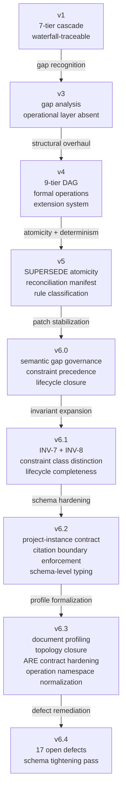

# DDR System Evolution: Observations on Complexity, Stabilization, and the Meta-System Trajectory

> **Document Purpose:** Synthesize the historical evolution of the DDR (Deterministic Design & Requirements) System from its earliest archived form (v1) through the current finalized release (v6.4), with particular attention to the concern of *exploding complexity* in attempts to create a stable, precise application design system framework.

---

## Table of Contents

- [1. Executive Summary](#1-executive-summary)
- [2. Version Genealogy](#2-version-genealogy)
- [3. Structural Evolution: The Numbers](#3-structural-evolution-the-numbers)
- [4. Phase Analysis](#4-phase-analysis)
  - [4.1 Phase I — The Cascade (v1)](#41-phase-i--the-cascade-v1)
  - [4.2 Phase II — The Gap Recognition (v3)](#42-phase-ii--the-gap-recognition-v3)
  - [4.3 Phase III — The Formalization (v4)](#43-phase-iii--the-formalization-v4)
  - [4.4 Phase IV — The Stabilization (v5–v6.0)](#44-phase-iv--the-stabilization-v5v60)
  - [4.5 Phase V — The Tightening (v6.1–v6.4)](#45-phase-v--the-tightening-v61v64)
- [5. Complexity Dynamics](#5-complexity-dynamics)
  - [5.1 Where Complexity Grew](#51-where-complexity-grew)
  - [5.2 Where Complexity Was Reduced](#52-where-complexity-was-reduced)
  - [5.3 The Complexity Paradox](#53-the-complexity-paradox)
- [6. The Meta-System Problem](#6-the-meta-system-problem)
- [7. Stabilization Evidence](#7-stabilization-evidence)
- [8. Remaining Risks](#8-remaining-risks)
- [9. Conclusions](#9-conclusions)

---

## 1. Executive Summary

The DDR System began as a straightforward, 7-tier waterfall-traceable documentation hierarchy designed for LLM-optimized project specifications. Over nine archived versions, it has evolved into a **deterministic, DAG-based meta-system** with machine-verifiable invariants, a formal lifecycle state machine, and an orthogonal extension architecture.

This evolution was not accidental. Each version transition addressed specific, documented failures in the prior version's ability to prevent structural ambiguity. However, each fix introduced new surface area, and each new surface area introduced new categories of potential defect. The result is a system that is objectively *more correct* at v6.4 than at v1 — but one whose **specification-to-concept ratio** has grown by roughly an order of magnitude.

The central question this report addresses: **Has the system reached a complexity equilibrium, or is it on an inflationary trajectory?**

**Finding:** The system has reached a *conditional equilibrium*. The v6.x series shows a clear shift from **structural expansion** (new tiers, new edge types, new operations) to **structural closure** (tighter schemas, fewer valid states, deterministic enforcement). The 17 open issues in the v6.3 tracker are overwhelmingly *tightening* issues — schema defects, lifecycle gaps, and naming conflicts — not requests for new structural concepts. This is the signature of a stabilizing system. However, the equilibrium is conditional because the system's self-hosting contract (where the specification is itself a DDR artifact) creates a recursive governance demand that could restart the complexity cycle if the schema/spec alignment discipline breaks down.

---

## 2. Version Genealogy



| Version | Date       | Primary Contribution                                    | Nature of Change         |
| ------- | ---------- | ------------------------------------------------------- | ------------------------ |
| v1      | 2026-02    | 7-tier cascade, unidirectional authority                 | Foundational design      |
| v3      | 2026-02    | Operational layer gap analysis                           | Diagnostic (no structural change) |
| v4      | 2026-03    | 9-tier DAG, formal operations, extensions                | Major structural expansion |
| v5      | 2026-03    | SUPERSEDE atomicity, rule classification                 | Operational hardening    |
| v6.0    | 2026-03    | Semantic gap governance, constraint precedence            | Semantic closure         |
| v6.1    | 2026-03    | INV-7, INV-8, constraint class distinction               | Invariant expansion      |
| v6.2    | 2026-03    | Project-instance contract, citation boundaries           | Schema tightening        |
| v6.3    | 2026-03    | Document profiling, topology closure, ARE hardening       | Profile formalization    |
| v6.4    | 2026-04    | 17 open defect resolutions from v6.3 audit               | Defect remediation       |

> **Note:** The absence of a v2 in the archive is notable. The jump from v1 to v3 suggests either an unarchived intermediate revision or that the v3 "review" document served as the conceptual v2 without producing a revised specification.

---

## 3. Structural Evolution: The Numbers

| Metric               | v1          | v4  | v5  | v6.0 | v6.3 |
| -------------------- | ----------- | --- | --- | ---- | ---- |
| Tiers                | 7           | 9   | 9   | 9    | 9    |
| Edge Types           | 6           | 4   | 4   | 4    | 4    |
| Formal Axioms        | 0           | 7   | 7   | 7    | 7    |
| DAG Invariants       | 0           | 6   | 6   | 8    | 8    |
| Atomic Operations    | 0           | 7   | 8   | 8    | 8    |
| Lifecycle Statuses   | ~3 implied  | 5   | 6   | 6    | 6    |
| Extension Types      | 0           | 5   | 5   | 5    | 5    |
| Document Profiles    | 0           | 0   | 0   | 0    | 3    |
| Lifecycle Guards     | 0           | 0   | ~4  | ~6   | 9    |
| Spec Size (approx.)  | ~80 lines   | ~800 | ~1000 | ~1200 | ~1400 |

**Key observations:**

1. **Tier count stabilized at v4.** The jump from 7 to 9 tiers (adding XPD and splitting CL) was the last structural expansion. No version since has added or removed a tier.
2. **Edge types were *reduced* at v4.** The consolidation from 6 to 4 edge types (`cites` → `derives`, `reads`+`annotates` → `extends`) is one of the few examples of genuine complexity reduction.
3. **The growth vector shifted.** Post-v4, the specification grew not by adding new structural concepts but by *constraining existing ones more precisely*. Each new invariant, guard condition, or schema constraint narrows the space of valid states.

---

## 4. Phase Analysis

### 4.1 Phase I — The Cascade (v1)

The original DDR was a **documentation hierarchy**, not a design system. Its seven tiers formed a strict linear cascade:

```
SIL → GPCL → FCL → SAL → ICL → CDL → ISL
```

Key characteristics:

- **Unidirectional authority:** Each tier derives from exactly one parent tier.
- **Waterfall-traceable:** The structure mirrors a classic requirements decomposition.
- **LLM-optimized:** Explicitly designed for AI-assisted authoring with atomic traceability.
- **No formal operations:** No INSERT, DELETE, MODIFY, or SUPERSEDE semantics.
- **No lifecycle model:** Nodes had no status progression (DRAFT → ACTIVE → etc.).
- **No extension system:** All concerns were handled within the linear cascade.

**Complexity assessment:** Low structural complexity, but also low *precision*. The system could describe a project, but it could not *validate* one. There was no mechanism to detect orphaned nodes, cycle violations, or stale references.

### 4.2 Phase II — The Gap Recognition (v3)

The v3 archive contains no revised specification — only a review document identifying critical gaps in the v1 architecture. This is significant because it represents the moment the system's authors recognized that a *passive documentation hierarchy* was insufficient for their goals.

Key gaps identified:

- **No operational machinery:** The specification described *what* to document but not *how* to manipulate the documentation graph.
- **No agentic layer:** LLM agents had no formal operations to invoke — they could only read and write unstructured tier content.
- **No validation contract:** There was no machine-verifiable way to determine whether a DDR instance was internally consistent.

**Complexity assessment:** The review itself added no complexity to the system. But it established the *demand* for complexity — the recognition that a documentation hierarchy needs active machinery to be useful. This is the inflection point.

### 4.3 Phase III — The Formalization (v4)

v4 was the **most structurally expansive** version transition. It transformed the DDR from a documentation hierarchy into a formal design system:

| Addition                | Purpose                                              | Complexity Cost                                            |
| ----------------------- | ---------------------------------------------------- | ---------------------------------------------------------- |
| XPD tier (Tier 0)       | Ethical/existential grounding                        | +1 tier, +optional activation logic                        |
| CL tier (Tier 4)        | Technology/infrastructure constraints                | +1 tier, +optional activation logic, +SAL merge semantics  |
| DAG internal model      | Formal graph structure with typed edges              | +node schema, +edge types, +citation rules                 |
| Atomic operations       | INSERT, DELETE, MODIFY, SUPERSEDE, VERIFY, VALIDATE, UNBUNDLE | +7 operations with pre/post-conditions            |
| Extension system        | HRE, DGA, DDE, SCE, ARE as orthogonal overlays       | +5 extension types with read-only constraint               |
| Axioms AX-1–AX-7       | Formal design invariants                             | +7 normative statements                                    |
| Invariants INV-1–INV-6  | Machine-verifiable structural rules                  | +6 invariants                                              |

**The consolidation trade-off:** v4 also *reduced* edge types from 6 to 4, which was a genuine simplification. But the net complexity change was massively positive. The specification roughly 10× in size and shifted from a descriptive document to a prescriptive contract.

**The key design decision:** The extension system was the most important architectural choice in v4. By establishing that all advanced analytical capabilities (risk scoring, hardware recommendations, data dictionary extraction, etc.) live *outside* the Core DAG as read-only overlays, the architects created a **complexity firewall**. The Core DAG could remain structurally simple while arbitrarily complex analysis was handled by Extensions that could not mutate the graph.

### 4.4 Phase IV — The Stabilization (v5–v6.0)

v5 and v6.0 represent the system's transition from *what exists* to *what is guaranteed*:

**v5 contributions:**

- **SUPERSEDE atomicity:** Formalized SUPERSEDE as a three-step atomic operation with rollback semantics. This was driven by the v4 adversarial audit's discovery that partial SUPERSEDE application could corrupt the DAG.
- **SUPERSEDE_PENDING status:** Introduced a transient operational state to track in-flight SUPERSEDE operations — the first status not intended as a stable lifecycle state.
- **Rule classification:** Distinguished `structural` (mechanically verifiable) from `semantic` (requiring human disposition) rules, establishing a formal boundary between what validators can check and what requires human judgment.
- **Reconciliation manifest:** Created a formal schema for recording semantic gaps, unresolvable conflicts, and items requiring human review. This was a direct response to the v4 audit's finding that some rules (XPD-R3, GPCL-R2) are inherently non-mechanizable.

**v6.0 contributions:**

- **Semantic gap governance (INV-7):** Formalized the principle that structural validity may coexist with declared semantic gaps, but only when those gaps are explicitly recorded with human rationale.
- **Constraint precedence hierarchy:** Established a strict ordering (GPCL > CL > SAL > ICL > CDL) to prevent silent constraint overrides.
- **`MISSING_MEDIATOR` gap classification:** Formalized the case where a GPCL performance target has no FCL behavioral mediator, preventing hollow citation chains.
- **`logical` vs. `physical` constraint distinction:** Prevented CL from conflating technology selections with infrastructure ceilings.

**Complexity assessment:** v5–v6.0 added significant specification text but *reduced the space of valid system states*. The operations protocol, lifecycle model, and invariant set together mean that a compliant DDR instance has far fewer degrees of freedom than a v4 instance. This is *productive complexity* — complexity in the specification that reduces complexity in usage.

### 4.5 Phase V — The Tightening (v6.1–v6.4)

The v6.x series is characterized by **schema-level enforcement** of rules that were previously prose-only:

**v6.1:** Added INV-7 (semantic gap governance), INV-8 (lifecycle completeness), and constraint class distinction. These were invariant-level formalizations of patterns already practiced in v6.0.

**v6.2:** Introduced project-instance contracts, tightened citation boundary enforcement, and began schema-level typing of rule identifiers. The v6.2 issues tracker documented **11 issues**, all resolved — predominantly schema defects where the YAML machine contract was weaker than the prose specification.

**v6.3:** The largest single-version set of changes in the v6.x series:

- **Document profiling:** Introduced `project_instance`, `project_instance_express`, and `system_definition` as explicit document profiles, replacing inference-based profile detection.
- **Topology closure:** Restricted `active_tiers` to exactly four canonical ordered sets, closing an entire class of topology ambiguity.
- **Lifecycle authority simplification:** Made `status_transitions` the sole lifecycle authority, removing the parallel `prohibited_transitions` blacklist that was drifting.
- **ARE contract hardening:** Structurally typed the ARE activation states, scoring profiles, and score bounds.
- **Operation namespace normalization:** Closed the canonical operation surface and established `UNBUNDLE_EXECUTE` as the sole commit-phase token.
- **Rule-ID family closure:** Typed invariant, atomic-rule, citation-rule, and extension-rule identifier families.
- **Express Mode structural lock:** Fixed group compositions and enforced the full `express_mode` authority block for express documents.

**v6.4:** The v6.3 issues tracker documents **17 open issues**, all classified as tightening work:

| Severity | Count | Examples                                                                        |
| -------- | ----- | ------------------------------------------------------------------------------- |
| CRITICAL | 3     | SIL parent_ids enforcement, score band boundary ambiguity, DEPRECATED→DIRTY gap |
| MAJOR    | 5     | `extends` in TierRelationship, DEPRECATED→ACTIVE guards, `content` field, DELETE semantics, UNBUNDLE inactive-tier fragments |
| MODERATE | 5     | ISSUE-007 commentary cleanup, GuardIdRef enum→pattern, project constraints, ExtensionRuleId overlap, rule_id uniqueness |
| MINOR    | 4     | version_history date, topology field requirements, errata_log guidance           |

**The critical observation:** None of these 17 issues request new structural concepts. Every one of them identifies a gap between *what the specification declares* and *what the machine contract enforces*. This is the hallmark of a system in the tightening phase — the architecture is stable; the enforcement is catching up.

---

## 5. Complexity Dynamics

### 5.1 Where Complexity Grew

1. **Lifecycle state machine:** From no lifecycle model (v1) to a 6-status closed state machine with 9 guard conditions, SUPERSEDE_PENDING transient state, prior_status recovery, and propagation side-effects (v6.3). This is the single largest source of specification growth relative to concepts covered.

2. **Schema/spec dual authority:** The introduction of a YAML machine contract alongside the Markdown specification created a *two-surface governance problem* — the specification and schema must remain synchronized, and each version surfaces new gaps between them. The v6.2 and v6.3 issues trackers are dominated by these alignment defects.

3. **Express Mode:** The UNBUNDLE protocol (SCAN + EXECUTE, deferred fragment handling, confidence classification, tier annotation requirements, inactive-tier fragment rules) adds significant operational complexity for what is fundamentally a *presentation convenience*. Express Mode is not a reduced system, but documenting the rules for safely transitioning between grouped and ungrouped presentation has consumed disproportionate specification space.

4. **ARE extension:** The Architecture Recommendation Engine is the most complex Extension, with a tri-state activation lifecycle, scoring profiles, score bands, surfacing thresholds, and custom profile contracts. Its complexity rivals some Core subsystems.

### 5.2 Where Complexity Was Reduced

1. **Edge type consolidation (v4):** From 6 to 4 edge types. The merger of `cites` into `derives` (via `derivation_mode: traceability`) and `reads`+`annotates` into `extends` was a genuine vocabulary reduction with no expressiveness loss.

2. **Lifecycle authority unification (v6.3):** Removing the parallel `prohibited_transitions` blacklist and making `status_transitions` the sole authority eliminated dual-authority drift — a real complexity reduction.

3. **Document profiling (v6.3):** While adding three profile types, this *replaced* inference-based profile detection with explicit declaration, reducing the cognitive load on both authors and validators.

4. **Extension system isolation:** The read-only constraint on Extensions means that Core DAG reasoning never needs to consider Extension behavior. This is a *permanent complexity bound* on the Core.

### 5.3 The Complexity Paradox

The DDR system exhibits what might be called the **specification paradox**: each measure taken to reduce ambiguity in *usage* increases complexity in *specification*. Consider the trajectory:

```
v1: "Tiers derive from parent tiers."
     → Ambiguous: What happens if a derivation is purely for traceability?

v4: "Edge types: derives, constrains, implements, extends."
     → Precise but incomplete: 'derives' covers both semantic and traceability uses

v5: "derives supports derivation_mode: semantic | traceability."
     → Complete: Now CIT-R6 can distinguish the two cases
     → But the specification is longer, the schema is more complex, and validators
        must handle a new optional field with backward-compatibility defaults.
```

Each step is *individually justified*. The v4 edge types fixed v1's ambiguity. The v5 derivation_mode fixed v4's conflation. But the cumulative effect is that the specification of a *single edge type* has grown from one sentence to a multi-field contract with conditional semantics, backward-compatibility rules, and cross-referenced citation constraints.

**This is not a bug — it is the inherent cost of determinism.** A system that demands AX-3 ("identical inputs produce unambiguous, mechanically verifiable outputs") must specify every decision boundary. The question is not whether this complexity is justified (it is), but whether the system has reached the *natural boundary* of useful precision.

---

## 6. The Meta-System Problem

The DDR system has a unique structural property: it is designed to be **self-hosting**. The DDR specification is itself a DDR artifact — a `system_definition` document with its own `active_tiers`, `nodes`, and `document_profile`. This creates a recursive governance contract:

```
DDR Spec (v6.3)  →  defines  →  DDR Node Schema
DDR Node Schema   →  validates →  DDR Spec (v6.3)
```

This self-referential loop is elegant but dangerous. It means:

1. **Every specification change must also be a valid schema change.** Adding a new invariant to the specification requires adding corresponding validation logic to the schema, which itself must conform to the specification.

2. **The specification's own complexity contributes to its own governance burden.** The more complex the specification becomes, the more validation it needs, and the more specification surface that validation creates.

3. **Issues compound across surfaces.** The v6.2 issues tracker found 11 issues; the v6.3 tracker found 17. Some of this growth is attributable to more thorough auditing. But some is attributable to the v6.3 resolutions themselves introducing new surface area that generated new defects.

The mitigation strategies the system has adopted:

- **Authority hierarchy:** The YAML pair governs; the Markdown renders. This prevents the specification prose from drifting into a parallel authority.
- **Additive clarification:** The v6.x design philosophy mandates that refinements be additive (clarifications) rather than structural (new tiers/edges).
- **Issue-driven remediation:** The Issues Tracker + Issues Report governance model ensures that every defect is formally documented, triaged, and resolved before producing a new version.

These strategies are sound. But they do not eliminate the recursive pressure — they manage it.

---

## 7. Stabilization Evidence

Several indicators suggest the system is approaching a stable equilibrium:

### 7.1 Issue Character Shift

| Version    | Issues Found | Structural Issues                        | Schema/Tightening Issues                  |
| ---------- | ------------ | ---------------------------------------- | ----------------------------------------- |
| v4 audit   | ~12          | ~8 (edge conflation, tier contradictions) | ~4                                        |
| v6.2 tracker | 11         | 0                                        | 11 (all schema defects or lifecycle gaps) |
| v6.3 tracker | 17         | 0                                        | 17 (all schema defects, lifecycle gaps, or design inadequacies) |

**Zero structural issues** in the last two audit cycles. Every open defect is about making the existing structure *more precise*, not about missing structural concepts.

### 7.2 Core Topology Stability

The 9-tier DAG with 4 edge types has been stable since v4 — approximately **seven version increments** without structural change. The XPD/CL optional activation logic, SAL merge-node semantics, and tier-skipping rules (INV-2) have not required revision.

### 7.3 Axiom Stability

The 7 foundational axioms (AX-1 through AX-7) have been unchanged since v4. No axiom has been added, removed, or reworded. This is strong evidence that the *conceptual foundation* is stable.

### 7.4 Extension System Non-Contamination

Despite the ARE extension reaching significant internal complexity (tri-state activation, scoring profiles, custom profile contracts), **no Extension has required a Core DAG change**. The complexity firewall established in v4 has held. This is arguably the system's most important architectural success.

### 7.5 Specification Growth Rate Deceleration

| Transition   | Spec Growth | Nature                |
| ------------ | ----------- | --------------------- |
| v1 → v4      | ~10×        | Structural expansion  |
| v4 → v5      | ~25%        | Operational hardening |
| v5 → v6.0    | ~20%        | Semantic closure      |
| v6.0 → v6.3  | ~15%        | Schema enforcement    |

The growth rate is declining monotonically, suggesting convergence toward a terminal specification size.

---

## 8. Remaining Risks

### 8.1 Schema/Spec Alignment as Permanent Maintenance

The dual-surface governance model (YAML pair + Markdown rendering) creates a *permanent* synchronization obligation. Every future change to the specification's normative content must be reflected in both surfaces. The v6.2 and v6.3 issue trackers demonstrate that this synchronization is non-trivial — 28 combined issues, predominantly from surface misalignment.

**Risk:** If the issue-tracking discipline degrades, the two surfaces will drift, and "schema-valid" will cease to mean "spec-compliant."

### 8.2 ARE Extension Complexity Creep

The ARE extension is approaching a complexity level that may justify its own sub-specification. Its scoring profiles, activation states, score band intervals, and surfacing thresholds interact in ways that the Core extension system model (read-only overlay) was not designed to govern at this depth.

**Risk:** Future ARE enhancements (new scoring profiles, multi-criteria scoring, profile composition) could stress the Extension system beyond its designed abstraction boundaries.

### 8.3 Express Mode Expansion Pressure

Express Mode is currently the most complex *operational* subsystem relative to its conceptual simplicity. The UNBUNDLE protocol, deferred fragment handling, inactive-tier fragment rules, and confidence classification system together consume significant specification space for what is essentially a "presentation grouping with safe expansion."

**Risk:** If additional consumption modes are proposed (e.g., a "minimal" mode below Express), the pattern would replicate all of this operational machinery for each new mode.

### 8.4 Issue Growth Rate

The observation that v6.3 surfaced 17 issues where v6.2 surfaced 11 is concerning if it represents a trend rather than a one-time result of deeper auditing. If each remediation cycle generates more issues than it resolves (net-positive issue generation), the system is in an inflationary spiral.

**Mitigating factor:** The v6.3 issues are uniformly lower in structural severity than the v6.2 issues. The 17 v6.3 issues include no logical conflicts at the architectural level — only schema defects, lifecycle gaps, and naming inconsistencies. This suggests the increase reflects *audit depth* rather than *regression*.

---

## 9. Conclusions

### 9.1 The System Has Stabilized Architecturally

The Core DAG topology (9 tiers, 4 edge types, SAL merge node, XPD/CL optional activation) has been stable for seven version increments. The axiom set is unchanged. The Extension system's complexity firewall has held. No future version should need to add tiers, edge types, or fundamental operations. **The structural design is complete.**

### 9.2 The Complexity Cost Is Real but Bounded

The specification has grown from ~80 lines to ~1400 lines. This growth is the *inherent cost* of converting an ambiguous documentation hierarchy into a deterministic, machine-verifiable design contract. The growth rate is decelerating and appears to be converging toward an asymptote somewhere in the 1500–1800 line range.

### 9.3 The Primary Risk Is Governance, Not Architecture

The system's stability depends not on architectural innovation but on disciplined maintenance of the schema/spec dual-surface contract. The Issues Tracker governance model is the critical control mechanism. If this discipline is maintained, the system can sustain incremental refinement indefinitely. If it lapses, surface drift will accumulate and eventually require another major remediation cycle.

### 9.4 The Exploding Complexity Concern Is Addressed

The original concern — that attempts to create a stable, precise design framework inherently produce exploding complexity — is partially validated and partially refuted by the DDR evidence:

- **Validated:** The specification grew by an order of magnitude between v1 and v6.3. Every precision gain required new rules, new invariants, and new enforcement machinery. This is irreducible.

- **Refuted:** The growth is *bounded*. The system exhibits clear convergence behavior: structural additions stopped at v4, operational additions stopped at v5, invariant additions stopped at v6.1, and the v6.2–v6.4 cycle is exclusively about schema enforcement of rules already defined. The complexity curve is flattening, not exploding.

The DDR system's evolution demonstrates that **precision and simplicity are fundamentally in tension**, but that this tension can be managed through:

1. **Architectural firewalls** (Extensions cannot mutate Core)
2. **Authority hierarchies** (YAML governs, Markdown renders)
3. **Vocabulary reduction** (6 edge types → 4; dual lifecycle authority → single)
4. **Additive-only refinement** (post-v4: no new structural concepts)
5. **Formal issue governance** (every defect tracked, triaged, and resolved before version increment)

The system is not simple. It was never going to be simple. But it is *stable*, and that stability is what makes it useful.

---

> **Assessment Date:** 2026-04-09
> **Source Material:** `.archive/ddr/` — versions v1, v3, v4, v5, v6.0, v6.1, v6.2, v6.3, v6.4
> **Methodology:** Longitudinal analysis of archived specifications, audit reports, issues trackers, and implementation plans across all archived DDR versions.
